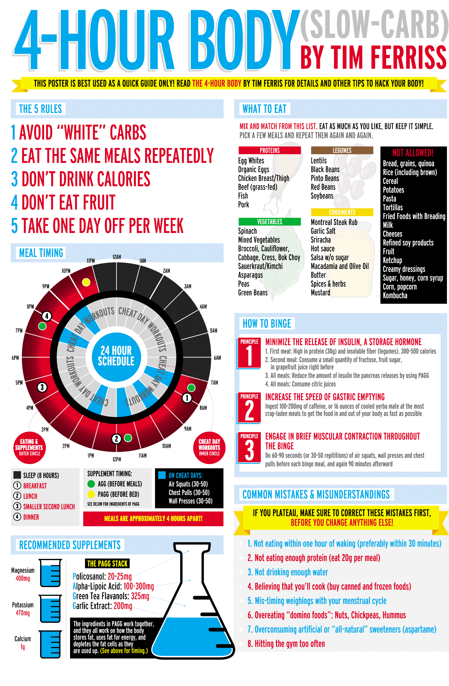

# The lowest effective dosage
- the smallest dose that will deliver your intended result
- to eliminate stored fat, perform a bare minimum to activate a fat-loss cascade of particular hormones
- to build muscle in tiny or significant amounts, complete the bare minimum to activate local (muscle-specific) and systemic (hormonal) development processes
- Physical recreation is not exercise. **Exercising involves performing MED to produce a targeted change**.
# Ground Zero
- **No Tracking = No awareness = No behavioural change**
- tracking the ratio of body composition and not weight. Ask yourself, **"How much is a useful muscle, and how much is useful fat?"**
- four principles of failure proofing
  - **make it conscious**, beware in real-time and not after the fact. For example, taking a picture of what you're about to eat will make you think twice.
  - **Make it a game**, measurement = motivation. Seeing any changes in numbers creates a positive feedback loop
  - **make it competitive**, The potential loss is a more fantastic motivator than the potential reward. Use peer pressure to improve your performance.
  - **make it minor and temporary**, ask yourself, "what is the smallest minimum change that I can make"

# Keep yourself motivated by using tools and rewards
- contracts to tie you to finish what you've started.
- Make a list of incentives for completing a task in its entirety.
- Keep a diary. Maintaining a journal allows you to balance embracing the past and planning for the future.

# Fasting helps your concentration.
- Fasting is an excellent tool for stimulating concentration and metabolism
- Make short fasts, consume all the foods of the day between 6 and 8 hours and then only feed again on the next day.
- Both prevent chronic diseases and increase muscle mass.
- When your body operates with ketones, you get a greater focus, more concentration and more energy because your blood sugar level stabilizes during ketosis.

# The slow-carbohydrate diet
- eats a simple set of meals regularly. This will assist you in staying on track and preventing you from indulging in unhealthy food
- concentrate on slow-burning carbohydrates.
- Allow one 'cheat day' every week to eat whatever you want. This includes even the most sinful treats. This will assist you in remaining motivated.

# Meals to avoid
- **bread, potatoes, sweet potatoes, spaghetti, tortillas, fried meals, wholegrain carbohydrates such as brown rice, wholegrain bread, oats, quinoa, amaranth, starches, and sweets, sugar substitutes** must all be avoided.
- Splenda has no calories. It causes weight gain by raising the number of harmful bacteria in your stomach.
- Fruits are high in vitamins, but they are also high in fructose. Avocados and tomatoes, in moderation, are exceptions to this rule.
- Lemons and limes are also beneficial to one's overall health.
- Dairy such as milk, yogurt, creams, and cheeses should be avoided at all costs.
- the goal of this diet is to reduce blood sugar levels
- carbohydrates in the diet are converted into blood sugar, commonly known as glucose. Foods with a high glycemic index dramatically boost blood sugar levels, such as wheat, rice, and potatoes. Low-glycemic foods, such as vegetables and fish, have little impact on blood sugar levels. Glucose is required for all living things to survive, but excessive quantities cause weight gain, heart disease, and cancer.

# Creating a routine around eating
- the same few meals is critical to optimizing one's diet. It will prevent you from treating yourself to something unhealthy
- Make an effort to consume four meals each day.

# The foods that are allowed
- lean proteins
- Incorporate eggs, fish, vegetables (like lentils and beans), and numerous vegetables.
- Burning through 30g of protein within 30 minutes of awakening,
- most dinners should incorporate green vegetables, similar to broccoli, asparagus, and spinach.
- Eat 'Domino Foods.' such as nuts, chickpeas, and hummus with some restraint.
# Advice on drinking habits
- Try not to drink any calories. The exemption for this rule is red wine, limited to 2 glasses of red wine each day.
- Recommend one of the following kinds of drink: water, unsweetened espresso, and unsweetened tea.
- Stay away from milk, sodas, and organic product juice.
- Drink heaps of sounds beverages to stay away from migraines and sensations of weakness.
# Cheat days aren't optional
- one cheat day out of every week ought to be required
- white carbs, frozen yogurt, desserts, and organic product is entirely permitted on one day out of each week.
- Should begin the day with a high protein and high fibre feast.
- Burn through some grapefruit before eating low-quality nourishment. Grapefruits suck up fat.
# Calories aren't all bad
- calorie limitation can moderate your digestion, which will keep you from losing fat.
- Cheat day is excellent for fat reduction. It helps increase digestion

# magnesium, potassium, and calcium supplementation are essential for weight loss
- low-carb diet causes loss of excess water on non-cheat days and losing magnesium, potassium, and calcium. Hence, supplement these minerals in pill form or eat food sources rich in these minerals.
- Attempting to incorporate almonds, cashews, peanuts and brazil nuts in your day-by-day non-cheat diet.
- Incorporate salmon, dark beans, lentils and mushrooms for more potassium
- spinach is high in each of these three minerals, so you ought to eat it every day
- with high calcium food sources: tofu, collard greens, tempeh, and sardines.

# Gut bacteria are essential for weight loss
- gut microscopic organisms can assist you with getting thinner, adjusting microorganisms for fat loss.
- There are two distinct microbes in your gut: firmicutes and Bacteroides.
- Chubby individuals have more firmicute microorganisms, while lean individuals have more bacteroidetes.
- If you can increase your healthy bacteria, you will become leaner and healthier. Then, being leaner will help further increase your Bacteroidetes, helping you become even leaner and healthier.
- Joining food sources into your eating routine that contain high measures of healthy microscopic organisms.
Kimchi, Japanese natto, sauerkraut, mature fish, garlic, leeks, and chicory are food-based kinds of prebiotics. Supplements with Sedona labs, iFlora prebiotics and Athletic Greens.
- Reasonable gut vegetation assists you with getting thinner and feeling better. It has likewise been related to lessening hypersensitivities, maturing, and in any event, helping with AIDS and Type 2 diabetes indications.

# How to lower blood sugar levels
- eat healthy fat to decrease sugar spikes. More fat before dinner brings down your glycemic reaction.
- Nuts, avocados, and olive oil are primarily extremely healthy fats.
- Try four Brazil nuts and a tablespoon of almonds spread each day
- drink lemon juice. Lemon juice can bring down your glycemic reaction by up to 10%. It additionally contains a high measure of nutrient C.
- cinnamon is a beneficial apparatus in lessening your glucose levels. Cinnamon can bring down your glycemic reaction by up to 29%. There are three types of cinnamon: Cassia, Ceylon, and Saigon.
- However, try not to burn through more than 4 grams of cinnamon each day, as unreasonable utilization might thin your blood.
- Sugar and starch will consistently spike your glucose, yet protein and vegetables can likewise if you eat them excessively quickly.
- If you're accustomed to eating rapidly, try drinking water between thirds to keep yourself occupied. Fluids will likewise help you digest your food better.
- **Chew each mouthful at least 20 times**. Bite every significant piece somewhere around multiple times. You should take at least 30 minutes to complete your dinner.

# Damage control: preventing fat gain
- minimizes the release of insulin. Make sure that your first meal of the day is not a binge meal. For example, making it high in protein
- increase the speed at which the food exits the stomach. Caffeine will make food digestion faster
- engage in brief muscular contractions throughout the binge. Doing muscular contraction opens more gates for calories to go to.
- four horsemen of fat loss (PAGG)
  - policosanol: 20-25 mg
  - Alpha-lipoic acid: 100-300mg
  - Green tea flavanols
  - Garlic extracts
- intake these compounds daily before meals and bed.

sperm, sex and orgasms
<more content here>
sex drive and testosterone
<more content here>
the 15-minute orgasm
<more content here>

# Sleep can be improved from multiple points of view
- If it takes a long time to fall asleep, this is considered early insomnia. If you wake up several times during the night, intermediate insomnia.
- Try not to drink liquor sooner than four hours before bed. A couple of glasses may help you nod off quicker.
Take 200 micrograms of huperzine 30 minutes before sleep time. It will expand your complete REM rest by 30%
taking a cold shower before bed can also help improve your sleep cycle.
- The most essential sleep is the REM phase. Try sleeping in short cycles to trick your brain into entering the REM phase.
- On average, you'll want your room to register between 19-21 degrees Celsius.
  
# pre-bedtime habits
- a high fat and fibre bite will help you feel less drained and irritable toward the beginning of the day.
- You should have two tablespoons of almond margarine and two or three celery sticks before bed. This should assist with keeping your blood sugar levels consistent overnight.
- Eat an enormous dinner brimming with fat and protein three hours before bed.
- Clean up or cold shower before bed and burn through 1.5 to 3 milligrams of melatonin an hour before bed.
- Ultrasonic humidifiers will make your room cool and damp, making it simpler to rest.
- A blue light treatment light for 15 minutes in the first part of the day will give you an increase in energy.
- A night wave beat light will assist you with unwinding, creating a blue light that tenderly ascents and falls.
- Attempt not to utilize your telephone or PC in the evening, as they send blue light. This light will make it harder to rest.
- Utilize the gadgets. Get yourself some blue light obstructing glasses.

# Reversing injuries/adding muscle
- the more muscle you have, the easier it is to keep the fat off.
- Workout A. Make ten sets, each with thirteen reps and as much weight as possible, except for swings with the kettlebell. For the kettlebell, make 20 to 25 swings. Repeat the entire circuit twice:
  - Squatting with dumbells, tighten buttocks at the bottom of the squat for one second before getting up
  - One-sided paddle with two supports
  - Step forward with a dumbbell
  - Open-arm push-ups
  - Swings with a kettlebell with both arms
- workout B:
  - slight incline/decline bench press x 7 (5/5 count)
  - leg press x 10 (5/count) (optional: kettlebell or T-bar swings)
  - stationary bike x 3 minutes at 85+ rpm (to minimize subsequent leg soreness)
- A 6-minute ab workout is also a great way to lose extra fat.
  - double crunch, Russian twist, v-ups, mountain climber, reverse crunch hip thrust, bear crawl hold
  - https://www.youtube.com/watch?v=QEQ02magQik&ab_channel=DaveDreas
- Movement - your first port of call. Use developments to change your stance and activities.
- Manipulation repairs your harmed delicate tissue through pressure prompted by a machine or hand.
- Medication - take substance blends orally or through infusions if all else fails.
- Mechanical - this includes a medical procedure or something to that effect. This will not generally be fundamental, yet maybe for a few.
- A whole-body practice was urged to inspire a maximal hormonal (testosterone, development chemical, and IGF-1) reaction. yet, you should likewise zero in on close to 5-7 multi-joint activities:
  - pullover + Yates' bent row
  - shoulder-width leg press
  - pec deck + weighted dips
  - leg curl
  - reverse thick bar curl
  - seated calf raise
  - manual neck resistance
  - machine crunch.

# Ice Therapy
- the body burns more energy when subjected to cold temperatures
- put an ice pack in your upper trapezius muscle area or behind the neck for about twenty minutes every morning.
- Drink at least 500 ml of ice water as soon as you wake up before eating anything else. You should then have breakfast no more than half an hour later.
- Take icy baths for 5-10 minutes in the morning or before bed.
- Sit in an ice bath for 20 minutes.
- Cold baths have numerous benefits, including releasing fatty acids, increasing adiponectin, stimulating thermogenesis, improving your immune system, and an indirect treatment for depression.

# Running faster/farther
- warm-up exercise help in muscle activation. An example of such an exercise is performing 5-second squats followed by jumps
- Use Tabata protocol to increase endurance, rather than the standard guidance of running high volume.
- This high-intensity interval training involves short bursts of high-intensity exercise with progressively quicker recovery.
- Building a solid undercarriage through max effort lifting

# Subtracting fat
- avoid white carbohydrates, i.e. all bread, cereal, potatoes, pasta, and fried food with breading
- eat the same meals over and over again. Foods that produce the fastest weight loss include proteins, legumes, and vegetables
- don't drink calories instead, drink massive amounts of water, unsweetened tea, wine and low-calorie beverages
- don't eat fruit. You don't need to eat fruit every day
- take one day off per week.
- An example diet
  - breakfast: one cup of coffee and one egg
  - lunch: fajita bowl (Onions, peppers, tomato salsa, tomatillo salsa, sour cream, romaine lettuce, steak, cheese)
  - dinner: fajita bowl (Onions, papers, tomato salsa, tomatillo salsa, sour cream, romaine lettuce, steak, cheese)
- if you NEED to snack between meals, carrots are the best thing to eat but do not eat too many
- the only fruits allowed in the diet are tomatoes and avocado. Avocados should be limited to one unit per day.
- **common mistakes to avoid**
  - not eating within an hour or 30 minutes of waking up and skipping breakfast will result in overeating in the evening
  - not eating enough protein eating proteins in the morning will curb your impulses to eat later and promote a negative fat balance.
  - Do not drink enough water - drinking enough water will ensure optimal liver function for fat loss
  - believing that you'll cook, especially if you are a bachelor
  - mistiming weight loss with your menstrual cycle. 
  - Overeating common foods: nuts, chickpeas, hummus, peanuts, macadamias. These foods are great on a diet but prone to portion abuse.
  - Overconsuming artificial sweeteners - artificial sweeteners provoke increased insulin release
  - hitting the gym too often - doing too much can result in overeating and may reverse your progress.

# Be stronger and live longer
- do four things: the squat, the bench, the deadlift, and compete in lifting competitions.
- Do not attempt a rep unless you're 100% sure you will make it.
- Give NoFap a try
- by donating blood, you rid your body of excess iron.
- Russian kettle swing/whole-body exercise
  - <Insert content here>
- Cat Vomit Exercise.
  - Get on your hands and knees
  - Exhale all the air out of your lungs and pull in your belly towards your spine until you can't pull it further. If it burns, you're doing it correctly
  - Hold your breath in your belly in that position for about 10 seconds, then take one breath
  - Do it again.
  - Try doing this at least 10 times.
- Myotatic Crunch
  - <Insert content here>

# How to breathe for almost as long as David Blaine
- 1 minute 30 seconds of profound relaxing
- 1 minute 15 seconds of cleansing (breathing air out hard)
- hold the breath for an objective of brief 30 seconds
- take three semi-cleanse breaths (the ideal approach to characterize this is between a full breath and a cleanse)
- 1 minute 30 seconds of profound relaxing
- 1 minute 30 seconds of cleansing
- hold the breath for 2 minutes and 30 seconds
- take three semi-cleanse breaths
- 2 minutes of deeply relaxing
- 1 minute 45  seconds of cleaning
- hold your breath as far as might be feasible
- take 3-10 hard semi-cleanse breaths until you recuperate.

# Quotes

"Even if you are predisposed to being overweight, you're not predestined to be fat."

"For a long time, I've known that the key to getting started down the path of being remarkable in anything is to simply act to be remarkable"

"magnesium and calcium are easiest to consume in pill form, and 500 milligrams of magnesium taken before bed will also improve sleep."

"make it conscious, make it a game, make it competitive, make it small and temporary."

"We're what we do repeatedly"

"When in doubt, take 5"

# References
- https://thepowermoves.com/4-hour-body/
- https://www.verywellfit.com/the-4-hour-body-diet-pros-cons-and-how-it-works-4692667
- https://blog.12min.com/the-4-hour-body-summary/
- https://www.getstoryshots.com/books/the-4-hour-body-summary/
- https://dansilvestre.com/4-hour-body-summary/

