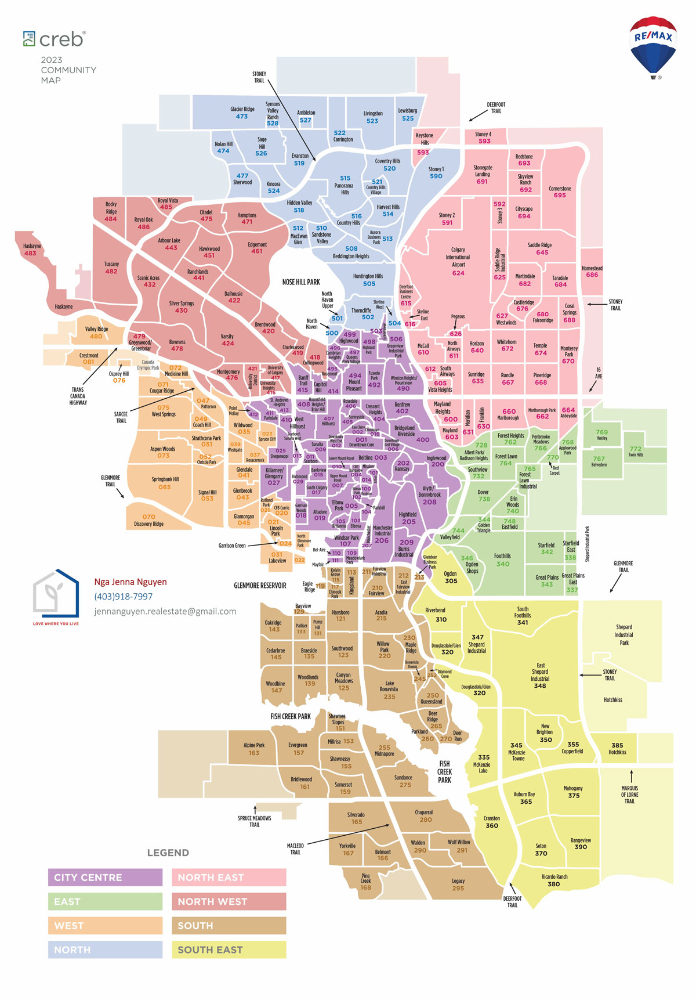

# what are criteria in researching communities

- what are nearby amenities, attractions?
- when was the houses were commonly built?
- what are the common building type?
- what are the zoning regulations? does zoning regulations allows more units per lot?
- what is the population? what is the population growth?
- what is the average income in the area?
- what is the crime rate?
- what are the rentals supply/demand in the communities?
- what are the average rents?
- is it A, B, C, D neighborhood?
- what are the long-term potential appreciation compared to current returns and cashflow?
- what is average house prices?
- what real estate investment strategies could work for this neighborhood?
- 

- what's the prompt for AI to get more information on the communities?
>  - you're an expert in realestate investing, give me detailed outline on the Nolan Hill neighborhood in Calgary with the following questions:
>    - what are nearby amenities, attractions?
>    - when was the houses were commonly built?
>    - what are the common building type?
>    - what are the zoning regulations? does zoning regulations allows more units per lot?
>    - what is the population? what is the population growth?
>    - what is the average income in the area?
>    - what is the crime rate?
>    - what are the rentals supply/demand in the communities?
>    - what are the average rents?
>    - is it A, B, C, D neighborhood?
>    - what are the long-term potential appreciation compared to current returns and cashflow?
>    - what is average house prices?
>    - what real estate investment strategies could work for this neighborhood?

# Calgary communities

- [calgary communities](/calgary-communities-research)

# Edmonton communities

- [edmonton communities](/edmonton-communities-research)

# Red Deer communities

- [red deer communities](/reddeer-communities-research)