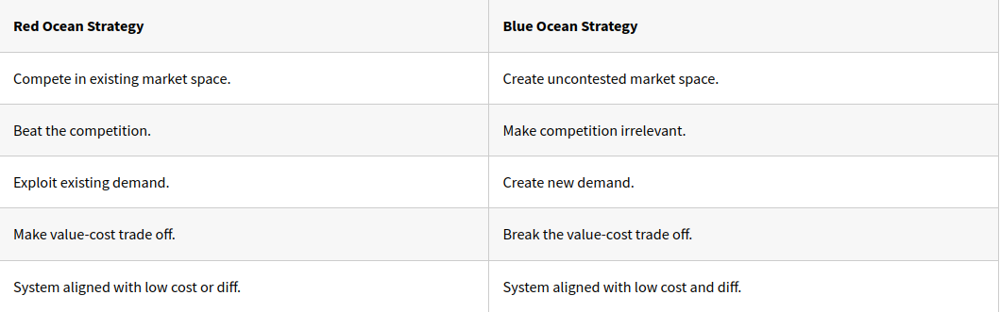
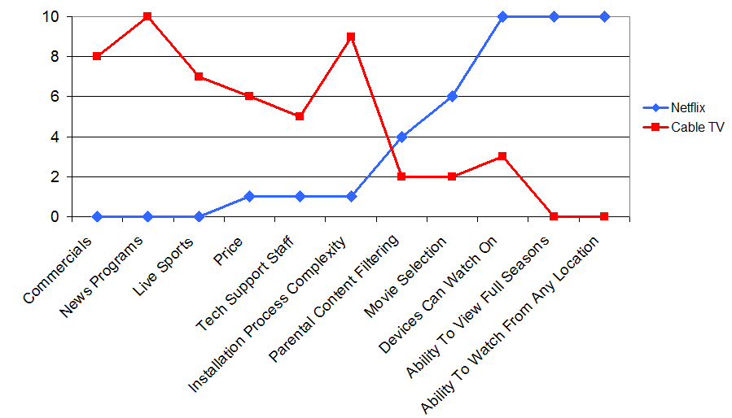
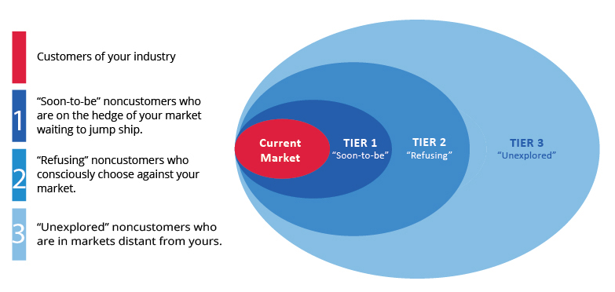
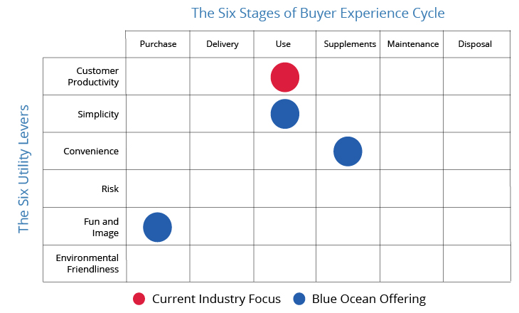

# take-aways

# How do you make the competition irrelevant?
- Aim is not to outperform competitors it is to offer a quantum leap in value that made the competition irrelevant. 

- In overcrowded industries differentiating becomes harder and harder. 

- So, value innovation is the cornerstone of Blue ocean strategy. With it you can pursue low cost and differentiation simultaneously. 

# What is Blue Ocean Strategy?

- Blue oceans denote all the industries not in existence today. Where the rules of the game are waiting to be set. 

- To focus on the red ocean is acceptance of key constraints of war, limited terrain and need to beat enemy to succeed.  

- This denies the distinctive strength of the business world; the capacity to create new market space. 

- Value innovation achieved when system of the company’s utility, price and cost activities are properly aligned. 

- 

# The eight principles of Blue Ocean Strategy:
- **Formulation Principles:**
  - Reconstruct market boundaries.
  - Focus on big picture, not the numbers.
  - Reach beyond existing demand.
  - Get the strategic sequence right.
 
 - **Execution principles:**
  - Overcome key organisational hurdles.
  - Build execution into strategy.
  - Align the value, profit, and people propositions.
  - Renew Blue Oceans.
 
# The Strategy Canvas
- It captures current state of play in the known market space, this allows you to understand where the competition is currently investing. In the forms of products, service and delivery and what the customers receiver from the existing offerings. 

- The value curve is a graphic depiction of a company’s performance across its industry’s factors of competition.  

- To fundamentally shift the strategy canvas of an industry you need for shift strategic focus from competitors to alternatives and customers to non-customers. 

Example: Netflix

# The Four Actions Framework (ERRC)
- The Framework in the form of Questions:
  - Eliminate – Which of the factors that industry takes for granted should be eliminated? 
  - Reduce – Which factors should be reduced well below the industries standard? 
  - Raise – Which factors should be raised well above the industries standard? 
  - Create – Which factors should be created that the industry has never offered? 

 
# Characteristics of a good strategy
1. Focus
   - If the companies value curve lacks focus the business model will tend to be complex and cost structure will be high. 
2. Divergence
   - When it lacks divergence a companies strategy becomes a me-too with no reason to stand apart. 
3. Compelling tagline
   - When it lacks a compelling tagline that speaks to buyers, it is likely to internally driven or classic example of innovation for innovations sake. A good tagline must not only deliver a clear message but also an offering truth or else customers will lose trust and interest. 

 # Formulation of Blue Ocean Strategy:
- ***Reconstruct market boundaries:***
  - The more companies within an industry that share conventional wisdom the more they compete. 
  - Purchasers, users and influencers may overlap.  

 
- ***6 Paths to reconstruct market boundaries:***
  - Look across alternative industries.
  - Look across strategic groups within industries.
  - Look across chain of buyers.
  - Look across complementary product or service offerings.
  - Look across functional or emotional appeal to buyers.
  - Look across time.
 

- ***Focus on the big picture not the numbers:***
  - Visual awakening
  - Visual exploration
  - Visual strategy fair
  - Visual communication
 

- ***Reach beyond existing demand:***
  - Instead of concentrating on customers, need to look at non-customers.  
  - Instead of focusing on customer differences, need to focus on powerful commonalities in what buyers value.

# Three tiers of non-customers

- 

- First tier – sit on the edge of the market, they minimally purchase out of necessity but are mentally non-customers of industry. Jump in value would make them stay and purchase more frequently. 

- Second tier – Non-customers who refuse your industries offerings. Consciously choosing against industry ( better alternatives?) 

- Third tier – Never thought of your market as an option, by understanding key commonalities across these non-customers plus existing customers companies can pull these into the market. 

- Go for largest catchment possible, look across all 3 tiers, search for these commonalities.

# The Buyer Utility Map

- 

# The Steps in the Buyer Cycle:
- Purchase 
- Delivery 
- Use 
- Supplements  
- Maintenance 
- Disposal 

# How to use Strategic Pricing: 
 

- **1st step.** Identify price corridor of the target mass: 

  - Different form, same function 
    - E.g. Model T ford replaced horses but had same function. 

  - Different form and function, same objective 
    - E.g. Cirque de soleil, same overall objective as entertainment. 

- **2nd step**. Pick a level within the price corridor: 

  - Upper level pricing – High degree of legal and resource protection 

  - Mid-level pricing – Some degree of legal and resource protection 

  - Lower-level pricing – Low degree / easy to imitate 

 

- ***Companies would be wise to follow mid to lower if the following apply:***
  - High fixed costs and marginal variable costs. 

  - The attractiveness of blue ocean depends heavily on network externalities. 

  - The cost structure behind blue ocean offering benefits from steep economies of scale and scope. 

  - In these cases volume brings significant cost advantages, something that makes pricing for volume more key.

# Executing Blue Ocean Strategy:
- Organisational hurdles:
  - Cognitive
  - Political
  - Motivational
  - Resource

# Quotes

# References
- https://wisewords.blog/book-summaries/blue-ocean-strategy-book-summary/
- https://profitworks.ca/blog/378-blue-ocean-strategy-formulation-the-strategy-canvas