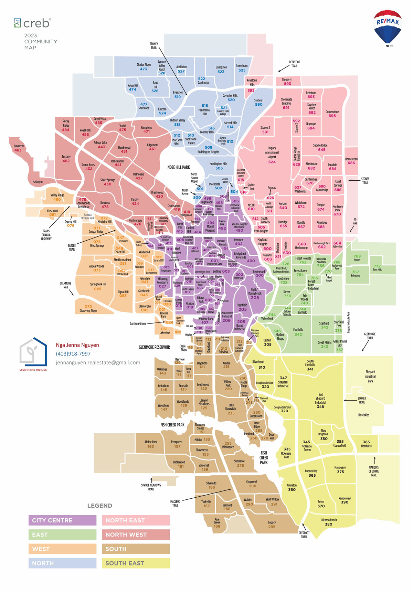

# what are criteria in researching communities

- what are nearby amenities, attractions?
- when was the houses were commonly built?
- what are the common building type?
- what are the zoning regulations? does zoning regulations allows more units per lot?
- what is the population? what is the population growth?
- what is the average income in the area?
- what is the crime rate?
- what are the rentals supply/demand in the communities?
- what are the average rents?
- is it A, B, C, D neighborhood?
- what are the long-term potential appreciation compared to current returns and cashflow?
- what is average house prices?
- what real estate investment strategies could work for this neighborhood?
- 

- what's the prompt for AI to get more information on the communities?
>  - give me detailed outline on the Edgemont neighborhood in Calgary with the following questions:
>    - what are nearby amenities, attractions?
>    - when was the houses were commonly built?
>    - what are the common building type?
>    - what are the zoning regulations? does zoning regulations allows more units per lot?
>    - what is the population? what is the population growth?
>    - what is the average income in the area?
>    - what is the crime rate?
>    - what are the rentals supply/demand in the communities?
>    - what are the average rents?
>    - is it A, B, C, D neighborhood?
>    - what are the long-term potential appreciation compared to current returns and cashflow?
>    - what is average house prices?
>    - what real estate investment strategies could work for this neighborhood?

# Thorncliff, +, +++

- Thorncliffe offers larger lot sizes and older homes,

- **Amenities:** Thorncliffe offers access to a variety of amenities, including schools, playgrounds, and parks like Nose Hill Park. Public transportation is accessible, with several bus routes serving the area. The community also has recreational facilities like the Murray T. Copot Arena and a community center that hosts various activities for residents​
  - easy to access to centre street and deerfoot, downtown, deerfoot mall and airport, safeway, superstore

- **When were the houses commonly built?** Thorncliffe was developed in the 1950s, with most homes dating back to this period. Some homes have been renovated or modernized over time​

- **Common building types** The housing in Thorncliffe is a mix of single-family detached homes, duplexes, townhouses, and low-rise apartments. The neighborhood is primarily residential, with many homes designed for families​

- **Zoning:** The area is largely zoned for residential use, with a combination of detached houses and multi-family units such as duplexes and townhouses​

- **Population:** Thorncliffe has a population of approximately 9,000 residents, with a median age of 40.2 years​

- **Average income:** The median household income in Thorncliffe is around $73,500, which is slightly below the city’s average​

- **Crime rate:** While Thorncliffe is generally safe, its crime rate is about 26% higher than the Calgary average.. However, crime has been on a downward trend in recent years​

- **Supply and demand:** The housing market in Thorncliffe is stable, with moderate demand due to its proximity to downtown Calgary and affordability compared to other areas. Homes typically sell for around $589,900​
​
- **Average rent:** The average rent in Thorncliffe varies depending on the type of property. For a one-bedroom apartment, the average rent is around $1,400, while a two-bedroom apartment can go for $2,028 per month. Townhouses and larger homes have higher rental rates, with some renting for as much as $3,100 per month

- **"A, B, C, D" neighborhood**: Thorncliffe is generally considered a B to C grade neighborhood based on various factors like crime rates, amenities, and housing. Here's a breakdown:

  - Crime: Thorncliffe has a crime rate that is about 26% higher than Calgary's average, which may contribute to its rating being slightly lower in safety​
  - Amenities: It scores highly in amenities, with parks, schools, and transportation options being easily accessible​
  - Housing: The affordability of housing in Thorncliffe is considered above average, and it offers a mix of property types, making it appealing for families and individuals looking for lower-cost housing​

- **Long-term potential vs current returns:** Thorncliffe’s long-term potential lies in its affordable housing market and proximity to major Calgary roads and amenities. It’s a solid choice for both cash flow and future appreciation, particularly if there is an increase in zoning density or continued infrastructure development. While current cash flow is modest, the area’s stability and community engagement make it a good option for long-term investment​
  - C-Train construction on centre street 

- **Strategy:**
  - Buy and Hold
    - Strategy: Purchase properties to rent out while holding them for long-term appreciation.
    - Why it works: Thorncliffe is a well-established neighborhood with stable rental demand due to its proximity to key amenities, schools, and easy access to downtown Calgary. The area is popular among families and working professionals, making it ideal for long-term tenants.
    - Rental Income: Given its stable housing market and reasonable property prices, buy-and-hold investors can generate consistent rental income, particularly with single-family homes and townhomes.
  - Secondary Suite Conversions
    - Strategy: Converting single-family homes into properties with secondary rental suites.
    - Why it works: Many older homes in Thorncliffe sit on large lots, which may offer opportunities to develop legal basement or garage suites. This strategy can help maximize rental income from a single property, making the investment more profitable.
    - Target Tenants: This strategy could appeal to families or professionals looking for affordable housing options, and the additional rental unit can diversify income streams.
  - Renovation and Flipping
    - Strategy: Buying older homes, renovating them, and selling for a profit.
    - Why it works: Many homes in Thorncliffe were built between the 1950s and 1980s, making them prime candidates for renovation. Upgrading these homes with modern finishes and energy-efficient improvements can appeal to buyers looking for move-in-ready homes.
    - Target Buyers: First-time homebuyers or families looking for affordable, updated homes in a mature neighborhood.
  - Infill Development
    - Strategy: Purchasing larger lots and developing new infill properties.
    - Why it works: Thorncliffe has areas where older homes on large lots are being redeveloped into multi-family units or modern single-family homes. This strategy may work particularly well if zoning regulations allow for increased density (e.g., duplexes or townhouses).
    - Potential Returns: Infill projects can command premium prices, especially as demand for newer, energy-efficient homes grows in mature neighborhoods.
  - Rent-to-Own (Lease Option)
    - Strategy: Offering rent-to-own options to tenants.
    - Why it works: Thorncliffe’s relatively affordable home prices make it an attractive area for buyers who may not yet qualify for a mortgage but are looking for a pathway to homeownership. Investors can structure rent-to-own deals to attract tenants who eventually want to buy the property.
    - Benefits: This strategy provides consistent rental income with the potential to sell the property to the tenant in the future, locking in an exit strategy early on.
  - Multi-Family Investment
    - Strategy: Investing in or converting homes into multi-family or duplex properties.
    - Why it works: If zoning permits, creating multi-family units can provide higher cash flow per property. Thorncliffe’s demographic mix of families, professionals, and retirees can support demand for duplexes or multi-family units.

# Ogden, +, +++

- **Nearby amenities:** Ogden offers a mix of amenities, including schools such as Banting and Best Elementary and Sherwood Community School. The community is close to several bus routes and CTrain stations, making public transit convenient. The area also has parks, community centers, and local shopping options​

- **Housing age:** Most houses in Ogden were built between 1912 and the mid-20th century, as it is one of Calgary’s older neighborhoods​

- **Common building types:** The housing stock in Ogden mainly consists of single-family homes, duplexes, and some townhouses. It's a mix of older homes with some newer developments​

- **Zoning regulations:** Ogden has primarily residential zoning, allowing for both single-family and multi-family homes. Calgary has been updating zoning laws recently, potentially allowing for increased density and more units per lot in certain areas​

- **Population and growth:** The population of Ogden is around 8,000. While the area has seen slow growth due to its mature status, development and infrastructure improvements could boost population increases in the future​

- **Average income:** The median household income in Ogden is around $70,817, which is lower than Calgary’s overall average​

- **Crime rate:** The crime rate in Ogden is higher than the Calgary average, with property crime being a particular concern. However, it is safer than 50% of Alberta communities​

- **Rental supply and demand:** Ogden has a healthy rental market, with options ranging from basements to houses. The average rent is about $1,757 across different property types, with demand steadily increasing as the area becomes more attractive to renters​

- **Average rents:** Rents in Ogden vary, with prices ranging from about $1,350 for basement suites to over $2,500 for larger houses​

- **Neighborhood rating (A, B, C, D):** Ogden would be considered a C neighborhood, offering affordability and amenities but facing higher crime rates and lower average incomes compared to some other parts of Calgary​

- **Long-term potential vs. current returns:** Ogden has long-term potential due to its affordability, proximity to downtown Calgary, and recent infrastructure developments. While current cash flow and returns are moderate, increased zoning flexibility and improvements in public transport could enhance property values in the future​
  - Ogden is expected to see significant appreciation as zoning changes allow for more in-fill developments, and the CTrain extension improves accessibility and more connected to downtown

- **Strategy:** Value-add (infill development or legal basement suites)
  - Buy and Hold
    - Strategy: Purchase properties to rent out and hold for long-term appreciation.
    - Why it works: Ogden is an established neighborhood with relatively affordable home prices, making it attractive for investors. The upcoming Green Line LRT extension, which is set to pass through the area, increases the potential for future appreciation. With its proximity to industrial and commercial hubs, rental demand is likely to remain steady.
    - Rental Income: Steady demand for affordable housing from working-class tenants ensures a reliable rental income stream.
  - Secondary Suite Conversions
    - Strategy: Adding a legal secondary suite to single-family homes.
    - Why it works: Many of Ogden's homes are older and sit on larger lots, offering space for secondary suite conversions. Calgary's push for legalizing secondary suites supports this strategy, and Ogden’s affordability makes it feasible to add basement or garage suites to boost rental income.
    - Target Tenants: Dual-suite properties can appeal to both families and individual renters looking for more affordable rental options in an accessible location.
  - Renovation and Flipping
    - Strategy: Buying older homes, renovating them, and selling for a profit.
    - Why it works: Many homes in Ogden were built in the mid-20th century and are now in need of modernization. Investors can purchase these properties at lower prices, renovate them to add value, and sell to first-time homebuyers or families looking for affordable, move-in-ready homes.
    - Target Buyers: First-time buyers or families attracted to a renovated home close to the new Green Line LRT and employment centers.
  - Infill Development
    - Strategy: Purchasing older properties on larger lots for redevelopment.
    - Why it works: Ogden has many older homes on larger lots, providing opportunities for infill development. With the neighborhood's improving infrastructure, including the upcoming Green Line LRT, redeveloping single-family homes into multi-family units, duplexes, or modern single-family homes can generate strong returns.
    - Potential Returns: Infill projects can help meet the demand for modern, affordable homes, and new developments can attract buyers or renters looking for housing close to transportation routes.
  - Multi-Family Investment
    - Strategy: Investing in multi-family or small apartment buildings.
    - Why it works: Ogden has a mix of single-family homes and small multi-family properties. Investors can acquire or develop multi-family buildings to meet the demand from working-class families and individuals who prefer rental accommodations. The neighborhood’s industrial employment centers provide a steady tenant base.
    - Rental Demand: The close proximity to industrial areas and major transportation routes ensures a reliable demand for rental units.
  - Land Banking
    - Strategy: Purchasing vacant or underdeveloped land for future appreciation and development.
    - Why it works: As the Green Line LRT project progresses and infrastructure improves, vacant land or older properties in Ogden may appreciate significantly. Investors can hold onto land or properties for future development when the area’s demand increases.
  - Rent-to-Own (Lease Option)
    - Strategy: Offering properties as rent-to-own options to tenants.
    - Why it works: Ogden is an affordable neighborhood, which can attract tenants who are not yet ready to buy but are interested in homeownership. Offering rent-to-own deals allows tenants to rent while gradually working towards purchasing the property, providing a steady income for the investor and a clear exit strategy.
    - Target Tenants: Tenants who want to eventually transition to homeownership.

# Radisson Heights, SE, +

- **Nearby Amenities and Attractions**
  - Shopping and Services: Radisson Heights is close to 17th Avenue SE (International Avenue), known for its multicultural shops, restaurants, and services. The community is also near the Marlborough Mall and various grocery stores.
  - Parks and Recreation: Albert Park/Radisson Heights Park offers green spaces, playgrounds, and walking paths. The community is near Elliston Park, which hosts the annual GlobalFest fireworks festival.
  - Transit: The community has convenient access to public transit, with multiple bus routes and proximity to the Franklin LRT Station for quick access to downtown Calgary.
  - Schools: The area is home to several schools, including Father Lacombe High School and Radisson Park School.

- **When Were the Houses Commonly Built?**
  - Most homes in Radisson Heights were built between the 1950s and 1970s, though there are also some newer developments and infills. Many properties are older single-family homes, though multi-family dwellings have been added as part of the neighborhood’s gradual redevelopment.

- **Common Building Type**
  - The community primarily features single-family detached homes from the mid-20th century, alongside townhouses, apartment buildings, and some newer infill developments. Bungalows and two-story homes are the most common single-family designs.

- **Zoning Regulations**
  - Radisson Heights has R-C2 zoning in many areas, allowing for duplexes and semi-detached homes. There are also M-C1/M-C2 zones that permit multi-family housing, such as row houses and apartment buildings. This zoning allows for higher density, making it attractive for investors interested in multi-unit developments or adding legal suites to existing properties.

- **Population and Growth**
  - The population of Radisson Heights is around 6,600 people. The area has seen modest population growth over the years, with some revitalization efforts aimed at improving infrastructure and housing stock. The neighborhood's appeal to newcomers, including immigrants and young families, is contributing to steady, moderate growth.

- **Average Income**
  - The average household income in Radisson Heights is approximately $50,000 to $60,000, which is below Calgary's citywide average. The area attracts a working-class population, including immigrants and renters looking for affordable housing close to central Calgary.

- **Crime Rate**
  - Radisson Heights has a moderate crime rate. Like many inner-city neighborhoods, there are occasional reports of property crimes such as thefts and break-ins. However, community safety initiatives and increased development efforts are helping to improve the overall perception of the neighborhood.

- **Rental Supply and Demand**
  - The rental market in Radisson Heights is strong, driven by demand from students, working professionals, and families. Its affordability and proximity to downtown and transit options make it attractive for renters. There is a good balance between supply and demand, with new infills and multi-family units adding to the available rental stock.

- **Average Rents**
  - One-bedroom apartment: $1,100–$1,300/month
  - Two-bedroom apartment: $1,400–$1,700/month
  - Three-bedroom house: $2,000–$2,500/month
  - These rent levels are relatively affordable compared to other Calgary neighborhoods, making Radisson Heights attractive for tenants looking for budget-friendly options.

- **Neighborhood Classification (A, B, C, D)**
  - Radisson Heights is considered a C neighborhood. It is affordable and offers decent access to amenities, but it is still undergoing revitalization, with some areas requiring further development. It remains attractive to renters due to its affordability and location near downtown, but it is not as high-end as other inner-city communities.

- **Long-Term Potential Appreciation vs. Current Returns and Cashflow**
  - Appreciation: The long-term appreciation potential in Radisson Heights is moderate. While the area is not experiencing rapid growth, ongoing redevelopment, infrastructure improvements, and its central location should contribute to steady appreciation over time.
  - Cashflow: Rental properties in Radisson Heights tend to provide good cash flow due to relatively low property prices and strong rental demand. Multi-family homes or properties with legal basement suites can offer particularly strong rental returns.

- **Average House Prices**
  - Detached homes: $350,000–$550,000, depending on the age and condition of the property.
  - Townhouses/duplexes: $250,000–$400,000
  - Condos/apartments: $150,000–$300,000
  - Radisson Heights is one of Calgary’s more affordable inner-city neighborhoods, making it attractive for both first-time buyers and investors.

- **Real Estate Investment Strategies**
  - Buy-and-Hold: Investors can purchase affordable homes and hold them for rental income, benefiting from steady cash flow while waiting for long-term appreciation. The demand for rental housing, particularly for multi-family units, is strong in Radisson Heights.
  - Infill Development: The community's R-C2 and M-C1 zoning allows for infill development, such as duplexes or small apartment buildings. Investors can purchase older homes, tear them down, and build modern multi-family units to maximize rental income and future resale value.
  - Fix-and-Flip: Investors can buy older homes in need of renovation, improve them, and sell at a profit. Given the community's ongoing revitalization and its proximity to downtown, well-renovated homes can attract buyers looking for affordable housing options close to central Calgary.
  - Multi-Family Rentals: Given the zoning regulations and rental demand, multi-family units like duplexes or small apartment buildings can generate strong rental income. Investors can either purchase existing multi-family properties or develop new ones.
  - Student Housing: With the area’s proximity to downtown and affordable rent levels, there is potential to target students or young professionals with shared accommodation or multi-bedroom rental units.

# Forest Lawn

- **Nearby Amenities and Attractions**
  - Shopping and Dining: Forest Lawn is located along 17th Avenue SE (International Avenue), known for its multicultural shops, grocery stores, restaurants, and services. The community offers a wide variety of cuisines, representing cultures from around the world.
  - Parks and Recreation: Elliston Park, located nearby, offers green spaces, picnic areas, and a lake. This park is also the site of GlobalFest, Calgary’s annual international fireworks festival. Additionally, Bob Bahan Aquatic & Fitness Centre offers fitness and recreation opportunities for residents.
  - Transit: The community is well-served by public transit, with multiple bus routes connecting to other parts of the city. It has relatively easy access to downtown Calgary, which is approximately 15 minutes away by car.
  - Schools: Schools in the area include Forest Lawn High School, Patrick Airlie School, and Ernest Morrow School.

- **When Were the Houses Commonly Built?**
  - Homes in Forest Lawn were commonly built between the 1950s and 1980s, with a mix of older single-family homes and more recent developments. Many properties are in original condition, though there has been an increase in redevelopment with new infill projects.

- **Common Building Type**
  - Forest Lawn primarily features single-family detached homes, as well as duplexes, townhouses, and a growing number of apartment buildings. Many of the single-family homes are older bungalows, and there are also several multi-family properties available, reflecting the area’s growing density.

- **Zoning Regulations**
  - The community has a mix of R-C2 zoning (Residential – Contextual One / Two Dwelling District) that allows for duplexes and semi-detached homes, as well as areas zoned for multi-family developments. M-C1/M-C2 zones (Multi-Residential) in parts of Forest Lawn permit higher-density housing, allowing for townhouses and low-rise apartment buildings. This zoning creates opportunities for infill development and multi-family housing, making it appealing to real estate investors looking to increase the number of units on a single lot.

- **Population and Growth**
  - The population of Forest Lawn is approximately 8,700 people. The area has experienced slow but steady population growth, with many new residents attracted by the affordability and proximity to downtown Calgary. Forest Lawn is also home to a large immigrant population, contributing to its diverse and multicultural atmosphere.

- **Average Income**
  - The average household income in Forest Lawn is approximately $50,000, which is below the Calgary average. The area tends to attract working-class families, immigrants, and individuals looking for affordable housing.

- **Crime Rate**
  - Forest Lawn has a moderate to high crime rate compared to other Calgary communities. Property crimes, such as thefts and vandalism, are more common in this area, though the city and community associations have worked to improve safety and address these issues. Crime rates are declining as redevelopment continues and new residents move into the area.

- **Rental Supply and Demand**
  - Forest Lawn has a strong rental market, driven by its affordability and proximity to downtown. The area attracts a wide range of renters, including young professionals, families, and students. Rental properties are in demand, especially for multi-family homes and duplexes, which provide more affordable living options.

- **Average Rents**
  - One-bedroom apartment: $1,000–$1,300/month
  - Two-bedroom apartment: $1,300–$1,600/month
  - Three-bedroom house: $1,800–$2,300/month
  - Rentals in Forest Lawn are generally more affordable than in many other parts of Calgary, making the area attractive for renters seeking lower-cost housing options.

- **Neighborhood Classification (A, B, C, D)**
  - Forest Lawn is typically classified as a C neighborhood. It is affordable and has a strong community feel, but it is still undergoing redevelopment and faces challenges with crime and aging infrastructure. The area is improving, and its potential for revitalization makes it attractive to investors.

- **Long-Term Potential Appreciation vs. Current Returns and Cashflow**
  - Appreciation: Forest Lawn offers moderate long-term appreciation potential. The ongoing redevelopment, infrastructure improvements, and growing diversity make it an area to watch for future growth. The location along International Avenue and the proximity to downtown Calgary contribute to its long-term appeal.
  - Cashflow: Forest Lawn provides solid cash flow potential, especially for multi-family properties or properties with secondary suites. The affordability of the neighborhood combined with high rental demand ensures good rental returns for investors.

- **Average House Prices**
  - Detached homes: $300,000–$450,000, depending on the condition and location of the property.
  - Townhouses/duplexes: $250,000–$400,000
  - Condos/apartments: $150,000–$250,000
  - Forest Lawn remains one of the more affordable communities in Calgary, making it accessible for first-time buyers and investors alike.

- **Real Estate Investment Strategies**
  - Buy-and-Hold: The area’s affordability and high rental demand make Forest Lawn a good candidate for buy-and-hold strategies. Investors can benefit from steady cash flow through rentals, while holding onto the property for long-term appreciation as the area continues to develop.
  - Infill Development: With its R-C2 and multi-family zoning, Forest Lawn is ideal for investors looking to build infill properties such as duplexes or townhouses. Older single-family homes can be redeveloped into higher-density housing, increasing rental income potential.
  - Fix-and-Flip: Forest Lawn’s older homes provide opportunities for investors to buy properties at lower prices, renovate them, and sell at a profit. The area is improving, and updated homes are likely to attract buyers looking for affordable but modernized housing.
  - Multi-Family Rentals: Given the neighborhood’s zoning regulations, investing in multi-family properties such as small apartment buildings or row houses can provide strong cash flow and future appreciation.
  - Affordable Housing Development: Due to the community’s income demographic, there is potential for developers and investors to focus on affordable housing initiatives, which could cater to the demand from lower-income residents and immigrants.

# Mahogany, deep south

- **Nearby Amenities and Attractions**
  - Known for its large man-made lake, Mahogany is a master-planned community that attracts families and offers high-quality amenities. It has numerous parks, schools, and access to Mahogany Village Market. The area is experiencing steady growth, but newer homes dominate the market, which may take time to appreciate fully.
  - There was caution against investing in newer communities without established amenities. These areas are seen as long-term plays, where amenities are still being developed, but they may suffer from lower initial rental demand.
  - Shopping and Dining: Mahogany is located near Mahogany Village Market, which offers a variety of shops, grocery stores, restaurants, and services. Residents also have easy access to Seton Urban District, which includes the South Health Campus, supermarkets, and entertainment options.
  - Recreation: Mahogany is centered around its lake, which offers private beaches, boating, and fishing. The community also features parks, pathways, playgrounds, and sports fields. Mahogany Wetlands is a large natural reserve that promotes outdoor activities like hiking and birdwatching.
  - Schools: Schools in the area include Divine Mercy Catholic School and Mahogany School, with more planned as the community grows.
  - Transit: Mahogany is connected to downtown Calgary by major routes like Stoney Trail and Deerfoot Trail, and the community is serviced by Calgary Transit.

- **When Were the Houses Commonly Built?**
  - Mahogany is one of Calgary’s newer communities, with homes mostly built from the mid-2000s to the present. Development in Mahogany continues, with more phases planned as the community expands.

- **Common Building Type**
  - Mahogany offers a mix of single-family detached homes, semi-detached homes, townhouses, and condominiums. The community also features estate homes with lake access, and many new homes are designed with modern layouts and energy-efficient features.

- **Zoning Regulations**
  - Mahogany’s zoning includes a variety of residential designations, allowing for a range of housing options from single-family homes to multi-family developments. The zoning allows for higher-density housing in certain areas, including townhouses and apartment buildings. These zoning regulations support the development of both family homes and more affordable housing units, catering to a wide range of residents.

- **Population and Growth**
  - The population of Mahogany is currently around 10,000–12,000 people, but the community is expected to grow significantly as more phases are developed. Mahogany has seen rapid growth in recent years due to its appeal as a lake community with modern amenities.

- **Average Income**
  - The average household income in Mahogany is higher than the Calgary average, estimated at $100,000+. This reflects the community’s appeal to young professionals, families, and those purchasing new or estate homes.

- **Crime Rate**
  - Mahogany is considered a low-crime community. Being a newer and more affluent area, it tends to have lower levels of reported crime compared to older or inner-city neighborhoods in Calgary.

- **Rental Supply and Demand**
  - Mahogany has a moderate rental market due to its appeal to families and young professionals. However, as a relatively new and upscale community, most properties are owner-occupied. Rental demand tends to be for townhouses, semi-detached homes, and apartments due to affordability constraints on detached homes.

- **Average Rents**
  - One-bedroom apartment: $1,500–$1,800/month
  - Two-bedroom apartment: $1,800–$2,200/month
  - Three-bedroom house: $2,500–$3,200/month
  - Given the community’s higher-end appeal, rent prices in Mahogany are on the higher side compared to other Calgary neighborhoods, especially for lake-access properties and estate homes.

- **Neighborhood Classification (A, B, C, D)**
  - Mahogany is classified as an A neighborhood due to its premium amenities, new housing stock, and desirable lakefront lifestyle. It attracts higher-income residents and offers a mix of housing options for various demographics.

- **Long-Term Potential Appreciation vs. Current Returns and Cashflow**
  - Appreciation: Mahogany has strong long-term appreciation potential. As the community continues to grow and attract new residents, property values are expected to rise. The community's appeal as a lakefront development and the ongoing construction of new homes contribute to this growth.
  - Cashflow: While Mahogany offers good appreciation potential, cash flow may be limited due to the higher initial property prices. Investors may find better rental cash flow from multi-family units or townhouses, but single-family homes may offer slower rental income returns.

- **Average House Prices**
  - Detached homes: $550,000–$1,200,000 (with lakefront estate homes at the higher end)
  - Townhouses/duplexes: $350,000–$550,000
  - Condos/apartments: $250,000–$400,000
  - Mahogany's home prices are on the higher end, reflecting its status as a desirable lake community.

- **Real Estate Investment Strategies**
  - Buy-and-Hold: Given the long-term appreciation potential, a buy-and-hold strategy could work well in Mahogany. Investors can hold onto properties for future value increases, particularly in single-family homes and estate properties.
  - Infill Development: While most of Mahogany is still under development, the community’s zoning allows for higher-density housing in certain areas. Investors can focus on townhouses or multi-family units for better rental returns and future resale opportunities.
  - Short-Term Rentals: Mahogany’s lake access and proximity to recreational areas make it appealing for short-term rentals (such as Airbnb), especially for visitors looking for a premium experience. This could be particularly effective during summer months when demand for lakefront properties peaks.
  - Luxury Home Investment: Mahogany is known for its estate homes with private lake access. Investors could consider high-end homes that cater to families seeking a luxury lifestyle. These properties offer long-term appreciation and can attract higher-income tenants if used as rentals.
  - New Build Strategy: Investors can purchase pre-construction homes at a lower cost and sell them later as the community develops. This strategy can capitalize on the growing popularity of Mahogany, with new phases and amenities continuing to enhance property values.
  - rent-to-own: Mahogany offers a master-planned community with luxury amenities (e.g., lake access), making it ideal for families seeking high-quality living. The area is still developing, so long-term appreciation is likely as more amenities are completed. Rent-to-own could work well here, as families may aspire to eventually own in this desirable area.

# Walden, deep south

- **Nearby Amenities and Attractions**
  - A relatively newer development, Walden offers a mix of modern, eco-friendly homes with easy access to parks and walking paths. Its close proximity to shopping centers like Walden Gate boosts demand. The townhomes and single-family homes are popular among younger buyers (and young families).
  - There was caution against investing in newer communities without established amenities. These areas are seen as long-term plays, where amenities are still being developed, but they may suffer from lower initial rental demand.
  - Shopping & Dining: Walden is near several amenities, including the Gates of Walden commercial area, which has grocery stores, restaurants, and other essential services. It is also close to Shawnessy Shopping Centre.
  - Parks & Recreation: The community offers extensive green spaces, parks, and pathways. Fish Creek Provincial Park is nearby for outdoor activities such as hiking and biking.
  - Schools: There are a few schools nearby in neighboring communities like Legacy and Chaparral, with new schools expected as Walden continues to develop.
  - Healthcare: The South Health Campus hospital is just a short drive away in Seton.
  - Accessibility via the Stoney Trail ring road boosts demand

- **Housing and Construction Timeline**
  - Development: Most homes in Walden have been built starting around 2008. It is a relatively new community, so housing stock is modern, with energy-efficient features.

- **Housing Types:** The community offers a mix of single-family homes, townhouses, and condominiums. Single-family homes dominate, but there are also multi-family developments aimed at first-time buyers.

- **Zoning Regulations**
  - Zoning: The area is primarily zoned for residential development with allowances for single-family homes, duplexes, and townhomes. There are areas where higher-density housing is permitted, and developers are working to increase options for more units per lot.
  - Secondary Suites: Depending on the property and zoning, secondary suites may be permitted, which could offer additional rental income.

- **Population and Growth**
  - Population: As of recent data, Walden has a growing population, currently estimated at around 5,000–6,000 residents. The population continues to grow as new phases of development open up.
  - Growth Potential: As a newer community in Calgary's southeast, Walden's population is projected to increase, driven by new housing developments and infrastructure improvements.

- **Average Income**
  - Income: The average household income in Walden is around $110,000–$120,000, reflecting a mix of young families and professionals.

- **Crime Rate**
  - Crime Rate: Walden has a relatively low crime rate, typical of Calgary’s newer suburban communities. Most incidents are minor, such as vehicle break-ins, but it remains a safe neighborhood overall.

- **Rental Supply/Demand**
  - Rental Demand: Rental demand is moderate in Walden, driven by young professionals and families looking for affordable, modern housing close to the city's southeast employment hubs.
  - Rental Supply: The community offers a good supply of rental properties, especially townhomes and single-family homes.
  - Average Rent: Rental rates for townhouses and single-family homes range between $1,800 to $2,500 per month, depending on size and amenities.
  - considered more affordable with high rental demand

- **Neighborhood Class: A, B, C, or D**
  - Class: Walden would likely be classified as a B neighborhood. It is a growing, middle-income area with good amenities, safety, and modern infrastructure.

- **Long-Term Potential Appreciation and Cashflow**
  - Appreciation: Walden's property values are expected to appreciate steadily over the long term due to continued development, proximity to future infrastructure (like the Green Line LRT), and its appeal to young families.
  - Cashflow: Investors can expect moderate rental returns, with newer homes appealing to tenants who prefer modern, energy-efficient housing. Appreciation potential is high as the community matures.

- **Average House Prices**
  - House Prices: The average price for a single-family home in Walden is between $500,000 and $600,000. Townhomes and condominiums tend to be priced lower, between $350,000 and $450,000.

- **Real Estate Investment Strategies**
  - Buy and Hold: With its growth potential, this strategy could work well. Long-term appreciation is likely, especially with planned infrastructure developments like the Green Line.
  - Secondary Suite Conversions: If zoning allows, adding a legal secondary suite can boost rental income and help with mortgage payments.
  - New Construction: Since Walden is a newer development, purchasing pre-construction homes can offer opportunities for price appreciation by the time the homes are completed.
  - Rental Property Investment: With a good supply of family-friendly homes, Walden is a solid market for rental properties, especially for tenants who want access to schools and green spaces.
  - House Hacking: Renting out part of a home, like a basement suite, can be a viable strategy for maximizing income while living in the property.

# Copperfield, deep south

- There was caution against investing in newer communities without established amenities. These areas are seen as long-term plays, where amenities are still being developed, but they may suffer from lower initial rental demand.

- **Nearby Amenities and Attractions**
  - Shopping: Copperfield is close to McKenzie Towne, which offers various shopping, dining, and entertainment options. Nearby retail hubs include 130th Avenue SE, where residents can find grocery stores like Sobeys, Walmart, and various retail outlets.
  - Parks & Recreation: The community has several parks, playgrounds, and walking trails. Residents enjoy Copperfield Park and several nearby green spaces for outdoor activities. Mahogany Beach and Fish Creek Provincial Park are also a short drive away.
  - Schools: Copperfield has local schools such as St. Isabella School and Copperfield School. Additional schools are accessible in neighboring communities.
  - Healthcare: The nearest healthcare facility is the South Health Campus, which offers comprehensive medical services.
  - The area’s appeal is further supported by its access to 130 Avenue SE’s shopping district.
  - Accessibility via the Stoney Trail ring road boosts demand

- **Housing and Construction Timeline**
  - Development: Copperfield is a relatively newer community, with most homes built between 2002 and 2015.
  - Building Types: The community is diverse in terms of housing, including single-family detached homes, townhouses, and low-rise condos.

- **Zoning Regulations**
  - Zoning: The area primarily features R-1 and R-2 zoning for single-family and duplex homes, along with some multi-family zoning that allows for townhouses and low-rise condos. Secondary suites are allowed in certain zones, but you would need to verify based on the exact property and its zone designation.

- **Population and Growth**
  - Population: Copperfield has a population of approximately 7,500 to 8,000 residents.
  - Growth: As a newer suburban community, Copperfield has seen significant growth over the past decade and continues to attract families and professionals due to its affordability and modern amenities.

- **Average Income**
  - Income: The average household income in Copperfield is estimated to be around $90,000 to $100,000, indicating a middle-income demographic.

- **Crime Rate**
  - Crime Rate: Copperfield is considered to have a low to moderate crime rate, similar to other suburban communities in Calgary. Most incidents are related to property crime, such as theft, with minimal violent crime reports.

- **Rental Supply and Demand**
  - Supply/Demand: The rental market in Copperfield is active, especially among families and young professionals. The area offers a range of rental options, from apartments to single-family homes.

- **Average Rents:** The average rent for a 3-bedroom house in Copperfield is between $1,800 and $2,300 per month, depending on the property condition and proximity to amenities.

- **Neighborhood Classification: A, B, C, D**
  - Classification: Copperfield can be classified as a B-class neighborhood. It offers newer homes, strong amenities, and a family-friendly atmosphere, but it is still more affordable compared to Calgary’s higher-end neighborhoods.

- **Long-Term Potential Appreciation and Cashflow**
  - Appreciation: Copperfield offers moderate appreciation potential as Calgary continues to expand southeastward. Its newer homes and community infrastructure make it attractive to both homebuyers and investors, though appreciation may be slower compared to more central or established neighborhoods.
  - Cashflow: Investors can expect solid rental demand, particularly for single-family homes and townhouses, offering good cash flow potential with steady rental income.

- **Average House Prices**
  - House Prices: The average price for a single-family home in Copperfield ranges from $450,000 to $550,000, with townhouses and condos typically priced between $250,000 and $350,000.

- **Real Estate Investment Strategies**
  - Buy and Hold: Copperfield is ideal for buy-and-hold investors looking for newer properties with lower maintenance costs. Steady rental demand from families makes this strategy effective for long-term cash flow and moderate appreciation.
  - Townhouse or Condo Investment: Investing in townhouses or condos can be a good entry-level strategy in Copperfield. These properties are affordable and in demand among young professionals and small families.
  - Secondary Suites: For investors looking to boost rental income, adding or legalizing secondary suites in existing homes can provide extra cash flow. This strategy works well in Copperfield, particularly for larger homes.
  - Fix and Flip: While Copperfield is a newer community, there may be opportunities to renovate and update homes built in the early 2000s. A modern renovation could increase the market value of a home in this appealing family neighborhood.
  - Rent-to-Own: This strategy could work well for potential homeowners who are not yet financially ready to purchase but are looking for a pathway to ownership in a newer, family-oriented community like Copperfield.
  - Turnkey rentals: Copperfield offers affordable homes and townhouses, which are ideal for turnkey rentals. Investors can purchase properties that are ready to rent immediately, taking advantage of the area’s popularity among renters seeking affordable living close to 130 Avenue SE.

# Cranston, deep south

- **Nearby Amenities and Attractions**
  - Shopping & Services: Cranston is close to Seton Urban District, which includes major retailers, restaurants, and the South Health Campus hospital. Additionally, residents have easy access to local services such as grocery stores, cafes, and other essential services.
  - Parks & Recreation: Cranston is known for its abundance of parks, playgrounds, and pathways, including direct access to Fish Creek Provincial Park and the Bow River. Cranston has Cranston Century Hall, which offers a community center, sports courts, and playgrounds. Cranston Ridge offers beautiful walking paths and views.
  - Schools: Cranston has several schools, including Cranston School (K-4), Christ the King School (K-9), and Dr. George Stanley School (5-9). More schools are available in neighboring communities.
  - Health & Wellness: South Health Campus, located in the nearby Seton area, is a major healthcare hub offering comprehensive medical services.
  - Accessibility via the Stoney Trail ring road boosts demand

- **Housing and Construction Timeline**
  - Construction Period: Cranston's development began in the early 2000s, with many homes built between 2001 and 2015, but new construction continues in some areas.
  - Common Building Types: Cranston offers a mix of single-family detached homes, townhouses, estates, and condominiums. The architecture is modern, with many homes featuring open-concept designs and amenities attractive to families.

- **Zoning Regulations**
  - Zoning: Cranston’s zoning includes R-1 (single-detached homes) and R-2 (duplexes and secondary suites), as well as zoning for multi-family units in certain areas. There is potential for legal secondary suites in specific areas, but zoning and regulations should be verified for each property.

- **Population and Growth**
  - Population: Cranston's population is approximately 17,000-19,000, making it a fairly large suburban community. The population has been steadily growing due to ongoing development.
  - Growth: Cranston continues to experience growth, driven by its family-friendly amenities, proximity to green spaces, and newer housing options.

- **Average Income**
  - Income: The average household income in Cranston is approximately $110,000 to $120,000, reflecting its appeal to middle to upper-middle-income families and professionals.

- **Crime Rate**
  - Crime Rate: Cranston is considered a low-crime neighborhood compared to the Calgary average. Like many suburban communities, most incidents are minor property crimes or theft, with low occurrences of violent crime.

- **Rentals Supply and Demand**
  - Supply/Demand: Cranston has a moderate to high demand for rental properties, particularly single-family homes and townhouses that appeal to families. The close proximity to schools, parks, and healthcare facilities makes it attractive for renters.

- **Average Rents:** The average rent for a single-family home ranges from $2,000 to $2,400 per month. Condos and townhouses typically rent for between $1,600 and $1,900 per month.

- **Neighborhood Classification (A, B, C, D)**
  - Classification: Cranston is often classified as an A/B-class neighborhood due to its newer homes, desirable amenities, and relatively high-income residents. It is considered a sought-after community for families and professionals.

- **Long-Term Potential for Appreciation and Cashflow**
  - Appreciation: Cranston offers strong long-term appreciation potential, given its desirable location, modern amenities, and continued development in nearby areas like Seton. The appeal of newer homes, combined with the proximity to natural spaces and infrastructure, supports steady price growth.
  - Cashflow: Investors may find decent cashflow potential, especially in single-family homes and townhouses that attract long-term tenants, such as families and professionals.

- **Average House Prices**
  - House Prices: The average price for a single-family detached home in Cranston is around $550,000 to $650,000, depending on the size and type of property. Townhouses and condos tend to range between $280,000 and $400,000.

- **Real Estate Investment Strategies**

  - Buy and Hold: Cranston is ideal for buy-and-hold investments due to steady appreciation, family-oriented amenities, and a strong rental market. Long-term investors can benefit from consistent rental demand and property value increases.
  - Townhouse and Condo Investment: With affordable townhouses and condos, Cranston offers entry-level investment opportunities that cater to young professionals and families. These units can be rented easily, with solid rent-to-price ratios.
  - Secondary Suites: Investors can explore properties with secondary suites or consider adding one where zoning permits, which can boost rental income from single-family homes.
  - Fix and Flip: While Cranston is a newer community, some of the early 2000s homes may offer opportunities for cosmetic upgrades, especially if acquired at a discount.
  - Rent-to-Own: The community’s appeal to young families and professionals makes rent-to-own a viable strategy, providing flexibility to renters while offering a potential future sale for investors.

# Midnapore, south

- **Nearby Amenities and Attractions:**
  - Shopping & Services: Midnapore offers convenient access to multiple amenities, including Midnapore Mall and big-box retailers. It is also close to Shawnessy Shopping Centre, which features grocery stores, restaurants, and entertainment options.
  - Parks & Recreation: The community is home to Midnapore Lake, a private lake exclusively available to residents, providing recreational opportunities such as swimming, skating, and fishing. Additionally, Fish Creek Provincial Park, one of Canada’s largest urban parks, borders Midnapore, offering hiking, biking, and picnic areas.
  - Schools: Midnapore has several public and Catholic schools, including Midnapore School and Father James Whelihan School, serving families in the area.

- **Housing and Construction Timeline:**
  - Construction Period: Homes in Midnapore were primarily built in the 1970s and 1980s, making it one of Calgary's established suburban neighborhoods.
  - Common Building Types: The community features a mix of single-family detached homes, townhouses, and some low-rise apartment buildings. The majority of homes are detached, catering to families looking for suburban living near green spaces.

- **Zoning Regulations:**
  - Zoning: Midnapore includes a range of residential zoning, including R-C1 (single-detached), R-C2 (duplexes), and some multi-family zoning in specific areas. These zoning regulations generally permit the construction of secondary suites, especially with proper approval from the city.

- **Population and Growth:**
  - Population: The population of Midnapore is around 7,000 residents. As an established community, population growth has been moderate, with a relatively stable demographic base, consisting mainly of families and long-term residents.
  - Population Growth: The population growth is slow but steady, with more infill development and some new housing replacing older structures over time.

- **Average Income:**
  - Income: The average household income in Midnapore is approximately $90,000 to $100,000, aligning with Calgary's middle-income suburban neighborhoods.

- **Crime Rate:**
  - Crime Rate: Midnapore is considered a low to moderate-crime neighborhood. Most crimes are minor property-related offenses, with relatively low violent crime compared to citywide averages.

- **Rentals Supply and Demand:**
  - Supply/Demand: There is a moderate rental demand in Midnapore, with many families and young professionals seeking homes. Townhouses and single-family homes tend to be the most sought-after rental types, due to proximity to amenities and schools.

- **Average Rents:**
  - Single-family homes: Between $1,800 and $2,300 per month.
  - Townhouses and condos: Rents range between $1,400 and $1,800 per month.

- **Neighborhood Classification (A, B, C, D):**
  - Classification: Midnapore is generally considered a B-class neighborhood. It offers a blend of affordability, accessibility to services, and recreational amenities, attracting middle-income families and professionals.

- **Long-Term Potential for Appreciation and Cashflow:**
  - Appreciation: The long-term potential for appreciation is solid, driven by its lakeside location, proximity to Fish Creek Provincial Park, and ongoing urban development in the surrounding areas. Property values in Midnapore have seen steady appreciation over the past decade, though not as fast as newer developments.
  - Cashflow: For investors, there is moderate potential for positive cashflow. The established community atmosphere and proximity to amenities ensure a stable tenant pool, especially for single-family homes and townhouses.

- **Average House Prices:**
  - House Prices: The average price for a single-family home in Midnapore is approximately $500,000 to $600,000. Townhouses and condos tend to be priced between $250,000 and $350,000, depending on their size and condition.

- **Real Estate Investment Strategies:**
  - Buy and Hold: Midnapore is well-suited for a long-term buy-and-hold strategy. The neighborhood’s stable rental market and potential for appreciation make it a solid choice for long-term investors, particularly for detached family homes.
  - Townhouse Investments: The relatively affordable townhouses and condos offer a good entry point for investors. These units are in demand due to their affordability and location near amenities and parks.
  - Secondary Suites: Investors can explore the addition of legal secondary suites in detached homes where zoning allows. This strategy can significantly increase rental income potential, especially in larger properties with basement suites.
  - Fix and Flip: Some of the older homes in Midnapore may offer fix-and-flip opportunities, especially those from the 1970s that may need modernization. Renovating homes and reselling them could yield a healthy profit given the neighborhood's desirability.
  - Rent-to-Own: The family-oriented atmosphere and proximity to schools make Midnapore a great candidate for rent-to-own investment strategies, allowing potential homeowners to rent while preparing for future ownership.
  - vacation rental: Midnapore’s lake access makes it attractive for families and vacationers. A buy-and-hold strategy works well here for long-term appreciation, and vacation rentals (e.g., Airbnb) could be lucrative during peak seasons due to the community’s lakeside appeal.

# Queensland, south

- **Strategy:** Buy-and-hold and renovation
  - **Why:** Queensland offers affordable homes with proximity to Fish Creek Park. Renovating older properties can significantly boost value, while a buy-and-hold strategy allows investors to capitalize on long-term appreciation as the area becomes more desirable.

- **Nearby Amenities and Attractions**
  - Shopping: Queensland is near several shopping centers, including Deer Valley Shopping Centre and Southcentre Mall, which offer grocery stores, retail shops, restaurants, and other essential services.
  - Parks & Recreation: Queensland has access to several green spaces, including Fish Creek Provincial Park, which is one of the largest urban parks in Canada. The park offers walking and biking trails, picnic areas, and natural attractions.
  - Schools: There are several schools in and around the Queensland community, including Queensland Downs School and Wilma Hansen Junior High School.
  - Healthcare: The South Health Campus is one of the nearest major medical facilities, and there are various clinics and healthcare services in the vicinity.

- **Housing and Construction Timeline**
  - Development: Most homes in Queensland were built in the 1970s and 1980s, making it an established suburban community.

- **Building Types:** The area is primarily composed of single-family detached homes, along with a mix of townhouses and low-rise apartment buildings.

- **Zoning Regulations**
  - Zoning: The community features mainly R-C1 (single-family homes) zoning, but there are some areas with R-C2 that allow for duplexes and other multi-family housing. Secondary suites are possible with city approval depending on the property.

- **Population and Growth**
  - Population: Queensland has a population of around 4,800 to 5,000 residents.
  - Growth: As an established neighborhood, population growth is moderate, with slight increases due to new developments or infill housing.

- **Average Income**
  - Income: The average household income in Queensland is estimated to be between $75,000 to $85,000 per year, reflecting a middle-income demographic.

- **Crime Rate**
  - Crime Rate: Queensland has a low to moderate crime rate, with most issues being related to property crime, such as vehicle break-ins or theft. Violent crime is less common, making it a relatively safe community.

- **Rental Supply and Demand**
  - Supply/Demand: Queensland experiences steady rental demand, particularly from families and working professionals seeking affordable housing options close to schools and recreational areas.
  - Rental Prices: The average rent for a 3-bedroom home ranges from $1,500 to $2,100 per month, depending on the condition and location of the property.

- **Neighborhood Class: A, B, C, D**
  - Classification: Queensland is considered a B- to C-class neighborhood. It offers good value for families, is relatively affordable, and provides access to amenities and green spaces, making it appealing for both renters and homeowners.

- **Long-Term Potential Appreciation and Cashflow**
  - Appreciation: Queensland offers moderate appreciation potential, largely driven by its proximity to Fish Creek Provincial Park and established community amenities. It is not expected to experience rapid price increases but provides steady long-term growth.
  - Cashflow: Rental demand remains stable, providing opportunities for consistent cash flow, especially for homes with secondary suites or updated rental properties.

- **Average House Prices**
  - House Prices: The average price for a single-family home in Queensland ranges from $350,000 to $450,000, while townhouses and condos are priced between $200,000 to $300,000.

- **Real Estate Investment Strategies**
  - Buy and Hold: Queensland’s affordable home prices and stable rental market make it an ideal community for long-term investment. Buy-and-hold investors can benefit from steady cash flow and gradual appreciation over time.
  - Secondary Suite Development: Converting basements or adding secondary suites to single-family homes is a great way to increase rental income. This strategy works well in areas like Queensland, where demand for rental units is stable.
  - Fix and Flip: There is potential for profit through renovating older homes and selling them, especially as first-time homebuyers or investors look for updated properties in an affordable price range.
  - Multi-Family Investment: Investors can consider townhouses or small multi-family properties, which may offer diversified income streams. Queensland has some R-C2 zoned areas, providing opportunities for duplex or multi-family investments.
  - Rent-to-Own (Lease Option): This strategy could work well for potential homeowners who may not yet have the financial capacity to purchase but would be interested in renting with the option to buy in the future.

# Aspen, west

- One of Calgary’s most affluent neighborhoods, Aspen offers luxury homes and townhomes. It is close to top-rated schools, including private institutions, and has great access to shopping and dining options along 17th Avenue. Aspen homes are expensive, but their long-term appreciation is steady but higher-entry point.

- The west side is known for its proximity to quality schools, parks, and amenities like Westside Rec Centre

- **Strategy:** Luxury buy-and-hold
  - **Why:** Aspen is a luxury market with high-end homes that attract affluent buyers and renters. A buy-and-hold strategy here offers long-term appreciation, particularly as demand for premium homes continues to rise. Investors can rent properties to high-income tenants seeking proximity to top schools and amenities.

# Springbank Hill, west

- Similar to Aspen, Springbank Hill is a luxury community offering large estate homes. This neighborhood appeals to affluent buyers, especially those looking for proximity to nature with access to the West LRT line.

- The west side is known for its proximity to quality schools, parks, and amenities like Westside Rec Centre

- **Strategy:** Luxury rental or long-term hold
  - **Why:** Similar to Aspen, Springbank Hill is ideal for luxury rentals targeting high-income families and professionals. Investors can generate steady cash flow from high rents while holding properties for long-term appreciation.

# Glenbrook, west

- Glenbrook offers a mix of older bungalows, newer infills, and townhouses. Close to Mount Royal University, Glenbrook is attractive to investors seeking rental properties due to its affordability and demand from students and young professionals.

- The west side is known for its proximity to quality schools, parks, and amenities like Westside Rec Centre

- **Strategy:** Fix-and-flip or buy-and-hold with suites
  - **Why:** Glenbrook’s mix of older homes and newer infills makes it suitable for fix-and-flip investments, especially for those looking to renovate older properties. Adding legal basement suites to existing homes also increases rental yield, making it attractive for long-term investors.

# Strathcona Park, west, +

- **Nearby Amenities and Attractions**
  - Recreational: Strathcona Park offers several nearby parks such as Edworthy Park and the extensive Bow River Pathway system, perfect for walking, biking, and outdoor activities. Westside Recreation Centre provides a wide range of fitness, aquatics, and sports programs.
  - Shopping: Residents have access to major retail hubs like Signal Hill Centre and Westhills Towne Centre, which offer grocery stores, restaurants, and various retail outlets.
  - Transportation: Strathcona Park is well-connected by major roads such as Bow Trail and Sarcee Trail, offering quick access to downtown Calgary. Public transport options include several bus routes.

- **House Construction Period**
  - Most houses in Strathcona Park were built in the 1980s and 1990s, although the community also has newer developments from the 2000s.

- **Common Building Types**
  - The community features primarily single-family detached homes, many of which are larger, estate-style properties. There are also some townhomes and duplexes, offering a mix of housing options for different buyers.

- **Zoning Regulations**
  - The area is primarily zoned for low-density residential (R-1) development, which means the majority of properties are single-family homes. However, some areas may be zoned for multi-unit developments, particularly townhomes or duplexes. Redevelopment or infill housing may be possible depending on specific zoning bylaws and lot sizes​

- **Population and Growth**
  - Strathcona Park has a stable population with a moderate growth rate, appealing to families and professionals. According to the 2021 Census, it had a population of approximately 7,200​
  - Population growth is steady, driven by the community's desirability and amenities.

- **Average Income**
  - The average household income in Strathcona Park, Calgary, is estimated to be higher than the city average, reflecting the neighborhood’s affluent character. According to available data, median household incomes in this area generally range between $120,000 and $140,000 per year. This positions Strathcona Park as a relatively wealthy community, catering to professionals and families with higher-than-average earnings​

- **Crime Rate**
Strathcona Park has a relatively low crime rate compared to other Calgary communities, making it a desirable and safe neighborhood for families. Most incidents reported are minor in nature.

- **Rental Supply/Demand**
  - The demand for rental properties in Strathcona Park is moderate, particularly for larger family homes and townhouses. The area attracts professionals and families, leading to steady rental demand.

- **Average Rents**
  - Single-family homes typically rent for $2,500 to $3,500 per month, depending on size and condition. Townhouses and smaller units are in the $1,800 to $2,200 range.

- **Neighborhood Rating (A, B, C, D)**
  - Strathcona Park is considered an "A" neighborhood due to its affluence, safety, and high desirability. It offers great amenities, making it a sought-after area for homebuyers and renters alike.

- **Long-Term Potential for Appreciation**
  - The neighborhood has strong long-term appreciation potential. Strathcona Park is a well-established community, and property values have consistently risen due to its proximity to downtown, parks, schools, and recreational facilities. The upscale nature of the area supports stable property values, although appreciation may be slower compared to gentrifying areas​

- **Average House Prices**
  - The average house price in Strathcona Park is around $945,000, with some larger homes or more modern builds exceeding this price point. Townhouses and smaller homes range between $600,000 and $750,000​

- **Real Estate Investment Strategies**
  - Buy and Hold: This is a suitable strategy in Strathcona Park, given the area’s stable property values and steady rental demand. Investors can expect long-term capital appreciation while earning consistent rental income.
  - Upscale Rentals: The community attracts affluent tenants, allowing investors to rent out larger homes to professionals or families for a premium.
  - Infill Development: For developers, there could be opportunities to purchase older homes on larger lots and redevelop them into new, modern housing.
  - townhouse rentals: Strathcona Park is popular for families due to its larger homes and proximity to schools. A buy-and-hold strategy works well here, while investors can also focus on townhouse rentals, which are highly sought after by young families and professionals.

# Tuscany, northwest, +

- **Nearby Amenities and Attractions:**
  - Parks and Recreation: Tuscany is surrounded by beautiful parks and trails. Notable nearby attractions include Bowness Park, Bowmont Park, and the Tuscany Club, a private recreational facility for residents. The community also offers access to the Rocky Mountains for outdoor activities like hiking, skiing, and camping.
  - Shopping: Tuscany offers local shopping at the Tuscany Market, which includes grocery stores, restaurants, and essential services. For more extensive shopping, Crowfoot Crossing is nearby, featuring a large selection of shops, dining, and entertainment options.
  - Schools: Tuscany has several schools within the community, including Tuscany Elementary School and St. Basil Catholic School.
  - Transportation: Tuscany has access to the Tuscany CTrain Station, making commuting to downtown Calgary convenient.

- **Housing Development and Building Types:**
  - When Houses Were Built: The majority of homes in Tuscany were built between the 1990s and early 2000s, making it a relatively newer community compared to others in Calgary.
  - Common Building Types: Tuscany primarily consists of single-family detached homes, but there are also townhouses and condominiums in the area. Homes are typically modern with various architectural styles.

- **Zoning Regulations:**
  - Zoning: Tuscany is zoned primarily for low-density residential development (R-1 and R-2 zones), meaning the focus is on single-family homes and some duplexes. While most lots are zoned for single-family residences, some areas allow for duplexes or townhomes.
Multiple Units: While the zoning generally supports single-family homes, some areas allow for semi-detached homes or townhomes but not higher-density developments.

- **Population and Growth:**
  - Population: Tuscany has a population of around 19,500 residents (2023), making it one of the larger communities in Calgary.
  - Population Growth: Tuscany has seen steady growth since its development in the 1990s due to its family-friendly atmosphere, amenities, and location. Growth has stabilized as the community is now largely developed.

- **Average Income:**
  - Average Income: The average household income in Tuscany is approximately $120,000 to $130,000, reflecting its status as a middle-to-upper-income community.

- **Crime Rate:**
  - Crime Rate: Tuscany has a relatively low crime rate, which contributes to its reputation as a safe, family-friendly neighborhood. Most crimes in the area are non-violent and property-related, such as minor thefts.

- **Rental Market and Demand:**
  - Rental Supply and Demand: Tuscany's rental market has moderate demand due to its family-oriented nature, proximity to schools, and access to the CTrain. However, the community is more owner-occupied, with limited rental supply.

- **Average Rents:** Rent for a single-family home in Tuscany ranges from $2,000 to $2,800 per month, while condos and townhomes typically rent for around $1,500 to $1,800 per month.

- **Neighborhood Classification:**
  - Neighborhood Classification: Tuscany is considered an A-class neighborhood, with its strong demand, amenities, and family-friendly environment contributing to high property values.

- **Long-Term Appreciation Potential:**
  - Appreciation vs. Cash Flow: Tuscany offers strong long-term appreciation potential due to its desirable location, amenities, and proximity to transit. While cash flow from rentals might be moderate, the community's stability and demand make it a good bet for appreciation.

- **Average House Prices:**
  - Average House Prices: The average price of a single-family home in Tuscany is around $600,000 to $700,000, with some higher-end homes reaching above $800,000. Townhomes and condos are priced lower, ranging from $300,000 to $400,000.

- **Real Estate Investment Strategies:**
  - Buy and Hold for Appreciation: Tuscany's strong long-term appreciation potential makes it ideal for a buy-and-hold strategy. Investors could purchase a property and benefit from gradual value growth over the years.
  - Single-Family Rentals: While Tuscany is more owner-occupied, renting out a single-family home can generate steady rental income, especially for families seeking a safe, well-connected neighborhood.
  - Townhouse or Condo Rentals: For those seeking lower entry costs, investing in townhomes or condos for rental purposes could work, particularly for younger professionals or small families.
  - Rent-to-Own: Given the family demographic in Tuscany, a rent-to-own strategy could appeal to young families looking to buy in the future but needing a more flexible purchasing arrangement initially.
  - short-term rentals: Tuscany’s family-friendly nature and good transit access make it ideal for buy-and-hold investments. Short-term rentals targeting professionals and families visiting the city could also be an option due to Tuscany’s proximity to tourist attractions

# Silver Springs, northwest

- Close to the Bow River, Silver Springs is an older community offering a variety of home styles. Its proximity to parks and good schools keeps this neighborhood appealing for both families and investors.

- **Strategy:** Buy-and-hold or house hacking
  - **Why:** Silver Springs offers strong rental demand due to its location near parks and schools. Investors can house-hack by living in one part of the home and renting out the other (e.g., a basement suite), reducing living expenses while generating rental income.

# Ranchlands, northwest, +

- A more affordable option in the northwest, Ranchlands offers a mix of townhomes and single-family homes. It is a good choice for first-time homebuyers and investors looking for steady rental income, especially with its proximity to major transportation routes.

- **Strategy:** Turnkey rentals or value-add
  - **Why:** Ranchlands provides affordable housing options with stable rental demand. Investors can pursue turnkey rental properties for immediate cash flow or invest in value-add opportunities by updating older homes.

# Varsity, northwest, +

- **Nearby Amenities and Attractions**
  - Shopping and Dining: Varsity is conveniently located near Market Mall, one of Calgary’s largest shopping centers, offering a range of retail stores, restaurants, and services. It is also close to Crowfoot Crossing, another major shopping area, and Dalhousie Station for additional shops and services.
  - Recreation: Varsity has several parks and green spaces, including Bowmont Park and Nose Hill Park nearby, offering outdoor recreational opportunities. Additionally, the Silver Springs Golf and Country Club is close by for golf enthusiasts.
  - Health: Foothills Medical Centre and Alberta Children’s Hospital are just minutes away, making the community popular among healthcare professionals.
  - Education: Varsity is home to University of Calgary, attracting students and faculty to the area. It also has various schools, such as Varsity Acres School and Marion Carson School, and is close to SAIT.

- **When Were the Houses Commonly Built?**
  - Varsity was developed in the 1960s and 1970s, with most homes built during this period. The area features older homes, though some properties have been renovated or redeveloped over time.

- **Common Building Type**

  - Varsity offers a mix of:
    - Single-family detached homes
    - Townhouses
    - Apartment buildings
    - Duplexes
    - The neighborhood is known for its large lot sizes and mid-century architecture, with many homes retaining their original character.
    - older bungalow

- **Zoning Regulations**
  - Varsity has a mix of residential zoning, including R-C1 (Residential – Contextual One Dwelling District), which primarily permits single-family homes, and R-C2 (Residential – Contextual Two Dwelling District), allowing for semi-detached and duplex homes. There are also areas zoned for multi-family developments. These zoning regulations allow for potential infill developments and redevelopment projects, making it appealing for investors looking to add more units per lot.

- **Population and Growth**
  - Varsity has a population of approximately 12,500 residents, and the population has remained relatively stable over the years due to its established nature. However, there is a trend toward infill housing and redevelopment, leading to a slight increase in density in some parts of the neighborhood.

- **Average Income**
  - Varsity is an affluent neighborhood with an average household income of around $100,000–$120,000. This higher income level reflects the professional demographic, with many residents working in healthcare, education, and nearby business centers.

- **Crime Rate**
  - Varsity is considered a low-crime area. It is known for being a safe and family-friendly community, with lower-than-average crime rates compared to other Calgary neighborhoods.

- **Rental Supply and Demand**
  - Varsity has strong rental demand, particularly from students and faculty at the University of Calgary and professionals working at the nearby Foothills Medical Centre. The mix of apartment buildings, townhouses, and homes with secondary suites provides a range of rental options.

- **Average Rents**
  - One-bedroom apartment: $1,500–$1,700/month
  - Two-bedroom apartment: $1,800–$2,200/month
  - Three-bedroom house: $2,500–$3,200/month
  - Due to Varsity's proximity to the university and hospitals, rental prices tend to be on the higher side, especially for houses with secondary suites.

- **Neighborhood Classification (A, B, C, D)**
  - Varsity is classified as an A neighborhood due to its desirable location, proximity to major amenities like the University of Calgary and Market Mall, and its safety and affluence.

- **Long-Term Potential Appreciation vs. Current Returns and Cashflow**
  - Appreciation: Varsity has strong long-term appreciation potential due to its established status and proximity to key amenities like the University of Calgary and Foothills Medical Centre. Homes in Varsity tend to hold their value well, making it a stable investment choice.
  - Cashflow: The rental market in Varsity is robust, but cash flow might be limited due to the higher property prices. Investors may find better cash flow with multi-family properties or homes with secondary suites.

- **Average House Prices**
  - Detached homes: $600,000–$900,000
  - Townhouses/duplexes: $400,000–$600,000
  - Condos/apartments: $250,000–$450,000
  - Prices in Varsity are on the higher end, reflecting its status as a sought-after community in Calgary.

- **Real Estate Investment Strategies**
  - Buy-and-Hold: Varsity is ideal for a buy-and-hold strategy due to its stable property values and strong demand from renters, particularly university students and healthcare workers. Investors can benefit from both rental income and long-term appreciation.
  - Infill Development: With older homes and larger lots, Varsity presents opportunities for infill development. Investors can redevelop properties into duplexes or multi-family units to maximize rental income.
  - Student Housing: Proximity to the University of Calgary makes Varsity a prime location for student housing investments. Investors could purchase or convert homes to offer rental suites or multi-tenant properties.
  - Multi-Family Rentals: Varsity has a good supply of multi-family housing, such as apartment buildings and townhouses. These properties can provide steady rental income, particularly from students, young professionals, and healthcare workers.
  - Renovation and Flipping: Older homes in Varsity offer opportunities for renovation and flipping. Investors can update mid-century homes to meet modern standards and sell them at a premium.

# Beddington Heights, north

- **Nearby Amenities and Attractions**
  - Beddington Heights is a well-established community with numerous amenities nearby, including:
    - Shopping: Beddington Towne Centre and nearby Deerfoot City offer a variety of retail stores, grocery options, and restaurants.
    - Recreation: The community has parks such as Beddington Park and is close to Nose Hill Park, one of Calgary's largest parks, ideal for hiking and outdoor activities.
    - Schools: The community is served by Beddington Heights School (K-6), St. Bede Elementary School, and is close to Notre Dame High School.
    - Transportation: The community has good public transit access, with several Calgary Transit bus routes serving the area, and it is well-connected to Deerfoot Trail and 14th Street for commuters.
  - Known for its affordability, Beddington is ideal for first-time buyers and investors. It offers good access to major roads and amenities, but the community’s housing stock is primarily older homes, which might need renovations.

- **When Were the Houses Commonly Built?**
  - Most homes in Beddington Heights were built in the 1970s and 1980s, a period during which the area saw significant suburban development. The architecture reflects the styles of that era, with many homes retaining their original character, though some have been renovated.

- **Common Building Type**
  - Beddington Heights primarily features:
    - Single-family detached homes
    - Townhouses
    - Semi-detached homes There are also a few low-rise apartment buildings in the community.

- **Zoning Regulations**
  - Beddington Heights is primarily zoned for low-density residential (R-C1 and R-C2 zoning), which supports single-family homes and semi-detached homes. There are opportunities for infill development and adding secondary suites, subject to city approvals. The zoning allows for limited multi-family developments but is mostly focused on maintaining the low-density suburban character.

- **Population and Growth**
  - The population of Beddington Heights is approximately 11,600 residents. The community is mature, and population growth is slow, with much of the housing stock established. However, there is potential for redevelopment and infill projects, which could slightly increase density in the coming years.

- **Average Income**
  - The average household income in Beddington Heights is estimated to be around $80,000 to $90,000, reflecting a mix of working-class and middle-class families.

- **Crime Rate**
  - Beddington Heights experiences a moderate crime rate relative to other communities in Calgary. While there are occasional incidents, the community is generally considered safe and family-friendly.

- **Rentals Supply/Demand**
  - The rental market in Beddington Heights is relatively stable. The demand for rental properties is driven by families and individuals seeking affordable housing. The community's proximity to major roads and amenities makes it appealing for renters, though it is not as competitive as areas closer to the downtown core.

- **Average Rents**
  - 3-bedroom house: Approximately $1,700 to $2,200/month
  - Townhouses: Around $1,500 to $1,800/month
  - Apartments: Typically $1,200 to $1,500/month for a 2-bedroom unit

- **Neighborhood Classification (A, B, C, D)**
  - Beddington Heights would be classified as a B neighborhood. It is a middle-income area with good amenities, decent access to transportation, and a safe environment. The housing is affordable, making it appealing for both renters and families.

- **Long-term Potential Appreciation vs. Current Returns and Cashflow**
  - Appreciation: Beddington Heights has moderate long-term appreciation potential due to its established nature. It may not see rapid growth compared to newer developments, but its affordability and location make it a stable choice for gradual appreciation.
  - Cashflow: The rental market provides steady income, especially for townhomes and duplexes. Investors can expect decent cash flow, particularly if they focus on multi-family homes or properties with secondary suites.

- **Average House Prices**
  - As of 2024, the average home price in Beddington Heights is around $330,000 to $625,000, depending on the type and size of the property​
  . Single-family homes range in the higher end, while townhouses and semi-detached homes are typically more affordable.

- **Real Estate Investment Strategies**
  - Buy-and-Hold: Given the affordability of homes and stable rental demand, Beddington Heights is suitable for buy-and-hold strategies. Investors can benefit from long-term appreciation and steady rental income.
  - Infill Development: With larger lots and older homes, there may be opportunities for redevelopment or adding secondary suites to maximize rental potential.
  - Fix-and-Flip: The older homes may offer opportunities for renovations and flipping, especially if purchased at lower prices and updated to modern standards.
  - Rental Properties: Multi-family homes, such as duplexes or townhouses, are in demand for rental purposes. Properties with legal secondary suites or the potential for suite development could also yield good returns.

# Huntington Hills, north

- **Nearby Amenities and Attractions:**
  - Huntington Hills is well-equipped with numerous amenities, including:

- Recreational facilities: Huntington Hills Community Centre offers sports, fitness programs, and social activities. It also has skating rinks and a gym.
  - Parks: Close to Nose Hill Park, one of Calgary's largest parks, and features smaller parks and playgrounds within the community.
  - Shopping: Beddington Towne Centre and Deerfoot City are nearby, providing retail stores, grocery options, and dining.
  - Schools: Huntington Hills is home to several schools, including Catherine Nichols Gunn School, Alex Munro School, and St. Hubert School.
  - Housing Construction:
  - Huntington Hills was primarily developed during the 1960s and 1970s, with the majority of the housing stock reflecting mid-century architecture and larger lot sizes.

- **Common Building Types:**
  - The community predominantly consists of:
    - Single-family detached homes
    - Semi-detached homes
    - Townhouses A mix of bungalows and two-story homes is common, as well as some multi-family apartment buildings and condominiums.

- **Zoning Regulations:**
  - Zoning in Huntington Hills is primarily low-density residential (R-C1 and R-C2), which supports single-family homes, duplexes, and potential secondary suites. Some areas of the community may allow for higher-density residential developments like townhomes or small apartment buildings, subject to city zoning bylaws and approvals.

- **Population and Growth:**
  - The population of Huntington Hills is around 13,000 residents. As a mature community, its population growth is relatively stable, with slight changes due to redevelopment and the movement of families.

- **Average Income:**
  - The median household income in Huntington Hills is approximately $70,000 to $75,000, slightly below Calgary’s overall median income, reflecting the middle-income demographic of the area.

- **Crime Rate:**
  - Huntington Hills has a moderate crime rate, with most incidents being property-related. The area is considered relatively safe, though it experiences some of the challenges common to older urban communities.

- **Rental Supply and Demand:**
  - The rental market in Huntington Hills is healthy, driven by demand from families, young professionals, and students. The availability of single-family homes and secondary suites makes it appealing for renters.

- **Average Rents:**
  - Single-family homes: $1,800 to $2,200 per month
  - Townhouses: $1,400 to $1,600 per month
  - Apartments and basement suites: $1,000 to $1,400 per month

- **Neighborhood Classification (A, B, C, D):**
  - Huntington Hills is generally classified as a B or C+ neighborhood. It offers affordability, proximity to amenities, and is family-friendly, but it lacks the premium features of more upscale neighborhoods.

- **Long-Term Potential Appreciation vs. Cashflow:**
  - Appreciation: Huntington Hills is a mature community with moderate long-term appreciation potential. While growth may be slower than in new developments, the affordability and location contribute to steady value increases over time.
  - Cashflow: The area offers good cash flow opportunities for rental properties, especially if secondary suites are added or properties are converted for multiple tenants.

- **Average House Prices:**
  - As of 2024, the average house price in Huntington Hills ranges from $350,000 to $550,000, depending on the type of property and its condition.

- **Real Estate Investment Strategies:**
  - Buy-and-Hold: Due to its affordability and steady rental demand, Huntington Hills is suitable for long-term buy-and-hold strategies, offering decent cash flow.
  - Secondary Suite Development: With larger lots and zoning that supports secondary suites, adding or legalizing basement suites can significantly increase rental income.
  - Fix-and-Flip: There are opportunities to purchase older homes, renovate them, and sell at a higher value, particularly as some properties may be outdated.
  - Multi-family Rentals: Townhouses and duplexes in Huntington Hills are in demand for rentals, offering stable income streams.
  - House hacking (e.g., renting out a basement suite) can also help homeowners offset their mortgage costs.

# Whitehorn, northeast, +

- **Nearby Amenities & Attractions:**
  - Whitehorn offers a range of amenities and attractions:
    - Village Square Leisure Centre: This recreational facility provides swimming pools, gyms, fitness programs, and a library.
    - Schools: There are several schools, such as Annie Gale Junior High and Colonel J. Fred Scott Elementary School.
    - Transportation: The Whitehorn LRT Station provides excellent access to downtown Calgary and other areas, and the community is close to major roadways like 52nd Street and McKnight Boulevard.
    - Shopping & Dining: Close to shopping centers like Sunridge Mall and local businesses, offering retail, grocery, and dining options​
  - Whitehorn is a diverse community with strong rental demand, especially among families. Its proximity to the CTrain and Peter Lougheed Centre makes it a desirable location for renters and homeowners alike.
  - Working-class communities close to transit and employment hubs like the airport.
​
- **When Were the Houses Commonly Built?**
  - Whitehorn was established in 1973, and most of the houses were built during the 1970s and 1980s, providing a mix of architectural styles common during that era​

- **Common Building Types:**
  - The neighborhood primarily features single-family detached homes, townhouses, and low-rise condominiums. You will also find duplexes and homes with secondary suites​

- **Zoning Regulations:**
  - Whitehorn's zoning is mainly R-C1 (low-density residential), which supports single-family homes. Some areas are zoned for R-C2, allowing for duplexes and secondary suites. Certain sections may be eligible for higher-density zoning, especially with redevelopment​

- **Population & Population Growth:**
  - Whitehorn has a diverse population of around 11,000 residents. While population growth is stable due to its mature status, there may be some slight fluctuations as older homes are redeveloped or rented​

- **Average Income:**
  - The average household income in Whitehorn is approximately $70,000, which is on par with the middle-income demographic. The income levels vary based on family size, property type, and employment​

- **Crime Rate:**
  - Whitehorn experiences a moderate crime rate, mainly focused on property crimes like theft. However, overall safety in the community is considered average for Calgary​

- **Rentals Supply/Demand:**
  - Whitehorn has a strong rental market, driven by its proximity to transportation, schools, and the airport. Homes with secondary suites are particularly attractive to renters, and the demand for rental units remains consistent​

- **Average Rents:**
  - Single-family homes: $1,600 to $2,200 per month
  - Townhouses: $1,400 to $1,700 per month
  - Basement suites: $800 to $1,200 per month

- **Neighborhood Classification (A, B, C, D):**
  - Whitehorn would generally be classified as a B or C neighborhood. It offers affordability, accessibility to public transport, and family-friendly amenities, though it lacks some of the upscale features found in more premium neighborhoods​

- **Long-term Potential Appreciation vs. Cashflow:**
  - Appreciation: The community's proximity to major amenities and public transit supports moderate long-term appreciation. As a mature community, Whitehorn may see steady but slower appreciation compared to newer developments.
  - Cashflow: With strong rental demand, Whitehorn offers good cash flow opportunities, particularly for properties with basement suites or multi-unit dwellings​

- **Average House Prices:**
  - House prices in Whitehorn generally range from $350,000 to $550,000 for single-family homes, depending on the property type, size, and upgrades​

- **Real Estate Investment Strategies:**
  - Buy-and-Hold: Due to the steady rental demand and affordable home prices, Whitehorn is ideal for buy-and-hold strategies, where investors can benefit from consistent rental income and moderate appreciation.
  - Secondary Suite Development: Many homes in Whitehorn are well-suited for secondary suite conversions, allowing for additional rental income streams.
  - Fix-and-Flip: Opportunities exist for investors to purchase older homes, renovate, and sell them for a profit, particularly as the area becomes more attractive for families and commuters.
  - Multi-family Rentals: The strong demand for affordable rental properties in Whitehorn makes it suitable for multi-family investments or duplexes​

# Rundle, northeast, +

- **Nearby Amenities and Attractions**
  - Shopping & Dining: Rundle is close to the Sunridge Mall, which offers a variety of shops, restaurants, and services. It’s also near other retail plazas, including grocery stores and local restaurants.
  - Healthcare: The Peter Lougheed Centre hospital is nearby, making it convenient for healthcare access.
  - Public Transport: Rundle is served by the Rundle LRT station, which provides easy access to downtown Calgary and other areas.
  - Parks & Recreation: There are several parks and green spaces in and around Rundle, including Rundle Park and Village Square Leisure Centre, which offers swimming, skating, and fitness facilities.
  - Rundle’s affordable housing attracts both buyers and renters. Like other Northeast communities, it benefits from good transit connections, with easy access to downtown and employment hubs like the airport.

- **Housing and Construction Timeline**
  - Development: Most homes in Rundle were built in the 1970s.
  - Housing Types: The area primarily consists of single-family detached homes, along with townhouses and low-rise apartments. Some of the homes are bungalows, with basements that offer potential for secondary suites.

- **Zoning Regulations**
  - Zoning: The zoning in Rundle allows for a mix of single-family homes, townhouses, and some multi-family properties. Some homes have potential for secondary suite conversions, but specific zoning laws need to be checked with the City of Calgary to determine if additional units are allowed on certain lots.

- **Population and Growth**
  - Population: As of recent data, the population of Rundle is around 11,000.
  - Growth: Rundle has experienced steady population growth over the years, though being an established community, growth comes mainly from infill developments and upgrades rather than large-scale new development.

- **Average Income**
  - Income: The average household income in Rundle is estimated to be around $70,000 to $80,000 per year, reflecting the community’s working-class demographic.

- **Crime Rate**
  - Crime Rate: Rundle has an average crime rate for Calgary. Most incidents are non-violent, such as property crime and vehicle break-ins, typical of older established neighborhoods. Overall, Rundle is considered safe but, like many urban areas, experiences occasional crime.

- **Rental Supply/Demand**
  - Supply/Demand: There is consistent demand for rental properties in Rundle, primarily due to its affordability and proximity to public transportation and healthcare facilities. Rundle's proximity to major employment hubs makes it attractive to renters.

- **Average Rents:** The rent for a 3-bedroom home ranges from $1,600 to $2,200 per month, depending on the condition and updates to the property.

- **Neighborhood Class: A, B, C, D**
  - Classification: Rundle is typically classified as a C neighborhood. It is affordable and accessible but lacks some of the higher-end amenities found in more affluent areas. However, its infrastructure and proximity to key areas make it desirable for working-class families.

- **Long-Term Potential Appreciation and Cashflow**
  - Appreciation: Rundle has moderate long-term appreciation potential, especially with the LRT line providing good access to the rest of the city. The area may see growth through infill developments and renovations of older homes.
  - Cashflow: As an investor, you can expect moderate cash flow from rental properties due to relatively affordable purchase prices and consistent rental demand.

- **Average House Prices**
  - House Prices: The average price for a single-family home in Rundle ranges from $350,000 to $450,000, depending on the size and condition of the property. Townhouses and condos are priced lower, typically between $200,000 and $300,000.

- **Real Estate Investment Strategies**
  - Buy and Hold: Given Rundle’s affordability and stable rental demand, a buy-and-hold strategy works well. Long-term renters, including families and professionals, look for affordability and proximity to services.
  - Secondary Suite Conversion: Many older bungalows in Rundle have basements that could be converted into legal secondary suites, providing extra rental income.
  - Fix and Flip: Older homes may require renovations, and there is potential for profit from flipping properties, especially if updated homes are appealing to first-time homebuyers or renters.
  - Multi-Family Investments: Small multi-family properties like townhouses or apartment units are viable in Rundle. Investing in these properties can diversify rental income and provide more stability.
  - Rent-to-Own (Lease Option): Offering rent-to-own options can attract tenants interested in homeownership but not yet financially prepared to buy, giving you consistent rental income and a future exit strategy.
  - Turnkey rentals or duplex investments: Rundle is an affordable area with good rental demand due to its transit access. Investors can purchase turnkey rentals or invest in duplexes for solid cash flow.

# Pineridge, northeast

- **Nearby Amenities and Attractions**
  - Shopping: Pineridge is close to several shopping centers, including Sunridge Mall and Village Square Mall, which feature a variety of retail stores, restaurants, and essential services.
  - Parks & Recreation: The community is home to Village Square Leisure Centre, a large recreational facility with a wave pool, fitness facilities, and a skating rink. The Pineridge Community Centre also provides local activities and programs.
  - Schools: Pineridge has several schools, including Pineridge School (K-6), Clarence Sansom School (grades 7-9), and Lester B. Pearson High School.
  - Healthcare: The Peter Lougheed Centre, a major hospital, is nearby, providing access to comprehensive healthcare services.
  - Working-class communities close to transit and employment hubs like the airport.

- **Housing and Construction Timeline**
  - Development: Homes in Pineridge were predominantly built in the 1970s and 1980s, making the area an established community with mature trees and streets.

- **Common Building Types:** The neighborhood consists mainly of single-family detached homes, along with townhouses and a few low-rise apartment complexes. Many of the houses have basements, offering potential for secondary suite development.

- **Zoning Regulations**
  - Zoning: Pineridge has a mix of residential zoning, including R-C1 for single-family homes, and some multi-family zoning. Secondary suites and laneway homes are permitted in some areas, depending on the specific lot and city regulations.

- **Population and Growth**
  - Population: Pineridge has a population of around 9,500–10,000 residents as of recent estimates.
  - Growth: Being a well-established community, population growth in Pineridge is relatively stable, with minor increases mainly through densification and new development projects.

- **Average Income**
  - Income: The average household income in Pineridge is around $70,000 to $80,000 annually, reflecting its status as a working-class neighborhood.

- **Crime Rate**
  - Crime Rate: Pineridge has a moderate crime rate. While the community experiences some property crimes like vehicle break-ins, violent crime is relatively low, and the area is considered reasonably safe overall.

- **Rental Supply/Demand**
  - Rental Demand: Pineridge experiences a steady rental demand due to its proximity to transit routes, affordable housing options, and nearby employment centers.
  - Rental Supply: There is a reasonable supply of rental properties, including townhouses and single-family homes with secondary suites.
  - Average Rents: Rental rates for a 3-bedroom home in Pineridge range between $1,500 and $2,000 per month, depending on property condition and upgrades.

- **Neighborhood Class: A, B, C, D**
  - Classification: Pineridge is generally considered a C-class neighborhood. It is an affordable, working-class area with good access to amenities and public transportation, making it attractive to families and first-time renters.

- **Long-Term Potential Appreciation and Cashflow**
  - Appreciation: Pineridge has moderate appreciation potential, largely driven by affordability and access to amenities. Long-term appreciation is expected to continue steadily, though not as rapidly as in higher-end neighborhoods.
  - Cashflow: For investors, Pineridge offers solid rental cash flow opportunities, particularly for single-family homes with basement suites. The relatively low cost of entry combined with steady rental demand makes it a good option for buy-and-hold investors.

- **Average House Prices**
  - House Prices: The average price for a single-family home in Pineridge is between $350,000 and $450,000. Townhouses and condos are generally more affordable, with prices ranging from $200,000 to $300,000.

- **Real Estate Investment Strategies**
  - Buy and Hold: This is a popular strategy for Pineridge due to the relatively low cost of homes and stable rental demand. Long-term appreciation and consistent rental income make this a solid option.
  - Secondary Suite Conversion: Many of the older homes in Pineridge have basements that can be converted into legal secondary suites, increasing rental income and making properties more attractive to renters.
  - Fix and Flip: Older homes may require renovation, and there is potential for profit from flipping properties, especially if modernized for first-time homebuyers or renters looking for updated amenities.
  - Multi-Family Investments: With a few multi-family buildings and townhouses in the area, investing in small multi-family units can diversify rental income streams.
  - Rent-to-Own (Lease Option): Offering a rent-to-own program could attract tenants interested in homeownership but not yet financially ready, providing consistent rental income with a future purchase option.
  - townhouse rentals: Pineridge is an affordable community ideal for buy-and-hold investments. Townhouse rentals can be attractive due to their lower entry price and stable demand from families.

# Temple, northeast
 
- **Nearby Amenities and Attractions**
  - Shopping: Temple is close to several commercial areas, including Sunridge Mall and Village Square Shopping Centre. There are also various grocery stores and local shops in the surrounding neighborhoods.
  - Parks & Recreation: The community features green spaces such as Templegreen Park and Templewood Park. Nearby, residents have access to the Village Square Leisure Centre, which offers swimming, fitness, and recreational activities.
  - Schools: Temple has a number of schools, including Annie Foote School and Father Scollen School, making it family-friendly.
  - Healthcare: The Peter Lougheed Centre is the nearest hospital, providing full medical services.
  - Working-class communities close to transit and employment hubs like the airport.

- **Housing and Construction Timeline**
  - Development: Most homes in Temple were built during the 1970s and 1980s, as part of Calgary’s suburban expansion during that period.

- **Building Types:** The area primarily consists of single-family detached homes, though there are also townhouses and a few apartment buildings.

- **Zoning Regulations**
  - Zoning: The community includes R-C1 and R-C2 zoning, which primarily allows for single-family homes, with the potential for secondary suites in some cases. Some areas have R-C2 zoning that permits duplexes and semi-detached homes.
  - Additional Units: Depending on the lot and zoning, it is possible to add secondary suites or additional units, though approvals from the city are required.

- **Population and Growth**
  - Population: Temple has a population of approximately 11,000 residents.
  - Growth: As an established community, population growth is moderate and occurs mostly through infill projects or renovations of older homes.

- **Average Income**
  - Income: The average household income in Temple is estimated to be around $70,000 to $85,000 annually, reflecting its status as a middle-class neighborhood.

- **Crime Rate**
  - Crime Rate: Temple has a moderate crime rate. It experiences occasional property crime, like vehicle thefts and break-ins, but overall, it is considered a relatively safe area compared to other parts of Calgary.

- **Rental Supply and Demand**
  - Supply/Demand: There is consistent rental demand in Temple, mainly from families and working-class individuals looking for affordable housing.
  - Rental Prices: The average rent for a 3-bedroom home is around $1,500 to $2,000 per month, depending on property condition and location within the community.

- **Neighborhood Class: A, B, C, D**
  - Classification: Temple is typically considered a C-class neighborhood. It is an affordable, family-oriented community with good access to services and amenities, making it attractive to middle-income families and renters.

- **Long-Term Potential Appreciation and Cashflow**
  - Appreciation: Temple has moderate appreciation potential. As Calgary’s real estate market grows, Temple’s affordable housing prices, coupled with its family-friendly nature, offer stable, though not explosive, growth in property values.
  - Cashflow: Investors can expect consistent rental income due to the area’s affordability and demand from renters seeking larger homes.

- **Average House Prices**
  - House Prices: The average price for a single-family home in Temple is between $350,000 and $450,000, while townhouses and condos are typically priced between $200,000 and $300,000.

- **Real Estate Investment Strategies**
  - Buy and Hold: This is a strong strategy for Temple due to steady rental demand and moderate appreciation. Investors can hold properties long-term to generate consistent rental income.
  - Secondary Suite Conversion: Many homes in Temple have basements that can be converted into secondary suites, providing additional rental income and increasing property value.
  - Fix and Flip: Renovating older homes to modern standards and selling them can be profitable, especially as first-time homebuyers look for move-in-ready properties at affordable prices.
  - Multi-Family Investment: While Temple primarily consists of single-family homes, there are opportunities to invest in townhouses or duplexes. Multi-family properties can provide diversified rental income.
  - Rent-to-Own: Offering a rent-to-own option could attract renters who are interested in homeownership but are not yet financially ready to buy, providing steady rental income while securing future buyers.

# Capitol Hill, NW, +

- **Nearby Amenities and Attractions:**
  - Capitol Hill is centrally located with excellent access to parks, schools, and public transit.
  - Confederation Park: A major attraction, offering walking trails, picnic spots, and a golf course.
  - North Hill Shopping Centre: Close to grocery stores, retail shops, and restaurants.
  - SAIT and University of Calgary: Located nearby, making it a convenient location for students and academic staff.
  - Public Transportation: Close proximity to CTrain stations and bus routes, offering easy access to downtown and other parts of the city.

- **When Were the Houses Commonly Built?**
  - The majority of homes in Capitol Hill were built between the 1940s and 1960s. However, there has been significant redevelopment in recent years, with older bungalows being replaced by newer infill properties (often duplexes or townhomes).

- **Common Building Types:**
  - Older Bungalows: Many of the original homes are post-war bungalows.
  - Infill Developments: A significant portion of new development consists of duplexes and infill homes. The neighborhood is transitioning to more modern multi-family units.

- **Zoning Regulations:**
  - Capitol Hill features a mix of R-C2 zoning, which allows for single-family homes as well as duplexes, and some areas with R-CG (Residential-Grade-Oriented Infill District), which permits townhouses and low-rise multi-family units. This zoning flexibility has led to the development of multi-family homes and increased density in the area.

- **Population and Growth:**
  - Population: Approximately 4,500 residents.
  - Population Growth: The population is relatively stable, though there has been some growth due to infill development. The increase in density as more infills are built suggests a moderate population growth over time.

- **Average Income:**
  - The median household income in Capitol Hill is estimated to be around $80,000, which is similar to the Calgary average.

- **Crime Rate:**
  - Capitol Hill’s crime rate is considered moderate compared to other Calgary neighborhoods. It has a mix of property crime and lower levels of violent crime, partly due to its proximity to SAIT and University of Calgary.

- **Rental Supply/Demand:**
  - Rental demand is strong due to the community’s proximity to SAIT, University of Calgary, and downtown Calgary. The neighborhood is popular with students, young professionals, and families. The supply of rental properties has increased with the construction of newer infill homes and duplexes, which often include rental suites.

- **Average Rents:**
  - 1-bedroom apartments: Around $1,300 to $1,500.
  - 2-bedroom units: Typically range from $1,500 to $2,000.
  - Single-family homes: Can rent for $2,200 to $3,000, depending on the size and condition.

- **Neighborhood Rating (A, B, C, D):**
  - Capitol Hill can be classified as a B+ neighborhood. It offers strong access to amenities, a central location, and proximity to educational institutions, making it appealing for both renters and homeowners. However, some older properties may require updates.

- **Long-Term Potential (Appreciation vs. Current Returns and Cash Flow):**
  - Capitol Hill offers strong long-term appreciation potential due to its central location, zoning flexibility, and increasing development. The neighborhood’s transformation through infill housing makes it attractive for future growth. While current rental yields are moderate, the potential for appreciation is significant, especially as Calgary continues to expand and demand for inner-city living increases.

- **Average House Prices:**
  - The average home price in Capitol Hill is around $650,000. This includes older bungalows and newer infill developments, with the latter commanding higher prices.

- **Real Estate Investment Strategies:**
  - **Infill Development:** Capitol Hill is a prime location for investors looking to develop infill properties. With zoning regulations that allow duplexes and townhomes, developers can build multi-family homes and cater to growing demand for urban living.
  - **Buy-and-Hold Rentals:** Due to strong rental demand from students and young professionals, a buy-and-hold strategy is suitable, especially with the potential for long-term appreciation.
  - **House Hacking:** Many of the newer duplexes and infill homes come with legal basement suites, making house hacking (living in one unit while renting the other) a viable option.
  - **Fix-and-Flip:** Investors can purchase older bungalows, renovate them, and either resell or rent out. Given the neighborhood’s growth, well-renovated properties are likely to appreciate.

# Banff Trail, NW, +

- **Nearby Amenities and Attractions**
  - Schools: Banff Trail is home to schools like Banff Trail Elementary and William Aberhart High School. The University of Calgary is nearby, making it popular among students and staff.
  - Parks and Recreation: Confederation Park, a large green space with walking trails and picnic areas, is nearby. There are also several small neighborhood parks.
  - Shopping: North Hill Centre, a large shopping mall with various retail stores, is nearby. Market Mall is also accessible within a short drive.
  - Transit: Banff Trail has an LRT station (Banff Trail Station) with access to downtown and other parts of Calgary, making it ideal for commuters.
  - Attractions: Close to McMahon Stadium, home of the Calgary Stampeders, and a short drive from downtown Calgary.

- **When Were the Houses Commonly Built?**
  - Most homes in Banff Trail were built in the post-war period (1950s–1970s), though there has been significant redevelopment in recent years. Many older homes have been replaced with newer infills and duplexes as the area undergoes gentrification.

- **Common Building Type**
  - Banff Trail has a mix of older bungalows and newer infill developments, including duplexes and townhomes. The older homes are often single-family detached houses, while newer builds tend to be two-story infills, and some multi-family units have been constructed in recent years.

- **Zoning Regulations**
  - Banff Trail is undergoing zoning changes that allow for increased density, with several areas zoned for R-C2 (Residential – Contextual One / Two Dwelling District), allowing for the construction of duplexes and semi-detached homes. The City of Calgary has also been promoting higher-density developments in inner-city neighborhoods like Banff Trail, allowing for more units per lot, including row houses and townhouses in some cases.

- **Population and Growth**
  - The population of Banff Trail is approximately 4,000 people. It is a relatively stable neighborhood, with slow but steady growth driven by redevelopment and the influx of students and staff from the nearby university. Population growth is moderate, largely due to the redevelopment of older properties.

- **Average Income**
  - The average household income in Banff Trail is around $84,000 annually. This is slightly below the city average, reflecting the mix of student renters and long-term homeowners in the area.

- **Crime Rate**
  - Banff Trail has a relatively low crime rate compared to other inner-city neighborhoods, though it does see some petty crimes, such as thefts and car break-ins. The area remains safe, particularly with its proximity to university students and families.

- **Rental Supply and Demand**
  - Due to its proximity to the University of Calgary, Banff Trail has a strong rental market. The demand for rental properties is high, especially for student accommodations. Investors often target the area for its consistent rental demand from students, staff, and families.

- **Average Rents**
  - One-bedroom apartment: Around $1,400–$1,600/month
  - Two-bedroom apartment: $1,800–$2,200/month
  - Three-bedroom house: $2,500–$3,000/month
  - The rental market is competitive due to high demand from university students and professionals working in nearby areas.

- **Neighborhood Classification (A, B, C, D)**
  - Banff Trail is considered a B neighborhood. It’s close to downtown Calgary and the University of Calgary, making it desirable for renters and homeowners. The area is undergoing redevelopment, increasing its appeal and value.

- **Long-Term Potential Appreciation vs. Current Returns and Cashflow**
  - Banff Trail offers strong long-term appreciation potential due to ongoing redevelopment and its location near major institutions like the University of Calgary. Current cash flow from rentals is stable, with high demand ensuring low vacancy rates. As older homes are replaced with new developments, property values are expected to continue rising, offering solid long-term returns.

- **Average House Prices**
  - Detached homes: $600,000–$850,000, depending on the condition and whether the property has been redeveloped.
  - Townhouses and duplexes: $500,000–$650,000
  - Condos/apartments: $250,000–$400,000
  - Infill homes and newer builds can exceed $900,000, while older bungalows are on the lower end of the price spectrum.

- **Real Estate Investment Strategies**
  - Infill Development: Given the zoning changes allowing for higher density, infill developments (e.g., duplexes or townhouses) are highly popular in Banff Trail. Investors can buy older homes, tear them down, and build multi-family properties, which command higher rental income and future appreciation.
  - Student Housing: The proximity to the University of Calgary makes Banff Trail ideal for student rentals. Investors can focus on creating rooming houses or multi-bedroom rentals, catering to students who prefer living near campus.
  - Buy-and-Hold: Long-term investors can buy older properties, hold them for appreciation, and benefit from steady rental income. Given the area's redevelopment trend, property values are expected to rise, making buy-and-hold a viable strategy.
  - Fix-and-Flip: Banff Trail’s older housing stock offers opportunities for investors to renovate and flip homes for a profit, particularly as the neighborhood becomes more gentrified and demand for modern housing increases.

# windsor park, SW, +

- **Nearby Amenities and Attractions**
  - Shopping: Windsor Park is located close to Chinook Centre, one of Calgary's largest shopping malls, offering a wide range of retail stores, restaurants, and entertainment options. It’s also near Britannia Plaza, which features boutique shops and high-end dining.
  - Parks and Recreation: The community is adjacent to Sandy Beach Park and the Elbow River, offering walking trails, picnic areas, and dog parks. Stanley Park, with its outdoor pool and sports facilities, is also nearby.
  - Transit: Windsor Park benefits from convenient public transit, including multiple bus routes and proximity to the Chinook LRT Station, providing quick access to downtown Calgary.
  - Schools: Schools in and around the area include Elboya School and Western Canada High School, both well-regarded public schools.

- **When Were the Houses Commonly Built?**
  - Most homes in Windsor Park were built between the 1940s and 1970s. However, there has been considerable redevelopment in recent years, with older homes being replaced by new infill properties, duplexes, and modern condo buildings.

- **Common Building Type**
  - Windsor Park features a mix of single-family detached homes, duplexes, and multi-family apartment buildings. The area has been transitioning to higher-density housing, with newer developments including townhouses and condominiums. Bungalows and older-style homes dominate the neighborhood's original housing stock, while modern infills and multi-family developments are becoming more common.

- **Zoning Regulations**
  - Windsor Park has a mix of zoning, including R-C2 (Residential – Contextual One / Two Dwelling District) and M-C1/M-C2 (Multi-Residential – Contextual Low/Medium Profile), allowing for the development of duplexes, rowhouses, townhouses, and low-rise multi-family buildings. This zoning encourages higher-density residential developments, making it attractive for real estate investors looking to maximize property usage by adding multiple units per lot.

- **Population and Growth**
  - The population of Windsor Park is around 4,300 residents. The community has seen moderate growth, primarily driven by redevelopment. Population growth is steady as younger professionals, families, and downsizers move into the newer developments, and renters attracted by the community's amenities and proximity to downtown.

- **Average Income**
  - The average household income in Windsor Park is around $65,000–$75,000. The area is considered middle-income, with a mix of long-term residents and younger professionals. The lower average income reflects the number of renters and students living in the community.

- **Crime Rate**
  - Windsor Park has a low to moderate crime rate compared to other inner-city neighborhoods in Calgary. The majority of reported incidents are non-violent, such as theft or property damage. Overall, it is considered a relatively safe neighborhood, particularly given its proximity to major attractions and amenities.

- **Rental Supply and Demand**
  - Windsor Park has a strong rental market, driven by its proximity to Chinook Centre, major roads, and downtown Calgary. The area is attractive to young professionals, students, and families looking for affordable housing options. The demand for rental properties is high due to the influx of people moving to Calgary, making it an attractive area for investors.

- **Average Rents**
  - One-bedroom apartment: $1,200–$1,500/month
  - Two-bedroom apartment: $1,700–$2,200/month
  - Three-bedroom townhouse/duplex: $2,500–$3,000/month
  - Windsor Park has relatively affordable rental options compared to nearby more upscale neighborhoods, making it appealing to both tenants and landlords.

- **Neighborhood Classification (A, B, C, D)**
  - Windsor Park is classified as a B neighborhood. It’s a desirable area due to its location near shopping centers, parks, and transit options, with a balance of affordability and accessibility. Its ongoing redevelopment contributes to its rising status in Calgary’s real estate market.

- **Long-Term Potential Appreciation vs. Current Returns and Cashflow**
  - Appreciation: The ongoing redevelopment in Windsor Park is contributing to property value increases. As older homes are replaced by modern infills and multi-family developments, property values are expected to rise steadily over the long term.
  - Cashflow: Rental demand is strong due to Windsor Park’s location near employment centers, shopping, and public transit. Investors can expect steady cash flow from rental properties, particularly multi-family units or redeveloped duplexes.

- **Average House Prices**
  - Detached homes: $600,000–$900,000 (depending on whether the property is an older home or a new infill)
  - Townhouses/duplexes: $450,000–$700,000
  - Condos/apartments: $200,000–$350,000
  - Infill homes and newer properties tend to be on the higher end, while older bungalows are more affordable but often require renovation.

- **Real Estate Investment Strategies**
  - Infill Development: Investors can take advantage of the R-C2 and M-C1/M-C2 zoning, which allows for the construction of duplexes, townhouses, or small apartment buildings. Tearing down older homes and building multi-family units can increase rental income and property value.
  - Buy-and-Hold: With strong rental demand and expected long-term appreciation, a buy-and-hold strategy works well in Windsor Park. Investors can hold onto properties for future appreciation while generating steady cash flow from rentals.
  - Renovation and Flip: There are many older homes in Windsor Park that can be bought, renovated, and flipped for a profit. The demand for updated properties, particularly infills and duplexes, is high due to the community's desirability.
  - Student Housing: Proximity to Mount Royal University and other educational institutions makes Windsor Park ideal for student rentals. Investors can focus on developing or acquiring multi-bedroom properties to cater to student tenants.
  - Short-Term Rentals (Airbnb): Given its central location and access to major Calgary attractions like Chinook Centre and proximity to downtown, Windsor Park can also be lucrative for short-term rental strategies, particularly with newer condos or townhouses.

# Seton, SE, deep south

- **Nearby Amenities and Attractions**
  - Shopping and Dining: Seton is a growing urban district with plenty of amenities. It features the Seton Urban District, which includes Seton Shopping Centre, large retailers like Superstore and Walmart, and a variety of dining options.
  - Health and Wellness: The South Health Campus hospital is a key feature of the community, offering comprehensive healthcare services and acting as a major employment hub.
  - Recreation: The Brookfield Residential YMCA at Seton is the largest YMCA in the world and offers a wide range of fitness facilities, including a pool, fitness centre, and sports programs. The community is also close to Mahogany Lake and Fish Creek Provincial Park for outdoor activities.
  - Education: Seton has schools planned for future development, with current educational options nearby in surrounding communities.

- **When Were the Houses Commonly Built?**
  - Seton is a newly developed community, with the majority of homes built from 2015 onwards. The area continues to grow, with new residential, commercial, and mixed-use developments underway.

- **Common Building Type**
  - Seton offers a variety of housing types, including:
    - Single-family homes
    - Townhouses
    - Apartments and condominiums
    - Mixed-use residential-commercial buildings
    - Most homes are modern in design, with sustainable features reflecting the community's urban and eco-conscious planning.

- **Zoning Regulations**
  - Seton’s zoning includes mixed-use development, with residential, commercial, and retail spaces integrated. The community supports higher-density housing, including multi-family units such as apartments and townhouses. Zoning allows for multi-use buildings that combine residential and commercial spaces, catering to the urban lifestyle vision of the area.

- **Population and Growth**
  - Seton is rapidly growing, with a current population estimated at around 3,000–4,000. The community is expected to reach a population of 15,000 as it continues to develop over the next decade. The growth is driven by the influx of new businesses, hospitals, schools, and recreational facilities.

- **Average Income**
  - The average income in Seton is reflective of a middle-to-upper middle-class demographic, with an estimated average household income of $90,000 to $110,000. The area attracts professionals working at the South Health Campus and nearby commercial districts.

- **Crime Rate**
  - Seton is considered a low-crime area. As a newly developed and well-planned community, the infrastructure and community-focused planning contribute to its safety. However, as the area continues to grow, it is important to monitor changes in crime rates as population density increases.

- **Rental Supply and Demand**
  - Seton has strong rental demand, especially for apartments, townhouses, and mixed-use developments. The presence of the South Health Campus and commercial districts increases demand for rentals, particularly for healthcare workers and young professionals.

- **Average Rents**
  - One-bedroom apartment: $1,500–$1,700/month
  - Two-bedroom apartment: $1,800–$2,200/month
  - Three-bedroom townhouse: $2,200–$2,700/month
  - Seton’s modern housing and proximity to essential services contribute to its relatively high rental prices.

- **Neighborhood Classification (A, B, C, D)**
  - Seton is classified as an A neighborhood due to its modern amenities, employment hubs, and urban design. It is considered a desirable area for young professionals, families, and those seeking a mixed-use, urban lifestyle.

- **Long-Term Potential Appreciation vs. Current Returns and Cashflow**
  - Appreciation: Seton has high long-term appreciation potential due to its rapid development, modern infrastructure, and growing commercial district. The combination of residential, commercial, and retail developments makes Seton one of Calgary’s up-and-coming communities.
  - Cashflow: Rental yields in Seton are expected to be solid, but cash flow may be limited due to higher property prices for new builds. Investors looking for strong rental demand may find good returns from condos, townhouses, and apartments, especially given the community's appeal to professionals working nearby.

- **Average House Prices**
  - Detached homes: $500,000–$700,000
  - Townhouses/duplexes: $350,000–$550,000
  - Condos/apartments: $250,000–$400,000
  - Seton is positioned as a mid-to-upper market community with modern housing prices reflecting its status as a new urban center.

- **Real Estate Investment Strategies**
  - Buy-and-Hold: Investors can purchase properties in Seton to take advantage of both rental demand and long-term appreciation. New construction homes and townhouses offer excellent growth potential as the community expands.
  - Pre-construction Investment: Seton offers opportunities to invest in pre-construction developments, which can be resold at a profit as the community continues to grow and increase in desirability.
  - Mixed-Use Development: Seton’s zoning allows for mixed-use buildings, making it ideal for investors interested in developing or purchasing properties that combine residential and commercial spaces.
  - Rental Properties: Given the strong demand from professionals working at the South Health Campus and nearby businesses, rental properties such as apartments and townhouses can offer steady cash flow and tenant stability.
  - Short-Term Rentals: Seton’s proximity to the South Health Campus and its modern urban design make it a viable location for short-term rentals (Airbnb, etc.), particularly for healthcare professionals or families visiting the area for extended stays.

# Crescent Heights, +

- **Nearby Amenities and Attractions:**
  - Parks & Recreation: Crescent Heights is well-known for its access to Crescent Heights Park and the Crescent Road ridge, offering stunning views of the downtown skyline and the Bow River. The McHugh Bluff is a popular spot for walks, picnics, and outdoor activities.
  - Schools: The area features Crescent Heights High School, one of Calgary's oldest high schools, and various elementary schools.
  - Shopping & Dining: The community is close to 16th Avenue (Trans-Canada Highway), providing easy access to various shopping, dining, and service options. Bridgeland and Kensington are nearby, offering trendy restaurants and local boutiques.
  - Transit: Proximity to downtown, with Centre Street and Edmonton Trail offering quick access to the city's core. It also benefits from major public transit routes, including future Green Line LRT expansion plans.

- **Construction Timeline and Building Types:**
  - When Houses Were Built: Crescent Heights is one of Calgary’s older communities, with homes originally built as early as the 1910s. Many of the original homes still stand today, though the area has seen significant redevelopment and modernization, especially with infills in recent years.
  - Building Types: The community features a mix of single-family detached homes, luxury infills, and condominium developments. There are still some original historic homes, but new townhouses and multi-family buildings are increasingly common.

- **Zoning Regulations:**
  - Zoning: Crescent Heights features R-C2 (Residential – Contextual One/Two Dwelling District) zoning, which allows for duplexes and single-family homes, as well as higher-density zoning like M-C1 in some areas. This zoning permits the development of secondary suites and multi-family housing in certain sections of the neighborhood, making it flexible for real estate investors.
  - Multi-Unit Potential: Due to the mix of zoning, Crescent Heights offers considerable potential for multi-family developments, including townhouses and small apartment buildings.

- **Population and Growth:**
  - Population: Crescent Heights has a population of approximately 6,200 residents, based on the latest city census.
  - Population Growth: As a mature, inner-city neighborhood, Crescent Heights has a relatively stable population, with slight growth driven by redevelopment and infill projects.

- **Average Income:**
  - Income: The average household income in Crescent Heights is around $100,000, reflecting its diverse population, which includes professionals, families, and older residents.

- **Crime Rate:**
  - Crime: Crescent Heights experiences a low-to-moderate crime rate compared to other Calgary communities. Being near the downtown core, it faces some minor issues typical of urban areas, but overall, it is considered safe, especially in residential sections away from the busier commercial zones.

- **Rental Supply and Demand:**
  - Supply/Demand: Crescent Heights has strong rental demand due to its proximity to downtown Calgary, making it attractive to young professionals and students. The availability of older homes, apartments, and newer infills provides a range of rental options.

- **Average Rents:**
  - 1-bedroom apartments: around $1,200 to $1,500 per month.
  - 2-bedroom apartments or duplexes: range between $1,500 to $2,200 per month.
  - Larger single-family homes or infills: $2,500 to $3,500 per month, depending on the property size and amenities.

- **Neighborhood Classification:**
  - Classification: Crescent Heights is considered a B+ neighborhood. It is an established, desirable inner-city area with good access to amenities, though slightly less exclusive than Calgary’s A-class luxury neighborhoods.

- **Long-Term Potential and Appreciation:**
  - Appreciation Potential: Crescent Heights has seen steady appreciation due to its proximity to downtown and continued redevelopment efforts. It is expected to continue appreciating as more infill projects and infrastructure improvements (like the Green Line LRT) attract higher-income residents and professionals.
  - Cash Flow Potential: With strong rental demand and relatively stable property values, Crescent Heights is a good option for investors seeking a balance of appreciation and cash flow.

- **Average House Prices:**
  - Average House Prices: The average price of single-family homes in Crescent Heights ranges from $600,000 to $1.2 million, depending on the property type, size, and proximity to the ridge and downtown views. Condos and apartments range between $200,000 to $500,000.

- **Real Estate Investment Strategies:**
  - Buy and Hold: Given its proximity to downtown and redevelopment potential, Crescent Heights is ideal for investors looking to buy and hold properties for long-term appreciation. The neighborhood’s steady demand makes it a safe bet for capital gains.
  - Infill Development: For developers, Crescent Heights offers significant opportunities to purchase older properties on larger lots, redevelop them into luxury infills or multi-family dwellings, and sell or rent at a premium.
  - Rental Properties: Investing in existing rental units or creating secondary suites in R-C2 zoned areas can provide consistent rental income. The neighborhood attracts high-quality tenants, including professionals and young families.
  - Condo Investment: With moderate entry costs and strong rental demand, condos in Crescent Heights can be a viable strategy for investors looking to start with a smaller investment while capitalizing on proximity to downtown amenities.

# Rosedale, +

- **Nearby Amenities and Attractions:**
  - Parks & Recreation: Rosedale is a highly desirable community with proximity to McHugh Bluff Park and access to Prince's Island Park and the Bow River pathways. The Rosedale Off-Leash Park is popular among dog owners. It's also close to the Kensington Village shopping area, which offers trendy dining, cafes, and local boutiques.
  - Schools: The area is home to Rosedale School, serving kindergarten through grade 9, and is close to other top-rated schools in nearby neighborhoods.
  - Shopping & Dining: Close to Kensington and downtown Calgary, offering ample shopping, dining, and entertainment options. The community is also near SAIT Polytechnic and the Alberta University of the Arts.
  - Transit: Rosedale is located near 10th Street NW and 16th Avenue NW (Trans-Canada Highway), offering quick access to public transit and key routes in and out of the city.

- **Construction Timeline and Building Types:**
  - When Houses Were Built: Homes in Rosedale were primarily built between the 1920s and 1950s, making it one of Calgary's older, established neighborhoods. Many original homes still exist, but there has been significant redevelopment over the years.
  - Building Types: Rosedale primarily consists of single-family detached homes, with a mix of character homes, bungalows, and luxury infills. There has been some modern infill development, but it remains largely a low-density, residential community.

- **Zoning Regulations:**
  - Zoning: Rosedale is mainly zoned as R-C1 (Residential – Contextual One Dwelling District), which allows for single-family homes. There is limited multi-family or duplex zoning, but infill development is common in areas where zoning permits.
  - Multi-Unit Potential: The zoning is predominantly for single-family homes, but redevelopment of older homes into luxury infills has become a trend.

- **Population and Growth:**
  - Population: Rosedale has a small population of around 1,600 residents. Being a relatively low-density neighborhood, it has experienced only modest population growth.
  - Population Growth: Growth is stable due to limited land availability for new development. The trend is focused on redevelopment rather than population expansion.

- **Average Income:**
  - Income: Rosedale is an affluent community with an average household income significantly above the city’s median, typically ranging above $150,000 per year.

- **Crime Rate:**
  - Crime: Rosedale has a low crime rate, consistent with many of Calgary's inner-city residential neighborhoods. It is considered a very safe area with minimal reported crime.

- **Rental Supply and Demand:**
  - Supply/Demand: Rosedale is primarily a homeownership community, with limited rental supply. However, rental properties, particularly for larger homes and infills, can command premium rents due to the area’s desirability and proximity to downtown and amenities.

- **Average Rents:**
  - 3-bedroom single-family homes: Typically rent for $2,500 to $3,500 per month, depending on the property.
  - Luxury infill homes: Can command higher rents, in the range of $4,000 or more.

- **Neighborhood Classification:**
  - Classification: Rosedale is considered an A-class neighborhood due to its prime location, high property values, and strong demand for real estate.

- **Long-Term Potential and Appreciation:**
  - Appreciation Potential: Rosedale has excellent long-term appreciation potential due to its proximity to downtown Calgary and the ongoing redevelopment of older properties into luxury infills. The neighborhood has consistently seen property values rise over the years, making it attractive for both investors and homeowners.
  - Cash Flow Potential: Cash flow opportunities exist but are more limited, as Rosedale is a higher-end market with fewer rental properties. Real estate investments here are more likely to focus on appreciation than cash flow.

- **Average House Prices:**
  - Average House Prices: Single-family homes in Rosedale typically range from $900,000 to $2.5 million, depending on the property’s age, condition, and size. Larger luxury infills can exceed the $2 million mark.

- **Real Estate Investment Strategies:**
  - Luxury Infill Development: Investors can capitalize on the opportunity to purchase older homes on larger lots, demolish, and build luxury infills. These homes appeal to high-income professionals and families seeking proximity to downtown.
  - Buy and Hold: Given the long-term appreciation potential, Rosedale is a solid buy-and-hold market. Investors can benefit from steady property value growth and potential redevelopment opportunities in the future.
  - Renovation and Resale (Fix and Flip): Many original homes in Rosedale are well-suited for renovation. Investors can renovate older properties and sell them at a premium, given the high demand for modernized homes in the area.
  - Luxury Rentals: For those looking to hold onto properties, there is potential for strong rental income, particularly with luxury homes and infills. While not a typical cash-flow neighborhood, high-end properties can command premium rents.

# bearspaw, +

- **Nearby Amenities and Attractions:**
  - Parks & Outdoor Activities: Bearspaw is surrounded by natural beauty, with attractions like Big Hill Springs Provincial Park and the Bow River offering outdoor activities such as hiking, fishing, and picnicking. Glenbow Ranch Provincial Park is also nearby, offering scenic trails and panoramic views of the Bow River Valley.
  - Golf: The Bearspaw Golf Club is a key attraction for residents, providing a prestigious 18-hole golf course.
  - Shopping & Services: While Bearspaw is more rural, it is within a short drive of Co-op and Costco in Calgary's northwest and Crowfoot Crossing shopping center, which offers restaurants, shopping, and entertainment.
  - Schools: The community has access to various schools in nearby Calgary and Cochrane.

- **Housing Development and Building Types:**
  - When Houses Were Built: Homes in Bearspaw were primarily built from the 1970s to the present, with ongoing development in luxury acreages. The area features both older estate homes and newly developed luxury properties.
  - Building Types: Bearspaw consists predominantly of luxury acreage properties, many on large plots of land (typically 2-4 acres or more). Homes range from traditional estate homes to modern custom-built luxury properties.

- **Zoning Regulations:**
  - Zoning: The area primarily consists of residential acreages, zoned as R-RUR (Residential Rural District), which typically does not allow for high-density development. The zoning supports single-family homes on large lots.
  - Multi-Unit Development: Zoning regulations in Bearspaw typically do not allow for more than one dwelling per lot, preserving the rural, low-density character of the community.

- **Population and Growth:**
  - Population: The Bearspaw community has a small population, estimated at around 2,000 to 3,000 residents, due to the low-density zoning and large properties.
  - Population Growth: Population growth is steady but modest, as development is limited to large-acreage properties, and demand remains high for exclusive homes.

- **Average Income:**
  - Income: Bearspaw is an affluent area, with average household incomes significantly higher than Calgary’s median. The average income in Bearspaw can often exceed $200,000 annually, reflecting the community's high-end residential character.

- **Crime Rate:**
  - Crime: Bearspaw has a low crime rate, benefiting from its rural and affluent nature. Crime in the community is minimal compared to urban areas.

- **Rental Market Supply and Demand:**
  - Rental Supply/Demand: The rental market in Bearspaw is very limited, with few rental properties available. Most homes are owner-occupied, and rental demand is primarily for luxury estates, making it a niche market.
  - Average Rents: Rentals in Bearspaw can command high rates due to the size and luxury of the properties. Average rents for large estates can range from $3,500 to $8,000 per month, depending on the home’s size, features, and location.

- **Neighborhood Classification:**
  - Classification: Bearspaw is considered an A-class neighborhood, characterized by luxury properties, high property values, and a wealthy demographic.

- **Long-Term Potential for Appreciation:**
  - Appreciation Potential: Bearspaw has excellent long-term appreciation potential due to its proximity to Calgary, natural beauty, and exclusivity. Acreage properties, especially in desirable locations, have shown consistent value growth over time.
  - Cash Flow Potential: The neighborhood is more suited for appreciation than cash flow, as rental demand is niche, and the properties tend to be higher-end with fewer rental opportunities.

- **Average House Prices:**
  - Average House Prices: Home prices in Bearspaw are typically in the $1.5 million to $3 million range, though larger or newer properties can exceed these amounts. Some high-end estates can reach up to $5 million or more.

- **Real Estate Investment Strategies:**
  - Luxury Buy and Hold: Given Bearspaw's strong appreciation potential, luxury buy-and-hold strategies could work well. Investors could purchase high-end homes and hold them for long-term value appreciation.
  - Luxury Rentals: Although the rental market is niche, offering luxury homes for short-term or executive rentals could be lucrative, particularly targeting corporate executives or affluent individuals.
  - Acreage Redevelopment: Investors with capital could explore opportunities for redeveloping older estate properties into modern luxury homes, as Bearspaw continues to attract high-end buyers.
  - Renovation and Resale (Fix and Flip): With a focus on older homes that need updating, there could be opportunities to renovate large properties and resell them at a premium, given the community's affluent buyer base.

# Cochrane, Surrounding Towns

- With stunning mountain views and an outdoor lifestyle, Cochrane is growing rapidly. Its proximity to Calgary and a strong sense of community make it appealing to families. Rental properties here are in demand, particularly from commuters working in Calgary.

- Rental demand is strong due to population growth and proximity to major employment centers like the airport and CrossIron Mills.

- **Strategy:** Buy-and-hold or vacation rentals
  - **Why:** Cochrane is ideal for buy-and-hold investments due to its proximity to Calgary and appeal as a recreational destination. Investors can also explore vacation rentals for tourists.

# Airdrie, Surrounding Towns

- Airdrie is a rapidly growing town that offers a variety of housing options. It’s affordable compared to Calgary, which attracts buyers and renters. The rental market is steady, and as Calgary expands, Airdrie’s appeal continues to grow.

- Rental demand is strong due to population growth and proximity to major employment centers like the airport and CrossIron Mills.

- **Strategy:** Turnkey rentals or rent-to-own
  - **Why:** Airdrie offers affordable housing options with high demand from commuters. Turnkey rentals provide immediate cash flow, while rent-to-own strategies can help aspiring homeowners enter the market.

# Chestermere, Surrounding Towns

- Known for its lake, Chestermere is popular for families seeking a lifestyle community. Homes here are larger, and there is demand for rental properties due to its proximity to Calgary and appeal for recreational activities.

- Rental demand is strong due to population growth and proximity to major employment centers like the airport and CrossIron Mills.

- **Strategy:** Buy-and-hold or luxury rentals
  - **Why:** Chestermere’s lakeside appeal makes it a strong candidate for buy-and-hold investments. Luxury rentals targeting families seeking recreational amenities can generate higher rental yields.

# Mount Royal, High-End

- **Nearby Amenities and Attractions:**
  - Shopping & Services: Mount Royal is near 17th Avenue SW, known for its vibrant shopping and dining options. There are numerous boutiques, cafes, and restaurants nearby, offering high-end retail experiences. Mount Royal Village and The CORE Shopping Centre are also in close proximity.
  - Parks & Recreation: The community is close to green spaces like Royal Sunalta Park and Tomkins Park, and offers access to Stanley Park and Elbow River pathways, perfect for outdoor activities.
  - Schools: The area includes top schools like Mount Royal School, Western Canada High School, and is also near Calgary’s private schools such as Strathcona-Tweedsmuir School.

- **Housing and Construction Timeline:**
  - Construction Period: Most homes in Mount Royal were built between the 1900s and 1950s, with some newer developments and renovations in the last few decades. The area is known for its historic homes, particularly early 20th-century mansions.
  - Common Building Types: The housing in Mount Royal is characterized by large, luxury single-family detached homes. Many homes have been renovated or rebuilt, maintaining a high-end residential appeal.

- **Zoning Regulations:**
  - Zoning: Mount Royal primarily falls under R-1 (Residential Single-Detached Dwelling) zoning, limiting higher-density developments to preserve its exclusive nature. However, some parts of Lower Mount Royal include zoning for multi-family dwellings and townhouses, allowing for some higher-density housing in select areas.
  - Multi-Unit Potential: The majority of Mount Royal is zoned to preserve the character of large-lot, single-family homes. Multi-family development is limited but can be found in Lower Mount Royal.

- **Population and Growth:**
  - Population: The population of Mount Royal is around 5,000 residents, with a stable demographic primarily consisting of affluent families.
  - Population Growth: As a historic and established community, population growth in Mount Royal is relatively stable, with limited new development due to its zoning restrictions.

- **Average Income:**
  - Income: Mount Royal is one of Calgary’s wealthiest neighborhoods, with an average household income exceeding $250,000. It is home to many high-income professionals, business owners, and executives.

- **Crime Rate:**
  - Crime Rate: Mount Royal has a low crime rate, with most incidents being minor property-related offenses. It is considered one of the safest neighborhoods in Calgary due to its affluence and residential nature.

- **Rentals Supply and Demand:**
  - Supply/Demand: Rental supply is limited, as most properties in Mount Royal are owner-occupied luxury homes. However, Lower Mount Royal provides more rental opportunities, particularly in apartments and townhouses.

- **Average Rents:**
  - Single-family homes: Rents for large detached homes can exceed $4,000 to $6,000 per month.
  - Apartments and townhouses in Lower Mount Royal can range from $1,500 to $2,500 per month.

- **Neighborhood Classification (A, B, C, D):**
  - Classification: Mount Royal is an A+ neighborhood, known for its exclusivity, high property values, and strong desirability among Calgary's affluent residents.

- **Long-Term Potential for Appreciation and Cashflow:**
  - Appreciation: Mount Royal has consistently shown strong appreciation over the years, driven by its reputation as a premier Calgary community. The area’s historic charm, proximity to downtown, and limited housing supply help maintain high property values.
  - Cashflow: While cash flow potential may be lower due to high property acquisition costs, long-term appreciation and rental rates for luxury properties provide a stable investment outlook.

- **Average House Prices:**
  - House Prices: Mount Royal is one of Calgary’s most expensive neighborhoods, with average single-family home prices ranging from $1.5 million to over $5 million, depending on the property size and level of luxury.

- **Real Estate Investment Strategies:**
  - Luxury Home Rentals: Mount Royal offers opportunities for luxury rentals, particularly for corporate executives or high-net-worth individuals relocating to Calgary.
  - Buy and Hold: For investors looking at long-term appreciation, buying and holding a luxury property in Mount Royal is a viable strategy. The consistent demand and high property values make this community a strong candidate for long-term gains.
  - Renovation and Upscaling: Some of the older historic homes in Mount Royal offer potential for high-end renovations. Investors can upgrade these properties to match modern luxury standards and sell at a premium price.
  - Multi-Family Investment (Lower Mount Royal): While Upper Mount Royal is predominantly single-family, Lower Mount Royal offers opportunities for multi-family investments in townhouses and apartments. This area sees higher rental demand due to its proximity to downtown and more affordable housing options.

# Bel-Aire, High-End

- Bel-Aire is another exclusive neighborhood offering large homes with impressive lots. Long-term appreciation is strong, but the high entry point limits accessibility for most investors.

- **Strategy:** Luxury rentals
  - **Why:** Similar to Mount Royal, Bel-Aire attracts high-net-worth individuals. Investors can rent out luxury homes for significant income or hold for long-term appreciation.

# Aspen Woods, High-End

- As part of the Aspen community, Aspen Woods offers some of Calgary’s most luxurious homes. The area appeals to high-net-worth individuals looking for proximity to top schools and amenities. While expensive, Aspen Woods offers excellent long-term investment potential.

- **Strategy:** Luxury buy-and-hold or executive rentals
  - **Why:** Aspen Woods is ideal for long-term holding due to its high demand and premium status. Executive rentals targeting corporate tenants or affluent families provide steady rental income.

# Altador, SW, +

- **Nearby Amenities and Attractions**
  - Recreation and Parks: Altadore is close to Sandy Beach Park and River Park, offering scenic views, trails, and picnic spots along the Elbow River. Marda Loop, a popular shopping and dining area, is also nearby, providing numerous cafes, boutiques, and restaurants.
  - Educational Facilities: The community has both public and private schools, including Altadore School, Rundle Academy, and others in nearby neighborhoods.
  - Public Transport and Accessibility: Altadore benefits from convenient access to major roads like Crowchild Trail and 14th Street SW, making it easy for residents to commute to downtown Calgary or surrounding areas.

- **Construction Era**
  - The homes in Altadore were initially built in the 1950s and 1960s, featuring mid-century architecture. However, over the past two decades, there has been significant redevelopment, and many original homes have been replaced with modern infill homes.
- **Common Building Types**

  - Altadore offers a variety of housing options, including single-family detached homes, duplexes, townhomes, and luxury infills. The architectural style is diverse, with older bungalows alongside contemporary designs.

- **Zoning Regulations**

  - Altadore’s zoning includes R-C1 and R-C2 designations, which allow for single-family and semi-detached homes. The R-C2 zoning permits secondary suites and duplexes, making it attractive for investors looking to add rental units.

- **Population and Growth**
  - Altadore has an estimated population of around 9,000. It has seen moderate growth over recent years due to urban redevelopment, attracting professionals and families who value proximity to downtown and high-end amenities.

- **Average Income**
  - The average household income in Altadore is higher than Calgary's median, reflecting the community's appeal to higher-income professionals and families. Income levels typically support a mix of luxury home ownership and upper-market rentals.

- **Crime Rate**
  - Altadore is considered a safe neighborhood with crime rates below the Calgary average. Its active community association and neighborhood watch contribute to its reputation as a family-friendly area.

- **Rental Market (Supply/Demand and Average Rents)**
  - Altadore has a strong rental market, with steady demand due to its prime location and high-quality amenities. The average rents in the community typically range:
    - 1-bedroom apartments: $1,500+
    - 2-bedroom apartments or townhouses: $2,000–$2,500
    - Single-family homes: $3,000+
  - Demand is particularly high for luxury rentals and infill properties, with professionals and families making up most of the tenant base.

- **Neighborhood Grade**

  - Altadore is often categorized as an A or A+ neighborhood due to its amenities, safety, and strong appreciation potential.

- **Long-Term Potential**
  - Appreciation: Altadore has strong long-term appreciation potential, driven by redevelopment projects, proximity to Marda Loop, and desirable schooling options. Real estate in the area has historically performed well, with steady appreciation rates.
  - Cash Flow: While Altadore properties are generally higher-priced, investors can generate positive cash flow, especially with properties that include secondary suites.

- **Average Home Prices**
  - Home prices in Altadore vary widely depending on the property type:
  - Older bungalows: Around $650,000–$800,000
  - Newer infills: $900,000+
  - Townhomes and condos: $350,000–$500,000

  - High-end and luxury homes in Altadore can exceed $1 million, reflecting the area’s desirability.

- **Real Estate Investment Strategies**
  - Luxury Rentals: Given the high demand from professionals, investing in newer infill properties for upscale rentals can yield premium rents.
  - Buy and Hold: Altadore’s strong appreciation history and desirability make it a good candidate for long-term buy-and-hold strategies.
  - Secondary Suites: With R-C2 zoning in parts of the neighborhood, adding secondary suites to existing properties can help increase rental income and attract a broader tenant pool.
  - Infill Development: For developers, Altadore offers significant opportunities for infill projects, replacing older homes with modern duplexes or single-family homes, which sell well due to the location.

# Cedarbrae, SW, +

- **Nearby Amenities and Attractions:**
  - Cedarbrae is well-positioned with quick access to shopping centers, schools, parks, and recreational areas. Southland Leisure Centre is a notable nearby attraction, offering a variety of fitness and recreational facilities. Fish Creek Provincial Park, one of the largest urban parks in North America, is also a short drive away, adding outdoor activities to the appeal. The community has several shopping options nearby, including Southcentre Mall and several grocery stores.

- **Construction Era:**
  - Cedarbrae was developed primarily during the 1970s and 1980s, with homes reflecting a mix of styles typical of that period. Many homes have seen updates over the years, but original structures remain common.

- **Common Building Types:**
  - The community features a variety of housing options, including single-family detached homes, townhouses, and low-rise apartments. Cedarbrae offers a mix of housing for families, professionals, and retirees, which supports demand from a broad range of tenants.

- **Zoning Regulations:**
  - The area predominantly falls under residential zoning, including R-C1 (single-detached dwellings) and R-C2 (which allows duplexes or suites on the same lot). These zoning codes make Cedarbrae suitable for potential investors looking to add secondary suites, where permissible by the city.

- **Population and Growth:**
  - The population of Cedarbrae was around 6,000 as of the last census. Growth rates have been relatively stable, with gradual increases as more amenities and redevelopment projects continue to attract residents.

- **Average Income:**
  - The average household income in Cedarbrae is moderate, generally aligning with Calgary's median income levels, $85,000 to $95,000 per year. This makes it an accessible community for renters and buyers alike, as affordability remains a strength of the area.

- **Crime Rate:**
  - Cedarbrae is considered a safe neighborhood with crime rates slightly below Calgary’s average, overall crime rate approximately 24% higher than the national average in Canada, with residents having a 1 in 20 chance of experiencing crime. In 2024, Cedarbrae saw a total of around 45 reported crimes by April, averaging approximately 3.8 crimes per month. Vehicle-related incidents, such as thefts from vehicles, are among the most common property crimes, with 29 incidents reported in the last year. However, violent crimes, including non-domestic assaults, are lower than the national average, with a slightly decreased risk compared to nearby Calgary neighborhoods. The community has established neighborhood watch programs and is known for its family-friendly environment.

- **Rental Market (Supply/Demand and Average Rents):**
  - Cedarbrae has a strong rental market with steady demand, given its proximity to amenities and schools. Average rental prices vary by property type:
  - 1-bedroom apartments: Around $1,200–$1,400 per month
  - 2-bedroom apartments/townhouses: $1,500–$1,700
  - Single-family homes: $1,800–$2,200

- **Neighborhood Grade:**
  - Cedarbrae is often categorized as a B to B+ neighborhood, with solid potential for appreciation due to its amenities, safety, and rental demand.

- **Long-Term Potential:**
  - Appreciation: Cedarbrae’s central location, affordability, and amenities make it a candidate for moderate appreciation. Although it may not see the same fast appreciation as Calgary's high-demand communities, its stable growth makes it a dependable option.
  - Cash Flow: Given the lower entry price for homes in Cedarbrae, the community can be favorable for positive cash flow investments, especially with secondary suites or multi-unit properties.

- **Average Home Prices:**
  - The average home price in Cedarbrae varies depending on property type:
    - Detached homes: Around $500,000
    - Townhouses: $300,000–$400,000
    - Apartments: $250,000–$350,000

- **Real Estate Investment Strategies:**
  - Buy and Hold: Cedarbrae's affordability, rental demand, and steady appreciation potential make it ideal for long-term buy-and-hold strategies.
  - Secondary Suites: With zoning that supports duplexes or suites, investors can enhance cash flow by creating secondary suites where permissible.
  - Townhouse and Condo Rentals: With lower purchase prices and stable rental demand, investing in townhouses or condos could yield consistent returns.

# Auburn Bay, NW

- **Nearby Amenities and Attractions**
  - Recreation: Auburn Bay is a lake community offering residents access to a private 43-acre lake, sandy beach, and park space. The community’s Auburn House provides recreational facilities, sports fields, and various programs.
  - Shopping and Dining: Close to Seton Urban District, Auburn Bay offers convenient access to shopping and dining, including grocery stores, cafes, restaurants, and fitness centers. Seton also has the South Health Campus, making it an attractive area for healthcare workers.
  - Schools: Auburn Bay has several schools nearby, including Auburn Bay School, Prince of Peace School, and Joane Cardinal-Schubert High School. More schools are planned as the area continues to grow.

- **Construction Era**
  - Auburn Bay’s development began in the mid-2000s, with most homes built between 2005 and the present. The community features modern designs with numerous architectural styles, primarily for family-oriented living.

- **Common Building Types**
  - Auburn Bay includes a mix of single-family homes, townhomes, and condominiums. Homes often feature modern finishes, with a variety of sizes catering to both large families and smaller households.

- **Zoning Regulations**
  - Auburn Bay is primarily residentially zoned, with a mix of R-1 (single-detached), R-2 (single and semi-detached), and M-CG (multi-residential) zoning types. Some zoning allows for secondary suites, depending on location, which can enhance investment returns by allowing additional rental units on certain properties.

- **Population and Growth**
  - Auburn Bay has a population of approximately 15,000 residents, and the area has seen significant growth over the past decade due to its desirable location, amenities, and newer housing stock. Population growth is expected to continue as more developments are completed in the area.

- **Average Income**
  - The average household income in Auburn Bay is approximately $140,000, which is above the Calgary median. This higher income level aligns with Auburn Bay's profile as a desirable family-oriented community with modern amenities, attractive housing, and proximity to the South Health Campus and Seton Urban District. This supports higher-end rentals and owner-occupied properties.

- **Crime Rate**
  - Auburn Bay is considered a safe community, with crime rates lower than Calgary’s average, making it appealing for families and long-term renters. Crimes reported are primarily minor, such as thefts from vehicles and occasional property-related incidents, rather than violent crimes. This low rate aligns with Auburn Bay's demographic of young families and professionals.

- **Rental Market (Supply/Demand and Average Rents)**

  - Rental Demand: Auburn Bay’s proximity to the South Health Campus, as well as its recreational offerings, creates strong rental demand, especially from healthcare professionals and families.
  - Average Rents:
    - 1-bedroom condos: Approximately $1,500 per month
    - 2-bedroom townhomes: Around $2,000 per month
    - Single-family homes: Between $2,500 and $3,200 per month, depending on size and finishes

- **Neighborhood Grade**
  - Auburn Bay is generally rated as an A neighborhood due to its modern homes, recreational amenities, proximity to healthcare facilities, and shopping access.

- **Long-Term Potential**
  - Appreciation: Auburn Bay has shown stable appreciation as a desirable lake community. Its continued popularity and the expansion of nearby Seton and the South Health Campus suggest positive appreciation potential.
  - Cash Flow: Higher property values can make it challenging to achieve cash flow from rentals alone. However, secondary suites in zoned areas or well-placed investments in condos or townhomes can support positive returns.

- **Average House Prices**
  - Condos: $250,000 to $400,000, depending on size and location
  - Townhomes: $350,000 to $500,000
  - Single-family homes: $500,000 to $900,000 or more, with lakefront homes at the higher end

- **Real Estate Investment Strategies**
  - Buy and Hold: Auburn Bay’s strong appreciation and demand make it ideal for a buy-and-hold strategy, especially for single-family homes and townhomes.
  - Rental Properties: Condos and townhomes can generate consistent rental income. Investors can appeal to families and professionals who want proximity to recreational amenities and healthcare facilities.
  - Secondary Suites: For properties zoned for secondary suites, this strategy can improve rental yields by creating multi-unit opportunities on one property.
  - Furnished Rentals: Due to the nearby hospital, short-term or medium-term furnished rentals for healthcare workers may generate premium returns.

# Bowness, NW

- **Nearby Amenities and Attractions**
  - Bowness Park: A key attraction, this large park along the Bow River offers a range of activities across seasons, including canoeing, ice skating, picnicking, and walking trails. The lagoon is particularly popular for paddle boating in summer and skating in winter. Families frequent this spot due to its diverse amenities and scenic views.
  - Bowmont Natural Environment Park: Just east of Bowness, this park provides natural trails, off-leash dog areas, and lookout points along the river. It attracts outdoor enthusiasts interested in hiking and wildlife viewing.
  - Nearby Shopping and Dining: The main shopping street on Bowness Road hosts local boutiques, coffee shops, and essential services. Larger shopping centers, like Market Mall, are accessible within a short drive, expanding options for residents.
  - Schools and Community Centers: Bowness High School, as well as multiple primary schools and recreation centers, contribute to a family-friendly atmosphere, catering to the educational and recreational needs of young families.

- **Age and Type of Housing**
  - Construction Period: Homes in Bowness date primarily from the 1950s to the 1980s, showcasing a variety of architectural styles and home types from these periods. This results in a unique blend of mid-century homes, with some newer infills and redevelopments.
  - Common Building Types: Single-family homes dominate, with some duplexes, townhomes, and low-rise apartments. These varied options make Bowness appealing to a mix of renters, homeowners, and investors.
  - Renovation Trends: Recent years have seen a rise in renovations and infill construction, as buyers seek to modernize older properties. This trend boosts property values and aligns with Calgary’s interest in rejuvenating established neighborhoods.

- **Zoning Regulations and Housing Density**
  - Current Zoning: Bowness is zoned for both single-family and multi-family residential use, allowing flexibility in property development. R-C1 and R-C2 zoning types are common, with some areas allowing multi-unit dwellings, which enables a higher density.
  - Zoning for Multi-Unit Properties: With specific lots zoned for duplexes and small apartment buildings, investors can consider multi-family housing projects that increase rental potential. The zoning allowances support developers interested in more compact, higher-density housing that can meet demand without drastically altering the neighborhood's character.

- **Population and Growth**
  - Population Size: Bowness has a stable population, reflecting its appeal as a long-standing, family-oriented neighborhood. However, recent development interest and revitalization efforts have led to modest population growth.

  - Population Growth Trends: While growth rates are not rapid, the community’s revitalization is gradually attracting new residents, especially younger families and professionals. This growth aligns with Calgary’s overall trend of urban spread and development in established neighborhoods.
  - Bowness, located in Calgary, has an estimated population of approximately 12,141 as of the most recent data, with a slightly older median age than the city average, around 39.6 years. Over the years, Bowness has maintained a stable population, experiencing gradual growth in line with Calgary's overall urban expansion​

- **Income and Economic Profile**
  - Average Income: Income levels in Bowness are slightly below Calgary’s citywide average, representing a broad socioeconomic spectrum. This diversity is appealing to a mix of renters and homeowners, from middle-income families to younger professionals.
  - Income Growth Potential: With the area’s gradual development and appeal to professionals, there’s potential for future income growth. The community’s development profile is modest but suggests an increasing attraction for middle-income earners.
  - The median household income in Bowness, Calgary, is approximately $63,287, which is below the provincial median. This figure reflects a more modest economic profile compared to some other Calgary neighborhoods, and it could influence housing affordability and the types of investment properties that perform well here. While Bowness has seen a historical reputation as a middle-income neighborhood, these income levels position it as an affordable community relative to other parts of Calgary

- **Crime Rate**
  - Safety Perception: While crime is a concern, the community-oriented atmosphere in Bowness helps maintain a generally positive perception among residents. Local engagement initiatives aim to continue enhancing neighborhood safety.
  - The crime rate in Bowness is higher than Calgary's average. With a livability score of 78, Bowness ranks well overall in terms of amenities and cost of living, but crime remains a concern, scoring "D+" in safety evaluations. Bowness reports property and personal crime rates about 25% above the city’s average, with recent Calgary Police Service data highlighting elevated levels of property-related incidents like theft and break-ins. Community policing efforts are active in the area, and Bowness continues to attract families and professionals with its appealing community character and outdoor amenities despite safety challenges

- **Rental Market Dynamics**
  - Supply and Demand: The rental market is steady, with moderate demand driven by young professionals, families, and university students. Given the proximity to outdoor amenities and family-friendly atmosphere, there is consistent interest from renters looking for both budget and mid-range options.
  - Average Rent Prices: The average rent for a two-bedroom unit ranges between $1,300 and $1,800, with prices influenced by proximity to amenities, property condition, and size. Rental units close to Bowness Park and key transit routes are typically in higher demand.
  - Rental Vacancy Trends: Bowness has maintained a relatively low vacancy rate, reflecting stable demand and limited new rental supply, making it favorable for landlords.

- **Neighborhood Classification**
  - Grade: Bowness can be considered a B to C neighborhood, based on income levels, crime rates, and property values. It is affordable for middle-income earners but offers substantial potential for future appreciation, making it attractive to budget-conscious investors.
  - Community Vibe: The neighborhood is family-friendly, with an emphasis on community engagement, local parks, and recreational facilities, which elevates its appeal despite some urban crime.

- **Property Value and Appreciation Potential**
  - Current Average Home Prices: House prices vary considerably, with older single-family homes starting around $400,000 to $600,000. Newly developed infill homes are often priced higher due to modern amenities and finishes.
  - Long-Term Appreciation Potential: Bowness has strong potential for appreciation due to increasing revitalization efforts, the appeal of nearby natural spaces, and Calgary’s real estate market growth. Property values in Bowness could see steady gains over time, especially with strategic investments in newer developments or property renovations.

- **Real Estate Investment Strategies**
  - Buy-and-Hold Strategy: Given the neighborhood’s B to C grading and the stable rental demand, a buy-and-hold approach suits investors aiming for long-term appreciation. Older properties can offer initial lower entry points, with gradual value appreciation.
  - Renovation and Infill Development: Bowness’s mix of zoning allows for redevelopment or infill projects, ideal for investors interested in property upgrades or multi-unit buildings. By improving property standards, investors can enhance rental income and boost property values.
  - Multi-Family Rental Units: Multi-unit properties, particularly duplexes or small apartment buildings, align well with local demand and zoning allowances, making it possible for investors to capitalize on rental yields with minimal vacancies.

# Panorama Hills, NW

- **Nearby Amenities and Attractions:**

  - Shopping: Country Hills Town Centre offers various retail outlets, grocery stores (like Sobeys and Save-On-Foods), banks, and dining options. Additional shopping areas nearby include Creekside Shopping Centre and Beacon Hill Shopping Centre, both offering a mix of big-box stores and boutique shops.
  - Recreation: Vivo for Healthier Generations (Cardel Place) is a major recreational center in the area, featuring an indoor pool, skating rink, climbing wall, and gym facilities. Panorama Hills also has its own private Residents Association, which provides access to a community park with a spray park, picnic area, and winter skating.
  - Parks and Pathways: Numerous parks dot the neighborhood, such as the Panorama Hills Community Park, and residents have easy access to Nose Hill Park, one of Calgary’s largest natural parks. The community also has an extensive pathway system ideal for walking, running, and biking.
  - Schools: The area has a variety of public and Catholic schools, including Panorama Hills School (K-4), Captain Nichola Goddard School (5-9), and Notre Dame High School (10-12), catering to different age groups and educational preferences.

- **Housing Age:**

  - Panorama Hills is a relatively newer community, with development beginning in the late 1990s. Most homes were built from the early 2000s through the mid-2010s, which means that properties are generally modern in design, with recent upgrades and infrastructure.

- **Common Building Types:**

  - The majority of properties are single-family detached homes, with a mix of two-story and bungalow-style homes. Additionally, there are several townhome and semi-detached options scattered throughout the community, as well as a few low-rise apartment-style condos. This range of housing caters to diverse demographics, including families, young professionals, and retirees.

- **Zoning Regulations:**

  - Zoning in Panorama Hills is primarily residential (R-1), which allows for single-family dwellings, and R-2 zoning in some areas, which allows for duplexes or semi-detached homes. In recent years, there has been increased interest in allowing secondary suites and laneway homes on larger lots, though zoning permits and approvals are handled case-by-case. Multi-unit developments are present but limited to specific pockets zoned for multi-residential low profile (M-C1). For investors, zoning that allows for secondary suites can increase rental income potential.

- **Population and Growth:**

  - Panorama Hills is one of the largest suburban communities in Calgary, with a population of approximately 25,000 residents. The area experienced rapid growth in the 2000s and 2010s, as the suburban demand increased. Although the population growth has moderated recently, Panorama Hills continues to attract families and individuals due to its suburban appeal, amenities, and well-planned community layout.

- **Average Income:**

  - The average household income in Panorama Hills is generally higher than Calgary’s median, estimated to be around $110,000 to $120,000 annually. This reflects the family-oriented demographic, with many residents working in professional roles, contributing to the area’s reputation as an upper-middle-income community.

- **Crime Rate:**

  - Panorama Hills has a lower crime rate compared to Calgary’s city average, with most incidents being minor, such as property crime or traffic violations. The community’s active residents' association, neighborhood watch programs, and overall family-oriented demographic contribute to its safety.

- **Rental Supply and Demand:**

  - Rental demand in Panorama Hills is steady, though not as high as in more central neighborhoods. The majority of rental properties are single-family homes and townhomes, often attracting long-term tenants such as families and professionals. Supply can be limited due to the preference for homeownership in this neighborhood, which can contribute to higher rental rates when demand increases.

- **Average Rents:**

  - Rents in Panorama Hills generally range from approximately:
    - 1-bedroom condos: $1,300–$1,500/month
    - 2-bedroom townhomes: $1,700–$1,900/month
    - 3-bedroom single-family homes: $2,100–$2,500/month
    - Rental rates are slightly higher than Calgary’s average for similar property types, which reflects the area’s amenities and family-friendly appeal.

- **Neighborhood Classification (A, B, C, D):**

  - Panorama Hills would typically be classified as a B-grade neighborhood due to its newer housing stock, higher income levels, low crime rate, and strong local amenities. It’s not as high-end as an A-grade neighborhood but offers many attractive features that support a stable and pleasant lifestyle.

- **Long-Term Potential for Appreciation:**

  - Historically, property values in Panorama Hills have appreciated at a moderate but stable rate, in line with suburban trends. Given the steady demand from families and the well-developed amenities, the neighborhood offers potential for appreciation, especially if new infrastructure projects improve connectivity. However, appreciation may be slower compared to Calgary’s inner-city neighborhoods, making Panorama Hills better suited for investors focused on long-term holding and gradual appreciation rather than high cashflow returns.

- **Average House Prices:**

  - Average prices vary by property type:
    - Single-family detached homes: $600,000–$800,000
    - Townhomes: $300,000–$450,000
    - Condos: $250,000–$350,000
    - Prices reflect Panorama Hills' suburban nature, with a higher emphasis on single-family homes, which tend to maintain value due to high demand among families.

- **Real Estate Investment Strategies:**

  - Buy and Hold: Ideal due to stable property values, moderate appreciation potential, and steady rental demand.
  - Secondary Suite Conversion: Properties with zoning that permits secondary suites can increase rental income, as demand for rental properties remains steady.
  - Rent-to-Own: This strategy could work well for this area, catering to families or individuals seeking homeownership without an immediate down payment.
  - Townhome and Condo Rentals: Suitable for investors looking to minimize maintenance costs while renting to families or young professionals.

# Evergreen, SW

- **Nearby Amenities and Attractions**
  - Amenities: Proximity to major shopping centers, grocery stores, fitness centers, cafes, and essential services within the neighborhood.
  - Parks and Recreation: Nearby Fish Creek Provincial Park, playgrounds, walking and biking trails.
  - Educational Facilities: Schools within and near Evergreen, such as public and Catholic options.
  - Healthcare: Nearby access to healthcare facilities, including South Health Campus.

- **Common House Construction Period**
  - Typical Construction Period: Predominantly built from the late 1990s through the 2000s.
  - Architectural Style: Modern suburban single-family homes, townhouses, and a few apartment complexes.

- **Common Building Types**
  - Building Types: Primarily single-family detached homes, with some duplexes, townhouses, and low-rise condos.
  - Ownership vs. Rental: High ownership rates, with a smaller rental market.

- **Zoning Regulations**
  - Residential Zoning: Evergreen is largely zoned for low- to medium-density residential.
  - Multi-Unit Possibility: Certain zoning may allow secondary suites or duplexes; limited multi-unit options per lot.

- **Population and Growth**
  - Current Population: Evergreen has an estimated population in the mid-20,000s.
  - Growth Trend: Moderate growth, with suburban appeal attracting families and young professionals.

- **Average Income in the Area**
  - The average income in Evergreen is generally above Calgary's overall median, with a typical household income estimated to be around CAD 90,000 to CAD 100,000. This figure reflects the neighborhood's appeal to families and professionals seeking a suburban lifestyle with convenient access to city amenities.

- **Crime Rate**
  - Crime Statistics: Generally low crime rates; Evergreen is considered a safe residential area.

- **Rental Supply and Demand**
  - Supply/Demand: Modest rental supply due to high ownership rates, but steady demand given proximity to amenities and transportation.
  - Vacancy Rates: Low to moderate, reflecting healthy demand in the area.

- **Average Rents**
  - Single-family homes: Typically range from CAD 2,000 to CAD 2,500 per month, depending on size and amenities.
  - Townhouses: Average around CAD 1,700 to CAD 2,100 monthly.
  - Condos or Apartments: Generally range between CAD 1,300 and CAD 1,700, depending on the number of bedrooms and included features.
  - These rents reflect the moderate demand and family-friendly appeal in Evergreen, aligning with Calgary's suburban rental market rates.

- **Neighborhood Classification (A, B, C, D)**
  - Class: Evergreen is typically considered a B-Class neighborhood due to its family appeal, safety, and stable property values.

- **Long-term Potential Appreciation vs. Current Returns and Cash Flow**
  - Appreciation Potential: Positive long-term appreciation due to ongoing suburban development and demand.
  - Current Returns and Cash Flow: Balanced, with mid-range rents offsetting high ownership demand.

- **Average House Prices**
  - Single-family detached homes: Typically range from CAD 550,000 to CAD 700,000, depending on size, age, and specific features.
  - Townhouses: Average around CAD 350,000 to CAD 450,000.
  - Condos: Generally range between CAD 250,000 and CAD 350,000, depending on location and amenities.
  - These prices reflect Evergreen's status as a popular suburban neighborhood with a mix of newer developments and established homes, appealing to families and professionals alike.

- **Real Estate Investment Strategies**
  - Buy-and-Hold: Capitalize on long-term appreciation, particularly for single-family homes.
  - Rental Investment: Rental demand could be leveraged with single-family homes or townhouses.
  - Value-Add: Potential in properties that may allow for secondary suites.
  - Long-Term Appreciation: Steady growth appeals to investors seeking stable appreciation over time.

# Martindale, NE

- **Nearby Amenities and Attractions**
  - Amenities: Close to various shopping centers, grocery stores, ethnic markets, and fitness centers.
  - Recreation and Parks: Martindale Park, nearby Prairie Winds Park, which offers playgrounds, splash parks, walking trails, and picnic areas.
  - Educational Facilities: Several schools in and near Martindale, including both public and Catholic schools.
  - Healthcare: Nearby Peter Lougheed Centre, a major hospital in Calgary’s northeast.

- **Common House Construction Period**
  - Typical Construction Period: Primarily developed from the 1980s through the 2000s, with newer developments in recent years.
  - Architectural Style: Mix of traditional suburban homes with more modern townhouses and duplexes.

- **Common Building Types**
  - Building Types: Predominantly single-family detached homes, with a growing number of duplexes and townhouses. Condominiums and low-rise apartments are less common.
  - Ownership vs. Rental: High ownership rate, though rental properties are available and in demand.

- **Zoning Regulations**
  - Residential Zoning: Primarily zoned for low- to medium-density residential, though some multi-family zoning exists.
  - Multi-Unit Potential: Certain zoning regulations may permit secondary suites or duplexes, supporting multi-unit options on some lots.

- **Population and Growth**
  - Current Population: Estimated population in the range of 10,000 to 15,000.
  - Growth Trend: Moderate growth, with significant cultural diversity and appeal for newcomers to Calgary.

- **Average Income in the Area**
  - Median Household Income: Slightly below the Calgary median, around CAD 70,000 to CAD 80,000, reflecting the neighborhood’s affordability and appeal to working families.

- **Crime Rate**
  - Crime Statistics: Crime rate in Martindale is moderate, with a mix of property-related incidents; however, community initiatives have kept crime in check.

- **Rental Supply and Demand**
  - Supply/Demand: Moderate rental supply due to high home ownership rates but steady demand, especially for single-family and multi-generational homes.
  - Vacancy Rates: Typically low, due to affordable pricing and high demand from families and immigrant populations.

- **Average Rents**
  - Rental Rates:
    - Single-family homes: CAD 1,800 to CAD 2,200 monthly.
    - Townhouses: CAD 1,500 to CAD 1,800 monthly.
    - Apartments/Condos: CAD 1,200 to CAD 1,500 monthly.

- **Neighborhood Classification (A, B, C, D)**
  - Class: Often classified as a B- to C+ neighborhood, with affordable housing, moderate safety, and family-friendly amenities.

- **Long-term Potential Appreciation vs. Current Returns and Cash Flow**
  - Appreciation Potential: Positive long-term appreciation potential due to the community's steady growth and affordability.
  - Current Returns and Cash Flow: Solid rental income potential, with balanced appreciation and cash flow opportunities.

- **Average House Prices**
  - Price Range:
    - Single-family homes: CAD 400,000 to CAD 500,000.
    - Townhouses: CAD 300,000 to CAD 400,000.
    - Condos: CAD 200,000 to CAD 300,000.

- **Real Estate Investment Strategies**
  - Buy-and-Hold: Good for long-term appreciation in this affordable, high-demand neighborhood.
  - Multi-Unit Conversions: Potential to add secondary suites or duplexes in certain zones.
  - Rental Investment: Strong rental demand, particularly for affordable single-family and multi-family units.
  - Value-Add: Opportunities for renovations to increase property value and rental income.

# Beltline, SW/SE

- **Nearby Amenities and Attractions**
  - Amenities: Beltline offers easy access to grocery stores, cafes, boutique shops, gyms, and fitness centers, with various amenities just steps away due to its central location.
  - Recreation and Parks: Proximity to Central Memorial Park, Tomkins Park, and Stampede Park. Nearby river pathways offer walking and biking options.
  - Cultural and Social Spots: Known for vibrant nightlife, arts venues, music spots, and the highly popular 17th Avenue with numerous dining options.
  - Healthcare: Close to multiple healthcare facilities and short distance to hospitals like the Sheldon M. Chumir Health Centre.

- **Common House Construction Period**
  - Typical Construction Period: Predominantly high-rise developments from the early 2000s to recent years, with many modern, luxury condos built over the last decade.
  - Architectural Style: High-rise condos and apartments with contemporary designs, mixed with older mid-rise buildings and a few townhouses.

- **Common Building Types**
  - Building Types: Primarily high-rise and mid-rise condominiums, apartments, with limited single-family homes and townhouses.
  - Ownership vs. Rental: High rental presence, with a mix of owner-occupied and rental properties, largely condo units.

- **Zoning Regulations**
  - Zoning: Mixed-use zoning to accommodate residential, commercial, and retail spaces, reflecting the area’s urban core nature.
  - Multi-Unit Allowance: Zoning supports high-density developments, with multiple units per lot being standard, and further density encouraged.

- **Population and Growth**
  - Current Population: Beltline has an estimated population of over 22,000, one of the most densely populated areas in Calgary.
  - Growth Trend: Steady growth, with increasing interest among young professionals, students, and those seeking urban living.

- **Average Income in the Area**
  - Median Household Income: Generally aligned with Calgary’s average or slightly above, around CAD 60,000 to CAD 75,000, reflecting its appeal to professionals and young adults.

- **Crime Rate**
  - Crime Statistics: Crime rate is moderate to high compared to suburban areas, mainly due to high activity levels; property crimes and petty theft are more common, while violent crimes remain relatively low.

- **Rental Supply and Demand**
  - Supply/Demand: High rental supply due to abundant high-rise apartments, with equally high demand, especially among young professionals and students.
  - Vacancy Rates: Moderate vacancy rates with fluctuating demand due to citywide economic factors.

- **Average Rents**
- Rental Rates:
- One-bedroom apartments: Around CAD 1,600 to CAD 1,800 monthly.
- Two-bedroom units: CAD 1,800 to CAD 2,200 monthly.
- Luxury condos: CAD 2,500+ depending on amenities.

- **Neighborhood Classification (A, B, C, D)**
  - Class: Beltline is often considered an A- or B+ neighborhood due to its central location, amenities, and appeal to young, urban professionals.

- **Long-term Potential Appreciation vs. Current Returns and Cash Flow**
Appreciation Potential: Steady long-term appreciation potential due to ongoing demand for urban living, though high-rise condo appreciation may be more modest compared to single-family neighborhoods.

- **Current Returns and Cash Flow:** Moderate rental income potential, with consistent rental demand balancing cash flow and occupancy.

- **Average House Prices**
  - Price Range:
    - Condos: Typically range between CAD 300,000 and CAD 500,000.
    - Luxury condos: CAD 500,000+.
    - Townhouses (if available): CAD 500,000+.

- **Real Estate Investment Strategies**
  - Rental Investment: Strong demand for rental units in the Beltline, particularly for short-term rentals.
  - Buy-and-Hold Condos: Steady rental income potential, with moderate long-term appreciation.
  - Short-Term Rentals: Given the location and nearby attractions, short-term rentals may perform well, especially for investors targeting tourists and temporary residents.
  - Value-Add Renovations: Opportunities in older condos to renovate and add value, appealing to renters and buyers.

# **Taradale NE**

## **1. Overview of Taradale Neighborhood**

- **Location:** Taradale is a suburban neighborhood in the northeast quadrant of Calgary, Alberta. It is bordered by the communities of Saddleridge to the west, Falconridge to the south, and the Calgary city limits to the east.

---

## **2. Nearby Amenities and Attractions**

- **Shopping & Retail:**
  - **Taradale Plaza:** A small local strip mall with essential services and retail stores.
  - **Saddletowne Shopping Centre:** Offers larger retail options, grocery stores, and services.
  - **Marlborough Mall & Sunridge Mall:** Larger malls to the west, providing diverse shopping and entertainment options.

- **Education:**
  - **Schools:** Taradale has several public schools within its vicinity, including Taradale School (K-6), St. Thomas More School (Catholic), and other nearby public secondary schools.
  
- **Public Transit:**
  - The **LRT (Light Rail Transit) Station** at **Saddletowne** provides easy access to Calgary’s public transit network, connecting residents to the city center and other parts of the city.

- **Parks and Recreation:**
  - **Taradale Park:** Community park with walking trails, sports fields, and green spaces.
  - **Nearby Recreation Facilities:** The **Genesis Centre** in Saddleridge provides a sports complex, fitness center, and ice rinks.

- **Healthcare:**
  - **Taradale Medical Clinic** and several other medical facilities in nearby communities.
  - **Peter Lougheed Centre:** A regional hospital located nearby in the northeast.

---

## **3. Housing Development**

- **Common Timeframe for Construction:**
  - Taradale began development in the **early 1990s** with major construction continuing through the mid-2000s. Most homes were built in the 1990s to early 2000s, with some newer infill homes and townhouses built after 2010.

- **Common Building Types:**
  - **Detached Single-Family Homes**: The most common type of housing, usually with 2-4 bedrooms and garages.
  - **Semi-Detached Homes & Duplexes**: Found more commonly in specific areas.
  - **Townhouses & Condominiums**: A growing segment in recent years due to increased demand for more affordable living options.
  - **Rowhouses & Multi-Family Housing**: These have been developed in certain sections of the neighborhood for denser housing and mixed-use opportunities.

---

## **4. Zoning Regulations and Density Potential**

- **Zoning:**
  - Taradale has a mix of residential zoning types, primarily **R-1** (single-family) and **R-2** (semi-detached or duplex).
  - **M-C1** (Multi-Residential – Contextual Low Profile) zoning is found in select areas, permitting low-rise apartment buildings or multi-unit housing.
  - Zoning is generally residential but includes pockets of **commercial** and **mixed-use zoning** along major roads such as 80th Avenue and Falconridge Blvd.
  
- **Zoning and Density:**
  - The zoning allows for **higher density** in certain areas, particularly near transportation corridors and transit hubs (like the Saddletowne LRT station).
  - **Infill development** in some parts of Taradale may allow for **secondary suites** or additional units on larger lots (such as duplexes or semi-detached homes).

---

## **5. Population and Demographics**

- **Population:**
  - According to the most recent census data (2021), the population of Taradale is approximately **17,000-18,000** residents. 

- **Population Growth:**
  - Taradale has experienced steady growth over the past two decades, fueled by suburban development and increasing demand for affordable housing in the northeast quadrant of Calgary.
  - Population growth is expected to continue, although it may slow as the area reaches its built-out capacity.

- **Demographics:**
  - The population is ethnically diverse, with a significant number of immigrants. The neighborhood is family-oriented, with a mixture of young families, working professionals, and some retirees.

---

## **6. Economic Data**

- **Average Income:**
  - The median household income in Taradale is generally around **$75,000 to $85,000** per year, slightly below Calgary's overall average. However, there is a mix of higher-income earners and lower-income households.

- **Income Growth:**
  - Income levels have been gradually increasing with growing employment opportunities in the Calgary region, especially in sectors like retail, transportation, and construction.

---

## **7. Crime Rate and Safety**

- **Crime Rate:**
  - Like many suburban neighborhoods, Taradale experiences **moderate crime levels**. Property crime (such as theft and break-ins) tends to be more common than violent crime.
  - Crime rates in Taradale are **slightly above the city average** but lower than some of Calgary’s more densely populated inner-city neighborhoods.
  
- **Safety Measures:**
  - The Calgary Police Service has a visible presence in the northeast, with community policing and programs designed to enhance safety.
  - Neighbourhood watch and community-based initiatives also help reduce crime rates.

---

## **8. Rental Market: Supply & Demand**

- **Supply & Demand:**
  - **Rental demand** in Taradale is relatively high due to its affordability compared to other Calgary neighborhoods, particularly among younger professionals, immigrants, and families.
  - **Supply** of rental units has grown in recent years, with more apartment buildings and townhomes being developed, but **demand remains high** for single-family rentals.

- **Average Rents:**
  - **Single-family homes:** $1,800–$2,500 per month (depending on size and amenities).
  - **Townhouses:** $1,200–$1,700 per month.
  - **Apartments:** $900–$1,300 per month.
  
  Rent prices can vary based on the unit type, size, and condition, but they are generally lower than in many other parts of Calgary, making the neighborhood attractive for renters.

---

## **9. Neighborhood Classification: A, B, C, or D?**

- **Taradale can be classified as a **B** neighborhood**:
  - It's a **middle-class** suburban community with a mix of family homes and rental properties. 
  - The area has solid amenities, schools, parks, and access to public transit.
  - While not as affluent as Calgary's inner-city communities (A-class), it's growing and offering opportunities for affordable housing and investment.

---

## **10. Real Estate Market: Long-Term Appreciation & Current Returns**

- **Long-Term Appreciation Potential:**
  - Taradale’s real estate market is **stable**, with moderate long-term appreciation. Given the ongoing demand for affordable housing in northeast Calgary, the neighborhood is likely to see **steady value increases** in the coming years, especially as the population grows.
  - **Urban expansion** and improvements to transportation infrastructure (e.g., future LRT extensions) could positively impact property values.

- **Current Returns & Cashflow:**
  - The rental yields in Taradale are **attractive**, with higher rental yields than the more expensive neighborhoods in Calgary.
  - Investors can expect **positive cash flow** in rental properties, particularly for single-family homes and multi-family properties.
  
- **Appreciation vs. Cash Flow:**
  - Investors may see slower **capital appreciation** compared to A-class neighborhoods but higher **cash flow** in terms of rental income.

---

## **11. Average House Prices**

- **Average Price (Detached Homes):** As of late 2023, the average price of a detached single-family home in Taradale is around **$450,000 - $500,000**, depending on the size, age, and condition.
- **Townhouses/Condos:** Prices typically range from **$250,000 to $350,000**.

---

## **12. Real Estate Investment Strategies for Taradale**

- **Buy-and-Hold Strategy:** 
  - Given the potential for steady population growth and moderate price appreciation, investing in single-family homes or multi-family units for long-term rentals could provide good returns.
  
- **Rental Properties (Single-Family Homes or Multi-Unit Buildings):**
  - Investors seeking **cash flow** could focus on single-family rentals or duplex properties in Taradale, where demand is strong and prices are lower than in other Calgary neighborhoods.
  
- **Infill Development and Secondary Suites:** 
  - The zoning allows for **secondary suites** or infill development, which can provide additional income streams by converting homes into multi-unit properties (e.g., basement suites or garage suites).
  
- **Flipping Opportunities:**
  - Older homes or homes in need of renovation could offer **flipping opportunities** for investors with renovation expertise, though this would require careful consideration of market timing and renovation costs.

# **McKenzie Towne Neighborhood in Calgary, SE**

---

## **1. Overview of McKenzie Towne Neighborhood**

- **Location:** McKenzie Towne is a well-established suburban neighborhood located in the southeast quadrant of Calgary, Alberta. It is bordered by 130th Avenue SE to the north, Deerfoot Trail to the west, and 52nd Street SE to the east. The community has a traditional, small-town feel with modern suburban amenities.

---

## **2. Nearby Amenities and Attractions**

- **Shopping & Retail:**
  - **McKenzie Towne Centre:** A popular shopping plaza that offers a variety of stores including grocery stores (Sobeys), retail shops, restaurants, cafes, and personal services.
  - **South Trail Crossing:** A major shopping center located nearby that includes a Walmart, Costco, and other big-box retailers.
  - **High Street (McKenzie Towne Boulevard):** A pedestrian-friendly street featuring boutique shops, cafes, restaurants, and pubs that give McKenzie Towne its charming, village-like atmosphere.

- **Parks and Recreation:**
  - **McKenzie Lake:** A central feature of the community with a lake for seasonal activities such as fishing, boating, and skating in the winter.
  - **Community Parks and Green Spaces:** McKenzie Towne features a well-developed network of parks and pathways, such as Inverness Park and other smaller green spaces, perfect for outdoor activities and family gatherings.
  - **Community Recreation:** The **McKenzie Towne Hall** hosts various community events, activities, and social gatherings.
  
- **Education:**
  - Several **public and private schools** are located within the community, including **McKenzie Towne School** (K-6), **Notre Dame High School** (Catholic), and other nearby secondary schools.
  
- **Healthcare:**
  - **South Calgary Health Centre** is the nearest major health facility. The area is well-served by clinics, dental offices, and pharmacies.
  - McKenzie Towne is also within driving distance of **Seton Health Campus**, which offers expanded medical services, including an urgent care center and medical specialists.

- **Public Transit:**
  - McKenzie Towne has good public transportation access, with several bus routes connecting to the **C-Train** system, including the **Southeast LRT** line, providing easy access to downtown and other areas of Calgary.

---

## **3. Housing Development**

- **Common Timeframe for Construction:**
  - McKenzie Towne was developed in **the early 2000s**, with the first homes being built around **2001**. The neighborhood saw rapid growth in the early 2000s and continued to expand through the **2010s**. The community is now largely built out but still sees some new development, particularly along its borders.

- **Common Building Types:**
  - **Single-Family Detached Homes:** The majority of the homes in McKenzie Towne are traditional two-story detached homes, typically ranging from 1,200 to 2,500 square feet.
  - **Townhouses:** McKenzie Towne has a number of townhome complexes, offering more affordable living options for buyers and renters.
  - **Condominiums:** There are also multi-unit buildings and low-rise condos, especially along the periphery of the neighborhood.
  - **Duplexes and Semi-Detached Homes:** Found in certain parts of McKenzie Towne, particularly on smaller lots or as part of higher-density developments.

---

## **4. Zoning Regulations and Density Potential**

- **Zoning Types:**
  - McKenzie Towne is primarily zoned as **Residential (R-1, R-2)**, meaning most of the area is designed for single-family homes or semi-detached homes. There are pockets of **R-3** (Multi-Residential) zoning that allow for higher-density development, especially near main roads and along the edges of the community.
  - The **DC (Direct Control)** zoning is also used for certain commercial and mixed-use areas, particularly along McKenzie Towne Boulevard and other high-traffic areas.

- **Density Potential:**
  - **Zoning allows for higher density** along key corridors and near commercial centers, with the possibility of adding units in the form of **secondary suites** or developing higher-density properties (like townhomes or low-rise apartments).
  - **Secondary suites** (legal basement suites) are permitted in some zones, especially for homes on larger lots.
  - In specific areas, **mixed-use zoning** allows for residential and commercial properties to be developed on the same lot, encouraging denser urban development.

---

## **5. Population and Demographics**

- **Population:**
  - As of the most recent census data (2021), McKenzie Towne has a population of approximately **18,000–20,000** people.
  
- **Population Growth:**
  - The community has seen **steady population growth** since its development, driven by its attractive suburban lifestyle, affordable housing options, and proximity to commercial centers and transportation corridors. Population growth is expected to remain stable, though the area is now largely built-out.
  
- **Demographics:**
  - McKenzie Towne is a **family-oriented community**, with a mix of young families, professionals, and some retirees. The population is predominantly middle-class with a focus on homeownership.
  - The area is also becoming more diverse, as newcomers to Calgary, particularly from various international backgrounds, move into the community due to its affordability and amenities.

---

## **6. Economic Data**

- **Average Income:**
  - The median household income in McKenzie Towne is around **$85,000 - $95,000** per year, slightly above the Calgary city average. This reflects the middle-income nature of the neighborhood, with a blend of professionals, families, and retirees.

- **Income Growth:**
  - Income levels have been **growing steadily** in line with Calgary's overall economic recovery post-recession, although McKenzie Towne remains a relatively affordable neighborhood compared to more affluent areas in the city.

---

## **7. Crime Rate and Safety**

- **Crime Rate:**
  - McKenzie Towne is considered a **relatively safe community** with a **lower-than-average crime rate**. Like many suburban neighborhoods, the area tends to have more property crime (e.g., thefts, vandalism) than violent crime.
  - The Calgary Police Service reports that McKenzie Towne has lower crime rates than many inner-city neighborhoods, though crime rates can fluctuate over time.
  
- **Safety Measures:**
  - The neighborhood benefits from a strong community-oriented approach to safety, with active neighborhood watch groups and a relatively high level of engagement from residents.

---

## **8. Rental Market: Supply & Demand**

- **Rental Demand:**
  - There is **strong demand for rental properties** in McKenzie Towne, particularly from families and young professionals who are attracted by the area’s affordability, amenities, and proximity to commercial centers and transit.
  - **Rental supply** includes single-family homes, townhouses, and condominiums. Townhouses and condos tend to be more affordable and are in higher demand than larger detached homes.
  
- **Average Rents:**
  - **Single-family homes:** $2,100–$2,700 per month, depending on size, age, and amenities.
  - **Townhouses:** $1,400–$1,800 per month.
  - **Apartments/Condos:** $1,100–$1,400 per month.

---

## **9. Neighborhood Classification: A, B, C, D?**

- **McKenzie Towne is classified as a **B** neighborhood**:
  - It is a **well-established, middle-class suburban community** with a mix of residential, retail, and recreational amenities. The community has a charming, small-town feel with modern conveniences and is generally considered **safe, clean, and family-friendly**.
  - The neighborhood appeals to a broad demographic, including young families, first-time homebuyers, and retirees, and offers a solid balance of affordability and quality of life.

---

## **10. Real Estate Market: Long-Term Appreciation vs. Current Returns and Cash Flow**

- **Long-Term Appreciation:**
  - McKenzie Towne’s real estate market is **moderately appreciating**, with average annual increases in home values, though it has not seen the rapid price gains observed in some of Calgary's more central or affluent neighborhoods.
  - Over the long term, McKenzie Towne should see **steady appreciation**, especially as Calgary continues to grow and suburban areas become more desirable for buyers seeking affordability.
  - The neighborhood’s proximity to future developments and infrastructure projects (like **Stoney Trail** and the **Southeast LRT extension**) will likely further drive property values up in the medium to long term.

- **Current Returns & Cash Flow:**
  - **Rental yields** are **moderate to good**, particularly for smaller homes and townhouses. Investors can expect positive cash flow, especially in rental units that are well-maintained and in close proximity to amenities and transportation.
  - **Capital appreciation** is more moderate in McKenzie Towne compared to more expensive neighborhoods, but it still represents a solid investment option for **buy-and-hold** investors.

---

## **11. Average House Prices**

- **Average Price for Detached Homes:**
  - As of late 2023, the average price of a detached home in McKenzie Towne is around **$470,000 - $520,000**, depending on size and location within the community.

- **Townhouses/Condos:**
  - Townhouses generally range from **$300,000 to $400,000**, while **condos** are typically priced between **$250,000 and $350,000**.

---

## **12. Real Estate Investment Strategies for McKenzie Towne**

- **Buy-and-Hold Investment:** 
  - Investors can focus on **single-family homes or townhouses** for long-term rental income. With the community’s appeal to young families, professionals, and retirees, there is steady demand for rental properties. 
  - **Cash flow** can be generated from **single-family homes with secondary suites** or smaller units, particularly in the townhouse or condo sector.

- **Flipping Opportunities:**
  - **Older homes or properties in need of renovation** may provide potential for flipping, especially if bought at a discount. However, investors should account for renovation costs and the price appreciation trends in the area.
  
- **Secondary Suites & Infill Development:**
  - Due to zoning regulations allowing **secondary suites**, investors can add value to properties by converting larger homes into **duplexes** or adding **legal basement suites** for additional rental income.

- **Multifamily Development:**
  - In areas of McKenzie Towne with **R-3 zoning**, multifamily properties (such as townhouses or low-rise apartments) may provide opportunities for developers or investors interested in higher-density projects.

# **Coventry Hills Neighborhood Analysis**

## **1. Nearby Amenities and Attractions**
- **Retail and Shopping**:
  - **Country Hills Towne Centre**: Anchored by major retailers like Sobeys, Canadian Tire, and Home Depot. Smaller boutiques and eateries are also available.
  - **Harvest Hills Crossing**: Another retail hub offering grocery stores, restaurants, and specialty shops.
  - **CrossIron Mills**: A short drive north, this mega mall includes outlet stores, dining options, and entertainment venues like the SilverCity Cinema.

- **Recreational Facilities**:
  - **Vivo for Healthier Generations** (formerly Cardel Place): Features a fitness center, swimming pool, climbing wall, gymnasiums, and an ice rink.
  - **Nose Creek Park**: Ideal for jogging, picnics, and birdwatching, providing a serene green escape.
  - **Golf**: Close proximity to Country Hills Golf Club offering premium golfing experiences.

- **Education and Schools**:
  - Multiple public, Catholic, and private schools catering to various age groups, including Coventry Hills School and St. Clare Catholic Elementary School.

## **2. Housing Characteristics**
- **Construction Timeline**:
  - The bulk of Coventry Hills' development occurred in the late 1990s to mid-2000s, making it one of Calgary's newer neighborhoods.

- **Common Building Types**:
  - Predominantly **single-family detached homes**, with a mix of duplexes and townhomes.
  - Homes typically feature modern layouts, attached garages, and family-friendly designs.

## **3. Zoning Regulations**
- **Residential Zoning**:
  - Primarily zoned **R-1** (single-detached residential), promoting family housing.
  - Some areas include **R-2 zoning**, allowing semi-detached units and duplexes.
- **Development Potential**:
  - Limited multi-unit housing due to the suburban nature of the area, though rezoning applications may be considered under Calgary’s Municipal Development Plan.
  - Secondary suites (basement apartments) may be permitted in some cases, enhancing rental opportunities.

## **4. Population and Growth**
- **Current Population**:
  - Approximately **17,350 residents** as per the latest census.
- **Growth Trends**:
  - Moderate, stable population growth due to the area's family-oriented appeal and continued interest from new homeowners.

## **5. Income and Employment**
- **Average Household Income**:
  - Estimated at **$80,000–$95,000**, placing Coventry Hills slightly above Calgary's median income.
- **Occupations**:
  - Predominantly professionals and skilled tradespeople commuting to industrial and commercial hubs nearby.

## **6. Crime Rate**
- **Safety and Security**:
  - Coventry Hills is regarded as a **low-crime area** in Calgary.
  - Crimes are typically limited to non-violent property issues (e.g., vehicle break-ins).
  - Calgary Police Service provides detailed, real-time crime maps for granular data.

## **7. Rental Market Analysis**
- **Supply and Demand**:
  - Rentals are limited due to the high homeownership rate (~85%).
  - Demand is driven by young families and professionals seeking suburban living with proximity to amenities.
- **Average Rents**:
  - Single-family homes: **$2,000–$2,400/month**.
  - Basement suites: **$1,200–$1,500/month**.
  - Townhomes: **$1,600–$2,000/month**.

## **8. Neighborhood Classification (A, B, C, D)**
- Coventry Hills is a **Class B neighborhood**:
  - **Pros**: Family-friendly, safe, good amenities, stable property values.
  - **Cons**: Limited upscale attractions or luxury housing options typical of Class A areas.

## **9. Real Estate Metrics**
- **Average House Prices**:
  - Single-family homes: **$450,000–$550,000**.
  - Townhomes: **$350,000–$450,000**.
  - Strong value for buyers seeking affordable housing in a newer community.

## **10. Investment Potential**
- **Long-term Appreciation**:
  - Coventry Hills has shown **steady appreciation** due to its location, newer construction, and demand for suburban living.
  - Potential for 3–5% annual appreciation depending on Calgary’s broader market trends.
- **Cashflow**:
  - Rental income may provide moderate cash flow but is not the neighborhood's primary strength due to the high cost of entry for single-family homes.

## **11. Real Estate Investment Strategies**
- **Buy-and-Hold**:
  - Suitable for investors looking for long-term capital gains and moderate rental yields.
- **Secondary Suites**:
  - Developing or upgrading basement suites can enhance cash flow, subject to zoning regulations.
- **House Flipping**:
  - Limited potential unless targeting homes needing modern upgrades, as the neighborhood's housing stock is relatively modern.
- **Rent-to-Own**:
  - A viable strategy given the high demand for family-friendly rentals and buyers unable to secure immediate financing.

# **Edgemont, NW**

## **1. Nearby Amenities and Attractions**
- **Retail and Shopping**:
  - **Market Mall**: One of Calgary's premier shopping destinations, offering high-end retail stores, services, and dining options.
  - **Crowfoot Crossing**: Features over 240 stores and services, including grocery stores, specialty shops, and entertainment options like Cineplex Odeon.
  - **Northland Village Mall**: Offers additional shopping opportunities with popular retail chains.
  - **Dalhousie Station**: A smaller hub providing convenient grocery shopping, dining, and services.

- **Recreation**:
  - **Nose Hill Park**: One of Calgary’s largest parks, ideal for hiking, cycling, and nature exploration, located just south of Edgemont.
  - **Edgemont Community Centre**: Hosts events, fitness programs, and activities, fostering a sense of community.
  - **Calgary Winter Club** (nearby): Offers indoor tennis, swimming, and other recreational activities.
  
- **Education and Schools**:
  - Highly regarded schools include **Edgemont Elementary School**, **Tom Baines Junior High**, and **Sir Winston Churchill High School**.
  - Access to private and specialty schools nearby.

- **Healthcare**:
  - Close proximity to **Foothills Medical Centre** and **Alberta Children’s Hospital**, ensuring access to high-quality healthcare services.

## **2. Housing Characteristics**
- **Construction Period**:
  - Development began in the late 1970s and continued through the 1980s and 1990s.
  - Homes built in various phases reflect architectural styles from those decades, with ongoing renovations in many properties.

- **Common Building Types**:
  - Predominantly **single-detached homes** (a majority of the housing stock).
  - Some **townhouses** and **low-rise condos** in smaller pockets, catering to downsizers and young professionals.
  - Large lots are common, with many properties offering spacious yards and garages.

## **3. Zoning Regulations**
- **Zoning Designations**:
  - Mainly **R-1** zoning for low-density residential (single-detached homes).
  - Limited **R-2 zones**, allowing for duplexes or semi-detached homes.
  - Secondary suites are possible in some areas, subject to approval by the City of Calgary.

- **Potential for Multi-Unit Development**:
  - Minimal; the focus is on maintaining the suburban, family-oriented nature of the community.

## **4. Population and Growth**
- **Population**:
  - Approximately **15,986 residents** (2021 Census).
  - One of Calgary’s larger neighborhoods by population size.

- **Population Growth**:
  - Stable with slow growth; the area is mostly built-out, with limited new development.
  - Any increase in population is primarily due to family turnover or secondary suite approvals.

## **5. Average Income in the Area**
- **Income Levels**:
  - Median household income: **$88,442 (2000)**, higher than the city average at that time.
  - Residents are typically middle- to upper-middle-class professionals and families.

## **6. Crime Rate**
- **Safety Profile**:
  - Edgemont is considered a **low-crime area**, known for its safety and community engagement.
  - Most incidents are related to minor property crimes, consistent with Calgary’s suburban neighborhoods.

## **7. Rentals Supply and Demand**
- **Supply**:
  - Approximately **11.1%** of housing stock is used for rental purposes.
  - Rentals are primarily basement suites or single-family homes leased to families or professionals.

- **Demand**:
  - High among families seeking proximity to schools and amenities.
  - Popular with professionals due to its access to major employment hubs.

## **8. Average Rents**
- **Rental Rates**:
  - Single-family homes: **$2,200–$2,600/month**.
  - Basement suites: **$1,200–$1,500/month**.
  - Townhomes: **$1,800–$2,200/month**.
  - Rents are higher than city averages due to the neighborhood's desirability.

## **9. Neighborhood Classification (A, B, C, D)**
- **Class A/B Neighborhood**:
  - **Pros**: High-income families, low crime, strong demand for housing, excellent amenities, and proximity to schools and parks.
  - **Cons**: Higher entry price point for both buyers and renters compared to other Calgary neighborhoods.

## **10. Long-Term Potential Appreciation**
- **Appreciation Trends**:
  - Historically steady appreciation due to its strong reputation as a family-friendly, well-connected community.
  - Larger homes with modern upgrades have shown particularly strong price increases over time.

- **Current Returns vs. Cash Flow**:
  - **Long-term return potential** outweighs immediate cash flow for investors due to higher property prices.
  - Limited opportunities for high-yield cash flow unless secondary suites are utilized.

## **11. Average House Prices**
- **Current Pricing**:
  - Single-detached homes: **$700,000–$900,000** (higher for larger, upgraded homes).
  - Townhouses: **$400,000–$500,000**.
  - Condos: **$250,000–$350,000**.

## **12. Real Estate Investment Strategies**
- **Buy-and-Hold**:
  - Excellent strategy for long-term investors due to steady appreciation and demand for family housing.
- **Secondary Suites**:
  - Adding or upgrading basement suites can generate cash flow and improve affordability for multi-generational families or renters.
- **Renovation Projects**:
  - Opportunities exist to modernize older homes and resell at a premium.
- **Short-Term Rentals**:
  - Potential for short-term rentals (e.g., Airbnb) targeting visitors due to proximity to Nose Hill Park and the University of Calgary.

# Saddle Ridge Neighborhood, Calgary

## **Nearby Amenities and Attractions**
- **Shopping and Services:** 
  - Saddle Ridge is home to Saddle Ridge Plaza and other local commercial hubs offering essential services like grocery stores, medical clinics, and diverse restaurants. Nearby shopping centers include Sunridge Mall and CrossIron Mills for a more comprehensive retail experience.
  - The neighborhood is also near Skyview Ranch’s growing commercial area, offering additional dining and shopping options.
- **Parks and Recreation:** 
  - The community has multiple green spaces, including Saddle Ridge Wetlands and Prairie Winds Park, known for its playgrounds, picnic areas, and walking trails.
  - The Genesis Centre, a premier recreational facility in the area, offers a fitness center, swimming pools, event spaces, and community programming.
- **Transit:** 
  - Saddle Ridge is served by the Saddletowne CTrain Station (Blue Line), providing easy access to downtown Calgary and other parts of the city.
  - The community also benefits from a network of bus routes connecting residents to key areas in the city.
- **Schools:** 
  - Schools in Saddle Ridge include Saddle Ridge School (K-4), Light of Christ Catholic School, and Nelson Mandela High School.
  - Plans for future educational facilities reflect the neighborhood’s ongoing development.

## **When Were the Houses Commonly Built?**
- Saddle Ridge saw significant residential development post-2000, aligning with Calgary's northeast expansion.
- While most homes are relatively new, ongoing developments introduce modern housing options.

## **Common Building Types**
- The area is dominated by **single-detached homes**, accounting for the majority of properties.
- Other common building types include **townhouses**, **duplexes**, and some low-rise apartment complexes, catering to diverse housing needs.

## **Zoning Regulations**
- Saddle Ridge features a mix of **R-1 (Single Detached)** and **R-2 (Low-Density Residential)** zoning, allowing for single-family homes, semi-detached houses, and secondary suites.
- Recent developments include **M-C1 (Low Profile Multi-Residential)** zoning, accommodating row houses and low-rise apartment buildings, promoting higher density.
- The zoning regulations permit secondary suites or basement rentals in many areas, enhancing the potential for multi-unit developments on single lots.

## **Population and Growth**
- **Population:** As of 2021, Saddle Ridge has a population of approximately 24,365 residents.
- **Growth:** The area has seen rapid population growth, nearly doubling from its population of 14,372 in 2012. Continued residential and commercial development suggests sustained growth potential.

## **Average Income**
- The median household income in Saddle Ridge is estimated at $80,000–$90,000, reflecting its status as a working and middle-class neighborhood with diverse demographics.

## **Crime Rate**
- Saddle Ridge is considered a **low-crime area**, with incidents primarily related to property crimes, similar to other growing suburban communities in Calgary. Regular police patrols and active community associations enhance safety.

## **Rental Supply and Demand**
- The neighborhood has a **strong rental market**, driven by demand from families, young professionals, and newcomers to Calgary.
- With a mix of housing types and affordability, Saddle Ridge attracts both long-term renters and those transitioning to homeownership.

## **Average Rents**
- One-bedroom apartment: **$1,300–$1,500/month**
- Two-bedroom apartment: **$1,700–$2,000/month**
- Three-bedroom house: **$2,200–$2,800/month**
- Basement suites: **$1,000–$1,300/month**
- Rent levels are competitive due to the neighborhood’s amenities, connectivity, and family-friendly atmosphere.

## **Neighborhood Classification (A, B, C, D)**
- Saddle Ridge is a **B-rated neighborhood**, offering a good balance of affordability, amenities, and future growth potential. It appeals to middle-income families and professionals looking for quality housing in a suburban setting.

## **Long-Term Potential Appreciation vs. Current Returns and Cash Flow**
- **Appreciation:** With its proximity to infrastructure projects like the Airport Trail expansion and Stoney Trail, Saddle Ridge has strong long-term appreciation potential. New developments and commercial hubs further enhance its value proposition.
- **Cash Flow:** Rental properties in Saddle Ridge typically yield solid cash flow, especially for homes with legal suites or multi-unit capabilities. Demand for rental properties remains strong due to the area's family-oriented appeal and transit access.

## **Average House Prices**
- Detached homes: **$500,000–$700,000**, depending on size, age, and features.
- Townhouses/duplexes: **$350,000–$500,000**
- Condos/apartments: **$200,000–$400,000**
- Saddle Ridge offers competitive pricing compared to other Calgary neighborhoods with similar amenities.

## **Real Estate Investment Strategies**
1. **Buy-and-Hold:** 
   - Investors can benefit from steady rental demand and long-term property appreciation. Properties with legal basement suites offer dual income streams.
2. **Multi-Family Rentals:** 
   - Capitalize on zoning allowances for duplexes and row houses to maximize rental income.
3. **Fix-and-Flip:** 
   - Renovating properties in established sections of Saddle Ridge can attract buyers looking for updated, family-friendly homes.
4. **Infill Development:** 
   - With higher-density zoning in some areas, investors can develop modern multi-family units to cater to growing demand.
5. **New Construction Rentals:** 
   - Saddle Ridge's ongoing development allows investors to purchase pre-construction homes for rental purposes, benefiting from lower initial costs and modern designs.

# **McKenzie Lake Neighborhood, Calgary**

## **Nearby Amenities and Attractions**
- **Shopping and Services:** 
  - McKenzie Lake residents have convenient access to major shopping areas, such as **130th Avenue SE**, which features large retail chains, grocery stores, restaurants, banks, and professional services.
  - The neighborhood is near **South Trail Crossing**, another significant shopping hub.
  - Quick access to Deerfoot Trail and Stoney Trail provides connectivity to other parts of Calgary, including Chinook Centre and Calgary's downtown.

- **Parks and Recreation:**
  - The community features **McKenzie Lake**, a private lake offering recreational activities such as swimming, fishing, and canoeing in summer, and ice skating in winter. 
  - The **McKenzie Lake Beach Club** serves as a central hub for community events and activities.
  - Proximity to **Fish Creek Provincial Park**, one of Canada’s largest urban parks, allows residents to enjoy hiking, cycling, and wildlife viewing.
  - **Blue Devil Golf Course** and other golf clubs are nearby for golf enthusiasts.

- **Transit:**
  - McKenzie Lake is well-served by Calgary Transit, with bus routes connecting the area to downtown and nearby communities. 
  - Future plans for rapid transit along nearby corridors are expected to enhance connectivity.

- **Schools:**
  - Public Schools: **McKenzie Lake School (K-4)** and **Mountain Park School (5-9)** serve the area.
  - Separate Schools: **Cardinal Newman School (K-9)** and other Catholic schools cater to families seeking faith-based education.

---

## **When Were the Houses Commonly Built?**
- Most homes in McKenzie Lake were built in the **mid-1980s to the late 1990s**, during Calgary's suburban expansion period.
- Homes along the ridge and lakefront tend to be newer or extensively renovated, reflecting their premium market position.

---

## **Common Building Types**
- McKenzie Lake predominantly features **single-family detached homes**, including:
  - Lakefront properties with private docks.
  - Ridge homes with panoramic views of the city or the Bow River valley.
- A small proportion of **townhouses and duplexes** exist, offering more affordable housing options.

---

## **Zoning Regulations**
- McKenzie Lake’s zoning is primarily **R-1 (Low-Density Residential)**, emphasizing single-family homes.
- Some areas allow for **secondary suites** or accessory dwellings, subject to city permits and approval.
- Multi-unit developments are limited, preserving the low-density, family-oriented nature of the community.

---

## **Population and Growth**
- **Population:** As of the 2021 Census, McKenzie Lake had a population of approximately **13,500 residents**.
- **Growth:** The population has remained stable over the years, reflecting its established status as a mature suburban neighborhood. Growth opportunities exist in nearby communities like McKenzie Towne.

---

## **Average Income**
- The median household income in McKenzie Lake is approximately **$110,000**, which is above Calgary's citywide average, indicating a higher-income, professional demographic.

---

## **Crime Rate**
- McKenzie Lake has a **low crime rate**, making it one of Calgary’s safer neighborhoods. Incidents are typically limited to minor property-related crimes. The active community association helps foster a strong sense of safety and belonging.

---

## **Rental Supply and Demand**
- The **rental market is modest** in McKenzie Lake, as most properties are owner-occupied.
- Properties with secondary suites or basement rentals are in demand due to the neighborhood’s family-friendly amenities and proximity to schools.

---

## **Average Rents**
- One-bedroom basement suite: **$1,200–$1,500/month**
- Two-bedroom rental: **$1,800–$2,200/month**
- Single-family home: **$2,500–$3,500/month**
- Premium lakefront homes command significantly higher rental rates due to their unique features.

---

## **Neighborhood Classification (A, B, C, D)**
- McKenzie Lake is considered an **A-rated neighborhood**, offering high-quality housing, excellent amenities, and a family-oriented atmosphere. Its lake access and proximity to nature contribute to its premium status.

---

## **Long-Term Potential Appreciation vs. Current Returns and Cash Flow**
- **Appreciation:** 
  - McKenzie Lake’s long-term appreciation potential is strong due to its established desirability, limited new housing developments, and premium features like private lake access.
  - The area consistently attracts high-income families and professionals, which supports property value growth.
- **Cash Flow:**
  - While rental demand exists, high property prices may moderate immediate cash flow returns. Investing in properties with legal suites can improve rental yields.

---

## **Average House Prices**
- **Detached homes:** $600,000–$1,200,000, with premium lakefront and ridge homes at the higher end of the spectrum.
- **Townhouses/Duplexes:** $400,000–$600,000
- **Condos:** Limited options, but typically $300,000–$400,000 if available.

---

## **Real Estate Investment Strategies**
1. **Buy-and-Hold:** 
   - Ideal for long-term appreciation, especially for lakefront or ridge properties that are in limited supply.
   - Rental income can supplement costs, particularly for homes with secondary suites.
2. **Luxury Rentals:**
   - Renting out high-end properties (e.g., lakefront homes) to executive tenants or short-term renters seeking unique experiences.
3. **Renovation and Resale:**
   - Updating older homes, particularly those built in the 1980s and 1990s, to modern standards can attract buyers in this established community.
4. **Fix-and-Flip:**
   - Renovating dated properties in desirable sections of McKenzie Lake (e.g., lake access homes) can yield significant profits.
5. **Lifestyle Investments:**
   - Purchasing a home for personal use while benefiting from appreciation and the neighborhood's amenities aligns well with McKenzie Lake's profile.

# Signal Hill, SW

- Signal Hill is a prominent residential neighborhood located in Calgary's southwest quadrant, known for its elevated terrain and panoramic views.

## **Nearby Amenities and Attractions:**

- **Shopping and Services:**
  - The community is served by several shopping centers, including **Westhills Towne Centre**, **Signal Hill Centre**, **Westmarket Square**, and **Signature Park Plaza**, offering a variety of retail stores, restaurants, and essential services. 

- **Parks and Recreation:**
  - **Battalion Park**, situated on the eastern slopes of Signal Hill, features historic geoglyphs commemorating military history.
  - The neighborhood offers numerous green spaces and pathways for outdoor activities.

- **Transit:**
  - Signal Hill benefits from access to major roadways such as **Sarcee Trail**, **Glenmore Trail**, and **Bow Trail**, facilitating convenient travel throughout Calgary.
  - The area is serviced by Calgary Transit bus routes, connecting residents to various parts of the city.

- **Schools:**
  - The community is home to several educational institutions, including **Battalion Park School** and **Menno Simons Christian School**, catering to diverse educational needs.

## **Housing Development Timeline:**

- Development in Signal Hill began in **1986**, with the majority of homes constructed during the **1990s**. 

## **Common Building Types:**

- The neighborhood predominantly features **single-detached homes**, complemented by **semi-detached houses**, **row houses**, and **low-rise apartments**. 

## **Zoning Regulations:**

- Signal Hill's zoning primarily supports **low-density residential development**, focusing on single-family homes.
- Some areas permit **semi-detached** and **row housing**, allowing for moderate density increases.
- The inclusion of **secondary suites** is subject to specific city approvals and regulations.

## **Population and Growth:**

- As of the **2021 Census**, Signal Hill had a population of approximately **13,000** residents. 
- The community has experienced steady growth since its establishment, with a stable population in recent years.

## **Average Income:**

- The median household income in Signal Hill is higher than the Calgary average, reflecting its status as an affluent neighborhood.

## **Crime Rate:**

- Signal Hill is considered a **safe community**, with crime rates below the city average, contributing to its family-friendly reputation.

## **Rental Supply and Demand:**

- Approximately **11%** of the housing units are renter-occupied, indicating a modest rental market. 
- The demand for rental properties remains steady, particularly for well-maintained units in desirable locations.

## **Average Rents:**

- Rental rates vary based on property type and size, with single-family homes commanding higher rents compared to apartments and townhouses.

## **Neighborhood Classification (A, B, C, D):**

- Signal Hill is classified as an **'A' neighborhood**, characterized by high property values, quality amenities, and a strong community appeal.

## **Long-Term Potential Appreciation vs. Current Returns and Cash Flow:**

- **Appreciation:** The neighborhood's desirable location and amenities suggest strong long-term property appreciation potential.
- **Cash Flow:** While rental demand exists, higher property prices may result in modest immediate cash flow for investors.

## **Average House Prices:**

- As of October 2024, the median home asking price in Signal Hill was **$481,350**, with a median sold price of **$480,500**. 

## **Real Estate Investment Strategies:**

1. **Buy-and-Hold:**
   - Investing in single-family homes or townhouses to capitalize on long-term appreciation and stable rental income.

2. **Renovation and Resale:**
   - Updating older properties to meet modern standards can attract buyers seeking move-in-ready homes.

3. **Luxury Rentals:**
   - Offering high-end rental properties to professionals and families desiring upscale accommodations.

# Douglasdale/Douglasglen SE

Douglasdale, also known as Douglasdale/Glen, is a sought-after residential neighborhood located in Calgary's southeast quadrant, renowned for its serene environment and proximity to natural landscapes.

---

## **Nearby Amenities and Attractions:**

- **Shopping and Services:**
  - Douglasdale residents enjoy convenient access to retail and services at **Quarry Park Market** and **Deer Valley Shopping Centre**.
  - Essential amenities, including grocery stores, cafes, and medical facilities, are within a short drive.

- **Parks and Recreation:**
  - **Fish Creek Provincial Park** lies adjacent to the community, providing residents with expansive trails for walking, biking, and nature observation.
  - The **Bow River Pathway System** runs along the community’s western edge, offering scenic river views and outdoor activities.

- **Golf:**
  - The **Eaglequest Douglasdale Golf Course** is located within the neighborhood, offering a well-maintained 18-hole course and a clubhouse.

- **Transit:**
  - The neighborhood is well-connected through major roadways like **Deerfoot Trail**, **130th Avenue SE**, and **Glenmore Trail**.
  - Calgary Transit provides bus services linking Douglasdale to downtown Calgary and other areas.

- **Schools:**
  - The community is served by schools such as **Douglasdale School** and nearby **McKenzie Towne School**, catering to K-9 students.

---

## **Housing Development Timeline:**

- Development in Douglasdale began in **1986**, with most homes constructed between the **late 1980s and early 2000s**.

---

## **Common Building Types:**

- The area is dominated by **single-detached homes**, with some **semi-detached houses** and **row homes** available. Most properties feature modern designs with three to four bedrooms, ideal for families.

---

## **Zoning Regulations:**

- The community’s zoning primarily supports **low-density residential development**, emphasizing single-family homes.
- Certain areas allow for **semi-detached homes** or **secondary suites**, subject to City of Calgary approvals.

---

## **Population and Growth:**

- **Population**: As of the 2021 Census, Douglasdale/Glen had approximately **12,920** residents.
- **Population Growth**: The area has experienced steady growth since its inception, with minor fluctuations in recent years.

---

## **Average Income:**

- The **median household income** is approximately **$130,000**, above the Calgary average, reflecting its status as a middle-to-upper-income neighborhood.

---

## **Crime Rate:**

- Douglasdale has a **lower crime rate** compared to Calgary’s average, making it a safe and family-friendly community.

---

## **Rental Supply and Demand:**

- The rental market is modest, with demand focused on single-family homes and well-maintained row houses.
- The area attracts renters seeking quiet residential surroundings and proximity to amenities.

---

## **Average Rents:**

- Rental prices vary:
  - **Single-family homes**: $2,000 - $2,500/month
  - **Row houses or duplexes**: $1,500 - $2,000/month

---

## **Neighborhood Classification (A, B, C, D):**

- Douglasdale is considered an **‘A’ neighborhood**, offering strong livability, low crime rates, and excellent amenities.

---

## **Long-Term Potential Appreciation vs. Current Returns and Cash Flow:**

- **Appreciation:** The neighborhood's strategic location and strong demand suggest robust long-term property appreciation.
- **Cash Flow:** While rents are steady, higher property values may lead to modest immediate cash flow for investors.

---

## **Average House Prices:**

- As of October 2024, the median home asking price in Douglasdale was **$653,950**, with a median sold price of **$675,000**.

---

## **Real Estate Investment Strategies:**

1. **Buy-and-Hold:**
   - Invest in single-family homes or row houses to benefit from long-term appreciation and stable rental income.

2. **Renovation and Resale:**
   - Modernize older properties to attract buyers seeking updated, move-in-ready homes.

3. **Rental Properties:**
   - Focus on family-sized rental homes to meet demand in the area.

4. **Secondary Suites:**
   - Explore opportunities to add secondary suites where zoning permits to maximize rental income.

# **Bridlewood SW**

Bridlewood is a tranquil, family-oriented neighborhood located in Calgary's southwest quadrant, known for its modern homes, green spaces, and close-knit community atmosphere.

---

## **Nearby Amenities and Attractions:**

- **Shopping and Services:**
  - Bridlewood residents have access to **Shoppes of Bridlewood**, offering grocery stores, pharmacies, and local eateries.
  - Nearby **Shawnessy Town Centre** provides additional shopping, dining, and entertainment options.

- **Parks and Recreation:**
  - The **Bridlewood Wetlands Park** offers a serene natural setting for walks and birdwatching.
  - Proximity to **Fish Creek Provincial Park** gives residents access to extensive trails, picnic spots, and nature exploration.

- **Transit and Connectivity:**
  - The neighborhood is well-connected via **Stoney Trail** and **MacLeod Trail**, making commutes to other parts of Calgary convenient.
  - Calgary Transit offers bus routes linking Bridlewood to key hubs, including the Somerset-Bridlewood LRT station.

- **Schools:**
  - Schools within and near Bridlewood include **Bridlewood School** (K-6) and **Monsignor J.J. O’Brien Catholic School** (K-9), catering to young families.

---

## **Housing Development Timeline:**

- Bridlewood development began in **1997**, with most homes constructed between **1997 and the early 2000s**, showcasing modern designs and family-friendly layouts.

---

## **Common Building Types:**

- Predominantly **single-detached homes** make up the neighborhood, complemented by **townhouses** and a smaller number of **low-rise apartment buildings**, offering options for various demographics.

---

## **Zoning Regulations:**

- The area’s zoning primarily supports **low-density residential housing**.
- Recent city-wide zoning changes allow for multi-family dwellings such as **duplexes**, **triplexes**, and **fourplexes** in previously single-family zones, encouraging more housing options.

---

## **Population and Growth:**

- **Population:** As of the 2021 Census, Bridlewood had approximately **12,545 residents**.
- **Population Growth:** The area has seen minimal changes in population in recent years, reflecting its stability and established nature.

---

## **Average Income:**

- The **median household income** in Bridlewood is approximately **$105,000**, slightly above the Calgary median, indicative of a middle-income community.

---

## **Crime Rate:**

- Bridlewood has a **low crime rate**, averaging around **4 crimes per month**, making it a safe and desirable neighborhood for families.

---

## **Rental Supply and Demand:**

- Rental supply is moderate, with demand driven by families and professionals seeking quiet suburban living with good connectivity and amenities.

---

## **Average Rents:**

- Rental prices in Bridlewood include:
  - **Single-family homes**: $2,000 - $2,500/month
  - **Townhouses**: $1,600 - $2,000/month
  - **Apartments**: $1,200 - $1,500/month

---

## **Neighborhood Classification (A, B, C, D):**

- Bridlewood is classified as a **‘B’ neighborhood**, reflecting its family-friendly appeal, moderate housing prices, and good amenities.

---

## **Long-Term Potential Appreciation vs. Current Returns and Cash Flow:**

- **Appreciation:** Bridlewood’s strategic location near key amenities and recent zoning changes suggest moderate to strong long-term property value growth.
- **Cash Flow:** While cash flow from rental properties is steady, property appreciation may offer better long-term returns.

---

## **Average House Prices:**

- The **median home price** in Bridlewood is approximately **$622,000**, with slight month-to-month fluctuations reflecting stable demand.

---

## **Real Estate Investment Strategies:**

1. **Buy-and-Hold:**
   - Invest in single-family homes or townhouses for long-term appreciation and steady rental income.

2. **Secondary Suites:**
   - Take advantage of zoning reforms to add secondary suites, increasing rental income potential.

3. **Family Rentals:**
   - Focus on renting larger homes to families, leveraging the neighborhood’s schools and amenities.

4. **Renovation and Resale:**
   - Update older homes to appeal to buyers seeking move-in-ready properties.

5. **Multi-Family Development:**
   - Explore opportunities for small-scale multi-family developments under the new zoning allowances.

# **Hidden Valley NW**

Hidden Valley is a picturesque, family-friendly neighborhood located in Calgary's northwest quadrant, renowned for its serene parks, excellent schools, and suburban charm.

---

## **Nearby Amenities and Attractions:**

- **Shopping and Services:**
  - Hidden Valley residents enjoy convenient access to **Creekside Shopping Centre**, which offers grocery stores, cafes, and essential services.
  - Nearby **Beacon Hill Centre** provides a range of big-box retailers, dining, and entertainment options.

- **Parks and Recreation:**
  - **Hidden Valley Park** offers a community hub with playgrounds, sports fields, and picnic areas.
  - Proximity to **Nose Hill Park** provides residents with expansive trails for walking, biking, and wildlife observation.

- **Transit and Connectivity:**
  - The community is well-connected via **Stoney Trail** and **14th Street NW**, offering easy access to major city routes.
  - Calgary Transit provides bus services to connect Hidden Valley with other parts of the city, including nearby LRT stations.

- **Schools:**
  - Hidden Valley is home to top-rated schools, including **Hidden Valley School** (K-3), **Valley Creek School** (4-9), and **St. Elizabeth Seton School** (K-9), making it an attractive location for families.

---

## **Housing Development Timeline:**

- Hidden Valley’s development began in **1990**, with the majority of homes constructed throughout the **1990s and early 2000s**. The homes reflect contemporary designs suited to family living.

---

## **Common Building Types:**

- The neighborhood predominantly features **single-detached homes**, with a mix of **semi-detached houses** and **townhouses**, providing diverse options for various demographics.

---

## **Zoning Regulations:**

- **Residential Zoning:**
  - The community’s zoning supports **low-density residential development**, emphasizing single-family homes and semi-detached units.
  - Recent city-wide zoning changes allow for **duplexes**, **triplexes**, and **fourplexes** in previously single-family zones, promoting housing diversity and affordability.

---

## **Population and Growth:**

- **Population:** As of the 2021 Census, Hidden Valley had a population of approximately **11,825 residents**.
- **Population Growth:** The area has seen minimal population changes in recent years, reflecting its stability as an established neighborhood.

---

## **Average Income:**

- The **median household income** in Hidden Valley is approximately **$78,127**, which aligns with Calgary's median income, reflecting a middle-income community.

---

## **Crime Rate:**

- Hidden Valley boasts a **low crime rate**, averaging around **3.7 crimes per month**, making it one of Calgary’s safer neighborhoods.

---

## **Rental Supply and Demand:**

- The rental market in Hidden Valley is moderate, with demand driven by families and professionals seeking suburban living with proximity to schools and parks.

---

## **Average Rents:**

- Rental prices in Hidden Valley include:
  - **Single-family homes:** $2,000 - $2,500/month
  - **Townhouses:** $1,600 - $2,000/month
  - **Apartments (if available):** $1,200 - $1,500/month

---

## **Neighborhood Classification (A, B, C, D):**

- Hidden Valley is classified as a **‘B’ neighborhood**, reflecting its family-oriented appeal, good amenities, and moderate housing prices.

---

## **Long-Term Potential Appreciation vs. Current Returns and Cash Flow:**

- **Appreciation:** Hidden Valley’s strategic location, strong amenities, and stable demand suggest consistent long-term property value appreciation.
- **Cash Flow:** Rental properties in Hidden Valley offer steady returns, though higher appreciation potential may outweigh immediate cash flow for investors.

---

## **Average House Prices:**

- The **median home price** in Hidden Valley is approximately **$562,000**, with an annual appreciation rate of 12.81% as of 2024, indicating strong demand and investment potential.

---

## **Real Estate Investment Strategies:**

1. **Buy-and-Hold:**
   - Invest in single-family homes or townhouses to benefit from long-term appreciation and stable rental income.

2. **Secondary Suites:**
   - Take advantage of new zoning allowances to develop secondary suites, boosting rental income.

3. **Family Rentals:**
   - Focus on renting larger homes to families, leveraging the neighborhood’s excellent schools and green spaces.

4. **Renovation and Resale:**
   - Update older homes to attract buyers or tenants seeking modernized properties.

5. **Multi-Family Development:**
   - Consider small-scale multi-family projects under the new zoning regulations to maximize land use and rental yield.

# Chaparral

## 1. **Nearby Amenities and Attractions**
   - **Recreational:** Chaparral is centered around a large artificial lake, Chaparral Lake, offering activities like fishing, swimming, and skating.
   - **Parks and Trails:** Proximity to Fish Creek Provincial Park and Bow River pathways.
   - **Shopping and Dining:** Nearby shopping centers like Shawnessy Shopping Centre and Walden Gate offer diverse retail and dining options.
   - **Healthcare:** Access to South Health Campus Hospital and various clinics.
   - **Schools:** Multiple public and private schools in the area for all age groups.

## 2. **Housing Construction Timeline**
   - Most homes were built between the **mid-1990s to early 2000s**, with ongoing developments in surrounding newer areas like Chaparral Valley.

## 3. **Common Building Types**
   - **Single-family detached homes** dominate the area.
   - Townhouses and some apartment-style condominiums are also available, particularly in newer developments.

## 4. **Zoning Regulations**
   - Predominantly zoned for **residential use (R-1 and R-2)**.
   - Some areas allow for duplexes or secondary suites depending on the specific zoning (R-C1s or R-C2).
   - Zoning may permit **more units per lot** in areas designated for multi-family dwellings.

## 5. **Population and Growth**
   - Current population: Approximately **12,000–13,000** residents.
   - Population growth has been steady, driven by the appeal of lake access and family-friendly amenities.

## 6. **Average Income**
   - Average household income is around **$110,000–$120,000**, which is above the city average.

## 7. **Crime Rate**
   - Chaparral is considered a **low-crime area** with occasional incidents typical of suburban communities.
   - Regular safety reports indicate it is below city averages for violent and property crimes.

## 8. **Rental Supply and Demand**
   - Rental supply is **moderate**, primarily in single-family homes and condos.
   - Demand is strong due to its family-friendly features and proximity to schools and recreational areas.

## 9. **Average Rents**
   - Single-family homes: **$2,200–$2,600/month**.
   - Townhouses: **$1,800–$2,200/month**.
   - Apartments/Condos: **$1,400–$1,800/month**.

## 10. **Neighborhood Classification (A, B, C, D)**
   - Chaparral is classified as a **B neighborhood**, reflecting its suburban appeal, above-average income levels, and stable property values.

## 11. **Long-Term Appreciation Potential**
   - **Potential for appreciation:** Moderate to high, given the lake community premium and continuous demand for suburban homes.
   - **Current returns and cash flow:** Moderate cash flow potential, with returns often tied to market appreciation rather than high rental yields.

## 12. **Average House Prices**
   - Single-family homes: **$550,000–$750,000**.
   - Townhouses: **$350,000–$450,000**.
   - Condos: **$250,000–$350,000**.

## 13. **Real Estate Investment Strategies**
   - **Buy-and-Hold:** Strong for long-term appreciation and rental income.
   - **Family Rentals:** Targeting families seeking access to schools and recreational amenities.
   - **Vacation Rentals:** Short-term rentals may appeal due to lake access and nearby attractions.
   - **Value-Add Properties:** Renovating older homes to meet modern standards and increase equity.

# Royal Oak

## 1. **Nearby Amenities and Attractions**
   - **Recreational:** Close to parks, playgrounds, and green spaces, including the Royal Oak Pond and pathways.
   - **Shopping and Dining:** Features Royal Oak Shopping Centre and proximity to Crowfoot Crossing for retail and dining options.
   - **Healthcare:** Near facilities like the Foothills Medical Centre and multiple clinics.
   - **Schools:** Offers schools such as Royal Oak School (K-3) and nearby middle and high schools.
   - **Transportation:** Easy access to Stoney Trail and Calgary Transit, including the Tuscany LRT station.

## 2. **Housing Construction Timeline**
   - Homes were predominantly built in the **early 2000s**, with some newer developments added in the past decade.

## 3. **Common Building Types**
   - **Single-family detached homes** dominate.
   - A mix of townhomes and apartment-style condominiums in certain zones.
   - Estate-style homes in premium sections of the neighborhood.

## 4. **Zoning Regulations**
   - Mostly **R-1 (single-family residential)** zoning.
   - Some areas have R-2 or R-C2 zoning, allowing duplexes or secondary suites.
   - Limited areas allow **multi-family units** or higher-density developments.

## 5. **Population and Growth**
   - Current population: Approximately **12,500–13,500** residents.
   - Population growth has been steady due to its suburban appeal and family-oriented environment.

## 6. **Average Income**
   - Average household income is approximately **$115,000–$125,000**, which is above Calgary's average.

## 7. **Crime Rate**
   - Considered a **low-crime neighborhood**, with occasional incidents typical of suburban areas.
   - Reports show below-average rates for both property and violent crimes compared to city norms.

## 8. **Rental Supply and Demand**
   - Rental supply is moderate, with demand driven by families and young professionals.
   - Single-family homes and condos are the most commonly rented property types.

## 9. **Average Rents**
   - Single-family homes: **$2,200–$2,700/month**.
   - Townhomes: **$1,800–$2,300/month**.
   - Condos: **$1,400–$1,800/month**.

## 10. **Neighborhood Classification (A, B, C, D)**
   - Royal Oak is classified as a **B+ neighborhood** for its quality of life, family appeal, and amenities.

## 11. **Long-Term Appreciation Potential**
   - **Appreciation potential:** High, due to continued development in Northwest Calgary and demand for suburban living.
   - **Current returns and cash flow:** Moderate rental yields, with strong potential for capital appreciation over time.

## 12. **Average House Prices**
   - Single-family homes: **$550,000–$850,000**.
   - Townhouses: **$400,000–$500,000**.
   - Condos: **$250,000–$400,000**.

## 13. **Real Estate Investment Strategies**
   - **Buy-and-Hold:** Great for long-term appreciation and steady rental demand.
   - **Family Rentals:** Target families looking for proximity to schools and amenities.
   - **Short-Term Rentals:** May appeal to professionals and travelers due to proximity to main transit routes.
   - **Renovation Opportunities:** Value-add investments in older homes to boost equity.

# Arbour Lake

## 1. **Nearby Amenities and Attractions**
   - **Recreational:** Arbour Lake is Calgary's only northwest lake community, offering swimming, fishing, boating, and skating.
   - **Shopping and Dining:** Close to Crowfoot Crossing, a major shopping center with retail stores, restaurants, and a movie theater.
   - **Healthcare:** Proximity to medical clinics and major facilities like Foothills Medical Centre and Alberta Children's Hospital.
   - **Education:** Several public and private schools, including Arbour Lake School (Grade 5-9) and Robert Thirsk High School.
   - **Transportation:** Easy access to Crowchild Trail, Stoney Trail, and Crowfoot LRT station for convenient commuting.

## 2. **Housing Construction Timeline**
   - Homes were primarily built in the **1990s and early 2000s**, with newer developments added in later years.

## 3. **Common Building Types**
   - Predominantly **single-family detached homes**.
   - Townhouses and apartment-style condominiums are also available, especially near Crowfoot Crossing and other high-density zones.

## 4. **Zoning Regulations**
   - Primarily **R-1 (single-family residential)** zoning.
   - Some areas zoned for **R-2 and R-C2**, allowing duplexes and secondary suites.
   - Limited multi-family zoning exists near commercial hubs, permitting more units per lot.

## 5. **Population and Growth**
   - Current population: Approximately **10,000–11,000** residents.
   - Growth has plateaued due to the community's maturity, but demand remains high because of the lake feature and amenities.

## 6. **Average Income**
   - Average household income is around **$120,000–$130,000**, significantly above the city average.

## 7. **Crime Rate**
   - Arbour Lake is considered a **low-crime area**, with a strong sense of community and safety.

## 8. **Rental Supply and Demand**
   - Moderate rental supply, with demand primarily from families and professionals seeking a suburban lifestyle with lake access.
   - Single-family homes and townhomes are in higher demand compared to condos.

## 9. **Average Rents**
   - Single-family homes: **$2,400–$2,800/month**.
   - Townhomes: **$1,900–$2,400/month**.
   - Condos: **$1,500–$1,900/month**.

## 10. **Neighborhood Classification (A, B, C, D)**
   - Arbour Lake is classified as an **A neighborhood** due to its desirable location, strong amenities, and higher-than-average incomes.

## 11. **Long-Term Appreciation Potential**
   - **Appreciation potential:** High, due to the lake feature, proximity to major amenities, and strong community appeal.
   - **Current returns and cash flow:** Moderate rental yields, with an emphasis on capital appreciation over cash flow.

## 12. **Average House Prices**
   - Single-family homes: **$600,000–$850,000**.
   - Townhouses: **$400,000–$550,000**.
   - Condos: **$275,000–$400,000**.

## 13. **Real Estate Investment Strategies**
   - **Buy-and-Hold:** Excellent for long-term appreciation and rental income stability.
   - **Family Rentals:** Target families seeking access to schools, lake amenities, and green spaces.
   - **Vacation or Short-Term Rentals:** Lake access and amenities make short-term rentals a viable strategy during certain seasons.
   - **Renovation and Flip:** Value-add opportunities exist in older homes needing upgrades to align with modern preferences.

Would you like deeper insights into specific aspects, or data comparisons with nearby neighborhoods?

# Acadia, SE

Acadia is a well-established neighborhood in southeast Calgary, known for its mature trees, ample green spaces, and family-friendly atmosphere. Here's a detailed overview addressing your specific questions:

## 1. Nearby Amenities and Attractions

- **Recreational Facilities:**
  - **Acadia Recreation Complex:** Offers facilities for hockey, curling, and other sports.
  - **Acadia Aquatic & Fitness Centre:** Provides swimming pools and fitness equipment.

- **Parks and Green Spaces:**
  - **Bonnie Doon Park and Arlington Park:** Popular spots for outdoor activities.

- **Shopping and Dining:**
  - **Heritage Square and Acadia Shopping Centre:** Feature a variety of retail stores and restaurants.
  - **Chinook Centre:** One of Calgary's largest malls, located nearby.

- **Education:**
  - Home to several schools, including Acadia School and David Thompson School.

## 2. Housing Construction Timeline

- Most homes were constructed between the **1960s and 1980s**, reflecting mid-century architectural styles.

## 3. Common Building Types

- The neighborhood predominantly features **single-family detached homes**.
- There are also **small apartment buildings** and **townhouses**, offering a range of housing options.

## 4. Zoning Regulations

- Primarily zoned as **R-C1 (Residential – Contextual One Dwelling District)**, allowing for single-family homes.
- Some areas have **R-C2 zoning**, permitting duplexes or semi-detached homes.
- Recent trends indicate an increase in applications for secondary suites, suggesting a shift towards allowing more units per lot.

## 5. Population and Growth

- As of recent estimates, Acadia has a population of approximately **10,000 residents**.
- The population has remained relatively stable, with modest growth due to infill developments and property renovations.

## 6. Average Income

- The average household income in Acadia is around **$80,000 to $90,000**, aligning closely with Calgary's median household income.

## 7. Crime Rate

- Acadia is considered a **safe neighborhood**, with crime rates comparable to or below the city average.
- Community engagement and local policing contribute to the area's safety.

## 8. Rental Supply and Demand

- There is a **moderate supply** of rental properties, including single-family homes, duplexes, and apartments.
- Demand is steady, particularly among young professionals and families seeking affordable housing within the city.

## 9. Average Rents

- **Single-family homes:** Approximately **$1,800 to $2,200 per month**.
- **Apartments and Condos:** Range from **$1,200 to $1,500 per month**, depending on size and condition.

## 10. Neighborhood Classification (A, B, C, D)

- Acadia can be classified as a **B neighborhood**, characterized by its established community, affordable housing, and proximity to amenities.

## 11. Long-Term Appreciation Potential

- **Appreciation Potential:** Moderate to high, especially for renovated properties.
- **Current Returns and Cash Flow:** Stable rental income with potential for increased returns through property improvements.

## 12. Average House Prices

- **Single-family homes:** Typically range from **$400,000 to $600,000**, depending on size, condition, and renovations.
- Recent data indicates a growing value gap between renovated and original-condition homes, with renovated properties commanding higher prices. 

## 13. Real Estate Investment Strategies

- **Buy and Hold:**
  - Investing in single-family homes or duplexes for long-term rental income.

- **Value-Add Renovations:**
  - Purchasing older homes in need of updates, renovating them to modern standards, and increasing property value and rental rates.

- **Secondary Suites:**
  - Developing legal secondary suites to maximize rental income, especially in areas with R-C2 zoning.

- **Market Timing:**
  - Taking advantage of the neighborhood's appreciation trends by buying during market lulls and selling during peaks.

Acadia's combination of affordable housing, strong community ties, and proximity to amenities makes it an attractive option for real estate investors seeking stable returns and potential appreciation. 

# Sundance, SE

Sundance is a well-established residential neighborhood in southeast Calgary, known for its family-friendly environment and the central feature of Lake Sundance. Here's a detailed overview addressing your specific questions:

## 1. Nearby Amenities and Attractions

- **Recreational Facilities:**
  - **Lake Sundance:** A 33-acre man-made lake offering swimming, fishing, and boating activities exclusively for residents.
  - **Fish Creek Provincial Park:** Adjacent to the community, providing extensive trails and natural areas for outdoor enthusiasts.

- **Shopping and Dining:**
  - **Shawnessy Shopping Centre:** A nearby commercial hub with a variety of retail stores, restaurants, and entertainment options.

- **Education:**
  - **Schools in Sundance:**
    - Fish Creek Elementary School
    - Sundance Elementary School
    - MidSun Junior High
    - Centennial High School
    - Father James Whelihan School (Catholic, K-9)

## 2. Housing Construction Timeline

- The majority of homes in Sundance were constructed during the **1980s and 1990s**, reflecting the architectural styles of that era.

## 3. Common Building Types

- Predominantly **single-family detached homes**.
- A smaller proportion of **townhouses** and **condominiums**, particularly near the periphery of the community.

## 4. Zoning Regulations

- Primarily zoned as **R-C1 (Residential – Contextual One Dwelling District)**, allowing for single-family homes.
- Limited areas with **R-C2 zoning**, which permits duplexes or semi-detached homes.
- The current zoning generally does **not allow for multiple units per lot** beyond what is specified.

## 5. Population and Growth

- As of the 2021 Census, Sundance had a population of approximately **9,590 residents**. 
- The population has remained relatively stable, with minor fluctuations over the past decade.

## 6. Average Income

- The median household income in Sundance is approximately **$130,865**, which is 59% higher than the Canadian average. 

## 7. Crime Rate

- Sundance is considered a **safe neighborhood**, with crime rates 19% lower than the national average and violent crimes 37% lower. 

## 8. Rental Supply and Demand

- **Rental Supply:** Limited, as approximately 93% of the properties are owner-occupied. 
- **Demand:** Moderate, primarily from families and individuals seeking access to quality schools and recreational amenities.

## 9. Average Rents

- **Single-family homes:** Approximately **$2,200 to $2,800 per month**, depending on size and condition.
- **Townhouses and Condos:** Range from **$1,500 to $2,000 per month**.

## 10. Neighborhood Classification (A, B, C, D)

- Sundance can be classified as an **A neighborhood**, characterized by its high median income, low crime rates, and desirable amenities.

## 11. Long-Term Potential Appreciation Compared to Current Returns and Cash Flow

- **Appreciation Potential:** Moderate to high, due to the neighborhood's established nature, desirable amenities, and limited new housing supply.
- **Current Returns and Cash Flow:** Stable rental income with potential for appreciation, though the high owner-occupancy rate may limit rental opportunities.

## 12. Average House Prices

- The average house price in Sundance is approximately **$784,608**. 

## 13. Real Estate Investment Strategies

- **Buy and Hold:**
  - Investing in single-family homes for long-term appreciation and stable rental income.

- **Value-Add Renovations:**
  - Purchasing older properties in need of updates, renovating to modern standards to increase value and rental potential.

- **Targeting Families:**
  - Focusing on rental properties that appeal to families seeking access to quality schools and recreational facilities.

- **Limited Multi-Family Opportunities:**
  - Due to zoning restrictions, opportunities for multi-family investments are limited.

Sundance's combination of desirable amenities, stable population, and strong community engagement makes it an attractive option for real estate investors seeking long-term appreciation and stable returns. 

# Lake Bonavista

Lake Bonavista is a prestigious residential neighborhood in southeast Calgary, renowned for being Canada's first community built around a man-made lake. Here's a detailed overview addressing your specific questions:

## 1. Nearby Amenities and Attractions

- **Recreational Facilities:**
  - **Lake Bonavista:** A 52-acre man-made lake offering year-round activities such as swimming, fishing, boating, and skating.
  - **Lake Bonaventure:** A private 35-acre lake accessible only to adjacent homeowners.
  - **Fish Creek Provincial Park:** Located to the south, providing extensive trails and natural areas for outdoor enthusiasts.

- **Shopping and Dining:**
  - **Lake Bonavista Promenade:** A local commercial area with retail stores and professional offices.
  - **Southcentre Mall:** A major shopping center nearby offering a wide range of retail and dining options.

- **Education:**
  - **Schools in Lake Bonavista:**
    - Lake Bonavista School (Public Elementary)
    - Andrew Sibbald School (Public Elementary)
    - Sam Livingston School (Public Elementary)
    - Nickle School (Public Junior High)
    - St. Boniface School (Catholic Elementary)
    - St. Bonaventure School (Catholic Junior High)

## 2. Housing Construction Timeline

- The majority of homes in Lake Bonavista were constructed between the **late 1960s and 1980s**, reflecting the architectural styles of that era.

## 3. Common Building Types

- Predominantly **single-family detached homes**, many of which are luxury properties with lake access.
- A selection of **townhouses** and **condominiums**, particularly near the periphery of the community.

## 4. Zoning Regulations

- Primarily zoned as **R-C1 (Residential – Contextual One Dwelling District)**, allowing for single-family homes.
- Limited areas with **R-C2 zoning**, which permits duplexes or semi-detached homes.
- The current zoning generally does **not allow for multiple units per lot** beyond what is specified.

## 5. Population and Growth

- As of the 2021 Census, Lake Bonavista had a population of approximately **12,350 residents**. 
- The population has remained relatively stable, with minor fluctuations over the past decade.

## 6. Average Income

- The median household income in Lake Bonavista is approximately **$126,917**, which is 34% higher than the Alberta average. 

## 7. Crime Rate

- Lake Bonavista is considered a **safe neighborhood**, with crime rates 30% lower than the national average. 

## 8. Rental Supply and Demand

- **Rental Supply:** Limited, as a significant majority of the properties are owner-occupied.
- **Demand:** Moderate, primarily from families and professionals seeking access to quality schools and recreational amenities.

## 9. Average Rents

- **Single-family homes:** Approximately **$2,500 to $3,500 per month**, depending on size, condition, and lake access.
- **Townhouses and Condos:** Range from **$1,800 to $2,500 per month**.

## 10. Neighborhood Classification (A, B, C, D)

- Lake Bonavista can be classified as an **A neighborhood**, characterized by its high median income, low crime rates, and desirable amenities.

## 11. Long-Term Potential Appreciation Compared to Current Returns and Cash Flow

- **Appreciation Potential:** High, due to the neighborhood's established nature, desirable amenities, and limited new housing supply.
- **Current Returns and Cash Flow:** Stable rental income with potential for appreciation, though the high owner-occupancy rate may limit rental opportunities.

## 12. Average House Prices

- The average property price in Lake Bonavista is approximately **$805,532**, placing it among Calgary's more expensive neighborhoods. 

## 13. Real Estate Investment Strategies

- **Buy and Hold:**
  - Investing in single-family homes for long-term appreciation and stable rental income.

- **Value-Add Renovations:**
  - Purchasing older properties in need of updates, renovating to modern standards to increase value and rental potential.

- **Targeting High-Income Renters:**
  - Focusing on luxury rental properties that appeal to professionals seeking premium amenities and lake access.

- **Limited Multi-Family Opportunities:**
  - Due to zoning restrictions, opportunities for multi-family investments are limited.

Lake Bonavista's combination of desirable amenities, stable population, and strong community engagement makes it an attractive option for real estate investors seeking long-term appreciation and stable returns. 

# Dover

Dover is a well-established neighborhood in southeast Calgary, known for its affordability and proximity to key amenities. Here's a detailed overview addressing your specific questions:

## 1. Nearby Amenities and Attractions

- **Recreational Facilities:**
  - **Valleyview Regional Park:** Features playgrounds, a spray park, and sports fields, offering recreational opportunities for families.
  - **Inglewood Golf Club:** A nearby golf course for enthusiasts.

- **Shopping and Dining:**
  - **17 Avenue SE (International Avenue):** Hosts a variety of ethnic restaurants, grocery stores, and retail shops, providing diverse culinary and shopping experiences.

- **Education:**
  - **Schools in Dover:**
    - West Dover Elementary School
    - Ian Bazalgette Junior High School
    - Holy Cross School (Catholic)

## 2. Housing Construction Timeline

- The majority of homes in Dover were constructed during the **1960s and 1970s**, with some developments continuing into the 1990s and 2000s. 

## 3. Common Building Types

- Dover's housing stock includes:
  - **Single-family detached homes**
  - **Townhouses**
  - **Small apartment buildings**
  This variety caters to a range of residents, from individuals to families. 

## 4. Zoning Regulations

- The neighborhood primarily features **R-C1 (Residential – Contextual One Dwelling District)** zoning, allowing for single-family homes.
- Some areas have **R-C2 zoning**, permitting duplexes or semi-detached homes.
- These zoning regulations provide flexibility for property modifications, including the potential for secondary suites, subject to city approval.

## 5. Population and Growth

- Dover has a population of approximately **10,000 residents**.
- The population has remained relatively stable, with modest growth due to infill developments and housing renovations.

## 6. Average Income

- The average household income in Dover is around **$50,000 to $60,000**, which is below Calgary's median household income, reflecting the neighborhood's affordability.

## 7. Crime Rate

- Dover experiences crime rates that are higher than the national average, with total crime rates approximately 60% above the national average.
- However, community initiatives and local law enforcement efforts are in place to address safety concerns.

## 8. Rental Supply and Demand

- **Rental Supply:** There is a substantial supply of rental properties, including single-family homes, duplexes, and apartments.
- **Demand:** Steady, particularly among individuals and families seeking affordable housing options within the city.

## 9. Average Rents

- **Single-family homes:** Approximately **$1,500 to $2,000 per month**, depending on size and condition.
- **Apartments and Condos:** Range from **$900 to $1,300 per month**, varying by size and amenities.

## 10. Neighborhood Classification (A, B, C, D)

- Dover can be classified as a **C neighborhood**, characterized by its affordability and working-class demographic.

## 11. Long-Term Potential Appreciation Compared to Current Returns and Cash Flow

- **Appreciation Potential:** Moderate, with opportunities for value increase through property improvements and neighborhood revitalization efforts.
- **Current Returns and Cash Flow:** Attractive rental yields due to lower property acquisition costs, offering favorable cash flow for investors.

## 12. Average House Prices

- The average house price in Dover is approximately **$412,646**, with properties ranging from around $249,900 to $594,900. 

## 13. Real Estate Investment Strategies

- **Buy and Hold:**
  - Investing in affordable properties for long-term rental income, capitalizing on steady demand for budget-friendly housing.

- **Value-Add Renovations:**
  - Purchasing older homes in need of updates, renovating to modern standards to increase property value and attract higher-paying tenants.

- **Secondary Suites:**
  - Developing legal secondary suites in properties with appropriate zoning to maximize rental income and cater to multi-family tenants.

- **Affordable Housing Focus:**
  - Targeting investments that provide affordable rental options, aligning with the neighborhood's demographic and maintaining high occupancy rates.

Dover's affordability, diverse housing options, and proximity to amenities make it a viable option for real estate investors seeking properties with solid rental income potential and opportunities for value appreciation through strategic improvements. 

# Monterey Park
# Falconridge
# Citadel
# Hawkwood
# Riverbend
# Shawnessy
# Woodbine
# Dalhousie
# Silver Springs
# Springbank Hill
# Scenic Acres
# Penbrooke Meadows
# Somerset
# Marlborough
# Marlborough Park
# New Brighton
# West Springs
# Downtown Commercial Core
# Hamptons
# Copperfield
# Canyon Meadows
# Rocky Ridge
# Ranchlands
# Harvest Hills
# Auburn Bay
# Glenbrook
# Strathcona Park
# Haysboro
# Erin Woods
# Millrise
# Midnapore
# Killarney/Glengarry
# Evanston
# Applewood Park
# Glamorgan
# Hillhurst
# Crescent Heights
# Sandstone Valley
# Cedarbrae
# Albert Park/Radisson Heights
# Forest Heights
# Woodlands
# Castleridge
# Southwood
# Brentwood
# Braeside
# Abbeydale
# Cougar Ridge
# Coral Springs
# Renfrew
# Mayland Heights
# West Hillhurst
# Oakridge
# Bridgeland/Riverside
# Lakeview
# Deer Run
# Aspen Woods
# Willow Park
# Bankview
# Silverado
# MacEwan Glen
# Valley Ridge
# Kincora
# Mount Pleasant
# Queensland
# Tuxedo Park
# Kingsland
# Discovery Ridge
# Mission
# Spruce Cliff
# Patterson
# Richmond
# Windsor Park
# Deer Ridge
# Capitol Hill
# Winston Heights/Mountview
# Montgomery
# Banff Trail
# Highland Park
# Parkland
# Country Hills
# Sunnyside
# South Calgary
# Fairview
# Inglewood
# Charleswood
# Elbow Park
# Rosscarrock
# Sunalta
# Palliser
# Coach Hill
# Lower Mount Royal
# Westgate
# Skyview Ranch
# Hounsfield Heights/Briar Hill
# University Heights
# Downtown East Village
# Glendale
# University of Calgary
# Country Hills Village
# Wildwood
# Upper Mount Royal
# Sherwood
# Lincoln Park
# North Glenmore Park
# Kelvin Grove
# Downtown West End
# Parkdale
# North Haven
# Rutland Park
# Collingwood
# Highwood
# Vista Heights
# Christie Park
# Sage Hill
# Ramsay
# Cambrian Heights
# Greenview
# CFB Lincoln Park PMQ
# Cliff Bungalow
# Maple Ridge
# Southview
# Eau Claire
# Elboya
# Chinook Park
# Pump Hill
# Parkhill
# St. Andrews Heights
# Chinatown
# Rosedale
# Shawnee Slopes
# Red Carpet
# Shaganappi
# Crestmont
# Point Mckay
# Mahogany
# Rosemont
# Erlton
# Greenwood/Greenbriar
# Walden
# Bonavista Downs
# Scarboro
# Britannia
# Diamond Cove
# Bayview
# Rideau Park
# Meadowlark Park
# North Haven Upper
# Manchester
# Mayfair
# Bel-Aire
# Roxboro
# Eagle Ridge
# Queens Park Village
# Scarboro/Sunalta West
# Foothills
# Shepard Industrial
# CFB Currie
# Forest Lawn Industrial
# Saddle Ridge Industrial
# Sunridge
# Horizon
# Alyth/Bonnybrook
# Aurora Business Park
# Burns Industrial
# Calgary International Airport
# Canada Olympic Park
# Deerfoot Business Centre
# East Fairview Industrial
# East Shepard Industrial
# Eastfield
# Fairview Industrial
# Fish Creek Park
# Franklin
# Glendeer Business Park
# Glenmore Park
# Golden Triangle
# Great Plains
# Greenview Industrial Park
# Highfield
# Legacy
# Manchester Industrial
# Mayland
# McCall
# Meridian
# Nolan Hill
# North Airways
# Nose Hill Park
# Ogden Shops
# Pegasus
# Redstone
# Royal Vista
# Seton
# Skyline East
# Skyline West
# South Airways
# South Foothills

# Starfield

# Stonegate Landing

# Valleyfield

# Westwinds

# Cityscape

# Hotchkiss

# Quotes

# References
- https://www.bwalk.com/
- https://www.rentfaster.ca/
- https://mycalgary.com/
- https://www.areavibes.com/
- https://www.zumper.com/
- https://calgary.ca
