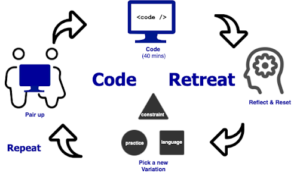

**Written collaboratively by:**
[Trung Vo](https://twitter.com/ttrungvo), [Bob Allen](https://twitter.com/CuriousAgilist), [Jacqueline Bilston](https://twitter.com/jmasonlee), Christopher Fietz, [Llewellyn Falco](https://twitter.com/LlewellynFalco)

*“… I really liked that there was something there for every level and anytime I would get stuck, there was someone there to help….” — Sara K.*

## What is a Coderetreat?

Coderetreat is a day dedicated to allowing developers time to practice their craft. The focus is on practicing skills like Test-Driven Development (TDD), refactoring, and incremental design that is proven to make developers move faster with fewer bugs. It is designed to enable participants to focus on their practice, with as few distractions as possible.

The day is made up of several short sessions where we either work in pairs or mobs to solve a small coding problem. Each session, we start new with the same problem; this allows us to focus on the new skill we are learning.

## What do you get out of it?

Coderetreat is an excellent place to learn what you know and what you don’t know. As in life in general, there are always new people to meet, new things to learn, and new ways of working and playing together, whether it be with code or ideas. They create a space where we can try out things that we have always wanted to try out, but we’ve never had time to try. Coderetreat is about peer learning, it can be hard to step outside of your comfort zone but together with other people, it is easy and even fun.

It’s easy to mean to practice. You’ve probably been meaning to practice already. Meeting together gives you a chance to actually do it. When we work in a pair or group, we are able to exchange new approaches and ideas and keep each other honest about actually using best practices.

## Where can I find one?

Check out the Coderetreat website for one near you. Every November there is a Global Day of Coderetreat with sessions all over the world, on the same day.

Here are two online events that are coming up soon:

- [Mobretreat](https://www.eventbrite.com/e/mobretreat-winter-2021-for-all-americas-north-south-east-west-friends-tickets-138313931693)
- [Spring Coderetreat](https://www.meetup.com/Calgary-Software-Crafters/events/275755200/)

