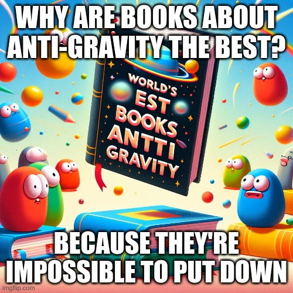
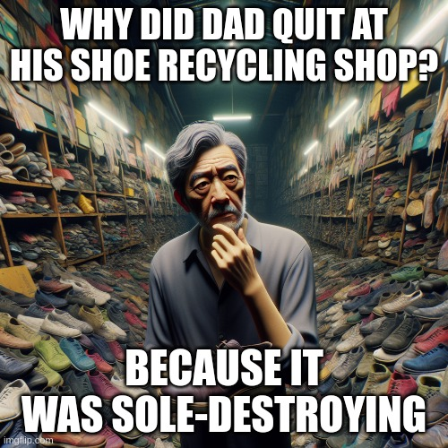
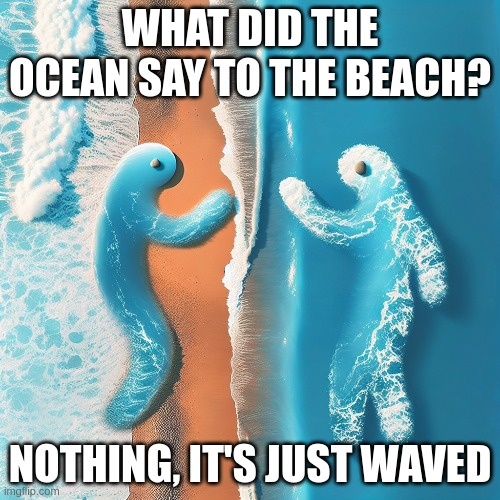

# a little fellow follows you

- your children follow behind you. They see everything you do. If you go astray, so too will they.
- 

# never let them see you act like this

- However we conduct ourselves in front of our children—particularly at home, in private, they will come to see as normal. If we are rude or unkind to our spouse, they will assume that is an appropriate way to treat people they love. If we are anxious and overly worried, they will come to think that the world is a scary place that must be feared. If we behave unethically or
cynically, they too will begin to cheat and lie.

- 

# Their Faults Are Your Faults

- Our kids have our virtues and our vices. That’s what makes this whole crazy parenting thing such a wonderful opportunity. Because we are here to help them become the best possible versions of themselves. One of the ways we do that is to help them become like us in all the good ways. But one of the other ways is to prevent them from becoming too much like us in all the bad ways.

- It can be an incredibly difficult balancing act if we aren’t honest or self-possessed, if we let our egos get in the way. We can’t let that happen. This is our chance, our time! To help them. To bolster them. To help them overcome flaws that maybe we never quite got over ourselves.

- 

# Show Them How to Keep Their Cool

- Your kids will need them too. So show them. Show by example, not just with words. Show them, when you’ve been screwed over and it really hurts, that still your personal code of conduct matters more. Because it does. Because it will.

- 


# Hang Their Pictures on Your Wall

- we can hang up pictures of our children and strive to make them proud, and this should inspire and fortify us when we have to make tough decisions for their future, for their safety, for their freedom
- it is our kids who compel us to do the right thing... because they are always watching
- 

# They Learn from Home

- Those kids buckled in behind you—they are absorbing your example and assimilating the lessons that will shape them in the smallest and biggest of ways. From the kind of driver they are going to be to the kind of person they
are going to be. They are watching you as you go through the world. ***Right now***. They’re watching you break traffic laws, break promises. They hear you when you lie. They feel it when your actions don’t match your words.

- Kids learn from home. They learn in the car. They learn from Mom and Dad. You set the standard, so be the standard.

- 

# Protect This Great Invention

- “The idea of childhood is one of the great inventions of the Renaissance,” he writes, because it allowed children to develop, to learn, to have a safe space to play and explore and discover themselves.

- Like any invention, childhood can disappear. How? With the disappearance of adulthood. Childhood, as both a social structure and a
psychological condition, works when things like maturity, responsibility, literacy, and critical thinking mark an adult. But when things like long-form writing and reading decline, the gap between child and adult shrinks; the line between them blurs and then dissolves.

- As parents, we have to protect this great invention. We have to increase the gap between childhood and adulthood. Let them be kids... but also make sure that you are being an adult. Be a leader. Be responsible. Be an example,
a model they have to strive toward. Let them see you with a book they can’t yet comprehend. Let them be around adult conversations they can’t quite understand. Let them see you working and sweating and providing.

- Let them see an adult—so they have something not just to look up to but to look forward to as well.

# Your Living Is the Teaching

- If you want to teach your kids, it’s not  going to be with words. It’s not going to
be with lectures. It’s going to be through showing them that you live according to the rules you set and the values you are trying to tell them are important.

# We Can Be That Gift

- What were the things that Marcus learned from Antoninus? He learned the importance of compassion, hard work, persistence, altruism, self-reliance, cheerfulness; keeping an open mind and listening to anyone who could contribute; taking responsibility and blame, and putting other people at ease; yielding the floor to experts and heeding their advice; knowing when to push something or someone and when to back off; being indifferent to superficial honors and treating people as they ***deserved to be treated.***

- It’s quite a list, isn’t it? These lessons impacted Marcus so deeply, he remembered them far into adulthood and recorded them for his own reference in what would become Meditations. What made the lessons so powerful was that they were *embodied* in Antoninus’s actions rather than written on some tablet or scroll.

- There is no better way to learn than from a role model. There is no better way to judge our progress than in constant company with the person we would most like to be one day.

# Don’t Talk About It. Be About It.

- We’re better off embodying our philosophy rather than talking about it. As the Stoics said, it’s a waste of time to speculate or argue about what makes a good man, a good athlete, a good teammate. Our job, they said, is to be one. This is how it goes, in sports, in life, and for parents. Sure, we can talk all we want. We can have great conversations. But what matters is what we do, who we are, how we act.

# Here’s How to Have Lasting Impact

- *To be in your children’s memories tomorrow, you have to be in their lives today.* - BARBARA JOHNSON

- That’s one person having an impact on three generations. When you think about it like that, it’s not an exaggeration to say that your grandparents quite literally changed the world. And they did it in the smallest of ways—with just a few conversations, with how they went to work every day, with the books they read in the evening and the manners they displayed at dinner. They did it in the conversations they had when their kids made mistakes. They did it in how they treated their neighbors and mowed their lawns and plowed their driveways.

# Where Do They Learn to Judge?

- It was a comment under your breath about your brother’s spending habits. It was a joke about a celebrity’s weight. It was a complaint about the way your neighbor parks in their driveway. It was the conversation between you and your spouse over dinner about what’s wrong with the other side, with them.

- You didn’t mean anything by it. You don’t really care. But your kids heard it. And they can read only your lips, not your mind.

- We want kids who are open-minded, who give people the benefit of the doubt. But are you showing yours what this looks like day to day? Sure, you’re not a bigot, but are you always kind? You would never say something cruel to someone’s face, so why are you saying it behind their back? Especially when your kids can hear you.

- The world needs less judgment, less bullying, fewer opinions, period. Can you start this trend at home? Can you teach your kids what that looks like, instead of letting the same old rumor mill spin round and round, grinding
their goodness to dust?

# If You Want Your Kids to Respect You

- Well, if you want your kids to respect you, be worthy of respect.

- Just think about it for a second: Why would they respect advice that you don’t live by? Why would they admire you when you’re not living up to your own potential? Why would they look up to you when you yourself are dealing (poorly) with self-esteem issues, when you have accepted the lies of impostor syndrome and allowed them to affect how you act as a parent?

- Get your stuff straight. Be the parent you know you can be—be the person you know you can be. The rest will follow. And if it doesn’t? Then at least you’ll be strong enough to deal with whatever comes.

# Don’t Let Your Kids Down

- How did Leonidas choose the three hundred warriors he would lead out to the Hot Gates to battle an overwhelming enemy? They were all “fathers of living sons,” according to  Plutarch. You might think it would have been the
opposite, that parents would be allowed to sit out a potential suicide mission - but that’s not how it worked in Sparta. These warriors were chosen because parents would never want to let their kids down. These fathers would fight most bravely, most fiercely, not only to protect what they had back at home but to protect the reputations of their family names, which might be all their children had left if they were to fall in battle. To abandon their comrades or behave in a cowardly way would be to risk great shame and the possibility of letting down the family that so looked up to them.

- Our kids are whom we should want to impress. They’re the ones we should never want to let down. They’re not only the ones we’re fighting for but also the ones whose standards - whose natural admiration and love - we should always be fighting to live up to.

# You Can’t Be a Hypocrite

- No child deserves that. At the very least, they deserve parents who live up to what they say. Give your kids that. Don’t be a hypocrite.

# Teach Them to Be Particular

- Not picky but particular. Not peculiar but particular. Be exacting. Get your facts straight. Do your job. Don’t let anyone or anything excuse you from it. Do it well.

- These are wonderful reminders to give our kids... but as always, it’s much more important that *they see us living these lessons.* Show them the difference between picky and particular, between factual and fatuous,
between compromise and *compromising your standards.*

- Show them what responsibility looks like. Show them how to be careful and how to always be prepared. Because someday you won’t be here, and they will have kids of their own who will need to learn these very ***particular*** lessons from them.

# Where Did You See That?

- Before you get mad, before you condemn their actions, just take them aside. Ask them, kindly and openly, a question that the bodybuilder Mark
Bell says he always asks his teenage kids: “Hey, when have you seen me do that?”

- This is a great question. Because it may well be that you have been inadvertently modeling behavior you find repugnant in others. And while
that’s no excuse for bad behavior, it’s useful to know if we’ve been tacitly condoning the wrong things to our kids. But if you haven’t, then they have even ***less*** of an excuse.

# Do the Things You Want Them to Do

- You have to be the kind of human being you
want your children to be. You have to do the things you want your kids to do. “I find this with parents all the time,” he said. “They want their kids to do things that they don’t do themselves.” He wants his kids to be readers, so he makes sure they see him reading. He wants them to explore different hobbies and  interests, so he makes sure they see him practicing an instrument or tinkering in a sketchbook. He wants them to work hard and find work they care about, so he makes sure they see him working in his studio. He wants them to treat others with respect and kindness, so he makes sure they see him giving their mother something he made for her.

- Who you are forms who they will be. So be who you want them to be. Do what you want them to do. It’s hard, but it’s the only way.

# What Are They Learning from How You Carry Yourself?

- What are your kids learning from how you carry yourself? Are you showing them, as Bruce’s dad did, how to be angry and bitter and lost? Or, as Bruce’s mom did, are you showing them how to be brave and tough and find their niche? Is your example calling them to be better or worse?

# They Are Always Listening

- The point is this: Kids are always watching, eyes, ears, and heart open. They absorb  everything. What will they hear? What is going to pour out of you that will soak into them? That’s the question.

# You Gotta Live Up to It

- As the billionaire Charles Koch once explained of the main lesson he learned from his father’s very hands-on parenting: you can’t
lecture your kids on anything you don’t live up to.

- You can’t tell your kids to respect others and then talk rudely to a customer service representative on the phone. You can’t tell them that it’s important to find and follow their passion and meanwhile work their entire
childhood at a job that pays well but makes you miserable. You can’t tell them that family is important if your actions don’t show it.

- You can’t lecture your kids. You have to live up to the lessons you want them to learn.

# When You Get Them to Listen...

- We have to remember that as parents we are always planting seeds. A comment here, a book we have them read there. A documentary we watch
together, an example we set, a person we introduce them to. When we get them to listen? When they really hear us? Wonderful things can grow out of that.

# How to Deter Them

- If you don’t want them to do something, if you want to deter them from some negative influence or bad choice, let your actions be the guide. Let your life both spur them and deter them. In this way, you can be their inspiration in any moment.

# Show Them What a Good Marriage Looks Like

- The point here is not to judge the Roosevelt marriage nor to insist that you must stay in your current one. It’s to remind you: Your kids learn about everything important from you. Including relationships. So what are you teaching them with yours? What are they seeing that you might be blind to? You have to show them what a good marriage looks like. You have to embody what healthy connections and equal partnerships look like, because the example you set will be their first and the most indelible.

# You Can Be a Parent Anywhere

- As with teaching and leadership and  philosophy, so too with parenting. You can be a parent anywhere. You can be a parent every minute of every day to anybody and everybody. You can be that parent in the same way that
Socrates taught—by example, by getting down to their level, by being open, and by adapting to the situation at hand.

# Let ’Em See You Work

- The problem? Well, where are your kids supposed to learn the importance of a work ethic? How are they supposed to know what a hardworking dad looks like if they never actually get to see it? How are they supposed to learn what work looks like at all?

- That is also your job. To be the example. There is an old Latin expression: A bove maiori discit arare minor. “The younger ox learns to plow from the elder.” That’s because the oxen would be harnessed together. Not only would
the kid get to see their mom or dad do what they did, but they’d be literally strapped into it together, to learn on the job.

- Obviously good boundaries are important. Obviously you don’t want your work life to overwhelm or interfere with your home life. But make sure that striving for this balance doesn’t accidentally deprive your kids of an
important example that will serve them  throughout their lives.

# Make Your Household First

- The point is: the place to apply your opinions about the way the world should work is first and foremost in the small world where you actually have some control. That is to say, at home. If you want to see a difference in the
world, then model that change and make a difference at home. You’ve got plenty to work with, plenty to fix, plenty to improve. Start there.

- Show your kids that change is possible. Show them why your opinions matter, and how they can make theirs matter. Let them witness the real
impact that comes from practicing what one preaches. Help them benefit from a focus on the practical instead of the theoretical, the actual instead of the hypothetical.

- ***Start now.***

# They Do Most of It

- We do our best to set a good example. They do most of the work.

- As hard as our job is, they have it way harder. Don’t you remember being ten? Or fifteen? Or twenty? You don’t remember being a kid... probably because you were so busy literally developing a brain. So yes, it’s amazing to see what they’ve become and what they’ve done.

- Just remember that they get the credit (and you get the blame).

# You Don’t Stop Teaching Your Kids

- We never stop teaching our kids. And though what we are doing right now may not be resonating with them, it can teach them something in the future.

- Keep doing what needs to be done. Embody what you want your kids to be. Keep growing. Keep being the example they can follow. Keep teaching
them, implicitly and explicitly.

# There Is No Substitute for Your Love

- In his beautiful and vulnerable memoir, Bruce Springsteen writes that his father said fewer than a thousand words to him throughout his entire childhood. Maybe “you’re not greeted with love and affection,” he writes, because “you haven’t earned it.” So for decades, Bruce tried anything to earn his father’s love.

- It’s poignant, haunting, and heartbreaking. From the outside, it looked like Bruce Springsteen had everything; on the inside, he felt like he had nothing. It’s evidence of our power as parents. No amount of money or celebrity or
awards can substitute for your love. That’s all they want.

# You Can’t Say These Words Enough

- your kids shrug when you say it. It feels weird saying it in public - cliché, lame, vulnerable. You don’t want to embarrass them. Or bother them. Or interrupt. Plus, they know how you feel, right? You’ve said it a thousand times before at home.

- We have a million reasons not to say these words, but all of these reasons are wrong because it’s impossible to say them enough:
  - I love you.
  - I’m proud of you.
  - It’s you I like.
  - You are special.
  - You are enough.
  - You’re the most important thing in the world to me.

- At the end of your life, do you think, for one second, that you will kick yourself for saying any of those words too much? Or is it more likely that you’ll wish you’d said those things more? Because it would absolutely kill you if you thought for one second that they might not know, that they might not feel in their hearts, how much you loved them, how proud you were of them, how nothing—not success, money, or lack of either—could change what they meant to you from the moment they were born.

- Life is full of risks. This is one gamble you don’t need to take. So say it. Tell them how you feel. Tell them that you love them. Say it again and again and again. 

- It’s impossible to do it too much... but you might as well try.

# Love without End. Amen.

- Parental love is not something that is dispensed only when things are going easily with your kids. When they listen. When they conform to your expectations. Expressions of love are not just for when they succeed or when everything is going well in your life or in your job.

- Not every now and then but always. Without end. Unconditionally. Even when they hit their siblings, when they lie about a test, when they don’t want to eat their vegetables, when they want to quit something you paid a lot of money for, when they’ve acted in a way contrary to the values you’ve tried to instill in them.

- Even if this kind of love isn’t something you got as a kid. Even if it seems clouded when you’re struggling or difficult to express when you’re pissed off. Even when they take you for granted and make things so hard on you, you have to show them that you love them.

- ***It’s a love without end, amen.***

# Love Is About Service

- Parenting is being there, literally. It’s about being of service, literally. Driving them around. Tying their shoes. Coming over to do the dishes and laundry after they’ve come home from the hospital with their own newborn. Holding their hair back as they throw up from chemo treatments. It doesn’t matter how old they are, or you are; that’s what we’re here for. That’s what we do.

- We ask them the question that Tom Hanks has described asking his own children: “ ‘What do you need me to do?’ You offer up that to them. ‘I will do anything I can possibly do in order to keep you safe.’ That’s it. Offer that up and then just love them.”

- That is love. It’s what your job is. You’re here to serve.

# Make Sure They Know That They Are Plenty

- It’s a sobering reminder to all parents: the feeling of deficiency is far worse than any potential deprivation. So make sure your kids know that they are enough, that they are plenty, that you have loved them from the moment they were born. And make sure you remember that there is nothing they have to do to earn this love. There’s nothing they must accomplish to deserve tenderness and affection.

- They are good enough. The talents, the interests, the goals they have, are enough.

# It Takes Discipline

- So often important and talented people use their work and their talent as an excuse to neglect their obligations as parents. But di Prima was exactly right to see them both as a matter of discipline and commitment. The idea that anything (or anyone) is improved by neglecting one part of their life for another is nonsense. But the opposite is true—by keeping your word to yourself, to your children, you are strengthening an important muscle. By being disciplined and protective of your personal life, you are being protective and dedicated to your professional life.

- Don’t let anyone tell you differently. Don’t let anyone judge you for that.

# Wherever They Are, You Are Too

- Your kids are going to make choices that scare you. People are going to doubt them. People are going to criticize them. Maybe you yourself doubt the wisdom of their choices. And?

- ***Where they are, you must be too.***

- Love your kids. Root for them. Support them. Fight for them and fight with them. Be beside them and behind them. Wherever they are.

# They Don’t Have to Make You Proud

- We want this to motivate them. We use it, oftentimes unconsciously, to hold them accountable. But is this the way it should go? Doesn’t it sort of imply that they owe us something? That our support is not unconditional or implicit? That if they don’t score a goal or make the dean’s list or land a summer internship, we are therefore not proud?

- Our kids don’t owe us anything. After all, they didn’t ask to be here. It is we who are obligated to them, by virtue of our choice to bring them into this world.

# Here’s How to Tie Your Family Together

- You want your kids to really listen, to buy in. You want them around, you want them to come to you. You want them to respect your rules and embody your values. You want them to do what they’re supposed to do, the things that will make them successful.
- *So how do you get them to do those things?*

- Well, for most parents, the answer is to default to the easiest and most primal form of leadership: force. It’s got a simple logic to it. You make them do it - *because I’m bigger than you, because I can take away the TV remote,
because I said so*. And it seems like it works... for a while. Perhaps you remember how this worked from your own childhood. Eventually, the strategy falls apart over time. In the end, it turns out to be counterproductive.

- Okay. Then listen to Lincoln. “Love is the chain whereby to bind a child to its parent.”

# When They Wander Back...

- Your kids may never demand their share of the estate, but they will stray. They will act out. They will try to  establish their independence. They will get themselves into trouble. As parents, we have to accept that, and accept them
all the same. We have to take them back. We have to give them what they need. And when they wander back, we have to make sure they’re always met not with reproach or “I told you so” but with affection and understanding.

# There’s a Reason You’re So Raw

- You’re raw because having kids has opened you up. “I wasn’t emotionally prepared for parenthood,” the comedian and author Michael Ian Black writes, “after spending the thirty previous years in a cauterized emotional state.”
Parenthood forces you to engage the world in a more active way. It forces you to engage with yourself and your own emotions in an active way. Was it easier to go through the world closed off and cynical? Is there something tribal and reassuring about focusing on yourself and your problems and
placing the blame for those things elsewhere, on those other people?

- Of course. But that’s less and less possible these days. This parenting thing has changed you. It’s made you see that it’s all connected, that we’re all connected. It’s made you better.

# Love the Kid You Have

- If there were a list of things you never wanted your kids to think or feel, those responses—which Jessica says get emailed to her almost every day—are probably right at the top of the list. No kid should feel like their dad wants them to be someone else, to be something different. No kid should feel that they are a disappointment. They should know that they are special for who they are, that they make the world—and your life - better just by being in it.

- Your kids need to be seen. They need to be heard. They need to be loved. They need to be known. For who they are, for what they choose to be. Not for who or what you want them to become.

- That’s all they really want from us. And they deserve to have it. So you better give it to them. Starting today and for the rest of their lives.

# You Can Always Give Them This

- The good news is that there are some things you can always give them that, when others try to offer them to your kids, will never measure up to yours. These are things that are always possible to give, always within your reach: your attention, your understanding, and your love.

- No matter what happens, no matter how rich or poor you are, no matter what mistakes you make or they make, no matter how powerful or powerless you are, you can always give them those things. In fact, you must always give
them. Because, in the end, those are more important than all the other things you can and will do for them. Love and understanding, especially, are the only things that truly matter, because they last even beyond your death. Their
impact is going to be one of the primary forces that shape the adult your child becomes.

- And if you think about it, the only thing they’ll truly (and rightfully) resent you for, all else being equal, is if you know these things are true and still you fail to provide them.

# The Greatest Thing You Can Do

- The best thing you can do for your kids is love the person who brought them into this world. The best thing you can do for your kids is love the person you are parenting them with. Even if you are no longer with that person, or if that person has deeply hurt or even betrayed you, you must love the person responsible for a good chunk of your kids’ DNA or identity. You must love who your kids love—that’s how they’ll know that they are loved.

# This Is What They Most Want

- Don’t we ourselves want attention and admiration? In our jobs? In our communities? In our marriages? Why wouldn’t our kids want the same things in their young, fragile lives? And who could it possibly be more meaningful
to come from than us?

- It’s hard to be a kid. They’re overwhelmed. They doubt themselves. They wonder where they fit in, whether they matter. It’s our job to help them with this. To let them know that they are loved, that they are special, that they are enough. To give them the attention and admiration they deserve.

# Keep the Main Thing the Main Thing

- ***Most of what we say and do is not essential. If you can eliminate it, you’ll have more time, and more tranquility. Ask yourself at every moment, “Is this necessary?”*** - MARCUS AURELIUS

- There’s a wonderful little expression: ***The main thing is to keep the main thing the main thing.***

- Every family, every person, has a different main thing, of course. But if we could generalize, the main thing for us parents is to **raise well-adjusted, self-reliant, decent, happy kids.** ***The main thing is not college. The main thing is not making partner at our law firm. The main thing is not to have a clean house. The main thing is not to win some competition with other parents. The main thing is not grades, it is not following in your footsteps, it is not being captain of the football team or an expert cello player***. 

- ***The main thing is for them to be healthy, to be prepared for life, to have good values, to have a good sense of who they are and what they want to spend their life doing. The main, main, main, main thing is to love them and for them to feel loved.***

# Let Them Wonder If You Know

- Of course parent knew! A parent always does! But she didn’t say a word. She just did what she needed to do, caring not only about her son’s well-being but also for his feelings and his pride.

- When our kids need help, our only job is to provide it. To *help*, not *lecture*. To be of service, never to humiliate. This is how you create the kind of relationship Floyd and his mother had—the kind where your kids know
they can always come home for help at any time, day or night.

# How to Convince Them

- Our kids are going to do stuff we disagree with, but very rarely - especially as they get older—will we be able to convince them of this by force or fiat. We have to be understanding. We have to be patient... maybe
even a little bit sneaky. We have to give them advice and the tools to make sense of that advice, because ultimately they are the ones who have to figure out the right decision for themselves. And we have to make sure they know that no matter what they decide, we love them.

# Assume the Best

- So here’s a question: When they screw up, when they fail a test, when they crash their car, when they get in trouble, when they talk back to you, why do you assume the worst? Why do you treat them with anger and judgment? Why do you jump all over them with criticism or frustration or
suspicion?

- You know they are good and decent. You know they generally do their best. You know what they struggle with. You know their fears and vulnerabilities and weaknesses. You know what they’ve been through (deep down, you know one of the things they’ve been through is being raised by you!).

- So why isn’t that being reflected in your tone? In your assumptions? Where is the kindness? Where is the good faith? Why aren’t you talking to them like someone who believes in them, who is a fan of them? Where is the
patience? Where is the charity? Where is the demonstrable unconditionalness that you purport to have for them?

- Mm-hm. That’s right. Oh, and remember, all this could be said about your interactions with your spouse too.

# These Are the Richest Kids

- everyone remembers the “rich kids” growing up. Even rich kids remember the other richer kids. We envied their ski trips, their huge houses, their equally big vacation houses, their electronics, their clothes.

- And yet how many of those kids, when we look at them now, as adults, appear to have actually been quite poor?

- At home they faced a poverty of attention. A deficit of happiness or stability. Maybe their parents fought all the time. Maybe they worked constantly. Maybe they played favorites and none were their kids.

- As adults, we now realize that to be rich is not necessarily to be wealthy, especially as “wealth” comes in many forms. This is really good news. All of us have the ability to give our kids a rich life. We can measure wealth in the time and attention they get from us. By whether they feel safe and secure, whether their house feels like a home. Even if we only make $30,000 a year.

- You can make your kid the richest kid in the whole school without spending a dollar.

# Always Be Their Friend

- This wonderful public moment about a private struggle, shared in honor of a personal mentor, speaks to the heart of what every child needs to hear from their parents, no matter what they’re going through: There are going to be
things in your life that are very hard. But you’re not alone. I’ll always be your friend.

# Tell Them They Carry This Everywhere

- When Erin landed in London, a letter from her father was waiting in her email inbox. It’s the kind of letter a great parent writes, the kind that in David’s case—due to his tragic and unexpected death at age fifty-eight - would guide his daughter long after he was not around. The letter opens:

- ```Honey, we are so, so excited for you. Please  understand that you carry with you not only our love and support, but our admiration and pride in your decision to bring your ambitions roaring into the world.```

- Make sure your kids know that no matter what, they are loved, they are supported, they are accepted, they are enough. Make sure they know that no matter where they go, they carry your love and support and pride with them

# Teach Them Early Where Their Value Lies

- We must, as parents, teach our children where their value really lies. It’s not in their accomplishments. It’s not in what they earn or how they look. It’s not to be found in anything external at all. Their value - to us, to the world - is inherent. It exists because they exist. Because there is no one on the planet with their same combination of DNA and experiences and circumstances. That’s what makes them special - what makes them rarer than the rarest jewels and more precious than the most precious metals.

# All They Want

- in 2008, President Barack Obama came close to articulating one in a Father’s Day speech about what our kids really need and want from us.

- ```Our kids are pretty smart. They understand that life won’t always be perfect, that sometimes the road gets rough, that even great parents don’t get everything right. But more than anything, they just want us to be a part of their lives... In the end, that’s what being a parent is all about—those precious moments with our children that fill us with pride and excitement for their future; the chances we have to set an example or offer a piece of advice; the opportunities to just be there and show them that we love them.```

- That’s your job, above all others. To be a part of their life - a positive part. They need you to be there. To give advice. To be a good example. To understand them and to love them.

- Everything else is extra.

# Hit Them with One of These

- They think you’re going to remind them about some piece of schoolwork. Or criticize what they’re wearing. Or tell them to stop roughhousing.

- No, you’re going to hit them with those words we can’t say often enough: *I love you.*

- That it catches our kids by surprise when we tell them we love them? That we only want to put our feelings about them out there in the open, just so they know, and they’re confused by it? That’s our fault, not theirs. It says
something about us, not them. And it’s something we, not they, have to fix.

# This Is What You’ll Wish

- Let us hope that we never have to experience such a loss. No parent should ever have to bury a child. But still, let’s try to think about the end of our own time here on Earth. What will we think then? When we are reflecting
on our lives, what will we wish for? We’ll wish we had loved them more. Even if we told them a thousand times in a thousand ways every single day, we’ll think about how woefully short we came up in expressing just how much our kids mean to us.

- So let us try, right now, while we still can, to love them more.

# Give Them This... While You Can

- Now love was not a word that Stafford used much. It might not be one that you’re comfortable using much either. But you should... while you can... while you’re still here. And don’t just say it. Give it.

- Your kids, your family, your loved ones... they deserve that. All your love...

# Love Is Not a Victory March

- if you go around expecting parenting to be an unending series of Hallmark moments, you’re fooling yourself and setting yourself up for disappointment. If you’re comparing how you’re doing with what you see on television, you’re being unfair to yourself.

- This thing is hard. Really hard. There are dark moments. There are moments when you’re convinced you have no idea what you’re doing and you think you’re the absolute worst. There are moments when you’ll be told you are in fact the worst. But you have to keep going. You can’t give up. You
can’t despair.

- They’re counting on you.

# Take the Second Chances When You Get Them

- the one thing about parenting is that it gives you second chances. It gives you a lot of leap days. Kids forget. They need you for something else. There are lots of tough conversations. Dinner happens every night.

- While you cannot undo what has been done, you can choose to take these second chances as they come. You can will yourself to play, even though you’re exhausted. You can stop yourself before getting upset this time, reminding yourself that you love the boy and that he’s still figuring things out. You can put the phone in a drawer and actually be there for the family meal.

- We don’t get to do this forever. Tomorrow is never guaranteed. Today is a gift, a fluke (especially on a leap year). That’s why each interaction we have with our kids matters, why we can’t take it for granted. Still, we’re not going to get it right every time. So when we’re lucky enough to get another go? We better take advantage of it. We better try harder. We better show up.

# You Can Pick Only Two

- Work, family, scene. Pick two.

- You can party it up and hang on to a relationship, but you won’t have much time left for work.

- You can grind away at your craft, be the toast of the scene, but what will that leave for your family?

- If you’re as committed to the work as you are to a happy home, you will have no room for anything else.

- It’d be wonderful if you could have the run of all these things all the time... but you can’t. Being a parent is about making trade-offs, from the
very second our kids enter this world: it’s their needs versus our wants. At first, it can be a shock to the system. But once we know what to say no to, and we know why, we can say yes with comfort and confidence to the things that matter. To the things that last.

# Everything but This Is Temporary

- Charles de Gaulle helped save France. Then he ran it. Yet even at the height of his power, he tried to always remind himself, “The presidency is temporary, family is permanent.” Accordingly, he put up boundaries between his personal and professional lives. He carved out private time. He refused to neglect the children who depended on him so much, particularly his mentally disabled daughter, Anne.

- We can’t ever let ourselves forget: we may be very important to the world, but to a small group of people to whom we are related, we are the whole
world. Nothing matters more than family, and  nothing is more permanent... until it isn’t. You can lose family. You can break your family. You can drive your family away. And then it is their loss that becomes permanent.

- By all means, pursue your success. Realize your ambition. Just make sure it’s not coming at the expense of what actually matters.

# You Have to Make Adjustments

- The point is: whatever your children’s ages, you have to be ready to make adjustments. Whatever your job is, it can and must be adjusted around what we all know is our most important job. If the queen can put off Winston Churchill for an hour, you can reschedule that conference call.

- Family comes first. Before business... even the business of state.

# When Is Their Time?

- Of course you’re busy. You have work. You have your spouse. You have your kids. You have all the obligations of adulthood. All these things are
important. How do you fit it all in?

- The truth is, if you’re winging it every day, you won’t get it all in. Something will fall by the wayside, and too often, it’s the time with our kids that is the first to go. Because we can turn on the TV. Because we can strap
them in the car seat and bring them along on errands. Because we can tell them, “Sorry, kiddo. I’m busy right now.”

- This is why it can be a good idea to have very specific, scheduled time. So you can be sure that they have their time. Nonnegotiable time. Just as you do with work or anything else that matters to you.

- What does it say about us as parents if all we give them is the leftover time? Nothing good. They are the priority. Remember that the next time you
put another new obligation on your calendar.

# This Is What Putting Them First Looks Like

- Would anyone back then have noticed two more
seasons with the Vikings? Would anyone now have bothered to remember them? Maybe. Maybe not. You know who definitely noticed? You know who
definitely remembers? Eli. And he benefited unquestionably and immeasurably from his father’s choice. He has a happy family and two Super
Bowl victories to show for it.

- What could it look like if you put your family first? If you really put them ahead of everything else? You can’t be sure exactly until you do it, but you can be certain that it will feel great.

# How Are You Filling Their Bank?

- *Each day of our lives we make deposits into the memory banks of our children.* - CHARLES R. SWINDOLL

- Think of your own childhood. What do you remember? Is it those big moments? You know, the planned ones. The ones on the calendar. Is it
exclusively Christmas mornings? The annual spring break vacations? The Fourth of July barbecue?

- Or are your memories much more mundane? 

- What we remember about growing up are the little moments. We remember sitting in the passenger seat next to Dad on a long drive. We remember going for pizza after tennis practice. We remember waking up
from a nap and coming downstairs and watching a football game. We remember that little piece of advice. We remember thinking they were going
to be mad at us for something and getting a hug instead.

- Similarly, the wounds that we feel often come from other small moments. The feeling of being ignored. Getting yelled at for leaving our shoes in the living room. The time that Mom didn’t stand up for us. The unspoken tension in the living room between our parents.

- Today you’ll be making plenty of these small deposits in their memory banks. How do you want that ledger to read?

# Being Important Is Not an Excuse

- There is no job, no career, no amount of responsibility that justifies being absent from the lives of your children. Being important, having a calling, achieving success, is great. But being important doesn’t change what your most important job is: being a parent. Being there for them. Becoming world class at being Mom or Dad.

- Because when your days in the spotlight are over, when your fame and import have receded, you will still be a parent and your kids will still need you for the things kids have always needed their parents for.

# This Is the Only Success That Matters Now

- As Theodore Roosevelt explained:

  - ```There are many kinds of success in life worth having. It is exceedingly interesting and attractive to be a successful businessman, or railway man, or farmer, or a successful lawyer or doctor; or a writer, or a President, or a  ranchman, or the colonel of a fighting regiment, or to kill grizzly bears and lions. But for unflagging interest and enjoyment, a household of children, if things go reasonably well, certainly makes all other forms of success and achievement lose their importance by comparison.```

- We still want to be good at our jobs, of course. We want to win championships or land big clients. We want recognition and we want the thrill of the chase. But we know now—because we’ve felt it—how small these things seem compared to a quiet evening at home. A Sunday in thepark. Breakfast full of laughter. Watching them on a stage or running from the sidewalk into your arms.

- ***This is the only success that matters now.***

# Welcome To Unavoidable Reality

- The biggest change that comes from having a kid isn’t financial—it’s not the sleep deprivation, it’s not even needing to take care of another person or the stress it puts on your  relationships. It’s that it rudely introduces you to the unavoidable reality that you are no longer the center of your own world - something you had been, despite what you thought, utterly ignorant of.

- As an adult, you did what you wanted. Things operated on normal timelines. You made decisions and commitments and that was it. The world was logical and in your control. But now and for the rest of your life, reality is different. What time are you going to get to the party? When your daughter wakes up from her nap, that’s when. They’re sick with the flu? You’re sick with the flu. They feel like having a tough morning or are reeling from teenage hormones? Looks like you are too! Unavoidable reality means that you’re not in control. It means you’re going to sit and play in the sandbox for the next ninety minutes because God knows you’re not going to risk a tantrum. Unavoidable reality is weekends of soccer games and evenings of school plays and carpooling and school pickups. It means you can’t just skip dinner or grab something on the go—life doesn’t work that way anymore.

- That’s who you are now. That is the unavoidable reality. And guess what?
It’s wonderful. Get used to it.

# It’s About Being There... a Lot

- how do you get through to your kids? How do you show them what’s right? How can you make sure they know how much you care about them?

- The answer is simple: you can be there. A lot. There is a joke that the word love is actually spelled T-I-M-E. It’s true. Your kids won’t have to
wonder, they won’t need to ask—you, or your  partner, or other people - how you feel about them if you are constantly there to show them. *If you have prioritized your time with them over everything else.* Being there also alleviates the pressure to “find the words” in those trying moments, because you’ve been having an ongoing, regular conversation with your kids the
whole time. *The words are there.*

- But being a great parent is not just about those pivotal moments. It’s not just providing for them or getting them into a great school so they can get
ahead in life. It is mainly, and mostly, the day-to-day T-I-M-E. It’s the modeling, each day, of what being a good person looks like. It’s the showing, each time you see them, that you care, that they’re important, that they are
loved.

- It’s about being there. A lot.

# They Must Come First

- Your kids must come first. Not just in the very first months or years but always. You must say to them, “Yes, you, dear,” and never ever the opposite.

# Don’t Let Them Steal from Your Family

- Kobe replied the requests to be on the news:
“Can’t right now. My girls are keeping me busy. Hit me up in a couple of weeks.”

- Do you have the discipline to send a message like that? How strong are you at putting your family first? How good are your defenses against the endless requests, opportunities, impositions, and obligations that come with your work in particular and with life in general? It’s so easy to let people steal your time, to let them take you away from the thing that is keeping you busy: your kids, your family.

- Kobe Bryant, tragically, will not get any more time with his kids, and they will not get any more time with him. Which is what makes that text he sent such a powerful reminder - a final feat of performance left there to inspire those of us continuing in the shadow of his death.

- Put your family first. Put your kids first. Say that you’re too busy. Politely decline. You have other priorities.

# Do You Know Them?

- No one would accept or condone that kind of absentee parenting anymore (doesn't even know the kids exists) - or even just the more
benign aristocratic hands-off style the British were known for. But still, it begs the question: How well do you know your kids... really?

# Their Needs Are So Modest

- We think we’re so important. We think our
work is so important. In fact, that’s what we tell ourselves - that we work those long hours to make the money to provide them a certain kind of life. In fact, our kids’ needs are so humble. Mostly what they want is us. And beyond that? They’re pretty content with snacks. The occasional video game. A sprinkler to play in. Some magnet you picked up at the airport on the way home from a business trip. A parent who doesn’t yell at them all the time. They’re pretty easily impressed. Their needs are small.

# It’s Not Possible without Struggle

- at an event for female judges in the 1980s, during Sandra Day O’Connor’s term as the first female Supreme Court justice, a law professor asked, “How do you take care of your family and have a career?” O’Connor answered: “Always put your family first.”

- Indeed, later in life, O’Connor would talk about how “desperately hard” it was to balance work and family. She would try to talk to her law clerks, male and female, about this struggle. She didn’t dance around how hard would it be. She shared what she had learned. And most important, in being up front, she provided them, and now us, the relief of knowing: it’s not possible without struggle.

# You’ll Never Regret Playing with Your Kids

- even if you’ve just put on your work clothes. Even if you’re already late. Even if the pool is freezing. Even if they’ve been getting in trouble
lately or been difficult to deal with. Even if you’ve got the weight of the world on your shoulders. You will never regret choosing to stop whatever it is you were doing, or were about to do, to play with your kids. You will never regret jumping in the water with them, picking up the video game controller with them, spending a few minutes with them, letting Saturday actually be a
Saturday with family.

- You will always be glad you took the time. Because none of us know how much of it we’re going to get. There is no message more important to send
than the one that says, “There is nothing more important to me than you.” As busy as you are, as much as you’re dealing with, there has never been a mind that was not improved or refreshed by temporarily entering the world of a child.

- But of course, you will regret letting too many of these opportunities pass you by. In fact, you know that you already do... because you already have.

# This Is the Real Dad Tax

- Putting your family first isn’t just a matter of your schedule. The author Simon Sinek famously wrote that “leaders eat last.” So should dads, because the inherent, unquestionable  responsibility that you assumed the minute you
brought a child into the world was that they come first. They get the bulk of what’s available. They don’t get the biggest pork chop; they get as many pork chops as they need. They get to experience the fun and the sweetness of life. If there are any leftovers, even if it’s just the scraps, then maybe you get a taste.

# Don’t Do This to Them

- All of us do this in some form or another. “It’ll just be a minute,” we tell them as we run an errand. “Let me finish this quick phone call,” we say, shushing them over and over again while they beg to play with us outside. “Dinner will be ready soon,” we say, knowing it will be much longer than that. “I’ll be home before it gets dark, I promise,” we say, as if traffic could
not delay us. Or, like Merkel’s father, our trips and travels get extended and we miss things... or keep them up waiting.

- While none of us fully control our time or our schedule, we do control how we communicate with our children—we control how we give our word and how we keep it. And it’s essential that we take that seriously. Our kids shouldn’t just be expected to deal with it. They should be communicated to and informed with respect. They deserve an explanation for the things that keep us away from them, that keep them away from the things that it is our adult responsibility to provide. It’s a matter of duty, to be sure, but more important, it’s a matter of trust.

# They’re Going to Ask You Only So Many Times

- Not because you only get a certain number of summers and car rides and moments with your kids - though that is true. They’re going to ask you only
so many times because at some point they’re going to get the message.

- Dad is too busy; he isn’t any fun anymore. Mom judges; she isn’t actually a good person to ask.

- *That message.*

- So you can’t defer the opportunity to answer till later. You can’t afford to lose your temper because this is the nth time they’ve asked. You can’t give anything less than your best, your most present, your most fun self. Because this ask—in this moment - is it. 

- It’s your chance. You can’t waste it. You can’t send them the wrong message. You have to seize it. You have to show them who you are.

# If You Want Your Children to Turn Out Well

- It’s not true that money will guarantee your kids a good life. It’s not true that it will prevent them from feeling pain or loss. It’s not true that money is even high on their list of needs.

- What kids actually want is you. What kids actually need is you. As Dear Abby quite brilliantly put it in a column back in the 1950s, “If you want your children to turn out well, spend twice as much time with them, and half as much money.”

- You can’t pay someone to be there for your kids. You can’t pay someone to do the job only you can do. Sure, money can make things easier; it can buy
childcare and tutors. But it will never be as important as what you can provide by being hands on, by being a good example, by showing them you
care for them and value them.

- The proof of this? Just think about how many great people turned out just fine without much money at all.

# They Are Your Work

- Our job is to raise great kids. Or, more precisely, our job is to raise great adults. The time we spend with our kids—whether it’s homeschooling or watching a TV show on the couch—is not a distraction from our work. It is
the work. Really important work.

- Who could really view their life as successful if they were famous but their kids were  struggling? Who would be truly happy accepting a Nobel Prize knowing that they had failed as a parent? What good would a billion dollars be if all the money in the world can’t convince your kids to come home for the holidays?

- That’s why kids can never “take away” from our careers or “hold us back.” It’s not possible for them to interrupt our work... because they are
our work.

# You Are the Exalted Creator

- That feeling, the one you felt the first day you held your children. The feeling when they run into your arms and call you Daddy, or when they come
into your room to ask for advice, or when you sit across the table from them and watch them eat. That feeling—the pride, the love, the connection - this is the feeling to carry with you.

- You made that. You are the exalted creator of that. Parent in a way that proves it.

# Give What You Didn’t Get

- Lee (NFL wide receiver) told ESPN:

  - ```People who know my background and where I came from, and things like that, I didn’t really have my pops in my life. I never really had a real father figure besides coaches as I got older. This is my opportunity to be there for my daughter. I was hoping she could be there watching this season, but clearly she wasn’t going to be able to do that. I felt like it was important to just spend this year with her, and get back to it next year. Football is going to be there at the end of the day.```

- Lee was putting his family first. He was doing something his father didn’t do for him. He was drawing a line. He was deciding not to waste the most precious thing we have with our children: time. Each of us must decide the same.

# Why Didn’t You Make Time for Me?

- We will not be perfect as parents. We will make mistakes. But we must do our best to avoid inspiring that painful question: Why didn’t you make time for me? Because there is no good answer for it. And the rationalizing answer they come up with has the potential to mess with their minds and redouble the damage of our absence.

- Your kids don’t care that you’re president. They don’t care that this is the busy sales season. They don’t care that your own parents were sick. They don’t care that you were fighting over custody. They just care that you weren’t there.

- Time is not given. It is made. We have to make time. That’s our job. It’s our biggest priority.

# Here’s What You Mean to Them

- In an interview with Marc Maron, Sean explained that on an almost daily basis, someone will come up to him and say something to the effect of “You
have no idea what your dad meant to me” or “You can’t understand how important your dad’s music is to me.”

- It’s a strange claim, Sean explained, because of course he understands. John Lennon and his music are even more important in Sean’s life. Because
John Lennon was Sean’s father. Because he has been holding on to that relationship every minute since his father was taken from him. Because John’s music is the only way he gets to talk to his son anymore.

- Each parent should take to heart what that means: even the greatest musician of all time is more important as a parent to his children than he is as an artist to the world. It doesn’t matter how great our work is, how wealthy it makes us, or what it ends up meaning to billions of people—nothing will eclipse the impact we have on our kids.

# It’s Okay to Be Ambitious

- For most of history, it’s been women who have felt the tension of these conflicting desires the most and have been forced to choose one over the
other. Fathers, on the other hand, have been encouraged—expected even - to look outside the home for fulfillment and recognition, because for men professional success was good parenting.

- As society has evolved, however, every parent has had to manage the tension of serving two masters, even prime ministers and billionaires.

- In her autobiography, Margaret Thatcher, the first woman to be UK prime minister, quotes Irene Ward, a pioneering British politician: “While the home
must always be the centre of one’s life, it should not be the boundary of one’s ambition.”

- You’re allowed to think bigger. It’s okay to have a career and want to be great at it. It’s okay to strive to change the world. Because in these things, as long as you share them and open them up to a wider view, you are teaching your kids about you and about the world. You are teaching them about hardwork, about doing what’s right, about fulfilling one’s potential, about being of use to others.

# It’s a Family Affair

- Your kids are with you on this journey, whatever it is. It can be so easy to see your career as something that is you-centric. It’s not. It’s a family affair. The same is true of the ambitions of every member of your household. And
the more you can be involved with each other on these personal journeys, the better. It makes the accomplishments sweeter, the work more complete...
and the sacrifices less painful. Because all of them have been done together.

# Here’s How to Spend More Time with Them

- It’s not that hard, Ocean tells him; *you just have to be comfortable making less money.*

- If we’re being honest, how much of the time we spend away from our kids for work is actually related to putting food on the table? How much of it is truly rooted in need? In the basics of a healthy, sustainable life? Probably not nearly as much as we tell ourselves (or them).

- We work for other reasons - often good reasons - but not because we have to. We could have more flexibility if we wanted. We could choose a different job. We could choose to put family over career advancement, over six- or seven-figure salaries, over keeping up with the Joneses.

- Let us stop acting as if the freedom - and opportunity - we crave isn’t within our grasp. We can spend more time with our kids. We can be there
more than we are. We just have to be comfortable making less money.

# An Important Rule

- Russ Roberts, the economist, has another rule, as a father, that we should all observe
as parents:
  - If your child offers you a hand to hold, take it.

- Life and relationships are an endless dance of reaching out and pulling away. You reach out to your kids, they pull away—they’re busy, they’re in
front of their friends, they’re mad at you. You try to help them and they don’t want it. You want what’s best for them but they don’t understand.

- We can’t control that. What we can control is that whenever they do reach out—whenever they offer us a hand to hold—we take that opportunity and grab it. When they want to lie in our bed with us, we can let them. When they call on the phone, we can answer—even if we’re in a meeting. When they ask to talk about something, we can listen, whatever it’s about. We can hold them tight every chance we have.

- We can’t demand that those things happen, but we can make a rule that when they do, we take it for as long as it’s being given.

# This Must Be the Top Priority

- Is our career inherently at odds with being
a good parent? That’s for each of us to decide. Still, at some point our kids must come first. We must do what’s best for them. We must sacrifice for them. We must give them the life they deserve—a life with us in it.

- Your career is important. But family is forever. It must be the top priority.

# Always Grab the Right Handle

- How will you react? Will you get angry, pull away, argue, hold a grudge? Or take a deep breath, have some empathy, apologize, let go a little bit, and not be such a control freak?

- Every day, with every situation, there is a choice. Which handle will we grab? Which handle will we show our kids how to grab? The easy one? Or the right one?

# Your Job Is to Make Fast Transitions

- the leadership coach Randall Stutman, who has worked with nearly
every major hedge fund and CEO on Wall Street, talks about what it
means to be a leader at home:
  - ```Your job as a leader is to make really fast transitions. You play many different roles in many different places—your job is not to carry the last conversation... If that means you need to settle yourself and sit out in your car for a couple of minutes before you walk in the house so you can now be Dad, then that’s what you need to do. But your job is not to walk into that house and carry with you anything that came from before.```

- You can’t let a bad day or a bad person prevent you from being a good
parent. You can’t bring your garbage from the office into your home. You
must keep a clean house—free of the detritus of adult responsibility that your kids couldn’t possibly understand. You must leave that stuff outside, and you must do it quickly, in the space between leaving work and walking into your home.

# Again, Which Will It Be?

- “We are being watched by our ancestors, as I am watching you,” he told her. “We possess more than they ever dreamed of having, so we must never let them down.”

- We are watched by our ancestors, yes, but we are also, as Bruce Springsteen put it, haunted by their ghosts. Which will you be for your child? Are you the kind of example they need? Have you left the kind of legacy that will protect them? That will guide them? That will inspire them to be decent and disciplined, great and good, as Arthur did for his young daughter? Or will you haunt them with your mistakes, with the pain you inflicted on them, with the things left unsaid or unresolved?

# You’re Too Old to Act Out

- when our kids mess up, we say: Aren’t you a little old to act this way? Grow up!

- Unfortunately, we apply this standard to ourselves far less often. Whether it’s as serious as an affair or as silly as getting hangry because we neglected to eat, we seem to forget that we should be policing ourselves first. Our kids are at least still kids, even when they’re acting a bit beneath their age. You’re
an adult. What excuse do you have?

- Remind yourself today and every day that you are getting older, that it’s time to grow out of these silly habits you’ve lazily allowed yourself to fall into. Remind yourself that you’re too old to act out, to stoop this low, to not be responsible for yourself. And remember, your kids are always watching,
so act like the adult that they believe you are.

# Don’t Forget How Small They Are

- They take up so much space in our lives. They have such big presences. They are so loud. So we can  easily forget that they are tiny, tiny people. They barely have control of themselves. They are dwarfed by us physically, by our experiences, by our confidence in the way things will go.

- We have to be careful. Whether they are teenagers or toddlers, we can’t forget how small they are. When they fall asleep in the car and you carry them to bed, take a second to notice their size. As you pack up their stuff to take them to college, take a look at just how little stuff they have—because their life is still so new.

- The smaller you realize your kids are, the kinder you will be. The more protective and patient you will be. The more you will appreciate how hard they are trying to figure things out—themselves, their relationships, the world.

- They are so tiny. Don’t forget it.

# Are You Using This Power?

- When your son trips and falls, do you need to rush over? Or can you pause and let him figure out how hurt he is first, whether he wants or needs to cry? When your daughter comes over and tries to tell you something, do you have to complete her sentences? Or can you pause and let her struggle to find the words and work through what she is trying to say? When your teenager announces that they are quitting the basketball team, do you have to start arguing right away? Or can you pause and listen to their reasons and what they want to do instead? When your kid is home from college and scratches the car while borrowing it for the weekend, what if you don’t get upset? Can you pause and consider that it was almost certainly not intentional?

- As parents, we have to choose our responses wisely, not reflexively. We have to suspend judgment, listen, and think things over. We have to practice pausing so that our kids never have to stop and think about whether they will come to us with their problems, their questions, their hopes, and their dreams.

# You Have to Move On

- here’s the thing: you have to move on. As justified as your anger is - as ongoing as these behaviors may still be with your parents - you have to get beyond this. Because now you have children of your own. And they deserve a parent who is all there. Not one who is clinging to the past. Not one who is putting his or her baggage on their shoulders.

- It will not be easy moving on. No one said it will be. You’ll have to process it. You’ll have to go to therapy. Or read books. Or find a support group. You’ll have to sit alone with your thoughts. You’ll have to forgive - or cut people out of your life. As they say: your problems might not be your fault, but they are your responsibility. 

- It’s your responsibility to move on. Your kids need you to. You need to.

# To Have a More Peaceful Home, Have Fewer of These

- at the core of most of the conflict between parents and children, and so often spouses, is one thing: judgment. We have opinions and they have opinions, and these opinions are the source of disagreement. If we, as parents, would like to have a better relationship with our children, there is one simple thing we can do: we can have fewer opinions.

- Do you really need to have an opinion on what kind of food is served at your daughter’s wedding (even if you are paying for it)? Do you need to have an opinion on the way they do their hair? Their friends are their friends, what does it matter what you think of them or their parents? So what if they like music that sounds weird to you? So what if they want to raise their own kids a different way?

- Few things in life are better off with your judgment hovering over them... your family most of all.

# Leave It at the Door

- you need to make that fast transition from frustrated professional to fully present parent so that your home remains a safe place that you are the protector of. Not a protector in the sense of a warrior but closer to the role of a bouncer: No, sorry, you’re not on the guest list. You have to be Teflon. Your boss’s temper can’t be allowed to stick to you. The contagion of panic or divisiveness shouldn’t be tracked into the living room on the bottom of your shoes. You must keep a clean house. You must turn these things away.

- When you arrive home, you must be ready to be present. Ready to have fun. Ready to be the parent they need . . . not the one that’s left over after the ravages of the day.

# Embrace This Mindset

- You clean, then the house is dirty. You do the dishes, then five minutes later the sink is full again. Literally before you’ve even finished helping your kids put their toys away, the toys are splayed out across the floor. Those new clothes you just bought them? Now they’re filthy and frayed.

- This can drive you nuts if you let it. It can piss you off. Or you can learn to love it. You can learn to see it all like the mandala—an unending, ephemeral process that we begin again and again and again. You can learn to see it not as work we’re doing but as art. Finish? To be finished would mean the end of this—the end of their childhood, the end of our lives together.

- No, we like that it’s a little bit like Groundhog Day. We love that it means a chance to wake up and do this with them again.

- To do it beautifully. To do it well. To do it together.

# Don’t Be Mad at Good People

- Precisely because they’re closest to you, you have more opportunities to get upset with them than with anyone else. It’s a sad, twisted state of affairs. The people who are all bad but far away are rarely targets for our rage. But the people who are mostly good—who on the whole have helped and loved us many times more than they’ve hurt us—they’re the ones who get the brunt of it?

- “Let’s not be angry at good people,” Seneca writes in “On Anger.” Today, when you find yourself getting upset at someone you love, remind yourself that their positive traits far outweigh whatever is bothering you in the
moment. Remind yourself that yelling doesn’t make them hear you better. Remind yourself that they probably know they messed up and probably feel bad enough already. Remind yourself how small they are. Remind yourself how good they are.

- The fact that we can get mad at someone, because they love us enough to put up with it or because they’re kids and they just have to live with it (and us), is not an excuse. We should try not to get upset with anyone, but if we are going to get mad, let’s make sure the object of our frustration is a target of offense, not of opportunity

# What Kind of Energy Are You Bringing?

- Just as Cesar Millan talks about projecting the right energy to your dog, so too can your kids pick up on the energy emanating from you. Bad day at work? They can feel it. Hate where you live? They can feel it. Pissed off at your spouse? They can tell, even if you argue only when they’re asleep.

- Why are your kids running around like crazy, acting like monsters today? Well, maybe you ought to check what kind of energy you’re generating. Why is your son hitting his little brother? Maybe because you’re a ball of tension and frustration, and it’s contagious. Why is your daughter being such a terror? Maybe that resentment your wife is holding onto has something to do with it. Maybe your daughter just couldn’t stand how things were at breakfast this morning—how awkward and weird it was.

- When you see behavior and attitude problems, adjust your energy. Look in the mirror first. If you want a happy home, a home with kindness and love and peace, then bring that energy with you. Project it consciously  and deliberately—show that things are good with you, and they will be better with everyone else.

# This Is Their Language

- the primary language of children is behavior. Not words. If you want to know what they’re thinking or how they’re feeling, watch what they do, not what they say.

- When we say that “actions speak louder than words,” this is what we mean. The younger your kids are, the more likely they are to speak entirely with actions instead of words. This is for one simple, undeniable reason: they
don’t have the words yet. But even if they did, kids don’t understand their feelings—the physical ones or the emotional ones—enough to know how to put words to them. Quite often they don’t even know they’re having feelings.

- Watch an eighteen-month-old with an earache—there are no words, there is only discomfort and pawing at the side of their head or waking up in the middle of the night screaming. Watch an eight-year-old with anxiety—there
are no words, there are only stomachaches and panic and wet beds. A teenager who has been hurt by someone may in turn hurt others.

- This is why we need to “listen” to our kids in more ways than just the obvious, literal way. We have to watch them. We have to be patient. We have to understand that a screaming tantrum about the iPad is almost certainly
about something else. We have to understand that lethargy and sliding grades are statements; they are symptoms. It’s your child speaking to you through behavior.

- Will you hear them? Will you be able to talk to them about it, not just with your words but with your own actions?

# It’s the Hardest Thing

- parenthood demands more of us than just about anything else in life. It challenges us emotionally, physically, mentally. It tugs on every one of our heartstrings. You can toughen yourself up for war, you can coolly bet millions of dollars at work, but there’s nothing you can do about the gaping soft spot your kids have access to. Nothing can get you quite like they do . . . because nothing matters to you quite like they do.

- This is the hardest thing you’ll ever do. Know it. Accept it. Be grateful for it.

# This Solves Most Problems

- Why is your kid screaming? Why are they terrorizing their sibling? Why can’t they focus during homeschooling? Why can’t they fall asleep? Why is your teenager so moody?

- The answer is simple. They are hungry. They’re hangry. And they don’t know it.

- Moms have long carried snacks in their purses for a reason. Because it will solve most problems. Soothe most frayed nerves. Calm down most difficult situations.

- Somebody always forgets to eat. So feed them. Ask them if they’re hungry. Remind them that they’re hungry. Keep a tight meal schedule. Watch what happens.

- Oh, also, when you’re grouchy and frustrated and anxious and short with your spouse and your kids—you might be hangry yourself. In 2014, researchers from Ohio State University found that most fights between couples are because someone is hungry. So, like taking a walk or taking five deep breaths, grabbing something to eat will probably solve most of your adult problems too.

# Do You Know What You Look Like Angry?

- How do you think you look when you tell your child way too loudly, “Sit down. I told you already, sit down!” when they bounce around with too much energy? How do you think you look as you grab their arm in frustration and
jerk them closer to you in line? Do you think you sound good when threatening to take away some basic privilege of theirs—like a tyrant - because they’re not behaving exactly as you like? Or when you shout at them to hurry up at the airport? You think you don’t look like a monster when, after the argument escalates beyond your ability to manage with words, you slap them across the face?

- You look terrible. You look as awful and shameful as the people looked when you saw them do the same thing in public, to their kids, as you tried to avert your gaze. No one looks good angry. Worse still, that image can etch
itself into our kids’ brains for a long time.

# This Is the Enemy

- Preoccupation is the enemy of good parenting. And the worst part? Kids can sense it. They are simultaneously sponges and mirrors, and unflattering ones at that. When they act out, make a mess, bite their brother, dye their hair pink—that’s what is happening. They sense your energy and are responding to it.

- The sad truth is that most of what we’re preoccupied with doesn’t even matter. We give the jerk at the office free space in our head. We choose to go on Twitter and doomscroll. We don’t need to check our email as much as we
do. Worrying about money never solves our money problems.

- We have to push all that stuff away. So we can be present. So we can be patient. So we can be parents.

# Don’t Waste These Opportunities

- But the question, or rather the opportunity, is: Did it bring you closer together?

- It doesn’t have to, of course. You can get angry. You can be annoyed. You can be overwhelmed and distracted. Or... or you can relish the moment - even if they’re crying, even if you’re disappointed, even if you’re crying.
You can feel love and gratefulness and happiness instead.

- Because this is a chance to talk. This is a chance to see them from a different angle. This is a chance to ask questions. This is a chance to spend time together. A crisis, as politicians like to say, is a terrible thing to waste. It’s a chance to do things you couldn’t do before. Things that wouldn’t be
possible in ordinary circumstances.

- It’s always a chance to get closer. To love more. To understand better.

# It’s Not Fair

- There is no blueprint. To assume there is or, worse, to imagine there is and then hold your kids to those expectations is wildly unfair. Can we have expectations for our kids? Yes. Can we try to make sure they don’t fall into the same traps or develop the same vices as us? It would be criminal if we didn’t.

- But we have to remember that they are like us... for better and for worse. They’ve lived their whole lives in the same house as us. They’ve learned from our examples—even the bad ones... especially the bad ones in many
cases. They’re not going to be perfect. They’re going to have our weaknesses... perhaps some of their own too. And to punish them with our unrealistic expectations, even unintentionally, quite literally for the sins of the
father, is profoundly unfair.

- Our job is to love them and to be patient with them, not to demand the impossible from them.

# Don’t Ever, Ever Do This

- To raise your hand, open or closed, to your spouse or your children is unacceptable.

- It doesn’t matter how angry you are. It doesn’t matter who started it. It doesn’t matter how many times you told your son. It doesn’t matter that your parents used to do it. It doesn’t matter that some cultures still accept it. 

- For two thousand years, we’ve known deep down that it’s wrong. You are here to protect and to serve and to love them. To violate that obligation because you can’t control yourself in the moment, because you’re mad? This
is to violate a sacred oath. And once done, it can never be undone. You cannot do it. Ever.

# Is It Good When They’re Bad?

- Think of it this way: When kids are always respectful, complacent and obedient with adults, it is often because they are afraid of those adults. It’s not a coincidence that people who boast about how well behaved their children are may also be those who throw around phrases like, “Spare the rod, spoil the child.”

- This is not to say that chaos is a good thing, that no rules should be enforced. It’s a reminder that before you write yourself off as a terrible parent because your kid challenged you or because they had a meltdown, consider what it means that they feel comfortable doing that in front of you.

- It might actually be that they do listen to you—especially when you tell them that you’re there for them, that you love them unconditionally, that you want them to think for themselves. It’s possible they actually respect you quite deeply. But even more than that, it could be that they trust you more than anyone in the world.

# Don’t Thrust Them Away

- Yes, of course, you have to explain to them what’s appropriate and what isn’t. You have to protect your own physical well-being. But the point is, they have no idea yet how their actions affect other people. Even  teenagers don’t fully comprehend the concept of consequences, of cause and effect. (Why do you think they drive like crazy, eat like crap, and talk all kinds of trash?) What they do comprehend is you getting upset, you pulling away.

- Kids can feel your energy changing, even if they can’t put words to what it is they are sensing or how it makes them feel. And what’s most difficult about all this is that it very well might be this painful, confusing feeling—as provoked and instinctual as it is—that sticks with them forever. So work on getting control of yourself. Work on toughening yourself up a bit.

- You can gently unwrap their arms from your throat. You can get a new shirt. You can turn the game around and chase them instead. You can make what was annoying become fun. You can talk to them calmly, correct them, and then gently turn the pain into a moment of profound connection. That’s entirely up to you.

# What If Someone Else Treated Your Kids This Way?

- Your job isn’t just to protect your kids from other people. It’s to protect them from your own bad habits, your own temper, your own flaws too. It’s to demand of yourself what you’d expect from anyone to whom you’d entrust your children’s safety. That is to say: you have to demand the best of yourself.

- No excuses. No double standards. Watch yourself as you’d watch a nanny cam. Trust but verify, just as you would a new school or day care. Ask yourself: Would I let anyone else get away with what I’m doing right now?

# Delay, Delay, Delay

- Delay is the best way to let your mind clear, to make sure that anger doesn’t drive you to do something you regret. Anger is an exaggerator. It magnifies the worst in every situation. Anger is an exacerbator too. It takes a bad situation and makes it worse with the overreaction it produces in us.

- Delay will help you make sure that doesn’t happen, that anger doesn’t win. The next time you’re angry, take five deep breaths and see if you can get yourself that wound up again. It’s next to impossible.

- Now, no one is saying you can’t respond at all. You probably will have to address whatever has made your blood boil. You will have to say something. Your kids do need to learn that lying is not acceptable, talking back to their mother will not be tolerated, leaving the stove on could burn the house down. But wait a minute. Take a walk. Put a reminder down to bring it up tomorrow. Deal with it when you get home from work. Let cooler heads
prevail.

- Make it a teachable moment. Teach them that it’s possible to control how you react.

# The Moments of Leniency Matter

- Do you understand the power of leniency and tolerance? Can you let things go? Can you control your temper and frustrations? Do you know when it’s time to push and when it’s time to pull them in close to you?

- "To err is human; to forgive, divine."

# You’re the Voice in Their Heads

- Everything we say, every interaction we have with our kids, is shaping them. How we speak to them informs how they will speak to themselves. If you want proof of this, think about all the complexes and scripts you picked
up from your parents—maybe things you’re working on in therapy right now, decades later.

- So while you can, before it’s too late... catch yourself. Think about how you can be an ancestor instead of a ghost. Make this interaction a kind one, a patient one, a friendly one. Speak to them the way you’d want them to speak to themselves. Because it’s not a matter of if they will internalize the things they heard growing up; it’s a matter of what they will internalize. Put a good voice in their head so they might remember the good stuff.

# Do You Really Care?

- "A key point to bear in mind... You’re better off not giving the small things more time than they deserve."

- If you had to choose between your kids having fond memories and you having clean walls, you’d choose your kids having fun. If you had to choose between slightly lower grades and better self-worth, you’d choose their self-
worth. If you had to choose between just about anything and your kids’ safety, happiness, and self-image, you’d never choose that other stuff.

- Yet here you are, arguing about it again. Choosing to die on some stupid hill. Choosing to protect a piece of Sheetrock that—admit it—you don’t actually care about. What you really care about—what these rules actually represent—is obedience and control. What you’re really worried about, hence the fixation, is the deep-seated anxiety that you might be screwing them up.

- Relax! Let this stuff go. Seriously, just let it go. You won’t regret it

# How Long Can You Go?

- Nobody looks back on their lives or their kids’ lives and thinks: *I’m so glad we got in all those arguments. I’m glad I was so hard on them. I’m glad they finally learned all the rules.*

- See if you can make the majority of your interactions uncritical. That doesn’t mean you have to be disingenuously positive about them, only that you try to stop bothering them about so much piddly crap. None of that stuff matters now—as much as you might try to convince them, and yourself, otherwise—and it definitely won’t matter years from now when you’re all reflecting on your lives together.

- So dial back the criticism. Remember: you don’t need to have an opinion about everything. If you can keep some of that stuff in your back pocket, you’ll both be happier for it.

# Who Gets Your Patience?

- You don’t yell at a colleague just because they left a door open. You don’t punish one of your players for wanting more of your attention and counsel. And yet children all over the world, throughout all time, can speak to relationships where that was the exact kind of treatment they received from parents who were at the end of their ropes and had run out of patience.

- Be kind to your family. Make sure they get the same patience and understanding as everyone else. Actually, scratch that. Make sure they get more. Because long after you’ve left this job or stopped coaching that team,
they will still be your kids.

# This Predicts Everything

- who a person is determines what will happen and what they can do. It’s true in sports. It’s true in politics. It’s true in business. No matter how talented a person is, how great the incentives, how great the system around
them—in the end, character is everything. It can’t be hidden. It can’t be compensated for.

- Your job as a parent, as you seek to create a better world for your kids and raise them to be good in that world, is to value character. To teach it to them. To model it for them. To reward it when you see it in them. Yes, you want them to be smart. Yes, you want them to be ambitious. Yes, you want them to be creative and hardworking. But these traits are worthless if not yoked behind good character.

- We’re seeing the costs of ignoring that fact in every facet of life right now. We need to fix it. And the fix starts at home.

# Your Character Builds Theirs

- The gambling, the waitresses, the infidelity—it wasn’t out of character for Tiger. *It was his character*, or rather, it was character traits *taught* by his father. Built from the blueprint drawn from his father’s example. The apple didn’t fall far from the tree, because the tree made the apple.

# Nourish This Wonderful Trait

- As Lehzen said with trademark modesty:
  - I have, to be sure, not created, but nourished in the Princess, one quality which is to test, consider, and to stand firmly by that which the Princess finds right and good.

- You have a lot of responsibilities as a parent, but none of them trump this one. Yes, you want your kids to be smart. You want them to be helpful and healthy. You want them to do well in school. But none of that will be
possible without having nourished the ability that Lehzen helped Victoria cultivate.

- So do it. Every day.

# Teach Them These Four Virtues

- These are the virtues that every parent is obligated to teach their children:

  - Courage: To stand up. To charge ahead. To not be afraid or timid in life.
  - Moderation: To know balance. To be in control of oneself. To avoid excess or extremes.
  - Justice: To do the right thing. To care for others. To do your duty.
  - Wisdom: To learn. To study. To keep an open mind.

- Those are the four essential tenets for living.

- As a parent, you must worship these virtues... and raise kids who do the same. You have to model these virtues and teach them—by example and by instruction—how they can too. Their life—and the future—hinges on it.

# Everything You Do Is Teaching Them

- As Dr. Papanek explained his philosophy:
  - Punishment teaches the child only how to punish. Scolding teaches him how to scold. By showing him that we understand, we teach him to understand. By helping him, we teach him to help. He learns cooperation by cooperating.

- In everything we do with, to, and around our kids, we are teaching them. Even when we mean well, even when they are screwing up, just as Dr. Papanek explained, we are teaching... often the very opposite of what we’d like to show them.

# Teach Them to Sweep the Sheds

- In his book Legacy, James Kerr portrays the team tidying up the locker room after a game:
  - Sweeping the sheds.
  - Doing it properly.
  - So no one else has to.
  - Because no one looks after the All Blacks.
  - The All Blacks look after themselves.

- If you want your kids to clean up after themselves, you have to teach them why it matters. If you want them to look after themselves, you have to teach them to find pride and satisfaction in that. If you want them to sweep the sheds, you have to teach them that it isn’t just a chore. It’s a statement of priority. A statement of character and commitment and self-sufficiency—an illustration of who you are.

- *How we do anything is how we do everything* is the lesson parents have to pass along to their kids. **Leaving a mess isn’t just a mess—it shows that you’re a mess.**

# Don’t Give Them an Ego

- As Seneca wrote, it requires speaking honestly—with kindness—and holding them accountable for their actions. Even if that pains us. He explains:
  - Flattery must be kept well out of the way of children. Let a child hear the truth, and sometimes fear it: let him always reverence it. Let him rise in the presence of his elders. Let him obtain nothing by flying into a passion: let him be given when he is quiet what was refused him when he cried for it. Let him behold, but not make use of his father’s wealth: let him be reproved for what he does wrong.

- Seneca knew this balance was not easy—it isn’t for any parent. But if our goal is to raise well-adjusted, self-aware kids, we’ll have to work for it. Even if our instinct is to rush over and tell them they’re the greatest, most specialest little kiddos there ever were.

# Punishment Should Make Them Better

- Think about it: A basketball coach who is disappointed in someone’s effort makes them do sprints or push-ups. It’s not fun and it makes the kid stronger. A football player who didn’t make their GPA has to go to extra study sessions. An athlete who gets in trouble off the court might have to do community service or write an apology letter. These are more than simple deterrents. They’re punishments that make the transgressors better both as players and as people.

- When you get upset, when you catch your kid doing something they’re not supposed to do, make sure that you don’t punish them from a place of heightened emotion—whether that’s anger or fear or shame. Take a minute. Come up with a punishment that makes them better. Something that they wouldn’t choose to do but that is good for them. Vocab drills. Memorizing state capitals. Volunteering somewhere. Picking up trash. Painting the house. They won’t like it, but one day they may actually thank you for it.

# Too Busy to Be Bad

- readers very, very seldom get into trouble. They’re too busy. They already live in a world of high stakes—that of history, of great novels, of epic stories—why do they need to go around creating drama and problems in the real world?

- Of course, kids get in trouble for a lot of reasons, but “not having anything better to do” is one you can solve for right now. Introduce them to the world of books. Challenge them, incentivize them to read. Let them fall in love with those worlds and live there as much as they want.

- It’ll cause a lot less trouble for the both of you.

# Remember What Success Looks Like

- Our job is to:
  - live an honorable life
  - treat our spouse well (and respect our marriage)
  - teach our children to be honest and reliable
  - refrain from spoiling them

- If you can be successful or famous or respected at your chosen craft above all that? Fantastic. Just remember: no amount of worldly gains will matter— especially at the end of your life—if you have failed at being a parent to those with whom you would most love to share those gains.

# Are You the Good Guys?

- It’s the boy’s sweetness, his insistence on doing the right and kind thing, despite the darkness of the world, that keeps the father from spiraling into despair or cruelty.

- Are you the good guys? Or have you curdled along with your political party? Have you been corrupted by your industry? Have you grown callous and indifferent with all the responsibilities and stresses of life? Are you too busy worrying about your mortgage and your golf game to care about other people? Are you too far down the road to change? To question and reflect? To see things from a new perspective?

- The good news is that you have a boy like that in your own life. Your kids are a wonderful source of innocence and purity. They see things with fresh eyes. They are not yet jaded. They are also a kind of warrant. Why should you change? Why should you be one of the good guys? For them.

- Give them hope. Give them a model. Be one of the good guys.

# What Matters More Than Results

- “Did you do your best? How do you feel about it, Tracee?” 
- Tracee—who, amid some fits and starts, went on to become a very accomplished actress—would explain that her mother’s emphasis taught her an essential perspective shift: “how to navigate a life through how it feels to you, as opposed to how it looks to everyone else.”

- What matters more than your kids’ grades in school is the priorities they pick up and the values they absorb. So that’s the question: Are you teaching them that test scores matter or that learning counts? Are you teaching them that success is winning arbitrary competitions or that it is becoming the best version of themselves?

- Results don’t matter—not the obvious ones, anyway. What counts is the person your kids are shaping themselves into and the things you do along the way to help them.

# Ask Them This Question Every Day

- Instead of asking your kids if they behaved well or performed well or even if they had fun, be sure to check in with them about whether they did something kind. Ask them, every day: What good turn did you do today? What was something you did for someone else? Who did you help?

- Think of the message this sends. Think of how it makes them think about their own day—to review their own actions through the lens of empathy, how their actions affect others. Think of the priorities it sets through your monitoring—that their parents are on top of not how many answers they got right but how many right things they did. Think about how much better the world would be if everyone thought this way, if everyone was raised this way.

# Compete on This

- If you’re going to compete with anyone, we should tell our kids, compete with yourself, to be the best version of yourself. Compete over things you actually control. And make no mistake, we should take that advice ourselves.

- Compete with yourself to be more present, to be kinder, to have more fun with your kids . . . to beat what you got from your own parents. Focus on the stuff that’s up to you, that can be an example for your kids as they grow into the people you want them to become.

# Teach Them Empathy

- one of the wonderful benefits of reading fiction, studies show, is that it helps cultivate empathy. By reading and experiencing the interior lives of the characters on the page, we are reminded that not everyone thinks and acts like we do. We are reminded that not everyone has been as lucky as we’ve been.

- It also happens that fiction can teach us this empathy by way of specific advice and admonition. Perhaps you remember this opening line from The Great Gatsby:
  - “Whenever you feel like criticizing anyone,” he told me, “just remember that all the people in this world haven’t had the advantages that you’ve had.”

# What We Do Ripples Through

- When we do something nice for someone, it ripples through their lives and into the world, radiating goodness outward.

- By treating them well, by showing them compassion and empathy and unconditional love, we help not only them but everyone they encounter. We can take heart knowing that this kindness, big and small, will ripple through their lives long after they’ve moved out, they’ve grown up, and we’re long gone.

# Teach Them to Give It Their All

- There is an expression in sports about “playing through the whistle.” In boxing and martial arts, you punch through the opponent until you hear the bell. In baseball, you swing through the ball. In running, they talk about running through the finish line. It’s about completing the action. Giving 100 percent. Playing the right way.

- This is an important lesson to teach our kids. We don’t stop at the finish line. We give our all to something. We concentrate on a single task until it’s done or until the clock runs out. We fill that unforgiving minute.

- It’s the proper way to play... and to live.

# Teach Them to Do the Right Thing

- Decency is about what you do. It’s not a standard you hold others to. Decency is what you do with money you find. It’s how you raise your kids. It’s not something you wield; it’s not something you gossip about. It’s something you embody and embrace.

# Teach Them to Be Bigger

- “What good did that do, Jimmy?” his mother asked him. “We all love you, Jimmy, and God loves you,” she explained, “and we all believe in you and how good and intelligent you are. We have a good life and you are going to have a good life. With all that love, what harm does that stupid insult do? It’s nothing, Jimmy, it’s empty. Just ignorant words from an ignorant child who is gone from your life the moment it was said.”

- This was a life-changing exchange. It put Jim Lawson onto his world- changing path of nonviolence. (He would organize the first sit-ins in Nashville in the 1960s.) It helped him realize that he was above the horrible things that other people said and did, that what mattered was what he said and did. What mattered was responding with kindness and love. What mattered was knowing that he was good and that he was loved and nothing
anyone else thought could change that. 

- Lawson’s parents gave him the gift of teaching him that he was bigger than the small people who lived around him. That he could be the bigger person and do bigger things. Now, here today, can you do the same for your children

# Don’t Just Assume It Will Work Out

- in Meditations, Marcus Aurelius takes a moment to remind himself of the “malice, cunning and hypocrisy that power produces,” and the “peculiar ruthlessness often shown by people from ‘good families.’ ”

- The point of this is: just because you’re successful, just because you can pay to send your kids to the right schools, just because you showed up more than your own parents, doesn’t mean you’re out of the woods. This is a hard job we’ve committed to. The stakes are high. The margin for error is low. Kids don’t just “turn out” as good people. They are made that way—molded, guided by ancestors, taught by example, and buoyed by a constancy of parental presence.

- You must provide all of this. You cannot slack. You cannot assume it will handle itself. They need you.

# “And What Did You Do?”

- One day, young William came home and reported to his parents that two young black kids were being taunted at school. His parents had one question for him: “And what did you do, Billy?”

- They used the incident as an opportunity to emphasize a core life teaching: We are responsible for each other. We cannot sit on the sidelines while bad things happen in front of us.

- And one can only imagine how they felt when they heard his reply... “I went and stood by them.”

# Teach Them These Three Duties

- You can teach your kids that whatever they’re facing, they can respond with:
  - hard work
  - honesty
  - helping others as best they can

- It’s not always going to lead to success, of course, but it will always lead to something they can be proud of. It will always serve them well. Whether it’s a sudden reversal or a sudden bounty, whether they’re at fault or an innocent bystander, what life demands—what we as their parents expect of them—is work, honesty, and compassion.

# It’s Better to Be Kind Than Clever

- Cleverness comes easily when you want attention. It takes work to be a nice person and patience to reap its rewards. It requires extra effort to stop and think about how what you say and do affects other people. But a truly successful person—a truly great kid—is the result of parents who take the time to equip them with this skill. Parents who reward them for their kindness and compassion, not just their intelligence or their grades or their clever tongue. Because these self-obsessed traits, if not balanced with empathy and with kindness, can become a wicked and lonely combination.

# Remember This About Most People

- there are a lot of selfish people out there. Cruel people. Stupid people. Even evil people. Sometimes they’re all one person. Your kids are going to meet some of these people. Are they ready? Perhaps a better question is, are you ready? To protect them from the worst of that sort, of course, but also to make sure that your cynicism about the world—about people—does not affect your children too early.

- There’s a great children’s book called Most People that reminds us: Most people are good. Most people are trying as hard as they can. Most people will help you if they can. Most people want the same things, the book says. Most people are happy... and even the people who aren’t, its author reminds us, would rather be happy if they could.

- We want our kids to carry the fire, to keep the brightness alive. We want them to seek it out in other people. And we want them to be like most people: Good. Kind. Happy. Helpful.

- It’s we who will chart that path.

# Are You Teaching Them Values?

- Plenty of children go to expensive private schools or make it to the Ivy League. Yet they end up being corrupt politicians or soulless business people who devastate industries. Plenty of children learn how to succeed but are deprived of the skills and the decency necessary to manage this success ethically and responsibly.

- The purpose of education is not to make your kids more selfish, more greedy, more convinced of their own ideas or superiority. No, it’s to make them better citizens, better human beings, and hopefully, someday, better parents themselves.

# Epithets for Your Kid

- one of the most interesting passages in Marcus Aurelius’s Meditations is this one: "Epithets for yourself: Upright. Modest. Straightforward. Sane. Cooperative. Try not to exchange for others."

- As in, what kind of kid are you trying to raise? What are the watchwords that you are attempting to move them toward with the choices you make as parents?
  - Some obvious ones: Kind. Loyal. Moral. Honest.
  - And maybe some more specific ones to help them succeed in the world: Creative. Bilingual. Hardworking. Lifelong learner.

- The important thing is not so much which epithets you choose but that you have chosen at all. For, if you don’t know what you’re aiming for, how can you expect to hit
a target? How do you know you’re not accidentally teaching them to exchange one epithet for another? The truth is you can’t. So get writing.

# The Main Thing We Have to Teach Them

- how to pass the important lessons of life on to our kids.
- This passage captures perfectly what those lessons are:
  - You are people on earth. You are not alone here, and that means you owe the other people on earth certain things. What you owe them, more or less, is to live by rules they wouldn’t reject as unfair (assuming they’re decent, reasonable people).

- The way to raise decent and kind human beings is to teach them how their actions affect other people, what their obligations to other people are. You don’t have to be a philosopher to pull that off... just a good and decent person yourself.

# It’s Usually Not an Accident

- We can’t choose the family tree from which we spring. But as parents we can choose who in our family tree we look to for guidance. We can, like Florence Nightingale, pick which family members to be inspired by, whose example to follow. As parents, we can choose which branches of the family to tell our kids about, which stories we want to highlight and which lessons we want to fill their heads with.

- Raising great, selfless, courageous kids is not an accident. They aren’t suigeneris or ex nihilo. They come from a tradition. They come from us.

# Always Think About How Other People Are Doing

- We must be careful to be good sports in this life, to be empathetic and caring enough to realize that things are not always as great for other people as they are for us. “Rejoice not when thine enemy falleth, and let not thine heart be glad when he stumbleth,” the Bible says in Proverbs 24:17.

- It’s these kinds of ancient and timeless lessons that we must pass along to our children. You can still enjoy what you have, and you should still want to win in life. But don’t be so clueless as to think that other people are not suffering; don’t be so self-absorbed as to not care. And don’t raise children who are indifferent to either.

# You Make Debts Your Children Must Pay

- It’s a cautionary tale for all parents. Our generation, just like all past generations, makes decisions in the present that have consequences borne primarily by future generations. Our children and grandchildren will live inthe world created by your choices... and you yourself may live long enough for it to break your heart.

# A Theory About Life

- My whole theory about life is that glory and accomplishment are of far less importance than the creation of character and the individual good life.

- Isn’t that wonderful? Isn’t that exactly what every stressed, self-critical, confused kid needs to hear about life? Who you are is more important than what you do. I’d rather you be good than successful. Character is more important than cash.

- It can be easy to lose sight of this. We all know how competitive the world is, and we see the potential our kids have. We don’t want them to make the same mistakes we did. But ultimately, those things will take care of themselves if we raise them right.

- The ancients knew that character was fate, and we need to remember that with our own kids. The good life, a life lived well, full of doing good, will be a successful life—and a more important one too.

# It’s Okay to Ask for Help

- are you (as parent) asking for help where you need it when you are not okay?

- Remember, we have to model the behavior we want our kids to learn. So if you refuse to ask for directions when you’re obviously lost, what does that tell them? If you refuse to admit you don’t know something, and you make up an answer to a question instead of looking it up with them, what does that show them about learning and problem-solving? Why would they be okay being vulnerable with a doctor or a therapist, with Mom and Dad, if they have been regularly shown that this is  something to be ashamed of?

- But this is about more than even that. *You can’t be a good parent if you’re hurting and not getting help.* You can’t be a good parent all by yourself. None of us are islands or invincible or omniscient. To do our best, we have to be able to learn, to rely on others, to admit mistakes, to ask for help. Show them that it’s okay to ask for help. Be better, for them, by asking for the help you know that you need.

# The Most Important Decision You Make

- when you’re in a bad mood, you know what your kids are thinking? They think it has something to do with them. They don’t understand all the responsibility you’re shouldering. They don’t know about the coworker whose stupidity you had to put up with all day or your boss’s short temper and unrealistic expectations. They can’t see the stress all this stuff puts you under. These are all complex emotional issues that are hard for a young kid to understand, especially when the issues are outside their own lived experience.

- Our moods and choices and the examples we set are affecting our kids always, changing how they see the world and how they see themselves. How we are managing all this stuff makes them feel better or worse, worthwhile or worthless, safe or vulnerable. And in the process, we are creating a pattern for them that becomes hard not to follow—for better or for worse.

- Your kids are either suffering or benefiting from your moods and emotions. Behave accordingly.

# Transcend This Bitter Math

- For all time, having kids has forced parents to make changes. They deprive us of sleep and money and freedoms we used to take for granted. But does that mean we have to lose ourselves, lose all our freedoms? Absolutely not.

- We can transcend the bitter math. By working on ourselves and our relationships. By asking for help. By refusing to give up on dreams, even as we get older. By focusing on all the things that marriage and kids give us too, all the experiences we’ve gained and the opportunities created.

- To quit on ourselves is to quit on our kids—it’s teaching them a terrible lesson.

# Protect Your Wealth

- mental wealth: your sanity, your well-being, your happiness. It’s really hard to be a good parent, to truly provide, when you’re stretched way too thin, when you’re depressed, when you haven’t cultivated the friendships and resources critical to maintaining good mental health.

- Just as you seek to protect your financial wealth, make sure you are protecting your mental wealth. Don’t feel bad spending money on a therapist. Or a book. Or even deciding to pass on that overtime opportunity because you’re just too tired. Your sanity, your clarity, your well-being—these things are essential. It’s not selfish to take care of them. It’s selfless. Because your job is to be the best parent you can be. And that is going to require a full store of mental wealth.

# You Have to Take Care of Yourself Too

- one thing far too many parents have in common is that they are always putting off taking care of themselves. I’ll start going to the gym once they’re out of this sleep regression. I’ll start eating better once they’re less picky about food. My wife and I will get our relationship back on track once the kids move out.

- This may come from a good place, but the results are good for no one. You have to take care of yourself. Now! You think your terrible eating habits aren’t contributing to your temper? Of course you’re grouchy—you feel like a disgusting piece of crap! You think you’re doing your kids a favor by shortening your life span? You think you’re modeling what a good person looks like when you’re struggling to get up the stairs or pick up a bag of groceries? You think you’re making them feel safe and loved by letting your relationship bleed out on the dining room table?

- You have to take care of yourself. For them. For you. Because you’ll be a better parent if you’re healthy, happy, and wise. Don’t put this off. It’s not selfish. It’s essential.

# It Takes a Team

- “One person cannot do two full-time jobs,” Le Guin once explained. “Writing is a full-time job and so is children. But two people can do three full-time jobs. . . . That’s why I’m so strong on partnership. It can be a great thing.”

- Parenting is so hard to do alone; so hard. For too long, too many mothers had to do it alone, were forced to sacrificed alone. But, of course, we are stronger when we, our children’s parents, parent together. We go farther, together. It’s one of the only ways to make the math work—not just for the benefit of the children, but for the parents as well.

# You Need to Take This Time

- James Clear, author of the wonderful bestseller Atomic Habits, said that since becoming a father, he has carved out “two sacred hours” in the morning to do his writing. Sometimes he gets more, but never less. Those two hours determine whether he has a good day or a wasted day, whether he is productive and making progress... or slacking.

- A few minutes or a few hours—in the morning, at night, or in the middle of the day—this idea of sacred time is important. You have to carve it out. You have to stick to the schedule like clockwork, protect it as you would a doctor’s appointment or a big meeting. Of course, this isn’t the only time you’ll need. It’s just the minimum. So make sure you give it to—or take it for yourself.

- You’ll marvel at what you can accomplish in those few sacred minutes that you’ve kept all to yourself.

# This is When You Are Happiest

- That depression, that addiction, they came with him and ultimately took him very finally away from the thing he loved the most—his family. It’s a sobering reminder to all of us. First, to enjoy the present while we have it. Second, to remember how little we actually need in order to be happy, how wonderful the ordinary
moments can be. Third, to understand how quickly it can all be taken away. 

- If you’re struggling with addiction, if you’re in that dark hole of depression, please just know that as difficult as it is to fight, to break free and climb out, the simple joys and tenderness and compassion you will find in victory with those you love will come with equal ease and ridiculously stupid happiness.

# They Need Structure (and So Do You)

- Do you maintain structure and routine for yourself? You put them to bed at the same time each night, but do you wing it after that? You plan their dinners in advance... but what about your lunch at work? You give them quiet playtime in the afternoon and downtime on the weekends. But do you create that kind of regular time for yourself? Structure and routine are essential no matter who or how old you are. They’re important for kids and they’re important for parents.

- And guess what—when you keep a routine for yourself... it’s easier to keep them on one.

# You Are Capable of Change

- As a friend would say about him:
  - What’s incredible as an observer was to watch him fall in love with his kids... It was everything against his grain to succumb to this outside influence of children. Love had control over him. He felt vulnerable. A vulnerability he had never had in his life.

- This softness started to show itself in little hints, in the oddest and yet most personal of places. It was entries in Williams’s fishing journal, where for the first time he began to write about the kids he had long ignored. It was the signed poster his daughter found under piles of memorabilia after her father’s death that just said, “To my beautiful daughter. I love you. Dad.”

- You have that kind of vulnerability now. Those same powerful forces are gnawing at you too, hopefully, and making progress on that tough exoskeleton you developed to protect yourself from the world. You can let this parenthood thing change you. You can let this make you better. You can even begin—no matter how far you are down the road, as Williams was—to make up for mistakes you might have made early in your parenting days. It’s never too late.

# Make Sure You Make Time for Crazy

- No one is too important or too busy to have some crazy time at home. No one is above getting pummeled by their kid in bed. No father should hesitate
before singing at the top of his lungs while he shaves. These moments are the best moments. If they’re rare, you’re doing it wrong. 

- They should be regular, they should be routine.

# We Are All Complicated

- You might think it was devastating for the comedian Pete Davidson, who lost his father on September 11, to learn that his father was far from perfect. His parents’ marriage had not been great (which is why they were separated and divorced not long before that tragic day). His father had done drugs and gotten into trouble more than once in his adult life. As Pete grew older and discovered more and more about his heroic father, who died saving people in the collapse of the Twin Towers, he wasn’t disappointed, he was heartened.

- These failings and foibles humanized his father in a way that the stories his friends and family told the then seven-year-old Pete about his dad never could. “It made me realize that he had his own issues,” Pete explained to Judd Apatow in Sicker in the Head. “He had problems just like everybody else. But it also made me realize that even with all that, his morals were still intact, and none of that prevented him from being a hero.”

- No one is perfect, least of all you. We are all complicated. We are all works in progress (emphasis, though, on progress). You don’t need to hide it. You don’t need to feel guilty. It won’t prevent you from being great at this most important job... nor from being a hero if the moment calls for it.

# Try Not to Give Them Anything Extra

- The Buddhists speak of samsara, the way that suffering transfers from generation to generation. Why is that? Why is it that suffering rarely ever fully discharges from a generation, leaving the next one free to flourish unhindered? It’s because we don’t do the work. It’s because sometimes we are not even aware of our own suffering. And when we are, and we still don’t do the work, it’s often because we tell ourselves we’re helpless.

- Look, we are going to screw up. It’s inevitable. We are imperfect people. It’s impossible that we’ll raise perfect kids. Still, that doesn’t mean we’re helpless against the demons knocking at our door. We can work on ourselves. We can go to therapy so maybe they won’t have to. We can try to be healthy so they’ll grow up thinking that’s normal. We can try to move on from our own anger and frustration and pain so that, at the very least, they do not inherit our burdens.

# Keep Your Head Up and Take Another Swing

- Shane Parrish, creator of the wildly popular Farnam Street blog, explained:
  - I remember calling my late mom one night, exhausted and feeling overwhelmed. I had lost my cool on the kids. She gave me a piece of advice that stuck with me, “If you don’t learn to let go of your mistakes today, they’ll compound tomorrow. Get some sleep and start again tomorrow.” I still remember that when I have bad parenting days. Tomorrow I’ve got to get up and start all over."

- You can’t go back and undo what you did yesterday. You can’t erase from their memories that time you lost your cool or that time you said those regrettable  things. But what you can do is make this just one memory among many greater, more positive ones. What you can do is show them that this one moment isn’t who you are. You can strive to get better. 

- Keep your head up. Step up. Try again tomorrow.

# This Is the Secret

- hiring a full-time staff is beyond most of our capabilities, but surely there are things you are doing that you don’t have to do, that you could afford to pay someone to do for you. And yet you continue to do them... Why? Because your dad changed the oil in his car? Because your mom always served home-cooked meals? Because you feel guilty outsourcing this or that?

- C’mon. Forget the gender roles. Forget “the way things used to be.” The way things used to be almost invariably involved parents spending way less time with their kids than we do now.

- Take a minute today and calculate what an hour of your time is worth. Think about how much more present you could be for your kids if there were less on your plate. You don’t have to outsource everything, hire help for
everything, but you **don’t have to do everything yourself either.**

- Get help.

# Do as You Say

- When it comes to the important things with lifelong implications, you have to make them promise (such as not smoking cigarette until they are 21 years old), as Carter’s father did. But you also have to learn from his failure and lead by example. The costs of not doing it could be
everything

# Find Your People

- We need to help our kids find “their people,” but nothing would benefit us more than doing the same. The ancient proverb is: “If you dwell with a lame man, you will learn how to limp.” We become like the people we spend the most time with. The random people you went to school with or met through work or your kid’s friend’s parents? Don’t settle!

- Find ***your*** people. Lean on their support. Let them make you a better parent.

# All That Matters Is This

- Presence, **being there**, is the key to parenting. And what are drugs and addiction and unaddressed issues in our lives but means of not being there. Which is why we have to sober up and deal with our demons, because even if they don’t feel like they are actively manifesting themselves at home, theyare. They are taking us away from our kids. They are putting us in a position to not be there for them when they need us (and they will need us).

- That kind of self-inflicted disconnection is unacceptable.

# You Must Find the Stillness

- Even the cool, quiet dark is pierced by the shriek of a man who has stepped on a pile of LEGOs... and the shriek is coming from your mouth. Yet to be good at our jobs, to be good at this parenting thing, we must
endeavor to find stillness. Because we need time to reflect, to focus, to find the calm that will restore and reboot us.

- Where will we find it? It won’t be in those measly two weeks of vacation or by cutting and running and fleeing. No, we must find the stillness within the chaos. It might not feel like these moments of quiet can exist with all the crying babies or arguing teenagers, but they can.

- If we just look within. We can find stillness, if we take advantage of the early morning before the house is awake or those precious minutes after the kids are in bed. But we really have to drink those moments in to get the most from them. We can’t defer these chances in favor of our phones or Netflix. We must take time with a journal. We must enjoy that cute but preposterously slow walk from school to the car or from the car back into the house. Soak up the quiet. Store these moments in your soul so you can have them always.

- Find the stillness. So much depends on it.

# Access the Child in You

- One of the wonderful things about having kids (and grandkids) is that they allow us to access that childlike part of ourselves that never fully goes away. They give us an excuse to get down on the floor and crash two trains together. To build something cool with LEGOs. To dress up for Halloween. To be silly at a tea party. To listen to the music of our youth, to watch the movies we loved.

- It’s more than a fun excuse—it’s an important part of life. Don’t forget to access that joy and fun... and maybe, you know, invite your kids to join you in it.

# It’s Good That You Worry About This

- the question hits you in a soft place. It hits you when you least expect it... and yet it’s there constantly. Am I a good parent? Am I screwing this up?

- But you? The type who is always checking in and wondering, Am I doing enough? Who actually cares about whether you’re doing a good job? You are —by definition—a good parent, because you are thinking about your kids first, not yourself. It’s proof that you care, that you have self-awareness, that you’re always trying to improve. That you would stop to evaluate your own performance, that it would bother you to give anything less than the full measure of your devotion, is all the evidence you need to reach a positive conclusion.

- So if you feel that negative thought—that doubt—come up today, be reassured. It means you’re putting them first. It means you’re doing a good job.

# Just Go to Bed

- you know your kids are a mess when they don’t sleep. That’s why you follow the bedtime ritual religiously. You know that kids get into trouble at night, if left to their own devices. That’s why your teenager has a curfew that you enforce with an iron fist.

- And yet here you are, up late again, mindlessly watching TV. Here you are, tired in the morning—again—because you were up late on your phone. You could have gone to bed, you knew you should have gone to bed, but you didn’t.

- Who suffers? Your kids do. Because you’re grouchy. Because you don’t have energy. Because you’re behind. Because maybe they even sense that you’re a hypocrite!

- If you want to be a better parent, start going to bed earlier. Give yourself a bedtime that you honor and respect and enforce. Value sleep. Take care of yourself. Everyone in your life will benefit.

# Patience Is Strength

- parenting, like exercise, is a process of growth through pain, through struggle against resistance. It would be wonderful if raising kids were easy, if it demanded little of you, but that’s just not how it works.

- We’ve been sleep-deprived. We’ve worried. We’ve been bitten and kicked. We’ve been judged. We’ve been leaned on and then taken for granted, kept up late by infants and then by missed curfews. We’ve been blamed and bothered and bludgeoned by and for their wants and needs. It is a gauntlet in a crucible through a minefield with no trophy at the end. And yet here we are. By necessity we have become capable of things we never could have conceived of for ourselves before.

- It was Leonardo da Vinci who said that patience was bitter but its fruit was sweet. This holds true for many of the virtues that parenting has demanded we embody. We’ve been patient, we’ve been resilient, we’ve been brave, we’ve been selfless, self-effacing, steadfast, and silent... none of which were particularly fun at the time.

- But the result was that we grew stronger for it. Our families survived and thrived because of it. They are where they are right now because of how far we’ve come as parents. There is no trophy on the other side of the parenting minefield, but there is a happy, healthy, bonded family. And that prize is the sweetest of them all.

# Just Pick Yourself Back Up

- maybe lately you haven’t been as good a parent as you would like to be. You were on your phone too much. You let your short temper get the best of you. You prioritized work over family. You got too wrapped up in your expectations, you were too harsh, you refused to see things their way.

- Well? That’s all in the past. It happened. It shouldn’t have, but it did. And there’s nothing you can do now to undo it. The question is, now what? We have the power, at any moment, to get back on track. We can choose, always, to return to the standard we want to live up to as parents.

- No parent has time to indulge in pity parties. Nor can any parent justify a continued slide. We screw up. We fall short. We’re not what we want to be—
what we promised ourselves we’d be, what we owe to our kids. And? We can choose right now to get back on track. We can choose right now to do better.

# You Would Tell Them This. So Tell Yourself Too.

- t’s hard to imagine any situation that you would describe to your kid as hopeless. “Sorry, it’s too late, you’re a failure” is something no parent would ever say. If they were falling behind their peers in math, you’d tell them that it was just a matter of work and time. If they were trying to write themselves off as a baseball player, you’d tell them about how many athletes were late bloomers, that they are still so young, that next year they can come back stronger and better, that they can turn things around. Even if they had a cancer diagnosis with terrible odds, you’d be encouraging them to fight, to never give up, to prove the  doubters wrong.

- You wouldn’t just be saying this. You’d **mean** it. Because it’s true. Nothing is fixed in this life that you haven’t fixed yourself. Nothing is permanent. Especially when the person, deep down, is good and decent and full of potential.

- Okay. So why are you whispering the exact opposite of this to yourself? Telling yourself that you’ve just got to accept that your dreams are done. Telling yourself, I used to be in good shape—but that’s in the past. 

- No! It’s never too late. You still have so much time in front of you. So much ability, so much potential to fulfill. You decide the rest of the story. It’s up to you. But this is the important part: the story you decide for yourself is also going to determine what kind of stories your kids believe. Your story is the compass and the map on the journey that will lead them to realism, optimism, skepticism, cynicism, or fatalism.

- Which will it be?

# You Have to Face Your Flaws

- If you want to be a great parent, you’re going to have to deal with your crap. You can’t carry baggage—it’s too dangerous with a kid around. You risk dropping it on them. There can be no more hiding, no more deferring. The bill is due and you have to pay it: in therapy, in conversations with your spouse, in the pages of your journal. You have to face your flaws. Because there are little people who did not choose to be stuck in the same house withyou and should not have to be trapped with a monster or a brick wall for a parent.

# Don’t Get Sick

- there’s a great term floating out there in the culture that describes what happens when we spend too much time on our phone. Whether it’s an adult doomscrolling or a kid going down a YouTube unboxing rabbit hole, when you spend too much time staring at a device, you get ***screensick***.

- The good news is it seems like a pretty easy illness to cure. A phone-free day can cure it. Going outside for a couple hours can refocus your mind and reset your spirit. The bad news is, the people who made your phone and everything that goes on it know there’s an easy fix too. Which is why they’ve spent so much time and energy and money engineering ways to keep you connected to it, addicted to it, beholden to it. You have to fight that.

- You can’t let the technology use you; you always have to be the one using the technology. It’s the only way to have a healthy relationship with your phone and to avoid the screensickness that infects us.

# Delight in Attending to Your Improvement

- In the start-up world, they say that if your company isn’t growing, it’s dying. In a way, it’s sort of true for people too. If you’re not actively developing
yourself, what’s happening? You’re atrophying. You’re getting worse. Entropy is winning.

- Epictetus liked to quote Socrates, who said that he delighted in attending to his own improvement day to day. Brilliant. It’s the perfect thing for you to think about. How are you improving yourself day to day? Are you working out? Are you reading? Are you setting goals for yourself? Are you clocking in at home as well as at the office?

- Your kids will be better served by a parent who’s getting better. More important, they will be inspired by your example. Show them that you’re trying—that we can never stop trying—and they’ll follow you in their own way.

# It’s Not Over for You

- A part of us that felt, when our house was suddenly flooded with babies and diapers and our routines were disrupted by carpools and soccer practices, like life was
over. Or at least the fun, free, good life. No more time for hobbies. No energy for self-exploration, let alone self-actualization.

- Certainly, we have been taxed and burdened in a way we never expected. But we can’t throw in the towel. We can’t use being a parent as an excuse. On the contrary, because our kids are watching us, we have to keep pushing ourselves. We have to transcend the bitter math. We have to keep growing. We can’t give up on ourselves or our interests.

- Our lives are not over. Not even close. In a way they’re just beginning. Beginning anew.

# Here’s How You Can Help Other Parents

- there is the professional you and the parental you. It makes sense that we try to keep these things pretty distinct and separate. We even have a name for this distinction. We call it “boundaries” or “work-life balance.” And it’s good that we try to leave our work at the office when we head home. 

- But one way we can help other parents—or prospective parents—is by making sure that we don’t leave our kids at home... figuratively, anyway. By talking about our kids, by putting pictures of them up on our walls, by being honest and up front about trying to balance our careers and family, we are all helping each other.

- We can all help each other if we end this charade. We can help the parents we work with by creating an environment that’s open and safe, that allows us to stop pretending that we aren’t all trying to work two jobs at the same time, and to work them well.

# Is It Nature or Nurture?

- “So also in our case, fellow citizens, noble birth, so admired of the multitude, and our being descended from Heracles does not bestow any advantage, unless we do the sort of things for which he was manifestly the most glorious and most noble of all mankind, and unless we practice and learn what is good our whole life long.”

- And so it goes with your own family. If we want great kids, then we have to do the work. We have to nurture the traits we want them to have, correct the ones we don’t.

# Help Them Become Who They Are

- Our job as parents is not to mold our children into our successors or into superstars. It’s to help them be what they are meant to become. We expose them to things, we let them find what interests them, and then we support those interests. We shouldn’t pressure; we shouldn’t criticize. We should believe in them, cheer for them, be proud of them... and be ready to catch them if they fall or fail on the path to becoming who they are meant to be.

# You Have to Help Them Discover This

- almost every talented and successful person can remember their introduction to whatever it was that became their thing.

- At the core of most of these stories are a few key ingredients: Luck. Openness. Curiosity. And, of course, often a parent who actively exposed their kid to different things.

- It’s your child’s job to figure out what they want to do in life. No parent can or should make their child master anything. But it is your job, especially
when they’re young, to open their eyes, to introduce serendipity into the equation, to expose them to all the possibilities that life has to offer. 

- Show them what’s out there. Help them discover.

# Don’t Tie Down Your Eagle

- You can’t hold your children back. You can’t resent that they’re different. You can’t hold them back with antiquated notions about gender or class. Their choices say nothing about your choices. They are their own people. They deserve their own lives. They deserve your support and encouragement in whatever direction that takes you or them.

- That’s what we’re here for. We can’t forget it.

# Ask If They’d Like to Learn

- Of course, we cannot rely solely on the kindness of strangers. It’s our job as parents to take the time to do this for our kids. We have to cultivate that flicker of curiosity into full-blown love affairs, we have to channel their energy into productive pursuits. We have to teach them stuff.

- Especially the things they’re too afraid to ask about, or don’t even know to ask about. Often, that is where the magic resides.

# You Have to Do This. We Need It.

- Our job is to keep our kids the way they were born, which as The Road was written to show us, means fundamentally good. Innocent. Pure. 

- We have to help them carry the fire. We have to keep that light in their eyes ablaze. No matter how dark the world gets. In fact, we have to do it now, more than ever, because the world is dark. That’s our job. That’s our warrant.

- If we fail . . . God help us.

# Your Kids Will Be Whatever You Make Them

- Your kids will be whatever you make them. No one is saying that things won’t be hard. No one is saying that any of this is fair—dyslexia or disabilities, being a refugee or losing your job, being a genius or being short. What matters is how we push them (and ourselves). What matters is the kindness and the love and the patience that accompany that pushing.

- We can’t do everything for them, but we can believe in them and help them believe in themselves. We can help them reach the level of their potential. We can make them be what they are capable of.

# But Which Parts of Them Will You Nurture?

- We all have good traits and bad traits. What matters, then, what your job is as a parent, is to help your kids nurture their good parts and give them the strength to challenge their bad parts. We need to help them become who they can be. We need to help them be consistent—consistently the best version of themselves.

# Don’t Let Them Wish to Not Be Who They Are

- No parent ever wants to hear that their kid would like to cut a part of themselves out, that their son or their daughter is at war with themselves. Of course, much of the shame and doubt that Pete felt had nothing to do with his parents and everything to do with the time and culture he was growing up in, but nevertheless.

- It’s your job to make sure your kids know that there isn’t a part of them that you’d want them to change if they could. It’s your job to show them that you love the whole them. Through your words, your actions, and your choices, you must teach and prove to them that they make the world better just by being in it and by being themselves.

# Work with Them to Find Their Lane

- Our job as parents is to put our kids in environments in which they can thrive and blossom. Our job is to work with them to find their lane. That environment may not be the first school we drop them into. It might take several tries and a fair amount of experimentation. It will definitely take patience. That doesn’t matter.

- What matters is that we help them realize who they are meant to be.

- As we bring up our children, we have to remember that we are caretakers of the future. By improving their education, we improve the future of mankind, the future
of this world. — IMMANUEL KANT

# Let Them Decide

- To a parent, there is an obvious choice. It’s not even a discussion. We know which one will teach more, which one will be better for career prospects, which one is “cooler.” But our kids, they don’t know anything about decision-making. They don’t know about mental models. They don’t know about long-term consequences or second-order thinking. They don’t know about weighing pros and cons. They don’t know what’s best for them. They know only what they like, what excites them, what they want right now.

- When your kids feel a pull toward something creative or fulfilling, the worst thing you can do as a parent is prevent them from going in that direction. Your job, it’s worth repeating whenever there’s a chance, is to encourage them to be who they are, to follow their natural inclinations, to decide what they want to do after school.

# Teach Them to Choose

- it makes sense that parents make most of the decisions for their kids. Parents know more. Kids basically know nothing. About life. About what the weather is going to be tomorrow. About how the world works.

- The problem with this is that you’re depriving your kids of a very important skill: the ability to make decisions. Is it any wonder that so many teenagers are utterly overwhelmed when it comes to choosing where to go to college? Or what to major in? For most of them, it’s the first real decision they’ve made in their whole lives.

- That’s why, as a parent, you have to actively work to not choose everything for them. Ask them whether they want to go to the park or play catch in the yard. Ask them what movie they want to see. What should we cook for dinner? Do you want to take a shower tonight or a bath? Would you rather try out for the baseball or the basketball team? If you don’t like mowing the lawn, what’s another chore you’d like to do to contribute around the house? Shorts or pants today? Go pick out something to wear.

- Teach them how to choose. Empower them. Make sure they know how to decide, and to be okay with their decision even if they decide wrong. It doesn’t matter that you know more. What matters is that you let them learn.

- A life is the sum and substance of a person’s decisions. Prepare them to make good decisions so they can make the best possible life for themselves

# Always Keep Their Interests in Mind

- there will always be a gulf between parents and their children, at least when it comes to taste. That is as it should be. Your tastes are informed by years of experience and theirs by the yet unjaded joy of discovery. Why would you like what they like? You know more!

- And still, it remains an imperative—if you want to connect with them and shape and encourage them—that you always keep their interests in mind, because your job is to figure out what they like and help them continue to explore it.

- Oh, they liked this movie? Here’s another they might enjoy. Oh, they like this book? Here’s the author’s entire catalog for their birthday. Oh, they like
dinosaurs? Here come the weekend trips to museums; here come the photos of you in front of the Brachiosaurus in the United terminal at O’Hare; here comes a dinosaur video you can watch together.

- When their interests become your interests, they become opportunities to connect and explore and to share. Let them be the driver; you just provide the fuel.

# Original Is Better Than Smart

- Encourage them to be their original, unique selves. Encourage them to explore, to find new things. The world is full of smart people . . . and most of them are insufferably boring and unimpressive. What we need are fresh thinkers and creative people. What we need are originals.

- The “C” students run the world. — HARRY TRUMAN

# Your Job Is to Show Them What’s Possible

- Could it be that the biggest privilege afforded to these kids was seeing their parent passionately and practically pursue a career that most people have trouble even imagining? That the real gift they got was seeing that following your dreams was actually possible? And that it wasn’t magic, it was just a lot of hard work?

- Too many parents spend time either consciously or subtly telling their kids to think small, to be realistic, to consider the odds. But living in the same house as a professional athlete or a head of state or an award-winning author sends a powerful message: It can be done! It just takes work, dedication, and, of course, confidence.

- That’s your real job, whatever you do for a living. To show them what’s possible. To push them to go for it, whatever “it” is.

# Don’t Give Them This

- the biggest impediment to happiness in life is something that many of us picked up very early in our lives: shame.

- Shame is guilt’s evil twin. Where guilt is feeling bad about things you’ve done; shame is feeling bad about who you are—for things about yourself that you don’t control. Having normal, biological urges. Being uncoordinated. Having unique artistic tastes. Struggling with social cues. Having a limited palate or an extremely adventurous one. There is almost no limit to the things about ourselves that we are capable of feeling shame over.

- What’s so tragic about shame, though, is that it does not come naturally. Watch an innocent child play intently with their food or pretend completely to be a princess or a dragon, and there isn’t a whisper of shame to be heard.Because they have not been made to feel ashamed about these things yet.

- Shame is inherited. It is passed along, often by parents, on the back of cutting remarks, unnecessary judgments, and thoughtless choices. It’s up to you to not let them inherit shame.

- It’s up to you to let them be their own people, to let them be comfortable in their own skin—pretending to be dragons, flailing to music you don’t like, trying things you’d never try yourself, it doesn’t matter... as long as it matters to them.

- Embrace your children, so they might embrace the things that make them unique and wholly themselves. There is no shame in that.

# Encourage Them to Be the Best

- John Wooden's dad message about basketball - and life - was this: “Johnny, don’t try to be better than somebody else, but never cease trying to be the best you can be. You have control over that. The other you don’t.” It was simple advice: work hard, very hard, at those things I can control and don’t lose sleep over the rest of it.

- As you put your kid out there in softball or on the debate team, as you talk to them about their class rank or their mile time, make sure that you are letting them know that how they compare with other people is far less important than how they measure up against **their own potential**. Somebody who gives their best effort at everything they do is going to go much further in life (and have a happier one) than somebody who is obsessed with coming in first place or who never earnestly tries for fear that they will lose.

- So tell your kid to be the **best they can be**. Tell them to measure themselves against their own potential and their own progress. Not only does that usually lead to winning, but it is also what winners do.

# Help Them Go Find It

- the story of how Kwane's mother help him find his passions.
  - “Let’s go find it!” she said to him with palpable excitement, and then together they raced down the hallways of each floor of their building, trying to locate the source. As soon as the doors opened to the third floor, they knew they were close. Without so much as a hesitation, his mother knocked on the door that had so beckoned her. “My name is Jewel,” she said confidently. “This is my son, Kwame. We live on the sixth floor. We couldn’t help but smell what you were cooking.”
  - The woman was stunned. Fear registered across her face. Were they about to complain? To say something offensive? No, that wasn’t his mother’s style. “It smells wonderful,” she said. “I don’t know how to say this, but we’d like to try it!”
  - His mother showed him in that moment so many wonderful traits: Curiosity. Confidence. Assertiveness. Figureoutable- ness. Passion. Neighborliness.

- These are all things we can and must teach our children in our own way. But it can start by following our nose.

# Stop Trying to Change Them

- My wife and I, our whole job is to provide, to protect, to love, to facilitate... It’s to find out who our children are, find out their likes and their dislikes, and try to help them through life, to find themselves. It’s not about us. — DWYANE WADE

- Maybe you’re artistic and your kid is not. Maybe you’re athletic and your kid is not. Maybe you’re not religious and your teenager is. Maybe you’re liberal and your kid is not. Whatever it is, let them be who they are. Let them experiment. Let them discover themselves—let them discover their truths. Let them have their childhoods.

- You might not like the results of these explorations. They might challenge your most deeply held assumptions. But guess what? That’s a you problem.

# They Don’t Know What They Want

- You don’t want to habituate a kind of disrespect for, or disinterest in, what they think they want. Because one day, they’ll want to change their college major. They’ll want to move across the country. They’ll want to make some lifestyle change you disagree with. They’ll want to tweak some long-standing family tradition. And you will be so used to thinking that you know better, that you are the decider, that you won’t be able to handle it. Especially the part where they don’t have to listen to you. But worse than that, your relationship with your kids won’t be able to weather the fallout from your egotistical implosion.

- Your kids don’t always know what they want. But guess what? Nobody does. So you have to figure out how to be in charge without being a tyrant, how to generally know better without being a know-it-all. You have to learn how to use the gravity of your experience to move them gently in the direction they should go, instead of using the mass of your position as parent to force them that way.

- This won’t be easy... but such is the life (and balancing act) of being a parent.

# How Often Do You Say No?

- Harry Truman, father of a daughter, Margaret, had a clever quip about this: “I have found the best way to give advice to your children is to find out what they want and then advise them to do it.”

- His point is that nobody likes to be told what to do. And your job isn’t to make them do all the things you want them to do; it’s to help them do the things they want to do (safely and within reason, of course).

- It’s their life, after all. Learn how to say yes. Learn how to advise them on what they are going to do anyway—so that if you can’t stop it, you can at least prepare them. Be someone who helps, not the kind of parent who only gets in the way.

# You Have to Listen

- It’s often quite surprising to hear what’s actually on their minds and how you can be a better leader in your family when you know what’s in the hearts and minds of those precious people who look up to you. One father, who was keen to impress upon his son the value of curiosity and study, asked him what he was interested in
learning. To his utter delight, his son said, “I want to learn to vacuum.” His son wanted to be useful; he wanted to contribute and have a purpose himself. You don’t really know, in other words, what’s inside until you pay attention, with dedication and compassion, like effective leaders do.

- That little fellow is always trying to tell you things. Of course, it’s not always explicit. Sometimes “I want to learn to be useful” comes out as “I want to learn to vacuum.” Sometimes “I want to be a good friend” comes out as “Can you drive me to Bobby’s house?” Sometimes “I want to be a writer” comes out as an awkward kid who doesn’t want to watch sports with you.

- Still, they are always trying to tell you something. And you’ll hear them only if you’re really listening.

# Don’t Help Them Become Who You Were

- As we’ve said, our job is to help our kids become who they are. It’s not to help them become who we were. It’s not their responsibility to carry on your legacy, to play the sport you played, to wear the number you wore.

# What Are You Making Them Do?

- We are what we repeatedly do. Therefore, excellence is not an act but a habit.

- The real question as parents, then, is ***What are we making our kids do?***

- Excellence isn’t something we pursue as a destination. It’s something we pursue in the doing. Day in and day out. In the little things as well as the big things. It’s something that emerges when we turn that type of pursuit, through action, into a habit. And it’s our job as parents to help our kids understand this. To help them realize who they are by what they do day to day, what they do this day, today.

- We are what we do repeatedly.

# Why? Why? Why?

- as a parent, there is no word you hear more. Why? Why not? Why can’t I? Why do I have to? Why does it work like that? Why? Why? Why? Why? Why?

- It’s annoying, to be sure, but you must be sure to never discourage this. So much of what we take for granted as parents, and as people, is arbitrary and poorly supported. Perhaps that’s because at a young age our own impulse to question and explore was suppressed. We were not taught to see that most of the rules and limitations of the world have no real basis in logic, or reason, or even morality.

- When we asked “Why?” we were told, “Because.” Full stop. We were not encouraged to challenge assumptions, to question the status quo, to learn why things are the way they are. And our limited access to wisdom and truth limited us in turn.

- Let’s not continue this tradition. Let’s turn over a new leaf with this generation—the one we are in charge of raising into the best versions of themselves. We want our kids to make the world a better place; we want them to improve things; we want them to be better than us.

- That can’t happen if they are complacent, if they are credulous, if they don’t think they are empowered to subject their reality to even the simplest interrogation and demand answers accordingly. 

- “Why?” is a great question. Help them see that.

- And then help them answer it.

# Do Not Get in the Way of Their Primal Inclinations

- As a parent, you need to let go. You need to let your child blossom. You need to think of your child like they’re a plant that you want to foster and grow in its most natural form and not hinder in any way. You have to let your child go in whatever direction he or she wants. When the child reveals a proclivity toward something, encourage them to go in that direction. Because that proclivity reveals something extremely powerful from within—it reveals what I call a
primal inclination. Do not get in the way of their primal inclinations in any way, shape, or form. That’s the most important thing you can do.

- Throw away your expectations. Your responsibility is to encourage them to be who they are, not what you want them to be or who you wish you’d become. Don’t force your interests on your child. Pay attention to their natural, primal inclinations, then foster their blossoming.

# This Is Always in Their Control

- So what do we tell our kids to focus on? What is always up to them? What they do in response to those circumstances. What’s up to them is whether they do their best or not. Whether they try hard. Whether they find a way to enjoy the process and live up to their potential.

- So after practice, after the game, after the big test, you need to make sure that your questions and your criteria for judging them reflect that. Meaning not “Did you guys win?” or “Did you pass?” but “Did you have fun?” or “Did you do your best?” or “What do you think you could have done better to prepare?”

- We don’t control the hand we’re dealt. Our biology isn’t up to us, nor is our place in the world (geographically or socioeconomically). But our kids (or families) decide how we play that hand. We decide what we do about it. We decide whether we give it our all. We decide who we become.

- Teach them that.

# Prepare Them to Answer the Call

- life has many of these moments, many such taps on the shoulder: to serve, to take a risk, to run toward danger while others run away, to do a thing that people say is impossible.

- Our kids will have many reasons to think what they’re planning is the wrong thing to do. They will be pressured to put their dreams out of their mind. Fear will make itself felt. Will they let it prevent them from answering the call? Will they leave the phone ringing? Will their moment find them unprepared? Will their finest hour pass them by like a ship in the night?

- What a tragedy that would be. As parents, we have to make sure that doesn’t happen to our kids. We have to help them inch closer and closer to doing what they were put here to do, to being who they were meant to become. We are supposed to prepare them for when the phone rings, for when they get tapped on the shoulder, because the one thing we know for certain is that the call is going to come.

- Will they be prepared to answer?

# You Can Give Them This Gift

- “My father,” Jim would later say in his legendary ESPY speech, “gave me the greatest gift anyone could give another person: he believed in me.”

- Have you given this gift to your children? Our job is to spur our children to conceive of big dreams, to encourage them to go after them, to give them the greatest gift anyone can give another person: belief. Because if you don’t believe in them, who will?

# Just Be a Fan

- Your first job is to be a fan. Just a fan. Of them. Of their talents or lack thereof. Of their chances or lack thereof.

- They don’t need a drill sergeant in the living room. They don’t need someone calling them out. They don’t need someone telling them the hard truths. They don’t even necessarily need your money to put them in that fancy league. They don’t need you to berate their teachers and demand special treatment. They don’t need you to be obsessed.

- What they need is a fan. They need someone who supports them, who loves them, who is rooting for them. They need a fan with a healthy relationship to the game—not a stalker or a tyrant.

- Just be a fan. It’s not that complicated.

# Quotes

When you love, you wish to do things for. You wish to sacrifice for. You wish to serve. - ERNEST HEMINGWAY

I would rather have questions that can’t be answered than answers that can’t be questioned. - Richard Feynman

# References
