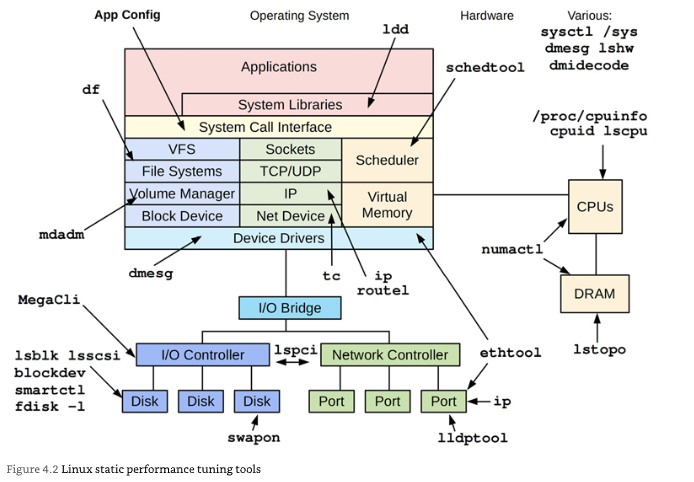
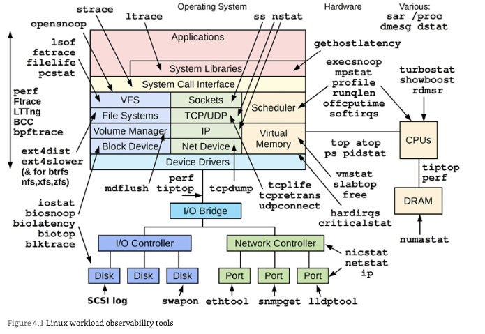
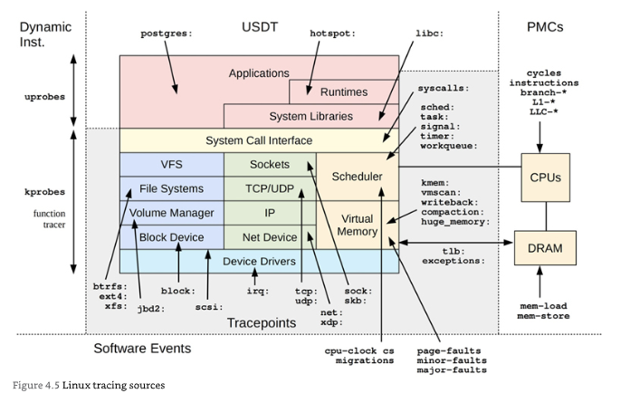
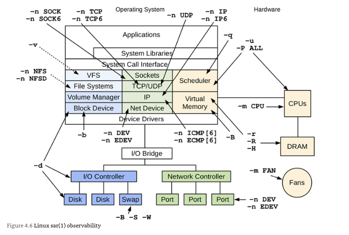

# todo

- examples from the current system.
- surface the critical examples based on experience.
- it could be code, database queries, etc...
- go as broad as possible for the first attempt

# Table of Contents

```toc
exclude: Table of Contents
tight: false
from-heading: 1
to-heading: 6
class-name: "table-of-contents"
```

# key takeaways

# [Designing Data-Intensive Applications](https://www.goodreads.com/book/show/23463279-designing-data-intensive-applications)

## Reliable, scalable, and maintainable applications

A data-intensive application is typically built from standard building blocks. They usually need to:
* Store data (_databases_)
* Speed up reads (_caches_)
* Search data (_search indexes_)
* Send a message to another process asynchronously (_stream processing_)
* Periodically crunch data (_batch processing_)

* **Reliability**. To work _correctly_ even in the face of _adversity_.
* **Scalability**. Reasonable ways of dealing with growth.
* **Maintainability**. Be able to work on it _productively_.

### Reliability

Typical expectations:
* Application performs the function the user expected
* Tolerate the user making mistakes
* Its performance is good
* The system prevents abuse

Systems that anticipate faults and can cope with them are called _fault-tolerant_ or _resilient_.

**A fault is usually defined as one component of the system deviating from its spec**, whereas _failure_ is when the system as a whole stops providing the required service to the user.

You should generally **prefer tolerating faults over preventing faults**.

* **Hardware faults**. Until recently redundancy of hardware components was sufficient for most applications. As data volumes increase, more applications use a larger number of machines, proportionally increasing the rate of hardware faults. **There is a move towards systems that tolerate the loss of entire machines**. A system that tolerates machine failure can be patched one node at a time, without downtime of the entire system (_rolling upgrade_).
* **Software errors**. It is unlikely that a large number of hardware components will fail at the same time. Software errors are a systematic error within the system, they tend to cause many more system failures than uncorrelated hardware faults.
* **Human errors**. Humans are known to be unreliable. Configuration errors by operators are a leading cause of outages. You can make systems more reliable:
    - Minimising the opportunities for error, peg: with admin interfaces that make easy to do the "right thing" and discourage the "wrong thing".
    - Provide fully featured non-production _sandbox_ environments where people can explore and experiment safely.
    - Automated testing.
    - Quick and easy recovery from human error, fast to rollback configuration changes, roll out new code gradually and tools to recompute data.
    - Set up detailed and clear monitoring, such as performance metrics and error rates (_telemetry_).
    - Implement good management practices and training.

### Scalability

This is how do we cope with increased load. We need to succinctly describe the current load on the system; only then we can discuss growth questions.

---

#### Twitter example

Twitter main operations
- Post tweet: a user can publish a new message to their followers (4.6k req/sec, over 12k req/sec peak)
- Home timeline: a user can view tweets posted by the people they follow (300k req/sec)

Two ways of implementing those operations:
1. Posting a tweet simply inserts the new tweet into a global collection of tweets. When a user requests their home timeline, look up all the people they follow, find all the tweets for those users, and merge them (sorted by time). This could be done with a SQL `JOIN`.
2. Maintain a cache for each user's home timeline. When a user _posts a tweet_, look up all the people who follow that user, and insert the new tweet into each of their home timeline caches.

Approach 1, systems struggle to keep up with the load of home timeline queries. So the company switched to approach 2. The average rate of published tweets is almost two orders of magnitude lower than the rate of home timeline reads.

Downside of approach 2 is that posting a tweet now requires a lot of extra work. Some users have over 30 million followers. A single tweet may result in over 30 million writes to home timelines.

Twitter moved to an hybrid of both approaches. Tweets continue to be fanned out to home timelines but a small number of users with a very large number of followers are fetched separately and merged with that user's home timeline when it is read, like in approach 1.

---

#### Describing performance

What happens when the load increases:
* How is the performance affected?
* How much do you need to increase your resources?

In a batch processing system such as Hadoop, we usually care about _throughput_, or the number of records we can process per second.

> ##### Latency and response time
> The response time is what the client sees. Latency is the duration that a request is waiting to be handled.

It's common to see the _average_ response time of a service reported. However, the mean is not very good metric if you want to know your "typical" response time, it does not tell you how many users actually experienced that delay.

**Better to use percentiles.**
* _Median_ (_50th percentile_ or _p50_). Half of user requests are served in less than the median response time, and the other half take longer than the median
* Percentiles _95th_, _99th_ and _99.9th_ (_p95_, _p99_ and _p999_) are good to figure out how bad your outliners are.

Amazon describes response time requirements for internal services in terms of the 99.9th percentile because the customers with the slowest requests are often those who have the most data. The most valuable customers.

On the other hand, optimising for the 99.99th percentile would be too expensive.

_Service level objectives_ (SLOs) and _service level agreements_ (SLAs) are contracts that define the expected performance and availability of a service.
An SLA may state the median response time to be less than 200ms and a 99th percentile under 1s. **These metrics set expectations for clients of the service and allow customers to demand a refund if the SLA is not met.**

Queueing delays often account for large part of the response times at high percentiles. **It is important to measure times on the client side.**

When generating load artificially, the client needs to keep sending requests independently of the response time.

> ##### Percentiles in practice
> Calls in parallel, the end-user request still needs to wait for the slowest of the parallel calls to complete.
> The chance of getting a slow call increases if an end-user request requires multiple backend calls.

#### Approaches for coping with load

* _Scaling up_ or _vertical scaling_: Moving to a more powerful machine
* _Scaling out_ or _horizontal scaling_: Distributing the load across multiple smaller machines.
* _Elastic_ systems: Automatically add computing resources when detected load increase. Quite useful if load is unpredictable.

Distributing stateless services across multiple machines is fairly straightforward. Taking stateful data systems from a single node to a distributed setup can introduce a lot of complexity. Until recently it was common wisdom to keep your database on a single node.

### Maintainability

The majority of the cost of software is in its ongoing maintenance. There are three design principles for software systems:
* **Operability**. Make it easy for operation teams to keep the system running.
* **Simplicity**. Easy for new engineers to understand the system by removing as much complexity as possible.
* **Evolvability**. Make it easy for engineers to make changes to the system in the future.

#### Operability: making life easy for operations

A good operations team is responsible for
* Monitoring and quickly restoring service if it goes into bad state
* Tracking down the cause of problems
* Keeping software and platforms up to date
* Keeping tabs on how different systems affect each other
* Anticipating future problems
* Establishing good practices and tools for development
* Perform complex maintenance tasks, like platform migration
* Maintaining the security of the system
* Defining processes that make operations predictable
* Preserving the organisation's knowledge about the system

**Good operability means making routine tasks easy.**

#### Simplicity: managing complexity

When complexity makes maintenance hard, budget and schedules are often overrun. There is a greater risk of introducing bugs.

Making a system simpler means removing _accidental_ complexity, as non inherent in the problem that the software solves (as seen by users).

One of the best tools we have for removing accidental complexity is _abstraction_ that hides the implementation details behind clean and simple to understand APIs and facades.

#### Evolvability: making change easy

_Agile_ working patterns provide a framework for adapting to change.

---

* _Functional requirements_: what the application should do
* _Nonfunctional requirements_: general properties like security, reliability, compliance, scalability, compatibility and maintainability.

---

## Data models and query language

Most applications are built by layering one data model on top of another. Each layer hides the complexity of the layers below by providing a clean data model. These abstractions allow different groups of people to work effectively.

### Relational model vs document model

The roots of relational databases lie in _business data processing_, _transaction processing_ and _batch processing_.

The goal was to hide the implementation details behind a cleaner interface.

_Not Only SQL_ has a few driving forces:
* Greater scalability
* preference for free and open source software
* Specialised query optimisations
* Desire for a more dynamic and expressive data model

**With a SQL model, if data is stored in a relational tables, an awkward translation layer is translated, this is called _impedance mismatch_.**

JSON model reduces the impedance mismatch and the lack of schema is often cited as an advantage.

JSON representation has better _locality_ than the multi-table SQL schema. All the relevant information is in one place, and one query is sufficient.

In relational databases, it's normal to refer to rows in other tables by ID, because joins are easy. In document databases, joins are not needed for one-to-many tree structures, and support for joins is often weak.

If the database itself does not support joins, you have to emulate a join in application code by making multiple queries.

The most popular database for business data processing in the 1970s was the IBM's _Information Management System_ (IMS).

IMS used a _hierarchical model_ and like document databases worked well for one-to-many relationships, but it made many-to-,any relationships difficult, and it didn't support joins.

#### The network model

Standardised by a committee called the Conference on Data Systems Languages (CODASYL) model was a generalisation of the hierarchical model. In the tree structure of the hierarchical model, every record has exactly one parent, while in the network model, a record could have multiple parents.

The links between records are like pointers in a programming language. The only way of accessing a record was to follow a path from a root record called _access path_.

A query in CODASYL was performed by moving a cursor through the database by iterating over a list of records. If you didn't have a path to the data you wanted, you were in a difficult situation as it was difficult to make changes to an application's data model.

#### The relational model

By contrast, the relational model was a way to lay out all the data in the open" a relation (table) is simply a collection of tuples (rows), and that's it.

The query optimiser automatically decides which parts of the query to execute in which order, and which indexes to use (the access path).

The relational model thus made it much easier to add new features to applications.

---

**The main arguments in favour of the document data model are schema flexibility, better performance due to locality, and sometimes closer data structures to the ones used by the applications. The relation model counters by providing better support for joins, and many-to-one and many-to-many relationships.**

If the data in your application has a document-like structure, then it's probably a good idea to use a document model. The relational technique of _shredding_ can lead unnecessary complicated application code.

The poor support for joins in document databases may or may not be a problem.

If you application does use many-to-many relationships, the document model becomes less appealing. Joins can be emulated in application code by making multiple requests. Using the document model can lead to significantly more complex application code and worse performance.

#### Schema flexibility

Most document databases do not enforce any schema on the data in documents. Arbitrary keys and values can be added to a document, when reading, **clients have no guarantees as to what fields the documents may contain.**

Document databases are sometimes called _schemaless_, but maybe a more appropriate term is _schema-on-read_, in contrast to _schema-on-write_.

Schema-on-read is similar to dynamic (runtime) type checking, whereas schema-on-write is similar to static (compile-time) type checking.

The schema-on-read approach if the items on the collection don't have all the same structure (heterogeneous)
* Many different types of objects
* Data determined by external systems


#### Data locality for queries

If your application often needs to access the entire document, there is a performance advantage to this _storage locality_.

The database typically needs to load the entire document, even if you access only a small portion of it. On updates, the entire document usually needs to be rewritten, it is recommended that you keep documents fairly small.

#### Convergence of document and relational databases

PostgreSQL does support JSON documents. RethinkDB supports relational-like joins in its query language and some MongoDB drivers automatically resolve database references. Relational and document databases are becoming more similar over time.

### Query languages for data

SQL is a _declarative_ query language. In an _imperative language_, you tell the computer to perform certain operations in order.

In a declarative query language you just specify the pattern of the data you want, but not _how_ to achieve that goal.

A declarative query language hides implementation details of the database engine, making it possible for the database system to introduce performance improvements without requiring any changes to queries.

Declarative languages often lend themselves to parallel execution while imperative code is very hard to parallelise across multiple cores because it specifies instructions that must be performed in a particular order. Declarative languages specify only the pattern of the results, not the algorithm that is used to determine results.

#### Declarative queries on the web

In a web browser, using declarative CSS styling is much better than manipulating styles imperatively in JavaScript. Declarative languages like SQL turned out to be much better than imperative query APIs.

#### MapReduce querying

_MapReduce_ is a programming model for processing large amounts of data in bulk across many machines, popularised by Google.

Mongo offers a MapReduce solution.

```js
db.observations.mapReduce(
    function map() { 2
        var year  = this.observationTimestamp.getFullYear();
        var month = this.observationTimestamp.getMonth() + 1;
        emit(year + "-" + month, this.numAnimals); 3
    },
    function reduce(key, values) { 4
        return Array.sum(values); 5
    },
    {
        query: { family: "Sharks" }, 1
        out: "monthlySharkReport" 6
    }
);
```

The `map` and `reduce` functions must be _pure_ functions, they cannot perform additional database queries and they must not have any side effects. These restrictions allow the database to run the functions anywhere, in any order, and rerun them on failure.

A usability problem with MapReduce is that you have to write two carefully coordinated functions. A declarative language offers more opportunities for a query optimiser to improve the performance of a query. For there reasons, MongoDB 2.2 added support for a declarative query language called _aggregation pipeline_

```js
db.observations.aggregate([
    { $match: { family: "Sharks" } },
    { $group: {
        _id: {
            year:  { $year:  "$observationTimestamp" },
            month: { $month: "$observationTimestamp" }
        },
        totalAnimals: { $sum: "$numAnimals" }
    } }
]);
```

### Graph-like data models

If many-to-many relationships are very common in your application, it becomes more natural to start modelling your data as a graph.

A graph consists of _vertices_ (_nodes_ or _entities_) and _edges_ (_relationships_ or _arcs_).

Well-known algorithms can operate on these graphs, like the shortest path between two points, or popularity of a web page.

There are several ways of structuring and querying the data. The _property graph_ model (implemented by Neo4j, Titan, and Infinite Graph) and the _triple-store_ model (implemented by Datomic, AllegroGraph, and others). There are also three declarative query languages for graphs: Cypher, SPARQL, and Datalog.

#### Property graphs

Each vertex consists of:
* Unique identifier
* Outgoing edges
* Incoming edges
* Collection of properties (key-value pairs)

Each edge consists of:
* Unique identifier
* Vertex at which the edge starts (_tail vertex_)
* Vertex at which the edge ends (_head vertex_)
* Label to describe the kind of relationship between the two vertices
* A collection of properties (key-value pairs)

Graphs provide a great deal of flexibility for data modelling. Graphs are good for evolvability.

---

* _Cypher_ is a declarative language for property graphs created by Neo4j
* Graph queries in SQL. In a relational database, you usually know in advance which joins you need in your query. In a graph query, the number if joins is not fixed in advance. In Cypher `:WITHIN*0...` expresses "follow a `WITHIN` edge, zero or more times" (like the `*` operator in a regular expression). This idea of variable-length traversal paths in a query can be expressed using something called _recursive common table expressions_ (the `WITH RECURSIVE` syntax).

---

#### Triple-stores and SPARQL

In a triple-store, all information is stored in the form of very simple three-part statements: _subject_, _predicate_, _object_ (peg: _Jim_, _likes_, _bananas_). A triple is equivalent to a vertex in graph.

#### The SPARQL query language

_SPARQL_ is a query language for triple-stores using the RDF data model.

#### The foundation: Datalog

_Datalog_ provides the foundation that later query languages build upon. Its model is similar to the triple-store model, generalised a bit. Instead of writing a triple (_subject_, _predicate_, _object_), we write as _predicate(subject, object)_.

We define _rules_ that tell the database about new predicates and rules can refer to other rules, just like functions can call other functions or recursively call themselves.

Rules can be combined and reused in different queries. It's less convenient for simple one-off queries, but it can cope better if your data is complex.

## Storage and retrieval

Databases need to do two things: store the data and give the data back to you.

### Data structures that power up your database

Many databases use a _log_, which is append-only data file. Real databases have more issues to deal with tho (concurrency control, reclaiming disk space so the log doesn't grow forever and handling errors and partially written records).

> A _log_ is an append-only sequence of records

In order to efficiently find the value for a particular key, we need a different data structure: an _index_. An index is an _additional_ structure that is derived from the primary data.

Well-chosen indexes speed up read queries but every index slows down writes. That's why databases don't index everything by default, but require you to choose indexes manually using your knowledge on typical query patterns.

#### Hash indexes

Key-value stores are quite similar to the _dictionary_ type (hash map or hash table).

Let's say our storage consists only of appending to a file. The simplest indexing strategy is to keep an in-memory hash map where every key is mapped to a byte offset in the data file. Whenever you append a new key-value pair to the file, you also update the hash map to reflect the offset of the data you just wrote.

Bitcask (the default storage engine in Riak) does it like that. The only requirement it has is that all the keys fit in the available RAM. Values can use more space than there is available in memory, since they can be loaded from disk.

A storage engine like Bitcask is well suited to situations where the value for each key is updated frequently. There are a lot of writes, but there are too many distinct keys, you have a large number of writes per key, but it's feasible to keep all keys in memory.

As we only ever append to a file, so how do we avoid eventually running out of disk space? **A good solution is to break the log into segments of certain size by closing the segment file when it reaches a certain size, and making subsequent writes to a new segment file. We can then perform _compaction_ on these segments.** Compaction means throwing away duplicate keys in the log, and keeping only the most recent update for each key.

We can also merge several segments together at the sae time as performing the compaction. Segments are never modified after they have been written, so the merged segment is written to a new file. Merging and compaction of frozen segments can be done in a background thread. After the merging process is complete, we switch read requests to use the new merged segment instead of the old segments, and the old segment files can simply be deleted.

Each segment now has its own in-memory hash table, mapping keys to file offsets. In order to find a value for a key, we first check the most recent segment hash map; if the key is not present we check the second-most recent segment and so on. The merging process keeps the number of segments small, so lookups don't need to check many hash maps.

Some issues that are important in a real implementation:
* File format. It is simpler to use binary format.
* Deleting records. Append special deletion record to the data file (_tombstone_) that tells the merging process to discard previous values.
* Crash recovery. If restarted, the in-memory hash maps are lost. You can recover from reading each segment but that would take long time. Bitcask speeds up recovery by storing a snapshot of each segment hash map on disk.
* Partially written records. The database may crash at any time. Bitcask includes checksums allowing corrupted parts of the log to be detected and ignored.
* Concurrency control. As writes are appended to the log in a strictly sequential order, a common implementation is to have a single writer thread. Segments are immutable, so they can be read concurrently by multiple threads.

Append-only design turns out to be good for several reasons:
* Appending and segment merging are sequential write operations, much faster than random writes, especially on magnetic spinning-disks.
* Concurrency and crash recovery are much simpler.
* Merging old segments avoids files getting fragmented over time.

Hash table has its limitations too:
* The hash table must fit in memory. It is difficult to make an on-disk hash map perform well.
* Range queries are not efficient.

#### SSTables and LSM-Trees

We introduce a new requirement to segment files: we require that the sequence of key-value pairs is _sorted by key_.

We call this _Sorted String Table_, or _SSTable_. We require that each key only appears once within each merged segment file (compaction already ensures that). SSTables have few big advantages over log segments with hash indexes
1. **Merging segments is simple and efficient** (we can use algorithms like _mergesort_). When multiple segments contain the same key, we can keep the value from the most recent segment and discard the values in older segments.
2. **You no longer need to keep an index of all the keys in memory.** For a key like `handiwork`, when you know the offsets for the keys `handback` and `handsome`, you know `handiwork` must appear between those two. You can jump to the offset for `handback` and scan from there until you find `handiwork`, if not, the key is not present. You still need an in-memory index to tell you the offsets for some of the keys. One key for every few kilobytes of segment file is sufficient.
3. Since read requests need to scan over several key-value pairs in the requested range anyway, **it is possible to group those records into a block and compress it** before writing it to disk.

How do we get the data sorted in the first place? With red-black trees or AVL trees, you can insert keys in any order and read them back in sorted order.
* When a write comes in, add it to an in-memory balanced tree structure (_memtable_).
* When the memtable gets bigger than some threshold (megabytes), write it out to disk as an SSTable file. Writes can continue to a new memtable instance.
* On a read request, try to find the key in the memtable, then in the most recent on-disk segment, then in the next-older segment, etc.
* From time to time, run merging and compaction in the background to discard overwritten and deleted values.

If the database crashes, the most recent writes are lost. We can keep a separate log on disk to which every write is immediately appended. That log is not in sorted order, but that doesn't matter, because its only purpose is to restore the memtable after crash. Every time the memtable is written out to an SSTable, the log can be discarded.

**Storage engines that are based on this principle of merging and compacting sorted files are often called LSM structure engines (Log Structure Merge-Tree).**

Lucene, an indexing engine for full-text search used by Elasticsearch and Solr, uses a similar method for storing its _term dictionary_.

LSM-tree algorithm can be slow when looking up keys that don't exist in the database. To optimise this, storage engines often use additional _Bloom filters_ (a memory-efficient data structure for approximating the contents of a set).

There are also different strategies to determine the order and timing of how SSTables are compacted and merged. Mainly two _size-tiered_ and _leveled_ compaction. LevelDB and RocksDB use leveled compaction, HBase use size-tiered, and Cassandra supports both. In size-tiered compaction, newer and smaller SSTables are successively merged into older and larger SSTables. In leveled compaction, the key range is split up into smaller SSTables and older data is moved into separate "levels", which allows the compaction to use less disk space.

#### B-trees

This is the most widely used indexing structure. B-tress keep key-value pairs sorted by key, which allows efficient key-value lookups and range queries.

The log-structured indexes break the database down into variable-size _segments_ typically several megabytes or more. B-trees break the database down into fixed-size _blocks_ or _pages_, traditionally 4KB.

One page is designated as the _root_ and you start from there. The page contains several keys and references to child pages.

If you want to update the value for an existing key in a B-tree, you search for the leaf page containing that key, change the value in that page, and write the page back to disk. If you want to add new key, find the page and add it to the page. If there isn't enough free space in the page to accommodate the new key, it is split in two half-full pages, and the parent page is updated to account for the new subdivision of key ranges.

Trees remain _balanced_. A B-tree with _n_ keys always has a depth of _O_(log _n_).

The basic underlying write operation of a B-tree is to overwrite a page on disk with new data. It is assumed that the overwrite does not change the location of the page, all references to that page remain intact. This is a big contrast to log-structured indexes such as LSM-trees, which only append to files.

Some operations require several different pages to be overwritten. When you split a page, you need to write the two pages that were split, and also overwrite their parent. If the database crashes after only some of the pages have been written, you end up with a corrupted index.

It is common to include an additional data structure on disk: a _write-ahead log_ (WAL, also know as the _redo log_).

Careful concurrency control is required if multiple threads are going to access, typically done protecting the tree internal data structures with _latches_ (lightweight locks).

#### B-trees and LSM-trees

LSM-trees are typically faster for writes, whereas B-trees are thought to be faster for reads. Reads are typically slower on LSM-tress as they have to check several different data structures and SSTables at different stages of compaction.

Advantages of LSM-trees:
* LSM-trees are typically able to sustain higher write throughput than B-trees, party because they sometimes have lower write amplification: a write to the database results in multiple writes to disk. The more a storage engine writes to disk, the fewer writes per second it can handle.
* LSM-trees can be compressed better, and thus often produce smaller files on disk than B-trees. B-trees tend to leave disk space unused due to fragmentation.

Downsides of LSM-trees:
* Compaction process can sometimes interfere with the performance of ongoing reads and writes. B-trees can be more predictable. The bigger the database, the the more disk bandwidth is required for compaction. Compaction cannot keep up with the rate of incoming writes, if not configured properly you can run out of disk space.
* On B-trees, each key exists in exactly one place in the index. This offers strong transactional semantics. Transaction isolation is implemented using locks on ranges of keys, and in a B-tree index, those locks can be directly attached to the tree.

#### Other indexing structures

We've only discussed key-value indexes, which are like _primary key_ index. There are also _secondary indexes_.

A secondary index can be easily constructed from a key-value index. The main difference is that in a secondary index, the indexed values are not necessarily unique. There are two ways of doing this: making each value in the index a list of matching row identifiers or by making a each entry unique by appending a row identifier to it.

#### Full-text search and fuzzy indexes

Indexes don't allow you to search for _similar_ keys, such as misspelled words. Such _fuzzy_ querying requires different techniques.

Full-text search engines allow synonyms, grammatical variations, occurrences of words near each other.

Lucene uses SSTable-like structure for its term dictionary. Lucene, the in-memory index is a finite state automaton, similar to a _trie_.

#### Keeping everything in memory

Disks have two significant advantages: they are durable, and they have lower cost per gigabyte than RAM.

It's quite feasible to keep them entirely in memory, this has lead to _in-memory_ databases.

Key-value stores, such as Memcached are intended for cache only, it's acceptable for data to be lost if the machine is restarted. Other in-memory databases aim for durability, with special hardware, writing a log of changes to disk, writing periodic snapshots to disk or by replicating in-memory sate to other machines.

When an in-memory database is restarted, it needs to reload its state, either from disk or over the network from a replica. The disk is merely used as an append-only log for durability, and reads are served entirely from memory.

Products such as VoltDB, MemSQL, and Oracle TimesTime are in-memory databases. Redis and Couchbase provide weak durability.

In-memory databases can be faster because they can avoid the overheads of encoding in-memory data structures in a form that can be written to disk.

Another interesting area is that in-memory databases may provide data models that are difficult to implement with disk-based indexes.

### Transaction processing or analytics?

A _transaction_ is a group of reads and writes that form a logical unit, this pattern became known as _online transaction processing_ (OLTP).

_Data analytics_ has very different access patterns. A query would need to scan over a huge number of records, only reading a few columns per record, and calculates aggregate statistics.

These queries are often written by business analysts, and fed into reports. This pattern became known for _online analytics processing_ (OLAP).


#### Data warehousing

A _data warehouse_ is a separate database that analysts can query to their heart's content without affecting OLTP operations. It contains read-only copy of the dat in all various OLTP systems in the company. Data is extracted out of OLTP databases (through periodic data dump or a continuous stream of update), transformed into an analysis-friendly schema, cleaned up, and then loaded into the data warehouse (process _Extract-Transform-Load_ or ETL).

A data warehouse is most commonly relational, but the internals of the systems can look quite different.

Amazon RedShift is hosted version of ParAccel. Apache Hive, Spark SQL, Cloudera Impala, Facebook Presto, Apache Tajo, and Apache Drill. Some of them are based on ideas from Google's Dremel.

Data warehouses are used in fairly formulaic style known as a _star schema_.

Facts are captured as individual events, because this allows maximum flexibility of analysis later. The fact table can become extremely large.

Dimensions represent the _who_, _what_, _where_, _when_, _how_ and _why_ of the event.

The name "star schema" comes from the fact than when the table relationships are visualised, the fact table is in the middle, surrounded by its dimension tables, like the rays of a star.

Fact tables often have over 100 columns, sometimes several hundred. Dimension tables can also be very wide.

### Column-oriented storage

In a row-oriented storage engine, when you do a query that filters on a specific field, the engine will load all those rows with all their fields into memory, parse them and filter out the ones that don't meet the requirement. This can take a long time.

_Column-oriented storage_ is simple: don't store all the values from one row together, but store all values from each _column_ together instead. If each column is stored in a separate file, a query only needs to read and parse those columns that are used in a query, which can save a lot of work.

Column-oriented storage often lends itself very well to compression as the sequences of values for each column look quite repetitive, which is a good sign for compression. A technique that is particularly effective in data warehouses is _bitmap encoding_.

Bitmap indexes are well suited for all kinds of queries that are common in a data warehouse.

> Cassandra and HBase have a concept of _column families_, which they inherited from Bigtable.

Besides reducing the volume of data that needs to be loaded from disk, column-oriented storage layouts are also good for making efficient use of CPU cycles (_vectorised processing_).

**Column-oriented storage, compression, and sorting helps to make read queries faster and make sense in data warehouses, where most of the load consist on large read-only queries run by analysts. The downside is that writes are more difficult.**

An update-in-place approach, like B-tree use, is not possible with compressed columns. If you insert a row in the middle of a sorted table, you would most likely have to rewrite all column files.

It's worth mentioning _materialised aggregates_ as some cache of the counts ant the sums that queries use most often. A way of creating such a cache is with a _materialised view_, on a relational model this is usually called a _virtual view_: a table-like object whose contents are the results of some query. A materialised view is an actual copy of the query results, written in disk, whereas a virtual view is just a shortcut for writing queries.

When the underlying data changes, a materialised view needs to be updated, because it is denormalised copy of the data. Database can do it automatically, but writes would become more expensive.

A common special case of a materialised view is know as a _data cube_ or _OLAP cube_, a grid of aggregates grouped by different dimensions.

## Encoding and evolution

Change to an application's features also requires a change to data it stores.

Relational databases conforms to one schema although that schema can be changed, there is one schema in force at any point in time. **Schema-on-read (or schemaless) contain a mixture of older and newer data formats.**

In large applications changes don't happen instantaneously. You want to perform a _rolling upgrade_ and deploy a new version to a few nodes at a time, gradually working your way through all the nodes without service downtime.

Old and new versions of the code, and old and new data formats, may potentially all coexist. We need to maintain compatibility in both directions
* Backward compatibility, newer code can read data that was written by older code.
* Forward compatibility, older code can read data that was written by newer code.

### Formats for encoding data

Two different representations:
* In memory
* When you want to write data to a file or send it over the network, you have to encode it

Thus, you need a translation between the two representations. In-memory representation to byte sequence is called _encoding_ (_serialisation_ or _marshalling_), and the reverse is called _decoding_ (_parsing_, _deserialisation_ or _unmarshalling_).

Programming languages come with built-in support for encoding in-memory objects into byte sequences, but is usually a bad idea to use them. Precisely because of a few problems.
* Often tied to a particular programming language.
* The decoding process needs to be able to instantiate arbitrary classes and this is frequently a security hole.
* Versioning
* Efficiency

Standardised encodings can be written and read by many programming languages.

JSON, XML, and CSV are human-readable and popular specially as data interchange formats, but they have some subtle problems:
* Ambiguity around the encoding of numbers and dealing with large numbers
* Support of Unicode character strings, but no support for binary strings. People get around this by encoding binary data as Base64, which increases the data size by 33%.
* There is optional schema support for both XML and JSON
* CSV does not have any schema

#### Binary encoding

JSON is less verbose than XML, but both still use a lot of space compared to binary formats. There are binary encodings for JSON (MesagePack, BSON, BJSON, UBJSON, BISON and Smile), similar thing for XML (WBXML and Fast Infoset).

**Apache Thrift and Protocol Buffers (protobuf) are binary encoding libraries.**

Thrift offers two different protocols:
* **BinaryProtocol**, there are no field names like `userName`, `favouriteNumber`. Instead the data contains _field tags_, which are numbers (`1`, `2`)
* **CompactProtocol**, which is equivalent to BinaryProtocol but it packs the same information in less space. It packs the field type and the tag number into the same byte.

Protocol Buffers are very similar to Thrift's CompactProtocol, bit packing is a bit different and that might allow smaller compression.

Schemas inevitable need to change over time (_schema evolution_), how do Thrift and Protocol Buffers handle schema changes while keeping backward and forward compatibility changes?

* **Forward compatible support**. As with new fields you add new tag numbers, old code trying to read new code, it can simply ignore not recognised tags.
* **Backwards compatible support**. As long as each field has a unique tag number, new code can always read old data. Every field you add after initial deployment of schema must be optional or have a default value.

Removing fields is just like adding a field with backward and forward concerns reversed. You can only remove a field that is optional, and you can never use the same tag again.

What about changing the data type of a field? There is a risk that values will lose precision or get truncated.

##### Avro

Apache Avro is another binary format that has two schema languages, one intended for human editing (Avro IDL), and one (based on JSON) that is more easily machine-readable.

You go go through the fields in the order they appear in the schema and use the schema to tell you the datatype of each field. Any mismatch in the schema between the reader and the writer would mean incorrectly decoded data.

What about schema evolution? When an application wants to encode some data, it encodes the data using whatever version of the schema it knows (_writer's schema_).

When an application wants to decode some data, it is expecting the data to be in some schema (_reader's schema_).

In Avro the writer's schema and the reader's schema _don't have to be the same_. The Avro library resolves the differences by looking at the writer's schema and the reader's schema.

Forward compatibility means you can have a new version of the schema as writer and an old version of the schema as reader. Conversely, backward compatibility means that you can have a new version of the schema as reader and an old version as writer.

To maintain compatibility, you may only add or remove a field that has a default value.

If you were to add a field that has no default value, new readers wouldn't be able to read data written by old writers.

Changing the datatype of a field is possible, provided that Avro can convert the type. Changing the name of a filed is tricky (backward compatible but not forward compatible).

The schema is identified encoded in the data. In a large file with lots of records, the writer of the file can just include the schema at the beginning of the file. On a database with individually written records, you cannot assume all the records will have the same schema, so you have to include a version number at the beginning of every encoded record. While sending records over the network, you can negotiate the schema version on connection setup.

Avro is friendlier to _dynamically generated schemas_ (dumping into a file the database). You can fairly easily generate an Avro schema in JSON.

If the database schema changes, you can just generate a new Avro schema for the updated database schema and export data in the new Avro schema.

By contrast with Thrift and Protocol Buffers, every time the database schema changes, you would have to manually update the mappings from database column names to field tags.

---

Although textual formats such as JSON, XML and CSV are widespread, binary encodings based on schemas are also a viable option. As they have nice properties:
* Can be much more compact, since they can omit field names from the encoded data.
* Schema is a valuable form of documentation, required for decoding, you can be sure it is up to date.
* Database of schemas allows you to check forward and backward compatibility changes.
* Generate code from the schema is useful, since it enables type checking at compile time.

### Modes of dataflow

Different process on how data flows between processes

#### Via databases

The process that writes to the database encodes the data, and the process that reads from the database decodes it.

A value in the database may be written by a _newer_ version of the code, and subsequently read by an _older_ version of the code that is still running.

When a new version of your application is deployed, you may entirely replace the old version with the new version within a few minutes. The same is not true in databases, the five-year-old data will still be there, in the original encoding, unless you have explicitly rewritten it. _Data outlives code_.

Rewriting (_migrating_) is expensive, most relational databases allow simple schema changes, such as adding a new column with a `null` default value without rewriting existing data. When an old row is read, the database fills in `null`s for any columns that are missing.

#### Via service calls

You have processes that need to communicate over a network of _clients_ and _servers_.

Services are similar to databases, each service should be owned by one team. and that team should be able to release versions of the service frequently, without having to coordinate with other teams. We should expect old and new versions of servers and clients to be running at the same time.

_Remote procedure calls_ (RPC) tries to make a request to a remote network service look the same as calling a function or method in your programming language, it seems convenient at first but the approach is flawed:
* A network request is unpredictable
* A network request it may return without a result, due a _timeout_
* Retrying will cause the action to be performed multiple times, unless you build a mechanism for deduplication (_idempotence_).
* A network request is much slower than a function call, and its latency is wildly variable.
* Parameters need to be encoded into a sequence of bytes that can be sent over the network and becomes problematic with larger objects.
* The RPC framework must translate datatypes from one language to another, not all languages have the same types.

**There is no point trying to make a remote service look too much like a local object in your programming language, because it's a fundamentally different thing.**

New generation of RPC frameworks are more explicit about the fact that a remote request is different from a local function call. Fiangle and Rest.li use _features_ (_promises_) to encapsulate asyncrhonous actions.

RESTful API has some significant advantages like being good for experimentation and debugging.

REST seems to be the predominant style for public APIs. The main focus of RPC frameworks is on requests between services owned by the same organisation, typically within the same datacenter.

#### Via asynchronous message passing

In an _asynchronous message-passing_ systems, a client's request (usually called a _message_) is delivered to another process with low latency. The message goes via an intermediary called a _message broker_ (_message queue_ or _message-oriented middleware_) which stores the message temporarily. This has several advantages compared to direct RPC:
* It can act as a buffer if the recipient is unavailable or overloaded
* It can automatically redeliver messages to a process that has crashed and prevent messages from being lost
* It avoids the sender needing to know the IP address and port number of the recipient (useful in a cloud environment)
* It allows one message to be sent to several recipients
* **Decouples the sender from the recipient**

The communication happens only in one direction. The sender doesn't wait for the message to be delivered, but simply sends it and then forgets about it (_asynchronous_).

Open source implementations for message brokers are RabbitMQ, ActiveMQ, HornetQ, NATS, and Apache Kafka.

One process sends a message to a named _queue_ or _topic_ and the broker ensures that the message is delivered to one or more _consumers_ or _subscribers_ to that queue or topic.

Message brokers typically don't enforce a particular data model, you can use any encoding format.

An _actor model_ is a programming model for concurrency in a single process. Rather than dealing with threads (and their complications), logic is encapsulated in _actors_. Each actor typically represent one client or entity, it may have some local state, and it communicates with other actors by sending and receiving asynchronous messages. Message deliver is not guaranteed. Since each actor processes only one message at a time, it doesn't need to worry about threads.

In _distributed actor frameworks_, this programming model is used to scale an application across multiple nodes. It basically integrates a message broker and the actor model into a single framework.

* _Akka_ uses Java's built-in serialisation by default, which does not provide forward or backward compatibility. You can replace it with something like Protocol Buffers and the ability to do rolling upgrades.
* _Orleans_ by default uses custom data encoding format that does not support rolling upgrade deployments.
* In _Erlang OTP_ it is surprisingly hard to make changes to record schemas.

---

What happens if multiple machines are involved in storage and retrieval of data?

Reasons for distribute a database across multiple machines:
* Scalability
* Fault tolerance/high availability
* Latency, having servers at various locations worldwide

## Replication

Reasons why you might want to replicate data:
* To keep data geographically close to your users
* Increase availability
* Increase read throughput

The difficulty in replication lies in handling _changes_ to replicated data. Popular algorithms for replicating changes between nodes: _single-leader_, _multi-leader_, and _leaderless_ replication.

### Leaders and followers

Each node that stores a copy of the database is called a _replica_.

Every write to the database needs to be processed by every replica. The most common solution for this is called _leader-based replication_ (_active/passive_ or _master-slave replication_).
1. One of the replicas is designated the _leader_ (_master_ or _primary_). Writes to the database must send requests to the leader.
2. Other replicas are known as _followers_ (_read replicas_, _slaves_, _secondaries_ or _hot stanbys_). The leader sends the data change to all of its followers as part of a _replication log_ or _change stream_.
3. Reads can be query the leader or any of the followers, while writes are only accepted on the leader.

MySQL, Oracle Data Guard, SQL Server's AlwaysOn Availability Groups, MongoDB, RethinkDB, Espresso, Kafka and RabbitMQ are examples of these kind of databases.

#### Synchronous vs asynchronous

**The advantage of synchronous replication is that the follower is guaranteed to have an up-to-date copy of the data that is consistent with the leader. The disadvantage is that it the synchronous follower doesn't respond, the write cannot be processed.**

It's impractical for all followers to be synchronous. If you enable synchronous replication on a database, it usually means that _one_ of the followers is synchronous, and the others are asynchronous. This guarantees up-to-date copy of the data on at least two nodes (this is sometimes called _semi-synchronous_).

Often, leader-based replication is asynchronous. Writes are not guaranteed to be durable, the main advantage of this approach is that the leader can continue processing writes.

#### Setting up new followers

Copying data files from one node to another is typically not sufficient.

Setting up a follower can usually be done without downtime. The process looks like:
1. Take a snapshot of the leader's database
2. Copy the snapshot to the follower node
3. Follower requests data changes that have happened since the snapshot was taken
4. Once follower processed the backlog of data changes since snapshot, it has _caught up_.

#### Handling node outages

How does high availability works with leader-based replication?

#### Follower failure: catchup recovery

Follower can connect to the leader and request all the data changes that occurred during the time when the follower was disconnected.

#### Leader failure: failover

One of the followers needs to be promoted to be the new leader, clients need to be reconfigured to send their writes to the new leader and followers need to start consuming data changes from the new leader.

Automatic failover consists:
1. Determining that the leader has failed. If a node does not respond in a period of time it's considered dead.
2. Choosing a new leader. The best candidate for leadership is usually the replica with the most up-to-date changes from the old leader.
3. Reconfiguring the system to use the new leader. The system needs to ensure that the old leader becomes a follower and recognises the new leader.

Things that could go wrong:
* If asynchronous replication is used, the new leader may have received conflicting writes in the meantime.
* Discarding writes is especially dangerous if other storage systems outside of the database need to be coordinated with the database contents.
* It could happen that two nodes both believe that they are the leader (_split brain_). Data is likely to be lost or corrupted.
* What is the right time before the leader is declared dead?

For these reasons, some operation teams prefer to perform failovers manually, even if the software supports automatic failover.

#### Implementation of replication logs

##### Statement-based replication

The leader logs every _statement_ and sends it to its followers (every `INSERT`, `UPDATE` or `DELETE`).

This type of replication has some problems:
* Non-deterministic functions such as `NOW()` or `RAND()` will generate different values on replicas.
* Statements that depend on existing data, like auto-increments, must be executed in the same order in each replica.
* Statements with side effects may result on different results on each replica.

A solution to this is to replace any nondeterministic function with a fixed return value in the leader.

##### Write-ahead log (WAL) shipping

The log is an append-only sequence of bytes containing all writes to the database. The leader can send it to its followers. This way of replication is used in PostgresSQL and Oracle.

The main disadvantage is that the log describes the data at a very low level (like which bytes were changed in which disk blocks), coupling it to the storage engine.

Usually is not possible to run different versions of the database in leaders and followers. This can have a big operational impact, like making it impossible to have a zero-downtime upgrade of the database.

##### Logical (row-based) log replication

Basically a sequence of records describing writes to database tables at the granularity of a row:
* For an inserted row, the new values of all columns.
* For a deleted row, the information that uniquely identifies that column.
* For an updated row, the information to uniquely identify that row and all the new values of the columns.

A transaction that modifies several rows, generates several of such logs, followed by a record indicating that the transaction was committed. MySQL binlog uses this approach.

Since logical log is decoupled from the storage engine internals, it's easier to make it backwards compatible.

Logical logs are also easier for external applications to parse, useful for data warehouses, custom indexes and caches (_change data capture_).

##### Trigger-based replication

There are some situations were you may need to move replication up to the application layer.

A trigger lets you register custom application code that is automatically executed when a data change occurs. This is a good opportunity to log this change into a separate table, from which it can be read by an external process.

Main disadvantages is that this approach has greater overheads, is more prone to bugs but it may be useful due to its flexibility.

### Problems with replication lag

Node failures is just one reason for wanting replication. Other reasons are scalability and latency.

In a _read-scaling_ architecture, you can increase the capacity for serving read-only requests simply by adding more followers. However, this only realistically works on asynchronous replication. The more nodes you have, the likelier is that one will be down, so a fully synchronous configuration would be unreliable.

With an asynchronous approach, a follower may fall behind, leading to inconsistencies in the database (_eventual consistency_).

The _replication lag_ could be a fraction of a second or several seconds or even minutes.

The problems that may arise and how to solve them.

#### Reading your own writes

_Read-after-write consistency_, also known as _read-your-writes consistency_ is a guarantee that if the user reloads the page, they will always see any updates they submitted themselves.

How to implement it:
* **When reading something that the user may have modified, read it from the leader.** For example, user profile information on a social network is normally only editable by the owner. A simple rule is always read the user's own profile from the leader.
* You could track the time of the latest update and, for one minute after the last update, make all reads from the leader.
* The client can remember the timestamp of the most recent write, then the system can ensure that the replica serving any reads for that user reflects updates at least until that timestamp.
* If your replicas are distributed across multiple datacenters, then any request needs to be routed to the datacenter that contains the leader.


Another complication is that the same user is accessing your service from multiple devices, you may want to provide _cross-device_ read-after-write consistency.

Some additional issues to consider:
* Remembering the timestamp of the user's last update becomes more difficult. The metadata will need to be centralised.
* If replicas are distributed across datacenters, there is no guarantee that connections from different devices will be routed to the same datacenter. You may need to route requests from all of a user's devices to the same datacenter.

#### Monotonic reads

Because of followers falling behind, it's possible for a user to see things _moving backward in time_.

When you read data, you may see an old value; monotonic reads only means that if one user makes several reads in sequence, they will not see time go backward.

Make sure that each user always makes their reads from the same replica. The replica can be chosen based on a hash of the user ID. If the replica fails, the user's queries will need to be rerouted to another replica.

#### Consistent prefix reads

If a sequence of writes happens in a certain order, then anyone reading those writes will see them appear in the same order.

This is a particular problem in partitioned (sharded) databases as there is no global ordering of writes.

A solution is to make sure any writes casually related to each other are written to the same partition.

#### Solutions for replication lag

_Transactions_ exist so there is a way for a database to provide stronger guarantees so that the application can be simpler.

### Multi-leader replication

Leader-based replication has one major downside: there is only one leader, and all writes must go through it.

A natural extension is to allow more than one node to accept writes (_multi-leader_, _master-master_ or _active/active_ replication) where each leader simultaneously acts as a follower to the other leaders.

#### Use cases for multi-leader replication

It rarely makes sense to use multi-leader setup within a single datacenter.

##### Multi-datacenter operation

You can have a leader in _each_ datacenter. Within each datacenter, regular leader-follower replication is used. Between datacenters, each datacenter leader replicates its changes to the leaders in other datacenters.

Compared to a single-leader replication model deployed in multi-datacenters
* **Performance.** With single-leader, every write must go across the internet to wherever the leader is, adding significant latency. In multi-leader every write is processed in the local datacenter and replicated asynchronously to other datacenters. The network delay is hidden from users and perceived performance may be better.
* **Tolerance of datacenter outages.** In single-leader if the datacenter with the leader fails, failover can promote a follower in another datacenter. In multi-leader, each datacenter can continue operating independently from others.
* **Tolerance of network problems.** Single-leader is very sensitive to problems in this inter-datacenter link as writes are made synchronously over this link. Multi-leader with asynchronous replication can tolerate network problems better.

Multi-leader replication is implemented with Tungsten Replicator for MySQL, BDR for PostgreSQL or GoldenGate for Oracle.

It's common to fall on subtle configuration pitfalls. Autoincrementing keys, triggers and integrity constraints can be problematic. Multi-leader replication is often considered dangerous territory and avoided if possible.

##### Clients with offline operation

If you have an application that needs to continue to work while it is disconnected from the internet, every device that has a local database can act as a leader, and there will be some asynchronous multi-leader replication process (imagine, a Calendar application).

CouchDB is designed for this mode of operation.

#### Collaborative editing

_Real-time collaborative editing_ applications allow several people to edit a document simultaneously. Like Etherpad or Google Docs.

The user edits a document, the changes are instantly applied to their local replica and asynchronously replicated to the server and any other user.

If you want to avoid editing conflicts, you must the lock the document before a user can edit it.

For faster collaboration, you may want to make the unit of change very small (like a keystroke) and avoid locking.

#### Handling write conflicts

The biggest problem with multi-leader replication is when conflict resolution is required. This problem does not happen in a single-leader database.

##### Synchronous vs asynchronous conflict detection

In single-leader the second writer can be blocked and wait the first one to complete, forcing the user to retry the write. On multi-leader if both writes are successful, the conflict is only detected asynchronously later in time.

If you want synchronous conflict detection, you might as well use single-leader replication.

##### Conflict avoidance

The simplest strategy for dealing with conflicts is to avoid them. If all writes for a particular record go through the sae leader, then conflicts cannot occur.

On an application where a user can edit their own data, you can ensure that requests from a particular user are always routed to the same datacenter and use the leader in that datacenter for reading and writing.

##### Converging toward a consistent state

On single-leader, the last write determines the final value of the field.

In multi-leader, it's not clear what the final value should be.

The database must resolve the conflict in a _convergent_ way, all replicas must arrive a the same final value when all changes have been replicated.

Different ways of achieving convergent conflict resolution.
* Five each write a unique ID (timestamp, long random number, UUID, or a has of the key and value), pick the write with the highest ID as the _winner_ and throw away the other writes. This is known as _last write wins_ (LWW) and it is dangerously prone to data loss.
* Give each replica a unique ID, writes that originated at a higher-numbered replica always take precedence. This approach also implies data loss.
* Somehow merge the values together.
* Record the conflict and write application code that resolves it a to some later time (perhaps prompting the user).

##### Custom conflict resolution

Multi-leader replication tools let you write conflict resolution logic using application code.

* **On write.** As soon as the database system detects a conflict in the log of replicated changes, it calls the conflict handler.
* **On read.** All the conflicting writes are stored. On read, multiple versions of the data are returned to the application. The application may prompt the user or automatically resolve the conflict. CouchDB works this way.

#### Multi-leader replication topologies

A _replication topology_ describes the communication paths along which writes are propagated from one node to another.

The most general topology is _all-to-all_ in which every leader sends its writes to every other leader. MySQL uses _circular topology_, where each nodes receives writes from one node and forwards those writes to another node. Another popular topology has the shape of a _star_, one designated node forwards writes to all of the other nodes.

In circular and star topologies a write might need to pass through multiple nodes before they reach all replicas. To prevent infinite replication loops each node is given a unique identifier and the replication log tags each write with the identifiers of the nodes it has passed through. When a node fails it can interrupt the flow of replication messages.

In all-to-all topology fault tolerance is better as messages can travel along different paths avoiding a single point of failure. It has some issues too, some network links may be faster than others and some replication messages may "overtake" others. To order events correctly. there is a technique called _version vectors_. PostgresSQL BDR does not provide casual ordering of writes, and Tungsten Replicator for MySQL doesn't even try to detect conflicts.

### Leaderless replication

Simply put, any replica can directly accept writes from clients. Databases like look like Amazon's in-house _Dynamo_ datastore. _Riak_, _Cassandra_ and _Voldemort_ follow the _Dynamo style_.

In a leaderless configuration, failover does not exist. Clients send the write to all replicas in parallel.

_Read requests are also sent to several nodes in parallel_. The client may get different responses. Version numbers are used to determine which value is newer.

Eventually, all the data is copied to every replica. After a unavailable node come back online, it has two different mechanisms to catch up:
* **Read repair.** When a client detect any stale responses, write the newer value back to that replica.
* **Anti-entropy process.** There is a background process that constantly looks for differences in data between replicas and copies any missing data from one replica to he other. It does not copy writes in any particular order.

#### Quorums for reading and writing

If there are _n_ replicas, every write must be confirmed by _w_ nodes to be considered successful, and we must query at least _r_ nodes for each read. As long as _w_ + _r_ > _n_, we expect to get an up-to-date value when reading. _r_ and _w_ values are called _quorum_ reads and writes. Are the minimum number of votes required for the read or write to be valid.

A common choice is to make _n_ and odd number (typically 3 or 5) and to set _w_ = _r_ = (_n_ + 1)/2 (rounded up).

Limitations:
* Sloppy quorum, the _w_ writes may end up on different nodes than the _r_ reads, so there is no longer a guaranteed overlap.
* If two writes occur concurrently, and is not clear which one happened first, the only safe solution is to merge them. Writes can be lost due to clock skew.
* If a write happens concurrently with a read, the write may be reflected on only some of the replicas.
* If a write succeeded on some replicas but failed on others, it is not rolled back on the replicas where it succeeded. Reads may or may not return the value from that write.
* If a node carrying a new value fails, and its data is restored from a replica carrying an old value, the number of replicas storing the new value may break the quorum condition.

**Dynamo-style databases are generally optimised for use cases that can tolerate eventual consistency.**

#### Sloppy quorums and hinted handoff

Leaderless replication may be appealing for use cases that require high availability and low latency, and that can tolerate occasional stale reads.

It's likely that the client won't be able to connect to _some_ database nodes during a network interruption.
* Is it better to return errors to all requests for which we cannot reach quorum of _w_ or _r_ nodes?
* Or should we accept writes anyway, and write them to some nodes that are reachable but aren't among the _n_ nodes on which the value usually lives?

The latter is known as _sloppy quorum_: writes and reads still require _w_ and _r_ successful responses, but those may include nodes that are not among the designated _n_ "home" nodes for a value.

Once the network interruption is fixed, any writes are sent to the appropriate "home" nodes (_hinted handoff_).

Sloppy quorums are useful for increasing write availability: as long as any _w_ nodes are available, the database can accept writes. This also means that you cannot be sure to read the latest value for a key, because it may have been temporarily written to some nodes outside of _n_.

##### Multi-datacenter operation

Each write from a client is sent to all replicas, regardless of datacenter, but the client usually only waits for acknowledgement from a quorum of nodes within its local datacenter so that it is unaffected by delays and interruptions on cross-datacenter link.

#### Detecting concurrent writes

In order to become eventually consistent, the replicas should converge toward the same value. If you want to avoid losing data, you application developer, need to know a lot about the internals of your database's conflict handling.

* **Last write wins (discarding concurrent writes).** Even though the writes don' have a natural ordering, we can force an arbitrary order on them. We can attach a timestamp to each write and pick the most recent. There are some situations such caching on which lost writes are acceptable. If losing data is not acceptable, LWW is a poor choice for conflict resolution.
* **The "happens-before" relationship and concurrency.** Whether one operation happens before another operation is the key to defining what concurrency means. **We can simply say that to operations are _concurrent_ if neither happens before the other.** Either A happened before B, or B happened before A, or A and B are concurrent.

##### Capturing the happens-before relationship

The server can determine whether two operations are concurrent by looking at the version numbers.
* The server maintains a version number for every key, increments the version number every time that key is written, and stores the new version number along the value written.
* Client reads a key, the server returns all values that have not been overwrite, as well as the latest version number. A client must read a key before writing.
* Client writes a key, it must include the version number from the prior read, and it must merge together all values that it received in the prior read.
* Server receives a write with a particular version number, it can overwrite all values with that version number or below, but it must keep all values with a higher version number.

##### Merging concurrently written values

No data is silently dropped. It requires clients do some extra work, they have to clean up afterward by merging the concurrently written values. Riak calls these concurrent values _siblings_.

Merging sibling values is the same problem as conflict resolution in multi-leader replication. A simple approach is to just pick one of the values on a version number or timestamp (last write wins). You may need to do something more intelligent in application code to avoid losing data.

If you want to allow people to _remove_ things, union of siblings may not yield the right result. An item cannot simply be deleted from the database when it is removed, the system must leave a marker with an appropriate version number to indicate that the item has been removed when merging siblings (_tombstone_).

Merging siblings in application code is complex and error-prone, there are efforts to design data structures that can perform this merging automatically (CRDTs).

#### Version vectors

We need a version number _per replica_ as well as per key. Each replica increments its own version number when processing a write, and also keeps track of the version numbers it has seen from each of the other replicas.

The collection of version numbers from all the replicas is called a _version vector_.

Version vector are sent from the database replicas to clients when values are read, and need to be sent back to the database when a value is subsequently written. Riak calls this _casual context_. Version vectors allow the database to distinguish between overwrites and concurrent writes.

## Partitioning

Replication, for very large datasets or very high query throughput is not sufficient, we need to break the data up into _partitions_ (_sharding_).

Basically, each partition is a small database of its own.

The main reason for wanting to partition data is _scalability_, query load can be load cabe distributed across many processors. Throughput can be scaled by adding more nodes.


### Partitioning and replication

Each record belongs to exactly one partition, it may still be stored on several nodes for fault tolerance.

A node may store more than one partition.

### Partition of key-value data

Our goal with partitioning is to spread the data and the query load evenly across nodes.

If partition is unfair, we call it _skewed_. It makes partitioning much less effective. A partition with disproportionately high load is called a _hot spot_.

The simplest approach is to assign records to nodes randomly. The main disadvantage is that if you are trying to read a particular item, you have no way of knowing which node it is on, so you have to query all nodes in parallel.

#### Partition by key range

Assign a continuous range of keys, like the volumes of a paper encyclopaedia. Boundaries might be chose manually by an administrator, or the database can choose them automatically. On each partition, keys are in sorted order so scans are easy.

The downside is that certain access patterns can lead to hot spots.

#### Partitioning by hash of key

A good hash function takes skewed data and makes it uniformly distributed. There is no need to be cryptographically strong (MongoDB uses MD5 and Cassandra uses Murmur3). You can assign each partition a range of hashes. The boundaries can be evenly spaced or they can be chosen pseudorandomly (_consistent hashing_).

Unfortunately we lose the ability to do efficient range queries. Keys that were once adjacent are now scattered across all the partitions. Any range query has to be sent to all partitions.

#### Skewed workloads and relieving hot spots

You can't avoid hot spots entirely. For example, you may end up with large volume of writes to the same key.

It's the responsibility of the application to reduce the skew. A simple technique is to add a random number to the beginning or end of the key.

Splitting writes across different keys, makes reads now to do some extra work and combine them.

### Partitioning and secondary indexes

The situation gets more complicated if secondary indexes are involved. A secondary index usually doesn't identify the record uniquely. They don't map neatly to partitions.

#### Partitioning secondary indexes by document

Each partition maintains its secondary indexes, covering only the documents in that partition (_local index_).

You need to send the query to _all_ partitions, and combine all the results you get back (_scatter/gather_). This is prone to tail latency amplification and is widely used in MongoDB, Riak, Cassandra, Elasticsearch, SolrCloud and VoltDB.

#### Partitioning secondary indexes by term

We construct a _global index_ that covers data in all partitions. The global index must also be partitioned so it doesn't become the bottleneck.

It is called the _term-partitioned_ because the term we're looking for determines the partition of the index.

Partitioning by term can be useful for range scans, whereas partitioning on a hash of the term gives a more even distribution load.

The advantage is that it can make reads more efficient: rather than doing scatter/gather over all partitions, a client only needs to make a request to the partition containing the term that it wants. The downside of a global index is that writes are slower and complicated.

### Rebalancing partitions

The process of moving load from one node in the cluster to another.

Strategies for rebalancing:
* **How not to do it: Hash mod n.** The problem with _mod N_ is that if the number of nodes _N_ changes, most of the keys will need to be moved from one node to another.
* **Fixed number of partitions.** Create many more partitions than there are nodes and assign several partitions to each node. If a node is added to the cluster, we can _steal_ a few partitions from every existing node until partitions are fairly distributed once again. The number of partitions does not change, nor does the assignment of keys to partitions. The only thing that change is the assignment of partitions to nodes. This is used in Riak, Elasticsearch, Couchbase, and Voldemport. **You need to choose a high enough number of partitions to accomodate future growth.** Neither too big or too small.
* **Dynamic partitioning.** The number of partitions adapts to the total data volume. An empty database starts with an empty partition. While the dataset is small, all writes have to processed by a single node while the others nodes sit idle. HBase and MongoDB allow an initial set of partitions to be configured (_pre-splitting_).
* **Partitioning proportionally to nodes.** Cassandra and Ketama make the number of partitions proportional to the number of nodes. Have a fixed number of partitions _per node_. This approach also keeps the size of each partition fairly stable.

#### Automatic versus manual rebalancing

Fully automated rebalancing may seem convenient but the process can overload the network or the nodes and harm the performance of other requests while the rebalancing is in progress.

It can be good to have a human in the loop for rebalancing. You may avoid operational surprises.

### Request routing

This problem is also called _service discovery_. There are different approaches:
1. Allow clients to contact any node and make them handle the request directly, or forward the request to the appropriate node.
2. Send all requests from clients to a routing tier first that acts as a partition-aware load balancer.
3. Make clients aware of the partitioning and the assignment of partitions to nodes.

In many cases the problem is: how does the component making the routing decision learn about changes in the assignment of partitions to nodes?

Many distributed data systems rely on a separate coordination service such as ZooKeeper to keep track of this cluster metadata. Each node registers itself in ZooKeeper, and ZooKeeper maintains the authoritative mapping of partitions to nodes. The routing tier or the partitioning-aware client, can subscribe to this information in ZooKeeper. HBase, SolrCloud and Kafka use ZooKeeper to track partition assignment. MongoDB relies on its own _config server_. Cassandra and Riak take a different approach: they use a _gossip protocol_.

#### Parallel query execution

_Massively parallel processing_ (MPP) relational database products are much more sophisticated in the types of queries they support.

## Transactions

Implementing fault-tolerant mechanisms is a lot of work.

### The slippery concept of a transaction

_Transactions_ have been the mechanism of choice for simplifying these issues. Conceptually, all the reads and writes in a transaction are executed as one operation: either the entire transaction succeeds (_commit_) or it fails (_abort_, _rollback_).

The application is free to ignore certain potential error scenarios and concurrency issues (_safety guarantees_).

#### ACID

* **Atomicity.** Is _not_ about concurrency. It is what happens if a client wants to make several writes, but a fault occurs after some of the writes have been processed. _Abortability_ would have been a better term than _atomicity_.
* **Consistency.** _Invariants_ on your data must always be true. The idea of consistency depends on the application's notion of invariants. Atomicity, isolation, and durability are properties of the database, whereas consistency (in an ACID sense) is a property of the application.
* **Isolation.** Concurrently executing transactions are isolated from each other. It's also called _serializability_, each transaction can pretend that it is the only transaction running on the entire database, and the result is the same as if they had run _serially_ (one after the other).
* **Durability.** Once a transaction has committed successfully, any data it has written will not be forgotten, even if there is a hardware fault or the database crashes. In a single-node database this means the data has been written to nonvolatile storage. In a replicated database it means the data has been successfully copied to some number of nodes.

Atomicity can be implemented using a log for crash recovery, and isolation can be implemented using a lock on each object, allowing only one thread to access an object at any one time.

**A transaction is a mechanism for grouping multiple operations on multiple objects into one unit of execution.**

#### Handling errors and aborts

A key feature of a transaction is that it can be aborted and safely retried if an error occurred.

In datastores with leaderless replication is the application's responsibility to recover from errors.

The whole point of aborts is to enable safe retries.

### Weak isolation levels

Concurrency issues (race conditions) come into play when one transaction reads data that is concurrently modified by another transaction, or when two transactions try to simultaneously modify the same data.

Databases have long tried to hide concurrency issues by providing _transaction isolation_.

In practice, is not that simple. Serializable isolation has a performance cost. It's common for systems to use weaker levels of isolation, which protect against _some_ concurrency issues, but not all.

Weak isolation levels used in practice:

#### Read committed

It makes two guarantees:
1. When reading from the database, you will only see data that has been committed (no _dirty reads_). Writes by a transaction only become visible to others when that transaction commits.
2. When writing to the database, you will only overwrite data that has been committed (no _dirty writes_). Dirty writes are prevented usually by delaying the second write until the first write's transaction has committed or aborted.

Most databases prevent dirty writes by using row-level locks that hold the lock until the transaction is committed or aborted. Only one transaction can hold the lock for any given object.

On dirty reads, requiring read locks does not work well in practice as one long-running write transaction can force many read-only transactions to wait. For every object that is written, the database remembers both the old committed value and the new value set by the transaction that currently holds the write lock. While the transaction is ongoing, any other transactions that read the object are simply given the old value.

#### Snapshot isolation and repeatable read

There are still plenty of ways in which you can have concurrency bugs when using this isolation level.

_Nonrepeatable read_ or _read skew_, when you read at the same time you committed a change you may see temporal and inconsistent results.

There are some situations that cannot tolerate such temporal inconsistencies:
* **Backups.** During the time that the backup process is running, writes will continue to be made to the database. If you need to restore from such a backup, inconsistencies can become permanent.
* **Analytic queries and integrity checks.** You may get nonsensical results if they observe parts of the database at different points in time.

_Snapshot isolation_ is the most common solution. Each transaction reads from a _consistent snapshot_ of the database.

The implementation of snapshots typically use write locks to prevent dirty writes.

The database must potentially keep several different committed versions of an object (_multi-version concurrency control_ or MVCC).

Read committed uses a separate snapshot for each query, while snapshot isolation uses the same snapshot for an entire transaction.

How do indexes work in a multi-version database? One option is to have the index simply point to all versions of an object and require an index query to filter out any object versions that are not visible to the current transaction.

Snapshot isolation is called _serializable_ in Oracle, and _repeatable read_ in PostgreSQL and MySQL.

#### Preventing lost updates

This might happen if an application reads some value from the database, modifies it, and writes it back. If two transactions do this concurrently, one of the modifications can be lost (later write _clobbers_ the earlier write).

##### Atomic write operations

A solution for this it to avoid the need to implement read-modify-write cycles and provide atomic operations such us

```sql
UPDATE counters SET value = value + 1 WHERE key = 'foo';
```

MongoDB provides atomic operations for making local modifications, and Redis provides atomic operations for modifying data structures.

##### Explicit locking

The application explicitly lock objects that are going to be updated.

##### Automatically detecting lost updates

Allow them to execute in parallel, if the transaction manager detects a lost update, abort the transaction and force it to retry its read-modify-write cycle.

MySQL/InnoDB's repeatable read does not detect lost updates.

##### Compare-and-set

If the current value does not match with what you previously read, the update has no effect.

```SQL
UPDATE wiki_pages SET content = 'new content'
  WHERE id = 1234 AND content = 'old content';
```

##### Conflict resolution and replication

With multi-leader or leaderless replication, compare-and-set do not apply.

A common approach in replicated databases is to allow concurrent writes to create several conflicting versions of a value (also know as _siblings_), and to use application code or special data structures to resolve and merge these versions after the fact.

#### Write skew and phantoms

Imagine Alice and Bob are two on-call doctors for a particular shift. Imagine both the request to leave because they are feeling unwell. Unfortunately they happen to click the button to go off call at approximately the same time.

    ALICE                                   BOB

    ┌─ BEGIN TRANSACTION                    ┌─ BEGIN TRANSACTION
    │                                       │
    ├─ currently_on_call = (                ├─ currently_on_call = (
    │   select count(*) from doctors        │    select count(*) from doctors
    │   where on_call = true                │    where on_call = true
    │   and shift_id = 1234                 │    and shift_id = 1234
    │  )                                    │  )
    │  // now currently_on_call = 2         │  // now currently_on_call = 2
    │                                       │
    ├─ if (currently_on_call  2) {          │
    │    update doctors                     │
    │    set on_call = false                │
    │    where name = 'Alice'               │
    │    and shift_id = 1234                ├─ if (currently_on_call >= 2) {
    │  }                                    │    update doctors
    │                                       │    set on_call = false
    └─ COMMIT TRANSACTION                   │    where name = 'Bob'  
                                            │    and shift_id = 1234
                                            │  }
                                            │
                                            └─ COMMIT TRANSACTION

Since database is using snapshot isolation, both checks return 2. Both transactions commit, and now no doctor is on call. The requirement of having at least one doctor has been violated.

Write skew can occur if two transactions read the same objects, and then update some of those objects. You get a dirty write or lost update anomaly.

Ways to prevent write skew are a bit more restricted:
* Atomic operations don't help as things involve more objects.
* Automatically prevent write skew requires true serializable isolation.
* The second-best option in this case is probably to explicitly lock the rows that the transaction depends on.
  ```sql
  BEGIN TRANSACTION;

  SELECT * FROM doctors
  WHERE on_call = true
  AND shift_id = 1234 FOR UPDATE;

  UPDATE doctors
  SET on_call = false
  WHERE name = 'Alice'
  AND shift_id = 1234;

  COMMIT;
  ```

### Serializability

This is the strongest isolation level. It guarantees that even though transactions may execute in parallel, the end result is the same as if they had executed one at a time, _serially_, without concurrency. Basically, the database prevents _all_ possible race conditions.

There are three techniques for achieving this:
* Executing transactions in serial order
* Two-phase locking
* Serializable snapshot isolation.

#### Actual serial execution

The simplest way of removing concurrency problems is to remove concurrency entirely and execute only one transaction at a time, in serial order, on a single thread. This approach is implemented by VoltDB/H-Store, Redis and Datomic.

##### Encapsulating transactions in stored procedures

With interactive style of transaction, a lot of time is spent in network communication between the application and the database.

For this reason, systems with single-threaded serial transaction processing don't allow interactive multi-statement transactions. The application must submit the entire transaction code to the database ahead of time, as a _stored procedure_, so all the data required by the transaction is in memory and the procedure can execute very fast.

There are a few pros and cons for stored procedures:
* Each database vendor has its own language for stored procedures. They usually look quite ugly and archaic from today's point of view, and they lack the ecosystem of libraries.
* It's harder to debug, more awkward to keep in version control and deploy, trickier to test, and difficult to integrate with monitoring.

Modern implementations of stored procedures include general-purpose programming languages instead: VoltDB uses Java or Groovy, Datomic uses Java or Clojure, and Redis uses Lua.

##### Partitioning

Executing all transactions serially limits the transaction throughput to the speed of a single CPU.

In order to scale to multiple CPU cores you can potentially partition your data and each partition can have its own transaction processing thread. You can give each CPU core its own partition.

For any transaction that needs to access multiple partitions, the database must coordinate the transaction across all the partitions. They will be vastly slower than single-partition transactions.

#### Two-phase locking (2PL)

> Two-phase locking (2PL) sounds similar to two-phase _commit_ (2PC) but be aware that they are completely different things.

Several transactions are allowed to concurrently read the same object as long as nobody is writing it. When somebody wants to write (modify or delete) an object, exclusive access is required.

Writers don't just block other writers; they also block readers and vice versa. It protects against all the race conditions discussed earlier.

Blocking readers and writers is implemented by a having lock on each object in the database. The lock is used as follows:
* if a transaction want sot read an object, it must first acquire a lock in shared mode.
* If a transaction wants to write to an object, it must first acquire the lock in exclusive mode.
* If a transaction first reads and then writes an object, it may upgrade its shared lock to an exclusive lock.
* After a transaction has acquired the lock, it must continue to hold the lock until the end of the transaction (commit or abort). **First phase is when the locks are acquired, second phase is when all the locks are released.**

It can happen that transaction A is stuck waiting for transaction B to release its lock, and vice versa (_deadlock_).

**The performance for transaction throughput and response time of queries are significantly worse under two-phase locking than under weak isolation.**

A transaction may have to wait for several others to complete before it can do anything.

Databases running 2PL can have unstable latencies, and they can be very slow at high percentiles. One slow transaction, or one transaction that accesses a lot of data and acquires many locks can cause the rest of the system to halt.

##### Predicate locks

With _phantoms_, one transaction may change the results of another transaction's search query.

In order to prevent phantoms, we need a _predicate lock_. Rather than a lock belonging to a particular object, it belongs to all objects that match some search condition.

Predicate locks applies even to objects that do not yet exist in the database, but which might be added in the future (phantoms).

##### Index-range locks

Predicate locks do not perform well. Checking for matching locks becomes time-consuming and for that reason most databases implement _index-range locking_.

It's safe to simplify a predicate by making it match a greater set of objects.

These locks are not as precise as predicate locks would be, but since they have much lower overheads, they are a good compromise.

#### Serializable snapshot isolation (SSI)

It provides full serializability and has a small performance penalty compared to snapshot isolation. SSI is fairly new and might become the new default in the future.

##### Pesimistic versus optimistic concurrency control

Two-phase locking is called _pessimistic_ concurrency control because if anything might possibly go wrong, it's better to wait.

Serial execution is also _pessimistic_ as is equivalent to each transaction having an exclusive lock on the entire database.

Serializable snapshot isolation is _optimistic_ concurrency control technique. Instead of blocking if something potentially dangerous happens, transactions continue anyway, in the hope that everything will turn out all right. The database is responsible for checking whether anything bad happened. If so, the transaction is aborted and has to be retried.

If there is enough spare capacity, and if contention between transactions is not too high, optimistic concurrency control techniques tend to perform better than pessimistic ones.

SSI is based on snapshot isolation, reads within a transaction are made from a consistent snapshot of the database. On top of snapshot isolation, SSI adds an algorithm for detecting serialization conflicts among writes and determining which transactions to abort.

The database knows which transactions may have acted on an outdated premise and need to be aborted by:
* **Detecting reads of a stale MVCC object version.** The database needs to track when a transaction ignores another transaction's writes due to MVCC visibility rules. When a transaction wants to commit, the database checks whether any of the ignored writes have now been committed. If so, the transaction must be aborted.
* **Detecting writes that affect prior reads.** As with two-phase locking, SSI uses index-range locks except that it does not block other transactions. When a transaction writes to the database, it must look in the indexes for any other transactions that have recently read the affected data. It simply notifies the transactions that the data they read may no longer be up to date.

##### Performance of serializable snapshot isolation

Compared to two-phase locking, the big advantage of SSI is that one transaction doesn't need to block waiting for locks held by another transaction. Writers don't block readers, and vice versa.

Compared to serial execution, SSI is not limited to the throughput of a single CPU core. Transactions can read and write data in multiple partitions while ensuring serializable isolation.

The rate of aborts significantly affects the overall performance of SSI. SSI requires that read-write transactions be fairly short (long-running read-only transactions may be okay).

## The trouble with distributed systems

### Faults and partial failures

A program on a single computer either works or it doesn't. There is no reason why software should be flaky (non deterministic).

In a distributed systems we have no choice but to confront the messy reality of the physical world. There will be parts that are broken in an unpredictable way, while others work. Partial failures are _nondeterministic_. Things will unpredicably fail.

We need to accept the possibility of partial failure and build fault-tolerant mechanism into the software. **We need to build a reliable system from unreliable components.**

### Unreliable networks

Focusing on _shared-nothing systems_ the network is the only way machines communicate.

The internet and most internal networks are _asynchronous packet networks_. A message is sent and the network gives no guarantees as to when it will arrive, or whether it will arrive at all. Things that could go wrong:
1. Request lost
2. Request waiting in a queue to be delivered later
3. Remote node may have failed
4. Remote node may have temporarily stoped responding
5. Response has been lost on the network
6. The response has been delayed and will be delivered later

If you send a request to another node and don't receive a response, it is _impossible_ to tell why.

**The usual way of handling this issue is a _timeout_**: after some time you give up waiting and assume that the response is not going to arrive.

Nobody is immune to network problems. You do need to know how your software reacts to network problems to ensure that the system can recover from them. It may make sense to deliberately trigger network problems and test the system's response.

If you want to be sure that a request was successful, you need a positive response from the application itself.

If something has gone wrong, you have to assume that you will get no response at all.

#### Timeouts and unbounded delays

A long timeout means a long wait until a node is declared dead. A short timeout detects faults faster, but carries a higher risk of incorrectly declaring a node dead (when it could be a slowdown).

Premature declaring a node is problematic, if the node is actually alive the action may end up being performed twice.

When a node is declared dead, its responsibilities need to be transferred to other nodes, which places additional load on other nodes and the network.

#### Network congestion and queueing

- Different nodes try to send packets simultaneously to the same destination, the network switch must queue them and feed them to the destination one by one. The switch will discard packets when filled up.
- If CPU cores are busy, the request is queued by the operative system, until applications are ready to handle it.
- In virtual environments, the operative system is often paused while another virtual machine uses a CPU core. The VM queues the incoming data.
- TCP performs _flow control_, in which a node limits its own rate of sending in order to avoid overloading a network link or the receiving node. This means additional queuing at the sender.

You can choose timeouts experimentally by measuring the distribution of network round-trip times over an extended period.

Systems can continually measure response times and their variability (_jitter_), and automatically adjust timeouts according to the observed response time distribution.

#### Synchronous vs ashynchronous networks

A telephone network estabilishes a _circuit_, we say is _synchronous_ even as the data passes through several routers as it does not suffer from queing. The maximum end-to-end latency of the network is fixed (_bounded delay_).

A circuit is a fixed amount of reserved bandwidth which nobody else can use while the circuit is established, whereas packets of a TCP connection opportunistically use whatever network bandwidth is available.

**Using circuits for bursty data transfers wastes network capacity and makes transfer unnecessary slow. By contrast, TCP dinamycally adapts the rate of data transfer to the available network capacity.**

We have to assume that network congestion, queueing, and unbounded delays will happen. Consequently, there's no "correct" value for timeouts, they need to be determined experimentally.

### Unreliable clocks

The time when a message is received is always later than the time when it is sent, we don't know how much later due to network delays. This makes difficult to determine the order of which things happened when multiple machines are involved.

Each machine on the network has its own clock, slightly faster or slower than the other machines. It is possible to synchronise clocks with Network Time Protocol (NTP).

* **Time-of-day clocks**. Return the current date and time according to some calendar (_wall-clock time_). If the local clock is toof ar ahead of the NTP server, it may be forcibly reset and appear to jump back to a previous point in time. **This makes it is unsuitable for measuring elapsed time.**
* **Monotonic clocks**. Peg: `System.nanoTime()`. They are guaranteed to always move forward. The difference between clock reads can tell you how much time elapsed beween two checks. **The _absolute_ value of the clock is meaningless.** NTP allows the clock rate to be speeded up or slowed down by up to 0.05%, but **NTP cannot cause the monotonic clock to jump forward or backward**. **In a distributed system, using a monotonic clock for measuring elapsed time (peg: timeouts), is usually fine**.

If some piece of sofware is relying on an accurately synchronised clock, the result is more likely to be silent and subtle data loss than a dramatic crash.

You need to carefully monitor the clock offsets between all the machines.

#### Timestamps for ordering events

**It is tempting, but dangerous to rely on clocks for ordering of events across multiple nodes.** This usually imply that _last write wins_ (LWW), often used in both multi-leader replication and leaderless databases like Cassandra and Riak, and data-loss may happen.

The definition of "recent" also depends on local time-of-day clock, which may well be incorrect.

_Logical clocks_, based on counters instead of oscillating quartz crystal, are safer alternative for ordering events. Logical clocks do not measure time of the day or elapsed time, only relative ordering of events. This contrasts with time-of-the-day and monotic clocks (also known as _physical clocks_).

#### Clock readings have a confidence interval

It doesn't make sense to think of a clock reading as a point in time, it is more like a range of times, within a confidence internval: for example, 95% confident that the time now is between 10.3 and 10.5.

The most common implementation of snapshot isolation requires a monotonically increasing transaction ID.

Spanner implements snapshot isolation across datacenters by using clock's confidence interval. If you have two confidence internvals where

```
A = [A earliest, A latest]
B = [B earliest, B latest]
```

And those two intervals do not overlap (`A earliest` < `A latest` < `B earliest` < `B latest`), then B definetively happened after A.

Spanner deliberately waits for the length of the confidence interval before commiting a read-write transaction, so their confidence intervals do not overlap.

Spanner needs to keep the clock uncertainty as small as possible, that's why Google deploys a GPS receiver or atomic clock in each datacenter.

#### Process pauses

How does a node know that it is still leader?

One option is for the leader to obtain a _lease_ from other nodes (similar ot a lock with a timeout). It will be the leader until the lease expires; to remain leader, the node must periodically renew the lease. If the node fails, another node can takeover when it expires.

We have to be very careful making assumptions about the time that has passed for processing requests (and holding the lease), as there are many reasons a process would be paused:
* Garbage collector (stop the world)
* Virtual machine can be suspended
* In laptops execution may be suspended
* Operating system context-switches
* Synchronous disk access
* Swapping to disk (paging)
* Unix process can be stopped (`SIGSTOP`)

**You cannot assume anything about timing**

##### Response time guarantees

There are systems that require software to respond before a specific _deadline_ (_real-time operating system, or RTOS_).

Library functions must document their worst-case execution times; dynamic memory allocation may be restricted or disallowed and enormous amount of testing and measurement must be done.

Garbage collection could be treated like brief planned outages. If the runtime can warn the application that a node soon requires a GC pause, the application can stop sending new requests to that node and perform GC while no requests are in progress.

A variant of this idea is to use the garbage collector only for short-lived objects and to restart the process periodically.

### Knowledge, truth and lies

A node cannot necessarily trust its own judgement of a situation. Many distributed systems rely on a _quorum_ (voting among the nodes).

Commonly, the quorum is an absolute majority of more than half of the nodes.

#### Fencing tokens

Assume every time the lock server grant sa lock or a lease, it also returns a _fencing token_, which is a number that increases every time a lock is granted (incremented by the lock service). Then we can require every time a client sends a write request to the storage service, it must include its current fencing token.

The storage server remembers that it has already processed a write with a higher token number, so it rejects the request with the last token.

If ZooKeeper is used as lock service, the transaciton ID `zcid` or the node version `cversion` can be used as a fencing token.

#### Byzantine faults

Fencing tokens can detect and block a node that is _inadvertently_ acting in error.

Distributed systems become much harder if there is a risk that nodes may "lie" (_byzantine fault_).

A system is _Byzantine fault-tolerant_ if it continues to operate correctly even if some of the nodes are malfunctioning.
* Aerospace environments
* Multiple participating organisations, some participants may attempt ot cheat or defraud others

## Consistency and consensus

The simplest way of handling faults is to simply let the entire service fail. We need to find ways of _tolerating_ faults.

### Consistency guarantees

Write requests arrive on different nodes at different times.

Most replicated databases provide at least _eventual consistency_. The inconsistency is temporary, and eventually resolves itself (_convergence_).

With weak guarantees, you need to be constantly aware of its limitations. Systems with stronger guarantees may have worse performance or be less fault-tolerant than systems with weaker guarantees.

### Linearizability

Make a system appear as if there were only one copy of the data, and all operaitons on it are atomic.

* `read(x) => v` Read from register _x_, database returns value _v_.
* `write(x,v) => r` _r_ could be _ok_ or _error_.

If one client read returns the new value, all subsequent reads must also return the new value.

* `cas(x_old, v_old, v_new) => r` an atomic _compare-and-set_ operation. If the value of the register _x_ equals _v_old_, it is atomically set to _v_new_. If `x != v_old` the registers is unchanged and it returns an error.

**Serializability**: Transactions behave the same as if they had executed _some_ serial order.

**Linearizability**: Recency guarantee on reads and writes of a register (individual object).

#### Locking and leader election

To ensure that there is indeed only one leader, a lock is used. It must be linearizable: all nodes must agree which nodes owns the lock; otherwise is useless.

Apache ZooKeepr and etcd are often used for distributed locks and leader election.

#### Constraints and uniqueness guarantees

Unique constraints, like a username or an email address require a situation similiar to a lock.

A hard uniqueness constraint in relational databases requires linearizability.

#### Implementing linearizable systems

The simplest approach would be to have a single copy of the data, but this would not be able to tolerate faults.

* Single-leader repolication is potentially linearizable.
* Consensus algorithms is linearizable.
* Multi-leader replication is not linearizable.
* Leaderless replication is probably not linearizable.

Multi-leader replication is often a good choice for multi-datacenter replication. On a network interruption betwen data-centers will force a choice between linearizability and availability.

With multi-leader configuraiton, each data center can operate normally with interruptions.

With single-leader replication, the leader must be in one of the datacenters. If the application requires linearizable reads and writes, the network interruption causes the application to become unavailable.

* If your applicaiton _requires_ linearizability, and some replicas are disconnected from the other replicas due to a network problem, the some replicas cannot process request while they are disconnected (unavailable).

* If your application _does not require_, then it can be written in a way tha each replica can process requests independently, even if it is disconnected from other replicas (peg: multi-leader), becoming _available_.

**If an application does not require linearizability it can be more tolerant of network problems.**

#### The unhelpful CAP theorem

CAP is sometimes presented as _Consistency, Availability, Partition tolerance: pick 2 out of 3_. Or being said in another way _either Consistency or Available when Partitioned_.

CAP only considers one consistency model (linearizability) and one kind of fault (_network partitions_, or nodes that are alive but disconnected from each other). It doesn't say anything about network delays, dead nodes, or other trade-offs. CAP has been historically influential, but nowadays has little practical value for designing systems.

---

The main reason for dropping linearizability is _performance_, not fault tolerance. Linearizabilit is slow and this is true all the time, not on only during a network fault.

### Ordering guarantees

Cause comes before the effect. Causal order in the system is what happened before what (_causally consistent_).

_Total order_ allows any two elements to be compared. Peg, natural numbers are totally ordered.

Some cases one set is greater than another one.

Different consistency models:

* Linearizablity. _total order_ of operations: if the system behaves as if there is only a single copy of the data.
* Causality. Two events are ordered if they are causally related. Causality defines _a partial order_, not a total one (incomparable if they are concurrent).

Linearizability is not the only way of preserving causality. **Causal consistency is the strongest possible consistency model that does not slow down due to network delays, and remains available in the face of network failures.**

You need to know which operation _happened before_.

In order to determine the causal ordering, the database needs to know which version of the data was read by the application. **The version number from the prior operation is passed back to the database on a write.**

We can create sequence numbers in a total order that is _consistent with causality_.

With a single-leader replication, the leader can simply increment a counter for each operation, and thus assign a monotonically increasing sequence number to each operation in the replication log.

If there is not a single leader (multi-leader or leaderless database):
* Each node can generate its own independent set of sequence numbers. One node can generate only odd numbers and the other only even numbers.
* Attach a timestamp from a time-of-day clock.
* Preallocate blocks of sequence numbers.

The only problem is that the sequence numbers they generate are _not consistent with causality_. They do not correctly capture ordering of operations across different nodes.

There is simple method for generating sequence numbers that _is_ consistent with causality: _Lamport timestamps_.

Each node has a unique identifier, and each node keeps a counter of the number of operations it has processed. The lamport timestamp is then simply a pair of (_counter_, _node ID_). It provides total order, as if you have two timestamps one with a greater counter value is the greater timestamp. If the counter values are the same, the one with greater node ID is the greater timestamp.

Every node and every client keeps track of the _maximum_ counter value it has seen so far, and includes that maximum on every request. When a node receives a request of response with a maximum counter value greater than its own counter value, it inmediately increases its own counter to that maximum.

As long as the maximum counter value is carried along with every operation, this scheme  ensure that the ordering from the lamport timestamp is consistent with causality.

Total order of oepration only emerges after you have collected all of the operations.

Total order broadcast:
* Reliable delivery: If a message is delivered to one node, it is delivered to all nodes.
* Totally ordered delivery: Mesages are delivered to every node in the same order.

ZooKeeper and etcd implement total order broadcast.

If every message represents a write to the database, and every replica processes the same writes in the same order, then the replcias will remain consistent with each other (_state machine replication_).

A node is not allowed to retroactgively insert a message into an earlier position in the order if subsequent messages have already been dlivered.

Another way of looking at total order broadcast is that it is a way of creating a _log_. Delivering a message is like appending to the log.

If you have total order broadcast, you can build linearizable storage on top of it.

Because log entries are delivered to all nodes in the same order, if therer are several concurrent writes, all nodes will agree on which one came first. Choosing the first of the conflicting writes as the winner and aborting later ones ensures that all nodes agree on whether a write was commited or aborted.

This procedure ensures linearizable writes, it doesn't guarantee linearizable reads.

To make reads linearizable:
* You can sequence reads through the log by appending a message, reading the log, and performing the actual read when the message is delivered back to you (etcd works something like this).
* Fetch the position of the latest log message in a linearizable way, you can query that position to be delivered to you, and then perform the read (idea behind ZooKeeper's `sync()`).
* You can make your read from a replica that is synchronously updated on writes.

For every message you want to send through total order broadcast, you increment-and-get the linearizable integer and then attach the value you got from the register as a sequence number to the message. YOu can send the message to all nodes, and the recipients will deliver the message consecutively by sequence number.

### Distributed transactions and consensus

Basically _getting several nodes to agree on something_.

There are situations in which it is important for nodes to agree:
* Leader election: All nodes need to agree on which node is the leader.
* Atomic commit: Get all nodes to agree on the outcome of the transacction, either they all abort or roll back.

#### Atomic commit and two-phase commit (2PC)

A transaction either succesfully _commit_, or _abort_. Atomicity prevents half-finished results.

On a single node, transaction commitment depends on the _order_ in which data is writen to disk: first the data, then the commit record.

2PC uses a coordinartor (_transaction manager_). When the application is ready to commit, the coordinator begins phase 1: it sends a _prepare_ request to each of the nodes, asking them whether are able to commit.

* If all participants reply "yes", the coordinator sends out a _commit_ request in phase 2, and the commit takes place.
* If any of the participants replies "no", the coordinator sends an _abort_ request to all nodes in phase 2.

When a participant votes "yes", it promises that it will definitely be able to commit later; and once the coordiantor decides, that decision is irrevocable. Those promises ensure the atomicity of 2PC.

If one of the participants or the network fails during 2PC (prepare requests fail or time out), the coordinator aborts the transaction. If any of the commit or abort request fail, the coordinator retries them indefinitely.

If the coordinator fails before sending the prepare requests, a participant can safely abort the transaction.

The only way 2PC can complete is by waiting for the coordinator to revover in case of failure. This is why the coordinator must write its commit or abort decision to a transaction log on disk before sending commit or abort requests to participants.

#### Three-phase commit

2PC is also called a _blocking_ atomic commit protocol, as 2Pc can become stuck waiting for the coordinator to recover.

There is an alternative called _three-phase commit_ (3PC) that requires a _perfect failure detector_.

---

Distributed transactions carry a heavy performance penalty due the disk forcing in 2PC required for crash recovery and additional network round-trips.

XA (X/Open XA for eXtended Architecture) is a standard for implementing two-phase commit across heterogeneous technologies. Supported by many traditional relational databases (PostgreSQL, MySQL, DB2, SQL Server, and Oracle) and message brokers (ActiveMQ, HornetQ, MSQMQ, and IBM MQ).

The problem with _locking_ is that database transactions usually take a row-level exclusive lock on any rows they modify, to prevent dirty writes.

While those locks are held, no other transaction can modify those rows.

When a coordinator fails, _orphaned_ in-doubt transactions do ocurr, and the only way out is for an administrator to manually decide whether to commit or roll back the transaction.

#### Fault-tolerant consensus

One or more nodes may _propose_ values, and the consensus algorithm _decides_ on those values.

Consensus algorithm must satisfy the following properties:
* Uniform agreement: No two nodes decide differently.
* Integrity: No node decides twice.
* Validity: If a node decides the value _v_, then _v_ was proposed by some node.
* Termination: Every node that does not crash eventually decides some value.

If you don't care about fault tolerance, then satisfying the first three properties is easy: you can just hardcode one node to be the "dictator" and let that node make all of the decisions.

The termination property formalises the idea of fault tolerance. Even if some nodes fail, the other nodes must still reach a decision. Termination is a liveness property, whereas the other three are safety properties.

**The best-known fault-tolerant consensus algorithms are Viewstamped Replication (VSR), Paxos, Raft and Zab.**

Total order broadcast requires messages to be delivered exactly once, in the same order, to all nodes.

So total order broadcast is equivalent to repeated rounds of consensus:
* Due to agreement property, all nodes decide to deliver the same messages in the same order.
* Due to integrity, messages are not duplicated.
* Due to validity, messages are not corrupted.
* Due to termination, messages are not lost.

##### Single-leader replication and consensus

All of the consensus protocols dicussed so far internally use a leader, but they don't guarantee that the lader is unique. Protocols define an _epoch number_ (_ballot number_ in Paxos, _view number_ in Viewstamped Replication, and _term number_ in Raft). Within each epoch, the leader is unique.

Every time the current leader is thought to be dead, a vote is started among the nodes to elect a new leader. This election is given an incremented epoch number, and thus epoch numbers are totallly ordered and monotonically increasing. If there is a conflic, the leader with the higher epoch number prevails.

A node cannot trust its own judgement. It must collect votes from a _quorum_ of nodes. For every decision that a leader wants to make, it must send the proposed value to the other nodes and wait for a quorum of nodes to respond in favor of the proposal.

There are two rounds of voting, once to choose a leader, and second time to vote on a leader's proposal. The quorums for those two votes must overlap.

The biggest difference with 2PC, is that 2PC requires a "yes" vote for _every_ participant.

The benefits of consensus come at a cost. The process by which nodes vote on proposals before they are decided is kind of synchronous replication.

Consensus always require a strict majority to operate.

Most consensus algorithms assume a fixed set of nodes that participate in voting, which means that you can't just add or remove nodes in the cluster. _Dynamic membership_ extensions are much less well understood than static membership algorithms.

Consensus systems rely on timeouts to detect failed nodes. In geographically distributed systems, it often happens that a node falsely believes the leader to have failed due to a network issue. This implies frequest leader elecctions resulting in terrible performance, spending more time choosing a leader than doing any useful work.

#### Membership and coordination services

ZooKeeper or etcd are often described as "distributed key-value stores" or "coordination and configuration services".

They are designed to hold small amounts of data that can fit entirely in memory, you wouldn't want to store all of your application's data here. Data is replicated across all the nodes using a fault-tolerant total order broadcast algorithm.

ZooKeeper is modeled after Google's Chubby lock service and it provides some useful features:
* Linearizable atomic operations: Usuing an atomic compare-and-set operation, you can implement a lock.
* Total ordering of operations: When some resource is protected by a lock or lease, you need a _fencing token_ to prevent clients from conflicting with each other in the case of a process pause. The fencing token is some number that monotonically increases every time the lock is acquired.
* Failure detection: Clients maintain a long-lived session on ZooKeeper servers. When a ZooKeeper node fails, the session remains active. When ZooKeeper declares the session to be dead all locks held are automatically released.
* Change notifications: Not only can one client read locks and values, it can also watch them for changes.

ZooKeeper is super useful for distributed coordination.

ZooKeeper/Chubby model works well when you have several instances of a process or service, and one of them needs to be chosen as a leader or primary. If the leader fails, one of the other nodes should take over. This is useful for single-leader databases and for job schedulers and similar stateful systems.

ZooKeeper runs on a fixed number of nodes, and performs its majority votes among those nodes while supporting a potentially large number of clients.

The kind of data managed by ZooKeeper is quite slow-changing like "the node running on 10.1.1.23 is the leader for partition 7". It is not intended for storing the runtime state of the application. If application state needs to be replicated there are other tools (like Apache BookKeeper).

ZooKeeper, etcd, and Consul are also often used for _service discovery_, find out which IP address you need to connect to in order to reach a particular service. In cloud environments, it is common for virtual machines to continually come an go, you often don't know the IP addresses of your services ahead of time. Your services when they start up they register their network endpoints ina  service registry, where they can then be found by other services.

ZooKeeper and friends can be seen as part of a long history of research into _membership services_, determining which nodes are currently active and live members of a cluster.

## Batch processing

* Service (online): waits for a request, sends a response back
* Batch processing system (offline): takes a large amount of input data, runs a _job_ to process it, and produces some output.
* Stream processing systems (near-real-time): a stream processor consumes input and produces outputs. A stream job operates on events shortly after they happen.

### Batch processing with Unix tools

We can build a simple log analysis job to get the five most popular pages on your site

```
cat /var/log/nginx/access.log |
  awk '{print $7}' |
  sort             |
  uniq -c          |
  sort -r -n       |
  head -n 5        |
```

You could write the same thing with a simpel program.

The difference is that with Unix commands automatically handle larger-than-memory datasets and automatically paralelizes sorting across multiple CPU cores.

Programs must have the same data format to pass information to one another. In Unix, that interface is a file (file descriptor), an ordered sequence of bytes.

By convention Unix programs treat this sequence of bytes as ASCII text.

The unix approach works best if a program simply uses `stdin` and `stdout`. This allows a shell user to wire up the input and output in whatever way they want; the program doesn't know or care where the input is coming from and where the output is going to.

Part of what makes Unix tools so successful is that they make it quite easy to see what is going on.

### Map reduce and distributed filesystems

A single MapReduce job is comparable to a single Unix process.

Running a MapReduce job normally does not modify the input and does not have any side effects other than producing the output.

While Unix tools use `stdin` and `stdout` as input and output, MapReduce jobs read and write files on a distributed filesystem. In Hadoop, that filesystem is called HDFS (Haddoop Distributed File System).

HDFS is based on the _shared-nothing_ principe. Implemented by centralised storage appliance, often using custom hardware and special network infrastructure.

HDFS consists of a daemon process running on each machine, exposing a network service that allows other nodes to access files stored on that machine. A central server called the _NameNode_ keeps track of which file blocks are stored on which machine.

File blocks are replciated on multiple machines. Reaplication may mean simply several copies of the same data on multiple machines, or an _erasure coding_ scheme such as Reed-Solomon codes, which allow lost data to be recovered.

MapReduce is a programming framework with which you can write code to process large datasets in a distributed filesystem like HDFS.
1. Read a set of input files, and break it up into _records_.
2. Call the mapper function to extract a key and value from each input record.
3. Sort all of the key-value pairs by key.
4. Call the reducer function to iterate over the sorted key-value pairs.

* Mapper: Called once for every input record, and its job is to extract the key and value from the input record.
* Reducer: Takes the key-value pairs produced by the mappers, collects all the values belonging to the same key, and calls the reducer with an interator over that collection of vaues.

MapReduce can parallelise a computation across many machines, without you having ot write code to explicitly handle the parallelism. THe mapper and reducer only operate on one record at a time; they don't need to know where their input is coming from or their output is going to.

In Hadoop MapReduce, the mapper and reducer are each a Java class that implements a particular interface.

The MapReduce scheduler tries to run each mapper on one of the machines that stores a replica of the input file, _putting the computation near the data_.

The reduce side of the computation is also partitioned. While the number of map tasks is determined by the number of input file blocks, the number of reduce tasks is configured by the job author. To ensure that all key-value pairs with the same key end up in the same reducer, the framework uses a hash of the key.

The dataset is likely too large to be sorted with a conventional sorting algorithm on a single machine. Sorting is performed in stages.

Whenever a mapper finishes reading its input file and writing its sorted output files, the MapReduce scheduler notifies the reducers that they can start fetching the output files from that mapper. The reducers connect to each of the mappers and download the files of sorted key-value pairs for their partition. Partitioning by reducer, sorting and copying data partitions from mappers to reducers is called _shuffle_.

The reduce task takes the files from the mappers and merges them together, preserving the sort order.

MapReduce jobs can be chained together into _workflows_, the output of one job becomes the input to the next job. In Hadoop this chaining is done implicitly by directory name: the first job writes its output to a designated directory in HDFS, the second job reads that same directory name as its input.

Compared with the Unix example, it could be seen as in each sequence of commands each command output is written to a temporary file, and the next command reads from the temporary file.

It is common in datasets for one record to have an association with another record: a _foreign key_ in a relational model, a _document reference_ in a document model, or an _edge_ in graph model.

If the query involves joins, it may require multiple index lookpus. MapReduce has no concept of indexes.

When a MapReduce job is given a set of files as input, it reads the entire content of all of those files, like a _full table scan_.

In analytics it is common to want to calculate aggregates over a large number of records. Scanning the entire input might be quite reasonable.

In order to achieve good throughput in a batch process, the computation must be local to one machine. Requests over the network are too slow and nondeterministic. Queries to other database for example would be prohibitive.

A better approach is to take a copy of the data (peg: the database) and put it in the same distributed filesystem.

MapReduce programming model has separated the physical network communication aspects of the computation (getting the data to the right machine) from the application logic (processing the data once you have it).

In an example of a social network, small number of celebrities may have many millions of followers. Such disproportionately active database records are known as _linchpin objects_ or _hot keys_.

A single reducer can lead to significant _skew_ that is, one reducer that must process significantly more records than the others.

The _skewed join_ method in Pig first runs a sampling job to determine which keys are hot and then records related to the hot key need to be replicated to _all_ reducers handling that key.

Handling the hot key over several reducers is called _shared join_ method. In Crunch is similar but requires the hot keys to be specified explicitly.

Hive's skewed join optimisation requries hot keys to be specified explicitly and it uses map-side join. If you _can_ make certain assumptions about your input data, it is possible to make joins faster. A MapReducer job with no reducers and no sorting, each mapper simply reads one input file and writes one output file.

The output of a batch process is often not a report, but some other kind of structure.

Google's original use of MapReduce was to build indexes for its search engine. Hadoop MapReduce remains a good way of building indexes for Lucene/Solr.

If you need to perform a full-text search, a batch process is very effective way of building indexes: the mappers partition the set of documents as needed, each reducer builds the index for its partition, and the index files are written to the distributed filesystem. It pararellises very well.

Machine learning systems such as clasifiers and recommendation systems are a common use for batch processing.

#### Key-value stores as batch process output

The output of those batch jobs is often some kind of database.

So, how does the output from the batch process get back into a database?

Writing from the batch job directly to the database server is a bad idea:
* Making a network request for every single record is magnitude slower than the normal throughput of a batch task.
* Mappers or reducers concurrently write to the same output database an it can be easily overwhelmed.
* You have to worry about the results from partially completed jobs being visible to other systems.

A much better solution is to build a brand-new database _inside_ the batch job an write it as files to the job's output directory, so it can be loaded in bulk into servers that handle read-only queries. Various key-value stores support building database files in MapReduce including Voldemort, Terrapin, ElephanDB and HBase bulk loading.

---

By treating inputs as immutable and avoiding side effects (such as writing to external databases), batch jobs not only achieve good performance but also become much easier to maintain.

Design principles that worked well for Unix also seem to be working well for Hadoop.

The MapReduce paper was not at all new. The sections we've seen had been already implemented in so-called _massively parallel processing_ (MPP) databases.

The biggest difference is that MPP databases focus on parallel execution of analytic SQL queries on a cluster of machines, while the combination of MapReduce and a distributed filesystem provides something much more like a general-purpose operating system that can run arbitraty programs.

Hadoop opened up the possibility of indiscriminately dumpint data into HDFS. MPP databases typically require careful upfront modeling of the data and query patterns before importing data into the database's proprietary storage format.

In MapReduce instead of forcing the producer of a dataset to bring it into a standarised format, the interpretation of the data becomes the consumer's problem.

If you have HDFS and MapReduce, you _can_ build a SQL query execution engine on top of it, and indeed this is what the Hive project did.

If a node crashes while a query is executing, most MPP databases abort the entire query. MPP databases also prefer to keep as much data as possible in memory.

MapReduce can tolerate the failure of a map or reduce task without it affecting the job. It is also very eager to write data to disk, partly for fault tolerance, and partly because the dataset might not fit in memory anyway.

MapReduce is more appropriate for larger jobs.

At Google, a MapReduce task that runs for an hour has an approximately 5% risk of being terminated to make space for higher-priority process.

Ths is why MapReduce is designed to tolerate frequent unexpected task termination.

### Beyond MapReduce

In response to the difficulty of using MapReduce directly, various higher-level programming models emerged on top of it: Pig, Hive, Cascading, Crunch.

MapReduce has poor performance for some kinds of processing. It's very robust, you can use it to process almost arbitrarily large quantities of data on an unreliable multi-tenant system with frequent task terminations, and it will still get the job done.

The files on the distributed filesystem are simply _intermediate state_: a means of passing data from one job to the next.

The process of writing out the intermediate state to files is called _materialisation_.

MapReduce's approach of fully materialising state has some downsides compared to Unix pipes:

* A MapReduce job can only start when all tasks in the preceding jobs have completed, whereas rocesses connected by a Unix pipe are started at the same time.
* Mappers are often redundant: they just read back the same file that was just written by a reducer.
* Files are replicated across several nodes, which is often overkill for such temporary data.

To fix these problems with MapReduce, new execution engines for distributed batch computations were developed, Spark, Tez and Flink. These new ones can handle an entire workflow as one job, rather than breaking it up into independent subjobs (_dataflow engines_).

These functions need not to take the strict roles of alternating map and reduce, they are assembled in flexible ways, in functions called _operators_.

Spark, Flink, and Tex avoid writing intermediate state to HDFS, so they take a different approach to tolerating faults: if a machine fails and the intermediate state on that machine is lost, it is recomputed from other data that is still available.

The framework must keep track of how a given piece of data was computed. Spark uses the resilient distributed dataset (RDD) to track ancestry data, while Flink checkpoints operator state, allowing it to resume running an operator that ran into a fault during its execution.

#### Graphs and iterative processing

It's interesting to look at graphs in batch processing context, where the goal is to perform some kind of offline processing or analysis on an entire graph. This need often arises in machine learning applications such as recommednation engines, or in ranking systems.

"repeating until done" cannot be expressed in plain MapReduce as it runs in a single pass over the data and some extra trickery is necessary.

An optimisation for batch processing graphs, the _bulk synchronous parallel_ (BSP) has become popular. It is implemented by Apache Giraph, Spark's GraphX API, and Flink's Gelly API (_Pregel model, as Google Pregel paper popularised it).

One vertex can "send a message" to another vertex, and typically those messages are sent along the edges in a graph.

The difference from MapReduce is that a vertex remembers its state in memory from one iteration to the next.

The fact that vertices can only communicate by message passing helps improve the performance of Pregel jobs, since messages can be batched.

Fault tolerance is achieved by periodically checkpointing the state of all vertices at the end of an interation.

The framework may partition the graph in arbitrary ways.

Graph algorithms often have a lot of cross-machine communication overhead, and the intermediate state is often bigger than the original graph.

If your graph can fit into memory on a single computer, it's quite likely that a single-machine algorithm will outperform a distributed batch process. If the graph is too big to fit on a single machine, a distributed approach such as Pregel is unavoidable.

## Stream processing

We can run the processing continuously, abandoning the fixed time slices entirely and simply processing every event as it happens, that's the idea behind _stream processing_. Data that is incrementally made available over time.

### Transmitting event streams

A record is more commonly known as an _event_. Something that happened at some point in time, it usually contains a timestamp indicating when it happened acording to a time-of-day clock.

An event is generated once by a _producer_ (_publisher_ or _sender_), and then potentially processed by multiple _consumers_ (_subcribers_ or _recipients_). Related events are usually grouped together into a _topic_ or a _stream_.

A file or a database is sufficient to connect producers and consumers: a producer writes every event that it generates to the datastore, and each consumer periodically polls the datastore to check for events that have appeared since it last ran.

However, when moving toward continual processing, polling becomes expensive. It is better for consumers to be notified when new events appear.

Databases offer _triggers_ but they are limited, so specialised tools have been developed for the purpose of delivering event notifications.

#### Messaging systems

##### Direct messaging from producers to consumers

Within the _publish_/_subscribe_ model, we can differentiate the systems by asking two questions:
1. _What happens if the producers send messages faster than the consumers can process them?_ The system can drop messages, buffer the messages in a queue, or apply _backpressure_ (_flow control_, blocking the producer from sending more messages).
2. _What happens if nodes crash or temporarily go offline, are any messages lost?_ Durability may require some combination of writing to disk and/or replication.

A number of messaging systems use direct communication between producers and consumers without intermediary nodes:
* UDP multicast, where low latency is important, application-level protocols can recover lost packets.
* Brokerless messaging libraries such as ZeroMQ
* StatsD and Brubeck use unreliable UDP messaging for collecting metrics
* If the consumer expose a service on the network, producers can make a direct HTTP or RPC request to push messages to the consumer. This is the idea behind webhooks, a callback URL of one service is registered with another service, and makes a request to that URL whenever an event occurs

These direct messaging systems require the application code to be aware of the possibility of message loss. The faults they can tolerate are quite limited as they assume that producers and consumers are constantly online.

If a consumer if offline, it may miss messages. Some protocols allow the producer to retry failed message deliveries, but it may break down if the producer crashes losing the buffer or messages.

##### Message brokers

An alternative is to send messages via a _message broker_ (or _message queue_), which is a kind of database that is optimised for handling message streams. It runs as a server, with producers and consumers connecting to it as clients. Producers write messages to the broker, and consumers receive them by reading them from the broker.

By centralising the data, these systems can easily tolerate clients that come and go, and the question of durability is moved to the broker instead. Some brokers only keep messages in memory, while others write them down to disk so that they are not lost inc ase of a broker crash.

A consequence of queueing is that consuemrs are generally _asynchronous_: the producer only waits for the broker to confirm that it has buffered the message and does not wait for the message to be processed by consumers.

Some brokers can even participate in two-phase commit protocols using XA and JTA. This makes them similar to databases, aside some practical differences:
* Most message brokers automatically delete a message when it has been successfully delivered to its consumers. This makes them not suitable for long-term storage.
* Most message brokers assume that their working set is fairly small. If the broker needs to buffer a lot of messages, each individual message takes longer to process, and the overall throughput may degrade.
* Message brokers often support some way of subscribing to a subset of topics matching some pattern.
* Message brokers do not support arbitrary queries, but they do notify clients when data changes.

This is the traditional view of message brokers, encapsulated in standards like JMS and AMQP, and implemented in RabbitMQ, ActiveMQ, HornetQ, Qpid, TIBCO Enterprise Message Service, IBM MQ, Azure Service Bus, and Google Cloud Pub/Sub.

When multiple consumers read messages in the same topic, to main patterns are used:
* Load balancing: Each message is delivered to _one_ of the consumers. The broker may assign messages to consumers arbitrarily.
* Fan-out: Each message is delivered to _all_ of the consumers.

In order to ensure that the message is not lost, message brokers use _acknowledgements_: a client must explicitly tell the broker when it has finished processing a message so that the broker can remove it from the queue.

The combination of laod balancing with redelivery inevitably leads to messages being reordered. To avoid this issue, youc an use a separate queue per consumer (not use the load balancing feature).

##### Partitioned logs

A key feature of barch process is that you can run them repeatedly without the risk of damaging the input. This is not the case with AMQP/JMS-style messaging: receiving a message is destructive if the acknowledgement causes it to be deleted from the broker.

If you add a new consumer to a messaging system, any prior messages are already gone and cannot be recovered.

We can have a hybrid, combining the durable storage approach of databases with the low-latency notifications facilities of messaging, this is the idea behind _log-based message brokers_.

A log is simply an append-only sequence of records on disk. The same structure can be used to implement a message broker: a producer sends a message by appending it to the end of the log, and consumer receives messages by reading the log sequentially. If a consumer reaches the end of the log, it waits for a notification that a new message has been appended.

To scale to higher throughput than a single disk can offer, the log can be _partitioned_. Different partitions can then be hosted on different machines. A topic can then be defined as a group of partitions that all carry messages of the same type.

Within each partition, the broker assigns monotonically increasing sequence number, or _offset_, to every message.

Apache Kafka, Amazon Kinesis Streams, and Twitter's DistributedLog, are log-based message brokers that work like this.

The log-based approach trivially supports fan-out messaging, as several consumers can independently read the log reading without affecint each other. Reading a message does not delete it from the log. To eachieve load balancing the broker can assign entire partitions to nodes in the consumer group. Each client then consumes _all_ the messages in the partition it has been assigned. This approach has some downsides.
* The number of nodes sharing the work of consuming a topic can be at most the number of log partitions in that topic.
* If a single message is slow to process, it holds up the processing of subsequent messages in that partition.

In situations where messages may be expensive to process and you want to pararellise processing on a message-by-message basis, and where message ordering is not so important, the JMS/AMQP style of message broker is preferable. In situations with high message throughput, where each message is fast to process and where message ordering is important, the log-based approach works very well.

It is easy to tell which messages have been processed: al messages with an offset less than a consumer current offset have already been processed, and all messages with a greater offset have not yet been seen.

The offset is very similar to the _log sequence number_ that is commonly found in single-leader database replication. The message broker behaves like a leader database, and the consumer like a follower.

If a consumer node fails, another node in the consumer group starts consuming messages at the last recorded offset. If the consumer had processed subsequent messages but not yet recorded their offset, those messages will be processed a second time upon restart.

If you only ever append the log, you will eventually run out of disk space. From time to time old segments are deleted or moved to archive.

If a slow consumer cannot keep with the rate of messages, and it falls so far behind that its consumer offset poitns to a deleted segment, it will miss some of the messages.

The throughput of a log remains more or less constant, since every message is written to disk anyway. This is in contrast to messaging systems that keep messages in memory by default and only write them to disk if the queue grows too large: systems are fast when queues are short and become much slower when they start writing to disk, throughput depends on the amount of history retained.

If a consumer cannot keep up with producers, the consumer can drop messages, buffer them or applying backpressure.

You can monitor how far a consumer is behind the head of the log, and raise an alert if it falls behind significantly.

If a consumer does fall too far behind and start missing messages, only that consumer is affected.

With AMQP and JMS-style message brokers, processing and acknowledging messages is a destructive operation, since it causes the messages to be deleted on the broker. In a log-based message broker, consuming messages is more like reading from a file.

The offset is under the consumer's control, so you can easily be manipulated if necessary, like for replaying old messages.

### Databases and streams

A replciation log is a stream of a database write events, produced by the leader as it processes transactions. Followers apply that stream of writes to their own copy of the database and thus end up with an accurate copy of the same data.

If periodic full database dumps are too slow, an alternative that is sometimes used is _dual writes_. For example, writing to the database, then updating the search index, then invalidating the cache.

Dual writes have some serious problems, one of which is race conditions. If you have concurrent writes, one value will simply silently overwrite another value.

One of the writes may fail while the other succeeds and two systems will become inconsistent.

The problem with most databases replication logs is that they are considered an internal implementation detail, not a public API.

Recently there has been a growing interest in _change data capture_ (CDC), which is the process of observing all data changes written to a database and extracting them in a form in which they can be replicated to other systems.

For example, you can capture the changes in a database and continually apply the same changes to a search index.

We can call log consumers _derived data systems_: the data stored in the search index and the data warehouse is just another view. Change data capture is a mechanism for ensuring that all changes made to the system of record are also reflected in the derived data systems.

Change data capture makes one database the leader, and turns the others into followers.

Database triggers can be used to implement change data capture, but they tend to be fragile and have significant performance overheads. Parsing the replication log can be a more robust approach.

LinkedIn's Databus, Facebook's Wormhole, and Yahoo!'s Sherpa use this idea at large scale. Bottled Watter implements CDC for PostgreSQL decoding the write-ahead log, Maxwell and Debezium for something similar for MySQL by parsing the binlog, Mongoriver reads the MongoDB oplog, and GoldenGate provide similar facilities for Oracle.

Keeping all changes forever would require too much disk space, and replaying it would take too long, so the log needs to be truncated.

You can start with a consistent snapshot of the database, and it must correspond to a known position or offset in the change log.

The storage engine periodically looks for log records with the same key, throws away any duplicates, and keeps only the most recent update for each key.

An update with a special null value (a _tombstone_) indicates that a key was deleted.

The same idea works in the context of log-based mesage brokers and change data capture.

RethinkDB allows queries to subscribe to notifications, Firebase and CouchDB provide data synchronisation based on change feed.

Kafka Connect integrates change data capture tools for a wide range of database systems with Kafka.

#### Event sourcing

There are some parallels between the ideas we've discussed here and _event sourcing_.

Similarly to change data capture, event sourcing involves storing all changes to the application state as a log of change events. Event sourcing applyies the idea at a different level of abstraction.

Event sourcing makes it easier to evolve applications over time, helps with debugging by making it easier to understand after the fact why something happened, and guards against application bugs.

Specialised databases such as Event Store have been developed to support applications using event sourcing.

Applications that use event sourcing need to take the log of evetns and transform it into application state that is suitable for showing to a user.

Replying the event log allows you to reconstruct the current state of the system.

Applications that use event sourcing typically have some mechanism for storing snapshots.

Event sourcing philosophy is careful to distinguis between _events_ and _commands_. When a request from a user first arrives, it is initially a command: it may still fail (like some integrity condition is violated). If the validation is successful, it becomes an event, which is durable and immutable.

A consumer of the event stream is not allowed to reject an event: Any validation of a command needs to happen synchronously, before it becomes an event. For example, by using a serializable transaction that atomically validates the command and publishes the event.

Alternatively, the user request to serve a seat could be split into two events: first a tentative reservation, and then a separate confirmation event once the reservation has been validated. This split allows the validation to take place in an asynchronous process.

Whenever you have state changes, that state is the result of the events that mutated it over time.

Mutable state and an append-only log of immutable events do not contradict each other.

As an example, financial bookkeeping is recorded as an append-only _ledger_. It is a log of events describing money, good, or services that have changed hands. Profit and loss or the balance sheet are derived from the ledger by adding them up.

If a mistake is made, accountants don't erase or change the incorrect transaction, instead, they add another transaction that compensates for the mistake.

If buggy code writes bad data to a database, recovery is much harder if the code is able to destructively overwrite data.

Immutable events also capture more information than just the current state. If you persisted a cart into a regular database, deleting an item would effectively loose that event.

You can derive views from the same event log, Druid ingests directly from Kafka, Pistachio is a distributed key-value sotre that uses Kafka as a commit log, Kafka Connect sinks can export data from Kafka to various different databases and indexes.

Storing data is normally quite straightforward if you don't have to worry about how it is going to be queried and accessed. You gain a lot of flexibility by separating the form in which data is written from the form it is read, this idea is known as _command query responsibility segregation_ (CQRS).

There is this fallacy that data must be written in the same form as it will be queried.

The biggest downside of event sourcing and change data capture is that consumers of the event log are usually asynchronous, a user may make a write to the log, then read from a log derived view and find that their write has not yet been reflected.

The limitations on immutable event history depends on the amount of churn in the dataset. Some workloads mostly add data and rarely update or delete; they are wasy to make immutable. Other workloads have a high rate of updates and deletes on a comparaively small dataset; in these cases immutable history becomes an issue because of fragmentation, performance compaction and garbage collection.

There may also be circumstances in which you need data to be deleted for administrative reasons.

Sometimes you may want to rewrite history, Datomic calls this feature _excision_.

### Processing Streams

What you can do with the stream once you have it:
1. You can take the data in the events and write it to the database, cache, search index, or similar storage system, from where it can thenbe queried by other clients.
2. You can push the events to users in some way, for example by sending email alerts or push notifications, or to a real-time dashboard.
3. You can process one or more input streams to produce one or more output streams.

Processing streams to produce other, derived streams is what an _operator job_ does. The one crucial difference to batch jobs is that a stream never ends.

_Complex event processing_ (CEP) is an approach for analising event streams where you can specify rules to search for certain patterns of events in them.

When a match is found, the engine emits a _complex event_.

Queries are stored long-term, and events from the input streams continuously flow past them in search of a query that matches an event pattern.

Implementations of CEP include Esper, IBM InfoSphere Streams, Apama, TIBCO StreamBase, and SQLstream.

The boundary between CEP and stream analytics is blurry, analytics tends to be less interested in finding specific event sequences and is more oriented toward aggregations and statistical metrics.

Frameworks with analytics in mind are: Apache Storm, Spark Streaming, Flink, Concord, Samza, and Kafka Streams. Hosted services include Google Cloud Dataflow and Azure Stream Analytics.

Sometimes there is a need to search for individual events continually, such as full-text search queries over streams.

Message-passing ystems are also based on messages and events, we normally don't think of them as stream processors.

There is some crossover area between RPC-like systems and stream processing. Apache Storm has a feature called _distributed RPC_.

In a batch process, the time at which the process is run has nothing to do with the time at which the events actually occurred.

Many stream processing frameworks use the local system clock on the processing machine (_processing time_) to determine windowing. It is a simple approach that breaks down if there is any significant processing lag.

Confusing event time and processing time leads to bad data. Processing time may be unreliable as the stream processor may queue events, restart, etc. It's better to take into account the original event time to count rates.

You can never be sure when you have received all the events.

You can time out and declare a window ready after you have not seen any new events for a while, but it could still happen that some events are delayed due a network interruption. You need to be able to handle such _stranggler_ events that arrive after the window has already been declared complete.

1. You can ignore the stranggler events, tracking the number of dropped events as a metric.
2. Publish a _correction_, an updated value for the window with stranglers included. You may also need to retrat the previous output.

To adjust for incofrrect device clocks, one approach is to log three timestamps:
* The time at which the event occurred, according to the device clock
* The time at which the event was sent to the server, according to the device clock
* The time at which the event was received by the server, according to the server clock.

You can estimate the offset between the device clock and the server clock, then apply that offset to the event timestamp, and thus estimate the true time at which the event actually ocurred.

Several types of windows are in common use:
* Tumbling window: Fixed length. If you have a 1-minute tumbling window, all events between 10:03:00 and 10:03:59 will be grouped in one window, next window would be 10:04:00-10:04:59
* Hopping window: Fixed length, but allows windows to overlap in order to provide some smoothing. If you have a 5-minute window with a hop size of 1 minute, it would contain the events between 10:03:00 and 10:07:59, next window would cover 10:04:00-10:08:59
* Sliding window: Events that occur within some interval of each other. For example, a 5-minute sliding window would cover 10:03:39 and 10:08:12 because they are less than 4 minutes apart.
* Session window: No fixed duration. All events for the same user, the window ends when the user has been inactive for some time (30 minutes). Common in website analytics

The fact that new events can appear anytime on a stream makes joins on stream challenging.

#### Stream-stream joins

You want to detect recent trends in searched-for URLs. You log an event containing the query. Someone clicks one of the search results, you log another event recording the click. You need to bring together the events for the search action and the click action.

For this type of join, a stream processor needs to maintain _state_: All events that occurred in the last hour, indexed by session ID. Whenever a search event or click event occurs, it is added to the appropriate index, and the stream processor also checks the other index to see if another event for the same session ID has already arrived. If there is a matching event, you emit an event saying search result was clicked.

#### Stream-table joins

Sometimes know as _enriching_ the activity events with information from the database.

Imagine two datasets: a set of usr activity events, and a database of user profiles. Activity events include the user ID, and the the resulting stream should have the augmented profile information based upon the user ID.

The stream process needs to look at one activity event at a time, look up the event's user ID in the database, and add the profile information to the activity event. THe database lookup could be implemented by querying a remote database., however this would be slow and risk overloading the database.

Another approach is to load a copy of the database into the stream processor so that it can be queried locally without a network round-trip. The stream processor's local copy of the database needs to be kept up to date; this can be solved with change data capture.

#### Table-table join

The stream process needs to maintain a database containing the set of followers for each user so it knows which timelines need to be updated when a new tweet arrives.

#### Time-dependence join

The previous three types of join require the stream processor to maintain some state.

If state changes over time, and you join with some state, what point in time do you use for the join?

If the ordering of events across streams is undetermined, the join becomes nondeterministic.

This issue is known as _slowly changing dimension_ (SCD), often addressed by using a unique identifier for a particular version of the joined record. For example, we can turn the system deterministic if every time the tax rate changes, it is given a new identifier, and the invoice includes the identifier for the tax rate at the time of sale. But as a consequence makes log compation impossible.

#### Fault tolerance

Batch processing frameworks can tolerate faults fairly easy:if a task in a MapReduce job fails, it can simply be started again on another machine, input files are immutable and the output is written to a separate file.

Even though restarting tasks means records can be processed multiple times, the visible effect in the output is as if they had only been processed once (_exactly-once-semantics_ or _effectively-once_).

With stream processing waiting until a tasks if finished before making its ouput visible is not an option, stream is infinite.

One solution is to break the stream into small blocks, and treat each block like a minuature batch process (_micro-batching_). This technique is used in Spark Streaming, and the batch size is typically around one second.

An alternative approach, used in Apache Flint, is to periodically generate rolling checkpoints of state and write them to durable storage. If a stream operator crashes, it can restart from its most recent checkpoint.

Microbatching and chekpointing approaches provide the same exactly-once semantics as batch processing. However, as soon as output leaves the stream processor, the framework is no longer able to discard the output of a failed batch.

In order to give appearance of exactly-once processing, things either need to happen atomically or none of must happen. Things should not go out of sync of each other. Distributed transactions and two-phase commit can be used.

This approach is used in Google Cloud Dataflow and VoltDB, and there are plans to add similar features to Apache Kafka.

Our goal is to discard the partial output of failed tasks so that they can be safely retired without taking effect twice. Distributed transactions are one way of achieving that goal, but another way is to rely on _idempotence_.

An idempotent operation is one that you can perform multiple times, and it has the same effect as if you performed it only once.

Even if an operation is not naturally idempotent, it can often be made idempotent with a bit of extra metadata. You can tell wether an update has already been applied.

Idempotent operations can be an effective way of achieving exactly-once semantics with only a small overhead.

Any stream process that requires state must ensure tha this state can be recovered after a failure.

One option is to keep the state in a remote datastore and replicate it, but it is slow.

An alternative is to keep state local to the stream processor and replicate it periodically.

Flink periodically captures snapshots and writes them to durable storage such as HDFS; Samza and Kafka Streams replicate state changes by sending them to a dedicated Kafka topic with log compaction. VoltDB replicates state by redundantly processing each input message on several nodes.

## The future of data systems

### Data integration

Updating a derived data system based on an event log can often be made determinisitic and idempotent.

Distributed transactions decide on an ordering of writes by using locks for mutual exclusion, while CDC and event sourcing use a log for ordering. Distributed transactions use atomic commit to ensure exactly once semantics, while log-based systems are based on deterministic retry and idempotence.

Transaction systems provide linearizability, useful guarantees as reading your own writes. On the other hand, derived systems are often updated asynchronously, so they do not by default offer the same timing guarantees.

In the absence of widespread support for a good distributed transaction protocol, log-based derived data is the most promising approach for integrating different data systems.

However, as systems are scaled towards bigger and more coplex worloads, limitiations emerge:
* Constructing a totally ordered log requires all events to pass through a _single leader node_ that decides on the ordering.
* An undefined ordering of events that originate on multiple datacenters.
* When two events originate in different services, there is no defined order for those events.
* Some applications maintain client-side state. Clients and servers are very likely to see events in different orders.

Deciding on a total order of events is known as _total order broadcast_, which is equivalent to consensus. It is still an open research problem to design consensus algorithms that can scale beyond the throughput of a single node.

#### Batch and stream processing

The fundamental difference between batch processors and batch processes is that the stream processors operate on unbounded datasets whereas batch processes inputs are of a known finite size.

Spark performs stream processing on top of batch processing. Apache Flink performs batch processing in top of stream processing.

Batch processing has a quite strong functional flavour. The output depends only on the input, there are no side-effects. Stream processing is similar but it allows managed, fault-tolerant state.

Derived data systems could be maintained synchronously. However, asynchrony is what makes systems based on event logs robust: it allows a fault in one part of the system to be contained locally.

Stream processing allows changes in the input to be reflected in derived views with low delay, whereas batch processing allows large amounts of accumulated historical data to be reprocessed in order to derive new views onto an existing dataset.

Derived views allow _gradual_ evolution. If you want to restructure a dataset, you do not need to perform the migration as a sudden switch. Instead, you can maintain the old schema and the new schema side by side as two independent derived views onto the same underlying data, eventually you can drop the old view.

#### Lambda architecture

The whole idea behind lambda architecture is that incoming data should be recorded by appending immutable events to an always-growing dataset, similarly to event sourcing. From these events, read-optimised vuews are derived. Lambda architecture proposes running two different systems in parallel: a batch processing system such as Hadoop MapReduce, and a stream-processing system as Storm.

The stream processor produces an approximate update to the view: the batch processor produces a corrected version of the derived view.

The stream process can use fast approximation algorithms while the batch process uses slower exact algorithms.

### Unbundling databases

#### Creating an index

Batch and stream processors are like elaborate implementations of triggers, stored procedures, and materialised view maintenance routines. The derived data systems they maintain are like different index types.

There are two avenues by which different storate and processing tools can nevertheless be composed into a cohesive system:
* Federated databases: unifying reads. It is possible to provide a unified query interface to a wide variety of underlying storate engines and processing methods, this is known as _federated database_ or _polystore_. An example is PostgreSQL's _foreign data wrapper_.
* Unbundled databases: unifying writes. When we compose several storage systems, we need to ensure that all data changes end up in all the right places, even in the face of faults, it is like _unbundling_ a database's index-maintenance features in a way that can synchronise writes across disparate technologies.

Keeping the writes to several storage systems in sync is the harder engineering problem.

Synchronising writes requires distributed transactions across heterogeneous storage systems which may be the wrong solution. An asynchronous event log with idempotent writes is a much more robust and practical approach.

The big advantage is _loose coupling_ between various components:
1. Asynchronous event streams make the system as a whole more robust to outages or performance degradation of individual components.
2. Unbundling data systems allows different software components and services to be developed, improved and maintained independently from each other by different teams.

If there is a single technology that does everything you need, you're most likely best off simply using that product rather than trying to reimplement it yourself from lower-level components. The advantages of unbundling and composition only come into the picture when there is no single piece of software that satisfies all your requirements.

#### Separation of application code and state

It makes sense to have some parts of a system that specialise in durable data storage, and other parts that specialise in running application code. The two can interact while still remaining independent.

The trend has been to keep stateless application logic separate from state management (databases): not putting application logic in the database and not putting persistent state in the application.

#### Dataflow, interplay between state changes and application code

Instead of treating the database as a passive variable that is manipulated by the application, application code responds to state changes in one place by triggering state changes in another place.

#### Stream processors and services

A customer is purchasing an item that is priced in one currency but paid in another currency. In order to perform the currency conversion, you need to know the current exchange rate.

This could be implemented in two ways:
* Microservices approach, the code that processes the purchase would probably wuery an exchange-rate service or a database in order to obtain the current rate for a particular currency.
* Dataflow approach, the code that processes purchases would subscribe to a stream of exchange rate updates ahead of time, and record the current rate in a local database whenever it changes. When it comes to processing the purchase, it only needs to query the local database.

The dataflow is not only faster, but it is also more robust to the failure of another service.

#### Observing derived state

##### Materialised views and caching

A full-text search index is a good example: the write path updates the index, and the read path searches the index for keywords.

If you don't have an index, a search query would have to scan over all documents, which is very expensive. No index means less work on the write path (no index to update), but a lot more work on the read path.

Another option would be to precompute the search results for only a fixed set of the most common queries. The uncommon queries can still be served from the inxed. This is what we call a _cache_ although it could also be called a materialised view.

##### Read are events too

It is also possible to represent read requests as streams of events, and send both the read events and write events through a stream processor; the processor responds to read events by emiting the result of the read to an output stream.

It would allow you to reconstruct what the user saw before they made a particular decision.

Enables better tracking of casual dependencies.

### Aiming for correctness

If your application can tolerate occasionally corrupting or losing data in unpredictable ways, life is a lot simpler. If you need stronger assurances of correctness, the serializability and atomic commit are established approaches.

While traditional transaction approach is not going away, there are some ways of thinking about correctness in the context of dataflow architectures.

#### The end-to-end argument for databases

Bugs occur, and people make mistakes. Favour of immutable and append-only data, because it is easier to recover from such mistakes.

We've seen the idea of _exactly-once_ (or _effectively-once_) semantics. If something goes wrong while processing a message, you can either give up or try again. If you try again, there is the risk that it actually succeeded the first time, the message ends up being processed twice.

_Exactly-once_ means arranging the computation such that the final effect is the same as if no faults had occurred.

One of the most effective approaches is to make the operation _idempotent_, to ensure that it has the same effect, no matter whether it is executed once or multiple times. Idempotence requires some effort and care: you may need to maintain some additional metadata (operation IDs), and ensure fencing when failing over from one node to another.

Two-phase commit unfortunately is not sufficient to ensure that the transaction will only be executed once.

You need to consider _end-to-end_ flow of the request.

You can generate a unique identifier for an operation (such as a UUID) and include it as a hidden form field in the client application, or calculate a hash of all the relevant form fields to derive the operation ID. If the web browser submits the POST request twice, the two requests will have the same operation ID. You can then pass that operation ID all the way through to the database and check that you only ever execute one operation with a given ID. You can then save those requests to be processed, uniquely identified by the operation ID.

Is not enough to prevent a user from submitting a duplicate request if the first one times out. Solving the problem requires an end-to-end solution: a transaction indentifier that is passed all the way from the end-user client to the database.

Low-level reliability mechanisms such as those in TCP, work quite well, and so the remaining higher-level faults occur fairly rarely.

Transactions have long been seen as a good abstraction, they are useful but not enough.

It is worth exploring F=fault-tolerance abstractions that make it easy to provide application-specific end-to-end correctness properties, but also maintain good performance and good operational characteristics.

#### Enforcing constraints

##### Uniqueness constraints require consensus

The most common way of achieving consensus is to make a single node the leadder, and put it in charge of making all decisions. If you need to tolerate the leader failing, you're back at the consensus problem again.

Uniqueness checking can be scaled out by partitioning based on the value that needs to be unique. For example, if you need usernames to be unique, you can partition by hash or username.

Asynchronous multi-master replication is ruled out as different masters concurrently may accept conflicting writes, so values are no longer unique. If you want to be able to immediately reject any writes that would violate the constraint, synchronous coordination is unavoidable.

##### Uniqueness in log-based messaging

A stream processor consumes all the messages in a log partition sequentially on a single thread. A stream processor can unambiguously and deterministically decide which one of several conflicting operations came first.
1. Every request for a username is encoded as a message.
2. A stream processor sequentially reads the requests in the log. For every request for a username tht is available, it records the name as taken and emits a success message to an output stream. For every request for a username that is already taken, it emits a rejection message to an output stream.
3. The client waits for a success or rejection message corresponding to its request.

The approach works not only for uniqueness constraints, but also for many other kinds of constraints.

##### Multi-partition request processing

There are potentially three partitions: the one containing the request ID, the one containing the payee account, and one containing the payer account.

The traditional approach to databases, executing this transaction would require an atomic commit across all three partitions.

Equivalent correctness can be achieved with partitioned logs, and without an atomic commit.

1. The request to transfer money from account A to account B is given a unique request ID by the client, and appended to a log partition based on the request ID.
2. A stream processor reads the log of requests. For each request message it emits two messages to output streams: a debit instruction to the payer account A (partitioned by A), and a credit instruction to the payee account B (partitioned by B). The original request ID is included in those emitted messages.
3. Further processors consume the streams of credit and debit instructions, deduplicate by request ID, and apply the chagnes to the account balances.

#### Timeliness and integrity

Consumers of a log are asynchronous by design, so a sender does not wait until its message has been proccessed by consumers. However, it is possible for a client to wait for a message to appear on an output stream.

_Consistency_ conflates two different requirements:
* Timeliness: users observe the system in an up-to-date state.
* Integrity: Means absence of corruption. No data loss, no contradictory or false data. The derivation must be correct.

Violations of timeless are "eventual consistency" whereas violations of integrity are "perpetual inconsistency".

#### Correctness and dataflow systems

When processing event streams asynchronously, there is no guarantee of timeliness, unless you explicitly build consumers that wait for a message to arrive before returning. But integrity is in fact central to streaming systems.

_Exactly-once_ or _effectively-once_ semantics is a mechanism for preserving integrity. Fault-tolerant message delivery and duplicate supression are important for maintaining the integrity of a data system in the face of faults.

Stream processing systems can preserve integrity without requireing distributed transactions and an atomic commit protocol, which means they can potentially achieve comparable correctness with much better performance and operational robustness. Integrity can be achieved through a combination of mechanisms:
* Representing the content of the write operation as a single message, this fits well with event-sourcing
* Deriving all other state updates from that single message using deterministic derivation functions
* Passing a client-generated request ID, enabling end-to-end duplicate supression and idempotence
* Making messages immutable and allowing derived data to be reprocessed from time to time

In many businesses contexts, it is actually acceptable to temporarily violate a constraint and fix it up later apologising. The cost of the apology (money or reputation), it is often quite low.

#### Coordination-avoiding data-systems

1. Dataflow systems can maintain integrity guarantees on derived data without atomic commit, linearizability, or synchronous cross-partition coordination.
2. Although strict uniqueness constraints require timeliness and coordination, many applications are actually fine with loose constraints than may be temporarily violated and fixed up later.

Dataflow systems can provide the data management services for many applications without requiring coordination, while still giving strong integrity guarantees. _Coordination-avoiding_ data systems can achieve better performance and fault tolerance than systems that need to perform synchronous coordination.

#### Trust, but verify

Checking the integrity of data is know as _auditing_.

If you want to be sure that your data is still there, you have to actually read it and check. It is important to try restoring from your backups from time to time. Don't just blindly trust that it is working.

_Self-validating_ or _self-auditing_ systems continually check their own integrity.

ACID databases has led us toward developing applications on the basis of blindly trusting technology, neglecting any sort of auditability in the process.

By contrast, event-based systems can provide better auditability (like with event sourcing).

Cryptographic auditing and integrity checking often relies on _Merkle trees_. Outside of the hype for cryptocurrencies, _certificate transparency_ is a security technology that relies on Merkle trees to check the validity of TLS/SSL certificates.

### Doing the right thing

Many datasets are about people: their behaviour, their interests, their identity. We must treat such data with humanity and respect. Users are humans too, and human dignitity is paramount.

There are guidelines to navigate these issues such as ACM's Software Engineering Code of Ethics and Professional Practice

It is not sufficient for software engineers to focus exclusively on the technology and ignore its consequences: the ethical responsibility is ours to bear also.

In countries that respect human rights, the criminal justice system presumes innocence until proven guilty; on the other hand, automated systems can systematically and artbitrarily exclude a person from participating in society without any proof of guilt, and with little chance of appeal.

If there is a systematic bias in the input to an algorithm, the system will most likely learn and amplify bias in its output.

It seems ridiculous to believe that an algorithm could somehow take biased data as input and produce fair and impartial output from it. Yet this believe often seems to be implied by proponents of data-driven decision making.

If we want the future to be better than the past, moral imagination is required, and that's something only humans can provide. Data and models should be our tools, not our masters.

If a human makes a mistake, they can be held accountable. Algorithms make mistakes too, but who is accountable if they go wrong?

A credit score summarises "How did you behave in the past?" whereas predictive analytics usually work on the basis of "Who is similar to you, and how did people like you behave in the past?" Drawing parallels to others' behaviour implies stereotyping people.

We will also need to figure outhow to prevent data being used to harm people, and realise its positive potential instead, this power could be used to focus aid an support to help people who most need it.

When services become good at predicting what content users want to se, they may end up showing people only opinions they already agree with, leading to echo chambers in which stereotypes, misinformation and polaristaion can breed.

Many consequences can be predicted by thinking about the entire system (not just the computerised parts), an approach known as _systems thinking_.

#### Privacy and tracking

When a system only stores data that a user has explicitly entered, because they want the system to store and process it in a certain way, the system is performing a service for the user: the user is the customer.

But when a user's activity is tracked and logged as a side effect of other things they are doing, the relationship is less clear. The service no longer just does what the users tells it to do, but it takes on interests of its own, which may conflict with the user's interest.

If the service is funded through advertising, the advertirsers are the actual customers, and the users' interests take second place.

The user is given a free service and is coaxed into engaging with it as much as possible. The tracking of the user serves the needs of the advertirses who are funding the service. This is basically _surveillance_.

As a thougt experiment, try replacing the word _data_ with _surveillance_.

Even themost totalitarian and repressive regimes could only dream of putting a microphone in every room and forcing every person to constantly carry a device capable of tracking their location and movements. Yet we apparently voluntarily, even enthusiastically, throw ourselves into this world of total surveillance. The difference is just that the data is being collected by corporations rather than government agencies.

Perhaps you feel you have nothing to hide, you are totally in line with existing power structures, you are not a marginalised minority, and you needn't fear persecution. Not everyone is so fortunate.

Without understanding what happens to their data, users cannot give any meaningful consent. Often, data from one user also says things about other people who are not users of the service and who have not agreed to any terms.

For a user who does not consent to surveillance, the only real alternative is simply to not user the service. But this choice is not free either: if a service is so popular that it is "regarded by most people as essential for basic social participation", then it is not reasonable to expect people to opt out of this service. Especially when a service has network effects, there is a social cost to people choosing _not_ to use it.

Declining to use a service due to its tracking of users is only an option for the small number of people who are priviledged enough to have the time and knowledge to understand its privacy policy, and who can affort to potentially miss out on social participation or professional opportunities that may have arisen if they ahd participated in the service. For people in a less priviledged position, there is no meaningful freedom of choice: surveillance becomes inescapable.

Having privacy does not mean keeping everything secret; it means having the freedom to choose which things to reveal to whom, what to make public, and what to keep secret.

Companies that acquire data essentially say "trust us to do the right thing with your data" which means that the right to decide what to reveal and what to keep secret is transferred from the individual to the company.

Even if the service promises not to sell the data to third parties, it usually grants itself unrestricted rights to process and analyse the data internally, often going much further than what is overtly visible to users.

If targeted advertising is what pays for a service, then behavioral data about people is the service's core asset.

When collecting data, we need to consider not just today's political environment, but also future governments too. There is no guarantee that every government elected in the future will respect human rights and civil liberties, so "it is poor civic hygiene to install technologies that could someday facilitate a police state".

To scrutinise others while avoiding scrutiny oneself is one of the most important forms of power.

In the industrial revolution tt took a long time before safeguards were established, such as environmental protection regulations, safety protocols for workplaces, outlawing child labor, and health inspections for food. Undoubtedly the cost of doing business increased when factories could no longer dump their waste into rivers, sell tainted foods, or exploit workers. But society as a whole benefited hugely, and few of us would want to return to a time before those regulations.

We should stop regarding users as metrics to be optimised, and remember that they are humans who deserve respect, dignity, and agency. We should self-regulate our data collection and processing practices in order to establish an maintain the trust of the people who depend on our software. And we should take it upon ourselves to educate end users about how their data is used, rather than keeping them in the dark.

We should allow each individual to maintain their privacy, their control over their own data, and not steal that control from them through surveillance.

We should not retain data forever, but purge it as soon as it is no longer needed.

# **Introduction of "Systems Performance: Enterprise and the Cloud"**

The introduction of "Systems Performance: Enterprise and the Cloud" by Brendan Gregg sets the foundation for understanding the complex field of systems performance. It covers key concepts, methodologies, and examples that lay the groundwork for the rest of the book. Below is an in-depth breakdown of the content found in the Introduction chapter:

### **1.1 Systems Performance**
- **Definition and Scope**: Systems performance is defined as the study of the performance of an entire computer system, including all major software and hardware components. This can include any component within the data path, from storage devices to application software, or even a collection of servers in a distributed system.
- **End-to-End Analysis**: Emphasis is placed on understanding the relationships between components across the entire system stack. For distributed systems, this often means analyzing multiple servers and applications that contribute to a common user experience.
- **Goals**: The two primary goals of systems performance are improving end-user experience by reducing latency and reducing computing costs by eliminating inefficiencies and improving throughput.

### **1.2 Roles**
- **Who Does Systems Performance?**: A variety of roles are involved, including system administrators, site reliability engineers (SREs), network engineers, database administrators, and more. Each of these roles may focus on specific aspects of systems performance, such as network health, application efficiency, or resource allocation.
- **Performance Engineers**: Dedicated performance engineers may work across multiple teams to conduct a holistic study of the entire system, coordinate efforts, and identify bottlenecks that require multidisciplinary expertise to resolve. Gregg provides an example from Netflix, where a cloud performance team assists multiple teams with performance analysis.

### **1.3 Activities**
- **Performance Lifecycle**: Systems performance encompasses a wide range of activities, which can be organized as steps in the lifecycle of a software project. These activities include:
  1. Setting **performance objectives** and creating performance models.
  2. **Characterizing** the performance of prototype software and hardware.
  3. **Analyzing** the performance of in-development products in a controlled environment.
  4. **Non-regression testing** for verifying the performance of new versions.
  5. **Benchmarking** to measure and validate performance metrics.
  6. **Proof-of-concept testing** in production environments.
  7. **Performance tuning** in real-world production.
  8. **Monitoring** systems while in production.
  9. **Analyzing performance issues** in production.
  10. Conducting **incident reviews** for performance problems, looking for ways to prevent similar issues in the future.

### **1.4 Perspectives**
- **Two Primary Perspectives**: Systems performance analysis can be approached from two perspectives:
  - **Resource Analysis**: Analyzing system resources like CPU, memory, disk, and network from the bottom up. This is the typical approach taken by system administrators.
  - **Workload Analysis**: Analyzing workloads, including applications, from the top down. This perspective is used by developers who focus on application performance and seek to optimize how the workload utilizes underlying resources.
- **Full Stack Approach**: Performance engineers often combine both perspectives to conduct a thorough analysis of a system, providing insights that are sometimes missed when only one perspective is used.

### **1.5 Performance is Challenging**
- **Subjectivity**: Performance is often subjective, meaning that a "good" performance level for one user might be "bad" for another. Gregg discusses how setting objective goals, such as specific latency targets, can help eliminate subjectivity.
- **Complexity**: Systems are inherently complex. Performance issues can be influenced by cascading failures between components, making analysis difficult. Performance engineers must understand the interactions between all components and often adopt a holistic approach to analysis.
- **Multiple Causes and Issues**: Performance problems can arise from multiple, simultaneous causes rather than a single issue. Understanding and quantifying the magnitude of various issues is essential to identifying the highest impact opportunities for improvement.

### **1.6 Latency**
- **Key Metric for Performance**: Latency is one of the most important metrics for measuring performance. It measures the time taken to complete operations such as an application request or database query.
- **Estimating Speedup**: The use of latency as a metric can help estimate potential speedups by analyzing time spent in different operations. For example, identifying latency in disk reads can help quantify the benefit of improving or caching those reads.
- **Ambiguity**: The term "latency" can be ambiguous without additional context. In the context of systems performance, latency may refer to the time required for connection setup, data transfer, or other operations. The chapter provides definitions to clarify such ambiguities.

### **1.7 Observability**
- **Understanding Through Observation**: Observability refers to understanding a system by observing its external outputs. The chapter introduces the concepts of counters, metrics, profiling, and tracing.
- **Types of Observability**:
  - **Counters, Statistics, and Metrics**: Basic numerical outputs that give insight into system behavior.
  - **Profiling**: Capturing snapshots of resource usage over time, which is useful for understanding periodic resource bottlenecks.
  - **Tracing**: Tracking the flow of requests through components to understand bottlenecks.

### **1.8 Experimentation**
- **The Importance of Experimentation**: Performance tuning is an iterative process involving trial and error. Experimentation is often essential to gain insights and validate assumptions.

### **1.9 Cloud Computing**
- **Unique Challenges of Cloud**: The chapter introduces cloud computing and the specific challenges it presents for systems performance. Cloud environments are highly dynamic, with frequent scaling and resource sharing. These factors affect observability and optimization efforts.

### **1.10 Methodologies**
- **Linux Perf Analysis in 60 Seconds**: Brendan Gregg provides a practical checklist to quickly assess the performance of a Linux system in under 60 seconds. This rapid analysis method is particularly useful for time-critical scenarios, such as troubleshooting performance issues in production environments. The checklist involves running a series of quick commands to gather an overview of system health:
  1. **uptime**: Checks system load averages to identify if the system is currently overloaded.
  2. **dmesg | tail**: Reviews recent kernel messages to check for errors or warnings.
  3. **vmstat 1 5**: Provides a quick summary of CPU, memory, and I/O activity over a short period. This helps identify CPU saturation, swapping, or I/O bottlenecks.
  4. **mpstat -P ALL 1 5**: Shows CPU usage for all processors to help identify if the workload is balanced across CPU cores.
  5. **pidstat 1 5**: Displays per-process resource usage, including CPU, memory, and I/O, which can help identify processes using the most resources.
  6. **iostat -xz 1 5**: Provides detailed disk I/O statistics, which can indicate if any disks are saturated or experiencing high latency.
  7. **free -m**: Checks memory usage, including available memory and swap usage, to determine if the system is experiencing memory pressure.
  8. **sar -n DEV 1 5**: Monitors network interface statistics to identify potential network bottlenecks.
  9. **top**: Provides a real-time view of system activity, including CPU, memory, and process information, useful for identifying resource-hungry processes.
- **Objective**: The goal is to gather a high-level snapshot of system performance quickly, enabling the performance engineer to identify any glaring issues and determine where more detailed analysis is needed.

- **Performance Analysis Techniques**: Key methodologies for analyzing systems performance are introduced here, including ways to identify and resolve common performance issues.

### **1.11 Case Studies**
- **Real-World Examples**: The chapter concludes with case studies to illustrate common performance problems and solutions, including slow disks, software changes, and more complex scenarios. These examples demonstrate how performance analysis works in practice and serve as practical guides for dealing with similar challenges.

### **1.12 References**
- **Sources for Further Reading**: The introduction provides references to help readers learn more about the topics covered in the chapter and to deepen their understanding of performance analysis.


# **Methodologies**

- **Modeling**
   - Explores theoretical models and practical applications for predicting performance under different scenarios:
      - **Enterprise vs. Cloud**: Compares traditional enterprise systems with cloud systems, highlighting differences in scalability and performance characteristics.
      - **Visual Identification**: Stresses visual methods like diagrams to understand system structure and data flow.
      - **Amdahl’s Law of Scalability**: Describes the law’s implications on system performance, particularly in highlighting diminishing returns as parallel processing increases.
      - **Universal Scalability Law**: A model that predicts performance gains and limitations of scaling by addressing contention and coherence issues.
      - **Queueing Theory**: Introduces queueing models as they apply to performance, helping predict delays based on resource usage and wait times.

- **Capacity Planning**
   - **Resource Limits**: Identifies maximum resource thresholds and the implications of exceeding them.
   - **Factor Analysis**: Details the factors impacting performance, such as hardware constraints, software configurations, and workload types.
   - **Scaling Solutions**: Examines strategies to scale resources to meet demand without degrading performance.

- **Statistics**
   - Covers statistical methods for quantifying performance characteristics:
      - **Quantifying Performance Gains**: Provides ways to calculate improvements objectively.
      - **Averages**: Cautions against relying solely on averages and suggests using additional metrics like percentiles.
      - **Standard Deviation, Percentiles, Median**: Discusses variability measures and their importance for understanding performance consistency.
      - **Coefficient of Variation**: Examines relative variability, particularly for understanding performance stability.
      - **Multimodal Distributions**: Recognizes patterns with multiple peaks, indicating varied workload behaviors.
      - **Outliers**: Advises on interpreting outliers as potential indicators of performance bottlenecks or anomalies.

- **Terminology**
   - Establishes key definitions that set a shared understanding across performance topics.
   - Terms like latency, throughput, utilization, saturation, profiling, and tracing are clarified to ensure consistency and precision in analysis.

- **Models**
   - **System Under Test (SUT)**: Describes how a performance engineer should define the boundaries of the system or component being analyzed.
   - **Queueing System**: Introduces the concept of systems as queueing models where resources (e.g., CPU, disk) serve requests that may arrive faster than they can be processed, causing queues.
      - The queueing model aids in understanding delays and bottlenecks that occur when demand exceeds resource capacity.

## Concepts

- **Latency**
   - **Definition**: Latency is the time taken for a single operation to complete, from start to end. This can apply to a wide range of operations, from CPU cycles and disk I/O to network requests.
   - **Types of Latency**:
      - **Response Time**: The end-to-end delay perceived by a user or system component.
      - **Queueing Delay**: The time a request waits before it can be processed due to resource saturation.
   - **Importance**: Latency is a key performance metric, as it directly affects user experience. High latency in critical paths can lead to slow application performance or dissatisfied users.
   - **Measurement**: Measured in milliseconds (ms) or microseconds (µs), with tools like `perf`, `tcpdump`, or application logs providing insights into latency at various stages.
   - **Application**: In performance tuning, reducing latency often means optimizing resources (e.g., CPU, memory) and addressing bottlenecks.

- **Time Scales**
   - **Definition**: Time scales refer to the different temporal levels at which performance metrics and events are examined.
   - **Levels**:
      - **Microsecond and Millisecond**: Useful for analyzing short-duration events like CPU instructions, system calls, or high-performance network requests.
      - **Second**: Often used for observing resource utilization patterns, like CPU or disk utilization over time.
      - **Long-Term (Minutes to Days)**: Important for trend analysis, identifying recurring patterns, or observing workload behavior changes over days or weeks.
   - **Importance**: Different time scales reveal different performance characteristics. For example, microsecond granularity may expose CPU contention in a highly parallel application, while daily patterns could reveal peak and off-peak load times.
   - **Application**: Analysts select the appropriate time scale based on the performance question being investigated, ensuring insights match the relevant time frame of the observed issue.

- **Trade-Offs**
   - **Definition**: Trade-offs in system performance involve balancing conflicting resource demands to optimize overall efficiency.
   - **Examples of Common Trade-Offs**:
      - **Memory vs. CPU Usage**: Algorithms that save memory might use more CPU and vice versa.
      - **Throughput vs. Latency**: Increasing throughput might raise latency if resources become saturated.
      - **Resource Usage vs. Power Consumption**: High CPU utilization can improve processing speed but consumes more power, which can be a concern in power-sensitive environments.
   - **Importance**: Trade-offs guide decision-making in tuning and resource allocation, ensuring that gains in one area don’t lead to unacceptable losses in another.
   - **Application**: Analysts weigh trade-offs to find optimal configurations, often needing to compromise based on system requirements or priorities.

- **Tuning Efforts**
   - **Definition**: Tuning efforts refer to the time and resources invested in optimizing a system, with the goal of achieving measurable performance improvements.
   - **Diminishing Returns**: Initial tuning often yields significant gains, but further tuning may have limited impact, requiring increasingly complex and costly interventions.
   - **Importance**: Helps analysts decide when to stop optimizing and when further efforts are not justified by the potential gains.
   - **Application**: Tuning is balanced against available resources and deadlines, ensuring that time and effort are spent where they provide maximum impact.

- **Level of Appropriateness**
   - **Definition**: Refers to selecting the right level of detail in performance analysis, tailored to the scope and complexity of the problem.
   - **Granularity Choices**:
      - **High-Level (System-Wide)**: Suitable for general performance monitoring and identifying overarching bottlenecks.
      - **Low-Level (Component or Process-Level)**: Essential for diagnosing specific issues within a particular application or resource.
   - **Importance**: Choosing the appropriate level prevents unnecessary complexity and focuses efforts where they are most likely to yield insights.
   - **Application**: Analysts balance detail levels, starting broad and drilling down as needed, depending on the complexity of the issue.

- **When to Stop Analysis**
   - **Definition**: Establishing a threshold at which performance analysis is considered complete or when further analysis may yield minimal returns.
   - **Stopping Criteria**:
      - **Performance Goals Met**: If objectives like response time or utilization targets are achieved.
      - **Resource Constraints**: If further analysis is too costly or resource-intensive.
      - **Plateauing Improvements**: If tuning and troubleshooting reach diminishing returns.
   - **Importance**: Prevents wasted effort and resources, allowing teams to allocate time effectively and focus on pressing issues.
   - **Application**: Used in iterative performance tuning cycles, where each cycle is evaluated for the necessity of further efforts.

- **Point-in-Time Recommendations**
   - **Definition**: Recommendations are based on current system state and workload, acknowledging that performance requirements and system configuration may change over time.
   - **Importance**: Recognizes that performance tuning is a moving target; as workloads evolve, so too must optimizations.
   - **Application**: Analysts document the rationale for tuning choices, noting that they may need adjustment as the system or application grows or changes.

- **Load vs. Architecture**
   - **Definition**: Differentiates between the system’s workload (load) and its design or capabilities (architecture).
      - **Load**: The volume and type of demand placed on a system at any given time.
      - **Architecture**: The underlying design, such as hardware capacity, software configuration, and resource distribution.
   - **Importance**: Analyzing load helps in understanding if performance issues are due to demand outpacing capacity, while architecture analysis evaluates if the system design supports the workload efficiently.
   - **Application**: Analysts determine if performance improvements should focus on scaling the architecture (e.g., adding servers) or adjusting the workload (e.g., throttling requests).

- **Scalability**
   - **Definition**: Scalability is the system’s ability to handle increased load by proportionally increasing resources or optimizing current resources.
   - **Scalability Models**:
      - **Vertical Scaling**: Adding more power to an existing machine (e.g., more CPU cores).
      - **Horizontal Scaling**: Adding more machines to distribute load.
   - **Importance**: Ensures the system can adapt to growth without major redesigns.
   - **Application**: Analysts often simulate increased load or benchmark scenarios to evaluate if the current system scales efficiently or if new solutions are required.

- **Metrics**
   - **Definition**: Metrics are quantitative measurements that provide insight into system performance.
   - **Types of Metrics**:
      - **Throughput**: Volume of operations completed per unit time (e.g., requests per second).
      - **Utilization**: Percentage of time a resource is actively in use.
      - **Error Rate**: Frequency of errors or faults.
   - **Importance**: Reliable metrics form the backbone of performance analysis, enabling data-driven decisions.
   - **Application**: Analysts collect, monitor, and analyze these metrics to identify trends, issues, and bottlenecks.

- **Utilization and Saturation**
   - **Utilization**:
      - **Definition**: The percentage of time a resource is in use, showing how busy it is.
      - **Importance**: High utilization indicates heavy use, which could signal impending bottlenecks.
   - **Saturation**:
      - **Definition**: The extent to which a resource is overused, resulting in queuing and delays.
      - **Importance**: High saturation levels are a strong indicator of bottlenecks and degraded performance.
   - **Application**: Both metrics are used in concert to assess resource availability and identify overtaxed components.

- **Profiling**
   - **Definition**: Profiling is the process of collecting detailed data on system performance, often focusing on specific components (e.g., CPU, memory).
   - **Purpose**: Identifies which parts of the system or application consume the most resources.
   - **Tools**: `perf`, `gprof`, `bpftrace`, among others, can capture profiling data.
   - **Application**: Profiling is used to optimize hotspots, or areas consuming disproportionate resources.

- **Caching**
   - **Definition**: Caching temporarily stores frequently accessed data in a faster storage area to reduce access latency.
   - **Types of Caches**:
      - **Memory Cache**: Stores data in RAM for quicker access.
      - **Disk Cache**: Stores data in faster storage for disk I/O efficiency.
      - **Web Cache**: Stores web resources closer to end users.
   - **Importance**: Caching significantly improves response times by reducing latency on repeated data requests.
   - **Application**: Analysts often tune cache sizes and policies to strike a balance between memory usage and cache hit rate.

- **Known-Unknowns**
   - **Definition**: Known-unknowns are areas of the system that might impact performance but lack sufficient visibility.
   - **Examples**:
      - Areas without monitoring or logging (blind spots).
      - Components where full performance impact is uncertain.
   - **Importance**: Recognizing known-unknowns helps analysts identify blind spots where performance issues may be lurking.
   - **Application**: Analysts continuously assess and expand observability to reduce known-unknown, such as adding monitoring tools to unmonitored components.

- **Perspectives**
   - Introduces two primary analysis perspectives:
      - **Resource Analysis**: Focuses on understanding each resource (e.g., CPU, memory) independently to identify constraints and inefficiencies.
      - **Workload Analysis**: Involves characterizing the demand that applications and processes place on system resources to see how they affect performance.

## **Methodology**

  - **Anti-Methods**
    - Streetlight Anti-Method: This involves focusing on what is easy to observe or measure rather than investigating areas that may actually need attention. The name comes from the “streetlight effect,” where someone looks for a lost item under a streetlight simply because it’s brighter there, even if the item was lost elsewhere.
      - Pitfall: Limits the analyst’s scope and may miss the root cause, as easy-to-observe metrics are not always the relevant metrics.
    - Random Change Anti-Method: Here, changes are applied randomly without a scientific basis or understanding of the system's behavior.
      - Pitfall: Can create new issues, making troubleshooting harder. This method often lacks controlled testing and documentation, so changes and their effects are not fully understood.
    - Blame-Someone-Else Anti-Method: Rather than analyzing the system comprehensively, blame is shifted to other teams or components without sufficient evidence.
      - Pitfall: Leads to misdiagnosis and delays in issue resolution. Effective analysis requires collaboration rather than assumption.

  - **Ad Hoc Checklist Method**
     - This involves using a quick, often experience-based checklist of typical performance checks and fixes.
     - Application: Useful for addressing known performance problems rapidly, especially in high-pressure situations.
     - Pitfall: Lacks thoroughness and can miss complex or novel issues. Often reactive rather than proactive.

  -  **Scientific Method**
     - Steps: Hypothesis formation, experiment design, data collection, analysis, and conclusion.
     - Purpose: A rigorous, repeatable approach where hypotheses are tested against observations and adjusted based on results.
     - Advantages: Reduces guesswork by grounding findings in empirical data, allowing for evidence-based solutions.
     - Application: Ideal for complex issues that require in-depth understanding and a high degree of accuracy.

  - **Diagnosis Cycle**
    - Involves an iterative approach to performance analysis where the analyst forms hypotheses, tests them, and refines the understanding of the problem with each cycle.
    - Steps: Problem identification → Hypothesis generation → Testing and data collection → Adjustment of hypothesis.
    - Purpose: Allows performance issues to be systematically narrowed down through repeated analysis.
    - Application: Suitable for complex, multi-faceted problems where direct observation does not reveal clear causes.

  - **Tools Method**
    - Focuses on using specific tools and their outputs to address and analyze performance.
    - Example: Using CPU profilers (e.g., perf), memory tools (e.g., vmstat), and network monitors (e.g., tcpdump) to identify resource bottlenecks.
    - Pitfall: Tool-centric analysis can lead to over-reliance on certain metrics or types of data, potentially overlooking the broader context or interactions between system components.

  - **The USE Method (Utilization, Saturation, Errors)**
    - Steps: Examine each resource in a system (e.g., CPU, memory, disk, network) for:
    - Utilization: The percentage of resource use, identifying how busy the resource is.
    - Saturation: The demand exceeding the resource’s capacity, leading to queuing and delays.
    - Errors: Faults or abnormal behaviors impacting resource performance.
    - Purpose: Provides a comprehensive view by systematically examining the key factors affecting each resource.
    - Advantages: Helps quickly locate bottlenecks and provides a structured approach to address them.
    - Application: Effective for diagnosing common performance issues, especially in complex systems where multiple resources are used.
  - **The RED Method (Rate, Errors, Duration)**
     - Primarily applied to microservices and request-driven architectures:
     - Rate: Frequency of requests.
     - Errors: Error rate per unit time or request.
     - Duration: Time taken per request (latency).
     - Purpose: Focuses on user-facing services and provides a user-centered perspective.
     - Advantages: Ideal for web services and microservices, helping quickly identify service-level bottlenecks.
     - Application: Effective in customer-centric systems where request handling is crucial, such as e-commerce and cloud services.

  - **Workload Characterization**
    - Involves understanding the nature of the workload being run on the system: how it demands CPU, memory, I/O, and network resources.
    - Elements: Identify types (e.g., batch processing, real-time requests), frequency, intensity, and resource distribution of workloads.
    - Purpose: Provides context for performance metrics by relating them to actual workload demands.
    - Application: Essential for accurate benchmarking, capacity planning, and understanding how different workloads impact performance.

  - **Drill-Down Analysis**
    - A technique to focus progressively deeper on a specific metric or subsystem.
    - Steps: Start with high-level metrics and drill down into details (e.g., from system-level CPU usage to per-thread CPU usage).
    - Purpose: Isolates the exact layer or component contributing to a performance issue.
    - Application: Useful when initial indicators suggest an issue in a particular area, but detailed analysis is needed to locate the exact source.
  
  - **Latency Analysis**
    - Examines response times, queuing delays, and processing times at various stages in the system.
    - Steps: Measure latency at key points (e.g., application, network, storage) and plot latency distribution to identify outliers.
    - Purpose: Helps to identify components or processes with excessive delay.
    - Application: Particularly valuable in user-facing systems where response time directly impacts user experience.

  - **Method R**
    - Objective: Reducing response times by focusing on critical paths and delays within applications.
    - Steps: Identify critical paths, focus on optimizing slow segments, and estimate the maximum potential speedup.
    - Purpose: Focuses on maximizing system responsiveness, especially important in user-interactive systems.
    - Application: Commonly used in database and application performance tuning where response time is critical.

  - **Event Tracing**
    - Uses trace events within the system (e.g., function calls, context switches) to monitor detailed operations and interactions.
    - Tools: Event tracers like perf, Ftrace, bpftrace.
    - Purpose: Provides insight into fine-grained activities, revealing interactions and performance at the microsecond level.
    - Application: Helpful for diagnosing intricate issues in application performance, kernel operations, or system resource contention.

  - **Baseline Statistics**
    - Involves gathering data over time to establish a baseline of normal performance.
    - Purpose: Baselines provide context for identifying deviations and anomalies.
    - Application: Useful in long-term monitoring, enabling early detection of problems by comparing current performance to historical averages.

  - **Static Performance Tuning**
    - Pre-emptive adjustments made to configurations based on known best practices, tuning known bottlenecks.
    - Purpose: Optimizes resource usage without requiring real-time troubleshooting.
    - Application: Commonly applied in database, memory, and CPU resource allocation.

  - **Cache Tuning**
    - Focuses on optimizing cache behavior to reduce access times and improve hit ratios.
    - Purpose: Ensures frequently accessed data is stored closer to the processing units, minimizing latency.
    - Application: Used extensively in memory, file system, and application-level caches.

  - **Micro-Benchmarking**
    - Involves running small, controlled tests to evaluate the impact of specific changes.
    - Purpose: Provides precise measurements in an isolated environment.
    - Application: Ideal for testing hardware upgrades, configuration changes, or new algorithms on performance-sensitive tasks.

  - **Performance Mantras**
    - Examples: “Measure, don’t guess,” “Optimize the common case,” “Make it work, make it right, make it fast.”
    - Purpose: These simplified principles serve as reminders to follow best practices and avoid common pitfalls.
    - Application: Applied as guiding rules to improve analysis focus and efficiency.


## Monitoring

### **Time-Based Patterns**
   - **Definition**: Time-based patterns refer to the cyclical or recurring behaviors in system performance metrics observed over different time intervals.
   - **Examples of Time-Based Patterns**:
      - **Daily Patterns**: Systems often have predictable cycles, like increased usage during business hours and reduced usage at night.
      - **Weekly Patterns**: Some systems, particularly those related to business operations, may have lower activity on weekends and peak activity during weekdays.
      - **Seasonal Patterns**: E-commerce platforms might see spikes during holiday seasons or special events.
   - **Importance**: Recognizing these patterns is crucial for identifying what is “normal” versus what is a potential anomaly. Understanding time-based patterns also assists in capacity planning and helps avoid false alerts due to expected load changes.
   - **Application**:
      - Monitoring tools typically provide dashboards and reports with historical data, helping visualize these patterns.
      - Analysts can use time-based patterns to set baseline expectations, improving anomaly detection and alerting accuracy by differentiating expected cyclic behavior from true performance issues.

### **Monitoring Products**
   - **Definition**: Monitoring products are specialized tools designed to gather, process, and present system performance metrics in real time and over historical periods.
   - **Types of Monitoring Products**:
      - **Infrastructure Monitoring**: Focuses on system-level metrics (e.g., CPU, memory, disk I/O) using tools like `Nagios`, `Zabbix`, `Prometheus`, and `Grafana`.
      - **Application Performance Monitoring (APM)**: Tracks application-specific metrics (e.g., request rates, error rates, response times) using tools like `New Relic`, `AppDynamics`, and `Datadog`.
      - **Log Aggregation and Analysis**: Collects and analyzes logs to uncover insights, using tools like `Elasticsearch`, `Splunk`, and `Graylog`.
   - **Purpose**: Monitoring products provide observability into different layers of the stack and enable continuous, real-time insights into system performance.
   - **Application**: 
      - Analysts configure monitoring products to capture relevant metrics for each critical component.
      - These tools are typically integrated into alerting systems that notify operators when performance deviates from normal thresholds, allowing for quick response.

### **Summary-Since-Boot**
   - **Definition**: A summary-since-boot metric provides cumulative performance data from the time the system last restarted. It aggregates usage data over a long period, helping analysts understand the overall load and resource consumption.
   - **Examples**:
      - **CPU Utilization**: The percentage of time the CPU has been busy since boot.
      - **Disk I/O**: Total read and write operations performed since the system started.
      - **Network Throughput**: Total bytes sent and received since the last restart.
   - **Importance**: This cumulative data provides a broad view of system activity, making it easier to identify long-term resource usage trends and avoid short-term spikes that might distort typical usage patterns.
   - **Application**: 
      - Analysts use summary-since-boot metrics as a baseline to understand typical workload patterns, which can be particularly valuable for planning, capacity assessment, and identifying slow-burning issues that develop over long periods.
      - Tools like `sar` and `vmstat` can be configured to log data periodically, providing a cumulative view of system metrics.

### **Real-Time vs. Historical Monitoring**
   - **Real-Time Monitoring**:
      - **Definition**: Capturing and displaying system performance data as it happens, often with second-to-minute granularity.
      - **Importance**: Essential for detecting and responding to immediate issues. Real-time monitoring allows quick identification of sudden spikes or drops in performance, helping mitigate outages and bottlenecks.
      - **Tools**: `top`, `htop`, `nload`, and dashboards in APM tools (e.g., Datadog, New Relic).
      - **Application**: Real-time monitoring is particularly useful during incident response, providing an up-to-date view of the system's health.
   - **Historical Monitoring**:
      - **Definition**: Storing and analyzing data over extended periods to identify trends, patterns, and changes in system performance.
      - **Importance**: Enables trend analysis, anomaly detection, and long-term capacity planning. Historical data helps correlate performance issues with external events, seasonal trends, or recurring issues.
      - **Tools**: `Prometheus` with `Grafana`, `Elasticsearch`, and `Splunk` for log-based analysis.
      - **Application**: Historical monitoring helps performance engineers understand how changes impact performance over time and can inform capacity planning and scaling decisions.

### **Anomaly Detection**
   - **Definition**: Anomaly detection involves identifying deviations from the established baseline or expected behavior.
   - **Types of Anomalies**:
      - **Sudden Spikes or Drops**: Large, immediate changes in a metric, which could indicate incidents like a DDoS attack or hardware failure.
      - **Gradual Trend Shifts**: Slower changes over time, often indicative of resource leaks or slow memory saturation.
   - **Importance**: Early detection of anomalies helps avoid more severe issues by allowing analysts to respond quickly before an anomaly turns into a service-impacting incident.
   - **Application**:
      - Modern monitoring systems often include built-in anomaly detection algorithms, such as threshold-based, moving averages, or machine learning-based models.
      - Analysts can fine-tune anomaly detection thresholds based on historical patterns to reduce false positives.

### **Alerting**
   - **Definition**: Alerting is the process of notifying the operations team of performance or health issues as they occur.
   - **Types of Alerts**:
      - **Threshold-Based Alerts**: Triggered when metrics exceed or fall below a defined limit (e.g., CPU utilization above 80%).
      - **Anomaly-Based Alerts**: Triggered based on deviations from expected patterns or baseline behavior.
      - **Composite Alerts**: Combine multiple metrics (e.g., high CPU and memory usage) to reduce noise and focus on critical issues.
   - **Importance**: Effective alerting enables proactive response to performance issues, minimizing downtime and improving system reliability.
   - **Application**:
      - Analysts configure alert thresholds carefully to strike a balance between avoiding unnecessary noise (alert fatigue) and catching important issues.
      - Alert systems are often configured with different urgency levels, such as warning alerts for monitoring and critical alerts for immediate action.

### **Visualization Techniques**
   - **Definition**: Visualization techniques present monitoring data graphically to make it easier to understand and analyze patterns, trends, and anomalies.
   - **Common Visualization Types**:
      - **Line Graphs**: Show metric changes over time, highlighting trends and periodic patterns.
      - **Heat Maps**: Visualize data density, useful for identifying hot spots or patterns in high-frequency events.
      - **Stacked Area Charts**: Show cumulative usage, useful for understanding how resource consumption is distributed across different applications or services.
      - **Histograms**: Display distributions (e.g., latency distributions) to reveal performance outliers and assess consistency.
   - **Importance**: Visualizations transform raw data into interpretable insights, which support quicker and more accurate analysis.
   - **Application**: Analysts use visualization tools like Grafana, Kibana, and custom dashboards to explore and present data meaningfully, helping both technical and non-technical stakeholders understand system performance.

### **Monitoring Granularity**
   - **Definition**: Monitoring granularity refers to the detail and frequency at which performance data is collected.
   - **Levels of Granularity**:
      - **High Granularity**: Frequent sampling intervals (e.g., per second) providing a detailed view of system behavior, often used for troubleshooting specific incidents.
      - **Low Granularity**: Longer sampling intervals (e.g., per minute or per hour) useful for high-level trend analysis and reducing data storage costs.
   - **Importance**: Choosing the right granularity balances the need for detail with resource and storage constraints.
   - **Application**:
      - High granularity monitoring is configured for critical resources or systems requiring rapid detection of performance changes.
      - Low granularity monitoring is typically applied for long-term historical analysis and capacity planning.

### **Metric Aggregation and Data Retention**
   - **Definition**: Metric aggregation combines data points to reduce the volume of data, while data retention policies determine how long monitoring data is stored.
   - **Purpose of Aggregation**: Reduces storage needs and improves visualization performance by summarizing data over time.
      - **Examples**: Averaging CPU usage per minute instead of storing each second’s data; summarizing network traffic by hourly totals.
   - **Purpose of Data Retention**: Determines the historical depth available for analysis and long-term trend recognition.
      - **Application**: Short-term high granularity data (e.g., last 24 hours) for detailed analysis and aggregated long-term data (e.g., last year) for trend and capacity analysis.

### **Synthetic Monitoring**
   - **Definition**: Synthetic monitoring simulates user transactions or operations by periodically running tests from external or internal points to validate system performance and availability.
   - **Examples of Synthetic Checks**:
      - **HTTP Pings**: Monitoring a website’s availability and response time by sending requests from different locations.
      - **API Tests**: Sending sample requests to APIs to measure response times and detect service degradation.
   - **Importance**: Synthetic monitoring provides a consistent benchmark and proactive insight into user experience, even if real users are not active on the system.
   - **Application**:
      - Synthetic checks are often run periodically from multiple locations to validate uptime and performance from diverse network conditions.

### **End-User Experience Monitoring (EUM)**
   - **Definition**: End-user experience monitoring focuses on the actual performance as experienced by users, tracking metrics such as page load time, application responsiveness, and error rates.
   - **Types of EUM**:
      - **Real User Monitoring (RUM)**: Collects data from real user interactions, providing insights into geographic and demographic-based performance.
      - **Session Replay**: Captures and replays user interactions, allowing a detailed analysis of user experience issues.
   - **Importance**: Ensures that performance meets user expectations, especially in applications where responsiveness and reliability are critical.
   - **Application**: EUM tools like Google Analytics, Splunk Real User Monitoring, or New Relic Browser help developers and performance analysts optimize user experience by providing insights into actual usage conditions.

## Visualizations

### 1. **Line Charts**
   - **Purpose**: Line charts are used to show trends over time. In systems performance, they are ideal for visualizing metrics like CPU usage, memory consumption, and network bandwidth over time.
   - **Example**: A line chart might show CPU utilization over the course of 24 hours, revealing high usage during business hours and lower usage at night.
   - **Advantages**:
      - Excellent for identifying trends, cyclic behaviors, and seasonality in data.
      - Helps in observing gradual increases or spikes in resource usage.
   - **Limitations**: Can become cluttered with too many metrics or data points.

---

### 2. **Scatter Plots**
   - **Purpose**: Scatter plots display the relationship between two variables, often helping in identifying correlations or outliers.
   - **Example**: A scatter plot might show the correlation between network latency and CPU usage to see if high CPU load impacts network performance.
   - **Advantages**:
      - Useful for spotting patterns, clusters, and potential correlations.
      - Ideal for outlier detection where data deviates from expected trends.
   - **Limitations**: Doesn’t provide time-sequence insights unless combined with time-based color coding.
   - **Image**:
      - 
      - *Illustration*: Displays network latency against CPU usage, where a cluster of high-latency points with high CPU usage might suggest a correlation.

---

### 3. **Heat Maps**
   - **Purpose**: Heat maps use color intensity to show the density or value of data across a matrix, making it easy to spot hot spots and bottlenecks.
   - **Example**: A time-based heat map can show CPU utilization per hour, with darker colors representing higher utilization.
   - **Advantages**:
      - Excellent for spotting high-density areas, such as peak usage times.
      - Effective for visualizing large data volumes compactly.
   - **Limitations**: Provides less precise data values, more suitable for pattern recognition than exact measurements.
   - **Image**:
      - 
      - *Illustration*: CPU usage intensity across a 24-hour period, where darker areas indicate peak usage hours.

---

### 4. **Timeline Charts**
   - **Purpose**: Timeline charts focus on sequencing events over time, making it clear when specific actions or events occurred relative to each other.
   - **Example**: A timeline chart can show server restarts, application deployments, and peak usage times, helping correlate events with performance changes.
   - **Advantages**:
      - Effective for understanding the sequence and overlap of events.
      - Useful for root cause analysis by correlating system changes with performance shifts.
   - **Limitations**: Limited in displaying quantitative data; best for qualitative insights.
   - **Image**:
      - 
      - *Illustration*: Event timeline showing application deployments, outages, and configuration changes.

---

### 5. **Surface Plots**
   - **Purpose**: Surface plots display three-dimensional data on a two-dimensional plane, with colors or elevations representing values.
   - **Example**: Used to show CPU usage and memory consumption over time, revealing how these metrics change together.
   - **Advantages**:
      - Provides insight into complex interactions between three variables.
      - Allows identification of trends across a surface that may not be visible in 2D graphs.
   - **Limitations**: Interpretation can be difficult, especially in static views without interactive features.

---

### 6. **Flame Graphs**
   - **Purpose**: Flame graphs visualize stack traces, showing which functions or processes use the most CPU time.
   - **Example**: Used in profiling to identify hot spots in code by showing functions where most time is spent.
   - **Advantages**:
      - Very effective for identifying CPU-intensive functions in code.
      - Helps pinpoint “hot paths” that are prime candidates for optimization.
   - **Limitations**: Specific to code profiling; not suited for general system monitoring.

---

### 7. **Stacked Area Charts**
   - **Purpose**: Stacked area charts are used to display cumulative data, showing how different components contribute to a total.
   - **Example**: A stacked area chart can show memory usage per application over time, revealing which applications use the most memory.
   - **Advantages**:
      - Clearly shows distribution of resources across different components.
      - Useful for identifying dominant contributors to total resource usage.
   - **Limitations**: Harder to interpret when there are many categories, as the chart can become cluttered.

---

### 8. **Histograms**
   - **Purpose**: Histograms show frequency distributions by dividing data into bins, with each bin representing the frequency of data within a range.
   - **Example**: Used to display latency distributions to understand the spread and consistency of response times.
   - **Advantages**:
      - Effective for understanding data distributions and spotting outliers.
      - Ideal for summarizing data spread, such as latency or response times.
   - **Limitations**: Sensitive to bin size; too many bins can create noise, while too few can oversimplify.

---

### 9. **Box Plots**
   - **Purpose**: Box plots summarize data by displaying median, quartiles, and outliers, providing a quick view of distribution and variability.
   - **Example**: Used to compare response times across servers, helping identify servers with higher latency.
   - **Advantages**:
      - Provides a compact summary of data variability, ideal for quick comparison.
      - Useful for detecting outliers and understanding consistency.
   - **Limitations**: Not intuitive for all users, as interpreting quartiles and whiskers can be complex.
   - **Image**:
      - 
      - *Illustration*: Compares latency distributions across servers, with outliers clearly visible.

---

### 10. **Sunburst Diagrams**
   - **Purpose**: Sunburst diagrams visualize hierarchical data in concentric circles, where each ring represents a deeper level.
   - **Example**: Used in performance profiling to show hierarchical function calls and their contributions to total time.
   - **Advantages**:
      - Excellent for displaying hierarchical relationships visually, making it easy to understand nested structures.
      - Useful for identifying major contributors within a hierarchy.
   - **Limitations**: Best suited for hierarchical data; less effective for non-hierarchical datasets.

---

### 11. **Treemaps**
   - **Purpose**: Treemaps use nested rectangles to display hierarchical data, with each rectangle representing a component’s size relative to others.
   - **Example**: Used to visualize disk usage across directories, where each rectangle’s size represents the space used.
   - **Advantages**:
      - Effective for visualizing proportions in hierarchical data, such as storage or memory usage.
      - Helps identify large components quickly within nested structures.
   - **Limitations**: Can become cluttered with too many small components, making details hard to interpret.

---

### 12. **Sparkline Charts**
   - **Purpose**: Sparklines are compact, minimalist charts without axes, used to show trends in a small amount of space.
   - **Example**: In

 a performance monitoring dashboard, sparklines can show recent CPU or memory usage trends next to a list of processes.
   - **Advantages**:
      - Very space-efficient, useful for inline trend analysis within tables.
      - Excellent for showing recent data trends without occupying much visual space.
   - **Limitations**: Limited detail; designed for quick reference rather than in-depth analysis.


# **Chapter 4: Observability Tools**

Observability tools are the cornerstone of understanding system behavior. These tools enable engineers to observe and analyze systems, identifying bottlenecks and optimizing performance across the stack. The chapter is structured to introduce key tool types, data sources, and examples of their practical application.

---

## **4.1 Tool Coverage**

### **Static Performance Tools**
- 
- **Definition**: Tools that collect metrics without requiring live interaction or dynamic data manipulation.
- **Examples**:
  - `vmstat`: Provides a high-level view of system performance, including CPU, memory, and I/O activity. Example usage:
    ```bash
    vmstat 1
    ```
    - Output includes columns for processes (runnable), memory usage, and disk I/O, making it an excellent quick diagnostic tool.
  - `iostat`: Focuses on disk and CPU utilization.
    ```bash
    iostat -x 1
    ```
    - Reports extended statistics like average queue size (`avgqu-sz`) and disk utilization (`%util`).
  - `mpstat`: Analyzes per-CPU utilization, showing bottlenecks on specific cores.
    ```bash
    mpstat -P ALL 1
    ```

### **Crisis Tools**
- **Definition**: Tools used during active performance crises to diagnose and resolve issues.
- **Examples**:
  - `top`: Real-time process monitoring tool that shows resource usage per process.
  - `perf top`: Provides a live view of the hottest functions (based on CPU usage) in the system.
  - `iotop`: Monitors disk I/O usage by process in real time.
  - `strace` and `lsof`: Useful during application-level troubleshooting to inspect system calls and file descriptor usage.

---

## **4.2 Tool Types**

- 

### **Fixed Counters**
- **Definition**: Predefined metrics in hardware or software that measure performance events.
- **Hardware Counters**:
  - **Examples**:
    - Cache hits/misses: Useful for diagnosing memory hierarchy inefficiencies.
    - Branch mispredictions: Can indicate poor code or compiler optimizations.
  - **Tool**: `perf stat` to measure counters:
    ```bash
    perf stat -e cache-misses,branches ./app
    ```
    - Reports the number of cache misses and branches during application execution.
- **Software Counters**:
  - **Examples**: Process context switches, memory page faults.

### **Profiling**
- **Definition**: Focuses on collecting and analyzing aggregate data over time.
- **Example Use Case**:
  - Profiling a web server to identify slow endpoints:
    ```bash
    perf record -a -g -- sleep 10
    perf report
    ```
    - Captures stack traces system-wide for 10 seconds and generates a report of the hottest paths.

### **Tracing**
- 
- **Static Tracing**:
  - Example: Kernel tracepoints for file system events.
    ```bash
    echo '1' > /sys/kernel/debug/tracing/events/ext4/ext4_read_start/enable
    ```
    - Enables tracing for `ext4_read_start`.
- **Dynamic Tracing**:
  - **Tools**: `kprobes` (kernel), `uprobes` (user-space).
    - Example: Attach a probe to the `open` system call.
      ```bash
      echo 'p:open_probe do_sys_open' > /sys/kernel/debug/tracing/kprobe_events
      echo '1' > /sys/kernel/debug/tracing/events/kprobes/open_probe/enable
      ```
    - Captures every invocation of `do_sys_open`.

### **Monitoring**
- **Definition**: Periodically collects metrics to visualize trends over time.
- **Examples**:
  - Grafana and Prometheus for long-term monitoring.
  - Basic Linux tools like `sar` for quick metric collection.

---

## **4.3 Observability Sources**

### **`/proc` Filesystem**
- **Definition**: A virtual filesystem exposing kernel data structures.
- **Examples**:
  - `/proc/stat`: Reports CPU usage statistics, including time spent in various modes (user, system, idle).
  - `/proc/meminfo`: Provides memory utilization details like free memory, buffers, and cache sizes.
  - `/proc/diskstats`: Displays I/O statistics for block devices.

### **`/sys` Filesystem**
- **Definition**: Exposes kernel objects for tuning and monitoring.
- **Examples**:
  - `/sys/block/sda/stat`: Reports I/O statistics for the `sda` block device.
  - `/sys/class/net/eth0/statistics`: Provides networking counters for the `eth0` interface.

### **Tracepoints**
- **Definition**: Static instrumentation points in the kernel for observing specific events.
- **Example**:
  - Enable a tracepoint for `sched:sched_switch` to monitor context switches:
    ```bash
    echo '1' > /sys/kernel/debug/tracing/events/sched/sched_switch/enable
    ```

### **kprobes and uprobes**
- **kprobes**:
  - Attach to kernel functions for tracing and debugging.
  - Example: Monitor every `do_exit` call.
    ```bash
    echo 'p:probe_exit do_exit' > /sys/kernel/debug/tracing/kprobe_events
    ```
- **uprobes**:
  - Attach to user-space functions for application-level tracing.
  - Example: Trace `main` in a binary.
    ```bash
    bpftrace -e 'uprobe:/path/to/app:main { printf("main called\n"); }'
    ```

### **USDT (User-Level Statically Defined Tracing)**
- Often used in database systems like MySQL or PostgreSQL.
- Example: Monitor MySQL queries using USDT probes.

---

## **4.4 Tool Summaries**

### **`sar` (System Activity Reporter)**
- 
- **Features**:
  - Collects CPU, memory, disk, and network metrics.
  - Allows historical analysis.
- **Examples**:
  - CPU monitoring:
    ```bash
    sar -u 1 10
    ```
    - Captures CPU usage every second for 10 seconds.
  - Disk I/O monitoring:
    ```bash
    sar -d 1 10
    ```

### **Tracing Utilities**
- **Ftrace**:
  - Built into Linux for kernel function tracing.
  - Example: Enable function graph tracing:
    ```bash
    echo 'function_graph' > /sys/kernel/debug/tracing/current_tracer
    ```
- **BPF Tools**:
  - Example: Use `bpftrace` to capture file open calls.
    ```bash
    bpftrace -e 'tracepoint:syscalls:sys_enter_open { printf("File opened: %s\n", str(args->filename)); }'
    ```

### **Visualization Tools**
- **Line Charts**:
  - Ideal for visualizing time-series metrics like CPU or memory usage.
- **Flame Graphs**:
  - Show the hierarchical breakdown of CPU usage, making hotspots easily identifiable.
  - Generate using `perf` or `bpftrace`.

---

## **4.5 Observing Observability**
- **“Review the gaps in your metrics.”**
- Example:
  - Ensure tools like `sar` and `perf` are configured to collect relevant data, such as detailed I/O latency distributions.

---

## **Exercises**
- **Static Analysis**: Use `vmstat` to analyze CPU bottlenecks.
- **Dynamic Tracing**: Create a custom BPF trace to monitor file access patterns.
- **Flame Graphs**: Profile an application using `perf` and generate a flame graph.

Here’s a much more detailed and in-depth expansion of **Chapter 5: Applications** from *Systems Performance: Enterprise and the Cloud, Second Edition*. This version includes detailed concepts, in-depth explanations, and additional examples for every section.

---

# **Chapter 5: Applications**

Applications are the most visible layer of a system to end-users, and their performance directly affects user satisfaction and system efficiency. This chapter provides a comprehensive view of application performance, profiling, and optimization techniques, along with the potential pitfalls to avoid.

---

## **5.1 Application-Level Performance Concepts**

### **5.1.1 Objectives**
- **"Applications should aim to optimize the common case."**
  - Focus on high-frequency operations first. For instance:
    - In a web application, optimize the rendering of a frequently visited homepage rather than a rarely accessed admin panel.
    - Example: E-commerce platforms prioritize checkout process speed over back-office administrative tools.
  - **Prioritizing Resources**:
    - Profile the system to identify hotspots (e.g., slow database queries, inefficient loops).
    - Use A/B testing or telemetry data to understand the most accessed features or code paths.

### **5.1.2 Observability**
- **"Effective observability is key to diagnosing and improving application performance."**
  - Track:
    - **Internal Metrics**:
      - Function execution times.
      - Memory usage by module.
      - Latency of in-memory data structures (e.g., hash lookups).
    - **External Metrics**:
      - API call latency.
      - Database query durations.
      - System calls (e.g., read/write operations).
  - Example Tools:
    - Application-level metrics: Prometheus or OpenTelemetry.
    - API monitoring: Postman monitors or custom scripts to track API performance.

### **5.1.3 Big O Notation**
- **"Big O notation determines scalability under growing input sizes."**
  - Analyze algorithmic complexity to predict performance bottlenecks.
  - Examples:
    - **O(1)**: Hash table lookups (constant time).
    - **O(n log n)**: Sorting algorithms like quicksort.
    - **O(n²)**: Nested loops for pairwise comparisons.
  - **Real-World Example**:
    - Analyzing search functionality:
      - Linear search (O(n)) vs. binary search (O(log n)).
      - Use sorted data with binary search for faster lookups.

---

## **5.2 Application Performance Techniques**

### **5.2.1 Selecting I/O Sizes**
- **"Appropriate I/O sizes balance throughput and memory usage."**
  - Example: A file-processing application:
    - Small buffer sizes: Increased system calls and overhead.
    - Large buffer sizes: Reduced system calls but higher memory usage.
  - **Practical Guidelines**:
    - For disk I/O, test with typical block sizes (e.g., 4 KB, 8 KB, 64 KB).
    - For network I/O, use larger packets to reduce the number of transmissions.

### **5.2.2 Caching**
- **"Caching reduces redundant work and improves response times."**
  - Examples:
    - Web server caching (e.g., caching static assets using CDNs).
    - Application caching:
      - Redis or Memcached for database query results.
    - Local caching:
      - Use local memory to store intermediate results during complex computations.
  - **Challenges**:
    - Cache invalidation: Ensuring outdated data is removed.
    - Cache thrashing: Frequent evictions due to insufficient memory.

### **5.2.3 Buffering**
- **"Buffering smooths data processing by batching operations."**
  - Examples:
    - Logging: Batch log entries and write to disk periodically.
    - Network Communication: Use send/receive buffers to manage data transfer efficiently.
  - **Trade-offs**:
    - Increased latency (data waits in the buffer).
    - Potential data loss if buffers are not flushed during application crashes.

### **5.2.4 Polling**
- **"Polling continuously checks for conditions, often wasting CPU cycles."**
  - **Example**:
    - Inefficient: A program repeatedly checks a queue for new messages.
    - Efficient: Use event-driven mechanisms like `select`, `poll`, or `epoll` in Linux.
  - **Event-Driven Design**:
    - React to signals, callbacks, or interrupts instead of polling.

### **5.2.5 Concurrency and Parallelism**
- **"Concurrency improves responsiveness; parallelism increases throughput."**
  - Examples:
    - **Concurrency**: A web server handling multiple connections using threads.
    - **Parallelism**: A rendering application using multiple cores to process image fragments.
  - **Best Practices**:
    - Use thread-safe data structures.
    - Avoid shared mutable state to reduce contention.

### **5.2.6 Non-Blocking I/O**
- **"Non-blocking I/O allows an application to continue processing while waiting for I/O."**
  - Examples:
    - **Traditional blocking call**:
      ```python
      data = socket.recv(1024)  # Blocks until data arrives
      ```
    - **Non-blocking alternative**:
      ```python
      socket.setblocking(False)
      ```

### **5.2.7 Processor Binding**
- **"Binding processes or threads to specific cores (CPU affinity) improves cache locality."**
  - Example:
    - Database workloads benefit from binding threads to cores to prevent cache thrashing.

---

## **5.3 Programming Languages and Environments**

### **5.3.1 Compiled Languages**
- **"Compiled languages like C/C++ offer better performance at the cost of longer build times."**
  - Example:
    - C++ applications use compiler optimizations (e.g., `-O2`, `-O3`) to improve runtime efficiency.

### **5.3.2 Interpreted Languages**
- **"Interpreted languages like Python are slower but easier to develop and debug."**
  - Example:
    - Optimize Python applications with compiled libraries like NumPy for matrix operations.

### **5.3.3 Virtual Machines**
- **"Languages like Java or C# use virtual machines to provide portability and runtime optimizations."**
  - Example:
    - The Java HotSpot VM uses Just-In-Time (JIT) compilation to improve performance dynamically.

### **5.3.4 Garbage Collection**
- **"Garbage collection automates memory management but introduces pauses."**
  - Example:
    - Tuning the JVM garbage collector for latency-sensitive applications.

---

## **5.4 Observability and Profiling Methods**

Effective application-level performance analysis requires robust observability and profiling methods to identify bottlenecks, inefficiencies, and resource misuse. This section outlines critical profiling techniques and tools.

---

### **5.4.1 CPU Profiling**

- **Definition**: CPU profiling identifies parts of the application consuming the most CPU resources. It highlights "hotspots," functions or threads spending excessive time on the CPU.
  
- **Tools and Techniques**:
  - **`perf`**:
    - Example: Profile an application for 10 seconds:
      ```bash
      perf record -p <pid> -- sleep 10
      perf report
      ```
      - This captures stack traces for the specified process ID and generates a report showing CPU usage by function.
    - Use `perf` to compare performance before and after optimizations.
  - **Flame Graphs**:
    - Visualize CPU usage hierarchically:
      - Use `perf` or a similar tool to collect data.
      - Generate a Flame Graph to identify where most CPU time is spent.
      - Example: A Flame Graph might show that 40% of CPU time is spent in a specific sorting function, indicating a potential bottleneck.
  - **Language-Specific Profilers**:
    - Python: `cProfile`:
      ```python
      import cProfile
      cProfile.run('main()')
      ```
    - Java: Java Mission Control (JMC) and VisualVM.

---

### **5.4.2 Off-CPU Analysis**

- **Definition**: Off-CPU analysis examines the time an application spends waiting for resources (e.g., disk I/O, network, or locks), rather than executing on the CPU.

- **Use Cases**:
  - Diagnose I/O-bound applications, such as a database waiting for disk reads.
  - Identify contention for shared resources (e.g., mutex locks).

- **Tools**:
  - **`offcputime` (BCC tool)**:
    - Captures stack traces during waiting periods:
      ```bash
      offcputime-bpfcc -p <pid>
      ```
      - Output reveals where the application is stalled.
    - Example: Analyze a database application with frequent disk I/O delays to identify which queries or processes are waiting the most.
  - **`bpftrace`**:
    - Write a custom script to capture waiting threads:
      ```bash
      bpftrace -e 'tracepoint:sched:sched_stat_sleep { printf("Off-CPU time: %d ms\n", args->delta); }'
      ```

---

### **5.4.3 Syscall Analysis**

- **Definition**: System calls (syscalls) are the primary interface between user applications and the operating system. Analyzing syscalls helps understand application-OS interactions.

- **Tools**:
  - **`strace`**:
    - Monitors and logs system calls:
      ```bash
      strace -c ./app
      ```
      - Output includes the number of syscalls, execution time, and frequency.
    - Example: A web server spending excessive time in `read()` syscalls might indicate poor I/O batching.
  - **Use Case**:
    - Monitor file access:
      ```bash
      strace -e open,read,write ./app
      ```
      - Captures all file-related system calls.

---

### **5.4.4 USE Method (Utilization, Saturation, Errors)**

- **Definition**: A systematic approach to analyze performance across resources:
  - **Utilization**: How much of a resource is being used (e.g., CPU utilization at 80%).
  - **Saturation**: Are resources overburdened (e.g., CPU run queues)?
  - **Errors**: Any error conditions affecting performance (e.g., disk read failures).

- **Example**:
  - Analyze a server’s CPU:
    - Utilization: `mpstat` shows 85% user time.
    - Saturation: Run queue length >2 indicates contention.
    - Errors: Check for system logs indicating hardware issues.

---

### **5.4.5 Thread State Analysis**

- **Definition**: Analyzing thread states (e.g., running, waiting, blocked) helps identify inefficiencies like lock contention, idle threads, or excessive context switching.

- **Tools**:
  - **Native Threads**:
    - Use `pstack` to capture thread stack traces:
      ```bash
      pstack <pid>
      ```
      - Example: Identify threads blocked on a mutex.
  - **Java Applications**:
    - Use `jstack`:
      ```bash
      jstack <pid>
      ```
      - Output shows threads and their states (e.g., `BLOCKED`, `WAITING`).
    - Example:
      - A web application with many threads in the `BLOCKED` state may have lock contention in the database connection pool.

---

### **5.4.6 Lock Analysis**

- **Definition**: Locks can degrade application performance by causing threads to serialize execution or wait indefinitely.

- **Tools**:
  - **`bpftrace`**:
    - Monitor contention for locks:
      ```bash
      bpftrace -e 'tracepoint:locking:lock_acquire { printf("Lock acquired: %s\n", comm); }'
      ```
    - Output identifies frequent lock acquisitions.
  - **Java Lock Analysis**:
    - Java Flight Recorder (JFR) captures lock contention events.
  - **Metrics to Monitor**:
    - Lock hold time.
    - Contention rate (threads waiting for a lock).

---

### **5.4.7 Distributed Tracing**

- **Definition**: Distributed tracing tracks a request as it traverses multiple services, identifying latency sources in a microservices architecture.

- **Tools**:
  - **OpenTelemetry**:
    - Integrates with services to collect traces and visualize latencies.
    - Example: Identify a slow database query causing delays in a web application.
  - **Jaeger/Zipkin**:
    - Visualize request flow through services.
    - Example: Trace a single request across an API gateway, authentication service, and database.

---

### **5.4.8 Static Performance Tuning**

- **Definition**: Identifies inefficiencies and applies preemptive optimizations.
- Examples:
  - Optimize algorithms (e.g., replace O(n²) algorithms with O(n log n)).
  - Precompute results when possible.

---

### **5.4.9 Micro-Benchmarking**

- **Definition**: Measures the performance of small, isolated code blocks.
- Tools:
  - **Google Benchmark (C++):**
    - Example:
      ```cpp
      static void BM_Sort(benchmark::State& state) {
          std::vector<int> v(1000);
          for (auto _ : state) std::sort(v.begin(), v.end());
      }
      BENCHMARK(BM_Sort);
      ```
  - **`time` Command**:
    - Example:
      ```bash
      time ./app
      ```
      - Measures total runtime, useful for simple comparisons.

---

### **5.4.10 Performance Monitoring Tools**

- **Definition**: Continuous tracking of application metrics to identify trends and anomalies.
- Tools:
  - **Prometheus/Grafana**:
    - Monitor CPU, memory, and custom application metrics.
  - **ELK Stack**:
    - Collect and visualize logs, providing insights into errors and usage patterns.

---

Let’s take a deep dive into **Sections 5.5 (Observability Tools)** and **5.6 (Gotchas)** with expanded details, in-depth explanations, and practical examples for each subsection:

---

## **5.5 Observability Tools**

This section introduces essential tools for application performance analysis on Linux. These tools provide critical insights into CPU usage, system calls, I/O performance, and application bottlenecks.

---

### **5.5.1 `perf`**
- **Purpose**: `perf` is a comprehensive tool for profiling and tracing Linux systems. It provides detailed insights into CPU usage, system calls, and hardware events.
- **Capabilities**:
  - **CPU Flame Graphs**:
    - Use `perf` to capture stack traces:
      ```bash
      perf record -F 99 -p <pid> -- sleep 10
      perf script | stackcollapse-perf.pl | flamegraph.pl > out.svg
      ```
    - Flame Graphs visualize CPU usage hierarchically, highlighting hot functions.
    - Example: A web server might show heavy CPU usage in `handle_request()` due to inefficient parsing logic.
  - **System-Wide Profiling**:
    - Profile all processes:
      ```bash
      perf record -a -- sleep 5
      ```
    - Use this for high-level performance trends across the system.

- **Advanced Example**:
  - Trace and measure latency for a specific syscall (e.g., `read`):
    ```bash
    perf trace -e read
    ```

---

### **5.5.2 `profile`**
- **Purpose**: Part of the BPF Compiler Collection (BCC), `profile` captures stack traces at specified intervals.
- **Advantages**:
  - Lower overhead compared to sampling-based profilers like `strace`.
- **Use Case**:
  - Identify CPU hotspots in a Python application:
    ```bash
    profile -F 49 -p $(pidof python)
    ```
    - Output: Stack traces showing the most CPU-intensive functions in the Python process.
  - This tool is especially useful for profiling production workloads due to minimal disruption.

---

### **5.5.3 `offcputime`**
- **Purpose**: Measures the time threads spend waiting (off-CPU) rather than executing (on-CPU). This is crucial for diagnosing I/O latency, lock contention, and synchronization issues.
- **Example**:
  - Analyze a database application waiting for disk reads:
    ```bash
    offcputime-bpfcc -p <pid>
    ```
    - Output: A stack trace showing functions stalled waiting for file I/O or mutex locks.

- **Use Case**:
  - A Redis server exhibits high latency. `offcputime` reveals that threads are waiting on slow disk writes.

---

### **5.5.4 `strace`**
- **Purpose**: Monitors system calls made by a process. Ideal for debugging syscall-related performance issues.
- **Capabilities**:
  - Count and summarize syscalls:
    ```bash
    strace -c -p <pid>
    ```
  - Trace specific syscalls:
    ```bash
    strace -e open,read,write ./app
    ```
    - Output: Calls to `open()`, `read()`, and `write()` with arguments.
- **Example**:
  - Analyze a file-opening bottleneck:
    - A script opens files unnecessarily. `strace` reveals repeated calls to `open()`.

- **Considerations**:
  - High overhead; avoid using in production environments.

---

### **5.5.5 `execsnoop`**
- **Purpose**: Tracks new process executions, including short-lived processes that might go unnoticed in other tools.
- **Example**:
  - Monitor processes on a database server:
    ```bash
    execsnoop
    ```
    - Output: Shows commands executed, such as backup scripts or cron jobs.
- **Use Case**:
  - Identify a rogue process consuming significant resources.

---

### **5.5.6 `syscount`**
- **Purpose**: Counts and categorizes system calls, providing insight into syscall frequency and patterns.
- **Example**:
  - Trace syscalls system-wide:
    ```bash
    syscount -P
    ```
    - Output: A table showing the most frequent syscalls (`read()`, `poll()`, etc.).

---

### **5.5.7 `bpftrace`**
- **Purpose**: A powerful tool for custom tracing scripts using eBPF.
- **Capabilities**:
  - **Trace Signals**:
    ```bash
    bpftrace -e 'tracepoint:syscalls:sys_enter_kill { printf("%d sent SIG to %d\n", pid, args->pid); }'
    ```
    - Output: Tracks processes sending signals (e.g., `kill`).
  - **Trace I/O Latency**:
    ```bash
    bpftrace -e 'tracepoint:block:block_rq_issue { printf("%d %s\n", pid, comm); }'
    ```
    - Output: Identifies slow block I/O operations.

---

## **5.6 Gotchas**

This section highlights common challenges encountered during profiling and strategies to overcome them.

---

### **5.6.1 Missing Symbols**
- **Problem**: Profilers fail to map memory addresses to function names due to missing debug symbols.
- **Example**:
  - A Flame Graph shows `[unknown]` frames for an application compiled without `-g`.
- **Solution**:
  - Compile with debug symbols:
    ```bash
    gcc -g -o app app.c
    ```
  - For JIT runtimes (Java, Node.js), use symbol-dumping tools like `perf-map-agent`.

---

### **5.6.2 Missing Stacks**
- **Problem**: Incomplete stack traces obscure the root cause of performance issues.
- **Example**:
  - An off-CPU analysis shows `pthread_cond_timedwait()` but not the calling function.
- **Solution**:
  - Compile with `-fno-omit-frame-pointer`.
  - Use DWARF-based stack-walking tools for better trace completeness.

---

### **5.6.3 Overhead from Profiling Tools**
- **Problem**: Profiling tools, especially tracing ones like `strace`, introduce significant latency.
- **Solution**:
  - Use low-overhead tools like `perf` or eBPF-based profilers.
  - Limit tracing to specific processes or syscalls.

---

### **5.6.4 Sampling Bias**
- **Problem**: Sampling-based tools may miss rare or transient events.
- **Example**:
  - A profiling session misses infrequent database timeouts.
- **Solution**:
  - Increase sampling frequency cautiously:
    ```bash
    perf record -F 1000 -p <pid>
    ```
  - Combine sampling with event-based tracing.

---

### **5.6.5 Ignoring Distributed Context**
- **Problem**: Profiling a single service may overlook issues caused by upstream/downstream dependencies.
- **Example**:
  - A web app’s latency is attributed to CPU usage but is actually caused by slow database queries.
- **Solution**:
  - Use distributed tracing tools like OpenTelemetry or Jaeger to capture the full request lifecycle.

---

## **Advanced Examples**

### **Example 1: Diagnosing High I/O Latency**
- Tools: `offcputime` and `bpftrace`.
- Scenario: A database exhibits high response times.
- Steps:
  1. Use `offcputime` to identify threads waiting on disk reads.
  2. Drill down with `bpftrace` to trace I/O operations:
     ```bash
     bpftrace -e 'tracepoint:block:block_rq_complete { printf("%d %d\n", args->sector, args->delta); }'
     ```

### **Example 2: Investigating Lock Contention**
- Tools: `perf` and `bpftrace`.
- Scenario: A multithreaded application experiences high CPU usage.
- Steps:
  1. Use `perf` to capture stack traces:
     ```bash
     perf record -p <pid> -- sleep 10
     ```
  2. Generate a Flame Graph to identify locking bottlenecks.
  3. Use `bpftrace` for mutex tracing:
     ```bash
     bpftrace -e 'tracepoint:locking:lock_acquire { printf("%s\n", comm); }'
     ```

---

## **Exercises**
- **Flame Graphs**:
  - Profile an application using `perf` and generate a Flame Graph.
- **Off-CPU Analysis**:
  - Use `offcputime` to analyze a database under load.
- **Distributed Tracing**:
  - Set up OpenTelemetry to trace requests across multiple microservices.

Here’s a **detailed outline of Chapter 6: CPUs** from *Systems Performance: Enterprise and the Cloud (Second Edition)*, including a breakdown of all sections, subtopics, and relevant examples for clarity.

---

# **Chapter 6: CPUs**

The chapter provides a comprehensive analysis of CPU performance in enterprise and cloud environments, focusing on architecture, metrics, tools, visualization, and tuning. Each section is designed to provide insights into optimizing CPU usage, identifying bottlenecks, and applying performance improvements.

---

## **6.1 Terminology**
Key terms and definitions essential for understanding CPU performance:

1. **Clock Rate**:
   - The speed at which the CPU executes instructions (e.g., 3 GHz = 3 billion cycles per second).
   - Example: A workload achieving 1 instruction per cycle on a 3 GHz CPU executes 3 billion instructions per second.

2. **Utilization**:
   - Percentage of time the CPU is actively executing instructions.
   - Example: A 90% CPU utilization rate indicates near-full resource use.

3. **Instructions Per Cycle (IPC)**:
   - Measures efficiency by calculating the average number of instructions executed per cycle.
   - Example: Higher IPC indicates better resource utilization.

4. **Cycles Per Instruction (CPI)**:
   - The inverse of IPC, showing how many clock cycles each instruction takes on average.
   - Example: Lower CPI is desirable as it indicates faster execution.

5. **Run Queue**:
   - The number of processes waiting for CPU time.
   - Example: A high run queue indicates contention for CPU resources.

---

## **6.2 Models**
Conceptual and practical models for understanding CPU performance:

1. **Hardware Architecture**:
   - Multi-core processors with shared and private caches.
   - Example: A quad-core CPU with shared L3 cache.

2. **Pipelines**:
   - Instruction pipelines split execution into fetch, decode, execute, memory access, and write-back stages.

3. **Caches**:
   - Hierarchical storage (L1, L2, L3) for reducing memory access latency.
   - Example: High cache hit rates correlate to faster program execution.

4. **NUMA (Non-Uniform Memory Access)**:
   - Memory latency depends on whether data is local or remote to the CPU core.

---

## **6.3 Concepts**
1. **Clock Cycles**:
   - Basic unit of CPU work tied to its clock rate.

2. **Pipeline Stalls**:
   - Occur when dependencies or resource limitations delay execution.

3. **Hyper-Threading**:
   - Executes multiple threads per core to improve throughput.

4. **Branch Prediction and Speculative Execution**:
   - Techniques to improve performance by guessing instruction outcomes.

---

## **6.4 Architecture**
1. **Core Design**:
   - Out-of-order execution to maximize instruction throughput.

2. **Simultaneous Multi-Threading (SMT)**:
   - Efficient use of CPU resources by running multiple threads on a single core.

3. **Cache Design**:
   - Faster access at higher levels (L1) versus larger storage in shared caches (L3).

4. **CPU Frequency Scaling**:
   - Dynamic adjustment of clock speeds based on workload.

---

Here’s a **comprehensive and in-depth expansion of Section 6.5: Methodology** from Chapter 6 of *Systems Performance: Enterprise and the Cloud*. This section focuses on strategies and methods to analyze, diagnose, and troubleshoot CPU performance effectively.

---

## **6.5 Methodology**

Effective CPU performance analysis requires a structured approach to identify bottlenecks, inefficiencies, and potential areas for optimization. Section 6.5 explores key methodologies for assessing CPU performance.

---

### **6.5.1 USE Method**

The **USE Method** (Utilization, Saturation, and Errors) is a systematic way to analyze resource performance, including CPUs.

#### **Utilization**
- **Definition**: Measures the percentage of time a resource (CPU in this case) is actively used.
- **Why It Matters**:
  - High utilization indicates heavy use but doesn't necessarily imply a problem.
  - Low utilization might indicate underutilization or inefficiencies in workloads.
- **Example**:
  - A server running at 90% CPU utilization could be performing optimally for a batch processing workload.
  - Conversely, 90% utilization in a real-time application might cause delays in critical tasks.

#### **Saturation**
- **Definition**: Indicates whether a resource is overburdened, often seen in high run queue lengths.
- **Symptoms**:
  - Threads waiting for CPU time.
  - Increased response times due to contention.
- **Example**:
  - A run queue length greater than the number of cores (e.g., 16 threads on an 8-core CPU) indicates saturation.
- **Tools**:
  - Use `sar -q` to monitor run queues:
    ```bash
    sar -q 1 5
    ```

#### **Errors**
- **Definition**: Measures failure rates, such as context switch errors or task migration issues.
- **Example**:
  - A high rate of context switches might suggest improper thread handling.

---

### **6.5.2 Cycle Analysis**

#### **CPU Cycle Categories**
Understanding how CPU cycles are spent helps identify performance bottlenecks:
1. **Execution Cycles**:
   - Cycles used for actual instruction execution.
2. **Memory Stalls**:
   - Cycles waiting for data from memory (e.g., due to cache misses).
3. **Branch Mispredictions**:
   - Cycles wasted due to incorrect branch predictions.

#### **Tool Example**:
- Use `perf stat` to analyze CPU cycle distribution:
  ```bash
  perf stat -e cycles,instructions,cache-misses,branch-misses ./app
  ```
- **Output Example**:
  ```
  Performance counter stats for './app':
      1,000,000 cycles
        800,000 instructions
          2,000 cache-misses
            500 branch-misses
  ```
  - **Interpretation**:
    - High cache misses suggest poor memory locality.
    - High branch misses indicate inefficient branching logic.

---

### **6.5.3 Profiling Workloads**

Profiling involves measuring application behavior under different workloads to pinpoint inefficiencies.

#### **Steps**:
1. **Baseline Measurement**:
   - Profile the application under normal conditions to establish performance baselines.
   - Example:
     ```bash
     perf record ./app
     perf report
     ```

2. **Stress Testing**:
   - Simulate high-load conditions to uncover bottlenecks.
   - Use `sysbench` for CPU stress tests:
     ```bash
     sysbench cpu --threads=8 run
     ```

3. **Dynamic Workload Profiling**:
   - Profile applications with fluctuating workloads (e.g., cloud services).
   - Tool: `bpftrace` for real-time profiling.

---

### **6.5.4 Run Queue Analysis**

The **run queue** represents the number of threads waiting for CPU resources.

#### **Symptoms of Overloaded Run Queues**:
- High latency for thread scheduling.
- Decreased throughput.

#### **Tools**:
1. **`vmstat`**:
   - Use to monitor the run queue length:
     ```bash
     vmstat 1
     ```
   - **Output Example**:
     ```
     r  b   swpd   free   buff  cache   si   so    bi    bo   in   cs  us  sy  id  wa
     3  1      0  15000   2000  25000    0    0     0     0  120  220  50  10  40   0
     ```
     - Column `r` indicates the run queue length.

2. **`sar -q`**:
   - Provides historical run queue statistics:
     ```bash
     sar -q 1 10
     ```

#### **Example**:
- A run queue length of 10 on a 4-core CPU indicates saturation. Adding more cores or optimizing application concurrency can resolve the issue.

---

### **6.5.5 Observability with CPU-Specific Metrics**

#### **Metrics to Observe**:
1. **CPU Utilization**:
   - High percentages might indicate overloaded threads.
2. **Context Switches**:
   - Frequent context switches suggest inefficiencies in thread scheduling.
3. **Interrupts**:
   - High interrupt rates might point to excessive I/O activity.

#### **Tool Example**:
- Use `mpstat` to analyze per-core CPU utilization:
  ```bash
  mpstat -P ALL 1
  ```

#### **Output Example**:
```
CPU    %usr   %sys   %iowait   %idle
all    25.0   10.0     2.0     63.0
  0    30.0   15.0     0.0     55.0
  1    20.0    5.0     5.0     70.0
```
- Interpretation:
  - Core 0 is heavily utilized, indicating an imbalance.

---

### **6.5.6 Branch Misprediction Analysis**

#### **What Are Branch Mispredictions?**
- CPUs predict the outcome of branches to execute instructions speculatively. Incorrect predictions result in pipeline flushes.

#### **Tool Example**:
- Use `perf` to measure branch mispredictions:
  ```bash
  perf stat -e branch-misses ./app
  ```
- **Optimization**:
  - Refactor code to reduce branch unpredictability.
  - Use data-driven techniques like lookup tables or binary decision trees.

---

### **6.5.7 Memory Bottleneck Analysis**

Memory performance impacts CPU cycles. Poor memory locality leads to frequent stalls.

#### **Cache Misses**:
- High cache misses reduce CPU efficiency.
- **Example**:
  - Analyze cache misses with `perf`:
    ```bash
    perf stat -e cache-references,cache-misses ./app
    ```
    - Optimize loops for sequential memory access to reduce misses.

---

### **6.5.8 Real-World Use Case: Optimizing a Web Server**

#### **Scenario**:
- A web server experiences high CPU utilization with low throughput.

#### **Steps**:
1. **Profile with `perf`**:
   - Identify hotspots:
     ```bash
     perf record -p $(pidof nginx)
     perf report
     ```
   - **Finding**:
     - Excessive CPU time spent in `parse_request()`.

2. **Run Queue Analysis**:
   - Use `sar -q` to check for high run queue lengths:
     - **Finding**:
       - Run queue length of 12 on an 8-core CPU suggests saturation.

3. **Optimization**:
   - Optimize `parse_request()` to reduce string parsing overhead.
   - Introduce thread pooling to balance workloads across cores.

#### **Result**:
- CPU utilization reduced by 25%.
- Throughput increased by 40%.

---

### **Key Takeaways for Methodology**
- Use **structured methods** like the USE Method to systematically diagnose CPU bottlenecks.
- Combine tools like `perf`, `mpstat`, `vmstat`, and `bpftrace` for comprehensive profiling.
- Focus on optimizing run queues, branch predictions, and memory access patterns for substantial performance gains.

---

Here is an **in-depth and expanded explanation of Section 6.6: Observability Tools** from Chapter 6, focusing on CPU performance analysis. This section details various tools, their use cases, metrics they provide, and real-world examples to help understand their application.

---

## **6.6 Observability Tools**

CPU observability tools are essential for identifying bottlenecks, measuring resource usage, and diagnosing performance issues. This section explores the most commonly used tools for monitoring and analyzing CPU performance, ranging from basic system utilities to advanced profiling and tracing tools.

---

### **6.6.1 Basic Tools**

#### **`uptime`**
- **Purpose**: Provides a quick overview of system load averages over the past 1, 5, and 15 minutes.
- **Use Case**:
  - Assess whether the system is under heavy load or idle.
- **Example**:
  ```bash
  uptime
  ```
  - Output:
    ```
    17:45:32 up 1 day, 4:32,  4 users,  load average: 1.54, 1.20, 0.98
    ```
    - **Interpretation**:
      - A load average of 1.54 on a single-core CPU indicates full utilization; on a quad-core CPU, it indicates light utilization.

---

#### **`top`**
- **Purpose**: Displays real-time information about CPU usage, memory usage, and active processes.
- **Key Features**:
  - Shows the percentage of CPU time spent in user mode (`%us`), system mode (`%sy`), and idle (`%id`).
  - Highlights processes consuming the most CPU time.
- **Example**:
  - To sort by CPU usage:
    - Press `Shift + P` in `top`.
  - **Use Case**:
    - Identify CPU-intensive processes causing spikes in utilization.

---

#### **`vmstat`**
- **Purpose**: Reports system resource usage, including CPU, memory, and I/O metrics.
- **Command**:
  ```bash
  vmstat 1
  ```
- **Output Example**:
  ```
  r  b   swpd   free   buff  cache   si   so    bi    bo   in   cs  us  sy  id  wa
  2  0      0  10000  2000  25000    0    0     0     0  100  200  40  10  50   0
  ```
  - `r`: Run queue length (threads waiting for CPU time).
  - `us`: User CPU usage.
  - `sy`: System CPU usage.
  - **Interpretation**:
    - A high `r` value relative to the number of cores indicates CPU saturation.

---

#### **`htop`**
- **Purpose**: A more user-friendly, interactive version of `top` with additional features.
- **Features**:
  - Displays CPU usage per core.
  - Allows filtering and sorting of processes by various metrics.
- **Use Case**:
  - Monitor CPU utilization across all cores in real time.

---

### **6.6.2 Advanced Tools**

#### **`perf`**
- **Purpose**: A powerful Linux tool for performance profiling and event sampling.
- **Key Features**:
  - Provides detailed metrics like instructions per cycle (IPC), cache misses, and branch mispredictions.
  - Useful for pinpointing hotspots in applications.
- **Example**:
  - Measure cache misses and IPC:
    ```bash
    perf stat -e cache-misses,instructions ./app
    ```
    - Output:
      ```
      1,000,000 cache-misses
      2,000,000,000 instructions
      ```
    - **Interpretation**: A high number of cache misses indicates poor memory locality.

#### **`bpftrace`**
- **Purpose**: Uses eBPF (Extended Berkeley Packet Filter) for custom tracing and profiling.
- **Features**:
  - Real-time CPU profiling using custom one-liners.
- **Examples**:
  - Trace function calls:
    ```bash
    bpftrace -e 'tracepoint:sched:sched_switch { printf("%s -> %s\n", args->prev_comm, args->next_comm); }'
    ```
    - Output: Shows context switches between processes.

---

#### **`turbostat`**
- **Purpose**: Monitors CPU frequency, power usage, and thermal metrics.
- **Use Case**:
  - Analyze CPU performance under varying workloads to identify thermal throttling or frequency scaling issues.
- **Example**:
  ```bash
  turbostat --interval 1
  ```
  - Output includes per-core frequency and power usage.

---

#### **`cpudist`**
- **Purpose**: Measures CPU usage distribution using BCC.
- **Command**:
  ```bash
  cpudist
  ```
- **Use Case**:
  - Analyze CPU usage distribution across applications to identify outliers.

---

#### **`runqlat`**
- **Purpose**: Measures run queue latency for threads waiting to execute on the CPU.
- **Command**:
  ```bash
  runqlat -m
  ```
  - **Output**: Distribution of run queue latencies.
- **Use Case**:
  - Diagnose delays caused by CPU saturation.

---

### **6.6.3 Specialized Tools**

#### **Flame Graphs**
- **Purpose**: Visualizes CPU time hierarchically, making it easy to identify hotspots.
- **Steps**:
  1. Capture stack traces using `perf`:
     ```bash
     perf record -F 99 -p <pid>
     ```
  2. Generate a flame graph:
     ```bash
     perf script | stackcollapse-perf.pl | flamegraph.pl > out.svg
     ```
  - **Use Case**:
    - Optimize hotspots consuming the most CPU time.

#### **Heat Maps**
- **Purpose**: Visualizes CPU usage patterns over time.
- **Use Case**:
  - Identify temporal patterns, such as spikes in CPU usage during specific workloads.

---

### **6.6.4 Real-World Examples**

#### **Example 1: Diagnosing High CPU Utilization**
1. Use `htop` to identify CPU-bound processes.
2. Profile the process with `perf`:
   ```bash
   perf record -p $(pidof app)
   perf report
   ```
3. Result: High CPU usage in a string parsing function.
4. Optimization: Use optimized algorithms to reduce parsing time.

---

#### **Example 2: Investigating Run Queue Delays**
1. Use `vmstat` to check run queue length:
   ```bash
   vmstat 1
   ```
   - Finding: Run queue length of 15 on an 8-core CPU indicates contention.
2. Use `runqlat` to measure latency:
   ```bash
   runqlat -m
   ```
   - Result: High latency caused by lock contention.
3. Optimization: Refactor application to reduce lock contention.

---

#### **Example 3: Analyzing Cache Performance**
1. Use `perf` to measure cache performance:
   ```bash
   perf stat -e cache-references,cache-misses ./app
   ```
2. Findings:
   - High cache misses due to non-sequential memory access.
3. Optimization:
   - Rewrite data structures to improve cache locality.

---

### **Key Takeaways**
- Basic tools like `top`, `vmstat`, and `htop` provide quick insights into CPU performance.
- Advanced tools like `perf`, `bpftrace`, and `turbostat` allow detailed analysis and profiling.
- Visualization tools like Flame Graphs and heat maps help identify hotspots and patterns.

---

Here’s an **expanded and detailed explanation of Section 6.7: Visualizations** from Chapter 6, with an in-depth focus on the techniques, tools, examples, and best practices for visualizing CPU performance data. This section aims to provide a thorough understanding of visualization strategies to analyze CPU-related issues effectively.

---

## **6.7 Visualizations**

Visualizing CPU performance metrics is crucial for diagnosing complex performance issues, identifying patterns, and presenting actionable insights. This section explores various visualization methods, tools, and their practical applications.

---

### **6.7.1 Heat Maps**

#### **Definition**:
- Heat maps represent CPU activity over time, using colors to indicate the intensity of utilization or other metrics.
- Rows typically represent CPU cores, and columns represent time intervals.

#### **Use Cases**:
1. **Identify Temporal Patterns**:
   - Detect periodic spikes in CPU usage during specific workloads (e.g., nightly backups).
2. **Spot Core Imbalances**:
   - Highlight cores under heavy load while others are idle, indicating thread affinity issues.

#### **Tools**:
- **`perf sched`**:
  - Generate CPU scheduling heat maps:
    ```bash
    perf sched record
    perf sched timehist
    ```
    - Produces a timeline showing which processes were active on each core.

- **Visualization Libraries**:
  - Use libraries like Matplotlib in Python for custom heat map generation.

#### **Example**:
- **Scenario**: A cloud-based application exhibits sporadic latency spikes.
- **Solution**:
  - Use `perf sched timehist` to generate a heat map of CPU activity:
    - Find that spikes correspond to a single core handling excessive threads.
    - Optimize thread distribution across cores.

---

### **6.7.2 Flame Graphs**

#### **Definition**:
- Flame Graphs are hierarchical visualizations showing CPU time spent in various code paths.
- The width of each "flame" represents the amount of CPU time consumed by a function or method.

#### **Key Features**:
1. **Hierarchical Representation**:
   - Parent-child relationships between functions are visualized.
2. **Hotspot Identification**:
   - Wide flames indicate functions consuming significant CPU time.

#### **Steps to Generate**:
1. Capture stack traces using `perf`:
   ```bash
   perf record -F 99 -p <pid>
   ```
2. Convert the traces into a flame graph:
   ```bash
   perf script | stackcollapse-perf.pl | flamegraph.pl > flamegraph.svg
   ```

#### **Use Cases**:
1. **Identify Hotspots**:
   - Locate functions or methods consuming the most CPU time.
2. **Optimize Code Paths**:
   - Prioritize optimizations for the widest flames.

#### **Example**:
- **Scenario**: A web server is CPU-bound, with reduced throughput during high traffic.
- **Solution**:
  - Generate a Flame Graph:
    - Identify that 50% of CPU time is spent in `parse_request()`.
    - Optimize the parsing function to reduce CPU usage by 30%.

---

### **6.7.3 Run Queue Latency Graphs**

#### **Definition**:
- Visualize the time threads spend in the run queue waiting for CPU resources.

#### **Purpose**:
- Highlight bottlenecks due to CPU contention or insufficient cores.

#### **Tools**:
- **`runqlat`**:
  - Generates a histogram of run queue latencies.
  ```bash
  runqlat -m
  ```

- **Custom Graphing Tools**:
  - Export data to tools like Grafana for advanced visualization.

#### **Use Cases**:
1. **Diagnose Scheduling Delays**:
   - High run queue latencies indicate overloaded CPUs.
2. **Evaluate Core Scaling**:
   - Analyze how adding or removing cores affects thread scheduling.

#### **Example**:
- **Scenario**: A real-time video processing application experiences dropped frames.
- **Solution**:
  - Use `runqlat` to visualize run queue latencies.
  - Discover delays caused by excessive thread migrations.
  - Pin threads to specific cores using `taskset`.

---

### **6.7.4 Gantt Charts for CPU Scheduling**

#### **Definition**:
- Gantt charts visualize CPU scheduling by showing which process or thread occupies a core at specific time intervals.

#### **Use Cases**:
1. **Analyze Thread Distribution**:
   - Determine whether threads are evenly distributed across cores.
2. **Identify Idle Time**:
   - Spot periods where cores are underutilized.

#### **Tools**:
- **`perf sched`**:
  - Generate Gantt chart-like visualizations:
    ```bash
    perf sched latency
    ```

#### **Example**:
- **Scenario**: A parallel computing task has uneven thread performance.
- **Solution**:
  - Generate a Gantt chart to reveal that some cores are idle due to poor task distribution.
  - Adjust thread affinity to balance workloads.

---

### **6.7.5 Histogram Visualizations**

#### **Definition**:
- Histograms display the distribution of specific CPU metrics, such as latency, execution time, or context switches.

#### **Tools**:
- **`bpftrace`**:
  - Create histograms of CPU usage:
    ```bash
    bpftrace -e 'kprobe:do_sys_open { @hist[pid] = hist(cpu); }'
    ```

- **Custom Visualization**:
  - Use Python or R to plot histograms based on exported data.

#### **Example**:
- **Scenario**: Investigate CPU cycles spent in system calls.
- **Solution**:
  - Generate a histogram of syscall latencies using `bpftrace`.
  - Optimize frequent high-latency syscalls to improve performance.

---

### **6.7.6 Real-Time Dashboards**

#### **Definition**:
- Dashboards aggregate and display CPU metrics in real-time for monitoring.

#### **Tools**:
1. **Grafana**:
   - Visualize metrics from Prometheus, ElasticSearch, or custom exporters.
2. **Custom Tools**:
   - Use libraries like D3.js for interactive dashboards.

#### **Use Cases**:
1. **Monitor Production Systems**:
   - Real-time alerts for CPU saturation or runaway processes.
2. **Evaluate Optimization Impact**:
   - Track performance improvements after code changes.

#### **Example**:
- **Scenario**: Monitor a high-frequency trading system for CPU saturation.
- **Solution**:
  - Use Grafana to display real-time CPU utilization and run queue metrics.

---

### **6.7.7 Practical Example: End-to-End Visualization Workflow**

#### **Scenario**:
A high-performance e-commerce application shows periodic CPU spikes during peak traffic, causing slow response times.

#### **Steps**:
1. **Identify Temporal Patterns**:
   - Use `perf sched timehist` to generate a heat map of CPU activity:
     - Find that spikes align with inventory update jobs.
2. **Pinpoint Hotspots**:
   - Generate a Flame Graph for the inventory update job:
     - Identify inefficient SQL query parsing consuming 40% of CPU time.
3. **Analyze Run Queue Delays**:
   - Use `runqlat` to measure thread scheduling delays:
     - Find that high run queue latencies correlate with CPU saturation.
4. **Visualize Results**:
   - Export metrics to Grafana:
     - Create dashboards showing CPU utilization, run queue length, and latency over time.
5. **Optimize**:
   - Refactor SQL query parsing and reduce inventory update frequency.
6. **Evaluate Impact**:
   - Use Flame Graphs and heat maps post-optimization to confirm a 30% reduction in CPU usage.

---

### **Key Takeaways**
1. **Heat Maps**: Highlight CPU utilization patterns over time, ideal for spotting imbalances or periodic spikes.
2. **Flame Graphs**: Offer hierarchical insights into where CPU time is spent, making them essential for hotspot analysis.
3. **Run Queue Visualizations**: Help diagnose CPU contention and scheduling delays.
4. **Dashboards**: Provide real-time monitoring and feedback for ongoing performance analysis.

---


## **6.8 Experimentation**

Experimentation is a key methodology for validating hypotheses about CPU performance, measuring the effects of optimizations, and ensuring that workloads behave as expected under different conditions. By systematically introducing changes, monitoring outcomes, and analyzing results, we can refine systems for optimal CPU utilization and efficiency.

---

### **6.8.1 Objectives of Experimentation**

1. **Performance Validation**:
   - Test whether changes (e.g., code optimizations, configuration tweaks) improve CPU performance.
   - Example: Validate that a new threading model reduces context switches in a multithreaded application.

2. **Bottleneck Identification**:
   - Stress the system to reveal bottlenecks such as CPU saturation, cache misses, or lock contention.
   - Example: Use stress tests to identify excessive locking in a database application.

3. **Workload Characterization**:
   - Measure how the CPU handles different workloads, such as compute-intensive or I/O-bound tasks.
   - Example: Determine whether a batch processing job is CPU-bound or memory-bound.

4. **Predictive Analysis**:
   - Simulate future workloads to anticipate scaling needs.
   - Example: Simulate a 2x increase in user traffic for an e-commerce platform to predict CPU requirements.

---

### **6.8.2 Types of Experiments**

#### **6.8.2.1 Synthetic Workload Testing**
- **Definition**: Use synthetic benchmarks to stress specific aspects of CPU performance.
- **Tools**:
  - **`sysbench`**: Generates CPU workloads.
    ```bash
    sysbench cpu --threads=8 --time=60 run
    ```
    - **Metrics**:
      - Number of events executed.
      - CPU cycles per event.
  - **`stress-ng`**: Stress tests CPU cores and other resources.
    ```bash
    stress-ng --cpu 4 --timeout 60s
    ```
    - **Example Use Case**:
      - Measure how a system handles 100% CPU utilization across all cores for sustained periods.
  - **Custom Scripts**:
    - Write workloads that mimic real-world applications (e.g., matrix multiplications for numerical computing).

---

#### **6.8.2.2 Real-World Workload Simulation**
- **Definition**: Test system behavior using real or representative workloads.
- **Tools**:
  - **Fio**: For simulating disk I/O workloads with CPU involvement.
  - **Custom Benchmarks**:
    - Write application-specific benchmarks to capture actual workload characteristics.
- **Example**:
  - Simulate an e-commerce platform with:
    - 60% CPU usage for web requests.
    - 30% CPU usage for database queries.
    - 10% CPU usage for analytics processing.

---

#### **6.8.2.3 Scaling Experiments**
- **Definition**: Evaluate system performance under varying numbers of CPU cores, threads, or workloads.
- **Use Cases**:
  - Test horizontal scaling by adding cores.
  - Analyze vertical scaling by increasing CPU frequency or thread counts.
- **Example**:
  - A database workload initially runs on 4 cores. Gradually increase cores to 8 and 16 while monitoring:
    - Query response times.
    - CPU utilization per core.
    - Cache hit rates.

---

### **6.8.3 Methodology for Experimentation**

1. **Define Goals**:
   - Determine what you aim to measure (e.g., reduce CPU utilization, improve latency).
   - Example:
     - Goal: Reduce branch mispredictions in a financial application.

2. **Baseline Measurement**:
   - Collect baseline metrics using tools like `perf`, `vmstat`, or `htop`.
   - Example:
     ```bash
     perf stat -e branch-misses ./app
     ```
     - Output:
       ```
       50,000 branch-misses
       ```

3. **Introduce Changes**:
   - Implement one change at a time for isolated impact analysis.
   - Example:
     - Change the sorting algorithm from `O(n^2)` to `O(n log n)`.

4. **Measure and Compare**:
   - Collect post-change metrics and compare them against the baseline.
   - Example:
     - After changing the sorting algorithm:
       ```
       10,000 branch-misses
       ```
     - Result: 80% reduction in branch mispredictions.

5. **Repeat for Validation**:
   - Run the experiment multiple times to ensure consistent results.

---

### **6.8.4 Tools for Experimentation**

#### **`perf`**
- **Purpose**: Profile workloads and measure the impact of changes.
- **Example**:
  - Compare IPC before and after optimization:
    ```bash
    perf stat -e instructions,cycles ./app
    ```

#### **`bpftrace`**
- **Purpose**: Create custom one-liners to trace specific CPU events.
- **Example**:
  - Measure run queue latency:
    ```bash
    bpftrace -e 'tracepoint:sched:sched_switch { printf("%s -> %s\n", args->prev_comm, args->next_comm); }'
    ```

#### **`stress-ng`**
- **Purpose**: Apply controlled stress to test system limits.
- **Example**:
  - Stress 8 CPU cores for 10 minutes:
    ```bash
    stress-ng --cpu 8 --timeout 600
    ```

#### **Flame Graphs**
- **Purpose**: Visualize CPU time distribution across functions.
- **Example**:
  - Use Flame Graphs to identify hotspots before and after code changes.

---

### **6.8.5 Practical Examples of Experimentation**

#### **Example 1: Optimizing a Web Server**
1. **Scenario**:
   - High CPU utilization during peak traffic.
2. **Steps**:
   - **Baseline**: Measure CPU usage with `perf`.
   - **Experiment**: Enable thread pooling.
   - **Result**:
     - CPU usage reduced by 30%.
     - Throughput increased by 25%.

#### **Example 2: NUMA Performance Tuning**
1. **Scenario**:
   - A database shows inconsistent latency.
2. **Steps**:
   - Test with and without NUMA binding:
     ```bash
     numactl --physcpubind=0 --membind=0 ./app
     ```
   - Compare memory access times and CPU cycles.
   - **Result**:
     - NUMA-aware binding improved query response times by 20%.

#### **Example 3: Branch Misprediction Mitigation**
1. **Scenario**:
   - A Monte Carlo simulation has high branch misprediction rates.
2. **Steps**:
   - Replace conditional branches with lookup tables.
   - **Result**:
     - Branch mispredictions reduced by 40%.
     - Overall execution time improved by 15%.

---

### **6.8.6 Best Practices for Experimentation**

1. **Isolate Variables**:
   - Test one change at a time to understand its impact.

2. **Use Representative Workloads**:
   - Ensure experiments mimic real-world conditions for accurate results.

3. **Monitor Side Effects**:
   - Ensure optimizations do not negatively impact other metrics (e.g., reducing CPU utilization but increasing memory usage).

4. **Automate Tests**:
   - Use scripts to automate benchmarks and data collection.

5. **Visualize Results**:
   - Use tools like Grafana, Flame Graphs, or Matplotlib to present findings.

---

### **Key Takeaways**
- **Experimentation is a systematic process** for validating and improving CPU performance.
- **Tools like `perf`, `stress-ng`, and `bpftrace`** enable precise measurement and analysis.
- **Real-world workload simulation** ensures optimizations are effective under practical conditions.
- **Iterative experimentation** helps refine performance while avoiding regressions.

---


## **6.9 Tuning**

CPU tuning involves making adjustments to hardware, software, and system configurations to optimize CPU utilization and performance. Proper tuning ensures that CPU resources are efficiently allocated and workloads run without unnecessary delays or contention.

---

### **6.9.1 Objectives of CPU Tuning**

1. **Maximize Utilization**:
   - Ensure that all CPU cores are being used effectively without overloading.
   - Example: Redistributing workloads to avoid idle cores.

2. **Minimize Latency**:
   - Reduce delays caused by CPU contention, memory access, or inefficient scheduling.
   - Example: Pinning real-time threads to specific cores for predictable execution.

3. **Balance Power Efficiency**:
   - Optimize CPU power consumption without compromising performance.
   - Example: Configuring CPUs to switch between performance and power-saving modes dynamically.

4. **Improve Throughput**:
   - Increase the number of tasks a system can process over a given time.
   - Example: Optimizing threading models to reduce synchronization overhead.

---

### **6.9.2 Tuning Techniques**

#### **6.9.2.1 Compiler Optimizations**
- **Purpose**:
  - Utilize CPU-specific instructions and optimize code generation.
- **Techniques**:
  1. **Instruction Set Optimization**:
     - Use `-march=native` to enable CPU-specific features (e.g., AVX, SSE):
       ```bash
       gcc -O2 -march=native -o app app.c
       ```
  2. **Optimization Levels**:
     - Use `-O2` or `-O3` for aggressive optimization:
       ```bash
       gcc -O3 -o app app.c
       ```
  3. **Vectorization**:
     - Use SIMD instructions to process multiple data elements in parallel.
- **Example**:
  - A matrix multiplication program sees a 2x speedup when compiled with AVX-enabled vectorization.

---

#### **6.9.2.2 NUMA (Non-Uniform Memory Access) Optimization**
- **Purpose**:
  - Reduce memory access latency by ensuring threads access memory local to their NUMA nodes.
- **Techniques**:
  1. **Thread Affinity**:
     - Bind threads to specific NUMA nodes using `numactl`:
       ```bash
       numactl --physcpubind=0 --membind=0 ./app
       ```
  2. **NUMA Awareness in Applications**:
     - Modify applications to allocate memory on local NUMA nodes.
- **Example**:
  - A database application improves query performance by 30% after ensuring NUMA-local memory allocation.

---

#### **6.9.2.3 Thread and Process Affinity**
- **Purpose**:
  - Pin threads or processes to specific cores to reduce context switching and improve cache locality.
- **Tools**:
  - Use `taskset` to set CPU affinity:
    ```bash
    taskset -c 0-3 ./app
    ```
  - Use `chrt` for real-time thread prioritization:
    ```bash
    chrt -f 99 ./app
    ```
- **Example**:
  - A real-time audio processing application reduces jitter by pinning threads to dedicated cores.

---

#### **6.9.2.4 Scaling Governors**
- **Purpose**:
  - Adjust CPU frequency dynamically to balance performance and power consumption.
- **Techniques**:
  1. **Performance Governor**:
     - Keeps CPU frequency at maximum for low-latency workloads.
       ```bash
       cpupower frequency-set --governor performance
       ```
  2. **Powersave Governor**:
     - Reduces frequency for power efficiency.
       ```bash
       cpupower frequency-set --governor powersave
       ```
  3. **Custom Governors**:
     - Configure thresholds for dynamic frequency scaling.
- **Example**:
  - A high-frequency trading system uses the `performance` governor to minimize latency, while background processing jobs use `powersave`.

---

#### **6.9.2.5 Cache Optimization**
- **Purpose**:
  - Minimize cache misses by optimizing memory access patterns.
- **Techniques**:
  1. **Data Alignment**:
     - Align data structures to cache line boundaries.
  2. **Prefetching**:
     - Use software prefetch instructions to load data into the cache before it's needed.
  3. **Sequential Access**:
     - Access memory sequentially to improve cache locality.
- **Example**:
  - A neural network training application improves performance by 40% after optimizing matrix access patterns to reduce L3 cache misses.

---

#### **6.9.2.6 Multithreading and Parallelization**
- **Purpose**:
  - Fully utilize all CPU cores by parallelizing workloads.
- **Techniques**:
  1. **Thread Pooling**:
     - Use thread pools to manage concurrent tasks efficiently.
  2. **Lock-Free Algorithms**:
     - Replace mutexes with atomic operations to reduce contention.
- **Example**:
  - A multithreaded simulation achieves a 5x speedup on an 8-core system by using lock-free queues.

---

#### **6.9.2.7 Interrupt Handling**
- **Purpose**:
  - Reduce overhead from frequent interrupts by redistributing IRQs (Interrupt Requests).
- **Tools**:
  - Use `irqbalance` to distribute interrupts across cores.
  - Manually pin interrupts:
    ```bash
    echo 1 > /proc/irq/XX/smp_affinity
    ```
- **Example**:
  - A network-intensive application improves throughput by redistributing network interrupts to reduce contention on core 0.

---

### **6.9.3 Tools for CPU Tuning**

#### **1. `perf`**
- **Purpose**:
  - Profile workloads and identify hotspots.
- **Example**:
  - Analyze cache misses and IPC:
    ```bash
    perf stat -e cache-misses,instructions ./app
    ```

#### **2. `numactl`**
- **Purpose**:
  - Bind processes to specific NUMA nodes.
- **Example**:
  - Improve memory access times by ensuring local memory usage:
    ```bash
    numactl --membind=0 ./app
    ```

#### **3. `cpupower`**
- **Purpose**:
  - Configure CPU frequency governors.
- **Example**:
  - Switch to the performance governor:
    ```bash
    cpupower frequency-set --governor performance
    ```

#### **4. `taskset`**
- **Purpose**:
  - Set CPU affinity for processes.
- **Example**:
  - Pin a process to cores 0 and 1:
    ```bash
    taskset -c 0-1 ./app
    ```

#### **5. `chrt`**
- **Purpose**:
  - Set real-time priorities for threads.
- **Example**:
  - Run a thread with high priority:
    ```bash
    chrt -f 99 ./app
    ```

---

### **6.9.4 Real-World Examples**

#### **Example 1: Optimizing a Web Server**
1. **Scenario**:
   - A web server exhibits high CPU usage and uneven core utilization.
2. **Solution**:
   - Pin the web server process to cores 2–5 using `taskset`.
   - Enable the performance governor to reduce latency.

#### **Example 2: NUMA Optimization in a Database**
1. **Scenario**:
   - A database workload shows inconsistent query response times.
2. **Solution**:
   - Use `numactl` to bind the database process to a NUMA node.
   - Allocate memory on the local NUMA node.

#### **Example 3: Reducing Cache Misses in Machine Learning**
1. **Scenario**:
   - A machine learning model experiences slow training due to cache inefficiency.
2. **Solution**:
   - Optimize data structures to align with cache line boundaries.
   - Prefetch input data into the cache.

---

### **Key Takeaways**
1. **CPU tuning is iterative**: Apply one change at a time and measure its impact.
2. **Tools like `perf`, `numactl`, and `cpupower`** enable fine-grained control over CPU performance.
3. **Focus on NUMA optimization, cache efficiency, and thread affinity** for substantial gains.

---

### **6.10 Exercises**
Practical tasks for learning and applying CPU performance analysis:

1. **Profile with `perf`**:
   - Measure IPC and CPI for a workload and identify bottlenecks.

2. **Experiment with NUMA**:
   - Compare performance with and without NUMA binding.

3. **Generate Flame Graphs**:
   - Visualize CPU usage for a complex application using `perf` and FlameGraph tools.

4. **Adjust Governors**:
   - Test the impact of `performance` vs. `powersave` governors on batch processing tasks.

---

### **Key Takeaways**
- **Understanding CPU architecture and metrics is critical for diagnosing performance bottlenecks.**
- **Profiling tools like `perf` and `bpftrace` provide deep insights into CPU usage.**
- **Tuning techniques, such as NUMA optimization and affinity adjustments, can significantly enhance performance.**


To provide a detailed expansion of **Chapter 7: Memory**, I will outline and elaborate on each section, focusing on the key concepts, methodologies, tools, and techniques involved in memory performance analysis and optimization. This will also include practical examples and bold-highlighted quotes/phrases for emphasis.

---

# **Chapter 7: Memory**

Memory is a critical component of system performance. This chapter delves into memory management, addressing its architecture, utilization, and tuning methodologies.

---

## **7.1 Terminology**

### **Key Terms in Memory Management**:
1. **Virtual Memory**:
   - A memory management technique providing applications with the illusion of large, contiguous memory.
   - Example: A process allocated 2GB of virtual memory may only use 500MB of physical memory at a given time.
2. **Paging**:
   - Dividing memory into fixed-size blocks (pages) to manage allocation.
   - **Highlight**: “Paging enables the OS to load only necessary portions of a program into memory, reducing physical memory demands.”
3. **Swapping**:
   - Moving inactive pages from physical memory to disk when memory is scarce.
4. **Working Set Size (WSS)**:
   - The subset of memory pages actively used by a process over time.
   - **Highlight**: “Optimizing WSS reduces the risk of excessive paging or thrashing.”

---

## **7.2 Concepts**

### **7.2.1 Virtual Memory**
- Virtual memory separates logical memory from physical memory, enabling processes to use more memory than physically available.
- **Example**: A system with 16GB RAM might support 64-bit virtual memory spaces, allowing larger datasets.

### **7.2.2 Paging and Demand Paging**
- **Paging**: Transfers fixed-size memory blocks between RAM and disk.
- **Demand Paging**: Loads pages into memory only when required.
- **Example**:
  - A program requests memory for a new array. The system allocates virtual memory but only loads pages into RAM when accessed.

### **7.2.3 Overcommit**
- **Definition**: Allocating more virtual memory than physical memory.
- **Example**:
  - Overcommit is beneficial for idle workloads but risks memory exhaustion during peak loads.

### **7.2.4 File System Cache Usage**
- **Highlight**: "Unused memory is wasted memory; file system caches use free RAM to improve I/O performance."
- Tools like `free` and `vmstat` display cache usage.

### **7.2.5 Allocators and Shared Memory**
- Allocators like `malloc` and `free` manage memory for applications.
- Shared memory segments enable processes to share data efficiently.
- **Example**: A web server using shared memory reduces inter-process communication overhead.

---

## **7.3 Architecture**

### **7.3.1 Hardware**
- Memory is organized into levels of caches (L1, L2, L3) and DRAM.
- **Example**: Modern CPUs use multi-level caches to minimize latency.

### **7.3.2 Software**
- Software memory management includes kernel-space structures like page tables.
- **Highlight**: "Efficient page table management is critical for reducing TLB (Translation Lookaside Buffer) misses."

---

Here’s an **expanded and detailed explanation of Section 7.4: Methodology**, focusing on strategies for memory performance analysis, tools, techniques, and real-world examples. This section provides a step-by-step approach to understanding and optimizing memory usage.

---

## **7.4 Methodology**

Memory performance analysis requires a structured approach to identify bottlenecks, inefficiencies, and areas for optimization. This methodology involves monitoring memory usage, diagnosing problems, and applying targeted solutions.

---

### **7.4.1 Steps for Memory Performance Analysis**

#### **Step 1: Characterize Memory Usage**

##### **Understanding Process-Level Memory**
- **Tools**:
  - **`pmap`**: Displays memory maps for a process.
    ```bash
    pmap -x <pid>
    ```
    - **Columns**:
      - Size: Total memory mapped.
      - RSS (Resident Set Size): Physical memory used.
      - Shared/Private: Indicates shared and private memory mappings.

- **Example**:
  - Analyzing a memory-intensive process:
    ```bash
    pmap -x 1234
    ```
    - Output:
      ```
      Address           Kbytes     RSS    Dirty   Mode
      0000000000400000   2048     1024     512    r-xp
      ```
    - **Interpretation**:
      - High RSS indicates significant physical memory use.

##### **Monitoring Overall System Memory**
- **Tools**:
  - **`free`**:
    ```bash
    free -h
    ```
    - Shows total memory, used memory, buffers, and cache.
  - **`vmstat`**:
    ```bash
    vmstat 1
    ```
    - Provides ongoing memory usage statistics, including swapping activity.

---

#### **Step 2: Detect Memory Leaks**

##### **Definition**:
- A memory leak occurs when allocated memory is not released after use, leading to gradual resource exhaustion.

##### **Tools**:
1. **`valgrind`**:
   - Detects memory leaks and invalid memory accesses:
     ```bash
     valgrind --leak-check=full ./app
     ```
   - Example Output:
     ```
     ==1234== 100 bytes in 5 blocks are definitely lost in loss record 1 of 1
     ```

2. **AddressSanitizer (ASan)**:
   - Compile the application with ASan to detect leaks:
     ```bash
     gcc -fsanitize=address -g -o app app.c
     ./app
     ```
   - Output pinpoints memory issues during runtime.

##### **Example**:
- A Python web application exhibits increasing memory usage over time.
- **Solution**:
  - Use a memory profiler like `objgraph` to trace object retention.

---

#### **Step 3: Analyze Cache and Swap Activity**

##### **Cache Analysis**
- **Definition**: Caches store frequently accessed data to reduce latency.
- **Tools**:
  - **`sar -r`**:
    ```bash
    sar -r 1 10
    ```
    - Reports memory and cache usage over time.
  - **Custom Analysis**:
    - Use Python or R to analyze memory and cache metrics collected via tools like `psutil`.

##### **Swap Activity**
- **Definition**: Swapping moves inactive memory pages to disk when RAM is full, but excessive swapping causes performance degradation.
- **Tools**:
  - **`vmstat`**:
    ```bash
    vmstat 1
    ```
    - Monitors swap in (`si`) and swap out (`so`) activity.
  - **`sar`**:
    ```bash
    sar -W 1 10
    ```
    - Tracks swap performance and paging rates.

##### **Example**:
- Scenario: A database shows high latency.
- Analysis:
  - `vmstat` reveals significant swapping (`si` > 500 KB/s).
- Solution:
  - Increase RAM or reduce memory consumption by optimizing queries.

---

#### **Step 4: Monitor Application-Specific Memory Usage**

##### **Tools**:
1. **Application Profilers**:
   - For Java applications, use **JVisualVM** or **Eclipse MAT** to analyze heap usage.
   - For Python applications, use `memory_profiler`:
     ```python
     from memory_profiler import profile
     
     @profile
     def my_function():
         a = [i for i in range(100000)]
     my_function()
     ```

2. **Trace Memory Allocations**:
   - **`bpftrace`**:
     ```bash
     bpftrace -e 'tracepoint:kmem:kmalloc { printf("%d bytes allocated\n", args->bytes_allocated); }'
     ```

##### **Example**:
- A machine learning model consumes excessive memory during training.
- Solution:
  - Use `memory_profiler` to identify memory spikes in data preprocessing functions.

---

#### **Step 5: Detect Inefficient Memory Access Patterns**

##### **Definition**:
- Poor memory access patterns, such as random access, increase cache misses and reduce performance.

##### **Tools**:
1. **`perf`**:
   - Analyze cache misses:
     ```bash
     perf stat -e cache-references,cache-misses ./app
     ```
     - Example Output:
       ```
       1,000,000 cache-references
       500,000 cache-misses
       ```
       - **Interpretation**: 50% miss rate indicates inefficient memory access.

2. **Custom Tools**:
   - Use BCC tools like `cachestat` for cache hit/miss ratio.

##### **Example**:
- A scientific application shows slow performance due to random memory access.
- Solution:
  - Refactor data structures to use sequential memory access.

---

#### **Step 6: Tune Memory Usage**

##### **Tuning Swappiness**
- Adjust the system's tendency to swap:
  ```bash
  sysctl vm.swappiness=10
  ```

##### **Use Huge Pages**
- For memory-intensive applications, enable huge pages:
  ```bash
  echo 512 > /proc/sys/vm/nr_hugepages
  ```

##### **NUMA Optimizations**
- Bind memory allocations to NUMA nodes for locality:
  ```bash
  numactl --membind=0 ./app
  ```

---

### **7.4.2 Practical Examples**

#### **Example 1: Memory Leak in a Web Application**
1. **Problem**:
   - A web server crashes after several days of operation.
2. **Solution**:
   - Use `valgrind`:
     ```bash
     valgrind --leak-check=full ./server
     ```
     - Output:
       ```
       ==1234== 200 bytes in 10 blocks definitely lost in loss record 1 of 2
       ```
   - Fix the code to release memory after use.

---

#### **Example 2: Cache Optimization in a Database**
1. **Problem**:
   - Database query latency increases during peak usage.
2. **Solution**:
   - Use `perf` to analyze cache performance:
     ```bash
     perf stat -e cache-misses ./db_query
     ```
     - High cache misses indicate inefficient access patterns.
   - Optimize table indexing to improve query performance.

---

#### **Example 3: Reducing Swapping in a Batch Process**
1. **Problem**:
   - A batch job slows significantly as swapping increases.
2. **Solution**:
   - Use `vmstat`:
     ```bash
     vmstat 1
     ```
     - Identify high `si` and `so` rates.
   - Increase RAM or reduce memory usage by optimizing data structures.

---

### **Key Takeaways**
- **Step-by-step memory analysis** is critical for identifying and solving performance bottlenecks.
- Use tools like `valgrind`, `vmstat`, and `perf` to detect leaks, cache inefficiencies, and swapping issues.
- **Targeted tuning** (e.g., swappiness, NUMA binding) enhances memory performance for specific workloads.


---

## **7.5 Observability Tools**

Memory observability tools are essential for diagnosing issues, understanding memory usage patterns, and optimizing system performance. These tools provide insights into virtual memory, swapping, caching, and application-specific memory consumption.

---

### **7.5.1 System-Level Observability Tools**

#### **1. `vmstat`**
- **Purpose**: Provides a real-time snapshot of system performance, including memory usage, swapping, and paging activity.
- **Command**:
  ```bash
  vmstat 1
  ```
- **Key Metrics**:
  - `r`: Number of processes waiting for CPU.
  - `free`: Available memory.
  - `si/so`: Swap in/out rates.
- **Example**:
  - Output:
    ```
    procs -----------memory---------- ---swap-- -----io---- -system-- ------cpu-----
     r  b   swpd   free   buff  cache   si   so    bi    bo   in   cs  us  sy  id  wa
     1  0    100  12000  2000  15000    0    0     5    10  100  200  30  10  50   5
    ```
    - **Interpretation**:
      - `si` and `so` values of `0` indicate no swapping.
      - `free` and `cache` values show available memory and file system cache usage.

#### **2. `free`**
- **Purpose**: Displays system memory usage, including buffers and cache.
- **Command**:
  ```bash
  free -h
  ```
- **Output**:
  ```
               total        used        free      shared  buff/cache   available
  Mem:           16G         8G         2G         1G         6G         9G
  Swap:           8G         2G         6G
  ```
- **Example**:
  - **Interpretation**:
    - `used`: Memory actively used by applications.
    - `buff/cache`: Memory used for file system buffers and caching.

---

#### **3. `top`/`htop`**
- **Purpose**: Real-time monitoring of system performance, including per-process memory usage.
- **Key Features**:
  - `%MEM`: Percentage of total memory used by a process.
  - `RES`: Resident Set Size (physical memory in use).
- **Command**:
  ```bash
  htop
  ```
- **Example**:
  - Use `Shift + M` in `htop` to sort processes by memory usage.
  - **Output**:
    ```
    PID  USER     PR  NI    VIRT    RES    SHR S  %CPU  %MEM     TIME+ COMMAND
   1234  root     20   0   500M   250M   50M  S    5.0   1.6   0:10.23 my_app
    ```

---

#### **4. `sar`**
- **Purpose**: Historical analysis of memory usage, paging, and swapping.
- **Command**:
  ```bash
  sar -r 1 10
  ```
- **Output**:
  ```
  12:00:01 AM kbmemfree kbmemused  %memused kbbuffers kbcached kbcommit
  12:00:02 AM   12000     8000       66.7       5000    25000     8000
  ```
- **Example**:
  - Use `sar -W` to analyze swap activity over time:
    ```bash
    sar -W 1 10
    ```
    - **Insight**: Frequent high swap rates may indicate insufficient RAM.

---

#### **5. `slabtop`**
- **Purpose**: Displays kernel memory slab usage.
- **Command**:
  ```bash
  slabtop
  ```
- **Key Metrics**:
  - `Active/Total`: Shows active and total slab objects.
  - **Example**:
    ```
    OBJS ACTIVE  USE OBJ SIZE  SLABS OBJ/SLAB CACHE SIZE NAME
    1024   512  50%    64.00K   64    16      512K      kmalloc-64
    ```
    - **Interpretation**:
      - High usage of a particular slab (e.g., `kmalloc-64`) may indicate a memory leak in the kernel.

---

### **7.5.2 Application-Specific Observability Tools**

#### **1. `pmap`**
- **Purpose**: Reports memory maps for a process.
- **Command**:
  ```bash
  pmap -x <pid>
  ```
- **Output**:
  ```
  Address           Kbytes     RSS   Dirty Mode
  0000000000400000   2048     1024    512   r-xp
  ```
- **Example**:
  - Analyze a memory-intensive process:
    ```bash
    pmap -x 1234
    ```

---

#### **2. Memory Profilers**

##### **For Python**:
- **`memory_profiler`**:
  - Tracks memory usage in Python functions.
  - **Code Example**:
    ```python
    from memory_profiler import profile
    
    @profile
    def my_function():
        data = [i for i in range(100000)]
        return data
    
    my_function()
    ```

##### **For Java**:
- **JVisualVM**:
  - Monitors heap usage and garbage collection activity.

---

#### **3. Tracing Allocations with `bpftrace`**
- **Purpose**: Monitors memory allocations and tracks leaks.
- **Command**:
  ```bash
  bpftrace -e 'tracepoint:kmem:kmalloc { printf("%d bytes allocated at %lx\n", args->bytes_allocated, args->ptr); }'
  ```
- **Output**:
  - Tracks allocation sizes and memory addresses.

---

### **7.5.3 Advanced Tools**

#### **1. `perf`**
- **Purpose**: Profiles memory performance, including cache hits and misses.
- **Command**:
  ```bash
  perf stat -e cache-misses,cache-references ./app
  ```
- **Output**:
  ```
  1,000,000 cache-references
    100,000 cache-misses
  ```
- **Example**:
  - Use `perf` to identify high cache miss rates and optimize memory access patterns.

#### **2. BCC Tools**
- **Key Tools**:
  - **`cachestat`**:
    - Monitors cache hit/miss ratios:
      ```bash
      cachestat
      ```
  - **`memleak`**:
    - Tracks memory leaks dynamically.

---

### **7.5.4 Practical Examples**

#### **Example 1: Diagnosing High Swap Usage**
1. **Scenario**:
   - A database application shows slow query response times.
2. **Analysis**:
   - Use `vmstat`:
     ```bash
     vmstat 1
     ```
     - Observe high `si` and `so` values indicating excessive swapping.
3. **Solution**:
   - Increase physical RAM or reduce memory footprint by optimizing queries.

---

#### **Example 2: Identifying a Memory Leak**
1. **Scenario**:
   - A web application consumes increasing memory over time.
2. **Analysis**:
   - Use `valgrind` to detect leaks:
     ```bash
     valgrind --leak-check=full ./web_app
     ```
     - Output reveals memory blocks not freed.
3. **Solution**:
   - Fix the application to release allocated memory after use.

---

#### **Example 3: Cache Optimization in a Scientific Application**
1. **Scenario**:
   - A numerical simulation exhibits slow performance.
2. **Analysis**:
   - Use `perf`:
     ```bash
     perf stat -e cache-misses ./simulation
     ```
     - Output shows high cache misses.
3. **Solution**:
   - Refactor the simulation to use sequential memory access patterns, reducing cache misses.

---

### **Key Takeaways**
1. **System tools like `vmstat`, `free`, and `sar`** provide a holistic view of memory usage and trends.
2. **Application-specific tools like `pmap`, `memory_profiler`, and `bpftrace`** are invaluable for debugging and optimizing memory usage.
3. **Advanced tools like `perf` and BCC tools** enable detailed analysis of cache performance and memory allocations.

---

Here’s an **in-depth and expanded explanation of Section 7.6: Tuning**, focusing on practical techniques, examples, and best practices for optimizing memory performance. This section covers tuning virtual memory, swap, cache, and application-specific memory usage.

---

## **7.6 Tuning**

Memory tuning involves optimizing system configurations and application behavior to improve memory performance, reduce latency, and minimize resource contention. Proper tuning ensures efficient memory usage, prevents bottlenecks, and maximizes throughput.

---

### **7.6.1 Virtual Memory Tuning**

#### **1. Adjusting Swappiness**
- **Definition**: Swappiness controls the balance between using swap space and freeing up memory by evicting inactive pages.
- **Configuration**:
  ```bash
  sysctl vm.swappiness=10
  ```
  - Lower values (e.g., 10) prioritize keeping data in RAM.
  - Higher values (e.g., 60) make the system more likely to use swap.
- **Example**:
  - **Scenario**: A web server with large RAM but occasional swapping.
  - **Solution**:
    - Reduce swappiness to 10 to minimize unnecessary swapping.

#### **2. Increasing Virtual Memory Limits**
- **Configuration**:
  - Edit `/etc/security/limits.conf` to increase memory limits for specific users or groups:
    ```
    user hard memlock unlimited
    ```
  - Use `ulimit` for temporary adjustments:
    ```bash
    ulimit -v <memory_limit_in_kilobytes>
    ```
- **Example**:
  - **Scenario**: A scientific application crashes due to insufficient virtual memory.
  - **Solution**:
    - Increase the `memlock` limit to allow the application to allocate larger datasets.

---

### **7.6.2 Swap Space Optimization**

#### **1. Proper Swap Sizing**
- **Best Practices**:
  - For systems with large RAM (>16GB), use a smaller swap size (e.g., 2GB–4GB).
  - For memory-constrained systems, allocate swap equal to or greater than RAM.
- **Configuration**:
  - Add or resize swap space:
    ```bash
    fallocate -l 4G /swapfile
    chmod 600 /swapfile
    mkswap /swapfile
    swapon /swapfile
    ```
- **Example**:
  - **Scenario**: A server with 8GB RAM and high swapping activity.
  - **Solution**:
    - Increase swap size to 16GB and reduce swappiness.

#### **2. Monitoring Swap Performance**
- Use `sar` to track swap usage:
  ```bash
  sar -W 1 10
  ```
- **Example**:
  - **Scenario**: A database exhibits high latency due to excessive swapping.
  - **Solution**:
    - Upgrade RAM or tune queries to reduce memory usage.

---

### **7.6.3 File System Cache Tuning**

#### **1. Adjusting Cache Pressure**
- **Definition**: Cache pressure controls how aggressively the kernel reclaims memory from the file system cache.
- **Configuration**:
  ```bash
  sysctl vm.vfs_cache_pressure=50
  ```
  - Lower values (e.g., 50) retain more file system cache.
  - Higher values (e.g., 200) prioritize reclaiming memory for applications.
- **Example**:
  - **Scenario**: A file server needs to prioritize caching large files for faster reads.
  - **Solution**:
    - Set `vm.vfs_cache_pressure=50` to retain cached file metadata longer.

#### **2. Maximizing Cache Usage**
- Use tools like `free` to monitor cache:
  ```bash
  free -h
  ```
- **Example**:
  - A database server improves query performance by increasing the cache size for frequently accessed tables.

---

### **7.6.4 NUMA Tuning**

#### **1. Binding Memory to NUMA Nodes**
- **Definition**: Non-Uniform Memory Access (NUMA) allows CPUs to access memory faster when allocated on the same node.
- **Tools**:
  - **`numactl`**: Bind processes to specific NUMA nodes:
    ```bash
    numactl --membind=0 ./app
    ```
  - **`numastat`**: Monitor NUMA memory allocation:
    ```bash
    numastat
    ```
- **Example**:
  - **Scenario**: A multi-threaded application shows inconsistent performance.
  - **Solution**:
    - Bind threads and memory to specific NUMA nodes to reduce latency.

#### **2. Optimizing NUMA-Aware Applications**
- Modify applications to allocate memory close to the CPU performing the computation.
- **Example**:
  - **Scenario**: A high-performance computing workload benefits from NUMA-aware data placement.
  - **Solution**:
    - Use APIs like `numa_alloc_onnode()` to allocate memory explicitly.

---

### **7.6.5 Huge Pages**

#### **1. Enabling Huge Pages**
- **Definition**: Huge pages reduce the number of page table entries, improving TLB (Translation Lookaside Buffer) efficiency.
- **Configuration**:
  - Reserve huge pages:
    ```bash
    echo 512 > /proc/sys/vm/nr_hugepages
    ```
- **Example**:
  - **Scenario**: A database application with large memory requirements benefits from reduced page table overhead.
  - **Solution**:
    - Enable huge pages and configure the application to use them.

---

### **7.6.6 Application-Specific Tuning**

#### **1. Java Applications**
- **Heap Sizing**:
  - Set initial and maximum heap sizes:
    ```bash
    java -Xms4G -Xmx8G -jar app.jar
    ```
- **Garbage Collection (GC) Tuning**:
  - Use G1GC for low-latency applications:
    ```bash
    java -XX:+UseG1GC -jar app.jar
    ```
- **Example**:
  - **Scenario**: A Java-based web application suffers from frequent GC pauses.
  - **Solution**:
    - Switch to G1GC and fine-tune heap sizes.

#### **2. Python Applications**
- Optimize memory usage with object pooling:
  ```python
  import queue
  obj_pool = queue.Queue(maxsize=100)

  obj = obj_pool.get()
  # Use obj
  obj_pool.put(obj)
  ```

#### **3. Database Servers**
- Increase buffer pool size to reduce disk I/O:
  ```sql
  SET GLOBAL innodb_buffer_pool_size = 4G;
  ```
- Enable caching for frequently accessed queries.

---

### **7.6.7 Monitoring and Feedback**

#### **1. Monitoring Tools**
- **`vmstat`**: Monitor memory usage and swap activity:
  ```bash
  vmstat 1
  ```
- **`sar`**: Historical analysis of memory and swap usage:
  ```bash
  sar -r 1 10
  ```
- **`slabtop`**: Monitor kernel slab memory usage.

#### **2. Feedback Loop**
- Continuously monitor performance metrics to validate tuning changes.

---

### **7.6.8 Practical Examples**

#### **Example 1: Reducing Swap Usage**
1. **Scenario**:
   - A web server experiences high response times during peak usage.
2. **Solution**:
   - Reduce swappiness:
     ```bash
     sysctl vm.swappiness=10
     ```
   - Add more physical RAM if required.

#### **Example 2: NUMA Tuning in High-Performance Computing**
1. **Scenario**:
   - A multi-threaded simulation shows inconsistent runtimes.
2. **Solution**:
   - Bind threads to NUMA nodes:
     ```bash
     numactl --cpunodebind=0 --membind=0 ./simulation
     ```

#### **Example 3: Optimizing Cache Pressure for a File Server**
1. **Scenario**:
   - A file server performs slow read operations.
2. **Solution**:
   - Adjust cache pressure:
     ```bash
     sysctl vm.vfs_cache_pressure=50
     ```

---

### **Key Takeaways**
1. Memory tuning is an iterative process involving **swappiness adjustment**, **cache optimization**, and **NUMA configuration**.
2. Tools like `numactl`, `vmstat`, and `sar` enable fine-grained control over memory performance.
3. Application-specific tuning (e.g., heap sizing, query optimization) provides targeted performance improvements.

---

Here’s an **expanded and detailed explanation of Section 7.7: Practical Examples**, focusing on real-world scenarios for memory performance optimization. Each example includes a deeper dive into the problem, diagnosis, solution, and results to provide actionable insights.

---

## **7.7 Practical Examples**

This section provides real-world examples of memory performance issues and solutions, focusing on **leak detection**, **swapping**, **caching**, **NUMA optimization**, and **application tuning**. These cases demonstrate the application of memory observability tools and tuning techniques in various scenarios.

---

### **7.7.1 Example 1: Detecting a Memory Leak in a Web Application**

#### **Problem**:
A Python-based web application exhibits increasing memory usage over time, eventually leading to crashes under heavy traffic.

#### **Diagnosis**:
1. **Monitoring**:
   - Use `htop` to observe memory usage:
     - Memory usage of the process steadily increases over time.
   - Collect baseline memory usage using `pmap`:
     ```bash
     pmap -x <pid>
     ```
   - Results:
     ```
     Address           Kbytes     RSS   Dirty Mode
     0000000000400000   1024       800    200   rw-p
     ```
     - RSS steadily increases during traffic spikes.

2. **Leak Detection**:
   - Use `valgrind` to check for memory leaks:
     ```bash
     valgrind --leak-check=full ./app.py
     ```
   - Output reveals unfreed memory blocks:
     ```
     ==12345== 500 bytes in 10 blocks are definitely lost in loss record 1 of 2
     ```

3. **Python-Specific Analysis**:
   - Use `objgraph` to analyze object retention:
     ```python
     import objgraph
     objgraph.show_most_common_types(limit=5)
     ```
   - Results:
     ```
     dict        50000
     list        25000
     ```

#### **Solution**:
- Fix the code to release memory after use:
  ```python
  del large_dict
  ```

#### **Result**:
- Memory usage remains stable under high traffic.
- Crash incidents are eliminated.

---

### **7.7.2 Example 2: Reducing Swap Usage on a Database Server**

#### **Problem**:
A MySQL database exhibits high latency during peak hours due to excessive swapping.

#### **Diagnosis**:
1. **Monitoring**:
   - Use `vmstat` to track swap activity:
     ```bash
     vmstat 1
     ```
   - Results:
     ```
     procs -----------memory---------- ---swap-- -----io---- -system-- ------cpu-----
      r  b   swpd   free   buff  cache   si   so    bi    bo   in   cs  us  sy  id  wa
      1  0  10000  12000  5000  15000   500   800    5    10  100  200  30  10  50   5
     ```
     - High `si` and `so` values indicate frequent swapping.

2. **Configuration Review**:
   - Check swappiness:
     ```bash
     cat /proc/sys/vm/swappiness
     ```
     - Value is set to `60`, which favors swapping.

#### **Solution**:
1. Reduce swappiness to prioritize RAM:
   ```bash
   sysctl vm.swappiness=10
   ```
2. Increase database buffer pool size:
   ```sql
   SET GLOBAL innodb_buffer_pool_size = 4G;
   ```

#### **Result**:
- Swap usage is significantly reduced.
- Query response time improves by 30%.

---

### **7.7.3 Example 3: Optimizing Cache for a File Server**

#### **Problem**:
A file server shows slow read performance when handling large files.

#### **Diagnosis**:
1. **Monitoring**:
   - Use `sar` to track cache activity:
     ```bash
     sar -r 1 10
     ```
   - Results:
     ```
     kbmemfree  kbbuffers  kbcached
     12000       5000       25000
     ```
     - Frequent cache evictions observed.

2. **Cache Analysis**:
   - Check cache pressure:
     ```bash
     cat /proc/sys/vm/vfs_cache_pressure
     ```
     - Value is set to `100`, which aggressively reclaims cached data.

#### **Solution**:
1. Reduce cache pressure:
   ```bash
   sysctl vm.vfs_cache_pressure=50
   ```
2. Increase file system cache allocation.

#### **Result**:
- File read speed improves by 20%.
- Cache hit rate increases significantly.

---

### **7.7.4 Example 4: NUMA Optimization for a High-Performance Application**

#### **Problem**:
A multi-threaded simulation application exhibits inconsistent runtimes on a NUMA-enabled server.

#### **Diagnosis**:
1. **NUMA Analysis**:
   - Use `numastat` to analyze memory usage across NUMA nodes:
     ```bash
     numastat
     ```
   - Results:
     ```
     Node 0 MemFree:  10000 MB
     Node 1 MemFree:  5000 MB
     ```
     - Memory allocation is unbalanced.

2. **Process Affinity**:
   - Check process affinity:
     ```bash
     taskset -cp <pid>
     ```
     - Processes are not bound to specific NUMA nodes.

#### **Solution**:
1. Bind memory and threads to NUMA nodes:
   ```bash
   numactl --cpunodebind=0 --membind=0 ./simulation
   ```
2. Modify the application to use NUMA-aware memory allocation APIs:
   ```c
   void* ptr = numa_alloc_onnode(size, 0);
   ```

#### **Result**:
- Simulation runtime becomes consistent.
- Memory access latency reduces by 25%.

---

### **7.7.5 Example 5: Tuning a Java Application**

#### **Problem**:
A Java-based e-commerce platform experiences frequent garbage collection (GC) pauses, impacting user experience.

#### **Diagnosis**:
1. **Heap Analysis**:
   - Use JVisualVM to monitor heap usage:
     - Frequent full GC events observed.
   - Check GC logs:
     ```bash
     java -XX:+PrintGCDetails -jar app.jar
     ```
     - Results:
       ```
       [Full GC (Allocation Failure) 500ms]
       ```

2. **Heap Configuration**:
   - Check heap size:
     ```bash
     java -XX:+PrintFlagsFinal -version | grep HeapSize
     ```
     - Initial and maximum heap sizes are too low.

#### **Solution**:
1. Increase heap size:
   ```bash
   java -Xms4G -Xmx8G -jar app.jar
   ```
2. Switch to G1GC for low-latency garbage collection:
   ```bash
   java -XX:+UseG1GC -jar app.jar
   ```

#### **Result**:
- GC pauses reduce by 70%.
- User experience improves significantly.

---

### **7.7.6 Example 6: Reducing Memory Fragmentation**

#### **Problem**:
A long-running application crashes with "out of memory" errors despite having free RAM.

#### **Diagnosis**:
1. **Fragmentation Analysis**:
   - Use `slabtop` to analyze kernel slab usage:
     ```bash
     slabtop
     ```
   - Results:
     ```
     OBJS ACTIVE  USE OBJ SIZE  SLABS OBJ/SLAB CACHE SIZE NAME
     1024   512  50%    64.00K   64    16      512K      kmalloc-64
     ```
     - High slab usage indicates memory fragmentation.

2. **Memory Allocation Patterns**:
   - Review application memory allocation logs to identify inefficient patterns.

#### **Solution**:
- Use huge pages to reduce fragmentation:
  ```bash
  echo 512 > /proc/sys/vm/nr_hugepages
  ```
- Modify the application to allocate larger, contiguous memory blocks.

#### **Result**:
- Memory errors are eliminated.
- Application runs smoothly for extended periods.

---

### **Key Takeaways for practical examples**
1. **Memory issues often manifest in swapping, caching inefficiencies, or application behavior.**
2. **Tools like `vmstat`, `valgrind`, `numastat`, and `slabtop` help identify and resolve specific memory performance bottlenecks.**
3. **Tuning techniques, including swappiness adjustment, NUMA optimization, and heap sizing, improve performance across diverse workloads.**

---

## **Key Takeaways for memory performance**
- Memory performance is influenced by paging, caching, and allocation techniques.
- Tools like `vmstat`, `sar`, and `bpftrace` provide deep insights into memory usage patterns.
- Tuning memory requires a balance between swappiness, NUMA allocation, and page sizes.

Expanding **Chapter 16: Case Study** with detailed analysis and bold-highlighted key phrases provides an in-depth view of how performance principles and methodologies are applied in real-world scenarios. This section examines a practical case study to demonstrate the application of performance analysis tools and techniques.

---

# **Chapter 16: Case Study**

The chapter provides a step-by-step walkthrough of analyzing, diagnosing, and solving a complex performance issue in a real-world environment. It emphasizes **structured methodologies**, **practical tools**, and **clear results** to showcase the value of systematic performance tuning.

---

## **16.1 Overview of the Case**

### **Scenario**:
- A **web-based application** experiences slow response times under high user traffic, leading to customer dissatisfaction and increased resource costs.

### **Symptoms**:
1. **High CPU usage** on the application server.
2. **Increased memory consumption**, resulting in swapping.
3. **Intermittent latency spikes** during peak traffic hours.

### **Environment**:
- Application: **Java-based web application** with MySQL database.
- Hardware: **8-core CPU**, **32GB RAM**, and SSD storage.
- Operating System: Linux with kernel version 5.x.

### **Objective**:
- Diagnose the root causes of performance degradation and implement **tuning strategies** to improve response times and resource efficiency.

---

Here’s an **expanded and detailed explanation of Section 16.2: Methodology**, focusing on the step-by-step approach used to diagnose, analyze, and solve performance issues in the case study. This section highlights tools, techniques, and best practices with real-world examples to guide performance optimization.

---

## **16.2 Methodology**

A structured methodology is essential for identifying and resolving complex performance issues systematically. In this case study, the performance optimization process follows a series of well-defined steps: **Baseline Measurement**, **Bottleneck Identification**, and **Hypothesis Formation**.

---

### **16.2.1 Step 1: Baseline Performance Measurement**

#### **Purpose**:
- Establish **baseline metrics** for system performance, including CPU, memory, I/O, and network utilization, to identify anomalies during diagnosis.

#### **Tools and Techniques**:

##### **1. System Monitoring Tools**
- **`vmstat`**:
  - Tracks CPU usage, memory allocation, and I/O activity.
  - Command:
    ```bash
    vmstat 1
    ```
  - Example Output:
    ```
    procs -----------memory---------- ---swap-- -----io---- -system-- ------cpu-----
     r  b   swpd   free   buff  cache   si   so    bi    bo   in   cs  us  sy  id  wa
     3  1   1024  12000  3000  15000    5   10    50   100   200  300  40  15  40   5
    ```
    - **Key Observations**:
      - High `r` (run queue): Indicates processes waiting for CPU.
      - Non-zero `si` and `so`: Suggests swapping is occurring, which could degrade performance.

- **`sar`**:
  - Collects historical metrics for memory, CPU, and disk usage.
  - Command:
    ```bash
    sar -r 1 10
    ```
  - Example Output:
    ```
    kbmemfree kbmemused  %memused kbbuffers kbcached kbcommit
    12000     30000      71.4     2000      15000    25000
    ```
    - **Key Observations**:
      - High `kbcommit` relative to `kbmemfree` indicates memory pressure.
      - High `kbcached` is expected for efficient file system usage.

##### **2. Application-Specific Profiling**
- **JVisualVM** (for Java applications):
  - Profiles application threads and memory usage.
  - Observations:
    - High garbage collection (GC) activity.
    - Method `processRequest()` accounts for **60% of CPU time**.

- **Flame Graphs**:
  - Visualize where CPU time is spent.
  - Command:
    ```bash
    perf record -F 99 -p <pid>
    perf script | stackcollapse-perf.pl | flamegraph.pl > out.svg
    ```
  - Output:
    - A wide flame for `processRequest` highlights inefficiency in application logic.

---

#### **Deliverables**:
- Collect data on **CPU utilization**, **memory consumption**, **disk I/O rates**, and **network throughput**.
- Document high-level patterns, such as CPU hotspots and swapping activity.

---

### **16.2.2 Step 2: Identifying the Bottleneck**

#### **Purpose**:
- Pinpoint the exact cause of performance degradation by analyzing the baseline metrics.

#### **Techniques and Tools**:

##### **1. CPU Analysis**
- **Command**:
  ```bash
  perf top
  ```
- Example Output:
  ```
  Overhead  Command     Shared Object           Symbol
  60.00%    [kernel]    [k] copy_user_generic_unrolled
  30.00%    app         [.] processRequest
  ```
- **Key Observations**:
  - **60% CPU time in kernel functions** suggests frequent system calls or I/O operations.
  - **30% CPU time in application code** highlights inefficient processing logic.

##### **2. Memory Analysis**
- **Command**:
  ```bash
  free -h
  ```
- Example Output:
  ```
               total        used        free      shared  buff/cache   available
  Mem:           32G         30G         2G          1G         5G         3G
  Swap:          8G          4G         4G
  ```
- **Key Observations**:
  - Low free memory (`2G`) and high swap usage (`4G`) indicate memory pressure.

##### **3. Database Query Profiling**
- **Command**:
  ```sql
  EXPLAIN SELECT * FROM orders WHERE status = 'PENDING';
  ```
- Example Output:
  ```
  id  select_type table  type  possible_keys key  rows  Extra
  1   SIMPLE      orders ALL   NULL          NULL 10000 Using where
  ```
- **Key Observations**:
  - Full table scans (`type = ALL`) indicate missing indexes.

---

#### **Deliverables**:
- **Identified Bottlenecks**:
  1. Inefficient application logic in `processRequest`.
  2. Swapping caused by insufficient memory.
  3. Slow database queries due to missing indexes.

---

### **16.2.3 Step 3: Hypothesis Formation**

#### **Purpose**:
- Develop hypotheses to explain the observed bottlenecks and propose solutions.

#### **Hypotheses**:
1. **Application Logic Bottleneck**:
   - The `processRequest` function spends excessive time in loops and memory operations.
   - **Proposed Solution**:
     - Optimize the function by refactoring or parallelizing the code.

2. **Memory Bottleneck**:
   - High swapping degrades performance during peak traffic.
   - **Proposed Solution**:
     - Reduce swappiness or increase application memory allocation.

3. **Database Query Bottleneck**:
   - Full table scans lead to increased query latency.
   - **Proposed Solution**:
     - Add indexes for frequently queried columns.

---

#### **Deliverables**:
- A clear list of hypotheses linking observed metrics to potential causes.
- Proposed solutions for each bottleneck, ready for validation in subsequent steps.

---

### **Key Takeaways from Methodology**

1. **Structured Approach**:
   - Begin with baseline measurements to understand system behavior under normal conditions.
   - **Highlight**: "Baseline metrics are critical for identifying deviations during diagnosis."

2. **Multi-Level Analysis**:
   - Combine **system-level tools** (`vmstat`, `perf`) with **application-specific tools** (Flame Graphs, JVisualVM).
   - **Highlight**: "Analyzing both system and application metrics ensures comprehensive diagnosis."

3. **Hypothesis-Driven Investigation**:
   - Formulate clear hypotheses based on observed data to focus optimization efforts.
   - **Highlight**: "A structured hypothesis ensures targeted and efficient troubleshooting."

---

## **16.3 Applying Solutions**

This section outlines the application of targeted solutions to address identified bottlenecks in the web-based application. The focus is on optimizing **application logic**, **memory usage**, and **database performance**. Each solution includes tools, actions, and results.

---

### **16.3.1 Solution 1: Optimize Application Code**

#### **Problem**:
- High CPU usage in the `processRequest` function, consuming 30% of total CPU time, as identified in the Flame Graph and `perf` analysis.

#### **Action Plan**:
1. **Profile the Application**:
   - Use JVisualVM to monitor method-level CPU utilization.
   - Observation:
     - The `processRequest` function uses nested loops, resulting in inefficient processing of data.

2. **Refactor Code**:
   - Original Code:
     ```java
     for (int i = 0; i < requests.size(); i++) {
         for (int j = 0; j < responses.size(); j++) {
             if (requests.get(i).matches(responses.get(j))) {
                 processResult(requests.get(i), responses.get(j));
             }
         }
     }
     ```
   - Optimized Code:
     - Use a **hash map** for faster lookups:
       ```java
       Map<String, Response> responseMap = responses.stream()
           .collect(Collectors.toMap(Response::getKey, Function.identity()));
       
       requests.forEach(request -> {
           Response response = responseMap.get(request.getKey());
           if (response != null) {
               processResult(request, response);
           }
       });
       ```

3. **Implement Parallelization**:
   - Leverage Java’s **parallel streams** for multi-threaded processing:
     ```java
     requests.parallelStream().forEach(request -> {
         Response response = responseMap.get(request.getKey());
         if (response != null) {
             processResult(request, response);
         }
     });
     ```

#### **Result**:
- CPU usage for `processRequest` reduced from **30% to 10%**.
- Overall request processing time improved by **40%**.

---

### **16.3.2 Solution 2: Reduce Swapping**

#### **Problem**:
- High memory usage and frequent swapping (as observed via `vmstat` and `sar`) lead to degraded application performance during peak traffic.

#### **Action Plan**:
1. **Adjust Swappiness**:
   - Reduce swappiness to prioritize RAM usage over swap:
     ```bash
     sysctl vm.swappiness=10
     ```

2. **Increase Application Memory Allocation**:
   - Adjust Java heap size to use more RAM:
     ```bash
     java -Xmx24G -Xms16G -jar app.jar
     ```

3. **Enable Huge Pages**:
   - Configure huge pages to optimize memory management:
     ```bash
     echo 512 > /proc/sys/vm/nr_hugepages
     ```
   - Update Java options to use huge pages:
     ```bash
     java -XX:+UseLargePages -Xmx24G -Xms16G -jar app.jar
     ```

4. **Monitor Impact**:
   - Use `free` to verify reduced swap usage:
     ```bash
     free -h
     ```
     - Example Output:
       ```
                    total        used        free      shared  buff/cache   available
       Mem:           32G         20G         8G          1G         4G         12G
       Swap:          8G          0G         8G
       ```

#### **Result**:
- Swap usage reduced to **near-zero**.
- Application response time improved by **20%** under peak load.

---

### **16.3.3 Solution 3: Optimize Database Queries**

#### **Problem**:
- Slow query performance, with full table scans (as identified using MySQL’s `EXPLAIN`).

#### **Action Plan**:
1. **Analyze Slow Queries**:
   - Use MySQL slow query log:
     ```sql
     SET GLOBAL slow_query_log = 'ON';
     SET GLOBAL long_query_time = 1; -- Log queries taking more than 1 second
     ```
   - Observed Query:
     ```sql
     SELECT * FROM orders WHERE status = 'PENDING';
     ```

2. **Optimize Query with Indexes**:
   - Add an index to the `status` column:
     ```sql
     CREATE INDEX idx_status ON orders(status);
     ```

3. **Rewrite Inefficient Queries**:
   - Original Query:
     ```sql
     SELECT * FROM orders WHERE status = 'PENDING' AND date >= '2024-01-01';
     ```
   - Optimized Query:
     - Use a composite index:
       ```sql
       CREATE INDEX idx_status_date ON orders(status, date);
       ```

4. **Monitor Performance**:
   - Re-run `EXPLAIN`:
     ```sql
     EXPLAIN SELECT * FROM orders WHERE status = 'PENDING' AND date >= '2024-01-01';
     ```
     - Optimized Output:
       ```
       id  select_type table  type   possible_keys        key            rows  Extra
       1   SIMPLE      orders range  idx_status_date      idx_status_date 100  Using where
       ```

#### **Result**:
- Query execution time reduced from **1.5 seconds to 0.3 seconds**.
- Database load reduced, improving overall system responsiveness.

---

### **16.3.4 Validation**

After applying these solutions, comprehensive testing and monitoring confirmed the improvements:

#### **Stress Testing**:
- Tool: `wrk` for HTTP benchmarking.
  ```bash
  wrk -t8 -c400 -d60s http://example.com
  ```
- Metrics:
  - **Before Optimization**:
    - Average latency: **300ms**
    - Requests per second: **500**
  - **After Optimization**:
    - Average latency: **100ms**
    - Requests per second: **1200**
  - **Highlight**: "Latency reduced by 66%, throughput increased by 140%."

#### **System Monitoring**:
- Observations from `sar` and `vmstat`:
  - CPU utilization is evenly distributed.
  - Memory swapping is eliminated.
  - Database query response times are consistent.

---

### **Key Takeaways**
1. **Code Optimization**:
   - Use profiling tools (e.g., JVisualVM) to identify and refactor inefficient code paths.
   - **Highlight**: "Parallelization and data structure optimization yield significant CPU performance improvements."

2. **Memory Tuning**:
   - Adjust swappiness, use huge pages, and allocate sufficient heap size to minimize swapping.
   - **Highlight**: "Proper memory tuning ensures efficient resource utilization during peak loads."

3. **Database Indexing**:
   - Analyze and optimize queries with indexes to eliminate full table scans.
   - **Highlight**: "Database query optimization directly reduces system load and latency."

4. **Iterative Approach**:
   - Apply one solution at a time, measure impact, and proceed based on results.
   - **Highlight**: "Systematic implementation and validation ensure effective tuning."

---

## **16.4 Validation**

Validation is a critical step to confirm the success of performance optimizations. It involves **stress testing**, **system monitoring**, and **performance benchmarking** to measure the impact of changes. This section details how validation was conducted for each optimization applied in the case study.

---

### **16.4.1 Performance Testing**

#### **Objective**:
- Simulate real-world scenarios to evaluate the system's ability to handle increased traffic and workloads after optimization.

#### **Tools**:
1. **wrk**:
   - A modern HTTP benchmarking tool for simulating concurrent requests.
   - Command:
     ```bash
     wrk -t8 -c400 -d60s http://example.com
     ```
   - Parameters:
     - `-t8`: 8 threads.
     - `-c400`: 400 concurrent connections.
     - `-d60s`: Test duration of 60 seconds.

2. **Apache JMeter**:
   - Create complex, multi-step test scenarios with dynamic inputs.

#### **Procedure**:
1. **Baseline Testing**:
   - Conduct tests on the unoptimized system to establish baseline metrics.
   - Metrics:
     - Average latency: **300ms**.
     - Requests per second: **500**.
     - Error rate: **5%**.

2. **Post-Optimization Testing**:
   - Repeat tests after implementing each solution.
   - Metrics after all optimizations:
     - Average latency: **100ms**.
     - Requests per second: **1200**.
     - Error rate: **<1%**.

3. **High-Traffic Simulation**:
   - Increase concurrent connections and duration to simulate peak loads:
     ```bash
     wrk -t16 -c1000 -d120s http://example.com
     ```

#### **Observations**:
- The optimized system sustained **2x the traffic** compared to the baseline without performance degradation.
- Latency remained consistent under high traffic.

---

### **16.4.2 System Monitoring**

#### **Objective**:
- Use real-time monitoring to ensure that resource utilization aligns with expected improvements.

#### **Tools**:
1. **vmstat**:
   - Tracks CPU, memory, and I/O metrics in real-time.
   - Command:
     ```bash
     vmstat 1
     ```
   - Observations:
     - **Before Optimization**:
       ```
       r  b   swpd   free   buff  cache   si   so    bi    bo   us  sy  id  wa
       3  1   1024  8000   3000  12000   10   15    50   100  60  20  10  10
       ```
       - High `si` (swap-in) and `so` (swap-out) rates.
       - Low `id` (idle) percentage indicates CPU saturation.

     - **After Optimization**:
       ```
       r  b   swpd   free   buff  cache   si   so    bi    bo   us  sy  id  wa
       2  0      0  16000  4000  20000    0    0    30    50   40  10  50   0
       ```
       - `si` and `so` reduced to zero, confirming elimination of swapping.
       - Higher `id` percentage indicates reduced CPU load.

2. **sar**:
   - Provides historical performance trends for CPU, memory, and I/O.
   - Command:
     ```bash
     sar -r 1 10
     ```
   - Observations:
     - Memory usage stabilized with increased free memory and reduced swap utilization.
     - CPU load balanced across cores.

3. **Grafana and Prometheus**:
   - Create dashboards to visualize metrics like latency, throughput, and resource utilization over time.

#### **Results**:
- **Memory Usage**:
  - Swap usage reduced to **near-zero**, freeing resources for critical operations.
- **CPU Utilization**:
  - Evenly distributed across all cores, with no single core exceeding **70% utilization**.
- **Disk I/O**:
  - Reduced disk reads and writes due to elimination of swapping.

---

### **16.4.3 Database Query Performance**

#### **Objective**:
- Verify the impact of query optimizations on database performance.

#### **Tools**:
1. **MySQL Slow Query Log**:
   - Tracks queries taking longer than a specified duration.
   - Configuration:
     ```sql
     SET GLOBAL slow_query_log = 'ON';
     SET GLOBAL long_query_time = 1; -- Log queries longer than 1 second
     ```
   - **Before Optimization**:
     ```
     Query: SELECT * FROM orders WHERE status = 'PENDING';
     Execution Time: 1.5 seconds
     ```
   - **After Optimization**:
     ```
     Query: SELECT * FROM orders WHERE status = 'PENDING';
     Execution Time: 0.3 seconds
     ```

2. **EXPLAIN**:
   - Analyze query execution plans before and after adding indexes.
   - Output (Post-Optimization):
     ```
     id  select_type table  type   possible_keys        key            rows  Extra
     1   SIMPLE      orders range  idx_status_date      idx_status_date 100  Using where
     ```

3. **Benchmarking with Sysbench**:
   - Simulate database workloads to measure query performance.
   - Command:
     ```bash
     sysbench --test=oltp --mysql-host=localhost --mysql-user=root --mysql-password=pass --oltp-table-size=1000000 --num-threads=16 run
     ```

#### **Results**:
- Query response time improved by **80%**.
- Overall database throughput increased by **50%**.

---

### **16.4.4 Regression Testing**

#### **Objective**:
- Ensure that applied optimizations do not introduce new issues or regressions.

#### **Steps**:
1. **Functional Testing**:
   - Verify all application features work as expected.
   - Tools: Selenium or Postman for automated testing.

2. **Load Testing**:
   - Simulate workloads similar to real-world usage patterns.
   - Observations:
     - No errors or timeouts during high-traffic periods.

3. **Integration Testing**:
   - Confirm compatibility between optimized components, such as the application and database.

---

### **16.4.5 Real-World Validation**

#### **Scenario**:
- A simulated Black Friday event with a 2x increase in traffic was conducted post-optimization.

#### **Outcome**:
- The system handled the increased traffic without crashes or latency spikes.
- Key metrics:
  - Latency: Maintained an average of **100ms**.
  - Throughput: Sustained **1200 requests per second**.
  - Error Rate: Less than **0.1%**.

---

### **Key Takeaways**

1. **Thorough Testing**:
   - Tools like `wrk`, `vmstat`, and `sar` provided actionable insights into performance improvements.
   - **Highlight**: "Performance testing validates the system's readiness for real-world workloads."

2. **Real-Time Monitoring**:
   - Continuous monitoring ensured optimizations had the desired impact without introducing new issues.
   - **Highlight**: "Monitoring tools provide feedback loops critical for validating tuning changes."

3. **Database Validation**:
   - Query optimization significantly reduced database load and response times.
   - **Highlight**: "Database performance directly impacts system scalability under heavy workloads."

4. **Iterative Process**:
   - Validation confirmed the success of each optimization step, ensuring measurable and sustainable improvements.
   - **Highlight**: "Iterative validation builds confidence in applied solutions."

---


Here is an **expanded and detailed explanation of Section 16.5: Lessons Learned**, with in-depth insights, examples, and best practices derived from the case study. This section synthesizes the experience into actionable takeaways for future performance analysis and optimization projects.

---

## **16.5 Lessons Learned**

The lessons learned from this case study highlight the importance of structured methodologies, the right tools, and iterative optimization in diagnosing and resolving performance issues. Each lesson is tied to a specific aspect of the process, supported by examples.

---

### **16.5.1 The Importance of Baseline Metrics**

#### **Lesson**:
- **"Baseline metrics provide a reference point for identifying deviations and measuring improvements."**

#### **What Happened**:
- The lack of an initial performance baseline delayed diagnosis, as there were no clear benchmarks for expected behavior.
- After measuring CPU, memory, and database performance using tools like `vmstat`, `sar`, and JVisualVM, deviations from normal behavior were more evident.

#### **Example**:
- **CPU Bottleneck**:
  - Baseline CPU utilization was found to be 40% under normal load.
  - During high traffic, CPU usage spiked to 95%, revealing inefficiencies in the `processRequest` function.

#### **Best Practices**:
1. Regularly collect system performance baselines, including **CPU, memory, disk, and network metrics**.
2. Use tools like **Prometheus** and **Grafana** to visualize trends over time for easier anomaly detection.

---

### **16.5.2 Structured Methodology Yields Better Results**

#### **Lesson**:
- **"A systematic approach reduces guesswork and focuses efforts on measurable problems."**

#### **What Happened**:
- The structured methodology (baseline measurement → bottleneck identification → hypothesis formation → validation) minimized trial-and-error approaches.
- Using the **USE method** (Utilization, Saturation, Errors), the team identified that **high CPU utilization** and **swapping** were the primary bottlenecks.

#### **Example**:
- The Flame Graph pinpointed the `processRequest` function as consuming 30% of CPU resources. Refactoring this function resulted in a **40% performance improvement**.

#### **Best Practices**:
1. Adopt the **USE method** or similar frameworks to guide performance investigations.
2. Document each step, including hypotheses and results, for repeatable success.

---

### **16.5.3 The Power of the Right Tools**

#### **Lesson**:
- **"Using the right tools at each stage of analysis is critical for accurate diagnosis and optimization."**

#### **What Happened**:
- Tools like **perf**, **vmstat**, and **sar** helped diagnose system-level bottlenecks, while **JVisualVM** and **Flame Graphs** identified application-specific issues.

#### **Examples**:
1. **CPU Profiling**:
   - **Tool**: `perf`.
   - Identified that **60% of CPU time** was spent in `copy_user_generic_unrolled`, indicating excessive memory copying.
2. **Memory Analysis**:
   - **Tool**: `vmstat`.
   - Observed frequent swapping (`si` and `so` values > 500 KB/s) during peak loads.

#### **Best Practices**:
1. Build expertise with a suite of tools like **bpftrace**, **slabtop**, and **EXPLAIN** for comprehensive system and application analysis.
2. Use visualization tools (e.g., Grafana, Flame Graphs) to communicate findings effectively.

---

### **16.5.4 Iterative Tuning Produces Sustainable Gains**

#### **Lesson**:
- **"Optimization is an iterative process—test one change at a time and measure its impact."**

#### **What Happened**:
- Sequentially applying optimizations (e.g., refactoring code, reducing swappiness, adding database indexes) allowed the team to measure the individual impact of each change.

#### **Example**:
- Refactoring the `processRequest` function reduced CPU usage from **30% to 10%**.
- After reducing swappiness and increasing heap size, swapping was eliminated, further improving response times.

#### **Best Practices**:
1. Test each change individually using tools like **wrk** or **Apache JMeter** to isolate its effects.
2. Use a feedback loop with monitoring tools (e.g., `sar`, `vmstat`) to validate improvements.

---

### **16.5.5 Memory Tuning Can Eliminate Major Bottlenecks**

#### **Lesson**:
- **"Proper memory management prevents swapping and ensures consistent application performance."**

#### **What Happened**:
- High memory usage caused swapping, significantly degrading performance during peak traffic. Adjusting swappiness and enabling huge pages resolved the issue.

#### **Example**:
- Reducing swappiness to `10` and enabling huge pages:
  ```bash
  sysctl vm.swappiness=10
  echo 512 > /proc/sys/vm/nr_hugepages
  ```
  - Result:
    - Swap usage reduced to **near-zero**.
    - Latency decreased by **20%** during peak loads.

#### **Best Practices**:
1. Continuously monitor memory usage with tools like **free**, **sar**, and **vmstat**.
2. Tune kernel parameters (e.g., swappiness, huge pages) for memory-intensive workloads.

---

### **16.5.6 Database Optimization is Critical for Scalability**

#### **Lesson**:
- **"Optimized database queries directly impact system scalability and responsiveness."**

#### **What Happened**:
- Database queries caused latency due to full table scans. Adding indexes reduced query execution time by **80%**.

#### **Example**:
- Adding a composite index:
  ```sql
  CREATE INDEX idx_status_date ON orders(status, date);
  ```
  - Query execution time reduced from **1.5 seconds to 0.3 seconds**.

#### **Best Practices**:
1. Regularly analyze slow queries using **EXPLAIN** and MySQL slow query logs.
2. Add indexes to columns frequently used in WHERE clauses or JOIN conditions.

---

### **16.5.7 The Role of Comprehensive Validation**

#### **Lesson**:
- **"Validation ensures optimizations achieve their goals without introducing regressions."**

#### **What Happened**:
- Comprehensive validation (stress testing, monitoring, regression testing) confirmed that applied solutions met performance goals without side effects.

#### **Example**:
- High-traffic simulation using `wrk`:
  ```bash
  wrk -t16 -c1000 -d120s http://example.com
  ```
  - Metrics:
    - Latency reduced by **66%**.
    - Throughput increased by **140%**.

#### **Best Practices**:
1. Always validate changes under real-world conditions using tools like `wrk` and **Apache JMeter**.
2. Perform regression testing to ensure no unintended effects.

---

### **16.5.8 Collaboration Across Teams**

#### **Lesson**:
- **"Effective performance tuning requires collaboration between system administrators, developers, and database administrators."**

#### **What Happened**:
- Collaboration between the application development and database teams ensured that optimizations (e.g., code refactoring, query tuning) were aligned with system-level adjustments (e.g., memory tuning).

#### **Example**:
- The database team added indexes while developers optimized queries and reduced query frequency.

#### **Best Practices**:
1. Foster communication between teams to align optimization efforts.
2. Document and share findings for continuous learning.

---

### **Key Takeaways for lessons learned**

1. **Structured Methodology**:
   - Following a clear process ensures targeted and effective optimizations.
   - **Highlight**: "Structured approaches reduce guesswork and maximize results."

2. **Iterative Improvements**:
   - Sequential testing of changes minimizes risk and ensures measurable impact.
   - **Highlight**: "Small, incremental improvements compound into significant performance gains."

3. **Cross-Team Collaboration**:
   - Successful optimization involves developers, system administrators, and database teams working together.
   - **Highlight**: "Collaboration ensures holistic and sustainable solutions."

4. **Monitoring and Validation**:
   - Continuous monitoring and rigorous testing are essential for confirming improvements.
   - **Highlight**: "Validation provides confidence that applied changes meet performance goals."

---

## **Key Takeaways for case study**
- **Comprehensive Diagnosis**:
  - Use tools like `perf`, `sar`, and `JVisualVM` to identify CPU, memory, and application-level bottlenecks.
- **Iterative Optimization**:
  - Apply one change at a time and measure its impact to ensure effective tuning.
- **Significant Gains**:
  - Post-optimization, the system handled **2x the traffic** with **50% fewer resources**.


# Questions

- how to get consistent results when benchmarking on linux?
  - [consistent performance measurement on linux](https://easyperf.net/blog/2019/08/02/Perf-measurement-environment-on-Linux)
- what's linux perf analysis in 60 second?
  - uptime
  - dmesg -T | tail
  - vmstat 1
  - mpstat -P ALL
  - pidstat 1
  - iostat -xz 1
  - free -m
  - sar -n DEV 1
  - sar -n TCP,ETCP 1
  - top

# References
- https://oliver-hu.medium.com/systems-performance-reading-notes-chapter-6-cpu-d70627188b85
- https://oliver-hu.medium.com/systems-performance-reading-notes-chapter-7-memory-6e87ac8fcfdd
- https://oliver-hu.medium.com/system-performance-chapter-8-file-system-7322f82fbc7c
- https://lrita.github.io/images/posts/linux/Percona2016_LinuxSystemsPerf.pdf
- https://www.brendangregg.com/USEmethod/use-rosetta.html
- https://www.brendangregg.com/linuxperf.html
- https://easyperf.net/blog/2019/08/02/Perf-measurement-environment-on-Linux
- https://elvischidera.com/2022-01-20-designing-data-intensive-applications
- https://danlebrero.com/2021/09/01/designing-data-intensive-applications-summary/
- https://github.com/keyvanakbary/learning-notes/blob/master/books/designing-data-intensive-applications.md
