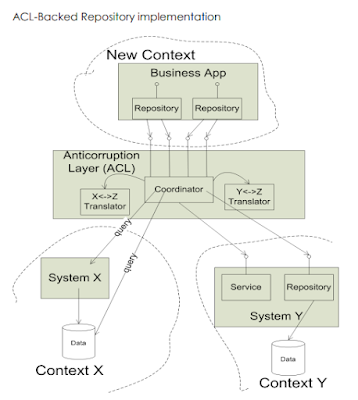
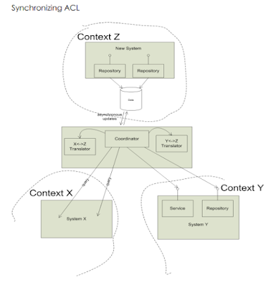
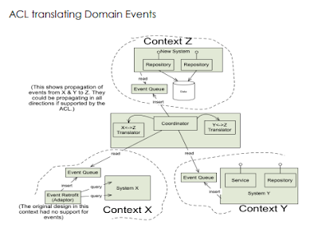

# Getting DDD started with Legacy Systems
- [Getting started with DD when surrounded by legacy systems by Eric Evans](https://www.domainlanguage.com/wp-content/uploads/2016/04/GettingStartedWithDDDWhenSurroundedByLegacySystemsV1.pdf)
## strategy 1: bubble context
- the legacy system already has an established model, albeit implicit, which can seldom be changed with a reasonable effort.
- Simply adding objects that express a distinct model without changing the ones already there will lead to conflicting rules and concepts.
- Introducing a complex new set of development principles and techniques is best done incrementally as in a pilot project, in a way that allows members of the team to gain experience and allows the organization to assess the approach.
- **This pilot project allows a small team to achieve a modest objective involving some complex domain logic and, ideally, one with some strategic value that is difficult to solve in a legacy context. Therefore, it is recommended to cherry-pick a small, self-disciplined team with control over its code to evolve a model that addresses the chosen area, relatively unconstrained by the concepts of the legacy systems.**
- The new functionality does not disappear. It will continue to be maintained as an extension of the legacy systems. The organization now has the experience to undertake more ambitious use of DDD.
- no synchronization risk (uses a legacy database)
- **works when there is a limited range of data needed from legacy**
- **A 'bubble' is a small bounded context established using an Anticorruption Layer (ACL) for the purpose of a particular development effort and not intended necessarily to be expanded or used for a long time.**

- **ACL should be explicitly addressed in budgeting and planning. It should be designed to keep it decoupled from the actual business logic of the new system.**
- A good anti-corruption layer has a clean interface entirely in terms of the downstream model (in our case, the bubble model) that provides access to the information and services of the upstream system.
- **ACL allows development in the downstream context to focus on the business problem and not be distracted or complicated by dealing with the other system's distinct concepts and quirks.**
- **Any new information needed from the legacy context requires incorporating the new data into the bubble model, working out the mapping from the old model, and then the ACL. That's a high price, so we should choose functionality valuable enough to justify it.**
- Development in the bubble could go on for several months or, occasionally, in cases where the interface with other contexts is relatively narrow for a few years. However, it will not last forever.
- The bubble becomes the primary context for more ambitious new development. When this happens, the limitations of the bubble context may be judged unacceptable, and the strategy migrates to the autonomous bubble with synchronizing ACL. Then the bubble transforms into something more long-lasting.

## strategy 2: autonomous bubble
- The autonomous bubble is distinguished by the ability to run its software, for a time, cut off from other systems. Information may start to get stale, requests to external service requests start to queue up unfulfilled, but the internal behaviour of the software continues to work. 
- needs organization committed to significant new development with a unique design approach
- allows new data to be collected and used without involving legacy
- allows decoupled "product" to evolve
- may progress from a bubble context as development is scaled up on a successful pilot project.
- To enable autonomous context having its own data, ACL takes on the responsibility of synchronization between data stores in 2 contexts, which do not depend directly on each other. This ACL activity is asynchronous with any action in either context, with a service level agreement (SLA) regarding the freshness of the translated data.

### the nightly batch script: low-tech synchronizing ACL
- this could involve importing data from a file, kicking off a SQL script, taking data from one table, transforming it, and inserting it into another.
- SLA: open of business, next business day
- unnecessary coupling: synchronizing ACL mixed in with once-per-day business logic
- unnecessary coupling: multiple ACL(s) to various contexts lumped together.
- make sure you isolate the data copying and translation for your particular context into modules (one per context you are drawing on)
### messaging and domain events: a stylish synchronizing ACL
- This approach can support a range of SLA(s) and update a system while it is being used, while - batch scripts typically run while systems are off-line.
- Any information crossing a context boundary must be translated.
- Messages are always expressed in some language based on some system of abstractions (a model), and we should not let them enter a context that uses a different vocabulary and model.

- In the Bubble context, any new information that does not already exist in the legacy system somewhere must be added to the legacy system somewhere, even though it will not be used there! Then it must be mapped into the bubble context, increasing the dependency between the two systems. Clearly, this is not the strategy to introduce crucial new information.
- Development in the autonomous bubble is not so tightly bound to the older contexts. Therefore, the model in this context can be more innovative and trow more freely, and a fresh new product can be created.

## Strategy 3: exposing legacy assets as services
- one of the main challenges of SOA is the lack of attention to bounded contexts.
- Integrating with the legacy system, every new development effort gets dragged back into the old concepts and potentially tangled into the old implementation.
- Legacy assets were developed with a particular feature set in mind and are highly coupled to those features. This makes it hard to access what you want directly without going through layers designed for a very different purpose.
- open host service over anticorruption layer
- Commons Context, the most basic and widely used information, can be interchanged throughout the organization via one standard interchange model, the "Tragedy of the Commons." But, unfortunately, the commons are prone to dumping.
- FIX has a way of describing an enormous range of financial trades and transactions and is used to interchange data between all sorts of organizations. 
- a focused language, crafted for a modest suite of related services, usually gives the most satisfying balance between the fragmentation of the one-off service model and the total unification of the commons and the industry-standard
- we should get over the attitude that the ultimate goal is to eventually replace these older systems. That is a futile treadmill. Creating a bubble can allow you to selectively move responsibilities for the core domain, where you want to innovate, out into a new context.
- Open host services over an ACL can give convenient, decoupled access to functionality and data assets embedded in the older systems. Once the legacy system is stable, not responsible for the core domain, and provides access to assets, why not let it be? You have better things to do right now.

## strategy 4: expanding a bubble
- one challenge that is particularly acute in a bubble is how critical it is to coordinate the incremental development of the new business functionality and the anticorruption layer in parallel. This affects the design and the planning of the sequence in which the features are written.
- design freedom is the point of a bubble, the bubble context with an umbilical ACL gives a little freedom, while the autonomous bubble can give a lot if properly managed.
- things to think about for ACL
  - does the new feature draw on information that is already being brought in by the existing anti-corruption layer
  - will it require new mapping of legacy information? what is the scope of that work?
if multiple features were chosen for the iteration call for new mapping, are they drawing on the same information, or does each call for different information?
  - **to make development manageable, the priority of business features must be balanced with the need to group work on features that use similar legacy data sets, with parallel planning of the necessary enhancements to the anticorruption layer.**
  - if not careful, the bulk of the project's effort will go into implementing a big translator interface, each element of which is only sparsely used. This gives a low ROI for the context boundary, and eventually an unsustainable maintenance burden. Or developers would take shortcuts by making sloppy mappings or simply bypassing the ACL, pull the data they need directly from the legacy system, and the context boundary will erode and collapse.
- the developers working on various features all drawing that same data can collaborate to
  - model the new information by adding concepts to the bubble context
  - extend the ACL to bring in the new information. (This should be an explicit development task, not just part of a 'user story')
- Trying to reuse the fields/data from legacy without a mapping is a mistake. The concept represented by those fields was never mapped to a concept in the downstream context. We have no idea what they mean in the downstream context or how they relate to other concepts in the downstream model. It creates bigger objects with more dependencies and that is poorly defined.
  - when you must make choice, try to make the bubble's model capable of expressing the essential meaning of the new information in terms consistent with the other concepts of that model. It is inadvisable to load objects down with information that does not directly pertain to their jobs, so it is best to do a bit more modelling work to find good homes for the new information.
  - bypass the context altogether, give the client access to the context where the information originated or pass it some other way (particularly when the new data is for display only) Sometimes this is a good time to expose a legacy asset with a service as in Strategy 3.
  - pass the information unchanged through new context. (Not recommended) since you have bored a tunnel through your anticorruption layer and compromised your ability to evolve your new model independently of the legacy system.

- **adding data is a modelling job**
  - It is a way of referring to some aspect of some business situation, and the goal when translating this new element into your bubble context is to enrich the ubiquitous language to be able to express these concerns.
  - explore new scenarios in the DDD modelling whirlpool
  - in order to pull in more data to use in logic or key definitions in your context, you should follow the whirlpool steps
    - hammer out a reference scenario that illustrates why you need a new information
    - brainstorm model changes that incorporate that information organically
    - context boundary leakage gets out of hand quickly and suddenly you may wake up to realize that your new software is conforming to the legacy model and does not give the desired fresh start for the business.

# domain driven design refactoring

## examples from jimmy bogard
https://github.com/jbogard/presentations/tree/master/DomainDrivenRefactoring
https://jimmybogard.com/domain-driven-refactoring-extracting-domain-services/
https://www.youtube.com/watch?v=_dQRAsVhCqA&list=PL41_dKwKrOq_TEVkFLeFChhUhqNDmQXF8&index=3&ab_channel=NDCConferences

# Quotes
"Sub-domain is a problem space concept, Bounded context is a solution space concept."

"As software developers, we fail in two ways: We build the thing wrong, or we build the wrong thing."

"A project faces serious problems when its language is fractured."

"Integration is always expensive, and sometimes the benefit is small."

"Architectures can straitjacket a project with up-front design assumptions and take too much power away from the developers/designers of particular parts of the application. Soon, developers/designers of particular parts of the applications will dumb down the application to fit the structure, or they will subvert it and have no structure at all, bringing back the problems of uncoordinated development.."

"Each time we decide to call upon such a capability for some new purpose, someone has to meticulously sift through it all, finding an odd combination of inputs that will evoke the behaviour or return the information we want without messing anything else up, it takes trial and error and extensive testing, and the result is typically brittle. The developer who made it work walks away exhausted, successful on his terms, leaving the system even more complex than before. Then, the next time a closely related yet not identical need comes along, it starts all over.."

"Common context, the tragedy of commons."

"adding data is a way of referring to a core aspect of some business situation, and enriching ubiquitous language to be able to express these concerns. "

**still under constructions**
**Next Steps:**
[plural sight course - ddd with legacy projects](https://app.pluralsight.com/library/courses/domain-driven-design-legacy-projects/table-of-contents)
review Distilled DDD from vaugh vernon
[domain-driven refactoring](https://jimmybogard.com/tag/domain-driven-design/)

# References
https://www.domainlanguage.com/wp-content/uploads/2016/04/GettingStartedWithDDDWhenSurroundedByLegacySystemsV1.pdf
https://philippe.bourgau.net/categories/#squash-bduf-with-event-storming-series
https://www.amazon.ca/Domain-Driven-Design-Distilled-Vaughn-Vernon-ebook/dp/B01JJSGE5S/ref=tmm_kin_swatch_0?_encoding=UTF8&qid=&sr=
https://matfrs2.github.io/RS2/predavanja/literatura/Avram%20A,%20Marinescu%20F.%20-%20Domain%20Driven%20Design%20Quickly.pdf
https://devpath.pro/methodologies/book-review-domain-driven-design-quickly/
https://medium.com/inato/an-introduction-to-domain-driven-design-386754392465
https://github.com/orgs/ddd-crew/repositories?type=all