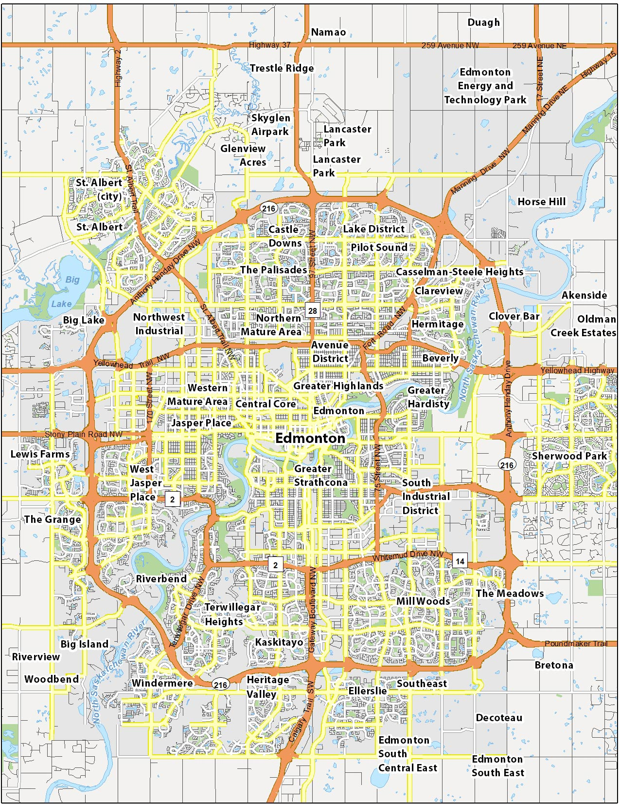

# what are criteria in researching communities

- what are nearby amenities, attractions?
- when was the houses were commonly built?
- what are the common building type?
- what are the zoning regulations? does zoning regulations allows more units per lot?
- what is the population? what is the population growth?
- what is the average income in the area?
- what is the crime rate?
- what are the rentals supply/demand in the communities?
- what are the average rents?
- is it A, B, C, D neighborhood?
- what are the long-term potential appreciation compared to current returns and cashflow?
- what is average house prices?
- what real estate investment strategies could work for this neighborhood?
- 

- what's the prompt for AI to get more information on the communities?
>  - you're an expert in realestate investing, give me detailed outline on the Britannia neighborhood in Edmonton with the following questions:
>    - what are nearby amenities, attractions?
>    - when was the houses were commonly built?
>    - what are the common building type?
>    - what are the zoning regulations? does zoning regulations allows more units per lot?
>    - what is the population? what is the population growth?
>    - what is the average income in the area?
>    - what is the crime rate?
>    - what are the rentals supply/demand in the communities?
>    - what are the average rents?
>    - is it A, B, C, D neighborhood?
>    - what are the long-term potential appreciation compared to current returns and cashflow?
>    - what is average house prices?
>    - what real estate investment strategies could work for this neighborhood?

- stay away from 5 blocks of 132 Ave (stay away from the train tracks)

# Oliver

- https://www.edmonton.ca/public-files/assets/document?path=Neighbourhoods/OliverDemographicProfile.pdf

Below is a **real-estate investor–focused** outline for **Oliver (Edmonton)** — now commonly branded as **Wîhkwêntôwin (formerly “Oliver”)** in many city planning contexts.

---

## 1) Nearby amenities & attractions (why tenants like it)

**Core “rentability” driver:** *Downtown-adjacent, walkable, transit-rich.*

* **Jasper Avenue corridor (109 St → 124 St)**: Edmonton’s main street feel, restaurants, retail, services; ongoing streetscape work (“Imagine Jasper Avenue”) improves walkability/streetscape over time.
* **124 Street / Brewery District**: shops, groceries, cafes, plus infill/mid-rise energy (strong for young professionals).
* **River Valley access** (nearby): quick access to trails/parks (a premium for downtown renters).
* **Downtown employment + post-secondary proximity**: ideal for renters who want short commutes.
* **LRT / major transit**: high share of transit and walk commuters shows the area’s mobility advantage (important for reducing tenant car-dependency). ([City of Edmonton][1])

**Investor takeaway:** Oliver behaves like a *“lifestyle rental node”* — demand tends to be resilient even when the city adds supply.

---

## 2) When homes were commonly built (stock age & renovation risk)

Oliver is *not* a single-era subdivision; it’s a long-evolving inner-city neighbourhood.

* Expect a large share of **older concrete high-rises + 1960s–1980s apartment stock**, plus **newer infill and newer luxury rentals/condos** scattered around Jasper Ave / key corridors.
* Practical implication: **big variance in condo fees, building envelope quality, special assessment risk** (due diligence is everything in this neighbourhood type).

*(No single “built year” dominates like a suburban community — the asset-quality dispersion is the story.)*

---

## 3) Common building types (what you’ll actually buy)

2014 municipal census (still directionally useful for housing form mix) shows Oliver is overwhelmingly apartment-based:

* **Apartment (5+ stories): ~66%**
* **Apartment (1–4 stories): ~30%**
* **Single detached / row / duplex/fourplex: tiny shares** ([City of Edmonton][1])

**Investor takeaway:** Oliver is primarily a **condo + purpose-built rental** market, not a “buy a house and suite it” market (unless you’re very targeted on a few pockets).

---

## 4) Zoning & whether it allows more units per lot

Because Oliver is inner-city, zoning is typically more permissive than suburban areas, and the neighbourhood has historically been planned for **medium/high density** along key corridors.

What this usually means in practice:

* **Corridor + node sites (esp. Jasper Ave / major streets)**: often allow **mid-rise / high-rise / mixed-use** redevelopment.
* **Interior pockets**: may still have smaller-scale residential zones, but even then, inner-city rules tend to allow **more infill forms** than many suburbs (subject to setbacks, height, FAR, parking rules, etc.).

**Action step (how investors verify quickly):**

* Use the City’s zoning map → confirm the **exact parcel zoning** and check allowable uses (multi-unit, mixed-use, etc.).
* If you’re pursuing “more units per lot,” target parcels already designated for **medium/high-density or mixed-use** rather than trying to rezone a low-scale interior lot.

*(I didn’t pull a parcel-by-parcel zoning breakdown in this pass; if you tell me a cross-street or a listing link, I can translate the exact zone into what you can build.)*

---

## 5) Population & population growth (demand base)

* **2019 Municipal Census population: 18,180** ([City of Edmonton][2])
* **2014 Municipal Census population: 19,135** ([City of Edmonton][1])

**Interpretation:** Over that window, Oliver looks **roughly flat to slightly down** (not explosive growth). In inner-city areas, population can be sensitive to:

* demolition/redevelopment timing,
* temporary vacancy during major projects,
* shifts between condo-ownership vs rental occupancy.

---

## 6) Average income in the area (tenant quality signal)

I wasn’t able to reliably extract a **neighbourhood-specific “average income” figure** from a primary City/StatsCan table within the tool limits in this run, so I’m not going to guess.

What I *can* say confidently based on the housing mix:

* With **very high renter share** and **high apartment concentration** ([City of Edmonton][1]), Oliver’s income profile is typically **mixed** (students/early-career renters + established professionals in higher-end towers).

If you want, I can produce an **income estimate with citations** by pulling the specific **federal census neighbourhood table** for Wîhkwêntôwin/Oliver in a follow-up.

---

## 7) Crime rate (risk, vacancy, and tenant-management reality)

You should assume Oliver has **higher downtown-style incident levels** than most suburban neighbourhoods.

Best source to quantify (by incident type and time window):

* **Edmonton Police Service Community Safety Data Portal / Neighbourhood Crime Mapping** ([Edmonton Police Service][3])
* City safety dashboards exist as well (good for trends). ([gis.edmonton.ca][4])

**Investor takeaway:** In Oliver, your edge comes from:

* building/tenant screening systems,
* solid property management,
* choosing blocks/buildings with better micro-location.

---

## 8) Rental supply/demand dynamics (what drives cashflow)

Oliver is *structurally renter-heavy*:

* **Rented units ~62.6%** (2014 municipal census) ([City of Edmonton][1])

So demand is **deep**, but supply is also **active** (lots of competing buildings).

**What this means for you:**

* Compete on **unit quality, in-suite laundry, parking, pet policy, and building amenities**.
* Expect tenants to “shop” hard: price sensitivity + lots of alternatives.

---

## 9) Average rents (neighbourhood + city context)

**Neighbourhood snapshot (listings-based):**

* RentFaster Oliver *1-bedroom* page shows many asking rents **around the mid-$1,400s+ range** (varies heavily by building age/amenities). ([RentFaster.ca][5])

**City benchmark (CMHC survey snapshot in a municipal highlights doc):**

* Edmonton City average rents (2024 survey snapshot): **Bachelor ~$1,051; 1-bed ~$1,218; 2-bed ~$1,513; 3+ ~$1,695**. ([City of St. Albert][6])

**Investor takeaway:** Oliver often rents **at/above city average** for comparable bedroom counts, but competition is intense — you win on “total package,” not just price.

---

## 10) Neighbourhood grade (A / B / C / D)

**My investor-grade for Oliver/Wîhkwêntôwin: *B- / C+*** (depends heavily on micro-block + building).

**Why not A:**

* Crime/incident risk higher than suburban family areas (management intensity). ([communitysafetydataportal.edmontonpolice.ca][7])
* Condo fee / special assessment risk can be meaningful in older towers.

**Why not D:**

* Strong amenities, walkability, employment adjacency, and persistent renter demand.

---

## 11) Long-term appreciation potential vs current returns/cashflow

**Typical pattern in dense inner-city condo-heavy areas:**

* **Cashflow can work** if you buy right (smaller units, good building, realistic fees, strong tenant profile).
* **Appreciation can lag** single-family land-constrained neighbourhoods *unless* you’re positioned in a building/micro-location that benefits from corridor upgrades and reinvestment.

A real bullish driver to watch:

* **Public realm investment on Jasper Ave** (streetscape, pedestrian upgrades) tends to support desirability over time.

**Practical expectation:** Oliver is often more of a **yield + stability play** than a “home-run appreciation” play (unless you’re doing redevelopment/infill where zoning supports it).

---

## 12) Average house prices (what you’ll pay)

Because Oliver is mostly apartments/condos, “average house price” can be misleading.

One neighbourhood market reference:

* HonestDoor shows an **Average “HonestDoor Price” for Oliver (Edmonton) ~ $758,794** (their blended stat across home types). ([HonestDoor][8])

**How investors should translate this:**

* Break your comps into **(1) condos**, **(2) purpose-built rental opportunities**, **(3) rare small multifamily / land assemblies** — don’t use one blended “average” to underwrite.

---

## 13) Strategies that can work well in Oliver (investor playbook)

### A) “High-occupancy, low-drama” condo rentals (best for limited time)

* Target **concrete buildings** with:

  * healthy reserve fund history,
  * stable condo fees (not artificially low),
  * no major known envelope/parking membrane issues,
  * strong rental demand features (laundry, parking, pet friendliness).
* Underwrite with **stress tests**: condo fee increases + special assessment reserve.

### B) “Furnished mid-term rental” (travel nurses / corporate / relocation)

* Works best near:

  * hospitals, downtown offices, transit.
* You’ll need tighter operations (turnovers, furnishing, insurance, bylaws/condo rules).

### C) Value-add on older units (cosmetic + layout)

* Because there’s a lot of older stock, a clean renovation can beat competing listings.
* Focus upgrades that actually move rent: flooring, lighting, kitchen refresh, in-suite laundry (if feasible), sound/privacy improvements.

### D) Infill / redevelopment (only on the right parcels)

* If you want “more units per lot,” your edge is:

  * buying sites already aligned with **medium/high density or mixed-use intent**,
  * assembling small lots,
  * riding corridor revitalization (Jasper Ave, etc.).

### E) Portfolio role (how Oliver fits a bigger plan)

* Oliver can be a **“cashflow anchor / renter-demand anchor”** while you pursue appreciation-heavy plays elsewhere (single-family land value, suite strategies, etc.).

---

[1]: https://www.edmonton.ca/sites/default/files/public-files/assets/Summary%20Report%20of%20All%20Questions_OLIVER_2014.pdf?cb=1624651090 "Summary Report of All Questions - OLIVER 2014"
[2]: https://www.edmonton.ca/sites/default/files/public-files/assets/census/2019_Census_Summary-Report_OLIVER.pdf?cb=1624668516 "Census 2019 Data - OLIVER"
[3]: https://www.edmontonpolice.ca/CrimeFiles/NeighbourhoodCrimeMapping?utm_source=chatgpt.com "Neighbourhood Crime Mapping"
[4]: https://gis.edmonton.ca/cswb?utm_source=chatgpt.com "Community Safety and Well-Being"
[5]: https://www.rentfaster.ca/ab/edmonton/rentals/apartment/1-bedroom/oliver/?utm_source=chatgpt.com "Oliver 1 Bedroom Apartments for Rent in Edmonton, AB"
[6]: https://stalbert.ca/site/assets/files/2481/october_2024_cmhc_rental_market_survey_-_st__albert.pdf?utm_source=chatgpt.com "[PDF] 2024 CMHC Rental Market Survey Highlights – St. Albert"
[7]: https://communitysafetydataportal.edmontonpolice.ca/?utm_source=chatgpt.com "Community Safety Data Portal - Edmonton Police Service"
[8]: https://www.honestdoor.com/cities/ab/edmonton/oliver?utm_source=chatgpt.com "Oliver, Edmonton, AB Real Estate"

# Garneau

- https://www.edmonton.ca/public-files/assets/document?path=Neighbourhoods/GarneauDemographicProfile.pdf

Below is a **real-estate investor–focused** outline for **Garneau (Edmonton)** (just south of the river, **next to the University of Alberta** and **Old Strathcona/Whyte Ave**).

---

## 1) Nearby amenities & attractions (the “why tenants pay” factor)

**Garneau’s core advantage:** *University adjacency + Whyte Ave lifestyle + transit/walkability.*

* **University of Alberta campus + student/medical ecosystem**

  * High and consistent renter demand because you’re adjacent to a major university and the “institutional employment hub” that comes with it.
* **Whyte Avenue / Old Strathcona (82 Ave)**

  * One of Edmonton’s strongest entertainment/retail corridors (restaurants, bars, cafes, festivals, boutique retail). (Whyte Ave context)
* **109 Street + 112 Street commercial strips**

  * The City profile explicitly notes significant commercial businesses along **109 St, Whyte Ave, and 112 St**. ([City of Edmonton][1])
* **Garneau Theatre + local cultural nodes**

  * Neighbourhood has recognizable cultural anchors and student-oriented amenities (theatre, cafes, etc.). ([Wikipedia][2])
* **Transit & car-light living**

  * Garneau has high shares of walking/transit/bike commuting in the City profile (useful for tenant appeal and parking premiums). ([City of Edmonton][1])

**Investor takeaway:** Garneau is a **“location moat” neighbourhood**: proximity-to-UofA + Whyte is hard to replicate.

---

## 2) When houses were commonly built (construction-era concentration)

Garneau’s stock is heavily mid-century to late 20th century, with meaningful older inventory.

From the City of Edmonton Garneau Neighbourhood Profile (2011 census-based):

* **1961–1980: ~42% of units**
* **1960 or before: ~19%**
* **1981–1990: ~16%**
* **1991–2000: ~14%** ([City of Edmonton][1])

**Investor implication:**

* Lots of **older condo towers + walk-up apartments** ⇒ watch for **envelope, windows, balconies, elevator, parkade membrane** risks and special assessments.
* Older houses that remain can be **character homes** (and may be inside “special character” policy/zones).

---

## 3) Common building types (what you’ll actually buy)

Garneau is **apartment-dominant**.

Residential units by structure type (City profile):

* **Apartment (5+ stories): 62%**
* **Apartment (<5 stories): 24%**
* **Single detached: 8%**
* **Semi-detached/duplex: 6%**
* Row housing is negligible in count. ([City of Edmonton][1])

**Investor takeaway:** Garneau is primarily a **condo / apartment** market with some **rare detached/duplex pockets** (often expensive due to land value + location).

---

## 4) Zoning regulations & “more units per lot” potential

Garneau is one of those inner-city neighbourhoods where **zoning varies block-by-block**, but two pieces matter a lot for investors:

### A) **DC1 – “Garneau Special Character Residential Area”**

The City’s DC1 description explicitly says this district is intended to:

* **encourage retention/rehabilitation** of older detached character housing **while allowing infill redevelopment**. ([Webdocs Edmonton][3])

It also lists permitted/considered uses including (high-level):

* Single detached, semi-detached
* Duplex (including discretionary cases)
* Row housing (up to 4 dwellings in certain forms)
* **Apartment housing containing not more than 4 dwellings**
* Boarding/lodging houses, etc. ([Webdocs Edmonton][3])

**What that means:** In some “special character” pockets, you can add density, but it’s typically **small-scale / form-sensitive**.

### B) **RA7 – Low Rise Apartment Zone (common near core areas)**

RA7’s general purpose is to provide a zone for **low-rise multi-unit housing**. ([Webdocs Edmonton][4])
The City’s “Summary of Land Use Zones” describes RA7 as allowing **low-rise apartments up to four storeys**. ([City of Edmonton][5])

**Does zoning allow more units per lot?**

* **Yes—on the right parcels.** If your site is RA7 (or similar multi-unit zones), “more units” is the point.
* In DC1 special character areas, you may be capped to **low-unit-count forms** (often max 4 dwellings in the DC1 language shown) and must match character/streetscape criteria. ([Webdocs Edmonton][3])

**Investor move:** If “more units per lot” is your strategy, prioritize **RA7/RA8/RA9/mixed-use edges** (where the zoning intends density), and treat DC1 character pockets as **higher-friction, design-constrained** infill.

---

## 5) Population & population growth

Two official snapshots show Garneau is **stable** (not exploding like new suburbs):

* **2011 census-based profile population: 7,055** ([City of Edmonton][1])
* **2019 municipal census population: 7,108** ([City of Edmonton][6])

**Growth (2011 → 2019):** basically **flat to slightly up**.

**Interpretation:** Demand strength here is less about population growth and more about:

* UofA-driven renter churn,
* lifestyle desirability,
* limited ability to add “cheap land” supply.

---

## 6) Average income in the area (tenant quality + rent ceiling)

From the City’s Garneau profile (2010 household income):

* **Median household income: $42,492**
* **Average household income: $62,197** ([City of Edmonton][1])

**Investor interpretation (important nuance):**

* Garneau is **student-heavy**, and the profile also shows **very high renter share** (next section). Student-heavy areas often show lower median household income even when rents are strong, because many renters have **support from family/loans** or are **temporary residents**.

---

## 7) Crime rate (what you must underwrite)

I’m not going to invent a “crime rate number” without pulling an exact period/category table.

What you should use:

* **Edmonton Police Service Neighbourhood Crime Mapping / Community Safety Data Portal** (lets you filter to Garneau and by offence type/time window). ([Edmonton Police Service][7])

**Investor reality check:**

* Garneau/Whyte/UofA-adjacent areas can have more **property crime/nuisance incidents** than suburban family neighbourhoods (bike theft, break-ins, disorder calls).
* Your mitigation tools: **secure entry, cameras, lighting, bike storage, tenant screening, pro management**.

---

## 8) Rental supply/demand (who rents here and why)

Garneau is **deeply renter-oriented**:

Occupied private dwellings by tenure:

* **Renter occupied: 75%**
* **Owner occupied: 25%** ([City of Edmonton][1])

**Demand drivers**

* Students, grad students, young professionals, hospital/university staff
* “I want to walk/transit” renters (33% walked; 18% transit in the commuting split) ([City of Edmonton][1])

**Supply reality**

* Because it’s apartment-heavy, you face **competition** from many similar units.
* However, “good units in good buildings” lease quickly, especially near semester cycles.

---

## 9) Average rents (city benchmark + Garneau reality)

### City-wide benchmark (Edmonton CMA, CMHC – October surveys)

CMHC historical average rents (purpose-built rental market) show:

* **Oct 2024:** Studio ~$1,050; 1BR ~$1,237; 2BR ~$1,529; 3BR+ ~$1,701
* **Oct 2025:** Studio ~$1,108; 1BR ~$1,301; 2BR ~$1,598; 3BR+ ~$1,802 ([CMHC][8])

### Garneau listings reality (market asking rents)

RentFaster’s Garneau area page shows current listings (examples vary widely by building/finish), including new-build multi-unit offerings in the neighbourhood. ([RentFaster.ca][9])

**Investor takeaway:** Garneau often rents **at/above city averages** for comparable units, but the spread is huge:

* Older walk-ups = lower rent ceiling but can cashflow better if bought right.
* Newer concrete/amenity buildings = higher rents but often tighter cashflow vs price/fees.

---

## 10) Neighbourhood grade (A / B / C / D)

**Garneau grade: A- (rental demand) / B+ (overall investor grade)**

**Why it’s strong (A-ish):**

* Major university adjacency + Whyte Ave + walkability = persistent renter demand.
* Location moat.

**Why it’s not pure A across the board:**

* Some buildings/blocks carry higher nuisance/property-crime management load (verify via EPS portal). ([communitysafetydataportal.edmontonpolice.ca][10])
* Condo towers can hide **fee/special assessment** landmines.

---

## 11) Long-term appreciation vs current returns/cashflow

**Typical pattern in Garneau:**

* **Appreciation prospects (good):** inner-city land value + irreplaceable location near UofA/Whyte tends to support long-run desirability.
* **Cashflow (mixed to challenging):** prime locations usually mean **higher purchase prices** and (for condos) **higher fees**, compressing cap rates.

**Where returns come from in Garneau**

* Not just “market rent”: it’s usually a combo of:

  * buying the *right building* (fees/reserve fund discipline),
  * renovation value-add,
  * furnished/mid-term niche,
  * small multifamily/infill where zoning supports it.

---

## 12) Average house prices (what you’ll pay)

Because Garneau is apartment-heavy, a single “average” can be misleading—still, here’s a useful reference point:

* **Average HonestDoor Price (Garneau): ~ $688k** (blended across housing types) ([HonestDoor][11])

**How to underwrite smarter:**

* Split comps into:

  1. **Condos (1BR/2BR)**
  2. **Low-rise rental buildings / small multifamily**
  3. **Detached/duplex (rare, land-value driven)**
* Don’t let a blended “average” anchor your valuation.

---

## 13) Strategies that work in Garneau (practical investor playbook)

### A) **Student + university workforce rentals (bread-and-butter)**

Best for:

* 1BR/2BR condos or walk-ups near UofA/Whyte
  Keys:
* Time leasing around academic cycles
* Offer **fast internet, secure bike storage, in-suite laundry** if possible

### B) **Furnished mid-term rentals (30–180 days)**

Tenant pools:

* visiting faculty, medical rotations, relocations
  Works because:
* Garneau is a “walkable lifestyle” node
  Risk:
* higher ops complexity + furnishing costs

### C) **Value-add condo: cosmetic renovation + tenant profile upgrade**

Works best when you:

* buy older units in buildings with healthy reserves,
* renovate kitchens/baths/lighting/flooring to compete vs new supply
  Major risk:
* special assessments / fee inflation (this is where investors get burned)

### D) **Small-scale infill in “special character” pockets (DC1)**

The DC1 intent is **character-sensitive infill**; you can do it, but expect:

* design constraints,
* max-dwelling limits in certain DC1 language (e.g., “apartment housing… not more than 4 dwellings” in that DC1 description). ([Webdocs Edmonton][3])

### E) **Higher-density plays on multi-unit zoning parcels (RA7 etc.)**

If you can secure a parcel already aligned with multi-unit zoning:

* **low-rise multi-unit** is the intent of RA7, and can be up to **4 storeys** per the City zone summary. ([Webdocs Edmonton][4])
  This is the cleaner “more units per lot” path than trying to force it on constrained interior lots.

### F) **House-hack (rare, but powerful if you find it)**

If you can buy a duplex/older detached with legal suite potential (on the right parcel):

* live in one unit, rent the other(s)
  But: inventory is limited, and regulations depend on the exact zoning/overlay of that specific site.

---

[1]: https://www.edmonton.ca/public-files/assets/document?path=Neighbourhoods%2FGarneauDemographicProfile.pdf "Garneau Neighbourhood Profile"
[2]: https://en.wikipedia.org/wiki/Garneau%2C_Edmonton?utm_source=chatgpt.com "Garneau, Edmonton"
[3]: https://webdocs.edmonton.ca/zoningbylaw/dc1/Garneau/Garneau_ARP.htm "Special Character Residential Area"
[4]: https://webdocs.edmonton.ca/zoningbylaw/ZoningBylaw/Part2/Residential/210_%28RA7%29_Low_Rise_Apartment_Zone.htm?utm_source=chatgpt.com "210 (RA7) Low Rise Apartment Zone"
[5]: https://www.edmonton.ca/residential_neighbourhoods/documents/PDF/CoE_SummaryofLandUseZones_WEB.pdf?utm_source=chatgpt.com "A General Summary of Land Use Zones"
[6]: https://www.edmonton.ca/sites/default/files/public-files/assets/census/2019_Census_Summary-Report_GARNEAU.pdf?cb=1661245022 "Census 2019 Data - GARNEAU"
[7]: https://www.edmontonpolice.ca/CrimeFiles/NeighbourhoodCrimeMapping?utm_source=chatgpt.com "Neighbourhood Crime Mapping"
[8]: https://www03.cmhc-schl.gc.ca/hmip-pimh/en/TableMapChart/TableMatchingCriteria?CategoryLevel1=Primary+Rental+Market&CategoryLevel2=Average+Rent+%28%24%29&ColumnField=2&GeographyId=0340&GeographyType=MetropolitanMajorArea&RowField=TIMESERIES&utm_source=chatgpt.com "Edmonton — Historical Average Rents by Bedroom Type - CMHC"
[9]: https://www.rentfaster.ca/ab/edmonton/rentals/garneau/?utm_source=chatgpt.com "Garneau Apartments & Houses for Rent in Edmonton, AB"
[10]: https://communitysafetydataportal.edmontonpolice.ca/?utm_source=chatgpt.com "Community Safety Data Portal - Edmonton Police Service"
[11]: https://www.honestdoor.com/cities/ab/edmonton/garneau?utm_source=chatgpt.com "Garneau, Edmonton Real Estate"

# Westmount

- https://www.edmonton.ca/public-files/assets/document?path=Neighbourhoods/WestmountDemographicProfile.pdf

Below is a **real-estate investor–style deep outline** for **Westmount (Edmonton)** (central-west, just NW of Downtown). I’m optimizing this for *buy box decisions*: tenant demand, zoning upside, and what strategies realistically pencil.

---

## 1) Nearby amenities & attractions (what drives demand)

**Lifestyle + transitability is the core demand driver here.**

* **124 Street / 124th Street BRZ spine** (cafes, boutiques, services) runs through the neighbourhood and is a big “walkable premium” factor. ([City of Edmonton][1])
* **River Valley / Groat Ravine adjacency**: quick access to trails and green space; strong quality-of-life pull for professionals. ([Wikipedia][2])
* **Brewery District (nearby)**: retail, services, and employment nodes nearby (spillover rental demand).
* **Parks & community amenities**: Westmount Park + community league programming adds “family + community” stability. ([Westmount CL][3])
* **Downtown proximity**: short commute and transit options; this materially supports **rental liquidity** (easier to tenant). ([City of Edmonton][1])

**Investor takeaway:** Westmount demand is driven by **(1) downtown adjacency + (2) 124 Street amenities + (3) mature neighbourhood character**.

---

## 2) When homes were commonly built (age = capex reality)

From the City of Edmonton neighbourhood profile (2011 Census-era data):

* **1960 or earlier: ~43%** of units
* **1961–1980: ~23%**
* **1981–1990: ~14%**
* **2001–2005: ~13%**
* **2006–2011: ~2%** ([City of Edmonton][1])

Also: Westmount’s low-density housing stock was largely built **pre-1950**, while apartment development is more recent and now a large share of dwellings. ([City of Edmonton][1])

**Investor takeaway:** expect **older mechanicals** (sewers, electrical, envelopes) on detached/duplex stock; underwrite **higher repair reserves** and plan for **value-add renos**.

---

## 3) Common building types (what you’ll actually buy)

Residential units by structure type (2011 Census-era):

* **Apartments (<5 storeys): ~52%**
* **Single-detached: ~38%**
* **Semi-detached/duplex: ~6%**
* **Apartments (5+ storeys): ~3%**
* **Rowhouse: ~1%** ([City of Edmonton][1])

Tenure split:

* **Owner occupied: ~57%**
* **Renter occupied: ~43%** ([City of Edmonton][1])

**Investor takeaway:** This is a **renter-active** area with **lots of low-rise apartments** (great for condo rentals / small multi), plus a meaningful pool of character single-family properties.

---

## 4) Zoning & “does it allow more units per lot?”

### Big update: Edmonton’s **new zoning bylaw took effect Jan 2024**

The City’s Zoning Bylaw Renewal indicates the **new bylaw came into effect in January 2024**. ([City of Edmonton][4])

### What this means in practice (high-level)

* **RS (Small Scale Residential Zone)** purpose explicitly includes **“detached, attached, and multi-unit Residential housing”** up to **3 storeys**. ([zoningbylaw.edmonton.ca][5])
* Westmount also has corridors/edges where mid-rise forms are typical (historically apartments cluster near **124 Street/major routes**). ([City of Edmonton][1])
* **RM (Medium Scale Residential Zone)** purpose supports **multi-unit** forms typically **~4–8 storeys** (generally more “corridor/node” oriented). ([zoningbylaw.edmonton.ca][6])

**Does zoning allow more units per lot?**

* In many Edmonton mature areas, **yes—more flexibility** exists than “pure single detached only,” especially under the post-2024 framework (RS intent includes multi-unit housing). ([zoningbylaw.edmonton.ca][5])
* **But** what you can build depends on the exact parcel’s zone + overlays + site conditions. (In Westmount, you’ll see a mix: interior blocks vs 124 Street corridor behave very differently.)

**Investor takeaway (actionable):**

* For any target property, do a quick zoning check on the City map and confirm: **zone, max height, site coverage/FAR rules, parking rules, and whether “multi-unit/backyard housing/secondary suite” is permitted** under that exact zone.

---

## 5) Population & growth (demand stability)

* **2011 (Census-era profile): 5,925** people ([City of Edmonton][1])
* **2019 municipal census: 5,949** people ([City of Edmonton][7])

**Growth read:** basically **flat to slightly up** from 2011 → 2019 (+24 people, ~+0.4%).
**Investor takeaway:** demand is less about population growth and more about **location-driven churn** (professionals, renters, downsizers).

---

## 6) Average income (rent ceiling + tenant quality proxy)

2010 household income (2011 Census-era profile):

* **Median household income: $62,150 – $72,248**
* **Average household income: $85,599 – $90,340** ([City of Edmonton][1])

**Investor takeaway:** incomes are solid enough for **mid-market rents**, but Westmount is not “ultra high-income only.” Think: professionals, students/young adults, downsizers, service workers—wide tenant spectrum.

---

## 7) Crime rate (how to underwrite it correctly)

Edmonton Police Service provides a **Community Safety Data Portal / Neighbourhood Crime Mapping** tool for neighbourhood-level stats and trends. ([Edmonton Police Service][8])

**Investor underwriting approach (practical):**

* Pull Westmount’s incidents for the last **12–24 months** and compare to adjacent neighbourhoods (Glenora, Oliver, etc.).
* Focus on **property crime vs violent crime** and whether incidents cluster on **arterials/commercial corridors** (often they do).

---

## 8) Rental supply & demand (what you’re competing with)

Supply signals:

* Westmount is **apartment-heavy** (about **55% apartments** when combining <5 and 5+ storeys). ([City of Edmonton][1])
* **Renter occupied: ~43%**—this is a real rental neighbourhood, not a “mostly owners” suburb. ([City of Edmonton][1])

City-wide demand context (useful for vacancy/market tightness):

* CMHC’s 2025 rental market report shows **Edmonton purpose-built vacancy ~3.8%** and **average 2-bedroom rent ~$1,603** (purpose-built). ([Canada Mortgage and Housing Corporation][9])

**Investor takeaway:**

* Expect **consistent tenant demand** due to location.
* Expect **competition** (lots of units), so winning is about **renovation quality + unit layout + parking/laundry + professional management**.

---

## 9) Average rents (what to underwrite)

**Neighbourhood-specific “average rent” is hard without a paid dataset**, but you can anchor to credible city-wide sources + adjust for Westmount’s location.

* CMHC (Edmonton, purpose-built): **Avg 2-bed ~$1,603** (2025). ([Canada Mortgage and Housing Corporation][9])
* For “asking rents,” private platforms vary widely based on condition and whether it’s condo vs purpose-built vs basement suite. (Treat these as **market checks**, not gospel.)

**Practical underwriting range for Westmount (rule-of-thumb):**

* **Older walk-up apartments:** lower end unless renovated
* **Renovated units / condos / parking included:** mid-to-upper end
* **Single family / duplex:** often rents better per unit, but cashflow depends heavily on purchase price + capex

---

## 10) Neighbourhood grade (A, B, C, D)

**Westmount: B / B+ (investor grade)**

Why not A:

* Higher rental competition + some corridor-driven issues (noise/traffic, some crime exposure near arterials).
  Why not C:
* Location + amenities + long-term land value are strong; rental liquidity is typically good.

---

## 11) Long-term appreciation vs current cashflow (the real tradeoff here)

**Westmount is usually a “land value + location” play more than a “high cap-rate” play.**

* **Appreciation drivers:** central location, mature neighbourhood desirability, corridor redevelopment, zoning flexibility, and scarcity of walkable mature areas.
* **Cashflow headwinds:** higher entry prices for character homes + capex on older stock + rental competition from apartments.

**Investor takeaway:** If you need strong cashflow *today*, you must either:

* buy “ugly” (renovation discount), or
* buy a configuration that **adds units** (suite/infill), or
* target **smaller multifamily**/condos with realistic HOA math.

---

## 12) Average house prices (use as directional, not absolute)

One public snapshot (HonestDoor) shows:

* **Average “HonestDoor price” in Westmount ~ $657,382 (current month)** ([HonestDoor][10])

Important caveat: this is an aggregated estimate across property types and models—use it as a **temperature check**, then validate with:

* sold comps by property type (detached vs condo vs duplex),
* micro-location (near 124 St vs interior),
* condition/lot size.

---

## 13) Strategies that can work in Westmount (ranked by “fit”)

### A) **Value-add renovation (classic “mature neighbourhood” play)**

Best for: older detached/duplex stock

* Renovate kitchens/baths, improve layouts, add in-suite laundry, modernize mechanicals.
* Works because Westmount tenants value **location + quality**.

### B) **Secondary suite / legal suite / multi-unit conversion**

Best for: properties where zoning + layout support it

* Converts an appreciation-focused asset into something that **cashflows**.
* Underwrite **permitting + fire separation + parking** carefully.

### C) **Infill / small-scale redevelopment (zoning optionality)**

Best for: good lots, corner lots, or sites near corridors

* The post-2024 zoning intent (RS includes multi-unit housing) increases “option value.” ([zoningbylaw.edmonton.ca][5])
* This is where Westmount can become a “developer-lite” neighbourhood if you know what you’re doing.

### D) **Condo/low-rise apartment rental (buy right, manage well)**

Best for: steady demand, lower maintenance surprises (but HOA risk)

* Works if the building is well-managed and fees don’t destroy returns.
* Your edge is **tenant placement + unit upgrades + longer holds**.

### E) **Mid-term rentals (travel nurses, relocations, insurance stays)**

Best for: renovated, furnished units with parking and good access

* Location helps, but you must be disciplined about furnishing cost + vacancy.

---

# Quick “buy box” checklist for Westmount

* **Property type:** renovated walk-up/condo vs character detached vs duplex/infill lot
* **Capex reality:** pre-1960 stock needs serious inspection allowances ([City of Edmonton][1])
* **Zoning upside:** confirm exact zone under Bylaw 20001 (RS/RM/etc.) ([zoningbylaw.edmonton.ca][11])
* **Tenant draw:** walkability to 124 St + downtown proximity ([City of Edmonton][1])
* **Crime mapping:** check EPS portal for hot spots ([Community Safety Data Portal][12])

---

[1]: https://www.edmonton.ca/public-files/assets/document?path=Neighbourhoods%2FWestmountDemographicProfile.pdf "Westmount Neighbourhood Profile"
[2]: https://en.wikipedia.org/wiki/Westmount%2C_Edmonton?utm_source=chatgpt.com "Westmount, Edmonton"
[3]: https://www.westmountcommunityleague.com/parks-playgrounds?utm_source=chatgpt.com "Parks & Playgrounds - Edmonton"
[4]: https://www.edmonton.ca/city_government/urban_planning_and_design/zoning-bylaw-renewal?utm_source=chatgpt.com "Zoning Bylaw Renewal"
[5]: https://zoningbylaw.edmonton.ca/part-2-standard-zones-and-overlays/residential-zones/210-rs-small-scale-residential-zone?utm_source=chatgpt.com "2.10 RS - Small Scale Residential Zone - Zoning Bylaw 20001"
[6]: https://zoningbylaw.edmonton.ca/part-2-standard-zones-and-overlays/residential-zones/240-rm-medium-scale-residential-zone?utm_source=chatgpt.com "2.40 RM - Medium Scale Residential Zone | City of Edmonton ..."
[7]: https://www.edmonton.ca/sites/default/files/public-files/assets/census/2019_Census_Summary-Report_WESTMOUNT.pdf?cb=1624584517 "Census 2019 Data - WESTMOUNT"
[8]: https://www.edmontonpolice.ca/CrimeFiles/NeighbourhoodCrimeMapping?utm_source=chatgpt.com "Neighbourhood Crime Mapping"
[9]: https://www.cmhc-schl.gc.ca/professionals/housing-markets-data-and-research/market-reports/rental-market-reports-major-centres?utm_source=chatgpt.com "2025 Rental Market Report"
[10]: https://www.honestdoor.com/cities/ab/edmonton/westmount?utm_source=chatgpt.com "Westmount, Edmonton Real Estate: Housing Market ..."
[11]: https://zoningbylaw.edmonton.ca/home?utm_source=chatgpt.com "Zoning Bylaw 20001 - City of Edmonton"
[12]: https://communitysafetydataportal.edmontonpolice.ca/?utm_source=chatgpt.com "Community Safety Data Portal - Edmonton Police Service"

# Jasper place
- https://en.wikipedia.org/wiki/Jasper_Place

Before we dive in: **“Jasper Place” is usually used as a *west-Edmonton district/area*** (made up of multiple neighbourhoods). There *is* an official neighbourhood called **West Jasper Place**, and most people who say “Jasper Place neighbourhood” mean **West Jasper Place + the Stony Plain Road corridor around 149 St**.
So below I’m outlining **West Jasper Place (Jasper Place area)**, and I’ll call out where things are “corridor vs interior.”

---

## 1) Nearby amenities & attractions

**What makes Jasper Place investable is “location + west-end connectivity” more than prestige.**

* **Stony Plain Road commercial corridor**

  * Everyday retail, services, restaurants, and local business strip energy (plus ongoing/expected reinvestment from LRT construction).
* **Valley Line West LRT (future) — major demand catalyst**

  * The project is a **14 km LRT extension** to Lewis Farms; the City notes construction is anticipated to complete **in 2028**. ([City of Edmonton][1])
  * The City’s LRT materials reference a **“Jasper Place Stop”** as part of the corridor planning. ([City of Edmonton][2])
* **Jasper Place Leisure Centre**

  * Pool/steam room/waterslide + outdoor sports fields/tennis courts. This is a big lifestyle amenity for families and renters. ([City of Edmonton][3])
* **Jasper Place Tennis Courts**

  * City facility notice shows these courts are active and even planned for upgrades (dome project note). ([City of Edmonton][4])
* **MacKinnon Ravine / River Valley access (near 149 St)**

  * MacKinnon Ravine starts in the west near **149 Street** and continues toward Government House Park—strong walkability/green-space premium. ([ENCF][5])

**Investor takeaway:** Tenant appeal is strongest **near (a) future LRT stops, (b) the Stony Plain corridor, and (c) river valley access**, but those same edges can also carry **more noise/traffic/crime exposure** than interior blocks.

---

## 2) When houses were commonly built

West Jasper Place is a mature neighbourhood with multiple build eras:

* A meaningful portion was built **pre-1964** (before Jasper Place amalgamated into Edmonton), with a large share built **1960–1980**, and the remainder **post-1980** (including early 1990s construction bumps). ([Wikipedia][6])

**Investor takeaway:** Expect:

* **Older bungalows** (often suite candidates, but watch sewer lines, electrical, insulation),
* **Older walk-up apartments** (watch building envelope + deferred maintenance).

---

## 3) Common building types (what you’ll actually buy)

From Edmonton’s **2016 Municipal Census “West Jasper Place”** structure mix:

* **Apartment/Condo (1–4 storeys): ~54%**
* **Single detached: ~35%**
* **Apartment/Condo (5+ storeys): ~5%**
* **Duplex/Fourplex: ~5%**

**Investor takeaway:** This is a **low-rise apartment + bungalow** market. That’s good for:

* cashflow-focused investors (more attainable price points),
* suite strategies,
* small-scale multi.

---

## 4) Zoning regulations — does it allow more units per lot?

Edmonton’s newer zoning framework (Bylaw 20001) matters a lot for “units-per-lot” investors.

### What to know (high-level)

* **RS – Small Scale Residential Zone purpose** explicitly allows a range of development up to **3 storeys**, including **detached, attached, and multi-unit residential housing**. ([zoningbylaw.edmonton.ca][7])
* The City’s zoning bylaw also defines **“Multi-unit Housing”** broadly (stacked row, apartments, mixed-use housing forms, etc.). ([zoningbylaw.edmonton.ca][8])

### Practical implication for Jasper Place

* **Interior bungalow blocks:** often RS-type zoning → *more flexibility than “single-detached only”*, but you still need to confirm setbacks/height/lot coverage/parking on the specific parcel.
* **Stony Plain Road edges/corridors:** more likely to support **higher density or mixed-use** redevelopment (and are where LRT-driven reinvestment tends to concentrate).

**Investor takeaway:** **Yes, zoning can allow more units per lot**, but the “easy wins” are:

1. lots already aligned with multi-unit intent, or
2. RS lots where you can add **secondary suite / multi-unit small-scale forms** within the rules.

---

## 5) Population & population growth

For **West Jasper Place** (neighbourhood-level, commonly cited):

* Population around **~2,966** (2012 municipal census, as reported in reference summaries) with a small decline from 2009–2012. ([Wikipedia][6])

**Investor takeaway:** This is not a “hyper-growth” suburban node—demand is more about:

* location to west-end employers/services,
* transit improvements (LRT),
* redevelopment cycle along Stony Plain.

---

## 6) Average income in the area

The **2016 municipal census** provides **household income distribution** (note: very high “No Response,” so treat as directional):

* **< $30k:** 11.47%
* **$30k–<$60k:** 20.96%
* Many respondents did not report income (**56.92% no response**)

**Investor takeaway:** Underwrite Jasper Place as a **working/middle-income rental market**:

* affordability and value matter,
* renovated “nice but not luxury” units tend to outperform.

---

## 7) Crime rate

Don’t guess. Pull it by offence type and time window:

* **Edmonton Police Service Neighbourhood Crime Mapping / Community Safety Data Portal** (filter to West Jasper Place). ([Edmonton Police Service][9])

**Investor reality check:** West-end inner corridors can have **property crime** (theft, vehicle break-ins) that is **block-sensitive**. Your underwriting should include:

* security (lighting, cameras, locks),
* parking setup,
* tenant screening and management intensity.

---

## 8) Rental supply/demand

West Jasper Place is **renter-heavy** and apartment-heavy:

* **Rented:** 695 households (47.15%) vs **Owned:** 282 (19.13%) in the 2016 census response set (with a large “no response” portion).
* Unit mix strongly supports a deep rental market (majority low-rise apartments).

**Demand drivers**

* affordability vs trendier central neighbourhoods,
* west-end access (Whitemud/Yellowhead),
* future LRT convenience (longer-term).

**Supply reality**

* lots of competing low-rise stock → you win with **condition, layout, laundry, parking, and management**.

---

## 9) Average rents

You’ll see wide spreads because the area ranges from older walk-ups to renovated suites.

**Live market asks (examples / listings):**

* RentFaster shows **1-bedroom apartments around ~$1,100** in West Jasper Place listings. ([RentFaster.ca][10])

**Investor takeaway:** Jasper Place tends to be a **value rental market**:

* Renovation lifts rent, but there’s a **ceiling**—don’t over-improve for the neighbourhood unless you’re targeting a niche (mid-term furnished, etc.).

---

## 10) Neighbourhood grade (A, B, C, D)

**Jasper Place (West Jasper Place): C+ / B-**

* **Why not A:** higher block-to-block variance, corridor effects (traffic/noise + crime risk), and some older building stock risk.
* **Why not D:** real amenities, strong west-end connectivity, and **LRT-driven reinvestment** potential. ([City of Edmonton][1])

---

## 11) Long-term appreciation vs current returns/cashflow

**This is typically a “cashflow + redevelopment uplift” neighbourhood** more than a “pure appreciation trophy area.”

### Appreciation upside

* **Valley Line West (2028 target completion)** tends to increase long-run desirability and supports corridor reinvestment. ([City of Edmonton][1])
* Stony Plain Road streetscape/LRT works can reset the corridor over time.

### Cashflow reality

* More attainable entry prices (vs core premium areas) + renter depth can produce **better cap-rate potential**—*if you control renovation and operating costs*.

**Investor takeaway:** The best long-term bet is owning **good land / good blocks** that benefit from:

* transit accessibility,
* corridor redevelopment,
* improved public realm.

---

## 12) Average house prices

Directional public stat (blended across types):

* **Average “HonestDoor Price” ~ $547,620 (current month)** for West Jasper Place (their model-based stat; use for temperature only). ([HonestDoor][11])

**Investor tip:** Split your comps by:

* bungalow vs duplex/fourplex vs condo,
* interior vs Stony Plain corridor proximity,
* renovated vs original condition.

---

## 13) Strategies that can work well here

Ranked from most “Jasper Place realistic” to more advanced:

### A) Legal secondary suite / basement suite (core strategy)

* Works well with **older bungalows** (common here).
* Underwrite:

  * permitting,
  * fire separation,
  * parking,
  * soundproofing.
* Goal: convert a “C+ area” into a **B cashflow asset** via unit count.

### B) Value-add rental (cosmetic + functional)

Best upgrades that actually move rent in a value market:

* durable flooring, paint, lighting,
* kitchen refresh (not luxury),
* in-suite laundry (if feasible),
* better security (locks/lighting/cameras).

### C) Small-scale infill / “more units per lot” where zoning supports

* Target parcels already aligned with **multi-unit intent**, or RS lots where small multi-unit forms are allowed.
* This is where Edmonton’s RS zone purpose matters (multi-unit small scale up to 3 storeys). ([zoningbylaw.edmonton.ca][7])

### D) Corridor-oriented redevelopment option value (advanced)

* If you can buy near future stations/corridor edges, you’re buying **optionality**:

  * hold as rental now,
  * reposition/redevelop later as corridor economics improve. ([City of Edmonton][2])

### E) Mid-term furnished rentals (selective)

* Only if you’re close to strong transit or have a unit that stands out.
* Higher ops complexity; don’t do this if you want ultra-passive.

---

[1]: https://www.edmonton.ca/projects_plans/transit/valley-line-west?utm_source=chatgpt.com "Valley Line - West"
[2]: https://www.edmonton.ca/projects_plans/transit/valley-line-west-lrt-and-me?utm_source=chatgpt.com "Valley Line West: LRT and Me"
[3]: https://www.edmonton.ca/activities_parks_recreation/jasper-place?utm_source=chatgpt.com "Jasper Place Leisure Centre"
[4]: https://www.edmonton.ca/activities_parks_recreation/tennis-courts?utm_source=chatgpt.com "Outdoor Tennis Courts"
[5]: https://encf.org/walks/mackinnon-ravine-and-government-house-park/?utm_source=chatgpt.com "MacKinnon Ravine and Government House Park"
[6]: https://en.wikipedia.org/wiki/West_Jasper_Place%2C_Edmonton?utm_source=chatgpt.com "West Jasper Place, Edmonton"
[7]: https://zoningbylaw.edmonton.ca/part-2-standard-zones-and-overlays/residential-zones/210-rs-small-scale-residential-zone?utm_source=chatgpt.com "2.10 RS - Small Scale Residential Zone - Zoning Bylaw 20001"
[8]: https://zoningbylaw.edmonton.ca/multi-unit-housing?utm_source=chatgpt.com "Multi-unit Housing - Zoning Bylaw 20001 - City of Edmonton"
[9]: https://www.edmontonpolice.ca/CrimeFiles/NeighbourhoodCrimeMapping?utm_source=chatgpt.com "Neighbourhood Crime Mapping - Edmonton Police Service"
[10]: https://www.rentfaster.ca/ab/edmonton/rentals/apartment/1-bedroom/west-jasper-place/?utm_source=chatgpt.com "West-jasper-place 1 Bedroom Apartments for Rent in ..."
[11]: https://www.honestdoor.com/cities/ab/edmonton/west-jasper-place?utm_source=chatgpt.com "West Jasper Place Real Estate - Edmonton"

# Glenora place
- https://www.edmonton.ca/public-files/assets/document?path=Neighbourhoods/GlenoraDemographicProfile.pdf

First, a naming note (so we’re analyzing the right thing): **there isn’t an official “Glenora Place” neighbourhood in Edmonton**. “Glenora Place” shows up as **a named cul-de-sac/street** (historically in the Westmount area) ([Webdocs Edmonton][1]).
Most investors who say “Glenora Place” usually mean **Glenora** (the prestige neighbourhood). The outline below is for **Glenora (Edmonton)** using the City’s neighbourhood profile.

---

## 1) Nearby amenities & attractions

Glenora’s demand is driven by **prestige + river valley + cultural anchors**.

* **River Valley & ravine system access** (multiple ravines leading to the North Saskatchewan River) ([City of Edmonton][2])
* **Government House** overlooking the river valley (historic landmark) ([City of Edmonton][2])
* **Royal Alberta Museum** (major attraction; the City profile lists it as being in the neighbourhood) ([City of Edmonton][2])
* **124 Street** amenities to the west + services on **Stony Plain Road** and **142 Street** to the east (retail, dining, daily needs) ([City of Edmonton][2])
* Parks / design character: **Alexander Circle Park** (garden suburb design concept) ([City of Edmonton][2])

**Investor takeaway:** This is a “**location moat**” neighbourhood—walkability to 124 St + river valley adjacency supports long-term desirability.

---

## 2) When houses were commonly built

Glenora is **very old housing stock**.

* **1960 or before: 67%** of units
* **1961–1980: 24%**
* Very little built after 1990 ([City of Edmonton][2])

**Underwriting implication:** expect higher capex risk (sewers, electrical, insulation, foundations, envelopes). Premium renos are common because buyers pay for location + finish.

---

## 3) Common building type

Glenora is dominated by **single detached**, but it also has a meaningful **high-rise** component.

* **Single-detached: 73%**
* **Apartment (5+ storeys): 19%**
* **Apartment (<5 storeys): 7%** ([City of Edmonton][2])

**Investor implication:** You can play Glenora two ways:

1. **land/value + luxury detached** (low yield, high capital base), or
2. **high-rise/low-rise condo rental** (more “rental math,” but condo fees & building risk matter).

---

## 4) Zoning regulations & “more units per lot”

Edmonton’s **new Zoning Bylaw (Charter Bylaw 20001)** came into effect **January 2024**. ([City of Edmonton][3])

Key concept (high-level):

* **RS – Small Scale Residential Zone** purpose: allows small-scale development up to **3 storeys**, including **detached, attached, and multi-unit residential housing**. ([zoningbylaw.edmonton.ca][4])
* The City’s “Get to Know Your Zoning Bylaw – RS Zone” guide also highlights forms that can be permitted in RS such as **duplexes, row housing, small apartments, backyard housing, secondary suites**, etc. ([City of Edmonton][5])

**Does Glenora zoning allow more units per lot?**

* **Sometimes**—but Glenora is a prestige, older neighbourhood where **overlays, character policies, lot constraints, and neighbour opposition** can be higher-friction even if the base zone is more flexible city-wide.
* Practically, “units-per-lot” is easiest when:

  * you’re on a parcel already aligned with redevelopment intent, or
  * the site physically supports a clean small-multi form (setbacks/parking/servicing).

**Investor move:** treat added-density potential as **option value**, not your base case—confirm the exact parcel zoning and constraints before underwriting.

---

## 5) Population & population growth

* **Population (2011): 3,600** ([City of Edmonton][2])

The City profile doesn’t give a later-year population on that PDF, so I’d treat Glenora as a **stable, mature** neighbourhood where price is driven more by **scarcity + desirability** than rapid population growth.

---

## 6) Average income in the area

Glenora is high-income relative to Edmonton overall (per City profile):

* **Median household income: $104,323** (City comparator shown alongside) ([City of Edmonton][2])
* **Average household income: $170,497** ([City of Edmonton][2])
* Income distribution shows **36%** of households at **$150k+**. ([City of Edmonton][2])

**Investor takeaway:** supports **executive-quality rents** and strong resale liquidity for renovated product.

---

## 7) Crime rate

Use Edmonton Police Service tools for neighbourhood-level incident counts and trends:

* **Neighbourhood Crime Mapping / Community Safety Data Portal** ([Edmonton Police Service][6])

**Practical Glenora expectation (investor lens):**

* Typically **lower** than downtown-adjacent neighbourhoods, but property crime still exists (vehicle break-ins, garage theft, etc.).
* Underwrite with basic security + garage/parking considerations, but it’s not usually “high management intensity” compared to some inner-core rental districts.

---

## 8) Rental supply/demand

Glenora is **owner-heavy**, which usually means **tighter rental supply** and more stable street character:

* **Owner occupied: 78%**
* **Renter occupied: 22%** ([City of Edmonton][2])

**Demand drivers:**

* executive renters who want river valley access + 124 St lifestyle
* downsizers renting before buying
* condo renters in the high-rise stock (19% of units are 5+ storey apartments) ([City of Edmonton][2])

**Investor takeaway:** You’re competing for tenants on **quality**, not just price—well-finished units lease, tired units sit.

---

## 9) Average rents

You should anchor to **CMHC Edmonton** and then adjust upward/downward by finish and property type.

* **CMHC 2025 Rental Market Report (Edmonton):** purpose-built vacancy ~**3.8%**; average **2-bedroom rent $1,603** (purpose-built). ([Canada Mortgage and Housing Corporation][7])
* A local example listing tied to “Glenora Place” apartments shows **$1,350 for a 2-bedroom** (older building context—more Westmount-adjacent positioning). ([Kijiji][8])

**How to underwrite Glenora rents:**

* **Condos / older rentals:** can be near city averages unless upgraded.
* **Renovated detached / executive product:** can be materially higher, but tenant pool is smaller—underwrite vacancy more conservatively.

---

## 10) Is it A, B, C, D?

**Glenora: A (Edmonton) for long-term desirability and resale liquidity.**

* A because: prestige, river valley adjacency, high incomes, scarcity of comparable locations. ([City of Edmonton][2])
* The only “not A+” factor is **cashflow** often being thin due to high prices.

---

## 11) Long-term appreciation vs current returns/cashflow

**Classic Glenora profile:**

* **Appreciation potential:** strong (location moat + land scarcity).
* **Current cashflow:** often weak **unless** you have a multi-unit angle or you bought at an exceptional basis.

Why cashflow is hard:

* high entry prices + (for condos) fees + (for houses) capex on older stock.
* renters pay a premium, but not enough to match today’s purchase prices in many cases.

**Investor takeaway:** Glenora is usually a **balance-sheet wealth builder**, not a “high-cap-rate” play.

---

## 12) Average house prices

Directional, model-based benchmark:

* **HonestDoor “Average HonestDoor Price” for Glenora:** **$1,085,782** (current month) ([HonestDoor][9])

**Important:** This is blended/modelled—still useful as a temperature check, but you should comp separately for:

* renovated detached vs teardown lot value,
* high-rise condo vs low-rise,
* river valley edge vs interior.

---

## 13) Strategies that work in Glenora

Ranked by “most realistic / most common” in this neighbourhood:

### A) Buy-and-hold “quality land” (low yield, high conviction)

* Best for investors prioritizing **capital preservation + long-run appreciation**.
* Your edge is buying the **right micro-location** (ravine/park adjacency, quiet streets).

### B) High-end renovation value-add (forced appreciation)

* Buy older stock (67% pre-1960) and renovate to “executive standard.” ([City of Edmonton][2])
* Underwrite capex carefully; don’t underestimate hidden issues in old homes.

### C) Executive / mid-term furnished rental (selective)

* Works when you have:

  * parking/garage,
  * high-quality finish,
  * great location.
* Underwrite higher vacancy and higher operating complexity.

### D) Condo rental (more “rent math,” but watch building risk)

* Glenora has significant high-rise inventory (19%). ([City of Edmonton][2])
* You must win on:

  * building financial health (reserve fund/studies),
  * fee discipline,
  * special assessment risk.

### E) Small-scale density / suite / backyard housing (option value)

* City-wide RS intent allows multi-unit forms up to 3 storeys and includes secondary suites/backyard housing possibilities in many contexts. ([zoningbylaw.edmonton.ca][4])
* In Glenora specifically, treat it as **bonus upside** until you confirm exact zoning + constraints on a target parcel.

---

[1]: https://webdocs.edmonton.ca/OcctopusDocs/Public/Complete/Reports/EX/Elected-1995/2001-10-31/2001PDP069%20-%20Recomendation%20from%20the%20Names%20Advisory%20Committee.doc?utm_source=chatgpt.com "Report for Executive Committee October 31, 2001 meeting."
[2]: https://www.edmonton.ca/public-files/assets/document?path=Neighbourhoods%2FGlenoraDemographicProfile.pdf "Glenora Neighbourhood Profile"
[3]: https://www.edmonton.ca/city_government/urban_planning_and_design/zoning-bylaw-renewal?utm_source=chatgpt.com "Zoning Bylaw Renewal"
[4]: https://zoningbylaw.edmonton.ca/part-2-standard-zones-and-overlays/residential-zones/210-rs-small-scale-residential-zone?utm_source=chatgpt.com "2.10 RS - Small Scale Residential Zone - Zoning Bylaw 20001"
[5]: https://www.edmonton.ca/sites/default/files/public-files/assets/PDF/Get-To-Know-Your-Zoning-Bylaw-Residential-Small-Scale-RS-Zone.pdf?utm_source=chatgpt.com "Residential Small Scale (RS) Zone"
[6]: https://www.edmontonpolice.ca/CrimeFiles/NeighbourhoodCrimeMapping?utm_source=chatgpt.com "Neighbourhood Crime Mapping"
[7]: https://www.cmhc-schl.gc.ca/professionals/housing-markets-data-and-research/market-reports/rental-market-reports-major-centres?utm_source=chatgpt.com "2025 Rental Market Report"
[8]: https://www.kijiji.ca/v-apartments-condos/edmonton/cozy-2-bedroom-apartment-for-rent-in-glenora/1726542906?utm_source=chatgpt.com "Cozy 2 Bedroom Apartment for Rent in Glenora! - Edmonton"
[9]: https://www.honestdoor.com/cities/ab/edmonton/glenora?utm_source=chatgpt.com "Glenora, Edmonton Real Estate: Housing Market ..."

# Callingwood
- https://en.wikipedia.org/wiki/Callingwood,_Edmonton

Below is a **real-estate–investor style** outline for **Callingwood (Edmonton)**. Note: “Callingwood” is typically discussed as **Callingwood North + Callingwood South** (adjacent neighbourhoods). I’ll cover both, and where possible I’ll call out the difference.

---

## 1) Nearby amenities & attractions (liveability drivers)

**Daily needs / retail**

* **Callingwood “The Marketplace”** (a key retail node serving the area). ([City of Edmonton][1])
* Strong west-side retail gravity: **easy access to West Edmonton Mall area** (short drive), plus other west-side shopping corridors.

**Recreation / community**

* **Callingwood area YMCA / recreation presence** is highlighted on the City neighbourhood profile mapping. ([City of Edmonton][1])
* West-side parks, schools, and a “mature neighbourhood” feel (walkability tends to vary by pocket, but overall it’s a practical, family/service-worker friendly west Edmonton location).

**Library / civic**

* Recent major work noted at **Lois Hole Library** (nearby) shows meaningful civic infrastructure investment in the broader area. ([HonestDoor][2])

**Investor implication**

* This is a **“convenience + west-side access”** neighbourhood, not a prestige/location-scarcity play like river valley crest neighbourhoods. Tenant demand tends to be anchored by **value, commute, and amenities**.

---

## 2) When homes were commonly built (age profile)

### Callingwood South (2011 Census profile: construction period of units)

* **1961–1980: ~33%**
* **1981–1990: ~27%**
* **1991–2000: ~21%**
* **2001–2005: ~11%**
* **2006–2011: ~3%** ([City of Edmonton][1])

**Takeaway:** South is **mostly 1960s–1990s stock**, with heavier 70s/80s character.

### Callingwood North

* The 2016 census summary I pulled shows structure mix + population clearly, but doesn’t include the “period built” table in the excerpt captured. Expect broadly similar *mature-west* era, but confirm on a per-property basis.

---

## 3) Common building types (what you’ll mostly buy)

### Callingwood South (structure type of residential units)

* **Low-rise apartments (<5 storeys): ~56%**
* **High-rise (5+ storeys): ~25%**
* **Row housing: ~20%**
* **Single detached: ~0%** ([City of Edmonton][1])

### Callingwood North (2016 Municipal Census: structure type)

* **Row housing: 35.27%**
* **Low-rise apartments/condos (1–4 storeys): 35.27%**
* **Apartment/condo (5+ storeys): 12.64%**
* **Single detached: 10.16%**
* **Duplex/fourplex: 6.58%** ([City of Edmonton][3])

**Investor implication**

* **Callingwood South = heavier apartment concentration** (more “rental building / condo investor” feel).
* **Callingwood North = more balanced** (still dense, but comparatively more ground-oriented formats).

---

## 4) Zoning regulations & “more units per lot?” (redevelopment upside)

**City-wide context matters a lot in Edmonton now**

* Edmonton’s **Zoning Bylaw 20001** is the primary rule-set that determines what can be built where. ([City of Edmonton][4])
* The **RS (Small Scale Residential Zone)** purpose is to allow small-scale residential development up to **3 storeys**, including **multi-unit** housing (not just single detached). ([Edmonton Zoning Bylaw][5])
* **Secondary suites** are explicitly defined and supported within common housing forms (single detached, semi-detached, row, backyard housing). ([Edmonton Zoning Bylaw][6])

**Does zoning allow more units per lot?**

* Post-zoning overhaul, Edmonton moved toward allowing **more “missing middle” by default** in many residential contexts. Reporting notes the bylaw overhaul allowed **up to 8 units by default** (with conditions and lot-size/zone details). ([Storeys][7])

**Callingwood-specific zoning**

* Exact parcels can include **standard zones (like RS)** plus **site-specific Direct Control (DC) provisions** in some pockets (example: a DC2 area explicitly labeled in Callingwood South). ([Edmonton Zoning Bylaw][8])
* To be precise for an investment property: use the City’s **Zoning Map / Zoning Bylaw App** to confirm the lot’s zone and overlays. ([Edmonton Zoning Bylaw][9])

**Investor implication**

* Callingwood is already dense, but Edmonton’s updated rules can make **small-scale infill / small multiplex / suite strategies** more feasible **where you have RS-like zoning and lot conditions**.
* In practice, your upside is usually **(a) suites + (b) light value-add renovations**, and **selective infill** if you find the right site (not everywhere).

---

## 5) Population & population growth

### Callingwood North

* **2016 population: 2,376** ([City of Edmonton][3])
* **2011 population: 2,200** (from older profile table totals) ([City of Edmonton][10])
* **Growth (2011 → 2016): ~+8%**

### Callingwood South

* **2016 population: 5,508** ([City of Edmonton][11])
* **2011 population: 5,085** ([City of Edmonton][1])
* **Growth (2011 → 2016): ~+8.3%**

**Investor implication**

* Stable/mature neighbourhoods with **modest growth** → appreciation tends to be **steady**, and returns come more from **operating strategy** than “explosive growth.”

---

## 6) Average income (what we can say reliably)

The 2016 neighbourhood census summary provides **household income brackets** for Callingwood South, but it also shows a **very large “No Response” share**, which limits confidence in an “average” figure. ([City of Edmonton][11])

Callingwood South (2016, household income distribution among all households surveyed):

* **< $30k: 9.33%**
* **$30k–<$60k: 15.46%**
* **$60k–<$100k: 12.12%**
* Higher brackets exist, but **No Response is 57.98%** ([City of Edmonton][11])

**Investor implication**

* Treat Callingwood as a **value-oriented renter base** with a wide spread. Underwrite with:

  * Higher sensitivity to **rent-to-income** constraints
  * Stronger focus on **transit/amenities** and **unit condition** to win tenants

---

## 7) Crime rate (how to assess it properly)

Rather than guess, Edmonton provides neighbourhood-level crime tools:

* Edmonton Police Service **Neighbourhood Crime Mapping / Community Safety Data Portal** gives access to crime stats and trends. ([edmontonpolice.ca][12])

**Practical investor interpretation (typical pattern)**

* Higher-density areas (more apartments/condos) often show **higher property-crime incidence** than low-density suburbs.
* Underwrite with:

  * Secure building entry, lighting, cameras (where allowed)
  * Tenant screening + property management discipline
  * Insurance assumptions that reflect building type and claims history

---

## 8) Rental supply vs demand (what the data suggests)

### Callingwood South: very renter-heavy

* **Renter occupied: 73%** (2011 profile) ([City of Edmonton][1])

### Callingwood North: mixed (but still substantial renting)

* 2016 dwelling ownership table shows **Owned 30.21%, Rented 38.14%**, with a large **No Response 31.65%**. ([City of Edmonton][3])

**Investor implication**

* This is a **structurally rental neighbourhood** (especially South).
* Pros: deep tenant pool, more “rental norms,” easier to compare market rents.
* Cons: more competition from nearby purpose-built rentals and condos; you must compete on **price/condition/management**.

---

## 9) Average rents (best available + how to underwrite Callingwood)

City-wide anchors (Edmonton CMA):

* CMHC historical stats show **average rent around ~$1,493 (Oct 2025)** (table context varies by unit type—use it as a broad anchor). ([www03.cmhc-schl.gc.ca][13])
* CMHC’s 2025 Rental Market reporting notes rent growth pressure nationally and discusses major centre dynamics. ([Canada Mortgage and Housing Corporation][14])

**Callingwood underwriting (rule of thumb)**

* Expect Callingwood to rent **around the Edmonton average or slightly below** depending on:

  * Building age/condition
  * Parking, in-suite laundry, security
  * Proximity to retail/transit nodes

**If you want, I can build you a rent band by unit type** (studio/1/2/3-bed) using active listing comps, but that requires a live scrape or a manual comp set.

---

## 10) Neighborhood grade (A/B/C/D)

**My grade for Callingwood (as an investment neighbourhood): `B- / C+`**

Why:

* **Strong rental depth** (good) ([City of Edmonton][1])
* **High density / older stock** (more maintenance + higher property management intensity) ([City of Edmonton][1])
* Not a “scarcity-premium” location; appreciation usually isn’t top-of-market.
* Zoning modernization helps, but Callingwood is not the cleanest “infill goldmine” compared with more consistently RS-zoned low-density pockets. ([Edmonton Zoning Bylaw][5])

---

## 11) Long-term appreciation vs current returns/cashflow

**General pattern for Callingwood-type neighbourhoods**

* **Cashflow / yield potential:** often better than premium inner-core neighbourhoods *if you buy right* (especially condos/low-rise units), but condo fees can destroy yield.
* **Appreciation:** tends to be **mid-pack**; value is driven by **Edmonton macro** + **renovation/income improvements** rather than location scarcity.

**What to watch**

* Condo special assessments (major risk)
* Building envelope age (70s/80s stock)
* Tenant turnover and management burden in high-renter pockets

---

## 12) Average house prices (and a warning)

HonestDoor provides neighbourhood “average” values, but the numbers can be distorted by **small sample + property mix + outliers**:

* Callingwood North “Average HonestDoor Price” shows **$1,027,841** (which is likely not representative of what most investors think of as Callingwood pricing). ([HonestDoor][2])
* Callingwood South shows an even more extreme “average” in the captured snippet (**$5,757,750**), which is almost certainly outlier-driven and **not usable** for underwriting typical units. ([HonestDoor][15])

**What *is* useful from the same source:** individual unit examples look far more realistic (e.g., condos ~$200k–$300k range in the Callingwood area). ([HonestDoor][16])

**Investor approach**

* Ignore “neighbourhood average” headlines here.
* Underwrite from:

  * MLS sold comps by property type (condo vs townhouse vs detached)
  * Building-specific sold history (especially for condos)

---

## 13) Strategies that can work in Callingwood (practical playbook)

### A) **Value-add condo/townhouse rentals (selective)**

Best if:

* Low condo fee relative to rent
* Building has strong reserve fund + recent envelope work
* You can cosmetically improve unit (paint/flooring/kitchen refresh)

Big risk:

* Condo fees + assessments can eliminate your returns.

### B) **Buy-and-hold “workforce rental”**

Especially Callingwood South (renter-heavy). ([City of Edmonton][1])

* Compete on: clean unit, responsive management, security features, parking, laundry.

### C) **Suite strategy (where zoning + building form allows)**

* Edmonton zoning explicitly defines/permits **secondary suites** in common housing forms. ([Edmonton Zoning Bylaw][6])
* Best in Callingwood North pockets with more ground-oriented housing mix. ([City of Edmonton][3])

### D) **Small-scale infill / multiplex (site hunting)**

* Edmonton’s modern zoning direction supports more “missing middle,” including higher unit counts in many contexts. ([Storeys][7])
* This is a **deal-finding business**: you need the right lot, right zone, right economics.

### E) **Mid-term rental (30+ days)**

Could work if you target:

* Corporate/transitional tenants needing west-side access
* Furnished units near major retail + arterial access
  But: ensure condo bylaws (if applicable) allow it.

---

[1]: https://www.edmonton.ca/public-files/assets/document?path=Neighbourhoods%2FCallingwoodSouthDemographicProfile.pdf "Callingwood South Neighbourhood Profile"
[2]: https://www.honestdoor.com/cities/ab/edmonton/callingwood-north "Callingwood North, Edmonton Real Estate: Housing Market December 2025 | HonestDoor"
[3]: https://www.edmonton.ca/public-files/assets/document?path=census%2FSummary+Report+of+All+Questions_CALLINGWOOD+NORTH_2016.pdf "Summary Report of All Questions"
[4]: https://www.edmonton.ca/city_government/bylaws/zoning-bylaw?utm_source=chatgpt.com "Zoning Bylaw | City of Edmonton"
[5]: https://zoningbylaw.edmonton.ca/part-2-standard-zones-and-overlays/residential-zones/210-rs-small-scale-residential-zone?utm_source=chatgpt.com "2.10 RS - Small Scale Residential Zone - Zoning Bylaw 20001"
[6]: https://zoningbylaw.edmonton.ca/secondary-suite?utm_source=chatgpt.com "Secondary Suite | City of Edmonton Zoning Bylaw"
[7]: https://storeys.com/edmonton-multiplex-small-scale-residential-2025/?utm_source=chatgpt.com "Missing Middle Housing In Edmonton Doubles After Zoning Overhaul"
[8]: https://zoningbylaw.edmonton.ca/dc2-1208?utm_source=chatgpt.com "DC2 1208 | City of Edmonton Zoning Bylaw"
[9]: https://zoningbylaw.edmonton.ca/zoning-map?utm_source=chatgpt.com "Zoning Map - Zoning Bylaw 20001 - City of Edmonton"
[10]: https://www.edmonton.ca/public-files/assets/document?path=Neighbourhoods%2FCallingwoodNorthDemographicProfile.pdf "Callingwood North Neighbourhood Profile"
[11]: https://www.edmonton.ca/public-files/assets/document?path=census%2FSummary+Report+of+All+Questions_CALLINGWOOD+SOUTH_2016.pdf "Summary Report of All Questions"
[12]: https://www.edmontonpolice.ca/CrimeFiles/NeighbourhoodCrimeMapping?utm_source=chatgpt.com "Neighbourhood Crime Mapping - Edmonton Police Service"
[13]: https://www03.cmhc-schl.gc.ca/hmip-pimh/en/TableMapChart/TableMatchingCriteria?CategoryLevel1=Primary+Rental+Market&CategoryLevel2=Summary+Statistics&GeographyId=0340&GeographyType=MetropolitanMajorArea&RowField=TIMESERIES&utm_source=chatgpt.com "Edmonton — Historical Rental Market Statistics Summary - CMHC"
[14]: https://www.cmhc-schl.gc.ca/professionals/housing-markets-data-and-research/market-reports/rental-market-reports-major-centres?utm_source=chatgpt.com "2025 Rental Market Report | CMHC"
[15]: https://www.honestdoor.com/cities/ab/edmonton/callingwood-south "Callingwood South, Edmonton Real Estate: Housing Market December 2025 | HonestDoor"
[16]: https://www.honestdoor.com/property/227-callingwood-two-nw-edmonton-ab?utm_source=chatgpt.com "227 Callingwood Two NW, Edmonton AB | HonestDoor"

# Terrace heights
- https://en.wikipedia.org/wiki/Terrace_Heights,_Edmonton

Below is a **real-estate investor–style deep outline** for **Terrace Heights (Edmonton)** (mature SE, around 101 Ave / 75–67 St area). I’m using City neighbourhood profile data where available and then translating it into investable implications.

---

## 1) Nearby amenities & attractions (what drives tenant/buyer demand)

**Terrace Heights is essentially two low-density pockets split by a higher-density/commercial corridor on 101 Ave.** ([City of Edmonton][1])

* **Capilano Mall (nearby)** – the City profile explicitly calls out access to major shopping/employment centres including Capilano Mall. ([City of Edmonton][1])
* **Capilano Ravine / river-valley ravine access (north/east edge influence)** – northern residential area sits near the Capilano Ravine that runs through the neighbourhood area. ([City of Edmonton][1])
* **101 Avenue corridor** – “high-density residential and commercial corridor” (convenience + transit, but also where noise/traffic and “corridor issues” can show up). ([City of Edmonton][1])
* **Connectivity** – the neighbourhood’s “two-pockets + corridor” layout tends to create **micro-markets**:

  * **north pocket near ravine** = more owner-stability premium
  * **101 Ave corridor** = more rental liquidity + competition

**Investor takeaway:** Your returns will vary a lot by **distance from 101 Ave**, parking situation, and the building form (bungalow vs walk-up vs high-rise).

---

## 2) When were homes commonly built? (capex reality)

From the City’s demographic profile (2011 Census-based):

* **1961–1980: 56%** of units
* **1960 or before: 37%**
* **1981–1990: 5%**
* **1991–2000: 2%** ([City of Edmonton][2])

**Investor takeaway:** This is a **mostly 1950s–1970s** neighbourhood. Underwrite:

* higher probability of **older plumbing/sewer, electrical, insulation**, and
* higher value-add potential via **layout + finishes**, but don’t underestimate hidden costs.

---

## 3) Common building type (what you’ll actually buy)

Residential units by structure type (2011 Census-based):

* **Single-detached: 43%**
* **Apartment <5 storeys: 24%**
* **Apartment 5+ storeys: 22%**
* **Duplex/semi-detached: 12%** ([City of Edmonton][2])

Tenure:

* **Renter occupied: 61%**
* **Owner occupied: 39%** ([City of Edmonton][2])

**Investor takeaway:** Terrace Heights is a **renter-heavy** mature neighbourhood with meaningful **apartment stock**. That usually means:

* easier tenanting (liquidity),
* more competition (you need a “reason to rent yours”),
* more block-by-block variance.

---

## 4) Zoning regulations & “more units per lot?”

### City-wide zoning context (important)

Edmonton’s **Zoning Bylaw 20001** defines development rights; the **RS – Small Scale Residential Zone** purpose includes a range of housing up to **3 storeys**, including **detached, attached, and multi-unit residential housing**. ([Edmonton Zoning Bylaw][3])
The bylaw also defines **“Multi-unit Housing”** broadly (stacked row, apartments, mixed-use, etc.). ([Edmonton Zoning Bylaw][4])

### Terrace Heights-specific reality

* The City profile describes a **high-density residential + commercial corridor along 101 Ave**, with two lower-density residential areas on either side. ([City of Edmonton][1])
* Practically, this means you’ll see a **mix of zones**:

  * interior blocks: often small-scale residential intent (more suite / missing-middle options depending on exact zoning)
  * corridor edges: more likely to support higher density/mixed-use forms

**Does zoning allow more units per lot?**

* **Often yes (in Edmonton generally)**, but **you must confirm the exact parcel’s zone** and any overlays/parking/servicing constraints. Terrace Heights is not “one-zone everywhere.”

**Investor move:** Treat unit-add as **bonus upside** until you confirm zoning on your target lot.

---

## 5) Population & population growth

Two good reference points you can actually underwrite with:

* **2011 population (Census-based profile): ~2,300** ([City of Edmonton][2])
* **2019 Municipal Census total: 2,209** ([City of Edmonton][5])

**Read:** Slight decline from 2011 → 2019 (about **-4%**).
**Investor takeaway:** Not a “growth story” neighbourhood—returns are typically driven more by **income strategy + buying basis** than population tailwinds.

---

## 6) Average income in the area

2010 household income (2011 Census-based profile):

* **Median household income: $53,476 – $72,248**
* **Average household income: $67,616 – $90,340** ([City of Edmonton][2])

**Investor takeaway:** Tenant base is **broad middle-income**, so:

* “nice, clean, practical” renovations outperform luxury finishes,
* affordability and value matter.

---

## 7) Crime rate (how to check it correctly)

Use Edmonton Police Service’s tools:

* **Neighbourhood Crime Mapping / Community Safety Data Portal** (crime stats + trends by neighbourhood). ([Edmonton Police Service][6])

**Investor underwriting tip:** In a corridor-split neighbourhood, crime is often **arterial-sensitive**:

* compare **101 Ave corridor** vs interior pockets,
* focus on **property crime** (break-ins/theft) vs violent incidents,
* underwrite security + lighting + parking layout accordingly.

---

## 8) Rental supply & demand (what the structure tells you)

Demand indicators:

* **61% renter occupied** (2011) = deep renter base. ([City of Edmonton][2])
  Supply indicators:
* meaningful apartment inventory (**~46% apartments** when combining <5 and 5+ storeys). ([City of Edmonton][2])

**Investor takeaway:**

* You’ll usually have **steady tenant demand**, but
* you are competing with lots of substitute rentals (walk-ups, high-rises, etc.). Your edge must be **condition, layout, laundry, parking, management**.

---

## 9) Average rents (how to underwrite it)

Neighbourhood-specific rent averages aren’t cleanly published in the City profile, so use:

* **CMHC Edmonton (2025):** purpose-built vacancy **3.8%**; average **2-bedroom rent $1,603** (purpose-built). ([Canada Mortgage and Housing Corporation][7])
* **Local live comps examples (Terrace Heights listings):**

  * 2-bed renovated basement listing shows typical “suite style” product exists here. ([RentFaster.ca][8])
  * 2-bed upper half duplex listing in Terrace Heights/Capilano area also exists. ([RentFaster.ca][9])

**Practical rent bands (investor rule-of-thumb):**

* **Older walk-up/high-rise units**: often around or below Edmonton averages unless renovated
* **Renovated suites / main floors with parking + laundry**: can push above “tired stock,” but still capped by neighbourhood income profile

---

## 10) Is it A, B, C, D?

**Terrace Heights: B- / C+ (investment grade)**

* **Why not A:** corridor-driven variance, renter-heavy competition, older stock capex.
* **Why not C/D:** ravine access + amenities (Capilano Mall), solid connectivity, lots of rental liquidity. ([City of Edmonton][1])

---

## 11) Long-term appreciation vs current returns & cashflow

**Terrace Heights tends to be “cashflow-tilted” relative to premium neighbourhoods**, but you still need to buy right.

* **Appreciation profile:** generally **mid-pack** (not scarce/prestige), influenced by Edmonton macro + local reinvestment.
* **Cashflow profile:** can be decent **if you add income** (suite / multi-unit) or buy a good basis.
* **Key risk:** older stock capex + competition from nearby apartment supply.

**Investor takeaway:** You’re not betting on “Glenora-style scarcity.” You’re betting on **income + good operations**.

---

## 12) Average house prices

A public “temperature check” source:

* HonestDoor’s Terrace Heights page shows individual “HonestDoor Price” estimates for properties (example values in the $800k range appear on the page excerpt). ([HonestDoor][10])

**Important:** Neighbourhood “averages” can be distorted by property mix/outliers. Underwrite from:

* sold comps by property type (bungalow vs duplex vs condo),
* corridor vs interior micro-location,
* renovated vs original.

---

## 13) Strategies that work in Terrace Heights

Ranked from most realistic to more advanced:

### A) **Legal suite / secondary suite (best fit for cashflow)**

Why it fits:

* lots of 50s–70s detached/duplex stock that can support two-unit economics ([City of Edmonton][2])
  Underwrite carefully:
* fire separation, egress, soundproofing, utilities, parking, permitting

### B) **Value-add “workhorse rental” renos**

Best ROI upgrades for this tenant base:

* durable flooring + paint + lighting
* kitchen refresh (not luxury)
* laundry + storage + improved security

### C) **Hold-and-improve corridor-adjacent rentals**

If you’re close to 101 Ave:

* expect higher tenant churn and competition
* win on **parking, security, in-suite laundry, modern finishes**
* don’t overpay; corridor risk needs a discount

### D) **Small-scale infill / missing middle (selective lots)**

Edmonton RS intent can include multi-unit forms up to 3 storeys. ([Edmonton Zoning Bylaw][3])
This is a **site-selection game** (zoning + lot geometry + servicing + parking).

### E) **Condo/high-rise rental (only if building fundamentals are strong)**

Given the apartment stock here, this can work—but only if:

* condo fees don’t kill yield,
* reserve fund & building condition are strong,
* you screen for special assessment risk.

---

[1]: https://www.edmonton.ca/residential_neighbourhoods/Neighbourhoods/NeighbourhoodProfile_TerraceHeights.pdf "Terrace heights Neighbourhood Profile"
[2]: https://www.edmonton.ca/public-files/assets/document?path=Neighbourhoods%2FTerraceHeightsDemographicProfile.pdf "Terrace heights Neighbourhood Profile"
[3]: https://zoningbylaw.edmonton.ca/part-2-standard-zones-and-overlays/residential-zones/210-rs-small-scale-residential-zone?utm_source=chatgpt.com "2.10 RS - Small Scale Residential Zone - Zoning Bylaw 20001"
[4]: https://zoningbylaw.edmonton.ca/multi-unit-housing?utm_source=chatgpt.com "Multi-unit Housing - Zoning Bylaw 20001 - City of Edmonton"
[5]: https://www.edmonton.ca/sites/default/files/public-files/assets/census/2019_Census_Summary-Report_TERRACE_HEIGHTS.pdf?cb=1625340626 "Census 2019 Data - TERRACE HEIGHTS"
[6]: https://www.edmontonpolice.ca/CrimeFiles/NeighbourhoodCrimeMapping?utm_source=chatgpt.com "Neighbourhood Crime Mapping"
[7]: https://www.cmhc-schl.gc.ca/professionals/housing-markets-data-and-research/market-reports/rental-market-reports-major-centres?utm_source=chatgpt.com "2025 Rental Market Report | CMHC"
[8]: https://www.rentfaster.ca/properties/9907-74-street-northwest-edmonton-524183?utm_source=chatgpt.com "2 bedroom renovated bsmt - Pet friendly - RentFaster.ca"
[9]: https://www.rentfaster.ca/properties/6807-101-avenue-northwest-edmonton-584997?utm_source=chatgpt.com "2 Bedroom Upper half duplex | ID 584997 - RentFaster.ca"
[10]: https://www.honestdoor.com/cities/ab/edmonton/terrace-heights?utm_source=chatgpt.com "Terrace Heights Real Estate - Edmonton"

# Ottewell
- https://en.wikipedia.org/wiki/Ottewell,_Edmonton

## Ottewell (Edmonton) — detailed investor outline (amenities • zoning • rents • strategy)

### 1) Nearby amenities & attractions (what drives buyer/tenant demand)

* **Retail / errands**

  * **Capilano Mall** (identified as the neighbourhood’s main commercial focus; NE corner). ([City of Edmonton][1])
  * **Smaller commercial plaza on 90 Avenue** (convenience retail). ([City of Edmonton][1])
* **Education / institutional anchors**

  * **7 schools** in/serving the neighbourhood (family demand stabilizer). ([City of Edmonton][1])
  * **King’s University** is *just east* of the neighbourhood (employment + rental demand tailwind). ([City of Edmonton][1])
* **Community infrastructure (sticky, “owner-like” neighbourhood traits)**

  * **Ottewell Community League hall** + **playground, skating rink, splash park, basketball courts** and landscaped open space. ([City of Edmonton][2])
  * **Weekly markets**: Capilano Farmers’ Market + Ottewell Artisan Farmers’ Market. ([City of Edmonton][2])
* **Parks / sports**

  * City profile notes **several parks, sports fields and facilities**. ([City of Edmonton][1])

**Investor implication:** Ottewell has strong “daily-life amenities” + family infrastructure. That usually supports **lower vacancy**, **lower turnover**, and **more stable resale liquidity** than many cashflow-only areas.

---

### 2) When were houses commonly built? (capex reality)

* The City profile says **most development occurred in the 1950s and 1960s**. ([City of Edmonton][1])
* 2011 Census breakdown of *period of construction*:

  * **1961–1980: 65%**
  * **1960 or before: 32%**
  * **1981–1990: 2%**
  * **2001–2005: 1%** ([City of Edmonton][1])

**Investor implication:** Underwrite for **older-housing capex** (drainage/sewer line risk, electrical upgrades, insulation/windows, foundation/grade issues, asbestos-era materials).

---

### 3) Common building type (what you’ll actually buy)

Residential units by structure type (2011 Census):

* **Single-detached: 82%**
* **Duplex/semi-detached: 5%**
* **Apartment <5 storeys: 12%**
* (Essentially no row housing / high-rise apartments in this dataset.) ([City of Edmonton][1])

Tenure (2011 Census):

* **Owner occupied: 82%**
* **Renter occupied: 18%** ([City of Edmonton][1])

**Investor implication:** This is a **stable, owner-dominant, detached-home neighbourhood**. Great for long-term holds; tougher to find “instant scale” multi-unit density.

---

### 4) Zoning regulations — does zoning allow more units per lot?

**Two key facts to anchor:**

* Ottewell is within Edmonton’s **Mature Neighbourhood Overlay**. ([City of Edmonton][1])
* Edmonton’s **Zoning Bylaw 20001**: the **RS (Small Scale Residential) Zone** is intended to allow “small scale residential development up to **3 storeys**… including **detached, attached, and multi-unit residential housing**.” ([Edmonton Zoning Bylaw][3])

**What this means in practice (Ottewell specifically):**

* Ottewell is largely detached homes (82%), but **parcel-by-parcel zoning matters** (RS vs other residential/overlay/arterial parcels). ([City of Edmonton][1])
* You must confirm any lot using the City’s **maps.edmonton.ca** zoning tools (Zoning Bylaw App / Zoning Map). ([maps.edmonton.ca][4])

**Investor reality check:** In mature, owner-heavy areas, “more units per lot” is often possible on paper *but* constrained by:

* lot width/depth, corner status, access/servicing,
* parking requirements,
* neighbourhood context + design regulations.

---

### 5) Population & population growth

* **2011 population:** **5,920** ([City of Edmonton][1])
* **2019 municipal census population:** **5,959** ([City of Edmonton][5])
* The City’s Urban Design Analysis notes **population increased ~2.3% between 2011 and 2016** (and highlights an aging population). ([City of Edmonton][2])

**Investor implication:** Ottewell is **stable-to-slightly-growing**, not a boom-growth node. Return drivers are typically **quality of neighbourhood + buy price + renovation/income strategy**, not population momentum.

---

### 6) Average income (affordability ceiling + tenant profile)

2010 household income (2011 Census-based City profile):

* **Median household income:** **~$73k**
* **Average household income:** **~$85k–$90k** ([City of Edmonton][1])

**Investor implication:** Middle-income family area. Renovation ROI is strongest with **practical upgrades** (layout, kitchens/baths done “nice but not luxury,” durability, parking/garage, yard usability).

---

### 7) Crime rate (how to measure it correctly)

The most defensible public source is the Edmonton Police Service:

* **Neighbourhood Crime Mapping / Community Safety Data Portal** (crime stats + trends). ([Edmonton Police Service][6])

**How to underwrite (investor-style):**

* Pull **property crime vs violent crime** separately.
* Compare:

  * areas near **Capilano Mall / major arterials** vs quiet interior crescents,
  * theft-from-vehicle / garage break-ins (very relevant in detached-home areas).
* Budget: lighting, cameras, secure gates/locks, and garage/yard security if you’re renting.

---

### 8) Rental supply/demand (liquidity for landlords)

Demand indicators:

* Anchors (schools + nearby post-secondary + retail) support steady rental demand. ([City of Edmonton][1])

Supply indicators:

* Ottewell is **not renter-dominated**: only **18% renter occupied** (2011). ([City of Edmonton][1])
* Most stock is **single-detached**, so the rental market tends to be **main-floor / whole-home rentals + basement suites** rather than endless apartment competition. ([City of Edmonton][1])

**Investor implication:** Usually **better tenant quality/stability**, but your rents must make sense relative to “tenant affordability” and competing mid-SE neighbourhoods.

---

### 9) Average rents (what to anchor on)

Neighbourhood-specific “official average rents” are rarely published cleanly; use **Edmonton CMA** anchors + live comps.

* **CMHC 2025 (Edmonton, purpose-built rentals):**

  * **Vacancy rate:** 3.8%
  * **Average 2-bedroom rent:** **$1,603** ([Canada Mortgage and Housing Corporation][7])

**How to translate this to Ottewell:**

* Ottewell’s rentals are often **detached homes / suites**, so rents will vary more by:

  * parking/garage, yard, number of bedrooms, renovation level, and whether utilities are included.
* Use CMHC as the **baseline**, then comp directly from current listings for:

  * “whole house” rentals,
  * legal/illegal basement suites (material difference in achievable rent & tenant demand).

---

### 10) Neighbourhood grade (A, B, C, D)

**Ottewell: A- / B+ (investor grade)**

Why it leans “A-/B+”:

* **Owner-occupied 82%** (stability, pride of ownership). ([City of Edmonton][1])
* Strong community infrastructure + parks + multiple schools + major retail node. ([City of Edmonton][1])
* Not “A+” only because the housing stock is older (capex) and density/income-add opportunities are more lot-specific.

---

### 11) Long-term appreciation vs current returns/cashflow

**Ottewell tends to be “appreciation + stability” first, cashflow second** (unless you add income).

* Appreciation drivers:

  * mature, owner-heavy neighbourhood characteristics (sticky demand). ([City of Edmonton][1])
* Cashflow drivers:

  * only strong if you **manufacture income** (suite strategy, improved layout, add bedrooms, utility separation, etc.).
* Risk:

  * older-home capital expenses can erase early-year returns if you underbudget.

**Investor stance:** If you want **sleep-well holds** with upside through renovations/suites, Ottewell fits. If you want **instant high cash-on-cash**, you’ll need very disciplined buying and/or a suite plan.

---

### 12) Average house prices (how to estimate responsibly)

Public “ballpark” tools can help, but treat them as **directional**:

* HonestDoor’s Ottewell page provides property-level estimates and market info for the neighbourhood. ([HonestDoor][8])
* Example property page shows a detached home sale around **$420k** (late 2025) and describes typical bungalow characteristics (built 1959). ([HonestDoor][9])

**Best practice:** pull **recent sold comps** by:

* bungalow vs 2-storey infill,
* renovated vs original,
* lot size/garage,
* micro-location (arterials vs interior).

---

### 13) Strategies that work best in Ottewell

Ranked from most realistic → more advanced:

1. **Buy-and-hold family rental (detached home)**

* Best for: stable tenants, longer holds, lower turnover.
* Win conditions: clean, functional upgrades; garage/parking; yard.

2. **Suite strategy (where zoning + layout allow)**

* **Main + basement** to improve cashflow.
* Underwrite carefully for permitting, egress, fire separation, soundproofing, parking, and utility handling.
* Confirm zoning via **maps.edmonton.ca** and the bylaw framework. ([maps.edmonton.ca][4])

3. **Value-add renovation (1950s–70s product)**

* Highest ROI tends to be:

  * add bedroom(s), open up kitchen/living, modernize baths,
  * improve insulation/windows,
  * mechanical updates that prevent “surprise capex.”

4. **Infill / small-scale multi-unit (select lots only)**

* Possible under Edmonton’s modern zoning approach in some contexts (RS supports up to 3 storeys and multi-unit small-scale intent). ([Edmonton Zoning Bylaw][3])
* Real-world constraints: lot geometry, servicing, parking, neighbourhood fit.

5. **Senior-oriented rental angle (selective)**

* The Urban Design Analysis notes Ottewell has a higher proportion of seniors and seniors’ housing presence. ([City of Edmonton][2])
* Product ideas: safer access, main-floor living, low-maintenance yard, grab bars, better lighting.

---

[1]: https://www.edmonton.ca/residential_neighbourhoods/Neighbourhoods/OttewellDemographicProfile.pdf "Ottewell Neighbourhood Profile"
[2]: https://www.edmonton.ca/sites/default/files/public-files/assets/PDF/BGNOttewell-Urban-Design-Analysis.pdf "Ottewell Neighbourhood Renewal - Urban Design Analysis Report"
[3]: https://zoningbylaw.edmonton.ca/part-2-standard-zones-and-overlays/residential-zones/210-rs-small-scale-residential-zone?utm_source=chatgpt.com "2.10 RS - Small Scale Residential Zone - Zoning Bylaw 20001"
[4]: https://maps.edmonton.ca/?utm_source=chatgpt.com "Edmonton Maps - City of Edmonton"
[5]: https://www.edmonton.ca/sites/default/files/public-files/assets/census/2019_Census_Summary-Report_OTTEWELL.pdf?cb=1624887355 "Census 2019 Data - OTTEWELL"
[6]: https://www.edmontonpolice.ca/CrimeFiles/NeighbourhoodCrimeMapping?utm_source=chatgpt.com "Neighbourhood Crime Mapping"
[7]: https://www.cmhc-schl.gc.ca/professionals/housing-markets-data-and-research/market-reports/rental-market-reports-major-centres?utm_source=chatgpt.com "2025 Rental Market Report"
[8]: https://www.honestdoor.com/cities/ab/edmonton/ottewell?utm_source=chatgpt.com "Ottewell, Edmonton Real Estate"
[9]: https://www.honestdoor.com/property/9652-ottewell-road-nw-edmonton-ab?utm_source=chatgpt.com "9652 Ottewell Road NW, Edmonton AB"

# Kensington
- https://en.wikipedia.org/wiki/Kensington,_Edmonton

## Kensington (Edmonton, NW) — real estate investing neighborhood outline

### 1) Nearby amenities & attractions (what residents actually use)

* **Daily needs / shopping**

  * **Kensington Shopping Centre** (and other small retail nodes along major roads). The City’s community walking map highlights **shopping centres near Kensington Elementary** and another at **132 Ave & 127 St**. ([City of Edmonton][1])
* **Parks, recreation, community “third places”**

  * **Kensington Community League**: community hall + **outdoor ice rinks** + playground (strong sign of neighborhood cohesion for families). ([kensingtoncl.ca][2])
  * Nearby larger green space / facilities in the broader cluster: **Grand Trunk Fitness & Leisure Centre**, **Grand Trunk Park**, multiple parks shown in the walking map. ([City of Edmonton][1])
* **Schools**

  * **Kensington Elementary School** (inside the neighborhood). ([Wikipedia][3])
* **Connectivity**

  * Mature NW location with quick access to city-wide routes via **127 St / 137 Ave / 132 Ave** corridors (also where the commercial nodes tend to cluster). ([City of Edmonton][1])

---

### 2) When homes were commonly built (development era)

* Kensington was replotted for **post-war residential development**, with the street pattern reflecting the **1950s** “enclosed road access” planning model. ([City of Edmonton][1])
* Practical takeaway: expect a large share of **mid-century housing stock** (with renovations varying widely by block and by owner).

---

### 3) Common building types (what you’ll see on the ground)

From Edmonton’s **2016 Municipal Census (Kensington)** structure type distribution: ([gov.edmonton.ab.ca][4])

* **Single detached houses:** **~60%**
* **Apartments/condos (1–4 storeys):** **~21%**
* **Duplex/fourplex:** **~13%**
* Smaller slice: row housing + institutional/collective residences

**Investment implication:** The neighborhood already supports a **mix of low-rise multi-family and small multiplex forms**, which generally makes gentle density / suite strategies more “normal” to buyers and renters than in 90% single-detached-only areas.

---

### 4) Zoning & “can I add more units per lot?”

Edmonton’s current zoning framework (Bylaw **20001**) includes the **RS – Small Scale Residential Zone**, whose purpose is to allow **small-scale residential development up to 3 storeys** including **detached, attached, and multi-unit housing**. ([Edmonton Zoning Bylaw][5])

**What this means for an investor (in plain English):**

* In many mature Edmonton neighborhoods, RS is now the “default” replacement for older single-detached zoning (details vary by parcel).
* RS is **friendlier to adding units** than old-school “single-detached only,” but your *actual* unit count depends on:

  * lot width/depth and setbacks
  * servicing, parking, site coverage, and design rules
  * whether you’re adding **secondary suites**, **garden suites**, or **multi-unit** forms
* **Action step (fast due diligence):** confirm the specific parcel’s zone on the City zoning map, then cross-check the RS (or other zone) rules and any overlays.

---

### 5) Population & growth

**2016 population:** **3,849** (municipal census). ([gov.edmonton.ab.ca][4])
**2019 population:** **3,678**.

That’s roughly a **-4% to -5% change** over that window (directionally consistent with “stable mature area” dynamics rather than rapid greenfield growth).

---

### 6) Average income (and how reliable the data is)

Kensington’s 2016 municipal census includes a **household income distribution**, but **non-response is very high (~67%)**, which makes any “average income” estimate **noisy**. ([gov.edmonton.ab.ca][4])
Among respondents, the largest buckets are **<$100k household income**, with fewer households reporting above $100k (again: interpret cautiously due to the non-response rate). ([gov.edmonton.ab.ca][4])

**Investor read:** income is likely **mixed to mid**, with some fixed-income/senior households (see next section), plus working households—good for “workforce rental” demand, less ideal if you’re targeting luxury rent levels.

---

### 7) Crime rate (how to check it properly)

Edmonton Police Service provides a **Neighbourhood Crime Mapping / Community Safety Data Portal** where you can view crime counts by neighborhood and time period. ([Edmonton Police Service][6])

**Practical guidance:**

* Pull the last **12–24 months** for:

  * break & enter, theft from auto, vehicle theft (these often drive landlord headaches)
  * assault/robbery (tenant comfort + leasing velocity)
* Compare to **adjacent neighborhoods** to judge whether Kensington is “better/worse than its pocket,” not just city-wide.

---

### 8) Rental supply/demand (what the housing mix implies)

From 2016: **Owned ~45%**, **Rented ~24%**, with a large “no response” segment. ([gov.edmonton.ab.ca][4])
Structure mix includes a meaningful share of **low-rise apartments** and **duplex/fourplex**, which usually correlates with:

* steady baseline rental supply (not a pure homeowner enclave)
* renter familiarity with the area (easier leasing than “all-owner” pockets)

**Macro demand anchor:** Edmonton’s purpose-built rental market vacancy rate is reported at **3.8%** with average 2-bed rent **$1,603** (market-wide context, not Kensington-specific). ([Canada Mortgage and Housing Corporation][7])

---

### 9) Average rents (expectations + reality check)

You’ll want to underwrite rents using:

* **Market-wide reference:** Edmonton avg **2BR $1,603** (purpose-built) and **$1,655** (rented condos) per CMHC. ([Canada Mortgage and Housing Corporation][7])
* **Neighborhood-level estimate:** HonestDoor shows **Average Rental Estimate ~ $1,985** for Kensington. ([HonestDoor][8])

**How I’d interpret that gap:**

* Kensington’s “all-in” rental estimate may reflect a mix that includes **single-family / main-floor / larger units**, not just purpose-built 2BR apartments.
* For underwriting: model **2–3 rent scenarios** (conservative = CMHC-ish; base = local comps; upside = renovated/suite product).

---

### 10) Neighborhood grade (A / B / C / D)

**My grade: B- / C+ (workforce-stable mature neighborhood)**

Why:

* **Pros:** mature layout + schools + community league assets; meaningful existing small multi-family stock; prices that can still pencil for cash flow better than many “A” prestige neighborhoods.
* **Cons:** not a prestige/address premium area; returns can be capped by tenant-income ceiling unless you offer better product (reno, legal suites, clean management).

(If your strategy is *mainly appreciation-first*, you’ll likely prefer a stronger “A/B+” infill belt closer to core or top school catchments.)

---

### 11) Long-term appreciation vs current cash flow

**Kensington tends to skew more “cash-flow workable” than “home-run appreciation.”**

* Mature NW, mid-century stock: appreciation is usually **steadier, more cyclical with Edmonton employment**, and less “scarcity premium” than elite central neighborhoods.
* The **zoning shift toward small-scale multi-unit** can improve long-run land value *where redevelopment is feasible*, but the payoff is highly lot-specific (size, location, servicing, corner exposure).

---

### 12) Average house prices (today-ish)

* HonestDoor reports **Average price ~ $379,216** in Kensington (current month on their page). ([HonestDoor][8])
* Realtor.ca shows active listings starting around the low $200Ks (mix of condos/townhomes vs houses). ([Realtor][9])

**Underwriting tip:** split your pricing comps into:

* condos / low-rise apartments
* duplex/half duplex
* detached houses (reno vs not)
  Because the averages blur very different assets.

---

### 13) Strategies that can work well here (ranked by fit)

#### A) **Legal secondary suite / “mortgage helper” on detached**

* Best where you can buy a **detached** that’s structurally suite-friendly (separate entrance potential, good mechanical layout).
* Plays well with the neighborhood’s detached-heavy mix (~60%). ([gov.edmonton.ab.ca][4])
  **Goal:** improve DSCR and reduce vacancy risk with diversified rent streams.

#### B) **Buy-and-hold small multiplex (duplex/fourplex)**

* The neighborhood already has **duplex/fourplex stock (~13%)** and low-rise apartments (~21%). ([gov.edmonton.ab.ca][4])
  **Goal:** stabilize with “workforce” tenants; keep capex disciplined.

#### C) **Value-add on tired mid-century homes**

* Post-war stock often means: older roofs/windows, dated interiors, sometimes knob-and-tube risk in older pockets (inspect carefully), and opportunities to add bedrooms/baths.
* Works best if you’re good at renovation **scope control** (avoid “pretty reno” overcapitalization).

#### D) **Infill / small-scale redevelopment (select lots only)**

* Because RS is intended to permit **multi-unit up to 3 storeys**, some parcels can support higher unit counts than before (subject to rules). ([Edmonton Zoning Bylaw][5])
  **Where it works:** corner lots, larger lots, good transit/arterial proximity, straightforward servicing.

#### E) **Rent-by-room (only if tenant profile fits)**

* Can work near transit corridors and with good property management.
* But match to neighborhood dynamics; you don’t want turnover-heavy operations if your edge is limited time.

---

[1]: https://www.edmonton.ca/transportation/KensingtonWalkingMap.pdf "Community Walking Maps - Kensington, Calder, Lauderdale, Rosslyn"
[2]: https://kensingtoncl.ca/?utm_source=chatgpt.com "Kensington Community League – Kensington, Edmonton"
[3]: https://en.wikipedia.org/wiki/Kensington%2C_Edmonton?utm_source=chatgpt.com "Kensington, Edmonton"
[4]: https://www.gov.edmonton.ab.ca/public-files/assets/document?path=census%2FSummary+Report+of+All+Questions_KENSINGTON_2016.pdf "Summary Report of All Questions"
[5]: https://zoningbylaw.edmonton.ca/part-2-standard-zones-and-overlays/residential-zones/210-rs-small-scale-residential-zone?utm_source=chatgpt.com "2.10 RS - Small Scale Residential Zone - Zoning Bylaw 20001"
[6]: https://www.edmontonpolice.ca/CrimeFiles/NeighbourhoodCrimeMapping?utm_source=chatgpt.com "Neighbourhood Crime Mapping"
[7]: https://www.cmhc-schl.gc.ca/professionals/housing-markets-data-and-research/market-reports/rental-market-reports-major-centres?utm_source=chatgpt.com "2025 Rental Market Report | CMHC"
[8]: https://www.honestdoor.com/cities/ab/edmonton/kensington?utm_source=chatgpt.com "Kensington, Edmonton, AB Real Estate"
[9]: https://www.realtor.ca/ab/edmonton/kensington/real-estate?utm_source=chatgpt.com "10 Kensington Real Estate MLS® Listings & Houses for Sale"

# Glengarry
- https://en.wikipedia.org/wiki/Glengarry,_Edmonton

# Mill Woods
- https://en.wikipedia.org/wiki/Mill_Woods
- established homeowners, well-rounded
- established shoppings centers, 
- good access to major roads.
- still in good price point

# Ellerslie 

Here’s a comprehensive investor‑style neighborhood outline for Ellerslie in southeast Edmonton, based on the latest publicly available data (\~2019–2025):

---

## ✅ 1. Nearby amenities & attractions

* Several small parks and pathway networks throughout the community ([City of Edmonton][1])
* Nearby Summerside and Walker Park, local playgrounds, and the former Ellerslie Rugby Park (closed 2022) ([Wikipedia][2])
* Commercial nodes along Ellerslie Road and 91 Street provide grocery stores, banks, fast food, small restaurants, and proximity to South Edmonton and Windermere shopping areas ([AreaVibes][3])

---

## 🏗️ 2. When houses were built & common building types

* Community planned in early‑2000s; rapid residential development followed, mostly completed by mid‑2010s ([City of Edmonton][1])
* Building types: \~60–66% single‑family detached; \~20% row/semi‑detached/duplex; \~12–15% townhouses; low‑rise apartments \~5–12% ([Gimme-Shelter][4])

---

## 📐 3. Zoning and density (units per lot)

* Based on Edmonton’s Area Structure Plan and Neighbourhood Structure Plan, zoning supports low to medium density: R‑1 (single detached), R‑2/R‑3 (semi, duplex) and R TH / R AD for townhouses/apartments in specific nodes.
* Most lots are single‑detached; townhome/duplex zones allow multiple units per lot in designated blocks. Opportunities exist in re‑zoning older lots for infill, but majority built-out under original zoning plan ([City of Edmonton][1], [Wikipedia][5])

---

## 🧍 4. Population & growth

* 2012 municipal census: 5,566 residents, 5.7 % growth since 2009 ([Wikipedia][6])
* Broader Ellerslie area (including Orchards, Summerside) had \~8,400 residents by 2019 across \~3,000 dwellings (\~2.49 km²) ([Gimme-Shelter][4])

---

## 💰 5. Average income

* Median household income \~C\$106,400—\~12% above Alberta average, and \~29% above national average ([AreaVibes][3])

---

## 🚨 6. Crime rate

* Overall crime \~11% lower than Edmonton average; raw rate \~5,695 per 100,000 people—though Edmonton averages are high in national terms ([AreaVibes][3])

---

## 🏘️ 7. Rental supply & demand

* Current rental listings in Ellerslie (\~19–25 active units across types); mix of duplexes, townhouses, condos, basement suites, some single‑family rental houses ([RentFaster.ca][7])
* Demand seems modest but steady; many homeowners, but also families and professional renters nearby. Limited supply but data is partial.

---

## 💵 8. Average rents

According to RentFaster and Zumper:

* Duplexes: avg \~\$2,216 /mo (ranges \~\$2,100–2,300)
* Townhouses: avg \~\$1,746 /mo (\~1,525–1,850)
* Condos/apartments: \~\$1,573 /mo
* Basements: \~\$1,095–1,350 (\~avg \$1,222)
* Houses: \~\$2,275 for full single‑family rental ([RentFaster.ca][7])

---

## 🏙️ 9. A/B/C/D Neighborhood Grade

* Livability score \~66/100 (“Good”)
* Amenities score D (few local amenities), crime grade D, cost of living A, employment A+, housing A, but schools D+ ([AreaVibes][3])
* Overall this suggests a **B‑range** neighborhood: strong housing, income, safety; limited walkable retail/schools.

---

## 📊 10. House prices & appreciation potential

* Specific median sale price data not in public summary; market listed by some sources as “n/a” ([AreaVibes][3])
* Comparatively newer suburban southeast area, moderate‑to‑strong long‑term appeal tied to Windermere expansion, proximity to Anthony Henday, growing population.
* Likely price growth in line with Edmonton suburban avg (\~3–5% annually), with upside via infill or densification.

---

## 💡 11. Investment strategies

### ✅ A. Value-add / infill

* Acquire older single‑family on standard lots and apply for rezoning/infill (duplex, townhome) to increase density and cashflow.

### ✅ B. New-build rental or townhomes

* Develop small multi‑unit infill. New units in townhome form can command \$1,700–2,200+/mo.

### ✅ C. Long‑term hold (buy & hold single family)

* With median income and low vacancy rates, rent well. Stable moderate cashflow if leveraged.

### ✅ D. BRRRR strategy on basement suites

* Purchase single-family, add legal basement rental suite; collect basement rent (\~\$1,200) while long-term tenants upstairs.

### ✅ E. Multi-family rental block

* Invest in or develop low-rise apartment units in designated zones near transit corridors or commercial nodes.

---

### 📋 Summary Table

| Topic                 | Snapshot                                                             |
| --------------------- | -------------------------------------------------------------------- |
| Population (2019 est) | \~8,400                                                              |
| Growth rate (2009–12) | \~5.7 %                                                              |
| Housing stock         | \~60% detached, \~20% semi/row, \~12–15% townhouse, 5–12% apartments |
| Avg rent (townhouse)  | \~\$1,750 /mo                                                        |
| Median income         | \~\$106,400/year                                                     |
| Crime                 | \~11% under city avg                                                 |
| Neighborhood grade    | B overall                                                            |
| Zoning                | Low to mid density; infill possible                                  |
| Investment fit        | Infill, small multi-unit, hold & rent, BRRRR                         |

---

## 🔍 Recommend next steps

* Get updated MLS data for recent sold house prices (\~2024–25).
* Obtain City of Edmonton zoning maps and property-specific zoning to evaluate infill permissions.
* Review transit access (future LRT plans) and commercial development pipeline in Ellerslie and Windermere.
* Survey vacancy & rent listings over three months to validate demand.

---

[1]: https://www.edmonton.ca/public-files/assets/document?path=Neighbourhoods%2FEllerslieDemographicProfile.pdf&utm_source=chatgpt.com "Ellerslie Neighbourhood Profile"
[2]: https://en.wikipedia.org/wiki/Ellerslie_Rugby_Park?utm_source=chatgpt.com "Ellerslie Rugby Park"
[3]: https://www.areavibes.com/edmonton-ab/ellerslie/?utm_source=chatgpt.com "Ellerslie, AB Area Guide - Edmonton"
[4]: https://www.gimme-shelter.com/ellerslie-edmonton-neighbourhood-profile-listings/?utm_source=chatgpt.com "Ellerslie, Edmonton | Neighbourhood Profile & Listings"
[5]: https://en.wikipedia.org/wiki/Ellerslie%2C_Edmonton_%28area%29?utm_source=chatgpt.com "Ellerslie, Edmonton (area)"
[6]: https://en.wikipedia.org/wiki/Ellerslie%2C_Edmonton?utm_source=chatgpt.com "Ellerslie, Edmonton"
[7]: https://www.rentfaster.ca/ab/edmonton/community/ellerslie/?utm_source=chatgpt.com "Ellerslie Community Information - Edmonton"

# Grovenor

Here’s a comprehensive investor‑style overview of **Grovenor**, a mature neighbourhood in west Edmonton, based on up‑to‑date data into mid‑2025:

---

## 🏙️ 1. Nearby amenities & attractions

* **MacKinnon Ravine** lies just south of Grovenor, offering direct access to walking and cycling trails leading into the North Saskatchewan River Valley Park system ([City of Edmonton][1]).
* Commercial services and shops are concentrated along **Stony Plain Road** and **149 Street**, including cafes, restaurants, small clinics and boutique retail ([City of Edmonton][1]).
* Nearby major attractions include Telus World of Science, Heritage Amphitheatre, Earth Sciences Museum, Clare Drake Arena — accessible within minutes to the east ([AreaVibes][2]).

---

## 🏗️ 2. Housing age & development timeline

* Initial residential development began around **1907–1910**, with many early homes built pre‑WWII, around **18% by 1945**; most construction was completed by **1980** ([Wikipedia][3]).
* Redevelopment and infill have continued in recent decades, especially along Stony Plain Road ([City of Edmonton][1]).

---

## 🏡 3. Common building types

* Predominantly **single‑detached homes (\~88%)**, with **duplexes (\~9%)** and **row houses (\~3%)**; almost 77% owner‑occupied, remainder rented ([Wikipedia][3]).

---

## 📐 4. Zoning and density opportunities

* As a **mature area**, Grovenor is zoned for low‑density residential (single detached, duplex, low‑rise infill). Existing duplexes and low‑rise apartments reflect mid‑century in‑fill ([City of Edmonton][1]).
* Rezoning older parcels for duplex or multi‑unit infill is possible, especially where redevelopment is allowed under the City’s Mature Neighbourhood Overlay.

---

## 👥 5. Population & growth

* According to Edmonton’s municipal census:
  **2,362 residents** in **2012**, representing a **12% growth** from 2009, at **2,567 people/km²** in a **0.92 km²** area ([Wikipedia][3]).
* More recent data (mid‑2025) estimates population around **2,231**—a slight decline or estimate variance; household mix: \~35% single persons, 58% families, 65% owners vs 35% renters ([Wahi][4]).

---

## 💰 6. Average household income

* **Median household income** around **C\$104,000**, \~10% above Alberta average ([AreaVibes][2]).
* Another source estimates **average household income \~C\$146,800**, reflecting likely newer or higher‑earning households as of mid‑2025 ([Wahi][4]).

---

## 🚨 7. Crime rate

* Estimated **total crime rate \~5,049 per 100,000**, around **20% higher than Canada average**, but still **\~20% below Alberta average** ([AreaVibes][2]).
* Violent crime slightly lower than national average; chance of any crime \~**1 in 20** annually ([AreaVibes][5]).

---

## 🏘️ 8. Rental supply & demand

* Active rental listings remain limited: only a handful of apartments, basement units and townhouse rentals visible (e.g. 4 on Zillow) ([Zillow][6]).
* Demand seems steady for small units given proximity to the core and ravine access; limited rental stock supports moderate demand.

---

## 💵 9. Average rents

* Zumper average rent overall \~**C\$1,465/month**:

  * 1‑bed: \~\$1,094
  * 2‑bed: \~\$1,600
  * 3‑bed: \~\$2,299/month ([Zumper - Apartments for Rent & Houses][7]).
* HonestDoor estimates average rent \~**C\$2,668** (likely including houses/condos) as of July 2025 ([HonestDoor][8]).

---

## 🏘️ 10. Neighborhood Grade (A/B/C/D)

* Livability rated \~86/100, strong on amenities, housing, employment; **crime gets D+, cost of living B**, overall housing A‑, schools and safety rated A+ by Areavibes also ([AreaVibes][9]).
* Overall this positions Grovenor as a **strong B‑grade to low‑A neighbourhood**: established, mature, safe with slightly above average income and housing value.

---

## 📈 11. Average house prices & appreciation potential

* Recent median sale price in 2021–22: **\~C\$400,000** (e.g. \~1,000 sq ft bungalow built in 1955) with individual sales from \~C\$250k to C\$1.15M ([Schmidt Realty Group][10]).
* HonestDoor 2025 average price \~**C\$553,000**, down \~1.8% from previous month, with \~\$428/sq ft sale rate ([HonestDoor][8]).
* Appreciation: Properties in Grovenor typically steady long‑term growth, buoyed by mature location, infill potential, and core‑area attraction; modest rental yields vs appreciation from price growth.

---

## 🧰 12. Investment strategies that fit Grovenor

### ✅ A. Infill / Build-Down

* Convert older single‑family homes by adding **legal basement suites** or secondary units for rental income.

### ✅ B. Duplex / Triplex redevelopment

* Acquire aging homes and subdivide or redevelop into **duplex or small muti‑unit** under mature neighbourhood guidelines—subject to zoning and overlay approvals.

### ✅ C. Buy‑and‑hold single-family

* Higher‑income neighbourhood supports stable rental income (\~C\$2.6k for condos; lower for apartments). Good long‑term appreciation, modest cap rate.

### ✅ D. Small-scale condos or townhomes

* Target infill parcels or redevelopment along Stony Plain Road corridors for low‑rise multi‑unit projects targeting professionals.

### ✅ E. Renovate and flip

* Due to mix of older dwellings, cosmetic renovation and modernization can yield returns, especially if resale targets >C\$550k.

---

## 📋 Summary Table

| Topic                  | Snapshot                                            |
| ---------------------- | --------------------------------------------------- |
| Population (2025 est.) | \~2,200–2,400                                       |
| Growth (2009–12)       | \~12%                                               |
| Housing stock          | \~88% single-detached, \~9% duplex, \~3% row-houses |
| Median income          | \$104 k–146 k                                       |
| Crime                  | \~5,049/100k (low‑moderate), \~1 in 20 chance       |
| Avg rent               | \~\$1,100–2,300 (depending on type)                 |
| Housing values (2025)  | avg \~\$553k; median \~\$400k (2021)                |
| Livability grade       | B‑ to A‑ overall                                    |
| Zoning                 | Low-density; infill possible under mature overlay   |

---

### 🔍 Recommended Next Steps

1. Pull **recent MLS sales** (2023–25) for Grovenor for accurate median sale prices per dwelling type.
2. Review **City of Edmonton zoning maps**, Mature Neighbourhood Overlay rules, and infill permitting processes.
3. Pull **Edmonton Police crime mapping** for fine-grained trends in Grovenor ([NextHome][11], [City of Edmonton][1], [Wikipedia][3], [AreaVibes][5], [Schmidt Realty Group][10], [AreaVibes][2], [Edmonton Police Service][12]).
4. Analyze **rental market trends** over the past 12 months from CMHC or rental platforms.

---

[1]: https://www.edmonton.ca/residential_neighbourhoods/Neighbourhoods/NeighbourhoodProfile_Grovenor.pdf?utm_source=chatgpt.com "Grovenor Neighbourhood Profile"
[2]: https://www.areavibes.com/edmonton-ab/grovenor/?utm_source=chatgpt.com "Grovenor, Edmonton, AB Area Guide"
[3]: https://en.wikipedia.org/wiki/Grovenor%2C_Edmonton?utm_source=chatgpt.com "Grovenor, Edmonton"
[4]: https://wahi.com/ca/en/housing-market/ab/edmonton/grovenor?utm_source=chatgpt.com "Grovenor Housing Market Report: 9th Jul, 2025"
[5]: https://www.areavibes.com/edmonton-ab/grovenor/crime/?utm_source=chatgpt.com "Grovenor, AB Crime Rates: Stats & Map - Edmonton"
[6]: https://www.zillow.com/grovenor-edmonton-ab/rentals/?utm_source=chatgpt.com "Rental Listings in Grovenor Edmonton"
[7]: https://www.zumper.com/apartments-for-rent/edmonton-ab/grovenor?utm_source=chatgpt.com "Apartments for Rent in Grovenor, Edmonton, AB - 25 Rentals"
[8]: https://www.honestdoor.com/cities/ab/edmonton/grovenor?utm_source=chatgpt.com "Grovenor, Edmonton Real Estate: Housing Market July 2025"
[9]: https://www.areavibes.com/edmonton-ab/grovenor/housing/?utm_source=chatgpt.com "Grovenor, AB Housing Statistics - Edmonton"
[10]: https://schmidtrealtygroup.com/neighborhood-profile-grovenor/?utm_source=chatgpt.com "Neighborhood Profile: Grovenor"
[11]: https://nexthome.ca/neighbourhoods/grovenor/31904/?utm_source=chatgpt.com "Grovenor"
[12]: https://www.edmontonpolice.ca/CrimeFiles/NeighbourhoodCrimeMapping?utm_source=chatgpt.com "Neighbourhood Crime Mapping"

# Belmead

Here’s a comprehensive investor-focused overview of **Belmead**, a mature west Edmonton neighbourhood, with detailed answers to your questions:

---

## 🏘️ 1. Nearby Amenities & Attractions

* **West Edmonton Mall**, Canada’s largest mall, lies just east — less than 5 minutes away by car with major retail, entertainment, and restaurants nearby ([Wikipedia][1]).
* Local **parks**, playgrounds, schools, and community league facilities are dispersed throughout the area, supporting family living ([Wikipedia][1], [City of Edmonton][2]).
* Easy access to **Anthony Henday Drive (Highway 216)** gives direct access to the Edmonton International Airport and southern parts of the city ([Wikipedia][1]).

---

## 🏗️ 2. Housing Age & Development Timeline

* Development began in the **1960s** (approx. 6.3% of units), followed by heavy growth in the **1970s** (\~60%) ([Wikipedia][1]).
* Additional construction occurred through the **1980s (\~19%)** and **1990s (\~13%)**, making it a largely mature residential area with most homes built by 1999 ([Wikipedia][1]).

---

## 🏡 3. Common Building Types

* As per 2005 data: about **50% single‑detached houses**, **36% row houses**, **9–10% low-rise apartments**, and **\~5% duplex/triplex** units ([censusdocs.edmonton.ca][3]).
* Owner-occupancy stands at around **72%**, with **28% rental units** ([Wikipedia][1]).

---

## 📐 4. Zoning & Density Potential

* Planned under the **Belmead Neighbourhood Structure Plan (1981 ASP)** with emphasis on **efficient higher density** vs surroundings, especially clustering multi-unit structures near transit corridors ([City of Edmonton][2]).
* Predominantly low to medium density zoning (single detached, row housing, low-rise apartments); potential exists for **infill redevelopment** or multi‑unit conversions in specific zones, subject to City overlay rules.

---

## 👥 5. Population & Growth

* 2012 municipal census recorded **4,603 residents** in 1.28 km² — at **\~3,596 per km²**, representing \~2.6% growth since 2009 ([Wikipedia][1]).
* The 2019 estimate shows **\~3,810 residents** across \~1,450 dwellings (some variation in data sets) ([Gimme-Shelter][4]).
* Broadly stable population, moderate turnover — typical mobility with \~10% moving in last year, \~18% in past 3 years ([BeechWoolger][5]).

---

## 💰 6. Average Household Income

* Median household income \~**C\$83,500** (about 12% below Alberta average, slightly above national average) ([AreaVibes][6]).

---

## 🚨 7. Crime Rate

* Overall crime rate **6,706 per 100,000 residents**, approx. **5% higher than Edmonton average**, and **59% above Canadian average** ([AreaVibes][6]).
* Personal risk estimated at **1 in 15 chance** of being a victim annually ([AreaVibes][7]).

---

## 🏘️ 8. Rental Supply & Demand

* Rental listings include a selection of apartments and row‑houses; Zumper lists about **25 active listings** (mostly 2‑3 bed units) ([Zumper - Apartments for Rent & Houses][8]).
* Demand steady but moderate—supportive of affordable workers/families rather than premium segments; rental supply adequate for this demographic.

---

## 💵 9. Average Rents

* Average rent for **3-bedroom apartments** about **C\$1,396/month** ([Zumper - Apartments for Rent & Houses][8]).
* Smaller units (1–2 bed) likely range from **C\$1,000–1,300/month**, consistent with broader west‑end Edmonton pricing.

---

## 🏅 10. Neighborhood Grade

* **Livability score: 83/100 (considered exceptional)** ([HonestDoor][9], [AreaVibes][6]).
* Housing described as “very affordable with above average appreciation potential” ([AreaVibes][10]).
* However **crime is a weakness**, rated F-crime in Areavibes data. Cost of living is low (A), employment B, overall housing affordability good.
* **Grade: B‑range** — affordable and family-oriented, but with elevated crime relative to city.

---

## 🏠 11. Average House Prices & Appreciation Potential

* As of **July 2025**, **12 active listings**, **average asking price \~C\$383,700**, mean listing price \~\$283/sq ft across \~1,271 sq ft homes ([AreaVibes][10], [edmontonhomes.ca][11]).
* Sale prices span **\~C\$110k to \$700k**, reflecting mix of condos, row-houses and detached homes ([edmontonhomes.ca][11]).
* Historically appreciation is steady and moderate, with **higher potential upside via row-house or townhouse conversions**.
* Good **cash flow potential** due to lower purchase prices and affordable rents yielding reasonable cap rates for investors.

---

## 🧰 12. Investment Strategies

### A. Buy‑and‑Hold Detached or Row-Houses

* Affordable entry (mid‑\$300k), stable rental return (approx. **\$1,300–1,400/mo** for 3-bed units) offers moderately positive cash flow.

### B. BRRRR or Legal Basement Suites

* Buying a detached or row‐home, renovating and adding a legal basement suite can boost rental income and value.

### C. Small Multi‑unit or Townhouse Redevelopment

* Under NSP and zoning, possible to acquire older units and redevelop into row housing or low-rise townhouses to increase density and yield.

### D. Entry-level Rentals Targeting Young Families/Professionals

* With average income below city average, lower‑cost 2‑3 bedroom rentals appeal to middle-income households, students, and entry workers.

---

## 📋 Summary Table

| Topic                    | Snapshot                                                         |
| ------------------------ | ---------------------------------------------------------------- |
| Population (2019–12)     | \~3,800–4,600                                                    |
| Growth (2009–12)         | \~2.6%                                                           |
| Housing mix              | \~50% detached, 36% row houses, \~10% apartments                 |
| Median income            | C\$83,500                                                        |
| Crime                    | \~6,706/100k; \~1 in 15 personal risk                            |
| Avg rent (3‑bed apt)     | \~\$1,396/mo                                                     |
| Listing price (2025 avg) | ~~\$383,700 (~~\$283/sq ft)                                      |
| Neighborhood grade       | B‑ (livability high; crime relative weakness)                    |
| Zoning                   | Low‑medium density; NSP allows multi‑unit near transit corridors |

---

## 🎯 Recommended Next Steps

1. Pull **current MLS sales & rent comparables** (2023–25) for updated price per housing type.
2. Download **Belmead Neighbourhood Structure Plan & zoning maps** to explore redevelopment allowance and infill density.
3. Assess local **crime mapping** via Edmonton Police Service for trends and hotspots.
4. Track rental vacancy & average rent trends via CMHC or rental platforms over recent 12 months.

---

## 🎯 Final Thoughts

Belmead is a **value-oriented, family-friendly neighbourhood** with strong occupancy, affordable housing, and solid rental demand. While crime is elevated relative to city norms, residents benefit from close proximity to West Edmonton Mall, convenient transit routes, and a built environment supportive of **infill redevelopment and density upgrades**. For investors: good opportunity for **cash flow entry**, value‑add via **suite conversions or row-house infill**, and potential for moderate appreciation tied to mature west‑Edmonton growth dynamics.

Let me know if you’d like comparison to adjacent areas like La Perle or Elmwood, property-by-property rental yield models, or zoning parcel lookup data!

[1]: https://en.wikipedia.org/wiki/Belmead%2C_Edmonton?utm_source=chatgpt.com "Belmead, Edmonton"
[2]: https://www.edmonton.ca/public-files/assets/document?path=Neighbourhoods%2FBelmeadDemographicProfile.pdf&utm_source=chatgpt.com "Belmead Neighbourhood Profile"
[3]: https://censusdocs.edmonton.ca/DD34/MultiSource/Neighbourhood/BELMEAD.pdf?utm_source=chatgpt.com "Belmead"
[4]: https://www.gimme-shelter.com/belmead-edmonton-neighbourhood-profile-listings/?utm_source=chatgpt.com "Belmead, Edmonton | Neighbourhood Profile & Listings"
[5]: https://www.beechwoolger.ca/belmead-edmonton/?utm_source=chatgpt.com "Belmead, Edmonton"
[6]: https://www.areavibes.com/edmonton-ab/belmead/?utm_source=chatgpt.com "Belmead, Edmonton, AB Area Guide"
[7]: https://www.areavibes.com/edmonton-ab/belmead/crime/?utm_source=chatgpt.com "Belmead, AB Crime Rates: Stats & Map - Edmonton"
[8]: https://www.zumper.com/apartments-for-rent/edmonton-ab/belmead?utm_source=chatgpt.com "Apartments for Rent in Belmead, Edmonton, AB - 25 Rentals"
[9]: https://www.honestdoor.com/cities/ab/edmonton/belmead?utm_source=chatgpt.com "Belmead, Edmonton, AB Real Estate"
[10]: https://www.areavibes.com/edmonton-ab/belmead/housing/?utm_source=chatgpt.com "Belmead, Edmonton, AB Housing"
[11]: https://www.edmontonhomes.ca/belmead-real-estate.php?utm_source=chatgpt.com "Belmead Homes & Real Estate - Edmonton Homes"

# Kilkenny

Here’s an investor‑focused profile of **Kilkenny**, a mature northeast Edmonton neighbourhood, updated through mid‑2025:

---

## 🏙️ 1. Nearby Amenities & Attractions

* Serviced by **Londonderry Mall** just south in Kildare, plus **North Town Centre** & **Northgate Centre** nearby. Also on-site **Londonderry Fitness & Leisure Centre**, playfields, and athletic grounds within Kilkenny ([Wikipedia][1]).
* Parks include **Kilkenny Park**, **G. Edmund Kelly Park**, spray park, and well-connected school grounds ([AreaVibes][2]).

---

## 🏗️ 2. Housing Age & Development Timeline

* Development largely occurred in the **1960s (≈51%)** and **1970s (≈23%)**, with most build-out completed by **1990** ([Wikipedia][1], [City of Edmonton][3]).

---

## 🏡 3. Common Building Types

* Of all dwellings: **\~60% single‑detached houses**, **\~30% low-rise apartments**, and **\~10% row houses**; duplexes/triplexes negligible (<1%) ([Wikipedia][1]).
* Owner‑occupancy \~62%, rental \~38% ([Wikipedia][1]).

---

## 📐 4. Zoning & Density Potential

* Zoned for **low to medium density** residential. Dominated by single-family zoning, with pockets of row‑housing and low‑rise apartments.
* Some potential exists for infill or small multi-unit redevelopments within the mature Londonderry overlay—but mass densification is limited without rezoning ([Wikipedia][4]).

---

## 👥 5. Population & Growth

* **2012 municipal census**: 5,715 residents in \~1.75 km², density ~~3,266/km². Population declined slightly (~~–1.9%) from 2009 ([Wikipedia][1]).
* More recent estimates: **\~4,500 residents in \~1,500 homes** (Gimme Shelter) ([Gimme-Shelter][5]).
* Growth is flat to moderate; mobility rates moderate: \~13% moved within 12 months and \~20% within 1–3 years (2005 data) ([Wikipedia][1]).

---

## 💰 6. Average Household Income

* Median household income around **C\$72,571**, \~12% below Canada average and \~23% below Alberta average ([AreaVibes][2]).

---

## 🚨 7. Crime Rate

* Livability score: **67/100 (“Good”)**.
* Crime rate: **7,661 per 100,000**, about **20% higher than Edmonton average**, **81% above national average**. Risk of victimization: **1 in 14** annually ([AreaVibes][6]).

---

## 🏘️ 8. Rental Supply & Demand

* Rental listings modest: Zillow shows only **3 current apartment listings**, rents between **C\$1,339–1,779** ([Zillow][7]).
* Zumper lists **\~25 house rentals** across adjacent areas, though few directly in Kilkenny; typical rents \~C\$1,300–1,400 ([Zumper - Apartments for Rent & Houses][8]).

---

## 💵 9. Average Rents

* Small apartments (1 bd) average \~**C\$1,340–1,360/month**; larger units (3 bd) around **C\$1,780/month** ([Zillow][7], [Zumper - Apartments for Rent & Houses][8]).
* Little data on row houses, but they are likely similar or slightly more.

---

## 🏅 10. Neighborhood Grade

* **Livability 67/100**; amenities C, employment C+, cost of living A+, housing B+; crime rated F in Areavibes grading ([AreaVibes][2]).
* Overall, Kilkenny is a **C‑ or lower B‑grade area**: affordable housing but higher crime and average incomes.

---

## 📈 11. Average House Prices & Appreciation Potential

* MLS listings mid‑2025 show **townhomes \~C\$220k**, single‑family homes **C\$399–435k**; apartments as low as **C\$78–81k** ([Zillow][9], [edmontonrealestate.pro][10]).
* Overall values remain entry-level relative to Edmonton norm; neighborhood offers modest appreciation but limited upside unless broader area revitalization occurs.

---

## 🧰 12. Investment Strategies

### ✅ A. Buy‑and‑Hold Entry-Level Rentals

* Low acquisition costs (\~C\$400k) and rents \~C\$1,300–1,780/mo offer moderate positive cash flow even with elevated risk from crime; good for affordable market tenants.

### ✅ B. BRRRR with Basement Suites

* Legal suites in bungalows can raise total rent income, improving return in lower-priced homes.

### ✅ C. Small Infill or Row-House Redevelopment

* Opportunities where row housing allowed; limited scale but could densify pockets within zoning provisions.

### ✅ D. Acquire & Renovate Value Properties

* Cosmetic upgrades or modest renovation of aging apartments or townhomes could extract value for resale or rent bump.

---

## 📋 Summary Table

| Topic                 | Snapshot                                            |
| --------------------- | --------------------------------------------------- |
| Population (2012/est) | \~5,715 → \~4,500                                   |
| Growth (2009–12)      | –1.9%                                               |
| Housing mix           | \~60% SFH, \~30% apartments, \~10% row houses       |
| Median income         | \~C\$72,600                                         |
| Crime                 | \~7,661/100k; personal risk 1/14                    |
| Avg rent (apt/3 bd)   | C\$1,340–1,780/mo                                   |
| Price range (2025)    | Apt \~C\$80k; townhomes \~C\$220k; houses \~C\$400k |
| Neighborhood grade    | C to B‑                                             |
| Zoning                | Low-medium density; limited infill                  |

---

## 🎯 Recommended Next Steps

1. Pull **recent MLS sales and rent comps** (2023–25) for price-to-rent cap yield insights.
2. Examine **City of Edmonton zoning maps and the Northmount/Londonderry plans** to discover infill viability.
3. Review **EPS crime mapping portal** for block-by-block trends and hotspots ([Zumper - Apartments for Rent & Houses][8], [Wikipedia][11], [Wikipedia][1], [AreaVibes][2], [AreaVibes][6]).
4. Analyze vacancy & rent trends through **CMHC or platform data** for rental demand clarity.

---

## 🎯 Final Thoughts

Kilkenny presents a **budget-friendly entry point** for investors targeting stable rents and modest returns. While crime rates and below-average income dampen appeal, the low property prices combined with demand for affordable family housing create **cash-flow opportunities**. Best suited for investors interested in **value-add via suites or renovations**, or **long-term hold** in an affordable mature area with limited appreciation potential.

Let me know if you’d like comparisons with nearby NE mature neighbourhoods like Kildare or Evansdale, or help modeling yield scenarios!

[1]: https://en.wikipedia.org/wiki/Kilkenny%2C_Edmonton?utm_source=chatgpt.com "Kilkenny, Edmonton"
[2]: https://www.areavibes.com/edmonton-ab/kilkenny/?utm_source=chatgpt.com "Kilkenny, Edmonton, AB Area Guide"
[3]: https://www.edmonton.ca/residential_neighbourhoods/Neighbourhoods/NeighbourhoodProfile_Kilkenny.pdf?utm_source=chatgpt.com "Kilkenny Neighbourhood Profile"
[4]: https://en.wikipedia.org/wiki/List_of_neighbourhoods_in_Edmonton?utm_source=chatgpt.com "List of neighbourhoods in Edmonton"
[5]: https://www.gimme-shelter.com/kilkenny-edmonton-neighbourhood-profile-and-listings/?utm_source=chatgpt.com "Kilkenny, Edmonton | Neighbourhood Profile and Listings"
[6]: https://www.areavibes.com/edmonton-ab/kilkenny/crime/?utm_source=chatgpt.com "Kilkenny, AB Crime Rates: Stats & Map - Edmonton"
[7]: https://www.zillow.com/kilkenny-edmonton-ab/rentals/?utm_source=chatgpt.com "Rental Listings in Kilkenny Edmonton"
[8]: https://www.zumper.com/houses-for-rent/edmonton-ab/kilkenny?utm_source=chatgpt.com "Houses for Rent in Kilkenny, Edmonton, AB - Zumper"
[9]: https://www.zillow.com/kilkenny-edmonton-ab/?utm_source=chatgpt.com "Kilkenny Edmonton Real Estate & Homes For Sale"
[10]: https://www.edmontonrealestate.pro/northeast-edmonton/kilkenny.php?utm_source=chatgpt.com "Kilkenny Homes For Sale, Edmonton | View Listings"
[11]: https://en.wikipedia.org/wiki/Hollick-Kenyon%2C_Edmonton?utm_source=chatgpt.com "Hollick-Kenyon, Edmonton"

# **Belvedere**

Here’s a detailed real‑estate‑investing profile for **Belvedere**, a mature neighbourhood in northeast Edmonton:

---

## 1. Nearby Amenities & Attractions

* **Transit**: Belvedere LRT station (Capital Line) with large park-and-ride (≈780 stalls) provides strong transit connectivity ([nexthome.ca][1], [Wikipedia][2]).
* **Shopping**: Londonderry Mall is just northwest at 137 Ave & 66 St in Kildare ([Wikipedia][3]). Commercial corridors along Fort Road and 66 St include retail and services ([belvederecl.com][4]).
* **Recreation & Landmarks**: Community league facilities (hall, outdoor rink), plus historic Transit Hotel and a prominent brick smokestack visible from LRT ([Wikipedia][3]).

---

## 2. Housing Age & Common Types

* Most construction occurred **between 1946 and 1985**, with over 90% of residences built in that era ([Wikipedia][3]).
* **Breakdown of dwelling types** (approximate):

  * Apartments/low‑rise: \~45%
  * Single-family houses: \~42%
  * Duplexes: \~8%
  * Row houses: \~6% ([Wikipedia][3]).

---

## 3. Zoning & Density Potential

* Located in a **mature area sector**, zoning is mostly traditional residential (R‑class). Edmonton zoning does permit secondary suites, duplex, row‑house, and some multi‑unit conversions depending on lot size and local overlays. You would need to consult the city’s current zoning map for Belvedere under the Mature Area Overlay to confirm allowable density including multiplex or low-rise multi‑unit. (Typical RPL, RSL, or RMD zones may allow more units per lot with design and lot‑size compliance.)

---

## 4. Population & Growth

* In **2012**, population was around **5,085** over 1.67 km² (≈3,045 people/km²) and had grown about 2.2% since 2009 ([Wikipedia][3]).
* **More recent figures** (AreaVibes): population \~5,805, median age \~37.8, livability score 69/100 (good) ([AreaVibes][5]). Indicative modest slow growth.

---

## 5. Income Levels

* From 2001–2010 era data, **median household income** ~~\$48,600; **average \~\$56,800**—well below the city average (~~\$72,000 median, \~\$90,000 average) ([City of Edmonton][6], [nexthome.ca][1]).
* Local Logic more recent estimate: **individual income \~\$37,200**, **family income \~\$69,800** ([Local Logic][7]).

---

## 6. Crime Rate

* Crime rates are significantly high: total crime \~108% above national average; violent crime \~62% above national average. Residents face a 1‑in‑12 chance of becoming a victim. Crime is about **38% above Edmonton average** ([AreaVibes][8]).

---

## 7. Rental Supply & Demand

* **Approximately half of households rent** (\~48–50%) and half own (\~50%) ([Wikipedia][3], [AreaVibes][9]).
* As of early August 2025, **\~23 active rental listings**, median rent \~\$1,335/month, up almost 8% year‑over‑year ([Zumper - Apartments for Rent & Houses][10]).
* Rental stock appears stable with moderate demand, but supply is not extremely tight.

---

## 8. Average Rents

* **Median rental rate in Belvedere**: \~\$1,335/month for apartments of all sizes ([Zumper - Apartments for Rent & Houses][10]).
* Approx breakdown: average 1‑bedroom \~\$1,119; 2‑bedroom \~\$1,528; studios \~\$1,019 ([Zumper - Apartments for Rent & Houses][10]).
* City-wide Edmonton averages range \~\$1,365 to \$1,520/month depending on source ([Apartments.com][11], [Zumper - Apartments for Rent & Houses][12]).

---

## 9. Neighborhood Quality Classification

* By standard real‑estate grading (A = upscale/low‑crime to D = disadvantaged/high risk): Belvedere would align closer to **C or D**, reflecting lower incomes, elevated crime rates, older stock, and mixed ownership/rental status.

---

## 10. Home Prices & Appreciation Potential

* As of mid‑2025:

  * Listings average pricing \~\$150–180 K (per listings), price per sqft \~\$179–286 depending on data source ([edmontonrealestate.ca][13], [HonestDoor][14]).
  * HonestDoor reports average sale price \~\$366,800; sold price per sqft \~\$286 ([HonestDoor][14]).
  * AreaVibes median for Edmonton is \~\$370K, while Belvedere likely below that ([AreaVibes][9]).
* **Returns/Cashflow**: average rents (~~\$1,335) vs property cost (~~\$180–370 K) suggests gross rental yield \~4‑8%, modest cashflow depending on financing and expenses.

**Long‑term potential**:

* Proximity to LRT and mature area redevelopment could support value appreciation. However, elevated crime and lower income limit demand from owner‑occupiers. Appreciation upside may hinge on targeted improvement, infill redevelopment, or converting low‑rise to multiplex units.

---

## 11. Investment Strategies That Could Work

1. **Small multi‑suite income properties**: Acquire older homes and add secondary suites (permitted) to boost yield.
2. **Low‑rise redevelopment or multiplex builds**: Under R‑zoning if permitted, subdividing or building duplex/triplex can increase units.
3. **Buy-and-hold rental**: Affordable entry point, stable rental demand; focus on landlords comfortable managing older stock.
4. **Value-add flips or renovations**: Improve curb appeal, safety, rentability to attract better tenants or resale buyers.
5. **Transit-oriented rental strategy**: Marketing to students and commuters using LRT access.

---

### Summary Table

| Feature                | Belvedere Summary                                                        |
| ---------------------- | ------------------------------------------------------------------------ |
| Population (est.)      | \~5,800 (low/moderate density)                                           |
| Growth                 | Slow (<3% per decade)                                                    |
| Income                 | Avg \~\$56K; median \~\$48K (below city average)                         |
| Housing stock          | Built 1946–1985; mix: \~45% apartments, 42% houses                       |
| Rental mix             | \~49–50% rentals                                                         |
| Average rent           | \~\$1,335/mo (1‑bed \~\$1,119; 2‑bed \~\$1,528)                          |
| Crime                  | High (\~108% above national avg; \~38% > city avg)                       |
| Avg home price         | Approx \$180–366 K (listings and sold)                                   |
| Gross rental yield     | \~4–8%                                                                   |
| Neighborhood grade     | C or low B, potentially D                                                |
| Appreciation potential | Moderate; depends on densification, LRT proximity, property improvements |

---

### Recommendations

* **Due diligence**: Confirm current zoning maps (City of Edmonton zoning: RPL, RSL, etc.) and development bylaws to see if more units per lot allowed.
* **Site visits**: Evaluate safety, tenancy, condition, and surrounding investments.
* **Target property types**: Multi‑suite homes or buildings ripe for infill redevelopment.
* **Exit strategy**: Consider hold long‑term for rental income or flip after renovations.
* **Mitigate risks**: Criminal activity and lower-income demographics mean tenant screening, security, and property maintenance are vital.

---

Belvedere offers **very affordable entry point** with good transit connectivity and a mix of rental occupants—but it carries **elevated crime and modest growth**. For investors with experience in managing older or lower‑income rental stock and pursuing infill or small multiplex redevelopment, it can offer cashflow and moderate appreciation upside over time.

[1]: https://nexthome.ca/neighbourhoods/belvedere/14711/?utm_source=chatgpt.com "Belvedere"
[2]: https://en.wikipedia.org/wiki/Belvedere_station_%28Edmonton%29?utm_source=chatgpt.com "Belvedere station (Edmonton)"
[3]: https://en.wikipedia.org/wiki/Belvedere%2C_Edmonton?utm_source=chatgpt.com "Belvedere, Edmonton"
[4]: https://belvederecl.com/about/?utm_source=chatgpt.com "About Belvedere"
[5]: https://www.areavibes.com/edmonton-ab/belvedere/?utm_source=chatgpt.com "Belvedere, Edmonton, AB Area Guide"
[6]: https://www.edmonton.ca/public-files/assets/document?path=Neighbourhoods%2FBelvedereDemographicProfile.pdf&utm_source=chatgpt.com "Belvedere Neighbourhood Profile"
[7]: https://locallogic.co/insights/CA-AB/Edmonton/Belvedere/?utm_source=chatgpt.com "Insights for Belvedere | Local Logic | Location Intelligence"
[8]: https://www.areavibes.com/edmonton-ab/belvedere/crime/?utm_source=chatgpt.com "Belvedere, AB Crime Rates: Stats & Map - Edmonton"
[9]: https://www.areavibes.com/edmonton-ab/belvedere/housing/?utm_source=chatgpt.com "Belvedere, AB Housing Statistics - Edmonton"
[10]: https://www.zumper.com/apartments-for-rent/edmonton-ab/belvedere?utm_source=chatgpt.com "Apartments for Rent in Belvedere, Edmonton, AB - 25 Rentals"
[11]: https://www.apartments.com/rent-market-trends/edmonton-ab/?utm_source=chatgpt.com "Average Rent in Edmonton, AB: Rental Market Trends"
[12]: https://www.zumper.com/rent-research/edmonton-ab?utm_source=chatgpt.com "Average Rent in Edmonton, AB and Rent Price Trends"
[13]: https://www.edmontonrealestate.ca/belvedere-homes-for-sale/100000-200000/?utm_source=chatgpt.com "Belvedere Homes For Sale Northeast Edmonton - Belvedere Real ..."
[14]: https://www.honestdoor.com/cities/ab/edmonton/belvedere?utm_source=chatgpt.com "Belvedere, Edmonton Real Estate: Housing Market July 2025"

# Kildare

Here's a detailed outline and analysis of Kildare, a mature northeast Edmonton neighbourhood in the Londonderry area:

---

## 1. Nearby Amenities & Attractions 🏬

* **Londonderry Mall** sits within Kildare at 66 Street & 137–144 Avenue, offering major retail, services & dining ([Wikipedia][1]).
* **Londonderry Athletic Grounds**, with sports fields, running track & fitness centre, lie adjacent and serve the community broadly ([Wikipedia][1]).
* **Parks within Kildare** include Kildare Park and Cherrydale Park, which feature playgrounds, fields and gathering spaces ([Wikipedia][1]).
* Nearby transit access is solid, supporting walkability, biking and transit commutes ([Local Logic][2]).

---

## 2. When were houses commonly built?

* Majority of residential development occurred in the **1960s through the 1980s/early 1990s** ([City of Edmonton][3]).

---

## 3. Common Building Types

* Around **60% are single-detached homes**. The remaining \~40% comprises **row houses, low-rise apartments and duplexes** ([Gimme-Shelter][4]).

---

## 4. Zoning Regulations & Unit Multiplicity

* Edmonton’s Zoning Bylaw 20001 (effective Jan 1, 2024) introduces the **RS Zone** allowing up to **8 dwelling units per lot** by default depending on lot area and configuration ([Storeys][5]).
* Under the RS Zone, a **minimum 225 m² lot supports at least 3 units**; a **600 m² lot allows up to 8 units** including basement suites, row housing or multiplexes ([Situate Inc.][6]).
* Proposed council debate (June 2025) aims to possibly reduce the maximum to **6 units per mid‑block lot**, but as of now the eight-unit cap is still in effect ([Taproot Edmonton][7]).

---

## 5. Population & Growth

* In 2012, the population was **2,763 living in 1,209 dwellings**, a **–4.3% decline** since 2009 ([Wikipedia][8]).
* More recent growth: the greater Londonderry area (Kildare + Kilkenny) may have seen modest recovery; Kildare is not listed as high‑growth.
* HonestDoor reports **+7.14% average price growth year-over-year** (likely correlated to modest demand) but not direct population growth data ([Wikipedia][1], [HonestDoor][9]).

---

## 6. Average Household Income

* Specific Kildare income stats unavailable; neighboring York had average household income around **\$53,200 (2001)** vs Edmonton average \$57,360 at that time ([Wikipedia][10]).
* Given demographic similarities, **Kildare income is likely at or slightly below Edmonton average**.

---

## 7. Crime Rate

* Kildare’s crime rate is reported as approximately **93% higher than the Canadian average**, with violent crime around **50% above average**, and a **1-in-13 chance** of victimization. It's safer than only \~24% of Alberta neighbourhoods ([AreaVibes][11]).

---

## 8. Rental Supply & Demand

* Rental turnover is moderate: about **40% renter-occupied units** in community ([Gimme-Shelter][4]).
* Some townhomes and apartments available: only around **1–2 current rentals online** in Kildare specifically, showing **limited supply** and stable demand ([Zillow][12]).

---

## 9. Average Rents

* A current **townhouse rental for 2 bed / 2 bath** was listed at approximately **C\$1,365/mo** ([Zillow][12]).
* Other listings in surrounding areas ranged **C\$1,200–1,900 per month** depending on bedroom count.

---

## 10. Neighborhood Grade (A/B/C/D)

* Kildare is a **mature, working-to-middle income community** with aging stock, moderate income and elevated crime.
* It likely falls into a **“C” grade neighborhood**, with some potential upside but also limitations.

---

## 11. Long-term Appreciation vs Cash‑Flow

* The average property price is around **C\$269,000 (HonestDoor)**, with listed active homes averaging **C\$310,000**, and an average of **C\$279/sqft** ([HonestDoor][9], [AreaVibes][11], [Reddit][13], [edmontonrealestate.ca][14]).
* Year-over-year growth \~7 % indicates modest appreciation. With average rents at approx **\$1,400/month**, gross rents are about < 6% yield on typical prices—thin positive cash flow.
* Appreciation appears stronger than cash flow, making it more drift toward **value-growth/revitalization play**, not high-yield.

---

## 12. Average House Prices

* **HonestDoor average property price:** \~**C\$269,210** ([HonestDoor][9]).
* **Current active listings average:** \~**C\$309,800** (range \$130k to \$450k) ([Wahi][15]).

---

## 13. Investment Strategies That Could Work

* **Missing‑Middle Infill Strategy**: Given RS zoning allows 3–8 units per lot, a duplex or row‑house infill with secondary suites could boost net operating income.
* **Renovation & Hold**: Purchase older single-detached homes at lower cost, renovate and hold for moderate rent and capital growth.
* **Condoconversion**: As some multiplexes can be condominiumized over time, converting to condos could allow resale exit strategies ([Storeys][5], [Reddit][13]).
* **Buy & Rent to Own/GRSP**: Mid‑market affordability attracts renter‑families; offering rent‑to‑own may attract stable tenants.
* **Focus on turn‑key row‑house units** for reliable tenancy and tighter maintenance.

---

## 🔍 Summary Table

| Feature            | Kildare Highlights                            |
| ------------------ | --------------------------------------------- |
| Build period       | 1960s–1980s                                   |
| Housing types      | \~60% detached, \~40% row/housing/low‑rise    |
| Zoning unit cap    | RS Zone allows up to 8 units/lot (currently)  |
| Population (2012)  | \~2,763, declining then                       |
| Income level       | Modest, likely Edmonton avg or slightly below |
| Crime rate         | High—\~93% above national average             |
| Rental supply      | \~40% rental stock, few current listings      |
| Average rent       | \~C\$1,365‑1,900/month                        |
| Avg home price     | \$269–310 K range                             |
| NOI yield          | < 6% typical gross yield                      |
| Appreciation       | \~7% YoY seen 2025                            |
| Neighborhood grade | C‑level/middle income, some challenges        |

---

### ✅ Final Thoughts

Kildare is a mature, affordable neighborhood with solid transit, retail, and sports amenities. It offers opportunity for **infill/missing-middle development**, but crime and aging housing stock remain challenges. It's best suited for investors seeking **moderate appreciation and slow, steady rental income**, rather than high‑yield cash‑flow plays. Tight evaluation of acquisition cost, financing, and renovation/infill potential is crucial to success.

[1]: https://en.wikipedia.org/wiki/Londonderry%2C_Edmonton?utm_source=chatgpt.com "Londonderry, Edmonton"
[2]: https://locallogic.co/insights/CA-AB/Edmonton/Kildare/?utm_source=chatgpt.com "Insights for Kildare | Local Logic | Location Intelligence"
[3]: https://www.edmonton.ca/public-files/assets/document?path=Neighbourhoods%2FKildareDemographicProfile.pdf&utm_source=chatgpt.com "Kildare Neighbourhood Profile"
[4]: https://www.gimme-shelter.com/kildare-edmonton-neighbourhood-profile-and-listings/?utm_source=chatgpt.com "Kildare, Edmonton | Neighbourhood Profile and Listings"
[5]: https://storeys.com/edmonton-multiplex-small-scale-residential-2025/?utm_source=chatgpt.com "Missing Middle Housing In Edmonton Doubles After Zoning ..."
[6]: https://situateinc.ca/zoning/edmonton-rs-zone/?utm_source=chatgpt.com "What Can I Do in Edmonton's RS Zone?"
[7]: https://edmonton.taproot.news/news/2025/06/30/here-are-the-proposed-changes-to-edmontons-zoning-bylaw-set-for-debate-this-week?utm_source=chatgpt.com "Here are the proposed changes to Edmonton's zoning ..."
[8]: https://en.wikipedia.org/wiki/Kildare%2C_Edmonton?utm_source=chatgpt.com "Kildare, Edmonton"
[9]: https://www.honestdoor.com/cities/ab/edmonton/kildare?utm_source=chatgpt.com "Kildare, Edmonton Real Estate: Housing Market July 2025"
[10]: https://en.wikipedia.org/wiki/York%2C_Edmonton?utm_source=chatgpt.com "York, Edmonton"
[11]: https://www.areavibes.com/edmonton-ab/kildare/crime/?utm_source=chatgpt.com "Kildare, AB Crime Rates: Stats & Map - Edmonton"
[12]: https://www.zillow.com/kildare-edmonton-ab/rent-townhomes/?utm_source=chatgpt.com "Townhomes For Rent in Kildare Edmonton - 4 Rentals"
[13]: https://www.reddit.com/r/Edmonton/comments/1l310cy/more_than_16000_new_dwelling_units_approved_in/?utm_source=chatgpt.com "than 16000 new dwelling units approved in Edmonton one ..."
[14]: https://www.edmontonrealestate.ca/kildare-homes-for-sale.php?utm_source=chatgpt.com "Kildare Homes For Sale Northeast Edmonton"
[15]: https://wahi.com/ca/en/housing-market/ab/edmonton/kildare?utm_source=chatgpt.com "Kildare Housing Market Report: 1st Aug, 2025"
