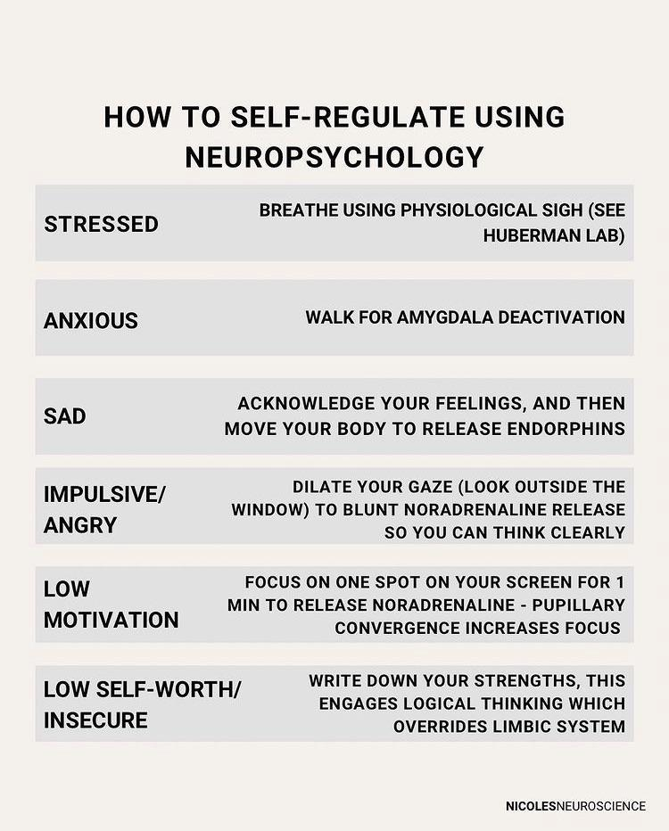
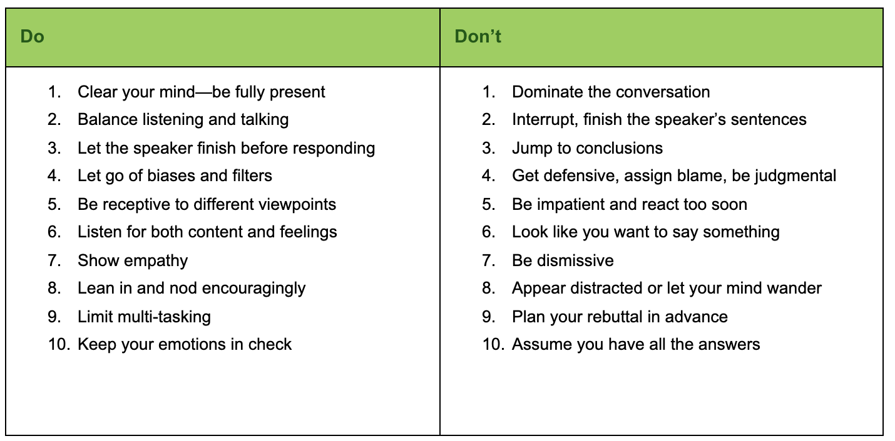
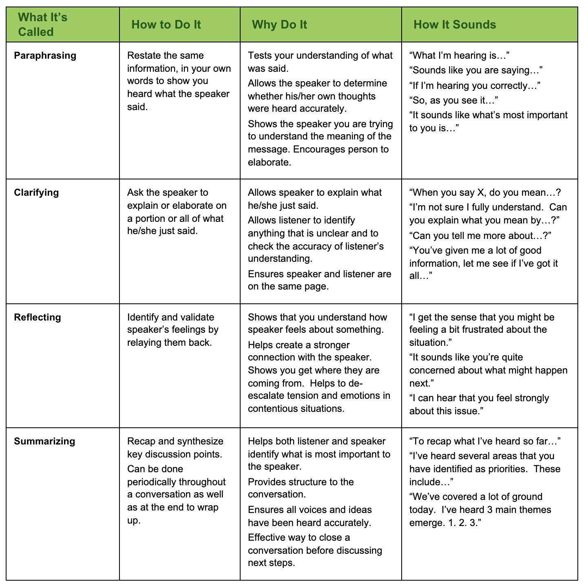

# Key Ideas, Goals, Context
- The communication between the emotional and rational portions of your brain is the physical source of emotional intelligence.
  - 
- What you think, say, and do can increase your EQ.
- IQ: cognitive intelligence, your ability to learn; a set of ability that doesn't change overtime (except in cases of traumatic injury)
- EQ: emotional intelligence, your skills of being aware of your emotions and those of others along with managing your emotions and your relationships; a skill that you can learn.
- personality: your temperament or style; a preference that is stable over a lifetime.
- characteristics to define emotionally intelligent people
  - They listen and learn from criticism
  - They maintain a positive (solution mode) attitude to difficult situations
  - They manage anxiety, fear, anger and all emotions appropriately in all situations.
  - They recognize how their behaviors affect others
  - They are empathetic
  - They have discipline and are self-motivated
  - They listen even if they disagree
  - They look for ways to improve when things don't go according to plan and embrace change.
  - they have a robust emotional vocabulary
  - they're curious about people.
  - they know their strengths and weeknesses
  - they're a good judge of character
  - they let go of mistakes
  - they're assertive
  - **EI is about figuring out how to apply, adapt, and deliver based on the needs of the person we're with and what stage of the process they're in**

- what does low EQ look like?
  - they get stressed easily
  - they make assumptions quickly and defend them vehemently.
  - they often feel misunderstood
  - they don't know their triggers
  - they don't get angry
  - they blame other people for how they make them feel
  - they're easily offended

# EI Rewiring Process
- Own it, Face it, Feel it, Ask it, Drive it
- sometimes, our subconscious mind causes us to try and validate our emotional responses consciously. For example, if you're not feeling great, you might look for ways that the day is bad or getting worse.
- the power of pause: pausing after someone's answered a question or said something (for dramatic effect) to encourage them to draw upon their subconscious mind and bring deeper thoughts/feelings to the conversation.
- Identify our own beliefs and values
- "Our minds are what created fear, and our mind is the only thing that can smash through it."
- Ask yourself: 'Do I want to change this? Why do I want to change this? What stands to happen if I don't change this?'
- accepting that something is going to happen and that the only thing we can control is how we choose to respond is where EI comes in.

# Empathy
- Sympathy is feeling sorry for someone, whereas empathy is recognizing the emotional response someone is having and how it feels to have that emotional response
  - Putting yourself in their shoes is dangerous because that typically comes with judgement
  - We don't need to know what has happened, just recognize what emotion and the severity of that emotion

## Steps to Empathy
- Recognize which emotion the person is feeling
- Recall the last time you felt that emotion
  - What was the best and worst thing someone could have said or done to you in that moment
  - First thing we want is to be heard
- Respond
  - Help the other person gain control of their emotions and feel a connection
  - [Empathetic System Architecture](./empathetic-system-architecture.pdf)

# [Fixed Mindset vs Growth Mindset](https://biglifejournal.com/blogs/blog/fixed-mindset-vs-growth-mindset-examples)

- I'm either good at something or I'm not -> **I can improve my skills with effort and practice**
- when people give me feedback, it feels like criticism -> **I appreciate it; it helps me learn and grow**
- I'm just not good at math -> **Math is challenging for me, but I know I can improve**
- I'm too shy to speak in front of the class -> **With practice, I can become more confident and improve my public speaking skills**
- I'm already a really good writer. I don't need to get any better -> **There's always room for improvement**
- naturally smart people don't need to try hard to succeed -> **No one is born smart. We can all improve with time, effort and persistence**
- Other people's successes make me feel bad about myself -> **Other people's successes encourage and inspire me. They show me what is possible**
- Successful people are lucky/talented and have never experienced failure -> **Failure is part of success. Most successful people have failed many times, but they succeeded because they didn't quit**
- I wish I was as good at baseball as you. It's not fair -> **Your skills as a baseball player inspire me. Do you have any tips to help me improve**
- It's embarrassing when I make a mistake -> **everyone makes mistakes, and mistakes are opportunities to learn**
- If I don't try new or hard things, then I won't fail -> **I have to try new and difficult things in order to grow, even if I fail at first**
- When I fail, I get frustrated and give up -> **When I fail or get frustrated, I try again using the lessons I've learned.**
- Failure means it is time to give up -> **I only truly fail when I stop trying**
- I can't do that -> **I can't do that yet. I'm going to keep going, try new strategies, and/or ask for help until I understand it**
- If I don't improve right away, I get frustrated. I start to criticize myself -> **I know improvement takes time, and I celebrate the small steps. Even a little progress makes a difference**

# Emotional intelligence: the four skills
- A Different perspective on Emotional Intelligence from Daniel Goleman
  - Self-awareness
  - self-regulation
  - internal motivation
  - Empathy
  - Social Skills
- 

## Self Awareness Strategies
- the ability to stay aware of your emotions in the moment and understand your tendencies across situations.

### Quit Treating Your Feelings as Good or Bad
- pay attention when you feel an emotion begin to build.
- try to understand the emotions and avoid labelling them good or bad.

### Observe The Ripple Effect
- pay attention to how your emotions affect others.
- ask others their view of how your emotions affect them.

### Lean into Your Discomfort
- ignoring feelings doesn't make them go away. They will resurface. Face them when they come and try to work through them.

### Physically Feel Your Emotions
- pay attention to how an emotion physically affects you (increased heart rate, dry mouth, tightening in stomach, neck, back; fast, shallow breathing).
- for practice, close your eyes and remember a high-emotion incident. Notice what physical symptoms you get simply thinking about it.

### Know What/Who Pushes Your Hot Buttons
- Pay attention to the situations or people that trigger your emotions. Think about why you might find those situations or people irksome.

### Watch Yourself like a Hawk
- Think about how your emotional reaction may make things worse.
- Try to see things from the other's perspective.
- Formulate a calmer way to express your emotions and effectively convey your points.

### Keep an Emotional Journal
- By keeping a journal of your emotions and what events triggered them, you can become more aware of patterns.

### Don't Be Fooled by a Bad Mood
- When you're stuck in a down mood, it's not a good time to make important decisions. Briefly reflect on recent events that may have brought on the mood.

### Ask Yourself Why You Do What You Do
- What is your earliest memory of reacting like this? Are the people or circumstances similar in some way? 

### Visit Your Values
- Remind yourself of your values and how well you are currently living up to them.
  - What are your core values and things that you have said or done recently that violate them.

### Check Yourself
- Notice your mood and how it influences your demeanour

### Spot Your Emotions in Books, Movies, And Music
- finding your emotions in the expressions of artists allows you to learn about yourself and discover feelings that are often hard to communicate.

### Seek Feedback
- Often, there is a big difference between how you see yourself and how others see you. When you ask for feedback, seek specific examples and look for similarities in what people tell you.

### Get to Know Yourself Under Stress
- People vary in how they react to stress. Which physical symptoms are common for you?
  - An upset stomach
  - A pounding headache
  - Canker sores
  - Back spasms
- When you recognize that you are under stress, take some time to recharge your emotional battery.

## Self Management Strategies
- the ability to use your awareness of your emotions to stay flexible and direct your behavior positively
- 

### beat stress and stay calm

- **Appreciate what you have**. 
  - Research conducted at the University of California, Davis, showed that people who worked daily to cultivate an attitude of gratitude experienced improved mood, energy, and physical well-being. It's likely that lower levels of cortisol played a major role in this improvement. The Davis study participants had one simple task: Pause during the day to contemplate what they were grateful for. Lowering your cortisol is that easy.
  - 3 habits in the first 5 mins of the day (one of them is to write down what you're grateful for)

- **Stay positive.** 
  - When things are going poorly, and your mind is flooded with negative thoughts, this can be a challenge. In these moments, think about your day, and identify one positive thing that happened, no matter how small. If you can't think of something from the current day, reflect on the previous day or even the previous week. Or perhaps you're looking forward to an exciting event that you can focus on. The point here is that you must have something positive that you're ready to shift your attention to when your thoughts turn negative. Research from University College London found that negative thinkers have a significantly greater chance of developing dementia over just a four-year period.

- **Avoid asking, "What if?"** 
  - "What if?" statements throw fuel on the fire of stress and worry. Things can go in a million different directions, and the more time you spend worrying about the possibilities, the less time you'll spend focusing on taking action that will calm you down and keep your stress under control. Calm people know that asking "What if?" will only take them to a place they don't want or need to go. If you do find yourself having trouble letting go of a particular "What if?," take a moment to consider your plan of action should it come to fruition and move on.

- **Disconnect.** 
  - Given the importance of keeping stress intermittent, it's easy to see how taking regular time off the grid can help keep your stress under control. When you make yourself available to your work 24/7, you expose yourself to a constant barrage of stressors. Forcing yourself offline and even-gulp!-turning off your phone gives your body a break from a constant source of stress. Studies have shown that something as simple as an email break can lower stress levels.
  - putting a mental recharge into your weekly schedule. If you're worried about the negative repercussions of taking this step, first try doing it at times when you're unlikely to be contacted-maybe Sunday morning. As you grow more comfortable with these breaks, and as your coworkers begin to accept that you spend time offline, gradually expand the amount of time you spend away from technology.

- **Limit your caffeine intake.** Drinking caffeine triggers the release of adrenaline. Adrenaline is the source of the "fight-or-flight" response, a survival mechanism that forces you to stand up and fight or run for the hills when faced with a threat. The fight-or-flight mechanism sidesteps rational thinking in favor of a faster response. This is great when a bear is chasing you, but not so great when you're responding to a curt email. When caffeine puts your brain and body into this hyper-aroused state of stress, your emotions outrun your behavior. The stress that caffeine creates is far from intermittent, as its long half-life ensures that it takes its sweet time working its way out of your body.

- **Sleep.** I've beaten this one to death over the years and can't say enough about the importance of sleep for increasing your emotional intelligence and managing your stress levels. When you sleep, your brain literally recharges, so that you wake up alert and clear-headed. Your self-control, attention, and memory are all reduced when you don't get enough—or the right kind of sleep. Sleep deprivation raises stress hormone levels on its own, even without a stressor present. Stressful projects often make you feel as if you have no time to sleep, but taking the time to get a decent night's sleep is often the one thing keeping you from getting things under control. Many of us don't know what appropriate sleep hygiene is or why we have such lousy sleep. The chapter on cleaning up your sleep hygiene will help
you make your sleep top notch. Reframe your perspective. Stress and worry are fueled by our own skewed perceptions of events. It's easy to think that unrealistic deadlines, unforgiving bosses, and out-of-control traffic are the reasons you're so stressed all the time. You can't control your circumstances, but you can control how you respond to them. **So, before you spend too much time dwelling on something, take a minute to put the situation into perspective.**. If you're thinking in broad, sweeping statements such as "Everything is going wrong" or "Nothing will work out," then you need to reframe the situation. A great way to correct this unproductive thought pattern is to list specific things that are actually going wrong or not working out. Most likely, you will come up with only a few things (not everything), and the scope of these stressors will look much more limited than they initially appeared.

- **Breathe.** 
  - Practicing being in the moment with your breathing will train your brain to focus on the task at hand and get the stress monkey off your back. When you're feeling stressed, take a couple of minutes to focus on your breathing. Close the door, put away all other distractions, and just sit in your chair and breathe. Your goal is to spend the entire time focused on your breathing, which will prevent your mind from wandering. Think about how it feels to breathe in and out. This sounds simple, but it's hard to do it for more than a minute or two. It's all right if you get sidetracked by another thought. This will happen at the beginning, and you just need to bring your focus back to your breathing. If you struggle to stay focused on your breathing, try counting each breath in and out until you get to 20, and then start again from 1. Don't worry if you lose count. You can always just start over.
  - Shallow breaths deprive your brain of oxygen. This leads to poor concentration, forgetfulness, mood swings, anxiety and lack of energy. Breathe slowly and deeply.

- **Say no.** 
  - Research conducted at the University of California, Berkeley, showed that the more difficulty that you have saying no, the more likely you will experience stress, burnout, and even depression. Saying no is indeed a major challenge for many people. "No" is a powerful word that you should not be afraid to wield. When it's time to say no, avoid phrases such as "I don't think I can" or "I'm not certain." Saying no to a new commitment honors your existing commitments and gives you the opportunity to successfully fulfill them. 

- **Neutralize toxic people.** 
  - Dealing with difficult people is frustrating, exhausting, and highly stressful. You can control your interactions with toxic people by keeping your feelings in check. When you need to confront a toxic person, approach the situation rationally. Identify your emotions, and don't allow anger or frustration to add to the chaos. In addition, consider the difficult person's viewpoint and perspective so that you can find solutions and common ground. When things completely derail, take the toxic person with a grain of salt to avoid letting them bring you down. This is easier said than done, which is why there's a separate chapter on techniques and habits for neutralizing toxic people.

- **Don't hold grudges.** 
  - The negative emotions that come with holding onto a grudge are actually a stress response. Just thinking about the event sends your body into fight-or-flight mode. When the threat is imminent, this reaction is essential to your survival, but when the threat is ancient history, holding onto that stress wreaks havoc on your body and can have devastating health consequences over time. In fact, researchers at Emory University have shown that holding onto stress contributes to high blood pressure and heart disease. Holding onto a grudge means you're holding onto stress, and emotionally intelligent people know to avoid this at all costs. Letting go of a grudge not only makes you feel better now but can also improve your health.

- **Practice mindfulness.** 
  - Mindfulness is a simple, research-supported form of meditation that helps you gain control of unruly thoughts and behaviors. People who practice mindfulness regularly are more focused, even when they are not meditating. It is an excellent technique to help reduce stress, because it helps you reduce the feeling of not being in control. Essentially, mindfulness helps you stop jumping from one thought to the next, which keeps you from ruminating on negative thoughts. Overall, it's a great way to make it through your busy day calmly and productively. There's a separate chapter on how to practice this technique.

#### STRUCTURING YOUR FREE TIME ALLEVIATES STRESS

- A Stanford study found that productivity per hour declines sharply when a workweek exceeds 50 hours, and productivity drops off so much after 55 hours that there's no point in working any more. That's right. People who work as much as 70 hours (or more) per week actually get the same amount done as people who work 55 hours.

- **Rule 1: Minimize chores.** Chores tend to monopolize your free time. When this happens, you lose the opportunity to relax and reflect. What's worse, doing a lot of chores feels like work, and if you spend all weekend doing them, you just put in a seven-day workweek. To keep this from happening, you need to schedule your chores like you would anything else during the week. If you don't complete them during the allotted time, you move on and finish them the following weekend.

- **Rule 2: Exercise.** No time to exercise during the week? You have 48 hours every weekend to make it happen. Getting your body moving for as little as 10 minutes releases GABA, a soothing neurotransmitter that reduces stress. Exercise is also a great way to come up with new ideas. Innovators and other successful people know that being outdoors often sparks creativity. I know that a lot of my best ideas come to me while I'm surfing. While you're out in the ocean, the combination of invigorating activity and beautiful scenery creates the perfect environment to be creative. Whether you're running, cycling, or gardening, exercise leads to endorphin-fueled introspection. The key is to find a physical activity that does this for you and then to make it an important part of your weekly routine.

- **Rule 3: Pursue a passion.** You might be surprised what happens when you pursue something you're passionate about during your time off. Indulging your passions is a great way to escape stress and open your mind to new ways of thinking. Things like playing music, reading, writing, painting, or even playing catch with your kids can help stimulate different modes of thought that can reap huge dividends over the coming week.

- **Rule 4: Spend quality time with your family.** Spending quality time with your family is essential if you want to recharge and relax. Weekdays are so hectic that the entire week can fly by with little quality family time. Don't let this bleed into your weekends. Take your kids to the park, take your spouse to their favorite restaurant, and go visit your parents. You'll be glad you did.

- **Rule 5: Schedule micro-adventures.** Buy tickets to a concert or play, or make reservations for that cool new hotel that just opened downtown. Instead of running on a treadmill, plan a hike. Try something you haven't done before, or perhaps something you haven't done in a long time. Studies have shown that anticipating something good is a significant part of what makes the activity pleasurable. Knowing that you have something interesting planned for Saturday will not only be fun come Saturday but will also significantly improve your mood throughout the week.

- **Rule 6: Designate mornings as me time.** Your mind achieves peak performance two to four hours after you wake up, so get up early to do something physical and invigorating, and then save the mental tasks for later in the morning when your mind is at its peak.

- **Rule 7: Prepare for the upcoming week.** The weekend is a great time to spend a few moments planning your upcoming week. As little as 30 minutes of planning can yield significant gains in productivity and reduced stress. The week feels a lot more manageable when you go into it with a plan, because all you have to focus on is execution. Weekly reflection is a powerful tool for improvement. Use the weekend to contemplate the larger forces that are shaping your industry, your organization, and your job. Without the distractions of Monday to Friday busy work, you should be able to see things in a whole new light. Use this insight to alter your approach to the coming week, which improves the efficiency and efficacy of your work.

### Make Your Goals Public
- share your goals with someone and ask this person to hold you accountable

### Count to 10
- When you feel yourself becoming frustrated or angry, count to 10 with a slow breath between each number. The focus on counting will engage your rational brain

### Sleep On It
- Time help bring clarity and perspective

### Talk to a Skilled Self-Manager
- Find a person who is skilled self-manager and who is willing to give you some tips

### Smile and Laugh More
- Your brain responds to the nerves and muscles in your face to determine your emotional state. Read or watch something that you find funny.
  - Tip: Hold a pencil between your teeth to activate the muscles used in smiling.

### Set Aside Time for Problem Solving
- Decisions made in a rush are selfdom effective

### Take Control of Your Self-Talk
- There is a strong relationship between what you think and how you feel, both physically and emotionally. Learn to control your self-talk.
- Replace the following: "I always", "I never", "I'm an idiot", "It's all my fault", "it's all their fault" with "Just this time", "Sometimes", "I made a mistake", "We each are responsible for our actions"

### Visualize yourself Succeeding
- Visualize effectively managing your emotions and behavior

### Clean up Your Sleep Hygiene
- Turn off devices with screens 2 hours before bedtime or block blue waves with special glasses or a blue-wave blocker app.
- Avoid working or watching television in bed
- Avoid caffeine after noon.

### Focus Your Attention on Your Freedoms
- Take accountability for what is within your area of responsibility rather than focusing on what you can't control.

### Stay Synchronized
- When your emotions get the best of you, force your attention away from your emotions and on to the task at hand

### Speak to Someone not Emotionally invested
- Find a trusted person to act as a sounding board. This should be someone who is not affected by the situation. The person should be a good listener rather than someone who tries to solve your problem for you.

### Learn from Everyone You Encounter
- When you are caught off-guard and on the defensive, use it as an opportunity to learn something. Learn from either the other person's feedback or their behavior

### Put a Mental Recharge into Your Schedule
- Schedule time for physical activity. It releases chemicals in your brain to improve your mood, keep you alert, and help you be more effective in planning, organizing, and making decisions.

### Accept that Change is Just around the Corner.
- At least every 2 weeks, think about important things that might happen. Make a list of activities that you will take if the change occurs. Make a list of things you could do now to prepare for the possible change.

## Social Awareness Strategies
- accurately pick up on emotions in other people and understand what is really going on with them

### Greet People by Name
- "a person's name is the most important word in any language to them. Use it often and respect it"
### Watch Body Language
- Does the person make good eye contact? 
- Does their smile appear sincere?
- Do they appear relaxed or tense and fidgety?

### Make Timing Everything
- Avoid asking a person for something when you can tell they are angry or under a lot of stress

### Develop a Back-pocket Question
- Have a question to ask in case a conversation lags. Avoid questions about sensitive topics.

### Don't Take Notes at All Meetings
- In a meeting where people interact, avoid taking extensive notes. Instead, focus on watching people's body language.

### Plan Ahead for Social Gatherings
- On an index card, list who will be at the event along with any talking points you want to use. Also list anything you agreed to bring so you don't forget.

### Clear Away the Clutter in Your Head
- When a person is speaking, focus on listening to that person, instead of letting your mind wander to other things.
- Make a point to try to learn something from listening to the person.

### Live in the Moment
- When you are around other people, be as present as possible.

### Go on a 15-minute Tour
- Walk around, noticing people's workspaces and how people move around the area.
- Try to pick up on people's feelings and how others affect your feelings.

### Watch EQ at the Movies.
- Watch some movies with the objective of watching the character interactions and conflicts
- Notice how the characters handle the conflict.
- Challenge yourself to pick up on clues that conflict may be building.

### Practice the Art of Listening
- Listening requires focus, it's far more than hearing the words.
- Listen to the tone, speed, and volume of the voice and how those fluctuate. Are those sending the message beyond what the words say? You won't know unless you focus fully on the person.
- 
- 

### Go People Watching
- Find a public place to watch how people interact with one another. Notice body language.

### Understand the Rules of Culture
- When interacting with those of a different culture, observe their body language and manner of speaking.
- If you aren't sure what behavior would be acceptable, ask questions.

### Test for Accuracy
- To confirm your interpretation of body language, use a reflective question. Example:
  - "It looks like you are feeling down about something. Did something happen?"

### Step into Their Shoes
- Ask yourself, "If I were this person, how would I [feel, react, respond]?"
- Think about how the person has reacted in similar situations.

### See the Whole Picture
- Seeking feedback gives you a chance to see how others may view your behavior.
  - What you intend as helpful responses and behaviors may appear unhelpful to other people. For example, others may interpret your attempt at courteous listening as lack of interest in the topic.

### Catch the Mood of the room
- When you enter a room, scan it for energy level.
- How would you describe the mood [enthusiastic, bored, somber, playful, cautious, angry]?
- Notice how people arrange themselves, alone or in groups.
- Which people are animated and which are subdued?
## Relationship Management Strategies
- ability to use your awareness of your own and others' emotions to manage interactions successfully.

### neutralize toxic people

- emotional manipulators are easy enough to spot if you know what to look for.

  - **They undermine your faith in your grasp of reality.** Emotional manipulators are incredibly skilled liars and gaslighters. They insist that an incident didn't happen when it did, and they insist they did or said something when they didn't. The trouble is, they're so good at it that you end up questioning your own sanity. Insisting that whatever caused the problem is a figment of your imagination is an extremely powerful way of getting out of a jam. Their utter confidence in the lie makes you question your own perception of events. They are an emotional black hole. Whatever emotional manipulators are feeling, they're geniuses at sucking everyone around them into those emotions. If they're in a bad mood, everyone around them knows it. But that's not the worst part: They're so skillful that not only is everyone aware of their mood, but they also feel it. This creates a tendency for people to feel responsible for the manipulator's moods and obligated to fix them.

  - **They are experts at doling out guilt.** Emotional manipulators are masters at leveraging your guilt to their advantage. If you bring up something that's bothering you, they make you feel guilty for mentioning it. If you don't mention it, they make you feel guilty for keeping it to yourself and stewing about it. When you're dealing with emotional manipulators, whatever you do is wrong, and no matter what problems the two of you are having, they're your fault.
  - **They claim the role of the victim.** When it comes to emotional manipulators, nothing is ever their fault. No matter what they do (or fail to do) it's someone else's fault. Someone else made them do it and usually, it's you. If you get mad or upset, it's your fault for having unreasonable expectations. If they get mad, it's your fault for upsetting them. Emotional manipulators don't take accountability for anything.
  - **Their actions don't match their words.** Emotional manipulators tell you what you want to hear, but their actions are another story. They pledge their support, but when it's time to follow through, they act as though your requests are completely unreasonable. They tell you how lucky they are to know you, and then act as though you're a burden. This is just another way of undermining your belief in your own sanity. They make you question reality as you see it and mold your perception according to what is convenient to them.
  - **They are too much, too soon.** Whether it's a personal relationship or a business relationship, emotional manipulators always seem to skip a few steps. They share too much too soon and expect the same from you. They appear vulnerable and sensitive, but it's a ruse. The charade is intended to make you feel "special" for being let into their inner circle, but it's also intended to make you feel not just sorry for them but also responsible for their feelings.
  - **They eagerly agree to help-and maybe even volunteer-and then act like martyrs**. An initial eagerness to help swiftly morphs into sighs, groans, and suggestions that whatever they agreed to do is a huge burden. If you shine a spotlight on that reluctance, they'll turn it around on you, assuring you that, of course, they want to help and that you're just being paranoid. The goal? To make you feel guilty, indebted, and maybe even crazy.
  - **They always one-up you.** No matter what problems you may have, emotional manipulators have it worse. They undermine the legitimacy of your complaints by reminding you that their problems are more serious. The message? You have no reason to complain, so shut the heck up.
  **They know all your buttons and don't hesitate to push them.** Emotional manipulators know your weak spots, and they're quick to use that knowledge against you. If you're insecure about your weight, they comment on what you eat or the way your clothes fit. If you're worried about an upcoming presentation, they point out how intimidating and judgmental the attendees are. Their awareness of your emotions is off the charts, but they use it to manipulate you, not to make you feel better.

#### THE NINE TOXIC TYPES

- **The Gossip**
  - Eleanor Roosevelt famously said, "Great minds discuss ideas, average ones discuss events, and small minds discuss people." Gossipers derive pleasure from other people's misfortunes. It might be fun at first to discuss somebody else's personal or professional misfortune, but over time, it gets tiring, makes you feel gross, and hurts other people. There are too many positives out there and too much to learn from interesting people to waste your time talking about the misfortunes of others.

- **The Victim**
  - Victims are tough to identify because you initially empathize with their problems. However, as time passes, you begin to realize that their "time of need" is all the time. Victims actively push away any personal responsibility by making every speed bump they encounter into an uncrossable mountain. They don't see tough times as opportunities to learn and grow from; instead, they see them as an out. There's an old saying: "Pain is inevitable, but suffering is optional." It perfectly captures the toxicity of the victim, who chooses to suffer every time.

- **The Arrogant**
  - Arrogant people are a waste of your time because they see everything you do as a personal challenge. Arrogance is false confidence, and it always masks major insecurities. Arrogant people tend to be lower performers, be more disagreeable, and have more cognitive problems than the average person. Arrogant people can be completely self-absorbed, and they bring you down through the impassionate distance they maintain from other people. You can usually tell when you're hanging around self-absorbed people because you start to feel completely alone. This happens because as far as they're concerned, there's no point in having a real connection with anyone else. You're merely a tool used to build their self-esteem.

- **The Envious**
  - To envious people, the grass is always greener somewhere else. Even when something great happens to envious people, they don't derive any satisfaction from it. That's because they measure their fortune against the world's when they should be deriving their satisfaction from within. And let's face it, there's always someone out there who's doing better if you look hard enough. Spending too much time around envious people is dangerous because they teach you to trivialize your own accomplishments.

- **The Manipulator**
  - Manipulators suck time and energy out of your life under the façade of friendship. They can be tricky to deal with because they treat you like a friend. They know what you like, what makes you happy, and what you think is funny. However, they use this information as part of a hidden agenda. Manipulators always want something from you, and if you look back on your relationships with them, it's all take, take, take, with little or no giving. They'll do anything to win you over, just so they can work you over.

- **The Dementor**
  - In J. K. Rowling's "Harry Potter" series, Dementors are evil creatures that suck people's souls out of their bodies, leaving them shells of humans. Whenever a Dementor enters the room, it goes dark, people get cold, and they begin to recall their worst memories. Rowling said that she based them on highly negative people—the kind of people who have the ability to walk into a room and instantly suck the life out of it. Dementors suck the life out of the room by imposing their negativity and pessimism on everyone they encounter. Their viewpoints are always "the glass is half empty," and they can inject fear and concern into even the most benign situations. A Notre Dame University study found that students assigned to roommates who thought negatively were far more likely to develop negative thinking and even depression themselves.

- **The Temperamental**
  - Some people have absolutely no control over their emotions. They lash out at you and project their feelings onto you, all the while thinking that you're the one causing their malaise. Temperamental people are tough to dump from your life because their lack of control over their emotions makes you feel bad for them. When push comes to shove, though, temperamental people will use you as their emotional toilet and should be avoided.

- **The Twisted**
  - There are certain toxic people who have bad intentions, deriving deep satisfaction from the pain and misery of others. They are out to hurt you, to make you feel bad, or to get something from you. Otherwise, they have no interest in you. The only good thing about this type is that you can spot their intentions quickly, which makes it that much faster to get them out of your life.

- **The Judgmental**
  - Judgmental people are quick to tell you exactly what is and isn't cool. They have a way of taking the thing you're most passionate about and making you feel terrible about it. Instead of appreciating and learning from people who are different from them, judgmental people look down on others. Judgmental people stifle your desire to be passionate and expressive, so you're best off cutting them out and being yourself.

#### HOW TO PROTECT YOURSELF FROM TOXIC PEOPLE

- **Set limits (especially with complainers).** Complainers and negative people are bad news because they swallow in their problems and fail to focus on solutions. They want others to join their pity party so that they can feel better about themselves. People often feel pressure to listen to complainers because they don't want to be seen as callous or rude, but there's a fine line between lending a sympathetic ear and getting sucked into their negative emotional spiral. You can avoid this only by setting limits and distancing yourself when necessary. One way to set a limit is to ask complainers how they intend to fix the problem. They will either quiet down or redirect the conversation in a productive direction.

- **Don't die in the fight.** People with high EQ know how important it is to live to fight another day, especially when your foe is a toxic individual. In conflict, unchecked emotion makes you dig your heels in and fight the kind of battle that can leave you severely damaged. When you read and respond to your emotions, you're able to choose your battles wisely and stand your ground only when the time is right.

- **Stay aware of your emotions.** Maintaining emotional distance requires awareness. You can't stop someone from pushing your buttons if you don't recognize when it's happening. Sometimes, you'll find yourself in situations in which you'll need to regroup and choose the best way forward. This is fine, and you shouldn't be afraid to buy yourself some time to do so. Think of it this way-if a mentally unstable person approaches you on the street and tells you he's John F. Kennedy, you're unlikely to set him straight. When you find yourself with a coworker who is engaged in similarly derailed thinking, sometimes it's best to just smile and nod. If you're going to have to straighten them out, it's better to give yourself some time to plan the best way to go about it.

- **Rise above.** Toxic people drive you crazy because their behavior is so irrational. Make no mistake about it; their behavior truly goes against reason. So, why do you allow yourself to respond to them emotionally and get sucked into the mix? The more irrational and off- base someone is, the easier it should be for you to remove yourself from their traps. Quit trying to beat them at their own game. You don't need to respond to the emotional chaos-only the facts.

- **Establish boundaries.** People feel like because they work or live with someone, they have no way to control the chaos. This couldn't be further from the truth. Once you find someone's behavior more predictable and easier to understand, you are equipped to think rationally about when and where you have to put up with them and when you don't. For example, even if you work closely with someone on a project team, you don't need to have the same level of one-on- one interaction with them you have with your other team members. You can establish a boundary, but you'll have to do it consciously and proactively. If you let things happen naturally, you're bound to find yourself constantly embroiled in difficult conversations. If you set boundaries and decide when and where you'll engage a difficult person, you can control much of the chaos. The only trick is to stick to your guns and keep boundaries in place when the person tries to encroach upon them which they will.

- **Don't focus on problems-only solutions.** Where you focus your attention determines your emotional state. When you fixate on the problems you're facing, you create and prolong negative emotions and stress. When you focus on actions to better yourself and your circumstances, you create a sense of personal efficacy that produces positive emotions and reduces stress. When it comes to toxic people, fixating on how crazy and difficult they are gives them power over you. Quit thinking about how troubling your difficult person is, and focus instead on how you're going to handle them. This makes you more effective by putting you in control, and it will reduce the amount of stress you experience when interacting with them.

- **Don't forget.** Emotionally intelligent people are quick to forgive, but that doesn't mean that they forget. Forgiveness requires letting go of what's happened so that you can move on. It doesn't mean you'll give a wrongdoer another chance. Emotionally intelligent people are unwilling to be bogged down unnecessarily by others' mistakes, so they let them go quickly and are assertive in protecting themselves from future harm.

- **Use your support system.** It's tempting but ineffective to try to tackle everything by yourself. To deal with toxic people, you need to recognize the weaknesses in your approach to them. This means tapping into your support system to gain perspective on a challenging person. Everyone has someone who is on their team, rooting for them, and ready to help them get the best from a difficult situation.
Identify these individuals in your life and seek their insight and assistance when you need it. Something as simple as explaining the situation can lead to a new perspective. Most of the time, other people can see a solution that you can't because they are not as emotionally invested in the situation as you are.

### Be Open and Be Curious
- Give people enough information about you that they can understand your perspective. Ask others questions to learn about their perspectives.

### Enhance Your Natural Communication Style
- Analyze how those who know you well view you. "Upsides of My Style" Vs "Downsides of My Style"
- How can you use the upsides of your style to improve your communication?
- How can you eliminate or minimize the downsides of your style?

### Avoid Giving Mixed Signals
- Pay attention to your emotions and how your body language and vocal expression are coming across to people.

### Remember, Little Things Pack a Punch
- Little Courtesies such as please, thank you, and I'm sorry can make a big difference in your relationships with others.

### Take Feedback Well
- Listen carefully
- Ask for examples of what you have said or done that led the person to view you in a certain way.
- Whether you agree with the feedback or not, thank the person for being willing to share their perspective
- After the feedback, think seriously about what you heard. How did you react to it emotionally and rationally?
- Create a plan to make some adjustments so the person knows you took their feedback seriously.

### Build Trust
- To build trust, you will need to be consistent in your words and actions over time. You will need to do what you say you will do.
- Gradually share things about yourself so the other person understands you better.
- Watch and listen closely to gain an understand of the other person.

### Have an Open-Door Policy
- Be as accessible as you can while realizing that you cannot be there for everyone at all times.

### Only Get Mad on Purpose
- Don't let your anger control you. Be angry with the right person, to the right degree, at the right time, for hte right purpose, and in the right way.
- Express your anger when you know it will show the gravity of a situation and serve to improve relationship

### Don't avoid the inevitable
- Don't avoid a person with whom you must interact.
- Strive to put boundaries in place to make your interaction as helpful as possible for both of you.

### Acknowledge the Other Person's Feelings
- Rather than stifle or try to change people's feelings, simply acknowledge them. You don't have to agree with their feelings, but it helps to let them know you notice their struggle.
- When you sense that a person is upset of troubled, here is a process that may help:
  - "It appears something is troubling you."
  - "I'm sorry you are upset"
  - "Do you want to talk about it?"
  - "If they do, then listen carefully"
  - Summarize what you heard

### Complement the Person's Emotions or Situation
- Your role is to notice other people's moods and be there for them in a helpful way.

### When You Care, Show It
- When someone does something well, don't hesitate to let them know you notice it and appreciate it. 
  - Vary the way to do this. For example, try some of these:
    - In person thank you
    - Email note
    - Greeting card
    - Inexpensive gift tailored to their preferences.

### Explain Your Decisions, Don't Just Make Them
- Tell people the alternatives you considered and why the final choice makes sense.
- Acknowledge how the decision will affect everyone.

### Make your Feedback Direct and Constructive
- Consider the best way to give hte feedback, so it's easiest fof the person to understand and accept.
- Strive to be clear, direct, constructive and respectful.

### Align your intention with Your Impact
- Think before you speak or act. Make an appropriate and sensitive response.

### Offer a Fix It Statement During a Broken Conversation
- Look at both sides to figure out where the interaction went off track.
- Say something neutral to help you take a pause. It can be as simple as "This is hard"

### Ask, Ask, Tell
- Use open communication to ask someone how to do/achieve something, if they still don't do it keep emotion out of it, remaining calm and factual and tell them what they need to do. Set clear expectations, including consequences
- maybe ask the reason why they don't want to do it?

### Tackle a Tough Conversation
- Start your conversation by stating the common ground you share.
- Ask the person to share his or her point of view
- Resist the urge to plan a rebuttal
- Help the other person understand your side. Communicate clearly and directly
- Even if there is disagreement, once you understand both perspectives, find a way to move the conversation to closure.
- After the meeting, keep in touch with the person to see how they are doing.
- **Pausing between points** allows the audience to take in your idea
- **Slow down** when explaining unfamiliar concepts
- **Communicate to express** not impress
- Talk with a **strong confident voice** (be conscious of the 3 V's)
- Only **share what your audience must not forget** in terms of level of detail
- Follow the **3 What's** to keep conversations organized (see below)
- Use **stories, examples and analogies** to make your points more memorable and relatable for the audience
- **Standing up when presenting** gives you a wider range of motion, you typically have more visual gestures (talking with your hand) and your audience can hear a difference in your voice (important even if you are in a voice only call)

### Being empathetic
- Listen and ask open questions
  - Do not interrupt just listen, ask open ended question to keep them talking
  - You will know they are done talking when they ask a question
- Acknowledge and Pause
  - Doesn't mean agreeing with the emotional response
  - Acknowledge what has happened and the circumstances
  - Pause is to ensure they have said everything they want/need to say
- How do we fix this?
  - Majority of people in this state already know what they want to happen
- Actions
  - List and confirm actions that will be taken, committing to time frame and ownership
  - Following through with commitments is crucial
- Support
  - Say "What else can I do to help?"

# Questions
- what the worst things that could possibly happen?
  - what's the underlying core emotions?
  - what's my need?
- how do you either limit or mitigate the risk from occurring?
  - what would need to happen for this not to be a problem
  - what beliefs would you need?
  - what training or skills? what emotions would you need?
  - what do you physically need?
- what is the easiest way to solve this?
  - what is the hardest way to solve this?
  - what is the quickest way or the longest way?
  - how would you feel if you solved this?
  - do you want to feel like that?
  - what is the first step to making this happen?
  - what could you do right now?
- how do you current responses make you feel? why is this a problem?
- how do you think you could leverage your mindset in different situations, to your advantage?
- how do you think we can be more accommodating of each other's dominant modalities in a collaborative setting?
- What is our motivator/emotional driver?
- What are our values and beliefs?
- what are our default emotional responses
- what are our Style of Praise?
- what are our style of feedback?
- How to Create a Connection?
- How can you be empathetic if you have never felt the emotion someone is feeling before?
- Has anyone in your life stood out as being very empathetic? What did they do that made you feel this way?
- What is your EI profile?
- What type of person are you? Work machine, analyst, innovator, tech guru, people lover?
- "What Your Emotions are telling you to do" Vs "What Your Reason is Telling to do
- Where are your emotions clouding your judgement?
- Where is your reason blocking important cues from your emotions?

# Quotes

"Emotional intelligence is your ability to recognize and understand emotions in yourself and others, and your ability to use this awareness to manage your behavior and relationships"

"If I could sum up emotional in 2 words, it would  be 'own it'"

replace "why is this happening to me" with "what is this trying to teach me?", everything shifts.

"today I refuse to stress myself out about things I cannot control or change?"

"be crazy, be stupid, be silly, be weird, be whatever, because life is too short to be anything but happy."

"Our own minds is what created fear and our own mind is the only thing that can smash through it"

Begin by asking yourself, "What emotion to I want to trigger in this situation?

Ask yourself: 'Do I want to change this? Why do I want to change this?  What stands to happen if I don't change this?'

Accepting that something is going to happen and that the only thing we can control is how we choose to respond is where EI comes in

"The greatest weapon against stress is our ability to choose one thought over another."

# References
- https://aimwa.com/workplaceconversations/growth-development/workplace-skills/five-steps-to-managing-your-emotions/
- https://podcasts.apple.com/us/podcast/emotional-intelligence-with-amy-jacobson/id1345245341?i=1000528823565
- https://fourminutebooks.com/emotional-intelligence-2-0-summary/#:~:text=1%2DSentence%2DSummary%3A%20Emotional,social%20awareness%2C%20and%20relationship%20management.
- https://readingraphics.com/book-summary-emotional-intelligence-2-0/
- https://www.getstoryshots.com/books/emotional-intelligence-20-summary/
- https://lifeclub.org/books/emotional-intelligence-2-0-travis-bradberry-and-jean-greaves-review-summary
- https://thepowermoves.com/emotional-intelligence-2-0/
- https://gracelead.files.wordpress.com/2016/09/emotional-intelligence-summary.pdf
- https://biglifejournal.com/blogs/blog/fixed-mindset-vs-growth-mindset-examples