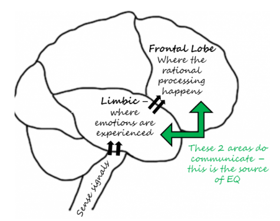
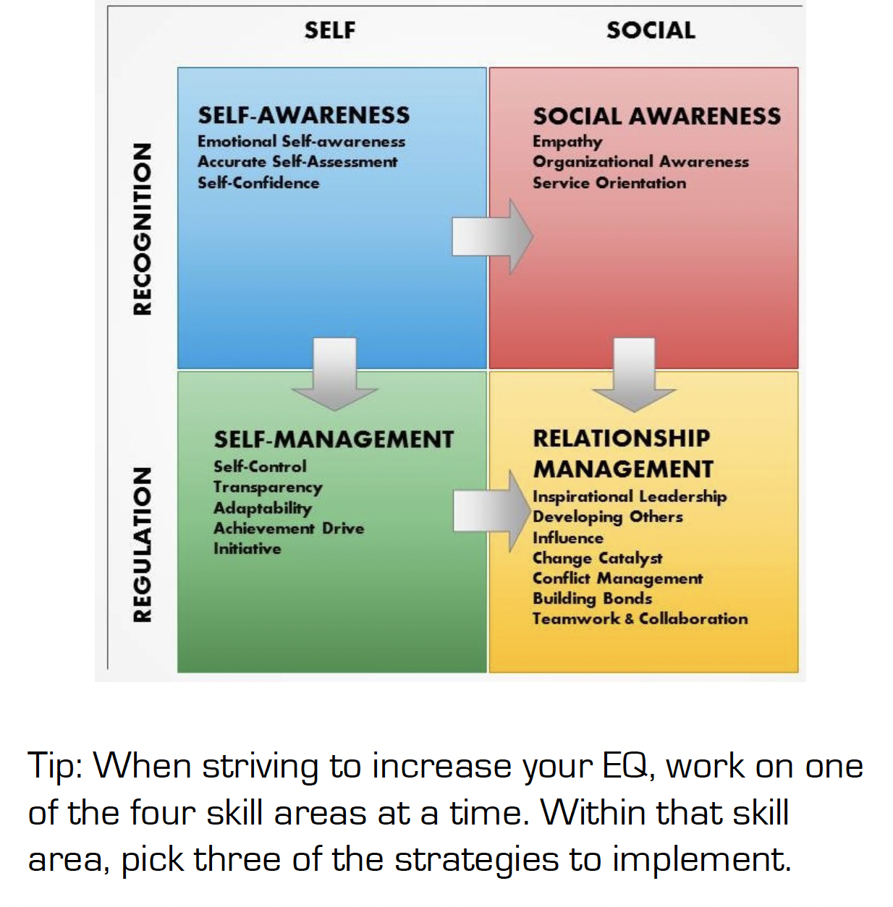

# Key Ideas, Goals, Context
- The communication between the emotional and rational portions of your brain is the physical source of emotional intelligence.
  - 
- What you think, say, and do can increase your EQ.
- IQ: cognitive intelligence, your ability to learn; a set of ability that doesn't change overtime (except in cases of traumatic injury)
- EQ: emotional intelligence, your skills of being aware of your emotions and those of others along with managing your emotions and your relationships; a skill that you can learn.
- personality: your temperament or style; a preference that is stable over a lifetime.
- 8 statements/characteristics to define emotionally intelligent people
  - They listen and learn from criticism
  - They maintain a positive (solution mode) attitude to difficult situations
  - They manage anxiety, fear, anger and all emotions appropriately in all situations.
  - They recognize how their behaviors affect others
  - They are empathetic
  - They have discipline and are self-motivated
  - They listen even if they disagree
  - They look for ways to improve when things don't go according to plan.
  - **EI is about figuring out how to apply, adapt, and deliver based on the needs of the person we're with and what stage of the process they're in**

# EI Rewiring Process
- Own it, Face it, Feel it, Ask it, Drive it
- sometimes, our sub-conscious mind causes us to try and validate our emotional response consciously. For example, if you're not feeling great, you might be looking for ways that the day is bad or getting worse.
- power of pause: pausing after someone's answered a question of said something (for dramatic effect) to encourage them to draw upon their sub-conscious mind and bring deeper thoughts/feelings to the conversation.
- Identify our own belief and values

# Emotional intelligence: the four skills
- A Different perspective on Emotional Intelligence from Daniel Goleman
  - Self-awareness
  - self-regulation
  - internal motivation
  - Empathy
  - Social Skills
- 
## Self Awareness
- the ability to stay aware of your emotions in the moment and understand your tendencies across situations.

### Quit Treating Your Feelings as Good or Bad
- pay attention when you feel an emotion begin to build.
- try to understand the emotions and avoid labeling it good or bad.

### Observe The Ripple Effect
- pay attention to how your emotions affect others.
- ask others their view of how your emotions affect them.

### Lean into Your Discomfort
- ignoring feelings doesn't make them go away. They will resurface. Face them when they come and try to work through them.

### Physically Feel Your Emotions
- pay attention to how an emotion physically affects you (increased heart rate, dry mouth, tightening in stomach, neck, back; fast, shallow breathing).
- for practice, close your eyes and remember a high-emotion incident. Notice what physical symptoms you get simply thinking about it.

### Know What/Who Pushes Your Hot Buttons
- Pay attention to the situations or people that trigger your emotions. Think about why you might find those situation or people irksome.

### What Yourself like a Hawk
- Think about how your emotional reaction may make things worse.
- Try to see things from the other's perspective.
- Formulate a calmer way to express your emotions and effectively convey your points.

### Keep an Emotional Journal
- By keeping a journal of your emotions and what events triggered them, you can become more aware of patterns.

### Don't Be Fooled by a Bad Mood
- When you're stuck in a down mood, it's not a good time to make important decisions. Briefly reflect on recent events that may have brought on the mood.

### Ask yourself Why You Do What You Do
- What is your earliest memory of reacting like this? Are the people or circumstances similar in some way? 

### Visit Your Values
- Remind yourself of your values and how well you are currently living up to them.
  - What's your core values and things that you have said or done recently that violates them.

### Check Yourself
- Notice your mood and how it influence your demeanor

### Spot Your Emotions in Books, Movies, And Music
- finding your emotions in the expressions of artists allows you to learn about yourself and discover feelings that are often hard to communicate.

### Seek Feedback
- Often, there is a big difference between how you see yourself and how others see you. When you ask for feedback, seek specific examples and look for similarities in what people tell you.

### Get to Know Yourself Under Stress
- People vary in how they react to stress. Which physical symptoms are common for you?
  - An upset stomach
  - A pounding headache
  - Canker sores
  - Back spasms
- When you recognize that you are under stress, take some time to recharge your emotional battery.
## Self Management
- the ability to use your awareness of your emotions to stay flexible and direct your behavior positively

### Breathe Right
- Shallow breaths deprive your brain of oxygen. This leads to poor concentration, forgetfulness, mood swings, anxiety and lack of energy. Breathe slowly and deeply.
- Create Emotion vs Reason List
  - "What Your Emotions are telling you to do" Vs "What Your Reason is Telling to do
- Where are your emotions clouding your judgement?
- Where is your reason blocking important cues from your emotions?

### Make Your Goals Public
- share your goals with someone and ask this person to hold you accountable

### Count to 10
- When you feel yourself becoming frustrated or angry, count to 10 with a slow breath between each number. The focus on counting will engage your rational brain

### Sleep On It
- Time help bring clarity and perspective

### Talk to a Skilled Self-Manager
- Find a person who is skilled self-manager and who is willing to give you some tips

### Smile and Laugh More
- Your brain responds to the nerves and muscles in your face to determine your emotional state. Read or watch something that you find funny.
  - Tip: Hold a pencil between your teeth to activate the muscles used in smiling.

### Set Aside Time for Problem Solving
- Decisions made in a rush are selfdom effective

### Take Control of Your Self-Talk
- There is a strong relationship between what you think and how you feel, both physically and emotionally. Learn to control your self-talk.
- Replace the following: "I always", "I never", "I'm an idiot", "It's all my fault", "it's all their fault" with "Just this time", "Sometimes", "I made a mistake", "We each are responsible for our actions"

### Visualize yourself Succeeding
- Visualize effectively managing your emotions and behavior

### Clean up Your Sleep Hygiene
- Turn off devices with screens 2 hours before bedtime or block blue waves with special glasses or a blue-wave blocker app.
- Avoid working or watching television in bed
- Avoid caffeine after noon.

### Focus Your Attention on Your Freedoms
- Take accountability for what is within your rea of responsibility rather than focusing on what you can't control.

### Stay Synchronized
- When your emotions get the best of you, force your attention away from your emotions and on to the task at hand

### Speak to Someone not Emotionally invested
- Find a trusted person to act as a sounding board. This should be someone who is not affected by the situation. The person should be a good listener rather than someone who tries to solve your problem for you.

### Learn from Everyone You Encounter
- When you are caught off-guard and on the defensive, use it as an opportunity to learn something. Learn from either the other person's feedback or their behavior

### Put a Mental Recharge into Your Schedule
- Schedule time for physical activity. It releases chemicals in your brain to improve your mood, keep you alert, and help you be more effective in planning, organizing, and making decisions.

### Accept that Change is Just around the Corner.
- At least every 2 weeks, think about important things that might happen. Make a list of activities that you will take if the change occurs. Make a list of things you could do now to prepare for the possible change.

## Social Awareness
- accurately pick up on emotions in other people and understand what is really going on with them

### Greet People by Name
- "a person's name is the most important word in any language to them. Use it often and respect it"
### Watch Body Language
- Does the person make good eye contact? 
- Does their smile appear sincere?
- Do they appear relaxed or tense and fidgety?

### Make Timing Everything
- Avoid asking a person for something when you can tell they are angry or under a lot of stress

### Develop a Back-pocket Question
- Have a question to ask in case a conversation lags. Avoid questions about sensitive topics.

### Don't Take Notes at All Meetings
- In a meeting where people interact, avoid taking extensive notes. Instead, focus on watching people's body language.

### Plan Ahead for Social Gatherings
- On an index card, list who will be at the event along with any talking points you want to use. Also list anything you agreed to bring so you don't forget.

### Clear Away the Clutter in Your Head
- When a person is speaking, focus on listening to that person, instead of letting your mind wander to other things.
- Make a point to try to learn something from listening to the person.

### Live in the Moment
- When you are around other people, be as present as possible.

### Go on a 15-minute Tour
- Walk around, noticing people's workspaces and how people move around the area.
- Try to pick up on people's feelings and how others affect your feelings.

### Watch EQ at the Movies.
- Watch some movies with the objective of watching the character interactions and conflicts
- Notice how the characters handle the conflict.
- Challenge yourself to pick up on clues that conflict may be building.

### Practice the Art of Listening
- Listening requires focus, it's far more than hearing the words.
- Listen to the tone, speed, and volume of the voice and how those fluctuate. Are those sending the message beyond what the words say? You won't know unless you focus fully on the person.

### Go People Watching
- Find a public place to watch how people interact with one another. Notice body language.

### Understand the Rules of Culture
- When interacting with those of a different culture, observe their body language and manner of speaking.
- If you aren't sure what behavior would be acceptable, ask questions.

### Test for Accuracy
- To confirm your interpretation of body language, use a reflective question. Example:
  - "It looks like you are feeling down about something. Did something happen?"

### Step into Their Shoes
- Ask yourself, "If I were this person, how would I [feel, react, respond]?"
- Think about how the person has reacted in similar situations.

### See the Whole Picture
- Seeking feedback gives you a chance to see how others may view your behavior.
  - What you intend as helpful responses and behaviors may appear unhelpful to other people. For example, others may interpret your attempt at courteous listening as lack of interest in the topic.

### Catch the Mood of the room
- When you enter a room, scan it for energy level.
- How would you describe the mood [enthusiastic, bored, somber, playful, cautious, angry]?
- Notice how people arrange themselves, alone or in groups.
- Which people are animated and which are subdued?
## Relationship Management
- ability to use your awareness of your own and others' emotions to manage interactions successfully.

### Be Open and Be Curious
- Give people enough information about you that they can understand your perspective. Ask others questions to learn about their perspectives.

### Enhance Your Natural Communication Style
- Analyze how those who know you well view you. "Upsides of My Style" Vs "Downsides of My Style"
- How can you use the upsides of your style to improve your communication?
- How can you eliminate or minimize the downsides of your style?

### Avoid Giving Mixed Signals
- Pay attention to your emotions and how your body language and vocal expression are coming across to people.

### Remember, Little Things Pack a Punch
- Little Courtesies such as please, thank you, and I'm sorry can make a big difference in your relationships with others.

### Take Feedback Well
- Listen carefully
- Ask for examples of what you have said or done that led the person to view you in a certain way.
- Whether you agree with the feedback or not, thank the person for being willing to share their perspective
- After the feedback, think seriously about what you heard. How did you react to it emotionally and rationally?
- Create a plan to make some adjustments so the person knows you took their feedback seriously.

### Build Trust
- To build trust, you will need to be consistent in your words and actions over time. You will need to do what you say you will do.
- Gradually share things about yourself so the other person understands you better.
- Watch and listen closely to gain an understand of the other person.

### Have an Open-Door Policy
- Be as accessible as you can while realizing that you cannot be there for everyone at all times.

### Only Get Mad on Purpose
- Don't let your anger control you. Be angry with the right person, to the right degree, at the right time, for hte right purpose, and in the right way.
- Express your anger when you know it will show the gravity of a situation and serve to improve relationship

### Don't avoid the inevitable
- Don't avoid a person with whom you must interact.
- Strive to put boundaries in place to make your interaction as helpful as possible for both of you.

### Acknowledge the Other Person's Feelings
- Rather than stifle or try to change people's feelings, simply acknowledge them. You don't have to agree with their feelings, but it helps to let them know you notice their struggle.
- When you sense that a person is upset of troubled, here is a process that may help:
  - "It appears something is troubling you."
  - "I'm sorry you are upset"
  - "Do you want to talk about it?"
  - "If they do, then listen carefully"
  - Summarize what you heard

### Complement the Person's Emotions or Situation
- Your role is to notice other people's moods and be there for them in a helpful way.

### When You Care, Show It
- When someone does something well, don't hesitate to let them know you notice it and appreciate it. 
  - Vary the way to do this. For example, try some of these:
    - In person thank you
    - Email note
    - Greeting card
    - Inexpensive gift tailored to their preferences.

### Explain Your Decisions, Don't Just Make Them
- Tell people the alternatives you considered and why the final choice makes sense.
- Acknowledge how the decision will affect everyone.

### Make your Feedback Direct and Constructive
- Consider the best way to give hte feedback, so it's easiest fof the person to understand and accept.
- Strive to be clear, direct, constructive and respectful.

### Align your intention with Your Impact
- Think before you speak or act. Make an appropriate and sensitive response.

### Offer a Fix It Statement During a Broken Conversation
- Look at both sides to figure out where the interaction went off track.
- Say something neutral to help you take a pause. It can be as simple as "This is hard"

### Tackle a Tough Conversation
- Start your conversation by stating the common ground you share.
- Ask the person to share his or her point of view
- Resist the urge to plan a rebuttal
- Help the other person understand your side. Communicate clearly and directly
- Even if there is disagreement, once you understand both perspectives, find a way to move the conversation to closure.
- After the meeting, keep in touch with the person to see how they are doing.
# Quotes

"Emotional intelligence is your ability to recognize and understand emotions in yourself and others, and your ability to use this awareness to manage your behavior and relationships"

"If I could sum up emotional in 2 words, it would  be 'own it'"

# References
- https://aimwa.com/workplaceconversations/growth-development/workplace-skills/five-steps-to-managing-your-emotions/
- https://podcasts.apple.com/us/podcast/emotional-intelligence-with-amy-jacobson/id1345245341?i=1000528823565
- https://fourminutebooks.com/emotional-intelligence-2-0-summary/#:~:text=1%2DSentence%2DSummary%3A%20Emotional,social%20awareness%2C%20and%20relationship%20management.
- https://readingraphics.com/book-summary-emotional-intelligence-2-0/
- https://www.getstoryshots.com/books/emotional-intelligence-20-summary/
- https://lifeclub.org/books/emotional-intelligence-2-0-travis-bradberry-and-jean-greaves-review-summary
- https://thepowermoves.com/emotional-intelligence-2-0/
- https://gracelead.files.wordpress.com/2016/09/emotional-intelligence-summary.pdf