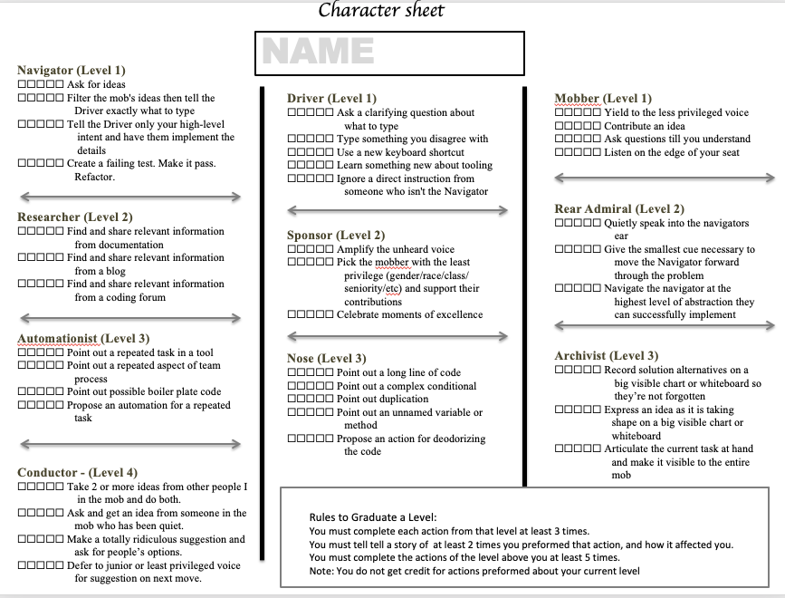
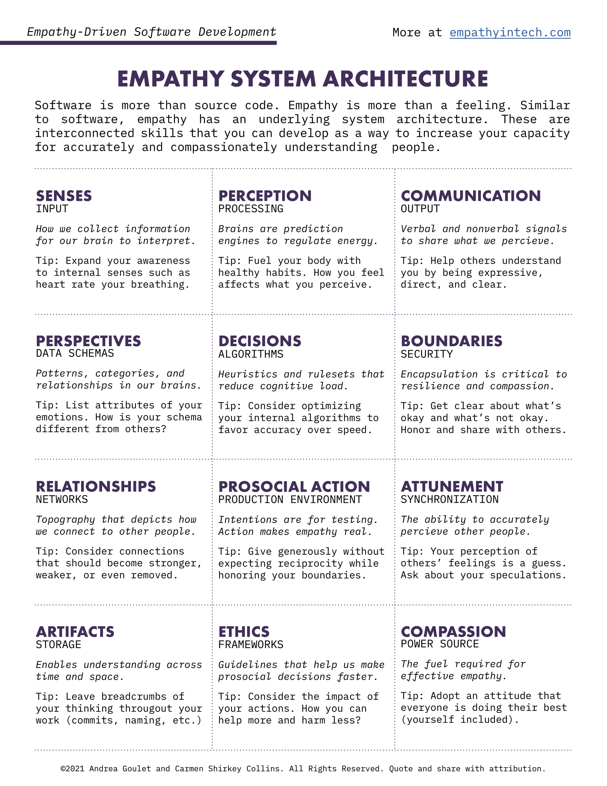

* Over the duration of this course, I’m sure we would discuss many patterns regarding mobbing. I hope those discussions could be documented somewhere so we can refer back to it and improve on it later.
* At the moment, I see this topic as an iterative process to hash out some patterns that we would agree would be useful to our daily work and we would use it in our daily work and in our ensembles.
* Hence, I was thinking of accepted/proposed, when it’s in proposed means it’s something we have discussed but we haven’t adopted to our daily working/ensembles yet. When it’s accepted, it means that we would do it in our ensembles and daily work.
* maybe it’s a wrong way to look at it, so maybe it makes more sense to have pain points section and the patterns section to address those pain points.

- 
- Avoid criticizing others by following patterns such as:
  - When people feel that they're attacked or being criticized, the conversation becomes much harder and prevents people from contributing further.
  - I would rather do X
  - I feel uncomfortable doing X because Y
- When navigating and don't know the direction, feel free to ask "I don't know where to go next, Can someone help me?"
- It's better to try it than debate/argues about it.
- When the driver doesn’t understand the instruction, feel free to say so and ask for more details
  - Intention, location, details
- Friendly, Kindness, Consideration, and Respect atmosphere, which would create psychology safety to help the team improve
- empathy patterns for the mob
  - 
- Reduce waste time and energy
  - i.e.: setting up the environment before joining
- Ensemble Summary Pattern
  - summarize the intent of the previous navigator
- Red button to hit when someone has some tests to add
- X is **future** Y, it’s a way to avoid using **X is better than Y**. it’s a way to say **I care, but I don’t mind y or x, I know y is an intermediate step for X anyway.**
- Driver should use search more often compare to scrolling
- Mobber should try to engage more with Driver/Navigator (.i.e: providing helpful information) as long as they do not try to control the driver/navigator
  - maybe try to play this game on every ensemble, 
  - the more detailed description of the game can be found here: https://github.com/willemlarsen/mobprogrammingrpg
  - tricks in helping describe ideas in code
    - write pseudo-code in English or your own native language
    - describe the intention what you try to accomplish with the loop, filter, map
    - if the loop is complicated, try to describe how the key data structures inside the loop are evolved through each iteration
- balance between the discussion and the code
  - if the discussion is too long, mob ask the group to continue
  - at any moment, you're stuck and don't know what just happened? please speak up
  - if you notice something to discuss/debates, write that down, and have that discussion at the end of the session, or wrote that down in the slack channel.
  - show up part-way through and you're very welcome to announce your arrivals.
- notes from open space mob sessions
  - requires people to have/get the skill in crucial conversation
  - impossible to rate individual performance when you mob fulltime
  - law of contributing
    - do you have anything to contribute
    - can you learn from the session
  - people that dominates from the mob/ensemble could be rejected from the ensemble because of law of contributing
  - if the task is known, take the mob to create a generator for it.

# Quotes

# Resources
- https://trello.com/c/Dj7bS8q2/107-mob-programming-roles-patterns-and-rpg
- https://liveingreatness.com/core-protocols/
- https://www.agilealliance.org/wp-content/uploads/2019/07/fig1-pattern-map.jpg
- https://www.youtube.com/watch?v=r66rCffBgOg&list=PLGME-VQ8iegjxFStr5EgOeXz6DxhGlvp3&index=3&ab_channel=MobMentalityShow
- https://www.youtube.com/channel/UCgt1lVMrdwlZKBaerxxp2iQ