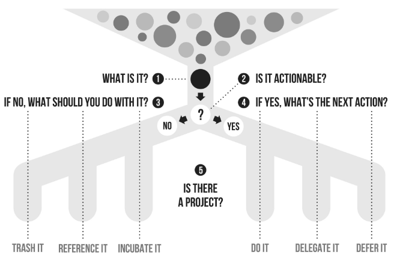
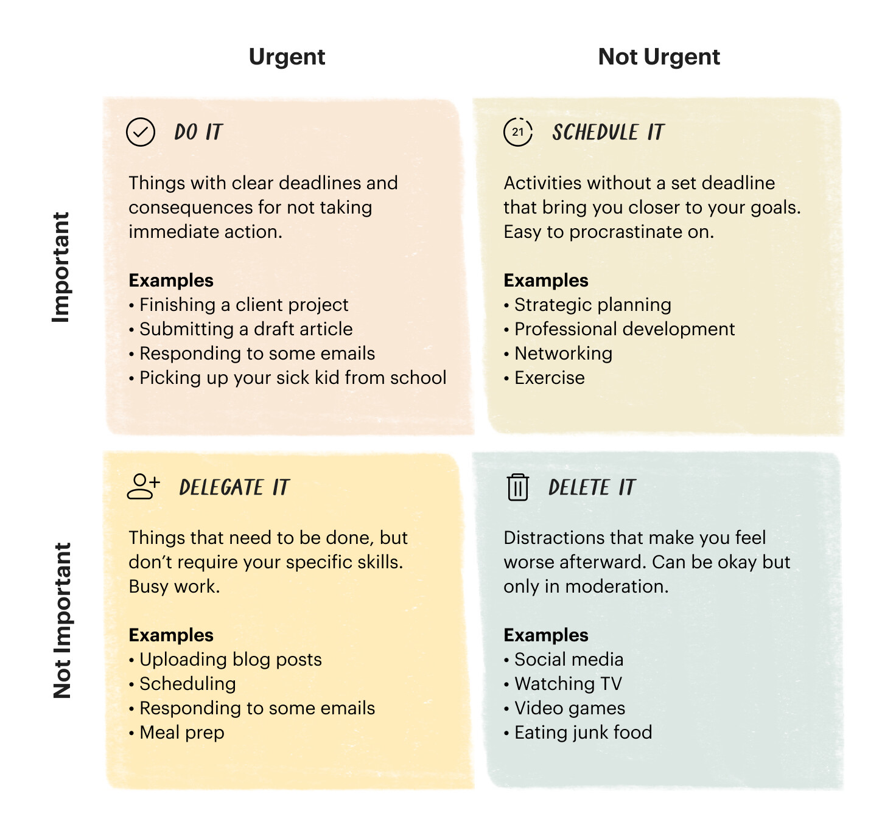

# Goals/Context for having a todo list
- trusted place I can easily find and look at to see additional/support information on any projects that are working on
- a reliable place for ideas and tasks
- maintain perspective and trust in the focus and the priorities
- getting in-tray(s) to zero
- avoid open loops and cognitive loads in mind to remember the open loops
- reference system to retrieve information within 30 seconds or less
- easy to access the visualization of the tasks in the inbox/today/next action lists, so it’s easier for you to take action
- Pair this with [Tiago Forte's PARA system](https://fortelabs.co/blog/para/), start using [progressive summarization](https://fortelabs.co/blog/progressive-summarization-a-practical-technique-for-designing-discoverable-notes/)

# Getting Started

- Sign up for Zapier and build one very simple automation. It doesn’t matter which one. Maybe create some kind of reminder.
- Sign up for Todoist and start just putting tasks into the Inbox. Maybe create a few Projects. Install it on your phone. Practise using it to get things out of your head for a couple of weeks.
- If you decide after a few weeks that you don’t hate Todoist, spend one afternoon/evening doing the Core Dump, where you just create Projects and add Tasks until everything seems out of your head. It is probably not that important to have links from Todoist tasks back to specific emails as long as you know what to search for in Gmail when needed.
- [Getting Started from JBrains](https://blog.jbrains.ca/permalink/getting-started-with-getting-things-done)

# 2-minute rule
- if the next action can be done in 2 minutes or less, do it now
- 
# Write down ideas and to-do items when they first show up
- make it easy to extract the information out of the brains
  - it usually takes less than 30 seconds to create the todo item on the phone
  - index cards can be used to write down ideas, but the items on index cards need to be transferred to Todoist
- apply a label to an email, which then is picked up by Zapier action and creates a card in Trello with the text of the email
- use the Todoist Gmail plugin to create a task and put it in the in-tray
  - [Use Gmail with Todoist](https://todoist.com/help/articles/use-gmail-with-todoist)
  - It is probably not that important to have links from Todoist tasks back to specific emails as long as you know what to search for in Gmail when you need it
- If there’s an inbox item and There’s no project fit for it, it should be deleted forever.
- create a todo item from a voice command
  - [How to use Todoist for Google Assistant](https://todoist.com/help/articles/how-to-use-todoist-for-google-assistant)
    - "OK, Google, Ask Todoist to add a task. Wash the car today."
  - Siri Action
    - [Shortcut Action](https://support.apple.com/en-ca/guide/shortcuts/welcome/ios)
    - Tell the action's title to Siri, and it prompts the card's title.
- Inbox/Task List: a combination of Todoist and 1-5 index cards.
- core Dump where you just create Projects and add Tasks until everything seems out of your head
- [Remind Yourself To Schedule A Thing](https://blog.jbrains.ca/permalink/remind-yourself-to-schedule-x)
- When you choose not to document something in your inbox
  - what does that choice feel like?
  - when this happens, what do you do instead? (Keep it in your brain's memory? Write it on a piece of paper. Something else?)
  - why did you choose not to do the task?
    - forgot to think about it
    - thought about it but never felt like I could schedule it because I had other things to do that I consciously decided were more urgent
    - thought about it and consciously decided, "I'll do it later," but then I forgot to think about it a second time.
    - thought about it and consciously decided, "I can't justify taking time from my schedule to do this now," but then I forgot to think about it a second time.
    - some other reason
  - after deciding the reason(s) not to do the task
    - move the item from your inbox into a new Project. Let this project have only one task: do it! Move this new Project up your list of Projects until everything above it is more urgent
    - create a new recurring task called "Decide when to do (the original task)." Remind yourself once per week. If you notice that you never even decide when to do the original task, then the original task wasn't important enough or urgent enough. **Throw it away, and maybe it comes back**
    - pick an exact time to do the task, and then put that on your calendar. At the moment that time arrives, either you do the task, or you throw it away (and maybe one day it comes back)

# Keep a complete list of all of the next actions

- apply the Todoist label next action on the task
- If you can’t even guess the effort of a smaller next action, then maybe the next action is “Spend 30 minutes figuring out what it means to complete this project”. Maybe the lack of vision/clarity about the “acceptance criteria” makes it hard for you to know where to start.
  - describe one next action which you can guess how long it will take—even if that next action is tiny or seems insignificant. That means moving the item from Inbox to New Project, then writing two tasks for that project:
    - the new, smaller next action
    - figure out how to do the rest of this project

# Keep a record of what is waiting for other people

- apply the Todoist label wait-for for the specific task

# Keep a Single list of all current projects

- add a project to the Todoist projects list

# At least one recorded next action for each of the projects

- make sure each project has at least one task with a next-action label

# Keep Someday/Maybe list

- Add Someday/Maybe as a project in todoist

# Get in-tray(s) (paper or digital) to empty every day or so

# Eisenhower-matrix

# Store and access (reference material easily when needed, whether it is paper or digital)

- Reference: a combination of Standard Notes and one Git repository (Or Google Drive), which I back up on Gitlab.
- coming up with keywords with: “How am I likely to search for this six months from now.”
- Google Drive folder name general-reference. Organized by keywords like general-reference/meme. Each folder is mapped to a keyword.
- tags note appropriately so it can be found later.

# regularly review the professional and personal todo list

- use project template GTD Weekly review from Todoist
- maybe take 30 minutes to review?
- daily review
- use embedded widgets from Todoist on phone/browser, so the tasks in inbox/next action/today can easily be viewed and acted on.
- identify and address your limiting criteria
- context, time available, the energy available (tackle frog labels with the highest energy), and priority
- recommended at least 60-90 minutes daily, but I often only have 5 mins to do it.
- tasks that are hard to classify
“I just want to remember to have the option to do this task, but I’m OK if it waits five years.” Put it in Someday/Maybe or create a new project for it.
“I just need to decide whether to do it or not.” Set a reminder for “Decide when to do X,” or just put the damn thing on your calendar.
- maybe, just **delete it, and it will come back if it is significant enough**
- resolve the possible guilt about it. Put it out of your mind. You can do it either by deciding “I’m going to do it on a Specific date” or “I’m going to just put it in the list and I’m happy if I do it next week, next month, next year, or next decade.”
- when reviewing the inbox
  - use Projects aggressively
  - if there are no projects fit for an item, delete it forever.

# The Calendar

- to keep it as the most trusted part of the todo system, use it to record the following kinds of information
  - time-specific actions: i.e. appointments, reserved time for a certain activity
  - day-specific actions: i.e. a shipment must be sent today
  - day-specific information: i.e. daughter’s birthday, office moves, etc…

# todo
- review grahamman notes

# Quotes

If it's on your mind, your mind isn't clear. Anything unfinished must be captured in a trusted system outside your mind.

# Reference
- https://www.grahammann.net/book-notes/getting-things-done-david-allen
- https://blog.jbrains.ca/permalink/remind-yourself-to-schedule-x
- https://blog.jbrains.ca/permalink/getting-started-with-getting-things-done
- https://www.amazon.ca/Getting-Things-Done-Stress-Free-Productivity-ebook/dp/B00KWG9M2E