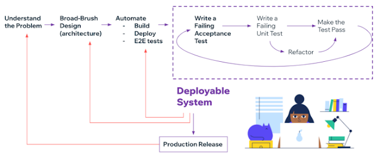
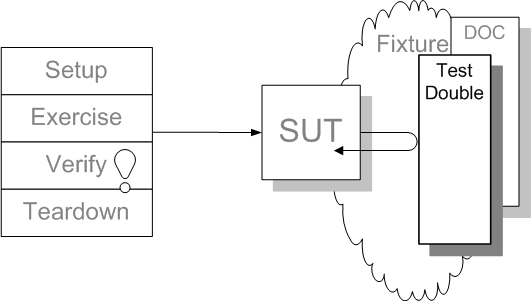
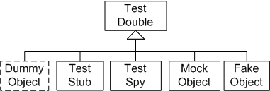
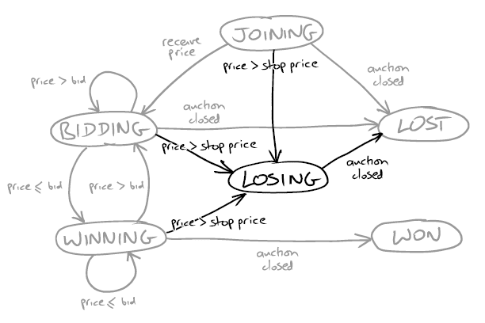
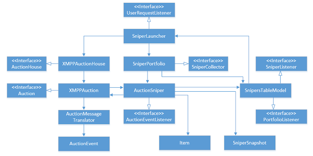

- [Key ideas](#key-ideas)
- [Test-Driven Development (TDD) and Quality](#test-driven-development-tdd-and-quality)
- [TDD as a design technique](#tdd-as-a-design-technique)
  - [Communication over classification](#communication-over-classification)
  - [mock roles not objects](#mock-roles-not-objects)
  - [Kick-staring the test-driven cycle](#kick-staring-the-test-driven-cycle)
  - [Maintaining the test-drive cycle](#maintaining-the-test-drive-cycle)
  - [Design for Maintainability](#design-for-maintainability)
- [tell, don't ask - law of Demeter](#tell-dont-ask---law-of-demeter)
- [Listen to tests, test smells and patterns](#listen-to-tests-test-smells-and-patterns)
- [techniques for introducing new objects](#techniques-for-introducing-new-objects)
- [object peer stereotypes](#object-peer-stereotypes)
  - [dependencies](#dependencies)
  - [Notification](#notification)
  - [Adjustments](#adjustments)
- [Programming by intention](#programming-by-intention)
- [Context independence](#context-independence)
- [Dependency Injection](#dependency-injection)
- [The sample project - analysis](#the-sample-project---analysis)
- [Quotes](#quotes)
- [References](#references)

# Key ideas
- **practice TDD as a design technique and not only as a testing technique.**
  - strangely, if we try to practise TDD as only a testing technique, then eventually we will become bored by our own defects and begin to notice "this code is annoying to test", which points to design problems. After that, we're practising TDD also as a design technique.
- **Software development as a learning process.**
  - **Expose uncertainly early by testing our assumption as early as possible**
- **we use mock objects to identify the essential interactions between modules/objects. This leads to more effective abstractions, which reduces the cost of changing the software safely over time.**
- Stub queries; expect actions
- **Write code that depends as little as possible on its context. It leads to more reusable code**
- **programming by intention**

# Test-Driven Development (TDD) and Quality
- Software development as a learning process.
- The best approach a team can take is to use empirical feedback to learn about the system and its use and then apply it back to the system.
- Development is incremental and iterative.
  - Incremental development builds a system feature by feature. Each feature is implemented as an end-to-end slice. As a result, the system is continuously integrated and ready for deployment.

- A system is deployable when the acceptance tests all pass.
- **External quality** is how well the system meets the needs of its customer and users. It's usually part of the contract to build
- **Internal quality** is how well the system meets the needs of its developers and administrators. The point of maintaining internal quality is to allow us to modify the system's behaviour safely and predictably because it minimizes the risk that a change will force significant rework.
- Running end-to-end tests tells us about the external quality. Writing them tells us something about how well we understand the domain.

# TDD as a design technique
- An object-oriented system: A web of collaborating objects.
- Values vs objects
  - a value represents some fixed quantity or measurement, and it is immutable
  - an object, on the other hand, is an identity that might change state over time. It models a computational process or a stateful behaviour of the system.
- The communication between the objects can be seen through tests. So don't try to model your system based on the entities (objects) alone, but on the communication between them.
- Objects follow common communication patterns. The domain model is in these communication patterns
- An object is an implementation of one or more roles:
  - roles are a set of related responsibilities
  - responsibilities is an obligation to perform a task or know information
  - collaboration is an interaction of objects or roles.
- An object communicates by messages: it receives messages from other objects. It reacts by sending messages to other objects as well, as perhaps, returning a value or exception to the original sender. An object has a method of handling every type of message that it understands. In most cases, it encapsulates some internal state that it uses to coordinate its communication with other objects.
- Make the intention of every test clear: distinguish between the tested functionality, the supporting infrastructure, and the object structure.
- **write unit tests for object behaviour rather than the object's methods**
- something that is difficult to test is probably poorly designed
- The single responsibility principle
  - of the heuristic is that we should be able to describe what an object does without using any conjunction ("and," "or").
  - interacting with the composite object should be more straightforward than interacting with the components that it composes
- **The empty interface is sometimes used to mark a domain concept and show how it's used in collaboration. Later, as we grow the code, we fill in the interface with methods to describe its behaviour.**
- Only mock types that you own:
  - don't use mocks for third-party code since it is usually not changeable as you don't have control over it. 
  - Use an adapter layer to implement interactions with third-party code. We test these adapters with focused integration tests to confirm our understanding of how the third-party API works.
  - We must focus on integrating our design and the external code. In integration, we have an abstraction to implement.
  - we must check that we're using the third-party API correctly and adjust our abstract to fit if we find that our assumptions are incorrect
  - There are some exceptions where mocking third-party libraries can be helpful:
    - we might use mocks to simulate behaviour that is hard to trigger with the library such as testing a sequence of calls.

## Communication over classification
- Use interfaces to name roles played by objects and describe the messages they'll accept. Keep interfaces as narrow as possible.
- We can use interfaces to define the available messages between objects, but we also need to express their communication protocols.
- we use TDD with mock objects as a technique to make these communication protocols visible, as a tool for discovering them during development and as a description when revisiting the code
- TDD with mock objects also encourages information hiding
- if similar interfaces represent different concepts, we can make a point of making them distinct. 
  - A decision to separate similar-looking interfaces is an excellent time to reconsider their naming
  - Another time to consider refactoring interfaces is when we start implementing them.

## mock roles not objects
- [mock roles not objects](http://jmock.org/oopsla2004.pdf)
  - todo: summarize the paper (extract key information that I understand)
- test double aka imposter
  - verify logic independently when code it depends on is unusable
  - avoid slow tests?
  - replace a component on which the SUT depends with a "test-specific equivalent"
  - 
  - 

## Kick-staring the test-driven cycle
- To run an initial end-to-end test that fails is already a lot of work. However, deploying and testing right from the start of a project forces the team to understand how their system fits into the world. it flushes out the "unknown."
- Keep a drawing of the system's structure on the whiteboard where it's visible for the whole team, and keep it in mind while coding! Then, make the smallest number of decisions you can to kick-start the TDD cycle. Then, we'll learn and improve from honest feedback.
- test as a walking skeleton
  - a walking skeleton implements the thinnest possible slice of actual functionality that we can automatically build, deploy, and test end-to-end.
  - Including the deployment step in the testing process is critical for two reasons
    - avoid the error-prone manual activity of deploying the system.
    - Flush out the risks in operating the software (like six weeks and four signatures to set up a database, we want to know now, not two weeks before delivery.).
  - context of the first test
    - understand the problem -> broad-brush design (architecture) -> automate: build, deployment, end-to-end tests -> deployable system.
- we have no guarantees that the decisions we've made about the design of our application are right
- Our ideal situation is where the team regularly releases a real production system. This allows the system's stakeholders to respond to how well the system meets their needs, at the same time allowing us to judge its implementation
- we use the automation of building and testing to give us feedback on the qualities of the system
  - the automated deployment helps us frequently release to real users, which gives us feedback
  - the great benefit is that we will be able to make changes in response to whatever we learn from feedback.
- Expose uncertainty early by testing our assumptions as early as possible.
- the essential structure of a test:
  - creating any required mock objects
  - create any natural objects
  - specify how you expect the mock objects to be called by the target object
  - call the triggering method on the target object
  - assert that any resulting values are valid and that all the expected calls have been made.

## Maintaining the test-drive cycle
- start each feature with an acceptance test
  - we write the acceptance using only terminology from the application's domain
  - the precision of expression requirements in a form that can be automatically checked helps us uncover implicit assumptions
- start testing with the simplest success case
  - we find it helpful to keep a notepad or index card by the keyboard to jot down failure cases, refactorings, and other technical tasks that need to be addressed
- write the test that you'd want to read
- watch the test fail
  - when we get the right failure, we check that the diagnostics are helpful. 
  - We adjust the test code and rerun the tests until the error messages guide us to the problem with the code.
    - **Error message checks our assumptions about the code we've been working on**
    - **emphasis on expressing our intentions is fundamental for developing reliable, maintainable systems.**
- Develop from the inputs to the outputs
  - start developing the feature by considering the events that trigger the new behaviour in the system.
  - We will need to write one or more objects to handle these events. We discover that these objects need supporting services from the rest of the system. In this way, we work our way through the system.
- **unit test behaviour, not methods**
  - one common mistake is thinking about testing methods. We do better when we focus on the object's features under test should provide. It helps to choose test names that describe how the object behaves in the tested scenario.
  - It helps to name the test by describing the required behaviour in a specific scenario.
- The best we can get from the testing part of TDD is **the confidence that we can change the code without breaking it. Fear kills progress. The trick is to make sure that the confidence is justified.**

## Design for Maintainability
- we grow our systems a slice of functionality at a time
- we use two principle heuristics to guide this structuring:
  - separation of concerns
  - higher levels of abstraction
    - That's why most people order food from a menu in terms of dishes, rather than the detail of the recipes used to create them.
- In its terminology, we write interfaces to describe its relationships with the outside world (Cockburn's ports). Then we write bridges between the application core and each technical domain (Cockburn's adapters). The bridges implement the interfaces defined by the application model and map between application-level and technical-level objects.
  - The code for the business domain is isolated from its dependencies on technical infrastructures, such as databases and user interfaces. We don't want technical concepts to leak into the application model, so we write interfaces to describe their relationships with the outside world in its terminology
- encapsulation ensures that the behaviour of an object can only be effected through its API. Information hiding conceals how an object implements its functionality behind the abstraction of its API
- we follow standard practices to maintain encapsulation when coding:
  - define immutable value types
  - avoid global variables and singletons
  - copy collections and mutable values when passing between objects, and so on.
  - don't share a reference/pointer to a mutable object
  - don't use global variables
  - don't use singletons
- **Single responsibility principle: every object should have a single, clearly defined responsibility. We should describe what an object does without using any conjunctions.**
- Composite simpler than the sum of its parts,
  - the API of a composite object should not be more complicated than of any of its components
- As we grow the code, the composing more straightforward rules raise abstraction.
- "One domain vocabulary" rule: don't use a term from another domain's vocabulary unless you're a bridging layer.
- Hiding the correct information. Encapsulation is almost always a good thing to do, but sometimes information can be hidden in the wrong place.
- Having an interface named Service and an implementation called ServiceImpl is probably a sign of bad design. The interface should be described in general domain language, and the implementation should have something specific about it to use in the name.
- domain types are better than strings
  - when we take the trouble to express the domain clearly, we often find more options.

# tell, don't ask - law of Demeter
- This style produces more flexible code because it's easy to swap objects with the same role. The caller sees nothing of their internal structure or the rest of the system behind the role interface.
- When messages are trusting and ask for what the sender wants instead of telling receiver how to behave, objects naturally evolve public interfaces that are flexible and reusable in novel and unexpected ways.
- we ask when
  - getting information from values and collections
  - using a factory to create new objects
  - searching or filtering
- **We can specify how we expect the target object to communicate with its mock for a triggering event -> expectations**
- **we can use the test to help us tease out the supporting roles our object needs, defined as Java interfaces, and fill in actual implementations as we develop the rest of the system -> interface discovery**
- **only talk to your immediate neighbors**
- certain "violations" of demeter reduce your application's flexibility and maintainability, while others make perfect sense. Additionally, violations typically lead to objects that require lots of context
- the definition "only use one dot" is not always right. There are cases that use multiple dots that do not violate Demeter
  - **access distant attribute** `customer.bicycle.wheel.tire`
    - it may be cheapest in your specific case to reach through intermediate objects than to go around
    - consider moving behavior using that tire attribute to wheel object
  - **invokes distant behavior** `customer.bicycle.wheel.rotate`
    - the cost is high. This violation should be removed
  - `hash.keys.sort.join(',')`
    - no violation
    - `hash.keys.sort.join` actually returns an Enumerable of Strings, all of the intermediate objects have the same type and there is no Demeter violation.
- delegation removes visible violations but ignores demeter's spirit. Using delegation to hide tight coupling is not the same as decoupling code.
- **demeter violations are clues of missing objects whose public interface you have not yet discovered**
- if you shift to a message-based perspective, the messages you find will become public interfaces in the objects they lead you to discover. However, if you are bound by the shackles of existing domain objects, you will end up assembling their existing public interfaces into long message chains and thus will miss the opportunity to find and construct flexible public interfaces.

# Listen to tests, test smells and patterns

- It's a another big topic covered by this book and other books/articles. It is separated in different posts
- [Test Smells and Patterns Summary](/listen-to-tests)

# techniques for introducing new objects
- define specific types to represent value concepts in the domain help:
  - to find all the code relevant for a change without having to chase through the method calls
  - to reduce the risk of confusion, use a more object-oriented instead of scattering related behaviour across the code.
- **"Breaking out"**: 
  - when an object becomes complex, that's a sign that it's implementing multiple concerns and that we can break out coherent units of behaviour into helper types
  - Occasionally is better to treat this code as a spike: once we know what to do, just roll it back and re-implement it cleanly.
  - **Break up an object if it becomes too large to test easily or if its test failures become challenging to interpret. Then unit tests the new parts separately**.
- **"Budding off"**: 
  - when we want to mark a new domain concept in the code, we often introduce a placeholder type that wraps a single field. With each class that we add, we're raising the level of abstraction of the code.
  - To avoid adding new behaviour that doesn't belong to an object, we can create an interface to define the service that the object needs from the object's point of view. Then, we write tests for the new behaviour as if the service already exists, using mock objects to help describe the relationship between the target object and its new collaborator. We think of this as an on-demand design.
  - The placeholder for a new object will be filled in with later implementation details. For example, when writing a test, we ask ourselves, "If this worked, who would know?", if the correct answer to that question is not in the target object, it's probably time to introduce a new collaborator.
- **"Bundling up":** 
  - creating a new object for a group of objects always used together. When the test for an object becomes too complicated to set up, [...] consider bundling up some collaborating objects.
    - The new object hides the complexity in an abstraction.
    - We have to give the new entity a name that helps us understand the domain better.
    - We can scope the dependencies more clearly.
    - we can be more precise with our unit testing

# object peer stereotypes
## dependencies 
- services that the object requires from its peers to perform its responsibilities. 
It should not be possible to create the object without them.
## Notification 
- peers that need to be kept up to date with the object's activity. Notifications are "fire and forget." Notifications are so helpful because they decouple objects from each other.
## Adjustments
- peers that adjust the object's behaviour to the broader needs of the system.
- This includes policy objects that make decisions on the object's behalf.
- Partially creating an object and then finishing it off by setting properties is brittle because the programmer must remember to put all the dependencies.

Notifications and adjustments can be passed to the constructor as a convenience. Alternatively, they can be initialized to safe defaults and overwritten later. For example, adjustments can be initialized to shared values and notifications to a null object or an empty collection. We then add methods to allow callers to change these default values and add or remove listeners.

# Programming by intention
- **compose objects to describe system behaviour**
  - TDD at the unit test level guides us to decompose our system into value types and loosely coupled computational objects
- We can provide a description (the intention of the collaboration) of the expected calls for a test in a context by declaring the expectation of a mock object. 
- The advantage of this approach is that we have a flexible application structure from relatively little code. It's particularly suitable where the code has to support many related scenarios.
- Just assigning and linking objects doesn't help us understand the system's assembling behaviour. Instead, the information we care about is typically buried in a morass of keywords, setters, punctuation, and the like.
  - To battle with this, we can organize the code into two layers
    - **implementation layer**: graph of objects, its behaviour is the combined result of how its objects respond to events.
    - The declarative layer
      - is, in effect, a small domain-specific language embedded 
      - the declarative layer that describes what the code will do. In contrast, the implementation layer defines how the code does it.
    - The different purposes of the two layers mean that we use a different coding style for each. For the implementation layer, we stick to the conventional object-oriented style guidelines. For the declarative layer, we're more flexible
    - **most of the time. Such a declarative layer merges from continual merciless refactoring. Taking care to notice when an area of code is not clear, we add or move structure until it is**.
- delegate to subordinate objects
  - started writing the test we wanted to see and then filling in the supporting objects
  - **start from a statement of the problem and see where it goes**.
  - the alternative is to write code directly in the tests and then refactor out any clusters of behaviours

# Context independence
- **A system is easier to change if its objects are context-independent: each object has no built-in knowledge about the system.**
- **The effect of the context-independence rule on a system of objects is to make their relationships explicit, defined separately from the objects themselves. This simplifies the objects and manages the relationships**.
- it' just extract parameters on details.

# [Dependency Injection](/manage-dependencies)
- this is big topic and it's better to be covered as in separate [summary](/manage-dependencies)

# The sample project - analysis
- the business rules can be summarized with the following picture

- architecture the book came up with

# Quotes

"The Golden Rule of TDD: Never write new functionality without a failing test."

**"Object-oriented design focuses more on the communication between objects than on the objects themselves."**

"Objects make their decisions based only on the information they hold internally or that which came with the triggering message."

"break up an object if it becomes too large to test easily, or if its test failures become difficult to interpret. Then unit tests the new parts separately."

"When writing a test, we ask ourselves, "If this worked, who would know?", if the right answer to that question is not in the target object, it's probably time to introduce a new collaborator."

"When the test for an object is too complicated to set up [...] consider bundling up some of the collaborating objects."

"Nothing forces us to understand a process better than trying to automate it."

"Expect unexpected changes."

"Each object should have no built-in knowledge about the system in which it executes."

"The big idea is `messaging' ... the key in the making great, and growable systems is much more to design how its modules communicate rather than what their internal properties and behaviours should be"

"Iteration Zero in most agile projects, there's a first stage where the team sets up its physical and technical environments. A common practice is to call this step iteration (the team still needs to time-box its activities) zero (before functional development starts in iteration one). One important task for iteration zero is to use the walking skeleton to test-drive the initial architecture."

"As the legends say, if we have something's true name, we can control it."

"the string is a stark data structure, and everywhere it is passed, there is much duplication of process. It is a perfect vehicle for hiding information."

"When we take the trouble to express the domain clearly, we often find that we have more options."

"try to follow the four-step TDD cycle (fail, report (make the diagnostics clear), pass, refactor)."

"test doubles are fine, but don’t stop there if you can invert the dependency and turn expectations into stubs… or even better, replace the stub with the value it returns."

# References
- https://blog.thecodewhisperer.com/series#dependency-inversion-principle-dip
- http://www.growing-object-oriented-software.com/code.html
- https://fsharpforfunandprofit.com/posts/dependencies/
- https://blog.ploeh.dk/2017/01/27/from-dependency-injection-to-dependency-rejection/
- https://github.com/stefoxp/growing-object-oriented-software
- http://hanalee.info/blog/growing-object-oriented-software-guided-by-tests.html
- https://www.karam.io/blog/2021/book-summary-growing-object-oriented-software-guided-by-tests/
- https://nir-orman.medium.com/growing-object-oriented-software-guided-by-tests-chapter-6-a76e91e83f81
- https://github.com/vobarian/growing-object-oriented-software
- https://enterprisecraftsmanship.com/posts/growing-object-oriented-software-guided-by-tests-without-mocks/
- https://mateuscosta.me/2019-02-21-growing-object-oriented
- https://conn.dev/books/growing-object-oriented-software.html
- https://www.infoq.com/presentations/Stop-Refactoring/
- http://jmock.org/oopsla2004.pdf
- http://jmock.org/oopsla2006.pdf
- https://www.jamesshore.com/v2/blog/2018/testing-without-mocks
- https://www.youtube.com/watch?v=mkQ-RvErLiU&ab_channel=TheLegacyofSoCraTes
- https://martinfowler.com/articles/domain-oriented-observability.html
