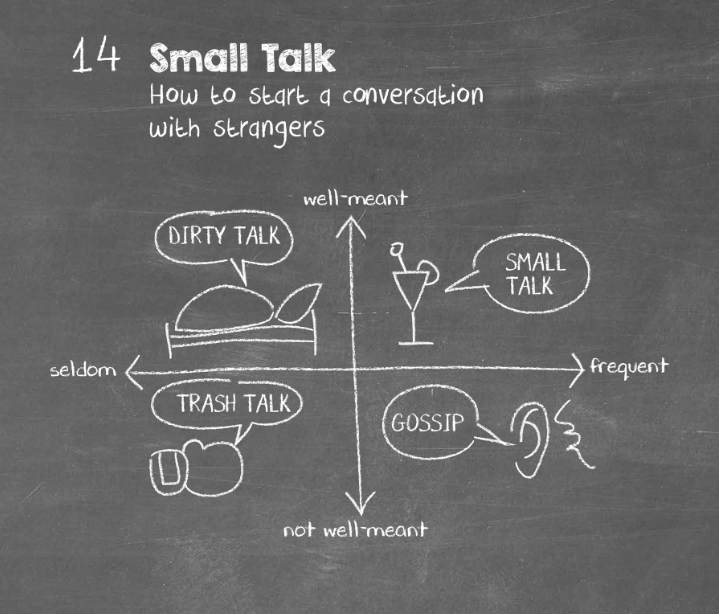
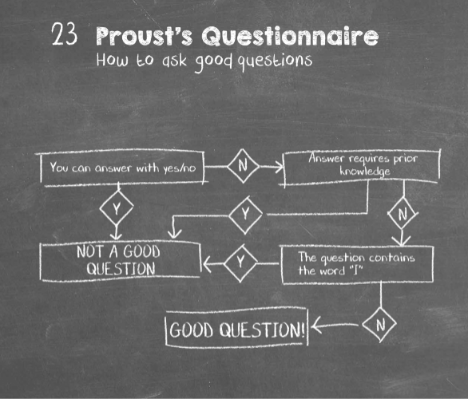

# take-aways

- Successful people are not always the smartest, most attractive or best educated.
- Often, they succeed because they know how to get along well.
- People respond to each other on a subconscious level. Research indicates that "as many as 10,000 units of information flow per second" between individuals.
- Numerous proven techniques can increase your attractiveness and dynamism.
- People learn everything they need to know about you within the first few seconds of meeting you. Meanwhile, you are also forming powerful first impressions.
- You send clear signals about how you feel without saying a word.
- "Fine-tune your smile."
- To make people feel great about you, focus your conversation on them.
- Many people are as frightened to make small talk as they appear on the stage.
- You will become a far more intelligent speaker if you simply find substitutes for a few "overworked words" such as "smart, nice, pretty or good."
- we consistently overestimate our ability to judge strangers
  - with the smallest glimmer of information, we judge people we don't know.
- we are incapable of spotting deception
  - we assume truthfulness until the evidence pointing toward deception is overwhelming.
  - Generally, observers believe that most people are telling the truth. To tip from suspicion to disbelief, observers need an absolutely clear trigger. This could be clear agitation, total avoidance of eye contact or someone struggling to find words when directly accused of cheating. Without that trigger, our suspicions remain just that, and we assume truthfulness.
- Some people are better at spotting deception, but assuming the truth is important for society to function.
  - We can celebrate perceptive skepticism, but for most of us, it doesn’t matter that we can’t spot lies. Defaulting to truth makes sense, and Bernie Madoff and Ana Montes are outliers.
- Life isn’t like an episode of Friends – what you see on people’s faces doesn’t tell the whole story.
  - Transparency is the idea that someone’s demeanour reveals an authentic picture of their feelings. It’s one of the primary expectations we have when judging strangers. The problem is that transparency is often completely misleading.
  - When strangers aren’t transparent, we easily and completely misjudge them.
  - some people simply aren’t transparent. They’re mismatched, or their demeanour doesn’t reflect what they’re thinking.
- Alcohol can make interactions between strangers far worse, with terrible consequences
  - And a murky situation gets even murkier when alcohol is involved. The author believes that alcohol causes people to become myopic. Alcohol makes us disproportionately focus on short-term wants and forget about long-term consequences. Normally, we maintain a balance between the two.
- There are some ways we can get better, and the best way to start is to stop making assumptions
- **Humans are ill-equipped to understand strangers. We assume that people tell the truth, so we can’t detect lies. And we believe that we can judge strangers based on little, usually deceptive, information. The result of this misplaced confidence is that we don’t invest enough time and patience in truly listening to and understanding each other.**
- evolutionary biologist Charles Darwin believed that similar, easily interpreted expressions – of joy, sadness, fear, surprise, and the like – were consistent for all peoples and cultures. These things are not consistent at all, which explains why people can’t accurately gauge strangers’ emotions or intent across – or even within – cultures
- **Circumstances, Conditions and Context**
  - Gladwell affirms that you must face the additional problem of context beyond your inability to read strangers’ emotions and your powerful bias to believe what they tell you. Where and when you meet a stranger, he emphasizes, matters.

## "Clever Hans, the Counting Horse"

- In Europe during the halcyon years before World War I, "Clever Hans, the counting horse," was, without a doubt, the most talked-about sensation on the continent. A brilliant entertainer with a unique act, Hans could somehow supply accurate answers to math questions that audience members posed to him. He quickly tapped out the correct answers to any problem – addition, subtraction, multiplication and division – with a hoof. The horse's owner, Herr von Osten, was always by his side while Hans performed these seemingly miraculous feats – but he never spoke to the horse or signalled him in any way.

- No one had ever seen such an amazing animal! Expanding beyond math, Hans "learned the alphabet." By tapping his hoof several times for each letter, he would answer questions from audience members concerning the latest news or subjects such as geography and history. Hans always answered every question correctly. Eventually, scientists and other leaders organized a special commission to investigate the "human horse." They asked von Osten to leave the hall for their test. Then, they had Hans perform his usual math and language wizardry in front of a crowd. But the horse still did not miss an answer, tapping out correct responses to numerous questions from the commission's leader. No one could stump the brainy Hans.

- The public insisted that investigators form another commission. Members organized a second test in which the questioner whispered questions in Hans's ear so no one else could hear. This time, Hans could not answer even a single question correctly. Instead of being brilliant, the horse was revealed as a dummkopf! Can you guess how the commission's members proved Hans was a fraud? Von Osten had taught the horse to read the audience members' "body-language signals." As Hans tapped his hoof, people in the audience would exhibit clear signs of tension – straining forward, holding their breath – until the horse reached the correct number. Then they would all relax, at which point von Osten had taught Hans to stop tapping immediately. Hans was "clever" – but not because he was a math genius or geography expert. He simply knew how to take cues for his actions from the subtle responses of the people around him. "Know your audience" is one of the primary rules of effective communications. Hans, the horse, was able to learn this important lesson. Can you?

## "How to Talk Like a VIP"
- You can always recognize important people by the commanding, intelligent way they speak. They have confidence, choose the proper words, and don't use clichés. Follow their lead:
  - **"Kill the quick 'me too!'"** – To impress, avoid immediately matching someone else's account of a personal experience or preference – say, a love of sailing – with your own story. Let your shared interest come out gracefully during the conversation.
  - **"Comm-YOU-nication"** – Slip the word "you" into your discourse as often as possible. This focuses the content on the other person and gains his or her attention and approval.
  - **Avoid euphemisms** – Always speak directly and to the point. The use of "nicey-nice" words makes you appear equivocal and weak.

## "How to Be an Insider in Any Crowd"
- To converse well with others, cure yourself of "Silent Outsider Syndrome." Use the special words and phrases that are common parlance to the people or group that you want to join:
  - **"Learn a little 'gobbledygook'"** – People will be impressed with you if you speak in terms they routinely use. Pick up the lingo by listening to others to find out what their special words and phrases mean so you can use them appropriately.
  - **Hit their "hot buttons"** – Each professional group has provocative issues – for example, doctors get feisty about their relationships with hospitals. Find out these issues, then mention them to spice up your exchanges.
  - **"Read their rags"** – The best way to gain inside knowledge about a specific field is to read the trade journals that report on it. An hour or two in the library can improve your conversational prowess.

## "How to Differentiate the Power of Praise from the Folly of Flattery"
- Back in the 1930s, Dale Carnegie extolled the virtues of praise in his classic bestseller How to Win Friends and Influence People. The power of praise is just as strong today, but praise that does not appear genuine is certain to backfire, so proceed carefully using these helpers:
  - **"Grapevine glory"** – To praise someone without seeming to be an apple-polisher, speak highly of that person, but not directly to him or her. Instead, voice your compliment to that person's closest friend or associate. Rest assured that the message will get delivered.
  - **"Accidental adulation"** – Sneak praise into an otherwise mundane sentence: "Because you are so knowledgeable concerning..., I'm sure you can set the agenda."
  - **"Killer compliments"** – Use them whenever you can. For example, you can say, "You are the most honest person I know."

## "How to Direct-Dial Their Hearts"
- You may look great, stand tall, dress in style and feel confident – but how do you project these qualities when you speak over the phone? Ensure that you:
  - **"Pump up the volume"** – When you speak over the phone, "turn your smiles into sound." Be animated and project a positive image through your tone of voice.
  - **"Name shower"** – Repeat the other person's name over and over. A person's name is their favourite word.
  - **"Oh wow, it's you"** – Always answer your calls in a professional way, then switch to a very sunny, happy demeanour as soon as the caller identifies themselves.

## "How to Work a Party Like a Politician Works a Room"
- Always put the "politician's six-point party checklist" to work when you attend a function:
  - **"Who will be there?"** – After all, that's why you're going, right?
  - **"When should I arrive?"** – The best advice is to get there early.
  - **"What should I take with me?"** – At a minimum, you'll need your business cards.
  - **"Why is the party being given?"** –Be sure and get the true reason.
  - **"Where is the collective mind?"** – Will it be a party of financiers or environmentalists?
  - **"How am I going to follow up?"** – Follow up to confirm the contacts you have made.

## "How to Break the Most Treacherous Glass Ceiling of All"
- Gaffes, intemperate or insensitive comments can kill any chance you have to get ahead. To avoid doing damage, keep these strategies in mind:
  - **"See no bloopers"** – Never comment on the "slips, fumbles and faux pas" of others.
  - **"Savor the favour"** – If someone offers to do a good deed on your behalf, wait a little before you try to collect it.
  - **"Chance encounters are for chitchat"** – You have been trying to schedule an appointment to speak to the boss about increasing your salary for weeks. But don't bring it up when you run into them in a checkout line. If you do, you'll never get the raise.

## six principles of persuasion

- **reciprocity** this is basically the old biblical principle *do unto others as you would have them do unto you.*
  - put into action: if you want to get something, give something. the right order is important: offer something first then ask for what you want 
  - t’s possible to use this principle of reciprocity by doing favors for others, helping people, publicly praising others and generally working in such a way as to build up a bank of social obligations owed to you. Each of these obligations will be settled at some point, probably to your advantage. Of course, if you’re too over the top with this type of behavior, it will cease to work.

- **Authority** we tend to follow the advice of experts. We have more Trust in a doctor who is wearing a white coat and displaying diplomas on their wall.
  - building trust and credibility is very important, but that it’s also possible to build some of that sense of authority through the recommendations and good words of others. It may be worth asking others to recommend you, or recommending others so that they feel a social obligation to recommend you in return.

- **consistency** we look up to people who are consistent in their words and behaviors.
  - From a persuasion and influence perspective, this means that if I can convince you to act in a minor way in relation to something, then you’ll think of yourself as that type of person and be more likely to act in that way again in the future. You’ll also be more likely to increase your actions in that direction,
  - *put into action*: don't follow every trend. Be the consistent one, people will remember you for that.

- **consensus** Humans are social by nature and generally feel that it’s important to conform to the norms of a social group. This means that when it comes to decision making, we often look around us to see what others are doing, before making our mind up.
  - *put into action:* if you want someone to do something, show others doing it ("People who brought this book also brough...")

- **scarcity** 
  - we all want that which is rare and we are all afraid to lose what we have 
  - put into action it might not be enough to talk about the benefits of your offer you also need to point out what people will lose if they fail to act. This also holds true if people face change they are usually scared of what they might lose therefore it's good to tell them what they will lose if they fail to move 
  - The less of something there is, the more people tend to want it. This holds true for experiences as well as for material products.
  - From a persuasion and influence perspective this means that to increase interest in your product or service, you may benefit from reducing its availability (or at least creating a sense of scarcity).

- **liking** this is the most universal principle people prefer to say yes to people they like but who do we like?
  - according to sealdini there are three factors 
    - we like people who are similar to us
    - we like people who compliment us 
    - we like people who cooperate with us towards a common goal 
  - "get in the habit of helping people out and don't say no big deal say of course; it's what partners do for each other' - label what happened an act of partnership"
  - you simply need to become liked by those around you and those you are looking to persuade or influence. You can do this by cooperating with others, by paying others genuine compliments and by identifying similarities and building relationships. They key here, though, is that you need to build these relationships and garner this “liking” before you try and influence others. If you try and become liked once you’ve started your efforts to influence, then those efforts will fail.

## two rules of meetings why meetings take so long

- according to Seth Godin there are only three kinds of meetings 
  - information a meeting in which the participants are informed about something whether they like it or not
  - discussion a meeting which aims to give input or direction or to receive feedback
  - permission a meeting in which one side proposes something in the hope that the other says yes (but has the right and the power to say no)

- what often makes meetings frustrating is the fact that different people might think it's a different kind of meeting

- here are some tips to make meetings run more smoothly the 15-minute rule
  - Parkinson's law states that *work expands so as to fill the time available for it's completion* and not according to how complex it really is there for it makes sense to limit the time of meetings incidentally studies show that the attention span of the average person is between 10 and 18 minutes ideally you should use a timer when it rings the meeting is over immediately

- the question rule there are three types of question that you can ask in a meeting 
  - first comprehension questions 
  - second questions to support the process for example to make sure that everyone has really understood everything and is talking about the same thing and 
  - third questions that show how much you know in order to underscore your own position or challenge another person

  - all three types of question are legitimate but they should not be mixed, first come comprehension questions, then questions about the process then debate questions 

- the standing rule in many companies meetings are held with everybody standing up because it leads to decisions being reached more quickly, Washington University studies showed that when they are standing people react more readily with enthusiasm whereas when they are sitting they tend towards skepticism
- smartphone rule: no smartphones during the meeting
- notes should be made by hand.
- if you want to call a family meeting just turn off the Wi-Fi router and wait in the room where it is located 

## boss talk how to talk to your team

- rules one don't criticize
  - this might sound a bit too easy going and of course you have to evaluate the work of your employees that's your job but go easy on the criticism
  - only start deconstructing if you're prepared to help with the rebuilding 
  - keep using "we" especially when your team has lost 

- give praise but not too much
  - go easy on the compliments otherwise they lose their effect 
  - if you celebrate behavior that you expect you are lowering standards 
  - whatever you do don't give praise simply to please 

- practice what you preach
  - pick your battles only set standards that are important to you or that you consider to be generally important you ought to be good at upholding standards that are important to you 
  - and if there are standards that you regard as important but find hard to uphold then you need to learn them yourself share this with your employees nobody can be good at everything
  - as a leader get used to the idea that you are primarily responsible for the supply of energy, in other words motivating advising stabilizing providing momentum and letting others shine 

## four the salami tactic how to carry through every idea 

- meetings are known to reveal a person's character generally speaking there are four personality types and meetings 
  - one the silent type says nothing is thereby usually proven right and always thinks he or she knows better 
  - two the opportunist is enthusiastic about every suggestion especially those made or favored by the boss 
  - the master of the obvious announces the obvious with great conviction as if he or she had just thought it up
  - the naysayers and their purpose in life seems to be to pull apart other people's suggestions 
  
- how can you get a suggestion past these hellhounds 
  - the salami tactic: do not put your suggestion forward all in one go but serve it in small easily digestible slices Instead
    - This portioning method has two advantages first the fear of a huge task or bold idea is reduced, second a measured presentation allows the other participants to explore the idea themselves and think it through further and above all this tactic does not allow the other participants to recognize your overarching intention. This makes it harder to fight against it
    - if there are ideological riffs, it is better to take small isolated steps than concentrate on the matter at hand not on the intended outcome 
    - and what do you do if someone tries to Salama
      - you simply ask "is that everything" 
      - keep on asking until everything is on the table only then start negotiating 

## five theory of rhetoric how to make a good speech in his definitive work rhetoric

- Aristotle wrote that a good speaker has to have three things under control the argument logos the presentation ethos and the audience pathos
- in Aristotle's day there were only three different types of rhetoric 
  - the first was judicial rhetoric which dealt primarily with past events then there was epideactic rhetoric which typically celebrated a person in the present a typical example is a eulogy which Aristotle wrote addresses the mourners rather than the Dead and finally there was deliberative rhetoric such as political oratory in which the speaker attempted to persuade the audience to carry out a certain action in the near future

- Aristotle and later the Roman Cicero and quintillion established a complex five-point plan for writing brilliant speeches which essentially boils down to this 
  - everything Aristotle considered rhetoric not as a tool to convince the audience but as an art form to help present a persuasive argument
- below are six rhetorical tools
  - **anaphora repetition** of a word or phrase typical in political speeches 
    - i.e.: I demand Justice I demand understanding I demand 
    - **inversion** reversing the usual word order such as an "infinite is his sorrow" instead of his sorrow is infinite 
  - **irony** saying one thing when you really mean the opposite, i.e: really enjoyed being stuck in that traffic jam
  - **rhetorical questions** questions that make a statement
    - i.e.: would you like shiny glossy hair?
  - **analogies** (comparison)
    - i.e.: he stood there like a dying duck in a thunderstorm (banal) or he was as confused as a comma at the end of a sentence (creative)
  - **antithesis** a contrasting thought to produce tension, i.e.: he was beautiful strong and unhappy
  - read through your text aloud several times 
    - one full sheet of A4 is about four minutes of presentation
  - remember to integrate pauses look at your audience, breathe deeply.
  - a good speech is one that induces the listeners to change their minds while giving them the feeling that this change of opinion is their own decision 

## storytelling how to make the most boring lecture exciting

- classic fairly tales follow a particular sequence:
  - **abstract**: how does it begin? ("once upon a time...")
  - **orientation:** who/where/when? (" A king and queen had a daughter")
  - **complicating action:** the problem to be solved ("but all around castle, a hedge of thorns started to grow...")
  - **resolution:** solution ("then he stopped and kissed the sleeping beauty. And she opened her eyes....")
  - **evaluation:** what results from it? ("And they lived happily ever after")
  - **coda:** what remains ("And the moral of the story...")

- Aristotle see theory of rhetoric was already aware of the importance of emotion and speech making and in 1984 the communication researcher Walter Fisher came up with a radical thesis people do not want logical arguments they want good stories
- our life is not an Excel spreadsheet it is a story with ups and downs
- Fisher's idea is summed up in his famous narrative Paradigm which represents a break with classical rhetoric we do not evaluate a story on the basis of arguments but on the basis of how much we trust or believe in the story (can I identify with the subject or the people) and its coherence (does the story make sense.)
- Chris Anderson the inventor of Ted says something similar about the three rules for a perfect Ted Talk 
  - 1. don't talk about a concept or deficiency or a product, talk about an idea
  - 2. focus on just one idea
  - 3. talk about the idea in such a way that people will want to tell others about it 
  - the next time you have to say something in front of other people start your talk with this sentence: let me tell you a short story or on the way here something strange happened to me 

## principal negotiation how to reach an agreement 

- negotiation is the Fine Art of finding a solution to an apparently impossible situation 
- one of the best known negotiating methods principled negotiation is based on the book getting to yes by Roger Fisher and William L Yuri 
- think about a complex situation negotiating your salary with your boss pocket money with your children a ransom demanded by a blackmailer and try to apply the following principles to the situation
  - **thing not person** do not be distracted by whether you like the other person or not
  - **similarities, not differences** don't think I am in the weaker (or stronger) negotiating position ask yourself *what does the other person need from me*? *do we have common interests*?
  - good enough not perfect you should not be aiming for the maximum possible, because Perfection is like the Unicorn it's rumored to exist but nobody has ever seen it 
  - have a plan B prepared before negotiations even start. This is called the BATNA principle (best alternative to a negotiated agreement) it offers the best alternative when an agreement can't be reached 
  - there are two schools of thought when it comes to negotiation 
    - the first believes that you have to negotiate "hard" and "conquer" the other side (it's not enough to win someone has to lose) the other recommends negotiating softly in order not to put a strain on the relationship
    - principal negotiation falls into the second camp and recommends Cooperative negotiation. Negotiating properly means that everyone gets more than they originally hoped for 
    - you must never try to make all the money that's in a deal let the other fellow make some money too because if you have a reputation for always making all the money, you won't have many deals

## the feedback method how to criticize

- feedback is one of the most sensitive processes in communication, it is easy to hurt people with criticism but false Compliments are also unhelpful harsh criticism damages our self-esteem and can lead us to make unwise choices but flowery compliments often make us too complacent 
- as for the person giving the feedback most people are prone to being critical as it gives them a feeling of superiority they feel like they need to crush bad or weird ideas 
- feedback can be analyzed along two axes it can be negative or positive and constructive or destructive. So this gives us four different types of feedback 
  - **"no" - negative destructive feedback** you are simply told the idea is bad without being given an explanation or offered an alternative while this can be at times an effective feedback that seldom changes the behavior of the receiver 
  - **"no because..." - negative constructive feedback** you are told you are wrong and then you are presented with the correct answer this is how Old School teaching works 
  - **"yeah, but..." - positive destructive feedback** most managers have sooner or later heard about the importance of giving positive feedback so they start off by saying something positive about your idea just to deconstructed afterwards and offer a contrary opinion ("the idea is good, but...")
  - "**yes and..." - the appreciative response** tried to find the one thing in The Proposal that works and build on that 
    - this goes back to appreciative inquiry a method attributed to an American David cooperider that involves concentrating on the strengths positive attributes and potential of a company or a person rather than weaknesses according to this Theory focusing too strongly on the flaws of an idea or project stifles the open and positive approach that is essential for good working practices

- *careful* of course we sometimes have to deliver crystal clear or even harsh feedback but the point is people learn better if they are offered constructive feedback. We know this from brainstorming sessions where the flow and fun increase, the more positive The Exchange.
  - collaboration it seems dies when the response is negative and ideas are killed before they are explored

- **whenever you are about to give feedback ask yourself how can I make this idea better rather than why is this idea bad **

##  groupthink what happens when everyone has the same opinion

- Janice called the phenomenon that occurs when the desire for group consensus is stronger than the urge to express an unpopular opinion "group think". if this happens the group is at risk of making very poor decisions and even more if many people are too sure of the same thing they become radical and imprudent
  - researchers have observed this phenomenon among jury members: the greater the consensus the harsher the judgment and the surer the jury is that its verdict is correct 
- groupthink occur typically when there is
  - High group cohesiveness 
  - high pressure to make a good decision
  - strong persuasive directive leadership 
- how can we avoid groupthink 
  - "give a high priority to airing objections and doubts" in other words encourage all group members to speak their mind even and especially if the opinion is unpopular 
  - divide your team into two informed competing teams to study the same problem compare results 
  - **when all think alike no one is thinking - Walter lippman **

## the power method when the Force is with you

- warning even if you prefer to convince people with good arguments rather than by mean tactics you should know these tricks because they are bound to be used against you
- **never argue hesitantly**
  - if you are unsure about something try not to show it to others. Doubt and hesitation will only dilute your arguments, your adversary will see an opportunity to pounce
- so only speak up when you're sure you want to follow through your argument and stand your ground even if your plan is flawed 
- we forgive bold people their mistakes, but have no confidence in doubters.

- **talk less**
  - you should not try to convince the other person by talking a lot 
  - the more you talk, the more interchangeable and ordinary your arguments seem 
  - every Triumph that you achieve through words is in reality a pyrrhic Victory, because nobody likes to be argued into a corner

- **act ignorant**
  - we tend to be dazzled by intelligence and charisma, try the opposite: make your adversary feel clever he or she will be flattered and become inattentive. When your opponent's guard drops you can attack
  - acting stupid is one of the oldest stratagems around as they say in China masquerade as a pig to kill the Tiger 

- **give up** 
  - if you can't convince somebody, reassess your own situation: what will it cost me if I give up now 
  - a smiling confession of your own defeat comes across as more self-assured than sullenness and what's more the less interests you show, the less satisfied your adversary will feel

## Intercultural communication how to negotiate abroad

- the more you get to know a culture the more black and white turns to Gray
- in order to get to grips with a culture it is not enough to master the language as cultural idiosyncrasies are more apparent in the way we communicate then in what we communicate. 
- three main cultural types: the linear active, the multi-active and the reactive 
  - 1. **the linear active** who include most of Western Europe and the USA talk about as much as they listen, have fairly restrained body language, are polite but direct like to deal in facts, and place value on the written word. They don't do two things at once 
  - 2. **the multi-active** such as Mediterraneans or Saudi Arabians are loquacious, gesticulate a lot, are emotional, juggle with facts, place value on the spoken word and do many things at the same time.
  - 3. **the reactive** such as the Japanese Chinese and Koreans speak less and try to get their counterpart to speak first they have very subtle body language
    - are courteous and indirect 
    - are non-confrontational and place value on face-to-face communication
- but contrary to what our schematic categorization might suggest there are no pure alignments, only spectrums. Indians for example are hybrid they are both reactive and multi-active. Canada is on the borderline between linear active and reactive
- **linear active: if you're intrigued by the questions "what? when? how many?**
- **multi-active**: if you're intrigued by "how" people communicate and relate to each other
- **reactive** if you're convinced by who says it and their experience and authority

## self-talk how to (de)motivate ourselves

- there are two kinds of self-talk
  - the first is the unself-conscious Babbling of little children as they play or the thinking aloud of contestants in TV shows such as Who Wants to Be a Millionaire? These types of inner monologue were called "egocentric speech" by the developmental psychologist Gene Piaget. he believed they were a **sign of cognitive immaturity**. Today we know that thinking aloud is an excellent method for ordering our thoughts and improving concentration
  - the second type of self-talk is the inner dialogue we comment on our own behavior in a similar way to a sports commentator reporting on events during a football match the only difference being that the footballers can't hear the comments, whereas we constantly have our internal moderator in our year. In the field of psychology this is considered to be a healthy form of self-evaluation. However a distinction is made between positive and negative self-talk 
- negative self-talk typically contains one of these thoughts
  - **generalization**: I have already been left twice people will always leave me
  - **rash conclusions:** why doesn't she call I think she doesn't like me
  - **self-blame:** I should have done differently or I'm a bad father
- positive self-talk is about breaking through the above negative patterns of thought it's not about convincing yourself that life is great but rather about freeing yourself from a cycle of negative thinking for example if you say "I'll never manage it," ask yourself instead: "what can I do in order to manage it?"
- in a nutshell self-talk serves two different functions first concentration and second motivation
- *talking to myself is the only way I can be sure of intelligent conversation - Edmund Blackadder *

## active listening how we are (not always) all ears 
- paradoxically in our age of constant communication the raw material of conversation has actually disappeared: listening. Genuine real listening is a rare commodity and a great gift, because you are giving to the person you are listening to your most valuable asset your attention 

- **listen don't talk** 
  - the radio host Celeste Hadley put "it brilliantly in a tedx speech if they're talking about having lost a family member don't start talking about the time you lost a family member if they're talking about the trouble they're having at work don't tell them about how much you hate your job it's not the same it's never the same all experiences are individual and more importantly **it's not about you**

- **don't finish the other persons...** 
  - some people have a tendency of impatiently finishing the sentence or thought of the person they are talking to. Although very slow thinking and talking can be irritating don't interrupt even if you think it might show empathy

- **your body language says a lot**
  - look the other person in the eye but don't stare. Nod - but only if you want to agree with what they are saying or show that you have understood something important

- **notice the little things** 
  - listen out for details and what they are saying and pick up on these later. This makes it easier to ask questions ("you mentioned that you spent a lot of time as a child at your Grandmother's what kind of relationship did you have with her?"). And it lets the other person know that you were really listening 

- **be a friend not a judge**
  - resist the impulse of giving the other person advice - unless of course they specifically ask for it. instead, take the conversation back to an exciting important part of the story: "Earlier, you said that..." 
  - take the person away from the smooth surface to deeper levels: "how was it for you when you...?" or encourage the person to keep talking by simply asking: "and what happen next?"

- **the most romantic gift to listen to another's anxieties for one hour without judgment or Solutions as an analyst might - Alain de bottan **

## small talk - how to start a conversation with strangers 

- 

- **ask for advice**
  - people love giving advice so start your small talk with the request for advice "I want to buy a smartphone or a cocktail or a book but I can't decide which one". Most people will happily open up then thank them for the tip and the other person will feel like a fireman who has successfully extinguished a fire
  - the psychology behind this if you ask for advice you create intimacy intimacy makes rejection difficult

- **ask a second question**
  - we often ask something and then wait for the other person to ask something back this is not a conversation instead use the old reporter trick and ask a second question if you just asked "where did you grow up?" then a good follow-up question might be "how has that place shaped you" 

- don't ask what do you do for a living?
  - there are two kinds of people those who like to talk about their job and go on and on about it and those who are ashamed of their job hate it or don't have one the latter are reluctant to talk about this topic the author Gretchen Rubin suggests this simple but powerful tweak to the usual "what do you do for a living?" job question: "what's keeping you busy these days" now the other person can choose what to talk about 

- **don't start a conversation about things that interest you**
  - most people like to talk about themselves this leads to us not listening any more but simply waiting for our turn to speak but a conversation is not a PowerPoint presentation don't pitch your topics rather be the one person in the group who is interested in the other person's topics as Bill Nye put it everyone you'll ever meet knows something that you don't 

- **listen** 
  - the way people deal with you depends on how you present yourself: arrogant, worldly wise or dull posturing brings out the same behavior in your
counterpart the Supreme rule when making small talk comes from the radio host Celeste Hedley **enter every conversation assuming that you have something to learn** 
  - **people forget what they talked about with you but not how they felt in your presence **
  - **we have two ears and only one mouth so that we can listen twice as much as we speak Epictetus**

### Teach Yourself to Become Charming and Attractive

- The most accomplished public speakers, actors, politicians and salespeople were not born charismatic. They worked hard to learn how to speak effectively, be appealing, and charm and persuade others. How did they achieve their goals? The answer is simple: They each applied certain remarkably helpful rules of personal communication and, thus, developed themselves into winning and attractive personalities. Yes, such rules exist. Furthermore, they are easy to learn and employ. You can use these secrets and tricks to re-create yourself almost magically into a person of great charm and poise and someone everyone will admire and want to be near.

### "How to Intrigue Everyone Without Saying a Word"
- First impressions are the most lasting. "The way you look and the way you move" provide 80% of the information people use to form their initial impressions of you. To make sure people get an overwhelmingly positive impression when they first meet you, use the following tips:
  - **Smile slowly** – Don't smile as soon as you meet someone. People will assume that you do this with everyone. Instead, wait a second or two, look long and deep at the person you are meeting, then smile big. This brief delay signals that you are not smiling because it is socially desirable, but because you see something special in this particular person that you really like.
  - **"Sticky eyes"** – Show people that you truly can't take your eyes off of them. Maintain perfect eye contact while you speak with them.
  - **"The big baby pivot"** – When you meet someone, pivot directly toward him or her with a "total-body turn," flash a genuine smile, and show the undivided and very special attention you would give to a young child who has just crawled up into your lap.

### "How to Know What to Say After You Say, 'Hi'"
- Many people, including senior executives, motivational speakers and great performers, hate to make small talk. But it is an art that you can easily muster if you follow these tactics:
  - **The "mood match"** – Don't speak with someone else until you first sample his or her mood. Once you have, ensure that your opening words "match that mood." This is particularly important for salespeople.
  - **"Wear a 'whatzit'"** – Starting a conversation with a stranger is not easy. One way to get the ball rolling is to wear something distinctive that he or she is sure to comment upon – a novel tie-tack, a piece of antique jewelry, or a special lapel pin or button.
  - **The "swivelling spotlight"** – People love to speak about themselves. Imagine a giant spotlight that rotates to light up your counterpart. Keep the spotlight – and focus – on that person and not yourself. He or she will think you are great for doing so.

### "How to Sound Like You're Peas in a Pod"

- Generally, people are more comfortable with those with similar values or interests. Your job is to provoke "sensations of similarity" in the thoughts of those you want to get to know:
  - **"Join the movement"** – Does your conversational partner make herky-jerky movements or languid and graceful ones? Subtly match that person's movements to make him, or her feel more comfortable with you on a subliminal basis. But don't go overboard, or you are almost sure to offend.
  - **"Echoing"** – What special words and phrases does your conversational partner use to describe something? "Echo" your partner and use those words yourself.
  - **"The premature 'we'"** – When you pepper your sentences with the word "we," you establish a subconscious bond with other people involved.

## the iceberg model - what happens below the surface

- we could say that divisible conscious part of a discussion is the **factual level** (what we say or what we talk about) while the **unconscious part** is the interpersonal level (how we say it and what we really mean) see [lasswells communication model](#lasswells-communication-model---how-to-recognize-fake-news) and [what's the exaxium theory](#watzlawicks-axiom-theory---how-relationships-fail) this means we can control the factual, level we can select our words consciously but our gestures facial expression and tone of voice will betray our unconscious secret hopes, repressed conflicts, traumatic experiences ,base motives, and animal instincts, and appeal to the other person's unconscious. The interpersonal level decides how we will be perceived and how we perceive others 
- the more we know about another person's values patterns of behavior motives in other words the more we see of the iceberg the better we can understand the person's words and actions. 
- The best way to lower the water line of your opponent or partner is to show more of yourself if you for example want someone to admit something start by talking honestly about your own mistakes 
- **fear and hope are alike underneath - Richard Ford**

## the spiral of Silence why we don't dare State our opinion 

- German social scientist Elisabeth Noelle-Neumann hypothesis: the willingness of people to voice there opinion in public dwindles in situations where they believe that the majority opinion is different from their own. in other words we do not like to be of a different opinion to others if we notice that the group majority has a different opinion to ours we remain silent this phenomenon is called the spiral of silence and can be explained by these six points of which the last two are arguably the most important:
- most people have a fear of isolation and observe the behavior of others to assess which opinions will be accepted or rejected We Fear isolation more than being wrong wrote Alexis de Taco in the 19th century
- we exert pressure on each other we pull a face roll our eyes or turn away when someone says something that does not comply with the prevailing opinion
- fear of isolation and a pressure to conform occur unconsciously we do not think about the extent to which we are Guided by public opinion 
- we tend to conceal our opinion if we think that it will expose us to group pressure. If we feel public support, however, we tend to express our opinion loudly and clearly
- if consensus on a subject prevails in a group, it is unlikely that a spiral of silence will begin
- the number of people who share an opinion is not necessarily significant a minority opinion can appear to be a majority opinion if it's proponents appear confident enough and represent their opinion in public forcefully 

- **we become quieter if we believe that we are in the minority**

## the speech act Theory - how words can trigger actions

- in day-to-day life we distinguish between doing and talking but there is in fact no difference. speaking is also an action.
- The Thesis: sentences have a propositional meaning (this is the information contained in the sentence), which can be "true" or "false" but sentences also have an elocutionary meaning. This means that we are doing something when we speak including something essential ("doing something in saying something"). Examples include requests, warnings, threats, recommendations. Such an elocution can succeed or fail - 
for example if you don't take the speaker seriously, the act of speaking has failed. Then there is a third dimension the persecution. Here it is about the extent to which whatever was said has consequences - so whether the person being addressed acts on what is said or has a change of mind because of it ("doing something by saying something")

- The speech Act Theory explained in two sentences "what do we do when we speak" and "what impact do we have when we speak?"

## the social judgment Theory - which of our opinions never change

- a question that continues to preoccupy researchers into communication is this **when do people allow themselves to be persuaded about something? and when not?** **why is it that some of our attitudes are deeply ingrained and not up for discussion?** (e.g.: allegiance to a particular football club) **while we change others at the drop of a hat?** (favorite TV series for example )
- an explanation is offered by the **social judgment Theory** according to this Theory there are three factors that play a role in persuading us to change our opinion 
  - **The Anchor Point** this is our basic preferred attitude this attitude is hard to budge and we are unlikely to change it regardless of what information we are given so for example if we were to discover that the players of our favorite football team were manipulating games we might be shocked but it wouldn't put an end to our long love affair 
  - **room for maneuver** here it is about which alternative attitudes we find acceptable regardless of Our Own. These are attitudes that we can accept without having to hoist our anchor. This approach can lead to a change of opinion in the long term
  - **ego involvement** the most complicated part what does our ego have to say? take the death penalty for example which clearly contradicts the Anchor Point "human rights", leaving little room for maneuver. But it is conceivable that if we were personally affected by a murder we might feel vengeful towards the perpetrator and change our mind at least briefly 

- the stronger our anchor, i.e., our firm position on an issue, the harder it is to be persuaded by a different opinion. The stronger you pull at another person's anchor the stronger their resistance. (How can you can succeed anyway [see six principles of persuasion](#six-principles-of-persuasion))

- **if you can't change your mind, then you're not using it **

## the story Matrix - how to apologize properly so that the other person forgives and forgets

- **use I sentences**
  - apologizing means taking on full responsibility for something sentences like I'm sorry that your feelings were hurt or I'm sorry that you're so angry should be avoided because what you're implying is it doesn't have anything to do with me that your feelings are hurt say it like it is I'm sorry that I hurt your feelings. According to the research a person is most likely to forgive and forget if you admit full responsibility for what you did 

- **don't justify your actions**
  - it is a natural reflex to try to justify your own actions but also an idiotic one. Because a justification is an effective denial of the apology the following sentences are particularly counterproductive: **"come on it wasn't that bad"** or **"I can't help it"** the injured person will be more inclined to forgive if you come up with a reason rather than a justification try to explain your action without being defensive. Most effective of all iron explanation and an admission of guilt combined

- **avoid but sentences**
  - an apology in which the word but crops up is almost never understood as an apology but as an excuse
avoid at all costs

- don't ask for forgiveness 
  - asking for forgiveness is rarely effective. Nobody likes to Grant absolution
- **change yourself**
  - even the most honest apology is worthless if you repeat the same mistake three times. Making an apology is above all a commitment to making a change in an offer to make amends 

- **when it comes to apologies keep in mind there are only two ways you can apologize begrudgingly or sincerely, choose the latter**

## White Lies - how to answer the question how do I look

- the truth is, all people lie. In certain situations - such as when we are under pressure, have to justify ourselves, or want to make a good impression - we tend more towards fibbing and telling Tales than when we feel relaxed and self-secure. But, from an ethical point of view not every lie is bad. You might for example lie in order to protect someone. In communication Theory lies fall into two categories: "do I benefit from the lie" or "does the person I lied to benefit?" This results in four different outcomes 
- **white lie - only the person lied to benefits** this is a fine selfless lie which you risk potential loss to help someone out here you typically put yourself in the position of the person and for example Defender existence of Santa Claus and the knowledge that the LIE will be exposed in due time this altruistic lie gives us a good feeling 
- **gray lie both the liar and the person lied to benefit** "you've lost weight" gray lies are often part of cultural norms. In many situations when you ask "how are you?" you expect a lie in response "thank you things are great"
- **black lie only the liar benefits** although you are guilty you reject all accusations: "no I didn't take the money" it is often also a bold promise a proactive lie if "I am elected I will never raise taxes..." Here bare-faced lying is used to your own advantage
- **red lie no one benefits** saying something with complete awareness that the other person knows the statement to be false, even if you
sometimes end up also inflicting damage on yourself the "largest audience ever to witness in inauguration"
- **if you tell the truth you don't have to remember anything - Mark Twain**

## the six-word rule - how to sum up a whole life in six words

- Hemmingway wrote novel in 6 words: "For sale, baby shoes, never worn"
- "Can you tell your life story in six words?"
- George Saunders summed life up beautifully: "started small, grew, peaked, shrunk, vanished"
- The six word rule is not a rejection of sprawling, convoluted sentences or endless digressions, but before writing (or speaking), you should ask yourself these questions: what do I really want to say and can I say it more succinctly?
- **if it's important, keep it short**

## watzlawick's axiom theory - how relationships fail 

an axiom is a valid truth that needs no proof at the end of
the 1960s the communication theorist Paul waslowick together with other
researchers came up with five axioms to explain how interpersonal communication
especially in relationships fails 
- **you cannot not communicate a man**
  - comes home sits down stares into space and is silent his wife looks at him and asks him how he is he says nothing and yet he communicates something it is immediately clear that something must have happened even if you say nothing you are saying something 

- **all communication has a relationship aspect and a Content aspect**
  - the content aspect is *what we say*, the relationship aspect *includes how we say things* but also *who says something* [see Schultz fontans communication model](#schultz-von-thuns-communication-model---why-we-should-talk-to-each-other-about-how-we-talk-to-each-other), **who says something and how it is said always way heavier than what is said**. *if we are offended by a complete stranger it affects us less than if our partner offends us*
  - also keep in mind Albert Moravian **7% 38% 55% rule**, if we are talking to someone about our feelings this is the impact our words, tone of voice and body language have: **our words are 7% our tone of voice 38% and our body language 55% responsible for whether that person likes us**

- **communication is always about cause and effect**
  - a woman is annoyed because her partner is grumbling the man is grumbling because the woman is annoyed in other words we sell them quarrel with ourselves, **it will always take two to tango** 

- **human communication makes use of analog and digital modalities**
  - in Watson's terms digital means verbally and analog means non-verbally, in other words eye rolling, a smug smile, ambiguous intonation. If the two levels do not correlate then we're not on the same page

- **communication is symmetric or complementary**
  - relationships between partners are either symmetrical (equal) or complementary (unequal)
  - symmetric means that we talk at eye level (in the relationship) in the relationship complementary means that there is a kind of hierarchy (for example between teacher and pupil). If we do not agree whether the communication is complementary or symmetrical it becomes problematic

- **everyone hears what you say friends listen to what you say best friends listen to what you don't say** 

## proust's questionnaire how to ask good questions

- 

- the explanation for this is simple and truthful and can be summed up with this rule: we do not appreciate those who are brilliant but those who make us feel brilliant but because 
- it is extremely difficult to ask the right question in the right situation a small crib sheet soon circulated around European salons it consisted of questions that seemed innocent but which beared the soul such as *who would you prefer to be?* *how would you like to die?* and *which characteristics do you most appreciate in a man?*
- Proust's questions have three key qualities
  - they are open questions that you  cannot answer with yes or no
  - the questions require no prior knowledge, in other words there are no right or wrong answers only honest ones 
  - three they are questions that Center on your counterpart rather than on you.

- *we all admire people who give good answers but we admire those who ask good questions even more. The people we remember most are the ones who really listen*

## non-violent communication why we find it difficult to be friendly

- language of the Jackal causes the speaker to feel Superior and the person being addressed to feel bad typical examples of Jackal language:
  - **analysis** "that's wrong because..."
  - **criticism**: the mistake you made was that you...
  - **interpretations** you do that because...
  - **appraisals** your smart/lazy, you're right/wrong...
  - **threats** if you don't do it immediately I'll have to...

- according to Rosenberg statements like these are **"desires and disguise"** because we have not learned to ask for something politely or to express our wishes constructively we resort to aggressive language and aggression leads to counter-aggression or submissive subjugation 

- giraffe language on the other hand works like this:
  - observe without evaluating: "you always look out of the window when I want to talk to you"
  - acknowledge and Define your own or others feelings: "I'm worried"
  - acknowledge needs and take them seriously: "I want to know how you are doing"
  - Express clear and achievable objectives based on these needs: "please tell me what you need so that we can talk about it"

- we are by Nature prone to pass judgment, and what's more, it is easier to blame someone else than to think about *why something happened*

- the essence of normal communication we all like to be right the essence of non-violent communication we are better off if we resolve a dispute then if we win it or in the words of Marshall Rosenberg: *would you rather be right... or happy...?*

## The Cooperative principle - how we should express ourselves in order to be understood 

- people's three biggest fears loving someone without being loved in return; searching for friends and not finding any; saying something and not being understood
- British philosopher Paul Grice 1913-88 dedicated his life to the third problem and in 1975 finally formulated the so-called Cooperative principle a basic rule for effective communication:
  - "make your conversational contributions such as is required at the stage at which it occurs by the accepted purpose or direction of the talk exchange in which you are engaged"
- Grace proposed 4 conversational maxims
  - **maxim of quantity: say enough for your counterpart to understand but don't say too much or you will cause confusion**
  - **maximum quality tell the truth don't speculate don't dupe the person into believing something different**
  - **maximum of relevance don't say anything irrelevant don't change the subject**
  - **maximum of manner avoid ambiguity vagueness verbosity and volatility and stick to a logical argument**

- if we follow these maxims then as a general rule we will be understood but what happens if we don't follow them which is the case in most of our conversations
  - we can violate the maxims without being noticed that's called "lying" ("did you wreck the car?" "no I didn't") - although you did 
  - we can violate the maxims deliberately by saying something else but Expecting The Listener to understand the message correctly that's called "flouting" (a typical form is irony you look out of the window to see the storm intensify you then turn to your friend and say what wonderful weather)
  - we can refrain from cooperation that's called "opting out" (if you say "my lips are sealed", this implies you know something but won't talk about it and this will end all communication)
- **only say what is true and important and express it clearly and simply**

## the expectancy violations Theory how much distance we keep from other people

- according to burgoon the following rules apply in the Western World with regard to keeping our distance
  - **intimate space (Elbow Room)** up to 20 inches. within this space we expect to be touched by the other person it is reserved for close family lovers and pets 
  - **personal space** 20-50 inches. The typical distance we keep from somebody we are talking to
  - **social space** 40-140 inches. The distance we keep from people we do not know, with whom we do not communicate but whom we have nothing against
  - **public space** 140 inches or more. This distance is best explained if we ask ourselves which people do we avoid?

- of course it is not only about distance but also about physical and I contact. if someone turns away from us while we are speaking it violates our expectations of the conversation. this is most easily observed in romantic relationships where the usage of smartphones and social media is for many a strong sign of divided attention and a source for trouble

- the distance we keep is also influenced by cultural and situational norms. Different distance rules apply to dancing in a club and studying in a Library. In Switzerland, people greet one another with three little kisses, in the USA, this would be regarded as too close for comfort

- *When in Rome do as the Romans do*

## Schultz von thun's communication model - why we should talk to each other about how we talk to each other

- according to Thun every message has four layers:
  - **content** what I am informing myself about 
  - **appeal** what I want to achieve
  - **relationship** my relationship to the receiver
  - **self-disclosure** what I show of myself

- the way we understand messages is determined by the sender's end receiver's previous history, the context, the tone and many other nonverbal
signals. How can we solve misunderstandings? by talking to each other about how to talk to each other, in other words, by practicing "meta communication." Because good communication occurs when intention end understanding are in harmony

- what is thought is not always said; what is said is not always heard; what is heard is not always understood; what is understood is not always agreed; what is agreed is not always done; what is done is not always done again - Konrad Lorenz 

## second order observation - how your therapist talks to you

what does your therapist do when talking to you
he or she makes a so-called second order observation A first order Observer sees
the world as it appears to him or her the world is simply there the second order Observer however
ascribes what the first order Observer sees to how it is seen important we cannot observe
ourselves observing which is also why therapists can't treat themselves this is often referred to as the blind
spot in other words we are unaware of the way in which we observe we cannot see that
we cannot see so by identifying someone's blind spot the
second order Observer might open up A New Perspective and make that person aware for example of the fact that
he or she could just as easily see something differently an example a couple want to move in
together but she has one of those flats that you simply wouldn't want to give up a great location low rent a
big balcony and the flat would be big enough for two he hesitates
because he feels that he would be intruding and that it would still feel like her flat they cannot afford a new flat
for the two of them she sees only the potential advantages of her flat he
sees only the potential disadvantages both are first order observers and are
talking at Cross purposes a second order Observer could give them another perspective the couple
could move into the woman's flat but on the condition that it becomes a shared flat that they move into as if it
were new this means she has to First move out of her flat before the two of
them move and then refurbish it despite the fact that most people constantly think about themselves it is
impossible to observe yourself while doing or thinking something we can
only train ourselves to be more aware of moments when we act or think according to old and bad habits but in
order to recognize these patterns we need a second Observer we can't see that we are seeing
something 

## transactional analysis - which I do you use to communicate

here are two of the greatest interpreters of human communication Sigmund Freud
1856-1939 the founder of psychoanalysis believed that hidden pleasures and fears
from our childhood are the motivation behind our communication problems the psychiatrist Eric Byrne
1910-70 however believed that you do not have to go on a painful journey into
your past to get to know yourself it is enough to observe yourself in communication with others in 1964 Byrne
proposed in his book games people play a counter model to Freud's theory a book which due to its
Simplicity and Clarity became a bestseller in the genre of communication and self-help books
according to burn it all starts with the three ego States we adopt in relation to others
1. the parent-ego state we all are a little like our parents this is evident
when we patronize others or tell them what they should or should not do but also when we act thoughtfully
empathically or helpfully 2. the adult ego State we act like
adults when we communicate in a considered controlled and relaxed way
in other words when we treat the other party respectfully and respond to criticism factually and
constructively three the child ego State we also carry and ask the child that we once were
we are unrepentant defiant silly or anxious but positive qualities such as
imagination curiosity and learning are also evident in our childlike
communication all states occur in one person so what uses transactional analysis in
practice when we communicate it is always from one of these ego States
we are not always aware of this but it is most evident when we observe ourselves
let's suppose that a proposal we put forward in a discussion is rejected by the group
if we react in an offended way or respond defiantly we are in child mode if we weigh things
up rationally and realize that our proposal was no good we are in the adult mode
but if we argue morally that the others are wrong because we are right we are in parent mode
if communication does not work you should ask yourself what state am I and
at the moment paronygo adult ego or child ego 

## parenting tips - how to talk to Children even if you don't have any of your own

if you've ever asked a child how was
school today or tried to explain to a toddler that it shouldn't feed washing
powder to the cat you know that good communication can be more complicated than algebra so here are
some tips from parenting experts be a role model actions speak louder than words
a child won't understand that he shouldn't scream if you scream at him correct content not form the child says
I draw horsey that's fine as long as she is drawing a horse
be consistent no means no even when the child is having a tantrum at the
supermarket checkout loophole only make threats that you can go back on without losing face
so don't say if you don't stop right away we won't go away on holiday
Implement threats immediately children learn more quickly and effectively if you carry out your
threats straight away instead of taking away a toy once for a whole week long
duration small effect it is better to take away the toy 10 times for two
minutes small duration big effect praise and action not the child what
you're doing is great is better then you're great ignore bad behavior when a child does
not behave according to your expectations but isn't putting himself or others in danger it is better to
ignore him then to rebuke him selective attention offer Alternatives give your child
different options but never more than two and only if an alternative makes
sense there is no alternative to teeth brushing tell a child what she should do
and not what she shouldn't do it's better to say please slow down then
don't run ask questions that can be answered how was school today is as
difficult for your child to answer as it would be for you to answer how was marched to April 2014 for you adults
with children once two these rules of communication apply to all ages it is
easier to build strong children than to repair broken men Frederick Douglass

## l'essprit de l'escalier - when we think of the best arguments 

the term laspre de la Scalia staircase wit refers to opinions and ideas that we express with clear polished
pithiness and which always occur to us too late afterwards when we slowly descend the
stairs we are suddenly much smarter than before this is how William Lewis hertzler
described the term in his best seller de trepenwitz do well gestured staircase
wit of world history which was published in 1882 over 130 years later it is still as
relevant as ever we all know how it feels when our brain starts to work only
when the pressure of a stressful situation subsides before a date or job interview we know
exactly how we want to present ourselves but when the Small Talk starts we can't think of
anything clever to say then once the conversation is over and we have
close the door behind us we come up with razor sharp arguments and Woody lines
in Psychology this phenomenon when your nerves fail under pressure is called choking you choke on
the expectations many Studies have dealt with this phenomenon and have all come to the
same conclusion paralysis by analysis if you start thinking you lose
if you try to be quick-witted you can't think of anything to say when you go
for that all-important penalty kick your confidence plummets psychologists recommend four tricks
one expose yourself repeatedly to the same situation so-called practice
Under Pressure whereby the situation loses its uniqueness 2. wait 5 seconds before answering your
answer might not be any clever but it comes across as weightier three dot not so easy imagine that
you're not in an interview but sitting in the pub With Friends for DOT keep in mind that although being
quick-witted can be impressive in it interview it is seldom required in most jobs
Nothing in life is as important as you think it is while you are thinking about it Daniel Kahneman
words and meanings 

## the framing effect what kind of image we have of the world

in communication there is a fundamental rule how something is set in by whom the narrative context or frame
determines how something is understood to take one example if a sensational
piece of news is printed in a reputable newspaper we are more inclined to
believe it than if it is reported in a tabloid this observation was made by Irving Goffman who described
this form of interpretation as framing if we look at a picture in the museum we know
that it is Art even if it looks like a stick figure drawn by a child this is because we have learned to
recognize the frame Modern Art another example if we go to a restaurant we know
how to behave how to interact with the waiter how to handle a knife in
fork and what to do with it menu we know this because we know the frame
restaurant in his seminal work the Presentation of Self in Everyday Life Goffman uses the
imagery of theater and acting to describe human social interaction he believes that we each adapt our
Behavior to each frame and are therefore a different person in each situation
this means that there is no such thing as authenticity we are one person when we are at work
another when we talk to our parents and quite another when we are lost in a foreign city and have
to communicate with strangers Daniel Kahneman and Amos firsky famously
showed how different ways of phrasing frame a dilemma and affect people's responses to a
choice this logic is used to great effect in advertising for example two
yogurts are on sale one is 90 fat free and the other is touted as having
a ten percent fat content although both contain equal quantities of fat people
tend to choose the yogurt advertised is almost fat-free because the frame for the yogurt purports that it is
a fat free healthier product the bottom line is we seldom make rational
choices there are no objective or authentic messages everything that is being
communicated is always framed and if you want to decode a message try
to understand the frame 

## mcluhan's media Theory - why the medium is the message

the Canadian media scholar Marshall mcluhan
1911-80 who generally shunned the Limelight became the world's most talked about intellectual in
1967 this was because he had summed up the media Revolution the transition from
print to TV in a single sentence the medium is the message
the sentence is not as simple as it first appears what does it mean it does not mean what
you might initially think I that the medium has become more important than its message
a hint mcluhan's theories never focus on the obvious clear-cut or logical
rather the sentence means that the medium is not important because of its message but because it can
change our Behavior our thinking and our lives and what does that mean if we use
the word medium we are usually only referring to the channel via which information is transmitted mcluhan
believed that this channel is more formative for our culture than the message it carries
If the message changes we simply change our minds but when the medium changes we change
our Behavior this sounded crazy in the 1960s but since the Advent of social media and
since we have started to reflect on the ways in which mobile devices dominate our everyday lives it makes much more
sense suddenly his meaning is Crystal Clear it's not what we read on our
smartphone that changes our Behavior but that we are reading it on our smartphone
what makes our smartphone so fascinating that we stroke it more than our newborn
child see the uses and gratifications Theory Dot we shape our tools and the
tools shape us wrote mcluhan he also wrote people don't really read
newspapers they just climb into them every morning like into a hot bath
was there ever a better description for the internet in his time McLean was taken more
seriously by hippies then academics this was a double misunderstanding
because as a conservative Catholic he was opposed to the media developments he
described the news doesn't change us the medium does take a minute and make a
list the five things that have changed in your behavior since using a smartphone
now ask yourself what changes do you regret and finally what would it take to undo them

## the FOMO phenomenon - what happens if you don't look at your smartphone

the internet has multiplied the number of ways in which we communicate while we still communicate one to one in
a personal email for example we now also often communicate one to many EG in a Facebook post store
WhatsApp group message one of the most important elements of online communication is
self-presentation we only want to show our best side we post photos of perfectly prepared
dishes perfect holidays perfect parties perfect scores and this starts a vicious circle
whenever we feel bored or alone we look at our smartphone
but what are we looking for we basically want to see that others have seen us a like a share a retweet is
proof of that but when looking at social media we also see the Apparently perfect lives of our
friends which we are not part of and how these lives are being liked and shared
scientists call the uneasy and sometimes all-consuming feeling that we're missing
out that our peers are doing or in possession of more or something better than we are
fear of missing out or fomo hey team of psychologists at the University
of Essex led by Andy prabilski came up with this name
people under the age of 35 suffer more from this phenomenon men more than women teenagers more than
adults unhappy more than happy people to clarify it's not a question of really
missing out on something it's about the feeling of having missed out on something
weave all been there when we're feeling down bored or stressed out we check
our smartphone but all this does is make us feel even worse
smartphones act like an accelerant when it comes to fomo and thereby corroborate
fifty-year-old mcluhan's media Theory the medium is the message in the 20th century I think therefore I
am no longer applies but rather others are thinking of me therefore I am Peter
sloted 

## lasswell's communication model - how to recognize fake news

the term fake news has become ubiquitous
in recent years but what is fake news basically it is an aggressive way to
influence people but fake or not all news is influencing
something which the inventor of public relations Edward L Bernays took full
advantage of fun fact Bernice was the nephew of Sigmund Freud founder
of psychoanalysis his most famous work which he wrote in 1927 was
originally entitled propaganda but he later changed the name to public relations
Bernice wrote the conscious and intelligent manipulation of the organized habits and opinions
of the masses is an important element in Democratic Society we are
governed our minds molded our tastes formed our ideas suggested
largely by men we have never heard of it's a pretty good description of the
world we live in isn't it but how should we interpret Bernie's as strangely euphoric sounding text
like this freedom of expression is a democratic right when everyone
expresses their opinion millions of opinions and interests Collide and chaos
ensues so either you create order out of the chaos by implementing restrictions which would be a
dictatorship or you have to make your own opinion as attractive as possible and marketed as such
you can use all the tricks of the trade to come out on top you can manipulate a little Chi Day
little exaggerate a little to make yourself more interesting ideas can be
presented as attractive or less attractive and it is up to individuals to decide whether they want to follow
them this means PR and advertising or even fake news cannot force us to do anything
we don't want if you want to analyze fake news a good starting point is the lighthearted model
developed by the American sociologist Harold D Laswell in 1948 which still works astonishingly
well today for example to separate fakes from facts the formula is who says what in which
channel to whom with what effect who by answering who said it we divert
our attention to the sender Laswell called this control analysis who is talking what is their aim who are their
allies what by looking at what is being said we give attention to the actual message the
content analysis to identify the aim behind the message we can for example
ask how are women or people of color represented what does the phrasing imply
which by answering the which channel question we make a media analysis why are they using this channel
how can they afford it who paid for it to whom the audience analysis can for
example reveal something about the aim of the sender why are they talking specifically to these
people with what effect with the effect analysis we ask how did the audience
react what does this tell us about the sender Laswell was concerned with the effects
of mass media but his message also applies to interpersonal
communication his formula is a simple way to sharpen your senses for propaganda
wherever it's coming from 

## the uses and gratifications Theory - what we want when we're online

what makes screens so attractive was the question already being asked by
researchers in the early days of television in 1960 the sociologist elahu
Katz claim to have the answer his uses and gratifications theory was
radically different from other media effect theories he believed that media consumption was
an active voluntary decision and consequently did not ask what media does to us but what we do
with media he identified five reasons why we use media and what we use
it for spoiler alert the first three reasons are obvious the second two
interesting one information and education we consume media to discover
what has happen but also to educate ourselves two entertainment we consume media for
our emotional or aesthetic pleasure three identification we consume media
because we identify with people we see on screen 4. integration and social interaction we
consume media so that later we can talk about what we saw or heard with others
today the so-called second screen comes into play we watch TV and at the same
time consume via second screen like a smartphone with a consequence
that we are alone and yet not lonely for example hashtag Dr vore
#strictly see the fomo phenomenon 5. escapism we consume media to escape
reality everyone is familiar with this Behavior we immerse ourselves
in a film a game or the internet and forget about ourselves it is important to notice that according
to this Theory media do not force us into anything we decide for ourselves
what we want to use when I die I want my Tombstone to say free Wi-Fi so people will visit
more often 

## the encoding slash decoding model - how messages can be understood differently 

a small but significant question is what
I can hear the same as what you are saying every child that has ever played Chinese Whispers knows the answer
not always one of the greatest communication theorists Stuart Hall 1932-2014
was of the same opinion in fact he took the idea further he
believed not only that we are capable of misunderstanding but that we play inactive
role in understanding peresi we interpret or decode the same message
differently depending on our social class our level of knowledge and our
cultural background but above all the way we understand a message also
depends on how we want to understand it an example is the cult 1960s TV
series Star Trek many fans interpreted the series as a classic science fiction
Adventure in Space but the gay community saw the close-knit relationships
between the men and the rainbow crew black African Asian Russian
Vulcan as an allusion to the fact that some of the characters were gay it is
irrelevant that Star Trek's Creator Jean Roddenberry denied this because according to Stuart Hall the message can
be changed once it has been received in other words Star Trek fans
saw in the series what they wanted to see the encoding slash decoding model
contradicts the classic sender receiver model According to which the recipient
plays a passive role Paul argued that the way we receive a message is inactive
and never clear-cut process so that the message can always be understood differently the sender
encodes the message with a particular intention the receiver decodes the
message in order to understand it and this decoding can happen in three
different ways 1. dominant hegemonic the desired reading we understand the
message the way it was intended 2. oppositional we oppose or dismiss the intended
meaning three negotiated a combination of the two a message is more than just what is said
it changes depending on how it is understood let's put this into practice if you are
a leader always make your team repeat to you how they have understood your message
that is by the way the reason why co-pilots Always repeat what they just heard the pilot say

## visual communication - how we interpret signs

when we want to communicate something we use signs words gestures
facial expressions formulas symbols or traffic signs that the other person
has to translate into meaning semiotics is the study of science it is
a cross-section of Sciences from the disciplines of psychology philosophy sociology Linguistics computer science
design art and Mathematics the bottom line is we find signs
everywhere we come across culture rather than nature the key points in brief
some signs the swastika a traffic light the Nike Swoosh are easy to
spot and more legible than words we see them and understand what is
meant a story a rating a command or a message brings to mind
perception in most people proceeds from image to text we remember drawings Better Than Words recognize
patterns and representations more than in sentences some of the most important semioticians
believe that all the following are science a Rolls-Royce in front of the door a blue sky a hundred dollar
note open shoelaces a half empty or half full glass of water a magic
formula a traffic jam on the motorway a sunset nothing can be
perceived merely as what it is it will always have to be interpreted by
the viewer as a sign of something the visual is like the political everyone thinks they understand
something about it and to an extent this is true so says the German professor of mass communication Marion G
Muller she makes sin important point about the design of signs and symbols they are
complex but need to be comprehensible otherwise there can be no communication
most people understand complicated matter better through images than in words
we remember pictures better than text and are more likely to recognize patterns and images than in
sentences 

## euphemisms - how we obfuscate with language

speaking in euphemisms is a form of linguistic whitewashing governments
prefer to speak of enhanced interrogation methods rather than torture
the company's spokesman will not say that staff are being dismissed but that the company is
restructuring products are a bargain not cheap if we tell a lie we are simply
stretching the truth and when we are broke we can give it the fancy expression negative cash flow
the opposite of a euphemism when you give something a negative meaning
is called a dysphemism someone with strong political views will immediately become an extremist
euphemisms are the stealth bombers of rhetoric at first glance they are not
visible but their attacks are Insidious by the time you become aware of them the damage is already done
the Nazis loved euphemisms land consolidation instead of expulsion labor
camp instead of concentration Camp special action instead of killing
euphemisms crop up in almost all political and corporate Communications for example a town hall
meeting might suggest a friendly local Gathering where everyone can contribute but in fact the co just
wants to get a particular message across downsizing suggests the sort of
inevitability to making a company somewhat Cozier in size without mentioning job cuts
euphemisms are the mother tongue of manipulation as a rule of thumb if
someone doesn't use straight language don't act straight away pause before acting

## sophism - how you can explain practically anything with spurious correlations

in ancient Greece debate was Central to the forming of opinions
a distinction between good and bad reasoning was made good reasoning aims to convince but it
also lets itself be convinced simply put it is the search for truth
bad reasoning has no interest in the truth it is simply about wanting to be
right Plato called bad reasoning sophistic the sophists claim to be able to
justify any position to reasoning and logic they aimed at defeating
their opponents and debates using rhetorical strategies see theory of rhetoric and logical arguments the
sophists were unpopular despised and successful a well-known example is that of yathilis
who was educated in sophistry by protagoras they made an
agreement that yaffles would only have to pay for his instruction after he won his first lawsuit
but after his education youthless took up a different profession therefore he did not
conduct any lawsuits could not win any and argued that he did not have to
pay for his instruction subsequently protagoras sued him and argued sophistically you Atlas will pay
if he wins the case he will have to pay according to the original agreement and
if he loses the court will order him to pay you athless protagoras best trained
sophist replied I will not have to pay on any account because if I lose
the case I do not have to pay according to the original agreement and if I win I will owe you nothing
according to the verdict it is an ingenious logical argument but also a
deliberately induced fallacy esophism now you should not think that sophism
died out with the ancient Greeks on the contrary it still exists
and is in excellent health modern instances of sophism are spurious
relationships in Spring storks return from the south in Spring the number of births
demonstrably increases the two things must be linked no
the two statements correlate but are not causal what's more they have nothing to
do with each other most of you will have heard the maxim correlation does not imply
causation just because two variables have a statistical relationship with each other
does not mean that one is responsible for the other for instance ice cream sales and forest fires are
correlated because both occur more often in the summer heat but there is no causation you don't set
a patch of the Montana brush on fire when you buy a pint of Haagen-Dazs
Nate silver 

## the cultivation Theory how the media corroborates our opinions

one of the most frequently cited communication theories is George
gerbner's cultivation Theory from 1976 which claims that people who watch a lot
of Television are more likely to cultivate the belief that reality corresponds with what they are seeing on
TV he argued that watching a lot of Television changes our perception of
reality and causes anxiety the mass media in the Past film and TV
nowadays mostly games and the internet confronts us with an exaggerated stylized world
according to gerbner those who consume a lot of media start to see the real world
in the way it is stylized on screen some examples in everyday life we rarely
see a policeman with a drawn gun in a crime drama however it is
standard in reality we rarely see violence on screen we see it all the
time according to gerbner if we consume these kinds of on-screen images over
a long period of time our perception of reality changes and we begin to
internalize it even if we don't actually see any violence we start to believe
the world is a violent place and the more violent and frightening images
we see the more anxious we become in our everyday lives so the media influences us
but to what extent does it mean for example that excessively playing FPS
first-person shooter games will cause the player to go on a killing spree
no the media does not form r opinions and beliefs but it does
reinforce them so somebody who already has violent fantasies will find
affirmation for them online but somebody who coexists peacefully with others will
not turn into a serial killer by watching violent films several nights in a row it is important to remember that
we prefer to watch things we enjoy as is demonstrated most clearly by the
filter bubble effect on the internet algorithms try to predict what information we will be looking for based
on our interests and opinions that way there is little chance of being
convinced by a different opinion because we are unlikely to be served any alternative views
when it comes to decision making this kind of self-confirming information proves a huge risk as explained in the
chapter on groupthink the cultivation theory has been criticized for its lack of
complexity viewers are regarded as passive and easy to manipulate if you are
interested in the opposite view take a look at the encoding slash decoding model
if you like apples and spend hours watching a TV program about pairs you won't suddenly prefer pairs
afterwards but if you already like pears and spend hours watching a program about
pairs you will like pears even more afterwards 

## the standpoint Theory what opinion has to do with power

everyone has a voice but not everyone is heard
the voices that Prevail are called hegemonic the creation of hegemony has little to do with
democracy and everything to do with power it is not a question of who has
something legitimate or important to say but always of who has sufficient resources and influence in a society to
Define their opinion as legitimate or important the hegemonic perspective is considered
neutral anything that deviates from it is seen as an exception and ascribed to others
the hegemonic view claims not to represent a specific point of view position or
life experience but rather to represent things as simply the way they are an example the media in the western
world is dominated by white male journalists nevertheless the news never announces
today you will hear the news from a white male perspective white and male are not
explicitly named they are regarded as general neutral and non-specific
another example if a married couple are heterosexual they're sexual orientation isn't mentioned if they are
homosexual it is the question of hegemonic voices is associated with the concept of which
truths prevail here we come to the standpoint Theory who's most important proponents are Donna haraway
and Sandra Harding they maintain that a voice or standpoint cannot be objective
or neutral or exist outside a specific social context
here is an example in science and in children's books to the present day the
idea that prehistoric people hunted mammoths was long considered to be fact
prehistoric people or more concretely prehistoric Men set off
on dangerous Mammoth hunting expeditions but in fact this image was created in
the 19th century at a time when hunting was no longer essential for survival but
was simply a status symbol in their interpretations of prehistory archaeologists
neglected unspectacular types of food procurements such as Gathering berries and roots or trapping small animals
this is not to say that men did not sometimes slay a mammoth but it distorts the fact that they
mainly collected berries here the historians were not objective
but confirmed The Stereotype of men as Brave Fighters Warriors and family Breadwinners as if
this were a law of nature bottom line if you believe that you hold an objective
opinion ask yourself what other points of view were excluded so that yours could prevail
if you want to make sure that every voice in the room is heard you can ask your team not to express their opinion
about a given topic but rather brainstorm different possible opinions
that way sooner or later even though unheard voices will appear on the flip chart and once they are up there they
can be discussed conclusion 

## the peak and Rule what we remember from a conversation 

here's a question how do we know if a presentation a job interview or a
date went well we usually have a good hunch but do we really know
assessing a date would involve some pretty complicated number crunching we'd have to
calculate how we felt how the other person felt what we had expected and
so on an impossible task it turns out our mind solves this problem by using a
surprisingly simple strategy as Lori Santos from Yale University explains brilliantly in a
lecture when we remember something we ignore most of it actually we
make an assessment based only on two parts of the experience 1. the peak I.E the part of the
experience that was most extreme either Pleasant or unpleasant two the end I.E whether it got better or
worse at the end this is important even a small Improvement can
make the date seem like an okay experience whereas a poor ending will ruin an otherwise great evening this is
the peak and Rule devised in a 1993 study by the Nobel Laureate Daniel
Kahneman and his colleagues how can we use this in our life the peak and Rule gives us some hints
about how to make an experience special we often obsess about what kind of first
impression we make on people fearing that people might judge us based only on our outward appearance or
first sentences this thinking is based on the famous notion of you only
have one chance to make a first impression though this holds true the
first thing we hear about someone influences our Judgment of that person the first price we are quoted forms the
basis for the negotiation it is the anchor effect maybe we should start
obsessing about something else there might be only one chance to make a lasting impression that lasting
impression is not necessarily the first impression but rather the last one
that is by the way the reason why we binge watch TV shows by ending
on a cliffhanger they have perfected the peak and Rule so when it comes to communication it is
of course important how we start a meeting how we set the tone how we break the ice
but according to kahneman's work maybe we should start focusing on how we want
to end the whole damn thing I don't care about opening sentences
all I care about is the last sentence it's the sentence the reader will go to bed with

# Quotes

"There are two kinds of people in this life: Those who walk into a room and say, 'Well, here I am!' And those who walk in and say, 'Ahh, there you are'."

"No man would listen to you talk if he didn't know it was his turn next."

If I can convince you of one thing in this book, let it be this: Strangers are not easy.

When we confront a stranger we have to substitute an idea – a stereotype – for direct experience. And that stereotype is wrong all too often.

We think we can easily see into the hearts of others based on the flimsiest of clues.

everyone hears what you say friends listen to what you say best friends listen to what you don't say

we all admire people who give good answers but we admire those who ask good questions even more. The people we remember most are the ones who really listen

the essence of normal communication we all like to be right the essence of non-violent communication we are better off if we resolve a dispute then if we win it or in the words of Marshall Rosenberg: *would you rather be right... or happy...?*

# References
- https://www.amazon.ca/How-Talk-Anyone-Success-Relationships/dp/B07232KF1C
- https://www.amazon.ca/Talking-Strangers-Should-about-People-ebook/dp/B07NDKVWZW
- https://www.youtube.com/watch?v=p6oHdQlMxuo
- https://www.youtube.com/watch?v=FeW0a_pF_fM