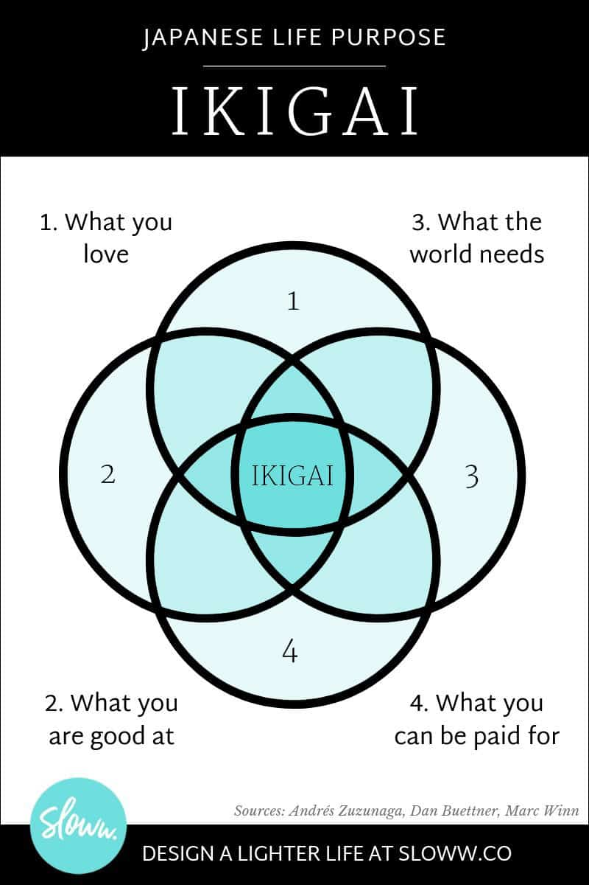
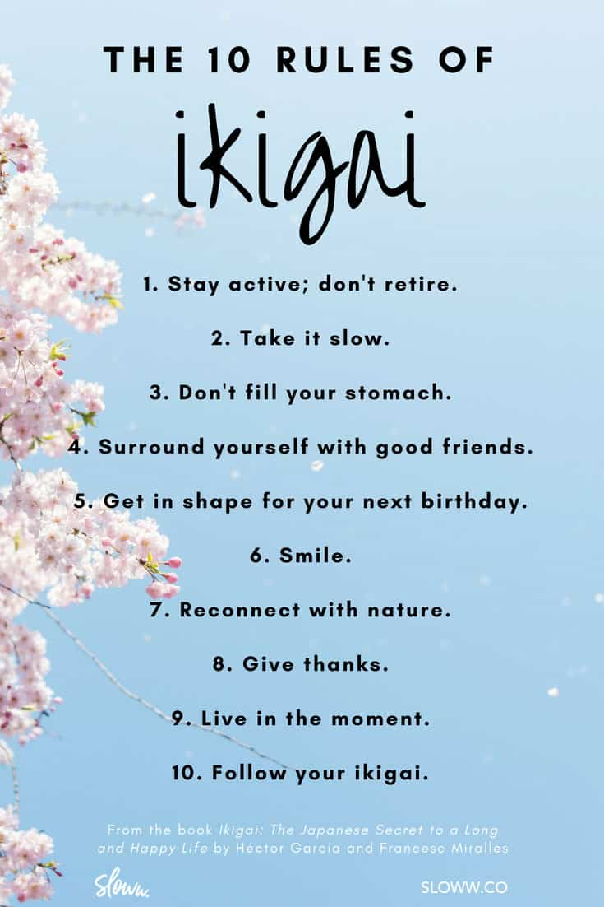

# take-aways

- The authors define ikigai and the rules of ikigai—they conducted a total of one hundred interviews in Ogimi, Okinawa to try to understand the longevity secrets of centenarians and supercentenarians.
- “What do Japanese artisans, engineers, Zen philosophy, and cuisine have in common? Simplicity and attention to detail.”
- 
- Man’s search for meaning is the primary motivation in his life.
- Everything can be taken from a man but one thing: the last of the human freedoms—to choose one’s attitude in any given set of circumstances, to choose one’s own way.
- The more one forgets himself—by giving himself to a cause to serve or another person to love—the more human he is and the more he actualizes himself.
- We should not ask, “What is the meaning of Life?” It is Life that poses the problem and asks the question of us. Life ultimately means taking the responsibility to find the right answer to its problems and to fulfill the tasks which it constantly sets for each individual.
- In the past, nothing is irretrievably lost but everything irrevocably stored.
- You can find ikigai or life purpose by asking: 1. What do you love? 2. What can you be great at? and 3. What will the world pay you for? The psychologist Viktor Frankl survived the WW2 Nazi concentration camps, where he learned the critical importance of finding life meaning. Usually we feel connected to something bigger by serving other people through our relationships or professional calling.
- We all have activities that put us into a state of flow, when hours fly by like minutes. These are a strong hint of what our ikigai is. Remember the activity must be challenging enough, have a clear target, and you must have singular focus. It’s better to focus on our processes and keep improving them daily.
- Strong social connections provide ikigai, lower stress, and help people live longer and happier lives. In Ogimi, elders meet with friends daily, to chat, laugh, drink tea, or play games. In community groups, they celebrate birthdays, festivals, and religious rituals.
- The longest-living people tend to engage in continuous active movement, but not hard strenuous exercise. It’s part of their daily routine, such as walking to the store or maintaining a garden. Many practice traditions that combine movement with breathing, like tai chi.
- People in Japan are more likely to keep working part-time even into old age, as a way of giving to society and keeping active, mentally and physically. Contributing utility or beauty to those around us keeps our life feeling meaningful, not endless leisure time.
- Some tools for handling life’s obstacles… Ichi-go ichi-e teaches us to enjoy each moment because it will only happen once. Wabi-sabi is celebrating the flawed, imperfect, and broken. Negative visualization is a Stoic technique, imagining the worst that could happen.
- The island of Okinawa in Japan is one of the ‘blue zones’ where people live much longer than average. The most important dietary factors are probably eating 7+ different vegetables daily and eating less than 1,900 calories per day. Important healthy foods include: sweet potatoes, green tea, tofu and fish.

# What is Ikigai?

- In Japanese, ikigai is written by combining the symbols that mean “life” with “to be worthwhile.”
- “Translates roughly as ‘the happiness of always being busy.'” (Note: I believe they mean “busy” in the sense of living a full life vs busy life)
- “There is a passion inside you, a unique talent that gives meaning to your days and drives you to share the best of yourself until the very end. If you don’t know what your ikigai is yet, as Viktor Frankl says, your mission is to discover it.” (Note: Viktor Frankl is the author of Man’s Search for Meaning)
- “Our ikigai is different for all of us, but one thing we have in common is that we are all searching for meaning. When we spend our days feeling connected to what is meaningful to us, we live more fully; when we lose the connection, we feel despair.”
- “Our ikigai is hidden deep inside each of us, and finding it requires a patient search. According to those born on Okinawa, the island with the most centenarians in the world, our ikigai is the reason we get up in the morning.”
- “Once you discover your ikigai, pursuing it and nurturing it every day will bring meaning to your life.”
- “They have an important purpose in life, or several. They have an ikigai, but they don’t take it too seriously. They are relaxed and enjoy all that they do.”
- “One thing that everyone with a clearly defined ikigai has in common is that they pursue their passion no matter what.”

- **Sushi, anime, Zen, ramen, Pokémon, bullet trains, and capsule hotels.**
  - What do all these wonderful things have in common? They’re all stereotypes of Japanese culture—they’re what foreigners often associate with Japan, “The Land of the Rising Sun.”

- I think that is why this book Ikigai became so popular—because Japanese culture seems endlessly fascinating and different, a mix of ancient and hyper-modern, a place we really could discover “secrets” to health and happiness.

- You can determine your unique ikigai by finding the intersection of:
  - What do you love?
  - What can you be great at?
  - What will the market pay you for?
  - (This is my simplified version of their 4-part diagram.)

- Another major theme in this book is the work of Viktor Frankl, a psychologist who survived the Nazi concentration camps of World War 2. In those camps, millions of Jewish people were killed. But in the middle of all that suffering, Frankl made an astounding observation.
  - The prisoners who survived found some meaning outside of themselves to look forward to—like a child they needed to take care of or a book they needed to finish writing. But the prisoners who could not find meaning… perished.
  - After the war was over, Viktor Frankl wrote a book called Man’s Search For Meaning to share the insights that he learned in the concentration camps. Frankl strongly believed mental health and happiness were the result not of becoming passive, but remaining active and contributing to others through family, profession, or community.
  - Frankl wrote, “What man actually needs is not a tensionless state but rather the striving and struggling for a worthwhile goal, a freely chosen task.” If we don’t find meaning, people resort to poor substitutes, like short-term pleasure and intoxication.

-**You can find ikigai or life purpose by asking: 1. What do you love? 2. What can you be great at? and 3. What will the world pay you for? The psychologist Viktor Frankl survived the WW2 Nazi concentration camps, where he learned the critical importance of finding life meaning. Usually we feel connected to something bigger by serving other people through our relationships or professional calling.**

# The 10 Rules of Ikigai

- Stay active; don’t retire.
- Take it slow.
- Don’t fill your stomach.
- Surround yourself with good friends.
- Get in shape for your next birthday.
- Smile.
- Reconnect with nature.
- Give thanks.
- Live in the moment.
- Follow your ikigai.
- 

# Morita Therapy:

- “Many Western forms of therapy focus on controlling or modifying the patient’s emotions. In the West, we tend to believe that what we think influences how we feel, which in turn influences how we act. In contrast, Morita therapy focuses on teaching patients to accept their emotions without trying to control them, since their feelings will change as a result of their actions.”

- “Logotherapy and Morita therapy are both grounded in a personal, unique experience that you can access without therapists or spiritual retreats: the mission of finding your ikigai, your existential fuel. Once you find it, it is only a matter of having the courage and making the effort to stay on the right path.”
 
- Almost 100 years ago in Japan, Dr. Shoma Morita created the Morita school of therapy (MoritaSchool.com) to help people with anxiety. The key idea was teaching patients to accept their uncomfortable emotions, then take action anyway towards their important life purposes. Feel the fear and do what needs to be done. A strong influence on Morita’s work was Zen Buddhism, which is all about accepting life as it is.

# Flow:

- People are happiest when they’re so engaged in an activity they forget about time
- “The happiest people are not the ones who achieve the most. They are the ones who spend more time than others in a state of flow.​”
- “In order to achieve this optimal experience, we have to focus on increasing the time we spend on activities that bring us to this state of flow, rather than allowing ourselves to get caught up in activities that offer immediate pleasure.”
- “Concentrating on one thing at a time may be the single most important factor in achieving flow.”
- “Japanese people often apply themselves to even the most basic tasks with an intensity that borders on obsession.”
- “Our ability to turn routine tasks into moments of microflow, into something we enjoy, is key to our being happy, since we all have to do such tasks.”
- “Artists, for example, who carry the torch of their ikigai instead of retiring, have this power. Art, in all its forms, is an ikigai that can bring happiness and purpose to our days. Enjoying or creating beauty is free, and something all human beings have access to.​”
- “Artists know how important it is to protect their space, control their environment, and be free of distractions if they want to flow with their ikigai.”
- “Many such artists might seem misanthropic or reclusive, but what they are really doing is protecting the time that brings them happiness, sometimes at the expense of other aspects of their lives. They are outliers who apply the principles of flow to their lives to an extreme.​”

- According to Csikszentmihalyi, in order to focus on a task we need:
  - 1. To be in a distraction-free environment
  - 2. To have control over what we are doing at every moment ​

- There’s a state of mind called flow. Flow is when we’re so engaged with the activity we are doing that we forget about time. It was first clearly described by the psychologist Mihaly Csikszentmihalyi in his book called Flow: The Psychology of Optimal Experience.

- I’m sure we’ve all had the experience when we love what we’re doing so much that hours fly by without us noticing. Common activities that put people into “flow” include playing sports, cooking food, painting art, playing a video game, etc.

- One of the best ways of finding your ikigai is make a list of which activities put you into a state of flow.

- Here are 3 important guidelines for getting into flow:
  - **It must be challenging**. When an activity is too easy, we get bored. When it’s extremely difficult, we struggle. But there’s a ‘sweet spot’ in the middle, where the activity is difficult enough to keep us actively engaged.
  - **It must have a clear aim**. This is why many people feel flow during sports, there’s always a clear target. To score a goal, cross the finish line, etc. However, during the actual activity, our mind is focused on the present moment. It’s a bit of a paradox.
  - **We must have singular focus**. A key element of flow is being fully engaged, which means our mind is totally occupied by what we are doing, rather than thinking about something else. We can improve our ability to focus through certain types of meditation.

- Rituals are better than goals for sliding into flow, say the authors of Ikigai. Goals put our mind in the future, while rituals give us an easy way to begin moving into action. (As it happens, rituals are a critical element of Japan’s major religions of Shintoism and Buddhism.) For example, a writer can have a daily ritual of writing down at least 100 words every day, whether he feels like it or not. This ritual will get him closer to finishing a book than obsessing over the end goal.

- In the book Atomic Habits, the productibity expert James Clear shares a similar idea. To be productive, he says we must forget goals and focus on systems.
  - Most self-help books would probably say if you want to achieve more, then set more goals. But James Clear says the opposite. He argues that “winners and losers have the same goals.” For example, every athlete at the Olympics has the goal of winning gold, but that alone won’t make them successful. What makes an impact are their daily training and preparation. In other words, their systems.
  - Systems are the processes we follow to get the results we want. When we focus on systems, then we can become a little better at what we do every day, and that is how people eventually become world-class at anything. The British Cycling team became #1 in the world by focusing on making 1% improvements in every step of their process, which is called the theory of “marginal gains.” For example, one week they would find a slightly more aerodynamic uniform, the next week they would try a better muscle recovery gel, and so on.

- and by the way, that relates back to another fantastic Japanese idea called kaizen, which is about continuous and never-ending improvement. The practice of kaizen is why some Japanese companies like Toyota have such a strong reputation for making reliable high-quality products. They never stop trying to improve every step of their production process.

- **We all have activities that put us into a state of flow, when hours fly by like minutes. These are a strong hint of what our ikigai is. Remember the activity must be challenging enough, have a clear target, and you must have singular focus. It’s better to focus on our processes and keep improving them daily.** 

# relax with others

- **Stress & Existential Crisis:**
  - “Many people seem older than they are. Research into the causes of premature aging has shown that stress has a lot to do with it.”
  - “The American Institute of Stress investigated this degenerative process and concluded that most health problems are caused by stress.”
  - “Existential crisis, on the other hand, is typical of modern societies in which people do what they are told to do, or what others do, rather than what they want to do. They often try to fill the gap between what is expected of them and what they want for themselves with economic power or physical pleasure, or by numbing their senses.”
  - “Those who give up the things they love doing and do well lose their purpose in life. That’s why it’s so important to keep doing things of value, making progress, bringing beauty or utility to others, helping out, and shaping the world around you, even after your ‘official’ professional activity has ended.”

- **Spending quality time with family and friends is almost universal among those who live longest **
- Stress is not just a bad feeling, it’s actually a biochemical reaction in our bodies. Being stressed floods our bodies with chemicals including adrenalin and glucocorticoids.
- **What most people don’t know is these chemicals are actually DANGEROUS to our health over the long-term!** They increase our risk of diabetes, high blood pressure, and even hurt our immune and reproductive systems.

- ***In all of the “Blue Zones,” people have strong social ties with their family, friends and community. A strong sense of belonging and support is one of the most powerful ways to lower our stress.**

- Here are some ways the elders in Ogimi, Okinawa nurtured social connections:*
  - **Meeting with friends every day**. Almost everyone is part of a small close-knit friend group called a “moai” which provides lifelong companionship and a financial safety net.
  - **Participating in a neighbourhood association**. The town is divided into 17 associations, which give people a place to meet for gatherings, celebrations, festivals, and games.
  - **Smiling and saying “hello” to people on the street**. Perhaps the simplest and quickest way to feel a stronger social connection with our community. (Though I don’t think it would work as well in a big city like New York!)
  - **Religious rituals, festivals, and services**. The main religion in Okinawa is Ryukyu Shinto, which involves worship of one’s ancestors and nature spirits. In general, people in the ‘blue zones’ tend to be involved in a local religious community, and researchers say that helps people live longer.

- *Most of us have heard the idea that “happiness comes more from relationships than success” since we were small children. However, if you’re interested in self improvement and personal growth, then you probably still have that desire for achievement. And that’s not a bad thing. The key is to make sure we pursue our goals in the correct order…*

- **Growth Insight**
  - In the recent bestselling book The Psychology of Money, the author Morgan Housel explains why some people take the desire for material success too far. For example, Bernie Madoff’s name became famous in 2008 after he confessed to running the largest Ponzi scheme in history, defrauding investors of over $64 billion. But why would someone who is already a millionaire do that?
  - Because our happiness is less about what we get, and more about our expectations. This is just as true for Bernie Madoff, as it is for the ambitious beginner investor or businessperson. As Morgan Housel wrote, “There is no reason to risk what you have and need for what you don’t have and don’t need.” If we can control our expectations for material success, then we can spend more time being happy with loved ones and live longer.

- **Strong social connections provide ikigai, lower stress, and help people live longer and happier lives. In Ogimi, elders meet with friends daily, to chat, laugh, drink tea, or play games. In community groups, they celebrate birthdays, festivals, and religious rituals.**

# Ogimi, Okinawa:

- “We realized right away that time seems to have stopped there, as though the entire town were living in an endless here and now.”
- “Many Japanese people never really retire—they keep doing what they love for as long as their health allows.”
- “The Japanese are skilled at bringing nature and technology together: not man versus nature, but rather a union of the two.”
- “Okinawans live by the principle of ichariba chode, a local expression that means ‘treat everyone like a brother, even if you’ve never met them before.'”
- Celebrations seem to be an essential part of life in Ogimi.​
 

# Slow Living/Move mindfully:

- “Being in a hurry is inversely proportional to quality of life. As the old saying goes, ‘Walk slowly and you’ll go far.’ When we leave urgency behind, life and time take on new meaning.​”
- “Looking back, our days in Ogimi were intense but relaxed—sort of like the lifestyle of the locals, who always seemed to be busy with important tasks but who, upon closer inspection, did everything with a sense of calm. They were always pursuing their ikigai, but they were never in a rush.”
- “They are always busy, but they occupy themselves with tasks that allow them to relax. We didn’t see a single old grandpa sitting on a bench doing nothing.​”
- “The restaurant is right by the sea and seems like something from the planet Tatooine, from Star Wars. The menu boasts in large letters that it serves ‘slow food‘ prepared with organic vegetables grown in the town.​”

- **Continuous gentle exercise is part of their daily routine**
- Many of us believe a myth that the healthiest people exercise hard. Spending hours in the gym, training for a marathon, perhaps climbing a mountain. But this is a myth.

- **The people who live the longest stay active and move constantly, but rarely engage in intense exercise. Rather, you’re likely to see them:**
  - **Walking somewhere**. To the store, to a friend’s house, to complete an errand. Walking tends to be part of the regular day, not an activity that needs to be planned separately.
  - **Vegetable gardening**. Growing a garden requires daily light work, like digging, watering and weeding. It’s perfect for remaining active with a purpose.
  - **Movement traditions**. Especially in east Asia, several traditional schools have developed that teach practices combining movement with breathing. They include:
    - **Radio taiso**. A series of morning warmup exercises usually done in a group, following an instructor on TV.
    - **Yoga**. A variety of spiritual practices from India. The form of Yoga popular in the West and Japan combines physical poses with breathing.
    - **Tai chi**. An ‘inner martial art’ from China, tai chi involves flowing slow movements of the hands and legs.

- **The longest-living people tend to engage in continuous active movement, but not hard strenuous exercise. It’s part of their daily routine, such as walking to the store or maintaining a garden. Many practice traditions that combine movement with breathing, like tai chi.**

# forget retirement

- **Remaining active without an end date is essential to feel engaged with life and others**

- In Western countries, the great narrative is that we finish school, work a 9-5 job until the age of 65, then we retire to an easy life of leisure.

- In Japan, the authors of Ikigai learned a very different way of looking at retirement. Ideally, it doesn’t really exist. More Japanese people in their 70’s are working by choice, often cleaning or looking after others, as a way to keep active and continue giving to society.

- If we want our life to keep feeling meaningful, then we must remain engaged with others and our community, by contributing utility or beauty.
- The best example to illustrate this mindset are “Takumis,” Japanese master artisans who spend a lifetime obsessively dedicated to their craft. The craft may be anything—porcelain cups, chef knives, or even drawing anime. The books tells a fascinating story about Hayao Miyazaki, founder of the renowned animation company Studio Ghibli. The day after Miyazaki ‘retired,’ he came right back in to the office, sat down at his desk and continued drawing. He just couldn’t stand not doing what he loved most—drawing.

- **Growth Insight**
  - Let’s reflect on this fascinating idea. To most people, the concept of “no retirement” would probably sound strange and awful. Why? Because too many of us hate our work. But how did so many of us get trapped in such an undesirable situation?

  - There’s an inspiring book called The Alchemist that explains an idea called “Personal Legend.” Your Personal Legend is what you’re always wanted to do, but as we grew older we turned away from it. Instead, we chose a different path because the world convinced us to go for what is practical, respectable, or safe.

  - As one character in The Alchemist says, “the world’s greatest lie” is that “at a certain point in our lives, we lose control of what’s happening to us, and our lives become controlled by fate. That’s the world’s greatest lie.” At any point, we can choose to start doing again whatever makes us feel excited and enthusiastic.

- **Remaining active also provides important anti-aging benefits to our brains.** Our brain continues to form new connections when it encounters new things daily. That’s why it’s so important to keep learning and putting ourselves into new situations, even those that challenge us or make us feel a little anxiety. (To back up this point, the authors of Ikigai cite Israeli neuroscientist Shlomo Breznitz.)

- **People in Japan are more likely to keep working part-time even into old age, as a way of giving to society and keeping active, mentally and physically. Contributing utility or beauty to those around us keeps our life feeling meaningful, not endless leisure time.**

# Embrace Impermanence:

- **To become resilient, we can enjoy each moment, celebrate our flaws, and prepare for the worst**

- During our lifetime pursuit of happiness and ikigai, it’s inevitable that we will experience setbacks, even tragedy. So the authors include some ideas about how to enjoy life’s beauty and meaning, even if it’s impermanent:
  - **Ichi-go ichi-e.** A Japanese saying that means “this moment will happen only once.” It’s a reminder to enjoy this moment because the same event will never happen again. It’s kind of like the Buddhist saying, “You can never step in the same river twice.” (Because the river is never identical in two different moment. It is always changing, like everything in life.)
  - **Wabi-sabi.** This is another Japanese idea related to seeing the beauty in items that are worn, flawed, or broken. One idea from wabi-sabi is to fix a broken plate with golden glue, so that rather than hiding the flaw we are celebrating it. In the same way, we can be personally proud of many things that are imperfect, unfinished, and impermanent.
  - **Negative visualization.** This is a technique from the Stoic philosophers. They would often prepare for life’s problems by imagining things going very wrong. For example, Seneca would live like a homeless person, to help him become less anxious about losing all he had. (Also read our summary of Letters from a Stoic by Seneca.)
  - **Antifragile.** This idea comes from Nassim Taleb, an economic and financial thinker. Antifragile means that when we are tested, we become better and stronger. It’s a different meaning than resilient, which just says we can withstand tests. The authors of Ikigai say we can become more antifragile by diversifying our sources of income, our relationships, etc.
The authors of Ikigai later wrote “The Book of Ichigo Ichie” and another one called “Wabi-Sabi.” They obviously believe these ideas are important!

- **The Buddha said “life is suffering” which is often mistaken for being pessimism. The Buddha was simply stating a fact of our lives, that nothing is ultimately satisfying. Everything is impermanent, including all the short times we feel good, content, pleasure, or happiness. Buddha’s solution was a method of meditation. By noticing how everything always changes, we can stop clinging to things, and achieve greater inner freedom.**

- **Some tools for handling life’s obstacles… Ichi-go ichi-e teaches us to enjoy each moment because it will only happen once. Wabi-sabi is celebrating the flawed, imperfect, and broken. Negative visualization is a Stoic technique, imagining the worst that could happen.**

# Secrets of the Centenarians & Supercentenarians:

- “Over the course of a week we conducted a total of one hundred interviews, asking the eldest members of the community about their life philosophy, their ikigai, and the secrets to longevity:
  - Don’t worry
  - Cultivate good habits
  - Nurture your friendships every day
  - Live an unhurried life
  - Be optimistic”

- “Eat and sleep, and you’ll live a long time. You have to learn to relax.” — Misao Okawa (117 years old)
- “I’ve never eaten meat in my life.” — María Capovilla (116)
- “Everything’s fine.” — Jeanne Calment (122)
- “Your mind and your body. You keep both busy, you’ll be here a long time.” — Walter Breuning (114)
- “I just haven’t died yet.” — Alexander Imich (111)
- “Food won’t help you live longer…The secret is smiling and having a good time.”
- “My secret to a long life is always saying to myself, ‘Slow down,’ and ‘Relax.’ You live much longer if you’re not in a hurry.”
- “The key to staying sharp in old age is in your fingers. From your fingers to your brain, and back again. If you keep your fingers busy, you’ll live to see one hundred.”​
 

# Longevity Diet:

- “One hundred percent of the people we interviewed keep a vegetable garden, and most of them also have fields of tea, mangoes, shikuwasa, and so on.”
- “Locals eat a wide variety of foods, especially vegetables. Variety seems to be key. A study of Okinawa’s centenarians showed that they ate 206 different foods, including spices, on a regular basis. They ate an average of eighteen different foods each day, a striking contrast to the nutritional poverty of our fast-food culture.”
- “They eat at least five servings of fruits and vegetables every day. At least seven types of fruits and vegetables are consumed by Okinawans on a daily basis. The easiest way to check if there is enough variety on your table is to make sure you’re ‘eating the rainbow.’ A table featuring red peppers, carrots, spinach, cauliflower, and eggplant, for example, offers great color and variety. Vegetables, potatoes, legumes, and soy products such as tofu are the staples of an Okinawan’s diet. More than 30 percent of their daily calories comes from vegetables.”
- “Grains are the foundation of their diet. Japanese people eat white rice every day, sometimes adding noodles. Rice is the primary food in Okinawa, as well.”
- “Eat fish an average of three times per week.”
- “Consume fewer calories: an average of 1,785 per day, compared to 2,068 in the rest of Japan. In fact, low caloric intake is common among the five Blue Zones.”
- “Tofu, Miso, Tuna, Carrots, Goya (bitter melon), Kombu (sea kelp), Cabbage, Nori (seaweed), Onion, Soy sprouts, Hechima (cucumber-like gourd), Soybeans (boiled or raw), Sweet potato, Peppers”
- “Okinawans drink more Sanpin-cha—a mix of green tea and jasmine flowers—than any other kind of tea…Okinawans drink an average of three cups of Sanpin-cha every day.”
- “White tea, with its high concentration of polyphenols, may be even more effective against aging. In fact, it is considered to be the natural product with the greatest antioxidant power in the world—to the extent that one cup of white tea might pack the same punch as about a dozen glasses of orange juice.”

- **Eating less calories but more nutritious foods (like vegetables) is key to ‘the Okinawa diet’**
- “Blue zones” are certain small regions in the world where people live much longer than average. The “blue zones” include: Okinawa in Japan, Sardinia in Italy, Loma Linda in the US, Nicoya in Costa Rica, and Ikaria in Greece. The National Geographic journalist Dan Buettner wrote a popular book in 2008 about what people in these regions do differently that allows them to live so long.

- **Eating lots of vegetables was one thing all the “blue zones” had in common**, which is probably not surprising. In the village of Ogimi, the authors of Ikigai found that EVERY SINGLE elderly person they interviewed maintained a vegetable garden. Researchers say people there eat an average of 7 different vegetables or fruits daily.

- Important Okinawan foods include:
  - **Sweet potatoes** are a major staple of the Okinawa diet. A little white rice is eaten daily, though in much lower amounts than mainland Japan.
  - **Green tea**. People there drink 3 cups of ‘sanpin-cha’ daily, which is a mix of green tea and jasmine flowers. Green tea contains many antioxidants which may fight aging, and provides many other benefits for the health of our brain, heart, and immune system.
  - **Soy foods**. Tofu is eaten daily, miso is a fermented paste used to make soup, natto is a sticky breakfast food, and edamame are cooked fresh soybeans.
  - **Seafood**. Fish is eaten 3 servings per week. (That makes sense on a big island!) Seaweed is part of many dishes; it contains many nutrients and vitamins. Pork is eaten 1 serving per week.

- **Traditionally, Okinawans also AVOIDED eating a lot of: processed foods, alcohol, sugar, and salt.** *(Today on the island, younger people are eating a more ‘westernized’ diet with more of those foods, so life expectancy is not as exceptional for the next generation.)*

- **Okinawans follow the 80% rule—they stop eating when they are only 80% full.** Before a meal, they will often remind themselves by saying “Hara hachi bu” which is basically translated “belly 80% full.” This practice goes back to ancient Confucianism and is also an important part of many religions like Buddhism.

- Eating fewer calories in general is probably a major reason Okinawans live so long. They eat an average of 1,900 calories per day, that is hundreds of calories less than the average person in the US. But instead of counting calories, they simply feel when they are getting full, then stop eating.

- **The best book on anti-aging that I’ve read is *Lifespan by David Sinclair*, who is a professor of genetics at Harvard Medical School. He says that eating fewer calories has been shown scientifically to improve the longevity of many organisms, from humans to mice to yeast. The key is to avoid malnutrition by eating food that is more nutrient dense, like green vegetables instead of white bread.**
  - **The easiest way for us to eat fewer calories may be through intermittent fasting, which in practice can be as simple as regularly skipping 1-2 meals. Why is short-term fasting helpful for living longer? Professor Sinclair says it’s because of a biological principle called hormesis, which says that a moderate level of biological stress is actually beneficial to us and activates our ‘longevity genes.’**

- **The island of Okinawa in Japan is one of the ‘blue zones’ where people live much longer than average. The most important dietary factors are probably eating 7+ different vegetables daily and eating less than 1,900 calories per day. Important healthy foods include: sweet potatoes, green tea, tofu and fish.**

# 3 Sources for Meaning

- **In Work**: Doing something significant.
- **In Love**: Caring for another person.
- **In Courage**: We give meaning to suffering by the way in which we respond to it.
- *Forces beyond your control can take away everything you possess except one thing, your freedom to choose how you will respond to the situation. You cannot control what happens to you in life, but you can always control what you will feel and do about what happens to you.*

- Don’t aim at success—the more you aim at it and make it a target, the more you are going to miss it. For success, like happiness, cannot be pursued; it must ensue, and it only does so as the unintended side-effect of one’s dedication to a cause greater than oneself or as the by-product of one’s surrender to a person other than oneself.

# Experiences In A Concentration Camp

- In psychiatry there is a certain condition known as **“delusion of reprieve.”** The condemned man, immediately before his execution, gets the illusion that he might be reprieved at the very last minute. We, too, clung to shreds of hope and believed to the last moment that it would not be so bad.
- **An abnormal reaction to an abnormal situation is normal behavior.**

- **Apathy**

  - Apathy, the blunting of the emotions and the feeling that one could not care any more, were the symptoms arising during the second stage of the prisoner’s psychological reactions, and which eventually made him insensitive to daily and hourly beatings.
  - Apathy…was a necessary mechanism of self-defense. Reality dimmed, and all efforts and all emotions were centered on one task: preserving one’s own life and that of the other fellow.

- **Spiritual Strength**

  - Sensitive people who were used to a rich intellectual life may have suffered much pain (they were often of a delicate constitution), but the damage to their inner selves was less. **They were able to retreat from their terrible surroundings to a life of inner riches and spiritual freedom**. Only in this way can one explain the apparent paradox that some prisoners of a less hardy make-up often seemed to survive camp life better than did those of a robust nature.

  - Love goes very far beyond the physical person of the beloved. It finds its deepest meaning in his spiritual being, his inner self. Whether or not he is actually present, whether or not he is still alive at all, ceases somehow to be of importance.

- **Judgement**
  - **No man should judge unless he asks himself in absolute honesty whether in a similar situation he might not have done the same.**

- **Freedom To Choose Your Attitude**
  - **Everything can be taken from a man but one thing: the last of the human freedoms—to choose one’s attitude in any given set of circumstances, to choose one’s own way.**
  - Even though conditions such as lack of sleep, insufficient food and various mental stresses may suggest that the inmates were bound to react in certain ways, in the final analysis it becomes clear that the sort of person the prisoner became was the result of an inner decision, and not the result of camp influences alone.
  - *There is only one thing that I dread: not to be worthy of my sufferings.* DOSTOEVSKI

- **Meaning In Suffering**
  - **If there is a meaning in life at all, then there must be a meaning in suffering. Suffering is an ineradicable part of life, even as fate and death. Without suffering and death human life cannot be complete.**
  - The way in which a man accepts his fate and all the suffering it entails, the way in which he takes up his cross, gives him ample opportunity—even under the most difficult circumstances—to add a deeper meaning to his life.

- **Hope and Health**
  - **Those who know how close the connection is between the state of mind of a man—his courage and hope, or lack of them—and the state of immunity of his body will understand that the sudden loss of hope and courage can have a deadly effect.**
  - *He who has a why to live for can bear with almost any how.* NIETZSCHE

- **What Life Expects From Us**
  - What was really needed was a fundamental change in our attitude toward life. We had to learn ourselves and, furthermore, we had to teach the despairing men, **that it did not really matter what we expected from life, but rather what life expected from us.** We needed to stop asking about the meaning of life, and instead to think of ourselves as those who were being questioned by life—daily and hourly.
  - **Life ultimately means taking the responsibility to find the right answer to its problems and to fulfill the tasks which it constantly sets for each individual.**
  - When a man finds that it is his destiny to suffer, he will have to accept his suffering as his task; his single and unique task. He will have to acknowledge the fact that even in suffering he is unique and alone in the universe. No one can relieve him of his suffering or suffer in his place. His unique opportunity lies in the way in which he bears his burden.
  - There was plenty of suffering for us to get through. Therefore, it was necessary to face up to the full amount of suffering, trying to keep moments of weakness and furtive tears to a minimum. **But there was no need to be ashamed of tears, for tears bore witness that a man had the greatest of courage, the courage to suffer.**

- **Responsibility For Your Life**
  - This uniqueness and singleness which distinguishes each individual and gives a meaning to his existence has a bearing on creative work as much as it does on human love. **When the impossibility of replacing a person is realized, it allows the responsibility which a man has for his existence and its continuance to appear in all its magnitude.**
  - *That which does not kill me, makes me stronger.* NIETZCHE

- **Two Races of Men**
  - It is apparent that the mere knowledge that a man was either a camp guard or a prisoner tells us almost nothing. **Human kindness can be found in all groups, even those which as a whole it would be easy to condemn**. The boundaries between groups overlapped and we must not try to simplify matters by saying that these men were angels and those were devils.
  - From all this we may learn that there are two races of men in this world, but only these two—the “race” of the decent man and the “race” of the indecent man. Both are found everywhere; they penetrate into all groups of society. **No group consists entirely of decent or indecent people. In this sense, no group is of “pure race”—and therefore one occasionally found a decent fellow among the camp guards.**

- **Liberation**
  - Psychologically, what was happening to the liberated prisoners could be called **“depersonalization.”** Everything appeared unreal, unlikely, as in a dream. We could not believe it was true.
  - **Only slowly could these men be guided back to the commonplace truth that no one has the right to do wrong, not even if wrong has been done to them.**
  - The crowning experience of all, for the homecoming man, is the wonderful feeling that, after all he has suffered, there is nothing he need fear any more—except his God.

# Logotherapy In A Nutshell

- **Logos is a Greek word which denotes “meaning.”**
- Logotherapy is less *retrospective* as it is *introspective* [in comparison to psychoanalysis].
- **Logotherapy helps the patient focus on the meanings to be fulfilled by the patient in his future.**
- Logotherapy defocuses all the vicious-circle formations and feedback mechanisms which play such a great role in the development of neuroses. Thus, the typical self-centeredness of the neurotic is broken up instead of being continually fostered and reinforced.
- In logotherapy the patient is actually confronted with and reoriented toward the meaning of his life. And to make him aware of this meaning can contribute much to his ability to overcome his neurosis.

- **The Will to Meaning**
  - **Man’s search for meaning is the primary motivation in his life** and not a “secondary rationalization” of instinctual drives. This meaning is unique and specific in that it must and can be fulfilled by him alone; only then does it achieve a significance which will satisfy his own will to meaning.

- **Existential Frustration**
- Existential frustration is in itself neither pathological nor pathogenic. A man’s concern, even his despair, over the worthwhileness of life is an existential distress but by no means a mental disease.
- In the Nazi concentration camps, one could have witnessed that those who knew that there was a task waiting for them to fulfill were most apt to survive.
- **Thus it can be seen that mental health is based on a certain degree of tension, the tension between what one has already achieved and what one still ought to accomplish, or the gap between what one is and what one should become.**
- What man actually needs is not a tensionless state but rather the striving and struggling for a worthwhile goal, a freely chosen task.

- **The Existential Vacuum**
  - The existential vacuum manifests itself mainly in a state of boredom.
  - **Boredom is now causing, and certainly bringing to psychiatrists, more problems to solve than distress.** And these problems are growing increasingly crucial, for progressive automation will probably lead to an enormous increase in the leisure hours available to the average worker. The pity of it is that many of these will not know what to do with all their newly acquired free time.
  - Sometimes the frustrated will to meaning is vicariously compensated for by a will to power, including the most primitive form of the will to power, the will to money.
- In other cases, the place of frustrated will to meaning is taken by the will to pleasure. That is why existential frustration often eventuates in sexual compensation. We can observe in such cases that the sexual libido becomes rampant in the existential vacuum.

- **The Meaning of Life**
- The meaning of life differs from man to man, from day to day and from hour to hour. **What matters, therefore, is not the meaning of life in general but rather the specific meaning of a person’s life at a given moment.**
- To put the question in general terms would be comparable to the question posed to a chess champion: “Tell me, Master, what is the best move in the world?” There simply is no such thing as the best or even a good move apart from a particular situation in a game and the particular personality of one’s opponent. The same holds for human existence. **One should not search for an abstract meaning of life. Everyone has his own specific vocation or mission in life to carry out a concrete assignment which demands fulfillment.** Therein he cannot be replaced, nor can his life be repeated. Thus, everyone’s task is as unique as is his specific opportunity to implement it.
- As each situation in life represents a challenge to man and presents a problem for him to solve, the question of the meaning of life may actually be reversed. **Ultimately, man should not ask what the meaning of his life is, but rather he must recognize that it is he who is asked.** In a word, each man is questioned by life; and he can only answer to life by answering for his own life; to life he can only respond by being responsible. **Thus, logotherapy sees in responsibleness the very essence of human existence.**

- **The Essence of Existence**
  - **The more one forgets himself—by giving himself to a cause to serve or another person to love—the more human he is and the more he actualizes himself.**
  - According to logotherapy, we can discover this meaning in life in three different ways: (1) by creating a work or doing a deed; (2) by experiencing something or encountering someone; and (3) by the attitude we take toward unavoidable suffering.

- **The Meaning of Love**
  - Love enables you to see the essential traits and features in the beloved person; and even more, to see that which is potential in them, which is not yet actualized but yet ought to be actualized.
  - By loving another person you enable them to actualize these potentialities.

- **The Meaning of Suffering**
  - When we are no longer able to change a situation—just think of an incurable disease such as inoperable cancer—we are challenged to change ourselves.

- The Surviving Spouse

>“Once, an elderly general practitioner consulted me because of his severe depression. he could not overcome the loss of his wife who had died two years beofre and whom he had loved above all else. 
>
>Now, how could I help him? What should I tell him?
>
>Well, I refrained from telling him anything but confronted him with the question, “What would have happened, Doctor, if you had died first, and your wife would have had to survive you?”
>
>“Oh,” he said, “for her this would have been terrible; how she would have suffered!”
>
>Whereupon I replied, “You see, Doctor, such a suffering has been spared her, and it was you who have spared her this suffering—to be sure, at the price that now you have to survive and mourn her.”
>
>He said no word but shook my hand and calmly left my office.
>
>**In some way, suffering ceases to be suffering at the moment it finds meaning, such as the meaning of a sacrifice.**

- But let me make it perfectly clear that in no way is suffering necessary to find meaning. I only insist that meaning is possible even in spite of suffering—provided, certainly, that the suffering is unavoidable.
- To suffer unnecessarily is masochistic rather than heroic.
- **In accepting this challenge to suffer bravely, life has a meaning up to the last moment, and it retains this meaning literally to the end.**

- **The Super-Meaning**
  - What is demanded of man is not, as some existential philosophers teach, to endure the meaninglessness of life, but rather to bear his incapacity to grasp its unconditional meaningfulness in rational terms. Logos is deeper than logic.

- **Life’s Transitoriness**
- **In the past, nothing is irretrievably lost but everything irrevocably stored.**
- Man constantly makes his choice concerning the mass of present potentialities; which of these will be condemned to nonbeing and which will be actualized? Which choice will be made in actuality once and forever, an immortal “footprint in the sands of time”? At any moment, man must decide, for better or for worse, what will be the monument of his existence.
- **What reason does the elderly have to envy the youth? The youth has only possibilities, while the old have the realities of their past. Not only the reality of work done and of love loved, but of sufferings bravely suffered.**

- **Psychiatry Rehumanized**
  - Man is ultimately self-determining. What he becomes—within the limits of endowment and environment—he has made out of himself.
  - **In every circumstance, man has two potentialities within himself—to behave like swine or saint. Which one is actualized depends on decisions but not on conditions.**

  - *Our generation is realistic, for we have come to know man as he really is. After all, man is that being who invented the gas chambers of Auschwitz; however, he is also that being who entered those gas chambers upright, with the Lord’s Prayer or the Shema Yisrael on his lips.* VIKTOR FRANKL

# Postscript 1984

- **The Case for Tragic Optimism**
  - Tragic optimism means that one is, and remains, optimistic in spite of the tragic triad of human existence: **(1) pain; (2) guilt; and (3) death.**
  - Optimism in the face of tragedy and in view of the human potential allows for: (1) turning suffering into a human achievement and accomplishment; (2) deriving from guilt the opportunity to change oneself for the better; and (3) deriving from life’s transitoriness an incentive to take responsible action.
  - **A human being is not one in pursuit of happiness but rather in search of a reason to become happy**, last but not least, through actualizing the potential meaning inherent and dormant in a given situation.
  - **Man does not live by welfare alone. It’s possible to have enough to live by but nothing to live for; to have the means but no meaning.**
  - Not all cases of suicide are *undertaken* out of a feeling of meaninglessness, but it may well be that an individual’s impulse to take his life would have been *overcome* had he been aware of some meaning and purpose worth living for.

- **Suffering**
  - **Even the helpless victim of a hopeless situation, facing a fate he cannot change, may rise above himself, may grow beyond himself, and by so doing change himself. He may turn a personal tragedy into a triumph.**
  - The greatest among us are those who master a hard lot with their heads held high.

- **Guilt**
  - There is no fully biological, psychological and/or sociological factors that justify/explain why someone commits a crime.
  - **Individuals must be held personally accountable for their deeds. Having committed a crime and become guilty, one now has the responsibility for overcoming guilt by rising above it, by growing beyond yourself and changing for the better.**
  - **As for the concept of collective guilt, I personally think that it is totally unjustified to hold one person responsible for the behavior of another person or a collective of persons.**

- German Knives

>“An American woman once confronted me with the reproach, “How can you still write some of your books in German, Adolf Hitler’s language?”
>
>In response, I asked her if she had knives in her kitchen, and when she answered that she did, I acted dismayed and shocked, exclaiming, “How can you still use knives after so many killers have used them to stab and murder their victims?”

- **Death**
  - **Live as if you were living for the second time and had acted as wrongly the first time as you are about to act now.**
  - **The opportunities to act properly, the potentialities to fulfill a meaning, are affected by the irreversibility of our lives.**
  - In the past, nothing is irretrievably lost, but rather, on the contrary, everything is irrevocably stored and treasured.
  - *So, let us be alert—alert in a twofold sense: Since Auschwitz we know what man is capable of. And since Hiroshima we know what is at stake.* VIKTOR FRANKL

- **Afterword by William J. Winslade**
  - Frankl believed strongly in reconciliation rather than revenge; he once remarked, “I do not forget any good deed done to me, and I do not carry a grudge for a bad one.”
  - He renounced the idea of collective guilt. Frankl was able to accept that his Viennese colleagues and neighbors may have known about or even participated in his persecution, and he did not condemn them for failing to join the resistance or die heroic deaths. Instead, he was deeply committed to the idea that even a vile Nazi criminal or a seemingly hopeless madman has the potential to transcend evil or insanity by making responsible choices.

# Quotes

*Our generation is realistic, for we have come to know man as he really is. After all, man is that being who invented the gas chambers of Auschwitz; however, he is also that being who entered those gas chambers upright, with the Lord’s Prayer or the Shema Yisrael on his lips.* VIKTOR FRANKL

"Translates roughly as ‘the happiness of always being busy.'" (Note: I believe they mean “busy” in the sense of living a full life vs busy life)

“There is a passion inside you, a unique talent that gives meaning to your days and drives you to share the best of yourself until the very end. If you don’t know what your ikigai is yet, as Viktor Frankl says, your mission is to discover it.” (Note: Viktor Frankl is the author of Man’s Search for Meaning)

“Our ikigai is different for all of us, but one thing we have in common is that we are all searching for meaning. When we spend our days feeling connected to what is meaningful to us, we live more fully; when we lose the connection, we feel despair.”

“Our ikigai is hidden deep inside each of us, and finding it requires a patient search. According to those born on Okinawa, the island with the most centenarians in the world, our ikigai is the reason we get up in the morning.”

“Once you discover your ikigai, pursuing it and nurturing it every day will bring meaning to your life.”

“They have an important purpose in life, or several. They have an ikigai, but they don’t take it too seriously. They are relaxed and enjoy all that they do.”

“One thing that everyone with a clearly defined ikigai has in common is that they pursue their passion no matter what.”

“Many people seem older than they are. Research into the causes of premature aging has shown that stress has a lot to do with it.”

“The American Institute of Stress investigated this degenerative process and concluded that most health problems are caused by stress.”

“Existential crisis, on the other hand, is typical of modern societies in which people do what they are told to do, or what others do, rather than what they want to do. They often try to fill the gap between what is expected of them and what they want for themselves with economic power or physical pleasure, or by numbing their senses.”

“Those who give up the things they love doing and do well lose their purpose in life. That’s why it’s so important to keep doing things of value, making progress, bringing beauty or utility to others, helping out, and shaping the world around you, even after your ‘official’ professional activity has ended.”
 
“Many Western forms of therapy focus on controlling or modifying the patient’s emotions. In the West, we tend to believe that what we think influences how we feel, which in turn influences how we act. In contrast, Morita therapy focuses on teaching patients to accept their emotions without trying to control them, since their feelings will change as a result of their actions.”

“Logotherapy and Morita therapy are both grounded in a personal, unique experience that you can access without therapists or spiritual retreats: the mission of finding your ikigai, your existential fuel. Once you find it, it is only a matter of having the courage and making the effort to stay on the right path.”
 
“The happiest people are not the ones who achieve the most. They are the ones who spend more time than others in a state of flow.​”

“In order to achieve this optimal experience, we have to focus on increasing the time we spend on activities that bring us to this state of flow, rather than allowing ourselves to get caught up in activities that offer immediate pleasure.”

“Concentrating on one thing at a time may be the single most important factor in achieving flow.”

“Japanese people often apply themselves to even the most basic tasks with an intensity that borders on obsession.”

“Our ability to turn routine tasks into moments of microflow, into something we enjoy, is key to our being happy, since we all have to do such tasks.”

“Artists, for example, who carry the torch of their ikigai instead of retiring, have this power. Art, in all its forms, is an ikigai that can bring happiness and purpose to our days. Enjoying or creating beauty is free, and something all human beings have access to.​”

“Artists know how important it is to protect their space, control their environment, and be free of distractions if they want to flow with their ikigai.”

“Many such artists might seem misanthropic or reclusive, but what they are really doing is protecting the time that brings them happiness, sometimes at the expense of other aspects of their lives. They are outliers who apply the principles of flow to their lives to an extreme.​”
 
“We realized right away that time seems to have stopped there, as though the entire town were living in an endless here and now.”

“Many Japanese people never really retire—they keep doing what they love for as long as their health allows.”

“The Japanese are skilled at bringing nature and technology together: not man versus nature, but rather a union of the two.”

“Okinawans live by the principle of ichariba chode, a local expression that means ‘treat everyone like a brother, even if you’ve never met them before.'”
Celebrations seem to be an essential part of life in Ogimi.​
 
“Being in a hurry is inversely proportional to quality of life. As the old saying goes, ‘Walk slowly and you’ll go far.’ When we leave urgency behind, life and time take on new meaning.​”

“Looking back, our days in Ogimi were intense but relaxed—sort of like the lifestyle of the locals, who always seemed to be busy with important tasks but who, upon closer inspection, did everything with a sense of calm. They were always pursuing their ikigai, but they were never in a rush.”

“They are always busy, but they occupy themselves with tasks that allow them to relax. We didn’t see a single old grandpa sitting on a bench doing nothing.​”

“The restaurant is right by the sea and seems like something from the planet Tatooine, from Star Wars. The menu boasts in large letters that it serves ‘slow food‘ prepared with organic vegetables grown in the town.​”
 

“Over the course of a week we conducted a total of one hundred interviews, asking the eldest members of the community about their life philosophy, their ikigai, and the secrets to longevity: Don’t worry, Cultivate good habits, Nurture your friendships every day, Live an unhurried life, Be optimistic”

“Eat and sleep, and you’ll live a long time. You have to learn to relax.” — Misao Okawa (117 years old)

“I’ve never eaten meat in my life.” — María Capovilla (116)

“Everything’s fine.” — Jeanne Calment (122)

“Your mind and your body. You keep both busy, you’ll be here a long time.” — Walter Breuning (114)

“I just haven’t died yet.” — Alexander Imich (111)

“Food won’t help you live longer…The secret is smiling and having a good time.”

“My secret to a long life is always saying to myself, ‘Slow down,’ and ‘Relax.’ You live much longer if you’re not in a hurry.”

“The key to staying sharp in old age is in your fingers. From your fingers to your brain, and back again. If you keep your fingers busy, you’ll live to see one hundred.”​
 
“One hundred percent of the people we interviewed keep a vegetable garden, and most of them also have fields of tea, mangoes, shikuwasa, and so on.”

“Locals eat a wide variety of foods, especially vegetables. Variety seems to be key. A study of Okinawa’s centenarians showed that they ate 206 different foods, including spices, on a regular basis. They ate an average of eighteen different foods each day, a striking contrast to the nutritional poverty of our fast-food culture.”

“They eat at least five servings of fruits and vegetables every day. At least seven types of fruits and vegetables are consumed by Okinawans on a daily basis. The easiest way to check if there is enough variety on your table is to make sure you’re ‘eating the rainbow.’ A table featuring red peppers, carrots, spinach, cauliflower, and eggplant, for example, offers great color and variety. Vegetables, potatoes, legumes, and soy products such as tofu are the staples of an Okinawan’s diet. More than 30 percent of their daily calories comes from vegetables.”

“Grains are the foundation of their diet. Japanese people eat white rice every day, sometimes adding noodles. Rice is the primary food in Okinawa, as well.”

“Eat fish an average of three times per week.”

“Consume fewer calories: an average of 1,785 per day, compared to 2,068 in the rest of Japan. In fact, low caloric intake is common among the five Blue Zones.”

“Tofu, Miso, Tuna, Carrots, Goya (bitter melon), Kombu (sea kelp), Cabbage, Nori (seaweed), Onion, Soy sprouts, Hechima (cucumber-like gourd), Soybeans (boiled or raw), Sweet potato, Peppers”

“Okinawans drink more Sanpin-cha—a mix of green tea and jasmine flowers—than any other kind of tea…Okinawans drink an average of three cups of Sanpin-cha every day.”

“White tea, with its high concentration of polyphenols, may be even more effective against aging. In fact, it is considered to be the natural product with the greatest antioxidant power in the world—to the extent that one cup of white tea might pack the same punch as about a dozen glasses of orange juice.”
 
“We are what we repeatedly do. Excellence, then, is not an act but a habit.” — Aristotle

“To be able to concentrate for a considerable amount of time is essential to difficult achievement.” — Bertrand Russell

“The grand essentials to happiness in this life are something to do, something to love, and something to hope for.” — Washington Burnap

“Everything can be taken from a man but one thing: the last of the human freedoms—to choose one’s attitude in any given set of circumstances, to choose one’s own way.” — Viktor Frankl

“Nana korobi ya oki (Fall seven times, rise eight.)” — Japanese proverb

“Metabolism slows down 90 percent after 30 minutes of sitting. The enzymes that move the bad fat from your arteries to your muscles, where it can get burned off, slow down. And after two hours, good cholesterol drops 20 percent. Just getting up for five minutes is going to get things going again. These things are so simple they’re almost stupid.” — Gavin Bradley

*So, let us be alert—alert in a twofold sense: Since Auschwitz we know what man is capable of. And since Hiroshima we know what is at stake.* VIKTOR FRANKL

# References
- https://www.sloww.co/ikigai-book/
- https://growth.me/books/ikigai/
- https://tylerdevries.com/book-summaries/mans-search-for-meaning/