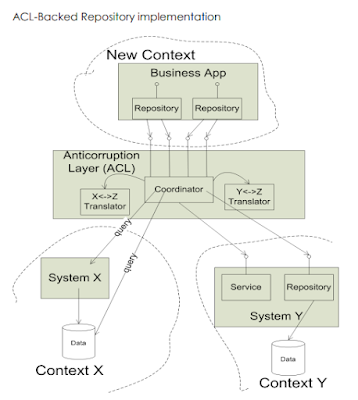
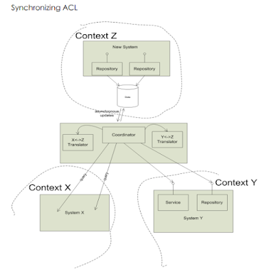
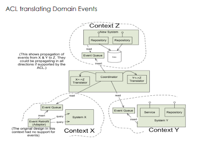

# DDD overview

# anatomy of domain-driven design

[The anatomy of domain driven design](./theanatomyofdomain-drivendesign.pdf)

# Putting the model to work
Domain-Driven Design is an approach to the development of complex software in which we:

- **Focus on the core domain**
- **Explore the models in a creative collaboration of domain practitioners**
- **speak a ubiquitous language within an explicitly bounded context.**

## Bounded Context
- Explicitly define the context within which a model applies.
- **Explicitly set boundaries in team organization, usage within specific application parts, and physical manifestations such as code bases and database schemas.**
- Apply continuous integration to keep the model concepts and terms strictly consistent within these bounds, but don't be distracted or confused by issues outside. 

## Ubiquitous Language
- **Use the model as the backbone of a language. Then, commit the team to exercise that language relentlessly in all communication within the team and in the code.**
- Use the same language in diagrams, writing, and speech within a bounded context.
- Recognize that a change in the language is a change to the model
iron out difficulties by experimenting with alternative expressions, which reflect alternative models. Then refactor the code, renaming classes, methods, and modules to conform to the new model.
- Resolve confusion over terms in conversation, in just the way we come to agree on the meaning of ordinary words.

# model-driven design
- tightly relating the code to an underlying model gives the code meaning and makes the model relevant.
- Design a portion of the software system to reflect the domain model literally so that the mapping is obvious.
- Revisit the model and modify it to be implemented more naturally in software, even as you seek to make it reflect deeper insight into the domain
- demand a single model that serves both purposes well, in addition to supporting a ubiquitous fluent language.
- Any technical person contributing to the model must spend some time touching the code, whatever primary role they play on the project.
- **Anyone responsible for changing code must learn to express a model through the code.**
- Every developer must be involved in discussing the model and contact domain experts.
- Those who contribute in different ways must consciously engage those who touch the code in a dynamic exchange of model ideas through the ubiquitous language.

## layered architecture
- isolate the expression of the domain model and the business logic, and eliminate any dependency on infrastructure, user interface, or even application reason that is not business logic. Concentrate all the code related to the domain model in one layer and isolate it from the user interface, application, and infrastructure code.
- **The domain objects, free of the responsibility of displaying themselves, storing themselves, managing application tasks, and so forth, can be focused on expressing the domain model.**
- This allows a model to evolve to be rich enough and clear enough to capture essential business knowledge and put it to work.

## entities
- When an object is distinguished by its identity rather than its attributes, make this primary to its definition in the model.
- **Keep the class definition simple and focused on life cycle continuity and identity.**
- Define a means of distinguishing each object regardless of its form or history
- be alert to requirements that call for matching objects by attributes.
- Define an operator that is guaranteed unique. This means of identification may come from the outside, or it may be an arbitrary identifier created by and for the system. Still, it must correspond to the identity distinctions in the model.
- aka reference objects
## value objects
- when you care only about the attributes and logic of an element of the model, classify it as a value object.
- Make it express the meaning of the attributes it conveys and give it related functionality.
- **Treat the value object as immutable. Make all operations side-effect-free functions that don't depend on any mutable state.**
- Don't give a value object any identity and avoid the design complexities necessary to main entities.

## domain events
- model information about activity in the domain as a series of discrete events. Represent each event as a domain event object.
- These are distinct from system events that reflect activity within the software itself. However, a system event is often associated with a domain event, either as part of a response to the domain event or to carry information about the domain event into the system.
- **Ignore irrelevant domain activity while making explicit the events that the domain experts want to track or be notified of or associated with state change in the other model objects.**

## services
- when a significant transformation process in the domain is not a natural responsibility of an entity or value object, add an operation to the model as a standalone interface declared as a service.
- Define a service contract, a set of assertions about interactions with the service. State these assertions in the ubiquitous language of a specific bounded context.
- Give the service a name, which also becomes a ubiquitous language.

## modules
- concepts should be divided into modules.
- Choose modules that tell the story of the system and contain a cohesive set of ideas. Give the modules the names that become part of the ubiquitous language. Modules are part of the model, and their names should reflect insight into the domain.
- Seek low coupling in the sense of concepts that can be understood and reasoned about independently. Then, refine the model until it partitions according to high-level domain concepts and decouples the corresponding code.

## aggregates
- **it challenging to guarantee the consistency of changes to objects in a model with complex associations.**
- Cluster the entities and value objects into aggregates and define boundaries around each.
- **Choose one entity to be the root of each sum, and allow external objects to hold references to the source only (regarding internal members passed out for use within a single operation only.**
- define properties and invariants for the aggregate as a whole and give enforcement responsibility to the root or some designated framework mechanism
- Use the exact aggregate boundaries to govern transactions and distribution
within an aggregate edge, apply consistency rules synchronously. Across borders, handle updates asynchronously
keep an aggregate together on one server. Allow different sums to be distributed among nodes.

## Repositories
- query access to sums expressed in the ubiquitous language.
- For each type of aggregate that needs global access, create a service that can provide the illusion of an in-memory collection of all objects of that aggregate's root type.
- Set up access through a well-known global interface.
  - Provide methods to add and remove objects, encapsulating the actual insertion or removal of data in the data store.
  - **Provide methods that select objects based on criteria meaningful to domain experts. For example, return fully instantiated objects or collections of objects whose attribute values meet the requirements, thereby encapsulating the actual storage and query technology, or return proxies that give the illusion of fully instantiated aggregates lazily.**
- **Provide repositories only for aggregate roots that actually need direct access. Keep application logic focused on the model, delegating all object storage and access to the repositories.**

## factories
- shift the responsibility for creating instances of complex objects and aggregates to a separate object, which may itself have no responsibility in the domain model but is still part of the domain design.
- Provide an interface that encapsulates all complex assemblies and does not require the client to reference the concrete classes of the instantiated objects.
- **Create an entire aggregate as a piece, enforcing its invariants.**
- Create complex value objects like a piece, possibly after assembling the elements with a builder.

# Supple design
- Supple design complements the deep modelling
- client developer, who weaves the domain objects into the application code or other domain layer code.
- **The client developer can flexibly use a minimal set of loosely coupled concepts to express a range of scenarios in the domain.**
- The effects of its code must be transparently obvious, so the consequences of a change will be easy to anticipate.
- **Making behaviour obvious**
- **reduces the cost of change**
  
## intention-revealing interfaces
- **name classes and operations to describe their effect and purpose, without reference to how they do what they promise.**
- This relieves the client developer of the need to understand the internals.
- **These names should conform to the ubiquitous language so that team members can quickly infer their meaning.**
- **Before creating it, write a test for behaviour to force your thinking into client developer mode.**
  
## assertions
- state post-conditions of operations and invariants of classes and aggregates with assertions
- **if assertions cannot be coded directly in your programming language, write automated unit tests for them.**
- Write them into documentation or diagrams to fit the project's development process style.

## closure of operations (not very clear to me yet)
- where it fits, define a function whose return type is the same as its arguments
- if the implementer has a state used in the computation. The implementer is a compelling operation argument, so the argument(s) and the return value should be the same type as the implementer.???
- Such an operation is closed under the set of instances of that type.
- A closed operation provides a high-level interface without introducing any dependency on other concepts.???

## declarative design
many of the benefits of the declarative design are obtained once you have combinable elements that communicate their meaning and have characterized or apparent effects or no observable effects at all

## conceptual contours
- decompose design elements (operations, interfaces, classes, and aggregates) into cohesive units, considering your intuition of the essential divisions in the domain.
- Observe the axes of change and stability through successive refactorings, and look for underlying conceptual contours that explain these shearing patterns.
- Align the model with the consistent aspects of the domain that make it a viable area of knowledge in the first place.

## context map
- to plot strategy, we need a realistic, large-scale view of model development extending across our project and others we integrate with.
- Identify each model in play on the project and define its bounded context. This includes the implicit models of non-object-oriented subsystems.
- Name each bounded context, and make the names part of the ubiquitous language
- describe the point of contact between the models, outlining explicit translation for any communication. Highlighting any sharing, isolation mechanism, and levels of influence.
- Map the existing terrain. Take up the transformations later.

## partnership
- when teams in two contexts succeed or fail together, a cooperative relationship often emerges
where development failure in either of two contexts would result in delivery failure for both, forging a partnership between the teams in charge of the two contexts. Institute a process for coordinated planning of development and joint management of integration.
- The teams must cooperate on the evolution of their interface to accommodate the developments needs of both systems.
- Interdependent features should be scheduled to complete for the same release.

## shared kernel
- sharing a part of the model and associated code is a very intimate interdependency, which can leverage design work or undermine it.
- Design with an explicit boundary some subset of the domain model that the teams agree to share. Keep this kernel small.
- Within this boundary, include this subset of the model, the subset of code or the database design associated with that part of the model.
- This explicitly shared stuff has a special status and shouldn't be changed without consultation with the other team.
- When functional integration is limited, the overhead of continuous integration of a significant context may be deemed too high. This may especially be true when the team does not have the skill or the political organization to maintain continuous integration or when a single team is simply too big and unwieldy.

## customer/supplier development
- when 2 teams are in an upstream-downstream relationship, where the upstream team may succeed independently of the fate of the downstream team, the needs of the downstream come to be addressed in a variety of ways with a wide range of consequences.
- Establish a clear customer/supplier relationship between the two teams, meaning downstream priorities factor into upstream planning.
- Negotiate and budget tasks for downstream requirements so that everyone understands the commitment and schedule
- jointly developed automated acceptance tests and validate the expected interface from the upstream. Adding these tests to the upstream team's test suite, to be run as part of its continuous integration, will free the upstream team to make changes without fear of downstream side effects.

## conformist
- similar to customer/supplier, but the upstream has no motivation to provide for the downstream team's need
- to eliminate the complexity of translation between bounded contexts by slavishly adhering to the model of the upstream team.
- Ubiquitous language with your upstream team will be shared.
- Altruism may be sufficient to get them to share information with you.

## anticorruption layer
- Translation becomes more complex when control or communication is insufficient to pull off a shared kernel, partner, or customer/supplier relationship. As a result, the translation takes on a more defensive tone.
- As a downstream client, create an isolating layer to provide your system with the functionality of the upstream system in terms of your own domain model.
- This layer talks to the other system through its existing interface, requiring little or no modification to the other system. Internally, the layer translates in one or both directions as necessary between the two models.

## open-host service
- Where integration is one-off, this approach of inserting a translation layer for each external system avoids corruption of the models with a minimum cost.
- Define a protocol that gives access to your subsystem as a set of services. Then, open the protocol so that all who need to integrate with you can use it.
- Enhance and expand the protocol to handle new integration requirements, except when a single team has idiosyncratic needs. Then, use a one-off translator to augment the protocol for that particular case so what the shared protocol can stay coherent and straightforward.
- When a subsystem has to be integrated with many others, customizing a translator for each can bog down the team. There is more and more to maintain and more and more to worry about when changes are made.

## Published language
- The translation between the models of two bounded contexts requires a common language.
- Use a well-documented shared language to express the necessary domain information as a common communication medium, translating as essential into and out of that language.
- Published language is often combined with open-host service.

## separate ways
declare a bounded context to have no connection to the others, allowing developers to find simple, specialized solutions within this small scope.
## big ball of mud
- well-defined context boundaries only emerge from intellectual choices and social forces (even though the people creating the systems may not always have been consciously aware of these causes at the time).
- Draw a boundary around the entire mess and designate it as a big ball of mud. Do not try to apply sophisticated modelling within this context.
- Be alert to the tendency for such systems to sprawl into other contexts.
# Distillation for strategic design
- how do you focus on your central problem and keep from drowning in a sea of side issues?
- Distillation is the process of separating the components of a mixture to extract the essence in a form that makes it more valuable and useful
- A model is a distillation of knowledge.

## core domain
- to make a domain model an asset, the critical core of that model has to be sleek and fully leveraged to create application functionality.
- Boil the model down. Define a core domain and provide a means of easily distinguishing it from the mass of supporting model and code.
- **Bring the most valuable and specialized concepts into sharp relief. Make the core small.**
- Apply top talent to the core domain, and recruit accordingly.
- **Spend the effort in the core to find a deep model and develop a supple design - sufficient to fulfill the system's vision.**

## generic subdomains
- some parts of the model add complexity without capturing or communicating specialized knowledge.
- Identify cohesive subdomains that are not the motivation for your project, factor out generic models of these subdomains and place them in separate modules.
- Leave no trace of your specialties in them.
- once they have been separated, give their continuing development lower priority than the core domain, and avoid assigning your core developers to the tasks (because they will gain little domain knowledge from them)
- also, consider off-the-shelf solutions or published models for these generic subdomains.

## domain vision statement
- the critical aspects of the domain model may span multiple bounded contexts, but by definition, these distinct models can't be structured to show their common focus.
- Write a short description (about one page) of the core domain and the value it will bring, the "value proposition." ignore those aspects that do not distinguish this domain model from others.
- Write this statement early and revise it as you gain new insight.

## highlighted core
- a domain vision statement identifies the core domain in broad terms, but it leaves the identification of the specific core model elements up to the vagaries of individual interpretation. Unless there is an exceptionally high level of communication on the team, the vision statement alone will have little impact.
- **The mental labour of constantly filtering the model to identify the essential parts absorbs concentration better spent on design thinking, and it requires comprehensive knowledge of the model. Therefore, the core domain must be made easier to see.**
- **Write a brief document (3-7 sparse pages) describing the core domain and the primary interactions among core elements.**
- Flag the elements of the core domain within the primary repository of the model without particularly trying to elucidate its role. Make it effortless for a developer to know what is in or out of the core.
- Although the vision statement and highlighted core inform and guide, they do not modify the model or the code itself.
- Partitioning generic subdomains physically removes some distracting elements.

## cohesive mechanisms
- structurally change the model and the design to make the core domain more visible and manageable.
- **The conceptual "what" is swamped by the mechanistic "how." Many methods that provide algorithms for resolving the problem obscure the methods that express the problem.**
- Partition a conceptually cohesive mechanism into a separate lightweight framework. Particularly watch for formalisms or well-documented categories of algorithms.
- **Expose the capabilities of the framework with an intention-revealing interface.**
- The other elements of the domain can focus on expressing the problem ("what"), delegating the intricacies of the solution ("how") to the framework.
- **Factoring out generic subdomains reduces clutter, and cohesive mechanisms serve to encapsulate complex operations. This leaves behind a more focused model, with fewer distractions that add no particular value to how users conduct their activities.**
- You are unlikely to find good homes for everything in the domain model that is not core.

## The segregated core
- approach to structurally marking off the core domain.
- Refactor the model to separate the core concepts from supporting players (including ill-defined ones) and strengthen the cohesion of the core while reducing its coupling to other code.
- Factor all generic or supporting elements into other objects and place them into different packages.

## abstract core
- The core domain model usually has so much detail that communicates the big picture.
- Identify the most fundamental differentiating concepts in the model and factor them into distinct classes, abstract classes, or interfaces.
- Design this abstract model to express most of the interaction between significant components.
- Place this abstract model in its own module, while the specialized, detailed implementation classes are left in their own modules defined by the subdomain.

# large scale structure for strategic design
- A "large-scale structure" is a language that lets you discuss and understand the system in broad strokes. A set of high-level concepts or rules, or both, establishes a pattern of design for an entire system.
- **Devise a pattern of rules or roles and relationships that will span the entire system and allow some understanding of each part's place in the whole-even without detailed knowledge of the part's responsibility.**
## evolving order
- Architectures can straitjacket a project with up-front design assumptions and take too much power away from the developers/designers of particular application parts. Soon, developers/designers of specific details of the applications will dumb down the application to fit the structure, or they will subvert it and have no structure, bringing back the problems of uncoordinated development.
- Let this large-scale conceptual structure evolve with the application, possibly changing to a completely different type of structure along the way. Don't constraint the detailed design and model decisions that must be made with thorough knowledge.
- The large-scale structure should be applied when a structure can be found that dramatically clarifies the system without forcing unnatural constraints on model development. Because an ill-fitting structure is worse than none, it is best not to shoot for comprehensiveness but rather to find a minimal set that solves the emerging problem. Less is more.

## system metaphor
- software designs tend to be abstract and hard to grasp. Developers and users alike need tangible ways to understand the system and share a view of the system as a whole.
- When a concrete analogy to the system emerges that captures the imagination of team members and seems to lead thinking in a helpful direction, adopt it as a large-scale structure.
- Organize the design around this metaphor and absorb it into the ubiquitous language.
- The system metaphor should facilitate communication about the system and guide the development. This increases consistency in different system parts, potentially even across different bounded contexts.
- Because all metaphors are inexact, continually reexamine the metaphor for overextension or inaptness, and be ready to drop it if it gets in the way.

## responsibility layers
- look at the conceptual dependencies in your model and the varying rates and sources of change of different parts of your domain.
- If you identify natural strata in the domain, cast them as broad abstract responsibilities.
- **These responsibilities should tell a story of your system's high-level purpose and design.**
- **Refactor the model so that the responsibilities of each domain object, aggregate, and module fit neatly within the responsibility of one layer.**

## knowledge level
- a group of objects that describe how another group of objects should behave.
- Create a distinct set of objects that can define and constrain the structure and behaviour of the basic model.
- **Keep these concerns separate as 2 "levels," one very concrete, the other reflecting rules and knowledge that a user or super-user can customize.**
  
## Pluggable component framework
- a pluggable component framework usually only comes into play after a few applications have already been implemented in the same domain.
- Distill an abstract core of interfaces and interactions and create a framework that allows diverse implementations of those interfaces to be freely substituted. Likewise, it will enable any application to use those components, so long as it operates strictly through the interfaces of the abstract core.

# Getting DDD started with Legacy Systems
## strategy 1: bubble context
- the legacy system already has an established model, albeit implicit, which can seldom be changed with a reasonable effort.
- Simply adding objects that express a distinct model without changing the ones already there will lead to conflicting rules and concepts.
- Introducing a complex new set of development principles and techniques is best done incrementally as in a pilot project, in a way that allows members of the team to gain experience and allows the organization to assess the approach.
- **This pilot project allows a small team to achieve a modest objective involving some complex domain logic and, ideally, one with some strategic value that is difficult to solve in a legacy context. Therefore, it is recommended to cherry-pick a small, self-disciplined team with control over its code to evolve a model that addresses the chosen area, relatively unconstrained by the concepts of the legacy systems.**
- The new functionality does not disappear. It will continue to be maintained as an extension of the legacy systems. The organization now has the experience to undertake more ambitious use of DDD.
- no synchronization risk (uses a legacy database)
- **works when there is a limited range of data needed from legacy**
- **A 'bubble' is a small bounded context established using an Anticorruption Layer (ACL) for the purpose of a particular development effort and not intended necessarily to be expanded or used for a long time.**

- **ACL should be explicitly addressed in budgeting and planning. It should be designed to keep it decoupled from the actual business logic of the new system.**
- A good anticorruption layer has a clean interface entirely in terms of the downstream model (in our case, the bubble model) that provides access to the information and services of the upstream system.
- **ACL allows development in the downstream context to focus on the business problem and not be distracted or complicated by dealing with the other system's distinct concepts and quirks.**
- **Any new information needed from the legacy context requires incorporating the new data into the bubble model, working out the mapping from the old model, and then the ACL. That's a high price, so we should choose functionality valuable enough to justify it.**
- Development in the bubble could go on for several months or, occasionally, in cases where the interface with other contexts is relatively narrow for a few years. However, it will not last forever.
- The bubble becomes the primary context for more ambitious new development. When this happens, the limitations of the bubble context may be judged unacceptable, and the strategy migrates to the autonomous bubble with synchronizing ACL. Then the bubble transforms into something more long-lasting.

## strategy 2: autonomous bubble
- The autonomous bubble is distinguished by the ability to run its software, for a time, cut off from other systems. Information may start to get stale, requests to external service requests start to queue up unfulfilled, but the internal behaviour of the software continues to work. 
- needs organization committed to significant new development with a unique design approach
- allows new data to be collected and used without involving legacy
- allows decoupled "product" to evolve
- may progress from a bubble context as development is scaled up on a successful pilot project.
- To enable autonomous context having its own data, ACL takes on the responsibility of synchronization between data stores in 2 contexts, which do not depend directly on each other. This ACL activity is asynchronous with any action in either context, with a service level agreement (SLA) regarding the freshness of the translated data.

### the nightly batch script: low-tech synchronizing ACL
- this could involve importing data from a file, kicking off a SQL script, taking data from one table, transforming it, and inserting it into another.
- SLA: open of business, next business day
- unnecessary coupling: synchronizing ACL mixed in with once-per-day business logic
- unnecessary coupling: multiple ACL(s) to various contexts lumped together.
- make sure you isolate the data copying and translation for your particular context into modules (one per context you are drawing on)
### messaging and domain events: a stylish synchronizing ACL
- This approach can support a range of SLA(s) and update a system while it is being used, while - batch scripts typically run while systems are off-line.
- Any information crossing a context boundary must be translated.
- Messages are always expressed in some language based on some system of abstractions (a model), and we should not let them enter a context that uses a different vocabulary and model.

- In the Bubble context, any new information that does not already exist in the legacy system somewhere must be added to the legacy system somewhere, even though it will not be used there! Then it must be mapped into the bubble context, increasing the dependency between the two systems. Clearly, this is not the strategy to introduce crucial new information.
- Development in the autonomous bubble is not so tightly bound to the older contexts. Therefore, the model in this context can be more innovative and trow more freely, and a fresh new product can be created.

## Strategy 3: exposing legacy assets as services
- one of the main challenges of SOA is the lack of attention to bounded contexts.
- Integrating with the legacy system, every new development effort gets dragged back into the old concepts and potentially tangled into the old implementation.
- Legacy assets were developed with a particular feature set in mind and are highly coupled to those features. This makes it hard to access what you want directly without going through layers designed for a very different purpose.
- open host service over anticorruption layer
- Commons Context, the most basic and widely used information, can be interchanged throughout the organization via one standard interchange model, the "Tragedy of the Commons." But, unfortunately, the commons are prone to dumping.
- FIX has a way of describing an enormous range of financial trades and transactions and is used to interchange data between all sorts of organizations. 
- a focused language, crafted for a modest suite of related services, usually gives the most satisfying balance between the fragmentation of the one-off service model and the total unification of the commons and the industry-standard
- we should get over the attitude that the ultimate goal is to eventually replace these older systems. That is a futile treadmill. Creating a bubble can allow you to selectively move responsibilities for the core domain, where you want to innovate, out into a new context.
- Open host services over an ACL can give convenient, decoupled access to functionality and data assets embedded in the older systems. Once the legacy system is stable, not responsible for the core domain, and provides access to assets, why not let it be? You have better things to do right now.

## strategy 4: expanding a bubble
- one challenge that is particularly acute in a bubble is how critical it is to coordinate the incremental development of the new business functionality and the anticorruption layer in parallel. This affects the design and the planning of the sequence in which the features are written.
- design freedom is the point of a bubble, the bubble context with an umbilical ACL gives a little freedom, while the autonomous bubble can give a lot if properly managed.
- things to think about for ACL
  - does the new feature draw on information that is already being brought in by the existing anti-corruption layer
  - will it require new mapping of legacy information? what is the scope of that work?
if multiple features were chosen for the iteration call for new mapping, are they drawing on the same information, or does each call for different information?
  - **to make development manageable, the priority of business features must be balanced with the need to group work on features that use similar legacy data sets, with parallel planning of the necessary enhancements to the anticorruption layer.**
  - if not careful, the bulk of the project's effort will go into implementing a big translator interface, each element of which is only sparsely used. This gives a low ROI for the context boundary, and eventually an unsustainable maintenance burden. Or developers would take shortcuts by making sloppy mappings or simply bypassing the ACL, pull the data they need directly from the legacy system, and the context boundary will erode and collapse.
- the developers working on various features all drawing that same data can collaborate to
  - model the new information by adding concepts to the bubble context
  - extend the ACL to bring in the new information. (This should be an explicit development task, not just part of a 'user story')
- Trying to reuse the fields/data from legacy without a mapping is a mistake. The concept represented by those fields was never mapped to a concept in the downstream context. We have no idea what they mean in the downstream context or how they relate to other concepts in the downstream model. It creates bigger objects with more dependencies and that is poorly defined.
  - when you must make choice, try to make the bubble's model capable of expressing the essential meaning of the new information in terms consistent with the other concepts of that model. It is inadvisable to load objects down with information that does not directly pertain to their jobs, so it is best to do a bit more modelling work to find good homes for the new information.
  - bypass the context altogether, give the client access to the context where the information originated or pass it some other way (particularly when the new data is for display only) Sometimes this is a good time to expose a legacy asset with a service as in Strategy 3.
  - pass the information unchanged through new context. (Not recommended) since you have bored a tunnel through your anticorruption layer and compromised your ability to evolve your new model independently of the legacy system.

- **adding data is a modelling job**
  - It is a way of referring to some aspect of some business situation, and the goal when translating this new element into your bubble context is to enrich the ubiquitous language to be able to express these concerns.
  - explore new scenarios in the DDD modelling whirlpool
  - in order to pull in more data to use in logic or key definitions in your context, you should follow the whirlpool steps
    - hammer out a reference scenario that illustrates why you need a new information
    - brainstorm model changes that incorporate that information organically
    - context boundary leakage gets out of hand quickly and suddenly you may wake up to realize that your new software is conforming to the legacy model and does not give the desired fresh start for the business.

# Quotes
"Sub-domain is a problem space concept, Bounded context is a solution space concept."

"As software developers, we fail in two ways: We build the thing wrong, or we build the wrong thing."

"A project faces serious problems when its language is fractured."

"Integration is always expensive, and sometimes the benefit is small."

"Architectures can straitjacket a project with up-front design assumptions and take too much power away from the developers/designers of particular parts of the application. Soon, developers/designers of particular parts of the applications will dumb down the application to fit the structure, or they will subvert it and have no structure at all, bringing back the problems of uncoordinated development.."

"Each time we decide to call upon such a capability for some new purpose, someone has to meticulously sift through it all, finding an odd combination of inputs that will evoke the behaviour or return the information we want without messing anything else up, it takes trial and error and extensive testing, and the result is typically brittle. The developer who made it work walks away exhausted, successful on his terms, leaving the system even more complex than before. Then, the next time a closely related yet not identical need comes along, it starts all over.."

"Common context, the tragedy of commons."

"adding data is a way of referring to a core aspect of some business situation, and enriching ubiquitous language to be able to express these concerns. "

**still under constructions**
**Next Steps:**
review design DDD quickly
review Distilled DDD from vaugh vernon

# References
https://www.domainlanguage.com/wp-content/uploads/2016/05/DDD_Reference_2015-03.pdf
https://devopedia.org/domain-driven-design
https://philippe.bourgau.net/categories/#squash-bduf-with-event-storming-series
https://www.infoq.com/articles/ddd-contextmapping/
https://dev.to/salah856/implementing-domain-driven-design-part-i-5a72
https://github.com/leubedane/iddd-redbook-summary
https://jimmybogard.com/domain-driven-refactoring-intro/
https://medium.com/@ruxijitianu/summary-of-the-domain-driven-design-concepts-9dd1a6f90091
https://www.amazon.ca/Domain-Driven-Design-Distilled-Vaughn-Vernon-ebook/dp/B01JJSGE5S/ref=tmm_kin_swatch_0?_encoding=UTF8&qid=&sr=
https://www.amazon.ca/Domain-Driven-Design-Distilled-Vaughn-Vernon-ebook/dp/B01JJSGE5S/ref=tmm_kin_swatch_0?_encoding=UTF8&qid=&sr=
https://matfrs2.github.io/RS2/predavanja/literatura/Avram%20A,%20Marinescu%20F.%20-%20Domain%20Driven%20Design%20Quickly.pdf
https://devpath.pro/methodologies/book-review-domain-driven-design-quickly/
https://medium.com/inato/an-introduction-to-domain-driven-design-386754392465