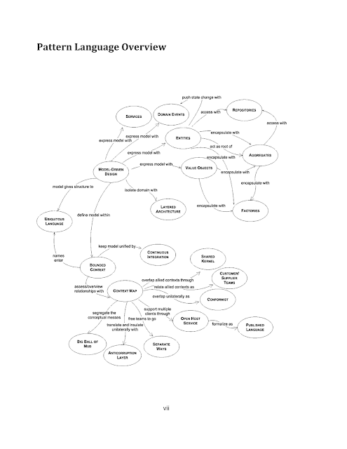
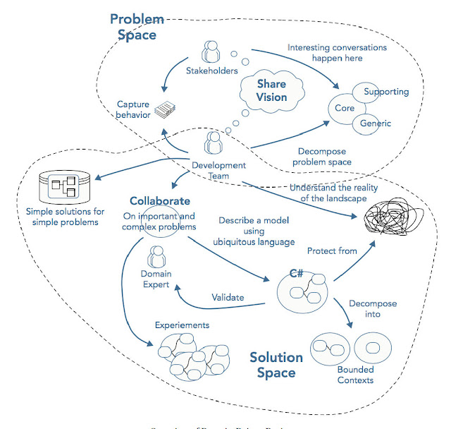
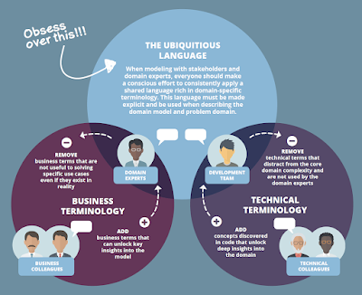
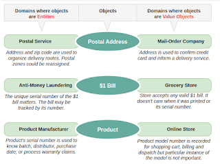

# DDD overview

# anatomy of domain-driven design

[The anatomy of domain driven design](./theanatomyofdomain-drivendesign.pdf)

# Putting the model to work
Domain-Driven Design is an approach to the development of complex software in which we:

- **Focus on the core domain**
- **Explore the models in a creative collaboration of domain practitioners**
- **speak a ubiquitous language within an explicitly bounded context.**

## Bounded Context
- Explicitly define the context within which a model applies.
- multiple models are in play on any large project. Yet the code based on distinct models is combined, software becomes buggy, unreliable, and difficult to understand. Communications among team members confused. It is often unclear what context a model should not be applied.
- **Explicitly set boundaries in team organization, usage within specific application parts, and physical manifestations such as code bases and database schemas.**
- Apply continuous integration to keep the model concepts and terms strictly consistent within these bounds, but don't be distracted or confused by issues outside. 
- **bounded context are not modules**
  - modules organize the elements within one model
  - the separate name spaces that modules create within a bounded context actually make it harder to spot accidental model fragmentation.

- **recognizing splinters within a bounded context**.
  - **Duplicate concepts**: The same concept is represented and implemented in more than one way. This means that when a concept changes, it has to be updated in several places, and the developers need to be aware of the several different ways of doing one same thing, as well as the subtle difference within them.
  - **False cognates**: When two people are using the same term and they think they are talking about the same thing, but they are actually thinking of different things.

- the internal consistency of a model, such that each term is unambiguous and no rules contradict, is called unification.
  - **total unification of the domain model for a large system will not be feasible or cost-effective.**
  - risks for unifying all the software in a large project under single model
    - too many legacy replacement may be attempted at once
    - large projects may bog down because the coordination overhead exceeds their abilities.
    - applications with specialized requirements may have to use models that don't fully satisfy their needs, forcing them to put behavior elsewhere
    - conversely, attempting to satisfy everyone with single model may lead to complex options that make the model difficult to use.

## Ubiquitous Language
- **Use the model as the backbone of a language. Then, commit the team to exercise that language relentlessly in all communication within the team and in the code.**
- Use the same language in diagrams, writing, and speech within a bounded context.
- Recognize that a change in the language is a change to the model
iron out difficulties by experimenting with alternative expressions, which reflect alternative models. Then refactor the code, renaming classes, methods, and modules to conform to the new model.
- Resolve confusion over terms in conversation, in just the way we come to agree on the meaning of ordinary words.

# model-driven design

- tightly relating the code to an underlying model gives the code meaning and makes the model relevant.
- Design a portion of the software system to reflect the domain model literally so that the mapping is obvious.
- Revisit the model and modify it to be implemented more naturally in software, even as you seek to make it reflect deeper insight into the domain
- demand a single model that serves both purposes well, in addition to supporting a ubiquitous fluent language.
- Any technical person contributing to the model must spend some time touching the code, whatever primary role they play on the project.
- **Anyone responsible for changing code must learn to express a model through the code.**
- Every developer must be involved in discussing the model and contact domain experts.
- Those who contribute in different ways must consciously engage those who touch the code in a dynamic exchange of model ideas through the ubiquitous language.

- A model can be very descriptive of the domain while being unrepresentable in code. If the implementation is not considered while building the model:

  - The model can have objects and relations that cannot be stored in a database.
  - Model will detail irrelevant subjects and ignore important subjects.
  - Some discoveries about the domain might not be apparent without considering the implementation details.

- **Design Model vs Analysis Model**
  - There are 2 types of models:

    - Analysis Model: Captures the fundamentals of the domain concepts in comprehensible, expressive way. (Focuses on the domain)
    - Design Model: Specify a set of components that can be constructed using programming tools and correctly solves the problem. (Focuses on the implementation)
  Model-Driven Design
    - Model-Driven Design integrates both Analysis and Design models and it serves both purposes.

- The underlying model of the system should be the same model shown to users. Otherwise, confusion will arise and the language will not be descriptive enough. Having different models can also cause unexpected behaviors to the users. An example to that is how Microsoft Internet Explorer modeled the bookmarks.

  - For the user, "Favorites" was a list of URLs but to the actual implementation a "Favorite" is a file that contains a URL. This meant that URL names had to follow windows file naming restrictions. So if a user saved a URL and named it "AOT: 3" they will get an error stating that file names cannot contain special characters like ":" which is very confusing.

- [model exploration whirlpool](https://www.domainlanguage.com/wp-content/uploads/2016/04/DDD_Model_Exploration_Whirlpool.png)

## layered architecture
- isolate the expression of the domain model and the business logic, and eliminate any dependency on infrastructure, user interface, or even application reason that is not business logic. Concentrate all the code related to the domain model in one layer and isolate it from the user interface, application, and infrastructure code.
- **The domain objects, free of the responsibility of displaying themselves, storing themselves, managing application tasks, and so forth, can be focused on expressing the domain model.**
- This allows a model to evolve to be rich enough and clear enough to capture essential business knowledge and put it to work.

## entities
- When an object is distinguished by its identity rather than its attributes, make this primary to its definition in the model.
- **Keep the class definition simple and focused on life cycle continuity and identity.**
- Define a means of distinguishing each object regardless of its form or history
- be alert to requirements that call for matching objects by attributes.
- Define an operator that is guaranteed unique. This means of identification may come from the outside, or it may be an arbitrary identifier created by and for the system. Still, it must correspond to the identity distinctions in the model.
- aka reference objects
## value objects
- when you care only about the attributes and logic of an element of the model, classify it as a value object.
- Make it express the meaning of the attributes it conveys and give it related functionality.
- **Treat the value object as immutable. Make all operations side-effect-free functions that don't depend on any mutable state.**
- Don't give a value object any identity and avoid the design complexities necessary to main entities.

## domain events
- model information about activity in the domain as a series of discrete events. Represent each event as a domain event object.
- These are distinct from system events that reflect activity within the software itself. However, a system event is often associated with a domain event, either as part of a response to the domain event or to carry information about the domain event into the system.
- **Ignore irrelevant domain activity while making explicit the events that the domain experts want to track or be notified of or associated with state change in the other model objects.**

## services
- when a significant transformation process in the domain is not a natural responsibility of an entity or value object, add an operation to the model as a standalone interface declared as a service.
- Define a service contract, a set of assertions about interactions with the service. State these assertions in the ubiquitous language of a specific bounded context.
- Give the service a name, which also becomes a ubiquitous language.

## modules
- concepts should be divided into modules.
- Choose modules that tell the story of the system and contain a cohesive set of ideas. Give the modules the names that become part of the ubiquitous language. Modules are part of the model, and their names should reflect insight into the domain.
- Seek low coupling in the sense of concepts that can be understood and reasoned about independently. Then, refine the model until it partitions according to high-level domain concepts and decouples the corresponding code.

## aggregates
- **it challenging to guarantee the consistency of changes to objects in a model with complex associations.**
- Cluster the entities and value objects into aggregates and define boundaries around each.
- **Choose one entity to be the root of each sum, and allow external objects to hold references to the source only (regarding internal members passed out for use within a single operation only.**
- define properties and invariants for the aggregate as a whole and give enforcement responsibility to the root or some designated framework mechanism
- Use the exact aggregate boundaries to govern transactions and distribution
within an aggregate edge, apply consistency rules synchronously. Across borders, handle updates asynchronously
keep an aggregate together on one server. Allow different sums to be distributed among nodes.

## Repositories
- query access to sums expressed in the ubiquitous language.
- For each type of aggregate that needs global access, create a service that can provide the illusion of an in-memory collection of all objects of that aggregate's root type.
- Set up access through a well-known global interface.
  - Provide methods to add and remove objects, encapsulating the actual insertion or removal of data in the data store.
  - **Provide methods that select objects based on criteria meaningful to domain experts. For example, return fully instantiated objects or collections of objects whose attribute values meet the requirements, thereby encapsulating the actual storage and query technology, or return proxies that give the illusion of fully instantiated aggregates lazily.**
- **Provide repositories only for aggregate roots that actually need direct access. Keep application logic focused on the model, delegating all object storage and access to the repositories.**

## factories
- shift the responsibility for creating instances of complex objects and aggregates to a separate object, which may itself have no responsibility in the domain model but is still part of the domain design.
- Provide an interface that encapsulates all complex assemblies and does not require the client to reference the concrete classes of the instantiated objects.
- **Create an entire aggregate as a piece, enforcing its invariants.**
- Create complex value objects like a piece, possibly after assembling the elements with a builder.

# Supple design
- Supple design complements the deep modelling
- client developer, who weaves the domain objects into the application code or other domain layer code.
- **The client developer can flexibly use a minimal set of loosely coupled concepts to express a range of scenarios in the domain.**
- The effects of its code must be transparently obvious, so the consequences of a change will be easy to anticipate.
- **Making behaviour obvious**
- **reduces the cost of change**
  
## intention-revealing interfaces
- **name classes and operations to describe their effect and purpose, without reference to how they do what they promise.**
- This relieves the client developer of the need to understand the internals.
- **These names should conform to the ubiquitous language so that team members can quickly infer their meaning.**
- **Before creating it, write a test for behaviour to force your thinking into client developer mode.**
  
## assertions
- state post-conditions of operations and invariants of classes and aggregates with assertions
- **if assertions cannot be coded directly in your programming language, write automated unit tests for them.**
- Write them into documentation or diagrams to fit the project's development process style.

## closure of operations (not very clear to me yet)
- where it fits, define a function whose return type is the same as its arguments
- if the implementer has a state used in the computation. The implementer is a compelling operation argument, so the argument(s) and the return value should be the same type as the implementer.???
- Such an operation is closed under the set of instances of that type.
- A closed operation provides a high-level interface without introducing any dependency on other concepts.???

## declarative design
many of the benefits of the declarative design are obtained once you have combinable elements that communicate their meaning and have characterized or apparent effects or no observable effects at all

## conceptual contours
- decompose design elements (operations, interfaces, classes, and aggregates) into cohesive units, considering your intuition of the essential divisions in the domain.
- Observe the axes of change and stability through successive refactorings, and look for underlying conceptual contours that explain these shearing patterns.
- Align the model with the consistent aspects of the domain that make it a viable area of knowledge in the first place.

## context map
- we should not directly use functionality and data structures through different bounded contexts. The bounded contexts must be encapsulated, as independent as possible. To reach this goal, bounded contexts must communicate through abstractions (interfaces) and, if necessary, translation layers or even anti-corruption layers.
To make the bounded contexts ecosystems explicitly clear, encapsulated, loosely coupled and high cohesive, we should:

- Create a global view of all bounded contexts and their relations, using context maps, naming them and adding them to the ubiquitous language. 
  - Identify the points of contact between bounded contexts, together with the used translations and abstractions. All developers must know the boundaries and to what context any given code unit belongs to.
  - Personally, I find that having diagrams of the context maps hanging in the walls of the development offices is a great way of communicating the boundaries to the team, and keeping them in mind at all times. They should include their components, contact points, translator layers, and anti-corruption layers.
  - Define teams organization to match the technical and conceptual bounded contexts we (want to) have in the project (Conway’s law).
  - Personally I also find it natural and logic to explicitly define the bounded contexts as modules and sub-modules, in the project structure.
  - Name each bounded context, and make the names part of the ubiquitous language
  - describe the point of contact between the models, outlining explicit translation for any communication. Highlighting any sharing, isolation mechanism, and levels of influence.
  - Map the existing terrain. Take up the transformations later.

## partnership
- when teams in two contexts succeed or fail together, a cooperative relationship often emerges
where development failure in either of two contexts would result in delivery failure for both, forging a partnership between the teams in charge of the two contexts. Institute a process for coordinated planning of development and joint management of integration.
- The teams must cooperate on the evolution of their interface to accommodate the developments needs of both systems.
- Interdependent features should be scheduled to complete for the same release.

## shared kernel
- sharing a part of the model and associated code is a very intimate interdependency, which can leverage design work or undermine it.
- Design with an explicit boundary some subset of the domain model that the teams agree to share. Keep this kernel small.
- Within this boundary, include this subset of the model, the subset of code or the database design associated with that part of the model.
- This explicitly shared stuff has a special status and shouldn't be changed without consultation with the other team.
- When functional integration is limited, the overhead of continuous integration of a significant context may be deemed too high. This may especially be true when the team does not have the skill or the political organization to maintain continuous integration or when a single team is simply too big and unwieldy.

## customer/supplier development
- when 2 teams are in an upstream-downstream relationship, where the upstream team may succeed independently of the fate of the downstream team, the needs of the downstream come to be addressed in a variety of ways with a wide range of consequences.
- Establish a clear customer/supplier relationship between the two teams, meaning downstream priorities factor into upstream planning.
- Negotiate and budget tasks for downstream requirements so that everyone understands the commitment and schedule
- The customer needs are the priority while deciding the schedule of the supplier.
- jointly developed automated acceptance tests and validate the expected interface from the upstream. Adding these tests to the upstream team's test suite, to be run as part of its continuous integration, will free the upstream team to make changes without fear of downstream side effects.
- Crucial, for a customer/supplier relation to work, its that the involved teams work under the same management, who should be as hierarchically close as possible to the actual teams.

## conformist
- similar to customer/supplier, but the upstream has no motivation to provide for the downstream team's need
- to eliminate the complexity of translation between bounded contexts by slavishly adhering to the model of the upstream team.
- Ubiquitous language with your upstream team will be shared.
- Altruism may be sufficient to get them to share information with you.
- **Abandon the supplier**:  In case there are better options or the added value of maintaining such relation is not worth it. [SEPARATE WAYS]
- **Take full responsibility for translation**: If the supplier can not be abandoned but the technical quality is less than acceptable. [ANTI-CORRUPTION LAYER]
- **Adopt the foreign model**: If the quality of the supplier is acceptable and compatible, we can fully adopt its model. [CONFORMIST]
- The conformist approach can simplify integration enormously, as no translation nor anti-corruption layers would be needed, and it would provide the same ubiquitous language to both teams.
- **Shared Kernel Vs Conformist**
  - They both deal with a situation where two bounded contexts share part of the model. However, the shared kernel is appropriate only when the teams owning the modules can coordinate and collaborate tightly. When we have a situation where there is a customer/supplier frame, and collaboration is not possible, we need to use a conformist approach, or an Anti-Corruption layer.

## anti-corruption layer

- Translation becomes more complex when control or communication is insufficient to pull off a shared kernel, partner, or customer/supplier relationship. As a result, the translation takes on a more defensive tone.
- As a downstream client, create an isolating layer to provide your system with the functionality of the upstream system in terms of your own domain model.
- This layer talks to the other system through its existing interface, requiring little or no modification to the other system. Internally, the layer translates in one or both directions as necessary between the two models.
- The Anti-Corruption layer is implemented using:
  - **FACADE**
    - An abstraction layer on top of a system API, as to limit and simplify the usage of the underlying API.
  - **ADAPTER**
    - Which allow us to connect to different subsystems/APIs through a stable interface, implemented by all adapters who connect to equivalent subsystems/APIs.
  - **TRANSLATOR**
    - A stateless object used by the adapters, and which belongs to a specific adapter. They hold the logic to perform the conversion of conceptual objects or Entities, from one subsystem to another.

- Translation layer Vs Anti-corruption layer
  - The translation layer is collaboratively maintained by the teams owning both bounded contexts.
  - The anti-corruption layer is fully maintained by one of the team, the one owning the client module.

## open-host service
- Where integration is one-off, this approach of inserting a translation layer for each external system avoids corruption of the models with a minimum cost.
- Define a protocol that gives access to your subsystem as a set of services. Then, open the protocol so that all who need to integrate with you can use it.
- Enhance and expand the protocol to handle new integration requirements, except when a single team has idiosyncratic needs. Then, use a one-off translator to augment the protocol for that particular case so what the shared protocol can stay coherent and straightforward.
- When a subsystem has to be integrated with many others, customizing a translator for each can bog down the team. There is more and more to maintain and more and more to worry about when changes are made.

## Published language
- The translation between the models of two bounded contexts requires a common language.
- Use a well-documented shared language to express the necessary domain information as a common communication medium, translating as essential into and out of that language.
- Published language is often combined with open-host service.
- data must flow through those Services, in some language they can all understand. This language is a textual representation of the data, its a Data Interchange Language. There are currently several examples of such languages, like XML or JSON, and there are even more specific languages based on base languages like the mentioned XML or JSON. For example, a widely used specific XML representation of pharmaceutical data.
- direct translation to and from the existing domain models may not be a good solution. Those models may be overly complex or poorly factored. They are probably undocumented. If one is used as a data interchange language, it essentially become frozen and cannot respond to new development needs.

## separate ways

- declare a bounded context to have no connection to the others, allowing developers to find simple, specialized solutions within this small scope.
- "*Integration is always expensive. Sometimes the benefit is small.*"
- We should only integrate sub-systems if we really, REALLY, need to. We should, as much as possible, define bounded contexts that are completely independent, completely disconnected from other bounded contexts, and therefore have no need for integration.

## big ball of mud
- well-defined context boundaries only emerge from intellectual choices and social forces (even though the people creating the systems may not always have been consciously aware of these causes at the time).
- Draw a boundary around the entire mess and designate it as a big ball of mud. Do not try to apply sophisticated modelling within this context.
- Be alert to the tendency for such systems to sprawl into other contexts.

# Distillation for strategic design
- how do you focus on your central problem and keep from drowning in a sea of side issues?
- Distillation is the process of separating the components of a mixture to extract the essence in a form that makes it more valuable and useful
- A model is a distillation of knowledge.

## Integrating sub-modules

- A large scale domain model is composed of smaller domain models.
- However, the smaller domain models don’t even have to agree on their view of the global domain model. As long as they operate on their own, we can maintain their integrity.
- It’s only when they need to integrate, that we might need to find common views on the models.

- Several strategies can be used to integrate sub-models:

  - Draw a Context Map of the **current** state of the model;
  - Define the Bounded Contexts borders with the whole dev team;
  - Guarantee that the Bounded Contexts borders and relation are known and understood by the whole dev team;
  - We must carefully model **aiming at small or large Bounded Contexts** by considering their advantages:
    - Advantages of large models:
      - Its easier to understand one model than several models plus their mappings;
      - There is no need for translation layers, which might be complex;
      - One shared language eases communication.
    - Advantages of small models:
      - Needs less communication between developers working in the same model;
      - Its easier to manage smaller code bases and teams;
      - Smaller contexts are simpler, requiring less skills of versatile abstract models from the developers;
      - Smaller models provide more flexibility to the global model.
      - continuous integration is easier with smaller teams and code bases.
  - Identify and alienate what is not part of our bounded context. A good starting is to exclude **what can not change** and **what we do not need** in our bounded context;
  - When **integrating external systems**, we can consider 3 patterns:
    - SEPARATE WAYS: Only integrate if we really need to, otherwise keep them completely isolated;
    - CONFORMIST: Fully adhere and rely on the external system model;
    - ANTI-CORRUPTION LAYER: Completely isolate the two systems, allowing them to communicate through a middle-ware, requiring no changes to either system.
  - When **integrating internal systems** (inside the same bounded context) we can:
    - Use a SHARED KERNEL to split relatively independent functionality into separate bounded contexts.
    - Set up CUSTOMER/SUPPLIER DEV TEAMS, if all the dependencies of the subsystems go in one direction;
    - Go SEPARATE WAYS, if for some reason its not possible to integrate the sub-systems;
    - Use a TRANSLATION LAYER, to connect both systems, which is maintained by the teams of both systems.
  - Deployment of new versions must be carefully coordinated by the teams owning the bounded contexts that connect, and as such the Bounded Contexts boundaries must be defined with these issues in mind:
    - Customer/Supplier structures must be tested together to prevent regressions;
    - Long deployments must be managed carefully to minimize issues with data migration temporary inconsistencies;
    - A Shared Kernel update must be tested and verified to satisfy all client systems to prevent regressions.
  - In the end, like most architectural decisions, the decision of how to integrate the sub-models in our global model, relies on trade-offs.
  - Here, in the extremes, we are trading off decoupled logic and management of that logic, for easier and faster integration of functionality.
  - [decouple logic and simplicity trade off](./decoupling_vs_simplicity.png)

## Refactoring Bounded Contexts ecosystem

- When we already have a system in place and we want to refactor it, the first step is to identify the current situation. For this, we need to create a schema of the current configuration of the bounded contexts (sub-models) in our system.

- From this clear view of the current situation, we can start breaking or merging contexts. While breaking up a bounded context is usually easy, merging them is usually quite difficult, as there can exist very different concepts and models. We will typically want to merge contexts when there is too much translation overhead or duplication.

- **From SEPARATE WAYS to SHARED KERNEL**
  - Define one of 3 strategies:
    - Refactor one context into the other context model;
    - Create a new context with the best pieces of each of the contexts;
    - Create a completely new, deeper model, which can replace both the initial models.
  - Create a small team with developers from both the initial teams;
  - Define the new shared model:
    - Decide the code to be shared, identifying overlaps/duplications in both initial models;
    - Decide naming conventions;
  - Create a basic test suite for the shared kernel, which will grow along with the implementation;
  - Implement the new model, merging frequently and rethinking it when needed;
    - Start simple, with code that is non-critical, duplicated in both contexts. Something being translated is a good choice;
  - Integrate the original contexts with the new Shared Kernel;
  - Remove any obsolete code (translation layers, etc.).

- **From SHARED KERNEL to CONTINUOUS INTEGRATION**

  - If the Shared Kernel continues to grow, maybe we should completely merge the Bounded Contexts. This, however, involves not only the code but also the teams structure, their work-flow and their language.

    - Create the same work-flow in both teams;
    - Set-up Continuous Integration in both teams;
    - Circulate developers in both teams, as means to sharing and spreading knowledge;
    - Distill each model individually;
    - Start merging the core domain, doing it as fast as possible, prioritizing it above most new development, so we don’t lose the momentum. Beware not to leave out any specialized functionality needed by the users;
    - As the Shared Kernel grows, increase the integration frequency until we have continuous integration;
    - The goal is to, in the end, have one big team, or two small teams who circulate members and do continuous integration.

- **Phasing out a legacy system**

Phasing out a legacy system means, most of the times, replacing it for one or several newer systems.

  - Identify a small piece of the legacy system that can be moved to one of the new systems;
  - Identify additions needed in the Anti-Corruption layer;
  - Implement
  - Deploy
  - Identify obsolete code in the Anti-Corruption layer and remove it;
  - Identify obsolete code in the legacy system and, if possible, remove it.

- **From OPEN HOST SERVICE to PUBLISHED LANGUAGE**

Sometimes, when in an Open Host Service architecture, we will have several ad-hoc protocols specific to each communication situation. There is no common, standard communication protocol.

As the need to integrate with more systems grows, the amount of communication specificities grows as well: Scalability and maintainability are at risk.

Therefore we need a common, standard, communication Interchange Language that any system con use to communicate with our system, we need a published language:

- If possible, use an industry standard language;
- If its not possible to use an industry standard language, create your own:
  - Start by making the core domain as clear as possible;
  - Use the core domain as the base for the new interchange language;
  - If possible, use a general purpose Interchange Language Syntax (XML, JSON) as a base for our new Interchange Language;
  - Publish the language, making it known to all involved in the systems collaboration;
  - Publish any architectural changes as well;
  - Build translation layers for all collaborating systems;
  - Switch to the new Interchange Language.
- the published language must be stable, yet you'll still need the freedom to change the host's model as you continue your relentless refactoring. Therefore, do not equate the interchange language and the model of the host. Keeping them close together will reduce the translation overhead.

## core domain
- to make a domain model an asset, the critical core of that model has to be sleek and fully leveraged to create application functionality.
- Boil the model down. Define a core domain and provide a means of easily distinguishing it from the mass of supporting model and code.
- **Bring the most valuable and specialized concepts into sharp relief. Make the core small.**
- Apply top talent to the core domain, and recruit accordingly.
- **Spend the effort in the core to find a deep model and develop a supple design - sufficient to fulfill the system's vision.**

## generic subdomains
- some parts of the model add complexity without capturing or communicating specialized knowledge.
- Identify cohesive subdomains that are not the motivation for your project, factor out generic models of these subdomains and place them in separate modules.
- Leave no trace of your specialties in them.
- once they have been separated, give their continuing development lower priority than the core domain, and avoid assigning your core developers to the tasks (because they will gain little domain knowledge from them)
- also, consider off-the-shelf solutions or published models for these generic subdomains.

## domain vision statement
- the critical aspects of the domain model may span multiple bounded contexts, but by definition, these distinct models can't be structured to show their common focus.
- Write a short description (about one page) of the core domain and the value it will bring, the "value proposition." ignore those aspects that do not distinguish this domain model from others.
- Write this statement early and revise it as you gain new insight.

## highlighted core
- a domain vision statement identifies the core domain in broad terms, but it leaves the identification of the specific core model elements up to the vagaries of individual interpretation. Unless there is an exceptionally high level of communication on the team, the vision statement alone will have little impact.
- **The mental labour of constantly filtering the model to identify the essential parts absorbs concentration better spent on design thinking, and it requires comprehensive knowledge of the model. Therefore, the core domain must be made easier to see.**
- **Write a brief document (3-7 sparse pages) describing the core domain and the primary interactions among core elements.**
- Flag the elements of the core domain within the primary repository of the model without particularly trying to elucidate its role. Make it effortless for a developer to know what is in or out of the core.
- Although the vision statement and highlighted core inform and guide, they do not modify the model or the code itself.
- Partitioning generic subdomains physically removes some distracting elements.

## cohesive mechanisms
- structurally change the model and the design to make the core domain more visible and manageable.
- **The conceptual "what" is swamped by the mechanistic "how." Many methods that provide algorithms for resolving the problem obscure the methods that express the problem.**
- Partition a conceptually cohesive mechanism into a separate lightweight framework. Particularly watch for formalisms or well-documented categories of algorithms.
- **Expose the capabilities of the framework with an intention-revealing interface.**
- The other elements of the domain can focus on expressing the problem ("what"), delegating the intricacies of the solution ("how") to the framework.
- **Factoring out generic subdomains reduces clutter, and cohesive mechanisms serve to encapsulate complex operations. This leaves behind a more focused model, with fewer distractions that add no particular value to how users conduct their activities.**
- You are unlikely to find good homes for everything in the domain model that is not core.

## The segregated core
- approach to structurally marking off the core domain.
- Refactor the model to separate the core concepts from supporting players (including ill-defined ones) and strengthen the cohesion of the core while reducing its coupling to other code.
- Factor all generic or supporting elements into other objects and place them into different packages.

## abstract core
- The core domain model usually has so much detail that communicates the big picture.
- Identify the most fundamental differentiating concepts in the model and factor them into distinct classes, abstract classes, or interfaces.
- Design this abstract model to express most of the interaction between significant components.
- Place this abstract model in its own module, while the specialized, detailed implementation classes are left in their own modules defined by the subdomain.

# large scale structure for strategic design
- A "large-scale structure" is a language that lets you discuss and understand the system in broad strokes. A set of high-level concepts or rules, or both, establishes a pattern of design for an entire system.
- **Devise a pattern of rules or roles and relationships that will span the entire system and allow some understanding of each part's place in the whole-even without detailed knowledge of the part's responsibility.**
## evolving order
- Architectures can straitjacket a project with up-front design assumptions and take too much power away from the developers/designers of particular application parts. Soon, developers/designers of specific details of the applications will dumb down the application to fit the structure, or they will subvert it and have no structure, bringing back the problems of uncoordinated development.
- Let this large-scale conceptual structure evolve with the application, possibly changing to a completely different type of structure along the way. Don't constraint the detailed design and model decisions that must be made with thorough knowledge.
- The large-scale structure should be applied when a structure can be found that dramatically clarifies the system without forcing unnatural constraints on model development. Because an ill-fitting structure is worse than none, it is best not to shoot for comprehensiveness but rather to find a minimal set that solves the emerging problem. Less is more.

## system metaphor
- software designs tend to be abstract and hard to grasp. Developers and users alike need tangible ways to understand the system and share a view of the system as a whole.
- When a concrete analogy to the system emerges that captures the imagination of team members and seems to lead thinking in a helpful direction, adopt it as a large-scale structure.
- Organize the design around this metaphor and absorb it into the ubiquitous language.
- The system metaphor should facilitate communication about the system and guide the development. This increases consistency in different system parts, potentially even across different bounded contexts.
- Because all metaphors are inexact, continually reexamine the metaphor for overextension or inaptness, and be ready to drop it if it gets in the way.

## responsibility layers
- look at the conceptual dependencies in your model and the varying rates and sources of change of different parts of your domain.
- If you identify natural strata in the domain, cast them as broad abstract responsibilities.
- **These responsibilities should tell a story of your system's high-level purpose and design.**
- **Refactor the model so that the responsibilities of each domain object, aggregate, and module fit neatly within the responsibility of one layer.**

## knowledge level
- a group of objects that describe how another group of objects should behave.
- Create a distinct set of objects that can define and constrain the structure and behaviour of the basic model.
- **Keep these concerns separate as 2 "levels," one very concrete, the other reflecting rules and knowledge that a user or super-user can customize.**
  
## Pluggable component framework
- a pluggable component framework usually only comes into play after a few applications have already been implemented in the same domain.
- Distill an abstract core of interfaces and interactions and create a framework that allows diverse implementations of those interfaces to be freely substituted. Likewise, it will enable any application to use those components, so long as it operates strictly through the interfaces of the abstract core.

# DDD with legacy code
- [DDD with legacy code](/ddd-with-legacy-code)

# Questions

- **how to mange same model in different sub-systems?**
  - like user in participant? financial reporting? plan admin?

- **Knowledge Crunching: How a team can accumulate, distill and apply domain knowledge to software development?**
  - **Effective modelling is based on:**
    - Binding model and implementation
      - The implementation is strictly based on the model;
    - Cultivating a language based on the model
      - The model contains terms which are the base of a language common to both Domain Experts and Developers;
    - Developing a knowledge rich model
      - The model must be more than a representation of data structures, it must contain all kinds of knowledge. It must contain ideas, data structures, objects, behaviours, enforced rules, etc.
    - Distilling the model
      - A model must contain all, but also only, the relevant knowledge. This means that as we gain knowledge about the domain, we add the relevant knowledge to the model, but we can and must also remove, from the model, the domain knowledge that we end up figuring out that is not relevant after all.
    - Brainstorming and experimenting
      - Brainstorming and experimentation meetings between domain experts and developers, where massive experimentation and discussion takes place, is what ends up providing a distilled and knowledge rich model.
  - **The most productive teams are continuously learning about:**
    - Technical knowledge
    - Domain modeling knowledge
    - Knowledge specific to the domain of the project

- **Ubiquitous Language: How to bring about a clearer and more dynamic flow of domain knowledge throughout the project?**
  - **The Ubiquitous Language will include the terms used to discuss the model and the high level principles and patterns incorporated into the model. It must be used as much as possible, among developers, domain experts and between both of them**.
  - the terminology of day-to-day discussions is disconnected from the terminology embedded in the code (ultimately the most important of a software project). And even the same person uses different language in speech and in writing, so that the most incisive expressions of the domain often emerge in a transient form that is never captured in the code or even in writing.
  - translation blunts communication and makes knowledge crunching anemic
  - iron out difficulties by experimenting with alternative expressions, which reflect alternative models. Then refactor the code, renaming classes, methods, and modules to conform to the new model. Resolve confusion over terms in conversation, in just the way we come to agree on the meaning of ordinary words.
  - domain experts should object to terms or structures that are awkward or inadequate to convey domain understanding; developers should watch for ambiguity or inconsistency that will trip up design.
  - play with the model as you talk about the system. Describe scenarios out loud using the elements and interactions of the model, combining concepts in ways allowed by the model. Find easier ways to say what you need to say, and then take those new ideas back down to the diagrams and code.
  - if sophisticated domain experts don't understand the model, there is something wrong with the model.

- **How documents & diagrams can work for a project instead of just being work?**
  - It's important to know that diagrams do not need to have the full context of the model. The goal of the diagram is to explain the model and they should be as simple as possible. You should use diagram and documents to explain the model but they don't have to be a replica of the model. 
  - a document should not do what the code already does well, which is to provide details
  - a document must be involved in project activities
  - light-weight architecture decision records?
  - is the document written in the language people speak on the project? is it written in the language embedded in the code?
  - if the terms explained in a design document don't start showing up in conversations and code, the document is not fullfilling its purpose.
  - as the domain model comes to reflect the most relevant knowledge of the business applications become scenarios within that model, and the ubiquitous language can be used to describe such a scenario in terms that directly connect to the model driven design, as a result, specifications can be written more simply because they do not have to convey the business knowledge that lies behind the model.
  - keeping documents minimal and focusing them on complementing code and conversation, documents can stay connected to the project. Let the ubiquitous language and its evolution be your guide to choosing documents that live and get woven into the project's activity.

- **What is model driven design?**
  - contrasting 3 projects
    - project 1 lacked domain model, or even common language on the project and were saddled with unstructured design. A year later, the team found itself bogged down unable to deliver the second version due to complexity in business logic.
    - project 2 has incisive model, repeatedly refined and expressed in code, as the team gained new insight into the new domain, the model deepened. The quality of communication improved not only among developers, but also between developers and domain experts, and the design, far from imposing an ever heavier maintenance burden, became easier to modify and extend.
    - project 3 involves teams with good tools and good understanding of business and it gave careful attention to modeling. But a poorly chosen separation of developer roles disconnected modeling from implementation, so that the design did not reflect the deep analysis that was going on. Repeated iteration produced no improvement in code, due to uneven skill levels among developers, who had no awareness of the informal body of style and technique for creating model-based objects that also function as practical running software. As months rolled by, development work became mired in complexity and the team lost its cohesive vision of the system.
  - a domain model is not a particular diagram, it is the idea that the diagram is intended to convey. It is not just the knowledge in a domain's expert's head. It is a rigorously organized and selective abstraction. 
  - a model is a selectively simplified and consciously structured form of knowledge. An appropriate model makes sense of information and focuses it on a problem.
  - The utility of a model in domain-driven design
    - **the model and the heart of the design shape each other**. It is the intimate link between the model and the implementation that makes the model relevant and ensures that the analysis that went into it applies to the final products.
    - **the model is the backbone of a language used by all team members**.
    - The model is distilled knowledge: the model is the team's agreed upon way of structuring domain knowledge and distinguishing the elements of most interest. The model captures how we choose to think about the domain as we select terms, break down concepts, and relate them.

  - refer to the above questions on how documents and diagrams can help with model driven design
  - ModelDriven Design. 47-50?
  - Why models matter to users?
  - 57-59 The necessity of eliminating the distinction between modelers and programmers. 60-62

- **What Constitutes a Useful Model-Driven Design and How to Go About Finding Such a Design?**
  - True story: How model-driven design rescued a project and created unexpected opportunities. 193-203
  - How software experts can work with domain experts to explore and refine models. 207-210
  - Supple Design: How a system can become easier to extend and adapt rather than ossifying into legacy 243-245
  - Overview of the rhythm of domain-driven design and how it allows for upside surprise opportunities to emerge.
  - Introduction to three principles for applying domain-driven design to large projects and enterprises. 328-329

- **Bounded Context: Strategies for dealing with the inevitability of multiple viewpoints and conflicting needs. 331-338**
  - How much integration do you need?
  - How can you structure relationships between teams to get it? 341-371, (headings and bold)
  - Whimsical, non-technical example 378-381
  - Broad tradeoffs between context strategies Figure 14.13 (on p. 388)

- **Distillation: How do you focus on your central problem and keep from drowning in a sea of side issues?**
  - 400-405 A Tale of Two Time Zones: A right way and a wrong way to deploy your people to tackle essential supporting components 410-412
  - Reducing project risk by tackling the core domain early 413-414
  - Crafting a domain vision statement 415-416

- **Large-scale structure: How to make a sprawling system comprehensible and encourage consistency across subsystems?**
  - How to have structure without stifling development? 439-442, 444-446
  - Several specific techniques for large-scale structure are discussed, but are skipped in this tour. Non-technical example of how a large-scale structure allowed thousands of people to contribute to the AIDS Memorial Quilt 478(bottom)-479
  - Putting the pieces together to develop a design strategy 490-497
  - Tracking five real domain-driven design projects and their long-term outcomes. 500-505

- **How to avoid common pitfalls of modeling in software development?**

- **How to bring business people and developers into an effective collaboration?**

- **How to bring rigor to the modeling process to help the system scale?**

- **How to apply modeling in a multi-team environment?**

- **How to focus design effort on high-value areas and avoid over-investing elsewhere?**
  
- **Knowledge crunching: How a team can accumulate, distill and apply domain knowledge to software development?**

- 
# Exercises

- https://medium.com/nick-tune-tech-strategy-blog/architecture-ddd-kata-online-car-dealership-540c534121e2
- https://medium.com/nick-tune-tech-strategy-blog/strategic-domain-driven-design-kata-delivericious-b114ca77163
- https://github.com/ddd-crew/bounded-context-canvas
- https://docs.google.com/forms/d/e/1FAIpQLSeXK2_TTCkPYwobNgDVn0DvZhShm_jO_8gg2Dtqk3HHxx6Wuw/viewform

# Quotes
"Sub-domain is a problem space concept, Bounded context is a solution space concept."

"As software developers, we fail in two ways: We build the thing wrong, or we build the wrong thing."

"A project faces serious problems when its language is fractured."

"Integration is always expensive, and sometimes the benefit is small."

"Architectures can straitjacket a project with up-front design assumptions and take too much power away from the developers/designers of particular parts of the application. Soon, developers/designers of particular parts of the applications will dumb down the application to fit the structure, or they will subvert it and have no structure at all, bringing back the problems of uncoordinated development.."

"Each time we decide to call upon such a capability for some new purpose, someone has to meticulously sift through it all, finding an odd combination of inputs that will evoke the behaviour or return the information we want without messing anything else up, it takes trial and error and extensive testing, and the result is typically brittle. The developer who made it work walks away exhausted, successful on his terms, leaving the system even more complex than before. Then, the next time a closely related yet not identical need comes along, it starts all over.."

"Common context, the tragedy of commons."

"adding data is a way of referring to a core aspect of some business situation, and enriching ubiquitous language to be able to express these concerns. "

Design is intelligence made visible

Design is not just what it looks like and feels like. Design is how it works

People think that design is styling. Design is not style. It's not about giving shape to the shell and not giving a damn about the guts. Good design is a renaissance attitude that combines technology, cognitive science, human need, and beauty to produce something that the world didn't know it was missing.

design is intelligence made visible

[Design is] a plan for arranging elements in such a way as to best accomplish a particular purpose.

What is design? it's where you stand with a foot in 2 worlds - the world of technology and the world of people and human purposes - and you try to bring the 2 together.

Design isn't just to satisfy requirements, but also to uncover requirements.

perfection is not reached when there is nothing to be added anymore, but when there is nothing to be left out anymore.

the design process, at its best, integrates the aspirations of art, science, and culture.

to say that something is designed means it has intentions that go beyond its function. Otherwise, it's just planning.

good design defuses the tension between functional and aesthetic goals precisely because it works within the boundaries defined by the functional requirements of communication problem. Unlike the fine arts, which exists for their own sake, design must always solve a particular real-world problem.

in practice, designing seems to proceed by oscillating between sub-solution and sub-problem areas, as well as decomposing the problem and combining sub-solutions.

when you specify something to be designed, tell what properties you need, not how they are to be achieved.

the trick is to hold "process" off long enough to permit great design to occur, so that the lesser issues can be debated once the great design is on the table - rather than smothering it in the cradle.

good design is good business

if you think it's expensive to hire a professional to do the job, wait until you hire an amateur

design must reflect the practical and aesthetic in business but above all... good design must primarily serve people.

questions about whether design is necessary or affordable are quite beside the point: design is inevitable. The alternative to good design is bad design, not no design at all. Everyone makes design decisions all the time without realizing it - like Moliere's M. Jourdain who discovered he had been speaking prose all his life, and good design is simply the result of making these decisions consciously, at the right stage, and in consultation with others as the need arises.

a good design is not the one that correctly predicts the future, it's one that makes adapting to the future affordable

everyone designs who devises courses of action aimed at changing existing situations into preferred ones.

it's very easy to be different, but very difficult to be better.

we've probably designed 4000 products at IDEO over my career, and for every one of them I'd like to send a little note with it that says, "I'm sorry that it's in this present state. Given what I know now, if I could start over again it would be a lot better"

design is easy. All you do is stare at the screen until drops of blood form on your forehead.

ease of use and ease of learning are not the same.

computer design is often bad design done on a computer

our opportunity as designers, is to learn how to handle the complexity, rather than shy away from it, and to realize that the big art of design is to make complicated things simple

discovery consists of seeing what everybody has seen and thinking what nobody has thought

no, Watson, this was not done by accident, but by design.

design is about making things good (and then better) and right (and fantastic) for the people who use and encounter them.

I never design a building before I've seen the site and met the people who will be using it.

the only important thing about design is how it relates to people.

a design isn't finished until somebody is using it.

**still under constructions**
**Next Steps:**
review Distilled DDD from vaugh vernon
review design DDD quickly

# References
- https://www.domainlanguage.com/wp-content/uploads/2016/05/DDD_Reference_2015-03.pdf
- https://devopedia.org/domain-driven-design
- https://philippe.bourgau.net/categories/#squash-bduf-with-event-storming-series
- https://www.infoq.com/articles/ddd-contextmapping/
- https://github.com/leubedane/iddd-redbook-summary
- https://medium.com/@ruxijitianu/summary-of-the-domain-driven-design-concepts-9dd1a6f90091
- https://www.amazon.ca/Domain-Driven-Design-Distilled-Vaughn-Vernon-ebook/dp/B01JJSGE5S/ref=tmm_kin_swatch_0?_encoding=UTF8&qid=&sr=
- https://matfrs2.github.io/RS2/predavanja/literatura/Avram%20A,%20Marinescu%20F.%20-%20Domain%20Driven%20Design%20Quickly.pdf
- https://devpath.pro/methodologies/book-review-domain-driven-design-quickly/
- https://medium.com/inato/an-introduction-to-domain-driven-design-386754392465
- https://github.com/ddd-crew/ddd-starter-modelling-process
- https://github.com/orgs/ddd-crew/repositories?type=all
- https://medium.com/nick-tune-tech-strategy-blog/architecture-ddd-kata-online-car-dealership-540c534121e2
- https://medium.com/nick-tune-tech-strategy-blog/strategic-domain-driven-design-kata-delivericious-b114ca77163
- https://speakerdeck.com/mploed/visualizing-sociotechnical-architectures-with-context-maps
- https://www.youtube.com/watch?v=ekMPm78KFj0&t=1820s
- [visual collaboration tools](./visualcollaborationtools.pdf)
- https://dev.to/ielgohary/domain-driven-design-by-eric-evans-part-i-5d8m
- https://www.domainlanguage.com/wp-content/uploads/2016/05/DDD-Nontechnical-path-through-the-blue-book.pdf
- https://herbertograca.com/category/development/book-notes/domain-driven-design-by-eric-evans/
