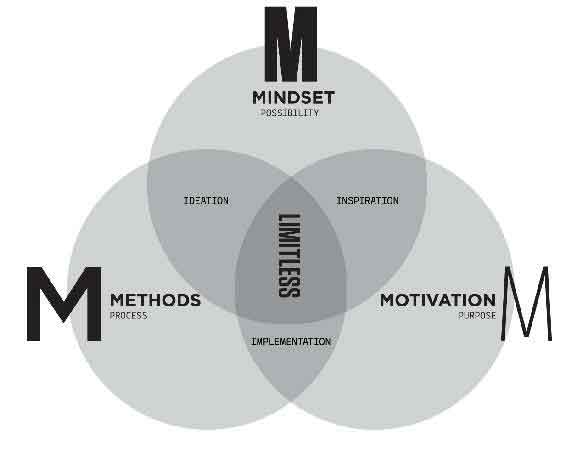
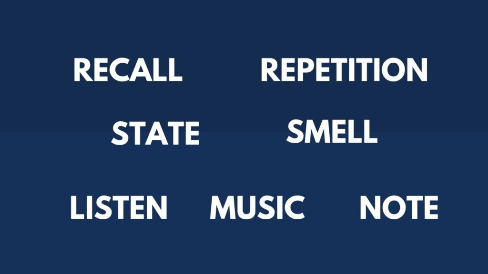
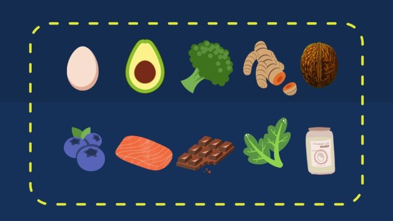

# Why?
  - reading/learning can be a "priceless opportunity to furnish your mind and enrich the quality of your life"
  - read/learn for better understanding of others and myself
  - read/learn to make fewer mistakes.
  - read/learn to increase knowledge
  - read/learn to find meaning
  - read/learn improves vocabulary, focus, memory and imagination
  - Odds are that no matter what you're working on, someone somewhere, who is smarter than you, has probably thought about your problem and put it into a book.
  - there are few things that hold us back and rob us our productivity, prosperity, positivity and peace of mind and reduce our capacity to think, focus, learn, grow, and be fully human
    - drowning in data and rapid change, we long for strategies and tools to regain some semblance of productivity, performance, and peace of mind
    - the fleeting ping of digital dopamine pleasure replaces our ability to sustain the attention necessary for deep relationships, deep learning or deep work
    - overuse of digital technology results in the breakdown of cognitive abilities. Short-term memory pathways will start to deteriorate from underuse if we overuse technology.
    - we're letting technology do much of our critical thinking and reasoning for us.

# Overview

  ## the top 12 most useful & universal mental models

  ## two types of knowledge: max planck/chauffeur test
  - [two types of knowledge](https://fs.blog/two-types-of-knowledge/)
  - The first type of knowledge is real, it can't be bought. It can't be copied. If you want real knowledge you need to earn it. The second type of knowledge is copied. On the surface you know the answer but you lack the understanding to show your work.
  - real knowledge comes from ability to explain things without using jargon or vague terms, understand how things interact and predict the consequences.
  - distinguish between people who've done the work and those who haven't. The ones who have will pass the [Batesian Mimicry Test](https://fs.blog/batesian-mimicry/)

# Study group patterns
- [study group patterns](/study-group-patterns-summary)

# MOM model
- 
  ## Mindset/Observation (the WHAT): 
    - Be aware of how you're holding yourself back to limiting beliefs, deeply held beliefs, attitudes, and assumptions we create about who we are, how the world works, what we're capable of and deserve, and what is possible.
    - none of these are preinstalled at birth, which means you pick them up from your environment and those around you.
    - any limitations are self-imposed and that your true potential is within your control
    - be truly present in any situation
    - intelligence is fixed -> your intelligence is not only malleable but dependent on your ability to cultivate a growth mindset
    - we only use 10% of our brains -> I'm learning to use my whole brain in the best way possible.
    - mistakes are failures -> there's no such thing as failure. Only failure to learn.
    - knowledge is power -> knowledge + action = power
    - learning new things is very difficult -> when you learn new ways how to learn, the challenge of learning new things can be fun, easier, and more enjoyable.
    - criticism of other people matters -> it's not your job to like, love or respect me. It's mine.
    - genius is born -> genius is not born, it's made through deep practice.
  ## Motivation (the WHY): 
    - the purpose one has for taking action. The energy required for someone to behave in a particular way
    - motivation = Purpose x Energy x Small Simple Steps
      - how connected do I feel to my purpose
      - how are my day-to-day energy levels
      - what am I allowing to drain my energy that I no longer should?
  ## Methods (the HOW): 
    - small simple steps repeated lead to habits.
    - creating habits to automate essential parts of our lives is a fundamental streamlining technique that we do largely unconsciously, often to our benefit.
    - focus
      - calm the busy minds with meditation, yoga.
      - breathing with 4-7-8 method
        - exhale completely through your mouth, making a whoosh sound
        - close your mouth and inhale quietly through your nose to a mental count of 4
        - hold your breath for a count of 7
        - exhale completely through your mouth, making a shoosh sound to a count of 8
      - do something that has been causing you stress
      - schedule time for distraction
    - a specific process for accomplishing something, especially an orderly, logical or systematic way of instruction
      - frequently challenge your methods by asking yourself the following questions
        - have I thought about methods I'm using?
        - have I learned this method from someone successful at what I'm trying to achieve
        - if I changed my method, would my results look different.
  
  ### habits for studies
  - 
  - **F - Forget**.
    - You need to forget what you know about the subject, forget situational things that are not urgent, and temporarily forget your limitations.
    - start with a beginner's mind
  - **employ ACTIVE recall**
    - optimal learning occurred when an initial learning session included repeated study and forced-recall testing of all items at least 4 times in a row
    - learning is not a spectator sport. Practice, take notes or ask questions
    - your superbrain works not by consuming information, but by creating and co-creating it.
    - 4 quadrants of active learning
      - visualization: a picture worth thousands word, same is true for learning
      - association: associate it with something you already know.
      - emotion: emotion + association = long-term memory
        - adding emotion to association registers your new information in long-term memory. Regardless of emotion you use, emotion makes retention much more robust and durable.
      - location: associate things to a place you're familiar most
  - **T - Teach.**
    - when you teach something to someone, you get to learn it twice.
    - learn with the intention of teaching somebody specific.
    - Feynman technique
      - pretend to teach a concept you want to learn about to a student in the sixth grade
      - identify gaps in your explanation. Go back to the source material to better understand it.
      - organize and simplify
      - transmit (optional)
        - the ultimate test of your knowledge is your capacity to convey it to another.
        - attempt to transmit the material to at least 1 person who isn't that familiar with it.
  - **S - State**. All learning is state dependant
    - be fully present and don't focus on other things that are not urgent
    - changing your physiology, changes your psychology.
    - as your body moves, your brain grooves
    - if you're feeling great, the greater results you will produce
    - stand up if you can't sit up tight.
    - facilitates breathing and improves circulation of oxygen to your brain and the rest of your body
  - **employ space repetition**
    - by spacing the intervals out, you're exercising neural connections each time.
    - spaced repetition produces long-term and robust retention of knowledge. 
    - Spaced repetition works best when you review material at similar intervals
  - **use your sense of smell**
    - smells bring memories to the forefront of our brains
    - the scent of rosemary has been shown to improve memory
    - peppermint and lemon promote concentration
  - [note taking](#note-taking)
  - music for the mind
    - music stabilizes mental, and emotional rhythms to attain a state of deep concentration and focus in which large amounts of content information can be processed and learned"
    - baroque music stands out in particular, although one's reaction to music is deeply personal
  - listen with your whole brain
    - remember acronym HEAR - halt, empathy, anticipate, review
      - be attentive, be interested, be alert and not distracted, create a positive atmosphere through non-verbal behavior
      - be a sounding board - allow the speaker to bounce ideas and feelings off you while assuming a non-judgmental, non-critical manner
      - don't interrogate, don't ask a lot of questions, they can give the impression you're grilling the speaker
      - act like a mirror, reflect back what you think the speaker is saying and feeling
      - don't discount the speaker's feelings by using stock phrases like "it's not that bad," or "you will feel better tomorrow"
      - don't let the speaker hook you. This can happen if you get angry or upset, allow yourself to get involved in an argument, or pass judgment on the other person
      - indicate you're listening by
        - providing brief, noncommittal acknowledging responses, e.g., "Uh-huh,", "I see".
        - giving nonverbal acknowledgements, e.g., head nodding, facial expressions matching the speaker, open and relaxed body expression, eye contact.
        - invitations to say more, e.g., "tell me about it," "I' d like to hear more about that"
        - do reflect back to the speaker what you understand and how you think the speaker feels.
      - don't change subject or move in a new direction
      - don't rehearse in your own head
      - don't teach or give advice

# System for remembering what you learn
  - Mark up the book while reading it. Questions, thoughts. And, more important connections to other ideas.
  - at the end of each chapter, without looking back, write some notes on the main points/arguments/take-away. Then look back through the chapter and write down anything you missed.
  - specifically note anything that was in the chapter that you can apply somewhere else
  - summary and review the notes periodically
  - you're more likely to remember what you learn in the beginning of a learning session and the last thing you learned (more recent). Opening primacy and closing recency
  - [blank sheet](#blank-sheet) technique
  - [conventional notes](#conventional-notes) technique
  ## Sun list
| Item      | Association |
| ------------ | -------------- |
| 1. Sun      | 1 Sun       |
| 2. Socks   | 2 Socks        |
| 3. Traffic lights   | 3 lights on a traffict light        |
| 4. Car   | 4 wheels on a car        |
| 5. Glove/Star   | 5 fingers on a glove        |
| 6. Soda   | 6 pack of soda        |
| 7. Rainbow   | 7 colors in teh rainbow        |
| 8. magic 8 ball/octopus   | 8 ball. 8 tentacles        |
| 9. cat   | 9 lives for a cat        |
| 10. toes   | 10 toes        |
| 11. skies   | 2 skis look like an 11        |
| 12. roses   | dozen of roses        |
| 13. spaceship   | apollo 13        |
| 14. carrot/gold   | 14 carrot diamond/14K gold        |
| 15. money   | $ looks like 5 crossed with a 1        |
| 16. candle   | sweet sixteen        |
| 17. magazine   | 17 magazine for teens        |
| 18. truck   | 18 wheeler        |
| 19. golf   | the 19th hole is the bar        |
| 20. fox   | 20th century fox        |

  ## Association
  - 

  ## Chain Linking
  - `balloons` tied to the red vivid `fire hydrant`. The balloons seemingly come from the `barrel`. Inside the barrel, there is a `board` that closely resembles the shape of a `diamond`. The diamond drops on `Sir lancelot` head. He is then rushed to emergency in a `mask`. The `mask` as it turns out is dirty that it needs to be cleaned with `toothpaste`. The leftover toothpaste is thrown away and now stuck at the `sign` outside the `bar`
  ## Peg memory method
  - With the sun list, we now have 20 pegs.
  - associate the item with the Sun List.
  - to create a strong memorable association, we need to use a vivid imagination. We should create an image in our head that is illogical, funny, or cool to make it memorable
    - to remember #9 is people, we could image cat people. That's weird, and funny so it's memorable.
  ## Remember names

  **BE SUAVE**
  - believe: once you believe you can do it, you're already halfway there
  - exercise: keep practicing until you become very good at it
  - say: say the person's name back right after you heard it, that way you'd have heard the name twice
  - use: use the person's name throughout the conversation
  - ask: ask where the person's name come from, especially if it's less-common
  - visualize: attach an image to person's name
  - end: part ways by saying the person's name

# life style supports learning
## kill your negative self talk & ANTs
- when you have ANT(s), automatic negative talk, your brain releases chemicals that make you feel bad. Moreover, your memory, learning and judgment are affected negatively.
- identify what strain of ANT you have (mind-reading, blame, labeling, guilt, or fortune-telling) and then challenge it by talking back to it, which you can do with positive affirmations
- with the ABRA technique, you acknowledge, breathe in, release, and align
  - A - acknowledge ANT because what you resist persist.So acknowledging the ANT helps you to avoid having to continuously fight it.
  - B - deep breathing helps you relax and focus
  - R - releasing the thought helps you to release it out of your body before you spend time comtemplating it.
  - A - align yourself back to the truth about who you are. Saying the opposite of the negative thought, which is simply a positive affirmation.
- a more analytical technique from Dr. Daniel Ame requires you to ask some questions, it involves a few steps
  - Ask yourself if the ANT is true
  - Ask yourself if it's possible eto absolutely know that it's true
  - Ask yourself how you react when you think that thought.
  - Ask yourself who you would be if you didn't have that thought, how would you feel?
  - What is the opposite of that ANT? What is a positive affirmation you can use?
- contemplating your ANT(s) like this can help you see they are not truths but thoughts made up of fears, worries, or criticism. And, ending with the positive affirmation can help you move towards better thoughts and beliefs that help you have more happiness.

## ten steps to improving your memory
- diets
  - eat good brain food like blueberries, avocado, broccoli, coconut oil, eggs, green leafy vegetables, salmon and sardines, turmeric, walnut, dark chocolate.
  - 
  - high-quality foods that contain lots of vitamins, minerals, and antioxidants nourishes the brain and protects it from oxidative stress, the waste produced when the body use oxygen, which can damage cells.
- emotions: 
  - [avoid negative thoughts and complaining](#kill-your-negative-self-talk--ants)
- exercise regularly
  - when your body moves, your brain grooves
  - exercise changes the brain in ways that protect memory and thinking skills.
- get your brain nutrient
  - take a blood test and verify your deficiencies. Then take the appropriate supplements
- keep a positive peer group
  - who you spend time with is who you become.
- maintain a clean environment
  - meaning clean air, water and space around you
- get good sleep
  - dreaming is essential for fantastic ideas.
  - sleep is vital for protecting you against age-related brain damage, and it is crucial for day-to-day functioning.
- protect your brain
  - avoid putting your phone under your pillow and protect yourself from head injuries by wearing a helmet when cycling
- learn new things
  - neuroplasticity (connections in your brain) can be instigated through learning new things
- reduce your stress through yoga, meditation, or massages.

# How we learn to read
- there's difference between reading for understanding and reading for information
  - lots of people confuse knowing the name of something with understanding. While great for exercising your memory, the regurgitation of facts without solid understanding and context gains you little in the real world.
  - **anything easily digested is reading for information.**
- [work required to have an opinion](https://fs.blog/the-work-required-to-have-an-opinion/)
- if you're a knowledge worker, you're paid to use your brain, so it's in your best interest to make that brain as efficient as possible.
- The number of pages you read is not as important as the fact you're enjoying it.
- **skim a lot of books, read a few. Immediately re-read the best ones twice**
  - when you lose interest give it 5 more pages. Then skim the next chapter. If you're still not interested, put it down. It's the authors job to keep your attention
  - marking a book is indispensable to reading it
    - keep you awake, not merely conscious, but wide awake
    - reading, if it is active, is thinking and thinking tends to express itself in words, spoken or written.
    - writing your reactions down helps you to remember the thoughts of the author
    - literally an expression of your differences or your agreements with the author. It is the highest respect you can pay him.
- pomodoro method
  - optimal time for a task is 25 minutes, followed by a 5 minute break. Each 25-minute chunk is called a "Pomodoro"
- **skip liberally: skip anything that doesn't interest you.**
  - skip, but do so intelligently
    - return to it later at some point and ask yourself, "why did I skip this?" Did it offend you? Seem beneath you? Seem too difficult? And did you arrive at that by thinking it through, or is it a reflection of biases inherited from your parents and others? very often, "our" beliefs are not our own
    - this type of practice is how you create yourself instead of discovering yourself.

# Finding more time to read
  - **find time to read boils down to choices about how you allocate your time.**
  - **reading isn't something to be done once a week to check a box; it's something to do every day**.
  - **What gets in the way of reading?**
    - avoid time commuting
    - avoid time shopping
    - avoid watching TV
    - combine reading with idle activities, waiting for a bus, waiting for a taxi, on the train, on the plane, waiting for your flight.
    - **what I read depends on situation**
      - if there's on few minutes, read something simple, rather disposable, easily digested.
      - early in the evening, around 8-9, read something without interruption
      - before going to bed, read something light or something requiring more thought so I can ponder an idea while I'm falling asleep.
      - when I'm not reading, I'm trying to think about what I have just read (like waiting in the checkout line at the grocery store)

# 4 levels of reading

  ## Elementary reading
  - level of reading taught in our elementary schools
  ## Inspectional reading
  - skimming and superficial reading can be used effectively to increase understanding
  - inspectional reading allows us to look at the author's blueprint and evaluate the merits of a deeper reading experience.
  - 2 sub-types of inspectional reading
    - systematic skimming
      - quick check of the book by
        - reading preface
        - studying the table of contents
        - checking the index
        - reading inside jacket
      - give you sufficient knowledge to understand the chapters in the book, pivotal to the author's argument.
      - skimming helps you reach to a decision point: Does this book deserve more of my time and attention? if not, you put it down.
    - superficial reading
      - just read, don't ponder the argument, don't look things up, don't write in the margins.
      - if you don't understand something, move on.
      - now that you have better understanding of the book's contents and its structure, do you want to understand it?
  ## Analytical reading
  - [use marginalia to converse with the author](https://fs.blog/marginalia/)
    - the broken fragments of thought that appear scribbled in the margins of books.
    - these fragments help us connect ideas, translate jargon, and spur critical thinking.
  - 4 rules to analytical reading
    - classify the book according to kind and subject matter
    - state what the whole book is about with the utmost brevity
    - enumerate its major parts in their order and relation, and outline these parts as you have outlined the whole
    - define the problem or problems the author is trying to solve.
      - in other words, you should be able to state the main question that the book tries to answer, and you should be able to state the subordinate questions if the main question is complex and has many parts.
  - after an inspectional read, you will understand the book and the author's views.
  - theoretical books teach you that something is the case. Practical books teach you how to do something you want to do or think you should do.
  ## Syntopical reading
  - involves reading many books on the same subject and comparing and contrasting ideas, vocabulary, and arguments.
  - identifying relevant passages, translating the terminology, framing and ordering the questions that need answering, defining the issues, and having a conversation with the responses.
  - understand the subject and develop deep fluency
  - identifying and filling in your knowledge gaps.
  - 5 steps to syntopical reading
    - finding the relevant passages
      - find the right books and then the passages that are most relevant to filling your needs
    - bringing the author to terms
      - identify the keywords and how they are used by the author. Each author has probably used different temrs and concepts to frame their argument.
      - this is an exercise in translation and synthesis.
    - Getting the questions clear
      - focus on the questions that you want to answered.
      - it's important to frame the questions in such a way that all or most of the authors can be interpreted as providing answers.
    - defining the issues
      - ask clear question to which there are multiple answers.
      - translated into your terms, must be ordered in relation to one another.
      - understanding multiple perspectives within an issue helps you form an intelligent opinion.
    - analyzing discussion
      - it's presumptuous to expect we will find a single unchallenged truth to any of our questions.
      - our answer is the conflict of opposing answers.
      - the value is the discussion you have with these authors.
      - you can now have an informed opinion
# 4 Questions must ask about any book
## what is the book as a whole?
- you must try to discover the leading theme of the book, and how the author develops his theme in an orderly way by subdividing it into its essential subordinate themes or topics

## what is being said in detail and how
- you must try to discover the main ideas, assertions and arguments that constitute the author's particular message

## is the book true, in whole or part?
- you cannot answer this question until you have answered the first two. You have to know what is being said before you can decide whether it is true or not. When you understand a book, however, you're obligated, if you are reading seriously, to make up your own mind. Knowing the author's mind is not enough.

## what of it?
- if the book has given you information, you must ask about its significance. Why does the author think it is important to know these things?
- Is it important to you to know them? and if the book has not only informed you, but also enlightened you, it is necessary to seek further enlightenment by asking.

# Note taking
- listen with intent. Write a notes in a way you can understand later
- TIP
  - T - Think about what you're hoping to retain most from this session
  - I - identify what is most important in the context of your goal
  - P - prioritize the information that is most valuable for you.
- use your own words whenever possible
-  handwriting triumphs typing because writing by hand requires you to exert more effort and process information immediately
-  use **capture and create**. Fold the paper into two columns. On left side, write down what you're capturing. On the right, write your impression of potential applications, i.e., the areas you can apply this.
  ## audio journal
  - need to do more research in this
  ## Blank sheet
  - before you start reading a new book, take out a blank sheet of paper. write down what you know about the subject you're about to read - a mind map if you will
  - after you're done a reading session, spend a few minutes adding to the map (I use a different color ink)
  - before you start your next reading session, review the mind map(I use mind as a bookmark sometimes)
  - put these mind maps in a binder, and periodically review them.
  - the blank sheet primes your brain for what you're about to read and shows you what you're learning

  ## conventional notes
  - you bought this thing, it's your property, you need to [write in the margins](https://fs.blog/marginalia/)
  - at the end of each chapter write a few bullet points that summarize the main idea or specific points. Use your own words and not the authors. Try and connect it to something in your life - a memory or another idea. Also, make note any unanswered questions you had while reading.
  - when you're done the book, put it down for a week
  - pick up the book again and go through all your notes. In a lot of cases, reading your notes will be as good as reading the book again.
  - writing is the process by which we often discover we don't know what we're talking about.
   
# Speed reading
## the 4,3,2,1 method
- 10 minutes exercise
- set the timer for 4 minutes and open an easy-to-read book.
- start reading at a comfortable pace while using your finger to underline the words as you read them.
- when 4 minutes expires, mark the point at which you stopped
- go back where you started and set a timer for 3 minutes, then 2 minutes, then 1 minute. Try to get to the same point you reached after 4 minutes.

## Problems
- avoid regression where your eyes tend to go back and re-read certain words in a sentence.
  - use pacer because attention follows movement. If you use your finger to guide your reading, you prevent your attention from jumping around the text.
  - use finger as pacer when reading on physical book or the phone
  - use the mouse as pacer when reading content on computer
- avoid subvocalization: saying words to yourself in your head as you read.
  - when you start reading, count 1, 2, 3, 4. This process will free your mind of the inner narrator.
  - it will train your mind to see words on the page like images. Turn what you're reading into a motion picture experience.
- avoid word-by-word reading
  - observe chunks of word at a single glance.
  - practice expanding your vision to see groups of words, i.e.: image for groups of words
# Mental models
## Circle of competence
- [circle of competence](https://fs.blog/circle-of-competence/)
  - each of us, through experience or study, has built up useful knowledge on certain areas of the world. Some areas are understood by most of us, while some areas require a lot more specialty to evaluate
  - that basic knowledge, along with some understanding of accounting and a little bit of study, would enable one to evaluate and invest in any number of restaurants and restaurant chains, public or private.
  - where should we devote our limited time in life, to achieve the most success? define the perimeter of your circle of competence, and operate inside. Over time, work to expand that circle but never fool yourself about where it stands today, and never be afraid to say "I don't know"
  - you know when to follow the rules and when they'll get you in trouble.

## Work required to have an opinion
- you have to do the reading, you have to talk to competent people and understand their arguments
- you have to think about key variables and how they interact over time.
- you have to listen and chase down arguments that run counter to your views.
- you have to think about how you might be fooling yourself.
- you have to see the issue from multiple perspectives.
- you need to become your most intelligent critic and have the intellectual honesty to kill some of your best-loved ideas.
- doing the work counteracts our natural desire to seek out only information that confirms that we believe we know.

## Pareto 20/80 principle
  - most of your results are going to come from just a small percentage of your effort or work.
    - 20% of relationships lead to 80% happiness
    - 20% exercises lead to 80% of health benefit
    - 20% of items on your todo list lead to 80% of productivity
    - 20% of foods you eat cause 80% of your sickness
    - by taking 10 minutes per day for prioritization, you can double your productivity
    - by looking at what experiences give you the most delight, you can begin to engineer your life
# Quotes

"Marking a book is literally an experience of your differences or agreements with the author. It is the highest respect you can pay him"

"I never allow myself to have an opinion on anything that I don't know the other side's argument better than they do"

"Doing the work required to hold on opinion means you can argue against yourself better than others can."

"what an investor needs is the ability to correctly evaluate selected business. Note that word "selected": You don't have to be an expert on every company, or even many. You only have to be able to evaluate companies within your circle of competence. The size of that circle is not very important; knowing its boundaries, however, is vital"

"Teach thy tongue to say I do not know, and thou shalt progress"

"I'm no genius, I'm smart in spots - but I stay around those spots."

"any fool can know. The point is to understand"

"it takes one to know one"

**"the first principle is that you must not fool yourself, and you're the easiest person to fool"**

**True experts recognize the limits of what they know what what they do not know. If they find themselves outside of their circle of competence, they keep quiet or simply say, "I don't know".**

**"Skim a lot of books, read a few. Immediately re-read the best ones twice."**

**The blank sheet primes your brain for what you're about to read and shows you what you're learning**

**reading a book should be a conversation between you and the author**

**understanding is a two way operation; the learner has to question himself and question the teacher. He even has to be willing to argue with the teacher, once he understands what the teacher is saying.**

**marking a book is literally an expression of your differences or your agreements with the author. It is the highest respect you can pay him**

"priceless opportunity to furnish your mind and enrich the quality of your life"

"The rich invest in time, the poor invest in money"

"Men who have made these discoveries before us are not our masters, but our guides"

"go to bed smarter than when you woke up"

"we don't read other people's opinions. We want to get the facts, and then think"

"when it comes to reading, you don't need to finish what you start"

"The pencil," he argues, "becomes the sign of your alertness while you read"

The person who says he knows what he thinks but cannot express it usually does not know what he thinks.

**"borrow liberally, combine uniquely, and create your bespoke blueprint."**

# References
- https://home.mindvalley.com/quests/en/superbrain
- https://www.visualcapitalist.com/12-ways-smarter-mental-models/
- https://medium.com/accelerated-intelligence/this-is-exactly-how-you-should-train-yourself-to-be-smarter-infographic-86d0d42ad41c
- https://fs.blog/the-art-of-reading-how-to-be-a-demanding-reader/
- https://fs.blog/the-work-required-to-have-an-opinion/
- https://fs.blog/how-to-read-a-book/
- https://fs.blog/circle-of-competence/
- https://fs.blog/reading/
- https://fs.blog/the-buffett-formula/
- https://waiyancan.com/limitless-upgrade-your-brain-jim-kwik-summary/
- https://www.getstoryshots.com/books/limitless-summary/
- https://www.sitrakaratsimba.com/limitless-upgrade-your-brain-learn-anything-faster-and-unlock-your-exceptional-life/
- https://theartofliving.com/how-to-read-a-book-summary/