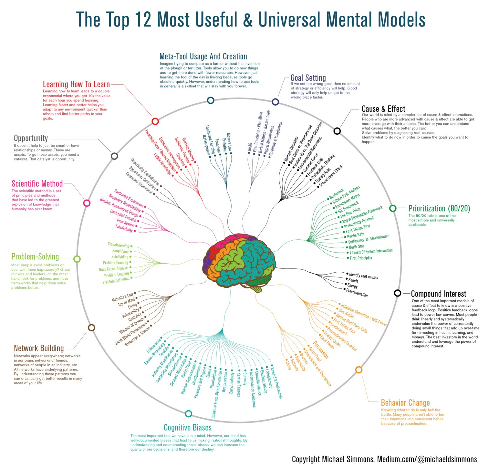

# todo
- summary limitless upgrade your brain-jim-kwik-summary
- summary continuous learning from joshua kerievsky
- a pattern language for study groups from joshua kerievsky
- summary how to read from mortimer

# Overview

## the top 12 most useful & universal mental models

# Quotes

# References
- https://www.visualcapitalist.com/12-ways-smarter-mental-models/
- https://medium.com/accelerated-intelligence/this-is-exactly-how-you-should-train-yourself-to-be-smarter-infographic-86d0d42ad41c
- https://fs.blog/the-art-of-reading-how-to-be-a-demanding-reader/
- https://fs.blog/how-to-read-a-book/
- https://waiyancan.com/limitless-upgrade-your-brain-jim-kwik-summary/
- https://www.getstoryshots.com/books/limitless-summary/
- https://www.sitrakaratsimba.com/limitless-upgrade-your-brain-learn-anything-faster-and-unlock-your-exceptional-life/
- https://www.industriallogic.com/img/blog/2005/09/ContinuousLearning.pdf
- https://www.industriallogic.com/img/blog/2012/03/khdraft1.pdf
- https://theartofliving.com/how-to-read-a-book-summary/