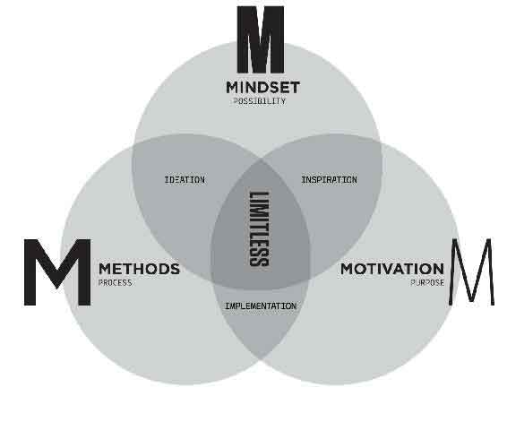
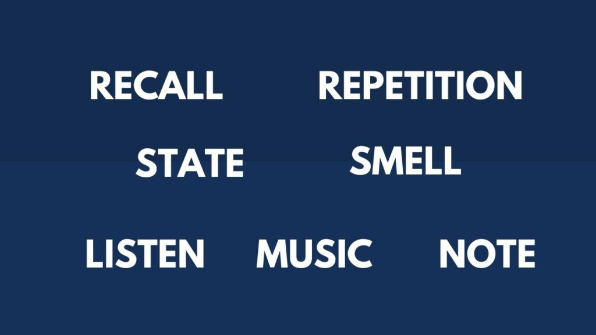
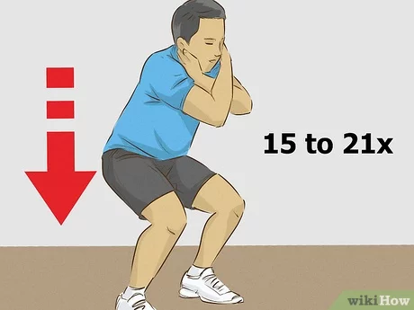

# Why?
  - reading/learning can be a "priceless opportunity to furnish your mind and enrich the quality of your life"
  - read/learn for better understanding of others and myself
  - read/learn to make fewer mistakes.
  - read/learn to increase knowledge
  - read/learn to find meaning
  - read/learn improves vocabulary, focus, memory and imagination
  - Odds are that no matter what you're working on, someone somewhere, who is smarter than you, has probably thought about your problem and put it into a book.
  - there are few things that hold us back and rob us our productivity, prosperity, positivity and peace of mind and reduce our capacity to think, focus, learn, grow, and be fully human
    - drowning in data and rapid change, we long for strategies and tools to regain some semblance of productivity, performance, and peace of mind
    - the fleeting ping of digital dopamine pleasure replaces our ability to sustain the attention necessary for deep relationships, deep learning or deep work
    - overuse of digital technology results in the breakdown of cognitive abilities. Short-term memory pathways will start to deteriorate from underuse if we overuse technology.
    - we're letting technology do much of our critical thinking and reasoning for us.

# Overview

## two types of knowledge: max planck/chauffeur test
  - [two types of knowledge](https://fs.blog/two-types-of-knowledge/)
  - The first type of knowledge is real, it can't be bought. It can't be copied. If you want real knowledge you need to earn it. The second type of knowledge is copied. On the surface you know the answer but you lack the understanding to show your work.
  - real knowledge comes from ability to explain things without using jargon or vague terms, understand how things interact and predict the consequences.
  - distinguish between people who've done the work and those who haven't. The ones who have will pass the [Batesian Mimicry Test](https://fs.blog/batesian-mimicry/)

- 5 stages of learning
  - unconscious incompetence: 
    - you don't know what you don't know
    - you might not even be aware of the fact that something like speed-reading exists.
    - you're also not aware that you're currently not capable of doing it
  - conscious incompetence: 
    - you know what you don't know
    - you're aware that people have learned to read and comprehend much faster through speed-reading techniques, but you yourself have not had any training in this area.
  - conscious competence: 
    - you're aware of a skill and have the capacity to perform that skill, but it requires your conscious attention to do it.
  - unconscious competence.
    - you know how to perform a skill, and it's second nature to you.
    - with speed reading, you would reach the point of unconscious competence when this simply becomes the way you read, without deliberate attention.
  - true mastery
    - it's second nature to perform a skill at an elite level.

# [Fixed Mindset vs Growth Mindset](https://biglifejournal.com/blogs/blog/fixed-mindset-vs-growth-mindset-examples)
- I'm either good at something or I'm not -> **I can improve my skills with effort and practice**
- when people give me feedback, it feels like criticism -> **I appreciate when people give me feedback ,it helps me learn and grow**
- I'm just not good at math -> **Math is challenging for me, but I know I can improve**
- I'm too shy to speak in front of the class -> **With practice, I can become more confident and improve my public speaking skills**
- I'm already a really good writer. I don't need to get any better -> **There's always room for improvement**
- people who are naturally smart don't need to try hard to succeed -> **No one is born smart. We can all improve with time, effort and persistence**
- Other people's successes make me feed bad about myself -> **Other people's successes encourage and inspire me. They show me what is possible**
- Successful people are lucky/talented and have never experienced failure -> **Failure is part of success. Most successful people have failed many times, but they succeeded because they didn't quit**
- I wish I was as good at baseball as you, it's not fair -> **Your skills as a baseball player inspire me. Do you have any tips to help me improve**
- It's embarrassing when I make a mistake -> **everyone makes mistakes and mistakes are opportunities to learn**
- If I don't try new or hard things, then I won't fail -> **I have to try new and difficult things in order to grow, even if I fail at first**
- When I fail, I get frustrated and give up -> **When I fail or get frustrated, I try again using the lessons I've learned.**
- Failure means it is time to give up -> **I only truly fail when I stop trying**
- I can't do that -> **I can't do that yet, I'm going to keep going, try new strategies, and/or ask for help until I understand it**
- If I don't improve right away, I get frustrated. I start to criticize myself -> **I know improvement takes time and I celebrate the small steps. Even a little progress makes a difference**

# MOM model
- 

  ## Motivation (the WHY): 
    - the purpose one has for taking action. The energy required for someone to behave in a particular way
    - motivation = Purpose x Energy x Small Simple Steps
      - how connected do I feel to my purpose
      - how are my day-to-day energy levels
      - what am I allowing to drain my energy that I no longer should?
  ## Mindset/Observation (the WHAT): 
    - Be aware of how you're holding yourself back to limiting beliefs, deeply held beliefs, attitudes, and assumptions we create about who we are, how the world works, what we're capable of and deserve, and what is possible.
    - none of these are preinstalled at birth, which means you pick them up from your environment and those around you.
    - any limitations are self-imposed and that your true potential is within your control
    - be truly present in any situation
    - intelligence is fixed -> your intelligence is not only malleable but dependent on your ability to cultivate a growth mindset
    - we only use 10% of our brains -> I'm learning to use my whole brain in the best way possible.
    - mistakes are failures -> there's no such thing as failure. Only failure to learn.
    - knowledge is power -> knowledge + action = power
    - learning new things is very difficult -> when you learn new ways how to learn, the challenge of learning new things can be fun, easier, and more enjoyable.
    - criticism of other people matters -> it's not your job to like, love or respect me. It's mine.
    - genius is born -> genius is not born, it's made through deep practice.
  ## Methods (the HOW): 
    - small simple steps repeated lead to habits.
    - creating habits to automate essential parts of our lives is a fundamental streamlining technique that we do largely unconsciously, often to our benefit.
    - focus
      - calm the busy minds with meditation, yoga.
      - breathing with 4-7-8 method
        - exhale completely through your mouth, making a whoosh sound
        - close your mouth and inhale quietly through your nose to a mental count of 4
        - hold your breath for a count of 7
        - exhale completely through your mouth, making a shoosh sound to a count of 8
      - do something that has been causing you stress
      - schedule time for distraction
    - a specific process for accomplishing something, especially an orderly, logical or systematic way of instruction
      - frequently challenge your methods by asking yourself the following questions
        - have I thought about methods I'm using?
        - have I learned this method from someone successful at what I'm trying to achieve
        - if I changed my method, would my results look different.
  
  ### habits for studies
  - 
  
  - **F - Forget**.
    - You need to forget what you know about the subject, forget situational things that are not urgent, and temporarily forget your limitations.
    - start with a beginner's mind
  - **employ ACTIVE recall**
    - optimal learning occurred when an initial learning session included repeated study and forced-recall testing of all items at least 4 times in a row
    - learning is not a spectator sport. Practice, take notes or ask questions
    - your superbrain works not by consuming information, but by creating and co-creating it.
    - 4 quadrants of active learning
      - visualization: a picture worth thousands word, same is true for learning
      - association: associate it with something you already know.
      - emotion: emotion + association = long-term memory
        - adding emotion to association registers your new information in long-term memory. Regardless of emotion you use, emotion makes retention much more robust and durable.
      - location: associate things to a place you're familiar most
  - **T - Teach.**
    - when you teach something to someone, you get to learn it twice.
    - learn with the intention of teaching somebody specific.
    - Feynman technique
      - pretend to teach a concept you want to learn about to a student in the sixth grade
      - identify gaps in your explanation. Go back to the source material to better understand it.
      - organize and simplify
      - transmit (optional)
        - the ultimate test of your knowledge is your capacity to convey it to another.
        - attempt to transmit the material to at least 1 person who isn't that familiar with it.
  - **S - State**. All learning is state dependant
    - be fully present and don't focus on other things that are not urgent
    - changing your physiology, changes your psychology.
    - as your body moves, your brain grooves
    - if you're feeling great, the greater results you will produce
    - stand up if you can't sit up tight.
    - facilitates breathing and improves circulation of oxygen to your brain and the rest of your body
  - **employ space repetition**
    - by spacing the intervals out, you're exercising neural connections each time.
    - spaced repetition produces long-term and robust retention of knowledge. 
    - Spaced repetition works best when you review material at similar intervals
    - review things that you want to understand better
    - practice what you learned
  - **use your sense of smell**
    - smells bring memories to the forefront of our brains
    - the scent of rosemary has been shown to improve memory
    - peppermint and lemon promote concentration
  - [note taking](#note-taking)
  - music for the mind
    - music stabilizes mental, and emotional rhythms to attain a state of deep concentration and focus in which large amounts of content information can be processed and learned"
    - baroque music stands out in particular, although one's reaction to music is deeply personal
  - listen with your whole brain
    - remember acronym HEAR - halt, empathy, anticipate, review
      - be attentive, be interested, be alert and not distracted, create a positive atmosphere through non-verbal behavior
      - be a sounding board - allow the speaker to bounce ideas and feelings off you while assuming a non-judgmental, non-critical manner
      - don't interrogate, don't ask a lot of questions, they can give the impression you're grilling the speaker
      - act like a mirror, reflect back what you think the speaker is saying and feeling
      - don't discount the speaker's feelings by using stock phrases like "it's not that bad," or "you will feel better tomorrow"
      - don't let the speaker hook you. This can happen if you get angry or upset, allow yourself to get involved in an argument, or pass judgment on the other person
      - indicate you're listening by
        - providing brief, noncommittal acknowledging responses, e.g., "Uh-huh,", "I see".
        - giving nonverbal acknowledgements, e.g., head nodding, facial expressions matching the speaker, open and relaxed body expression, eye contact.
        - invitations to say more, e.g., "tell me about it," "I' d like to hear more about that"
        - do reflect back to the speaker what you understand and how you think the speaker feels.
      - don't change subject or move in a new direction
      - don't rehearse in your own head
      - don't teach or give advice
  - **10 morning habits**
    - remember your dreams, make your bed, hydrate, brush your teeth with the opposite hand, deep breathing exercises, brain tea, journaling, HIT workout (high intensity interval training), brain power smoothie, read
    - the first 60 minutes can either set you up for maximum productivity and bring you closer to your long-term and short-term goals or cause you to lose another day to distractions and mental fog.
  - combining audio listening with other activities such as washing dishes, driving, etc...
    - use playback speed at 1.5, 1.7 to skim through materials to get the key ideas before spending more time in reading the book

# System for remembering what you learn
  - Mark up the book while reading it. Questions, thoughts. And, more important connections to other ideas.
  - at the end of each chapter, without looking back, write some notes on the main points/arguments/take-away. Then look back through the chapter and write down anything you missed.
  - specifically note anything that was in the chapter that you can apply somewhere else
  - summary and review the notes periodically
  - super brain yoga
    - 
  - keyword substitution method. This is helpful in learning new language
    - take a picture and substitute it for a word
  - Intensify: 
    - turn into picture (TIP)
    - Using action, exaggeration, emotion to make it illogical
  - schedule your activities
  - [blank sheet](#blank-sheet) technique
  - [conventional notes](#conventional-notes) technique
  - You put in and take out information out of your long-term memory. Is the information a fact or a picture? The brain has to decide where to put information in the long-term memory. You can work to develop a great memory.
    - Facts are harder to store in the long-term memory.
    - Facts are often abstract, so it’s hard to picture, so it’s hard to picture them.
    - Picture information is easier to remember.
    - Figure out how you can convert a fact into a picture to remember it.
  - Use the information you want to remember to make a song.
  - Make up metaphors to remember the information. Tie it to what you know already
  - Imagine that you’re the object or idea that you’re learning and trying to remember. Write about it.
  - Associate numbers with well-known shapes and characters. What stories can you create to remember?
  - Use sleep to anchor the new ideas you’re learning.
  - Choose an object to explain what you’re learning.
  
## Two Ideas Behind Linking
- How to make brain links:
  - Deliberate Practice
  - Interleaving

- **Deliberate Practice**
  - When you practice enough, you build brain-links.
  - It is important to learn new things and not just practice what you already know.
  - Deliberate practice – focus on the harder stuff.

- **Interleaving**
  - Practice choosing between techniques and items.
  - Practice different aspects and techniques of a skill you are trying to learn.

- **Making a Set of Brain-Links**

  - Focus
    - Focus is important for memorizing
    - Concentrate to form new brain-links
  - Active Practice
    - Practice what you’re learning.
    - Try new techniques.
    - Get feedback in case you need to correct something.

  - Practice a new skill over several days.
    - Go to bed early.
    - Get enough sleep.
    - Helps to form new synaptic brain-links.

  - Practice with interleaving solving problems. At first it will be hard, then it gets easier. Use active recall to create brain-links. Don’t memorize solutions. Look at problems and learn how to create brain-links.

  - Scramble the hints to develop order in your writing. This allows you to build writing links to pull good writing from your mind.

  ## memory principles
  - first or primacy
  - last or recency
  - well-organized and chunked 
  - emotional
  - different or unique
  - familiar
  - visualize
  - connected
  - associated
  ## Sun list
| Item      | Association |
| ------------ | -------------- |
| 1. Sun      | 1 Sun       |
| 2. Socks   | 2 Socks        |
| 3. Traffic lights   | 3 lights on a traffict light        |
| 4. Car   | 4 wheels on a car        |
| 5. Glove/Star   | 5 fingers on a glove        |
| 6. Soda   | 6 pack of soda        |
| 7. Rainbow   | 7 colors in teh rainbow        |
| 8. magic 8 ball/octopus   | 8 ball. 8 tentacles        |
| 9. cat   | 9 lives for a cat        |
| 10. toes   | 10 toes        |
| 11. skies   | 2 skis look like an 11        |
| 12. roses   | dozen of roses        |
| 13. spaceship   | apollo 13        |
| 14. carrot/gold   | 14 carrot diamond/14K gold        |
| 15. money   | $ looks like 5 crossed with a 1        |
| 16. candle   | sweet sixteen        |
| 17. magazine   | 17 magazine for teens        |
| 18. truck   | 18 wheeler        |
| 19. golf   | the 19th hole is the bar        |
| 20. fox   | 20th century fox        |

  ## Association
  - 

  ## Chain Linking
  - link things you want to remember in the chain (hydrant) and a second one (balloon) and then you tie them together using an action, the most exaggerated, unique, funny, emotional, possible. emotion + visualization + action + exaggeration
  - 
  - `balloons` tied to the red vivid `fire hydrant`. The balloons seemingly come from the `barrel`. Inside the barrel, there is a `board` that closely resembles the shape of a `diamond`. The diamond drops on `Sir lancelot` head. He is then rushed to emergency in a `mask`. The `mask` as it turns out is dirty that it needs to be cleaned with `toothpaste`. The leftover toothpaste is thrown away and now stuck at the `sign` outside the `bar`
  ## Peg memory method
  - With the sun list, we now have 20 pegs.
  - associate the item with the Sun List.
  - to create a strong memorable association, we need to use a vivid imagination. We should create an image in our head that is illogical, funny, or cool to make it memorable
    - to remember #9 is people, we could image cat people. That's weird, and funny so it's memorable.
  ## memory-palace method
  - create 10 landmarks
    - select 2 rooms in your home and create 5 landmarks in each.
    - imagine you are standing in the doorway and go clockwise
    - pick places, not empty space - so don't pick a corner of the room; pick something in it.
    - pick things that are relatively large - so pick the coffee table, not the figures in it.
    - pick only one of each item per room, if you have 4 chairs, use one chair
    - if you need to create more than 10 landmarks, use other rooms. You can also use your office, your car, and more.
  - pair each key point to a landmark
    - create an image for each key point
    - put each key point into its corresponding place

  ## Remember names
  ### remember name as easy as PIE
  - place: find a place on the person
    - focus on a feature (glasses, pair of eyes, earing) to make it easy to remember the name
  - imagine: imagine name turn into picture
  - entwine: entwine Place + Image

  ### BE SUAVE
  - believe: once you believe you can do it, you're already halfway there
  - exercise: keep practicing until you become very good at it
  - say: say the person's name back right after you heard it, that way you'd have heard the name twice
  - use: use the person's name throughout the conversation
  - ask: ask where the person's name come from, especially if it's less-common
  - visualize: attach an image to person's name
  - end: part ways by saying the person's name

# life style supports learning
## kill your negative self talk & ANTs
- when you have ANT(s), automatic negative talk, your brain releases chemicals that make you feel bad. Moreover, your memory, learning and judgment are affected negatively.
- identify what strain of ANT you have (mind-reading, blame, labeling, guilt, or fortune-telling) and then challenge it by talking back to it, which you can do with positive affirmations
- with the ABRA technique, you acknowledge, breathe in, release, and align
  - A - acknowledge ANT because what you resist persist.So acknowledging the ANT helps you to avoid having to continuously fight it.
  - B - deep breathing helps you relax and focus
  - R - releasing the thought helps you to release it out of your body before you spend time comtemplating it.
  - A - align yourself back to the truth about who you are. Saying the opposite of the negative thought, which is simply a positive affirmation.
- a more analytical technique from Dr. Daniel Ame requires you to ask some questions, it involves a few steps
  - Ask yourself if the ANT is true
  - Ask yourself if it's possible eto absolutely know that it's true
  - Ask yourself how you react when you think that thought.
  - Ask yourself who you would be if you didn't have that thought, how would you feel?
  - What is the opposite of that ANT? What is a positive affirmation you can use?
- contemplating your ANT(s) like this can help you see they are not truths but thoughts made up of fears, worries, or criticism. And, ending with the positive affirmation can help you move towards better thoughts and beliefs that help you have more happiness.

## ten steps to improving your memory
- diets
  - eat good brain food like blueberries, avocado, broccoli, coconut oil, eggs, green leafy vegetables, salmon and sardines, turmeric, walnut, dark chocolate.
  - 
  - high-quality foods that contain lots of vitamins, minerals, and antioxidants nourishes the brain and protects it from oxidative stress, the waste produced when the body use oxygen, which can damage cells.
- emotions: 
  - [avoid negative thoughts and complaining](#kill-your-negative-self-talk--ants)
- exercise regularly
  - when your body moves, your brain grooves
  - exercise changes the brain in ways that protect memory and thinking skills.
- get your brain nutrient
  - take a blood test and verify your deficiencies. Then take the appropriate supplements
- keep a positive peer group
  - who you spend time with is who you become. People who encourage you and hold you to the  higher standard
  - join community online (facebook, etc...) to support you with your interests
- maintain a clean environment
  - meaning clean air, water and space around you
- get good sleep
  - dreaming is essential for fantastic ideas.
  - clear your brain of plaque that leads to dementia and Alzheimer
  - sleep is vital for protecting you against age-related brain damage, and it is crucial for day-to-day functioning.
- protect your brain
  - avoid putting your phone under your pillow and protect yourself from head injuries by wearing a helmet when cycling
- learn new things
  - neuroplasticity (connections in your brain) can be instigated through learning new things
- reduce your stress through yoga, meditation, or massages.

# Quotes

"I never allow myself to have an opinion on anything that I don't know the other side's argument better than they do"

"Doing the work required to hold on opinion means you can argue against yourself better than others can."

"what an investor needs is the ability to correctly evaluate selected business. Note that word "selected": You don't have to be an expert on every company, or even many. You only have to be able to evaluate companies within your circle of competence. The size of that circle is not very important; knowing its boundaries, however, is vital"

"Teach thy tongue to say I do not know, and thou shalt progress"

"I'm no genius, I'm smart in spots - but I stay around those spots."

"any fool can know. The point is to understand"

"it takes one to know one"

**"the first principle is that you must not fool yourself, and you're the easiest person to fool"**

**True experts recognize the limits of what they know what what they do not know. If they find themselves outside of their circle of competence, they keep quiet or simply say, "I don't know".**

**Skim a lot of books, read a few. Immediately re-read the best ones twice.**

**The blank sheet primes your brain for what you're about to read and shows you what you're learning**

**reading a book should be a conversation between you and the author**

**understanding is a two way operation; the learner has to question himself and question the teacher. He even has to be willing to argue with the teacher, once he understands what the teacher is saying.**

"priceless opportunity to furnish your mind and enrich the quality of your life"

"The rich invest in time, the poor invest in money"

"Men who have made these discoveries before us are not our masters, but our guides"

"go to bed smarter than when you woke up"

"we don't read other people's opinions. We want to get the facts, and then think"

"The pencil," he argues, "becomes the sign of your alertness while you read"

The person who says he knows what he thinks but cannot express it usually does not know what he thinks.

**borrow liberally, combine uniquely, and create your bespoke blueprint.**

**first you make your habits and then your habits make you**

**anything is good for your heart is good for you head**

**lifelong learning adds years to your life and life to your years**

TEAM: Together Everyone Achieve More

be kind to yourself

learning is not solo, it's social

genius leaves clues

"What I hear, I forget. What I see, I remember. What I do, I understand"

there's no failure, only failure to learn.

practice makes progress

to understand is to know what to do

"the key to better comprehension is asking better questions"

you shall receive when you ask questions

# Todo
- read blog from Arlo and update this blog accordingly.
- read https://tim.blog/2020/10/08/adam-grant-how-to-remember-anything/
- read https://tim.blog/2019/06/27/josh-waitzkin/
- read https://tim.blog/2014/09/30/the-tim-ferriss-show-tracy-dinunzio-on-rapid-growth-and-rapid-learning/
- https://designepiclife.com/passive-active-experiential-learning-methods/

# References
- https://home.mindvalley.com/quests/en/superbrain
- https://arlobelshee.com/learning-faster-and-more-deeply/#more-171
- https://www.visualcapitalist.com/12-ways-smarter-mental-models/
- https://medium.com/accelerated-intelligence/this-is-exactly-how-you-should-train-yourself-to-be-smarter-infographic-86d0d42ad41c
- https://fs.blog/the-art-of-reading-how-to-be-a-demanding-reader/
- https://fs.blog/the-work-required-to-have-an-opinion/
- https://fs.blog/how-to-read-a-book/
- https://fs.blog/circle-of-competence/
- https://fs.blog/reading/
- https://fs.blog/the-buffett-formula/
- https://waiyancan.com/limitless-upgrade-your-brain-jim-kwik-summary/
- https://www.getstoryshots.com/books/limitless-summary/
- https://www.sitrakaratsimba.com/limitless-upgrade-your-brain-learn-anything-faster-and-unlock-your-exceptional-life/
- https://theartofliving.com/how-to-read-a-book-summary/
- https://biglifejournal.com/blogs/blog/fixed-mindset-vs-growth-mindset-examples
- https://tim.blog/2019/06/27/josh-waitzkin/
- https://tim.blog/2020/10/08/adam-grant-how-to-remember-anything/
- https://designepiclife.com/passive-active-experiential-learning-methods/