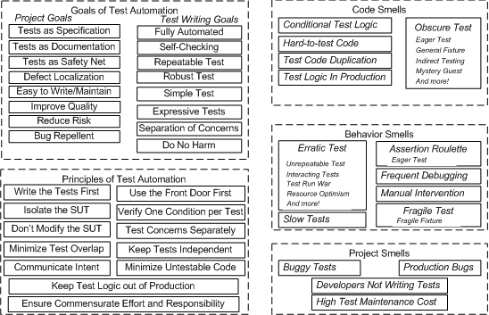
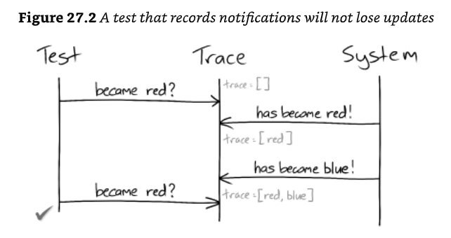
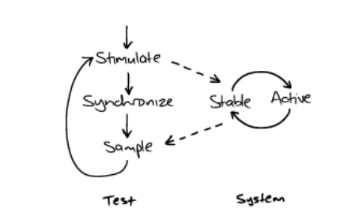
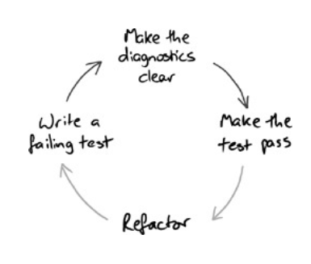

# Goals/Context
- no broad tests are required. The test suite consists of "narrow" tests focused on specific concepts. Although wide integration tests can be added as a safety net, their failure indicates a gap in the main test suite
- easy refactoring
- no magic. Tools that automatically remove busywork, such as dependency-injection and auto-mock frameworks, are not required.
- Not a silver bullet. Design mistakes are inevitable, requiring continuous attention to design and refactoring.
- benefits from learning to listen to test smell
  - keep knowledge local. The "magic" need to create mocks could cause the knowledge to leak between components.
    - if we can keep knowledge local to an object (either internal or passed in), then its implementation is independent of its context. So we can safely move it where we like.
    - Do this consistently, and your application, built out of pluggable components, will be easy to change.
  - If it's explicit, we can name it
    - Avoid mocking concrete classes that can help us give names to the relationships between objects and the objects themselves.
    - As the legends say, if we have something's true name, we can control it.
    - if we can see it, we have a better chance of finding its other uses and reducing duplication.
  - more names mean more domain information
    - we find that when we emphasize how objects communicate rather than what they are, we end up with types and roles defined more in terms of domain than the implementation.
    - we seem to get more domain vocabulary into the code
    - This might be because we have a more significant number of smaller abstractions, which gets us further away from the underlying language.
  - **pass behaviour rather than data**
    - **we find that by applying "Tell, Don't Ask" consistently, we end up with a coding style where we tend to pass behaviour (in the form of callbacks) into the system instead of pulling values up through the call stack.**
    - this keeps the tests and the code clean as we go. It helps to ensure that we understand our domain and reduces the risk of being unable to cope when a new requirement triggers changes to the design.
  - a unit test shouldn't be 1000 lines long! It should focus on at most a few classes and should not need to create a large fixture or perform lots of preparation to get the objects into a state where the target feature can be exercised.

- from xUnit patterns




## xUnit Test Patterns: goals of test automation
- the economic argument: automation pays back only if the cost of *maintaining* tests stays low. Badly designed tests can make total effort higher than not automating at all.

| Goal group | Goals |
|---|---|
| tests should help improve quality | **Tests as Specification** (executable specification), **Bug Repellent** (prevent regressions), **Defect Localization** (a red test points to the cause without a debugger) |
| tests should help understand the SUT | **Tests as Documentation** |
| tests should reduce (not introduce) risk | **Tests as Safety Net**, **Do No Harm** (tests must never change or endanger production behaviour) |
| tests should be easy to run | **Fully Automated Test**, **Self-Checking Test**, **Repeatable Test** |
| tests should be easy to write and maintain | **Simple Tests**, **Expressive Tests**, **Separation of Concerns** |
| tests should need minimal maintenance as the system evolves | **Robust Test** |

- vocabulary: **SUT** (system under test), **DOC** (depended-on component), **fixture** (everything needed in place before exercising the SUT), **direct** inputs/outputs (via the API) vs **indirect** inputs/outputs (between the SUT and its DOCs).

## xUnit Test Patterns: principles
| Principle | Meaning |
|---|---|
| Write the Tests First | test-first drives testable design; retrofitting is the hardest kind of testing |
| Design for Testability | testability is a design requirement |
| Use the Front Door First | test through the public API before any "back door" (DB, private state) |
| Communicate Intent | single-glance readable; build a higher-level language of test utility methods |
| Don't Modify the SUT | replace DOCs, never the part being tested |
| Keep Tests Independent | each test builds its own state; no order dependence |
| Isolate the SUT | control every input the result depends on |
| Minimize Test Overlap | verify each condition in as few tests as possible so a change breaks few tests |
| Minimize Untestable Code | shrink it (e.g. Humble Object) instead of writing bad tests for it |
| Keep Test Logic Out of Production Code | no test hooks / `if (testing)` in production |
| Verify One Condition per Test | one reason to fail → better defect localization |
| Test Concerns Separately | don't mix unrelated responsibilities in one test |
| Ensure Commensurate Effort and Responsibility | effort to test should match value and complexity |

- philosophy differences worth making explicit in a team: test first vs last, tests vs examples (specification), test-by-test vs all-at-once, outside-in vs inside-out, **state vs behaviour verification** (classicist vs mockist), fixture designed upfront vs per test.

## Testing Without Mocks: goals, benefits and tradeoffs
- the fourth option: broad tests are slow/flaky; mock-based isolated tests are fast but lock in implementation and still need broad tests; hexagonal / functional-core-imperative-shell fixes logic but leaves infrastructure untested and needs architecture changes. Nullables + sociable, state-based tests aim for unit-test speed with broad-test confidence, without re-architecting.
- goals (in addition to the ones above)
  - **easy refactoring**: object interactions are treated as encapsulated implementation, not behaviour to test. The *consequences* of interactions are tested, the specific method calls are not, so structural refactorings don't break tests.
  - **readable tests**: plain arrange/act/assert, describing externally-visible behaviour; tests double as documentation.
  - **fast and deterministic**: slow code (network, file system) only runs when it is explicitly the unit under test, and those tests produce the same result every run.
- benefits seen in practice
  - reported 2–3 orders of magnitude faster than equivalent mocking-framework tests
  - simple setup, easily encapsulated in helpers; the most complex code (stubs, trackers) is the most reusable
  - high-level infrastructure wrappers (e.g. a client for one web service) are testable in memory, without network calls
  - error conditions and timeouts are easy to simulate
  - compatible with existing mocks, even inside the same test, so legacy code converts incrementally
- tradeoffs
  - **production code changes**, especially in infrastructure classes; much of it exists mainly for tests (the core "do you want this in production?" question)
  - **hand-written stubs** for third-party infrastructure; can't be generated, but are highly reusable
  - **multiple failures per bug**: sociable tests execute dependencies, so one defect can turn several tests red
# Test Pain Points
- Obscure Tests
  - confuse the differences between test cases
  - single test case exercises multiple features
  - can't skim-read the tests to understand the intention
  - uses magic numbers but are not clear about what, if anything, is significant about those values
  - tests with lots of code for setting up and handling exceptions, which buries their essential logic.
- mocking values
  - mock value object means that we want to describe the behaviour of the interface explicitly, and we can't think of a name for the concrete implementation of the interface/class
  - when there isn't a good implementation name. It might mean that the interface is poorly named or designed. Perhaps it's unfocused because it has too many responsibilities, or it's named after its implementation rather than its role in the client
  - it's a value, not an object.
  - If you're tempted to mock a value because it's too complicated to set up an instance, consider writing a builder.
- partial mocks
- test diagnostics
- mocking concrete classes
  - avoid override behaviour in testable subclass
    - it leaves the relationship between objects implicit.
    - If we subclass, there's nothing in the domain code to make such a relationship visible - just methods on an object. This makes it hard to see if the service that supports this relationship might be relevant elsewhere, and we'll have to do the analysis again next time we work with the class.
  - When we mock a concrete class, we force client objects to depend on interfaces they do not use.
  - Instead, extract an interface as part of our test-driven development process. It will push us to think up a name to describe the relationship we've just discovered. This makes us think harder about the domain and teases out concepts we might otherwise miss.
  - If you can't get/access the structure you need, the tests tell you that it's time to break up the class into more minor, composable features.
- bloated constructor
  - Some arguments define a concept that should be packaged up and replaced with a new object to represent it.
  - Being sensitive to complexity in the tests can help us clarify our designs.
  - Look for arguments always used together in a class and those with the same lifetime. Give it a good name to explain the concept.
- Confused object
  - too large because it has too many responsibilities.
  - it would likely has a bloated constructor
  - another associated smell is that its test suite will look confused. The tests for its various features will have no relationship with each other. We cannot make significant changes in one area without touching others.
- too many dependencies
  - dependencies should be passed into the constructor, but notifications and adjustments can be set to defaults and reconfigured later.
  - Initialized the peers to standard defaults, the user can configure them later through the user interface, and we can configure them in our unit tests.
- too many expectations
  - we can't tell what's significant and what's just there to get through the test
  - we can make our intentions clearer by distinguishing between stubs simulations of actual behaviour that help us get the test to pass and expectations, assertions we want to make about how an object interacts with its neighbours.
  - allow queries and expect commands
    - commands are calls that are likely to have side effects, to change the world outside the target object. queries don't change the world, so they can be called any number of times, including none
    - the rule helps to decouple the test from the tested object. So if the implementation changes, for example, to introduce caching or use a different algorithm, the test is still valid.
- Many expectations indicate that we're trying to test too large a unit or locking down too many of the object's interactions.
- constructing complex test data
- testing persistence
- tests with threads
- testing asynchronous code
- seeding DB data everywhere
- magic injection of objects and data
- overlapping sociable tests (constructing entire dependency chain)
- test brittleness
  - the tests are too tightly coupled to unrelated parts of the system or irrelevant behaviour of the object(s) they're testing
  - tests overspecify the expected behaviour of the target code, constraining it more than necessary.
  - there is duplication when multiple tests exercise the same production code behaviour
- beware of flickering tests
  - a test can fail intermittently if its timeout is too close to the time the tested behaviour typically takes to run or if it doesn't synchronize correctly with the system.
  - flickering tests can mask actual defects. We need to make sure that we understand what the real problem is before we ignore flickering tests
  - **allow flickering tests is terrible for the team. It breaks the quality culture where things should "just work," Even a few flickering tests can make the team stop paying attention to broken builds.**
  - it also breaks the habits of feedback.
  - we should be paying attention to why the tests are flickering and whether that means improving the design of both the tests and code.
- runaway tests
  - be careful when an asynchronous test asserts that the system returns to a previous state.
  - unless it also asserts that the system enters an intermediate state before asserting the initial state, the test will run ahead of the system.

```java
send(aTradeEvent().ofType(BUY).onDate(tradeDate).forStock("A").withQuantity(10));
assertEventually(holdingOfStock("A", tradeDate, equalTo(10)));
send(aTradeEvent().ofType(SELL).onDate(tradeDate).forStock("A").withQuantity(10));
assertEventually(holdingOfStock("A", tradeDate, equalTo(10)));
```

- lost updates
  - a significant difference between tests that sample and those that listen for events is that polling can miss state changes that are later overwritten
  - if the test can record notifications from the system, it can look through its records to find essential notifications.
  - to be reliable, a sampling test must ensure that its system is stable before triggering any further interactions.
  - 
  - 


## xUnit test smell catalog (smell → causes)
- a smell is a **symptom**, not proof. Find the cause, then apply the matching pattern/refactoring. Project smells usually trace back to behaviour smells, which trace back to code smells — fix at the root.

### code smells (noticed when reading tests)
| Smell | Causes |
|---|---|
| **Obscure Test** | Eager Test (verifies too much), Mystery Guest (depends on data/files not visible in the test), General Fixture (setup builds more than this test needs), Irrelevant Information, Hard-Coded Test Data, Indirect Testing (testing an object through another one) |
| **Conditional Test Logic** | Flexible Test (adapts to its environment), Conditional Verification Logic, Production Logic in Test (re-computing the expectation with the production algorithm), Complex Teardown, Multiple Test Conditions (looping over inputs) |
| **Hard-to-Test Code** | Highly Coupled Code, Asynchronous Code, Untestable Test Code |
| **Test Code Duplication** | Cut-and-Paste Code Reuse, Reinventing the Wheel |
| **Test Logic in Production** | Test Hook (`if (testing)`), For Tests Only methods, Test Dependency in Production, Equality Pollution (`equals` added only for tests) |

### behaviour smells (noticed when running tests)
| Smell | Causes |
|---|---|
| **Assertion Roulette** | Eager Test, Missing Assertion Message |
| **Erratic Test** (flaky) | Interacting Tests, Interacting Test Suites, Lonely Test (passes only after another test), Resource Leakage, Resource Optimism (assumes an external resource is there), Unrepeatable Test (first run differs from later runs), Test Run War (people running tests concurrently collide), Nondeterministic Test (random values, clock, threads) |
| **Fragile Test** | Interface Sensitivity, Behaviour Sensitivity, Data Sensitivity, Context Sensitivity (time/date/environment), Overspecified Software (mocks verify too much), Sensitive Equality (comparing `toString()`), Fragile Fixture (shared fixture change breaks other tests) |
| **Frequent Debugging** | poor defect localization: missing unit tests, eager tests, infrequent runs |
| **Manual Intervention** | Manual Fixture Setup, Manual Result Verification, Manual Event Injection |
| **Slow Tests** | Slow Component Usage (DB, network), General Fixture, Asynchronous Test (sleeps), Too Many Tests |

### project smells (noticed by the team/managers)
| Smell | Causes |
|---|---|
| **Buggy Tests** | Fragile Test, Obscure Test, Hard-to-Test Code |
| **Developers Not Writing Tests** | Not Enough Time, Hard-to-Test Code, Wrong Test Automation Strategy |
| **High Test Maintenance Cost** | Fragile Test, Obscure Test, Hard-to-Test Code |
| **Production Bugs** | Infrequently Run Tests, Lost Test (not in any suite / disabled), Missing Unit Test, Untested Code, Untested Requirement, **Neverfail Test** (can't fail, e.g. assertion never reached or exception swallowed) |

### quick remedies
| If you see… | Try… |
|---|---|
| can't tell what a test checks | Creation Methods, Custom Assertions, Minimal Fixture, In-line Resource |
| `if`/loops in tests | Guard Assertion, Custom Assertion, Parameterized Test |
| copy-pasted setup | Delegated Setup via Creation Methods / Test Data Builders, Test Helper |
| don't know which assertion failed | single-condition tests, assertion messages |
| flaky tests | Fresh Fixture, Distinct Generated Values, Database Sandbox, inject clock/randomness (stub or Nullable) |
| tests break on unrelated changes | encapsulate SUT access in helpers (Signature Shielding), layer/subcutaneous tests, verify less, loosen mocks |
| slow suite | fakes / Nullables, Layer Tests, subset suites; immutable shared fixture as last resort |
| UI/threads/containers hard to test | Humble Object, Dependency Injection, A-Frame / Logic Sandwich |
| bugs escape despite tests | Test Discovery (no lost tests), Unfinished Test Assertion (no neverfail tests), run on every commit |

# Test Patterns
## Tests readability
- avoid irrelevant information and make the cause-effect relationship between the fixture and verification logic clear
- test names describe features (high-level languages and abstractions)
  - think of one coherent feature per test, which might be represented by up to a handful of assertions.
  - If a single test seems to be making assertions about different features of a target object, it might be worth splitting up.
  - a common approach is to name a test after the method it's exercising
    - at best, such names duplicate the information a developer could get just by looking at the target class
    - we don't need to know that TargetObject has a "choose" method, **we need to know what the object does in different situations, what the method is for**
  - a better alternative is to name tests in terms of the target object's features.
    - TestDox convention: Each test name reads like a sentence, with the target class as the implicit subject.
      - a List holds items in the other they were added: holdsItemsInTheOrderTheyWereAdded
    - the point of the convention is to encourage the developer to think about what the target object does, not what it is.
  - When writing the tests, some developers start with the test name first, and some begin to create a placeholder for the test names before writing any test codes. Both approaches work as long as the test is, in the end, consistent and expressive.
- read documentation generated from tests (provide a fresh perspective on the test names, highlighting the problems we're too close to the code to see)
- arrange/act/assert structure is not clear
- write in order: test names/act/assert/arrange to help us focus on what to write and avoid being coupled to the low technical implementation details
- emphasize the what over the how.
  - the more implementation detail is included in a test method, the harder it is for the reader to understand what's important.
- use structure to explain and share
  - jMock syntaxes are designed to allow developers to compose small features into a (more or less) readable description of an assertion.
  - be careful in factoring out test structure, where the test becomes so abstract that we cannot see what it does anymore.
  - our most significant concern is making the test describe what the target code does, so we refactor enough to see its flow.
- accentuate the positive. Only catch exceptions in a test if we want to assert something about them.
- delegate to subordinate objects as mentioned in the programming by intention
- assertions and expectations
  - the assertions and expectations of a test should communicate precisely what matters in the behaviour of the target code.
- Avoid magic numbers with no clear cause-effect relationship.
  - literal values without explanation can be difficult to understand because the programmer has to interpret whether a particular value is significant or just an arbitrary placeholder to trace behaviour (e.g. should be doubled and passed on to a peer).
  - allocate literal values to variables and constants with names that describe their function.
- example: name tests after behaviour (TestDox style) and write them in the order *name → act → assert → arrange*
```kotlin
// ✗ named after methods: tells us nothing the class signature doesn't already say
@Test fun testAdd() { /* ... */ }
@Test fun testGet() { /* ... */ }

// ✓ named after features: the class is the implicit subject ("a List …")
class ListTest {
    @Test fun `holds items in the order they were added`() {
        val list = mutableListOf<String>()           // arrange (written last)

        list += "first"; list += "second"            // act

        assertThat(list).containsExactly("first", "second")   // assert
    }
}
```
- example: magic numbers vs named values that explain the cause–effect relationship
```kotlin
// ✗ why 3? why 2? is 2 doubled, copied, or arbitrary?
assertThat(scheduler.retryDelayFor(attempt = 3)).isEqualTo(Duration.ofSeconds(8))

// ✓ the significant values are named and the expectation is derived from them
val baseDelay = Duration.ofSeconds(1)
val attempt = 3
val scheduler = RetryScheduler(baseDelay = baseDelay)
assertThat(scheduler.retryDelayFor(attempt)).isEqualTo(baseDelay.multipliedBy(1L shl attempt))   // exponential backoff
```


## removing duplication
- remove duplication at the point of use
  - change tests' emphasis to what behaviour expected, rather than how the test is implemented.
  - extract some of the behaviour into builder objects and end up with a declarative description of what the feature does.
- **we're nudging the test code towards the sort of language we could use when discussing the feature with someone else, even someone non-technical.**
- **we push everything else into supporting code.**
- **describe the intention of a feature, not just a sequence of steps to drive it.**
- **using these techniques, we can use higher-level tests to communicate directly with non-technical stakeholders, such as business analysts. We can use the tests to help us narrow down exactly what a feature should do and why.**
- other tools are designed to foster collaboration across the technical and non-technical members of a team, such as FIT, Cucumber.
- avoid reasserting behaviour that is covered in other tests
## test diagnostics
- design to fail informatively: the point of a test is not to pass but to fail. If a failing test clearly explains what has failed and why we can quickly diagnose and correct the code.
- we want to avoid situations when we can't diagnose a test failure that has happened. The last thing we should have to do is crack open the debugger and step through the tested code to find the point of disagreement.
- not too inhibited about dropping code and trying again. Sometimes, it's quicker to roll back and restart with a clear head than to keep digging
- if the test is small, focused and has readable names, it should tell us most of what we need to know about what has gone wrong.
- explanatory assertion messages
  - the failure message should describe the cause rather than the symptom.
- highlight details with matchers. In addition, the matcher API includes support for describing the mismatched value to help with understanding precisely what is different.
- self-describing value: build the detail into values in the assertion. If we add detail to an assertion, maybe that's a hint that we could make the failure more obvious.
   
```
expected: <a customer account id> but was <id not set>
use new Date(timeValue) {public String toString() {return name; })
expected: <startDate>, got <endDate>
```
- obvious canned value
  - conventions for common values can ensure that it stands out
- tracer object
  - dummy object that has no supported behaviour of its own, except to describe its role when something fails.
  - Jmock can accept a name when creating a mock object that will be used in failure reporting. However, where there's more than one mock object of the same type, jMock insists that they are named to avoid confusion.
- explicitly assert that the expectation was satisfied.
  - A test with both expectations and assertions can produce a confusing failure. For example, this would create a failure report that says an incorrect calculation result rather than the missing collaboration that caused it.
  - it's essential to watch the test fails.
  - it might be worth calling the assertIsSatisfied before any test assertions to get the right failure report.
  - diagnostics are a first-class feature: try to follow four steps TDD cycle (fail, report (make the diagnostics clear), pass, refactor)


- example: explanatory assertion message vs. a bare assertion
```kotlin
// ✗ failure says: expected: <true> but was: <false>
assertTrue(account.isActive())

// ✓ failure explains the cause, not the symptom
assertTrue(account.isActive(), "account should be re-activated after a successful payment")

// ✓ self-describing values make the failure obvious without a message
val startDate = namedDate("startDate", "2026-01-01")
val endDate = namedDate("endDate", "2026-12-31")
// failure reads: expected: <startDate> but was: <endDate>
fun namedDate(name: String, iso: String) = object : Date(LocalDate.parse(iso).toEpochDay() * 86_400_000) {
    override fun toString() = name
}
```


## test for information, not a representation
- if the test is structured in terms of how other parts of the system represent the value, then it has a dependency on those parts and will break when they change.
- For example, mock the collaborator to return null if there's no customer found.
  - first, we need to remember what's null means
  - better, we could represent null with Maybe
- if, instead, we'd given the tests their representation of "no customer found" as a single well-named constant instead of the literal null.
- tests should be written in terms of the information passed between objects, not of how that information is represented.
  - it will make the tests more self-explanatory and shield them from changes in implementation controlled elsewhere in the system.
- example
```kotlin
// ✗ the test knows how "not found" is represented elsewhere (null)
every { customers.find(customerId) } returns null

// ✓ give the information a name
val NO_CUSTOMER_FOUND: Customer? = null
every { customers.find(customerId) } returns NO_CUSTOMER_FOUND

// ✓✓ or make the information explicit in the design so null disappears altogether
sealed interface CustomerLookup {
    data class Found(val customer: Customer) : CustomerLookup
    data object NotFound : CustomerLookup
}
every { customers.find(customerId) } returns CustomerLookup.NotFound
```

## precise assertions
- focus the assertions on just what's relevant to the scenario being tested
- avoid asserting values that aren't driven by the test inputs, 
- avoid reasserting the behaviour that is covered in other tests
- testing for equality doesn't scale well as the returned value becomes more complex. At the same time, comparing the total result each time is misleading and introduces an implicit dependency on the behaviour.
- example: assert only what this scenario drives, and allow queries / expect commands
```kotlin
// ✗ whole-object equality: breaks whenever any unrelated field (timestamps, ids) changes
assertThat(invoice).isEqualTo(Invoice(id = 7, customer = c, lines = l, total = Money.of(30), createdAt = now))

// ✓ only the property this test is about
assertThat(invoice.total).isEqualTo(Money.of(30))

// allow queries, expect commands (MockK)
every { catalog.priceOf("sku-1") } returns Money.of(10)            // query: stub it, never verify it
basket.checkout()
verify(exactly = 1) { payments.charge(customerId, Money.of(10)) }  // command: the behaviour we care about
confirmVerified(payments)
```


## unit testing and threads
  - unit tests give us confidence that an object performs its synchronization responsibilities, such as locking its state or blocking and walking threads.
  - coarser-grained tests, such as system tests, give us confidence that the entire system manages concurrency correctly.
  - limitations of unit stress tests
    - it is challenging to diagnose race conditions with a debugger, as stepping through code (or even adding print statements) will alter the thread scheduling causing the clash.
      - there may be scheduling differences between different os and processor combinations. Further, there may be other processes on a host that affect scheduling while the tests are running.
      - run unit tests to check that our objects correctly synchronize concurrent threads and pinpoint synchronization failures.
      - run end-to-end tests to check that unit-level synchronization policies integrate across the entire system.
      We could also run static analysis tools as part of our automated build process.
  ### separating functionality and concurrency policy
  - auction search is complicated because it needs to implement the search and notification functionality and the synchronization at the same time
  - we want to separate the logic that splits a request into multiple tasks from the technical details of how those tasks are executed concurrently. So we pass a "task runner" into the AuctionSearch, which can then delegate managing tasks to the runner instead of starting threads itself.
  - concurrency is a system-wide concern that should be controlled outside the objects that need concurrent tasks.
    - the application can now easily adapt the object to the application's threading policy without changing its implementation ("context independence" design principle)
  - We need to run the tasks in the same thread as the test runner for testing instead of creating new task threads.

```java
    @Test
    public void searchesAuctionHouses() throws Exception {
        Set<String> keywords = set("sheep", "cheese");

        auctionHouseA.willReturnSearchResults(keywords, resultsFromA);
        auctionHouseB.willReturnSearchResults(keywords, resultsFromB);

        context.checking(new Expectations() {{
            States searching = context.states("activity");

            oneOf(consumer).auctionSearchFound(resultsFromA);
            when(searching.isNot("finished"));
            oneOf(consumer).auctionSearchFound(resultsFromB);
            when(searching.isNot("finished"));
            oneOf(consumer).auctionSearchFinished();
            then(searching.is("finished"));
        }});

        search.search(keywords);
        executor.runUntilIdle();
    }
```
  - design stress test regard to aspects of an object's observable behaviour that are independent of the number of threads calling into the object (observable invariants concerning concurrency)
    - write a stress test for the invariant that exercises the object multiple times from multiple threads
    - watch the test fail, and tune the stress test until it reliably fails on every test run; and,
    - make test the test pass by adding synchronization
    - For example, one invariant of our auctionSearch is that it notifies the consumer just once the search has finished, no matter how many Auction houses it searches or how many threads it starts.

```java
    // Change to v2, v3, v4 to test different versions...
    AuctionSearch_v4 search = new AuctionSearch_v4(executor, auctionHouses(), consumer);

    @Test(timeout = 500)
    public void
    onlyOneAuctionSearchFinishedNotificationPerSearch() throws InterruptedException {
        context.checking(new Expectations() {{
            ignoring(consumer).auctionSearchFound(with(anyResults()));
        }});

        for (int i = 0; i < NUMBER_OF_SEARCHES; i++) {
            completeASearch();
        }
    }

    private void completeASearch() throws InterruptedException {
        searching.startsAs("in progress");

        context.checking(new Expectations() {{
            exactly(1).of(consumer).auctionSearchFinished();
            then(searching.is("done"));
        }});

        search.search(KEYWORDS);

        synchroniser.waitUntil(searching.is("done"));
    }
```

  - stress testing passive objects
    - most objects don't start threads themselves but have multiple threads "pass-through" them and alter their state. In such cases, an object must synchronize access to any state that might cause a race condition
    - to stress-test the synchronization of a passive object, the test must start its threads to call the object. When all the threads have finished, the object's state should be the same as if those calls had happened in sequence.
  - synchronizing test thread with background threads
    - avoid sleep/delay
    - use jMock's Synchroniser for synchronizing between test and background threads, based on whether a state machine has entered or left a given state

```java
synchroniser.waitUtil(searching.is("finished"))
synchroniser.waitUtil(searching.isNot("inprogress"))
```

## Testing asynchronous code
- in an asynchronous test, the control returns to the test before the tested activity is complete.
- **An asynchronous test must wait for success and use timeouts to detect failure.**
  - this implies every tested activity must have an observable effect: a test must affect the system so that its observable state becomes different.
  - there are two ways a test can observe the system: by sampling its observable state or listening for events that it sends out.
    - for example, auction sniper end-to-end tests sample the user interface for display changes through the window licker framework but listen for chat events in the fake auction server.
- make asynchronous tests detect success as quickly as possible to provide rapid feedback.
- put the timeout values in one place
  - there's a balance to be struck between a timeout that's too short, which will make the tests unreliable, and one that's too long, which will make failing tests too slow
  - when the timeout duration is defined in one place, it's easy to find and change.
- scattering Adhoc sleeps and timeouts throughout the tests makes them challenging to understand because it leaves too much implementation detail in the tests themselves.
- capturing notifications
  - an event-based assertion waits for an event by blocking a monitor until it gets notified or times out. When the monitor is notified, the test thread wakes up and finds that the scheduled event has arrived or is blocked again. If the test times out, then it raises a failure.

[NotificationTrace](./NotificationTrace.java)
```java
public class NotificationTrace<T> {
    private final Object traceLock = new Object();
    private final List<T> trace = new ArrayList<T>();
    private long timeoutMs = 1000L;

    public void append(T message) {
        synchronized (traceLock) {
            trace.add(message);
            traceLock.notifyAll();
        }
    }

    public void containsNotification(Matcher<? super T> criteria)
            throws InterruptedException {
        Timeout timeout = new Timeout(timeoutMs);

        synchronized (traceLock) {
            NotificationStream<T> stream = new NotificationStream<T>(trace, criteria);

            while (!stream.hasMatched()) {
                if (timeout.hasTimedOut()) {
                    throw new AssertionError(failureDescriptionFrom(criteria));
                }

                timeout.waitOn(traceLock);
            }
        }
    }

    private String failureDescriptionFrom(Matcher<? super T> acceptanceCriteria) {
        // construct a description of why there was no match
        // including the matcher and all the received messages.
    }

    public static class NotificationStream<N> {
        private final List<N> notifications;
        private final Matcher<? super N> criteria;
        private int next = 0;

        public boolean hasMatched() {
            while (next < notifications.size()) {
                if (criteria.matches(notifications.get(next)))
                    return true;
                next++;
            }
            return false;
        }
    }
}
```

[NotificationTraceTests.java](./NotificationTraceTests.java)
```java
    NotificationTrace<String> trace = new NotificationTrace<String>();

    @Test(timeout = 500)
    public void waitsForMatchingMessage() throws InterruptedException {
        scheduler.schedule(new Runnable() {
            public void run() {
                trace.append("WANTED");
            }
        }, 100, TimeUnit.MILLISECONDS);

        trace.containsNotification(equalTo("WANTED"));
    }

    @Test
    public void failsIfNoMatchingMessageReceived() throws InterruptedException {
        try {
            trace.containsNotification(equalTo("WANTED"));
        } catch (AssertionError e) {
            assertThat("error message includes trace of messages received before failure",
                    e.getMessage(), containsString("NOT-WANTED"));
            return;
        }

        fail("should have thrown AssertionError");
    }
```

- polling for changes
  - A sample-based assertion repeatedly samples some visible effect of the system through a "probe," waiting for the probe to detect that the system has entered an expected state.
  - there are two aspects to the process of sampling: polling the system and failure reporting and probing the system for a given state. 
    - [FileLengthProbe](https://raw.githubusercontent.com/npryce/goos-code-examples/master/testing-asynchronous-systems/src/book/example/async/polling/FileLengthProbe.java)
    - [Poller](https://raw.githubusercontent.com/npryce/goos-code-examples/master/testing-asynchronous-systems/src/book/example/async/polling/Poller.java)
    - [Probe](https://raw.githubusercontent.com/npryce/goos-code-examples/master/testing-asynchronous-systems/src/book/example/async/polling/Probe.java)

```java
assertEventually(fileLength("data.txt", is(greaterThan(2000))))
....
  public static void assertEventually(Probe probe) throws InterruptedException{
    new Poller(1000L, 100L).check(probe))
  }
...
  public static Probe fileLength(String path, final Matcher<Integer> matcher) {
      final File file = new File(path);
      return new Probe() {
          private long lastFileLength = NOT_SET;

          public void sample() {
              lastFileLength = file.length();
          }

          public boolean isSatisfied() {
              return lastFileLength != NOT_SET && matcher.matches(lastFileLength);
          }
      };
  }
```

- timing out
  - [Timeout.java](https://raw.githubusercontent.com/npryce/goos-code-examples/master/testing-asynchronous-systems/src/book/example/async/Timeout.java) 
  - [TimeoutTests.java](https://raw.githubusercontent.com/npryce/goos-code-examples/master/testing-asynchronous-systems/src/book/example/async/TimeoutTests.java)

```java
    @Test
    public void reportsIfTimedOut() throws InterruptedException {
        Timeout timeout = new Timeout(100);
        assertTrue("should not have timed out", !timeout.hasTimedOut());
        Thread.sleep(100);
        assertTrue("should have timed out", timeout.hasTimedOut());
    }

    @Test(timeout = 300)
    public void waitsForTimeout() throws InterruptedException {
        final Object lock = new Object();

        long start = System.currentTimeMillis();
        Timeout timeout = new Timeout(250);

        synchronized (lock) {
            timeout.waitOn(lock);
        }

        long woken = System.currentTimeMillis();

        assertTrue("should have waited until the timeout", (woken - start) >= 250);
    }
```

- testing that an action has no effect
  - if an asynchronous test waits for something not to happen, it cannot even be sure that the system has started before it checks the result.
  - the test should trigger behaviour that is detectable and use that to detect that the system has stabilized
  - the skill here is in picking behaviour that will not interfere with the test's assertions and will complete after the tested behaviour.
- distinguish synchronizations and assertions
  - adopt a naming scheme to distinguish between synchronizations and assertions. For example, waitUntil() and assertEventually()
- externalize event sources
  - hidden timers are complicated to work with because they make it hard to tell when the system is in a stable state for a test to make its assertions
  - the only solution is to make the system deterministic by decoupling it from its scheduling.
    - we can pull event generation out into a shared service-driven externally.
      - i.e., the system's scheduler as a web service. System components schedule activities by making HTTP requests to the scheduler, triggering actions by making HTTP "postbacks."
      - i.e., the scheduler published notifications onto a message bus topic that the components listened to.
  - usually, introducing such an event infrastructure turns out to be useful for monitoring and administration.
  - the trade-off is that our tests no longer exercise the entire system. We could also write a few slow tests, running in a separate build, that combine the whole design, including the real scheduler.


## Object mother pattern
- contains several factory methods that create objects for use in tests.
- The mother object makes the test more readable by packaging up the code that creates new object structures and gives it a name.
- does not cope well with variation in the test data - every minor difference requires a new factory method.
- example: readable names, but every variation needs another method
```kotlin
object Customers {
    fun standard() = Customer(id = 1, name = "Standard Sam", tier = Tier.STANDARD, address = Addresses.toronto())
    fun gold() = standard().copy(tier = Tier.GOLD)
    fun goldInMontreal() = gold().copy(address = Addresses.montreal())
    fun goldInMontrealWithoutEmail() = goldInMontreal().copy(email = null)   // ← the explosion begins
}
```


## Test data builders
- most often used for values
- the builder has "chainable" public methods for overwriting the values in its fields and, by convention, a build() method that is called last to create a new instance of the target object from the field values.
- tests that need particular values within an object can specify just those values that are relevant and use defaults for the rest.
- keep tests expressive and resilient to change
  - wrap up most of the syntax noise when creating new objects
  - make the default case simple, and special cases not much more complicated.
  - it protects the test against the changes in the structure of its object (like adding a new argument to the constructor)
  - it helps easier to spot the errors because each builder method identifies the purpose of its parameter. (like new AddressBuilder().withStreet2(), make it obvious that street2 is passed in)
- create similar objects
  - we can initialize a single builder with the common state and then, for each object to be built, define the differing values and call its build() method
- combining builders
  - emphasizes the important information, what is being built, rather than the mechanics of building it.
  - passing around the builders can remove much of the noise of calling build method.
    - anOrder().fromCustomer(aCustomer().withAddress(anAddress().withNoPostcode()))).build()
- example (Kotlin)
```kotlin
class OrderBuilder(
    private var customer: CustomerBuilder = aCustomer(),
    private val lines: MutableList<OrderLine> = mutableListOf(),
    private var discountCode: String? = null,
) {
    fun fromCustomer(customer: CustomerBuilder) = apply { this.customer = customer }
    fun withLine(sku: String, quantity: Int) = apply { lines += OrderLine(sku, quantity) }
    fun withDiscountCode(code: String) = apply { discountCode = code }

    // copy so a shared base builder can create similar objects without leaking changes
    fun but() = OrderBuilder(customer, lines.toMutableList(), discountCode)

    fun build() = Order(customer.build(), lines.ifEmpty { listOf(OrderLine("any-sku", 1)) }, discountCode)
}
fun anOrder() = OrderBuilder()

// only the relevant detail is visible; builders are passed, not built, to cut noise
val order = anOrder().fromCustomer(aCustomer().withAddress(anAddress().withNoPostcode())).build()

// similar objects from a common base
val base = anOrder().withLine("sku-1", 2)
val withDiscount = base.but().withDiscountCode("SAVE10").build()
val withoutDiscount = base.but().build()
```
- in Kotlin a data class with default arguments + `copy()` often replaces a hand-written builder for flat values: `anAddress().copy(postcode = null)`

## to break hard-to-mock dependencies
- **make dependencies explicit (by injecting it through constructor)**
- singletons (such as Date())
- extract method related to that implicit dependencies and maybe move that behaviour to the implicit dependency
  - the object should not have any getter/setter. Whenever you see a piece of code that uses the getter/setter, you might want to consider moving that piece of code to the object.
- example: a hidden singleton (the system clock) made explicit
```kotlin
// ✗ implicit dependency: untestable without waiting for real time to pass
class TrialPolicy {
    fun isExpired(trial: Trial) = trial.endsAt.isBefore(Instant.now())
}

// ✓ injected through the constructor, with a production default
class TrialPolicy(private val clock: Clock = Clock.systemUTC()) {
    fun isExpired(trial: Trial) = trial.endsAt.isBefore(clock.instant())
}

@Test fun `a trial ending yesterday is expired`() {
    val today = Instant.parse("2026-10-09T00:00:00Z")
    val policy = TrialPolicy(Clock.fixed(today, ZoneOffset.UTC))
    assertTrue(policy.isExpired(aTrial(endsAt = today.minus(1, ChronoUnit.DAYS))))
}
```

## Domain oriented observability
- support logging: the messages are intended to be tracked by support staff and perhaps system administrators and operators to diagnose a failure or monitor the progress of the running system.
- Diagnostic logging (debug and trace) is infrastructure for programmers. These messages should not be turned on in production because they're intended to help the programmers understand what's happening inside the system they're developing.
- domain probe: enables us to add observability to the domain logic while still talking in the language of the domain
  - this.instrumentation.addingProductToCart({productId})
  - support.notifyFiltering(tracker, location, filter);
- **we're writing code in terms of our intent (helping the support people, instrumentation) rather than implementation (logging), so it's more expressive.**
- example: a domain probe hides logging/metrics behind domain language, and is trivially assertable
```kotlin
interface CheckoutInstrumentation {
    fun discountApplied(order: OrderId, code: String, saved: Money)
    fun discountRejected(order: OrderId, code: String, reason: String)
}

class Checkout(private val discounts: Discounts, private val instrumentation: CheckoutInstrumentation) {
    fun apply(order: Order, code: String): Order = when (val result = discounts.validate(code, order)) {
        is Valid -> order.discountedBy(result.amount).also { instrumentation.discountApplied(order.id, code, result.amount) }
        is Invalid -> order.also { instrumentation.discountRejected(order.id, code, result.reason) }
    }
}

// production implementation: the only place that knows about loggers and metrics
class LoggingCheckoutInstrumentation(private val log: Logger, private val metrics: MeterRegistry) : CheckoutInstrumentation {
    override fun discountApplied(order: OrderId, code: String, saved: Money) {
        log.info("discount applied order={} code={} saved={}", order, code, saved)
        metrics.counter("checkout.discount.applied").increment()
    }
    override fun discountRejected(order: OrderId, code: String, reason: String) {
        log.warn("discount rejected order={} code={} reason={}", order, code, reason)
    }
}
```


## xUnit Test Patterns catalog
### Four-Phase Test
- every test is **setup → exercise → verify → teardown** (the ancestor of arrange/act/assert and given/when/then).
- one **Test Method** per test condition; variations: simple success test, expected exception test, constructor test, dependency initialization test.
- each test method runs in its own **Testcase Object** (Command pattern), so instance fields never leak between tests; suites are a Composite of tests.
- prefer **Test Discovery** (annotations/naming) over hand-written test enumeration — enumeration causes Lost Tests.
- **Unfinished Test Assertion**: make placeholder tests fail explicitly so they can't silently pass.
```kotlin
@Test
fun `adding the same product twice increases the quantity`() {
    // 1. setup (fixture)
    val invoice = Invoice(aCustomer())
    val product = aProduct(unitPrice = Money.of(10))

    // 2. exercise the SUT
    invoice.addItem(product, quantity = 2)
    invoice.addItem(product, quantity = 3)

    // 3. verify
    assertThat(invoice.lineItems).containsExactly(LineItem(product, quantity = 5))

    // 4. teardown: nothing — transient fixture is garbage-collected
}

// Unfinished Test Assertion: a placeholder that can't pass by accident
@Test fun `rejects expired coupons`() = fail<Unit>("Unfinished test")
```


### fixture strategy
| Strategy | Built | Lifetime | Pros | Cons |
|---|---|---|---|---|
| **Transient Fresh Fixture** | per test, in memory | garbage-collected | independent, no teardown | heavy setup can be slow |
| **Persistent Fresh Fixture** | per test, in DB/files | outlives the test | realistic | needs teardown, slower |
| **Shared Fixture** | once per run/suite/class | reused | fast | interacting/erratic tests, fragile fixture |

- default to **Minimal Fixture** + **Fresh Fixture**. Use a Shared Fixture only to cure measured slowness, and then prefer an **Immutable Shared Fixture** (tests never change it; anything they modify is fresh per test).
- **Standard Fixture** (one design reused by many tests) saves design effort but drifts into General Fixture.
- avoid **Chained Tests** (test N depends on state left by test N-1).
```kotlin
// ✗ Mutable Shared Fixture → Interacting / Erratic tests (order-dependent)
companion object { val cart = Cart() }            // every test adds to the same cart

// ✓ Immutable Shared Fixture + fresh per-test part
class CatalogCheckoutTest {
    companion object {
        private val catalog = Catalog.of(aProduct("apple"), aProduct("pear"))   // built once, read-only
    }

    @Test fun `adding a catalog product to a cart`() {
        val cart = Cart()                                      // fresh: the only thing this test mutates
        cart.add(catalog.find("apple"))
        assertThat(cart.items).hasSize(1)
    }
}
```


### fixture setup patterns
- **In-line Setup**: everything in the test method — clear but duplicated.
- **Delegated Setup**: the test calls **Creation Methods** — the recommended default.
  - Creation Method variations: parameterized, **anonymous** (generates unique irrelevant values), named-state-reaching ("put the SUT into state X"), **attachment method** (add to an existing object).
  - [Object mother](#object-mother-pattern) and [test data builders](#test-data-builders) are the catalog/fluent forms of this idea.
- **Implicit Setup** (`setUp()` / `@BeforeEach`): removes duplication but hides context → Mystery Guest / General Fixture risk. A hybrid works: minimal shared parts implicit, test-specific parts via creation methods.
- shared fixture triggers: **Prebuilt Fixture**, **Lazy Setup**, **Suite Fixture Setup** (`@BeforeAll`), **Setup Decorator**.
```kotlin
// In-line Setup: every detail visible, most of it irrelevant to the test
val customer = Customer(id = 42, name = "Ann", tier = Tier.GOLD,
                        address = Address("1 Main St", "Toronto", "M5V 1A1"))

// Delegated Setup: only the detail that matters
val customer = aCustomer(tier = Tier.GOLD)

// Anonymous Creation Method: unique, irrelevant values generated for you
private val ids = AtomicLong()
fun aCustomer(tier: Tier = Tier.STANDARD): Customer {
    val id = ids.incrementAndGet()
    return Customer(id = id, name = "customer-$id", tier = tier, address = anAddress())
}

// Named State Reaching Method: put the SUT into a named state through its API
fun aShippedOrder(): Order = anOrder().build().apply { pay(); ship() }

// Attachment Method: add to an existing fixture object
fun Order.withPaidLine(sku: String) = apply { addLine(sku, 1); markLinePaid(sku) }
```


### result verification patterns
- **State Verification**: inspect the SUT after exercising it; compare against an **Expected Object** when the result is rich.
- **Behaviour Verification**: verify indirect outputs — afterwards with a spy (procedural) or upfront with mock expectations.
- **Custom Assertion**: domain-specific assertions (`assertLineItemsEqual`, domain assertion, diagnostic assertion that explains *why* it failed). Test them with **Custom Assertion Tests**. Biggest single lever for readability.
- **Guard Assertion**: replaces `if` in a test with an assertion that fails early with a clear message.
- **Delta Assertion**: assert on before/after differences when the fixture isn't fully controlled.
- **Assertion Message** variants: assertion-identifying, expectation-describing, argument-describing (cures Assertion Roulette).
- technique: **work backwards** — write the assertion first, then the exercise step, then the setup.
```kotlin
// ✗ Conditional Verification Logic — passes silently if size != 1 (a Neverfail Test)
val items = invoice.lineItems
if (items.size == 1) {
    assertEquals(product, items[0].product)
    assertEquals(5, items[0].quantity)
}

// ✓ Guard Assertion + Expected Object + Custom Assertion
assertEquals(1, items.size, "number of line items")              // guard: fails fast, clear message
assertLineItemEquals(LineItem(product, quantity = 5), items.single())

fun assertLineItemEquals(expected: LineItem, actual: LineItem) =  // custom (diagnostic) assertion
    assertAll("line item",
        { assertEquals(expected.product, actual.product, "product") },
        { assertEquals(expected.quantity, actual.quantity, "quantity") },
    )

// Delta Assertion: works even when the table already contains rows from other tests
val before = customerRepository.count()
registration.register(aCustomer())
assertEquals(before + 1, customerRepository.count())

// Behaviour verification, procedural style (spy) vs expectation style (mock)
assertThat(spyMailer.sent).containsExactly(Email(to = "ann@example.test", subject = "Welcome"))
verify { mockMailer.send(Email(to = "ann@example.test", subject = "Welcome")) }
```


### fixture teardown patterns
- **Garbage-Collected Teardown**: no teardown code at all for transient fixtures — the ideal.
- **Automated Teardown**: register every created resource and delete it automatically (including objects the SUT created).
- **In-line / Implicit Teardown**: explicit cleanup; beware naive in-line teardown that's skipped when the test fails. Use teardown guard clauses.
```kotlin
// Automated Teardown: register as you create, delete in reverse order even if the test failed
class CreatedRecords(private val db: Database) {
    private val created = mutableListOf<RecordId>()
    fun <T : Record> track(record: T): T = record.also { created += it.id }
    fun deleteAll() { created.asReversed().forEach(db::delete); created.clear() }
}

class CustomerDaoTest {
    private val records = CreatedRecords(db)

    @AfterEach fun tearDown() = records.deleteAll()

    @Test fun `finds customer by email`() {
        val customer = records.track(db.insert(aCustomer(email = "ann@example.test")))
        assertThat(dao.findByEmail("ann@example.test")).isEqualTo(customer)
    }
}
```


### test double taxonomy
| Double | Purpose | Verifies? |
|---|---|---|
| **Dummy Object** | fills a parameter list, never used | no |
| **Test Stub** | feeds **indirect inputs** — *Responder* (valid values) or *Saboteur* (errors/exceptions) | no |
| **Test Spy** | records **indirect outputs** for later assertions | yes, by the test afterwards |
| **Mock Object** | pre-programmed expectations, fails on unexpected calls | yes, by itself |
| **Fake Object** | lightweight working implementation (in-memory DB, fake web service) | no — used for speed/independence |

- providing doubles: hard-coded (hand-written class, inner class, **Self Shunt** — the test class is the double, Pseudo-Object) vs configurable (configuration interface or record/playback mode; hand-built or generated by a library).
- installing doubles: **Dependency Injection** (constructor, setter, parameter), **Dependency Lookup** (service locator / object factory), **Test-Specific Subclass** (override a factory method; state-exposing / behaviour-modifying subclass), **Substituted Singleton**.
- other uses: endoscopic testing, need-driven development (discover interfaces outside-in by mocking them first), speeding up setup and execution.
- risks: doubles drift from the real DOC's behaviour; over-use causes Overspecified Software and Fragile Tests.
```kotlin
// SUT: class AlarmService(clock: Clock, notifier: Notifier, audit: AuditLog)
interface Notifier { fun send(message: String) }

// Dummy: required by the signature, irrelevant to the test
object DummyAuditLog : AuditLog { override fun record(event: Event) = error("dummy should never be used") }

// Stub — Responder: controls an indirect input
val clock = Clock.fixed(Instant.parse("2026-10-09T07:00:00Z"), ZoneOffset.UTC)

// Stub — Saboteur: forces the error path
class FailingNotifier : Notifier { override fun send(message: String) = throw IOException("SMTP down") }

// Spy: records indirect outputs; the test asserts afterwards
class SpyNotifier : Notifier {
    val sent = mutableListOf<String>()
    override fun send(message: String) { sent += message }
}

// Mock: expectations up front, verified by the double/library (MockK)
val notifier = mockk<Notifier>(relaxed = true)
AlarmService(clock, notifier, DummyAuditLog).wakeUp()
verify(exactly = 1) { notifier.send("Wake up!") }

// Fake: a real, lightweight implementation — for speed, not for verification
class InMemoryAlarmRepository : AlarmRepository {
    private val alarms = mutableMapOf<AlarmId, Alarm>()
    override fun save(alarm: Alarm) { alarms[alarm.id] = alarm }
    override fun find(id: AlarmId): Alarm? = alarms[id]
}

// Test-Specific Subclass (legacy code without DI) — GOOS warns this hides the relationship
open class ReportGenerator {
    protected open fun now(): Instant = Instant.now()
    fun header() = "Report generated ${now()}"
}
class FixedTimeReportGenerator(private val at: Instant) : ReportGenerator() { override fun now() = at }
```


### test organization patterns
- **Testcase Class per Class** → simple, grows huge. **per Feature** (per method / feature / user story). **per Fixture** → group tests by shared starting state; names describe only stimulus + expectation (the shape of BDD nested contexts / JUnit 5 `@Nested`).
- **Test Utility Method** family: creation method, attachment method, **finder method** (retrieve from a shared fixture), **SUT encapsulation method** (hide awkward SUT APIs), custom assertion, verification method, cleanup method — and **Test Utility Tests** for the complex ones.
- where reusable test code lives: test class → **Testcase Superclass** / mixin → **Test Helper** (class or object, object mother, fixture registry). Don't use inheritance to share fixtures.
- **Parameterized Test** / **Tabular Test**: one test body, many data rows; avoid loop-driven tests (one failure hides the rest).
- **Named Test Suites**: AllTests, subset suites (fast, smoke, DB), single-test suite.
- test code depends on production code, never the reverse.
```kotlin
// Testcase Class per Fixture with JUnit 5 @Nested: the context is the class, the test name is stimulus + outcome
class ShoppingCartTest {
    @Nested inner class `given an empty cart` {
        private val cart = Cart()
        @Test fun `has a total of zero`() = assertEquals(Money.ZERO, cart.total)
        @Test fun `rejects checkout`() { assertThrows<EmptyCartException> { cart.checkout() } }
    }

    @Nested inner class `given a cart with a discounted item` {
        private val cart = Cart().apply { add(aProduct(price = Money.of(100)), discountPercent = 10) }
        @Test fun `charges the discounted price`() = assertEquals(Money.of(90), cart.total)
    }
}

// Parameterized / Tabular Test: one body, one row per case, each row reported separately
@ParameterizedTest(name = "{0} kg ships for \${1}")
@CsvSource("0.5, 5.00", "2.0, 9.00", "10.0, 25.00")
fun `shipping cost by weight`(kilograms: Double, expected: BigDecimal) {
    assertEquals(expected, ShippingRates.costFor(kilograms))
}

// SUT Encapsulation Method: hide an awkward API behind one test helper
private fun submitOrder(vararg skus: String): OrderConfirmation =
    orderService.submit(OrderRequest(customerId = anyCustomerId(), lines = skus.map { OrderLineRequest(it, 1) }, channel = Channel.WEB))
```


### value patterns
- **Literal Value** — fine when meaningful; use **Symbolic Constants** and **Self-Describing Values** otherwise (see [test diagnostics](#test-diagnostics)).
- **Derived Value** — derived input, derived expectation, and **One Bad Attribute** (start from a valid object, corrupt one field — ideal for validation tests).
- **Generated Value** — **Distinct Generated Value** for unique keys (avoids test collisions); random generated values only with care (nondeterminism).
- **Dummy Object** — signals "this argument doesn't matter".
```kotlin
// One Bad Attribute: start valid, break exactly one thing
@Test fun `rejects a malformed postal code`() {
    val address = aValidAddress().copy(postalCode = "1A1 V5M")
    assertThrows<InvalidAddress> { AddressValidator.validate(address) }
}

// Derived Expectation: compute the expectation from the inputs (not a magic 59.97)
val unitPrice = Money.of("19.99")
val quantity = 3
invoice.addItem(aProduct(unitPrice = unitPrice), quantity)
assertEquals(unitPrice * quantity, invoice.total)

// Distinct Generated Value: unique per test run, so persistent fixtures never collide
fun uniqueEmail() = "user-${UUID.randomUUID()}@example.test"

// Self-Describing Value / Symbolic Constant
const val UNKNOWN_SKU = "sku-that-does-not-exist"
```


### design-for-testability patterns
- **Dependency Injection** / **Dependency Lookup** — the main enablers for substituting DOCs.
- **Humble Object** — pull logic out of hard-to-test contexts (UI dialogs, executables, transaction controllers, containers, threads) into a plain testable object; leave a shell too thin to need much testing. Ancestor of ports & adapters / functional core, imperative shell / A-Frame.
- **Test Hook** — conditional test behaviour in production; last resort (it's a smell cause).
```kotlin
// ✗ logic trapped in a framework callback: needs scheduler, clock and DB to test
@Scheduled(cron = "0 0 * * * *")
fun expireSubscriptions() {
    repository.findAll()
        .filter { it.endsAt.isBefore(Instant.now()) && !it.autoRenew }
        .forEach { repository.markExpired(it.id) }
}

// ✓ Humble Object: the decision moves to a plain, pure object...
object ExpiryPolicy {
    fun expired(subscriptions: List<Subscription>, now: Instant) =
        subscriptions.filter { it.endsAt.isBefore(now) && !it.autoRenew }
}

// ...and the scheduled job becomes too simple to need much testing (no branching)
@Scheduled(cron = "0 0 * * * *")
fun expireSubscriptions() =
    ExpiryPolicy.expired(repository.findAll(), clock.instant()).forEach { repository.markExpired(it.id) }
```


### database patterns
- **Database Sandbox** per developer / test runner (dedicated DB, schema per runner, data partitioning) — prevents Test Run Wars.
- **Stored Procedure Test** (in-database or remoted).
- **Transaction Rollback Teardown** — fast and clean, but the SUT must not commit and the commit path is never exercised.
- **Table Truncation Teardown** — simple, heavy-handed.
- **Back Door Manipulation** (setup/verify through the DB directly) only when the front door is impossible or too slow; it increases coupling.
- prefer most logic tested without a DB (fake/in-memory DB behind a data-access interface), then focused tests of the data-access layer.
```kotlin
// Database Sandbox: a private, disposable database per test run (Testcontainers)
@Testcontainers
class CustomerDaoTest {
    companion object {
        @Container @JvmStatic val postgres = PostgreSQLContainer("postgres:16-alpine")
    }

    private lateinit var connection: Connection

    // Transaction Rollback Teardown: nothing the test writes survives it
    @BeforeEach fun begin() {
        connection = DriverManager.getConnection(postgres.jdbcUrl, postgres.username, postgres.password)
        connection.autoCommit = false
    }
    @AfterEach fun rollback() { connection.rollback(); connection.close() }
    // caveat: if CustomerDao calls commit() itself, the rollback can't undo it
}
```


### strategy patterns
- **Scripted Test** (xUnit) over **Recorded Test** (capture/replay — brittle) for anything long-lived; **Data-Driven Test** lets non-programmers add cases.
- **Layer Test**: test each layer separately — presentation, service, persistence — and **Subcutaneous Test** for customer tests just below the UI.

### roadmap to maintainable automated tests (learn in this order)
1. exercise the happy path (a simple success test)
2. verify direct outputs (assertions on return values and post-state → self-checking)
3. verify alternative paths (vary arguments and pre-state; control indirect inputs with stubs)
4. verify indirect outputs (spies/mocks on outgoing calls — or, per Shore, [output tracking](#output-tracking))
5. optimize execution speed and maintainability; design for testability
- testing difficulty rises: entity objects → stateless services → stateful services → UI / DB / multithreaded code → OO legacy code → non-OO legacy code. Teams often start learning on legacy code — the hardest level.

### test refactorings
- **Extract Testable Component** (≈ Feathers' Sprout Class) — leaves a Humble Object behind.
- **In-line Resource** — move external file/DB content into the test (cures Mystery Guest).
- **Make Resource Unique** — unique names (include test name + generated value) to stop interacting tests.
- **Minimize Data** — strip the fixture to what matters.
- **Replace Dependency with Test Double** — break a dependency on a slow/uncontrollable DOC.
- **Setup External Resource** — create the external resource inside the test so its content is visible.
```kotlin
// ✗ Mystery Guest: what's in the file, and why should there be 3 lines?
val report = parser.parse(File("src/test/resources/orders-42.csv").reader())
assertEquals(3, report.lines.size)

// ✓ In-line Resource + Minimize Data: the fixture is visible and minimal
val csv = """
    id,product,qty
    1,apple,2
    2,pear,1
    3,plum,5
""".trimIndent()
val report = parser.parse(csv.reader())
assertEquals(3, report.lines.size)
```


# Testing Without Mocks (Nullables)
- combines **narrow, sociable, state-based tests** with **Nullables**: production code with an "off" switch for external communication. They look like test doubles but are real, tested production code.
- categories: foundational → architectural (optional) → logic → infrastructure → nullability → legacy code.
- layer definitions
  - **logic**: pure computation — no network, DB, file system, clock, environment variables or (most) random number generators, and no dependency on anything that uses them.
  - **infrastructure**: code that talks to external systems or state; any logic inside it should only make infrastructure easier to use.
  - **application**: coordinates the two.
- running example used in the code below (TypeScript + Node, `node:assert`, mocha-style `it`): a **price watcher** that fetches a product's price and notifies you when it drops below a threshold.
```
src/
  app/price_watcher.ts          application layer: logic sandwich / traffic cop
  logic/alert_policy.ts         pure logic: decides whether to alert
  values/money.ts               value objects passed between layers
  infrastructure/
    http_client.ts              low-level wrapper: Nullable via Embedded Stub, narrow integration tests
    price_client.ts             high-level wrapper: Nullable via Fake It Once You Make It
    notifier.ts                 writes notifications: Output Tracking
    price_feed.ts               pushes price changes: Behaviour Simulation
    clock.ts                    wraps Date.now(): Embedded Stub

dependency chain: PriceWatcher → PriceClient → HttpClient → node:http
```


## Foundational patterns
### Narrow tests
- broad (end-to-end) tests are slow, brittle, complicated and fail randomly. Use narrow tests that check one function or behaviour, not the whole system.
- pick the technique by code type: infrastructure → [narrow integration tests](#narrow-integration-tests); pure logic → [logic patterns](#logic-patterns); code with infrastructure dependencies → [Nullables](#nullables).

### State-based tests
- mocks and spies produce interaction-based tests: hard to read, and they lock in how dependencies are used, which blocks structural refactoring.
- check the **output or state** of the code under test with no knowledge of its implementation. State-based tests naturally become overlapping sociable tests.
```typescript
// production code
export function describeDelivery(order: Order): string {
  const eta = estimateDelivery(order.postalCode, order.placedAt);
  return `Order ${order.id} arrives ${formatShortDate(eta)}`;
}

// ✗ interaction-based (fictional mocking API): re-states the implementation line by line
it("describes delivery", () => {
  mocker.expect(estimateDelivery).calledWith("M5V", PLACED_AT).returns(ETA);
  mocker.expect(formatShortDate).calledWith(ETA).returns("DATE");
  assert.equal(describeDelivery(order), "Order 1 arrives DATE");
  mocker.verify();   // breaks if we inline formatShortDate, even though behaviour is unchanged
});

// ✓ state-based and sociable: real collaborators, only the observable result is checked
it("describes delivery", () => {
  const order = Order.createTestInstance({ id: "1", postalCode: "M5V", placedAt: new Date("2026-10-05T12:00:00Z") });
  assert.equal(describeDelivery(order), "Order 1 arrives Wed, Oct 7");
});
```


### Overlapping sociable tests
- use the **real dependencies** of the code under test. Don't re-test what a dependency does; do test that the code uses it correctly.
- each dependency has its own thorough narrow tests (e.g. don't test every moon phase in `describeMoonPhase` tests — test them in the `Moon` tests).
- tests overlap along the dependency chain (`LoginController` → `Auth0Client` → `HttpClient`), forming a linked chain: change a dependency's behaviour and the dependents' tests fail. Mocking `Auth0Client` in `LoginController` tests would break that chain.
- supporting patterns: [parameterless](#parameterless-instantiation) + [zero-impact](#zero-impact-instantiation) instantiation (avoid building the chain by hand), [collaborator-based isolation](#collaborator-based-isolation) (avoid cascades), [Nullables](#nullables) (no external I/O), [paranoic telemetry](#paranoic-telemetry) (external changes), [smoke tests](#smoke-tests) (safety net).
```typescript
// Each test exercises its unit *and* the real code beneath it; each layer is tested once in depth.
//
//  price_watcher.test.ts  → PriceWatcher  ─┐ runs real PriceClient + HttpClient code (Nulled at the bottom)
//  price_client.test.ts   → PriceClient   ─┤ runs real HttpClient code (Nulled at the bottom)
//  http_client.test.ts    → HttpClient    ─┘ narrow integration tests against a real local server
//
// If PriceClient changes how it parses prices, PriceWatcher's tests fail too.
// With a mocked PriceClient they would keep passing — the chain would be broken.
it("alerts when the price falls below the threshold", async () => {
  const prices = PriceClient.createNull({ price: 40 });      // real PriceClient, real parsing, no network
  const notifier = Notifier.createNull();
  const sent = notifier.trackNotifications();

  await new PriceWatcher(prices, notifier).checkAsync("keyboard", Money.cad(50));

  assert.deepEqual(sent.data, [{ product: "keyboard", price: "$40.00 CAD" }]);
});
```


### Smoke tests
- one or two end-to-end tests that the app starts and runs a common workflow (e.g. fetch one important page).
- not a bug-catching strategy: if a smoke test catches something the narrow tests missed, add narrow tests to close the gap.
```typescript
// one or two only — a safety net, not the test strategy
it("smoke: the server starts and serves the home page", async () => {
  const server = Server.create();                 // real wiring, real infrastructure
  await server.startAsync({ port: 0 });           // port 0: let the OS choose a free port
  try {
    const response = await fetch(`http://localhost:${server.port}/`);
    assert.equal(response.status, 200);
  }
  finally {
    await server.stopAsync();
  }
});
```


### Zero impact instantiation
- overlapping sociable tests could instantiate a web of dependencies that take too long or cause side effects. The tests could be slow, difficult to set up or fail unpredictably
- don't do significant work in the constructor.
- Don't connect to external systems, start services, or perform long calculations.
- For code that needs to connect to an external system or start a service, provide a connect or start() method.
- For the need to perform a long calculation, consider lazy initialization — but profile first; it's rarely a real problem.
```typescript
// ✗ constructing it opens a connection: every sociable test that builds a dependent pays for it
class Database {
  #pool: Pool;
  constructor(url: string) {
    this.#pool = new Pool({ connectionString: url });
    this.#pool.connect();
  }
}

// ✓ cheap constructor, explicit lifecycle
class Database {
  #pool?: Pool;
  constructor(private readonly url: string) {}

  async connectAsync(): Promise<void> {
    this.#pool = new Pool({ connectionString: this.url });
    await this.#pool.connect();
  }
}
```


### Parameterless instantiation
- **ensures that all classes can be constructed without providing any parameters (without using a DI framework).**
- In practice, this means that most objects instantiate their dependencies in their constructor/factory by default, although they may also accept them as optional parameters (or overloads / an options object in languages without optional parameters).
- If a parameterless constructor won't make sense in production (e.g. value objects like `Address`, where a default city would silently produce wrong data), provide a test-only factory such as `createTestInstance()` with overridable defaults that work in as many situations as possible.
- in tests, pass **every parameter the test cares about** rather than relying on defaults — then changing a default can't break the test.
- The factory method is easiest to maintain next to the real constructors in production code; if you don't want test code in production, or the logic grows, move it into an [object mother](#object-mother-pattern).
```typescript
// Application/infrastructure classes: everything defaults to the production wiring
export class PriceWatcher {
  constructor(
    private readonly prices = PriceClient.create(),
    private readonly notifier = Notifier.create(),
  ) {}
}
const watcher = new PriceWatcher();     // works in production, no DI container needed

// Value objects: no production default (a default currency would hide bugs) → test-only factory
export class Money {
  constructor(readonly amount: number, readonly currency: string) {}

  static cad(amount: number) { return new Money(amount, "CAD"); }

  // test-only; defaults chosen to "just work" almost everywhere
  static createTestInstance({ amount = 1, currency = "CAD" } = {}) {
    return new Money(amount, currency);
  }
}

// in tests: pass every value the test depends on, rely on defaults only for irrelevant ones
const price = Money.createTestInstance({ amount: 40 });   // currency doesn't matter to this test
```


### Signature shielding
- refactoring changes signatures; production code calls each method in a few places, but tests call them everywhere → busywork.
- wrap instantiation and method calls in **test helper functions**, and do setup there instead of in the framework's `before()` / `setUp()`.
- give helpers **optional named parameters** (defaults such as `"irrelevant_host"`) and **multiple return values** (return `{ client, url }` / a small result object), so they can grow without breaking existing tests. In Java/Kotlin: options object with `withXxx()` + result data class.
```typescript
// tests call the helper, never the constructor or method directly
it("alerts when the price falls below the threshold", async () => {
  const { notifications } = await checkAsync({ price: 40, threshold: 50, product: "keyboard" });
  assert.deepEqual(notifications.data, [{ product: "keyboard", price: "$40.00 CAD" }]);
});

it("stays quiet when the price is above the threshold", async () => {
  const { notifications } = await checkAsync({ price: 60, threshold: 50 });
  assert.deepEqual(notifications.data, []);
});

// optional named parameters + multiple return values: the helper can grow without breaking tests
async function checkAsync({
  price = 100,
  threshold = 50,
  product = "irrelevant_product",
} = {}) {
  const prices = PriceClient.createNull({ price });
  const notifier = Notifier.createNull();
  const notifications = notifier.trackNotifications();

  const watcher = new PriceWatcher(prices, notifier);
  await watcher.checkAsync(product, Money.cad(threshold));

  return { watcher, notifications };
}
```
- Kotlin: default arguments + a result data class do the same job as JS optional parameters
```kotlin
private data class CheckResult(val watcher: PriceWatcher, val notifications: OutputTracker<Notification>)

private fun check(price: Int = 100, threshold: Int = 50, product: String = "irrelevant_product"): CheckResult {
    val notifier = Notifier.createNull()
    val notifications = notifier.trackNotifications()
    val watcher = PriceWatcher(PriceClient.createNull(price = price), notifier)
    watcher.check(product, Money.cad(threshold))
    return CheckResult(watcher, notifications)
}

@Test fun `alerts when the price falls below the threshold`() {
    val (_, notifications) = check(price = 40, threshold = 50, product = "keyboard")
    assertEquals(listOf(Notification("keyboard", "$40.00 CAD")), notifications.data)
}
```


## Architectural patterns (optional)
### A-Frame architecture
- it's easiest to test code that doesn't depend on Infrastructure (external systems such as databases, file systems, and services). However, a typical layered architecture puts infrastructure at the bottom of the dependency chain: Application/UI -> Logic -> infrastructure
- Therefore, structure your application so that Infrastructure and Logic are peers under the application layer, with no dependencies between Infrastructure and Logic.
infrastructure <- application/UI -> logic
- pass data between Logic and Infrastructure with **value objects** (a shared "Values" layer).
- build Logic/Values with the logic patterns, Infrastructure with the infrastructure patterns, Application with a logic sandwich or traffic cop tested via Nullables.
- entirely optional — the rest of the pattern language works without it. New app → [grow evolutionary seeds](#grow-evolutionary-seeds); existing code → [descend the ladder](#descend-the-ladder).

### Logic sandwich
- The infrastructure and logic layers can't communicate with each other, so the application layer reads with infrastructure, processes with logic, writes with infrastructure; repeat as needed.
- infrastructure.writeData(logic.processInput(infrastructure.readData()))
- put in a stateful loop it handles surprisingly sophisticated needs; sometimes the application layer needs a little logic, or several sandwiches.
```typescript
export class PriceWatcher {
  constructor(private readonly prices = PriceClient.create(), private readonly notifier = Notifier.create()) {}

  async checkAsync(product: string, threshold: Money): Promise<void> {
    const price = await this.prices.currentPriceAsync(product);         // read    (infrastructure)
    const alert = AlertPolicy.evaluate({ product, price, threshold });  // decide  (logic — pure)
    if (alert) await this.notifier.sendAsync(alert);                    // write   (infrastructure)
  }
}

// logic layer: pure, tested with plain state-based tests, no Nullables needed
export const AlertPolicy = {
  evaluate({ product, price, threshold }: { product: string; price: Money; threshold: Money }) {
    return price.isLessThan(threshold) ? { product, price: price.format() } : undefined;
  },
};
```


### Traffic cop
- for apps that react to events: use observer pattern to receive events from infrastructure **and** logic layers, and handle each event with a logic sandwich.
- Be careful not to let your traffic cop turn into a god class.
  - better infrastructure abstractions can help
  - Moving some logic code into the infrastructure layer (a less "pure" design) can simplify the overall design.
  - splitting the application layer into multiple classes, each with its own Logic Sandwich or simple traffic cop, can help
```typescript
export class LivePriceWatcher {
  constructor(
    private readonly feed = PriceFeed.create(),
    private readonly notifier = Notifier.create(),
    private readonly store = WatchListStore.create(),
    private readonly watchList = new WatchList(),
  ) {}

  start(): void {
    // event from infrastructure → logic sandwich
    this.feed.onPriceChanged(({ product, price }) => {
      const alert = this.watchList.evaluate(product, price);   // logic
      if (alert) this.notifier.sendAsync(alert);                // infrastructure
    });

    // event from logic → infrastructure
    this.watchList.onChanged((snapshot) => this.store.saveAsync(snapshot));

    this.feed.start();
  }
}
```


### Grow evolutionary seeds
- outside-in design normally starts with a broad test plus interaction tests; this does it with narrow, state-based tests instead.
- steps
  1. test-drive one application class that returns a hard-coded result for one simple end-to-end behaviour (seed of the application layer).
  2. build a barebones infrastructure wrapper for the hard-coded value, test it with narrow integration tests, make it Nullable, and inject the Nulled version in the application tests (seed of the infrastructure layer).
  3. do the same for one output mechanism (console, DOM, HTTP response), asserting with output tracking.
  4. you now have a **walking skeleton** whose application tests play the role of end-to-end tests while staying narrow, fast and deterministic. Repeatedly test-drive a slightly better version of whatever is most obviously incomplete.
  5. when the application class gets messy, factor a concept out into its own class — the seed of the logic layer.
```typescript
// Seed 1 — application class, hard-coded, result returned to the test (no UI, no infrastructure yet)
it("reports the current price", () => {
  assert.equal(new PriceApp().report(), "keyboard: $99.00 CAD");
});
class PriceApp { report() { return "keyboard: $99.00 CAD"; } }

// Seed 2 — replace the hard-coded value with a barebones, Nullable infrastructure wrapper
it("reports the current price", async () => {
  const app = new PriceApp(PriceClient.createNull({ price: 42 }));
  assert.equal(await app.reportAsync("keyboard"), "keyboard: $42.00 CAD");
});

// Seed 3 — real output through a Nullable wrapper, checked with Output Tracking
it("prints the current price", async () => {
  const stdout = Stdout.createNull();
  const output = stdout.trackOutput();
  await new PriceApp(PriceClient.createNull({ price: 42 }), stdout).runAsync("keyboard");
  assert.deepEqual(output.data, ["keyboard: $42.00 CAD\n"]);
});
// → walking skeleton; now repeatedly improve whatever is most obviously incomplete
```


## Logic patterns
### Easily visible behaviour
- logic layer computation can only be tested if the computation results are visible to tests
- Prefer pure functions where possible. Pure functions' return values are determined only by their input parameters.
- Where pure functions aren't possible, choose immutable objects. The state of immutable objects is determined when the object is constructed and never changes afterwards.
- for mutable objects, Shore's guidance is to expose state changes through a **getter or an event**.
- Avoid writing code that explicitly depends on (or changes) the state of dependencies more than one level deep. Instead, design dependencies, so they encapsulate entirely their next-level-down dependencies
- **avoid getter/setter for objects, move any behaviour that uses getter/setter into the objects** (my GOOS / tell-don't-ask preference — note it's stricter than Shore, who accepts getters on mutable objects for observability; events are the compromise)
```typescript
// pure function: result depends only on inputs
export const discounted = (price: Money, percent: number) => price.times(1 - percent / 100);

// immutable object: "changes" return a new instance the test can inspect
export class Cart {
  constructor(readonly items: readonly Item[] = []) {}
  add(item: Item): Cart { return new Cart([...this.items, item]); }
}

// mutable object: make changes observable (getter or event)
export class WatchList {
  readonly #thresholds = new Map<string, Money>();
  readonly #emitter = new EventEmitter();

  watch(product: string, threshold: Money): void {
    this.#thresholds.set(product, threshold);
    this.#emitter.emit("changed", this.snapshot());
  }
  snapshot(): Record<string, string> {
    return Object.fromEntries([...this.#thresholds].map(([p, t]) => [p, t.format()]));
  }
  onChanged(fn: (snapshot: Record<string, string>) => void) { this.#emitter.on("changed", fn); }
}

// ✗ two levels deep: the test (and caller) must know about the order's customer's address
order.customer.address.postalCode = "M5V";
// ✓ each object encapsulates the level below it
order.shipTo(Address.createTestInstance({ postalCode: "M5V" }));
```


### Testable Libraries
- 3rd party code doesn't always have easily visible behaviour. It also introduces breaking API changes with new releases or simply stops being maintained.
- Wrap third-party code in the code that you control.
- Write the wrapper's API to match the needs of your application, not the third-party code, and add methods as needed to provide easily visible behaviour. **This typically involves writing query methods to expose deeply-buries state in terms of the domain that your application needs.**
- When the third-party code introduces a breaking change, or needs to be replaced, modify the wrapper, so no other code is affected.
- Frameworks and libraries with sprawling API(s) are more difficult to wrap, so prefer libraries that have a narrowly-defined purpose and a simple API
- don't bother wrapping pervasive, stable code (core language libraries), and weigh the cost for things like UI frameworks — wrapping them can be very expensive.
- If the third-party code interfaces with an external system, use an [Infrastructure Wrapper](#infrastructure-wrappers).
```typescript
// wrap a (non-infrastructure) third-party library behind an API shaped by *our* needs
import { formatInTimeZone } from "date-fns-tz";

export class BusinessCalendar {
  constructor(private readonly zone = "America/Toronto") {}

  displayDate(date: Date): string {
    return formatInTimeZone(date, this.zone, "EEE, MMM d");
  }

  isBusinessDay(date: Date): boolean {
    const isoDayOfWeek = Number(formatInTimeZone(date, this.zone, "i"));   // 1 = Monday … 7 = Sunday
    return isoDayOfWeek <= 5;
  }
}
// swapping date-fns for Temporal later only touches this file
```


### Collaborator-based isolation
- sociable tests fail when anything down the chain changes — great for catching breakage, terrible if an address-format change breaks hundreds of report tests.
- when a dependency's behaviour isn't what the test is about, call the dependency to build the expectation.
- For example, if you're testing an InventoryReport that includes an address in its header, don't hardcode "123 Main St." as your expectation for the report header test. Instead, call `address.renderAsOneLine()` as part of defining your test expectation.
- collaborator-based isolation allows you to change features without modifying a lot of tests.
- caveats: don't let the test become a copy of the production code (xUnit's *Production Logic in Test* smell), and use it sparingly — it ties tests closer to the implementation.
```typescript
it("includes the formatted price in the alert", () => {
  const price = Money.createTestInstance({ amount: 40 });
  const threshold = Money.createTestInstance({ amount: 50 });

  const alert = AlertPolicy.evaluate({ product: "keyboard", price, threshold });

  // ✓ ask the collaborator how it renders itself; Money's own tests cover the exact format
  assert.deepEqual(alert, { product: "keyboard", price: price.format() });

  // ✗ hard-coding "$40.00 CAD" here would break every alert test when Money's format changes
  // ✗ re-implementing the format here (`$${amount.toFixed(2)} ${currency}`) copies production logic
});
```


## Infrastructure patterns
### Infrastructure wrappers
- for each external system - service, database, file system, or even environment variables, create one wrapper class responsible for interfacing with that system.
- Design your wrappers to provide a crisp, clean view of the messy outside world.
- Design your infrastructure classes to stand alone in whatever format is most beneficial to the Logic and Application layers.
- avoid complex webs: the only acceptable dependencies are simple one-way chains — a high-level wrapper on a generic low-level one (`LoginClient` → `HttpClient`), or one that unifies several low-level ones (`DataStore` → `RelationalDb` + `NoSqlDb`).
- also known as **gateways** or **adapters** (those terms are broader).
- test with narrow integration tests + paranoic telemetry; make testable with the nullability patterns.
```typescript
// high-level wrapper: one class per external system, speaking the domain's language
export class PriceClient {
  static create(host = "prices.example.com") {
    return new PriceClient(HttpClient.create(), host);
  }

  constructor(private readonly http: HttpClient, private readonly host: string) {}

  async currentPriceAsync(product: string): Promise<Money> {
    const response = await this.http.requestAsync({
      host: this.host,
      method: "GET",
      path: `/v1/prices/${encodeURIComponent(product)}`,
    });
    if (response.status !== 200) {
      throw new Error(`Price service returned ${response.status} for ${product}`);
    }
    const { cents, currency } = JSON.parse(response.body);
    return new Money(cents / 100, currency);     // a crisp value object, not raw JSON
  }
}
```


### Narrow integration tests
- (called *focused integration tests* in the 2018 article)
- test your external communication against a production-like environment. For file system code, check that it reads and writes actual files. For databases and services, access an entire database or service. Use the **same configuration as production**, or subtle incompatibilities surface only in prod.
- Run your narrow integration tests against test systems that are reserved exclusively for one machine's use. It's best to run locally on your development machine and start and stopped your test or build script. If you share test systems with other developers, you'll experience unpredictable test failures when multiple people run the test simultaneously (xUnit: *Test Run War* → *Database Sandbox*).
- for several systems using the same technology (several web services), write narrow integration tests only for the generic low-level wrapper (e.g. `HttpClient` against a local test server that records the last request and returns a configured response); the high-level wrappers [fake it once you make it](#fake-it-once-you-make-it).
- (the 2018 article suggested a *spy server* when you can't integrate with the real system; the 2023 version uses a local test server for the low-level wrapper instead.)
```typescript
// HttpClient is the generic low-level wrapper, so it's the one tested against a real (local) server
import * as http from "node:http";
import type { AddressInfo } from "node:net";

describe("HttpClient (narrow integration)", () => {
  let server: http.Server;
  let lastRequest: { method?: string; url?: string; body?: string };

  before((done) => {
    server = http.createServer((req, res) => {
      let body = "";
      req.on("data", (chunk) => (body += chunk));
      req.on("end", () => {
        lastRequest = { method: req.method, url: req.url, body };
        res.statusCode = 201;
        res.end("created");
      });
    });
    server.listen(0, "localhost", done);   // local, per-machine, OS-chosen port: no test run wars
  });

  after((done) => server.close(done));

  it("sends the request and returns the real response", async () => {
    const { port } = server.address() as AddressInfo;

    const response = await HttpClient.create().requestAsync({
      host: "localhost", port, method: "POST", path: "/items", body: "hello",
    });

    assert.deepEqual(lastRequest, { method: "POST", url: "/items", body: "hello" });
    assert.deepEqual({ status: response.status, body: response.body }, { status: 201, body: "created" });
  });
});
```


### Paranoic telemetry
- external systems are unreliable. The only sure thing is their eventual failure (lost data, unwritable disks, error codes, changed specs, connections that never close).
- Test that every failure case either logs an error and sends an alert, or throws an exception that ultimately does. Also test for requests that hang.
- these failure modes are expensive to support, so whenever possible use [testable libraries](#testable-libraries) rather than external services.
- supplement with **contract tests** — most effective when you provide them and the supplier runs them, because they otherwise can't catch changes between your runs.
```typescript
// every failure mode must end in an error log / alert — including hangs
it("logs an emergency when the price service fails", async () => {
  const { logOutput } = await checkAsync({ priceServiceStatus: 503 });   // same signature-shielding helper, grown new optional params
  assert.deepEqual(logOutput.data, [
    { alert: "emergency", message: "price service failed", status: 503 },
  ]);
});

it("gives up and logs when the price service hangs", async () => {
  const { logOutput } = await checkAsync({ priceServiceHangs: true, timeoutMs: 10 });
  assert.deepEqual(logOutput.data, [
    { alert: "emergency", message: "price service timed out", timeoutMs: 10 },
  ]);
});
```


## Nullability patterns
### Nullables
- narrow integration tests are slow and hard to set up — fine for low-level wrappers, overkill for everything that depends on them.
- give code with infrastructure anywhere in its dependency chain a `createNull()` factory that **disables external communication but behaves normally otherwise**, and supports parameterless instantiation.
- Nullables are production code and must be tested as such. Inspired originally by the Null Object pattern, but now quite different.
- real production uses: a `--dry-run` option (inject a Nulled writer), cache warming with Nulled requests.
- how to make something Nullable: low-level wrappers → [embedded stub](#embedded-stub); everything else → [fake it once you make it](#fake-it-once-you-make-it); existing code → [legacy patterns](#legacy-code-patterns).
- add capabilities by need: reads data → [configurable responses](#configurable-responses); writes data → [output tracking](#output-tracking); receives pushed events → [behaviour simulation](#behaviour-simulation).
```typescript
export class Notifier {
  // normal factory: real transport
  static create() {
    return new Notifier(nodemailer.createTransport(SMTP_CONFIG));
  }

  // Null factory: identical behaviour, external communication switched off
  static createNull() {
    return new Notifier(new StubbedTransport());          // Embedded Stub (see below)
  }

  constructor(private readonly transport: Transport) {}
  // ...sendAsync(), trackNotifications() — same code path for both factories
}

// Nulled instances are useful in production too, e.g. a --dry-run flag
const notifier = options.dryRun ? Notifier.createNull() : Notifier.create();
```


### Embedded stub
- **used to provide nullable infrastructure for tests and avoid duplicating the null checks all over the place** (wrapping I/O in `if (nulled)` leads to spaghetti).
- Stub out the **third-party library** that performs external communication rather than changing your infrastructure code — so sociable tests still run your real code exactly as in production.
- implement the bare minimum; test-drive the stub through your code's public interface so you don't overbuild it.
- mimic the third-party behaviour precisely, including async timing and error handling: document the real behaviour with narrow integration tests, then add tests on the Nulled instance that fail if the stub diverges.
- Put the stub in the same file as your infrastructure code, so it's easy to remember and update when your infrastructure code changes. (It can live in a test-only file, at the cost of harder dependency management and no Nulled instances in production.)
```typescript
// Clock wraps a third-party/global API (Date.now). We stub Date, not our own Clock.
export class Clock {
  static create() {
    return new Clock(Date);                                   // the real global
  }

  static createNull({ now = "2026-01-01T00:00:00Z" } = {}) {
    return new Clock(new StubbedDate(new Date(now).getTime()));
  }

  constructor(private readonly date: { now(): number }) {}

  // identical production code whether real or Nulled
  now(): Date { return new Date(this.date.now()); }
  millisecondsUntil(target: Date): number { return target.getTime() - this.date.now(); }
}

// Embedded Stub: same file, mimics only the slice of the third-party API we use
class StubbedDate {
  constructor(private readonly fixedMillis: number) {}
  now(): number { return this.fixedMillis; }
}

// tests of the Nulled instance guard against the stub drifting from the real API
it("Nulled clock reports the configured time", () => {
  assert.deepEqual(Clock.createNull({ now: "2026-10-09T07:00:00Z" }).now(), new Date("2026-10-09T07:00:00Z"));
});
```


### Thin wrapper
- in Java/C#/Kotlin the embedded stub needs an interface shared with the real dependency, and often none exists or it's too big.
- define a **private interface that matches the third-party signatures exactly, but only for the methods you use**; implement it twice: a real version that only forwards, and the embedded stub. Wrap third-party return types the same way (e.g. `RestTemplate` + `ResponseEntity`).
```kotlin
// Kotlin + java.net.http: the stub needs an interface, and HttpClient's own one is huge
class WebClient private constructor(private val http: HttpWrapper) {
    companion object {
        fun create() = WebClient(RealHttp(java.net.http.HttpClient.newHttpClient()))
        fun createNull(status: Int = 200, body: String = "Nulled WebClient response") = WebClient(StubbedHttp(status, body))
    }

    fun get(uri: URI): Response {
        val response = http.send(HttpRequest.newBuilder(uri).GET().build(), HttpResponse.BodyHandlers.ofString())
        return Response(response.statusCode(), response.body())
    }

    // Thin Wrapper: mirrors the third-party signatures exactly, but only what we use
    private interface HttpWrapper {
        fun send(request: HttpRequest, handler: HttpResponse.BodyHandler<String>): ResponseWrapper
    }
    private interface ResponseWrapper {
        fun statusCode(): Int
        fun body(): String
    }

    // real implementation: pure forwarding, no logic
    private class RealHttp(private val client: java.net.http.HttpClient) : HttpWrapper {
        override fun send(request: HttpRequest, handler: HttpResponse.BodyHandler<String>): ResponseWrapper {
            val response = client.send(request, handler)
            return object : ResponseWrapper {
                override fun statusCode() = response.statusCode()
                override fun body(): String = response.body()
            }
        }
    }

    // Embedded Stub implementation of the same interface
    private class StubbedHttp(private val status: Int, private val responseBody: String) : HttpWrapper {
        override fun send(request: HttpRequest, handler: HttpResponse.BodyHandler<String>): ResponseWrapper =
            object : ResponseWrapper {
                override fun statusCode() = status
                override fun body() = responseBody
            }
    }
}

data class Response(val status: Int, val body: String)
```


### Configurable responses
- allow infrastructure methods' responses to be configured with optional, named parameters on the `createNull()` factory.
- define responses in terms of the dependency's **externally visible behaviour, not its implementation**: a `LoginClient` is configured with *email* and *emailVerified*, not HTTP payloads.
- one parameter per kind of response; options object if the language lacks optional parameters.
- support two shapes: a **single value** (same answer forever) and a **list** (one per call, error when exhausted). A small reusable `ConfigurableResponses` helper implements this.
- **decompose responses to the next level down**: the embedded stub or nulled dependency turns "roll a 6" into whatever the lower layer needs (e.g. the float `Math.random()` would return).

```typescript
// Nulled login client configured at the level its callers care about
const loginClient = LoginClient.createNull({
  email: "my_authenticated_email",
  emailVerified: true,
});

// list = one response per call, then error; single value = repeats forever
const dieRoller = DieRoller.createNull([1, 2, 3, 4, 5]);
```
- a small reusable helper (my own TypeScript version)
```typescript
export class ConfigurableResponses<T> {
  readonly #responses: T | T[];
  constructor(responses: T | T[], private readonly name = "responses") {
    this.#responses = Array.isArray(responses) ? [...responses] : responses;
  }

  next(): T {
    if (!Array.isArray(this.#responses)) return this.#responses;          // single value: repeats forever
    const response = this.#responses.shift();                             // list: one per call...
    if (response === undefined) throw new Error(`No more ${this.name} configured`);   // ...then fail loudly
    return response;
  }
}

// usage: PriceClient configured with a sequence of prices for consecutive checks
it("alerts only once the price drops", async () => {
  const prices = PriceClient.createNull({ price: [60, 55, 40] });
  const notifier = Notifier.createNull();
  const sent = notifier.trackNotifications();
  const watcher = new PriceWatcher(prices, notifier);

  for (let i = 0; i < 3; i++) await watcher.checkAsync("keyboard", Money.cad(50));

  assert.deepEqual(sent.data, [{ product: "keyboard", price: "$40.00 CAD" }]);
});
```


### Output tracking
- (replaces the 2018 *Send State* / *Send Events* patterns)
- state-based tests need to see writes to external systems without setting those systems up.
- give each writing dependency a tested, production-grade `trackXxx()` method that records the writes, **whether or not the instance is Nulled**.
- implementation: the infrastructure code emits an event on each write; `trackXxx()` returns an `OutputTracker` that listens and collects payloads, with `data`, `clear()` and `stop()`. Stream events rather than storing everything when payloads are large or frequent.
- track **behaviour, not function calls**: record what was done in the terms callers care about (a structured log entry, not the formatted string; `{ host, text }`, not `transformAsync(...)`). That's the key difference from a spy — you can rename/restructure methods without touching the trackers or the tests.

```typescript
const log = Log.createNull();
const logOutput = log.trackOutput();

await new LoginPage(log).postAsync(formData);

assert.deepEqual(logOutput.data, [{ alert: "info", message: "User login", email: "my_email" }]);
```
- a reusable tracker (my own TypeScript version) and how the infrastructure emits behaviour-level events
```typescript
import { EventEmitter } from "node:events";

export class OutputTracker<T> {
  readonly #data: T[] = [];
  readonly #listener = (item: T) => { this.#data.push(item); };

  constructor(private readonly emitter: EventEmitter, private readonly event: string) {
    emitter.on(event, this.#listener);
  }

  get data(): readonly T[] { return [...this.#data]; }
  clear(): T[] { return this.#data.splice(0); }
  stop(): void { this.emitter.off(this.event, this.#listener); }
}

export class Notifier {
  readonly #emitter = new EventEmitter();
  constructor(private readonly transport: Transport) {}

  async sendAsync(alert: { product: string; price: string }): Promise<void> {
    // emit what happened (the alert), not how (SMTP fields) — tests survive transport refactorings
    this.#emitter.emit("notification", alert);
    await this.transport.sendMail({ to: OWNER, subject: `Price drop: ${alert.product}`, text: alert.price });
  }

  trackNotifications() { return new OutputTracker<{ product: string; price: string }>(this.#emitter, "notification"); }
}
```
- Kotlin version (no built-in event emitter, so a listener object fans out to trackers)
```kotlin
class OutputListener<T> {
    private val trackers = CopyOnWriteArrayList<OutputTracker<T>>()
    fun track(item: T) = trackers.forEach { it.add(item) }
    fun createTracker(): OutputTracker<T> = OutputTracker(this).also { trackers += it }
    internal fun remove(tracker: OutputTracker<T>) { trackers -= tracker }
}

class OutputTracker<T> internal constructor(private val listener: OutputListener<T>) {
    private val items = mutableListOf<T>()
    internal fun add(item: T) { items += item }
    val data: List<T> get() = items.toList()
    fun clear(): List<T> = data.also { items.clear() }
    fun stop() = listener.remove(this)
}

// in Notifier:  private val notifications = OutputListener<Notification>()
//               fun trackNotifications() = notifications.createTracker()
//               fun send(n: Notification) { transport.send(...); notifications.track(n) }
```
- spy vs output tracking
```typescript
// spy: records a call — renaming sendAsync or changing its parameters breaks the test
expect(notifier.sendAsync).toHaveBeenCalledWith("keyboard", 40, "CAD");
// output tracking: records the behaviour — method names/signatures are free to change
assert.deepEqual(sent.data, [{ product: "keyboard", price: "$40.00 CAD" }]);
```


### Behaviour simulation
- some external systems will push data to you rather than waiting for you to ask for it.
- Therefore, your application and high-level infrastructure code need a way to test what happens when their infrastructure dependencies generate those events.
- Add `simulateXxx()` methods to your infrastructure code that simulate receiving an event from an external system (e.g. `simulateConnection(clientId)`, `simulateMessage(clientId, msg)`).
- Share as much code as possible with the code that handles actual external events: both the real event handler and the simulation delegate to the same private `handleXxx()` methods. Write it as tested production code.
```typescript
export class PriceFeed {
  static create(url = "wss://prices.example.com/feed") { return new PriceFeed(() => new WebSocket(url)); }
  static createNull() { return new PriceFeed(() => new StubbedSocket()); }

  readonly #emitter = new EventEmitter();
  constructor(private readonly connect: () => SocketLike) {}           // zero-impact: no connection yet

  start(): void {
    const socket = this.connect();
    socket.on("message", (raw: string) => this.#handleMessage(JSON.parse(raw)));   // real path
  }

  onPriceChanged(fn: (change: { product: string; price: Money }) => void) { this.#emitter.on("price", fn); }

  // Behaviour Simulation: enters through the same handler as real messages
  simulatePriceChange(product: string, cents: number, currency = "CAD"): void {
    this.#handleMessage({ type: "price", product, cents, currency });
  }

  #handleMessage(message: { type: string; product: string; cents: number; currency: string }): void {
    if (message.type !== "price") return;
    this.#emitter.emit("price", { product: message.product, price: new Money(message.cents / 100, message.currency) });
  }
}
class StubbedSocket extends EventEmitter {}

// test
it("notifies when the feed reports a price below the watched threshold", () => {
  const feed = PriceFeed.createNull();
  const notifier = Notifier.createNull();
  const sent = notifier.trackNotifications();
  const watchList = new WatchList();
  watchList.watch("keyboard", Money.cad(50));

  new LivePriceWatcher(feed, notifier, WatchListStore.createNull(), watchList).start();
  feed.simulatePriceChange("keyboard", 4000);

  assert.deepEqual(sent.data, [{ product: "keyboard", price: "$40.00 CAD" }]);
});
```


### Fake it once you make it
- some high-level infrastructure classes depend on low-level infrastructure.
- For tests that check if external communication is done correctly at the lowest level, use a narrow integration test.
- in application code and high-level wrappers, **delegate to Nullable dependencies** instead of writing more narrow integration tests or embedded stubs: inject Nulled dependencies in tests.
- implement the high-level `createNull()` by creating Nulled dependencies and **translating its configurable responses into the lower-level format** (e.g. `LoginClient.createNull({ email })` builds the JWT/HTTP response Auth0 would actually send and configures a Nulled `HttpClient` with it).
- output tracking and behaviour simulation are implemented normally, regardless of whether dependencies are Nulled.
```typescript
export class PriceClient {
  static create(host = "prices.example.com") { return new PriceClient(HttpClient.create(), host); }

  // configured in PriceClient's terms (a price), decomposed into what the real API would send
  static createNull({ price = 100 as number | number[], currency = "CAD" } = {}) {
    const prices = Array.isArray(price) ? price : [price];
    const responses = prices.map((p) => ({
      status: 200,
      body: JSON.stringify({ cents: Math.round(p * 100), currency }),
    }));
    return new PriceClient(HttpClient.createNull({ responses: Array.isArray(price) ? responses : responses[0] }), "null.host");
  }

  constructor(private readonly http: HttpClient, private readonly host: string) {}
  // currentPriceAsync() unchanged — the same code runs in tests and production
}

// PriceClient's own tests: Nulled HttpClient + Output Tracking, no network, no narrow integration test
it("requests the price for the product", async () => {
  const http = HttpClient.createNull({ responses: { status: 200, body: '{"cents":4000,"currency":"CAD"}' } });
  const requests = http.trackRequests();

  const price = await new PriceClient(http, "prices.test").currentPriceAsync("mech keyboard");

  assert.deepEqual(requests.data, [{ host: "prices.test", method: "GET", path: "/v1/prices/mech%20keyboard" }]);
  assert.deepEqual(price, new Money(40, "CAD"));
});
```


## Legacy code patterns
- work incrementally: Nullables and mocks can coexist in the same codebase and even the same test.
- **Focus your efforts on code where testing without mocks will have noticeable benefits. Don't waste time refactoring code that's already easy to maintain, regardless of whether it uses mocks.**

### Descend the ladder
- for large dependency trees: convert one class **and its direct dependencies only**, then move on; continue down the tree later.
- classify the class you're converting
  - **A. no infrastructure in its tree** → just use the logic patterns.
  - **B. infrastructure wrapper with third-party dependencies** → narrow integration tests + embedded stub.
  - **C. everything else** → make each direct dependency Nullable, then fake it once you make it:
    - mix of logic and infrastructure, nothing else applies → [throwaway stub](#throwaway-stub)
    - already Nullable, or no infrastructure → nothing to do
    - not Nullable but all *its* dependencies are → fake it once you make it
    - low-level wrapper over third-party code → embedded stub
    - raw third-party infrastructure → extract an infrastructure wrapper (narrow integration tests + embedded stub)
  - then replace any throwaway stub, [replace mocks with Nullables](#replace-mocks-with-nullables), and add missing tests.
- result: the converted class is Nullable and tested; its dependencies are Nullable but not yet tested. Repeat over time; once enough is converted, refactor toward A-Frame or any architecture.
```typescript
// Converting PriceWatcher only (large tree; touch it + its direct dependencies):
//
//   PriceWatcher  → convert now: Fake It Once You Make It + Replace Mocks with Nullables
//   ├─ PriceClient  (logic + infrastructure, not Nullable yet) → Throwaway Stub for now
//   └─ Notifier     (low-level wrapper over nodemailer)       → Embedded Stub now
//
// Later passes: make PriceClient Nullable (via HttpClient's Embedded Stub), replace the throwaway stub,
// then add narrow integration tests for HttpClient.
```


### Climb the ladder
- for **small** dependency trees: convert the whole tree at once — no throwaway stubs.
- draw the dependency tree (ignore third-party code) and convert **bottom-up** (post-order depth-first). Per node:
  - pure logic → ensure easily visible behaviour, add tests
  - already Nullable → replace mocks with Nullables, add tests
  - infrastructure wrapper using third-party infrastructure → embedded stub + narrow integration tests
  - not a wrapper but uses third-party infrastructure → extract a wrapper (as above), then treat the rest as below
  - otherwise → fake it once you make it, replace mocks with Nullables, add tests
- e.g. `HttpClient` (embedded stub + integration tests) → `Auth0Client` → `LoginController` → `Router` (each: fake it once you make it + replace mocks).
- (2018 description, still a useful mental model:) start at the lowest logic method that depends on one clearly-defined piece of infrastructure; untangle infrastructure into a wrapper; move its tests to Nullables; factor the logic into infrastructure-free methods until only a small logic sandwich remains; inline that sandwich into its callers so it climbs one step up the dependency chain.
- Climbing the ladder takes time and effort, so do it gradually, as part of your regular work, rather than all at once.
```typescript
// Small tree → convert bottom-up (post-order), no throwaway stubs:
//
//   4. PriceWatcher  ← Fake It Once You Make It, Replace Mocks with Nullables
//   3. PriceClient   ← Fake It Once You Make It, Replace Mocks with Nullables
//   2. HttpClient    ← narrow integration tests
//   1. HttpClient    ← Embedded Stub (Nullable)
//      AlertPolicy   ← pure logic: just make behaviour easily visible and add tests
```


### Replace mocks with Nullables
- only convert tests that get in your way. Inlining setup blocks/helpers first can make it easier.
- one test double at a time (tests keep passing because Nullables and doubles coexist):
  1. swap the double for a **Nulled real dependency**
  2. configured return values → **configurable responses**
  3. configured events → **behaviour simulation**
  4. call verifications (`verify(...)`) → **output tracking** assertions — convert these last, after the configuration-only doubles.
```typescript
// BEFORE: interaction-based (Jest mocks)
it("alerts when the price drops", async () => {
  const prices = { currentPriceAsync: jest.fn().mockResolvedValue(new Money(40, "CAD")) };
  const notifier = { sendAsync: jest.fn() };

  await new PriceWatcher(prices as any, notifier as any).checkAsync("keyboard", Money.cad(50));

  expect(notifier.sendAsync).toHaveBeenCalledWith({ product: "keyboard", price: "$40.00 CAD" });
});

// STEP 1–2: swap the configured double for a Nulled real dependency + Configurable Response
//           (the Notifier mock is still there — mocks and Nullables coexist, test stays green)
const prices = PriceClient.createNull({ price: 40 });

// STEP 4 (last): replace call verification with Output Tracking
it("alerts when the price drops", async () => {
  const prices = PriceClient.createNull({ price: 40 });
  const notifier = Notifier.createNull();
  const sent = notifier.trackNotifications();

  await new PriceWatcher(prices, notifier).checkAsync("keyboard", Money.cad(50));

  assert.deepEqual(sent.data, [{ product: "keyboard", price: "$40.00 CAD" }]);
});
```


### Throwaway stub
- when making a dependency Nullable would drag in too much of its own tree, embed a stub for that dependency temporarily.
- it breaks the overlapping sociable chain, so replace it with fake it once you make it as soon as the dependency becomes Nullable. Climbing the ladder avoids throwaway stubs entirely.
```typescript
export class PriceWatcher {
  static createNull() {
    // TEMPORARY: PriceClient isn't Nullable yet. Replace with PriceClient.createNull()
    // (Fake It Once You Make It) as soon as it is — this stub breaks the sociable chain.
    return new PriceWatcher(new ThrowawayPriceClient() as unknown as PriceClient, Notifier.createNull());
  }
  // ...
}

class ThrowawayPriceClient {
  async currentPriceAsync(_product: string) { return new Money(100, "CAD"); }
}
```


# How the sources relate
## where they agree
- **test code is design**: xUnit's creation methods / custom assertions, GOOS's builders and matchers, and Shore's signature shielding all build a small, intention-revealing test API so tests survive refactoring.
- **state over interaction where possible**: xUnit defaults to state verification; Shore goes all the way (output tracking instead of call verification); GOOS keeps interaction tests but limits them — *allow queries, expect commands*.
- **separate logic from I/O**: Humble Object (xUnit) ≈ A-Frame / logic sandwich (Shore) ≈ passing a task runner instead of starting threads (GOOS's concurrency example).
- **wrap what you don't own**: xUnit's SUT encapsulation method, GOOS's "only mock types you own", Shore's testable libraries / infrastructure wrappers.
- **flaky tests are a design problem**: xUnit's erratic-test causes, GOOS's flickering tests, Shore's deterministic narrow tests + per-machine integration systems.
- **fixtures**: xUnit's minimal fresh fixture ≈ Shore's zero-impact + parameterless instantiation (cheap real objects) ≈ GOOS's test data builders.

## where they pull in different directions
| Topic | xUnit Test Patterns | GOOS | Testing Without Mocks |
|---|---|---|---|
| test-support code in production | *Keep Test Logic Out of Production Code*; Test Hook / For Tests Only are smells | no explicit rule | accepts it on purpose: `createNull()`, embedded stubs, `trackXxx()`, `simulateXxx()` — justified because they're tested, production-grade and have real uses (dry run, cache warming) |
| isolation | *Isolate the SUT*, doubles for DOCs | mock roles/interfaces to discover them (need-driven development) | overlapping sociable tests with real dependencies; isolation only via Nullables at the infrastructure edge and collaborator-based isolation |
| test overlap | *Minimize Test Overlap* | — | overlap is deliberate (the chain replaces broad tests); collaborator-based isolation limits the cascade |
| one failure per bug | defect localization via single-condition, isolated tests | small focused tests | accepted tradeoff: one bug can fail several sociable tests |
| test-specific subclass | legitimate pattern (esp. legacy code) | avoid — hides relationships; extract an interface and name it | not used; thin wrapper + embedded stub instead |
| expectations from collaborators | *Production Logic in Test* is a smell cause | — | collaborator-based isolation deliberately calls the collaborator — keep it to "irrelevant detail" and use sparingly |
| setup location | implicit setup allowed (with General Fixture risk) | builders | avoid framework `before()`; put setup in signature-shielding helpers |
| getters | Expected Object + state verification | tell, don't ask | getters or events are fine on mutable objects for visibility |

## pattern mapping
| xUnit / GOOS | Nullables equivalent | Difference |
|---|---|---|
| Test Stub (responder / saboteur) | configurable responses (incl. error responses) | configured at the behaviour level, and lives in production code |
| Test Spy / Mock Object | output tracking | records *what happened* (domain payload), not *which method was called* |
| Fake Object | Nulled instance | runs your real code; only the third-party I/O at the bottom is stubbed |
| Self Shunt / hand-built double | embedded stub (+ thin wrapper) | stubs third-party code, not your own collaborators |
| simulated incoming events (cure for *Manual Event Injection*) | behaviour simulation | shares the real event-handling code path |
| Creation Method / Object Mother / builder | `createTestInstance()` / parameterless instantiation | defaults live next to the constructor |
| SUT Encapsulation Method / Test Utility Method | signature shielding | optional params + multiple returns |
| Layer Test / Subcutaneous Test | application-layer tests with Nullables (grow evolutionary seeds) | narrow and sociable rather than layer-isolated |
| Database Sandbox / Test Run War | narrow integration tests on per-machine systems | same rule, generalized to every external system |
| Humble Object / Extract Testable Component | A-Frame, logic sandwich, climb the ladder | climbing the ladder is a stepwise refactoring path to it |
| Replace Dependency with Test Double | replace mocks with Nullables | the reverse move, for when doubles block refactoring |
| domain probe (domain-oriented observability) | output tracking / paranoic telemetry | instrumentation expressed in domain terms is directly assertable |

# Quotes

"make asynchronous tests detect success as quickly as possible so that they provide rapid feedback"

"test doubles are fine, but don’t stop there if you can invert the dependency and turn expectations into stubs… or even better, replace the stub with the value it returns."

# References
- [Testing Without Mocks: A Pattern Language (2023)](https://www.jamesshore.com/v2/projects/nullables/testing-without-mocks)
- [Testing Without Mocks — original 2018 version](https://www.jamesshore.com/v2/blog/2018/testing-without-mocks)
- [Nullables hub (screencasts, training, livestreams)](https://www.jamesshore.com/v2/projects/nullables)
- [simple example repo](https://github.com/jamesshore/testing-without-mocks-example) · [complex example repo](https://github.com/jamesshore/testing-without-mocks-complex)
- Gerard Meszaros, *xUnit Test Patterns: Refactoring Test Code* (Addison-Wesley, 2007) — see `xunit-test-patterns-outline.md`
- https://www.youtube.com/watch?v=mkQ-RvErLiU&ab_channel=TheLegacyofSoCraTes
- https://martinfowler.com/articles/domain-oriented-observability.html
- http://www.growing-object-oriented-software.com/code.html
- [practical testing pyramid](https://martinfowler.com/articles/practical-test-pyramid.html)
- [agile testing condensed](https://leanpub.com/agiletesting-condensed)
- [mocks aren't stubs](https://martinfowler.com/articles/mocksArentStubs.html)
- [contract test](https://martinfowler.com/bliki/ContractTest.html)
- Michael Feathers, *Working Effectively with Legacy Code*