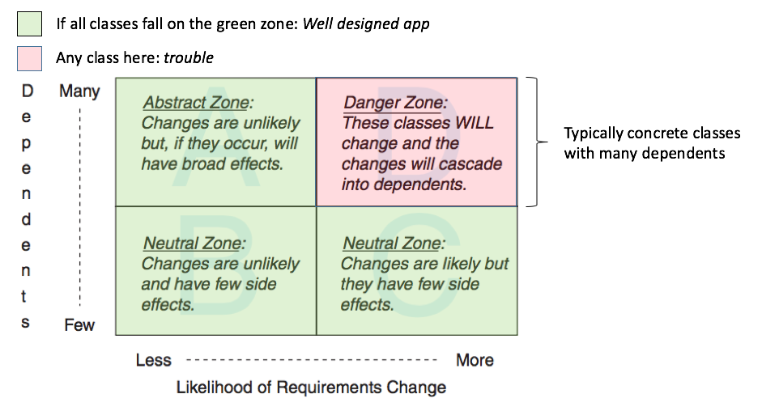

# key ideas
- [move implementation choices up the call stack](https://blog.thecodewhisperer.com/permalink/consequences-of-dependency-inversion-principle)
  - when we push implementation details up the call stack, we leave behind the minimum context needed to do the work. This makes the code as reusable as possible.
  - injecting an interface up front is *making a guess* about the minimum context needed inside the method.
  - overtime, to make the tests "better", we extract details up into parameters. And then sometimes we extract interfaces on those new parameters. This is "fine tuning" the interactions between objects, gradually/relentlessly removing irrelevant details.
  - the progress is usually similar to:
    - function contains implementation details, forcing us into integrated tests (Example: database access inside domain code)
    - extract and inject implementation details, which improves the design but often doesn't make the tests nicer
    - extract interfaces on the implementation detail parameters, which makes the tests nicer (Example: replace database access with repository pattern)
    - invert the dependency, so that hte client knows there is database access. Client "injects" the data instead of the source of the data. (Example: replace repository pattern with Logic Sandwich/impure-pure-impure)
  - DIP encourage us to isolate the steps from the workflow. This generally makes it easier to rearrange the steps into new workflows (new features are less expensive to build), but perhaps, more importantly, this makes it safer to reimplement some Steps to take advantage of distributed computing and parallelization.
  - don't instantiate the service if you can get your caller to do that
- [move specificity towards the tests](https://blog.thecodewhisperer.com/permalink/consequences-of-dependency-inversion-principle)
  - as the tests get more specific, the code get more generic
- avoid call your dependency injection container from production code.
- "when in doubt, inject each dependency directly in the method that requires it"
- "only when you inject the same dependency into multiple methods of the same class, move the parameter into the constructor"
- "when a constructor parameter list becomes uncomfortably long, split the class so that the new classes' constructors don't overlap"
- "if you notice a class using the same dependency through 2 different object graph routes, split the class so that the new class receive the dependency directly in their constructors"
- "if you notice a class using groups of dependencies at different times, split the class, so that the new classes only use each cohesive group of dependencies"
- "depends on things that change less often than you do"
  - some classes are more likely than other to have changes in requirements
  - concrete classes are more likely to change than abstract classes
  - changing a class that has many dependencies will result in widespread consequences.

# understand dependencies
- an object has a dependency when it knows
  - the name of another class. `Gear` expects a class named `Wheel` to exist
  - the name of a message that it intends to send to someone other than `self`
  - the arguments that a message requires `Gear knows that Wheel.new requires rim and title.`
    - mostly unavoidable dependency.
  - the order of those arguments `Gear knows the first argument to Wheel.new should be rim, tire the second`
- dependencies cause these objects to act like a single thing. They move in lockstep; they change together.
- "some degree of dependency is inevitable, however, most dependencies are unnecessary"
- violate law of demeter (know too much internals of distant objects)
- tests that tightly-coupled to code???

# manage dependencies

## inject dependencies
- instead of explicitly calling another class' name inside a method, pass the instance of other classes as an argument to the method

## isolate instance creation
- use when it's difficult to get rid of "the name of another class" dependency type through dependency injection
- move external class name call to the initialize method [example code](https://github.com/serodriguez68/poodr-notes/blob/master/code_examples/chapter_3.rb#L73-L83)
- isolate external class call in explicit defined method [example code](https://github.com/serodriguez68/poodr-notes/blob/master/code_examples/chapter_3.rb#L87-L102)

### isolate vulnerable external messages
- "for messages sent to someone other than self"
- isolate the external messages when the dependency becomes dangerous. For example:
  - the external method is buried inside other complex code.
  - there are multiple calls to the external methods inside the class
  - the method is part of the private interface of another class
  - [example isolated external messages](https://github.com/serodriguez68/poodr-notes/blob/master/code_examples/chapter_3.rb#L118-L126)

### use hashes for initialization arguments
- trade argument order dependency for an argument name dependency
  - argument name is more stable and provides explicit documentation of arguments
- for simple methods, you're better off accepting the argument order dependency
- for complex method signatures, hashes fit better
- ~~there are some cases in between where some arguments are required as stable (dependent on order) and some are less stable or optional (dependent on names by hash).~~
- [example hashes for initialization arguments](https://github.com/serodriguez68/poodr-notes/blob/master/code_examples/chapter_3.rb#L145-L158)

### explicitly define defaults
- simple non-boolean defaults: `||` [code sample](https://github.com/serodriguez68/poodr-notes/blob/master/code_examples/chapter_3.rb#L161-L166)
- hash as argument with simple defaults: `fetch` [code sample](https://github.com/serodriguez68/poodr-notes/blob/master/code_examples/chapter_3.rb#L169-L174)
- hash as argument with complex defaults: `defaults method + merge` [code sample](https://github.com/serodriguez68/poodr-notes/blob/master/code_examples/chapter_3.rb#L177-L186)
  - the `defaults` method is an independent method that handles the complex logic for defaults and returns a hash. This hash is then merged to teh actual arguments hash.

### isolate multi-parameter initialization
- wrap the external interface in a module whose sole purpose is to create objects from external dependency (factories)
  - [code sample](https://github.com/serodriguez68/poodr-notes/blob/master/code_examples/chapter_3.rb#L189-L209)
### reversing dependencies
- imagine the case where ClassA depends on ClassB. This is where Class A instantiates ClassB or calls methods from classB
- you could write a version of the code where classB depends on classA
- [gear depends on wheel sample](https://github.com/serodriguez68/poodr-notes/blob/master/code_examples/chapter_3.rb#L2-L34)
- [wheel depends on gear sample](https://github.com/serodriguez68/poodr-notes/blob/master/code_examples/chapter_3.rb#L264-L300)

#### choosing dependency direction
- **depend on things that change less often than you do**
- some classes are more likely to have changes in requirements compared to others
- concrete classes are more likely to change than abstract classes
  - abstract class: disassociated from any specific instance.
- changing a class that has many dependents will result in widespread consequences, which would increase risks and fear in changing the class.

#### finding dependencies that matter.
- not all dependencies are harmful.
- reference the following frameworks to help organize your thoughts and help you find which of your classes are dangerous.
- 

- Dependency retention: We don't worry about managing dependencies; we just inline and hard-code everything!
- Dependency rejection, an excellent term (coined by Mark Seemann, above), in which we avoid having any dependencies in our core business logic. We do this by keeping all I/O and other impure code all the "edges" of our domain.
- Dependency parameterization, in which we pass in all dependencies as parameters. This is commonly used in conjunction with partial application.
- Dependency injection and the reader monad, in which we pass in dependencies after the rest of the code has already been constructed. This is typically done via constructor injection in OO-style code, and in FP-style principle, this corresponds to the Reader monad.
- Dependency interpretation: We replace calls to dependencies with a data structure interpreted later. This approach is used in both OO (interpreter pattern) and FP (e.g. free monads)

## isolate the dependency

# Quotes

"abstractions should not depend upon details. Details should depend upon abstractions"

"push details up towards the client and push generic patterns down towards the server"

"never call your dependency injection container from production code"

# References
https://blog.thecodewhisperer.com/series#dependency-inversion-principle-dip
https://fsharpforfunandprofit.com/posts/dependencies/
https://blog.ploeh.dk/2017/01/27/from-dependency-injection-to-dependency-rejection/
