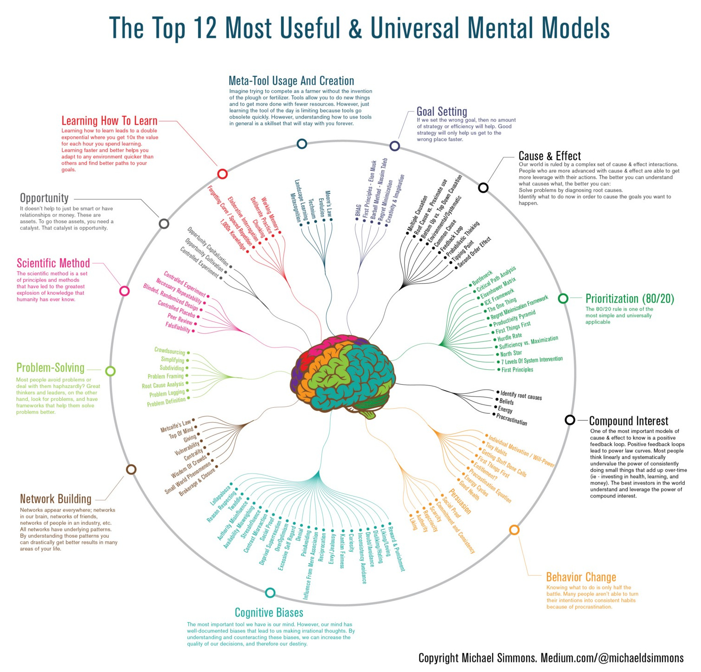

# Overview

## the top 12 most useful & universal mental models

## Circle of competence
- [circle of competence](https://fs.blog/circle-of-competence/)
  - each of us, through experience or study, has built up useful knowledge on certain areas of the world. Some areas are understood by most of us, while some areas require a lot more specialty to evaluate
  - that basic knowledge, along with some understanding of accounting and a little bit of study, would enable one to evaluate and invest in any number of restaurants and restaurant chains, public or private.
  - where should we devote our limited time in life, to achieve the most success? define the perimeter of your circle of competence, and operate inside. Over time, work to expand that circle but never fool yourself about where it stands today, and never be afraid to say "I don't know"
  - you know when to follow the rules and when they'll get you in trouble.

## Work required to have an opinion
- you have to do the reading, you have to talk to competent people and understand their arguments
- you have to think about key variables and how they interact over time.
- you have to listen and chase down arguments that run counter to your views.
- you have to think about how you might be fooling yourself.
- you have to see the issue from multiple perspectives.
- you need to become your most intelligent critic and have the intellectual honesty to kill some of your best-loved ideas.
- doing the work counteracts our natural desire to seek out only information that confirms that we believe we know.

## Pareto 20/80 principle
  - most of your results are going to come from just a small percentage of your effort or work.
    - 20% of relationships lead to 80% happiness
    - 20% exercises lead to 80% of health benefit
    - 20% of items on your todo list lead to 80% of productivity
    - 20% of foods you eat cause 80% of your sickness
    - by taking 10 minutes per day for prioritization, you can double your productivity
    - by looking at what experiences give you the most delight, you can begin to engineer your life

## First principles thinking
- reverse-engineer complicated situations and unleash creative possibility
- reasoning from first principles, it's a tool to help clarify complicated problems by separating the underlying ideas or facts from any assumptions based on them. what remains are essential.
- if you know the first principles of something, you can build the rest of your knowledge around them to produce something new.
- to break down complicated problems into basic elements and then reassemble them from the ground up.
- it's one of the best ways to learn to think for yourself, unlock your creative potential, and move from linear to non-linear results.

### techniques for establishing first principles
  - socratic questioning
    - clarifying your thinking and explaining the origins of your ideas (why do I think this? what exactly do I think?)
    - challenging assumptions (how do I know this is true? what if I thought the opposite?)
    - looking for evidence (how can I back this up? what are the sources?)
    - considering alternative perspectives (what might others think? how do I know I'm correct?)
    - examining consequences and implications (what if I am wrong? what are the consequences if I am?)
    - questioning the original questions (why did I think that? was I correct? what conclusions can I draw from the reasoning process?)
    - the process stops you from relying on your gut and limits strong emotional responses. This process helps you build something that lasts.
  - five why? 
    - asking why with the hope to get closer to the truth that we try to understand

## Externalities
- [Need to summary from fs.blog](https://fs.blog/externalities-why-we-can-never-do-one-thing/)

# Quotes

"Marking a book is literally an experience of your differences or agreements with the author. It is the highest respect you can pay him"

"I never allow myself to have an opinion on anything that I don't know the other side's argument better than they do"

"Doing the work required to hold on opinion means you can argue against yourself better than others can."

"what an investor needs is the ability to correctly evaluate selected business. Note that word "selected": You don't have to be an expert on every company, or even many. You only have to be able to evaluate companies within your circle of competence. The size of that circle is not very important; knowing its boundaries, however, is vital"

"Teach thy tongue to say I do not know, and thou shalt progress"

"I'm no genius, I'm smart in spots - but I stay around those spots."

"any fool can know. The point is to understand"

"it takes one to know one"

**"the first principle is that you must not fool yourself, and you're the easiest person to fool"**

**True experts recognize the limits of what they know what what they do not know. If they find themselves outside of their circle of competence, they keep quiet or simply say, "I don't know".**

**"Skim a lot of books, read a few. Immediately re-read the best ones twice."**

**The blank sheet primes your brain for what you're about to read and shows you what you're learning**

**reading a book should be a conversation between you and the author**

**understanding is a two way operation; the learner has to question himself and question the teacher. He even has to be willing to argue with the teacher, once he understands what the teacher is saying.**

**marking a book is literally an expression of your differences or your agreements with the author. It is the highest respect you can pay him**

"priceless opportunity to furnish your mind and enrich the quality of your life"

"The rich invest in time, the poor invest in money"

"Men who have made these discoveries before us are not our masters, but our guides"

"go to bed smarter than when you woke up"

"we don't read other people's opinions. We want to get the facts, and then think"

"when it comes to reading, you don't need to finish what you start"

"The pencil," he argues, "becomes the sign of your alertness while you read"

The person who says he knows what he thinks but cannot express it usually does not know what he thinks.

**"borrow liberally, combine uniquely, and create your bespoke blueprint."**

**"first you make your habits and then your habits make you"**

**"anything is good for your heart is good for you head"**

**lifelong learning adds years to your life and life to your years**

TEAM: Together Everyone Achieve More

be kind to yourself

learning is not solo, it's social

genius leaves clues

"What I hear, I forget. What I see, I remember. What I do, I understand"

there's no failure, only failure to learn.

practice makes progress

to understand is to know what to do

"the key to better comprehension is asking better questions"

you shall receive when you ask questions

# References
- https://www.youtube.com/playlist?list=PLI84Sf0aDgazRojpYTLTXFE6Iaf5bkYr_
- https://home.mindvalley.com/quests/en/superbrain
- https://arlobelshee.com/learning-faster-and-more-deeply/#more-171
- https://www.visualcapitalist.com/12-ways-smarter-mental-models/
- https://medium.com/accelerated-intelligence/this-is-exactly-how-you-should-train-yourself-to-be-smarter-infographic-86d0d42ad41c
- https://fs.blog/the-art-of-reading-how-to-be-a-demanding-reader/
- https://fs.blog/the-work-required-to-have-an-opinion/
- https://fs.blog/how-to-read-a-book/
- https://fs.blog/circle-of-competence/
- https://fs.blog/reading/
- https://fs.blog/the-buffett-formula/
- https://waiyancan.com/limitless-upgrade-your-brain-jim-kwik-summary/
- https://www.getstoryshots.com/books/limitless-summary/
- https://www.sitrakaratsimba.com/limitless-upgrade-your-brain-learn-anything-faster-and-unlock-your-exceptional-life/
- https://theartofliving.com/how-to-read-a-book-summary/
- https://biglifejournal.com/blogs/blog/fixed-mindset-vs-growth-mindset-examples
- https://fs.blog/externalities-why-we-can-never-do-one-thing/
- https://fs.blog/externalities-why-we-can-never-do-one-thing/