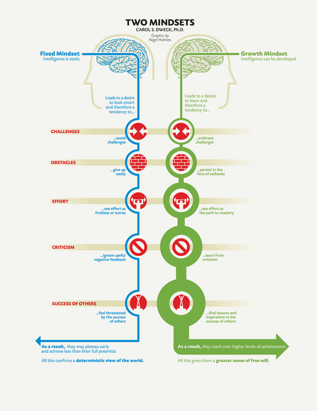

# take-aways
- 
- The growth mindset does allow people to love what they’re doing—and to continue to love it in the face of difficulties
- Those with the growth mindset found success in doing their best, in learning and improving. And this is exactly what we find in the champions
- The fixed mindset: I can’t do it. The growth mindset: I can’t do it yet

# fixed mindsets vs growth mindsets

- The **fixed mindset** is the belief that the intelligence and qualities a person is born with remain the same throughout his or her life. People with the fixed mindset view failure as intolerable, and spend much of their time trying to prove to themselves and others how smart and/or talented they are. They do not believe in the power of effort. 

- The **growth mindset** is the belief that with hard work and experience, growth and development occur. This mindset creates a desire to learn. Those with the growth mindset see failure as an opportunity to learn, and they value risk-taking. 

- **fixed mindsets prevent growth**
  - People with a Fixed Mindset are often worried about what other people think. As they often judge others based on their aptitude for a task, they also assume others judge them all the time. Hence, people with a Fixed Mindset are obsessed with showing how talented and smart they are. In fact, Carol suggests that those with a Fixed Mindset revolve their whole personality around their talent. Subsequently, they need approval from others to protect their personalities and egos. 

- **growth mindsets encourage development**
  - The sky’s the limit for people like this, as they are always seeking to find new ways to learn. Importantly, individuals with Growth Mindsets are not fixated on being better than other people or receiving the best grades. These individuals obtain satisfaction from pushing themselves to the limit to help themselves grow. They will practice relentlessly and are aware that you have to work your hardest, and overcome some failures, to improve.
  - People with a Growth Mindset enjoy being around people who are more skilled than them. They see spending time with more talented individuals as opportunities to learn new skills. Additionally, these people are always willing to discard a strategy if it is no longer working and replace it with a new approach.
  - As well as improving themselves, individuals with a growth mindset encourage the surrounding people to continue learning and working on themselves. They understand that life is about working as a team. When others are happier or more successful, they are more likely to succeed themselves. As business owners, individuals with a Growth Mindset are respectful to their team members and grateful for their work. Additionally, they are open to others’ opinions.

- **fixed mindsets seek approval; growth mindsets seek development**
  - Lou Gerstner took over IBM when it was similarly in a difficult spot. The environment was in a Fixed Mindset and wasting energy on internal disagreements. Each employee was merely doing what was best for themselves. Subsequently, the company was not meeting its customer needs. Gerstner changed this by breaking down the company’s hierarchy, emphasizing teamwork, and rewarding employees who supported their coworkers. Additionally, he put himself on the same level as his employees. This allowed him to engage with as many employees as possible. Gerstner was adopting a Growth Mindset, and this enabled shared development.
  - Gerstner’s Growth Mindset enabled him to create a new work environment based on teamwork and development. The focus moved away from individuals’ success and towards shared development. He was able to bring about lasting success at IBM.
- **Fixed Mindsets See Failures as Disasters; Growth Mindsets See Failures as Opportunities**
  - **Impact of Your Mindset**
    - Carol explains that individuals with a Fixed Mindset do not believe they can learn from their mistakes. Any failure is used as justification for their future being filled with failures. Additionally, any defeat cancels out all the individual’s previous successes. As this approach diminishes their self-confidence, Fixed Mindsets will often blame other people or circumstances for their failures. Alternatively, they will seek ways to cheat to get ahead. Instead of analyzing their weaknesses and improving based on their failures, they try to forget. These behaviors are underpinned by Fixed Mindsets believing that they are the finished product rather than a continual process. 
    - Carol provides basketball legend Michael Jordan as an example of an individual with a Growth Mindset. Although Jordan is arguably the greatest sportsman ever to live, he was imperfect. He missed some dunks, and he missed some game-winning shots. However, the critical matter is how Jordan responded to these misses. After making mistakes, he would practice the missed shot over and over again. Jordan’s ability to learn from his mistakes and practice these weaknesses brought him so much success. Jordan did not find fault in his teammates or his shoes for his own mistakes. Additionally, it is well-known that Jordan was a driving force behind his teammates’ improvements. Jordan wanted his teammates to be the best they could be. So, he always supported them in improving their game.

- **Fixed Mindsets Avoid Difficulties; Growth Mindsets Relish Difficulties**
  - While people with a Fixed Mindset get a thrill from easy things, people with a Growth Mindset get a thrill from what is complex. Fixed Mindsets struggle with difficult situations because they have to invest in making a positive outcome out of these situations. Effort is fundamental to success. However, people with a Fixed Mindset see situations where they have to spend more time and energy as a risk. The more time or energy they invest in a situation, the harder it becomes to blame external factors if they fail. The Fixed Mindsets avoid difficult situations as they do not want to question their talent or potentially make a fool of themselves.

- **THE GROWTH MINDSET BUILDS CHARACTER—A KEY COMPONENT TO SUCCESS.**
  - Character comes from the growth mindset and the idea that when things go wrong, there are effective strategies that can be used to cope with or overcome them. Character gives a person the ability to keep going even when things get really difficult. It is the ability to stretch yourself beyond what you think is humanly possible, to maintain focus and positivity when things get unbearable, and to consistently work hard. 
  - Those with the fixed mindset focus on proving that they are better than everyone else, while those with the growth mindset strive only to be the best they can possibly be.  They figure out and take the steps necessary to succeed and to keep succeeding. Many great athletes shared that they have found more fulfillment in personal growth than in winning or achieving fame.

# Childhood role models define our mindset

  - **impact of your parents**
    - Our mindsets start developing from birth. However, all babies are born with a Growth Mindset. Babies are curious about the world and want to learn and grow as much as possible each day. Therefore, it is the child’s environment growing up that determines whether the child maintains this Growth desire or eventually adopts a Fixed mindset. The most crucial agent in this shift is usually your parents. Parents have their mindset, and this will set an example for their children. 
    - Parents with a Growth Mindset will encourage their children to continue learning and questioning everything. Comparatively, parents with a Fixed Mindset will parent through judgment, punishment, and telling the children what is right and wrong. These parenting styles impact babies as young as 1. For example, babies with a Growth Mindset will help other babies when they are crying. In contrast, babies with a Fixed Mindset are annoyed when other babies are crying.

  - **Impact of Your Teachers**
    - In addition to parents, teachers are also fundamental role models in defining children’s mindsets. Some teachers adopt a Fixed Mindset by believing the ability of their students is unchangeable. In effect, they believe that some children are naturally intelligent, and others are destined to fail. However, there are many good teachers, also. These teachers will adopt a Growth Mindset by believing all their students are capable of learning anything. The teaching style of these teachers is more adaptable and places faith in the students. Generally, this teaching style helps all students perform better, even those who seemed doomed to fail.
  - 

# Anyone can adopt a growth mindset

  - **moving towards growth mindsets**
    - A journey towards a Growth Mindset also opens opportunities for developing concrete life plans. Developing a Growth Mindset will take time and the support of others around us. Therefore, we want supportive and honest people who are willing to talk to us about our mistakes and weaknesses.
  - **breaking away from fixed mindsets**
    - Breaking away from a Fixed Mindset can be particularly challenging. Fixed Mindsets are habits we have built over many years to protect us emotionally from our failures. Additionally, a lot of us will be reliant on our Fixed Mindset for our self-confidence. Suppose you are genuinely struggling to kick your Fixed Mindset. In that case, Carol suggests that adopting the Growth Perspective in certain situations is enough to have a positive impact. For example, you might accept you are terrible at sport. Despite this, you will apply a Growth Perspective to the most important things: Work, parenting, or studying. Additionally, you don’t only possess one mindset. Most people have elements of both that apply to different areas of their life. Therefore, your first task is to identify which areas you possess which mindset.
    - Carol outlines that a Growth Mindset helps make the impossible possible. She encourages each of us to look at the most successful people globally and consider how they would respond to failure. Likely, you will find that they used failures along the way to reach their success.
  - **Some Have Greater Opportunities, but We All Have a Chance**
    - It would be naive to say that effort is the only thing that’s important in succeeding. Effort is significant and is why those with a Growth Mindset increase their chances of success. Though, many other factors influence your chances of success. For example, Carol explains that resources and opportunities are useful for success. Those born into influential families with better access to education have a much higher chance of success. However, although your starting point matters, this does not mean you shouldn’t improve and create the best endpoint possible based on your opportunities
    - Importantly, Carol concludes by stating that a Growth Mindset does not mean we should try to improve everything. Sometimes the wisest decision is to accept our imperfections, especially those that will cause little harm.

  - **applying the growth and fixed mindsets to business**
    - The most successful business managers are not natural talents who ooze ego. Instead, they are the individual who is continuously looking to learn. They are also willing to ask questions and are not afraid to fail in front of their employees. They keep faith in their team to improve when they have made a mistake, rather than deeming them failures.
    - In contrast, Fixed Mindset bosses are dangerous. They often seek to be controlling and abusive to showcase their superiority. These behaviors push their fellow employees to adopt Fixed Mindsets, as well. Hence, instead of moving forward through learning, the company will be fixated on individual goals. Additionally, they will aim to obtain short-term goals by covering up mistakes and screwing other people over. 

  - **Applying the Growth and Fixed Mindsets to Love**
    - Relationships can often be complicated, and most of us will have multiple failed romantic relationships throughout our life. Individuals with a Fixed Mindset see these failed relationships as a defining feature of themselves. They label themselves as unlovable and want revenge for the rejection they have experienced. People with a Growth Mindset will also find rejection difficult. However, they will also see it as an opportunity to reflect on where things went wrong in the relationship
    - Additionally, the two mindsets have different levels of success in relationships. Relationships based on Fixed Mindsets are destined to fail, as both parties will be expecting everything to be perfect with no effort. Additionally, both parties believe that love can solve everything

  - **3 actions for you**:
    - Think about how you can put yourself into a growth mindset more often. What triggers your fixed mindset and how you can deal with it?
    - When praising your children, praise effort and progress
    - Think about how you can demonstrate growth mindset to your children

# Quotes

We like to think of our champions and idols as superheroes who were born different from us. We don’t like to think of them as relatively ordinary people who made themselves extraordinary.

If parents want to give their children a gift, the best thing they can do is to teach their children to love challenges, be intrigued by mistakes, enjoy effort, and keep on learning. That way, their children don’t have to be slaves of praise. They will have a lifelong way to build and repair their own confidence.

Mindset change is not about picking up a few pointers here and there. It’s about seeing things in a new way. When people…change to a growth mindset, they change from a judge-and-be-judged framework to a learn-and-help-learn framework. Their commitment is to growth, and growth take plenty of time, effort, and mutual support.

Although people may differ in every which way – in their initial talents and aptitudes, interests, or temperaments – everyone can change and grow through application and experience. — Carol Dweck, Mindset

[Children with a growth mindset] knew that human qualities, such as intellectual skills, could be cultivated through effort.

Not only were [the children with a growth mindset]not discouraged by failure, they didn’t even think they were failing. They thought they were learning.

What are the consequences of thinking that your intelligence or personality is something you can develop, as opposed to something that is a fixed, deep-seated trait?

Robert Sternberg, the present-day guru of intelligence, writes that the major factor in whether people achieve expertise ‘is not some fixed prior ability, but purposeful engagement’.

For twenty years, my research has shown that the view you adopt for yourself profoundly affects the way you lead your life.

Believing that your qualities are carved in stone—the fixed mindset—creates an urgency to prove yourself over and over.

This growth mindset is based on the belief that your basic qualities are things you can cultivate through your efforts. Although people may differ in every which way—in their initial talents and aptitudes, interests, or temperaments—everyone can change and grow through application and experience.

Why waste time proving over and over how great you are, when you could be getting better? Why hide deficiencies instead of overcoming them?

The passion for stretching yourself and sticking to it, even (or especially) when it’s not going well, is the hallmark of the growth mindset.

The fixed mindset makes you concerned with how you’ll be judged; the growth mindset makes you concerned with improving.

When you enter a mindset, you enter a new world. In one world—the world of fixed traits—success is about proving you’re smart or talented. Validating yourself. In the other—the world of changing qualities—it’s about stretching yourself to learn something new. Developing yourself.

Benjamin Barber, an eminent sociologist, once said, ‘I don’t divide the world into the weak and the strong, or the successes and the failures…. I divide the world into the learners and non-learners’.

People in a growth mindset don’t just seek challenge, they thrive on it.

We gave fifth graders intriguing puzzles, which they all loved. But when we made them harder, children with the fixed mindset showed a big plunge in enjoyment.

For [people with a growth mindset] it’s not about immediate perfection. It’s about learning something over time: confronting a challenge and making progress.

‘Becoming is better than being’. The fixed mindset does not allow people the luxury of becoming. They have to already be.

People with the growth mindset know that it takes time for potential to flower.

College students, after doing poorly on a test, were given a chance to look at tests of other students. Those in the growth mindset looked at the tests of people who had done far better than they had. As usual, they wanted to correct their deficiency. But students in the fixed mindset chose to look at the tests of people who had done really poorly. That was their way of feeling better about themselves.

John Wooden, the legendary basketball coach, says you aren’t a failure until you start to blame. What he means is that you can still be in the process of learning from your mistakes until you deny them.

French executive Pierre Chevalier says, ‘We are not a nation of effort. After all, if you have savoir-faire [a mixture of know-how and cool], you do things effortlessly’.

People with the growth mindset, however, believe something very different. For them, even geniuses have to work hard for their achievements.

They may appreciate endowment, but they admire effort, for no matter what your ability is, effort is what ignites that ability and turns it into accomplishment.

The growth mindset does allow people to love what they’re doing—and to continue to love it in the face of difficulties.

Those with the growth mindset found success in doing their best, in learning and improving. And this is exactly what we find in the champions.

Those with the growth mindset found setbacks motivating. They’re informative. They’re a wake-up call.

People with the growth mindset in sports (as in pre-med chemistry) took charge of the processes that bring success—and that maintain it.

# References
- https://parentotheca.com/2020/12/21/carol-dweck-mindset-book-summary/
- https://www.samuelthomasdavies.com/book-summaries/psychology/mindset/
- https://www.getstoryshots.com/books/mindset-summary/
- https://www.deanbokhari.com/mindset-summary/