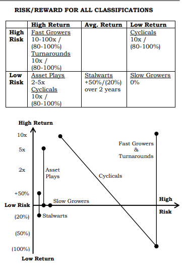
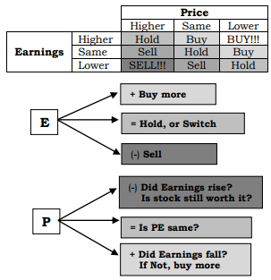

# INVEST PHILOSOPHY

- In most cases, professional, institutional/fund managers are restrained by cultural, legal and social barriers. Many are held back by various written rules and regulations. Some bank trust departments simply won't’ allow the buying of stock in any companies/unions. Others won’t invest in non-growth industries or specific industry groups, such as electric utilities or oil or steel. Some funds are further restricted with a market capitalization rule: they don’t own stock in any company below, say, a $100 million size (Size is measured by multiplying the number of outstanding shares by the stock price.). Hence, individual and amateur investors have the edge over most professional and institutional investors.

- Lynch is a "story" investor. Each stock selection is based on a well-grounded expectation concerning the firm’s growth prospects. The expectations are derived from the company’s "story"--what it is that the company will do or what will happen to bring about the desired results.

- The more familiar you are with a company, and the better you understand its business and competitive environment, the better your chances of finding a good "story" will come true. For this reason, Lynch is a strong advocate of investing in companies with which one is familiar or whose products or services are relatively easy to understand. Thus, Lynch says he would rather invest in "pantyhose rather than communications satellites," and "motel chains rather than fibre optics."

- Lynch does not believe in restricting investments to any one type of stock. His "story" approach suggests the opposite: investments in firms with various reasons for favourable expectations. In general, however, he tends to favour small, moderately fast-growing companies that can be bought at a reasonable price.

## MARKET TIMING

- Lynch constantly rechecked stocks and stories, adding/subtracting as things changed. But he never went into cash – except to have enough of it to cover anticipated redemptions. Going into cash = getting out of the market
- His idea was to stay in the market forever and to rotate stocks depending on the fundamental situations. If you decide that a certain amount you’ve invested in the stock market will always be invested in the stock market, you’ll save yourself a lot of mistimed moves and general agony.
- The bearish argument always sounds more intelligent. It’s said that “the market climbs a wall of worry” take note that the worry wall is fairly good-sized & growing every day. That’s not to say there’s no such thing as an overvalued market, but there’s no point worrying about it. The way you’ll know the market is overvalued is when you can’t find a single company that’s reasonably priced or meets your other investment criteria.
- Corrections (>10% decline) occur every two years, bear markets (>20%) every six years, and severe bear markets (>30%) have happened five times between 1932/33-2000.
- It’d be wonderful if we could avoid setbacks with timely exits, but nobody can predict them. Moreover, if you exit stocks & avoid a decline, how can you be sure that you’ll get back in for the next rally? 
- Things inside humans make them terrible stock market timers. Unwary investors continually pass through 3 emotional states:
  - i) Concern: he’s concerned after a market drop or when the economy seems to falter, which keeps him from buying good companies at bargain prices.
  - ii) Complacency: after he buys at higher prices, he gets complacent because his stocks are going up. This is precisely when he ought to be concerned enough to check the fundamentals but isn’t.
  - iii) Capitulation: finally, when his stocks fall on hard times and prices fall below the purchase price, he capitulates and sells in a fit of irritation.
- If you spend 13 minutes on economics (forecasting the future), you’ve wasted 10 minutes. Think about what’s happening - deal in facts, not forecasts. That’s crystal ball stuff, which doesn’t work.
- Assuming you forecast a big market decline, how can you prepare? Mostly by doing nothing. A market calamity is different from a meteorological calamity. Since we’ve learned to take action to protect ourselves from snowstorms, it’s only natural that we would try to prepare ourselves for corrections, even though this is one case where being prepared can be ruinous.
  - i) The 1st mistake is hedging the portfolio. Anticipating a drop in the market, the skittish investor begins to dabble in futures and options, thinking of this as correction insurance. It seems cheap at first, but the options expire every couple of months, & if stocks don’t go down on schedule, people have to buy more options to renew the policy. Suddenly, investing isn’t so simple. Investors can’t decide whether they’re rooting for stocks to falter, so their insurance will pay off or for a rally for the sake of the portfolio. Hedging is a tricky business even the pros haven’t mastered – otherwise, why’d so many hedge funds go out of business? 
  - ii) The 2nd and more prevalent mistake is the ritual known as lightening up, selling some or all stocks. Or putting off buying stocks you like & sitting on cash, waiting for the crash. “Better safe than sorry” is the mantra. “I’ll wait for the day of reckoning when all the suckers who didn’t see this coming are wailing and gnashing their teeth, and I’ll snap up bargains left and right.” (But once the market bottoms, cash sitters are likely to continue to sit on cash. They’re waiting for further declines that never come, and they miss the rebound.). They may still call themselves long-term investors, but they’re not. They’ve turned into market timers & unless their timing is very good, the market will run away from them.
- People waste time figuring out “When should I invest?” Lynch did a study – for 30 years (1965-1995), if you had incredibly good luck investing $1,000 at the yearly low, your return would’ve been 11.7%. Some other unlucky souls put $1,000 at the yearly high, earning 10.6%. That’s the only difference between the yearly high and low. Someone else put it on the 1st day of the year, earning 11%. Just buy, hold, and add to it when the market goes down 10%.
- The only problem with market timing is getting the timing right. You’ll never meet many people who’ve done it successfully. Maybe once in a row, but not consistently. 
- There’s no telling how many timers miss big gains by making ill-timed exits. Far more money has been lost trying to anticipate corrections or preparing for corrections than has been lost in corrections themselves. 
- People have more time than they think to ride out corrections, which is why you shouldn’t worry about the next one. Corrections are unpredictable. By selling stocks to avoid pain, you can miss the next gain. As soon as you realize you can afford to wait out any correction, the calamity also
becomes an opportunity to pick up bargains.
- Ask yourself this: If stock prices dropped 10- 25%, would you add to your positions, or would you cash out and cut your losses? If
you’d cash out, then do it now & avoid the misery that is sure to come later.
- A 40-year review of the S&P 500 going back to 1954 shows how expensive it is to be out of stocks during the short stretches when they make their biggest jumps. If you kept all your money in stocks throughout, your annual return was 11.4%. If you were out of stock for the ten most profitable months, your return dropped to 8.3%. If you missed the 20 most profitable months, your return was 6.1%; in the 40 most profitable, you made only 2.7%. If you cut enough losses, there’s nothing left to cut sooner or later.

## SILLIEST (AND MOST DANGEROUS) THINGS PEOPLE SAY ABOUT STOCK PRICES

- *If It’s Gone Down This Much Already*, It Can’t Go Down Much More – the only thing to keep in mind is the intrinsic value vs current price. As long as the value stays high or improves, a falling price only helps to make it a better bargain.

- *You Can Always Tell When A Stock Hits A Bottom*
  - You must buy for a more sensible reason than a stock’s gone so far. It looks up to you.
  - It’s a good idea to wait until the knife hits the ground, sticks, vibrates for a while, and settles down before you grab it.
  - But even so, you don’t get the bottom price. What usually happens is that a stock sort of vibrates itself out before it starts up again. Generally, this takes 2-3 years, sometimes longer.
  - Find charts of those companies that declined sharply and then went sideways for a couple of years. If it’s gone sideways for some time, fundamentals are decent, & you can find something that’s new & positive in the company/ industry, then if you’re wrong, it’ll probably keep going sideways, and you won’t lose much. But if you’re right, that stock is going north.

- *If It’s Gone This High Already, How Can It Possibly Go Higher?*
  - Multibaggers break these barriers, year after year. 
  - Never able to predict which stocks will go up 10x or 5x. Stick with them as long as the story’s intact, hoping to be pleasantly surprised. A company's success isn’t the surprise, but what the shares bring often is.
- *It Only $3 A Share, What Can I Lose?*
  - If it goes to 0, you still lose everything. A lousy cheap stock is as risky as a lousy, expensive one.
  - Short sellers usually buy nearer to the bottom than to the top. They wait until a company is so obviously floundering that bankruptcy is inevitable.

- *Eventually, They Always Come Back*
  - consider the thousands of companies that went bankrupt or solvent ones that never recovered prosperity or were bought out at prices far below their peak price.

- *It’s Always Darkest Before The Dawn*
  - the human tendency to believe things that have gotten a little bad can’t get worse.

- *When It Rebounds To $10, I’ll Sell*
  - No downtrodden stock ever returns to the level you’ve decided to sell. This painful process may take a decade, and all this while, you’ll tolerate an investment you don’t even like.
  - Unless you’re confident enough to buy more, you should be selling immediately.

- *What, Me Worry? Conservative Stocks Don’t Fluctuate Much*
  - Utilities can be as risky as Biotech, even riskier because you aren’t aware of unknown changes.

- *It’s Taking Too Long For Anything To Happen*
  - If you give up because you’re waiting for something wonderful to happen, then something wonderful will happen the day after you sell. It takes remarkable patience to hold onto a stock that excites you but which is ignored by everybody else. You begin to think others are right and you’re wrong.
  - Most of the money Lynch made was in the 3rd/4th year. If fundamentals are positive and whatever attracted you hasn’t changed, then sooner or later,
patience will be rewarded.

- *Look At All The Money I Lost, I Didn’t Buy It*
  - You aren’t a cent poorer than you were – money lost via fictional missed opportunities and omission errors are self-torture.
  - This isn’t a productive attitude. It can only lead to total madness. o The worst part about such thinking is that it leads people to try to catch up by buying stocks they shouldn’t if only to protect themselves from losing more than they’ve already “lost.”

- *I Missed That One; I’ll Catch The Next One*
  - The original good company at a high price is better than the next bargain. 
  - Trouble is the next one rarely works. If you missed a great company that continued to go up and then bought a mediocre one that went down, you
took a mistake that cost nothing and turned it into a mistake that cost plenty.

- *The Stocks Gone Up, So I Must Be Right...or...The Stocks have Gone Down, So I Must Be Wrong*
  - people confuse prices with prospects. The short-term fanfare means nothing unless they’re short-term traders looking for 20% gains. Price movements after your purchase only tell you that someone was willing to pay more/less for the identical merchandise.

## WALL STREET

- Street Lag: a stock isn’t truly attractive until some large institutions have recognized its suitability and an equal number of analysts recommend it.
- Don’t believe that professional management has brought new prudence, sophistication & intelligence to the market. These stock pickers are usually right, but only for the last 20% of a typical stock move. It’s that last 20% that they study for, clamour for, and then line up for – all the while with a sharp eye on the exits. The idea is to make a quick gain and stampede out the door.
- Small investors don’t have to fight this mob. They can calmly walk in the entrance when there’s a crowd at the exit and walk out the exit when there’s a crowd at the entrance.
- The fund manager is looking for reasons “not” to buy exciting stocks so that he can offer the proper excuses if these exciting stocks go up. Too small, no track record, non-growth industry, union employees, unproven management, high competition – these may be reasonable concerns that merit
the investigation is often used to fortify snap judgments and wholesale taboos.
- Unwritten rule: you’ll never lose your job, losing client money on IBM. Clients & bosses will ask what’s wrong with IBM. But if an investment in a small unknown company goes bad, they’ll ask, what’s wrong with you?
- Discounting = Euphemism for pretending to have anticipated surprising results.
- A stock does not know that you own it

## GETTING THE FACTS

- ***Getting the Most out of a Broker***
  - You’re probably paying much higher commissions if you use a full-service broker. Make them sweat for their money if you use their services.
  - If you use the broker as an advisor, make him do the 2-minute drill, category of stock, recent growth in earnings, p/e ratio relative to historic levels, expansion plans, debt situation, insider buy, buying back share, etc...

- ***Calling the Company***
  - Amateurs never call; professionals do so all the time. For specific questions, investor relation is a good source. In small companies, you may reach high-placed executives when you call.
  - Before calling, prepare questions. 
  - Do small talk before asking serious questions about business conditions, plans, the mood at the company, or anything unusual in the recent quarter. Pepper questions with little information so the source thinks you’re prepared.
  - What you want is a reaction to whatever script you’ve been trying to develop. Does it make sense? Is it working? Enquire about inventories, product/project development, capacity utilization, prices, debt repayments, market share, expansion, and asset values.
  - Don’t ask, Why is the share price falling? 
  - Don’t ask about expected EPS directly. An indirect, subtle way to do this is to ask about Wall Street EPS estimates.
  - If your storyline is well-developed, you’ll know what to ask. Even if you don’t have a script, simply ask:
    - What are the positives this year?
    - What are the negatives?
  - Sum up a conversation as follows: 4 positives and three negatives.
  - You’ll find something extraordinary in 1/10 calls. While calling depressed companies, nine will confirm bad news, as expected, but one will give some cause for optimism, which isn’t generally perceived. The unexpected can be very profitable.
- Always end the discussion with: which competitor you respect the most? Managers speak negatively about competition 95% of the time, which doesn’t
mean much. However, nothing is more bullish than a rival’s begrudging respect.

- ***Visiting Headquarters***
  - Get a feel for the place. When was the last time an analyst visited? The longer the period, the better it is.
  - Bad signs include fine antiques, expensive furnishings, furniture, etc. 
  - Can also inform front office employees and investor relation representatives at annual meetings.
  - Calculate the net worth of company representatives based on shares held. If you can’t imagine how a representative got so rich and could get richer if the stock rises, you may be right, and the share may truly be overpriced. Does that person ‘deserve’ to be so rich?

- ***Balance Sheet:***
  - Check cash and marketable securities in the current assets section. If together it exceeds long-term debt in the long-term liability section, it’s very favourable. No matter what happens, the company isn’t about to go out of business.  
  - Assume other current assets, including a/c receivable, inventories, and other current assets are valuable enough to cover the short-term debt. 
  - If the long-term debt exceeds cash, the cash has been shrinking, and debt has been growing, the company is in weak financial shape. 
  - “Debt reduction is another sign of prosperity. When cash increases relative to debt, it’s an improving balance sheet. When it’s the other way around, it’s a deteriorating balance sheet.”

- As a personal rule, once a month, Lynch held at least one personal conversation with a representative of each major industry group just in case business was starting to turn around, or Wall Street overlooked new developments. This was an effective early warning system, and in 2/10 cases, he’d discover something important.

- Be careful to note the name of everyone you meet. After every contact, note the company, current price and a 1-2 line summary of the story you’d just heard. Every investor benefits from keeping such notes, without which, it’s easy to forget buying reasons

# DESIGNING A PORTFOLIO

- Investing in bonds, money markets, or CDs are different forms of debt—for which one pays interest. Historically debt instruments have recorded less than 5% gains. In bonds, you’re nothing more than the nearest source of spare change. When you lend money to somebody, the best you can hope for is to get it back, plus interest.

- The portfolio design may change as you grow older. Younger investors, with a lifetime of earnings ahead of them, can afford to take more chances on 10x opportunities, vs older investors who may want to live off dividends.

- 

- Determine Stock: Bond Mix based on Growth: Income wants. Most people err on the side of income and short-change growth. 
  - Can hardly go wrong by making a full portfolio of companies that have raised dividends for 10-20 years. 
  - Stock allocation % depends on how much you can afford to invest in stocks and how quickly you will need to spend this money. Increase the stock % to the limits of your tolerance. 
  - In 50/50 portfolio, combined return = 4.5% (1.5% dividend + 7.5% 10 year bonds). Historically, stocks return 10% = 8% growth + 2% dividend yield. So portfolio growth in 50/50 mix = 4%, (8+0)/2, which is < Inflation. 
  - It's incorrect to state that you can’t afford the loss in fixed income because, over the long term, growth more than makes up for any losses. But the fear factor comes into play. 
  - The person who uses stocks as a substitute for bonds not only must ride out the periodic corrections but also must be prepared to sell shares, sometimes at depressed prices, to meet living expenses. This is especially difficult in the early stages when a market setback could cause portfolios to drop below the purchase price. Such worries of wiping out the capital keep people in bonds, even when they’re aware of the long-term wisdom of investing in stocks. 
  - Assume that the day you go 100% into stocks, the market corrects 25%. You’d still equal bond returns, even if you imagine the most prolonged disaster in modern finance – a 20-year severe recession when earnings and dividends only grow at 4% instead of 8%. 
- Bonds vs Bond Funds 
  - 30-year T-bond is safe only if you get 30 years of low inflation. If inflation is >10%, the bonds will lose 20-30% of their value. 
  - Bonds are safer to buy in funds, only if they’re corporate / junk bonds, where diversification limits default risk. 
- Stocks vs Stock Funds 
  - The only way to benefit from funds is to keep owning it, just like owning a stock. This requires a strong will. Fund investments don't solve the problem for people who can be scared out of stocks. 
  - Buffett’s admonition that people who can’t tolerate seeing their stocks lose 50% of their value shouldn’t own stocks also applies to funds. 
  - During a correction, it’s common for the best-performing funds to decline > the average stock. To benefit, you’ve to stay invested. 
  - Distribute equity portfolio by buying several funds of varying styles and philosophies. Markets and conditions change, and one style of manager or fund won’t succeed in all seasons. 
    - i) Capital Appreciation: can buy all types of stocks and isn’t forced to adhere to any particular philosophy. 
    - ii) Value: Assets, not earnings, are the main attraction. 
    - iii) Quality Growth: Mid-Large cap companies that are well established, expanding at a respectable and steady rate, increasing earnings at >15%. This cuts out cyclical, slow-growing blue chips and utilities. 
    - iv) Emerging Growth: small caps 
    - v) Special Situations: companies have nothing in common except that something unique has occurred to change their prospects. 
  - Anyone can create a stock portfolio by picking one fund from each of the above and adding one more fund that invests in utilities/equity income funds as ballast for stormy markets. 
  - Can also add two index funds, one for S&P 500 (covers quality growth) and Russell 2000 (covers emerging growth).
  - Divide money equally between funds and also deploy new money equally. The sophisticated way to do it is to adjust the weight of the funds, putting Only the new money into sectors that have lagged. When any fund does poorly, the natural temptation is to switch to a better fund. People, who switch, tend to lose patience at precisely the wrong time, jumping from a value fund to a growth fund just as value is starting to wax and growth is starting to wane. 
  -when a value fund does better than its rivals in a bad year for value style, it’s not necessarily a cause for celebration. It may be so that the manager has used other styles to outperform in the short term, but such benefits will be fleeting. When value returns, he won’t be fully invested in it.
  - stocks in the general checklist
    - The p/e ratio compare to similar companies within the same industry 
    - Percentage of institutional ownership. The lower, the better
    - Insider buying & whether the company itself is buying back shares. Both are positive.
    - Record of earnings growth and whether the earnings are sporadic or consistent. 
    - Strong balance sheet or weak. The debt-to-equity ratio and cash position 
  - Picking a Winner
    - Don’t spend much time on a fund’s past performance. Not to say you shouldn’t pick a fund with a good long-term record, but it’s better to stick with a steady and consistent performer, vs, a fund whose performance moves in and out of best / worst performing lists. 
    - Check bear market performance. Some funds lose more but regain more on the rebound; some lose less & gain less; while some lose more & gain less. Avoid the third group.
    - Forbes grades funds A-F, based on their performance in the 2 preceding bear and bull markets. Funds that fare A/B in both situations get into the honour roll.
  - Sector Funds: not recommended unless you’ve special industry knowledge. 
  - Convertible Funds: an underrated way to enjoy the best of both worlds – high performance of secondary and small-cap stocks + stability of bonds. Customarily, the conversion price is 20-25% higher than the market price. Investors are better off investing via funds rather than directly. Buy convertible funds when the spread between convertible and corporate bonds is narrow (1.5-2%), and sell when it widens.
  - Closed-End Funds: trade on exchanges, ∴ fluctuate like stocks – selling at a discount/premium to NAV. Look for opportunities during market sell-offs. 
  - Country Funds: to succeed, you must have patience and a contrarian bent. They arouse a desire for instant gratification. The best time to buy a closed-end country fund is when it’s unpopular and trading at a 20-25% discount to NAV. Drawbacks include a) higher fees and expenses, b) not just companies, the currency must remain strong, and c) government mustn’t ruin the party with extra taxes or regulations that hurt business. Check a) whether the fund manager has worked there, knows people in companies and can follow their stories?) is information disclosure proper, or sketchy and misleading?
- ***How Many Stocks Is Too Many?*** 
  - Best to own as many stocks as there are situations in which: 
    - You have an edge, and, 
    - You’ve uncovered an exciting prospect that passes all your tests.
  - It could be one stock or a dozen. There’s no use in diversifying into unknown companies just for diversity.
  - However, it isn’t safe to own a single stock because, despite your best efforts, the one you choose may be a victim of unforeseen circumstances. 
  - In small portfolios. One can be comfortable holding 3-10 stocks. There are several possible benefits: 
    - The more stocks you own, the more likely that one of them will 10x. 
    - More stocks provide greater flexibility to rotate funds between them. This was an important part of Lynch’s strategy. Some people ascribe his success to having specialized in growth stocks, but that’s only partly accurate. He never put >30-40% into growth stocks. 
  - Small investors can follow the Rule of 5 and limit portfolios to 5 stocks. If just one becomes 10x, and the other four go nowhere, the portfolio becomes 3x. o You can have a paper portfolio with 10- 15 stocks that you actively research and own 5 or 6 that you judge to be attractive. This will be great practice; you’ll learn your strengths and weaknesses and in what areas of the economy you’ve better skills. 
  - The practice of buying, selling & forget, in a long string of companies isn’t likely to succeed. Investors want to put their old stocks out of their minds because it invokes a painful memory. With a stock you once owned, especially if it went up after selling, it’s human nature to avoid looking at its quote. You must train yourself to overcome this phobia. Think of investments not as discontinued events but as continuing sagas, which need to be rechecked from time to time. Unless a company goes bankrupt, the story is never over. To keep up with old favourites, keep a large notebook in which you record important details from company reports & reasons why you decided to buy/hold the last time. 
  - Don’t pick a new and different company. Otherwise, you’ll end up with too many stocks and won’t remember why you bought them. Getting involved with a manageable number of companies and confining your buy/sell to these is not a bad strategy. Inevitably, some gloomy scenario will cause a general retreat in the stock market, your old favourites will once again become bargains, and you can add to your investment. 
  - If all stocks went up at the same rate, there would be nothing left to buy, and investors everywhere would be out of business. Fortunately, this is not the case. There’s always a laggard to fall back on once you’ve sold a stock that’s gotten ahead of itself. o Magellan owned 1400 stocks, of which 50% of AUM was in the top 100 stocks, 2/3rd in the top 200 and 1% spread over 500 secondary stocks that were monitored periodically, with the possibility of tuning in later. If something happened to a secondary stock to bolster confidence, it got promoted to a primary selection

- ***Favourable Company Attributes***
  - i) Sounds Dull or Ridiculous – simple business with a boring name. More boring, the better. No analysts recommend such names.
  - ii) Does Something Dull – boring name + boring business = keeps Wall street away. 
  - iii) Does Something Disagreeable – better than boring = boring + disagreeable. Makes people shrug/retch in disgust. 
  - iv) It’s a Spinoff – have strong balance sheets and be well prepared to succeed. 
    - Spinoffs are misunderstood and get little attention. 
    - New management can cut costs and take creative measures to improve earnings. Look for insider buying after 1-2 months.
    - Institutions dismiss spinoff shares as pocket change. 
    - Spin-off reports are hastily prepared and are more boring than annual reports. 
    - Fertile area for amateurs, especially during an M&A frenzy.
  - v) Institutions Don’t Own it and Analysts Don’t Follow It – might frequently happen in many companies' sectors. Be equally enthusiastic about once-popular stocks that are now abandoned. 
  - vi) Rumours Abound – it’s involved with toxic waste or the mafia. Such rumours repel respected investors.
  - vii) Something Depressing About It – ex. burial company
  - viii) It’s Not a Growth Industry – nothing thrilling about a high-growth industry except seeing the stocks drop. For every single product in a high-growth industry, many others are trying to make it better and cheaper. 
    - This doesn’t happen in a slow-growth industry, where the biggest winners are created since there’s no competition. 
  - ix) It’s Got a Niche – exclusive franchise, newspaper, cable, brands, rock pits, pharma/chemical patents.
  - x) People Have to Keep Buying It – Steady business is better than fickle purchases. Drugs/soft drinks/razors/cigarettes > Toys. 
  - xi) It’s a User of Technology – ADP benefits from the computer price war vs Dell. Retailer benefits from scanner usage, vs, buying scanner companies. 
  - xii)Insiders are Buyers – when management owns stock, rewarding owners is prioritized over overpaying salaries or growing at all costs. 
    - In general, insiders are net sellers. Insider selling ≠ automatic sign of trouble, and it’s silly to react to it. 
    - Many reasons for selling, but only 1 for buying – believe the stock is undervalued if the price drops after insider buying, so much the better. 
  - xiii) Share Buy-backs – alternative uses for cash include: a) Dividend raise, b) new product development, c) start of new operations, and d) M&A.
  - xiv) The best place to start looking for the ten-bagger is close to your home. You just need to keep your eyes and mind open. You come across many companies at shopping malls, workplaces, medical test offices, etc. You didn’t have to work at Kodak to know that the new generation of inexpensive, easy-to-use, high-quality cameras would turn the photo industry around. Maybe you work at school and come across a company that is automating the attendance system at school and thus will save hundreds of teachers’ hours. That company is worth researching.

- ***Stocks to Avoid***
  - i) Hot Stuff – Avoid the hottest stock in the hottest industry. If you aren’t clever at selling, you’ll soon see your profits turn into losses. High growth and hot industries attract smart competitors. 
  - ii) Next Something – when people tout a stock as the next IBM, it often marks the end of prosperity for the imitator and the original. 
  - iii) Diworsifications – instead of buybacks/dividends, a dedicated diworsifier seeks purchases that are a) overpriced, and b) beyond the realm of understanding. 
    - Every second decade, companies switch between diworsification and restructuring 
    - 1960s was the greatest decade for diworseification, which ended in the crash of 1973/74 
    - Synergy (2+2=5): theory of putting together related businesses and making the whole thing work, which doesn’t always happen. A vigorous buyback is the purest synergy of all. 
  - iv) Whisper Stocks - long shot companies with whiz-bang stories. 
    - Are often on the brink of solving the latest national problem with a solution that’s: a) very imaginative or b) impressively complicated. 
    - The great story has no substance, but it relieves the investor of the burden of checking the financials.
    - If prospects are phenomenal, it will be a fine investment next year. Wait till the company has established a record.
  - v) Beware the Middleman – the company sells a large % of sales (20-50%) to a single customer. Short of order cancellation, that customer has enormous leverage in getting cuts and concessions that reduce profits. 
  - vi) Beware the Stock with an Exciting Name – the flashy name of a mediocre company attracts investors and gives them a false sense of security.

- If you can’t predict future earnings, at least you can determine how a company plans to increase its earnings. Then you can check periodically to see if the plans are working out.

- There are five basic ways a company can increase earnings: reduce cost; raise prices. Expand into new markets; sell more of its products in the old markets or to old/existing customers; or revitalize, close, or otherwise dispose of a losing operation. 

- With every company, there is something to worry about, but the question is, which worries are valid and which are not? There’s no such thing as a worry-free investment. The trick is to separate the valid worries from the idle worries and then check the worries against the facts. The existence of doubt creates the conditions for a big gain in the stock once the fears are put to rest.
- The trick is to put your fears to rest by doing the research & checking facts – before the competition does. The stocks Lynch bought are the very stocks that others overlooked. The stock market demands convictions as surely as it victimizes the unconvinced.
- Take the industry that’s surrounded by the most doom & gloom, & if fundamentals are positive, you’ll find some big winners. 
- In cases where quiet facts point in a positive direction, a much different story than the negative news being trumpeted, wait until the prevailing theory is that things have gone from bad to worse, then buy the strongest companies. Invest in a company that can survive in a depressed state, rather
then one that can thrive in boom times but is untested for bad times. 

- The popular prescription “Buy at the sound of cannons & sell at the sound of trumpets” can be misguided advice. Buying on bad news can be very costly, especially since bad news can get worse. 
- Buying on good news is healthier long term, and you improve your odds considerably by waiting for the proof. Maybe you lose a dollar or so by waiting for the announcement instead of buying the rumour, but if there’s a real deal, it will add many more dollars to the future price. And if there isn’t a real deal, you’ve protected yourself by waiting. 
- In the short term, the story looks ‘fuzzy,’ and the stock might fall due to uncertainty. It’s best not to own the company during this uncertain stage unless you’re prepared to respond to such a drop by buying more – over the long term, you must be convinced that the company will do well. 
- Combat Theory of Investing: During a war, don't buy the companies that are doing the fighting; buy the ones that sell bullets. 
- Industry Bets: an individual can bet heavily on the most promising company and put all his money there, but a fund manager has to spread out his money. 2 ways to do this: 
  - i) Decide “I want 8% autos” because you have a hunch they’ll do well. The sector pick is deliberate & companies are incidental. 
  - ii) Analyze each company on a case-by-case basis. The choice of companies is deliberate & the weighting is incidental. 
- Lynch’s stock picking was entirely empirical. Sniffing from one case to another, like a bloodhound trained to follow a scent. Care more about the details of a story than whether the company’s sector is under/overweighed in the portfolio. Following scents in every direction proves that a little knowledge about a lot of industries isn’t necessarily a dangerous thing. Investment flexibility is key if you're a bloodhound style. Lynch bought companies with unions and steel/textiles. He always thought there were good opportunities everywhere & researched stocks himself. Taco Bell was one
of his earliest picks – when people wouldn’t look at a small restaurant company. If you look at ten companies, you’ll find an interesting one. If you look at 20, you’ll find 2, or 10 in 100. The person that turns over the most rocks wins the game – that was always Lynch’s philosophy. 
- Rather than being on the defensive, buying stocks, and then thinking of new excuses for holding onto them (Wall Street style), Lynch stayed on the offensive, searching for better opportunities that were more undervalued than the ones already in the portfolio.
- Rejecting a stock because the price has become 2-3-4x in the recent past can be a big mistake. Whether a million investors lost or made money on a stock has no bearing on the future. Treat each potential investment as if it had no history – the ‘be here now approach. Whatever occurred earlier is irrelevant. The important thing is whether the stock is cheap/expensive today vs its earnings potential.

- Look for small companies that are already profitable and have proven that their concept can be replicated. 

- Be suspicious of companies with 50 to 100 percent growth rates yearly. 

- Distrust diversifications, which usually turn out to be diworseifications. 

- Long shots rarely pay off. 

- It’s better to miss the first move in a stock and wait to see if a company’s plans are working out. 

- People get incredibly valuable fundamental information from their jobs that may not reach the professionals for months or even years. 

- Separate all stock tips from the tipper, even if the tipper is very smart, very rich, and his or her last tip went up. 

- Some stock tips, especially from an expert in the field, may be quite valuable. However, people in the paper industry normally give out tips on drug stocks, and people in the healthcare field never run out of tips on the coming takeovers in the paper industry. 

- Moderately fast growers (20 to 25 percent) in nongrowth industries are ideal investments. 

- When purchasing depressed stocks in troubled companies, seek out the ones with superior financial positions and avoid the ones with loads of bank debt. 

- Companies that have no debt can’t go bankrupt. 

- Devote at least an hour a week to investment research. Adding up your dividends and figuring out your gains and losses doesn’t count. 

- When in doubt, tune in later. 

- ***How to Rate a Savings & Loan (S&L) Company***
  - Equity / Assets – measures financial strength and survivability. Higher, the better. <5x = Danger, 5.5-6x = Average, > 7.5x = Preferred. 
  - Book Value – if high-risk lending has been avoided, then assets and book value may accurately reflect net worth. Look for P/B < 1x.
  - PE – the lower, the better. If PE = 7x, and growth = 15%, that’s very promising, especially when S&P 500 PE = 23x. 
  - High-Risk Assets – get nervous when commercial and construction loans are >5-10% of the lending portfolio since one can’t analyze a commercial lending portfolio from the outside. 
  - 90-Day NPA’s – these have already defaulted. Preferably represent <2% of total assets. The trend should be falling. o Dividend – higher yield is a plus when other criteria are met. 
  - Real Estate Owned – foreclosed properties are already written off, an index of yesterday’s problems. A high number isn’t worrisome unless it’s on the rise. If there’s a lot of REO, you’ve to assume that the S&L is having trouble getting rid of it.
  - Large banks like Citibank may spend 2.5-3% of their entire loan portfolio for overheads and related costs. A good S&L may break even at 1.5%.
  - Best S&Ls are no frills, low-cost operators, have a solid base of loyal neighbourhood depositors, are content to make traditional low-cost residential mortgages (<$1000k), avoid hiring high-priced credit analysts, have big branches with enormous deposits, which is more profitable than having many small branches, also don’t have expansively furnished headquarters.
  - Large banks prize an S&L with excess equity, loyal deposit base & lending capacity as a takeover target.
  - If an S&L with a boring story and fortress balance sheet gets in trouble, its competitors are walking the plank. 
  - Problem Loan Camouflaging – approve $120 on a $100 request, using inflated appraisals. Excess $20 is held back in banks’ reserves and used at default to cover interest payments. Helps reclassify bad loans as good, at least temporarily. 
  - Traditionally, an S&L is owned cooperatively and has no shareholders. Net worth belongs to all who have accounts in branches. 
  - As long as the cooperative form of ownership is maintained, you get nothing for your stake. Things change when it comes to an IPO: 
    - i) The Directors, who put together the deal, and the stock buyers, are on the same side. Directors will buy shares, so the IPO price is set low.
    - ii) Depositors & Directors can buy at the IPO price. Because depositors own cooperatives, it’s inconvenient to divvy IPO proceeds among many sellers, also buyers. Instead, the money becomes a part of equity & goes back to the S&L rather than going into the promoters’ pocket. Pre-IPO Book Value = $10. Further $10 shares sold, but proceeds are added back, so Post-IPO Equity = $20. Therefore, $10 share price < $20 book value.

- ***Master Limited Partnerships***
  - MLP holder needs to do some extra paperwork. Special tax forms have to be prepared. Once a year, you get a letter asking for confirmation about how many shares you bought and owned. But this is nuisance enough to dissuade investors, especially fund managers, from buying them. This lack of popularity helps keep prices down and creates bargains. 
  - Companies tend to be involved in down-to-earth activities. An imaginative person is attracted to owning shares in an MLP. Then he runs into paperwork, which most imaginative people can’t stand. Therefore, a small minority of imaginative people with retentive qualities are left to reap the rewards. 
  - An MLP distributes all its earnings as dividends, which are unusually high, almost as good as junk bonds. 
  - A high PE ratio is fairly common.

# INVESTING PSYCHOLOGY

- **Know Yourself**
  - Before buying stocks, make some basic decisions:
    - i) About the market
    - ii) About how much you trust companies
    - iii) about whether you need to invest in stocks & what you expect from them
    - iv) about whether you're a short or, long-term investor
    - v) about how you will react to sudden unexpected, and severe price drops.
- Define your objectives and clarify your attitude beforehand (do I think stocks are safer than bonds?). If you’re undecided and lack conviction, you’re a potential market victim who abandons all hope and reason at the worst moment & sells at a loss. 

- When you invest in stocks, you’ve to have a basic faith in human nature, capitalism, the country & future prosperity in general

- **Do I Own a House?**
  - Before stocks, consider buying a house. It’s the one good investment decision that almost everyone makes.
  - Unlike stocks, houses are likely to be held by the same person for many years, vs a high stock churn rate.
  - You never get scared out of your house because of price falls.
  - People spend months choosing a house and asking the right questions but pick stocks in a few minutes.
- 
- **Do I Need the Money?**
  - Set aside cash for 2-3 years per your family budget.
  - the money you want to invest in stocks should be truly surplus. For instance, if you have to pay for a child's college education in 2 or 3 years, don't put that money into stocks.
- 
- **Do I Have the Personal Qualities?**
  - Patience
  - Self-reliance
  - Common sense
  - Tolerance for pain
  - Open-mindedness
  - Detachment
  - Persistence
  - Humility
  - Flexibility
  - Willingness to do independent research
  - Willingness to admit mistakes
  - Ability to ignore general panic
  - Important to make decisions without complete or perfect information. Things are never clear. When they are, it’s too late to profit from them.
  - It’s crucial to be able to resist your human nature & gut feelings. Only a rare investor doesn’t secretly harbour the belief that he can divine prices, even though most of us have been proven wrong again & again.
  - When people discover they’re no good at sports, they give up, but when they discover they’re no good at stock picking, they continue anyway. Be open mind to new ideas. If you don’t think you can beat the market, then buy mutual funds & save yourself extra work & money.

- **Dealing with Price Drops**
  - The best time to buy stocks will always be the day you’ve convinced yourself you’ve found solid merchandise at a good price – the same as at the mall.
  - Perhaps there’s some poetic justice in that stocks that take you the farthest, in the long run, give you the most bumps and bruises.
  - Small investors can handle all sorts of markets as long as they own good merchandise. After all, market crashes are only losses to people who took the losses. That isn’t the long-term investor. It’s the margin player.
  - There’s not much you can do when the market’s in a cascade. 1987 wasn’t analyzed very well. You’ve to put it in perspective. 1982, the market’s 777. By 1986, the market moves to 1700. Then it adds 1,000 points, reaching 2,700 by Aug ‘87. Then it falls 1,000 points in 2 months, 500 points on the last day. So if the market went sideways at 1,700, no one would’ve worried, but it went up 1,000 in 10 months & then down 1,000 in 2 months, and people said, “The world’s over.” It was the same price. So it was a question of the market just kept going up and up, and it just went to such an incredibly high price, but people forget that it was unchanged for one year. It’d gone 1,000 points up, then 1,000 points down, and they only remember the down.
  - You get recessions, and you have market declines. If you don’t understand what's going to happen, you’re not ready – you won’t do well in the markets. If you go to Minnesota in January, you should know that it’s gonna be cold. You don’t panic when the thermometer falls <0.
  - If you can summon the courage & presence of mind to buy during scary periods that occur every few years when your stomach says sell, you’ll find
opportunities that you never thought you’d ever see again.
  - If you can’t convince yourself, “When I’m down 25%, I’m a buyer”, and banish forever the thought “When I’m down 25%, I’m a seller”, then you’ll never
make a decent profit in stocks.
  - Ultimate success or failure depends on your ability to ignore the world's worries long enough to allow your investments to succeed. It isn’t the head but the stomach that determines the stock picker's fate.
  - No matter how intelligent, the skittish investor is always susceptible to getting flushed out of the market by the brush beaters of the doom. Experience is always an expensive teacher.
  - As the indices hit new records, many small companies may be ignored. That's not to say owning these laggards will protect you if the bottom drops out of the market. If that happens, the stocks that didn't go up will go down just as hard & fast as the stocks that did. Before the selling is over, companies that look cheap get much cheaper.

- **The Even Bigger Picture**
  - It’s simple to tell yourself, “Gee, I guess I’ll ignore the bad news the next time the stock market is going down and pick up some bargains.” But since each crisis seems worst than the last, ignoring bad news gets harder.
  - Regular systematic investing is the best way to avoid getting scared out of stocks. If you don’t buy with monthly discipline, you’ve got to find some way to keep the faith. Without faith, you may invest in a good fund, but you’ll sell at the point of maximum fear, i.e., at the bottom.
  - What sort of faith? Faith that the country will survive, that people will go to work, that the companies they work for will make money, that as old companies lose momentum, new exciting companies will emerge to take their place, and that the country is a nation of hardworking and creative people.
  - Whenever you’re concerned about the Current Big Picture, concentrate on the Even Bigger Picture. This tells us that over the last 70 years, stocks have returned 10.3% vs 4.8% for bonds. Despite all the great & minor calamities that occurred in the last century, stocks have been rewarded 2x. Acting on this bit of information is more lucrative than acting on the opinions of commentators
predicting the coming depression. o These 70 years have seen 40 scary declines of >10%, of which 13 were >33%, including the 1929-33 selloff.
  - Scare Proofing Drill – concentrate on the Even Bigger picture during scary periods, assuming that the worst wouldn’t happen, and then ask yourself,
if it didn’t, what then? Things can only get better than they are. Investors' attempt to prepare for total disaster by bailing out of their best investments is stupid: a) If total disaster strikes, cash in the bank would be as useless as stocks. b) If it doesn’t strike (much more likely outcome), the cautious types have just become reckless, selling their valuable assets for a pittance.
  - When you sell in desperation, you always sell cheap – you should ignore the market ups & downs. Even if the 1987 crash made you nervous about the
market, you didn’t have to sell that day or the next. You could’ve gradually reduced your stocks and come out ahead of the panic sellers.

- **Watering the Weeds**
  - Some people automatically sell winners and hold onto the losers, which is about as sensible as pulling out flowers and watering the weeds. Others sell their losers and hold onto winners, which doesn’t work out much better.
  - Both strategies fail because they’re tied to the current price movements as an indicator of a company’s value. Price tells us nothing about prospects, and it occasionally moves in the opposite direction of fundamentals.
  - A better strategy is to rotate in and out of stocks depending on what has happened to the price, as it relates to the story. E.g. If a Stalwart rises 40% and nothing wonderful has happened with the company to make you think that there are wonderful surprises ahead, replace it with another Stalwart you find attractive that hasn’t gone up. In the same situation, if you didn’t want to sell all of it, you could sell some of it.
  - A price drop in a good stock is only a tragedy if you sell at that price and never buy more. A price drop is an opportunity to load up on bargains from among your worst performers and laggards that show promise.
  - How can someone complain after selling a stock at 5x? When you’ve found the right stock and bought it, all the evidence tells you it’s going higher, and everything is working in your favour, then it’s a shame if you sell a 25x for 5x.

- Ignore others in favour of your research. Investing ≠ in surgery/hairdressing/plumbing. The smart money isn’t smart, and the dumb money isn’t as dumb as it thinks. It’s only dumb when it listens to smart money.

- Inferiority complex causes investors to do 1 of 3 self-destructive things: 
  - i) Imitate the pros by buying “hot” stocks or trying to “catch the turn” in, say, IBM.
  - ii) Become “sophisticated” by investing in futures, options, etc.
  - iii) Buy what a pro has recommended in a magazine or on the news. Information is so readily available that the celebrity tip has replaced the old-fashioned tip from Uncle Harry as the most compelling reason to invest in a company.

- **The Double Edge:**
  - Oil executive’s knowledge about his industry ≠ consumer knowledge about brands. What do you possibly know that other people don’t know a lot better? If nothing, then your edge is = 0.
  - Professional’s edge is useful in knowing when and when not to buy companies that have been around for a while, especially Cyclicals.
  - On top of the professional’s edge is the consumer's edge. This helps pick out the winners from the newer and smaller fast-growing companies,
especially in retail.

- True contrarian does not take the opposite view of a popular hot issue. The true contrarian waits for things to cool down & buys stocks that nobody cares about, especially those that make Wall Street yawn.

- Penultimate Preparedness: no matter how we arrive at the latest conclusion, we always seem to be preparing ourselves for the last thing that happened vs what’s going to happen next. This extrapolation is our way of making up for the fact that we didn’t see the last thing coming along in the first place.

- Drumbeat Effect – a particularly ominous message is repeated repeatedly until it’s impossible to get away from it. Friends, relatives, brokers etc., whisper in your ears. You might get the “congratulations, don’t be greedy” message on a particular stock. Most of the drumbeat messages revolve around
macroeconomic or political issues.

- Biggest trouble with stock market advice is that good or bad, it stocks to your brain. Every dumb idea you hear about stocks will get into your brain. You can’t get it out of your head, and someday, sometime, you’ll find yourself reacting to it.

- A stock doesn’t know that you own it. When Lynch ran Magellan, the market had nine declines of >10% in 13 years. He had a perfect record. All nine times, his fund went down. He didn’t spend time predicting the economy or the stock market – he spent all his time looking at companies.

- ‘Playing the Market’ has done more damage to investing than anyone can imagine. 

- If you said you were an investment manager, people would move on to the next topic. That was sort of the attitude in the ’60s and ’70s. As the market started to heat up, you’d say you were an investor, “That’s interesting. Are there any stocks you’re buying?” Then people would listen not avidly but think about it. But then, as the ’80s piled on, they started writing things down. So people would take an interest, “What do you like?”
And then it turned & the final page of the chapter would be you’d be at a party, and everybody would be talking about stocks, & then people would recommend stocks. And not only that, but the stocks would go up over the next three months. So you’ve done the full cycle of speculation that people hate
stocks; don’t want to hear anything about them; now they’re buying everything; & cabbies are giving stock tips. That was the cycle going through from the ’60s & early ’70s to 1987.

- Gold is about sentiment & psychology, much more so than any other commodity.

# STOCK CLASSIFICATION SYSTEM

- First, categorize a company by size. Large companies cannot be expected to grow as quickly as smaller companies. Big companies have small moves, small
companies have big moves 

- Next, categorize a company by its “story” type. If you can’t figure out a company's story category, then ask around.

- Categorizing stocks allows you to set the right expectations from an investment, guiding your future actions.
  - Don’t hold onto a Stalwart after it’s 2x. Hoping for 10x. If you buy a great Stalwart for a good price, you may forget about it for 20 years, but you can’t do so with a Cyclical.

- The correct categorization also lets you know the company's possible future trajectory, providing an efficient checklist to gauge its performance.
  - Utility can’t beat Stalwart if it’s not a Turnaround. No point in trading a Fast Grower as a Stalwart and selling for a 50% gain vs a possible 10x.

- Assuming you’ve taken the first step of doing proper research, spreading money among several categories is another way to minimize downside risk.
- companies don't stay in the same category forever. High-growth companies cannot maintain double-digit growth forever. Fast-growing companies will become stalwarts and slow growers and may go so far down that they become turnaround candidates.

## 1) SLOW GROWERS

- ***Traits***
  - Usually large and aging companies, whose Growth rate = GNP (gross national product). Growth rate
  - When industries slow down, most companies lose momentum as well
  - Easy to spot using stock charts
  - Pay large and regular dividends
  - Bladder theory of corporate finance: the more cash that builds up in the treasury, the greater the pressure to piss it away. Companies that don’t pay dividends have a history of diworseification.
  - Stocks that pay dividends are favoured vs stocks that don’t. Dividends create a floor price, keeping stock from falling away during market crashes. Investors who know that the high dividend yield will hold up will buy for the dividend. This is one reason to buy Slow
Growers and Stalwarts, since people flock to blue chips during the panic.
  - If a Slow Grower stops dividends, you’re stuck with a sluggish company with little going for it.
- ***Examples***
  - GE, Alcoa, Utilities, Dow Chemical

- ***People Examples***
  - Secure jobs + Low salary + Modest raises = Librarians, Teachers, Policemen

- ***PE Ratio***
  - Lowest levels, per PEG. Utilities = 7-9x
  - Bargain hunting doesn’t make sense without growth or other catalysts
  - During bull market optimism, PE may expand to Fast Growers’ PE of 14-20x
  - Therefore, the only meaningful source of return = PE re-rating

- ***2 Minute Drill***
  - Reasons for interest?
  - What must happen for the company to succeed?
  - Pitfalls that stand in the path?
  - Dividend Play = “For the past ten years, the company has increased earnings, offers an attractive dividend yield, it’s never reduced/
suspended dividend & has raised it during good and bad times, including the last three recessions. As a phone utility, the new cellular division may aid growth.”

- ***Checklist***
  - Dividends: Check if always paid and raised.
  - Low dividend payout ratio creates a cushion. A higher % is riskier.

- ***Portfolio Allocation %***
  - 0% - NO Allocation, because without growth, the earnings & price aren’t going to move.

- ***Risk/Reward***
  - Low risk-Low gain because Slow Growers aren’t expected to do much and are priced accordingly.

- ***Sell When***
  - After 30-50% rise
  - When fundamentals deteriorate, even if the price has fallen:
    - Lost market share for 2 Quarters and hired a new advertising agency
    - No new products/R&D, indicating that the company is resting on its laurels
    - Diworseification (>2 recent unrelated M&A’s), excess leverage leaves no room for buybacks/dividend increase
    - Dividend yield isn’t high enough, even at a lower price

## 2) ASSET PLAYS

- ***Traits***
  - Local edge is useful since Wall Street ignores/overlooks valuable assets.
  - business with assets, whether cash, investments, properties, machines, etc., is worth more than the price you will pay for the stocks.

- ***Examples***
  - Railroads, TV stations, minerals, oil & gas, timber, newspapers, real estate, depreciation on assets that appreciate over time, patents, cash, subsidiary valuations, foreign owner priced cheaper than a local subsidiary, tax loss carry forwards, goodwill amortization, brands, holding company/conglomerate discount, depreciated assets that don’t need maintenance capex but still produce FCF (rental equipment EPS = 0, but FCF =3)

- ***People Examples***
  - Never do wells, trust fund men, squires, bon vivants
  - Live off family fortunes but never labour – the issue is what will be left after payments for travel, liquor, creditors etc.
- ***PE Ratio***
  - If 2-5x is the expected return, then the entry point for P/NAV = 20-50%
- ***2 Minute Drill***
  - What are the assets, and what’s their worth?
  - Stock = $8, but video cassette division = $4 and Real Estate = $7. That is a bargain, and the rest of the company = ($3). Insiders
are buying, and the company has steady earnings. There is no debt to speak of.

- ***Checklist***
  - NAV? Any hidden assets?
  - Debt – does leverage detract from asset value? Is new debt being added?
  - Catalyst – how will value get unlocked? Raider/activist?

- ***Portfolio Allocation %***
  - 0% - NO Allocation

- ***Risk/Reward***
  - Low Risk – High Gain, IF you’re sure that NAV = 2-5x current price
  - If wrong, you probably don’t lose much
  - If a company isn’t going on a debt binge and reducing NAV

- ***Sell When***
  - Catalyst occurs – without raider/catalyst, you may sit for ages.
  - although the share sell at a discount to real market value, management has announced it will issue 10 percent more shares to help finance a diversification program
  - Institutional ownership rises to 60% from 25
  - Instead of a subsidiary selling for $100, it sells for $60 - the calculated NAV may be inflated
  - Tax rate deduction reduces the value of tax loss carry forwards
  

## 3) STALWARTS

- ***Traits***
  - Growth rate = 2x GNP growth rate
  - Growth Rates: Slow Growers (1x GNP) < Stalwarts (2x GNP) < Fast Growers (20-25%)
  - Fairly large-sized companies
  - You can profit based on time and price of purchase. Long-term return will be = bonds
  - Good performers, but not stars – 50% return in 2 years is a delightful result. Sell more readily than Fast Growers.
  - Good performers in good markets. Take 30- 50% returns, then rotate money into another Stalwart.
  - Operating performance of such defensives helps them survive recessions. No down quarter for 20-30 years.
  - Offer good protection in hard times. Won’t go bankrupt. Soon enough, they’ll be reassessed, and their value will be restored.
  - Don’t hold after 2x. Hoping for 10x. It could hold for 20 years only if you bought a “Great” company at a “Good” price.
  - Can hardly go wrong by making a full portfolio of companies that have raised dividends for 10-20 years.
  - Hidden assets like brands & patents grow larger while the company punishes P&L EPS via amortization, R&D, branding etc. EPS will jump when these expenses stop, or the new product hits the market.
    - Due to these hidden assets and low maintenance CAPEX, FCF > EPS.
    - Possible to cut costs, raise prices and capture market share in slow-growth markets.
    - If you can find a company that can raise prices without losing customers, you’ve found a terrific investment.
- ***Examples***
  
  - Pharma, Tobacco, FMCG, Alcohol 
  - people will continue to eat cornflakes during a recession, and thus Kellogg will grow steadily

- ***People Examples***
  - Command good salaries and get predictable raises – mid-level employees

- ***PE Ratio***
  - Average = 10-14x.
  - PEG <0.5-1x is fine, but 2x is expensive.

- ***2 Minute Drill***
  - Key issues are PE, recent price run-ups, and what, if anything, is happening to accentuate the growth rate.
  - Coke is selling at the low end of its PE range. The stock hasn’t gone anywhere for two years, even though the company has improved in many
ways. Sold 50% of Columbia Pictures. Diet drinks have dramatically sped up the growth rate. Foreign sales are excellent. Has better
control over sales & distribution after buying out many independent, regional distributors. Thus, it may do better than people think.

- ***Checklist***
  - Price = key issue, since these are big companies that aren’t likely to go out of business
  - Diversification – capital misallocation may reduce future earnings. The Board of Directors is better off returning cash to shareholders.
  - Long-Term Growth Rate – has the company kept up with growth rate momentum in recent years? Is it slowing/speeding?
  - Long-Term Holding – how did it fare during previous recessions/market corrections?
  - check for unrelated acquisitions that may reduce earnings in the future

- ***Portfolio Allocation %***
  - 10-20% Allocation to moderate risks in a portfolio full of Fast Growers and Turnarounds.
  - Average 20% Allocation in a personal investor’s 10-stock portfolio.

- ***Risk/Reward***
  - Low Risk – Moderate Gain.
  - 2-year holding may give a 50% upside vs 20% downside.
  - 6 rotations of 25-30% CAGR Stalwarts = 4-5x, or 1 big winner.

- ***Sell When***
  - Stalwarts with heavy institutional ownership and lots of Wall Street coverage that have outperformed the market and are overpriced,
are due for a rest or decline.
  - 10x is not possible. If P>E or PE>Normal, sell and rotate. If Price gets ahead, but the story is still the same, sell and rotate.
  - New products of the last two years have mixed results & new testing products are > 1 year away from market launch
  - PE = 15x, vs similar quality company from the same industry at 11-12x PE
  - No Executive/CXO/Director has bought shares in the last year
  - Large division (>25% of sales) is vulnerable to an ongoing economic slump (housing, oil)
  - Growth rate is slowing down, and though earnings have been maintained via cost cuts, there’s no further room left.

## 4) TURNAROUNDS

- ***Traits***
  - No growth, potential fatalities – a poorly managed company is a candidate for trouble
  - Make up lost ground very quickly, and performance isn’t related to market moves
  - Can’t compile a list of failed Turnarounds since their records get deleted after the collapse
  - Turnaround types: 
    - i) Bail Us Out Or Else: whole deal depends on a government bailout.
    - ii) Who Would’ve Thought: can lose money in utilities?
    - iii) Unanticipated Problem: minor tragedy perceived to be worse, leading to major opportunity. Be patient. Keep up with the news. Read it with dispassion. Stay away from tragedies where the outcome is immeasurable
    - iv) Good Company Inside a Bad one: possible bankruptcy spinoff. Look for institutional selling and insider buying. Did the parent strengthen the company’s balance sheet pre-spinoff?
    - v) Restructuring: company diworseified earlier, and now the loss-making business is being sold off, costs cut etc.
  - How will earnings change?
    - i) Lower costs
    - ii) Higher prices
    - iii) Expansion into new markets
    - iv) Higher volume sold in old markets
    - v) Changes in loss-making operations
  - Buy companies with superior financial conditions. Young company + Heavy Debt = Higher Risk. Determine the extent of leverage and what kind it is. Long-term funded debt is preferable to Short/Medium term callable bank debt, which may trigger bankruptcy.
  - Inventory growth > Sales growth = Red flag, & inventory growth is a bad sign. Depleting inventory means things maybe turn positive. High inventory build-up overstates earnings - may mean that management is deferring losses by not marking down the
unsold items & getting rid of them quickly.
  - Asset/inventory values may be inflated. Raw materials are liquidated better than finished goods. Check for pension liabilities and capitalized interest expense in asset values.
  - Upswing favours Turnarounds > Normal companies. So look for low-margin companies to succeed via operating leverage / high cost of production.
  - If the industry is robust in general and the company’s business doesn’t do well, one may be pessimistic about its future.
  - If the entire industry is in a slump & due for a rebound, & the company has strengthened its balance sheet and is close to the breakeven point, then it has the potential to make jumbo sales when the industry picks up.
  - Name changes may happen due to M&A or some fiasco they hope will be forgotten.
  - Are Turnarounds obvious winners? In hindsight, a company doesn’t tell you to buy it. There’s always something to worry about. There are always respected investors who say that you’re wrong. You must know the story better than they do and believe in what you know.
  - For a stock to do better than expected, it has to be widely underestimated. Otherwise, it’d sell for a higher price, to begin with. When
the prevailing opinion is more negative than yours, you’ve to constantly check & re-check the facts to assure yourself that you’re not
being foolishly optimistic. The story keeps changing for better or worse, and you must follow these changes and act accordingly.
  - With Turnarounds, Wall Street will ignore changes. The Old company had such a powerful impression that people couldn’t see
the New one. Even if you don’t see it immediately, you can still profit more than enough.
  - Cyclicals with serious financial problems collapse into Turnarounds. Also, fast growers diversify & fall out of favour. If Slow Grower = Turnaround, then its performance maybe > Stalwart/Fast Grower
  - Remind yourself of the Even Bigger Picture – that stocks in good companies are worth owning. What’s the worst that can happen?
Does recession turn into depression? Then interest rates will fall, competitors will falter etc. if things go right, how much can I earn? What’s the reward side of the equation? Take the industry which is surrounded by the most doom and gloom. If the fundamentals are positive, you’ll find some big winners.

- ***Examples***
  - Auto (Ford Chrysler), paper, airlines (Lockheed), steel, electronics, non-ferrous metals, real estate, oil & gas, retail, Penn Central, General Utilities, Con Edison, Toys R Us spinoff, Union Carbide, Goodyear.
  - Record with troubled utilities is better than troubled companies because of regulations. A utility may cancel dividends / declare bankruptcy, but if people depend on it, a way must be found to let it continue functioning. Regulation determines prices, and profits, passing on costs to customers. Since the government has a vested interest in its survival, the odds are overwhelming that it will be allowed to overcome its problems.
  - Troubled Utility Cycle: 
    - i) Disaster Strikes: some huge cost (fuel) can’t be passed along because a huge asset is mothballed & removed from the base rate. Stock drops 40-80% in 1-2 years, horrifying people who view utilities as safe & stable investments. Soon, it starts trading at 20-30% P/B. Wall Street is worried about fatal damage – how long it takes to reverse this impression varies. 30% P/B implies bankruptcy, which may take up to 4 years.
    - ii) Crisis Management: utility attempts to respond by cutting costs and CAPEX. Dividends may be decreased/eliminated. It looks like the company will survive, but the price doesn’t reflect the improved prospects. 
    - iii) Financial Stabilization: cost cuts have succeeded, allowing it to operate on current revenues. Capital markets may be unwilling to lend money for new projects & it’s still not earning money for owners, but survival isn’t in doubt. Prices recover to 60-70% P/B, 2x from stage (i), (ii) 
    - iv) Recovery At Last: once again capable of earning, Wall Street has reason to expect improved earnings and the reinstatement of dividends. P/B = 1x. How things progress from here depends on (a) reception from capital markets because without capital, a utility cannot increase its base rates, and (b) support from regulators’, i.e., how many costs are allowed to be passed on? 
  - One person’s distress is another man’s opportunity. You don’t need to rush into troubled utilities to make large profits. Can wait until the crisis has abated, doomsayers are proven wrong, and still, make 2-4x in the short term. Buy on the omission of dividends
& wait for the good news. Or buy when the first good news has arrived in stage (ii). 
  - The problem that some people have is they think they’ve missed it if the stock falls to $4, then rebounds to $8. A troubled company has a long way to go, and you must forget that you’ve missed the bottom.

- ***People Examples***
  
  - Guttersnipes, drifters, down and outers, bankrupts, unemployed – if there’s energy and enterprise left.

- ***2 Minute Drill***

  - Has the company gone about improving its fortunes, and is the plan working?
  - General Mills has made great progress on diversification. Cut down from 11 to 2 businesses that are key and the company does best. Others were sold at a good price, and the cash was used for buybacks. One key business’ market share has improved from 7 to 25%, and is coming up with new products. Earnings are up sharply.

- ***Checklist***

  - Plan – how will it turn around? Sell loss-making subsidiaries? Cut costs? What’s the impact of these actions? Is business coming back? New products?
  - Survival – can it survive a raid by short-term creditors? Check cash/debt position and capital structure. Can it sustain more losses?
  - Bottom Fishing – if it’s bankrupt already, what’s left for owners? 

- ***Portfolio Allocation %***

  - 20-50% Allocation, based on where greater value exists - Turnarounds or Fast Growers 

- ***Risk/Reward***
  - High Risk – High Gain.
  - Higher potential upside (10x) vs higher potential downside (100% loss).

- ***Sell When***

  - After Turnaround is complete, trouble is over, everyone is aware of the changed situation, & the company is re-classified as a Cyclical/Fast/Slow Grower etc. Stockholders aren’t embarrassed to own the shares anymore.
  - Stock is judged to be a 2x, but not 5-10x 
  - PE is inflated vs Earnings prospects. Sell and rotate into juicier Turnaround opportunities, where Fundamentals are better than Price.
  - Debt, which has declined for five consecutive quarters, rises again. Indicates increased chances of relapse.
  - Inventory rise > 2x Sales increase. 
  - >50% of sales of the company’s strongest division’ come from some customers whose sales are slowing down.

## 5) CYCLICALS
   
- ***Traits***
  - Sales and profits rise and fall in regular, if not completely regular, fashion as the business expands and contracts.
  - Timing is everything. Coming out of recession into a vigorous economy, they flourish more than Stalwarts. In the opposite direction, they can lose >50% very quickly and may take years before another upswing.
  - Most misunderstood type, investors can lose money in safe stocks. Large Cyclicals are falsely classified as Stalwarts.
  - If a defensive Stalwart loses 50% in a slump, then Cyclicals may lose 80%. 
  - It’s much easier to predict an upswing, vs, a downturn, so one has to detect early signs of business changes. You get a working edge if you’re in the same industry – to be used to your advantage. Most important in Cyclicals.
  - Unreliable dividend payers. If they’ve financial problems, then they become potential Turnaround candidates.
  - Inventory build-up = bad sign. Inventory growth > Sales growth = red flag. Inventory build-up with companies having fluctuating end-product pricing causes larger problems.
  - Monitor inventory to figure out the business direction. If an inventory depletes in a depressed company, it’s the first evidence of a possible business turnaround.
  - High Operating Profit Margin (OPM) = Lowest Cost producer with a better chance of survival if business conditions deteriorate.
  - Upswing favours companies with Low OPMs. Therefore, you want to hold relatively High OPM companies for the long term and play relatively Low OPM companies for successful Turnarounds/cycle turns. The best time to get involved with Cyclicals is when the economy is at its weakest, earnings are at their lowest, and public sentiment is at its bleakest. Even though Cyclicals have rebounded in the same way eight times since WWII, buying them in the early stages of an economic recovery is never easy.
  - Every recession brings out skeptics who doubt that we will ever come out of it, who predict depression and the country going bankrupt. If there’s any time not to own Cyclicals, it’s in a depression. “This one is different” is the doomsayer’s litany, and every recession is different, but that doesn’t mean it will ruin us.
  - Whenever there was a recession, Lynch paid attention to them. Since he always thought positively and assumed that the economy would improve, he was willing to invest in Cyclicals at their nadir. Things begin to get better when it seems it can’t get any worse. A comeback of depressed Cyclicals
with strong balance sheets is inevitable.
  - Cyclicals lead the market higher at the end of a recession – how frequently today’s mountains turn into tomorrow’s molehills, and vice versa.
  - Cyclicals are like blackjack: stay in the game too long, and it’s bound to take back all your profits. Things can go from good to worse very quickly, and it’s important to get out at the right time.
  - As business goes from lousy to mediocre, investors in Cyclicals can make money; as it goes from mediocre to good, they can make money; from good to excellent, they may make a little more money, though not as much as before. When a business goes from excellent back to good, investors begin to lose; from good to mediocre, they lose more; and from mediocre to lousy, they’re back where they started.
  - So, you have to know where we are in the cycle. But it’s not quite as simple as it sounds. Investing in Cyclicals has become a game of anticipation, making it doubly hard to make money. Large institutions try to jump on competitors by buying Cyclicals before showing any signs of recovery.
  - This can lead to false starts when stock prices run up and then fall back with each contradictory statistic (we’re recovering, we’re not recovering).
  - The principal danger is that you buy too early, then get discouraged, and sell. To succeed, you’ve to have some way of tracking the fundamentals of the industry and the company. Investing is perilous without the working knowledge of the industry and its rhythms.
  - Timing the cycle is only half the battle. The other half is picking companies that will gain the Most from an upturn. If Industry picks = Right, but Company pick = Wrong, you can lose money just as easily as if you were wrong about the industry.
  - If investing in a troubled industry, buy companies with staying power. Also, wait for signs of revival. Some troubled industries never came back.
  - If you sell at 2x, you won’t get 10x. If the original story is intact or improving, stick around to see what happens, and you’ll be amazed at the results.

- ***Examples***
  - Auto, airlines, steel, tyres, chemicals, aerospace & defence, non-ferrous metals, nursing, lodging, oil & gas 
  - Autos: 3-4 up years, after 3-4 down years. Worse Slump = Better Recovery. An extra bad year brings a longer and more sustainable upside. People will eventually replace their cars, even if put off for 1-2 years. 
    - Units of pent-up demand – compare Actual Sales vs Trend, i.e., an estimate of how many units should’ve been sold based on demographics, previous year sales, age of cars on the road etc. 
    - 1980-83 = sluggish economy + people saving up, therefore pent up demand = 7mm. 1984-89 boom, sales exceeded the trendline by 7.8mm.
    - After 4-5 years below trend, it takes another 4-5 years above trend before the car market can catch up to itself. You might sell your auto stocks too soon if you didn't know this. After 1983, sales increased from 5mm to 12.3mm, and you might sell, fearing the boom was over. But if you follow the trend, you’d know the pent-up demand was 7mm, which wasn’t exhausted until 1988, which was the year to sell your auto stocks since pent-up demand from the early ’80s got used up. Even though 1989 was a good year, units sold fell by 1mm.
    - If the industry had five good years, it’s somewhere in the middle of the cycle. Can predict an upturn, not a downturn.
    - Chrysler EPS for 1988, ’89, ’90 & ’91 was $4.7, $11.0, $0.3 & Loss, respectively. Worry that the stock is floating on fantasy when your best case is worse than everyone’s worst case.
  - At one point, high yield Utilities were 10% of Magellan’s AUM. This usually happened when interest rates were declining, and the economy was in a splutter. Therefore, treat Utilities as interest rate Cyclicals and time entry and exit accordingly. It can also treat Fannie / NBFCs as interest rate Cyclicals benefitting from rate cuts.
  - In the Gold Rush, people selling picks and shovels did better than the miners. When mutual funds are popular, investing in the fund companies is more rewarding than putting money into their funds. When interest rates are falling, bond & equity funds attract the most cash. Money market funds prosper when rates rise. 
  - In US /Europe insurance companies, the rates go up months before earnings show any improvement. You can make a lot of money if you buy when the rates first begin to rise. It’s not uncommon for a stock to become 2x after a rate increase and another 2x on the higher earnings that result from a rate increase.

- ***People Examples***
  - Make all their money in short bursts, then try to budget it through long, unprofitable stretches. Farmers, resort employees, camp operators, writers, and actors. Some may also become Fast Growers.

- ***PE Ratio***
  - Slow Growers (7-9x) < Cyclicals (7-20x) < Fast Growers (14-20x)
  - Assigning PE’s: Peak EPS (3-4x) < Decent EPS (5-8x) < Average EPS (8-10x)
  - Stock Pattern: 1990 EPS = $6.5, Price Range = $23 - $36, PE Range = 3.6-5.5x. 1991 EPS = $3.9, Price drops to $26. PE = 6.7x, higher than the previous year's PE, which had higher EPS.
  - A Low PE is good with most stocks but not with Cyclicals. When Low, it’s usually a sign that they are at the end of a prosperous interlude.
  - Unwary investors hold onto their shares since business is still good & the company continues to show higher earnings, but this will change soon. Smart investors sell their shares early to avoid the rush.
  - When a large crowd begins to sell, the Price and PE drop, making a Cyclical more attractive to the uninitiated. This can be an expensive misconception. Soon, the economy will falter, and earnings will decline at a  breathtaking speed. As more investors head for the exit, the price will plummet. Buying Cyclicals after years of record earnings and when PE has hit a low point is a proven method to lose ~50% in a short time.
  - Conversely, a High PE may be good news for a Cyclical. Often, it means that a company is passing through the worst of the doldrums, and soon its business will improve, earnings will exceed expectations, and investors will start buying the stock.

- ***2 Minute Drill***
  - Script revolves around business conditions, inventories and prices.
  - There’s been a 3-year slump in autos, but things have turned around this year. I know that because car sales are up for the first time in recent memory. GM’s new models are selling well, and in the last 18 months, GM closed down five inefficient plants, cut 20% of labour, and earnings are about to turn higher.

- ***Checklist***
  - Inventories: keep a close eye on inventory levels, changes, and the supply & demand relationship.
  - Competition: new entrants / added supply = dangerous development because they may cut prices to capture market share.
  - Know your Cyclicals: if you do, you have an advantage in figuring things out and timing the cycles.
  - Balance Sheet: strong enough to survive the next downturn? Can it outlast competitors? Is CAPEX on upgradation/expansion a cause for concern? How much of a drag is it on FCF? Is CF > Capex, even in bad years? Are plants & machinery in good shape?
  - anticipate a shrinking p/e multiple over time as business recovers and investors look ahead to the end of the cycle when peak earnings are achieved

- ***Portfolio Allocation %***
  - 10-20% Allocation

- ***Risk/Reward***
  - Low Risk – High Gain; or High Risk – Low Gain, depending on investor adeptness at anticipating cycles.
  - +10x / (80-90% loss) 
  - Get out of situations where Price overtakes Fundamentals and rotate into Fundamentals > Price

- ***Sell When***
  - Understand strange rules to play the game successfully because Cyclicals are tricky. Sell towards the end of the cycle, but who knows when that is? Who even knows what cycles they’re talking about? Sometimes, the knowledgeable vanguard sells one year before any signs of decline, so the price falls for no apparent reason.
  - Whatever inspired you to buy after the last bust will help convince you that the latest boom is over. If you have enough of an edge to buy in the first place, you’ll notice changes in business and price.
  - The company spends on new technological expansion instead of cheaper expenditures on modernizing old plants. Sell when something has gone wrong. Rising costs, 100% utilization but spending on capacity expansion, labour asks for increased wages, which were cut in the previous bust etc.
  - Final product demand slows down. Inventory builds up, and the company can’t get rid of it. If storage is full of finished goods, you may already be late in selling.
  - Falling commodity prices, Futures < Spot Price. Oil and steel prices turn lower much earlier than the EPS impact.
  - Strong competition for market share leads to price cuts. The company tries cost cuts but can’t compete against cheap imports.

## 6) FAST GROWERS

- ***Traits***
  - Small, aggressive new companies. Growing at 20-25%.
  - Land of the 10-40x, even 200x. 1-2 such companies can make a career.
  - Lousy Industry
    - May not belong to a fast-growing industry. Can expand in the room in a slow growth industry by taking market share.
    - Depressed industries are likely places to find potential bargains. If business improves from lousy to mediocre, you are rewarded again when mediocre turns to good and good to excellent. 
    - Moderately fast growers (20-25%) in slow-growth industries are ideal investments. Look for companies with niches that can capture market share without price competition. In business, competition is never as healthy as total domination.
    - Growth ≠ Expansion, leading people to overlook great companies like Phillip Morris. Industry-wide cigarette consumption may decline, but companies can increase earnings by cost cuts and price increases. Earnings growth is the only growth that counts. If costs rise 4%, but prices rise 6%, and profit margin is 10%, then extra 2% price rise = 20% increase in earnings. 
    - Greatest companies in lousy industries share certain characteristics: 
      - i) low-cost operators / penny pinchers in the executive suite 
      - ii) avoid leverage 
      - iii) reject corporate hierarchies 
      - iv) workers are well paid and have a stake in the company’s future 
      - v) they find niches, parts of the market that bigger companies overlook. Zero Growth Industry = Zero Competition.
  - Hot Industry 
    - Hot Stocks + Hot Industry = Greater Competition. Companies can thrive only due to niche/moat/patents etc. 
    - Growth ≠ Expansion. In low-growth industries, companies expand by capturing market share, cutting costs and raising prices. When an industry gets too popular, nobody makes money there anymore. Life Phases of a Fast Grower: each may last several years. Keep checking earnings, growth, and stores to check the aura of prosperity. Ask, what will keep earnings going? 
      - i) Startup phase: companies work out kinks in the basic business. Riskiest phase for the investor because success is not yet established. 
      - ii) Rapid Expansion: the company enters new markets. The safest phase for investors is where the most money is made because growth is merely an act of duplication across markets. The company reinvests all FCF into expansion. No dividends help faster expansion. IPO helps in expanding without bank debt/leverage. 
      - iii) Maturity / Saturation: company faces the fact that there’s no easy way to continue expansion. Most problematic phase because the company runs into its limitations. Other ways must be found to increase earnings, possibly only via luring customers away from competitors. If M&A / diworseification follows, then you know management is confused. 
  - Find out growth plans and check if the plan is working? 
    - i) Cost cuts – the proof is in the decrease in selling and administrative costs. 
    - ii) Raise prices 
    - iii) Entry into new markets 
    - iv) Sell more volume in existing markets 
    - v) Exit loss-making operations 
  - What continues to triumph, vs, flop is: 
    - i) Capable management 
    - ii) Adequate financing 
    - iii) Methodical approach to expansion – slow but steady wins this kind of race. 
      - When a company tries to open >100 stores/year, it’s likely to run into problems. In its rush to glory, it can pick the wrong sites or managers, pay too much for real estate, and fail to train employees properly. It is easier to add 35-40 stores/year. 
  - Re-classification away from Fast Grower
    - A large fast, growth company faces devaluation risk since growth may slow down as it runs out of space for further expansion. 
    - Inability to maintain double-digit growth may be re-classified into a Slow Grower, Cyclical or Stalwart. High fliers of one decade are groundhogs of the next. 
    - Fast Growers like hotels/retail having prime real estate turn into Asset Plays. 
    - There’s a high risk, especially in younger companies that are overzealous and underfunded. The headache of underfinancing may lead to bankruptcy. 
    - Fast Grower that can’t stand prosperity, diworseify, fall out of favour, and turn into Turnaround candidates. 
    - Every Fast Grower turns into a Slow Grower, fooling many people. People tend to think that things won’t change, but eventually, they do, 
    - Very few companies switch from being a Slow Grower to a Fast Grower. 
    - Companies may fall into two categories simultaneously or pass through all categories over time (Disney).
  - During 1949-1995, an investment in the 50 growth stocks on Safian’s Growth Index returned 230x, while the Safian Cyclical Index only returned 19x.
  - Growth companies were the star performers during and after two corrections (1981-82 and 1987), and they held their own in the 1990 Saddam selloff. The only time you wished you didn’t own them was 1973­74 when growth stocks were grossly overpriced.

- ***Buying and Holding Tips***
  - Fast Grower => 2x GNP growth rate. Sustaining a 30% growth rate is very difficult, even for three years. 20-25% growth rate is more sustainable (investing sweet spot).
  - The best place to find a 10x stock is close to home – if not the backyard, then in the kitchen, mall, workplace etc. You’ll find a likely prospect ~2/3 times a year. The person with the edge can always outguess the person without an edge.
  - Long shots rarely pay off. Better to miss the 1st stock move (during phase I), or even the late stage of phase I, when the companies only reached 5-10% of market saturation, and wait to see if it’s plans are working. If you wait, you may never need to buy since failure would’ve become visible.
  - Does the idea work elsewhere? Must prove that cloning works in other markets and show its ability to survive early mistakes, limited capital, and find required skilled labour.
  - The fascinating part of long-term, Fast Growers is how much time you have to catch them. Even a decade later and with stock already up 20x, it’s not too late to capitalize on an idea that has still not run its course.
  - Emerging growth stocks are much more volatile than larger companies, dropping and soaring like sparrow hawks around the stable flight of buzzards. After small caps have taken one of these extended dives, they eventually catch up to the buzzards. 
  - Small Company Index PE / S&P 500 PE: Since small companies are expected to grow faster than larger ones, they’re expected to sell at higher PEs, theoretically. In practice, this isn’t always the case. When Emerging Growth is unpopular with investors, these small caps get so cheap that their PE = S&P 500 PE. When wildly popular and bid up to unreasonably high levels, it is = 2x S&P 500 PE. 
  - In such cases, small caps may get clobbered for several years afterward. The best time to buy is when Small PE / Large PE < 1.2x. To reap the reward from this strategy, you’ve to be patient. The rallies in small-cap stocks can take a couple of years to gather storm and then several more years to develop. 
  - A similar pattern applies to the Growth vs Value pots. Be patient. The watched stock never boils. When in doubt, tune in later. 
  - Look for a good balance sheet and large profits. The trick is figuring out when the growth stops and how much to pay. Recent price run-ups shouldn’t matter as long as PEG makes it attractive. 
  - If PEG =1x, then 20% growth @ 20x PE is > 10% growth @ 10x PE. Higher compounded earnings will compensate even for PE multiple shrinkages. 
  - High PE leaves little room for error. The best way to handle a situation where you love the company but not the price (great company, high growth, but high PE), is to make a small commitment and then increase it in the next selloff. One can never predict how far the price may fall. Even if you buy after a setback, be prepared for further declines when you might consider buying even more shares. If the story is still good after review, you’re happy that the price fell. 
  The important issue is why the stock has fallen so much. If the long-term story is still intact and the growth will continue for a long time, buy more. If you can place the company in its attractive, mid-life phase, ex. 2nd a decade of 30 years of growth, you shouldn’t mind paying 20x PE for a 20-25% growth rate, especially if market PE = 18-20x with an 8-10% growth rate. 
  - If you sell at 2x, you won’t get 10x. As long as same-store sales are rising, the company isn’t crippled with excess debt and is following its stated expansion plans. Stick around. If the original story stays intact, you’ll be amazed at the results in several years. 
  - Trick is not to lose a potential 10x, but know that if earnings shrink, so will the PE that’s been bid up high – double whammy. 
  - It’s harder to stick with a winning stock after price increases, vs, continuing to believe in a company after price falls. If you’re in danger of being faked out into selling, revisit the reasons/story as to why you bought it in the first place. There are two ways investors can fake themselves out of the big returns from great growth companies.
    - i) Waiting to buy the stock when it looks cheap: Throughout its 27-year rise from a split-adjusted 1.6 cents to $23, Walmart never looked cheap compared to the market. Its PE rarely dropped <20x, but earnings grew at 25-30%. Any business that keeps up a 20-25% growth rate for 20 years rewards its owners with a massive return even if the overall market is lower after 20 years. 
    - ii) Underestimating how long a great growth company can keep up the pace. These "nowhere to grow" theories come up often & should be viewed skeptically. 
      - Don't believe them until you check for yourself. Look carefully at where the company does business and at how much growing room is left. Whether or not it has growing room may have nothing to do with its age. 
      - Wal-Mart IPO’d in 1970. By 1980 = stock 20x, with 7x number of stores. Was it time to sell, not be greedy, & put the money elsewhere? Stocks don’t care who owns them, and questions of greed are best resolved in church, not in brokerage accounts. The important issue to analyze was not whether the Wal-Mart stock would punish its holders but whether the company had saturated the market. The answer was No. Wal-Mart’s reach was only 15% of the USA. Over the next 11 years, the stock went up another 50x.

- ***Sell When***

  - Hold as long as earnings are growing, expansion continues, and no impediments arise. Check the story every few months as if you’re hearing it for the first time. 
  - If a Fast Grower rises 50% and the story starts sounding dubious, sell and rotate into another, where the current price is <= your purchase price, but the story sounds better.
  - The main thing to watch is the end of phase II of rapid expansion. The company has no new stores, old stores are shabby, and the stock is out of fashion. 
  - Wall Street covers the stock widely, institutions hold 60%, and three national magazines fawn over the CEO. 
  - Large companies with 50x PE!? Even at 40x, and with a wide, saturated presence, where will the large company grow? 
  - Last quarter, same-store sales were down 3%, new store sales were disappointing, and the company is telling positive stories, vs, showing positive results. 
  - Top executives/employees leave to join a rival.
  - PE = 30x, but next 2 years’ growth rate = 15%. Therefore, PEG = 2x (very negative)
  - Watch for the end of the second phase of rapid growth and/or when the company is entering into a mature phase

- ***Examples***

  - Annheuser Busch, Marriott, Taco Bell, Walmart, Gap, AMD, Texas Instruments, Holiday Inn, carpets, plastics, retail, calculators, disk drives, health maintenance, computers, restaurants
  - While it’s possible to make 2-5x in Cyclicals and Undervalued situations (if all goes well), payoffs in Fast Growers like restaurants and retailers are bigger. Restaurants/retailers can expand across the country and keep up the growth rate at 20% for 10-15 years.
  - Not only do they grow as fast as high-tech companies but unlike an electronics or shoe company, restaurants are protected from competition. Competition is slower to arrive, and you can see it coming. A restaurant chain takes a long time to work across the country, and no foreign company can service local customers. 
  - Taste homogeneity helps scale in food, drinks, entertainment, makeup, fashion etc. Popularity in 1 mall = popularity in another. Certain brands prosper at else’s expense. 
  - Ways to increase earnings (restaurants): 
    - i) Add more locations
    - ii) Improve existing operations
    - iii) High turnover with low-priced meals
    - iv) High-priced meals with lower turnover
    - v) High OPM because of food made with cheaper ingredients or low operating costs. To break even, a restaurant’s sales must = Capital Employed. The restaurant group may only grow slowly at 4%, but if Americans eat >50% of their meals out of home, there’ll be new 20x stocks.

- ***People Examples***

  - Higher failure rate than Stalwarts, but if and when one succeeds, it may boost income 10- 20-100x. 
  - Actors, real estate developers, musicians, small businessmen, athletes, criminals

- ***PE Ratio***
  - Highest for Fast Growers at 14-20x. A company with a High PE must have incredible growth (for the next two years) to justify its price. It’s a miracle for even a small company to justify a 50x PE, as may happen during a bull market. 
  - 1 year forward PE of 40x = dangerously high and, in most cases, extravagant. Even the fastest growing companies can rarely achieve 25% growth, and 40% is a rarity. Such frenetic growth isn’t sustainable for long & growing too fast leads to self-destruction.
  - 40x PE @ 30% growth isn’t attractive, but not bad if S&P 500 = 23x PE & Coke PEG = 2x (PE = 30x @ 15% growth). 
  - Unlike Cyclical, where the PE contracts near the end of the cycle, Fast grower’s PE gets bigger and may reach absurd illogical levels. 
  - Earnings are not constant, and PE of 40x vs 3x shows investor willingness to gamble on higher earnings, vs, skepticism about the cheaply priced company’s future.
  - PEG:
    -  < 0.5x: very positive
    -  1x: fair
    -  > 2x very negative
  - (Growth + Dividend Yield) / PE
    - < 1x: poor
    - 1.5x: fair
    - > 2x: want
    - > 3x: fabulous

- ***2 Minute Drill***
  - Where and how can the company continue to grow fast? 
  - La Quinta Motels started in Texas. The company successfully duplicated its formula in Arkansas & Louisiana. Last year it added 28% more units. Earnings have increased every quarter. Plans rapid future expansion & debt isn’t excessive. Motels are a low-growth and competitive industry, but La Quinta
has found a niche. Long way to go before it saturates the market.

- ***Checklist***

  - Percentage of sales – is a new fast-growing product a large % of sales? 
  - Recent growth rate – favour 20-25% growth rates. Be wary if growth is > 25%. Hot industries show growth >50%. 
  - Proof – has the company duplicated its success in >1 city for planned expansion to work? Runway – does it still have room to grow? 
  - PE – is it high or low vs growth rate? 
  - Δ Growth rate – is expansion speeding up or slowing down? For companies making sales via large, single deals, vs, selling high volume & low ticket items, growth slowdown can be devastating because doing more volume at bigger ticket sizes is difficult. When growth slows, stock drops dramatically. 
  - Institutional ownership / Analyst coverage – no presence is positive, as growth expectations are still not captured in the Price or PE.

- ***Portfolio Allocation %***

  - 30-40% Allocation in Magellan. Magellan’s allocation to Fast Growers was never >50%. 
  - 40% in Personal investor’s ten stock portfolio 
  - If looking for 10x stocks, the likelihood increases as you hold more stocks. Among several, the one that goes the farthest may be a
surprise. The story may start at a certain point with specific expectations and get progressively better. There’s no way to anticipate pleasant surprises.
  - More stocks provide greater flexibility for fund rotation. If something happens to a secondary company, it may get promoted to being a primary selection.

- ***Risk/Reward***
  - High Risk – High Gain. Higher potential upside = Greater potential downside.
  - +10x / (-100%)
  - Major bankruptcy risk for small, fast grower’s via underfinanced, overzealous expansion
  - Major rapid devaluation risk for large fast growers once growth falters because there’s no room left for future expansion

# RISK MANAGEMENT

- Frankly, there’s no way to separate investing from gambling. Historically, stocks are regarded as investments or dismissed as gambling in routine and circular fashion, and, usually at the wrong time.
- As long as people are willing to pay foolish prices for things, no plan is foolproof.
- Once the unsettling fact of risk is accepted, we can separate gambling from investing not by the type of the activity but by the skill, dedication, and enterprise of the participant. 
- To a veteran handicapper with the skill to stick to a system, betting on horses offers a relatively secure long term return. Meanwhile, to the rash and impetuous stock picker, an ‘investment” in stocks is no more reliable than throwing darts. 
- An investment is simply a gamble in which you’ve managed to tilt the odds in your favour. The stock market = a 7 card stud poker game. 
- You can never be certain what will happen, but each new corporate event is like turning up another card. As long as the cards suggest favourable odds of success, you stay in the game. Some “lucky stiffs” come out ahead regularly. They undertake to maximize their ROI by carefully calculating, and recalculating their chances as the hand unfolds. Consistent winners raise their bets as their position strengthens, and they exit the game when the odds are against them.
- Meanwhile, consistent losers hang onto the bitter end of every pot, hoping for miracles and enjoying the thrill of defeat. In stud poker, as on Wall Street, miracles happen just often enough to keep the losers losing. 
- Consistent winners also resign themselves to the fact that they’ll occasionally lose to miracles, even when they’ve a very strong hand. They accept their fate and go onto the next hand, confident that their basic method will reward them over time. 
- Successful investors also accept periodic losses, setbacks & unexpected occurrences. Calamitous drops don’t scare them out of the game. They realize the stock market isn’t like chess, where the better position always wins. You’re never going to be right 9/10. This isn’t like pure science where you go
“Aha” and you’ve got the answer. By the time you’ve got “Aha,” the stock quadruples. You’ve to take a little bit of risk.
- You don’t need to make money on every stock pick. A 60% win rate can produce an enviable record. All you need for a lifetime of successful investing is a few big winners. The pluses from them will overwhelm minuses from stocks that don’t work out. If 7/10 stocks perform as expected be delighted. 6/10 = Be Thankful. 
- Management ability might be important, but it’s quite difficult to assess. Instead, buy on a company’s prospects.

- **Two Minute Drill**
  - After company classification and figuring out whether the PE is high / low vs immediate prospects, figure out the company’s “story”. 
  - Except possibly Asset Plays, something dynamic has to happen to keep earnings moving along. The more certain you are about what that something is, the easier it gets to follow the script. 
- Be able to give a 2 minute monologue that covers the:
  - Reasons you’re interested in it
  - - What has to happen for the company to succeed?
  - The pitfalls that stand in its path
- Once you’re able to tell the story such that even a child can understand it, then you have a proper grasp of the situation.

- ***The 6 Month Checkup***
  - A healthy portfolio requires a regular checkup – every 6 months.
  - Merchandise is still attractive (it may involve checking the stores)
  - With fast grower, ask yourself what will keep them growing, 
  - What phase of growth the company is in: Start-up, expansion, maturity
  - Even with blue chips, buy and forget can result in wasted opportunities and huge losses. It happens to people who imagine that betting with blue chips relieves them of the need to pay attention. 
  - It’s not simply a matter of checking prices – you can’t assume anything. 
  - You’ve got to follow the stories and get the answer to 2 basic questions:
    - i) Is the stock still attractively Priced,vs Earnings?
    - ii) What’s happening to the company to make the Earnings go up?
  - Answer – 3 possible conclusions:
    - i) Story has gotten better = you might want to increase your investment.
    - ii) Story has gotten worse = you can decrease your investment.
    - iii) Story unchanged = you can either stick with your investment or put the money into another company with more exciting prospects.

- Silly to get bogged down in PE’s, but you don’t want to ignore them. Are PE’s of your stocks High/Low/ Fair, vs, industry norms? Is company selling at a premium or discount, vs peers? Track a company’s historical PE track record through several years to get a sense of its normal levels.
- Quick way to tell if a stock is overpriced is to compare Price line vs Earnings line. Buy, when Price < Earnings. Sell, when Price >>> Earnings (dramatically higher).
- Liquidity: avoiding wonderful small companies, because the stocks are thinly traded. In stocks, as in romance, ease of divorce isn’t a sound basis for commitment. If you’ve chosen wisely to begin with, you won’t want a divorce. And if you haven’t, you’re in a mess no matter what. If a company is a loser, you’ll lose money no matter how many shares it trades, and if it’s a winner, you can unwind profits leisurely. 
- People who want to know how stocks fared ask - where did the Dow close? Lynch was interested in the Advance/Decline ratio. 
- If the stock’s current price is < IPO price, the stock ‘maybe’ undervalued

# PETER’S PRINCIPLES; and 25 GOLDEN RULES

- ***WHAT ADVICE WOULD I GIVE TO SOMEONE WITH $1MM TO INVEST? THE SAME I’D GIVE TO ANY INVESTOR: FIND YOUR EDGE AND PUT IT TO WORK BY ADHERING TO THE FOLLOWING RULES:***

- **When Operas : Football Games :: 3:1, There’s Something Wrong With Your Life**
  - Nobody at his deathbed said I wish I’d spent more time at the office.
  - Lynch left home at 6 am, reaching office at 6:45. Working hours were 0930-2130. Work days were 16 hours long. Secret to success = visiting 400+ companies and reading 700+ annual reports, per year.
  - Fidelity made all managers responsible for their own research. They couldn’t blame analysts anymore. Analysts, doing parallel independent research, couldn’t protect themselves by simply touting acceptable, worn out companies, for which they couldn’t get criticized. Thus, there was 2x investigation, vs a customary division of labour. 
  - Formalized information swap sessions, where everyone presented their picks of the week in 1.5-3 minutes. 90 seconds is enough to tell a stock’s story. If you’ve to invest in a company, then you ought to be able to explain why, in language that a 5th grader could understand, & quickly enough so the 5th grader won’t get bored. To avoid undermining one another’s confidence, no feedback was allowed.

- **Gentlemen Who Prefer Bonds, Don’t Know What They’re Missing**
  - Interest income may or may not beat inflation, but stocks will provide 5-6% real return. In the long run, a portfolio of well-chosen stocks/mutual funds will always outperform a bond portfolio or a money-market account. 
  - In the long run, a portfolio of poorly chosen stocks won't beat the money left under the mattress.

- **Never Invest In Any Idea That You Can’t Illustrate With A Crayon**
  - St. Agnes Portfolio (class 7 students) 
    - Simple stock picking methods are more rewarding than boutique techniques. 
    - Teacher asks students to put >10 stocks in the portfolio. Kids aren’t allowed to buy any company unless they can explain what it does. 
    - 50% of stocks must provide a fairly good dividend. Good companies usually increase dividends each year.
    - It takes a long time to make money, but you can lose it in a short time. 
    - Don’t buy a stock because it’s cheap, but because you know a lot about it. A cheap stock can always get cheaper. Someday it may rise again, but assuming that will happen = wishing ≠ investing.
    - Never fall in love with a stock; always have an open mind. Rule of 5 stocks, 1 = Great, 3 = OK, 1 = Really Bad. 
  - Better Investing (NAIC – National Association of Investors Corporation)
    - Represents >10,000 stock picking clubs that invest on a regular timetable. This takes the guesswork out of where the market is headed, and doesn’t allow for the impulse decisions that spoil many nest eggs.
    - An individual might be scared out of stocks and later regret it, but in the clubs, nothing can happen without a majority vote. Rule by committee isn’t a good thing, but in this case, it helps ensure that no foolish proposal to sell everything will be carried out.
    - Maxims, per NAIC Manual: 
      - Invest regularly.
      - Hold no more stocks than you can remain informed on.
      - You want to see, a) Sales & EPS growing at an acceptable rate, and, b) stock price is reasonable.
      - Understand the reasons for past sales growth to form a good judgment as to the likelihood of past growth rates continuing.
      - Consider financial strength & debt structure to see if a few bad years can hinder the long term progress. Clubs meet once a month to discuss ideas and decide what to buy next. Each person is responsible for researching 1-2 companies and keeping tabs on latest developments.
    - Mostly buy stocks in well managed growth companies with a history of prosperity and rising earnings.
    - Rule of Five: NAIC advises portfolio with >5 stocks. 1 = will do better than you could’ve possibly imagined, and will surprise you with phenomenal
return, 3 = will perform as expected, 1 = will run into unforeseen trouble, and disappoint.
    - $1,000 invested each year on Jan 31, 1940, grew 334x over 52 years. 
    - Adding $1,00 annually on Jan 31, improved corpus to 3,554x, from a further $52,000 investments.
    - Adding another $1,000 every time market fell 10% (31 times), improved corpus further to 6,295x ($83,000).

- **You Can’t See The Future Through A Rear View Mirror**
  - Pessimism in 1990 reached a peak during the Iraq War. 1991 was the best year in 2 decades with S&P up 30%, Dow up 25%, small stocks up 60%. 
  - Successful investors develop a disciplined approach that enables them to block out their own distress signals.
  - Avoid weekend worrying & ignore the latest dire predictions because nobody can predict interest rates, the direction of the economy/market. Dismiss all such forecasts and concentrate on what's actually happening to the company. Sell a stock if fundamentals deteriorate, not because the sky is falling.

- **There’s No Point Yo-Yo Ma To Play The Radio**
  - Don’t invest in treasuries via bond funds and pay extra fees & expenses.
  - Warren Buffett’s admonition that people who can’t tolerate seeing their stocks lose 50 percent of their value shouldn’t own stocks also applies to stock funds.

- **As Long As You’re Picking A Fund, You Might As Well Pick A Good One**
  - easier said than done. 75% of funds perform < market average. If a fund equals market returns, it’s in the top 25% of all funds. Why?
  - Lousy stock pickers – throw darts instead
  - Herd instinct produces camp followers. They pretend to pursue excellence, when actually, they’re closet indexers.
  - Indexing popularity has created a selffulfilling prophecy. S&P stocks tend to represent large companies that did well recently, enjoying undue momentum.

- **The Extravagance Of Any Corporate Office Is Directly Proportional To Management’s Reluctance To Reward The Shareholders**
  - Great companies are thrifty, & maximize returns by running efficient operations.

- **When Long Term Bond Yields > Dividend Yield Of S&P500 By => 6%, Sell Your Stocks And Buy Bonds**
  - Should you exit the market to avoid the correction? A confirmed stock picker sticks with stocks until he can't find a single issue worth buying. The only time Lynch took a big position in bonds was in 1982, when inflation was running at double digits and long-term U.S. Treasuries were yielding 13-14%. He didn't buy bonds for defensive purposes. He bought them since 13-14% > 10-11% historical stock returns.
  - If you can't find any companies that you think are attractive, put your money into the bank until you discover some.

- **Not All Common Stocks Are Equally Common**
  - The theory that a large fund can’t beat the market is misguided. An imaginative fund manager can pick 1-2000 stocks, in unusual companies, most of which never appear in the typical Wall Street portfolio.
  - The market is dominated by a herd of professional investors. Contrary to popular belief, this makes it easier for the amateur investor. You can beat the market by ignoring the herd.

- **The Best Stock To Buy May Be The One You Already Own**

  - The number of really brilliant companies is finite, so when you do have one it’s better to buy more of it, than to go out to find something else.

- **A Sure Cure For Taking A Stock For Granted, Is A Big Drop In Price**
  - Sometimes good luck can mask bad skill. Like many people who invest with great initial success, Lynch had attained something of a God complex, thinking he was immune to the lumps and bumps of the market. The shocks of 1978 & 1987 provided the necessary kick in the pants to remind him of who the real boss is.

- **Never Bet On A Comeback When They’re Playing “Taps”**
  - Taps is the name of a bugle tune played at military funerals. Don’t buy just because price has fallen. There’s no shame in losing money on a stock. Everybody does it. What is shameful is to hold onto a stock, or worse, to buy more, when the fundamentals are deteriorating.

- **If You Like the Store, Chances Are You’ll Like the Stock**

  - The very homogeneity of taste in food and fashion that makes for a dull culture, also makes fortunes for owners of retail and restaurant companies.
  - Your edge is not something you get from Wall Street experts. It's what you already have. You can outperform experts if you use your edge by investing in companies or industries you already understand. 
  - In every industry and every region of the country, the observant amateur can find great growth companies long before the professionals have discovered them.

- **When Insiders Are Buying, It’s A Good Sign**
  - When several insiders are buying the stock at the same time, it's a positive.
  
- **In Business, Competition Is Never As Healthy As Total Domination**
  - As a place to invest, lousy industries are better than great industries anytime. In a lousy industry, one that’s growing slowly, if at all, the weak drop out and the survivors get a bigger market share. A company that can capture an ever increasing share of a stagnant market is better than one that has to protect a dwindling share of an exciting market.
  - Avoid hot stocks in hot industries. Great companies in cold, no growth industries are consistent big winners.

- **All Else Being Equal, Invest In The Company With The Fewest Colour Photos In The Annual Report**
  - a thrifty company strives for efficiency in all areas.
  - What you want to see on the balance sheet is at least twice as much equity as debt, and the more equity and the less debt the better.

- **When Even The Analysts Are Bored, It’s Time To Start Buying**
  - The real bargains are in industries Wall Street ignores. Giant conglomerates have 50 analysts watching their every move. Being popular, they’re often bought up to silly PE’s. It is the whole phenomenon of the market buying what they are familiar with, rather than what is good.
  - When investing in a troubled industry, buy companies with staying power. Also, wait to see signs of revival. Buggy whips & radio tubes were troubled industries that never came back.
  - Pay attention to facts, not forecasts. Ask yourself: What do I make if I'm right, and what could I lose if I'm wrong? Look for a risk-reward ratio of 3:1 or better.
  - A stock-market decline is as routine as a winter Colorado blizzard. If prepared, it can't hurt you. A decline is a great chance to pick up bargains left behind by those who’re fleeing the storm in panic.
  - Long shots usually backfire or become "no shots." Don't buy "cheap" stocks just because they're cheap. Buy them because the fundamentals are improving.

- **Unless You’re A Short Seller Or A Poet Looking For A Wealthy Wife, It Never Pays To Be Pessimistic** 
  - Since Lynch always thought positively, and assumed that the economy would improve, he was always willing to invest in Cyclicals at their nadir. Just when it seems things can’t get any worse with Cyclicals, things begin to get better.
  - The most important question to ask about a cyclical is whether the company’s balance sheet is strong enough to survive the next downturn.
  - Before I invest in any S&L, I like to see that its equity assets ratio is at least 7.5

- **Companies, Like People, Change Their Names Either Because They’ve Gotten Married, Or They’ve Been Involved In Some Fiasco That They Hope The Public Will Forget.**

- **Whenever The Queen Is Selling, Buy It** 
  - In a democracy, investors vote & governments don’t want disgruntled investors who’ve lost money. The British learnt this in 1983, after 2 privatizations came out overpriced & prices dropped. Since then, the British have structured deals such that investors don’t lose money, at least in the short term.

- **Investing is fun, exciting and dangerous, if you don’t do any work** 
  - Keep track of every stock’s story in a logbook. Note any new events & pay close attention to earnings. Is it a growth, value or cyclical play?

- **Behind every stock is a company, find out what it's doing**
  - Stocks do well for a reason and do poorly for a reason. Make sure you know the reasons. You have to know what you own, and why you own it. "This baby is a cinch to go up!" doesn't count.

- **Often, there is no correlation between the success of a company's operations and the success of its stock over a few months or even a few years.**
  - In the long term, there is a 100% correlation between the success of the company and its stock – This disparity is the key to making money; it pays to be patient, and to own successful companies. The stocks that rewarded Lynch the most made their greatest gains in the 3rd or 4th year of ownership. A few took 10 years.

- **Owning stocks is like having children** 
  - don't get involved with more than you can handle 
  - The part-time stock picker probably has time to follow 5-12 companies, & to buy and sell shares as conditions warrant. There don't have to be >5 companies in the portfolio at any time. Nobody forces you to own any of them. If you like 7, buy 7. If you like 3, buy 3. If you like 0, buy 0.

- **The biggest losses come from companies with poor balance sheets** 
  - Before risking money, check the balance sheet to see if the company is financially sound.

- **With small companies, you’re better off to wait until they turn a profit before investing**
  - Enter early -- but not too early. Think of investing in growth companies in terms of baseball. Try to join the game in the 3rd inning, because a company has proved itself by then. If you buy before the line-up is announced, you're taking unnecessary risks. There's plenty of time (10-15 years, at times) between the 3rd and the 7th innings, which is where the 10-50 baggers are made. If you buy in the late innings, you may be too late.

- **If you invest $1,000, all you can lose is $1,000, but you stand to gain $10,000 or even $50,000, if you're patient**
  - The average person can concentrate on a few good companies, while the fund manager is forced to diversify. By owning too many stocks, you lose this advantage of concentration. It only takes a handful of big winners to make a lifetime of investing worthwhile.

- **Everyone has the brainpower to make money in stocks. Not everyone has the stomach** 
  - If you are susceptible to selling everything in a panic, you ought to avoid stocks and stock mutual funds altogether.

- **If you have the stomach for stocks, but neither the time nor the inclination to do the homework, invest in equity mutual funds**
 - Here, it's a good idea to diversify. You should own a few different kinds of funds, with managers who pursue different styles of investing: growth, value, small companies, large companies, etc. Investing in six of the same kind of fund is not diversification.

- **If you don't study companies, you'll have the same success buying stocks as you do in poker when betting without looking at cards.**

- **If you study 10 companies, you'll find 1 with bright prospects that aren’t reflected in the price - pleasant surprises are always to be found in the market - companies whose achievements are overlooked on Wall Street.**

- **Time is on your side when you own shares of superior companies** 
  - You can afford to be patient, even if you missed Wal-Mart in the first 5 years, it was a great stock to own in the next 5 years. Time is against you when you own options. Don't invest on margin, because a market drop can wipe you out.
  
- **The capital gains tax penalizes investors who switch too much**
  - If you've invested in funds that have done well, don't abandon them capriciously. Stick with them.

- **Among the major world markets, the US ranks 8th in total return over the past decade**
  - You can take advantage of faster-growing economies by investing some assets in an overseas fund with a good record.

- **what's the bottom line?**
  - If you think a company’s product is going to grow significantly, then the question is: what percentage of revenue or net income that product accounts for? For companies like Procter and Gamble, Pampers may be a fast growing product but it's impact on the company’s bottom may be too small. 

- **Big Companies, Small Moves**
  - The bigger the company, the harder it is to keep the percentage of growth constant or increasing.

# Quotes

If you don’t study any companies you have the same chance of success buying stocks as you do in a poker game if you bet without looking at your cards.
Time is on your side when you own shares of superior companies. You can afford to be patient—even if you missed Wal-Mart in the first five years, it was a great stock to own in the next five years. Time is against you when you own options.

If you study 10 companies, you’ll find 1 for which the story is better than expected. If you study 50, you’ll find 5. There are always pleasant surprises to be found in the stock market—companies whose achievements are being overlooked on Wall Street.

Nobody can predict interest rates, the future direction of the economy, or the stock market. Dismiss all such forecasts and concentrate on what’s actually happening to the companies in which you’ve invested.

There is always something to worry about. Avoid weekend thinking and ignore the latest dire predictions of newscasters. Sell a stock because the company’s fundamentals deteriorate, not because the sky is falling.

In every industry and every region of the country, the observant amateur can find great growth companies long before the professionals have discovered them.ssss

"Investing without research is like playing stud poker and never looking at the cards."

“All you have to do is put as much effort into picking your stocks as you do in buying your groceries.” 

“As I look back on it now, it's obvious that studying history and philosophy was much better preparation for the stock market than, say, studying statistics.”

“All the math you need in the stock market you get in the fourth grade.”

"The stocks I try to buy are the very stocks that traditional fund managers try to overlook. In other words, I continue to think like an amateur."

“Between the chance of making an unusually large profit on an unknown company and the assurance of losing only a small amount on an established company, the normal mutual-fund manager, pension-fund manager, or corporate-portfolio manager would jump at the latter. Success is one thing, but it's more important not to look bad if you fail.”

“To me, an investment is simply a gamble in which you’ve managed to tilt the odds in your favor.”

“No wonder people make money in the real estate market and lose money in the stock market. They spend months choosing their houses, and minutes choosing their stocks. In fact, they spend more time shopping for a good microwave oven than shopping for a good investment.”

“Only invest what you could afford to lose without that loss having any effect on your daily life in the foreseeable future.”

"The good news I can tell you is that to be a great investor you don’t have to have a terrific IQ. If you’ve got 160 IQ, sell 30 points to somebody else because you won’t need it in investing. What you do need is the right temperament. You need to be able to detach yourself from the views of others or the opinions of others."  —Warren Buffett

"It's important to be able to make decisions without complete or perfect information. Things are almost never clear on Wall Street, or when they are, then it's too late to profit from them. The scientific mind that needs to know all the data will be thwarted here."

"Some have fancied themselves 'long-term investors,' but only until the next big drop (or tiny gain), at which point they quickly become short-term investors and sell out for huge losses or the occasional minuscule profit. It's easy to panic in this volatile business."

“Obviously you don’t have to be able to predict the stock market to make money in stocks, or else I wouldn't have made any money.”

The market ought to be irrelevant. If I could convince you of this one thing, I'd feel this book had done its job. And if you don't believe me, believe Warren Buffett. "As far as I'm concerned," Buffet has written, "the stock market doesn't exist. It is there only as a reference to see if anybody is offering to do anything foolish."

"That's not to say that there isn't such a thing as an overvalued market, but there's no point worrying about it. The way you'll know when the market is overvalued is when you can't find a single company that's reasonably priced or that meets your other criteria for investment."

"I don't believe in predicting markets. I believe in buying great companies—especially companies that are undervalued and/or underappreciated.... Pick the right stocks and the market will take care of itself.”

“You’ll get your biggest moves in smaller companies. You don’t buy stock in a giant such as Coca-Cola expecting to quadruple your money in two years.”

"Sure sign of slow grower is that it pays a generous and regular dividend. Companies pay generous dividends when they can't dream up new ways to use the money to expand the business."

“If companies aren’t going anywhere fast, neither will the price of their stocks. If growth in earnings is what enriches a company, then what’s the sense of wasting time on sluggards.”

“The perfect stock would be attached to the perfect company, and the perfect company has to be engaged in a perfectly simple business, and the perfectly simple business ought to have a perfectly boring name. The more boring it is, the better.”

“I get even more excited when a company with a boring name also does something boring.”

“A company that does boring things is almost as good as a company that has a boring name, and both together is terrific. Both together is guaranteed to keep the oxymorons away until finally good news compels them to buy in, thus sending the stock price even higher.”

“Better than boring alone is a stock that’s boring and disgusting at the same time. Something that makes people shrug, retch, or turn away in disgust is ideal.”

“...spinoffs normally have strong balance sheets and are well-prepared to succeed as independent entities. And once these companies are granted their independence, the new management, free to run its own show, can cut costs and take creative measures that improve the near-term and longer term companies.”

“If you find a stock with little or no institutional ownership, you’ve found a potential winner. Find a company that no analyst has even visited, or that no analyst would admit to know about, and you have got a double winner.”

“That’s where the biggest winners are developed.”

“In a no-growth industry especially one that’s boring and upsets people, there’s no problem with competition. You don’t have to protect your flanks from potential rivals because nobody else is going to be interested. That gives you the leeway to continue to grow, to gain market share...“ 

“There’s nothing thrilling about the thrilling high-growth industry, except watching the stocks go down. Carpets in the 1950s, electronics in the 1960s, computers in the 1980s, were all exciting high-growth industries, in which numerous major and minor companies unerringly failed to prosper for long.”

“I always look for niches. The perfect company would have to have one.”

“Drug companies and chemical companies have niches—products that no one else is allowed to make.”

“Chemical companies have niches in pesticides and herbicides. It’s not any easier to get a poison approved than it is to get a cure approved.”

“Brand names such as Robitussin or Tylenol, Coca-Cola or Marlboro, are almost as good as niches. It costs a fortune to develop public confidence in a soft drink or a cough medicine. The whole process takes years.”

“I’d rather invest in a company that makes drugs, soft drinks, razor blades, or cigarettes than in a company that makes toys. In the toy industry, somebody can make a wonderful doll that every child has to have, but every child gets only one each.”

“Why take chances on fickle purchases when there’s so much steady business round?”

“Instead of investing in computer companies that struggle to survive in an endless price war, why not invest in a company that benefits from the price war.”

“Instead of investing in a company that makes automatic scanners, why not invest in the supermarkets that install the scanners? If a scanner helps a supermarket company cut costs just three percent, that alone might double the company’s earnings.”

“There’s no better tip-off to the probable success of a stock than that people in the company are putting their own money into it.”

“When management owns stock, then rewarding the shareholders becomes a first priority, whereas when management simply collects a paycheck, then increasing salaries become a first priority”

“There’s only one reason that insiders buy: They think the stock price is undervalued and will eventually go up.”

“In the multibillion-dollar futures and options market, not a bit of money is put into constructive use. It doesn't finance anything, except the cars, planes and houses purchased by the brokers and the handful of winners. What we are witnessing here is a giant transfer payment from the unwary to the wary.”

The market, like individual stocks, can move in the opposite direction of the fundamentals over the short term.

The stock market is the one place where the high achiever is routinely show up. It’s easy to get an F here. If you buy futures and options and attempt to time the market, it’s easy to get all F’s…

You'll never lose your job losing your client's money in an IBM

# References
- https://www.learninvest.ca/post/one-up-on-wall-street
- https://sven-carlin-research-platform.teachable.com/courses/stock-market-investing/lectures/13222367
- https://www.ryandelaney.co/book-notes/beating-the-street-peter-lynch