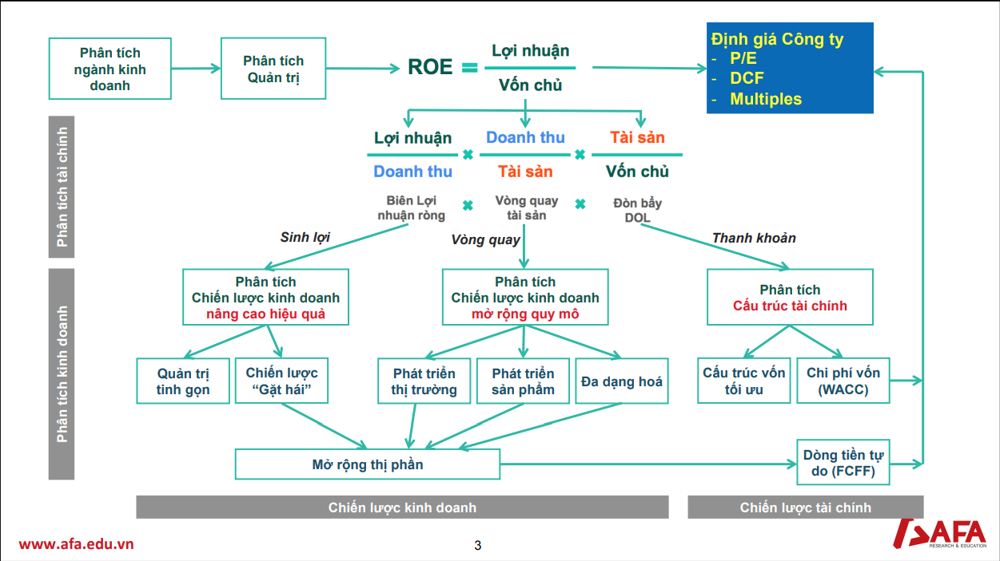
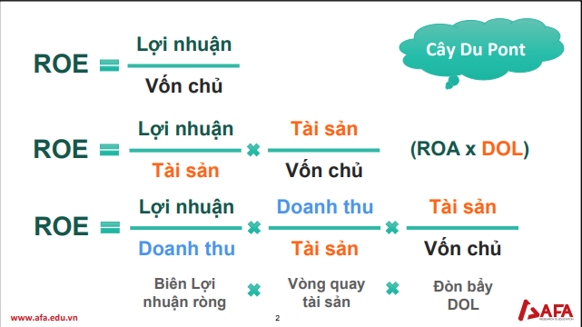

- 
- 
- [critical success factor](./critical-success-factor-alcoho-beverage-vn-trung-vo.docx)
- [quan tri quan ly](./quan-tri-quan-ly-sab-trung-vo.docx)
- [dinh gia](./HPG-dinh-gia-202206-v2.0.xlsx)
- [huong dan cgba](./Huong-dan-CGBA-Project.pdf)

# Cost of capital
- EBIT = [EBIT quy 1 2022] + [EBIT quy 2 2022] + [EBIT quy 3 2022] + [EBIT quy 4 2021]
  - EBIT = earnings before interests and tax = Loi nhuan Ke Toan Truoc
  - per discussion, it seems like we should use EBITDA instead of EBIT
  - download bctc from cafef.vn (qui 1, qui 2, qui 3 2022 and qui 4 2021)

# Questions

- **what's SAB governance?**
  - 
- **what's the quality of SAB corporate governance?**
- **what's the quality of ThaiBev corporate governance?**
- **how much Thaibev pay to acquire SAB?**
  - https://vir.com.vn/the-15-biggest-ma-deals-2009-2018-61598.html. On December 18, 2017, Vietnam Beverage (49 per cent of which is owned by ThaiBev) won an auction to acquire more than 343.66 million Sabeco shares, equivalent to 53.59 per cent of the company’s stake, at VND320,000 ($14.16) per share. This brought the deal value to nearly $5 billion
  - apparently, ThaiBev looking to spin off Beer unit finance for the SAB acquisition recently. https://www.inside.beer/news/detail/singaporethailand-thaibev-revives-plan-for-an-ipo/
  - ThaiBev said in order to implement the deal, ThaiBev and BeerCo Ltd, a 100 percent ThaiBev owned subsidiary, got six loans, totaling $5 billion
- **did Thaibev pay too much for the acquisition?**
  - current price is around VND 190,000 compared to the acquire shares (VND 320,000)
  - https://www.ft.com/content/f3436820-1288-11ea-a7e6-62bf4f9e548a, ThaiBev potentially looking to buyers for SAB (potentially bud APAC)
- **what's sabeco yearly dividend from 2017?**
- **what's the revenue break down of ThaiBev?**
  - SAB contribute to 1/4 revenue in 2018 (https://www.inside.beer/news/detail/vietnam-thailand-thaibev-s-bet-on-sabeco-is-paying-off/)
- **what's the products of ThaiBev?**
- **what's the costs of ThaiBev?**
- **what the types of SAB?**
  - is it fast growers? stalwarts? turnover?
  - looks like it somewhere between stalwarts and turn over, so the strategies for stalwarts and turn over can be employed. [SAB strategies](/one-up-on-wall-street)
  - **why ThaiBev want to spin-off beer business?**
  - https://www.inside.beer/news/detail/singaporethailand-thaibev-again-postpones-planned-spin-off-of-beer-business/
- **what's the revenue break down for SAB?**
- **what's the cost break down for SAB?**
- **what's the conflict between ThaiBev and Carlsbert?**
  - in 1995, ThaiBev launched Chang Beer and formed a 50-50 joint-venture with Carlsberg which was dissolved eight years later in 2003 after the two sides failed to resolve their disagreements.
  - (need more information on this)
- **what are the main competitors used for reference?**
  - hanoi beer alcohol, chongquing, heineken.
- **how was Sabeco managed before 2017?**
  - very bad, the number is often wrong and most of the managers has been misreprented (or sometimes wrong)
  - management has been trialed (Vo Huy Hoang, etc..., https://www.youtube.com/watch?v=e2THiGLF_FY)
- **who is Charoen Sirivadhanabakdi?**
  - https://en.wikipedia.org/wiki/Charoen_Sirivadhanabhakdi
  - Koh Poh Tiong is the first legal representative, while Neo Gim Siong Bennett is the second legal representative of the enterprise
- **how much impact decree 100 on SAB?**
- **what's other thoughts on SAB?**
  - gross profit margin in 2021 -> 30.8%
  - current ratio in 2021 -> 3.* -> inefficient in managing current assets/liabilities
- **what's the plans for earnings growth**?
  - is there any plan to increase the market shares?
  - is there any plan to improve the export?
  - what's the plan to improve on-trade, off trade?
# Quotes

# References
- https://finance.vietstock.vn/SAB-saigon-beer-alcohol-beverage-corporation.htm
- https://s.cafef.vn/hose/SAB-tong-ctcp-bia-ruou-nuoc-giai-khat-sai-gon.chn
- http://danketoan.com/threads/phan-tich-bao-cao-tai-chinh-ctcp-bia-ruou-nuoc-giai-khat-sai-gon-sab-quy-2-2020.279579/
- https://content.acbs.com.vn/Files/Domains/ACBS/WFL-1585/220307094231-1015-1015000002.pdf
- https://data.vdsc.com.vn/2022/09/vndirect-vnm-etf-co-the-loai-sab-va-thd-3358-999304.htm
- https://www.slideshare.net/guest2a6f47ef/chin-lc-bi-hon-chnh
- https://www.youtube.com/watch?v=UtOFRUxDi-g
- https://www.youtube.com/watch?v=MR8m6AV5iK
- https://www.youtube.com/watch?v=4XrWeSZO3qI
- https://www.youtube.com/watch?v=r1GeHPBqmbY