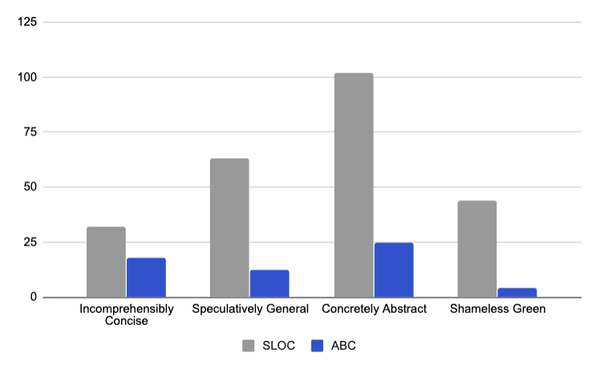
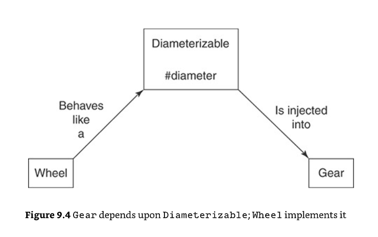
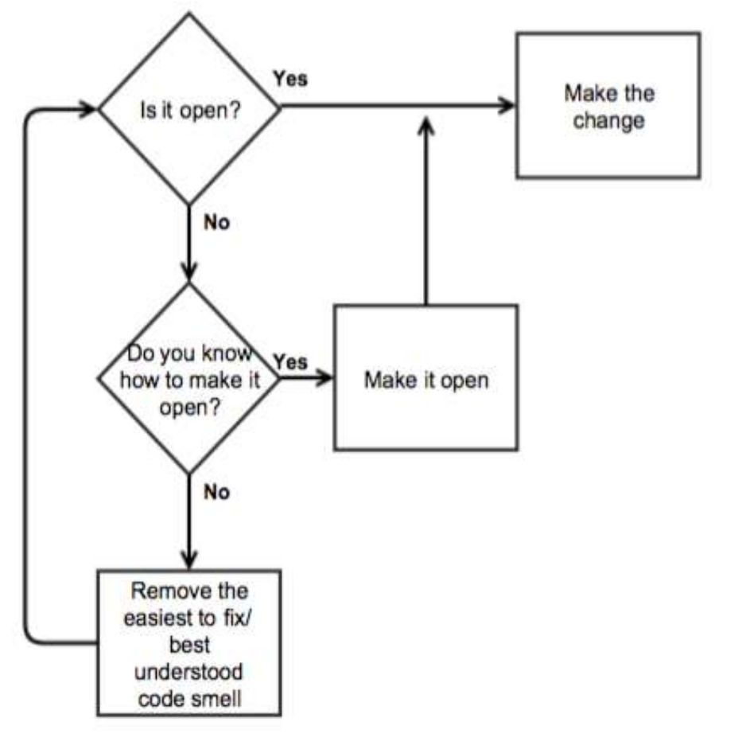
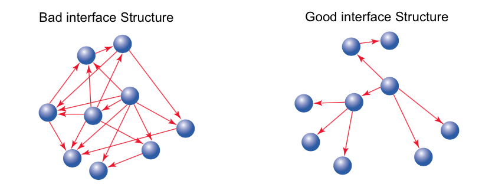
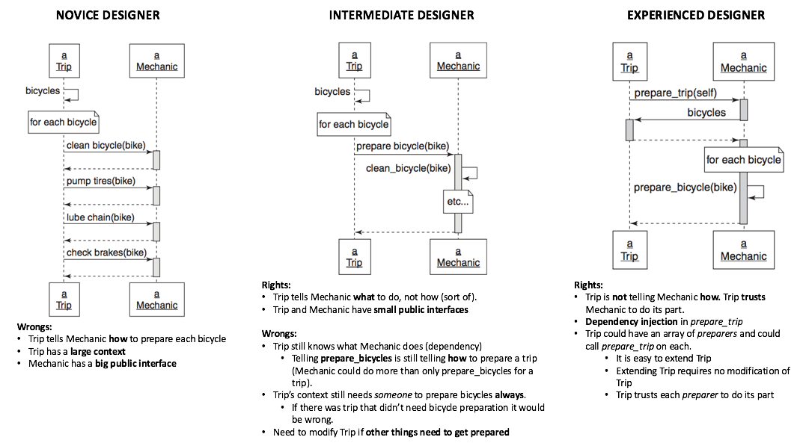
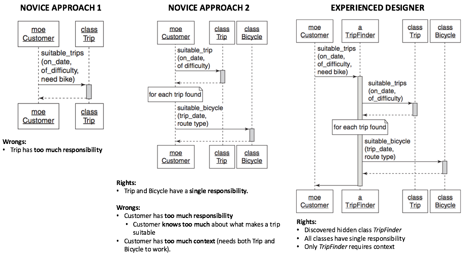
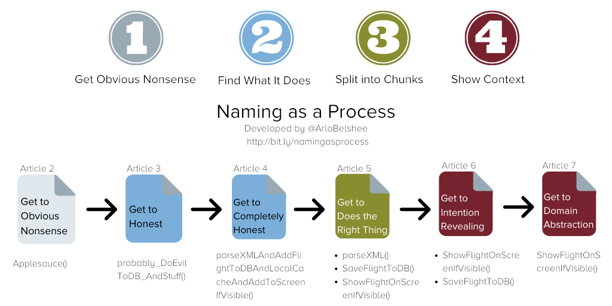
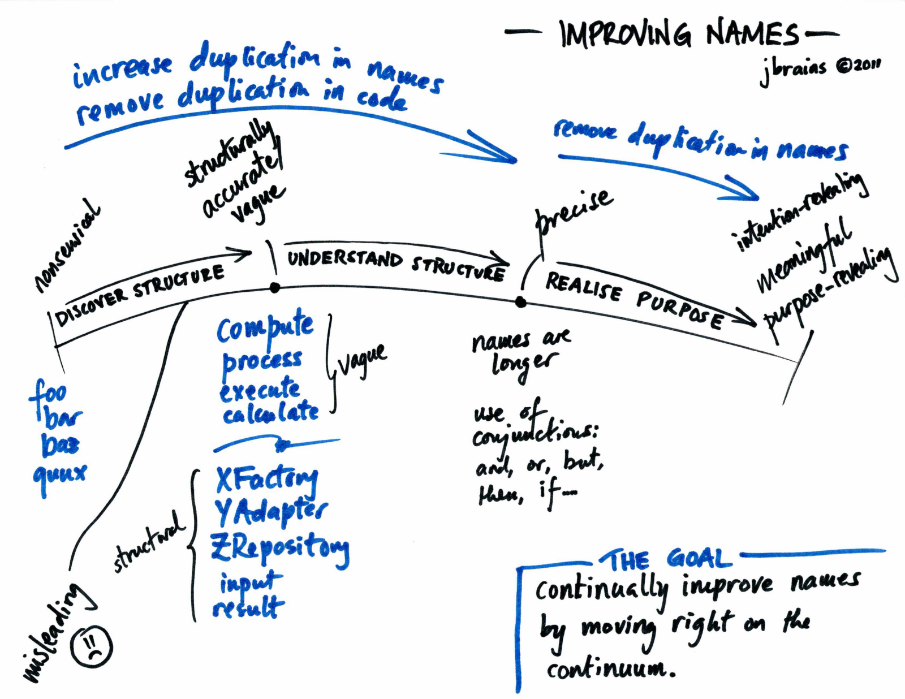

# Table of Contents
- [Table of Contents](#table-of-contents)
- [Goals/Key Ideas/Context](#goalskey-ideascontext)
- [rediscovering simplicity](#rediscovering-simplicity)
  - [simplifying code](#simplifying-code)
    - [incomprehensibly concise](#incomprehensibly-concise)
    - [speculatively general](#speculatively-general)
    - [concretely abstract](#concretely-abstract)
    - [shameless green](#shameless-green)
  - [judging the code](#judging-the-code)
    - [evaluating code based on opinion](#evaluating-code-based-on-opinion)
    - [evaluating code based on facts](#evaluating-code-based-on-facts)
  - [judging the design](#judging-the-design)
- [TDD as design](#tdd-as-design)
  - [understand transformations](#understand-transformations)
  - [tolerating duplication](#tolerating-duplication)
  - [exposing responsibilities](#exposing-responsibilities)
  - [choosing names](#choosing-names)
  - [avoiding the echo-chamber](#avoiding-the-echo-chamber)
  - [writing cost-effective tests](#writing-cost-effective-tests)
    - [intentional testing](#intentional-testing)
      - [test benefits](#test-benefits)
      - [knowing what to test](#knowing-what-to-test)
      - [knowing when to test](#knowing-when-to-test)
      - [knowing how to test](#knowing-how-to-test)
    - [testing incoming messages](#testing-incoming-messages)
      - [deleting unused interfaces](#deleting-unused-interfaces)
      - [providing the public interface](#providing-the-public-interface)
      - [isolating the object under test](#isolating-the-object-under-test)
      - [injecting dependencies using classes](#injecting-dependencies-using-classes)
      - [injecting dependencies as roles](#injecting-dependencies-as-roles)
    - [creating test double](#creating-test-double)
    - [using tests to document roles](#using-tests-to-document-roles)
    - [testing private methods](#testing-private-methods)
    - [testing outgoing messages](#testing-outgoing-messages)
    - [testing duck types](#testing-duck-types)
    - [testing inherited code](#testing-inherited-code)
- [unearthing concepts](#unearthing-concepts)
  - [listening to change](#listening-to-change)
  - [starting with the open/close principle](#starting-with-the-openclose-principle)
  - [follow the flocking rules](#follow-the-flocking-rules)
  - [converging on abstractions](#converging-on-abstractions)
  - [creating classes with single responsibility](#creating-classes-with-single-responsibility)
    - [determining if a class has a single responsibility](#determining-if-a-class-has-a-single-responsibility)
    - [writing code that embraces change](#writing-code-that-embraces-change)
    - [enforce single responsibility everywhere](#enforce-single-responsibility-everywhere)
  - [creating flexible interfaces](#creating-flexible-interfaces)
    - [find good public interface](#find-good-public-interface)
    - [create explicit interfaces](#create-explicit-interfaces)
    - [honor the public interfaces of others](#honor-the-public-interfaces-of-others)
    - [exercise caution when depending on private interfaces](#exercise-caution-when-depending-on-private-interfaces)
    - [minimize context](#minimize-context)
    - [the law of demeter](#the-law-of-demeter)
- [practising refactoring horizontally](#practising-refactoring-horizontally)
  - [replacing difference with sameness](#replacing-difference-with-sameness)
  - [Equivocating about names](#equivocating-about-names)
  - [obeying the liskov substitution principle](#obeying-the-liskov-substitution-principle)
  - [depending on abstraction](#depending-on-abstraction)
- [separating responsibilities](#separating-responsibilities)
  - [managing dependencies](#managing-dependencies)
  - [combing objects with composition](#combing-objects-with-composition)
- [Achieving openness](#achieving-openness)
  - [Sharing role behavior with modules](#sharing-role-behavior-with-modules)
  - [acquiring behavior through inheritance](#acquiring-behavior-through-inheritance)
  - [writing inheritable code](#writing-inheritable-code)
- [Quotes](#quotes)
- [References](#references)

# Goals/Key Ideas/Context
- concrete, repeatable techniques that can be employed to improve applications
  - strive for simplicity, focus on smells, concentrate on difference, take small steps, follow the flocking rules, refactoring under green, fix easy problem first
  - following the horizontal path means writing code to produce every kind of verse before diverging onto tangents to DRY out small bits of code that the verses have in common. The goal is to quickly maximize the number of whole examples before extracting abstractions from their parts.
  - in addition, deal with new requirements by first refactoring existing code to be open to them and then writing new code to meet them.
- you should not reach for abstractions, but instead you should resist them until they absolutely insist upon being created.
- writing code is the process of working your way to the next stable end point, not the end point itself
- If your goal is to write straightforward code, these metrics (ABC metrics) point you toward `Shameless Green`
# rediscovering simplicity
- getting insight into potential expense of code
  - how difficult was it to write?
  - how hard is it to understand?
  - how expensive will it be to change?

- terminology: method vs sending messages
  - a "method" is defined on an object and contains behavior
  - a "message" is sent to an object to invoke behavior
    - `song() { verses(); }` means that song method sends the verses message to the receiver this.
    - therefore, **method are defined, and messages are sent**
    - "sending messages" are preferred to "call a method/function" as it implicitly encourage to create message senders that are willfully ignorant of implementation details, and fosters independence between senders and receivers.
- **code is easy to understand when it clearly reflects the problem it's solving, and thus openly exposes that problem's domain**


## simplifying code
- speculatively general and concretely abstract were both written with an eye toward reducing future costs, and it is distressing to see good intentions fail so spectacularly. **The failure here is not bad intention - it's insufficient patience.**
### incomprehensibly concise
- [incomprehensibly concise code](https://github.com/marina-ferreira/99_bottles_of_oop/blob/main/chapter_1/01_incomprehensibly_concise.rb)
  - embeds a great deal of logic into the verse string
  - the code is hard to understand because it is inconsistent and duplicative (pluralization logic), and because it contains hidden concepts that it does not name

### speculatively general
- [speculatively general code](https://github.com/marina-ferreira/99_bottles_of_oop/blob/main/chapter_1/02_speculatively_general.rb)
  - there's far more code here  than is needed to pass the tests. This unnecessary code took time to write
  - the many levels of indirection are confusing. You could study this code for a long time without discerning why they are needed
  - you may feel compelled to understand its purpose before making changes.
  - what is the rule to determine which verse should be sung next? buried deep within the NoMore lambda is a hard-coded "99," which might cause one to infer that verse 99 follows verse 0.

### concretely abstract
- **"DRY makes sense when it reduces the cost of change more than it increases the cost of understanding the code"**
- DRYing out code is not free. It adds a level of indirection, and layers of indirection make the details of what's happening harder to understanding.
- [concretely abstract code](https://github.com/marina-ferreira/99_bottles_of_oop/blob/main/chapter_1/03_concretely_abstract.rb)
  - it clearly took a fair amount of thought and time.
  - the individual methods are easy to understand, it's tough to get a sense of the entire song. The parts doesn't seem to add up to the whole
  - while changing the code inside any individual method is cheap, in many cases, one simple change will cascade and force many other changes.
  - what is the rule to determine which verse should be sung next? Ditto.

### shameless green
- shameless green is defined as the solution that quickly reaches green while prioritizing understandability over changeability.
- it doesn't dispute that DRY is good, rather, it believes that it is cheaper to manage temporary duplication than recover from incorrect abstractions.
- [shameless green](https://github.com/marina-ferreira/99_bottles_of_oop/blob/main/chapter_1/04_shameless_green.rb)
  - it was easy to write and understand
  - it will be cheap to change. Even though the verse strings are duplicated, if one verse changes it's easy to keep the others in sync.
  - what is the rule to determine which verse should be sung next? This is still not explicit. The 0 verse contains a deeply buried, hard-coded 99
  
## judging the code
### evaluating code based on opinion
  - look for context/concrete guidance of what the code trying to accomplish
  - **any pile of code can be made to work; good code not only works, but it also simple, understandable, expressive and changeable**

### evaluating code based on facts
- you can think of metrics as crowd-sourced opinions about the quality of code.
- measuring programmer productivity by counting lines of code (SLOC))
  - easily garnered and reproduced, it reflects code volume but suffers from many flaws
- Cyclomatic complexity
  - an algorithm that counts the number of unique execution paths through a body of source code. The more deeply nested conditionals, the higher Cyclomatic complexity
  - the code with fewer nested conditionals (lower cyclomatic complexity) is easier to reason with and maintain
  - can be used to limit the overall complexity. You can set standards for how high a score you're willing to accept.
  - you can use it to determine if you'ave written enough tests, as it tells you the minimum number of tests needed to cover all the logic in the code.
- Assignments, branches and conditions (ABC) metrics
  - assignments is a count of variable assignments
  - branches counts not branches of an if statement but branches of control, meaning function calls or message sends
  - conditions counts conditional logic
  - ABC scores reflect cognitive load as opposed to physical size. High ABC numbers indicate code that takes up a lot of mental space.
- 
- metrics are fallible but human opinion is no more precise. Checking metrics regularly will keep you humble and improve your code.
## judging the design
- **Don't do** big upfront design (BUFD)
  - designs in BUFD cannot possibly be correct as many things will change during the act of programming
  - BUFD inevitable leads to an adversarial relationship between customers and programmers.
- make design decisions only when you must with the information you have at that time
  - postpone decisions until you are absolutely forced to make them
  - any decision you make in advance on an explicit requirement is just a guess. Preserve your ability to make a decision later
- metrics are not direct indicators of quality but are proxies for a deeper measurement.
- The ultimate software metric would be cost per feature over time interval that matters, but this is not easy to calculate. Cost, feature, and time are individually difficult to define, track and measure.
- your goal is to write software with the lowest cost per feature.
- you decision about how much design to do depends on 2 things: your skills and your time frame.
  - there is a tradeoff between the amount of time spent designing and the amount of time this design saves in the future (and there is a break-even point).
  - when the act of design prevents software from being delivered on time, you have lost.
# TDD as design
- while it is important to consider the problem and sketch out an overall plan before writing the first test, don't over think it
- you can't figure out what's right until you write some tests. The purpose of some of your tests might very well be to prove that they represent bad ideas.
- the code should have the following qualities
  - transparent
    - the consequences of change should be obvious in the code that is changing and in distant code that relies upon it
  - reasonable
    - small changes in requirements require correspondingly small changes in code
    - changes has no unexpected side effects
  - usable
    - existing code should be usable in new and unexpected contexts
  - exemplary
    - the code itself should encourage those who change it to perpetuate these qualities


## understand transformations
- [transformation priority premise](https://blog.cleancoder.com/uncle-bob/2013/05/27/TheTransformationPriorityPremise.html)
- **if you choose the tests and implementations that employ transformations that are higher on the list, you will avoid the impasse**
- the code go through a sequence of transformation from **specific to generic**
- the process
  - when passing a test, prefer higher priority transformations
  - when posing a test choose one that can be passed with higher priority transformations
  - when an implementation seems to require a low priority transformation, backtrack to see if there is a simpler test to pass

- `{} -> nil` no code at all -> code that employs nil
  - as we write the first test `wrapNullEmptyString()`, we also write the failing implementation which also employs `({} -> nil)`
- `nil->constant`
  - we can make the first test pass by return empty string, which apply `nil->constant` transformation
- `(constant->constant+)`: a simple constant to a more complex constant
  - we can then write the next test that employs `(constant->constant+)`
  - `oneShortWordDoesNotWrap() { assertThat(wrap("word", 5), is("word")) }`
- `(unconditional->if)`
- `(constant->scalar)`
  - variable is a generalization of constants
  - making the `oneShortWordDoesNotWrap` test pass by using both `(unconditional->if)` and `(constant->scalar)`
```java
public static String wrap(String s, int length) {
  if (s == null)
    return "";
  return s;
}
```
- `statement->statements`
- `(scalar->array)`
- `(array->container)`
- `(statement->recursion)`
- `(if->while)`
from
```java
if (s.length() > length) {
  result = s.substring(0, length) + "\n";
  s = s.substring(length);
}
result += s;
```

to
```java
while(s.length()>length) {
  result += s.substring(0, length) + "\n";
  s = s.substring(length);
}
result += s;
```
- `(expression->function)` replacing an expression with a function or algorithm
- `(variable->assignment)`

## tolerating duplication
- **as tests get more specific, code should become more generic**. Code become more generic by becoming more abstract. One way to make code more abstract is to DRY it out.
- DRY is important but if applied too early, and with too much vigour, it can do more harm than good. It's a good idea to ask the following questions when doing so:
  - Does the change I'm contemplating make the code harder to understand? Be suspicious of any change that muddles the waters?
  - **what is the future cost of doing nothing now?**
    - some changes cost the same regardless of whether you make them now or delay them until later.
    - **if it doesn't increase your costs, delay making changes**
  - when will the future arrive, or how soon will I get more information?
    - it's better to tolerate duplication than to anticipate the wrong abstraction
- writing shameless green means optimising for understandability, not changeability, and patiently tolerating duplication if doing so will help reveal the underlying abstraction.

## exposing responsibilities
- **duplication is useful when it supplies independent, specific examples of a general concept that you don't yet understand.**
- the goal is to use green to maximize your understanding of the problem and to unearth all available information before committing to abstractions.
- when the new code muddles rather than clarifies the waters, and it's important to understand why.
- Green Bar patterns:
  - fake it ("Till you make it")
    - developing habits of writing just enough code to pass the tests forces you to write better tests.
    - it also provides an antidote for the hubris of thinking you know what's right when you're actually wrong.
  - obvious implementation
    - it's best to save obvious implementation for very small leaps.
  - triangulate
    - requires writing several tests at once, which means you'll have multiple simultaneous broken tests
    - the idea is to write one bit of code which makes all of the tests pass.
    - triangulation is meant to force you to converge upon the correct abstraction in your code.
- the small steps of TDD act to incrementally review the correct implementation, **skipping these incremental steps means you miss the opportunity of being set right**.

## choosing names


```ruby
def song
  verses(0, 99)
end
```
- is song method needed?
  - answering this question requires thinking about the problem from the message sender point of view.
  - knowledge that one object has about another creates a dependency. Dependencies tie objects together, exacerbating the ost of change.
  - using verses method to request the entire song, however, requires significantly more knowledge. the sender must know
    - the name of hte verses method
    - that the method requires 2 arguments
    - that the first argument is the verse on which to start
    - that the second argument is the verse on which to end
    - that the song starts on verse 99
    - that the song ends on verse 0
    - there are many ways in which the verses method could change that would break senders of this message.
  - reveal the intention
    - the distinction between intention and implementation ... allows you to understand a computation first in essence and later, if necessary, in detail.
    - song is the intention, `verses(99,0)` is the implementation.
## avoiding the echo-chamber
- programmers who are hyper-alert to duplication, might be tempted to test `song` like this

```ruby
def test_the_whole_song
  bottles = Bottles.new
  assert_equal bottles.verses(99, 0), bottles.song
end
```
- this test has a major flaw that can cause it toggle from "short and sweet" to "painful and costly" in the blink of an eye. This flaw lies dormant until something changes, so the benefits of writing tests like this accrue to the writer today, while the costs are paid by the unfortunate maintainer in the future.
  - the test is coupled to the implementation details of song such that it will break if the signature or behavior of verses changes, even if song continues to return the correct lyrics
- if you change an implementation detail while retaining existing behaviour and are then confronted with a sea of unrelated red tests, you're right to be exasperated. **This is completely avoidable, and a sign that tests are too tightly coupled to code. Such tests impede change and increase costs**
- the `song` test should know nothing about how the `Bottles` class produces the song. The clear and unambiguous expectation here is that the song return the complete set of lyrics, and the best way and easiest way to do that is to assert that it does:
```ruby
def test_the_whole_song
  expected = <<-SONG
ALL
# ...
THE
# ...
LYRICS
  SONG
  bottles = Bottles.new
  assert_equal expected, bottles.song
end
```
- if you find the duplication distressing, consider the alternatives. Your choices are:
  - assert that the expected output matches that of some other method.
    - tests are coupled to the implementation, so these dependencies mean changes to the system under test might break the tests.
  - assert that the expected output matches a dynamically generated string.
    - reducing string duplication inside the test would require logic. Regardless of how you do it, any logic here would bind the tests to implementation details and any change to the system under test might break the test.
  - assert that the expected output matches a hard-coded string.
    - not only is the expected output clearly and unambiguously stated, but the test has no dependencies.

## writing cost-effective tests

### intentional testing
#### test benefits
- finding bugs
- supplying documentation
  - write tests that remind you the story you once have
- deferring design decisions
  - intentionally depending on interfaces allows you to use tests to put off design decision safely and without penalty
- supporting abstractions
  - tests are your record of the interface of every abstraction. They let you put off design decisions and create abstractions to any useful depth.
- exposing design flaws
  - if a test requires painful setup, the code expects too much context.
  - if the test is hard to write, other objects will find the code difficult to reuse.
- good tests not only tell a story, but they lead, step by step, to a well-organised solution.
- **test are not a place for abstractions, they are the place for concretions. Abstractions belong to the code**.

#### knowing what to test
- dealing with objects as if they are only and exactly the messages to which they respond lets you design a changeable application, and it is your understanding of the importance of this perspective that allows you to create tests that provide maximum benefit at minimum cost.
- tests should concentrate on the incoming or outgoing messages that cross an object's boundaries. The incoming messages make up the public interface of hte receiving object. The outgoing messages, by definition, are incoming into other objects and so ar part of some other object's interface.
- the general rule is that objects should make assertions about state only for messages in their own public interfaces.
- some outgoing messages have no side effects and thus matter only to their senders.
  - outgoing messages like this are known as queries and they need not be tested by the sending object.
  - query messages are part of the public interface of their receiver, which already implements every necessary test of state.
- many outgoing messages do have side effects (a file gets written, a database record is saved, an action is taken by an observer) upon which your application depends.
  - proving that a message gets sent is a test of behavior, not state, and involves assertions about the number of times, and with what arguments, the message is sent.
- incoming messages should be tested for the state they return. 

#### knowing when to test
- you should write tests first, whenever it makes sense to do so

#### knowing how to test
- if you understand the costs and benefits, feel free to choose any framework that suits you.
- BDD takes an outside-in approach, creating objects at the boundary of an application and working its way inward, mocking as necessary to supply as-yet-unwritten objects.
- TDD takes an inside-out approach, usually staring with tests of domain objects and then reusing these newly created domain objects in the tests of adjacent layers of code.
- when you tests know more about the internal inside of the object under test, it allows knowledge that should be private eto the object leak into the tests, increasing coupling between them and raising the likelihood that changes the code will require changes in tests.

### testing incoming messages
- incoming messages make up an object's public interface, the face it presents to the world. these messages need tests because other application objects depend on their signatures and on the results they return.

#### deleting unused interfaces
- incoming messages ought to have dependents. Some object other than the original implementer depends on each of these messages.
- do not test an incoming messages that has no dependents; delete it.
- unused code costs more to keep than to recover.

#### providing the public interface
- if Wheels are expensive to create, the Gear test pays that cost even though it has no interests in Wheel.
- an application constructed of tightly coupled, dependent laden objects is like a tapestry where pulling on one thread drags the entire rug along.
  - running Gear test would then create a large network of objects, any of which might break in a maddeningly confusing way.
- tests are the first reuse of code.

#### isolating the object under test
- when you can't test object in isolation, it bodes ill for the future.
- the diameter method is part of hte public interface of a role, one that might reasonably be named diameterizable.
- thinking of the injected object as a instance of its role gives you more choices about what kind of Diameterizable to inject into Gear during your tests.

#### injecting dependencies using classes
- when the code in your test uses the same collaborating objects as the code in your application, your tests always break when they should.

#### injecting dependencies as roles
- 
- the whole point of dependency injection is that it allows you to substitute different concrete classes without changing existing code.
- Object-oriented design tells you to inject dependencies because it believes that specific concrete classes will vary more than these roles, or conversely, roles will be more stable than the classes from which they were abstracted.
- if your application contains many different diameterizables, you might want to create an idealized one so your tests clearly convey the idea of this role.
  - if all diameterizables are expensive, you may want to fake a cheap one to make your tests run faster.
  - if you are doing BDD, your application might not yet contain any object that plays this role; you may be forced to manufacture something just to write the test.

### creating test double
- [more on test doubles](../growing-object-orented-guided-by-tests-summary/index.md#mock-roles-not-objects)
- when diameterizable's interface changes from diameter to width, and `Wheel` get updated but `Gear` does not
  - since the dimeterizabledouble is injected, the test continues to pass even though the application is definitely broken
  - this is where the stubbing and mocking could make the tests brittle.
  - "when interface of a role changes, all players of the role must adopt the new interface", dynamic language like ruby doesn't complain about the incompatible implementation with the interface.

### using tests to document roles
- injecting the same objects at test time as are used at runtime ensures that tests break correctly but may lead to long running tests.
- injecting doubles can speed tests but leaves them vulnerable to constructing a fantasy world where tests work but the application fails

### testing private methods
- if you can't get/access the structure you need, then the tests tell you that it's time to break up the class into more minor/composable features.
  - the extracted methods form the core of responsibilities of the new object and so make up its public interface, which is (theoretically) stable and thus safe to depend upon.
- tests of private methods are therefore coupled to application code that is likely to change.
- since tests provide documentation about the object under test, it could mislead others into using them.
- never write private methods, and if you do, never ever test them, unless of course it makes sense to do so

### testing outgoing messages
- outgoing messages are either queries or commands. Query messages matter only to the object that sends them, while command messages have effects that are visible to other objects in your application.
- ignoring query messages
  - it's redundant for Gear to duplicate correctness tests from Wheel, maintainance costs will increase if it does.
- proving command messages
  - sometimes, it does matter that the message get sent and the object under test is responsible for sending the message
  - your tests must prove that the command messages got sent
- if you have proactively injected dependencies, you can easily substitute mocks. Setting expectations on these mocks allows you to prove that the object under test fulfills its responsibilities without duplicating assertions that belong else where
### testing duck types
- Using role tests to validate doubles
  - use dynamic module interface test to ensure the test double honor the interface
```ruby
module DiameterizableInterfaeTest
  def test_implements_the_diameterizable_interface
    assert_respond_to(@wheel, :diameter)
...
class DiameterDoubleTest < MiniTest::Unit::TestCase
  include DiameterizableInterfaceTest
```
- From the point of view of the object under test, every other object is a role, and dealing with objects as if they representative of the roles they play loosens coupling and increases flexibility, both in your application and in your tests.
- If you fear that human communication will be insufficient to keep all players of a role in sync, write the tests.

### testing inherited code
- prove that all objects in this hierarchy honor their contract
  - subtypes should be substitutable for their subtypes
  - write a shared test for the common contract and include this test in every object.
- confirming subclass behavior
- confirming superclass enforcement
  - `bicycle` class should raise an error if a subclass does not implement `default_tire_size`. Even though this requirement applies to subclasses, the actual enforcement behavior is in Bicycle.

```ruby
def test_forces_subclasses_to_implement_default_tire_size
  assert_raises(NotImplementedError) { @bike.default_tire_size }
```
- testing concrete subclass behavior
  - it's important to test these specializations without embedding knowledge of the superclass into the test.
    - the `RoadBikeTest` should ensure that `local_spares` works while maintaining deliberate ignorance about the existance of `spares` method

- testing abstract super class behavior
  - you can stub the behavior that would normally be supplied by subclasses (follow liskov substitution principle)
  - be especially careful when testing subclass specializations to prevent knowledge of the superclass from leaking down into the subclass's test


# unearthing concepts
## listening to change
- if the problem is solved, and you choose to refactor now rather than later, you pay the opportunity cost of not being able to work on other problems
  - **spending time "improving" code based purely on aesthetics may not be the best use of your precious time.**
- the need for change imposes higher standards on the affected code. **Code that never changes obviously doesn't need to be changable, but once a new requirement arrives, the bar is raised**.

## starting with the open/close principle
- **code is open to a new requirement when you can meet the new requirement without changing the existing code.**
- **when faced with a new requirement, first rearrange the existing code such that it's open to the new feature, and once that's complete, then add the new code**
- 
- the trick to successfully improving code that contains many flaws is to isolate and correct them one at a time
- if you are unclear about how to make it open, the way forward is to start removing code smells
- you should never change tests during a refactoring, if your tests are flawed such that they interfere with refactoring, improve them first, and then refactor
## follow the flocking rules
- rules
  - select the things that are most alike
  - find the smallest difference between them
  - make the simplest change that will remove that difference.
- as you follow the flocking rules
  - change only 1 line at a time
  - run the tests after every change
  - if the tests fail, undo and make a better change.
- changes to code can be subdivided into 4 distinct steps
  - parse the new code: confirm the syntax is valid
  - parse/execute step: proving that code runs without blowing up
  - parse/execute and use its result: ensure that it returns the correct result
  - delete unused code
- why `Flocking`?
  - the group's behavior is the result of a continuous series of small decisions being made by each participating individual. These decisions are guided by three simple rules
    - alignment - steer towards the average heading of neighbors
    - separation - don't get too close to a neighbor
    - cohesion - steer towards the average position of the flock.
  - the "flocking rules" for code allow abstractions to appear.
- making existing code open to a new requirement often requires identifying and naming abstractions. The flocking rules concentrate on turning difference into sameness, and thus are useful tools for unearthing abstractions.

## converging on abstractions
- focusing on difference
  - DRYing out sameness has some value, but DRYing out difference has more.
  - encapsulating the concept that varies, a theme of many design patterns.
  - difference holds the key to understanding. If 2 concrete examples represent the same abstraction and they contain a difference, that difference must represent a smaller abstraction with a larger one. if you can name the difference, you've identified that smaller abstraction.
- simplifying a hard problem
  - many programmers gravitate towards starting a problem at its most confusing part.
  - solving easy problems, through a magical alchemy of code, sometimes transmutes hard problems into easy ones. It is common to find that hard problems are hard only because the easy ones have not yet been solved.
- naming concepts
  - general rule and new requirement can help in the struggle for a name.
  - the name you choose will be the name you use in conversations with your customers. Naming things after domain concepts improves communication between you and the folks who pay the bills. Only good can come of this.
  - notice the following difference
```ruby
`${number -1} bottle of bear on the wall.\n`
`${number -1} bottles of beer on the wall.\n`
```
    - what the words "bottle" and "bottles" represent in the context of the song?
      - within the context of song, "bottle/bottles" does not represent pluralization.
      - the new requirement involve with the need to say "six pack" instead of "bottle/bottles". The string "six pack" is one more concrete example of the underlying abstraction.
      - the general rule is that the name of a thing should be one level of abstraction higher than the thing itself. The strings "bottle/bottles/six-pack" are instances of some category, and the task is to name that category using language of the domain
      - one way to identify category is to imagine the concrete examples as rows and columns in a spreadsheet
      - the header "number" is a level of abstract higher than the concrete examples. "1", "6", and "n" are numbers
      - container is meaningful, understandable and unambiguous.
| Number      | xxx? |
| ------------ | -------------- |
| 1      | bottle       |
| 6   | six-pack       |
| n   | bottles       |
- [follow the flock rule](#follow-the-flocking-rules) example
  - add new container method with 1 line return `bottles`
  - replace the first client code to use `container()` method instead of `bottles`
  - add parameter argument `number`
  - expand the code in `container` to use `number` to decide which of `bottle` or `bottles` to return
    - could be expressed in ternary form as `number === 1? "bottle": "bottles" `
  - change other references to use `container` method


## creating classes with single responsibility
- a class **must have data and behavior (methods)**. If one of these is missing, the code doesn't belong to a class.

### determining if a class has a single responsibility
- rephrase every one of its methods as a question, asking the question ought to make sense.
  - "Please Mr. Gear, what is your ratio?" - makes sense
  - 'Please Mr. Gear, what is your tire size?" - Doesn't make sense = does not belong here
- describe the class in 1 sentence.
  - class should do the smallest possible useful thing
  - when the description contains the words "and" or "or", it means that the class has more than one responsibility
    - Gear's responsibility: "calculate the effect that a gear has on a bicycle"

### writing code that embraces change
- **depend on behavior (methods), not data**
  - never call @variables inside methods, use wrapper methods instead
    - [wrong code example](https://github.com/serodriguez68/poodr-notes/blob/master/code_examples/chapter_2.rb#L61-**L71**)
    - [right code example](https://github.com/serodriguez68/poodr-notes/blob/master/code_examples/chapter_2.rb#L73-L102)
  - data very often has behavior that you don't yet know about.
- **hide data structures**
  - if the class uses complex data structures, write wrapper methods that decipher the structure and depend on those methods
    - [wrong code example](https://github.com/serodriguez68/poodr-notes/blob/master/code_examples/chapter_2.rb#L105-L117)
    - [right code example](https://github.com/serodriguez68/poodr-notes/blob/master/code_examples/chapter_2.rb#L124-L141)
  - it trades indexing into a structure for sending messages to an object. The `wheelify` method above isolates the messy structural information and DRYs out the code

### enforce single responsibility everywhere
- extract extra responsibilities from methods
  - methods with single responsibility have these benefits
    - clarify what hte class does
    - avoid the need for comments
    - encourage reuse
    - easy to move to another class
  - ask questions about what they do and try to describe their responsibilities in a single sentence.
  - separating iteration from the action that's being performed on each element (common case of single responsibility in methods)
  - don't decide; preserve your ability to make a decision later.
  - concentrate on the primary class. Decide on its responsibilities and enforce your decision fiercely. If you identify extra responsibilities that you cannot yet remove, isolate them. Do not allow extraneous responsibilities to leak into your class
    - [example using struct](https://github.com/serodriguez68/poodr-notes/blob/master/code_examples/chapter_2.rb#L176-L197)

## creating flexible interfaces
- 
- good public interface structure
  - objects reveals as little of themselves as possible
  - objects know as little of their neighbors as possible
  - Result: plugable, component-like objects
  - reveals the class's primary responsibility
    - the public interface should correspond to the class's responsibility. A single responsibility may require multiple public methods. However, too many loosely related public methods can be a sign of single responsibility violation
  - are expected to be invoked by others
  - will not change on a whim
  - are safe for other to depend on, since it is less changable
  - are thoroughly documented in tests

### find good public interface
- **focus on messages, not domain objects (classes)**
- you don't send messages because you have objects, you have objects because you send message.
  - design experts notice domain objects without concentrating on them; they focus not on these objects but on the messages that pass between them. These messages are guides that lead you to discover other objects, ones that are just as necessary but far less obvious.
- **Step 1: Using sequence diagram**
  - lightweight way of acquiring a design intention about an interaction. It provides a simple way to experiment with different object arrangements and message passing schemes between objects. It brings clarity to your thoughts and provide a vehicle to collaborate and communicate with others.
  - **should this receiver be responsible for responding to this message**
  - **I need to send this message, who should respond to it.**
- **Step 2: asking for "what" instead of telling "how"**
  - 

- **Step 3: seeking for context independence**
  - use [dependency injection](./../growing-object-orented-guided-by-tests-summary/index.md#dependency-injection) to seek context independent

- **Step 4: trusting other objects**
  - I know what I want, I trust you to do your part

- **use messages to discover objects**
  - 
  - it's completely reasonable that `Customer` would send `suitable_trips` message. It is exactly what `Customer` wants. The problem is not with the sender, it is with the receiver. You have not yet identified an object whose responsibility it is to implement this method
  - sequence diagram keep the focus on messages and allow you to form a rational intention about the first thing to assert in a test. Switching your attention from objects to messages allows you to concentrate on designing an application built upon public interfaces

### create explicit interfaces
- method in the public interface should
  - be explicitly identified as such
  - be more about what than how
  - have names that, so far as you can anticipate, will not change.
  - take a hash as an options parameter.
- create test for public interfaces.
  - do not test private methods. If you must, segregate those test from the ones of the public methods

### honor the public interfaces of others
  - if your design forces the use of a private method in another class, re-think your design
  - a dependency on a private method of an external framework is a form of technical debt

### exercise caution when depending on private interfaces
- if you must depend on private interface, use [isolate the dependency](../manage-dependencies/index.md#isolate-the-dependency)
  - this prevent calls from multiple places

### minimize context
- create public methods that allow senders to get what they want without knowing how your class does it
- if you fae a class with an ill-defined public interface you have these options
  - define a new well-defined method for that class' public interface.
  - create a wrapper class with a well defined public interface
  - create a single wrapping method and put it in your own class

### [the law of demeter](../growing-object-orented-guided-by-tests-summary/index.md#tell-dont-ask---law-of-demeter)
- this is covered as a [tell don't ask]((../growing-object-orented-guided-by-tests-summary/index.md#tell-dont-ask---law-of-demeter)) from growing object oriented objects guided by tests

# practising refactoring horizontally
- if you simultaneously change many things and something breaks, you're forced to understand everything in order to fix anything.
- making a slew of simultaneous changes is not refactoring - it's rehacktoring.
- gradual cutover refactoring
  - a strategy for keeping the code in a releasable state by gradually switching over a small number of pieces at a time. This type of refactoring can be done alongside other development work without affecting the release schedule.
  - let red be your guide. If you take a giant step and the tests begin to fail, undo and fall back to making smaller changes.
- real refactoring is comfortingly predictable, and saves brainpower for more thought provoking challenges.
- if the non-default branch is implemented first, the default has to be set to something that actually meets the condition and so makes the `true` branch execute.
  -  Therefore, implementing the non-default branch first places a slightly greater burden on you.
-  seeking stable landing points
   -  code is read many more times than it is written, so anything that increases understandability lowers costs. Next, and just as important, consistent code enables future refactorings.
-  taking bigger steps
   -  if you take bigger steps and the tests begin to fail, there's something about the problem that you don't understand, if this happens, don't push forward and refactor under red. Undo, return to green, and make incremental changes until you regain clarity
-  discovering deeper abstractions
   -  `successor` is important, and separating it from `quantity` gives both methods a single responsibility if you conflate `choosing-what-to-sing-for-any-number(quantity)` with deciding-what-verse-to-sing-next(successor), the resulting method would be harder to understand, future refactorings would be more difficult, and attempts to change the code for 1 idea might accidentally break it for other.

## replacing difference with sameness
- [follow the flocking rules](#follow-the-flocking-rules)

## Equivocating about names
- the challenge is identifying the current concept and coming up with a good name.
  - It must represent a smaller abstraction within that larger one.
  - names should neither be too general nor too specific. For example, thing is too broad, and ItOrOne too narrow.
- when perfect name for a concept is elusive, there are couple strategies moving forward
  - time box 5 - 10 minutes to ponder, and then use the best name that you can come up with (usually with thesaurus in hand)
  - instantly choose a meaningless name like `foo`. Like there is no point wasting time thinking about it now, the name will be obvious later
  - you can ask someone else, like fellow programmers or customers for help.
  - Arlo's naming process
    - 
  - [J.B. Rainsberger's model for improving name](https://blog.thecodewhisperer.com/permalink/a-model-for-improving-names)
    - 
  - deriving names from responsibilities
    - focus on the difference and find abstraction one level higher
    - when creating an abstraction, first describe its responsibility as you understand it at the moment, then choose a name which reflects the responsibility. The effort you put into selecting good names right now pays off by making it easier to recognize perfect names later.

## obeying the liskov substitution principle
- every piece of knowledge is a dependency, and the way that `quantity` is written requires verse to know too many things. If `quantity` were more trustworthy, `verse` could know less
- the idea of reducing the number of dependencies imposed upon message senders by requiring the receivers return trustworthy objects is a generalization of the Liskov Substitution Principle.
- liskov, in plain terms, requires that objects be what they promise they are. When using inheritance, you must be able to freely substitute an instance of a subclass for an instance of its superclass. Subclasses, by definitions, are all their superclasses, plus more, so this substitution should always work.
- liskov violations force message senders to have knowledge of the various return types, and to either treat them differently or convert them into something consistent.

## depending on abstraction
-  abstraction provide name for the consolidated code, allowing the name to be as a shortcut for an idea, independent of its current implementation
- the abstractions tell you where your code relies upon an idea. But to get this benefit, you must refer to an abstraction in every place where it applies.

# separating responsibilities
## [managing dependencies](/manage-dependencies)
- this topic is covered as separate [summary blog](/manage-dependencies)

## combing objects with composition

# Achieving openness
## Sharing role behavior with modules

## acquiring behavior through inheritance
## writing inheritable code

# Quotes

"Writing code is the process of working your way to the next stable end point, not the end point itself"

**"DRY makes sense when it reduces the cost of change more than it increases the cost of understanding the code"**

"metrics are fallible but human opinion is no more precise. Checking metrics regularly will keep you humble and improve your code"

"shameless green is defined as the solution that quickly reaches green while prioritizing understandability over changeability."

"it doesn't dispute that DRY is good, rather, it believes that it is cheaper to manage temporary duplication than recover from incorrect abstractions."

"Quick green excuses all sins"

"good design preserves maximum flexibility at minimum cost by putting off decisions at every opportunity, deferring commitments until more specific requirements arrive."

"think of an object oriented application as a series of messages between a set of black boxes"

"the reason you're writing tests is to save money, and every potential test must be evaluated against that criteria"

"when your intention is to defer a design decision, do the simplest thing that solves today's problem. Isolate the code behind the best interface you can conceive and hunker down and wait for more information"

"the rules of thumb for testing private methods are: never write them, and if you do, never ever test them, unless of course it makes sense to do so."

"making existing code open to a new requirement often requires identifying and naming abstractions. The flocking rules concentrate on turning difference into sameness, and thus are useful tools for unearthing abstractions."

"the best tests are loosely coupled to the underlying code and test everything once and in the proper place. They add value without increasing costs"

"only talk to your immediate neighbors"

# References
https://github.com/keyvanakbary/learning-notes/blob/master/books/99-bottles-of-oop.md
https://github.com/serodriguez68/poodr-notes
https://matteopallini.com/bottles-oop-summary/
https://blog.cleancoder.com/uncle-bob/2013/05/27/TheTransformationPriorityPremise.html
https://lionadi.wordpress.com/2020/12/04/oop-tdd-99-bottles-notes-part-1-simplicity/
https://gist.github.com/speric/31ae0987d21eac1d4f87