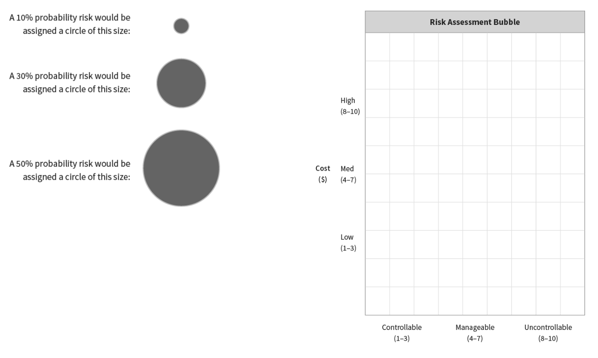

# key take-aways

- Act boldly when you see a difference between value and price.
When your stock is low, buy it back. When it is high, use it raise debt or buy other companies.
- The best defense against revenue lumpiness is a constant vigilance on costs.
- “When you see something that you like, make a very large bet.” 

# THE DREADED DUMB TAX
- It turns out that the key to getting rich (and staying that way) is to avoid doing stupid things. I don't need to do more smart things. I just need to do fewer dumb things. I need to avoid making emotional decisions and swinging at bad pitches. I need to think!
- All my problems started out as a good idea, and all those "good" ideas were emotionally justifiable at the time. Not only that, my current financial condition represents my very best "thinking." Yours does, too.
- What sabotages our dreams and causes most of our problems (and ensuing dumb tax) is our excessive optimism and emotional belief in magic pills, secret formulas, and financial tooth fairies. (All balloons look good when they are filled with hot air.) Dumb!
- Emotions and intellect work inversely. When emotions go up, intellect goes down. Optimism is a deadly emotion in the business world. Warren Buffett said it best: "Optimism is the enemy of the rational investor."
- There are no secrets . . . just stuff you haven't learned yet.
- A business owner must knows that building a business is 80% an intellectual sport. Just like the great book by Napoleon hill says; Think and Grow Rich. Thinking is very essential to business growth. He who thinks deeper and wider wins the game. I dare say that Critical thinking is the name of the game. So where I am today is a product of my thinking or better still I am a product of how critical I think and analyze situations to make a decision. So every decision I make must take into consideration 2nd, 3rd and 4th order consequences when taking business decisions.
- John Maynard Keyes astutely said, “Most people, when confronted with a choice of changing their thoughts or proving there is no need to change, get busy on the proof.” I am so guilty of this. Whenever I have a knack or feeling that an idea would work, I would rather go ahead and find proof that it would work instead of looking at all the sides critically.
- “More often than not, critically thinking about what could go wrong and doing the work to mitigate those risks before taking action is abandoned in favor of comfort zones, the path of least resistance, and speed (instant gratification).

# THE DISCIPLINE OF THINKING TIME
- **There's no such thing as natural business owner**
  - Hard work trumps natural talent: Like the world renowned scientist, Albert Einstein said that being a genius is 99% hard work and 1% inspiration. You need to put in the necessary hard work before you get any result at all. Just like Keith put it so beautifully; Great business owners work hard, practice, study, test, think, correct and practice some more. There is no short cut. Period!! You must be committed to excellence and seek ways to do things better.
- **attempting to win the game of business by trial and error is about the stupidest way to learn anything**
  - Never wing it: Most of us try to do this and hope that it will click, stick or have result. The issue with this is that it hardly succeeds and if it does you cannot repeat the process because you don’t have successive steps to show for it. So it’s not duplicable. Why would you do things by trial and error that would, in most times cost, you more in the long run, as opposed to take the necessary time to put into quality thinking to make better nosiness decisions.

- **running the wrong direction enthusiastically is stupid**
  - it does no good to practice the wrong thing. To excel you must get a coach or advisor that will watch very move you are making and then give advice on the right direction to take, because running in the wrong direction enthusiastically is just plain stupid. Please note that this coach or advisor must have succeeded in his own endeavor. In other words, been there done that.

- **If you want to do better, you must get better:**
  - people do not do better because *they want to do better*; they do better because they *get better*. You cannot achieve a new outcome without learning something new and practicing what you learned (probably outside your comfort zone). A commitment to mastery (improving) is essential for excellence.

- **the people with the best life have the best choices** people with a lousy life have lousy choices. If I want to improve my life, I need to create better choices.

- you will pay dumb tax if you ignore these principles or you will pay to fix the problem. Either way, you are writing a check.

- *the road less stupid* is designed to accomplish 2 primary objectives
  - provide a structure/process/skill set to enable you to create successful Thinking Time ritual that, if applied, will result in a significantly reduced dumb tax. 
  - suggest a series of possible Thinking Time topics and questions you can use to spark your thinking, grow your business, make more money and ultimately avoid doing something stupid.

# THE 5 CORE DISCIPLINES OF THINKING

- **Find the Unasked Question**-Create a question that will result in clarity and generate better choices. 
  - Another thing to note in the way the question is framed. It must be framed in such a way that engenders possible solutions or available improvements to the solution. Otherwise it’s a mere predicament or a statement. So if you must craft a problem, use this “How might I…so that I can…? This rule or guide line provides insight on how to remedy the situation.
  - you think of what needs to be broken versus what needs to be fixed.
  - Three characteristics that a carefully crafted question does are as follows:
    - Provides insight on what the actual problem is
    - Simplify the problem and make it solvable
    - Expand the number of possibilities available to solve the problem at hand.

  - Having the right answer is smart. Having the right question is genius. Or, as Peter Drucker said, "Most serious mistakes are not being made as a result of wrong answers. The truly  dangerous thing is asking the wrong question."
  - all problems are solvable (or at a minimum can be addressed so that we improve our situation). Our job as business owners and leadership teams is to get clarity on the right question to ask before we pull the trigger. We would all have better answers and more choices if we invested the time to design better questions and then actually allocated some Thinking Time to consider them.

- **Separate the Problem from the Symptom** — Identify the real obstacle that is blocking my progress.
  - **The key to defining the root problem is discovering the obstacle (it resides in the gap) that is impeding your progress from here to there. It is the obstacle that is the problem, not the dissatisfaction with your current circumstances!**
  - Most times when I look back at some of the mistakes we made as a company I realized that the problem wasn’t clearly articulated or it was a wrong statement of problem. I would usually wonder why we don’t have enough sales, why we don’t have enough customers, low profits, difficulty in finding quality staff, keeping quality staff etc. These are questions that are always on our mind as business owners.
  - These questions are very valid but ultimately these questions are not the problems that exists but are rather the symptoms of a problem. We realized that we pointed out our biggest problems as the gaps between where we were and where we would like to be.
  - The symptom is the gap while the problem is the obstacle.
  - there are 2 fundamental difficulties with a misdiagnosis of root problem (or mislabeling the symptom as the obstacle)
    - the questions you ask and the solutions you find are usually tactical
    - when the machines are constructed and deployed to address the symptom (but not the root problem, obstacle), resources are wasted and there is zero sustainable forward progress toward the desired outcome.
  - the 3 most fundamental questions to ask to help get clarity about the root problem/obstacle are:
    - what are the possible reasons I'm noticing this symptom?
    - what isn't happening that, if it did happen, would cause the perceived gap (symptoms) to either narrow or disappear?
    - what's happening that, if it stopped happening, would cause the perceived gap (symptoms) to narrow or disappear.
  - Building a machine for the problem that isn't and expecting forward progress is delusional.
  - If we misdiagnose or mislabel the problem, we will gravitate toward designing solutions and building machines for the symptoms (aka “the problem that isn't”) and this is a prescription for frustration and failure.
  - Few things are worse than running the wrong direction enthusiastically. Misdiagnosing the problem or working on the wrong priorities results in a dumb tax!
  - sustainable forward progress (aka "Kicking the Can") is only possible by identifying
    - exactly where I am (Point A)
    - exactly where the can is
    - exactly where the goal line is in relation to me and the can (Point B) and
    - then overcoming the specific obstacle preventing the can from crossing the goal line.

- **Check Assumptions** - Differentiate the facts from the story I am spinning.

  - What none of us see are the assumptions we make about the problem we have, the solution we create, or the opportunity in front of us. The reality is that virtually all my dumb tax could have been avoided if I had just questioned a couple of obvious assumptions prior to pulling the trigger.
  - **what don't I see**
    - what I don't see is what costs me money
  - Buffet's respond to $20 dollar bet:
    - "If I stood here and hit a thousand golf balls, the likelihood that any of them would go in the hole is very remote. Maybe if I hit 10K golf balls I might get lucky and one would go in; but, you're not offering 10K - 1 odds. I know it's a small amount of money and that I could easily affort it, but it's bad odds. **Stupid in small things, stupid in big things**"
  - We would be better off if we spent some quality Thinking Time differentiating the facts from our emotions and fantasies.

- **Consider 2nd-Order Consequences** - Clarify the risks and the possibility/cost of being wrong.
  - - We only have a choice about the decision we are about to make, not the consequences. An important decision that does not identify the possible risks as well as the probability and costs of failure is a decision with a high likelihood of creating drama. The problem with drama is that it always costs money.
  - I use the following 3 questions as one of my litmus tests to help me think before I act:
    - **what's the upside**?
    - **what is the downside**? what could go wrong? we rarely an do this one by ourselves because we're irrationally emotional and optimistic about the thing we are deciding about.
    - **can I live with the downside**? 
  - Risks don't cease to exist just because you ignore them, and neither do facts. An honest assessment of what could go wrong, the probability of it going off the rails, and the cost in the event of failure are fundamental to minimizing your dumb tax.
  - Thinking about 2nd-order consequences minimizes the probability of a double bogey. Mistakes are inevitable, but double bogeys are usually avoidable.

- **Create the Machine** - Create the executable plan and identify the resources (people and money) required to solve the real (core) problem and make forward progress.
  - Shoes that don't fit are not a bargain at any price. A good idea that can't be executed is a bad idea.
  . Ultimately, the problem gets addressed or solved as a result of a machine that will move me from Point A (where I am) to Point B (where I want to go). The expectation is that the new machine will produce an output that improves my situation, closes the gap, and moves me closer to the desired outcome.
  - Regardless of the change, management must shift priorities if the new solution has a shot at being effective. Changes in priorities are always accompanied by changes in the allocation of resources. The vast majority of solutions (machines) fail to produce the anticipated outcomes because management is unclear about the required shifts in focus, human capital, and money.
  - Measurement is THE key to sustainability and a culture of accountability.
  - finding the dash of paprika (tiny mistake) that is ruining your pie requires careful thinking and close observation.

# THINKING TIME: THE PROCESS
- Designing a Thinking Time process that works for you will be no different than figuring out any other ritual you want to create. The time of day, the best location, and the optimum duration are all discovered through practice and experimentation until you have created a Thinking Time process that best supports your outcomes. The key here is to obsess about obtaining the outcomes and not about finding the perfect process!

- step by step process/structure for each Thinking Time sessions
  - great thinking time session requires a great question as the launching pad. Prior to my thinking time session, I will create and write down a question(s) I want to think about.
    - create 3 to 5 questions that focus on a common thread or concern.
    - sometimes, during actual thinking time session, change only 1 or 2 words in a querstion to see if I can get a different insight into the issue I'm thinking about. 
      - For example, the original question might be: "Who is my target market?", might change this to "Who as my target market", I could tweak this question to: "Who is my competition's target market" that question could easily change to: "If I was starting again today, what market would I target?" I could add this question: "If I wanted to double my sales, what market would I target" This might morph into: "Why aren't my sales double what they are right now in the market I am currently targeting?"
      - optimizing for possibilities (more questions, more possibilities) not completion
    - clear calendar for 60 minutes, which will enable me to think for about three-quarters of an hour and then evaluate/sort the solutions and ideas I identified in the last 15 minutes or so
    - 3 possible scenarios for Thinking Time questions
      - create new question
      - revisit a prior question that could use additional thought.
      - use an answer from prior Thinking Time session as the basis for refining/fleshing out/changing the original question and searching for additional possible choices or variations on the theme.
    - for most of the questions, one Thinking Time session is insufficient, 
      - it's hard to focus more than about 40 minutes
      - usually think about same question in multiple Thinking Time sessions (2-3 is not uncommon) before finding out elegant answer that is worthy of execution.
    - close the door, turn off the phones, and eliminate all noise and visual distractions. I sit in my chair (which does not face my computer or a window, where too many distractions and temptations pop up), question, pen, and big chief tablet in hand
    - set a timer on my computer alerts me when my Thinking Time has expired and keeps me from fidgeting and looking at my watch.
    - right before I start, I sip my water, scratch what itches, go to the bathroom, clear my throat, and then sit perfectly still. I have found over the years that my body has the power to derail my thinking and break my concentration. To optimize the thinking process, I must lose touch with my body so that my train of concentration is totally uninterrupted. During my Thinking Time, I'm totally motionless except for my right hand, which is recording my thoughts.
    - this is a creative process and not intended to be filtered or judged. If I hit a blank or gap in which nothing is flowing (or my mind starts wandering), I will silently re-ask myself the question I'm working on during the particular session. I might also silently ask myself,
      - what else could it be?
      - what could I do that would make this problem worse?
      - how would my competition solve this problem?
      - if I got fired and a new CEO took over, what decision would she make?
    - I remind myself that I'm looking for ideas and possibilities, not perfection and absolutes. I attempt to avoid judging my ideas. The more judgment I have about an idea during the actual Thinking Time process, the less creative and more prejudiced I tend to be.
    - remarkably, I have found my better ideas tend to emerge during a pattern known as the "third third" The first third of my ideas on any given day are typically the obvious ones. The second third are variations on the first third. But the last third tends to be the most robust and frequently are where the juice is found.
    - At the conclusions of 40-45 minutes of Thinking Time. I will always take at least 15-20 mins to read what I have written and capture the best ideas I have uncovered (usually no more than 3)
    - the key is to connect the dots, not just collect more dots. I have a separate file in which I keep my best ideas, insights, and distinctions. These ideas can become the basis for a future Thinking Time session or might need to marinate for a few days.

- Fundamentally, Thinking Time is a structured process that enables me to minimize the risks, identify the opportunities, and maximize the results. That is a pretty high return for a very low-cost investment.

# MMM... KOOL-AID

- Learning doesn't happen until something changes.
- Business is complex and the future is unknown. Tactical solutions, simplistic formulas, and generalized answers tend to cripple rather than enhance success. No one has all the answers and nobody can predict the future, including me. Whatever you do, don't drink my Kool-Aid, either. On the other hand, don't ignore what I'm saying. Do some independent thinking for a change. Just because someone has written a book doesn't mean he knows what he's talking about. The same holds true for me.
- Be careful who you take advice from. Are they really an expert, or just someone with an opinion and a publisher? be suspicious of one size fits all solutions. Your situation is likely to be unique and require some serious brainpower to sort out the core problems and possible solutions. Be distrustful of advisors who predict the future
- consultants have a recipe, masters have a cookbook
- **Thinking Time**
  - where are we compromising by looking for the door marked "WOW!"?
  - what shortcuts are we attempting to take that are nto really shortcuts but rather mirages of greed, laziness, or impatience?
  - what skills do I need to master to attain the success I want?
  - realistically, how much additional time and practice are required for me to attain my outcome?
  - who can I hire as a coach or mentor to help guide me and hold me accountable?
  - where do I need to practice to improve my game and thus deserve the success I want?
  - where do we need to pick up the level of intensity in how we are playing this game?


# THE 4 HATS OF BUSINESS

- If your dream is to become rich in business, then mastering business skills is compulsory. Notice I did not say, "Improving your product or becoming a better plumber is compulsory." There's a big difference between winning the gold medal as the best plumber in the world
(artistic and operational achievement) and winning the gold medal of making $1,000,000/year of bottom line profit as the Owner of a plumbing business (business success).
- Believing passion and operational excellence will trump business skills and risk assessment is a guaranteed prescription for a breathtaking dumb tax.
- The victim mentality of the what-you-see-is-what-you-get worldview is the perfect excuse to let you off the hook for taking responsibility for your business's outcomes and results. Don't let it. If you want business success, then learn the necessary business skills and tools. There
is no such thing as a rich victim.

- For the success of every business there are 4 different roles that must be played or present: Artist (Creator), Operator (Technician), Owner (Business), and Board (Investor)

- Every new business always starts with the artist/creator hat or the operator/technician hat. For the former you are usually passionate about a new idea and you feel very pumped to take it to the world, while the latter usually has a skill and wants to showcase it to the world.

- the primary crisis of most start-ups and small businesses is usually cash, traction, or operational structure, any one of which causes the Owner (Business) and Board (investor) roles to be ignored.

- The honest truth is that as the business grows the required skills to hone are the skills to run a business which include; talent management, reading financial statements, creating dashboards, allocating resources, measuring outcomes, leveraging, delegating duties etc. These skills and many more are the skills needed to take the business from the artistic and operator mindset to the mindset of a business owner, where the business really grows.

- Note that these four hats are always needed at different times throughout the life cycle of any business. You use/wear them as the need arises in your business and it allows you see he business from different angles/sides and make better informed business decisions.

- Having a hat for each role equips you to think about your business as a whole rather than just a set of discrete activities that must be performed –Keith Cunningham

- Never allow these Hats (Artist, Operator, Business Owner, Investor) to define who you are or your ability. Its just a way of thinking that you switch to when needed.

- These hats are interchangeable at will but require different mindsets and skills that must be brought to bear in running your business.

- [4 hats of business](./4-hats-business.png)

- **Artistic Hat:**
  - He has a creative mindset and would always want to make changes to the product or service.
  - They fall into the trap that the better they get at their craft, the better they are accepted in the market place and therefore more money.
  - Companies like Mcdonalds have long left the artistic hat, in other words the taste of the burger has remained the same but the system of producing the burger has constant improvement among other things.
  - Unfortunately, growth and control work inversely. The more growth you desire, the less control you can have (and vice versa).


- **Operator Hat**

  - These people are enormous hard workers and they believe in adding value through time and  effort.
  - They believe that the harder you work, the more money they make, which isn't totally true.
  - They are crisis leaders who apply tactics rather than strategy.
  - Fire fighters instead of fire preventers
  - They don’t run the business; rather the business runs them,
  - more often than not, when operator-drive business fail, it is because the operator has died of exhaustion.

- **Business Owner Hat**

- They are usually engaged and involved in the planning, execution, measurement, and  corrections necessary to proactively lead and manage the business and employees.
- An owner puts systems and structures in place to keep the company afloat.
- They focus on leverage to grow the business and are brutal about dashboards because it helps with measurements, accountability, meeting deadlines and delivering results. They use the above to run the business end of the business.
- They also use the power of delegation to allocate resources where needed to grow the business.
- Usually the CEO that takes this role

- **Board (Investor) Hat**

  - This is similar to the Business owners mind set and focuses more on strategy and growth.
  - the key attributes are the abilities to question, probe, think sequentially, substitute rational thought for emotion, anticipate crisis, predict 2nd-order consequences, and identify risks.
  - The majority of dumb taxes incurred are a direct result of having only one voice in the conversation when the original decision was made. Adding experienced, wise, thoughtful, trustworthy voices to the conversation exposes risks, curtails faulty assumptions, and minimizes stupid.
  - a board of directors serves as a coach/trusted advisor to the CEO. How members of the board think and what they think about is something every CEO/Owner should emulate, whether or not they have a formal Board. The vast majority of large, successful companies added a board of directors early in their trajectory. Filling this vital role is an integral part of the journey that must be traveled to avoid misguided, overly enthusiastic, irrational lurches that create dub tax and slow value creation and growth.
  -Its usually filled by a group of people that are not involved in the day to day activities of the business but rather have an outside-in look into the business.

  - Their purpose is to expose pit falls and curtail faulty assumptions and steer the company away from making costly mistakes.

  - According to Keith Cunningham, The single best business decision you will ever make is to intentionally work with a peer group on a regular basis to question assumptions, ask hard questions (the kind you hope nobody will ask), alert you to icebergs, raise the bar, and push and hold you accountable.


- In summary. The Artist creates it, the Operator does it, the Business owner leads the team and the investor protects the business and keeps it alive,

- **Thinking Time**
  - if my business could talk, what would it say?
  - which hat has been my comfort zone and which hats are not getting worn often enough? For that matter, which hats do I not even own, and how can I acquire them?
  - what, specifically, have I been ignoring about my business, and what specially needs to be corrected?
  - what skills or tools do I need to learn (or who do I need to hire) to help me overcome the obvious obstacles that are restricting my growth, sales and profitability?
  - what ares of my business could be delegated (or outsourced) to someone else (who is competent and has execution intelligence) to free me up to do the things that would add the most value?
  - Artist Hat: What needs to be created?
  - Operator Hat: What needs to be done ...today?
  - Owner Hat: What needs to be structured? Measured? Planned? Delegated?
  - Board Hat: What could go wrong? How can I mitigate the probability of that risk occurring and, if it does occur, reduce the cost?

# CULTURE IS KING (YOU GET WHAT YOU TOLERATE)

- The key to a great culture is creating and fostering a never-ending conversation about the "rules of the game." The rules define the boundaries or guardrails so that everyone knows exactly how to act, how to communicate, and how to treat each other. Culture, not a value statement, is the key to high performance and becoming the employer of choice. (Enron's Value
Statement was Respect, Integrity, Communication, Excellence. A plaque on the wall is not a substitute for culture, and neither are nap rooms.)
- Anyone who says customers are #1 has lost their mind! Employees are #1. Employees are the source of all value creation. Culture (not jelly beans in the kitchen) is the source for engaged, turned-on employees. Show me a disinterested employee and I'll show you a lousy culture, a weak leader, and a poor customer experience.
- When you're about to initiate a cultural shift, be aware of these three common culture saboteurs:
  - Iceberg #1: Deciding to change the culture within your business is not an initiative for the weak of heart or uncommitted. Creating and sustaining a world-class culture is an ongoing but immensely rewarding initiative. It lowe4rs turnover, improves efficiency, and makes the business a good place to work.
  - Iceberg #2: There is always at least one person on a team who thinks he is immune to the culture transformation conversation.
  - Iceberg #3: An unenforced rule is not a rule; it's a suggestion.
- The reason we hesitate to have the hard conversations is because we don't care enough. If you truly cared enough, you would say what needs to be said. After all, how else are they going to improve and maximize their potential? Let me remind you that nothing can change until the unsaid is spoken.

- In order to understand what culture is, let’s begin with what it’s not:
  - It’s not a mission, value, or vision statement plaques we hang up on our company wall.
  - The coddling of employees; e.g nap rooms, concierge to pick up the dry cleaned clothes of the employees, stocking the kitchen with red bull, spa coupons for employees,
  - Sad to say that the above DOES NOT drive culture, it rather drives an entitlement mentality in your employees.

- Culture is result-oriented…getting stuff done is at the core of any organization’s culture. It’s the guard rails or guiding principles by which everyone must live by. It is ingrained in the heart and soul of the business (employees and employers). It is woven into the very fabric of the organization.

- In Keith’s words “Culture is how we treat each other, how we talk to each other, whether or not we trust each other, and how we handle conflict. Culture is about accountability, measuring, a bias for urgency, a focus on solutions, calling it tight—saying what needs to be said—being kind and generous, acknowledging one another, and expressing appreciation.

- Craig's list ads
  - > *If you can commit and live with the following principles, then you are the type of person who will be successful and help our company thrive. If you feel this level of engagement is not right for you or that you're not willing or able to participate with us at this level, we're not a good fit for you*
  - > *Our expectation is that you will take the steps necessary to do what you say you are going to do and be accountable for your actions. In other words, live "Above the line"*
  - > *We understand that not every person is ready for this level of performance, and we appreciate the honesty of those who decide this is not the right place for them. On the other hand, you would make an ideal candidate to join our company if you're willing to commit the following Above the line principles*
    - > *Accountability: See it, Own it, Solve it, Do it*
    - > *Become part of the solution*
    - > *respect for others and their feelings*
    - > *act now*
    - > *ask the question: "what else can I do"?*
    - > *"ask the questions: "What coaching do you have for me?" and "what can I do better?"*
    - > *personal ownership and pride*
    - > *reject average*
    - > *"show others that you care"*
- **Thinking Time**
  - what is the culture we have now? (Make a list of how people act and treat each other... both good and bad.)
  - what is the culture we want to create? (make a list.)
  - if this were the worst, most toxic place on the planet to work, what would the culture look like? (Make a list so you can start thinking about the opposites)
  - what would the culture look like if we were to become the "employer of choice"?
  - what are the culture deficiencies in our business that are preventing us from being high-performance vbs high-maintenance?
  - what are the beliefs employees must have to construct our new vision of how we treat each other and work together?
  - what are the specific rituals we can create which will help reinforce and memorialize our new culture?
  - what are the difficult conversations I need to have to reset our culture and create high-performance team?
  - what are the simple rules of the game we must adopt to create a culture in which our people are truly engaged, committed to excellence, and do their best work?

# GENERALIZATIONS KILL CLARITY

- Generalizations kill clarity. Clarity equals power. Power is the ability to act. Whenever there is weak, ineffective, or no action, it is usually a result of a lack of clarity and/or
accountability. (A Board of Directors is great at filling this role.)
- Glossy and fluffy are always safe (and always produce mediocrity). Specifics and  accountability require courage. A plan without specificity of deliverables and dates is a
fantasy. Accountability should never be feared; it is the mother of great.
- *Here are the specific, measurable steps I'm taken (broken down by week) and the milestones, timelines, resources, and personal calendar time I am committing to reach $2000000 in revenue this next quarter. These are the names of each lead in our funnel. This is who and how many I will call on this quarter. Here is the conversion percentage I will achieve. This is the monetary value of each transaction. Here ar the exact things I will do and the specific results I will generate to make certain we achieve our $2000000 target. I'll be reporting on these three specific measurable things (A, B, C) next week, and you should hold me accountable for achieving all 3*
- the key questions to ask in preparing to create your plan always start with how, what or who
  - how will we achieve this outcome?
  - what specific activities are required to be performed?
  - who is going to perform them?
  - what are our standards of performance?
  - what are the critical drivers that must be consistently executed to achieve this outcome?
  - how frequently must these critical activities be measured and reported to be successful?
  - who owns this outcome?
- **Thinking Time**
  - how do I need to rework our plans and budgets to make them granular and measurable?
  - what is the specific recipe I need to create to make certain the outcome we have stated is achieved?
  - what are the specific activities and milestones we must hit in order to stay on track with our stated deliverables?
  - who, specifically is accountable and responsible for achieving each outcome?
  - what are the dashboards I need to create to make sure we're measuring the critical drivers and making corrections based on our performance?

# A CEO SHOULD NEVER DELEGATE..

- Business success is highly dependent on who you hire and who you don't fire.
- Motivation is for amateurs. Pros never need motivating. 
- Show me a lousy culture and I will show you a lousy CEO.
- The key is the clarity on the obstacle and consistency of disciplined execution on the critical drivers. Consistency requires measurement. Discipline requires standards. Execution requires resources.

- There are 7 yardsticks that a CEO must be judged by to consistently produce quality results:

- **Clearly define Point A and Point B**: Most CEOs or leaders are every good in articulating where they are going to (Point B) or what you might call the vision. Its funny how most CEOs give a stunning presentation of the future they don’t have 100% control of but find it hard to determine where they are now (Part A); their present state. I honestly think that its only natural to know where we are going to after you know where you are.

- **"Determine the obstacle”** This is only gotten when there is a clear definition of point A and point B. This obstacle is also known as the gap. This is the reason why you haven’t attained or achieve point B. At this stage you must separate the problem from the symptom and focus on the real problems.

- **Design the plan/machine:** After you have clearly defined point A and B, the obstacle or gap, then the next thing is to build a machine that will address the problems above. At this stage , the CEO can delegate at this stage or get his team members to be part of this so that they can also own it and run with it.

- **Allocate resources:** Once you determine the solution/machine to be used, the next thing is to allocate the adequate resources to make the machine work. 
  - Just like Keith Cunningham said “A shift in priorities without a simultaneous shift in resource allocation is delusional. Anytime we announce new initiatives or change priorities, it requires a change in how we are allocating our resources (team, time, and money) must be allocated in such a way that permits the business to stay afloat while trying to birth and execute this new initiative or idea with this new machine. It also requires that we do less of one thing to allow us to do more of something else. None of us has the ability to keep adding without curtailing or stopping something else."
  - Keith Cunningham says it perfectly “In other words, the CEO must plan tomorrow’s breakfast while continuing to cook tonight’s dinner.” This is very tricky and requires a good amount of skill to adequately execute this; you must know the effect of the reduction of resources in order to increase it for another task.


- **Team players:** This is so crucial to the workings of the machine. Machines don’t operate themselves, they need people to run it. The quality of the output of the machine is directly proportional to the quality of the team players. So it's very important that everyone on your team brings their A-game to bear on the task at hand. Mediocrity should never have a place in your team. The watchword here is “ Mastery”. Just like Keith Cunningham said “Said another way, business success is highly dependent on whom you hire and whom you don’t fire.

  - Here are some tips to distinguish A players include:
    - They have a scoreboard that helps them with measurements. They will not play if they can't see the scoreboard
    - They love healthy competition.
    - They love accountability.
    - they have the technical chops to do the job. This is not their first rodeo. They have been there, done that, and they are technically very good at what they do.
    - They are humble enough to ask for coaching. The 3 most important questions an employee can ask are
      - what else can I do
      - where can I get better?
      - what do I need to do or learn so that I continue to grow?
    - They are good at what they do and always seek to get better.
    - They see opportunities, while others see problems.
  - rules for hiring and retaining A players are
    - interview rigorously
    - compensate generously
    - onboard effectively
    - measure consistently
    - coach continuously.
- **build the organization chart/structure:** This cannot be overemphasized. It’s one of the differences between good companies and great companies. People or personnel must operate within a structure also known as the organizational chart. A structure gives support and provides protection to your business. Most importantly, the structure must be outcomes/result oriented instead of roles, titles, or names. In other words, every role must have tasks, outcomes, and deliverables that are assigned to people, and excuses for non or under-performance are not allowed.

- **Create a culture:** Culture is a way of life. As a CEO, whatever you put in place as a culture will run into the fabric of your business. You must show that you are accountable, you care, and have a deep desire for success. You cannot have a culture that is not practiced. A culture that is not upheld is a mere vision or mission plaque that you hang on the wall.
  - how people talk to each other and treat one another is the essence of culture.

- **Thinking Time**
  - in light of 7 fundamental jobs of a CEO, where have I dropped the ball and what do I need to do differently to cause us to get better
  - as I'm thinking about the next 100 days and what I will do differently, what are the things, I must do less of to make room for the things I need to do more of?
  - if my team represents my leverage, what do I need to do or say to ensure their success?
  - starting and perfection are rarely simultaneous. What are the 3 things I could begin doing that would get me 80% of the way there?
  - what is the disipline I need to adopt to create the outcomes I want?
  - what is my specific measurable plan to improve our results?
  - where have I abdicated my responsibilities as a CEO and what do I need to do about it?
  - where have I optimized for easy instead of outcomes?

# A CRISIS IS A TERRIBLE THING TO WASTE

- The best time to learn the lessons (and avoid the dreaded dumb tax) is prior to making the mistake in the first place.
- Making mistakes is inevitable; admitting them and learning the lesson is optional. I love what Dr. Buckminster Fuller said about this: "A mistake is not a sin unless it is not admitted."
- The tougher the times, the better the people you need. There is no way to survive a bad market with weak people.
- Paying for overhead we don't need to support revenue we don't have is stupid.

## Log of Lessons Learned

- **Strategy**
  - A lack of rules, skepticism, and discipline caused every  mistake we made.
  - Emotions, when mixed with unbridled greed and easy access to capital, produce economic disasters.
  - Financial engineering and incremental debt do not turn a bad deal into a good one.
  - Raw land eats three meals per day.
  - Catching a big wave is not the same as being a good swimmer.
  - There is no way to correct without divorcing the story and marrying the truth. Facts do not cease to exist just because you ignore them. A good market tends to hide mistakes. Nothing takes the place of being actively engaged in the running of your business and being thoughtful (as well as skeptical) about the future.
  - Last week's marketing report has absolutely nothing to do with where the market is headed, what the economy is doing, or what the demand will be next year.
  - How you run your business during the good times is the only true predictor of how well your business will cope with the bad times. 
  - You must keep a conservative strategy during the good times because you generally don't know you're in bad times until it's too late.
  - No team has ever won the game with an "offense only" strategy. Great teams, the ones who win championship rings, all have fantastic defenses. They think about prevention, protection, and risks.
  - Not all progress is measured by ground gained; sometimes progress is measured by losses avoided.
  - Speed kills. True wealth is built slowly. Speed and greed necessitate aggressive leverage and increase the odds of catastrophe. It is better to go slower and avoid the do-overs.
  - Our desire for growth and size was based on ego and greed, not strategy and wealth.
  - The successful people we admire are not the ones who made it. We admire the ones who kept it.
  - Owners MUST be hands-on and involved in every aspect of the business.
  - We acted like it was a sin to miss a revenue opportunity. That makes as much sense as needing to eat everything at a Sunday buffet.
  - Do not be afraid to say "no." Saying "yes" does not always equal more.
  - It's delusional to believe our ability, intellect, and work ethic can overcome a bad market.
  - Litigation is expensive, time-consuming, and to be avoided.
  - The best way to avoid losses and to stay financially healthy is to "sell too soon." The old real estate maxim "In the history of the world, the seller is always wrong" is outrageously stupid when you run out of cash!
  - Don't fall into the trap of believing you can sell it for a higher price tomorrow. The future is unknown (and unknowable) and fraught with risk.
  - In the future, I would rather miss an opportunity than lose capital. .Never buy something because you think you might need it someday. .Keep working all your alternatives until something closes. It hasn't closed until the money is in the bank.
  - Success does not make you invincible or bulletproof. What success does best is make you complacent and egotistical, which by themselves are sufficient to create disaster.
  - The euphoria of a hot market usually results in ignoring marketplace fundamentals. Prudently gathering and evaluating market-based economic information is the only prescription for avoiding the mistake of smoking your own exhaust.
  - Never delay taking corrective action once the problem has been recognized. Hoping for better conditions in the future so the problem will solve itself is a fool's game. Procrastination magnifies problems. •Failure to recognize reality is delusional. You might be smarter and better than your competition, but when the market shifts, you're still broke. Don't confuse intellect with economic reality.
  - Never rely on only your consultant's recommendations. If you don't understand it, don't do it.
  - We did not narrow our focus when we knew times were getting worse. This was due to two things: (1) The distraction of our prior track record, and (2) An unwillingness to assess the risks of being wrong.
  - A small percentage of a large number is a large number.
  - Any fool can make money in the good times.
  - The question should never be, "Should I pursue this opportunity?" The right questions are:
  - If I pursue this opportunity, how much time, resources, effort, and investment are required?
  - Is this in my wheelhouse (core competence)?
  - What could go wrong?
  - What are the returns if I am right and the costs if I am wrong? . Can I live with being wrong?
  - The greater the past success, the greater the likelihood of the Superman fantasy. A lack of cash or cash flow is Kryptonite and it kills all superheroes. Always be skeptical and keep some powder dry.

- **Deals**
  - Doing a deal to keep the staff busy is stupid. Do not do marginal deals.
  - A bad economy doesn't create financial problems; it just reveals them.

  - Almost everything takes longer than you think it will and costs more than originally budgeted. Plan for delays and bumps.
  - Just because prices have gone up the last several years doesn't mean they can't go down 30% next year.
  - The easiest sale is to an employee or a consultant.
  - When the market is bad, there are NO buyers... at any price.
  - Delaying the decision to sell today because last year's prices were higher or because the anticipated profits originally projected were greater is stupid. The market doesn't care about either.
  - Do not follow the market down. Make deep cuts quickly.
  - Don't let what your competition is doing influence your decisions. You can't erect a fence to keep the competition out. Besides, they do stupid things sometimes too.
  - Secondary locations always decline the fastest (and most) and take the longest to return.
  - New projects must be based on current demand and not future growth. •You do not have to swing at every pitch that is thrown. Do fewer, better deals. Not only will you optimize the results of the superior deals, you will also have far less overhead.
  - Too many deals consume time and draw attention away from the really good ones.
  - It takes three good deals to make up for one bad deal.
  - When a bad deal surfaces, 90% of management's time is siphoned off from the rest of the business to deal with the problems it generates. The result: The bad one is still bad and the good ones are now mediocre or troubled as a result of a lack of attention. Ninety percent of management's time should be spent on nurturing the good ones. Easy to say, hard to do.
  - Holding off on adjusting the price or overhead based on the belief the market will rebound quickly is irrational.

- **Financing**
  - Debt gives the illusion of wealth. True wealth is assets, cash flow, and manageable (minimal) debt.
  - Excessive debt and hope are the root of all financial crises. You can never ignore risks or suspend doubt.
  - Doing a marginal deal just because the money is available is stupid. Bankers typically can't assess the market risks either.
  - Take your personal guarantee seriously. You only bring two things to the table: cash and your guarantee, neither of which has an unlimited supply.
  - Don't rely on future price increases to make a deal work. .Never finance long-term assets with short-term debt.
  - We covered a lot of mistakes with access to an abundance of money and easy credit.
  - Too much money makes you stupid. Just because you can doesn't mean you should.
  - Stretching to do a deal by horsing the numbers in a spreadsheet is usually a sign of ego and rarely a good idea.

- **Personnel**
  - Bench strength is critical. Find the best people and compensate them VERY well. It saves money in the long run.
  - The tougher the times, the better the people you need. There is no way to survive a bad market with weak people.
  - Adding/keeping mediocre people weakens the organization, which dilutes your results.
  - Always be upgrading your talent and never be afraid to pay them what they need to make.
  - Every hire we make should raise the average.
  - One superstar 7-footer is far more valuable than ten 5-footers. Weak people beget weak results.
  - Never wait to address personnel issues or substandard performance. Employees are either doing a great job or they aren't. If they aren't, take action. My job isn't to babysit or beg people to do their jobs.
  - The cost of tolerating an incapable or misplaced employee is far greater than the discomfort of having a tough conversation and speedy termination.
  - A culture rooted in past successes, growth at all costs, and aggressive bonus structures will produce employees who don't think, who aren't skeptical, and who ignore risks.

- **Overhead**

  - Stay lean even if you can afford to get fat. Keep overhead low! •Watch your cash VERY closely. Ask yourself, "Do I really need this? Will this help me make more money?" Once the money is spent, it's gone forever.
  - Get really sober (medieval) on what needs to happen to your cost structure to produce the profits you want vs. the revenue you hope to get.
  - Each line item of your financials should be scrutinized on a continuous basis to make sure the money is being spent in a productive and prudent way.
  - Conserve cash, especially during the good times. Spending money to look like a big deal is not the same as being a big deal.
  - When you're out of cash, you're out of business. Cash is truly KING.
  - When the market shifts, you can't cut overhead fast enough.
  - it is easy to overpay or beef up when the world is viewed from only an upside perspective.
  - Cut overhead early and hard. Pride and hubris kept us from cutting our overhead in a timely manner.
  - Fancy offices, hot cars, lots of staff, and high overhead are signs of significance, not success.
  - Knowing your numbers-what it costs to run each aspect of your business and having timely information are critical to success.
  - Focus on the costs of doing business and not just the revenue potential. 
  - Paying for overhead we don't need to support revenue we don't have is stupid.
  - Contract out as much of the work as possible. Keep overhead low and variable.

- **Thinking Time**
  - As I look back at my most significant losses, stupidest decisions, and biggest mistakes, what are the fifty most important lessons I have learned?
  - Where am I making some of these same mistakes again?
  - Based on prior lessons learned, what do I need to change
  (immediately) to avoid the dreaded dumb tax?
  - What are the rules and disciplines I will put in place to minimize the likelihood of repeating my mistakes?

# ORDINARY THINGS, CONSISTENTLY DONE, PRODUCE EXTRAORDINARY RESULTS!

- Ordinary things, consistently done, produce extraordinary results! Think about the discipline of consistently reviewing your prior month's financial statements by the 10th of every month. In a matter of a quarter or two, the insights and optics harvested will change the priorities and decision making in your business.

- To get good at doing stuff, you must be ready to practice, be prepared to make a lot of mistakes. As a matter of fact, the faster you make the mistake and correct it the better for you. **SO FAIL FAST**.

- It’s not just practice that makes perfect, but the deliberate intensity of your practice will determine the speed of your progress.

- In Keith’s words “ordinary things done consistently will produce extraordinary results.

- A lot of wrong decisions are made on the premise of instant gratification…you expect a big deal to make the change on your financial distress instead of working your way out of the distress which takes time. The good thing about working your way out of the distress is that you will likely not make that mistake again, thereby giving you a success path.

- Managing expectation is an essential element of business success. When not managed well you are likely to kill your dreams.

- **Thinking Time**
  - Trying to figure out how to immediately solve a problem in one fell swoop is stupid. I might not have the final "Holy Grail" solution to all my problems, but what are five things I can do immediately to improve my situation?
  - Where am I inconsistently executing the right thing?
  - Where am I not practicing with the level of intensity I know I am capable of?
  - Where are we practicing but not correcting or getting the coaching that would give us insights about what we can do better? • Where am I consistently executing the wrong thing?
  - Where have I allowed the need for instant gratification to become a substitute for picking up the business end of a shovel and consistently breaking a sweat?
  - What are three outcomes we previously set but have abandoned because of unrealistic expectations or inconsistent execution? Should any of these outcomes be resuscitated and reprioritized with the accompanying realistic plans, resources, and time frames?
  - What are three bad habits/business practices we have tolerated that are undermining our results?
  - What are the decisions I must make and
  -he hard conversations I must have to break these bad habits once and for all?
  - How will I adjust my behavior to create the success/outcomes I envision?

# O BABY!

- Start with what customers want. Start with their needs, desires, and pain. Start with the gap between the solutions being offered by the competition and where they (the customers) are frustrated.

- In this chapter, Keith describes a story where he interrogates his wife on how he can be of better husband to her. Most importantly, what she wants/desires in a relationship. He starts with what she wanted in a relationship and she replies “I want to be Loved and Adored”. This was her goal. Then he went on to ask her “Now, tell me everything that needs to happen and exactly what it would look like for you to feel loved and adored.” For almost an hour and a half he kept on writing the answers to that question. He wondered why she wanted all this but iis what she wanted. Period. Even though he didn’t have the passion for it, he was ready to do everything he could make it happen. He even asked what happens if he forgets, she smiled and said I will remind you.

- Let’s pause here and think for a moment and analyze the story.
  - He asked her for her goal, and she verbalized it.  
  - He then asked her what success means to her by asking “Now, tell me everything that needs to happen and exactly what it would look like for you to feel loved and adored.” Her.e he wanted her to verbalize what she actually wanted in plain language.
  - He was also committed to make it happen even though he didn’t have the passion for it.
  - As a business owner, you must always find out what the customer wants. You are in business because of the customer. The mistake most people make is to create the product and then look for the customer. Here you find out what their pain points, needs and most importantly what success means to them?
  - Once you have gotten their needs and pain points, the next thing is to find a solution that meets their need and their success proposition
  - Finally, your service/product delivery must be out of this world and exceptional. If this is not done well, you will jeopardize all the hard work you have put in the creation of the product. You are likely not to come back to a restaurant that had crappy service no matter how good the food tastes.

- principles to attract customers and gain significant traction in any business
  - **FOWTW:**: find out what they want. This is anticipating problems, identifying pain points, and discovering needs. what do customer want?
  - **GAGI:** go and get it. build solutions for the problem/pain/need identified. Can I get them what they want?
  - **GITT:** give it to them. This is how you deliver a solution... the experience and execution. how do I deliver to them?

- To conclude, I would like to borrow these words from Peter Drucker that says when the marketing is done right, selling becomes unnecessary. And his definition of marketing? Finding out what customers want.

- **Thinking Time**
  - What do our customers want and how do I know that this is the right answer?
  - What is the solution I need to design to meet their needs and address their pain? 
  - Do I have the ability (skill sets and resources) to successfully build this solution?
  - How will I deliver it to them?
  - What is the experience these customers want?
  - What exactly is the gap between where customers are frustrated and what the competition is doing?
  - Where can we find pockets of target customers who are frustrated with our competition?
  - Where is the competition weak or deficient in delivering the outcomes, solutions, and value the market demands?
  - What should we be doing to communicate to potential customers that we are the aspirin for their pain?
  - What are the three primary problems (pains) my target market has?
  - Where have I substituted my judgment for what I want to deliver for what the customers actually want to receive?
  - How could I check in with our customers?

# HELP ME UNDERSTAND

- When my effort to help you get better exceeds your effort to get better, this stops working for both of us.

- “Fix the problem and not the blame” is a statement that stands out for me and is also synonymous to treating the symptoms instead of treating the problem. Most times as business owners we tend to fall into the trap of managing instead of coaching. Leaders coach while managing usually takes the form of a sheriff.

- A coach sets the rules/guard rails and then guides you to your success while a sheriff sets the same rules and reprimands/punishes you for unmet expectations.

- Leaders usually have employees that have ownership of the jobs and understand that doing the work means keeping the job, while employees of a manager usually operate from fear of being punished.

- Leaders always make sure that there is communication such that the employees have a clear understanding of their job specification, understand their different tasks and if there is a grey area, they immediately call for help to get it solved.

- Employees under a leader will comply as a result of ownership, communication and accountability while the employees under a manager are compliant as a result of fear

- Leaders have high performance teams because there is accountability, measurement and ownership, while managers have high maintenance teams that are working out of fear of being reprimanded/punished if they make mistakes.

- Finally, in the words of Keith Cunningham, “the two most important phrases used by leaders are: Help me understand and What do you recommend?

- sample conversations

```
Patty, I think I owe you an apology. Apparently we have done a poor job of
- Communicating what we want.
- Making sure you own the cleanliness of the lobby.
- Explaining why it is so important it be done a certain way.
- Providing you with the training you need for how to keep it clean.
- Tolerating what you have done in the past without giving you the appropriate coaching on how to do it better.

I am very sorry.

What we expect is for the lobby to be kept clean and tidy, which means the floors are continuously monitored, swept, and mopped, the loose newspapers are thrown out, and the customers' seats in the waiting area are clean and organized. This is not happening on a consistent basis and is obviously not happening right now.
I am confused. Help me understand why I am seeing a mess in our lobby this morning. I know we have discussed this with you several times in the past, yet here it is again. Is the problem that
- You don't understand what we want? 
- You haven't been adequately trained?
- You just don't care what the lobby looks like despite this being a critical part of your job?
- We just got slammed with a bunch of customers and there hasn't been time to clean this up yet?
- You don't understand the importance of this job and doing it the way we expect it to be done?
- You don't own your job and are unaware of the consequences of not doing the job you were hired to do?

Help me understand why this problem doesn't get fixed and stay fixed.
```

```
Patty, you have a job here. To keep your job, you must do the work. The job and the work, hand go in hand. It has now reached the point that it feels like we are begging you to do the work, which makes no sense because you never have to beg me for your paycheck. Neither one of us wants to beg, and neither of us should have to. You are a smart woman; you understand what we expect. But, for some reason it isn't getting done consistently.
Here is what I know: When my effort to help you get better exceeds your effort to get better, this stops working for both of us.
It seems to me the problem might have something to do with what you believe. For this to continue to be a topic of conversation, maybe you hear what we want but mistakenly believe what we are requesting is optional. Perhaps you believe we are just kidding when we tell you keeping the lobby picked up and clean is part of your job. You might believe we will not notice or, if we do notice, maybe you believe we will not say anything. You might believe you can avoid doing your job and we will pay you anyway, or even give you a raise for not doing your job. Maybe you believe that you can keep your job but not do the work.
Help me understand what you believe about this.
```
- **Thinking Time**

  - Where have I done a poor job of posting the speed limit (explicitly stating expectations, deliverables, and outcomes)?
  - Who are the people in my organization that seem to require repeat conversations about the same issue?
  - What is the "belief coaching" they need to get clarity around the correct beliefs that will enable them to do and keep their job?
  - What is the deliverable that is missing?
  -hat is the outcome I want that isn't being delivered?
  - Where am I frustrated because an employee is not performing at the standard I expect (and set)?
  - Is the problem that I haven't set a clear standard?
  - Is the problem a lack of specificity about what I want it to look like? A lack of training? A lack of consistent coaching (calling it tight) when the problem arises? A lack of understanding about why this is important and why it needs to be done correctly every time?
  - Where have I created (or tolerated) a culture of mediocrity, an absence of
 accountability, a fear of saying what needs to be said, and an inattention to results, measurements, and periodic correction? 
  - What is the belief my employees must have for this problem to persist and what belief needs to be substituted for my employee to excel?
  - Who needs to get an apology from me? 
  - What is the coaching I need to deliver to make sure the problem gets fixed and stays that way?

# OPPORTUNITY WITHOUT STRUCTURE IS...

- Opportunity without structure is chaos.
- No leverage, no long-term growth. The inevitable result is chaos and a gravitational pull toward the urgent. Leverage is the bridge that transitions the Owner of a business from Operator mode to Owner mode.
- The price of entrepreneurial success is discipline and structure. Keith Cunningham put it very well, “Sometimes the problem we started out to solve mutates. If we miss the shift, we will try to solve the new problem using solutions for the old problem. Chances are, those old solutions for the previous problem are useless.”
- Keith Cunningham defines Structure as designing, planning, and constructing the skeleton of the business so there is a foundation and support configuration to enable the business to profitably take advantage of the opportunities available.
- your business needs that structure to give it foundation, support and most importantly sustainable growth.
- It stems from your core values, core focus and culture as the foundation and then the structure is built. It includes hiring right, to putting systems and processes in place, designing the machine (solution) or even the engine of the machine. Anything that puts some form of order and allows things to run smoothly is what makes up structure.
- Structure is what transcends you from working in your business to working on your business. It gives you the leverage to have a bird’s eye view of the business. In other words, it takes you from being an operator in the business to a business owner. It is structure that give you that leverage. Without it comes excess fatigue and frustration that in turn affects your customers and then takes your business on a steady decline.
- To end this, I would like to borrow Keith’s words that says: “Success is not an accident. Sustainable business success requires leverage, and one of the most critical forms of leverage available to a business Owner is the leverage of structure.”

- **Thinking Time**
  - What is the structure we need to create the progress I want?
  - What are the missing structural components required to produce consistent execution on our critical drivers?
  - When I look at my business, where are the opportunities for me to tighten up structure, processes, and efficiency of what gets done?
  - Where do we have disorganization, inconsistent execution, slippage, and chaos?
  - What are the obvious choke points in my business that continue to strangle the smooth operational flow of serving customers and supporting the back office?
  - What specifically needs to happen to put some structure into place to address the turmoil?
  - Is there an opportunity to hire someone (even part-time) to help fill some of our gaps or to support us in getting a process in place?
  - What needs to happen to the workflow, back office, accounting, and support processes so my business functions smoothly and efficiently?
  - Where is the structure of my calendar slipping that is preventing me from taking consistent action on my major initiatives?

# MANN GULCH
- When the environment radically changes and you are confronted with moments of uncertainty and danger, clinging to the old "right" way might seem like a good idea, but it can frequently be deadly.
- New circumstances always require new skills and tools, fresh training, innovative solutions, superior team members. The alternative (relying on past answers) is often a prescription for suffering and failure to survive.
- Sometimes the problem we started out to solve mutates. If we miss the shift, we will try to solve the new problem using solutions for the old problem. Chances are, those old solutions for the previous problem are useless.
- These three men realized that this standing rule to carry all the tools and backpack wouldn’t keep them alive, but would rather meet their death if they didn’t think of another solution.
- One of the three men called Dodge used a technique called “escape fire” used by Indians when faced with similar challenges. Sometimes the solution you seek is not in what you have been taught by the books but by reason of expanding your horizon and a willingness to constantly improve yourself.
- These three noticed that the problem had mutated and they needed to think outside the box to survive.
- To end this, I would like to borrow a statement form Keith “When the environment radically changes and you are confronted with moments of uncertainty and danger, clinging to the old “right” way might seem like a good idea, but it can frequently be deadly."

- **Thinking Time**
  - What is the real problem I am facing and exactly how is this problem different from the one I thought I had? Or used to have? • What are the poleaxes, shovels, and backpacks I've been lugging around that are no longer useful in helping me solve my immediate problem?
  - What are the tired, worn-out strategies and plans that are no longer supporting us to solve the problem we face?
  - What are the existing models of behavior we need to drop because they no longer work?
  - What existing knowledge, training, or experience needs to be abandoned?
  - What are the new, fresh ideas and solutions we need to create to get us past this
  problem and back on track to our desired outcomes?
  - Survivors and successful people are always learning, innovating, and adjusting. If
  this statement is true, what do we need to learn and where do we need to adjust our performance to succeed?
  - Who around me is screaming an alternative solution, but I am ignoring them because
I don't see the problem or the need to shift strategies?
  - Under the broad heading "What got me here won't get me there," who do I need on my team, who is excess baggage slowing me down, and what do we need to start doing differently?

# DREAMS AND DEMAND
  - When it comes to goals, far too much emphasis is placed on visualizing Oz and not enough on designing and constructing the yellow brick road. Goals are not plans. Goals are ideas, and few things are dumber than executing on an idea with no plan or planning.
  - About the stupidest thing management can do is to announce some lofty goal for the year ("Our revenue target is $6,000,000 this year.") without any thought about the working plan to attain it.
  - One of the hardest parts of designing the journey is being sober about reality and painstakingly honest about your current situation. Psychiatric hospitals are filled with people who are delusional about reality.
  - my life works to the degree I keep my commitments.
  - Don't let your obsession with the dream get in the way of 
  noticing the demand. Or as my friends on Wall Street say, "When the duck quacks, feed it."
  - Being aware of the most common misconceptions and goal setting mistakes will help you avoid these pitfalls and minimize the likelihood of sabotaging the attainment of your desired outcomes.
    - The goal setter's focus is exclusively on the goal (Point B). Rarely is consideration given to the reality of where you are (Point A). In fact, one of the hardest parts of designing the journey is being sober about reality and painstakingly honest about your current situation.
    - The goal is typically little more than wishful thinking. So, we chant the magic goal-setting words with the expectation that this psychobabble verbal wizardry will create the desired outcome, even though there is no specific path, metrics, or specific, executable plan to achieve it. By tracking your effort you will immediately know whether your goals are really goals or simply fantasies.
    - The goal is not structured as a nonnegotiable but rather as a hope. We would all be better off if we had fewer goals and more standards. If the thing you want is important enough to set as a goal, why not make its attainment a nonnegotiable standard (a "must") instead of a desirable aspiration (a "should"-thank you, Tony Robbins). When you boil it down, a should means doing the best you can; a must means doing whatever it takes. Said a different way: You get what you tolerate. .The vast majority of my goal-setting friends stumble at the beginning of the process because of a desire to dabble rather than burn the ships and commit. The emotional tug of continuing the search for an easier path or an early exit is hard to resist. My life works to the degree I keep my commitments.
    - The goal setter rarely has accountability on either the execution of the critical drivers required to move toward the goal or the ultimate attainment of it. This explains why the typical goal setter makes the same goals year after year. No one to hold them accountable.
    - Goal setters tend to fall in love with the goal instead of falling in love with the things that need to be done to accomplish the goal. In other words, they fall in love with the effect (goal) instead of the cause (critical drivers). If the critical driver for goal achievement were to want it bad enough or to visualize rays of sunshine emanating from your head, the human race would be rich, in a loving relationship and in great physical shape.
    - Often the goal setter compares her business to her friends' or competitors' to decide what goal to set, or she finds what's wrong and fantasizes about what the business would be like if she was there and not here. In other words, this type of goal setting makes where she is bad (wrong) and what she wants good (right). Being critical or judgmental about your current conditions is a guaranteed way to create massive unhappiness. What I am suggesting is that a dose of gratitude be injected into the process, because everything is not "bad" We all have a long list of things to be grateful for. Never say, "It can't get any worse," because it can get a lot worse. I love H. Ross Perot's definition of an entrepreneur: "Someone who is grateful for the progress that has been made and simultaneously dissatisfied with the rate they are making it."
    - We know that having clarity on both Point A and Point B is critical to success. We also know that overcoming some obstacle that is preventing attainment of this outcome is fundamental to success. Amazon has been particularly adept at walking this fine line with its willingness to invest, make mistakes, learn, and adjust to match the demand in the market.

  - Take a look at where you are in your life today. Chances are these three things are true:
    1. Where you are today is beyond your wildest dreams compared to what you thought was possible when you were eighteen years old.
    2. The route you took to get here was totally unpredictable from your vantage point as an eighteen-year-old.
    3. The path that got you here was anything but linear or planned. If your life even remotely resembles mine, your path to this point is the most convoluted and tortuous route imaginable. Yet, here I am!

- **Thinking Time**
  - When I think about the outcomes (goals) we have set for the coming quarter or year, where do I need to get clarity about my starting point in terms of environment, resources, competition, etc.?
  - Who can I ask to help me think through our reality so that I minimize the likelihood of tricking myself about our starting point or current capabilities?
  - What is the specific path/plan we have designed to move us from here to there, and what additional color or specificity do I need to add to this path to make it executable?
  - What would it take to transition our plans from "shoulds" (wouldn't it be nice if...) to "musts" (failure is not an option)?
  - What are the hard decisions and actions I have been postponing in the irrational hope I can "goal" it away?
  - What are the nonnegotiable standards we must establish?
  - What am I tolerating in my business that is sabotaging my results or that is incongruent with my standards?
  - How do we build in the accountability required for the critical driver standards and outcomes we have committed to achieving?
  - What is the specificity I need to add to our plan so that everyone on the team has a clear, measurable metric (target) they are shooting for? • What are the specific causes I must identify that will enable the effect I want to happen?
  - What have we done well and what am I grateful for?
  - What are the unexpected opportunities that are being presented that might move us in the direction we want but don't look the way we thought they would look? (Where is there a gaggle of quacking ducks?)


# THE BIG 8

- Leaders inspire...Managers control. To be successful in business, we need both.
- Without a dashboard, you get a story. Dashboards tell you what you need to know, not what you want to believe.
- Without coaching and consequences, good intentions and "the best I can" will become the excuse du jour. Without coaching and consequences, critical drivers and outcomes will become suggestions, not standards.
- If they [your employees] create it [the plan], they own it.
- You cannot babysit your way to high performance and accountability.
- Information is simply data that has been organized, which is the role of a dashboard. I need knowledge, not more information.

- **What**
  - 1. The specific measurable outcomes (or standards) you—as Owner/ CEO/leader-have prioritized for the business.
  - 2. The primary obstacle that is prohibiting the forward progress from Point A (where you are) to Point B (where you would like to be). Clarity on this "gap" is critical to understanding the problem and converting the problem into an opportunity.

- **How**
  - The plan or strategy your team has created (with your adult supervision and input) to overcome this obstacle. The plan will also describe the resources required to execute the plan as well as the timelines, including milestones (interim targets) and delivery dates. 
  - The process, machine, tactics, tasks, and executables required to put rubber on the road and to make actual sustainable progress. The key is identifying the specific resources, skills, training, processes, systems, equipment, best practices, and operations required to drive results.
  - The team of A players who have a high internal, emotional need to succeed, the requisite execution intelligence (been there, done that), and a scorecard to set performance standards of excellence. (Sweat, long hours, good intentions, likability, loyalty, and tenure are sorry excuses for results and equally pathetic benchmarks for employee evaluation and compensation.) 
  - The critical drivers and standards that must be executed, measured, and analyzed to ensure the accurate and timely delivery of the outcomes. Critical drivers are the "causes" that, when consistently executed, produce the desired "effects."
  - The great dashboards that display your critical driver results in a format that allows you and your team to have immediate optics. Regular comparison of the actual critical driver results produced against the benchmark standards established (and the trend line of these results) is critical to understanding where the opportunities are to adjust and correct the execution. 
    - Without a dashboard, you get a story. Dashboards tell you what you need to know, not what you want to believe. Regular analysis is mandatory to establish reasons for the progress (or lack thereof) toward the stated outcomes and benchmark standards. Without the analysis, we have more data and information, but no knowledge about what to do differently.
  - The regular, candid (sometimes difficult, many complimentary) accountability and coaching conversations with the team members to make the necessary corrections and adjustments. Without coaching and consequences, good intentions and "the best I can" will become the excuse du jour. Without coaching and consequences, critical drivers and outcomes will become suggestions, not standards.

- **Thinking Time**
  - **General**
    - Where (exactly) have we fallen short on the Big 8 and what (exactly) do I need to do to create the accountability and culture of high performance?
    - When I honestly evaluate our current progress, how much of my frustration is attributable to a miss on the Big 8 process? Where are the misses and what needs to be done now?

  - **Outcomes**
    - What are the few specific measurable outcomes I am optimizing for? (The clear, measurable target on the wall.)
    - What are the specific expectations I have about what these outcomes look like when they are achieved? (What does success look like... specifically?)
    - How do I successfully communicate these outcomes and create 100% clarity with my team about my expectations?

  - **Primary Gap/Obstacle**
    - What is the primary obstacle that is impeding our progress between Point A and Point B?
    - If this obstacle is so obvious, why haven't we seen or addressed this obstacle previously? (Is this really the obstacle or is it a symptom disguising the real problem?)
    - What sacrifices will we need to make or risks we will need to take to overcome this obstacle?
    - By saying "yes" to solving this obstacle, what are we required to say "no" to?
    - If we are to be successful in overcoming this obstacle, what must we start doing and what must we stop doing?
    -  What is the specific measurable gap between where I am and where I want to be?

  - **Strategy/Plan**
    - What is the specific plan that will serve as our road map and guide on closing the gap so that we always know where we are in relation to the desired outcomes and have clarity on what needs to be executed and corrected?
    - What are the specific measurable tasks that need to be performed to deliver these outcomes?
    - Who will perform these tasks?
    - What are the skill sets and execution intelligence required to perform these tasks?
    - What are the resources (time, money, and people) required to successfully execute this plan? (See the "Options Analysis Matrix" chapter for clarity about allocating resources.)
    - What is the projected outcome and specific target date for completion?
    - What are the interim milestones (dates and progress points) that will tell me if we are on track for hitting the completion deadline?
    - What is my strategy to overcome the primary obstacle in our way?

  - **Machine**
    - What are the specific processes, tactics, tasks, executables, and resources required for something to actually get done?
    - What are the skills, physical and personnel assets, training, and best practices required to successfully build this machine and keep it running?
    - What is the sequence of events that will ensure that we build this machine in the correct order?

  - **A Players**
    - What is the scorecard I have created for each person on the team? Without a scorecard to proactively measure and grade results and specific deliverables against a benchmark/standard, I have no ability to either grade or coach performance. [CEO store card](#ceo-scorecard)
    - In evaluating my current team, where have I settled and, therefore, produced mediocrity?
    - When I really look at the quality, capability, and performance of the people I have on my team, where is there an opportunity to reset expectations, train, upgrade, or replace?
    - Knowing what I now know, are there any people on my current team that I would not rehire... and what am I prepared to do about it? (Where are the weak links?)
    - What can I do to upgrade the quality of my choices for enhancing the number of A players on my team?
    - Since the team I have represents the vast majority of the leverage I enjoy, what needs to be done to guarantee their success?
    - Is part of the problem with my team a reflection of the culture I have created or tolerated? What are the changes I must make to our culture and how am I going to do that? (See both "Culture Is King (You Get What You Tolerate)" and "The Apology" for practical guidance on this topic.)

  - **Critical Drivers**
    - I know that what gets measured is what gets managed, so what are the three to five critical activities that must be performed and measured on a regular basis to ensure significant progress toward my standards and outcomes? (The chapter "Cause and Effect" will be extremely useful for you to reread in thinking about critical drivers.) • What are the specific measurable standards of performance I have for each critical driver activity?
    - I know that anyone who doesn't want to measure doesn't want to be held accountable, so what accountability metrics do I need to establish to assess our actual performance against our standards?

  - **Dashboards/Measuring**
    - Under the heading of transforming data into usable information that can be analyzed and provide me with valuable optics, what dashboard or scoreboard do I need to create and monitor so that I can easily see our progress on executing the critical drivers as well as achievement of our overall outcomes?
    - What dashboard would I need to create so that my team can look at it and know exactly where performance is deteriorating from prior time periods or in comparison to the standard?
    - Information is simply data that has been organized, which is the role of a dashboard. I need knowledge, not more information. The key to knowledge is analysis of the information. When I look at my dashboards, what are the insights and distinctions I can glean about our execution and performance in comparison to the standards we have set and outcomes we have prioritized?
    - What critical or interdependent relationships do I need to analyze to be able to see what is actually happening to sabotage our results?
    - Based on this analysis, what course corrections are needed?

  - **Coaching/Consequences**
    - Under the theory that nothing can change until the unsaid is spoken, what are the hard conversations I know I need to have but have avoided in my misguided desire to keep the peace or minimize the disruption of the status quo?
    - Where have I lowered my standards and tolerated mediocrity in my team's performance?
    - Who needs the hard coaching and reset on expectations for deliverables or culture?
    - What are the clear consequences for missing the standards and outcomes we have set?
    - Since my employees do not need to beg for their paychecks, why do I constantly find myself begging them to do their job, and what do I need to do about this problem?
    - What can I do to consistently communicate my appreciation and acknowledgment for a job well done?


# SOMETHING FOR NOTHING... SERIOUSLY?
- Never buy anything from someone who is out of breath.
- Passive anything is a bad idea and ultimately unworkable because it requires us to fall into the trap of thinking there is a way to do nothing and still get what we want or to maintain what we have by being inactive. No part of your life or business works that way.
- **everything requires effort and maintenance.** There is not passive path to success at anything, especially finances and wealth.

- **Thinking Time**
  - Where am I looking for the path of doing the least or the door marked "something for nothing" to create the success I want?
  - Under the banner of doing the work required to deserve the success I desire, what needs to be done?
  - To achieve the success I desire, what effort and expertise are required? .Where are the sources of leverage I can capitalize on that would increase my production, revenue, or profits?
  - What do I need to learn, or who do I need to hire, to help us create and sustain the profitability we are capable of producing?
  - When I look at my competitors who are bigger and better than I am, what leverage did they create or what resources were acquired to attain that level of success?
  - What have we done in the past that worked?
  - What ideas have we had in the past that we didn't follow through on? 
  - What ideas have we had in the past where we dabbled and didn't fully commit or didn't execute with enough intensity or consistency?
  - What have I been procrastinating on doing that would help us get traction on this project?
  - Where have I been active but not productive?
  - What leverage do I need to enable me to create better results by utilizing someone else's time, money, brains, network, or skills?
  - Where do we need to improve our execution so that we are more competitive in the marketplace?

# THE ONLY CONSTANT IN BUSINESS IS...
- The only constant in business is change.
- The reason companies lose relevance, go broke, or fade into the sunset is because they continue to grow, but fail to evolve. They rely on the wrong questions and old answers. Great questions, an open mind, flexibility, and a healthy dose of paranoia are your best friends in business. No business is safe: 435 of the Fortune 500 (87%) from 1955 are now gone... disappeared... kaput. The business environment kept on changing requiring a different set of answers-and they didn't come up with a better question. Stupid!

- **Thinking Time**
  - Where has the environment in which we've been operating
  (economic, technology, regulatory, competition, customer
  preferences, employees, cultural) changed over the last few years?
  - How are customers' expectations different today than they were two or five years ago?
  - What will customers' expectations be twelve months from now? . Where has our expertise (relevance) as a company lagged or stagnated in the last thirty-six months?
  - What skills or personnel do we need to add to excel at what we do, shift our direction, and optimize our bottom line?
  - What is happening competitively that could change what we sell, how it is sold, the price we charge, and where/how/what we message? • Are we learning, training, and evolving as fast as things are changing?
  - Based on the answer to the questions above, what do we need to learn, who do we need to hire, what do we need to change to remain relevant and competitive?

# EVERYTHING COUNTS
- When I see this kind of poor performance on a consistent basis, it can only be a result of one of four things:
  - Incompetent and uncaring employees (This is a hiring and culture issue.)
  - A lack of training
  - No measurements or accountability
  - A lack of supervision
  - A discount for future services as compensation for poor performance on past services is analogous to getting salmonella at a restaurant and the restaurant owner offering me a free dessert the next time I eat there. I already got sick from this ill-conceived trip, and your idea of helping me get over the food poisoning is to offer a token discount on my next trip?

- **Thinking Time**
  - In the last year, how many people tried us and never came back? .How much did that lack of repeat business cost us in incremental revenue and profitability?
  - If everything counts and nothing is neutral, where are we missing the mark on delivering on our promise and meeting our customers' expectations?
  - How can I be certain that our team is performing to our standards? • How can I make sure we are consistently executing and meeting our customers' expectations?
  - What is our commitment to training and how can I be sure the training we offer is getting the traction and implementation I expect? . What can cause our customers to not come back and what are we doing as a management team to prevent customer defection?
  - What can we do to get the honest assessment from our customers about their experience so that we can minimize the likelihood of a customer firing us because of substandard performance?
  - What are our "cold eggs and untoasted English muffin" that are sabotaging our customers' experience? NOW... Go Think! You will thank me later.


# THE 3 PILLARS OF SUCCESS

- 1. **Write down your major outcomes every day.** You will notice I did not use the word "goals." In our culture, a goal has become synonymous with a wish. "I wish my profits were $10,000/month higher. Oh, I'll make that my new goal." I do not think we need to get better at goal setting. I think we need to get better at setting nonnegotiable standards. Writing and rewriting your most significant outcomes (major objectives, not "To Do" list items) forces you to focus on the most critical things that need to be worked on and accomplished. It's a tragedy to major in minor things.
- 2. **Plan your day before it starts.** This simply means you sit down with your calendar and think about the most critical action items you must knock out today. Make sure your calendar reflects your priorities every day. Progress is not built by doing something huge but rather by consistently doing ordinary things.
- 3. **Be accountable to someone for your plans, commitments, and results**. Having an accountability partner who will hold you to your commitments is a key ingredient to making sustainable progress and for success. Someone who will tell you the truth; someone who will not buy into your cheap excuses for why you fell off the wagon or didn't get the job done; someone to tell you "no."

- The higher you go or the better you want to get, the greater the requirement to have someone in your life who will hold you accountable and tell you the truth.

- **Thinking Time**
  - What are the one or two major outcomes and deliverables I am prepared to commit to achieving this quarter? This year?
  - What are the business outcomes and results I am prepared to make nonnegotiable?
  - What would prevent me from finding an extra five minutes every morning (before I turn on my computer) to write down my major outcomes and plan my day before it starts? How could I create a ritual for this so that I didn't miss for ninety days?
  - What are the specific priorities and executables I must focus on and get on my calendar to create the momentum and results I have planned?
  - I know that guardrails and rules help me avoid feeding every kitty scratching at my screen door. What are the most frequent reasons my calendar gets hijacked, and what guardrails do I need to build to keep these intruders from sabotaging my day?
  - Who have I given permission to tell me the truth and hold me accountable?
  - How frequently will I check in with this person?
  - Am I willing to tell this person the truth so that he has the
  opportunity to coach me?
  - Am I ready to play this game to win, or do I want to keep dabbling... hoping to get lucky? What does that look like, specifically?


# THE ADVANTAGE OF BEING SMALL
  - The only things "small" has going for it are flexibility and intimacy of relationships.
  - Survival requires more curiosity and less arrogance; more humility and less need to be right; better questions and fewer answers. 

- Be careful, though. Small destroys its only competitive advantage by attempting to emulate the big guys when it comes to these areas:
  - **Establish committees** - The unwilling appoint the unfit to do the unnecessary.
  - **Govern by consensus** - Always produces mediocrity.
  - **Create standardized systems to ensure compliance and uniformity** - Drains excitement and flexibility. ("Systems vs. Flexibility" has lots on this topic if you're interested-and you should be.)
  - **Abdicate decision making to accommodate the lowest common denominator** - Compromise is the enemy of excellence.
  - **Optimize for safe and no ripples** - Promotes the status quo. 
  - **Attempt to grow by casually pleasing the masses instead of deeply pleasing the niche** - Homogenizes your product, service, and brand to the point they will be indistinguishable from everyone else's.
  - **Design "paint by number," standardized, year-end annual employee evaluations forms and processes** - Misses the point of coaching the performance and potential of your employees.
  - **Allow HR to decide whom we hire and how we onboard, communicate, manage, compensate, and lead our employees** - Institutionalizes the relationship by turning employees into cogs in a machine.
  - **Optimize for standardization** - Forfeits relationships and intimacy. 
  - **Lower standards out of fear of hurting someone's feelings** - Destroys culture and creates mediocrity.

- **Thinking Time**
  - Where have I allowed my business to abandon the advantages of being small?
  - Where have I encouraged/tolerated systems and standardization as a substitute for intimacy and relationship?
  - Where could I inject some flexibility back into how we are doing business?
  - Where do I sense a shift in the market that I have been afraid to investigate because of an irrational fear that it might disrupt what we are currently doing?
  - What are the things we should be doing if I weren't so afraid of losing?
  - How can I test these ideas in a small way so that in case it is a bad idea, it doesn't torpedo the mother ship?
  - What assumptions am I making about the current environment and my competition that, if wrong, would cause me significant economic distress?
  - What is the competitive advantage we have relied on to attract and retain customers? What could erode or undermine this advantage? • Knowing what I know about my business, if I decided to compete with myself, what would I do to put a major dent in my company? • Where am I hanging on to strategies and solutions that were great answers in a different environment?
  - What question do I need to ask to discover our vulnerability to a changing environment?
  - What do we need to measure to have optics about what is changing?

# SIMPLIFYING GROWTH

- The reason we gravitate to a tactical answer is because we are hardwired to get busy... to do something... to take action. The illusion we live with is that being active is synonymous with being productive. Dumb!

- **Thinking Time**
  - Who do I want to buy from me?
  - What must happen to cause them to buy?
  - What must happen to keep them coming back?
  - What could happen to cause them not to buy?

# THE BATHROBE THEORY OF BUSINESS: WHEN A GOOD IDEA ISN'T

- In our desire for certainty, a map, and familiar landmarks, we tend to look for patterns that will tell us a story and provide an illusion of safety. An inability or unwillingness to distinguish between the story and the facts, however, has caused more than a few bankruptcies.

- Business is not a bathrobe. One size does not fit all. Different problems in different environments for different people at different stages of development require different solutions. Never ask an encyclopedia salesman if you need an encyclopedia. He has the kind of one-size-fits all mentality that will wreck your business

- **Thinking Time**
  - Where are we relying on the story and not the facts?
  - Where have we been "sold" (or are currently implementing) a solution for the problem that isn't?
  - What solutions are we currently executing that are no longer relevant, given the shift in the environment over the last three to five years? (For a tragic real-world illustration of this mistake, read the chapter "Mann Gulch.")
  - Where have we made the fatal mistake of attempting to move away from our problems instead of fixing them?
  - Where are we relying on "experts" to sell us solutions instead of first identifying the core problem that needs to be solved?
  - Where are we throwing resources at the problem instead of resourcefulness?
  - What solution have we created that is not working because we don't have the skill set, experience, or bandwidth to successfully execute? . What are the obvious problems we are experiencing and what needs to be done about them?
  - What opportunities in front of me require additional knowledge or new skills?
  - What are those skills and where can I best acquire them?
  - Where are the life-threatening problems we are experiencing and what needs to be done to course-correct, fix them, or reduce the risks ASAP?
  - Where is our business in pain (or what are the bottlenecks/choke points) and, based on this answer, what needs to be done to alleviate this pain?
  - What have we been doing or thinking that we need to stop or change in order to accelerate our growth and profits?

# YOU, INC.

- You cannot have financial freedom without financial discipline. 
- Every rich person I know has a job to do at the company they work for. And every one of these successful people "owns" their job. Sometimes the job they own is for a company they own and sometimes the job they own is for a business controlled by others. Either way, they have taken ownership of their work-the work performed and the outcomes produced. The job, like everything else in their life, is an extension of their identity and the narrative they have created about who they are and how they will perform their work.
- Great business owners aren't born with business knowledge. The successful ones studied, practiced, and mastered the art and science of business leadership, leverage, planning, and measurement. If you happen to have "business Owner" as one of the jobs you need to perform, you will need to learn the skills of business ownership in addition to the skills of your profession.
- If YOU, Inc. were a publicly held company with stockholders, would your stock price be rising, falling, or treading water?
- if I had a Board of Directors, would they give me a raise or would they fire me?

- **Thinking Time**
  - Where has the "job" mentality of comfort zone, path of least resistance, and "do the least expecting the most❞ crept into my thinking and performance?
  - Where are the growth opportunities that I have been postponing because they require extra effort or are outside my comfort zone?
  - What business skills do I need to learn so that I can create the leverage required to be a successful Owner? Who can I learn them from?
  - How important is learning this business stuff and how fast do I need to learn it?
  - Who do I have on my team that is performing at a level of "just enough to get by" instead of really stretching and going for the gold medal?
  - How do I define excellence? Why shouldn't that standard be the standard I work toward regardless of my ownership percentage?
  - If I had a Board of Directors, where do I need to pick up my game to deserve the raise (incremental profits) I am seeking?


# KEEPING THE LUG NUTS TIGHT

- without regular attention and maintenance, progress decays, advancement slows, and success erodes. This problem of natural deterioration is compounded by trhe well-known adage "success breeds complacency"
- Systems are wonderful for creating consistency but rarely result in excellence.
- Keeping the lug nuts tight is a cultural issue, not a systems problem. 
  - A culture that loses focus on training, has an unwillingness to measure, and has an aversion to holding people accountable will always result in lost productivity and loose lug nuts.
  - if integrity is at the core of an organization's culture, the lug nuts will stay tight. Most organizations think of integrity as ethics or truthfulness. I would like to offer an alternative definition: Integrity is doing what you said you would do or cleaning it up.

- **Thinking Time**
  - When I look back several years, what has changed (either internally or externally in the environment) that is impacting my results?
  - What must I do to confront this issue, fix it, and keep it fixed?
  - What are the internal pressures or changes that are impacting my ability to keep the lug nuts tight?
  - Where do the lug nuts tend to get loose when we are stressed or near capacity?
  - What problems are we repeatedly solving (or are remaining unsolved)?
  - Where (exactly) has the culture of training, accountability, and integrity been sabotaged by an obsession with fixing the problems vs. keeping the problems fixed?
  - In our quest for size and speed, what are the changes that have caused the foundation to crack and the fundamentals to erode?
  - What changes must I make to our culture if these problems are to be fixed once and for all?
  -I know there is a big difference between doing and done. What needs to be finished?

# THE APOLOGY

- If the culture in your business is to change, then it will start with you apologizing to your employees.

```
I owe you an apology. I did not do my job. I have allowed my lack of courage and desire to keep the peace to get in the way of being a leader. I tolerated the status quo and mediocrity because I didn't want to have the hard conversations. I mistakenly believed it was more important to keep the peace than to have the courage required to lead.
I admire and respect you, but I have let my admiration for you cloud my
judgment and my willingness to say what needs to be said. Candidly, I have probably functioned in a friend and peer role and not in an Owner and leader role. I elevated being liked over being successful. I have been more in love with the tranquility than I have with our outcomes.
One of the transitions all successful businesses must navigate is from mom- and-pop free-for-all (let's all pitch in and get it done) to a more professional, disciplined management kind of structure. I made the mistake of giving people big titles and extensive latitude in the erroneous belief that this would produce an outcome-driven, results-oriented organization in which people were accountable for their results. I was wrong.
What I need to do is what every sustainably successful organization in the history of mankind has done, and that is to transition from being a company of ideas, fire drills, drama, and fuzziness to a company of outcomes, standards, accountability, and results.

The truth of the matter is we can have the best vision and mission statement in the world, but if no one has a clue as to how that translates to
  - an obstacle we must overcome
  - an outcome we are striving to achieve
  - an executable plan
  - a set of critical driver activities
  - a standard of excellence
  - a dashboard that gives us optics .accountability and ownership

then we have no shot at accomplishing that mission or delivering on those values.

If no one knows exactly where we are and exactly what we are trying to accomplish, we will not understand the problem we are trying to solve or the gap we are trying to close. If we don't have clarity of exactly what the obstacle is we are attempting to overcome, how do we prioritize resources or build a machine that allows us to get from here to there?

If you look at an F-16 fighter jet, the sophistication of the dials and dashboards is breathtaking. Why is that? Because an F-16 is a high-performance machine. If a mistake is made in an F-16, someone is likely to die. Compare that to a tricycle, a low-performance machine. It has no cockpit or dashboard. It does not go very fast and takes a ton of manual effort to get from here to there. If a mistake is made on a tricycle, the worst that happens is a scab on your knee.

The higher the performance or the faster you want to go, the greater the need for a cockpit of dials and dashboards. The greater the need for precise measurements, standards, structure, and accountability.

Pilots of high-performance machines do not fly by the seat of their pants. Yet I have tolerated a culture of "hand crank" tricycle performance, which helps explain why we are not achieving our full potential for our stakeholders. We have high maintenance and I am optimizing for high performance.

Here is where I need your help. What I want us to do is identify the obstacles that are in our way, design the strategy and build the machine that will allow us to overcome these obstacles, prioritize and thoughtfully allocate the resources required, measure our results against the standards we have set, and hold everyone accountable for their part of the process.

We will have three rules of the game:
1. Rule #1: Do the right thing.
  a. Have a plan, work the plan.
  b. Measure your results.
  c. Be accountable-see it; own it; solve it; do it.
2. Rule #2. Do the best you can.
  a. Turn problems into opportunities.
  b. Add value by becoming part of the solution.
  c. Act with a sense of urgency... Do it now! 
  d. Ask the question: "What else can I do?" 
  e. Ask for coaching: "What can I do better?" f. Reject average and "good enough." 
  g. Learn, correct, improve, and grow.
3. Rule #3: Show others that you care. 
  a. Show respect.
  b. Say: "Please. Thank you. You're welcome. I'm sorry." 
  c. Show and express appreciation.
  d. Have each other's back ("I got you!").
  e. Engage as a team.

If we do these things and play by these rules we will close the gap. Not only will we close the gap, we will build a high-performance team.
So, here is the question you each need to answer: "Do I want to be a part of helping me create this team?"
``` 

- **Thinking Time**
  - I know that making the decision to give the apology speech is just the beginning. What are the specific follow-on initiatives I need to consistently execute to ensure that the speech sticks?
  - What are the rituals I must create to help us reinforce and follow through on this message?
  - Where do I need to get clarity about the opportunities we must create to continue the dialog and messaging about the culture we are creating?
  - How can I instill the ownership of these rules in my employees so that they become the guardians of our culture?

# HOW AM I GOING TO PLAY THE SECOND HALF?

- The key to mastering the art of living starts with defining your vision of excellence!
- There is a big difference between success and excellence. Success is getting there. Excellence is staying there.
- James Michener (a seriously great author) had an equally insightful thought about this.
  - *The Master in the art of living makes little distinction between his work and his play, his labor and his leisure, his mind and his body, his information and his recreation, his love and his religion. He hardly knows which is which. He simply pursues his vision of excellence at whatever he does, leaving others to decide whether he is working or playing. To him he's always doing both.*

- **Thinking Time**
  - What is my vision of excellence?
  - Where is my level of engagement and intensity of focus inconsistent with that vision and the outcomes I desire?
  - What needs to happen for me to be one of the top ten experts in my field?
  - Where am I dabbling (doing just enough to get by) and what needs to be done about it?
  - If my vision of excellence is mastery, what needs to change and how would I live my life?
  - Where have I focused on success (getting there) and am missing the distinction of excellence (staying there)?

# EXECUTION

- The success of all strategies ultimately depends on execution. You can have the greatest strategy in the world, but if the strategy is not consistently executed, it will fail. The obvious corollary is that a poor strategy perfectly executed will also fail.

- Time is the enemy of choices. The shorter the time, the fewer the choices.
- Start where you are. Don't let perfect get in the way of possible. Or as my dad used to tell me, "Shiny shoes don't help you walk any faster." I'll say this a different way: the goal is not to get the anchor all the way back into the boat. To make forward progress, we only need to get it a quarter of an inch off the bottom.
- prior to selecting any solution to a situation in need of improvement, check your assumptions about:
  - what am I really capable of doing?
  - what am I willing to do?
  - is this solution congruent with our existing (or easily acquired) skills, resources and level of commitment?
- A good idea for you could be a bad idea for me. It depends on our respective ability, resources, and willingness to consistently execute.

- **Thinking Time**
  - What is the problem I am trying to solve? (Not the symptom. THE problem! Go brush up on Core Discipline of Thinking #2.)
  - What is the obstacle or challenge that is preventing me from being where I want to be and achieving what I want to achieve?
  - Is the strategy we currently have not working because it is a strategy we are not consistently executing on, or is it a bad strategy? 
  - How much of my lack of progress is a result of a lack of consistent execution?
  - Where have I built a strategy that we simply cannot (or will not) execute?
  - What can I do today to improve my situation?
  - What are the existing (or easily acquired) resources, strengths, and underutilized assets at my disposal?
  - What would I do if I only had $1,000 to spend on a solution? $10,000? $1,000,000?
  - Where have I let a lack of resources become the roadblock for my resourcefulness?
  - How could I solve this problem by suspending some of the "rules" (as I know them) and fighting a guerrilla war?
  - What great "strategies" have I hatched in the past that are viable but are not getting executed?

# STRATEGIC GROWTH

- Understanding Point A and Point B gives you clarity about the gap you are dealing with. Clarifying the gap is critical because residing in this gap is the obstacle that is preventing forward progress from here to there. All obstacles are in the gap between where you are and where you want to be. If you cannot identify a gap, the obstacle isn't even on your radar.
- You can't create a strategy or prioritize your resources until you have clarity on the opportunity and the obstacles preventing progress toward the attainment of that opportunity (outcome).
- A strategy is the idea about what needs to happen to overcome the obstacle preventing forward progress. Without clarity about the core
problem (the obstacle), a plan (the specific action steps required to implement the strategy) is a waste of time.
- "stragetic growth" implies a willingness to realistically think through the existing internal assets and external needcs/pain that could define an opportunity for leveraged growth.
- the concept of strategic growth is in sharp contrast to:
  - **"Brute force growth** - which Proctor & Gamble and the remainder of the fortune 500 engage in. They have massive resources: time, money, consultants, and employees.
  - **"Hopium" growth** - which counts on getting lucky and finding a few customers who buy, but never really quite understanding which market segment they represent or why those folks are buying. These customers tend to be very transient and are at high risk of being lured away by the competition.
  - **"Tactical" growth** - which subscribes to the theory that increasing the size of the funnel, adding two new salespeople, doubling the conversion percentage, rebuilding the website, and initiating a social media campaign (all tactics) are the one-size-fits-all answer to all growth and revenue problems.
  -** "Throw it against the wall and maybe something will stick" growth** - which relies on the erroneous belief that if you just turn on the faucet, hot water will eventually come out.
- Strategic growth relies on a simple formula:
  - **Internal Strengths + External Needs = Opportunity**
  - Internal strengths require you to think, analyze, and question. 
  - External needs force you to ask, probe, and listen.
  - Opportunity is only available with structure.

- Though this formula is not complicated, the execution of these steps to attain meaningful results is VERY intense and difficult, which is why business success is so elusive.
  - **Step One:** The formula for strategic growth starts with internal strengths because no one has the time, money, or expertise to solve every problem the market faces. Without a realistic assessment of our internal leveragable assets, I might have the skills to create great software products but end up selling cheeseburgers because I found a pocket of people who were hungry. I probably know nothing about cheeseburgers and restaurants, but here I am because I didn't start my thinking process with what I know and am good at so I ended up where I didn't plan on landing.
  - Knowing your strengths and assets is key to strategic growth. A thorough review of your underutilized assets and points of leverage is the critical jumping-off point for designing a strategic growth initiative.
  - **Step Two:** You must perform a thorough assessment of the marketplace, the external environment, and the competition. It is critical to realize that the market is not one huge mass but rather a collection of small, sometimes tiny groups of people who have a common, but specific, problem (need/pain). Chances are there is a common denominator for penetrating this target market cost-effectively. They probably have a similar definition of success,
    - We are all aware that you can do the right thing at the wrong time; consequently, paying careful attention to the environment is equally critical in the external assessment process.
    - Knowing the competition-particularly where the gaps are between what your competitors are doing and where their customers are frustrated-is vital to strategic growth. (The chapter "O Baby!" vividly illustrates this point.) Knowing precisely what the competition is good at and why customers are currently buying from them is a must in researching your strategic growth opportunities.
    - We want to minimize the brain damage of becoming a "me too" business with no meaningful competitive promise and, therefore, an inability to articulate a valid reason for the customer to make the switch from a competitor to you. I will remind you that differentiation is not a promise.
  - **Step Three:** Integrating your internal leveragable strengths with the reality of the external needs/pains/gaps in the market defines the opportunity you should consider pursuing. Part of this analysis requires you to think in terms of buyer segments (niche) and the common denominators these segments will possess.
    - The opportunity will also give you optics about the level of investment required to pursue a given segment. To make any new opportunity financially successful will require a certain organizational structure and leadership as well as specific skill sets and expertise. You will possibly need to augment your team or incur certain risks to turn this possible opportunity into reality. Clarity on what you are good at (and can leverage) plus clarity on the needs of the target customers and the competition that is currently servicing them equals clarity about the opportunity to strategically grow your business with minimum wasted motion, resources, and dumb tax.
    - Of equal value is an acute understanding of where the market is going. In effect, you are running two businesses simultaneously: the one that is providing revenue today and the one that will generate revenue tomorrow. It is highly unlikely they are the same business. The difference will be what happens externally to cause the transition and what you do internally to respond.

- This "buy a bigger bullhorn, find a taller mountain, and scream it at the top of your lungs" approach is a poor substitute for a razor-sharp focus on market segments and on discovering the true pain/problem your product or service solves.

- Sustained success requires strategy. And strategy requires 
  - clarity on the obstacle or problem;
  - a plan to overcome the obstacle;
  - a structure for the allocation of resources;
  - prioritization of time and activities; and - an analysis of risk.

- Marketing is about getting people to notice what you do. Execution is about doing something people will notice. Never assume it is all one and none of the other. Strategic growth requires both!

- **Thinking Time**
  - **Internal Strengths (Under-leveraged Assets)**
    - What special or core skills, expertise, knowledge, strengths, and competencies do we have?
    - Do we have any special or leveragable relationships or alliances in our customer list or network of contacts and associates that could influence (or give us access to) groups of potential target buyers?
    - What are the key alliances, testimonials, or "influencer" relationships we have (or could develop) that would influence potential buyers? 
    - Competitively, why do customers buy from us? Why isn't this strength sufficient to cause more potential buyers to stop doing business with our competition and to start doing business with us? 
    - What is the key positioning statement or compelling promise of our brand?
    - What is the excess capacity we currently have or excess resources we currently enjoy that are underutilized?
  - **External Needs (Environment-Competition-Pain)**
    - Different buyers have different outcomes, priorities, and definitions of "success." Since we cannot be strong everywhere, what is the niche I need to focus on that has a problem/pain I can solve?
    - What are the primary pains/problems within this market?
    - What is this market most afraid of or frustrated about?
    - Where is this group of customers frustrated by the gap between what they want and what the competition is delivering?
    - What specific problem do they need to have solved?
    - What is the primary gain this target market wants to get?
    - People buy products to meet a need. What is their motivating need? •Where is our competition weak or deficient in delivering the outcomes and value ("success proposition") this target market demands?
    - Who are the decision makers, and what is the best way to access and communicate with them?
    - Are there any unique circumstances or market segments that would require special communication or decision-making considerations?
    -  Are there any attractive market segments I could penetrate by finding a large group of potential customers that have a common problem and are already in close proximity? (In other words, under the theory that birds of a feather flock together, if I am selling running socks, can I access the local running club or get an endorsement from the National Joggers Association?)

  - **Opportunity**
    -  Based on our internal leveragable strengths and the external competitive environment, what are the specific ripe market segments we have identified as an ideal target customer?
    - How is this target different from our current customer base? .What are the additional resources (money, manpower, skill sets, marketing, and expertise) we need to acquire to successfully get traction with or penetrate this market segment?
    - Does our organizational chart have some holes/upgrades that need to be filled in light of this new strategic opportunity?
    - What risks does this new opportunity represent? What could go wrong? How much capital needs to be invested to adequately fund this opportunity? Can I live with the consequences should these risks occur?
    - What is the clear positioning statement and compelling promise that must be communicated to the target market segment?
    - What are the specific communication channels required to successfully reach the decision makers?
    - What are the core activities that must be prioritized to ensure the success of this growth initiative?
    - What are the noncore activities that need to be eliminated or deprioritized?
    - What are the clear strategic priorities (projects) that must be implemented this quarter?
    - What are we optimizing for?
    - What are the specific numerical targets this new initiative is projected to achieve?

# SYSTEMS VS. FLEXIBILITY

- Systems foster the illusion of "safe."
- When the environment changes, which it seems to be doing with ever-greater frequency and severity, the old way of doing things is a killer. 
- Correlation is not causation. God is love. Love is blind. Ray Charles is blind... but that doesn't make Ray Charles God.
- Systems are great at draining an organization of passion and flexibility. Use them carefully or you will pay a very heavy dumb tax. Besides, how can you deliver exceptional service if you are unwilling to make exceptions? Who do you know that doesn't want to be the exception to all the stupid rules and policies we are forced to deal with on a daily basis? I rest my case.

- When systems get overcooked or put on steroids, the result is painful for customers and employees alike and, ultimately, profits. You know this is true because you have experienced it:
  - red tape
  - not my job
  - limited flexibility
  - zero passion
  - no curiosity or proactive learning
  - the intensity of a sloth

- **Thinking Time**
  - Where have I allowed "our process" and way of doing things to become more important than the customer?
  - If I honestly assess the attitude of my employees, where have I let the system be more important than their spirit?
  - Where have I allowed a reliance on systems and perks to be a substitute for culture?
  - Where have I allowed a reliance on systems to be a substitute for learning and education?
  - Where do we need to start making exceptions to be exceptional? • How do we need to change our processes or systems so that we're more  customer-centric?
  - Where have we allowed an internal focus on systems replace an external focus on our customers' needs and convenience? 
  - Where could I give my employees an opportunity to grow, learn, and contribute their ideas so they would engage in their work at a deeper level?
  - Where could I allow our employees to be self-directed and in greater control of their processes and outcomes?
  - Where have we relied on policy manuals to be a substitute for training and trust?
  - Where am I letting the need to do it "my way" or the "right way" get in the way of meeting my employees' needs and my customers' expectations?
  - Where have we stopped learning and grown calcified because of a system that either needs to be abandoned or seriously tweaked? 

# CORRECTING THE BUSINESS MODEL

- A business model asks five questions:
  1. How many resources (time-effort-money) have to be invested? 
  2. Over what period of time?
  3. To produce what volume of revenue?
  4. Is that revenue adequate to cover the costs of creating and servicing that revenue stream with enough left over to justify the effort and risk?
  5. Are the investors (who allocated the resources in #1 above) provided with a superior return on their investment in the desired time frame?

- I suspect you are like me and most other business owners I know who have decided to grow our businesses in an attempt to become more successful. And, like me, you have occasionally experienced less profitability and cash flow as a result of that flurry of activity. Outgrowing your business model is usually visible when your machine starts to rattle or inefficiencies pop up, resulting in smaller bottom line profits and more drama. That's a sure sign you have a business model problem, not a marketing challenge.

- **Thinking Time**
  - Why isn't my business more profitable on the amount of sales I am currently producing?
  - Where are we incurring costs that do not support either keeping the customers we've got or getting new ones?
  - Where is the investment I am making excessive for the returns I am achieving?
  - What must happen to reduce the investment and simultaneously increase the returns?
  - Is it possible I need to tweak my business model by redesigning the machine?
  - Knowing what I now know, if I could start with a blank piece of paper, what machine would I design and how would I run this business?
  - If my Board of Directors fired me and brought in a new CEO, what changes would she make?


# INDIGESTION (1 + 1 = 2)
- Hand-crank businesses (low leverage, no machine) consume resources and are difficult to profitably scale.
- Everything requires maintenance to avoid decomposition and decay.
- Most businesses die of indigestion, not starvation. Pouring gasoline into a hand crank does not produce progress; it starts fires.

- **Thinking Time**
  - When I look back at the last few years, where have we made the mistake of adding new without simultaneously protecting the old? What lessons do I need to learn?
  - Where have I mistakenly assumed that our existing projects are self- sustaining and require little or no ongoing attention?
  - What needs to happen to cause our "old" strategies to continue to perform at the current pace with less manual hand crank and adult supervision?
  - What assumptions have I made about the continuity of our existing revenue stream if we shift our focus to this new opportunity?
  - What processes, people, training, engine, or dashboards do I need to implement to ensure stability of the execution and results of business while we spin up the new thing?
  - Where is our foundation wobbly or unstable in light of the growth we would like to drive?

# IF YOU WANT TO GROW...

- Potential customers in your target market who are familiar with your business but still have not bought from you are generally rejecting your solution for one of four reasons.
  1. **Risk:** Target customers do not buy if they perceive a risk of failure or have a fear that your solution will not work for them. If they doubt that your product or service will work as effectively or efficiently as the product they are currently buying or that something could go wrong, they will not make the switch.
  2. **Friction:** Sometimes potential customers do not buy because the brain damage associated with switching is too great. They look at all the friction costs that would be incurred and resources consumed in the set-up, retraining, installation, adoption, de-installation, breaking old habits, and implementation of new procedures and processes and realize the pain of the change is not worth the gain. Minimizing friction costs is a critical driver for growth.
  3. **The Difference That Makes the Difference:** Confused customers rarely buy. If a potential customer does not have a clear understanding of what you can do for them that is meaningful/important and is not available elsewhere, they are unlikely to make the switch.
  - Here is the key: The only way you can describe the difference between you and everybody else who wants their business is to have a granular understanding of what your competitors do and how what you do is meaningfully different. You must be able to tell a customer: "This is what we do and here is why this is important and unique. Other venders do not do this; they do that. If you want that, you should buy from them. If you want this, you should buy from us." (The ominously titled chapter "The Triangle of Death" underscores the risk of failing to communicate this message. You might also take a look at "Simplifying Growth" for additional thoughts on this subject.)
  4. **Success Proposition:** Here it is on a bumper sticker: Value created but not delivered is of no value. Value delivered but not perceived is of no value. In other words, it does no good to wink at a pretty girl with the lights out...you're the only one who knows what you did. If you want to get noticed, turn the lights on.

- People say no for a reason. Figuring out that reason is a major key to growing the top line. You and your sales team need to continually ask the questions "Why were we not a fit?" and "Why was someone else a better fit?"
- Here's a hint: Honing your conversion technique or initiating a social media and SEO strategy is not the same as clarity about:
  - what customers (current and potential) want;
  - what they are afraid of;
  - how they define success;
  - how we message the difference that makes the difference; and .what solution must be designed, promised, and delivered to exceed their expectations and meet their definition of success.

- As Peter Drucker insightfully suggested, "The customer rarely buys what the business thinks it is selling."
Here it is on a bumper sticker: Few growth strategies are more powerful than giving the customer certainty of success.

- The mistake most of us make in the hope of boosting sales is to keep flogging our products to new markets using new communication and messaging tactics.
- Value created but not delivered is of no value. Value delivered but not perceived is of no value. In other words, it does no good to wink at a pretty girl with the lights out... you're the only one who knows what you did. If you want to get noticed, turn the lights on.

- **Thinking Time**
  - **General**
    - Why aren't my sales 2X bigger than they are today (really)?
    - Competitively, why do customers buy from us?
    - What could happen to cause a potential customer to not buy from me?
    - What can I do to eliminate these issues?

  - **Risk**
    - What is my competition messaging or doing that is causing my ideal target customer to do business with them and not with me?
    - What specific risks, concerns, or fears do potential customers perceive that might be blocking their willingness to do business with me? . If I am asking a customer to stop doing business with someone else and to start doing business with us, what are the risks they are imagining in making this switch?

  - **Friction**
    - What are the specific friction points that cause customers to hesitate or decline doing business with us?
    - How might these friction points be mitigated or addressed?
    - What is the frictionless, compelling promise we should make? Is this promise clear, unique, and strong enough to cause them to switch to us?

  - **The Difference That Makes the Difference**
    - What is the DIFFERENCE that makes the DIFFERENCE to the unsold target buyer?
    - Is this difference the difference that makes the difference...or is it something else?
    - What is the one thing that would be the difference that makes the difference for our target market and cause these people to immediately understand why this difference is important and meaningful?
    - Is the message (promise) we are delivering to potential clients clear on the solution we offer that the competition cannot or does not offer?
    - How does this message need to be communicated more effectively?

  - **Success Proposition**
    - How (specifically) does the unsold buyer define "success"?
    - Competitively, does the value we are delivering to the client exceed the price we are charging? How do we know? What needs to happen to be sure?
    - What expectations do our target customers have?
    - How do we meet these expectations more effectively than our competition?
    - what much happen to meet/exceed the customers' expectations and cause them to experience certainty of success?

# ON VS. IN

- The problem is NOT that they are in their business, however; rather, the problem is that they have not learned the critical business skills required to make the shift from "Operator" to "Owner." They haven't learned how to prioritize, allocate resources, hire, delegate, leverage, create a culture, read financial statements, create processes, build the structure, and install dashboards, accountability, and critical drivers. It's not that they don't want to; it's that no one ever taught them how. .The moment you "disengage" from your business, you have shifted

- from "Owner" to "Investor," and now there needs to be someone else in the business to run things.

- **Thinking Time**
  - If I only had ... I could spend more time running my business instead of replacing the spark plugs and pumping the gas. 
  - If I only could ... , I would have more time to run the business end of my business and make more money.
  - Where am I confusing activity and sweat with productivity?
  - What are the biggest time sucks and choke points that are preventing me from allocating an additional five hours per week to running the business end of my business?
  - Knowing the choke points and having the funds to do something about it are two different problems. What are some creative (inexpensive) solutions that would move me in the right direction and alleviate some of the pain?
  - What am I currently doing that should/could be outsourced or leveraged to someone else (even part-time) who actually enjoys and is good at the thing that is bogging me down, which would then free me up to do more of the critical, value-add, business Owner activities?
  - What critical projects are languishing because I simply don't have the time to allocate to them and get them off the ground?
  - What could I do in the next week that would improve this situation? • How can I prioritize my calendar to find an additional thirty minutes per day to chip away on the high-value projects?

# NOT ALL RISKS ARE CREATED EQUAL

- Not all progress is measured by ground gained. Sometimes progress is measured by losses avoided.
- The key to avoiding losses is minimizing risk. The prerequisite to minimizing risk is identifying and understanding it in all its forms.
- Losses are the result of one of two things:
  - **Something happening that wasn't supposed to happen.**
  - **Something that was predicted to happen didn't happen.**

- These are called risks. And all risks have three moving parts:
  1. The probability of the risk occurring;
  2. The cost if it does occur; and
  3. The manageability or controllability of the risk identified.

- When you think about what could go wrong, you dramatically increase the odds of creating something that will go right.
## RISK ASSESSMENT TOOL

- **Step #1**
  - Make a complete list of all the risks specific to your situation, business, or investment. Think about all the things that could go wrong. For the purposes of this exercise, it does little good to think about the .01% stuff, like a terrorist attack while you are at the Super Bowl next year-the probability of which is pretty low. But it would make sense to think about someone hacking into your computers with ransomware. Brainstorming, creativity, suspension of beliefs, and brutal honesty are crucial to this exercise.
  - A great way to do Step #1 is to write a "pre-mortem." You know that a postmortem is an autopsy to determine how the patient died. A pre-mortem is used before you make a decision to anticipate problems and their likelihood.
  - 

- **Step #2**
  - Go back to the top of the list of risks you enumerated in Step #1. Using your best estimate, assign a probability of occurrence next to each risk and record this probability in the column marked Step #2.
  - The probability of occurrence is expressed in a percentage. For example, if one of the risks you have identified is that interest rates will go up to at least 7% in the next three years, and you think the probability of that happening is 40%, then in column 2, next to that risk, write down "40%."
  - For this exercise, do not worry about risks that have less than a 2% probability of occurring. These are remote risks. And, while they might occur, we have bigger fish to fry than the bottom 2%.
  - After you have made an educated, realistic guesstimate about the probability of each risk occurring, highlight the Top 10 highest-probability risks (the ones with the highest estimated percentage). The Top 10 will be the ones for you to focus on for the remainder of this Risk Assessment exercise, because they are the ones that are most likely to happen.

- **Step #3**
  - For each Top 10 risk (only the Top 10), decide if the financial cost of that risk (should it occur) is low [1-3], medium [4-7], or high [8–10]. Then, using your best estimate, assign an estimated cost of occurrence numerical ranking (low, medium, or high) next to each Top 10 risk and record this numerical estimate (1-10) in the column marked Step #3.
  - A low-cost risk [1-3] is analogous to having a piece of sand in your shoe. It irritates and is not much fun to deal with, but you can still walk and function at 90% capacity.
  - A medium-cost risk [4-7] is like having a broken leg. Walking is impossible for the short term, but you are still mobile and can function, albeit at a much slower pace and with much greater effort than before you broke your leg. With a medium-cost risk, the incapacitation is for a limited period of time, but the limp is noticeable and changes the way you play the game.
  - A high-cost risk [8–10] is a total game changer or even death. If this risk occurs, it is a major disruption to the business, a train wreck, or worst case- bankruptcy. At a bare minimum, a high-cost risk is paralysis that will require years of physical therapy to overcome.

- **Step #4**
  - For each Top 10 risk (only the Top 10), decide if the risk is controllable [1- 3], manageable [4-7], or uncontrollable [8–10]. Using your best realistic guess, assign an estimated manageability of occurrence numerical ranking (low, medium, or high) next to each Top 10 risk and record this numerical estimate (1-10) in the column marked Step #4.
  - Controllable risks [1-3] are extremely rare because there is very little we can totally control, especially if there is risk attached to it. (I cannot control whether or not I am in an automobile accident, but I can control how fast I'm driving, if I'm wearing a seat belt, or if I'm texting while I drive.)
  - Manageable risks [4-7] are risks I don't have complete total control over but I can influence or manage the likelihood of them happening or the cost if they do happen. I might not be able to control whether or not my best salesperson decides to leave for another job, but I can certainly influence her decision-making process with the compensation package, title, administrative support, culture, and feelings of importance and contribution to the business.
  - Uncontrollable risks [8-10] are things like the economy, the price of oil, government regulations, interest rates, and the competition.

  - Now draw the Risk Assessment bubble chart on the following page.
    - 
    - 

- Identifying and understanding each risk and the three moving parts of each risk-probability, cost, manageability is a primary job of any leader. Once identified, our job is threefold:
  1. Shrink each circle by looking for ways to reduce the probability that each risk occurs.
  2. Move each circle down the vertical axis by thinking about ways to mitigate the cost of the risk should it occur.
  3. Move each circle toward the left by thinking about ways to control or manage the occurrence of the risk.

- Taking risks is mandatory for progress. Nothing happens without taking a risk. The goal is not to eliminate risks (although that is always a pleasant fantasy) but rather to identify and understand them by questioning our assumptions, thinking through 2nd-order consequences, planning for problems, and minimizing/mitigating the costs and probability.
The high value from this risk assessment thinking comes in the creation of asymmetrical returns in which the risks of a bad outcome are minimized and the upside return is maximized (thus minimizing the dreaded dumb tax). Let me leave you with this serious warning: If two or three fairly high-probability risks [7-10] are clustered in the upper right-hand corner of the bubble chart, run! Howard Marks (one of the world's most successful investors and the author of The Most Important Thing) said it best: "It is more important to ensure survival under negative outcomes than it is to predict maximum returns under favorable ones."

- **Thinking Time**
  - If I am truly serious about building a first-class defense and creating sustainable financial success, what are the Top 10 highest-probability risks I am facing right now?
  - What is the probability of each risk occurring?
  - What is the financial cost of each risk if it does occur?
  - How controllable, manageable, or uncontrollable is each risk?
  - What can I do to minimize the probability and cost and increase my ability to control or manage the occurrence of each risk?
  - Where are we relying on a "dodge all the bullets" mentality to create our success?
  - What assumptions have I made about these risks that are wishful thinking and simply untrue?
  - How strong is our defense and what can I do to improve our odds? 
  - Where have we suspended disbelief and ignored skepticism by telling ourselves a story that begins with, "We are different and the rules don't apply to us because..."?
  - What are the 2nd- and 3rd-order consequences of my current plans and initiatives?
  - Where have I let greed and optimism infect our assumptions about the future to the point that I am not identifying or minimizing our risks?

# THE TRIANGLE OF DEATH
- the core of any business strategy is the promise, made to the customer of how the business will deliver a unique mix of products, services and customer experiences. The customer has the only vote on whether or not that promise was delivered.
- The power of designing your success proposition is that it will not only communicate to the target market your promise but also dictate the internal priorities and skill sets you must master to deliver that promise.
- there are 3 primary success propositions:
  - **operational excellence:** (home depot, walmart, mcdonald's) The internal focus is on costs, speed, and or quantity of selection It's hard to be the low-cost provider if you are not the low-cost producer! (Or, as one of my mentors told me forty years ago, "Price is only important when quality is an insufficient substitute.")
  - **Customer Intimacy** (IBM, Nordstrom, the neighborhood drugstore) The internal focus is on both the quality of the relationship with the customer and exceptional customer experience (service).
  - **Product Leadership** (Intel, Apple, Tesla) The internal focus is on innovation, functionality, features, and the overall design and performance of the product.

- It is rare (if not impossible) to find a business that delivers the highest quality, in the shortest period of time, at the lowest price, and has a world-class customer experience process.
- You can't be important everywhere, so be important where it counts.
- **Thinking time**
  - Who is our target market? (This question can never be addressed too frequently.) • What is our promise to them?
  - How is our promise differentiated from our competition?
  - How do I know this promise is being successfully delivered?
  - Why isn't this differentiation (strength) sufficient to cause more potential customers to stop doing business with our competition and to start doing business with us?
  - Where have we let our focus drift from the core (primary) competitive advantage that we have?
  - Is this core difference between the competition and us significant enough to cause potential customers to start using us? If not, what is?
  - Where have we done a poor job of giving the customer the ammunition to justify using us instead of our competition?
  - Where is our messaging weak, ineffective, or simply nonexistent about our core strength (the difference that makes the difference)?
  - How does my target customer define success?
  - Where are our internal priorities and operational focus misaligned with the promise we have made to our customers? • Which internal priorities do we need to strengthen to be able to successfully deliver on our promise to customers?
  - Where are we internally prioritizing (optimizing) for something we have not promised?
  - Where do our team, dashboards, critical drivers, compensation structure, training, hiring and culture need work so that we are more successful on the execution of the internal processes required to deliver on the success proposition we have promised.
# MOMMAS LOVE THEIR BABIES

- Entrepreneurs are the mothers of their ideas and products. They tend to love their idea and become obsessed with the product. Inevitably the entrepreneur will speak about this new project or idea in terms of being "my passion."
  - This creates two related problems. First, the market does not care how much you love your idea or how passionate you are about it. Your customers do not spend money on your product just because it happens to be your life's purpose. Customers want to get out of pain, avoid a pain, or create a gain, and either you can do that "better" or more efficiently than the competition or you can't.
  - Second, obsessing about your product or your passion is an internal focus. Optimizing for passion and product perfection instead of customer needs and demand is a classic business mistake. If your intention is to generate sales and make money with your product, then an obsession with the customer is mandatory. Think about it this way: You and your customers are in a relationship. *Relationships tend to work best when the focus is on meeting the needs of the other party, not our own.*

- What does my business need to be successful? Does it need structure, better teammates, less drama, fewer expenses, more cash in the bank, less accounts receivable? One of my favorite questions to ask is this: "If my business could talk, what would it say?"
- You can have a crappy product and still become über successful. It's not about the product!
- Your success will have very little to do with **what** you do and everything to do with **how** you do it. Never, ever forget that.
- Instead of falling in love with our products, we would all be more successful if we fell in love with our customers and their outcomes!
- "if the marketing is done right, selling becomes unnecessary." marketing is defined as figuring out the red-hot, searing pain and offering a product or service that solves that problem. Aspirin sells itself.

- **Thinking Time**
  - Where have we let an obsession with our passion get in the way of an outward focus
  of finding the group of customers who have a problem I can solve?
  - Why are customers buying this product or service and what is really most important to them?
  - Where is the red-hot, searing pain or frustration in the market, and what are we doing to address that problem?
  - What needs to happen to cause our target market to discriminate in our favor (really!)?
  - When I really look at how my competition is doing what it is doing to capture market share, what do we need to change to compete more effectively?
  - Where do we need to carve out a niche or control some real estate in consumers' mind about our message, promise, and our results?

# PRIORITIZING GROWTH STRATEGIES
• It makes no sense to try to get more when you are not optimizing what you've already got. I'll repeat that: It. Makes. No. Sense.
.The genius of a great business is a maniacal focus on the customer and his outcomes, frustrations, and success.
• Sustainable growth requires two things: keeping the customers you've got, and adding new ones.
• Mastery = Practicing the right thing in an effort to get better. When the training stops, so does the progress. Candidly, I have found that I am not talented or smart enough to be unprepared.
Increasing revenue and sabotaging profits is a formula for poor.
. Optimize before you maximize.
.Getting big is the result of success. Success is not the result of getting big. One of your jobs is to carefully consider the various strategies available to you for growing your business. Lurching for the "more leads" lever is rarely the best or most effective alternative. 
- Developing a strategy to grow revenue is important, but growing revenue without growing profits and cash flow is dumb. Successful businesses have figured out how to do both.

# CREATING ENTERPRISE VALUE
. A business that is exitable at the highest possible value has an Owner that obsessed about the predictability and sustainability of the future stream of earnings.
•Regardless of the decision to sell or not, the path to maximizing the enterprise value and creating exitability remains the same: Grow the earnings and control risks.
.The things that can go wrong are the things that jeopardize the enterprise value and exitability.
• Do not confuse sustainability with stability. Volatility is not synonymous with risk.
. Regardless of your firefighting expertise, knowing where the gasoline is stored prior to the fire is critical to preventing the building from exploding in the event of an ill-conceived match.
Minimizing the internal and external risks and how these risks impact the predictability and sustainability of your future stream of earning is critical to the value of your business and your ultimate exitability as an Owner.

# IT'S NOT ABOUT THE PLAN
• The value of planning is the clarity of being able to explain your strategy and blueprint to increase your level of financial success in the current environment, which is very different from being able to explain how the current environment has impacted your level of financial success. One is planning and the other is a justification.
• You are executing on an idea if there is no plan, which never ends well. A flurry of tactical activities to move the needle is the formula for drama and chaos.
. If you cannot get clarity on the plan to achieve the outcome, change the outcome. Even with a plan, you probably will not hit the bull's-eye, but at least you will not end up in a graveyard.

# MY BIGGEST PROBLEM IS...
- Everyone wants to go to heaven, no one wants to die. There is no success without sacrifice.
. Being addicted to learning is critical to success... but so is being addicted to the business end of a shovel. Problems deferred are problems magnified.

# OPTIONS ANALYSIS MATRIX
•All choices require a trade-off and sacrifice. You can have almost anything you want... you just can't have everything you want.
• The key to successful options analysis is to actually see your choices in a comparative format. Trying to weigh the pros and cons of each choice in your head is a fool's game that inevitably leads to a dumb (inferior) choice.

# CAUSE AND EFFECT
. Whenever the effect is missing, so is the cause. Execute and manage the cause and the effect will take care of itself.
.The hard part is not envisioning the outcome or setting the goal. It's figuring out what needs to change and consistently executed to reach this outcome. If you know what needs to change and get executed, you know what needs to be measured. These are your critical drivers. Execute on the critical drivers and close the gap.

# WHAT GETS MEASURED IS...
• What gets measured is what gets done. What gets measured is
what gets managed. What gets measured and reported can improve exponentially.

# THE GREAT QUESTION
• All activities consume resources. You can't shift priorities without simultaneously shifting resources.
. We tend to default into thinking that lots of things are important and that narrowing our priorities down to just a few is impossible or unrealistic, given all the stuff that needs attention. Let me assure you it's not. My rule is: Start fewer things, finish more things.
.The great question is: "What am I optimizing for? In other words, what is the one major that, if accomplished, would have the most significant impact on my business?"

# ADVICE FROM THE CHAIRMAN OF THE BOARD
.It turns out that the key to getting rich is to avoid doing stupid things. The vast majority of dumb tax in both of our lives is a direct result of emotional and optimistic decisions.
• Operators react and sweat. Owners think and plan.
.If the Owner of the team made his decisions by first sitting through a pep rally from a motivational coach, we would have a very enthusiastic Owner with no money. No exceptions. Owners and members of a Board of Directors do not work themselves into an emotional frenzy prior to a Board meeting. Ever!
. Skepticism and thinking are your best friends when sitting in the Owner's box.
. Every business is just one bad decision away from a financial disaster. .Doubling the horsepower of the engine in your car or substituting rocket fuel for your unleaded gas will not enable the car to go two times faster. Scaling mediocrity produces bigger piles of mediocrity, not success. Always optimize first.
. Growth is what you say "yes" to. Success is what you say "no" to. The hardest thing in business is figuring out what to say "no" to. Warren Buffett said it best: "The difference between successful people and very successful people is that very successful people say no to almost everything."
. Scaling a hand-crank process does not result in more bottom line profits. It results in more "crankers."
.The first step in self-delusion is denial. Where are we running with scissors?
•Risks and facts don't cease to exist just because I ignore them, and thinking that risk is under control is the greatest risk there is.
• As CEO, your job is to carefully and selectively prioritize the few key strategies and initiatives that will optimize the financial performance of the business while simultaneously leveraging the resources available. Prioritize the things that aren't in place but, if they were, would make the biggest difference to the business.
. Courage is a key ingredient for leadership. In fact, every failure of leadership has at its root a lack of courage.
⚫A Board of Directors knows that a plan that requires you to dodge all the bullets to be successful is not a plan; it's a hallucination.
• Business is an intellectual sport. We make the mistake of believing we can somehow get rich or become successful by
- being passionate enough;
wanting it desperately enough;
• visualizing it long enough;
- believing that we are entitled enough;
.being talented enough; and/or working hard enough.
It doesn't work that way. Passion and desire might produce a willingness to persist, but they do not teach the skills and tools to create the success. The advice (and book) Do What You Love, The Money Will Follow is as stupid as it is destructive. This is analogous to saying, "Eat What You Want and Be Skinny."
• Investing is about the future, and the future is unknown (by everyone). Believing with all your heart, staring in the mirror, telling yourself how special you are, and mustering all the certainty you can access
that the future is a sure thing do not cause it to be so... ever. Do not make the mistake of confusing certainty with clarity; they are two different things!
- Here is the real "secret": The chance of success goes up when you think, plan, consistently execute the right things, and worry about the possibility of loss.

# ONE LAST THING

• Pleasure is about stimulating the senses. Happiness is found by being grateful for what I've got. Success is getting what I want. Fulfillment is giving what I've got.

# INVITATION TO A BOARD OF DIRECTORS

## KEYS TO THE VAULT

The following is a sample invitation sent to business owners and CEOs to join our Board of Directors.

Making the critical decision to work on the business end of your business for the next year, to really dig into your business and think about where and how you want to drive it going forward, is significant. Having me and a group of smart people support you in your thinking/planning process so that you can get better optics, question assumptions, create robust choices, make great decisions, avoid the "dumb tax," execute consistently, and have the accountability required to make sustainable progress will result in significant insights, solutions, stabilization, and growth.

### OUTCOMES AND BENEFITS

Here is the truth: If you want to go somewhere you have never been, it is a great idea to have a guide. "Pin the Tail on the Donkey" (trial and error) is a stupid way to try to become successful at anything.

Think about the following: What costs me money is "What Don't I See?" What none of us can see are our assumptions about our "good" ideas. We tend to be astonishingly optimistic in our thinking and plans. The initial optimism and subsequent problems are closely linked. The culprit is not having enough wise voices in the conversation.

When I look at the majority of my problems, the common denominator was having only one voice in my head when the decision was made... mine. The truth is, adding additional voices to the conversation (advice, counsel, best practices, tough questions, optics, insights, and wisdom from other smart people) is mandatory if we expect to achieve our full potential and maximize our results. Without the advice and additional voices, we commit the most fatal of mistakes going the wrong direction enthusiastically.

We both have had the experience of getting stuck, being confused and uncertain about which decision must be made or what direction to take to best optimize our results. One of the outcomes of a Board is to provide clarity and act as a sounding board for its members. Too many entrepreneurs and business owners rely on the formula of "My Idea My Experience." Unfortunately, this formula is a prescription for disaster. Everyone needs the benefit of fresh insights and the best practices of other business people who bring new perspectives and ideas to our problems.

A sustainably successful business requires an additional set of discriminating eyes to help identify the risks and 2nd-order consequences of our decisions and plans. We need optics and insights to identify areas where

we could be structured differently or restructured and streamlined so we can grow and optimize our results. My view is that all of us need as many ideas as possible about the challenges we are facing. In fact, my experience is this: The best way to have a great idea is to have a lot of ideas and then to pick the best one. I intend to contribute to both.
As you may or may not know, I have extensive and significant experience in doing this kind of work, most of which involves $3 million to $150 million/ year businesses. I have been the CEO and/or founder as well as the hired-gun turnaround expert for numerous (>20) businesses in multiple industries, so I am confident about the impact I will have on your business decisions.

One of the major keys to my success has been to surround myself with advisors who not only watch for obstacles, icebergs, detours, or looming problems but also tell me the truth and hold me accountable. Making plans and annual budgets is one thing, but the best business owners in the world are fanatics at measuring and accountability. If you don't want to measure, you don't want to be held accountable.

One of the problems we all have in business is that since we created the machine we currently have, it is often difficult for us to see how to tweak or rebuild or reinvent our machine without the help of an outsider's perspective so that we can produce superior results. Further, environmental changes (the economy, competition, consumer preferences, regulations, etc.) can create states of disequilibrium that require an outside perspective to identify root problems/solutions that are virtually impossible for the Creator to see. Finally, every business has slippage, meaning that over time things just kind
of evolve. One day you wake up and look at what you have created and decide this isn't exactly what you intended, so a change is required.

All business owners and entrepreneurs have a common problem: how to build a qualified group of advisors who will help counsel, watch, direct, set strategic direction, monitor execution, and progress toward the objectives and goals of the business as well as generate new ideas to build, grow, market, expand, and diversify their businesses. What most entrepreneurs end up with is either no advisors or a couple of local, well-known successful businesspeople who, if you're lucky, agree to attend a couple of meetings per year to approve the minutes from the last meeting, the annual budgets, the new bank financing, the stock option plan, the officers' annual compensation plan, and then adjourn, eat lunch, and play some golf. Not exactly what I need when I'm trying to run and optimize my businesses.

Participating in a peer group setting and working on other people's business problems is a great way to get clear on issues and ideas that will support you and your business. Our Board of Directors is designed to be your business advisors. I believe the most powerful business decision I ever made was to intentionally work with a peer group for advice, optics, and accountability.

### PROCESS

At each Board meeting, each member (15 people/Board) will have an opportunity to present his or her business and its situation, opportunities, issues, and problems. Your Board, acting in an advisory capacity, will help you identify, evaluate, and resolve outstanding issues and problems, generate new ideas and solutions, avoid doing something stupid (the dreaded dumb tax), as well as hold you accountable for your plan as the year progresses. I will act as the moderator and Chairman for these discussions as well as be an active participant in all the discussions.

Your Board will evaluate your numbers, your business plans, your marketing, your niche, and your team as well as help you identify new markets and growth opportunities. Nothing with respect to your business and its success will be off-limits. We will advise you on what we see that might be obstacles to your future growth and how you could significantly accelerate your progress and profits. We will ask you tough questions and get you to look at the most fundamental issues of your business.

### A WORD OF CAUTION

Obviously, this type of meeting is designed for people who are interested in dramatically increasing the size and efficiency of their business while simultaneously avoiding disaster. People who are not yet in business, need massive psychological counseling, are trying to figure out what to do with their life, or are interested in being "passive" are not candidates for the Board. This is not a seminar but rather a working business meeting in which we facilitate the discussion, growth, and sustainable optimization of each member's business.

You will be expected to take your participation very seriously. You will be expected to prepare and circulate an agenda and progress report for each meeting just like you would for any other critical business meeting. You will be expected to contribute to each of your fellow members' discussions and to be active and thought-provoking in your participation. You will be expected to call it tight and say what needs to be said. I repeat: This is not a seminar. It is a business meeting at the highest level, so do not expect to be passive, to be spoon-fed, or to attend unprepared.

The Board of Directors is not for the faint of heart, the "toe dippers," or the undecided. If you know you require highly discriminating advice and counsel on an extremely personal and customized basis; if you want to dramatically grow your business and develop new strategies and execution techniques; if you know there are solutions to your problems but you don't know which one is the best track for you and your business; if you need to generate new ideas and strategies; and if you know that being held accountable is THE key to your success; then the Board of Directors is the perfect opportunity!

I know of no better way to maximize and optimize the financial results of your business than to surround yourself with a Board who will ask that you step up and play at the highest level for one year.

Thank you again for your commitment to yourself and your growth and for your trust and confidence in me! I have been through this process numerous times with other people, so you will be in very good hands.

I look forward to working with you at the highest level.

# Importance of capital allocation

- The 8 CEOs studied in the book far outperformed the S&P 500 over a 20-30 year period and this is attributed to their capital allocation strategies. All CEOs are investors AND managers, but the ‘investors’ part is typically ignored. As Buffett says, capital allocation is one of the most important tasks of a CEO, yet almost none of the people who rise to be CEOs are trained for it. They rise to the top based on their engineering, marketing, sales or other skills. This is analogous to a master musician being promoted to being Chairman of the Federal Reserve.

- **The capital allocation toolkit**
  - Ways to deploy capital:
    - Invest in existing operations
    - Acquire other businesses
    - Pay down debt
    - Issue dividends
    - Repurchase stock
  - Ways to raise capital:
    - Tap internal cash flow
    - Issue debt
    - Raise Equity

  - Together, these 8 mechanisms form a tool-kit. Long-term returns provided by a company to its shareholders will depend heavily on how the CEO uses these 8 options. Companies with identical operating results and different approaches to allocating capital will lead to different outcomes for shareholders.

# Themes common to all the eight outsiders

- **Free cash-flow, not earnings:** Pay attention not to earnings, but cash-flow. Quarterly earnings reports are a distraction. This shapes company decisions including accounting policies.
- **Clever buy/sell of own stock:** Buy-back own company’s stock aggressively when it is running low and attractively priced. Use the stock to finance acquisitions or get cheap debt when the stock price runs high. Stock repurchases are a more tax-efficient method of returning capital to shareholders than dividends, which are taxed twice (corporate and individual level).
- **Fly under the radar:** Wall Street and the press are a distraction, ignore them. Great CEOs (as measured by return delivered in multiples over S&P 500) also avoid frequent magazine covers, interviews etc and fly under the radar.
- **Anorexic HQ:** Run decentralized operations, with rigorous budget monitoring. Headquarters should be ‘anorexic’, with only enough staff as absolutely needed to support the general managers of the various business units. The GMs are given utmost authority and autonomy.
- **Traits as an investor:**
  - **Concentration:** “Be comfortable with concentration and buy only a few things that you understand well.”
  - **Patience:** Be willing to wait long periods of time  (while the market complains about your inactivity), often a decade or more, for the right opportunity to emerge.
  - **Boldness:** Each of the 8 CEOs made at least one acquisition or more that exceeded 25% of their firm’s enterprise value.
  - **Frugality & Tax Minimization**
- **Focus on ‘value per share’:** Do not shy away from shrinking the company if that is the best move. Most of corporate America focuses on growth, these 8 CEOs focused on increasing ‘value per share’.
- **Individualistic thinking:** “Cut through the glare of peer activity and conventional wisdom to see the core economic reality and act accordingly.”
- **To sum it up, their advantage relative to their peers was one of temperament, not intellect.**

# Capital Cities Broadcasting –  Tom Murphy and Dan Burke

- Sign of a well-run great company: Diaspora are all over the industry. For Capital Cities, the alumni went to Disney (Bob Iger, CEO), Pulitzer (CEO). Dan Burke’s son Steve was COO of Comcast, followed by CEO of NBCUniversal.
- Bought ABC, when it was 4 times bigger than Capital Cities. Warren Buffett helped finance the deal in exchange for a 25% stake in the combined company.
- Most companies fall into the trap of a ‘prosperity blinded indifference to unnecessary costs’. CC executives remained focused on the core businesses.
- Simple cycle that Tom Murphy used, which most people fail to remember or apply:
  - Look for attractive economic characteristics in a business or undertaking
  - Use whatever leverage you can apply to get that attractive business
  - Once you have it, improve operations.
  - Use the cash flow from the improved operations to pay down debt.
  - Rinse and repeat.
- The above practice today is known as a ‘roll-up‘. Many companies collapsed under the burden of bad roll-up debt – they acquired too rapidly and did not integrate and improve operations well.
- Tom Murphy finally sold to Disney for an extraordinary $19 billion.
- *“Paint the two sides facing the road, leaving the other two sides untouched.”* – Murphy when asked to touch up a building for the advertisers who visited it.
- Be frugal, but invest heavily where it is needed – every one of CC’s TV stations led in its region, because they invested heavily in the news talent and technology.
- What employees and general managers said about CC – *“the system corrupts you with so much authority and autonomy that you cannot imagine leaving.”*
- Tom Murphy spent years developing relationships with the owners of desirable properties, and worked very hard to become a  preferred buyer.

# Teledyne

- While Teledyne’s own stock ran at P/E multiples in the 20-50 ranges, CEO Henry Singleton never bought companies with a P/E multiple higher than 12.
- Great investors are able to sell high and buy low: Teledyne’s stock issuances happened at P/E multiples of ~25 and buybacks at around ~8.
- Singleton, like Buffett designed an organization that allowed him to focus on capital allocations, not operations. Both viewed themselves primarily as investors, not managers.

# General Dynamics – Bill Anders, Nick Chabraja

- Bill Anders, CEO, had been the lunar module pilot on Apollo 8. *“After orbiting the moon, mundane business problems did not faze him.”*
- Anders’ turn-around strategy to exit all businesses with low returns, commodity businesses and ones which it did not know well. He systematically shrunk the company in an era where CEOs prided on size and growth.
- Warren Buffett bought 16% of General Dynamics in 1992 after two years of observing Anders’ work.
- Nick Chabraja, a successor, sold almost one-third of company stock to acquire GulfStream when GD was trading at 23 P/E multiples (history, was 16). This was counter-intuitive as such massive stock selling hadn’t happened before. **The best capital allocators are opportunistic, practical and flexible. They are not bounded by strategy or ideology.** Nick sold the stock at its highest P/E and got a company that provided almost 50% of the combined company’s cash flow.

# TeleCommunications Inc – John Malone

- **Ditch Wall Street’s metrics:** John Malone at Tele-communications Inc was among the first to realize that the first among the cable operators to hit high scale would be able to lower programming costs and create a virtuous loop (higher subscribers, move leverage with content programming costs, lower costs imply more ability to buy subscribers..). This scaling would come at the expense at EPS, which was the holy grail of Wall Street.
- It pays better to be a technology “settler” rather than a “pioneer” in traditional industries like cable – John Malone waited for other companies to test out the merits of a new technology before investing in it.
- Comcast took until mid-1980s to realize this and switch from EPS-focused to growth-focused approach.
- John Malone introduced the concept of EBITDA (earnings before interest, taxes, depreciation and amortization).

# General Cinema – Dick Smith

- Learnings from Dick Smith – recognize the strong, underlying demographic trends of your generation (sub-urban theatres would be beneficial in the 1960s) and then go after them trying to gain an advantage over others (used lease financing to expand theatres faster rather than buying land like everyone else was).
- He repeated the same act with the beverage bottling businesses – recognizing that they would grow in the coming decade (1970s) and creatively growing them (financing via a sale/leaseback of the manufacturing facilities).
- Be opportunistic and willing to make sizeable bets when the circumstances warrant it (the HBJ acquisition was 62% of General Cinema’s value at that time, but it was an attractive bet since they were buying a business at 6 times its cash flow. They would later sell it for 11 times the cash flow).
- “It is remarkable how much value can be created by a small group of highly talented people.” – Spoken by a media investor about the General Cinema team.

# Washington Post – Katharine Graham

- A rigorous and cautious capital expenditure approval process meant Washington Post avoided expensive investments in new technology printing plants until her competitors had vetted it.
- Stringent acquisition criteria – acquisitions needed to earn a 11 percent return without leverage over a ten-year period.
- Being part of the insider circles help – Buffett was friends with both Katharine and Tom Murphy of CC, so when FCC rules forced CC to divest some of its stations, the Washington Post got to take an exclusive look at the deal and they bought it.

# Berkshire Hathaway – Warren Buffett

- Until age 35, Warren Buffett ran a non-descript investment partnership out of Omaha. He did a ‘hostile takeover’ of Berkshire Hathaway, a 100-year-old but undifferentiated/unremarkable textile company based in MA.
- Charlie Munger – *“Berkshire’s long-term success stems from its ability to generate funds at 3% and invest them at 13%.“*
- Advantage of being an outsider CEO (Buffett was an investment manager before Berkshire – he did not hesitate to divest the textile holdings when he did not see growth and good returns in the textile business) – **you are not wedded to a particular business or industry.** It is easier for you to exit businesses/industries with low returns and concentrate on those which are likely to meet their investment targets.
- *“Should you find yourself in a chronically leaking boat, energy devoted to changing vessels is likely to be more productive than energy devoted to patching leaks.“*
- Buffett’s portfolio management philosophy: a high degree of concentration and extremely long holding periods.
- Warren Buffett to students – your investments results will improve if, at the beginning of your careers, you are handed a 20 hole punch-card symbolizing the total number of investments you can make in your investing lifetimes.
“Institutional Imperative” – this is the big-company/CEO equivalent of ‘teenage peer pressure.’ Buffett scorns this.
- *“Be greedy when others are fearful, and fearful when others are greedy.”*

# CEO SCORECARD

- The beauty of this kind of specificity and clarity is the opportunity it provides to coach performance and identify needed corrections.
- Create and lead our business so we are the "employer of choice" while maintaining the desired profitability targets. We are a company who puts employees before customers. Employees are acknowledged and appreciated. Customers are served and appreciated... and they consistently appreciate and acknowledge our commitment to excellence. We set standards, measure critical drivers, hold each other accountable, and have candid  conversations. In all matters, we have three basic rules:
  - 1. Do the right thing.
  - 2. Do the best we can.
  - 3. Show others that we care.

## OUTCOMES
  - 1. **Financial**
    - a. Attain Gross Revenue of:
    - b. $ [ ] by December 2017 (1 year)
    - c. $ [ ] by December 2019 (3 years)
    - d. $ [ ] by December 2021 (5 years)
    - e. Attain [ ] % Gross Margin by December 2017.
    - f. Attain [ ] % EBITDA by December 2017.
    - g. Attain [ ] % of Cash Flow from Operations by December 2017.
    - h. A/R below [ ] days in 2017
    - i. Debt reduction of at least $[ ] in 2017

  - 2. **Create and maintain a company that is proud of and protects its culture** of respect, integrity, intelligence, and productivity: a culture that is based on trust, appreciation, candor, excellence, and improvement.
    - a. Customer Satisfaction is at least 4.5 out of 5 by December 2017. 
    - b. Employee Satisfaction is at least 4.0 out of 5 by December 2017.
    - c. Every employee receives at least quarterly coaching on their specific results.
    - d. All employees above XXX level use the monthly or weekly "Managing by Objectives," or "MBO," process.
    - e. Net Promoter Score "NPS" is 75% by December 2017.
    - f. Employee turnover (they quit) is <5% in 2017.
    - g. We should never be surprised when an employee quits and they should never be surprised when their employment is terminated.

  - 3. **Create and maintain an outcomes-based organization filled with A players** who are self-driven and want to be held accountable and rewarded for achieving outcomes and results. Comprised of people with a high internal emotional need to succeed, a commitment to growth, and a desire to improve.
    - a. 85% of all personnel are true A players, as measured by their performance against their standards and their cultural fit.
    - b. 15% are B players being coached/trained into A players and have a specific, personalized path to attain A-player status.
    - c. 0% C/D players
    - d. A specific onboarding plan for every new hire, regardless of the position
    - e. 100% of personnel have and maintain a scorecard.
    - f. 100% of personnel have a dashboard that monitors performance of critical drivers.
    - g. 100% of personnel have compensation packages that include base salary and personal performance bonuses.
    - h. 100% of raises, bonuses, commissions, and promotions are based upon attainment of outcomes, results, and standards.
    - i. 100% of all hiring selections and promotions are evaluated and selected using the Topgrading process. (You must read Who by Geoff Smart for more about this interviewing and hiring methodology.)

  - 4. **Create and maintain an organization committed to excellence and growth** by providing opportunities for learning and training to improve the skills of their current position, begin learning skills for advancement or cross training, and improve each person's overall mental wellness.
    - a. All employees receive monthly or quarterly training of at least 5 hours per quarter; 20 hours per year is the minimum. Training can be either internal or external . . . either job-specific or general improvement. More is better.
    - b. All employees are to "read" at least one assigned book per quarter... to be discussed at one of the training meetings.
    - c. All employees' specific work and processes are documented so that a new person could take over this position and know what to do or where to look to learn how to do it.
    - d. All employees are trained to backfill another position in the event of a sudden loss of an employee. Redundancy of expertise is critical when we do not have the money for bench strength. This level of redundancy would keep us out of the emergency room and functioning, but it does not need to be designed to perfection or permanence. Duct tape is good until a permanent solution is found.

## COMPETENCIES: THE SKILLS AND BEHAVIORS REQUIRED FOR THE JOB
- **Focus the company on outcomes and results.**
  - Establish clear and concise outcomes for the company and maintain an outcomes-based organization chart. Establish clear links between the company's outcomes and an individual's outcomes and results. Make sure each employee understands how they contribute to the company's mission, outcomes, and results. Ensure that each leader, manager, and staff member has an outcomes-based scorecard that maps to the company's outcomes and results. Plan and run meetings based on outcomes and results. Help design briefings, reports, agendas, and meeting materials that are focused on outcomes and results. Avoid allocating time to discussions of subjects such as activities, busyness, or hours worked.

- **Be strategic in your thinking and tactical in your actions.**
  - Being clear on the problem, obstacle, or gap to be bridged is critical, since solving the problem that isn't is a waste of time and resources (and, to be candid, irritates me). Developing a specific plan to overcome this obstacle is critical; otherwise, we run the risk of running the wrong direction enthusiastically. Finally, being tactical in your actions puts rubber on the road and facilitates forward progress.

- **Always be willing to ask the question "What can I do today to improve our situation?"**
  - Do not let perfect get in the way of possible. You might not have the final answer, but you can find two or three things to do to improve our current position. When in doubt, do these two or three things.
  - **Preserve relationships.**
    - It really is a small world, and what comes around goes around.
  - **Be good at being both kind and driven.**
    - Address everyone with kindness and consideration regardless of the topic at hand, even if the topic is missed expectations or poor performance. Demonstrate the ability to remain focused on outcomes and results while doing so in a manner that is attractive to our leaders, managers, and staff. Run and participate in meetings in a manner that elicits input from everyone. React to input and ideas in a way that makes people glad they spoke up and leads them to speak again. Make it clear to everyone around you that you actively desire input, new ideas, and feedback and that it will be used to actually make the company better.

  - **Be a master at delegation, and do not abdicate your leadership.**
    - Be efficient and effective by delegating an outcome or result rather than an activity or a task. Ensure that the person clearly understands the outcome and the time frame in which the result is expected. Determine if the person responsible for delivering an outcome understands how to produce the result by working closely with them to develop their achievement plan. Provide coaching or training if needed and conduct periodic progress sessions. Stay close to the delegated task and remain part of the success of its achievement. Work with the person so they understand and accept the reasoning behind the delegated outcome and why they received it. It is important that they understand this even if they disagree with being the recipient of the delegated outcome.
  - **Be physically present and involved.**
    - Get out of your office and spend face time with our staff. Get out of your office and spend face time physically with our customers. Make it a scheduled, embedded part of your calendar.
  - **Attract, hire, develop, and retain only A players.**
    - Build our organization with A players. Demonstrate that you have proven ways to identify A-player talent and that you can teach this skill to other leaders. Demonstrate the ability to hire these A players into our company and how you can help them develop both personally and professionally. Show that you know how to retain this level of talent within our organization.
  - **Thrive in a competitive market.**
    - Understand the competition as well as the marketplace (environment). Both change frequently. Understand our customers' pains to avoid and gains to get criteria and how our business intersects with these vectors. Understand and proactively act on the risks, friction points, differences that make the difference, and success proposition criteria of both our existing customers as well as our marketplace.
  - **Think**. 
    - Spend at least X hours per week in Thinking Time sessions with a high- quality question. While some of these questions will be tactical, the majority should be strategic and be based on bottlenecks, gaps in performance, leverage, underutilized assets, priorities, direction, and asset allocation.
  - **Be successful and comfortable in a small business.**
    - Be comfortable acting on the old motto "No challenge is too large and yet no task is too small." Be comfortable working in a small, tight-knit family of people all carrying multiple, simultaneous responsibilities. Demonstrate your understanding of the fact that you need these people far more than they need you.

  - **Make us better by learning lessons.**
    - Make the company better with each event. We have the ability to learn from each success and failure. When an A player joins us, let's learn why, and when an A player leaves, let's learn why they made this decision. When a strategy works, let's learn why; and when strategies fail, let's figure out what went wrong and how we can avoid this mistake in the future. Create and oversee a company improvement initiative with expected results and actions as well as periodic follow-ups.

  - **Leave your ego out.**
    - Your success will not be based on being right, righteous, or smart. Your success is measured by producing results, regardless of the source of the idea that produced them. Be humble and give the team the credit. After all, you are merely pointing the flashlight; they are doing all the digging.

  - **Be intelligent.**
    - Learn fast and demonstrate the ability to quickly and proficiently understand and absorb new information. Be able to structure and process qualitative or quantitative data and draw insightful conclusions from it.

  - **Focus on your outcomes and results-produce.**
    - Clearly understand the outcomes and standards expected of you and your position. Commit to your outcomes, establish clear work plans (MBOs) to achieve each outcome, and measure yourself as well as your team. Know at all times if you are meeting your commitments, attaining your outcomes, and producing the value expected of you. Get and stay organized. Get and stay focused on your outcomes. Prioritize and operate with a major objective as the goal line. Be proactive and pay attention to detail. Avoid interesting activities (shiny pennies) that distract you from your outcomes.

  - **Be flexible and adaptable.**
  - ___ is a small business that is growing fast and expanding into new markets. Outcomes, standards, responsibilities, approaches, methodologies, and strategies will change from time to time-sometimes with your consent and approval; sometimes without. Be able to adjust quickly to changing priorities and conditions and be able to cope effectively with complexity and change.
  - **Always invest in learning, growing, and improving yourself.**
    - Never be good enough. Never be smart enough. Never know all there is to know about leading, attracting new business, servicing our customers, or building the team. Demonstrate a continuous desire to learn by reading books (I read two to three per week), watching videos, attending seminars, and going to formal training. Be willing to spend your own money and your personal time in addition to the company's. Demonstrate that you are participating in your own development, your own success, and your own growth. Visibly bring back what you learn to the company and teach others. Help others grow with you.

# Quotes

“Be greedy when others are fearful, and fearful when others are greedy.”

Operators react and sweat. Owners think and plan

“I insist on a lot of time being spent thinking, almost every day, to just sit and think. That is very uncommon in American business. I read and think. So I do more reading and thinking, and make less impulse decisions than most people in business. I do it because I like this kind of life.” —Warren Buffett

The key to defining the root problem is discovering the obstacle (it resides in the gap) that is impeding your progress from here to there. It is the obstacle that is the problem, not the dissatisfaction with your current circumstances!

“Mistakes are not a sin unless it is not admitted. Until you admitted and take responsibility, it will be hard to learn the lesson and move forward. More importantly, you might not be able to foresee when that mistake wants to happen and you will definitely fall into the same trap and make a worse mistake.

You are right not because others agree with you, but because your facts and reasoning are sound.” – Benjamin Graham

“Should you find yourself in a chronically leaking boat, energy devoted to changing vessels is likely to be more productive than energy devoted to patching leaks.“

“Success is not an accident. Sustainable business success requires leverage, and one of the most critical forms of leverage available to a business Owner is the leverage of structure.”

“When the environment radically changes and you are confronted with moments of uncertainty and danger, clinging to the old “right” way might seem like a good idea, but it can frequently be deadly."

# References

- https://www.linkedin.com/in/stephenpinkrah/recent-activity/articles/