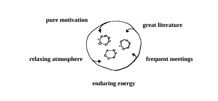
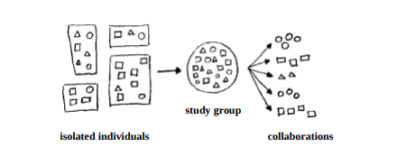
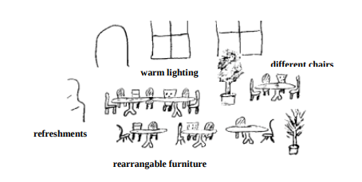

# todo
- a pattern language for study groups from joshua kerievsky

# The theory and practice of teaching and learning
## Learning outcomes and objectives
- when people return to their desk, will they be able to apply what they've learnt in a useful way
- have a fair idea who will come and what's the production code and tests look like at present
- discuss with attendee what they're interested in learning and what they are currently struggling with.
- bloom's taxonomy, thinking skills can be described in terms of six broad categories
  - remembering, understanding, applying, analyzing, evaluating, creating
  - help you plan exercises and teaching materials at an appropriate level
  - start with materials to build remembering, understanding and applying
  - when those thinking skills are in place, you can do more analyzing, evaluating and creating
  - find a long lists of good **verbs** to describe thinking skills in each category. These words are useful as a prompt or start of a sentence.
## the '4C' learning model
- each person who comes to your learning hour has a unique background, and what they're going to learn needs to be integrated with what they already know for it to stick.
- 4C's:
  - connect: get people in the right head-space for learning about the topic together
  - concept: introduce the new skills or ideas or information you want the participants to learn
  - concrete: hands-on exercises to practice skills or figure out how things work
  - conclusions: an opportunity for people to consolidate and internalize what they've learnt.
- you want to help people to be present mentally, fuel their curiosity, let them work out what they need to do, and to come to their own understanding of the topic.
## Design learning experiences that fit with how the brain works
- useful rules about how the brain works
  - **movement trump sitting**
    - you want people to move out of a sitting position at least every 10-15 minutes
    - arrange the chairs so people physically stand up and move a chair to the right every time you change typist
    - when you gather observations in retrospective, people can each walk up to the whiteboard and stick their notes onto it.
    - when reviewing code, you can stick printouts to the walls and have people move around to look at them.
    - if you're working together remotely, get people to take breaks and leave their desks from time to time.
  - **talking trumps listening**
    - when you talk about what you just heard it reinforces your memory of it.
    - talking also gives opportunities for feedback from others about how well you seem to understand the topic.
    - ask people to pair up to discuss a topic or share experiences.
  - **images trumps words**
    - if the picture and associated story evokes an emotion, it would make it easier to pay attention and recall it later.
    - long-term memories often comprise of images and associated emotions.
  - **writing trumps reading**
    - when you read, it's easier for your mind to wander.
    - writing also makes the information multi-sensory, you physically move a pen on some paper as well as see the text on the page.
    - draw lines and boxes to situate the information in space and relate it to other information.
    - provide handouts, notes and quizzes that people can annotate. Ask people to write conclusions and observations on sticky notes
  - **shorter trumps longer**
    - student's minds tend to drift after about 10 minutes of traditional lecture.
    - to keep people's attention, divide your presentations into 10-20 minute chunks and in between spend at least 1-2 minutes on some other activity.
    - perhaps ask people to review or discuss the material presented so far
    - break off occasionally for Q&A, or to ask people to note down what they observed so far.
  - **different trumps same**
    - anything new or unexpected will catch people's attention.
    - games and simulations an exercises can contain built-in surprises.
    - suddenly change requirement mid-exercise. Keep it fun.
- One example learning objectives
  - describe some characteristics of approval testing -> remembering
  - compare approval testing with assertion-based testing -> understanding
  - use the approvals framework to write test cases -> applying
## Deliberate practice
- in order to use red-green-refactor cycle competently, you need to
  - identify the next test case that will incrementally improve your solution
  - design the specifics of that test case and see it fail
  - implement a solution design which is testable
  - refactor to improve your design.
  - if you're weak in any one of those component skills, you will struggle to do TDD.
- the great advantage of practice exercises is we can find ones that let us work on those component skills individually
- as a teacher, I want to plan a series of learning hours that will be at just hte right level so people don't get bored and don't get overwhelmed or frustrated.
# Sample Learning Hour
## incremental working, driven by tests
- try to get people comfortable with one another and feel safe to work in pairs.
### learning goals
- the learning hour is in the "small steps" theme
- describe the read-green-refactor cycle
- explain why you write the tests first and not all at once
- design a pure function that takes an integer and returns a boolean using TDD

### session outline
- 10 min connect: divide into pairs, 3 benefits of TDD
- 15 min concept: demo leap years
- 20 min concrete: do leap years in pairs
- 10 min conclusions: summary of main idea

### connect
- ask people to form pairs and introduce themselves if they don't know each other.
- ask them to discuss the question "what are some of the main benefits of doing TDD?"
- after 3 mins ask each pair to report one thing they came up with the group

### concept
- starting at a whiteboard, explain the purpose of the kata
- write up all 4 examples given in the kata description on a whiteboard. Note that these will turn into tests
- make it clear you interleave designing tests and writing code.

### concrete
- ask people to work in pairs or an ensemble to do the same thing
- start from problem description and an empty editor, and complete the Leapyear function using TDD
- every 3-4 minutes, remind them to swap the person who has the keyboard
- coach them to write the tests before the implementation, working incrementally and iteratively.

### conclusions
- think about what we did today. If you had to explain the main idea of TDD to someone else, what would you say?
- write your explanation in a sentence or two on a post-it.
- put up a flipchart with the question "what is the main idea of TDD?" Ask people to stick their post-it notes on it.
- read some notes out to the group before you partway.
- hang the poster somewhere prominent afterwards, perhaps in the team area or coffee room.
- if working remotely, they can each write their sentence or two in a shared online document.

# Continuous learning
- [industrial logic continous learning](https://www.industriallogic.com/img/blog/2005/09/ContinuousLearning.pdf)
- XP teams are very code-centric and focused on making functional software. When reflection and learning happen, it's often in a watered down, haphazard way.
- someone has to decide to make learning not just an individual experience but a collective experience. When that happens, learning isn't just something that occurs naturally, it is something that the company uses to drive the future of business.
- "what is the simplest, most cost-effective way to share learnings?"
- a group of people who functioned together in an extraordinary way, who trusted one another, who complemented each others' strengths and compensated for each others' limitations, who had common goals were larger than individual goals, and who produced extraordinary results.
  - the team that became great didn't start off great - it **learned** how to produce extraordinary results.
  - **a programmer's study group will meet regularly in a comfortable place to delve into important technical topics. These topics can come from group's learning repository, from books or articles, or even from a guest participant.**

## a learning repository
- a simple, security-free, browser-based learning repository, such as Ward Cunningham's Wiki
- just install it and asking folks to use it isn't enough. Teams need to establish usage convention
  - developers will quickly jot down learnings on index cards, as they work, and when they integrate their code, they can integrate significant learnings as well.
- atlassian confluence provides similar functionality but how can we organize and maintain the group knowledge effectively?

# A pattern language for study groups
- [a pattern language for study groups](https://www.industriallogic.com/img/blog/2012/03/khdraft1.pdf)
- a study group can make a difficult book easier to understand, it can succeed where an unsatisfying class fails, and it can support you if your environment doesn't support your ongoing learning and growth.
- once teams produce enough learning content they will need to reflect on and discuss it. 
- there are 2 good places to do this: for technical matters, the best place is a programmer's study group; and for team, people or process maters, the best place is in an iteration retrospective.
- **every programmer on the team needed to at least be aware of the system's potent smells. This would enable them all to pay attention to these smells and consider how to refactor them out of existence**.
  - look into process of documenting these potent smells (index cards, wiki, etc...). This would eventually led to direct action
- recommend that groups meet for 2 hours if they want to delve deeply into a subject, though one-hour meetings are fine for covering topics quickly
- absolutely no one should play the role of lecturer or teacher in a study group.
  - the group meets to conduct group learning.
  - if someone is expert in a certain technical area, that individual ought to help others learn, not show off or talk down to participants.
- continuously learning coach
  - the coach is the leader of the team. If the coach doesn't value learning, the team won't either.
  - the coach must lead by example. This means that the coach will seek out and obtain coaching and mentoring from the best sources available.
  - coaches must strive to learn about their customer's needs, team or personality conflicts, new technologies, and the latest wisdom about XP and other lightweight methods.
- patterns are grouped into 4 secions
  - spirit
    - after identifying a great source knowledge in a subject, work to create a rewarding, intellectually safe environment for hte study of that subject. 
    - contains [knowledge hydrant](#knowledge-hydrant), [pool of insight](#pool-of-insight), [safe place](#safe-place), [enduring energy](#enduring-energy), and [kindred collaborator](#kindred-collaborators)
  - atmosphere
    - establish a home for the study group that is centrally located, comfortable, aesthetically pleasing and conductive a dialogue
    - contains [common ground](#common-ground), [public living room](#public-living-room), [intimate circle](#intimate-circle) and [virtual space](#virtual-space)
  - roles
    - lead and energize the group, come prepared and help guide dialogues so that they are insightful and productive
    - contains [enthusiastic leader](#enthusiastic-leader), [motivated moderator](#motivated-moderator), [active participant](#active-participant), [prepared participant](#prepared-participant), and [distinguished participant](#distinguished-participant)
  - customs
    - follow customs that will re-enforce the spirit of the group, piquing participant's interest in dialogues, accomodating different learning levels, making the study of literature easier, recording group experiences, and drawing people closer together.
    - contains [opening question](#opening-question), [sequential study](#sequential-study), [agenda](#agenda), [subgroup](#subgroup), [distributed diary](#distinguished-diary) and [after hours](#after-hours)

## retrospectives
- the continuous learning approach to retrospectives means they come not at the end of a project, but at the end of every iteration.
  - conducting iteration retrospectives will enable teams to quickly adjust and improve their performance, because they will be continuously revisiting these questions:
    - what worked well?
    - what did we learn?
    - what should we do differently next time?
    - what still puzzles us?
    - what happened?
- people have a fear of retrospectives, because they have a fear of being attacked, of being made to look foolish, of getting a poor performance review or of hurting someone's feelings.
- it's detrimental to retrospectives if people are afraid, or if there is an atmosphere of blame, criticism, sarcasm, or even humor at other people's expense.
- "regardless of what we discover, we understand and truly believe that everyone did the best job they could, given what they knew at the time, their skills, and abilities, the resources available, and the situation at hand."
- it's vital that the facilitator be an outsider and not a member of the team involved in the retrospective.
- participants take the lessons learned during the retrospective and turn them into concrete ideas for improving their development process.
  - the key to retrospective is to make sure you're solving the correct problem.

## knowledge hydrant
- where can one obtain knowledge in its fullest unfiltered, unsimplified form.
- great literature tends to be hard to study and understand. Many people either aren't prepared to do this hard work or simply don't want to
- authors of great literature commonly reference, extend, or refute ideas communicated by their ancestors or peers. This can make it doubly hard to understand their writings, since one may need to understand referenced works in order to understand author's own work.
- as great literature ages, people don't believe it will contain the "modern" knowledge they need. So even if some great book written 30 years ago contains the exact knowledge they seek, people won't find it, for they are unaware of the abundance of knowledge contained in older works of literature.
- the hard work put into the study of great literature is worthwhile because it ensures that people retain the knowledge they wish to obtain
- great literature is much easier to understand when it is studied in an intelligent sequence [sequential study](#sequential-study)
- it is easier and more rewarding to study great literature with other people [pool of insight](#pool-of-insight)
- discover the great literature in your profession or area of interest - the finest books, articles, and speeches ever written, and then begin an earnest study of these works.
- how do you find the great literature worthy of study? Ask people. Ask knowledgeable people which authors they like, what are their favorite books, what profoundly influenced them?
- after identifying the works, form or join a study group, [pool of insight](#pool-of-insight), order the works to be studied [sequential study](#sequential-study) and compose an [agenda](#agenda)

## pool of insight
- once you've discovered your [knowledge hydrant](#knowledge-hydrant), it can be overshelming to drink from it. This pattern suggests how to make the study of great literature easier and more rewarding
- there's nothing wrong with reading and studying literature on one's own. But great literature is worth knowing well, and individual study pales in comparison with teh study of literature in a group dialogue.
- in communicating how they understand something, people may
  - clarify what confused others
  - expose their own misunderstandings
  - reveal new ideas
  - articulate that which they didn't know they knew
- in a dialogue, nobody is trying to win. Everybody wins if anybody wins.
  - whenever any mistake is discovered on the part of anybody, everybody gains.
  - there is a spirit present in dialogues that one doesn't find in many other learning environments
  - many groups sustain a group's spirit by meeting weekly or biweekly
- read and study literature on one's own, but discuss it with others in a regular study group. Aim to ask questions about you don't know and explain what you do know. Your exchanges with colleagues will enrich your understanding immensely.
- the best study groups are those in which individuals feel comfortable learning with others [safe place](#safe-place)
- some environments promote dialogues, [common ground](#common-ground) and [public living room](#public-living-room)
- the most enriching study happens when a group has a [motivated moderator](#motivated-moderator) and [prepared participants](#prepared-participants)
## safe place
- a good physical environment [common ground](#common-ground), [public living room](#public-living-room) is vital for any study group. Equally vital, is the intellectual environment.
- **loud-mouths, show-offs, know-it-alls, and people who are overly competitive, adversarial or confrontational, can make other uncomfortable or insecure, and create an environment that is not conductive to learning, sharing or the building of ideas**.
- when places of learning have highly critical or judgemental natures, an individual's ability to learn can easily be compromised.
- treat each other as colleagues with respect, despite differences in opinion, acknowledges the mutual risk and establishes the sense of safety in facing the risk.
- generally, as long as the people arguing are remaining civil (treat each other with kindness, consideration and respect) and as long as the argument isn't too far off the subject being studied, it can be quite instructive for a group to listen and learn.
- Usually, it is best for someone who is intimate with the group's customs to approach the individual during a short break or [after hours](#after-hours)
- establish a warm, tolerant, polite and focused environment in which individuals help each other where everyone is comfortable to ask questions and make mistakes.
- in practice, there will always be some level of personality conflicts or discord within a group. It can help if people get together after a session, [after hours](#after-hours), to talk about the issues.
## enduring energy
- this pattern identifies what is needed in a study group to bring it to life, and sustain it over time.
- **it's fairly easy to start a study group. But keeping it going, so that members are active, dialogues are insightful, and the group is long-lived, is another matter altogether.**
- a study group's energy initially comes from its founder. If the founder is genuinely interested in creating thriving, long-lasting [pool of insight](#pool-of-insight), to improve himself/herself and his community, the group will start life with a powerful energy. But if founder is merely interested in short-term gains, or personal recognition, the group will be short-lived.
- In considering the long-term vitality of the group, there are many decisions to make
  - when will the group meet?
  - how long will its meetings be?
  - what will be studied?
  - if poor or uninformed decisions are made about these issues, a group may be never take root or be long-lived.
- frequent meetings
  - it's difficult to maintain any sort of low or continuous energy. A month between meetings is usually far too long for people to maintain focus and enthusiasm. Therefore, have the group meet weekly or bi-weekly
  - these frequent meetings will allow a group to study effectively and may lead some members to become [kindred collaborators](#kindred-collaborators)
  - hour meetings
    - a one hour meeting is typically not enough time for a group to have an insightful dialogue on a piece of literature. But three hours is too much time, since most participants can't actively engage in dialogue for that long
    - therefore, limit dialogues to a maximum of 2 hours, and if energy has waned significantly before that time, finish the meeting early
  - short breaks
    - at a certain time in a dialogue, a group's intensity focus and effectiveness will begin to diminish. If the group doesn't take a break at this time, the quality of the dialogue may begin to deteriorate and people will become uncomfortable.
    - therefore, allow for a short (10 or 15 minute) break in the middle of a study group session, to let members reflect, chat, use the restrooms, and prepare for the next half of the dialogue.
  - avoid group meetings in dull, stuffy, maybe windowless, conference room since the location and space will play a huge role in sustaining a group's energy.
    - places that attract people is usually, spacious, comfortable, energetic. It helps creating bonding and bring life to the dialogues.
  - **create study groups out of genuine enthusiasm to study a subject in-depth. Meet weekly or bi-weekly for 2 hours, and have a short-break in the middle. Choose a meeting location where people will enjoy passing time, and study only those writings which are worthy of group's attention**
  - 
  - for ideal meeting environment, look for [common ground](#common-ground) and [public living room](#public-living-room)
  - create [subgroups](#subgroup) and [study cycle](#study-cycle) to let people place their energy where they best see fit. And when group energy is low, have a [distinguished participant](#distinguished-participant) join the group for an evening
  - it is a custom of some groups to go out after meetings [after hours](#after-hours) to partake in food and drink. This social time can go far towards sustaining relationships and adding energy back to a group...
## kindred collaborators
- when a study group has an enduring energy, people get to know each other, a community forms, and there is a lasting possibility for collaborations and working relationships
- **so many people dislike networking. They want to grow professionally, and they think that networking can help, but they don't know how, where and with whom to network effectively.**
- many people feel isolated in their jobs. So much of their time is spent working that there is little time left to pursue genuinely interests them.
  - some try to organize study groups within their own companies, but if often fails due to lack of interest, or because many people prefer to be outside of work when they have any free time.
  - some people go to conferences lectures, user groups and parties in the hope of advancing their careers and themselves. Often, they end up frustrated in reality, they don't grow professionally at these meetings and their networking is ineffective. The trouble often results from what may be described as weak connections that develop between people who meet in large groups.
  - In frequently meeting study group, people get to know each other over time. They learn what they like and dislike, what they excel at and where they are weak, where they are in their careers and where they'd like to go. This level of familiarity forms the foundation for a rich network that can yield very real career and collaboration possibilities.
  - As one gets to know others within a group, one can get a very good idea of who would be good for a specific projects
- 
- quality networking happens best when a study group is a [safe place](#safe-place) composed of diverse individuals and true peers. The best time for networking is either before study groups meets or [after hours](#after-hours)

## common ground
- people lack a place where they can have regular, meaning ful dialogues with other people in a casual, social setting. Work and home don't provide it, and many clubs or groups also don't provide it because they meet in lifeless environments that feel like someone else's turf
- people need informal public places where they can gather, put aside the concerns of work and home, relax and talk. Germany's beer gardens, English's pubs, and French and Viennese cafes created this outlet in people's lives, providing a neutral ground where all are equal and conversation is the main activity.
- without such places, the urban area fails to nourish the kinds of relationships and the diversity of human contact that are essence of the city. Deprived of these settings, people remain lonely within their crowds.
- it's naturally to choose one of the company's conference rooms as a meeting location as it is spacious quiet, filled with white boards, available after hours, and free. However, it's not a good choice, since both employees and visitors to the company, generally don't like to spend their free time in stuffy, stale, office environments.
- **hold public study groups where diverse individuals will all be on common ground. The best locations are easy for people to get to, but not too close to their offices or homes.**
- once common ground has been selected, a group must find a [public living room](#public-living-room), a comfortable, relaxing, dialogue-friendly place.
## public living room
- **inhospitable physical locations - stale, lifeless, badly lit, and uninviting - stifle individuals and thereby hinder lively, engaging dialogues.**
- allow traffic to flow with minimum disruptions since members often arrive late, leave early, get up for snacks or use the restrooms.
- sitting circle
  - place each sitting space in a position which is protected, not cut by paths or movements, roughly circular, made so that the room itself helps suggest the circle, not too strongly, with pats and activities around it, so that people naturally gravitate toward the chairs when they get into the mood to sit.
- different chairs
  - helps people understand that the seating preferences of diverse people differ and that a group will be most comfortable if a space is outfitted with "a variety of different chairs, some big, some small, some softer than others, some rockers, some very old, some new, with arms, without arms, some wicker, some wool, some cloth."
- pool of light
  - place the lights low, and apart, to form individual pools of light which encompass chairs and tables, like bubbles to reinforce the social character of the spaces which they form.
- choose a warm, spacious establishment where people will enjoy mingling before and after study session, where there is comfortable, rearrangable furniture, plenty of warm lighting, and a variety of foods and drinks.
- some groups may choose to reserve space or arrange to meet at a location when it closes to the public to avoid noises at certain times of day.
- 

## **The Intimate Circle: Fostering Meaningful Dialogue and Deep Learning in Study Groups**

In study groups, **creating an "Intimate Circle" is essential to fostering rich discussions, inclusivity, and engagement**. The structure of a study group plays a vital role in **encouraging participation, enhancing comprehension, and deepening connections between members**. Without a thoughtfully designed space, **discussions can become fragmented, participation uneven, and learning less effective**.

This guide explores the **significance of an Intimate Circle**, its **key elements**, **best practices for implementation**, and **examples of successful setups**.

---

### **🌟 Why an Intimate Circle is Essential for Effective Learning**
An **Intimate Circle** is more than just a seating arrangement; it is **a psychological and social construct that encourages open communication, trust, and collaboration**.

- **"An Intimate Circle ensures that each participant is fully engaged, seen, and heard, eliminating hierarchies and fostering a sense of shared responsibility."**
- **"Poor seating arrangements—like a long table or lecture-style rows—discourage interaction and create a passive learning environment."**

Studies have shown that **small-group settings (typically 4-8 people) create the most effective balance between comfort, social interaction, and focus**. A survey conducted among **workers at the Berkeley City Hall** revealed that **groups larger than eight tend to dilute participation**, whereas **smaller groups facilitate more meaningful exchanges**.

✅ **Key Benefits of an Intimate Circle**
- Encourages **active participation** rather than passive listening.
- Fosters **deep dialogue and critical thinking**.
- Strengthens **peer-to-peer learning and collaboration**.
- **Eliminates social barriers**, making every member feel valued.

---

### **🔹 Key Elements of an Intimate Circle**
The **effectiveness** of an Intimate Circle depends on several crucial factors:

#### **1️⃣ Circular or Semi-Circular Seating Arrangement**
- **"The most effective study groups position themselves in a circle or an oval, ensuring that all members maintain eye contact and are fully engaged."**
- The **worst layouts** include:
  - **Rows facing forward** (like a traditional classroom setting) ❌
  - **Long rectangular tables** where members at opposite ends struggle to interact ❌
  - **Fixed seating in public spaces** where people cannot adjust their positions ❌

**Example**: Imagine a literature study group discussing *The Great Gatsby*. In a **circular arrangement**, members can make eye contact, read passages aloud, and react to each other's insights. In contrast, in a **linear row or lecture-style setting**, participants struggle to interact naturally, limiting discussion depth.

---

#### **2️⃣ Group Size and Adaptability**
- **"The ideal study group consists of 4-8 people, ensuring that every voice is heard while maintaining an intimate and focused setting."**
- If the group expands beyond **eight people**, subgroups can be created to **maintain intimacy and engagement**.

**Example**: A coding study group preparing for technical interviews may split into **two smaller circles**—one focusing on algorithms and the other on system design. **This keeps conversations manageable and interactive.**

**Best Practices:**
✅ **Use modular furniture** (movable chairs, small round tables).
✅ **Allow for expansion and contraction**—arrange furniture so that people can **join or leave without disrupting the circle**.
✅ **For virtual study groups**, **arrange Zoom tiles in a circular view (gallery mode)** rather than a speaker-focused layout.

---

#### **3️⃣ Comfortable and Inclusive Environment**
- **"A successful Intimate Circle makes people feel physically comfortable and intellectually safe to share their thoughts without judgment."**
- **Comfort affects focus and engagement.** People struggling with **uncomfortable seating, poor lighting, or noisy environments will disengage quickly.**

**Best Practices:**
✅ **Choose venues with soft, adjustable lighting** (avoid harsh fluorescent lights).
✅ **Ensure chairs and tables are comfortable and adjustable**.
✅ **Use whiteboards or digital boards** where everyone can **contribute ideas collectively**.

**Example**: In a philosophy study group debating **Socrates’ concept of justice**, a dimly lit café with soft lighting and cushioned seats encourages **deep discussion and focus**. In contrast, a **noisy cafeteria with stiff chairs** discourages engagement.

---

#### **4️⃣ Equal Participation and Role Rotation**
- **"An Intimate Circle thrives when all members feel they can contribute equally, without dominant voices overshadowing others."**
- **Without role rotation, one or two individuals may control the conversation, discouraging quieter members from speaking up.**

**Best Practices:**
✅ **Rotate the role of discussion leader or moderator** each session.
✅ **Encourage members to ask follow-up questions to quieter participants**.
✅ **Use a "talking token" system**—only the person holding the token (a small object) speaks, ensuring balanced dialogue.

**Example**: In a psychology study group analyzing *Carl Jung’s theories*, members take turns leading discussions on different archetypes (e.g., one week focuses on **The Shadow**, another on **The Anima/Animus**). This ensures everyone contributes.

---

### **📌 Challenges and Solutions in Implementing an Intimate Circle**
While the **Intimate Circle** model offers numerous benefits, certain challenges may arise.

#### **🔺 Common Issues and Fixes**
| **Issue**                                        | **Solution**                                                                                   |
| ------------------------------------------------ | ---------------------------------------------------------------------------------------------- |
| **Overcrowding in small spaces**                 | Use **stackable or foldable chairs** to allow for easy reconfiguration.                        |
| **Uneven participation (some members dominate)** | Assign **rotating facilitators** and use a **time-tracking system** to ensure fairness.        |
| **Fixed furniture in public spaces**             | Choose **cafés with flexible seating** or **parks with movable benches**.                      |
| **Online study groups feel impersonal**          | Use **breakout rooms** for small discussions, **Zoom whiteboards** for interactive engagement. |

---

### **📌 Real-Life Applications of the Intimate Circle**
Here are **three real-world examples** demonstrating the **impact of the Intimate Circle**:

#### **📖 Case Study 1: The Socratic Seminar Approach**
In **elite law schools**, professors use **Socratic questioning** in **small, circular study groups** to challenge students' legal reasoning. **Each member must defend their stance while engaging in deep, structured debate.** This model is widely used in **Harvard Law School’s study groups**.

#### **💻 Case Study 2: Tech Startup Innovation Teams**
At **Google**, small engineering teams sit in **circular or semi-circular formations** to **brainstorm and solve coding problems together**. This arrangement **removes traditional power structures** and encourages a **flat, collaborative dynamic**.

#### **🎭 Case Study 3: Actor's Rehearsal Circles**
Broadway actors frequently **sit in circles** while **analyzing scripts together**. This **physical proximity enhances emotional connection** and **ensures everyone can see and react to each other’s expressions**.

---

### **✨ Final Thoughts: The Power of an Intimate Circle**
The **Intimate Circle is a foundational element of any effective study group**. It **ensures engagement, fosters meaningful dialogue, and creates a collaborative learning environment**.

#### **📌 Summary of Best Practices**
- **🪑 Seating Matters** → Use a **circular or semi-circular layout**.
- **👥 Keep Groups Small** → **4-8 members** per group.
- **🏡 Create a Comfortable Space** → Good lighting, **comfortable chairs**, minimal noise.
- **🎤 Encourage Equal Participation** → Rotate discussion leaders, use **"talking tokens"**.
- **🌍 Adapt to Digital Spaces** → Use **breakout rooms, interactive whiteboards, and face-visible gallery mode**.

An **Intimate Circle transforms an ordinary study group into a thriving hub of ideas, learning, and deep engagement.** By **thoughtfully designing** the group’s environment, **learning becomes immersive, participatory, and deeply fulfilling**. 🚀

## **Virtual Space: Expanding Study Groups Beyond Physical Boundaries**

In the modern age, study groups are no longer confined to **physical locations**. The **Virtual Space** is a **powerful extension** of any study group, providing a **centralized digital hub** where members can **collaborate, learn asynchronously, and engage globally**. 

A well-structured Virtual Space **removes geographic barriers**, **accommodates different schedules**, and **ensures knowledge preservation** beyond in-person meetings. **Without an online presence, a study group will lack a cost-effective way of advertising its existence, organizing events, staying connected, and attracting new members.**

- [virtual space](./virtual-space.png)

---

### **🌍 The Power of Virtual Spaces in Study Groups**
#### **Why Every Study Group Needs a Virtual Space**
A **Virtual Space** **does not replace** the physical study group but instead **complements and enhances** it. Some of the most critical reasons for implementing one include:

#### **🟢 1. Breaking Geographic Barriers**
- **"A virtual space allows participation from members across the globe, making it possible to connect with diverse perspectives and expertise."**
- Groups are no longer **limited by city, country, or time zone**, making it **easier to include subject-matter experts and specialists**.

#### **🟢 2. Accommodating Busy Schedules**
- **"Virtual spaces enable asynchronous learning, meaning members can contribute at their convenience without needing to attend every live session."**
- Members **can access notes, discussions, and assignments whenever they have time**.

#### **🟢 3. Enhancing Engagement Between Meetings**
- **"Many discussions fade away once a physical meeting ends, but a virtual space keeps the dialogue alive and ongoing."**
- Members can **post follow-up questions, share insights, and explore additional resources** after the session.

#### **🟢 4. Storing and Organizing Study Materials**
- **"A virtual library eliminates the need to manually distribute documents, making everything accessible with a single click."**
- A **shared knowledge repository** ensures that:
  - **New members can quickly catch up**.
  - **All materials are archived** for future reference.

#### **🟢 5. Encouraging Collaboration and Peer Support**
- **"Study groups thrive when members can interact continuously, helping each other beyond scheduled meetings."**
- Virtual platforms **support real-time communication, collaborative projects, and shared note-taking**.

---

### **🔹 Essential Components of a Virtual Space**
A successful Virtual Space consists of **several key elements** that work together to create an **engaging and organized** digital learning environment.

#### **1️⃣ Centralized Online Hub**
A **well-structured home base** ensures that all members know where to find study materials, discussions, and meeting details.

- **"A good site will define what a group is about, who is part of the group, what the group is studying, and when and where the group meets."**
- This **can be a website, a Notion workspace, or a collaborative cloud folder**.

✅ **Recommended Platforms:**
| **Platform**     | **Best Use Case**                                |
| ---------------- | ------------------------------------------------ |
| **Google Sites** | Free and simple site for study group pages.      |
| **Notion**       | All-in-one workspace for collaborative learning. |
| **WordPress**    | Customizable with forums and blogs.              |
| **Moodle**       | Academic-style structured learning platform.     |

**Example:**  
A **literature study group** uses **Google Sites** to create a **central hub** where members can find **reading schedules, discussion prompts, and meeting recordings**.

---

#### **2️⃣ Discussion Forums and Chat Platforms**
A **discussion forum** allows study groups to **engage in ongoing conversations, post questions, and clarify doubts**.

- **"For conducting online discussions, a simple group email server or service (such as Google Groups) is useful."**
- However, more interactive tools like **Slack or Discord** enable **faster and more engaging communication**.

✅ **Best Platforms for Discussion & Chat:**
| **Platform**               | **Key Features**                                                       |
| -------------------------- | ---------------------------------------------------------------------- |
| **Slack**                  | Channels for structured conversations, integrations with Google Drive. |
| **Discord**                | Voice channels, organized chat categories.                             |
| **Reddit (Private Group)** | Ideal for long-form discussions and topic-based threads.               |
| **WhatsApp / Telegram**    | Quick mobile communication for daily updates.                          |

**Example:**  
A **science study group** discussing **quantum mechanics** creates **Slack channels** for each topic—one for **equations**, another for **applications**, and one for **book recommendations**.

---

#### **3️⃣ Digital Libraries and Knowledge Repositories**
- **"A study group's knowledge should not disappear after meetings—everything should be stored in an organized, easily accessible location."**
- A **centralized digital library** ensures that **all learning materials, PDFs, presentations, and notes** are always available.

✅ **Best Cloud Storage Solutions:**
| **Platform**     | **Best Use**                                             |
| ---------------- | -------------------------------------------------------- |
| **Google Drive** | Storing PDFs, recorded sessions, and slides.             |
| **Notion**       | Organizing study resources into structured pages.        |
| **Dropbox**      | Cloud storage with easy sharing.                         |
| **OneDrive**     | Microsoft-integrated storage and document collaboration. |

**Example:**  
A **law study group** keeps **case studies, legal documents, and legislative summaries** in **Google Drive**, categorized by **jurisdiction and topic**.

---

#### **4️⃣ Virtual Meeting Coordination & Scheduling**
Scheduling is **one of the biggest challenges** for study groups. **A shared scheduling system eliminates confusion and ensures maximum attendance.**

- **"AGENDAs (17) are particularly helpful for members and non-members of a group and are therefore best placed on the site."**

✅ **Top Scheduling Tools:**
| **Tool**               | **Best Features**                             |
| ---------------------- | --------------------------------------------- |
| **Google Calendar**    | Shared events, RSVP tracking, notifications.  |
| **Doodle**             | Poll-based scheduling for best meeting times. |
| **Calendly**           | Auto-scheduling based on availability.        |
| **Zoom / Google Meet** | For online study sessions.                    |

**Example:**  
A **medical students' study group** uses **Google Calendar** for **weekly review sessions** and **Doodle polls** to determine the best time for extra practice meetings.

---

#### **5️⃣ Distributed Diary – Documenting Key Learnings**
- **"A Distributed Diary captures the key takeaways from each session and makes them available for future review."**
- Every session’s **summary, main insights, and unresolved questions** are **recorded and stored**.

✅ **Best Note-Sharing Tools:**
| **Tool**          | **Use Case**                         |
| ----------------- | ------------------------------------ |
| **Google Docs**   | Collaborative note-taking.           |
| **Evernote**      | Personal and group note collections. |
| **Roam Research** | Linking related concepts and notes.  |
| **OneNote**       | Organized digital notebooks.         |

**Example:**  
A **history study group** maintains a **Notion page** that logs **session notes, key historical events, and discussion highlights**.

---

### **📌 Overcoming Challenges in Virtual Study Groups**
| **Challenge**                        | **Solution**                                                   |
| ------------------------------------ | -------------------------------------------------------------- |
| **Low Engagement**                   | Use **notifications, weekly prompts, gamification**.           |
| **Too Many Platforms**               | Stick to **one or two main tools**.                            |
| **Difficulty Coordinating Meetings** | Use **Google Calendar and Doodle polls**.                      |
| **Time Zone Differences**            | Encourage **asynchronous participation** in discussion forums. |

---

### **✨ Final Thoughts: The Future of Study Groups is Hybrid**
#### **"A virtual space transforms a study group into a thriving, knowledge-sharing community, where learning never stops."** 🚀

#### **📌 Best Practices for a Successful Virtual Study Space**
- **🌐 Centralize information** → Use **Notion or a website**.
- **💬 Keep discussions active** → Utilize **Slack, Discord, or WhatsApp**.
- **📚 Organize materials** → Store in **Google Drive or Notion**.
- **📝 Capture knowledge** → Maintain a **Distributed Diary**.

By implementing a **strong Virtual Space**, study groups can **break barriers, enhance collaboration, and create a dynamic, interactive learning experience for all members.** 🎯

## **Enthusiastic Leader: The Driving Force Behind a Thriving Study Group**

### **"When a group doesn't have a leader who is passionate about the subject and determined to nourish and maintain its energy and culture, a group can languish, and possibly not survive."**

An **Enthusiastic Leader** is **the heart of a study group**. They **set the tone, cultivate motivation, and ensure that the group remains focused and engaged** over time. Without an effective leader, even the most promising study groups risk **losing momentum, falling into disorganization, or failing to inspire their members**.

This guide explores the **role, characteristics, best practices, and real-world examples** of an **Enthusiastic Leader** who **energizes, nurtures, and sustains** a study group.

---

### **🌟 Why Every Study Group Needs an Enthusiastic Leader**
#### **The Leader as the Group’s Foundation**
A **study group without strong leadership often lacks direction and cohesion**. Leaders serve as:
- **"The guiding force that ensures the group remains productive, engaged, and aligned with its mission."**
- **"A source of inspiration, encouraging members to actively contribute and stay committed to the learning process."**
- **"A problem solver, ensuring smooth operations, resolving conflicts, and adapting to changing group dynamics."**

✅ **Key Responsibilities of an Enthusiastic Leader**
- **Maintaining group energy and engagement** 🏆
- **Encouraging participation and inclusivity** 💡
- **Organizing structured and meaningful discussions** 📚
- **Ensuring continuity and long-term sustainability** 🔄
- **Building an environment where learning thrives** 🎯

A well-led group fosters **deep learning, intellectual curiosity, and collaboration**, while a leaderless or poorly led group may struggle with **low participation, lack of direction, and disinterest**.

---

### **🔹 Key Traits of an Enthusiastic Leader**
An Enthusiastic Leader is **more than just an organizer**—they **ignite passion, create a welcoming atmosphere, and lead by example**.

#### **1️⃣ Passion for Learning**
- **"The best leaders are those who are genuinely enthusiastic about a group's mission."**
- They **inspire others through their love for the subject**, making learning contagious.

**Example:**  
In a philosophy study group, an enthusiastic leader **shares insightful articles, introduces provocative questions, and brings in guest speakers to enhance discussion.**

---

#### **2️⃣ Ability to Motivate Others**
- **"An effective leader ensures that all members feel valued and motivated to contribute."**
- Leaders **encourage participation by fostering a sense of ownership and accountability**.

✅ **Ways to Keep Members Motivated:**
- Recognizing contributions 🌟
- Assigning discussion roles (rotating moderators, note-takers) 📖
- Encouraging feedback and adaptation 🔄
- Keeping discussions engaging with **diverse formats (debates, case studies, Q&A sessions)** 🎭

---

#### **3️⃣ Strong Organizational Skills**
- **"Leaders will help ensure that AGENDAs are kept up to date, and that the readings being selected are worthy of the group's attention."**
- They **coordinate schedules, select discussion materials, and ensure smooth operations**.

✅ **Essential Tools for Study Group Organization:**
| **Tool**                  | **Purpose**                                       |
| ------------------------- | ------------------------------------------------- |
| **Google Calendar**       | Scheduling meetings and reminders.                |
| **Notion / Trello**       | Managing discussion topics and progress tracking. |
| **Google Docs / OneNote** | Collaborative note-taking.                        |
| **Slack / Discord**       | Real-time discussions and announcements.          |

**Example:**  
A coding study group leader **organizes a weekly agenda, assigns algorithm challenges, and sets up a shared GitHub repository for collaboration**.

---

#### **4️⃣ Adaptability and Problem-Solving**
- **"Should other groups attempt to subsume the group, the leader will step in to either prevent a take-over or to explore the idea with the group."**
- Leaders must **handle conflicts, address declining engagement, and adapt to members’ evolving needs**.

✅ **Common Study Group Challenges & Solutions**
| **Challenge**               | **Leader’s Solution**                                                      |
| --------------------------- | -------------------------------------------------------------------------- |
| **Low participation**       | Rotate facilitators, introduce interactive activities.                     |
| **Scheduling conflicts**    | Use Doodle polls to find the best times.                                   |
| **Uneven knowledge levels** | Create subgroups for beginner vs. advanced discussions.                    |
| **Lack of focus**           | Implement structured discussion formats (Socratic seminars, case studies). |

**Example:**  
In a history study group, some members **preferred in-depth readings, while others needed summaries**. The leader **formed two subgroups**, ensuring both learning styles were accommodated.

---

### **🔹 Best Practices for an Enthusiastic Leader**
#### **1️⃣ Lead by Example**
- **"A good leader demonstrates commitment by being the most prepared and engaged member."**
- **Show enthusiasm through active participation, curiosity, and initiative.**
- **Encourage deeper discussions by asking insightful questions**.

**Example:**  
In a literature study group, a leader **prepares detailed reading notes, highlights significant themes, and shares related articles** to enrich discussions.

---

#### **2️⃣ Create a Safe and Inclusive Environment**
- **"A group must be a SAFE PLACE where individuals feel comfortable sharing ideas without fear of judgment."**
- Foster **respect, openness, and intellectual curiosity**.

✅ **Ways to Build an Inclusive Study Group:**
- Establish a **no-interruption rule** 🛑
- Encourage **shy members to share** 🌱
- Maintain **civil and constructive debates** 🗣️
- Promote **a diversity of perspectives** 🌍

**Example:**  
In a debate-driven study group, a leader **ensures that all perspectives are heard and encourages quieter members to contribute**.

---

#### **3️⃣ Keep the Group Energized**
- **"Enduring energy is vital—without it, a study group will fizzle out over time."**
- Leaders must **sustain enthusiasm by making each session engaging and dynamic**.

✅ **Strategies to Maintain Energy Levels**
- **Mix up discussion formats** (case studies, role-playing, simulations) 🎭
- **Invite guest speakers or experts** 🏅
- **Incorporate interactive activities** (quizzes, polls, breakout groups) 🎲
- **Celebrate milestones** (completion of books, successful debates) 🎉

**Example:**  
A law study group leader **brings in a practicing attorney to discuss real-world applications of case law**, making sessions more engaging.

---

#### **4️⃣ Facilitate Structured, Meaningful Discussions**
- **"A leader ensures that dialogues remain focused, insightful, and productive."**
- Without structure, **conversations can become repetitive or unproductive**.

✅ **Discussion Formats for Maximum Engagement**
| **Format**              | **Best For**                            |
| ----------------------- | --------------------------------------- |
| **Socratic Seminars**   | Critical thinking and textual analysis. |
| **Case Studies**        | Problem-solving and application.        |
| **Debates**             | Exploring multiple perspectives.        |
| **Round-Robin Sharing** | Encouraging equal participation.        |

**Example:**  
In an economics study group, a leader **assigns members to debate different economic theories**, ensuring an engaging and educational experience.

---

### **📌 Real-World Examples of Enthusiastic Leaders**
#### **📖 Case Study 1: The Oxford Socratic Leader**
Oxford’s philosophy groups are led by students who **rotate facilitation roles, ensuring dynamic, thought-provoking discussions**.

#### **💻 Case Study 2: Google’s Tech Study Groups**
At Google, leaders **assign coding challenges, facilitate peer reviews, and invite senior engineers to mentor study sessions**.

#### **🎭 Case Study 3: Theater Study Group Leadership**
A theater director **organizes script analysis sessions, arranges guest talks with playwrights, and leads live script readings**.

---

### **✨ Final Thoughts: The Enthusiastic Leader as the Catalyst for Success**
#### **"Lead study groups by example and with enthusiasm. Make them places where people want to be, and invite the greater community to participate."**

A study group is **only as strong as its leadership**. An **Enthusiastic Leader** creates **an engaging, structured, and inspiring learning environment** where members **feel motivated, valued, and intellectually stimulated**.

#### **📌 Summary of Best Practices for Enthusiastic Leaders**
- **🔥 Be passionate** → **Inspire others through enthusiasm.**
- **🎯 Keep discussions structured** → **Use engaging formats and maintain focus.**
- **🤝 Create an inclusive space** → **Encourage all members to contribute.**
- **🔄 Adapt and evolve** → **Continuously refine the study group experience.**

By leading with **energy, vision, and inclusivity**, **an Enthusiastic Leader transforms a study group into a thriving intellectual community.** 🚀

## **Motivated Moderator: The Role of a Skilled Facilitator in Study Groups**

A **Motivated Moderator** plays a critical role in ensuring balanced participation, maintaining focus, and keeping discussions on track in study groups. Without a moderator, discussions may become **directionless, filled with tangential conversations, or dominated by a few outspoken individuals**, preventing a meaningful and insightful exchange of ideas.

---

### **Key Responsibilities of a Motivated Moderator**
1. **Guide Without Controlling**
   - Effective moderation is done **"with a light touch"**—the moderator **steers discussions** when needed but refrains from unnecessary intervention.
   - Even passionate arguments are left to unfold if they contribute to the group’s learning, but the moderator steps in if the discussion turns unproductive.

2. **Ensure Equal Participation**
   - Some members may dominate discussions, leaving quieter or newer participants struggling to contribute.
   - A good moderator **"must step in and give these individuals opportunities to be heard."** They balance personalities and ensure everyone has a chance to speak.

3. **Ask Thought-Provoking Questions**
   - Moderators must **"discover important questions and ask them at the beginning and throughout a session."**
   - This prevents discussions from devolving into shallow conversations and ensures deep engagement with the material.

4. **Maintain Focus and Handle Disruptions**
   - Study groups often veer off-topic due to side conversations or unrelated discussions.
   - A skilled moderator promptly **"quiets or politely postpones"** these side conversations, keeping the discussion aligned with the group's purpose.
   - **Reading key passages aloud** can help refocus discussions when participants lose sight of the main topic.

5. **Challenge Vague or Unsupported Criticism**
   - Generic statements like *"I just didn’t like it"* add little value.
   - Moderators **"must challenge groundless criticism"** by asking follow-up questions like, *"What exactly did you dislike?"* or *"Can you provide a specific example?"*.

6. **Manage Background Knowledge Gaps**
   - If a participant lacks foundational knowledge and is **"dragging the group down with unrelated or unnecessary questions,"** the moderator **politely suggests additional reading** or **directs them to a subgroup for foundational study**.

7. **Rotate Moderators for Fresh Perspectives**
   - A **rotating moderator system** is beneficial, particularly when members are experts in different readings.
   - This keeps discussions fresh and allows multiple individuals to develop facilitation skills.

8. **Encourage a Safe and Respectful Environment**
   - Study groups thrive in a **"Safe Place"** where participants feel comfortable expressing ideas without fear of judgment.
   - The moderator ensures that **"all members respect each other, regardless of disagreements."** Any **rude behavior must be promptly addressed**.

9. Moderate dialogues by asking penetrating questions, keeping dialogues focused, balancing diverse personalities, and helping group's increase their understanding. Give all members a chance to moderate, but let them choose when they want to play the role.

### **Building an Effective Moderator Culture**
- **Training and Mentorship:** 
  - Experienced members should **train newer members** on how to moderate, ensuring a pipeline of capable facilitators.
- **Voluntary Role:** 
  - Moderators should **volunteer** rather than be forced into the role to ensure they bring enthusiasm and commitment.
- **Preparation is Essential:** 
  - A moderator **must study the material thoroughly** before sessions to guide discussions effectively.

## active participant

## prepared participant

## distinguished participant
## subgroup

## distinguished diary
## study cycle

## opening question

## agenda

## after hours

## sequential study

## accelerated learning

- Are we engaged and joyful (**ALIVE**) here? How can I make it more so?
  - things that can boost aliveness: urgency and need, jokes and humor, imperfection and vulnerability, mastery and success, music and singing, games and play, anything cute, intense colors, smells, textures, tastes, friend ship, new and old, variety, change of scene, full belly, comfort, rest, hydration, safety, consent, love and romance, risk and danger, storytelling and role models, beauty, ugliness, family and community, healthy competition, laughter and competition
- Are we doing something real (**FLUENCY**) here - how can we do that even more so?
  - fluency is defined unconscious competence, whatever you can do when there is no time to think
  - deliberate practice
- Is this space driving high-quality interactions and experiences (**SETTING**)? How can it do that even more?
  - choose your **SETTING FIRST** to come closest to performing the skills you learn in the environment where you'll apply them for real.
- Are we acting with clarity and confidence (**OBVIOUS**)? How can we support that even more so?
  - **start obvious, stay obvious**
  - learning goals can be made more obvious in many ways:
    - talk slowly and clearly
    - use concise, commonly understood language; avoid jargon
    - illuminate the learning space sufficiently
    - tune into the diverse abilities and disabilities of the learners
    - pump up emotions
    - use iconic illustrations, materials, and tools
    - use familiar and favorite tools
    - use solid, clearly defined colors and shapes
    - use the same colors, shapes, icons, or sounds to reinforce meaning
    - focus learning on physical interactions relevant to the skill
    - offer more practice for difficult or challenging BITE-SIZED PIECES
    - offer more opportunities to follow-the-leader, COPY-CAT, or IMITATE THE EXPERT
    - when in doubt, just make it more obvious - whatever that means in your situation
- Are we steadily improving in effectiveness (**FOCUS ON FLOW**)? How can we do that even better?
  - when in doubt, **mumble** your way through it by just picking a starting point, and refine the design later.
  - when you find yourself stuck
    - find something that is difficult to do
    - break it down into smallest meaningful chunks of skill
    - work through them piece by piece.
  - focus on the smallest meaningful chunk of skill, and the smallest number of tools, so that we can obtain the fluent action around those tools
  - only introduce new MOVE or BITE-SIZED PIECES of learning right when we need them, and not before (**JUST IN TIME**)
  - anytime you notice yourself becoming lost, dizzy, or overwhelmed by the learning process, call **FULL**, and go somewhere else, get a drink, take a breather, use the bathroom, whatever, but remember to come back and jump back into learning as soon as you can.
# Quotes

# References
- https://fs.blog/the-buffett-formula/
- https://www.industriallogic.com/img/blog/2005/09/ContinuousLearning.pdf
- https://www.industriallogic.com/img/blog/2012/03/khdraft1.pdf
- https://www.industriallogic.com/blog/awesome-team-learning/
