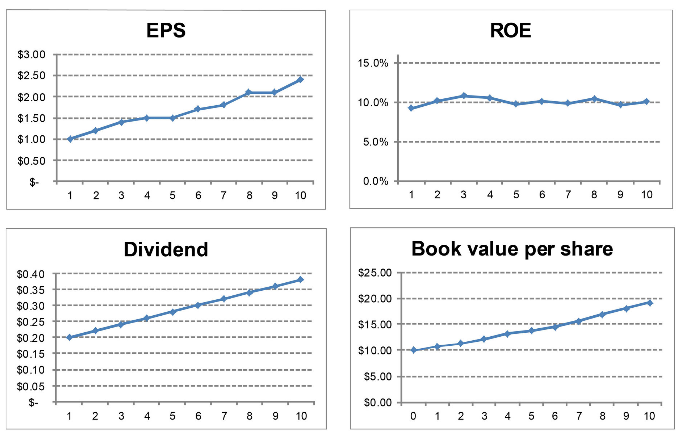

# value investing
- 
- circle of competence - "know what you know"
  - organize valuation components by reliability: most reliable -> least reliable
  - organize valuation components by underlying strategic assumption: no competitive advantage -> growing competitive advantage
- "The search for undervalued stocks should start with companies that are undesirable, such as those in bankruptcy or suffering from financial distress". Another way to think about is to focus on great company at fair price
- the problem with the present value method is that it is a terminal value calculation as of today, and it does not avoid the problems with terminal calculation (terminal value is the value of a company's cash flows projected beyond the end of year 10, when the cash flow grows perpetually at a constant proportional rate)
- reproduction cost of an asset is the most appropriate measure of its worth.
  - it requires going beyond the balance sheet and diving deeper into the footnotes to make adjustments to find undiscovered value
  - reproduction value looks at how much it will cost a competitor to purchase an asset required to run a competing company
  - [asset reproduction value analysis](https://www.oldschoolvalue.com/stock-valuation/how-to-asset-reproduction-value-analysis/)
- the second most reliable measure of a firm's intrinsic value is the value of its current earnings, properly adjusted. This value can be estimated with more certainty than future earnings or cash flows, and it is more relevant to today's values than are earnings in the past.
- earnings power value technique
  - the value of assets a competitor will be required to have in order to achieve the same market value of incumbent company in the industry
  - earnings power value calculated based on current financial status where the resulting intrinsic value ignores business cycles
  - growth is usually ignored in this valuation technique
  - [Earnings Power value (EPV) Stock valuation How-to](https://www.oldschoolvalue.com/stock-analysis/earnings-power-value-epv/)
  - As a note, Enron had great earnings all the way up to its collapse but FCF foretold the troubles long before the scandal surfaced.
- discounted cash flow
  - [DCF Stock valuation](https://www.oldschoolvalue.com/stock-valuation/how-value-stocks-dcf/)
  - 
  - 

# principles and rules of value investing
- the data and qualitative information from 10K and 10Q reports can be used to evaluate the following principles:
  - Vigilant leadership
  - long-term prospects
  - stock stability
  - buy at attractive prices
## vigilant leadership
- Sometimes, management focus more on optimizing their own pay rather than optimizing returns to the shareholders. In other cases, management may have the intention of maximizing the returns to the shareholders, but are taking high risks in doing so.
- many managers simply want to grow their "empire" with the shareholders' retained earnings.
### rule 1: low debt
- debt-to-equity (D/E) ratio = liabilities/equity
- A company's goal should be the flexibility to enter good projects at all times and withstand any challenges in the market. This is generally achieved when the company sustains a low debt-to-equity ratio of below 0.5
- Some industries are characterized by low debt-to-equity ratios; while banks, with a core product of debt, typically have higher ratios. You should therefore also consider industry standard for normal levels of debt.

### rule 2: high current ratio
- current ratio = current assets/current liabilities
- if a company always receives more cash than it pays out, the company can meet its short-term debt obligations at any time (typically current ratio between 1.5 and 2.5)
  - a low current ratio may mean that the company has problems meeting their short-term obligations, while higher current ratio may indicate bad money management due to an inability to collect payment from vendors.

### rule 3: strong and consistent return on equity
- return on equity = net income / shareholders' equity
- in general, you should look for companies that have had a consistent ROE of above 8% over the last 10 years. It tells you that the company is consistently making a decent profit with the earnings that management retains.
- look for a ROE that has been steady or even increasing over the last eight to ten years. This means that the company generally keep all or some of the capital for future investment and increases the equity.
- check the industry trend for comparison
- never be attracted to a high return while compromising security. In other words, manage risk first (i.e., D/E), then consider the remaining choices based on yield (i.e, ROE).
- By choosing a company with historical D/E of below 0.5, you will most likely end up with companies with lower ROE, but they will likely be more sustainable in the future.

### rule 4: appropriate management incentives
- compensation packages based on stock price performance gives management wrong incentives to act truthfully to protect the shareholders' interest.
- trustworthy companies and management teams disclose the structure of the compensation plans.
- managers should only be rewarded based on performance and long-term goals. You should look for long-term roadmaps with a variety of objectives to be obtained.

# Principle 2: a company must have long-term prospects
- value investors try to minimize taxes by owning outstanding businesses that remain stable over a lifetime.

## rule 1: persistent products
- invest in product that will not change in the next 30 years such as coke where it does not change due to technology.
- Warren Buffett's favorable holding period is forever.

## rule 2: minimize tax
- let your investment compound and grow for a long period of time before the government gets their share.
- short-term capital gains is usually higher than long term capital gain tax

# Principle 3: a company must be stable and understandable
- stay within your circle of competence to find companies that are stable and you can understand the fundamentals that drive the profit and the company's competitive edge.

## rule 1: stable book value growth from the owner's earnings
- [owner's earnings](https://www.oldschoolvalue.com/stock-valuation/what-is-owner-earnings/)
- it is extremely important to find a company that demonstrates a consistent earnings capacity, book value growth, and a stable and respectable ROE over numerous years, not just a few.
- if the company retains earnings (reflected in book value growth), there should be corresponding growth in future earnings (reflected in EPS growth)
- 
- [stable and understandable stock](https://www.buffettsbooks.com/how-to-invest-in-stocks/intermediate-course/lesson-20/)

## rule 2: sustainable competitive advantage (moat)
- the sustainable competitive advantage cannot be duplicated by competitors; hence the business will keep pouring money into the owners' pockets.
  - For example, Coca-Cola has a great moat due to its enormous brand value
  - Wal-Mart has a wide moat due to its cost structure where it can buy products with large volume from its suppliers at a cheaper price than its competitors.
- Sample moats from different industries
  - intangible assets such as brands and patents
    - Disney is a strong brand and almost everyone in the world recognizes it.
  - low cost
    - Wal-Mart can buy at quantities and prices that competitors can't match.
  - high switching costs ("stickiness")
    - most people will not bother with the hassle of changing operating system such as Microsoft, because they do not want to re-learn the new system.
# Principle 4: buy at attractive prices

## rule 1: keep a wide margin of safety to the intrinsic value
- 
- if a margin of safety is 30% on one stock, it may look tempting, but if you have the option to buy another great business (of equal risk) with a 50% discount, you would go for that one instead.

## rule 2: low price-earnings ratio
- P/E = market price for the company/Net Income
- P/E ratio is simply a current snapshot in time. it looks at the company's present performance in order to determine the value of its future performance. This is often a dangerous path if you fail to consider the other variables
- conservative investor looks for stocks with a P/E ratio below 15, or, in other words, the return should at the very least be 6.67% (which is 1/15) annually. She does not buy into hopes and dreams and she does not think she can spot the new Microsoft. Instead, she busy into a company that is already making a decent profit compared to the price she pays.

# Scope and Limits of Security Analysis
- common obstacles to analyst
  - inadequate or incorrect data
  - uncertainties of future
  - irrational behavior of the market
  - "in the short term the market is a voting machine, but in the long term it tracks value"
- 3 functions of analysis
  - **Descriptive function** 
    - collecting important facts and presenting them in an understandable manner. This would reveal:
      - reveal strong and weak points
      - make comparisons with similar issues
      - appraise for future performance
  - **Selective Function**
    - express specific judgement, by determining whether an issue should be bought, held, sold, etc.
    - common approach is to analyze company's ability to earn and make payments to the investor.
    - Intrinsic value is the estimated valuation based on the analyst's opinion of the intrinsic worth of the security from different source of information such as assets, earnings, dividends, growth, management, etc...
      - value of a business can be analyzed from the perspective of multiple earnings (P/E ratio, "earnings power"). It is cautioned that valuing a business solely from the earnings power is very risky and uncharacteristic of wise analyst.
  - **Critical Function**
    - "Analytical judgments are reached by applying standards to facts"
    - should seek adequate protective provisions (margin of safety) in bonds and preferred stocks.
    - must be alert to the misrepresentation by accountants and management bad practices.

# Themes of value investing

## Focusing on the differences between investing and speculating
  - failure to distinguish one from another has led to tragedies.
  - investments are bonds, outright purchases, permanent holding, for income, in safe securities.
  - speculations are stocks, purchases on margin, for a "quick turn", for profit, in risky issues.
  - specific standards have to be applied to give meaning to the term "safety"
  - an investment operation promises the safety of the principal and a satisfactory return. Operations not meeting these requirements are speculative.
  - an investment operation is one that can be justified on both qualitative and quantitative grounds.
  - investment is founded on the past and present, speculation relies on the future to improve.
  - for the investor, the future is to be guarded against rather than profit from.
  - for the speculator, he anticipates the future will be better than the past.
  - "intelligent speculation" is taking a measured risk that seems justified after analysis
  - "unintelligent speculation" is taking a risk without adequate examination of the situation
  - safety is measured in terms of the ability of the issuer to meet obligations
    - that ability should be assessed in terms of depression, not prosperity
  - lack of safety is not compensated by high dividends
  - Avoiding trouble is better than seeking protection after it occurs.
  - a sound investment must be able to withstand adversity. Enterprises that have withstood adversity may be favored by investors.
  - investment for profit, where growth is generally expected, the price is rarely reasonable.
  - the investor of small means may opt to step out of his role and become a speculator. He may also opt to regret his actions.
## Analysis skills
  - The term analysis indicates a scientific and methodical study of facts, which results in logical conclusions. But investment is not an exact science, and success derives in part from personal skills and chance.
  - analytical judgments are reached by applying standards to facts
  - analyst must preserve a sense of proportion, analyze what matters and ignore what trivial
truth seeker
- there are 3 types of variables used to rank stocks: fundamental, growth, and profitability.
- the most common variables used to select stocks are those that relate the price of the shares to some fundamental company information: share price to earnings, share price to cash flow, share price to book value, share price to sales, or share price to dividends.
## Intelligent investor
- defensive investor's portfolio should be well balanced, safe and very easy to manage.
  - look at the portfolio of well established investment funds (consider ray dalio's all weather portfolio, weird portfolio of deep value stock geek, etc...)
  - majority of portfolio should include index funds.
  - it typically consists of high-grade bonds, inflation protected bonds, large cap index fund, gold/silver index fund and common stocks
  - minority of portfolio (less than 10%) could be invested in common stocks (at least 10 different companies in different industries)
  - try to employ the services of an expert (once a year) to guide you to make the best investment decisions.
  - dollar-cost averaging, whereby you invest in a common stock every month or quarter and always with the same amount of money.
  - readjust your portfolio's division of common stocks, bonds, index funds, etc.... Ask yourself: are my stocks still profitable? is the ratio about the same as when I had initially invested? has the management done anything that lost my trust?
- enterprising investor
  - start similarly to defensive investors
  - invest more in common stocks, as they are more profitable (yet riskier)
  - enterprising investors should limit these stocks to a maximum of 10 percent of her overall portfolio. It is because Mr Market is too wild for any rational person to predict and placing the limits to protect our money in case of economic downturn or poor investment
  - continual research and monitoring of their portfolios is essential to maintain an incoming profit flow.
  - practice with virtual account for at least 1 year before trading in real accounts
  - buy in low markets and sell in high markets.
- it's extremely difficult to find a good financial professional who can guarantee you large returns on your money
- mutual funds, in which investments from many people are pooled, usually come with a high management fee. After subtracting the fee, you're often left with below-average returns.
  - professional money managers can't afford to perform lower than average for long periods because they keep need to keep their clients satisfied all the time. It's difficult to hold onto a strategy which might not work for months or years at a time, no matter how effective the strategy is in the long term. You can, though, All it takes is some patience to stock with it during the good and not-so-good times.
- index fund such as Standard & Poor's 500 Index is a mutual fund which aims to match the market's best performing companies, as opposed to trying to beat them. Since index fund fees are lower, and because on average the market performs well, index funds often provide you with very healthy profits.
- the stock market values of most companies swing drastically over short time periods for no rational reason.
- consider "earnings yield" and the "return on capital" when putting together your investment portfolio
  - combine both earnings yield and ROC into one single measure.
  - rank the companies based on Earnings Yield and ROC separately and then combine their scores by adding them the scores (ranks)
- earnings yield
  - tells you what the business earns in relation to its share price
  - calculated by finding the ratio of earnings before interests expenses and tax (EBIT), to enterprise value (EV). The EV is the market value plus the net interest-bearing debt.
- return on capital
  - calculated by dividing the after-tax profit by the book value of invested capital (total amount of money invested by the company's shareholders, bondholders, and so on)
  - reveals how effective a company is at transforming investment into profit.
- take the following pre-caution with your strategy:
  - apply the strategy when choosing stocks of large companies, not small ones. Smaller companies don't have much to offer in terms of shares, so even a slight increase in demand can force their share price up. You may therefore find it challenging to buy their shares at a reasonable price.
  - the strategies should include owning 20-30 large company stocks (in different industries) at a time. (I prefer to narrow the list less than 10, so I can read more about the companies and have a good reason why I want to buy the companies)
  - use tax laws intelligently to maximize your profit
    - sell stocks which lost value before one-year holding period ends, which would decreases your yearly income and thus the taxes you will need to pay.
    - sell the stocks which increase value after one-year holding period ends, which would reduce your tax on capital gains.
- buy stock only when its price is below its intrinsic value, its value as it relates to a company's propensity for growth. Furthermore, you believe there is a probable margin between what you pay and what you will earn as the company grows (margin of safety)
- principles
  - intelligent investors analyze the long-term development and business principles of the companies in which they're considering investing before buying any stock.
    - examining the company's financial history, structure, quality of its management and whether it pays steady dividends.
    - don't fall into the trap of only looking at short-term earnings.
    - this would give you a better idea of how well a company performs independent of its value on the market
  - protect against serious losses by diversifying the investments. (portfolio of 10-20 stocks in different industries)
  - understand that you don't pull in extraordinary profits, but safe and steady revenues.
  - the target for intelligent investor is to meet her personal needs, not to outperform the professional stockbrokers on Wall Street.
- understand the importance of stock-market history
  - economic crises, the unpredictability of the market means that investors need to be prepared - financially and psychologically to ensure that you can take a big hit and survive.
  - don't sell everything at the first sign of danger. Remember instead that, even after the most devastating crashes, the market will always recover.
  - the history of the market will give you a better idea of its stability. Once you've determined that the market is stable, focus on the history of the company in which you'd like to invest.
    - look at the correlation between stock price and the company's earnings and dividends over the past 10 years. Then consider the inflation rate, in order to see how much you'd really earn.
# investment philosophy
- focuses on individual companies, rather than macro-economic factors
- invests in companies with sustainable competitive advantages
- prefers becoming an expert on a few companies over major diversification
- bases his investment decisions on the operational performance of the underlying businesses
- holds on to stocks for an extremely long period
- minimizes risks by requiring a significant margin of safety before investing.
- sticks to the companies within the "circle of competence"
- contrarian, always going against the crowd and buying at the point of maximum pessimism.
- global investment approach: looks for interesting stocks in every country, but preferably countries with limited inflation, high economical growth, and a movement toward liberalization and privatization.
- prefers a concentrated portfolio with around 10-12 stocks
- be patience and keep an open-mind and a skeptical attitude towards conventional wisdom.
- first step is to look for stocks trading below 2/3rd of net current asset value (NCAV)
- prefers companies which pay dividends
- earnings should be growing
- price/earnings ratio should be lower than 15 over the past 3 years.
- avoid technical analysis
- emphasizes the importance of honest, able management, and shareholder friendly
- should not follow the masses, but instead have patience and think for yourself.
- asking questions to customers, employees, competitors, analysts, suppliers and management to find out more about the competitive position of a company and its management.
- only sells when a company starts experiencing issues with its business model, competitive positioning, or management.
- looks for low-risk, high-uncertainty opportunities with a significant upside potential.
- use value line investment survey to find attractive stocks.
- it is futile to predict interest rates and where the economy is heading
- formulates exactly why the stock should be bought before actually buying it.
- use several valuation methods simultaneously, since no method is perfect and it is impossible to precisely calculate the intrinsic value of a company.
- you should find out not only if an asset is undervalued, but also why it is undervalued.
- when it comes to shrewd trading, a knowledge of history is a fine weapon, so be sure to keep it sharp.
- don't trust the crowd or the market and follow practical investment based on your unique investment style.
- follow the investor that interests you such as Benjamin Graham, Warrent Buffet, Peter Lynch, John Templeton, etc...
  - follow the corporate insiders who run the companies (president, chairman, CEO, chief legal counsel, directors, board members who meet regularly with the officers, form 4 on details of the insider trades, etc...)
  - it's a good sign when insiders buy their own company shares
- criterias for growth/risky stock:
  - the company is a leader in cutting-edge technology that changes how we live
  - it has breakthrough products used by millions of customers around the world.
  - those products are protected by trademarks and patents
  - it has hundreds of millions, or even billions, of dollars in future safes and profits - not just expected but, ideally, contractually guaranteed
  - it's relatively undiscovered and trading for low price.
  - it's a good sign when insiders buy their own company shares
    - top level insider buying , directors, officers, chairmen board, c-level executives... Who are intimated acquainted with company financial health
    - total buys must exceed 100k and it's clister from mutiple top level insider 
- 6 factors that impact the investment portfolio:
  - the amount of money you save
  - the length of time you allow that money to compound
  - your portfolio's investment returns
  - the amount of expenses your portfolio absorbs
  - the amount of taxes you pay
  - your asset allocation
- Intrinsic value calculation
  - discount cash flow model can be found at
    - https://www.buffettsbooks.com/how-to-invest-in-stocks/advanced-course/lesson-35/
    - https://twitter.com/MnkeDaniel/status/1523721539392540672?t=MacAALagWmxhyXe3OEH1lQ&s=19 (need to be summarized)
  - fixed-income calculator adjusted for equities
    - https://www.buffettsbooks.com/how-to-invest-in-stocks/intermediate-course/lesson-21/
  - the intrinsic value of bonds
    - https://www.buffettsbooks.com/how-to-invest-in-stocks/intermediate-course/lesson-16/
  - the intrinsic value of callable preferred stock
    - https://www.buffettsbooks.com/how-to-invest-in-stocks/intermediate-course/lesson-23/

# Interpretation of Financial Statements
- [interpretation of financial statements summary](/financial-statement-analysis)

# Stock Hedging Strategies
## low correlation alternatives
## Volatility Index (Fear) against stock market crash
## options
# Quotes

"Be fearful when others are greedy and be greedy when others are fearful"

"If you're analyzing an unstable business, then your analysis might be worthless"

"In the short term the market is a voting machine, but in the long term it tracks value"

"A good rule of thumb is to limit the cost of your transaction to no more than 1 percent of the amount of stock you’re buying. For example if a trade costs $9.99 to execute you should buy at least $1,000 worth of stock."

"The best predictor of a mutual fund’s future investment return is not the number of Morningstar stars it receives, but how low its expense ratio is."

"Trying to beat the market is a fool’s errand."

"We want the business to be one (a) that we understand; (b) with favorable long-term prospects; (c) operated by honest and competent people; (d) available at a very attractive price."

"price is what you pay, value is what you get"

once you adopt a value-investment strategy, any other investment behavior starts to seem like gambling.

the key to life is to figure out who to be the batboy for.

# References
- https://medium.com/@peter.simon419/value-investing-from-graham-to-buffett-and-beyond-by-greenwald-notes-d2c97d014ee5#:~:text=Value%20investors%20believe%20that%20financial,significantly%20from%20this%20intrinsic%20value.
- https://prasadcapital.com/2013/03/25/book-summary-value-investing-from-graham-to-buffett-and-beyond/
- [Global Value](./global-value.pdf)
- [Invest with the House](./Invest-with-the-House.pdf)
- https://www.portfolioeinstein.com/meb-faber-portfolios-backed-by-solid-research/
- https://milliondollarjourney.com/stock-hedging-strategies.htm
- https://www.getstoryshots.com/books/the-intelligent-investor-summary/#:~:text=margin%20of%20safety.-,Introduction,speculations%20(based%20on%20predictions).
- https://milliondollarjourney.com/options-trading-buying-and-selling-calls-puts-for-hedging-profit.htm
- https://www.youtube.com/playlist?list=PLI84Sf0aDgaxGozvfNAKLonKIoD-sDeDp
- https://diggingforvalue.com/book-summary/security-analysis/
- https://www.buffettsbooks.com/how-to-invest-in-stocks/intermediate-course/
- [Thinking in systems](Thinking in Systems)
- https://www.youtube.com/watch?v=WMdnaRQ4EOE&list=PLI84Sf0aDgayIYZFsvStDXGOwy2pLgYW3&ab_channel=TheSwedishInvestor
- https://www.youtube.com/watch?v=npoyc_X5zO8&list=PLI84Sf0aDgazJz6aVmUAYwfmCkTDd_cqv&ab_channel=TheSwedishInvestor
- https://www.youtube.com/watch?v=WMdnaRQ4EOE&list=PLI84Sf0aDgayIYZFsvStDXGOwy2pLgYW3&ab_channel=TheSwedishInvestor
- https://www.youtube.com/playlist?list=PLI84Sf0aDgaxGozvfNAKLonKIoD-sDeDp