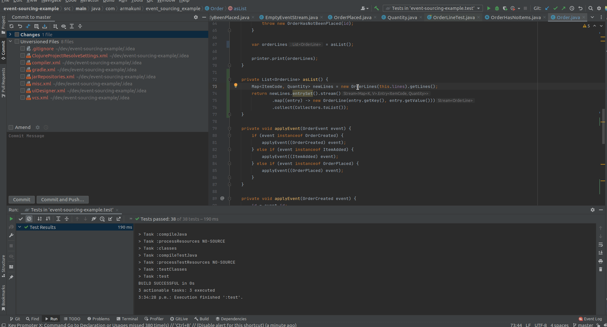
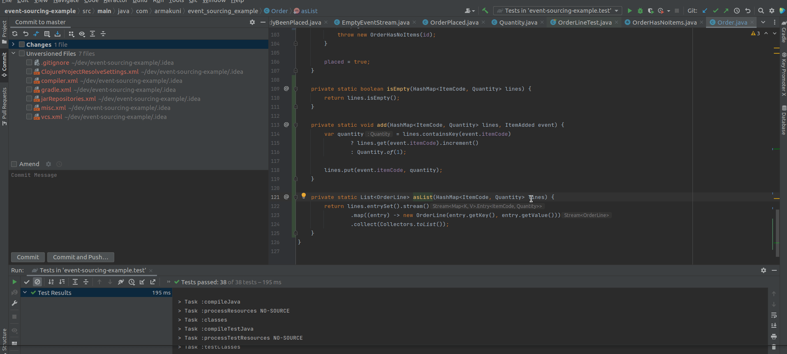
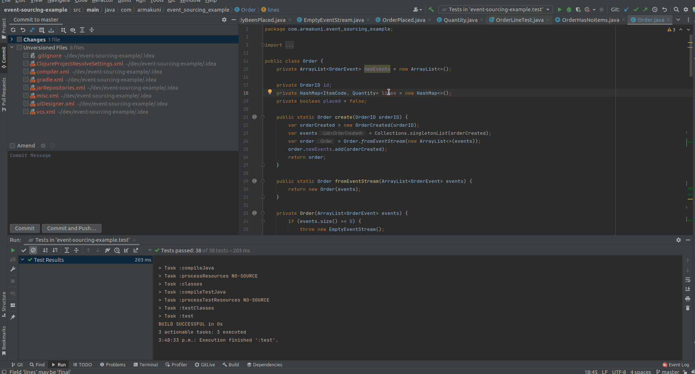
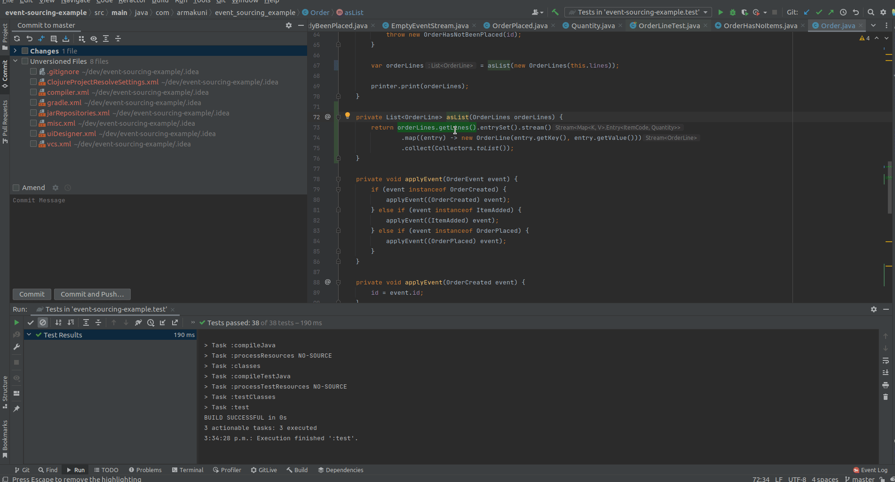
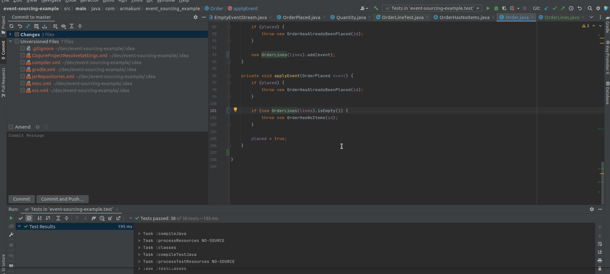

I have been organizing coderetreat and creating screencasts on refactoring and TDD, etc… however, I find it takes lots of time and effort to organize, preparing and facilitate. (it’s not that I complain about it as a matter of fact I love it every single second and I’m amazed at how much I have learned from the community)

I have been asking myself, what’s the simpler way for me to learn to refactor and share with others? (why refactor, you may ask? it’s because it’s my favourite topic in the long never-ending list of agile technical practices) and for some reason, I really like to share my boring meme jokes, so I guess why not share a list of animated gifs of refactoring and the motivation of it.

I guess since I’m an Asian guy (hopefully some kind of descendants from Bruce Lee) so this saying is pretty cool to me:
**“I fear not the man who has practiced 10,000 different kicks once, but I fear the man who has practiced one kick 10,000 times.”**

Another way to look at it, from [J.B Rainsberger](https://twitter.com/jbrains), "I can see one large issue: programmers do not allow the various refactoring patterns to become so easy/comfortable that their fingers can **execute them without conscious thought. This interferes with their progress because they have to switch more often among the questions "which refactorings will improve this design?" and "how do I perform this micro-step?"** if they don't become able to perform the micro-steps (a sequence of 3-7 nano steps) easily, they might not breakthrough from "I know how to safely lead the design where I want it to go" to the more powerful **"I can just start removing duplication and improving names and a good design will emerge"**

Don't get me wrong: the first of these 2 outcomes are good, but the second of these two outcomes is much better.

One of the consequences, of never breaking through is that the programmer **will miss out on finding helpful designs that are simpler than the ones that their intuition can see."** Damn, I can smell/see big FOMO emotions running through me now!!!

and as a matter of fact, there are so many moves in refactoring, so I’m curious if I could just distill most of the refactoring moves in under 10 moves (like there’s are 10 basic numbers).

so the game plan for this article is to post as many refactoring moves/snippets as possible but then distill them and reduce them to under **10 refactoring snippets**.

Please feel free to copy this and make your own top 10 moves, I would be definitely interested in seeing a different list of top 10 refactoring moves so I can improve my list better.

Here goes the list

# Extract Method
## Motivation

- separate the intention and implementation
- put a name to the block of code (“Naming as a Process” from Arlo)

# Rename method, classes, fields
Motivation
- Easy to read code start with good naming and naming is hard
- “Naming as a process” provides a good heuristic for naming but it’s too freaking long.

- I find this short, simple and easier to remember from J.B. Rainsberger

# tag as a process
- small reversible steps creates safety net when refactoring and make it easier to reverse when bugs are introduced
- communicate the risks of the commits
- make it easier for people to follow the commits by expression the intent of the commits and ensure one commit is doing one thing
- 
# Golden Master
## Motivation
- Provide safety nets for doing refactoring by leveraging Standard IO
- It’s a quick way to provide test coverage without knowing much about the underlying code
- It would probably be more tedious to mock out external/IO/Database call in the code.

# Extract as a separate map
## Motivation
- reduce responsibility in lambda, which forces creating interface/lambda with a single responsibility

# Introduce parameters
## Motivation
- enable a deeper understanding of the domain model in the code through new abstractions
- enable more refactorings with capture the common behaviours over these new abstractions

# Introduce indirection steps to avoid big steps
## Motivation
- to avoid breaking all existing clients when introducing new fields, new classes, etc...
## Steps for approach 1
- create a warm, dry place where the code can be changed and disrupt client less
- focus on changes inside the warm, dry place
- publish the changes when they're ready, which often means inlining the warm, dry place (put it back where it was) or inlining the clients of the warm, dry place (the new code replaces some older code)

## Steps for approach 2 (introduce parameter object)
- https://www.youtube.com/watch?v=hGkdDxYCCKY&ab_channel=tomphp
- intellij refactorings: extract methods, make method static, introduce parameter object, convert static to instance methods, introduce the field

## Steps for approach 3 (adding the wrapper)
- extract a function that takes the primitive value f(p)
- introduce parameter object to wrap p into wrapper w, so that now we have f(w)
- move f() onto class W. (What's left is moving any behaviour that asks for w.getP() onto W)
- for all remaining function g(p) put in the line w = new W(p) and then migrate all the internals from p to w.p (or w.getP() or whatever you call it)
- extract parameter on new W(p), so that g now takes a w instead of p
move g() onto W
- intellij refactorings: extract methods, wrap-unwrap (introduce indirection), introduce parameter, move method to another instance, introduce the field

## Steps for approach 4 (liberating the wrapped)
- extract all the functions of p that you want.
- promote p to a field on the current class
extract delegate to class W, creating a new class that as p as a field, leaving behind this.w = new W(p)
- clean up
- intellij refactorings: extract methods, extract delegate

### Snippets
- introduce parameter object
  - 

- make method static
  - 

- extract delegate
  - 

- wrap-unwrap value (introduce another layer of indirection)
  - 

- move method to another instance
  - 

- introduce field
  - 

**…still under construction and more to come on the list**

# References
- Arlo Belshee, “Naming as a process”, https://www.digdeeproots.com/articles/on/naming-process/
- J.B. Rainsberger, “a model for improving names”, https://blog.thecodewhisperer.com/permalink/a-model-for-improving-names
- Tony Vo, “Sudoku Refactoring”, https://ttrungvo.medium.com/sudoku-refactoring-kata-56f184b1b081
