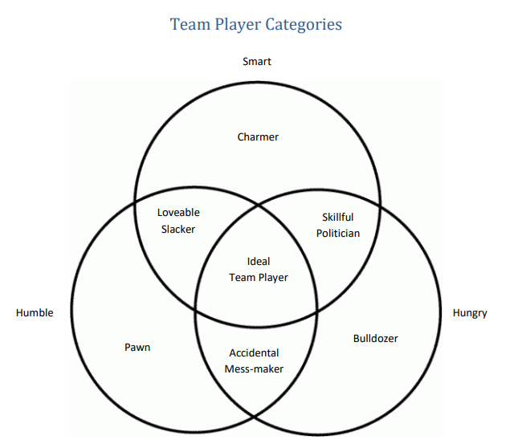

# take-aways

- “The most important decisions that business people make are not what decisions, but who decisions.” – Jim Collins, author of Good to Great
  - What refers to the strategies you choose, the products and services you sell, and the processes you use.
  - Who refers to the people you put in place to make the what decisions. Who is running your sales force? Who is assembling your product? Who is occupying the corner office? Who is where the magic begins, or where the problems start.
  - The authors talked with and listened to many of the world’s most talented leaders as they taught their secrets to hiring success. More than twenty business billionaires, most of them self-made, contributed their insights and experiences to this book, an unprecedented assemblage.
  - Out of a mountain of research, they have identified four parts of the hiring process where failure typically occurs.
  - Who mistakes happen when managers:
    - 1. Are unclear about what is needed in a job 
    - 2. Have a weak flow of candidates
    - 3. Do not trust their ability to pick out the right candidate from a group of similar-looking candidates
    - 4. Lose candidates they really want to join their team
  - These Who mistakes are pricey. The average hiring mistake costs fifteen times an employee’s base salary in hard costs and productivity loss.
  - What most managers do not know is that Who problems are preventable.

# Your #1 problem
- The method the authors share will do the due diligence for you. It lets you focus on the individual candidates without losing sight of the goals and values of your organization.
- Before their method can work to its optimal level, though, chances are you might have to break some bad hiring habits of your own.

- **The top ten Voodoo Hiring techniques are:**
  - 1. The Art Critic: Forgers can pass off fake paintings as real ones to the time-pressed buyer, and people who want a job badly enough can fake an interview if it lasts only a few minutes. Gut instinct is terribly inaccurate when it comes to hiring someone.
  - 2. The Sponge: A common approach among busy managers is to let everybody interview a candidate to get as much info as possible.
  - 3. The prosecutor: Managers aggressively question candidates, attempting to trip them up with trick questions and logics problems. You may find someone knowledgeable that way but knowledge and the ability to do the job are not the same thing.
  - 4. The Suitor: Suitors are more concerned with impressing candidates than assessing their capabilities. They spend all of their time in an interview talking and virtually no time listening.
  - 5. The Trickster: the interviewers who use gimmicks to test for certain behaviors.
  - 6. The Animal Lover: Asking what type of animal would you be – there is no scientific basis or relevance.
  - 7. The Chatterbox: Although enjoyable, this method does nothing to help you make a good decision.
  - 8. The Psychological and Personality Tester: These types of tests are not recommended as they are not predictive of success on the job.
  - 9. The Aptitude Tester: They can help determine whether the candidate has the right aptitude for the job but they should never be the sole determinant in a hiring decision.
  - 10.  The Fortune Teller: Some interviewers like to ask their candidates to look into the future regarding the job at hand by asking hypothetical questions:
  - At the bottom line, all these voodoo hiring methods share an assumption that it’s easy to assess a person.

- **What is an A Player?**
  - Think of an A Player as the right superstar, a talented person who can do the job you need done, while fitting in with the culture of your company. An A Player is defined this way: a candidate who has at least a 90 percent chance of achieving a set of outcomes that only the top 10 percent of possible candidates could achieve.
  - Hiring A Players takes hard work. As we’ll see, it’s not always for the faint of heart. You have to dig hard, ask tough questions, and be prepared sometimes for disturbing answers.
  - In business, you are who you hire. Hire C Players, and you will always lose to the competition. Hire B Players, and you might do okay, but you will never break out. Hire A Players, and life gets very interesting no matter what you are pursuing.

- **How do you get an A team?**
  - The A Method defines a simple process for identifying and hiring A Players with a high degree of success. It helps you get the Who right.
  - There are four steps:
    - 1. Scorecard. The scorecard is a document that describes exactly what you want a person to accomplish in a role. It is not a job description, but rather a set of outcomes and competencies that define a job done well. By defining A performance for a role, the scorecard gives you a clear picture of what the person you seek needs to be able to accomplish.
    - 2. Source. Finding great people is getting harder, but it is not impossible. Systematic sourcing before you have slots to fill ensures you have high-quality candidates waiting when you need them.
    - 3. Select. Selecting talent in the A Method involves a series of structured interviews that allow you to gather the relevant facts about a person so you can rate your scorecard and make an informed hiring decision. These structured interviews break the voodoo hiring spell.
    - 4. Sell. Once you identify people you want on your team through selection, you need to persuade them to join. Selling the right way ensures you avoid the biggest pitfalls that cause the very people you want the most to take their talents elsewhere. It also protects you from the biggest heartbreak of all— losing the perfect candidate at the eleventh hour.

# Scorecard: A Blueprint for Success

- Scorecards describe the mission for the position, outcomes that must be accomplished, and competencies that fit with both the culture of the company and the role.
- The first failure point of hiring is not being crystal clear about what you really want the person you hire to accomplish.

- **Mission: The Essence of the Job**
  - The mission is an executive summary of the job’s core purpose. It boils the job down to its essence so everybody understands why you need to hire someone into the slot.
  - For a mission to be meaningful, it has to be written in plain language.
  - Don’t Hire the Generalist. Hire the Specialist. Mission statements help you avoid one of the most common hiring traps: hiring the all-around athlete.
  - A final caution about mission. You can’t just pull a mission off the shelf and dust it off whenever the position needs refilling.

- **Outcomes: Defining What Must Get Done**
  - Outcomes, the second part of a scorecard, describe what a person needs to accomplish in a role. Most of the jobs for which we hire have three to eight outcomes, ranked by order of importance.
  - An A Player will be able to accomplish the desired outcome, and a B or C Player won’t. Outcomes are that clear, and because they are, they cull the pool of possible candidates right from the start.
  - While typical job descriptions break down because they focus on activities, or a list of things a person will be doing (calling on customers, selling), scorecards succeed because they focus on outcomes, or what a person must get done (grow revenue from $ 25 million to $ 50 million by the end of year three).
  - Not all jobs allow you to quantify the outcome so easily. In these cases, seek to make the outcomes as objective and observable as possible.

- **Competencies: Ensuring Behavioral Fit**

  - Competencies flow directly from the first two elements of the scorecard. The mission defines the essence of the job to a high degree of specificity. Outcomes describe what must be accomplished.
  - Competencies define how you expect a new hire to operate in the fulfillment of the job and the achievement of the outcomes.

- **Critical Competencies for A Players**
  - *Efficiency*. Able to produce significant output with minimal wasted effort.
  - *Honesty/integrity*. Does not cut corners ethically. Earns trust and maintains confidences. Does what is right, not just what is politically expedient. Speaks plainly and truthfully.
  - Organization and planning. Plans, organizes, schedules, and budgets in an efficient, productive manner. Focuses on key priorities.
  - Aggressiveness. Moves quickly and takes a forceful stand without being overly abrasive.
  - Follow-through on commitments. Lives up to verbal and written agreements, regardless of personal cost.
  - Intelligence. Learns quickly. Demonstrates ability to quickly and proficiently understand and absorb new information.
  - Analytical skills. Able to structure and process qualitative or quantitative data and draw insightful conclusions from it. Exhibits a probing mind and achieves penetrating insights.
  - Attention to detail. Does not let important details slip through the cracks or derail a project.
  - Persistence. Demonstrates tenacity and willingness to go the distance to get something done.
  - Proactivity. Acts without being told what to do. Brings new ideas to the company.
  - Ability to hire A Players (for managers). Sources, selects, and sells A Players to join a company.
  - Ability to develop people (for managers). Coaches people in their current roles to improve performance, and prepare them for future roles.
  - Flexibility/adaptability. Adjusts quickly to changing priorities and conditions. Copes effectively with complexity and change.
  - Calm under pressure. Maintains stable performance when under heavy pressure or stress.
  - Strategic thinking/ visioning. Able to see and communicate the big picture in an inspiring way. Determines opportunities and threats through comprehensive analysis of current and future trends.
  - Creativity/innovation. Generates new and innovative approaches to problems.
  - Enthusiasm. Exhibits passion and excitement over work. Has a can-do attitude.
  - Work ethic. Possesses a strong willingness to work hard and sometimes long hours to get the job done. Has a track record of working hard.
  - High standards. Expects personal performance and team performance to be nothing short of the best.
  - Listening skills. Lets others speak and seeks to understand their viewpoints.
  - Openness to criticism and ideas. Often solicits feedback and reacts calmly to criticism or negative feedback.
  - Communication. Speaks and writes clearly and articulately without being overly verbose or talkative. Maintains this standard in all forms of written communication, including e-mail. 
  - Teamwork. Reaches out to peers and cooperates with supervisors to establish an overall collaborative working relationship.
  - Persuasion. Able to convince others to pursue a course of action.

- **Cultural Competencies: Ensuring Organizational Fit**
  - Competencies work at two levels. They define the skills and behaviors required for a job, and they reflect the broader demands of your organizational culture. Job competencies are generally easier to list, but cultural fit is just as important.
  - Evaluating culture sometimes means removing people who are not a fit.
  - Culture fits- or misfits – inevitably affect the bottom line, but they are about much more than money.
  - Scorecards are the guardians of your culture. They encapsulate on paper the unwritten dynamics that make your company what it is, and they ensure you think about those things with every hiring decision.

- **From Scorecard to Strategy**
  - The beauty of scorecards is that they are not just documents used in hiring. They become the blueprint that links the theory of strategy to the reality of execution. Scorecards translate your business plans into role-by-role outcomes and create alignment among your team, and they unify your culture and ensure people understand your expectations.
  - Properly constructed and used, scorecards spread strategy through every aspect of your organizational life. Scorecards:
    - Set expectations with new hires
    - Monitor employee progress over time
    - Objectify your annual review system
    - Allow you to rate your team annually as part of a talent review process.

# The Three Virtues

- **Humble**
  - “Great team players lack excessive ego or concerns about status. They are quick to point out the contributions of others and slow to seek attention for their own. They share credit, emphasize team over self, and define success collectively rather than individually. It is no great surprise,then, that humility is the single greatest and most indispensable attribute of being a team player.”
  - Some leaders see arrogance in an employee and don’t confront it, often citing that person’s individual contributions as an excuse.
  - Two types of people that lack humility
    - Overly arrogant people – boast and soak up attention
    - Those who lack self-confidence – they downplay their own worth (which looks like humility); from C.S. Lewis, “Humility isn’t thinking less of yourself, but thinking of yourself less.”

- **Hungry**
  - “Hungry people are always looking for more. More things to do. More to learn. More responsibility to take on. Hungry people almost never have to be pushed by a manager to work harder because they are self-motivated and diligent. They are constantly thinking about the next step and the next opportunity. And they loathe the idea that they might be slackers.”
  - The hunger needs to be healthy (manageable and sustainable commitment, and going above and beyond when required), otherwise it dominates your life.
  - Job candidates can falsely appear hungry during standard interviews to impress others. 

- **Smart**
  - “…not about intellectual capacity. In the context of a team, smart simply refers to a person’s common sense about people. It has everything to do with the ability to be interpersonally appropriate and aware. Smart people tend to know what is happening in a group situation and how to deal with others in the most effective way. They ask good questions, listen to what others are saying, and stay engaged in conversations intently.”

- These virtues are not permanent characteristics; they are maintained and developed through life experiences and personal choices. When team members are strong in these three areas, they enable teamwork by making it relatively easy for members to overcome the absence of trust, fear of conflict, lack of commitment, avoidance of accountability, and inattention to results. People without all three require significantly more time, attention, and patience from their managers.

## team player categories

- 

No virtues
These individuals likely don’t get past an initial interview.
One virtue
 Humble only: The Pawn – pleasant, but don’t have the drive to get things done or build effective
relationships. They survive on teams that value harmony over performance.
 Hungry only: The Bulldozer – determined to get things done, but focused on themselves and
with little concern for others. They survive on teams the place a premium on results alone.
 Smart only: The Charmer – entertaining and likable, but have no interest in their colleagues or
the team’s well-being. They survive in situations where their social skills sway others.

Two virtues
 Humble/Hungry: The Accidental Mess-maker – their lack of understanding of how their actions
and words are received leads to interpersonal problems. This is the least dangerous, as there are
no bad intentions and these individuals usually take corrective feedback easily.
 Humble/Smart: The Loveable Slacker – only do what’s asked. Because they’re personable,
leaders often avoid confronting or removing them.
 Hungry/Smart: The Skillful Politician – they work hard, but only if it benefits them. They are
adept at portraying themselves as humble, so managers may pick up on the damage after it’s
too late.
The aforementioned classifications apply to people who are significantly lacking in a particular area (or
areas). Each of the three virtues is a spectrum.
Application
The following are guidelines; there are no “silver bullets” for any of these areas.
Hiring
 Interview Process
o Don’t be generic – focus on behaviors that are smart, humble, and hungry
o Debrief each interview as a team – have one interviewer debrief the next so he/she can
cover new ground or dig deeper
o Consider group interviews – some people are different one-on-one than in a group
o Make interviews non-traditional – have them accompany you on an errand to see how
they behave in an atypical setting
o Ask questions more than once – this is helpful especially if you didn’t get a satisfactory
answer
o Ask what others would say – “How would your colleagues describe your work ethic?”
o Ask candidates to do some real work – how do they perform in situations like what
they’ll be doing if hired?
o Don’t ignore hunches – you can’t have complete confidence, but explore nagging
doubts about humility, hunger, and smarts
o Scare people with sincerity – tell them if they’re not hungry, smart, and humble they
will dislike working for your company
 Interview Questions
o Humble
 Tell me about the most important accomplishments of your career (look for I vs
we)
 What was the most embarrassing moment in your career? Or the biggest
failure?
 How did you handle it?
 What is your greatest weakness? (What would you change about yourself?)
 How do you handle apologies, giving or accepting?

Tell me about someone who is better than you in an area of interest
o Hungry
 What’s the hardest you’ve ever worked on something?
 What do you like to do when not at work?
 Did you work hard when you were a teenager?
 What kinds of hours do you work?
o Smart
 How would you describe your personality?
 What do you do that others may find annoying?
 What kind of people annoy you the most? How do you handle it?
 Describe a time you demonstrated empathy with a teammate
 Candidate References
o Put the reference provider at ease – the reference isn’t going to tank the candidate; go
beyond good/bad employee; would they thrive at your company?
o Look for specifics – ask for adjectives that describe the candidate
o Focus on areas of doubt – look for specifics here
o Pay attention to references that don’t respond – references that aren’t enthusiastic
may not want to speak up
o Ask what others would say about them
Assessing Current Employees
There are three outcomes:
1. Confirming the employee is a team player
2. Helping the employee improve to become one
3. Deciding to move the employee out
Assessing people can help you figure out what he/she needs to work on. As a manager, if you can’t
decide if an employee has the will or ability to improve, keep working (i.e., err on the side of caution). If
you know for sure, have the courage to act.
Manager assessment of others (looking for yeses)
 Humble
o Does he genuinely compliment/praise teammates without hesitation?
o Does she easily admit when she makes a mistake?
o Is he willing to take on lower-level work for the good of the team?
o Does she gladly share credit for team accomplishments?
o Does he readily acknowledge his weaknesses?
o Does she offer and receive apologies graciously?
 Hungry
o Does he do more than what is required in his own job?
o Does she have passion for the “mission” of the team?

Does he feel a sense of personal responsibility for the overall success of the team?
o Is she willing to contribute to and think about work outside of office hours?
o Does she look for opportunities to contribute outside her area of responsibility?
o Is he willing and eager to take on tedious and challenging tasks whenever necessary?
 Smart
o Does he seem to know what teammates are feeling during meetings and interactions?
o Does she show empathy to others on the team?
o Does he demonstrate an interest in the lives of teammates?
o Is she an attentive listener?
o Is he aware of how his words and actions impact others on the team?
o Is she good at adjusting her behavior and style to fit the nature of a conversation?
Employee self-assessment (remind them this is about improvement, not punishment; value honesty)
Scale: 3 = Usually, 2 = Sometimes, 1 = Rarely
Humble
My teammates would say:
__ I compliment or praise them without hesitation.
__ I easily admit to my mistakes.
__ I am willing to take on lower-level work for the good of the team.
__ I gladly share credit for team accomplishments.
__ I readily acknowledge my weaknesses.
__ I offer and receive apologies graciously.
____ TOTAL
Hungry
My teammates would say:
__ I do more than what is required in my own job.
__ I have passion for the “mission” of the team.
__ I feel a sense of personal responsibility for the overall success of the team.
__ I’m willing to contribute to and think about work outside of office hours.
__ I look for opportunities to contribute outside my area of responsibility.

__ I’m willing and eager to take on tedious and challenging tasks whenever necessary.
____ TOTAL
Smart
My teammates would say:
__ I seem to know what teammates are feeling during meetings and interactions.
__ I show empathy to others on the team.
__ I demonstrate an interest in the lives of teammates.
__ I’m an attentive listener.
__ I’m aware of how my words and actions impact others on the team.
__ I’m good at adjusting my behavior and style to fit the nature of a conversation.
(An alternative, less intrusive approach for self-assessment is to have the person rank the virtues from
strongest to weakest.)
Developing employees who are lacking in one or more virtues
Managers need to keep reminding people when they need improvement. It’s easy to stop doing so
because it’s uncomfortable to not see progress.
Ideal team players need development, too. This comes in the form of coaches from others who are
stronger in certain areas.
Developing humility
 Identify the root causes of the insecurity
 Exposure therapy (i.e., they practice the very behaviors they struggle with)
 Leader modeling
Developing hunger
 “Plenty of people who lack hunger would like nothing more than to be fully engaged and more
productive in their work.”
 Connect the person to the importance of the work being done; find passion for the mission and
the team
 Set clear expectations; set targets/goals, and also clarify the behaviors you want from them
 Don’t wait too long to give feedback
 Praise publicly for work on this virtue
 Leader modeling

Developing smarts
 Be brutally honest (e.g., “Bob, this is the part of the meeting where you thank Karen for helping
you” or “I’m saying this because I want you to know… I’m kind of upset about my family
situation and was hoping you’d acknowledge that.”)
Embedding the model into an organization’s culture
 Be explicit and bold – leaders should tell (in an appropriate way) everyone they interact with
they expect humility, hunger, and smarts. Don’t be cheesy about it, but be serious enough to
put it out there with confidence and integrity.
 Catch and revere – the point of praise is not only to reinforce the behavior in someone, but also
to reinforce it in everyone else. “Hey, that’s a fantastic example of hunger. We can all try to be
more like that.”
 Detect and address – if you see behavior that violates the values, let the person know they’re
out of line; be tactful and use good judgment

# Source: Generating a Flow of A Players
- Talent pools rarely contain the most vital and energetic candidates,
- Of all the ways to source candidates, the number one method is to ask for referrals from your personal and professional networks. It is the single most effective way to find potential A players.

- **How to Source**

  - 1. Referrals from Your Professional and Personal Networks. Create a list of the ten most talented people you know and commit to speaking with at least one of them per week for the next ten weeks. At the end of each conversation, ask, “Who are the most talented people you know?” Continue to build your list and continue to talk with at least one person per week.
  - 2. Referrals from Your Employees. Add sourcing as an outcome on every scorecard for your team. For example, “Source five A Players per year who pass our phone screen.” Encourage your employees to ask people in their networks, “Who are the most talented people you know whom we should hire?” Offer a referral bonus.
  - 3. Deputizing Friends of the Firm. Consider offering a referral bounty to select friends of the firm. It could be as inexpensive as a gift certificate or as expensive as a significant cash bonus.
  - 4. Hiring Recruiters. Use the method described in this book to identity and hire A Player recruiters. Build a scorecard for your recruiting needs, and hold the recruiters you hire accountable for the items on that scorecard. Invest time to ensure the recruiters understand your business and culture.
  - 5. Hiring Researchers. Identify recruiting researchers whom you can hire on contract, using a scorecard to specify your requirements. Ensure they understand your business and culture. 
  - 6. Sourcing Systems. Create a system that (1) captures the names and contact information on everybody you source and (2) schedules weekly time on your calendar to follow up. Your solution can be as simple as a spreadsheet or as complex as a candidate tracking system integrated with your calendar.
  - The final step in the sourcing process, the one that matters more than anything else you can do, is scheduling thirty minutes on your calendar every week to identify and nurture A Players.

# Select: The Four Interviews for Spotting A Players

- According to the four thousand studies and meta-analyses examined, traditional interviewing is simply not predictive of job performance.
- To be a great interviewer, you must get out of the habit of passively witnessing how somebody acts during an interview. That puts you back in the realm of voodoo hiring methods, where you end up basing your decision on how somebody acts during a few minutes of a certain day. The time span is too limited to reliably predict anything useful.
- Instead, the four interviews use the time to collect facts and data about somebody’s performance track record that spans decades. The four interviews are:
- **The screening interview**
  - The screening interview is a short, phone-based interview designed to clear out B and C Players from your roster of candidates. The goal here is to save time by eliminating people who are inappropriate for the position as quickly as possible. We recommend that you conduct the screening interview by phone and that you take no more than thirty minutes.
  - As with all the interviews we present with the A Method, we advocate a structured approach to screening interviews. This means following a common set of questions every time you screen somebody. The commonality fosters consistency and accelerates your ability to discern differences between candidates.

- **Screening Interview Guide:**
  - 1. What are your career goals? You want to hear the candidate speak with passion and energy about topics that are aligned with the role.
  - 2. What are you really good at professionally? We suggest you push candidates to tell you eight to twelve positives so you can build a complete picture of their professional aptitude.
  - 3. What are you not good at or not interested in doing professionally? Your balance sheet on a candidate will be incomplete if you can’t identify at least five to eight areas where a person falls short, lacks interest, or doesn’t want to operate.
  - 4. Who were your last five bosses, and how will they each rate your performance on a 1-10 scale when we talk to them? You are looking for lots of 8’s, 9’s, and 10’s in the ratings. Consider 7’s neutral; 6’s and below are actually bad. We have found that people who give themselves a rating of 6 or lower are really saying 2.
  - Review the scorecard before the call to refresh your memory. Then begin the call by setting expectations, saying something like this: “I am really looking forward to our time together. Here’s what I’d like to do. I’d like to spend the first twenty minutes of our call getting to know you. After that, I am happy to answer any questions you have so you can get to know us. Sound good?”
  - Only invite in those whose profile appears to be a strong match for your scorecard.
  - After a candidate answers one of the primary questions above, get curious about the answer by asking a follow-up question that begins with “What,” “How,” or “Tell me more.” Keep using this framework until you are clear about what the person is really saying.
  - The whole point of the screening interview is to weed people out as quickly as possible.

- **The Who Interview ®:**
  - The power of patterns for choosing Who Screening interviews separate the wheat from the chaff, but they are not precise enough to ensure a 90 percent or better hiring success rate.
  - The Who Interview is the key interview within the “Select” step of the ghSMART A Method for Hiring. It goes a long way toward giving you confidence in your selection because it uncovers the patterns of somebody’s career history, which you can match to your scorecard.
  - What is the Who Interview? It’s a chronological walk-through of a person’s career. You begin by asking about the highs and lows of a person’s educational experience to gain insight into his or her background. Then you ask five simple questions, for each job in the past fifteen years, beginning with the earliest and working your way forward to the present day.

- **Who Interview Guide:**
  - 1. What were you hired to do?
  - 2. What accomplishments are you most proud of? A players tend to talk about outcomes linked to expectations. B and C players talk generally about events, people they met, or aspects of the job they liked without ever getting into results.
  - 3. What were some low points during that job? Reframe the question over and over until the candidate gets the message.
  - 4. Who were the people you worked with? Specifically:
    - a. What was your boss’s name, and how do you spell that? What was it like working with him/her? What will he/she tell me were your biggest strengths and areas for improvement?
    - b. How would you rate the team you inherited on an A, B. C scale? What changes did you make? Did you hire anybody? Fire anybody? How would you rate the team when you left on an A, B, C scale?

  - 5. Why did you leave that job?
  
  - To put the Who Interview into practice, divide a person’s career “story” into the equivalent of “chapters.” Each chapter could be a single job, or a group of jobs that span three to five years.
  - Conduct the Who Interview with a colleague— perhaps someone from HR, another manager or member of your team.
  - This tandem approach makes it easier to run the interview. One person can ask the questions while the other takes notes, or you can both do a little of each. Either way, two heads are always better than one.
  - Kick off the interview by setting expectations. Candidates are likely to feel a bit anxious because you will have told them that this interview is going to be different from what they have done in the past, but they won’t quite know how it will be different.
  - Setting expectations will put the candidate at ease and enable you to launch into the first chapter of his or her career with minimal confusion or intimidation.
  - **Five master tactics** make the interview as easy and effective as possible.
    - Master Tactic #1: Interrupting, You have to interrupt the candidate. There is no avoiding it. You have to interrupt the candidate. The good way to interrupt somebody is to smile broadly, match their enthusiasm level, and use reflective listening to get them to stop talking without demoralizing them. The shut-you-up approach really deflates the candidate’s willingness to reveal information to you. It is through maintaining very high rapport that you get the most valuable data, and polite interrupting can build that rapport.
    - Master Tactic #2: The Three P’s – questions are:
      - 1. How did your performance compare to the previous year’s performance?
      - 2. How did your performance compare to the plan? (
      - 3. How did your performance compare to that of peers?
    - Master Tactic #3: Push Versus Pull: Do not hire anybody who has been pushed out of 20 percent or more of their jobs.
    - Master Tactic #4: Painting a Picture: You’ll know you understand what a candidate is saying when you can literally see a picture of it in your mind.
    - Master Tactic #5: Stopping at the Stop Signs: One of the advantages of conducting the Who Interview in person is that you can watch for shifts in body language and other inconsistencies. Think of yourself as a biographer interviewing a subject. You want both the details and the broad pattern, the facts and texture. That’s how you make an informed Who decision. 

- **The focused interview: Getting to know more**
  - Focused interviews allow you to gather additional, specific information about your candidate. In essence, you are turning the magnification up another notch so you can give would-be hires one last look with a finer degree of granularity.
  - These interviews also offer a chance to involve other team members directly in the hiring process.
  - The focused interview is similar to the commonly used behavioral interview with one major difference: it is focused on the outcomes and competencies of the scorecard, not some vaguely defined job description or manager’s intuition.
  - You have a good idea who you want by this point, but you still need to be as certain as you can that candidate and position are a perfect match. The focused interview is, in essence, your odds enhancer. The questions follow a simple structure, just like the other interviews in the A Method

- **Focused Interview Guide**
  - 1. The purpose of this interview is to talk about ______ (Fill in the blank with a specific outcome or competency such as the person’s experience selling to new customers, building and leading a team, creating strategic plans, acting aggressively and persistently, etc.)
  - 2. What are your biggest accomplishments in this area during your career?
  - 3. What are your insights into your biggest mistakes and lessons learned in this area?
    - Try assigning three members of your team to perform focused interviews based on this scorecard. The first interviewer takes the first two outcomes and the first two competencies because they all have to do with growing sales and managing costs, and the behaviors that support both. The second interviewer has responsibility for the outcome related to Who and the two competencies having to do with how the candidate builds the team. That leaves everything else for the third interviewer.
  - Each interview should take forty-five minutes to one hour, depending on how many outcomes and competencies you assign to each interviewer. Regardless of the time spent, each interviewer will bring supplemental data to your decision-making process.

  - Focused interviews also give you a final gauge on the cultural fit that so many of our CEOs and other business leaders cited as critical to the hiring process. Just be sure to include competencies and outcomes that go beyond the specifics of the job to embrace the larger values of your company.

- **The Reference interview: Testing What You Learned**
  - You may be tempted to skip reference checks and make an offer now. Don’t skip the references!
  - There are three things you have to do to have successful reference interviews.
    - 1. First, pick the right references. Review your notes from the Who Interview and pick the bosses, peers, and subordinates with whom you would like to speak. Don’t just use the reference list the candidate gives you.
    - 2. Second, ask the candidate to contact the references to set up the calls.
    - 3. Third, conduct the right number of reference interviews. We recommend that you personally do about four and ask your colleagues to do three, for a total of seven reference interviews. Interview three past bosses, two peers or customers, and two subordinates.

- **Reference Interview Guide**
  - 1. In what context did you work with the person?
  - 2. What were the person’s biggest strengths?
  - 3. What were the person’s biggest areas for improvement back then? (These words liberate a reference to talk about a weakness that existed in the past.
  - 4. How would you rate his/her overall performance in that job on a 1-10 scale? What about his or her performance causes you to give that rating?
  - 5. The person mentioned that he/she struggled with ____ in that job. Can you tell me more about that?
  -  Next ask the reference to rate the candidate on a 1-10 scale. Remember a 6 is a 2. 
  -  The last question allows you to use the information from the TORC (threat of reference check) section of the Who Interview. Test something the candidate told you by framing it as a question for the reference. For example, “The person mentioned that you might say he was disorganized. Can you tell me more about that?”
  - A truly positive reference, by contrast, should brim with tremendous enthusiasm and obvious admiration. It will lack hesitation and hedging. The reference’s belief in the former colleague will come through in how he or she talks about the person. That excitement and spark are the clearest indicators that you are both talking about the same A Player.

- **Decide Who to Hire**
  - The Skill-Will Bull’s-Eye: The goal of the “Select” step of the A Method is to gather the facts you need to decide if somebody’s skill (what they can do) and will (what they want to do) match your scorecard. This is a person’s skill-will profile. When a candidate’s skill-will profile matches up perfectly with the requirements outlined on your scorecard, your candidate hits the skill-will bull’s-eye.
  - Begin by examining skill. Skill has to do with a candidate’s ability to achieve the individual outcomes on your scorecard.
  - When you believe there is a 90 percent or better chance the candidate can achieve an outcome based on the data you gathered during the interview, rate him or her an A for that outcome. When the data does not support that conclusion, give the candidate a lower rating for that outcome, such as a B or C. Repeat this process for each outcome.
  - Next, evaluate will. Will has to do with the motivations and competencies a candidate brings to the table. For each competency, ask yourself the same question as before. Does the data suggest there is a 90 percent or better chance that the candidate will display that competency? If so, rate him or her an A for that particular competency. Otherwise, give the candidate a B or C. Repeat the process for each competency.
  - An A Player is someone whose skill and will match your scorecard. Anything less is a B or a C, no matter the experience or seeming talent level,
  - **The major flags during the hiring process include:**
    - Candidate does not mention past failures.
    - Candidate exaggerates his or her answers.
    - Candidate takes credit for the work of others.
    - Candidate speaks poorly of past bosses.
    - Candidate cannot explain job moves.
    - People most important to candidate are unsupportive of change.
    - For managerial hires, candidate has never had to hire or fire anybody.
    - Candidate seems more interested in compensation and benefits than in the job itself.
    - Candidate tries too hard to look like an expert
    - Candidate is self-absorbed.

  - With all of this great data, the decision should be easy. Here is what you do:
    - 1. Take out your scorecards that you have completed on each candidate.
    - 2. Make sure you have rated all of the candidates on the scorecard. If you have not given each candidate an overall A, B, or C grade, do so now. Make any updates you need to based on the reference interviews. Look at the data, consider the opinions and observations of the interview team, and give a final grade.
    - 3. If you have no A’s, then restart your process at the second step: source.
    - 4. If you have one A, decide to hire that person. If you have multiple A’s, then rank them and decide to hire the best A from among them.
  - Now it’s time to take the final step: selling the person on actually joining your team.

# Sell: The Top Five Ways to Seal the Deal

  - The key to successfully selling your candidate to join your company is putting yourself in his or her shoes. Care about what they care about. It turns out that candidates tend to care about five things, so make sure that you address each of these five areas until you get the person to sign on the dotted line. The five areas, which we call the five F’s of selling, are: fit, family, freedom, fortune, and fun.
    - Fit ties together the company’s vision, needs, and culture with the candidate’s goals, strengths, and values. “Here is where we are going as a company. Here is how you fit in.”
    - Family takes into account the broader trauma of changing jobs
    - Freedom is the autonomy of the candidate will have to make his or her own decisions.
    - Fortune reflects the stability of your company and the overall financial upside
    - Fun describes the work environment and personal relationships the candidate will make. 

  - Selling Fit is the most important point to sell. The best candidates are looking for roles where they can be A players. The better the fit, the higher the likelihood of success.
  - Fit means showing the candidate how his or her goals, talents, and values fit into your vision, strategy and culture. Selling fit means showing a candidate how their needs will be met when he or she works with you.
  - Selling a would-be hire is a matter of understanding which of the five F’s really matter to a candidate and focusing attention on those levers to overcome a candidate’s concerns.
  - **In reality, selling is something you should be doing throughout the entire process. There are five distinct phases of the hiring process that merit increased selling effort:**
    - 1. When you source – the emphasis on interest and talents during the sourcing process provides the first opportunity for you to gauge which of the five F’s are going to matter to the candidate.
    - 2. When you interview – typically towards the end of the interview. By paying attention to what the candidate says during the interview, you’ll have a clearer idea how to frame the offer that ultimately will attract that person to your company.
    - 3. The time between your offer and the candidate’s acceptance – too often managers back away and that can feel a lot like a cold shoulder. Stay in touch on a regular basis.
    - 4. The time between the candidate’s acceptance and his or her first day
    - 5. The new hire’s first one hundred days on the job. Mitigate the risk of buyer’s remorse during the early months by investing in a strong on-boarding process.

  - The single most important aspect to selling a candidate on joining a company is persistence. Leaders keep positive pressure on the A Players they want until they get them.

  - **Recap: How to Sell A Players**
    - 1. Identify which of the five F’s really matter to the candidate: fit, family, freedom, fortune, or fun.
    - 2. Create and execute a plan to address the relevant F’s during the five waves of selling: during sourcing, during interviews, between offer and acceptance, between acceptance and the first day, and during the first one hundred days on the job.
    - 3. Be persistent. Don’t give up until you have you’re a Player on board.

# Your greatest Opportunity

- **How to Install the A Method for Hiring in Your Company**
  - 1. Make people a top priority
  - 2. Follow the A Method yourself. Lead by example.
  - 3. Build support among your executive team or peers.
  - 4. Cast a clear vision for the organization and reinforce it through every communication with the broader team.
  - 5. Train your team on best practices.
  - 6. Remove barriers that impede success.
  - 7. Implement new policies that support the change.
  - 8. Recognize and reward those who use the method and achieve results
  - 9. Remove managers who are not onboard
  - 10.  Celebrate wins and plan for more change.

- **Legal traps to avoid:**
  - To stay well within the law, we suggest you respect these four areas of caution:
  - 1. Relevance. Do not reject candidates for reasons that are not relevant to the job. One tremendous benefit of the scorecard is that it will force you to define the outcomes and competencies required in a job before you start interviewing.
  - 2. Standardization of hiring process. This will ensure fairness.
  - 3. Use nondiscriminatory language during interviews and in written forms.
  - 4. Avoid asking candidates illegal questions. Check with your local HR and legal team to understand a specific country’s laws before interviewing there.

# Quotes

# References
- http://scaling4growth.com/wp-content/uploads/2015/10/Who.pdf
- https://marcabraham.com/2019/05/01/book-review-who-the-a-method-for-hiring-by-geoff-smart-and-randy-street/
- https://srinathramakrishnan.files.wordpress.com/2016/12/brief-summary-of-the-ideal-team-player.pdf
- https://geoffmazeroff.com/wp-content/uploads/2018/04/The-Ideal-Team-Player.pdf