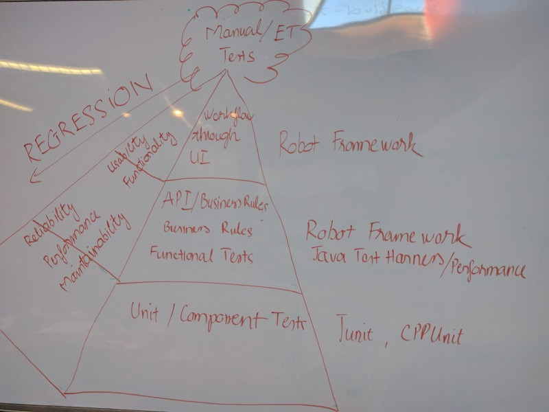

In recent conversations regarding automating tests, It seems to me that the common understanding of the team is that the only acceptable automated test case is through the workflow tests through the UI. As far as I know, that’s not entirely correct and per “Pyramids of Automation” chapter 15 in More Agile Testing, I think there are lots of different ways we can automate test cases. I would like to take the opportunity to describe the pyramids of automation again with some thoughts/questions.

First, let me try to describe the original pyramid again, and here’s the picture that is worth thousands of words

Per the above pyramid from Mike Cohn with some modification in “More Agile Testing”, the lowest level, the unit tests, gets the fastest feedback on every commit which would provide the most benefits. **The higher the tests located in the pyramid texts, the slower the feedback and lower profit we would get from the automated tests.**

**“The test automation pyramid is a model intended to guide teams in getting the most value from their test automation for the minimum investment and with the least overlap/duplication between each pyramid level.”**

Let’s expand the above pyramid with some specific tools/context for our team

With the expanded pyramid tests, we can see that we need to leverage different tools and techniques to do different automated testings at different levels

Given the above pyramids tests, I think there’s still 1 missing piece in the puzzle.

According to How to implement UI Testing without shooting yourselves in the foot, in order to avoid maintenance costs of UI tests, a very good idea when designing UI level functional tests is to think about describing the UI test and the automation at these 3 different levels:

**“The stability in acceptance tests comes from the fact that business rules don’t change as much as technical implementations”**

Technology moves much faster than business. **The closer your acceptance tests are to the business rules, the more stable they are and the more clearer it is to the entire team (QA, Dev, PdM, etc…) on what the systems, products suppose to behave**. The acceptance tests could be written in the form of unit tests, integration tests, UI tests, etc… The team usually would decide if they could automate the acceptance criteria and at what test level they want to automate the acceptance criteria.

As far as I can tell, the problems we often encountered with integration, UI tests are slowness in getting the feedback, hard to diagnose the problems when the tests fail (especially performance tests), flaky tests, etc… As a result, I feel that **the more acceptance tests could be written in the form of unit behavior tests, the better alignment between the code and the business domain/behavior. This could lead to other benefits such as ubiquitous language for the entire team and design test-ability for the system/product and the better design skills of the team working in the system.**

Based on all of the above information, I ask myself, “should we call unit tests as behavior unit tests instead of units tests?”. Yes there is some behavior that is at such a low level that people don’t care about, but there are LOTS of behavior unit tests that in HIGH LEVEL that different stakeholders SHOULD know about

My colleague (David) summarizes this article in the following key points and I couldn’t find a better way to put it together and here it is:

- If we move our conversation around test to business rules we will all have more clarity and will decouple our conversations from the details. We will gain stability (because our terms don’t - change with the technical details) and clarity because we focus on the actual goal
- Thinking at the business rule level allows us to determine if that business rule can be tested at a level lower than the UI
- Some business rules can be tested at the unit test level, in which case we should adopt the term behavioral unit test to help people comprehend that those tests are actually testing business rules.

# References
- https://www.slideshare.net/jbrains/the-next-decade-of-agile-software-development
- https://gojko.net/2010/04/13/how-to-implement-ui-testing-without-shooting-yourself-in-the-foot-2/
- https://watirmelon.blog/2011/06/10/yet-another-software-testing-pyramid/
- https://jamescrisp.org/2011/05/30/automated-testing-and-the-test-pyramid/
- https://martinfowler.com/articles/practical-test-pyramid.html
